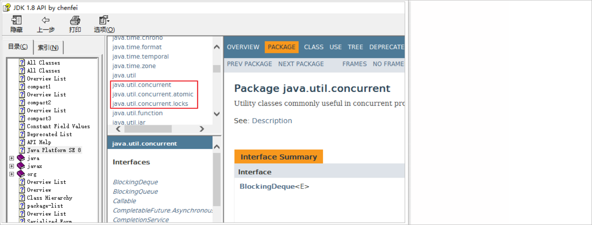
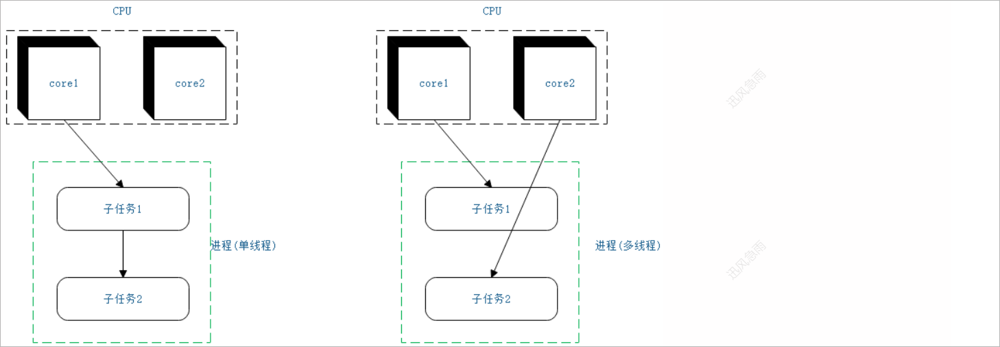
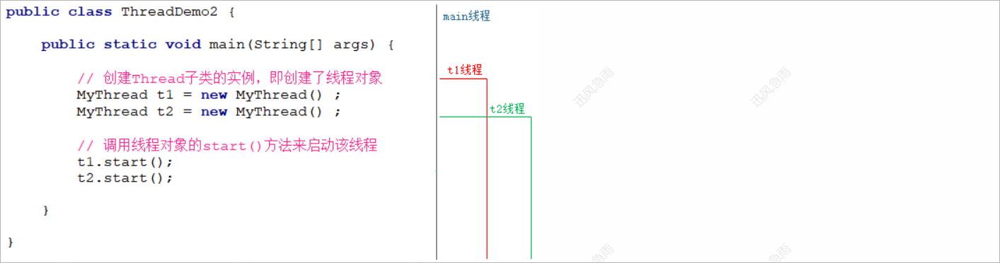
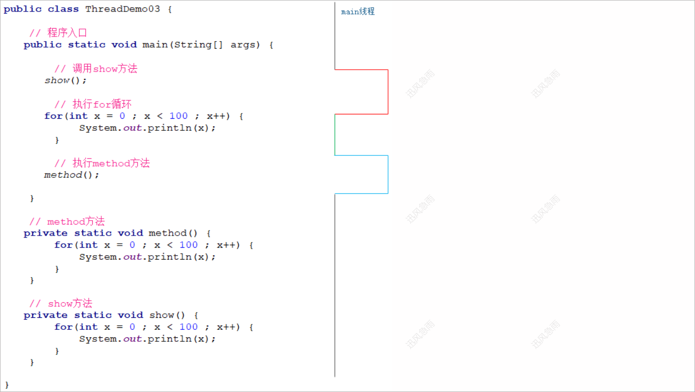
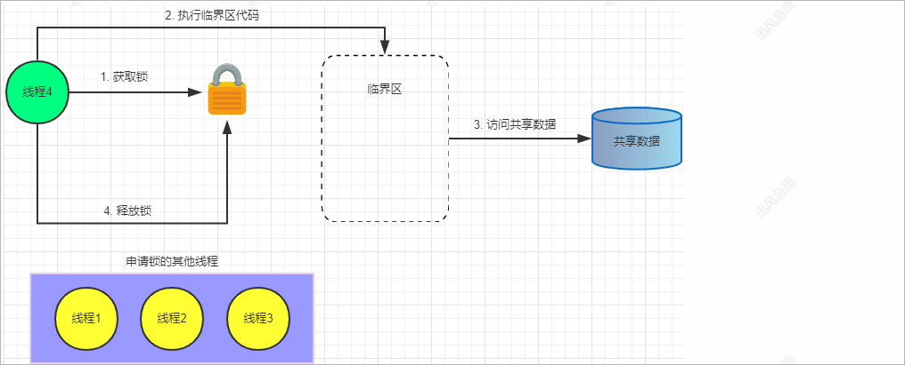
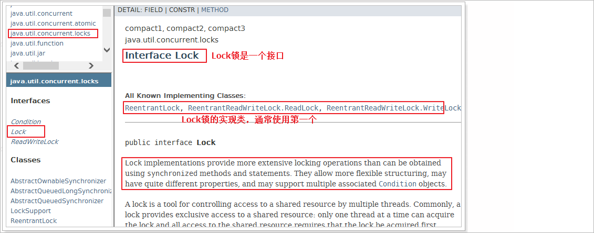
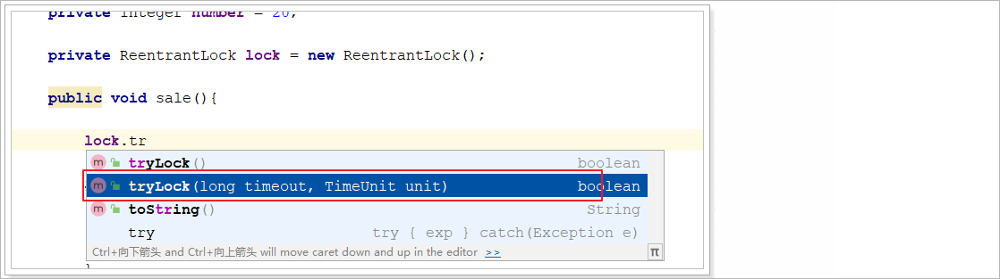

# 1 JUC概述

## 1.1 JUC简介

JUC实际上就是我们对于jdk中**java.util.concurrent**工具包的简称。这个包下的类都是和Java多线程开发相关的类，自jdk1.5后出现。查看JDK的官

方文档如下所示：

 

## 1.2 多线程核心概念

### 1.2.1 进程

#### 进程概述

百度百科中对进程的描述：

 

初看这段文字会觉得十分的抽象，难以理解，但是如果你看到下图所示的内容，那么你应该就能理解什么是进程？

 

难道可以将一个操作系统中正在运行的exe程序理解成一个进程吗？没错；通过查看"windows任务管理器"的列表，完全可以将运行在内存中的exe文件

理解成进程，进程是受操作系统管理的基本的运行单元。


简单的理解：进程就是正在运行的程序


注1：上图就是windows任务管理器，具体的打开方式：在windows任务栏点击鼠标右键，然后在弹出的菜单中选择"任务管理器"打开即可

注2：在演示的时候，可以打开某一个exe程序，然后在查看任务管理器进程列表变化，去演示进程

#### 进程特征

1、独立性：进程是系统中独立存在的实体，它可以拥有自己独立的资源，每一个进程都拥有自己私有的地址空间。进程是操作系统的最小调度单元；

在没有经过进程本身允许的情况下，一个用户进程不可以直接访问其他的进程的地址空间。

2、动态性：进程和程序的区别在于，程序只是一个静态的指令集合，而进程是一个正在系统中活动的指令集合。

3、并发性：多个进程可以在单个CPU上进行并发执行，多个进程之间不会相互影响


并行：在同一时刻，有多个指令在多个CPU上同时执行

并发：在同一时刻，有多个指令在单个CPU上交替执行；（这里所说的同时并不是严格意义上的指同一个时刻，  因为在同一时刻一个CPU只能执行一

个任务）


举例说明并行和并发：

比如吃馒头：现在存在2个馒头，如果有两个人同时进行食用，这个现象就是并行；如果一个人需要同时食用这2个馒头(两个馒头轮流食用)，这个现象

就是并发;


#### 多进程的意义

我们可以看到现在的操作系统可以同时运行多个进程，同时运行多个进程存在有什么意义呢？

我们可以假设现在我们的操作系统只能运行一个进程，那么一个进程能否将系统资源(CPU,内存...)全部使用完毕呢？显然是不可以的，那么也就是说有

一部分的系统资源没有被使用，那么这样就造成了系统资源的浪费。如果我们的操作系统可以同时运行多个进程，那么每个进程都会使用(占用)一部分

的系统资源，那么这样我们所浪费的系统资源就减少了。简单而言多进程的意义就是为了**提高计算机资源的使用率**。

 

总结：多进程的意义就是为了**提高计算机的使用率**！


#### 多进程同时执行的本质

大部分操作系统都支持多进程并发运行：程序员一边使用开发工具写代码，一边打开网页在查API，同时还开着网易云听歌······还没完，每台电脑运行

时还有大量的底层支撑性程序在后台运行······这些进程看上去像是在同时工作。真相是，对于一个CPU而言，他在某个时间点只能执行一个程序，即一

个进程，其实CPU是不断地在这些进程间轮换执行的，由于执行速度相对人的感觉来说过快，所以我们感觉不到而已。


### 1.2.2 线程

#### 线程概述

操作系统可以同时执行多个任务，每个任务就是进程；进程可以同时执行多个任务，每个任务就是线程。线程依赖于进程，线程是进程执行的最小单

元。一个进程至少应该存在一个线程。进程在执行的时候其实执行的是进程中对应的线程。

比如:360安全卫士

 

在360安全卫士中存在很多个功能，每一个功能就可以看做成是一个任务，每一个任务，我们就可以将其看做成一个线程。

#### 多线程的意义

随着处理器上的核心数量越来越多，现在大多数计算机都比以往更加擅长并行计算；而一个线程在一个时刻只能运行在一个处理器核心上；试想一下，

一个单线程程序在运行时只能使用一个处理器核心，那么再多的处理器核心加入也无法显著提升该程序的执行效率。相反，如果该程序使用多线程技

术，将计算逻辑分配到多个处理器核心上，就会显著减少程序的处理时间，并且随着更多处理器核心的加入而变得更有效率；如下图所示：

 

假设我们某一个进程需要执行一个任务，我们可以将这个任务拆分为任务1和任务2；如果这个程序是单线程程序，那么程序在进行执行的时候，可能

只有等到某一个子任务执行完毕以后，在执行另外一个子任务；假设子任务1的执行需要1秒，子任务2的执行需要2秒，那么单线程程序执行完毕是所

需要的时间就是3秒(两个子任务消耗的时间之和)；如果我们的程序是多线程程序，那么每一个子任务可以交由一个线程来进行执行，每一个cup核心会

执行一个线程；那么就相当于两个子任务是同时执行，那么此时两个子任务执行完毕以后需要消耗的时间就是2秒；提高了程序的执行效率；


总结：**使用多线程可以提高程序的执行效率**


# 2 线程的创建方式

## 2.1 继承Thread类

### 2.1.1 代码演示

通过继承Thread类来创建并启动多线程的步骤如下：

1、定义一个类，让其继承Thread类

2、重写Thread类中的的run方法（该run方法的方法体就代表了线程需要完成的任务。因此把run方法称之为线程执行体）

3、创建Thread子类的实例，即创建了线程对象

4、调用线程对象的start()方法来启动该线程

线程类：

```java
public class MyThread extends Thread {

    /**
     * 该run方法的方法体就代表了线程需要完成的任务。因此把run方法称之为线程执行体
     */
    @Override
    public void run() {
        for(int x = 0 ; x < 100 ; x++) {
            System.out.println(x);
        }
    }

}
```

测试类：

```java
public class ThreadDemo1 {

    public static void main(String[] args) {

        // 创建Thread子类的实例，即创建了线程对象
        MyThread t1 = new MyThread() ;

        // 调用线程对象的start()方法来启动该线程
        t1.start();

        /**
         * 调用start方法启动线程，那么此时jvm会分配一个线程去调用MyThread类中的run方法
         */

    }

}
```

如果我们需要再开启一个线程，那么怎么办呢？

1. 再次创建一个线程对象

2. 调用start方法启动线程

```java
public class ThreadDemo2 {

    public static void main(String[] args) {

        // 创建Thread子类的实例，即创建了线程对象
        MyThread t1 = new MyThread() ;
        MyThread t2 = new MyThread() ;

        // 调用线程对象的start()方法来启动该线程
        t1.start();
        t2.start();

    }

}
```

经过测试，查看控制台打印结果；发现多次运行程序的结果并不相同，原因是因为CPU在多个线程间进行切换，随机执行导致的结果。

结论：多线程的执行具有随机性

### 2.1.2 执行图解

**多线程程序执行图解**

当我们执行main方法时候，此时jvm会开启一个线程去执行，一个线程可以看做是程序的一条执行路径；当我们在main方法中又开启了两个线程，并且

将其启动起来，那么此时在程序中会存在3条执行路径。它们之间彼此都是独立的，进行同时执行。

   

**单线程程序执行图解**

对比我们之前所线程的单线程程序，那么程序在执行的时候，只存在一条执行路径

  

### 2.1.3 start和run区别

start方法和run方法的区别如下：

1、调用start方法jvm会开启一个线程(新的路径)去执行run方法中代码，调用run方法就是把run方法当做普通方法去执行，jvm不会去开启一个线程来

​	 执行

2、start方法只能调用一次，run方法可以调用多次

代码演示1

```java
public class ThreadDemo3 {

    // 程序入口
    public static void main(String[] args) {

        // 创建一个线程对象
        MyThread t1 = new MyThread() ;

        // 启动线程
        // t1.start();

        // 调用run方法
        t1.run();          // jvm不会去开启一个线程执行run方法

        // 执行for循环
        for(int x = 0 ; x < 100 ; x++) {
            System.out.println("main ------>>> " + x);
        }

    }

}
```

调用t1对象的run方法时，程序的执行结果就是每一次都是等待run方法执行完毕了，才去执行main方法中的for循环；当调用t1对象的start方法时，程

序的执行结果就就有随机性，因此就说明直接调用run方法jvm就没有去开启一个线程去执行。


**代码演示2**

```java
public class ThreadDemo4 {

    // 程序入口
    public static void main(String[] args) {

        // 创建一个线程对象
        MyThread t1 = new MyThread() ;

        // 调用start方法启动线程
        t1.start();
        t1.start();     

    }

}
```

以上程序会出现如下错误

```java
Exception in thread "main" java.lang.IllegalThreadStateException
	at java.base/java.lang.Thread.start(Thread.java:794)
	at com.itheima.javase.thread.create.demo01.ThreadDemo4.main(ThreadDemo4.java:13)
```


**代码演示3**

```java
public class ThreadDemo5 {

    // 程序入口
    public static void main(String[] args) {

        // 创建一个线程对象
        MyThread t1 = new MyThread() ;

        // 调用run方法
        t1.run();
        t1.run();

    }

}
```

以上程序不会报错，可以进行正常执行。

## 2.2 Thread类核心API

### 2.2.1 线程名称

```java
public final String getName()							// 获取线程名称
public final void setName(String name)					// 调用setName方法设置线程名称
public Thread(String name)							    // 构造方法设置线程名称
```

### 2.2.2 线程对象

获取当前正在执行该方法的线程对象：

```java
public static native Thread currentThread();			// 获取当前执行该线程体的线程对象
```


### 2.2.3 线程休眠

```java
public static void sleep(long time)        				// 让线程休眠指定的时间，单位为毫秒
TimeUnit.时间单位.sleep(时间值);						   // 使用时间枚举类让线程休眠
```


### 2.2.4 线程加入

把某一个线程加入到当前线程的执行流程中。当某一个程序执行流中调用了其他线程的join()方法，调用线程暂停执行，直到被join()方法加入的join线

程执行完成为止。


比如现在存在两个线程，一个t1线程 , 一个是t2线程，当我们t1线程执行到某一个时刻的时候，我们在t1线程的执行流中添加了t2线程，那么此时t1线

程暂停执行，直到t2线程执行完毕以后t1线程才可以继续执行。涉及到的Thread的方法是

```java
public final void join() throws InterruptedException	
```


Thread的子类

```java
public class MyThread extends Thread {

    /**
     * 该run方法的方法体就代表了线程需要完成的任务。因此把run方法称之为线程执行体
     */
    @Override
    public void run() {

        // 在控制台打印1-100
        for(int x = 0 ; x < 100 ; x++) {
            System.out.println(Thread.currentThread().getName() + "----" + x );
        }

    }
    
}
```

测试类

```java
public class ThreadDemo01 {

    public static void main(String[] args) {

        // 我们在主线程的执行流中加入其它线程
        for(int x = 0 ;  x < 100 ; x++) {

            // 当x的值等于20的执行加入其它线程
            if(x == 10) {

                // 创建MyThread线程对象
                MyThread myThread = new MyThread() ;
                myThread.setName("atguigu-01");
                myThread.start();

                // 调用join方法进行线程加入
                try {
                    myThread.join();                    // 需要在线程启动以后在进行加入才有效
                } catch (InterruptedException e) {
                    e.printStackTrace();
                }

            }

            // 主线程执行代码
            System.out.println(Thread.currentThread().getName() + "--------->>" + x);
        }

    }

}
```

控制台输出结果

```java
main--------->>0
main--------->>1
main--------->>2
main--------->>3
main--------->>4
main--------->>5
main--------->>6
main--------->>7
main--------->>8
main--------->>9
atguigu-01 ----->>> 0
atguigu-01 ----->>> 1
atguigu-01 ----->>> 2
atguigu-01 ----->>> 3
atguigu-01 ----->>> 4
....
atguigu-01 ----->>> 98
atguigu-01 ----->>> 99
main--------->>10
main--------->>11
main--------->>12
....
```

通过控制台的输出结果，我们可以看到当主线程输出完9以后，"atguigu-01"线程加入到了主线程的执行流程中，此时主线程处于等待状态。当被加入

的线程执行完毕以后，主线程的阻塞状态才会被消除。刚才我们是在启动完myThread线程以后，在进行加入，此时我们如果是先进行线程加入，然后

在启动线程呢？


测试类

```java
public class ThreadDemo01 {

    public static void main(String[] args) {

        // 我们在主线程的执行流中加入其它线程
        for(int x = 0 ;  x < 100 ; x++) {

            // 当x的值等于20的执行加入其它线程
            if(x == 10) {

                // 创建MyThread线程对象
                MyThread myThread = new MyThread() ;
                myThread.setName("atguigu-01");

                // 调用join方法进行线程加入
                try {
                    myThread.join();                    // 需要在线程启动以后在进行加入才有效
                } catch (InterruptedException e) {
                    e.printStackTrace();
                }

                // 启动线程
                myThread.start();

            }

            // 主线程执行代码
            System.out.println(Thread.currentThread().getName() + "--------->>" + x);
        }

    }

}
```

控制台输出结果

```java
....
main--------->>25
atguigu-01 ----->>> 0
main--------->>26
atguigu-01 ----->>> 1
main--------->>27
...
```

查看控制台的输出，我们发现此时主线程和"atguigu-01"去抢占CPU的执行权，线程的执行是随机执行的。

> 注： 需要在线程启动以后在进行加入才有效

### 2.2.5 线程中断

#### interrupt方法

当我们调用线程的sleep方法或者join方法时，都可以让某一些线程处于等待状态，调用当前线程的interrupt()方法就可以打断该阻塞状态。interrupt

方法不会让线程结束。

```java
public void interrupt();					// 中断线程的阻塞状态
```

此方法会抛出一个InterruptedException异常。


案例：演示中断sleep的等待状态

线程类：

```java
public class MyThread extends Thread {

    @Override
    public void run() {

        for(int x = 0 ; x < 100 ; x++) {
            System.out.println(Thread.currentThread().getName() + "----" + x );
            if(x == 10) {
                try {
                    TimeUnit.SECONDS.sleep(10);     // 线程休眠以后，该线程就处于阻塞状态
                } catch (InterruptedException e) {
                    e.printStackTrace();
                }
            }
        }
    }
}
```

测试类：

```java
public class ThreadDemo1 {

    public static void main(String[] args) {

        // 创建MyThread线程对象
        MyThread t1 = new MyThread();
        t1.setName("atguigu-01");

        // 启动线程
        t1.start();

        try {
            // 主线程休眠2秒
            TimeUnit.SECONDS.sleep(2);
        } catch (InterruptedException e) {
            e.printStackTrace();
        }

        // 中断t1线程的休眠
        t1.interrupt();

    }

}
```

控制台输出结果

```java
...
atguigu-01----10
java.lang.InterruptedException: sleep interrupted
	at java.base/java.lang.Thread.sleep(Native Method)
	at java.base/java.lang.Thread.sleep(Thread.java:339)
	at java.base/java.util.concurrent.TimeUnit.sleep(TimeUnit.java:446)
	at com.itheima.javase.thread.api.demo14.MyThread.run(MyThread.java:14)
atguigu-01----11
...
```

通过控制台的输出结果，我们可以看到interrupted方法并没有去结束当前线程，而是将线程的阻塞状态中断了，中断阻塞状态以后，线程atguigu-01

继续进行执行。

#### stop方法

调用线程的stop方法可以让线程终止执行。

```java
public final void stop()  // 终止线程的执行
```

线程类

```java
public class MyThread extends Thread {

    @Override
    public void run() {

        for(int x = 0 ; x < 100 ; x++) {
            System.out.println(Thread.currentThread().getName() + "----" + x );
            if(x == 10) {
                try {
                    TimeUnit.SECONDS.sleep(10);     // 线程休眠以后，该线程就处于阻塞状态
                } catch (InterruptedException e) {
                    e.printStackTrace();
                }
            }
        }
    }
}
```

测试类

```java
public class ThreadDemo1 {

    public static void main(String[] args) {

        // 创建MyThread线程对象
        MyThread t1 = new MyThread();
        t1.setName("atguigu-01");

        // 启动线程
        t1.start();

        try {
            // 主线程休眠2秒
            TimeUnit.SECONDS.sleep(2);
        } catch (InterruptedException e) {
            e.printStackTrace();
        }

        // 终止线程t1的执行
        t1.stop();

    }

}
```

控制台输出结果

```java
...
atguigu-01----9
atguigu-01----10
```

控制台没有任何异常的的输出，程序结束，"atguigu-01"线程没有继续进行执行。

### 2.2.6 守护线程

#### 概述

有一种线程是在后台运行的，它的任务就是为其他的线程提供服务，这种线程被称之为"后台线程"，又被称之为"守护线程"。JVM的垃圾回收线程就是

典型的后台线程。


后台线程的特征：如果所有的前台线程都死亡，后台线程会自动死亡。当整个JVM中只存在后台线程，那么程序就没有运行的必要了，整个JVM就退

出了。


举例：舞台表演；在舞台中表演的一个个演员我们就可以将其看做成一个个的前台线程，而在后台默默工作的一个个人员，我们可以将其看做成一个个

的后台线程。

#### 默认的守护线程

当我们启动了一个java进程，那么在该进程中会存在很多个后台的线程，我们可以使用jdk自带的工具：**jstack**去查看一个进程中所对应的线程。

**jstack的使用步骤**

```java
先使用jps命令查看现在系统中所存在的java进程。
C:\Users\Administrator>jps

在使用jstack去查询指定进程中所对应的线程
jstack -l 37204(进程id)
```

Thread的子类

```java
public class MyThread extends Thread {

    @Override
    public void run() {

        // 在控制台输出0-100
        for(int x = 0 ; x < 100 ; x++) {
            System.out.println(Thread.currentThread().getName() + "----" + x );
        }

    }

}
```

测试类

```java
public class ThreadDemo1 {

    public static void main(String[] args) {

        // 控制台输出
        System.out.println("程序启动了.............");

        // 让线程休眠1小时
        try {
            TimeUnit.HOURS.sleep(1);
        } catch (InterruptedException e) {
            e.printStackTrace();
        }

    }

}
```

**使用jstack查看该进程中所存在的线程**

 ```java
C:\Users\Administrator> jps		// jps查询当前操作系统中所对应的java进程
7504 ThreadDemo1				// ThreadDemo01程序的信息，7504是该进程所对应的id
8160
11220
9148 Launcher
9308 Jps

C:\Users\Administrator>
 ```

```java
C:\Users\Administrator>jstack -l 7504									// 查看7504进程所对应的信息
    
// 系统时间展示，以及当前jvm信息展示    
2019-10-18 15:35:35
Full thread dump Java HotSpot(TM) 64-Bit Server VM (11+28 mixed mode):

Threads class SMR info:
_java_thread_list=0x0000016cffe07800, length=11, elements={
0x0000016cf0078000, 0x0000016cff1ce800, 0x0000016cff1d8800, 0x0000016cffa52800,
0x0000016cff1fe800, 0x0000016cff1ff800, 0x0000016cffaad000, 0x0000016cffaae000,
0x0000016cff166800, 0x0000016cffd1c800, 0x0000016cffd1d000
}

// 主线程
"main" #1 prio=5 os_prio=0 cpu=281.25ms elapsed=272.76s tid=0x0000016cf0078000 nid=0x1ed4 waiting on condition  [0x0000002e58eff000]
   java.lang.Thread.State: TIMED_WAITING (sleeping)
        at java.lang.Thread.sleep(java.base@11/Native Method)
        at java.lang.Thread.sleep(java.base@11/Thread.java:339)
        at java.util.concurrent.TimeUnit.sleep(java.base@11/TimeUnit.java:446)
        at com.itheima.javase.thread.api.demo15.ThreadDemo1.main(ThreadDemo1.java:14)

   Locked ownable synchronizers:
        - None

// 和垃圾回收相关的线程，是一个后台线程(该线程描述信息中存在daemon标记)
"Reference Handler" #2 daemon prio=10 os_prio=2 cpu=0.00ms elapsed=272.69s tid=0x0000016cff1ce800 nid=0xa70 waiting on condition  [0x0000002e595ff000]
   java.lang.Thread.State: RUNNABLE
        at java.lang.ref.Reference.waitForReferencePendingList(java.base@11/Native Method)
        at java.lang.ref.Reference.processPendingReferences(java.base@11/Reference.java:241)
        at java.lang.ref.Reference$ReferenceHandler.run(java.base@11/Reference.java:213)

   Locked ownable synchronizers:
        - None
// 和垃圾回收方法相关的线程，是一个后台线程(该线程描述信息中存在daemon标记)
"Finalizer" #3 daemon prio=8 os_prio=1 cpu=0.00ms elapsed=272.69s tid=0x0000016cff1d8800 nid=0x1748 in Object.wait()  [0x0000002e596ff000]
   java.lang.Thread.State: WAITING (on object monitor)
        at java.lang.Object.wait(java.base@11/Native Method)
        - waiting on <0x000000008c708f10> (a java.lang.ref.ReferenceQueue$Lock)
        at java.lang.ref.ReferenceQueue.remove(java.base@11/ReferenceQueue.java:155)
        - waiting to re-lock in wait() <0x000000008c708f10> (a java.lang.ref.ReferenceQueue$Lock)
        at java.lang.ref.ReferenceQueue.remove(java.base@11/ReferenceQueue.java:176)
        at java.lang.ref.Finalizer$FinalizerThread.run(java.base@11/Finalizer.java:170)

   Locked ownable synchronizers:
        - None
...

C:\Users\Administrator>
```

通过jstack工具，我们可以查看到在一个java进程中存在了很多的线程，并且很多线程都是后台线程。

#### 设置守护线程

我们可以调用如下方法，将某一个线程设置为守护线程

```java
public final void setDaemon(boolean on)    // 将某一个线程设置为后台线程
```

Thread的子类

```java
public class MyThread extends Thread {

    @Override
    public void run() {

        // 在控制台输出0-100
        for(int x = 0 ; x < 100 ; x++) {
            System.out.println(Thread.currentThread().getName() + "----" + x );
        }

    }

}
```

测试类

```java
public class ThreadDemo01 {

    public static void main(String[] args) {

        // 开启两个线程
        MyThread t1 = new MyThread();
        t1.setName("关羽");

        MyThread t2 = new MyThread();
        t2.setName("张飞");

        // 将关羽线程设置为守护线程
        t1.setDaemon(true);
        t2.setDaemon(true);

        // 启动线程
        t1.start();
        t2.start();

        // 在主线程中编写代码
        Thread.currentThread().setName("刘备");
        for(int x = 0 ;  x < 5 ; x++) {
            System.out.println(Thread.currentThread().getName() + "-----" + x);
        }

        /**
         * 当我们的程序启动起来以后，我们自己主动使用的线程应该是3个，其中主线程不是守护线程，t1和t2是守护线程，当主线程执行完毕以后
         * 那么剩下的线程都是守护线程了jvm就会终止
         */

    }

}
```

控制台输出结果

```java
张飞----0
刘备-----0
关羽----0
刘备-----1
张飞----1
刘备-----2
关羽----1
刘备-----3
张飞----2
刘备-----4
关羽----2
关羽----3
关羽----4
```

最理想的状态就是当主线程执行完毕以后t1线程和t2线程就应该立即结束。但是控制台的输出结果和我们想象的有点不太一样。为什么呢? 因为前台线

程死亡后，JVM会通知后台线程死亡，但从它接收到指令到做出响应，需要一定时间。而在这一段时间内其他线程还可以继续执行。因此控制台我们

看到了上述效果。刚才我们是在启动线程之前，我们将线程设置为了守护线程，可以看到设置生效。我们如果在启动完线程以后再将其设置为守护线

程，再看效果。

```java
public class ThreadDemo01 {

    public static void main(String[] args) {

        // 开启两个线程
        MyThread t1 = new MyThread();
        t1.setName("关羽");

        MyThread t2 = new MyThread();
        t2.setName("张飞");

        // 启动线程
        t1.start();
        t2.start();

        // 将关羽线程设置为守护线程
        t1.setDaemon(true);
        t2.setDaemon(true);

        // 在主线程中编写代码
        Thread.currentThread().setName("刘备");
        for(int x = 0 ;  x < 5 ; x++) {
            System.out.println(Thread.currentThread().getName() + "-----" + x);
        }

    }

}
```

控制台输出结果

```java
Exception in thread "main" java.lang.IllegalThreadStateException
	at java.base/java.lang.Thread.setDaemon(Thread.java:1410)
	at com.itheima.javase.thread.api.demo16.ThreadDemo01.main(ThreadDemo01.java:19)
张飞----0
关羽----0
...
张飞----99
关羽----99
```

首先程序会出现错误，然后我们可以看到其他两个线程都已经执行完毕了，说明设置没有生效。因此就说明要将某一个线程设置为守护线程，必须在启

动线程之前。

## 2.3 实现Runnable接口

### 2.3.1 定义Runnable子类

实现多线程的第二种方式就是借助于Runnable接口进行实现，具体的步骤如下：

1、定义Runnable接口的实现类，并重写该接口的run方法

2、创建Runnable实现类的实例

3、创建Thread对象，然后将第二步创建实例作为参数传递过来

4、调用start方法启动线程

Runnable接口的子类

```java
public class MyRunnable implements Runnable {

    /**
     * 该run方法的方法体就代表了线程需要完成的任务。因此把run方法称之为线程执行体
     */
    @Override
    public void run() {
        for(int x = 0 ; x < 100 ; x++) {
            System.out.println(x);
        }
    }

}
```

测试类

```java
public class ThreadDemo01 {

    public static void main(String[] args) {

        // 创建Runnable的实例对象
        MyRunnable myRunnable = new MyRunnable() ;

        // 创建Thread对象，然后将第二步创建实例作为参数传递过来
        Thread t1 = new Thread(myRunnable) ;

        // 创建线程对象
        Thread t2 = new Thread(myRunnable) ;

        // 调用start方法启动线程
        t1.start();
        t2.start();

    }

}
```

### 2.3.2 匿名内部类实现

```java
public class ThreadDemo01 {

    public static void main(String[] args) {

        // 创建Thread对象，然后将第二步创建实例作为参数传递过来
        Thread t1 = new Thread(new Runnable() {
            @Override
            public void run() {
                // 调用资源方法，完成业务逻辑
            }
        }) ;

        // 创建线程对象
        Thread t2 = new Thread(new Runnable() {
            @Override
            public void run() {
                // 调用资源方法，完成业务逻辑
            }
        }) ;

        // 调用start方法启动线程
        t1.start();
        t2.start();

    }

}
```

### 2.3.3 lambda表达式

#### lambda表达式简介

Lambda 是一个匿名函数，我们可以把 Lambda表达式理解为是一段可以传递的代码（将代码像数据一样进行传递）。可以写出更简洁、更灵活的代

码。作为一种更紧凑的代码风格，使Java的语言表达能力得到了提升。


Lambda 表达式在Java 语言中引入了一个新的语法元素和操作符。这个操作符为 “->” ， 该操作符被称为 Lambda 操作符或剪头操作符。它将 Lambda 

分为两个部分：

1、左侧：指定了Lambda表达式需要的所有参数

2、右侧：指定了Lambda体，即 Lambda表达式要执行的功能


#### lambda表达式入门

在一个方法中调用接口中的方法：传统写法

```java
interface Foo {
    public int add(int x, int y);
}

public class LambdaDemo {
    public static void main(String[] args) {
        Foo foo = new Foo() {
            @Override
            public int add(int x, int y) {
                return x + y;
            }
        };
        System.out.println(foo.add(10, 20));
    }
}
```

接下来，要用lambda表达式改造。其实是改造main方法

```java
public static void main(String[] args) {
    Foo foo = (int x, int y)->{
        return x + y;
    };
    System.out.println(foo.add(10, 20));
}
```

改造口诀：

拷贝小括号()，写死右箭头->，落地大括号{...}

思考：如果Foo接口有多个方法，还能使用lambda表达式吗？


#### 函数式接口

lambda表达式，**必须是函数式接口，必须只有一个抽象方法**，如果**接口只有一个方法**java默认它为**函数式接口**。为了显示的指出该接口是一个函

数式接口，就可以在该接口上添加一个注解：**@FunctionalInterface**


Runnable接口是否可以使用lambda表达式？

```java
@FunctionalInterface
public interface Runnable {
    public abstract void run();
}

public class ThreadDemo01 {

    public static void main(String[] args) {

        // 创建Thread对象，然后将第二步创建实例作为参数传递过来
        Thread t1 = new Thread(() -> {
			// 调用资源方法，完成业务逻辑
       	}) ;

        // 创建线程对象
        Thread t2 = new Thread(() -> {
			// 调用资源方法，完成业务逻辑
       	}) ;

        // 调用start方法启动线程
        t1.start();
        t2.start();

    }

}
```

## 2.4 Callable和FutureTask

### 2.4.1 概述

从java5开始，Java提供了Callable接口，该接口怎么看都像是Runnable接口的增强版，Callable接口提供了一个call，但是call方法比run方法功能更加

强大，call方法可以有返回值。但是我们并不能直接将Callable对象作为Thread的构造方法的参数进行传递，因为Callable不是Runnable。但是java5以

后提供了一个FutureTask，查看其继承体系图，我们可以看到FutureTask是Runnabla的子类。

 

那么我们就可以去创建FutureTask对象，将其作为Thread的构造方法参数进行传递。并且FutureTask对象在创建的时候我们可以为其传递一个

Callable的对象。

实现步骤如下

1、创建一个类实现Callable接口，并重写call方法

2、创建Callable实现类的对象

3、创建FutureTask对象，把第二步创建的对象作为参数进行传递

4、创建Thread对象，把第三步创建的FutureTask对象作为传递进行传递

5、调用start方法启动线程

6、调用FutureTask对象的get方法获取线程执行结果


### 2.4.2 代码实现

需求：开启一个线程计算1-100之和

Callable接口的子类

```java
public class MyCallable implements Callable<Integer> {

    @Override
    public Integer call() throws Exception {

        // 定义统计变量
        int result = 0 ;
        for(int x = 1 ; x <= 100 ; x++) {
            result += x ;
        }

        // 返回
        return result;

    }

}
```

测试类

```java
public class CallableDemo1 {

    public static void main(String[] args) throws ExecutionException, InterruptedException {

        // 创建Callable实现类的对象
        MyCallable myCallable = new MyCallable() ;

        // 创建FutureTask对象，把第二步创建的对象作为参数进行传递
        FutureTask<Integer> futureTask = new FutureTask<Integer>(myCallable) ;

        // 创建Thread对象，把第三步创建的FutureTask对象作为传递进行传递
        Thread thread = new Thread(futureTask) ;

        // 调用start方法启动线程
        thread.start();

        // 调用FutureTask对象的get方法获取线程执行结果
        Integer integer = futureTask.get();
        System.out.println(integer);

    }

}
```

## 2.5 创建线程3种方式比对

刚才我们讲解了通过3种方式去创建多线程，那么我们接下来就针对这3种多线程的创建方法进行一个简要的总结：

1、继承Thread类这种创建方式，代码实现比较简单，但是扩展性比较差(因为Java中的继承只能是单继承)

2、实现Runnable接口或者Callable接口这种方式，代码实现比较繁琐，但是扩展性比较强(我们的任务类还可以继续继承某一个类)

3、继承Thread类的这种方式是把线程和任务进行了合并，实现Runnable接口或者Callable接口这种方式将线程和任务进行了分离，灵活性较强

4、Runnable接口中的run方法没有返回值，Callable中的call方法存在返回值

# 3 线程安全问题

## 3.1 线程安全问题演示

线程安全问题概述：当多个线程对共享数据操作的时候此时就是出现数据错乱的问题，我们把这种问题就称之为线程安全问题！

案例演示：

需求：使用多线程模拟抢红包案例，4个人抢3个红包

代码演示：

```java
// 线程任务类
public class RedPackageThread implements Runnable {

    private static int redPackageCount = 3 ;        // 共享资源

    @Override
    public void run() {
        if(redPackageCount <= 0) {
            System.out.println(Thread.currentThread().getName() + "---->未抢到红包");
        }else {
            try {
                TimeUnit.SECONDS.sleep(1);      // 线程休眠模拟网络卡顿
            } catch (InterruptedException e) {
                e.printStackTrace();
            }
            System.out.println(Thread.currentThread().getName() + "---->抢到了一个红包");
            redPackageCount-- ;
        }
    }

}

// 测试类
public class RedPackageThreadDemo01 {

    public static void main(String[] args) {

        // 创建任务类，定义共享资源
        RedPackageThread redPackageThread = new RedPackageThread() ;

        // 创建线程对象，模拟参与抢红包的人员
        Thread t1 = new Thread(redPackageThread , "张三") ;
        Thread t2 = new Thread(redPackageThread , "李四") ;
        Thread t3 = new Thread(redPackageThread , "王五") ;
        Thread t4 = new Thread(redPackageThread , "赵六") ;

        // 启动线程
        t1.start();
        t2.start();
        t3.start();
        t4.start();

    }

}
```

## 3.2 解决问题思路

解决线程安全的思路： 就是将多个线程对共享数据的并发访问更改为串行访问。串行访问(同步访问)就是指：一个共享数据一次只能被一个线程访

问，该线程访问完毕以后其他的线程才可以访问。要实现共享数据的串行访问，我们就需要使用锁机制来完成。


锁：

1、可以理解为对共享数据进行保护的许可证，对于同一个许可证所保护的共享数据而言，任何线程访问这些共享数据都需要获取许可证。

2、一个线程只有在获取了许可证的情况下才可以访问共享数据，并且一个许可证，一次只能被一个线程所持有。

3、许可证的持有线程在完成对共享数据的访问之后，必须让出其持有的许可证，一便其他线程可以对共享数据进行访问。


相关概念：

1、获取锁：一个线程在访问共享数据之前，我们必须要申请锁，申请锁的这个过程我们将其称之为获取锁

2、锁的持有线程： 一个线程获得了某一个锁，我们就将该线程称之为锁的持有线程

3、临界区：锁的持有线程可以对该锁所保护的共享数据进行访问，访问结束以后该线程就需要释放锁。锁的持有线程在获取锁以后和释放锁之前在这

一段时间内所执行的代码被称之为临界区共享数据只能在临界区内进行访问，因为临界区一次只能被一个线程执行。

  

## 3.3 内部锁(synchronized)

java中的锁包含了内部锁和显示锁。内部锁是通过synchronized关键字实现的 ;显示锁是通过Lock接口来进行实现。

### 3.3.1 synchronized

#### synchronized概述

特点：

1、synchronized关键字可以用来修饰方法(静态和非静态)和代码块。

2、被synchronized修饰的方法被称之为同步方法，被synchronized修饰的代码块被称之同步代码块。

3、同步方法整个方法体都是临界区。同步代码块中所包裹的代码是临界区。

**同步代码块的格式**：

```java
synchronized (对象) {
    
    // 在此代码块中访问共享数据
    
}

该对象可以是任意的对象，这个对象可以简单的理解就是一把锁：但是需要保证多个线程在访问的时候使用的是同一个对象(但是这个对象本质上不是一个锁，专业的术语将其称之为"监视器"(摄像头))
```


**同步方法的格式**

```java
public synchronized void sellTicket(){...}
```


**静态同步方法的格式**

```java
public static synchronized void sellTicket(){...}
```


#### 同步代码块改造

需求：使用同步代码块改造上述的代码，保证多线程操作共享数据的的安全性！

```java
public class RedPackageThread implements Runnable {

    private static int redPackageCount = 3 ;        // 共享资源

    private static final Object lock = new Object() ;

    @Override
    public void run() {

        synchronized (lock) {

            if(redPackageCount <= 0) {
                System.out.println(Thread.currentThread().getName() + "---->未抢到红包");
            }else {
                try {
                    TimeUnit.SECONDS.sleep(1);      // 线程休眠模拟网络卡顿
                } catch (InterruptedException e) {
                    e.printStackTrace();
                }
                System.out.println(Thread.currentThread().getName() + "---->抢到了一个红包");
                redPackageCount-- ;
            }

        }


    }

}
```

注意：多个线程所使用的锁对象必须是同一个！


#### 同步方法改造

```java
private synchronized void getRedPackage() {     // 同步方法

    if(redPackageCount <= 0) {
        System.out.println(Thread.currentThread().getName() + "---->未抢到红包");
    }else {
        try {
            TimeUnit.SECONDS.sleep(1);      // 线程休眠模拟网络卡顿
        } catch (InterruptedException e) {
            e.printStackTrace();
        }
        System.out.println(Thread.currentThread().getName() + "---->抢到了一个红包");
        redPackageCount-- ;
    }
    
}
```


#### 静态同步方法改造

```java
private static synchronized void getRedPackage() {     // 同步方法

    if(redPackageCount <= 0) {
        System.out.println(Thread.currentThread().getName() + "---->未抢到红包");
    }else {
        try {
            TimeUnit.SECONDS.sleep(1);      // 线程休眠模拟网络卡顿
        } catch (InterruptedException e) {
            e.printStackTrace();
        }
        System.out.println(Thread.currentThread().getName() + "---->抢到了一个红包");
        redPackageCount-- ;
    }
}
```


#### synchronized原理

**synchronized同步代码块的情况**  

```java
public class SynchronizedDemo {

    public void method() {

        synchronized (this) {  
            System.out.println("synchronized 代码块");
        }

    }
    
}
```

通过javap查看字节码文件信息，如下所示：

  

从上面我们可以看出：synchronized 同步语句块的实现使用的是 **monitorenter** 和 **monitorexit** 指令，其中monitorenter 指令指向同步代码块的开

始位置，monitorexit 指令则指明同步代码块的结束位置。当执行 monitorenter 指令时，线程试图获取锁也就是获取 monitor(monitor对象存在于每

个Java对象的**对象头**中，synchronized 锁便是通过这种方式获取锁的，也是为什么Java中任意对象可以作为锁的原因) 的持有权。当计数器为0则可

以成功获取，获取后将锁计数器设为1也就是加1。相应的在执行monitorexit 指令后，将锁计数器设为0，表明锁被释放。如果获取对象锁失败，那当

前线程就要阻塞等待，直到锁被另外一个线程释放为止。

**synchronized修饰方法的的情况**

基础代码

```java
public class SynchronizedDemo2 {

    public synchronized void method() {
        System.out.println("synchronized 方法");
    }

}
```

通过javap(javap -v xxx.class)查看字节码文件信息，如下所示：

 

synchronized 修饰的方法并没有 monitorenter 指令和 monitorexit 指令，取得代之的确实是ACC_SYNCHRONIZED 标识，该标识指明了该方法是

一个同步方法，JVM 通过该 **ACC_SYNCHRONIZED**访问标志来辨别一个方法是否声明为同步方法，从而执行相应的同步调用。


#### 锁对象研究

思考问题: 同步代码块、同步方法、静态同步方法的锁对象分别是谁?


基础代码：

```java
class Phone {

    private static final Object obj = new Object() ;

    public void sendemail() {
        synchronized (obj) {
            System.out.println("sendemail");
            try {
                TimeUnit.SECONDS.sleep(5);
                System.out.println("sendemail方法休眠结束...................");
            } catch (InterruptedException e) {
                e.printStackTrace();
            }
        }
    }

    public  void call(){
        synchronized (obj) {
            System.out.println("call");
        }
    }

}

class Lock1 {

    public static void main(String[] args) throws InterruptedException {

        // 创建两个手机对象
        Phone phone01 = new Phone() ;
        Phone phone02 = new Phone() ;

        // 创建第一个线程对象
        Thread t1 = new Thread(() -> {
            phone01.sendemail();
        },"线程一") ;
        t1.start();

        // 线程休眠
        TimeUnit.SECONDS.sleep(1);
        System.out.println("主线程休眠结束...................");

        // 创建第二个线程对象
        Thread t2 = new Thread(() -> {
            phone02.call();
        },"线程二") ;
        t2.start();

    }

}
```

分析上述代码的执行情况。


### 3.3.2 死锁现象

线程死锁是指由于两个或者多个线程互相持有对方所需要的资源，导致这些线程处于等待状态，无法前往执行。

#### 死锁演示

Thread的子类

```java
public class DeadThread extends Thread {

    // 定义成员变量，来切换线程去执行不同步代码块的执行
    private boolean flag ;
    public DeadThread(boolean flag) {
        this.flag = flag ;
    }

    @Override
    public void run() {

        if(flag) {

            synchronized (MyLock.R1) {   
                System.out.println(Thread.currentThread().getName() + "---获取到了R1锁，申请R2锁....");
                synchronized (MyLock.R2) {
                    System.out.println(Thread.currentThread().getName() + "---获取到了R1锁，获取到了R2锁....");
                }
            }

        }else {

            synchronized (MyLock.R2) {	
                System.out.println(Thread.currentThread().getName() + "---获取到了R2锁，申请R1锁....");
                synchronized (MyLock.R1) {
                    System.out.println(Thread.currentThread().getName() + "---获取到了R2锁，获取到了R1锁....");
                }
            }
            
        }

    }

}
```

锁接口

```java
public interface MyLock {

    // 定义锁对象
    public static  final Object R1 = new Object() ;
    public static  final Object R2 = new Object() ;

}
```

测试类

```java
public class DeadThreadDemo1 {

    public static void main(String[] args) {

        // 创建线程对象
        DeadThread deadThread1 = new DeadThread(true) ;
        DeadThread deadThread2 = new DeadThread(false) ;

        // 启动两个线程
        deadThread1.start();
        deadThread2.start();

    }

}
```

控制台输出结果

```java
Thread-0---获取到了R1锁，申请R2锁....
Thread-1---获取到了R2锁，申请R1锁....
```

此时程序并没有结束，这种现象就是死锁现象...线程Thread-0持有R1的锁等待获取R2锁，线程Thread-1持有R2的锁等待获取R1的锁。

#### 死锁诊断

当程序出现了死锁现象，我们应该如何进行诊断呢？使用jdk自带的工具： **jstack**、**jconsole**、**jvisualvm.exe**

对上面的程序使用jstack进行死锁诊断

```java
C:\Users\Administrator>jps
7408
8144 DeadThreadDemo1
3620
9108 Launcher
9180 Jps

C:\Users\Administrator>jstack -l 8144
2019-10-19 14:52:01
Full thread dump Java HotSpot(TM) 64-Bit Server VM (11+28 mixed mode):
...
"Thread-0":
        at com.itheima.javase.security.demo10.DeadThread.run(DeadThread.java:19)
        - waiting to lock <0x000000008c591218> (a java.lang.Object)   // 等待锁0x000000008c591218
        - locked <0x000000008c591208> (a java.lang.Object)			  // 已经拥有的锁0x000000008c591208
"Thread-1":
        at com.itheima.javase.security.demo10.DeadThread.run(DeadThread.java:29)
        - waiting to lock <0x000000008c591208> (a java.lang.Object)   // 等待锁0x000000008c591208
        - locked <0x000000008c591218> (a java.lang.Object)			  // 已经拥有的锁0x000000008c591218

Found 1 deadlock.		// 发现了一个1个死锁


C:\Users\Administrator>
```

## 3.4 显式锁(Lock)

### 3.4.1 显式锁概述

从jdk5开始，Java提供了一种功能更强大的线程同步机制--通过显式定义同步锁对象来实现同步(增强了代码的可读性)。

Lock是一个锁接口，在它下面提供了各种各样的锁（公平锁，非公平锁，共享锁，独占锁……），供我们灵活的使用！

 

### 3.4.2 ReentrantLock

ReentrantLock是Lock接口下的一个子类，被称之为可重入锁。

使用ReentrantLock改造抢红包案例：

```java
public class RedPackageThread implements Runnable {

    private static int redPackageCount = 3 ;        // 共享资源
    private static final Lock lock = new ReentrantLock() ;

    @Override
    public void run() {

        lock.lock();        // 加锁

        if(redPackageCount <= 0) {
            System.out.println(Thread.currentThread().getName() + "---->未抢到红包");
        }else {
            try {
                TimeUnit.SECONDS.sleep(1);      // 线程休眠模拟网络卡顿
            } catch (InterruptedException e) {
                e.printStackTrace();
            }
            System.out.println(Thread.currentThread().getName() + "---->抢到了一个红包");
            redPackageCount-- ;
        }

        lock.unlock();    // 加锁

    }

}
```

### 3.4.3 可重入性

可重入锁又名递归锁，获取锁的线程在执行调用一个需要锁的方法的时候不需要再次获取锁。Java中ReentrantLock和synchronized都是可重入锁，

可重入锁的一个优点是**可一定程度避免死锁**。

例如下列伪代码：

```java
class A {
    
  public synchronized void aa(){
    ......
        bb();
    ......
  }
  public synchronized void bb(){
    ......
  }
}

A a = new A();
a.aa();
```

A类中有两个普通同步方法，都需要对象a的锁。如果是不可重入锁的话，aa方法首先获取到锁，aa方法在执行的过程中需要调用bb方法，此时锁被aa

方法占有，bb方法无法获取到锁，这样就会导致bb方法无法执行，aa方法也无法执行，出现了死锁情况。可重入锁可避免这种死锁的发生。


**测试ReentrantLock锁的可重入性**

给抢红包案例添加检查剩余红包功能

```java
public class RedPackageThread implements Runnable {

    private static int redPackageCount = 3 ;        // 共享资源
    private static final Lock lock = new ReentrantLock() ;

    @Override
    public void run() {

        lock.lock();        // 加锁

        if(redPackageCount <= 0) {
            System.out.println(Thread.currentThread().getName() + "---->未抢到红包");
        }else {
            try {
                TimeUnit.SECONDS.sleep(1);      // 线程休眠模拟网络卡顿
            } catch (InterruptedException e) {
                e.printStackTrace();
            }
            System.out.println(Thread.currentThread().getName() + "---->抢到了一个红包");
            redPackageCount-- ;
            checkReadPackage();
        }

        lock.unlock();    // 加锁

    }

    public void checkReadPackage() {
        lock.lock();        // 加锁
        System.out.println("检查剩余红包.......");
        lock.unlock();
    }

}
```

### 3.4.4 公平性

ReentrantLock还可以实现公平锁。所谓公平锁，**多个线程等待同一个锁时，必须按照申请锁的时间顺序获得锁**。通俗的理解就是谁排队时间最长

谁先执行获取锁。

```java
private static final Lock lock = new ReentrantLock(true) ;
```

控制台输出：

```shell
张三---->抢到了一个红包
检查剩余红包.......
李四---->抢到了一个红包
检查剩余红包.......
王五---->抢到了一个红包
检查剩余红包.......
赵六---->未抢到红包
```

可以看到抢红包的顺序和线程启动的顺序一致。

### 3.4.5 等待可中断

在Lock接口中提供了lockInterruptibly方法来获取锁，lockInterruptibly 方法和 lock 方法类似，当有可用锁时会直接得到锁并立即返回，如果没有

可用锁会一直等待直到获取锁，但和 lock 方法不同，lockInterruptibly 方法在等待获取时，如果遇到线程中断会放弃获取锁。

它的基础用法如下：

```java
@Override
public void run() {

    try {

        // 获取锁
        lock.lockInterruptibly();

        if(redPackageCount <= 0) {
            System.out.println(Thread.currentThread().getName() + "---->未抢到红包");
        }else {
            try {
                TimeUnit.SECONDS.sleep(10);      // 线程休眠模拟网络卡顿
            } catch (InterruptedException e) {
                e.printStackTrace();
            }
            System.out.println(Thread.currentThread().getName() + "---->抢到了一个红包");
            redPackageCount-- ;
        }

    } catch (InterruptedException e) {
        e.printStackTrace();
    } finally {
        // 释放锁
        lock.unlock();
    }

}

// RedPackageThreadDemo01测试类
public class RedPackageThreadDemo01 {

    public static void main(String[] args) throws InterruptedException {

        // 创建任务类，定义共享资源
        RedPackageThread redPackageThread = new RedPackageThread() ;

        // 创建线程对象，模拟参与抢红包的人员
        Thread t1 = new Thread(redPackageThread , "张三") ;
        Thread t2 = new Thread(redPackageThread , "李四") ;
        Thread t3 = new Thread(redPackageThread , "王五") ;
        Thread t4 = new Thread(redPackageThread , "赵六") ;

        // 启动线程
        t1.start();
        t2.start();

        t2.interrupt();         // 中断线程，通知中断t2线程等待获取锁的操作

        t3.start();
        t4.start();

    }

}
```

### 3.4.6 限时等待

这个是什么意思呢？也就是通过我们的tryLock方法来实现，可以选择传入时间参数，表示等待指定的时间，无参则表示立即返回锁申请的结果：true

表示获取锁成功，false表示获取锁失败。我们可以将这种方法用来解决死锁问题。

 

## 3.5 synchronized和Lock区别

区别如下：

1、synchronizedJava的关键字，在jvm层面上实现的锁，Lock是一个接口。

1、synchronized是独占锁，加锁和解锁的过程自动进行，易于操作，但不够灵活。ReentrantLock也是独占锁，加锁和解锁的过程需要手动进行，不

易操作，但非常灵活。

2、synchronized可重入，因为加锁和解锁自动进行，不必担心最后是否释放锁；ReentrantLock也可重入，但加锁和解锁需要手动进行，且次数需一

样，否则其他线程无法获得锁。

3、synchronized不可响应中断，一个线程获取不到锁就一直等着；ReentrantLock可以响应中断。

## 3.6 ReentrantReadWriteLock

### 3.6.1 概述

在并发场景中用于解决线程安全的问题，我们几乎会高频率的使用到独占式锁，通常使用java提供的关键字synchronized或者concurrents包中实现了

Lock接口的ReentrantLock。它们都是独占式获取锁，也就是在同一时刻只有一个线程能够获取锁。而在一些业务场景中，大部分只是读数据，写数据

很少，如果仅仅是读数据的话并不会影响数据正确性（出现脏读），而如果在这种业务场景下，依然使用独占锁的话，很显然这将是出现性能瓶颈的地

方。针对这种读多写少的情况，java还提供了另外一个实现Lock接口的**ReentrantReadWriteLock**(读写锁)。**读写锁允许同一时刻被多个读线程访**

**问，但是在写线程访问时，所有的读线程和其他的写线程都会被阻塞**。

读写锁的特点：

1、写写不可并发

2、读写不可并发

3、写读不可并发

4、读读可以并发

### 3.6.2 读写并发问题演示

接下来以缓存为例用代码演示读写锁，演示读写并发问题：

```java
// 缓存工具类
class MyCache{
    
    private Map<String, String> cache= new HashMap<>();

    public void put(String key, String value){
        try {
            System.out.println(Thread.currentThread().getName() + " 开始写入！");
            Thread.sleep(300);
            cache.put(key, value);
            System.out.println(Thread.currentThread().getName() + " 写入成功！");
        } catch (InterruptedException e) {
            e.printStackTrace();
        } finally {
        }
    }

    public void get(String key){
        try {
            System.out.println(Thread.currentThread().getName() + " 开始读出！");
            Thread.sleep(300);
            String value = cache.get(key);
            System.out.println(Thread.currentThread().getName() + " 读出成功！" + value);
        } catch (InterruptedException e) {
            e.printStackTrace();
        } finally {
        }
    }
}

// 测试类
public class ReentrantReadWriteLockDemo {

    public static void main(String[] args) {

        MyCache cache = new MyCache();

        for (int i = 1; i <= 5; i++) {
            String num = String.valueOf(i);
            // 开启5个写线程
            new Thread(()->{
                cache.put(num, num);
            }, num).start();
        }
        for (int i = 1; i <= 5; i++) {
            String num = String.valueOf(i);
            // 开启5个读线程
            new Thread(()->{
                cache.get(num);
            }, num).start();
        }
    }
}
```

打印结果：多执行几次，就会出现数据读取问题

 

### 3.6.3 读写锁的使用

使用读写锁对上述操作进行改造

```java
class MyCache{
    
    private Map<String, String> cache= new HashMap<>();
    
    // 加入读写锁
    private ReentrantReadWriteLock rwl = new ReentrantReadWriteLock();

    public void put(String key, String value){
        
        // 加写锁
        rwl.writeLock().lock();
        try {
            System.out.println(Thread.currentThread().getName() + " 开始写入！");
            Thread.sleep(500);
            cache.put(key, value);
            System.out.println(Thread.currentThread().getName() + " 写入成功！");
        } catch (InterruptedException e) {
            e.printStackTrace();
        } finally {
            // 释放写锁
            rwl.writeLock().unlock();
        }
    }

    public void get(String key){
        // 加入读锁
        rwl.readLock().lock();
        try {
            System.out.println(Thread.currentThread().getName() + " 开始读出！");
            Thread.sleep(500);
            String value = cache.get(key);
            System.out.println(Thread.currentThread().getName() + " 读出成功！" + value);
        } catch (InterruptedException e) {
            e.printStackTrace();
        } finally {
            // 释放读锁
            rwl.readLock().unlock();
        }
    }
}
```

### 3.6.4 锁降级

**锁降级**：锁降级就是从写锁降级成为读锁。在当前线程拥有写锁的情况下，再次获取到读锁，随后释放写锁的过程就是锁降级。

锁降级使用场景：当多线程情况下，更新完数据要立刻查询刚更新完的数据

**锁升级**：当前线程持有读锁,然后获得写锁,将读锁释放,这样就完成了锁升级，ReentrantReadWriteLock不支持锁升级

这里可以举个例子：

```java
// 锁降级案例
public void test01(){
    rwlock.writeLock().lock();
    System.out.println("获取到写锁。。。。");
    rwlock.readLock().lock();
    System.out.println("获取到读锁----------");
    rwlock.writeLock().unlock();
    System.out.println("释放写锁==============");
    rwlock.readLock().unlock();
    System.out.println("释放读锁++++++++++++++++");
}

// 锁升级案例
public void test02(){
    reentrantReadWriteLock.readLock().lock();
    System.out.println("获取到了读锁....");
    reentrantReadWriteLock.writeLock().lock();			// 线程阻塞
    System.out.println("获取到了写锁....");				
    reentrantReadWriteLock.readLock().unlock();
    System.out.println("释放读锁....");
    reentrantReadWriteLock.writeLock().unlock();
    System.out.println("释放写锁....");
}
```

打印效果：

 

### 3.6.5 读写锁总结

读写锁的特点：

1、支持公平/非公平策略

 

2、支持可重入

1、同一读线程在获取了读锁后还可以获取读锁

2、同一写线程在获取了写锁之后既可以再次获取写锁又可以获取读锁

3、支持锁降级，不支持锁升级

