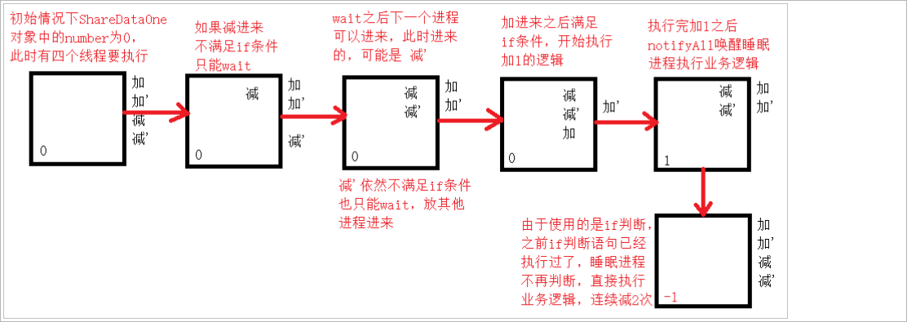
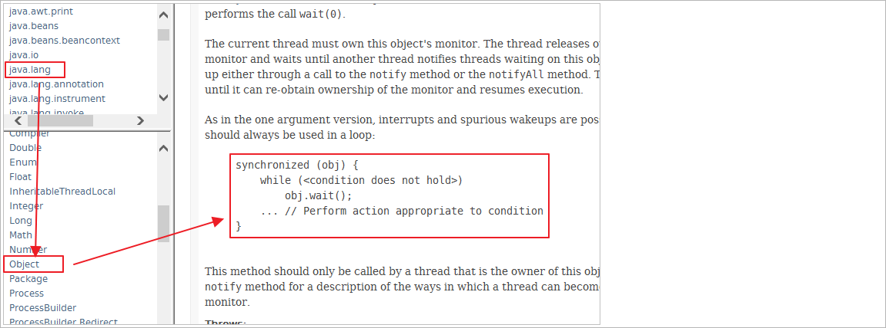
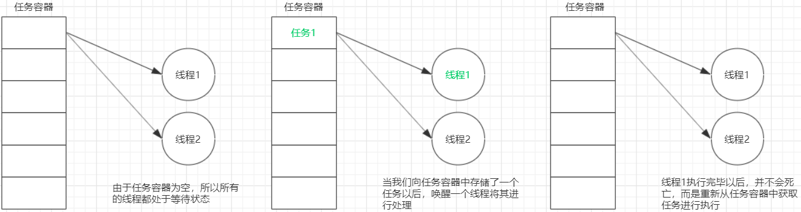
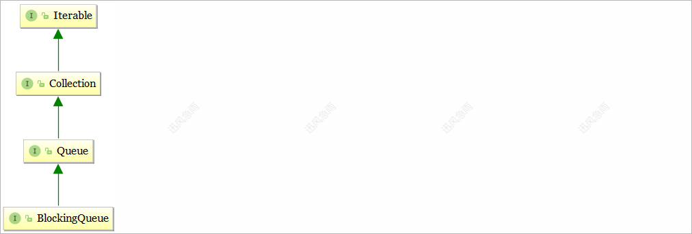
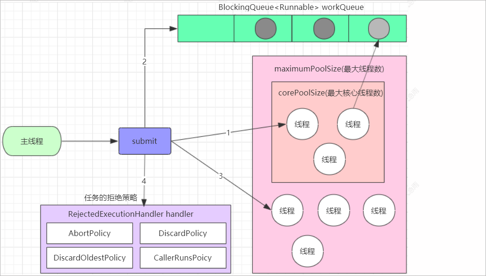
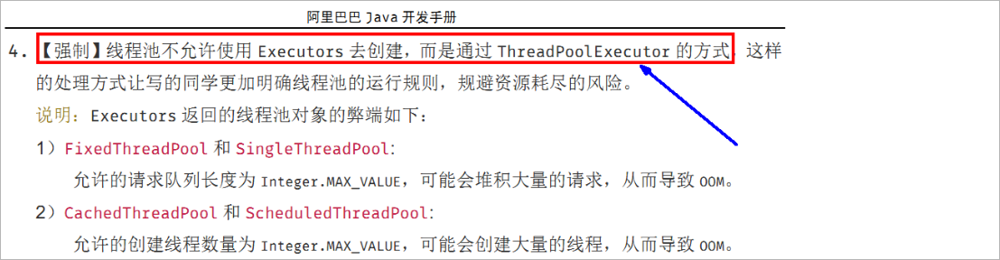
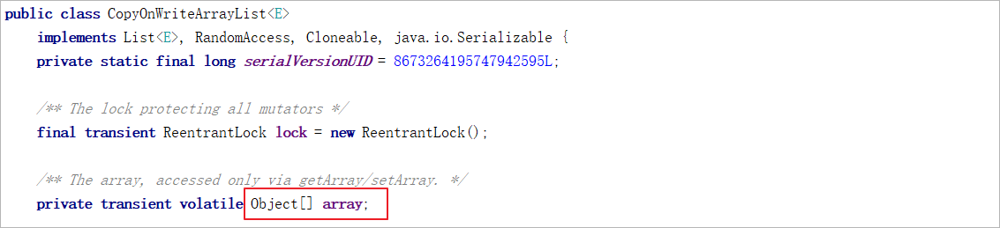
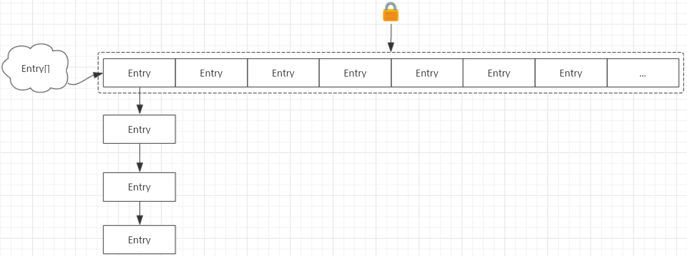
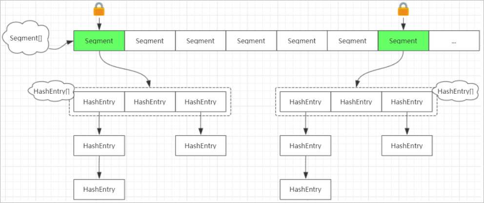
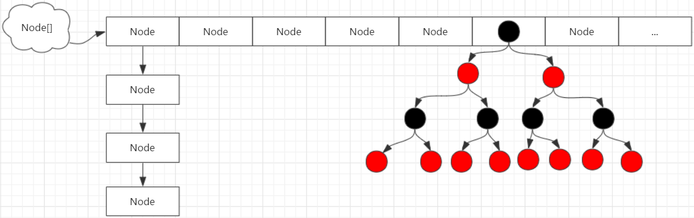

# 1 线程间通讯

线程间通讯概述：线程间通信指的就是让多个线程进行协同工作，来完成特定的任务。

面试题：有两个线程，一个线程打印1-52，另一个打印字母A-Z打印顺序为12A34B...5152Z，要求用线程间通信

## 1.1 入门案例(单生产单消费)

### 1.1.1 需求分析

需求：两个线程操作一个初始值为0的变量，实现一个线程对变量增加1，一个线程对变量减少1，交替10轮。


### 1.1.2 代码演示

**共享变量的类**

```java
// 线程
class ShareDataOne {
    
    private Integer number = 0;

    // 加1方法
    public synchronized void increment() throws InterruptedException {
        
        // 1. 判断
        if (number != 0) {
            this.wait();
        }

        // 2. 干活
        number++;
        System.out.println(Thread.currentThread().getName() + ": " + number);

        // 3. 通知
        this.notifyAll();
    }

    // 减1方法
    public synchronized void decrement() throws InterruptedException {
        
        // 1. 判断
        if (number != 1) {
            this.wait();
        }

        // 2. 干活
        number--;
        System.out.println(Thread.currentThread().getName() + ": " + number);

        // 3. 通知
        this.notifyAll();
        
    }
    
}
```

**测试类**

```java
public class NotifyWaitDemo {

    public static void main(String[] args) {
        
        // 创建ShareDataOne对象
        ShareDataOne shareDataOne = new ShareDataOne();

        // 单线程对number变量进行+1操作10次
        new Thread(()->{
            for (int i = 0; i < 10; i++) {
                try {
                    shareDataOne.increment();
                } catch (InterruptedException e) {
                    e.printStackTrace();
                }
            }
        }, "AAA").start();
        
        // 单线程对number变量进行-1操作10次
        new Thread(()->{
            for (int i = 0; i < 10; i++) {
                try {
                    shareDataOne.decrement();
                } catch (InterruptedException e) {
                    e.printStackTrace();
                }
            }
        }, "BBB").start();

    }
}
```

部分打印结果：AAA和BBB交互执行，执行结果是1 0 1 0... 一共10轮

```java
AAA: 1
BBB: 0
AAA: 1
BBB: 0
AAA: 1
BBB: 0
AAA: 1
BBB: 0
。。。。
```

### 1.1.3 sleep和awit的区别


## 1.2 多生产多消费

### 1.2.1 虚假唤醒问题

#### 问题演示

上述的等待唤醒机制只适用于单生产者和单消费者模型。如果是多生产者多消费者模式，此时就会出现问题。

改造mian方法，加入CCC和DDD两个线程：

```java
public class NotifyWaitDemo {

    public static void main(String[] args) {

        // 创建ShareDataOne对象
        ShareDataOne shareDataOne = new ShareDataOne();

        // 单线程对number变量进行+1操作10次
        new Thread(()->{
            for (int i = 0; i < 10; i++) {
                try {
                    shareDataOne.increment();
                } catch (InterruptedException e) {
                    e.printStackTrace();
                }
            }
        }, "AAA").start();

        // 单线程对number变量进行-1操作10次
        new Thread(()->{
            for (int i = 0; i < 10; i++) {
                try {
                    shareDataOne.decrement();
                } catch (InterruptedException e) {
                    e.printStackTrace();
                }
            }
        }, "BBB").start();


        // 单线程对number变量进行+1操作10次
        new Thread(()->{
            for (int i = 0; i < 10; i++) {
                try {
                    shareDataOne.increment();
                } catch (InterruptedException e) {
                    e.printStackTrace();
                }
            }
        }, "CCC").start();

        // 单线程对number变量进行-1操作10次
        new Thread(()->{
            for (int i = 0; i < 10; i++) {
                try {
                    shareDataOne.decrement();
                } catch (InterruptedException e) {
                    e.printStackTrace();
                }
            }
        }, "DDD").start();

    }
}
```

#### 虚假唤醒说明

换成4个线程会导致错误，**虚假唤醒**

原因：在java多线程判断时，不能用if，程序出事出在了判断上面。

**注意，消费者被唤醒后是从wait()方法（被阻塞的地方）后面执行，而不是重新从同步块开头。**

如下图： 出现-1的情况分析！

 

解决虚假唤醒：查看API，java.lang.Object的wait方法

 

中断和虚假唤醒是可能产生的，所以要用loop循环，if只判断一次，while是只要唤醒就要拉回来再判断一次。

### 1.2.2 问题解决

if换成while

```java
// 线程
class ShareDataOne {

    private Integer number = 0;

    // 加1方法
    public synchronized void increment() throws InterruptedException {

        // 1. 判断
        while (number != 0) {
            this.wait();
        }

        // 2. 干活
        number++;
        System.out.println(Thread.currentThread().getName() + ": " + number);

        // 3. 通知
        this.notifyAll();
    }

    // 减1方法
    public synchronized void decrement() throws InterruptedException {

        // 1. 判断
        while (number != 1) {
            this.wait();
        }

        // 2. 干活
        number--;
        System.out.println(Thread.currentThread().getName() + ": " + number);

        // 3. 通知
        this.notifyAll();

    }

}
```

再次测试，完美解决!


线程间通讯代码模板：

1、判断

2、干活

3、通知

## 1.3 Condition实现通信

如果我们程序不使用synchronized关键字来保证同步，而是直接使用Lock对象来保证同步，此时我们就不能使用wait(),notify(),notifyAll()方法进行线

程通信了。

### 1.3.1 Lock锁改造代码

使用显式锁改造上述线程间通讯代码

```java
// 线程
class ShareDataOne {

    private Integer number = 0;
    private static final ReentrantLock reentrantLock = new ReentrantLock() ;

    // 加1方法
    public void increment() throws InterruptedException {

        reentrantLock.lock();           // 获取锁

        // 1. 判断
        while (number != 0) {
            this.wait();
        }

        // 2. 干活
        number++;
        System.out.println(Thread.currentThread().getName() + ": " + number);

        // 3. 通知
        this.notifyAll();

        // 释放锁
        reentrantLock.unlock();
    }

    // 减1方法
    public void decrement() throws InterruptedException {

        reentrantLock.lock();           // 获取锁

        // 1. 判断
        while (number != 1) {
            this.wait();
        }

        // 2. 干活
        number--;
        System.out.println(Thread.currentThread().getName() + ": " + number);

        // 3. 通知
        this.notifyAll();

        // 释放锁
        reentrantLock.unlock();

    }

}
```

运行测试用例，直接报错

```java
AAA: 1
Exception in thread "AAA" java.lang.IllegalMonitorStateException
	at java.lang.Object.notifyAll(Native Method)
	at com.atguigu.juc.notify.demo02.ShareDataOne.increment(ShareDataOne.java:26)
	at com.atguigu.juc.notify.demo02.NotifyWaitDemo.lambda$main$0(NotifyWaitDemo.java:14)
	at java.lang.Thread.run(Thread.java:748)
```

因为wait(),notify(),notifyAll()这些方法只能通过锁对象进行调用，现在锁对象已经是Lock了，不是this。

### 1.3.2 Condition实现通信

当使用Lock对象来保证同步时，Java提供了一个Condition类来保持协同工作。

Condition实例的获取,需要使用ReentrantLock中的方法

```java
// java.util.concurrent.locks.ReentrantLock
public Condition newCondition()
```

Condition实例对象的方法

```java
void await() throws InterruptedException;			// 等待
void signal();										// 唤起在Lock对象上等待的单个线程
void signalAll();									// 唤起在Lock对象上等待的所有线程
```

注意实现：

1、需要使用同一个Condition对象

2、需要在释放锁之前调用Condition的方法唤醒其他线程


代码改造：

```java
// 线程
class ShareDataOne {

    private Integer number = 0;
    private static final ReentrantLock reentrantLock = new ReentrantLock() ;
    private static final Condition condition = reentrantLock.newCondition() ;

    // 加1方法
    public void increment() throws InterruptedException {

        reentrantLock.lock();           // 获取锁

        // 1. 判断
        while (number != 0) {
            condition.await();
        }

        // 2. 干活
        number++;
        System.out.println(Thread.currentThread().getName() + ": " + number);

        // 3. 通知
        condition.signalAll();

        // 释放锁
        reentrantLock.unlock();
    }

    // 减1方法
    public void decrement() throws InterruptedException {

        reentrantLock.lock();           // 获取锁

        // 1. 判断
        while (number != 1) {
            condition.await();
        }

        // 2. 干活
        number--;
        System.out.println(Thread.currentThread().getName() + ": " + number);

        // 3. 通知
        condition.signalAll();

        // 释放锁
        reentrantLock.unlock();

    }

}
```

### 1.3.3 定制化调用通信

**面试题1**：有两个线程，一个线程打印1-52，另一个打印字母A-Z打印顺序为12A34B...5152Z，要求用线程间通信

代码实现：

```java
public class PrinterData {

    // 定义锁对象
    private static final Lock lock = new ReentrantLock() ;
    private static final Condition condition = lock.newCondition() ;

    // 打印数字的方法
    public void printNumber() {

        // 获取锁
        lock.lock();

        for(int x = 1 ; x <= 52 ; x++) {
            System.out.print(x);
            if(x % 2 == 0) {
                try {
                    condition.await();   // 等待
                } catch (InterruptedException e) {
                    e.printStackTrace();
                }
            }

            // 打印完毕以后进行唤醒
            condition.signalAll();
        }

        // 释放锁
        lock.unlock();

    }

    // 打印字母
    public void printChar() {

        // 获取锁
        lock.lock();

        for(char x = 'A' ; x <= 'Z' ; x++) {
            System.out.print(x);
            condition.signalAll();          // 打印完毕以后进行唤醒
            try {
                condition.await();          // 唤醒完毕以后进行等待
            } catch (InterruptedException e) {
                e.printStackTrace();
            }
        }

        // 释放锁
        lock.unlock();

    }


}


public class PrinterDataDemo01 {

    public static void main(String[] args) {

        // 创建打印数据的对象
        PrinterData printerData = new PrinterData() ;

        // 创建两个线程
        new Thread(() -> {
            printerData.printNumber();
        }).start();

        new Thread(() -> {
            printerData.printChar();
        }).start();

    }


}
```

**面试题2**：多线程之间按顺序调用，实现A->B->C。三个线程启动，

要求如下：AA打印5次，BB打印10次，CC打印15次

​				接着

​				AA打印5次，BB打印10次，CC打印15次

​				。。。打印10轮

分析：

1、有顺序通知（切换线程），需要有标识位

2、判断标志位

3、输出线程名 + 内容

4、修改标识符，通知下一个


代码实现：

```java
public class PrintChar {

    private static final Lock lock = new ReentrantLock() ;
    private static final Condition condition = lock.newCondition() ;
    private static int flag = 1 ;       // 定义标志位

    // 定义打印5次AA的方法
    public void printA() {

        lock.lock();        // 加锁

        while(flag != 1) {
            try {
                condition.await();      // 进行等待
            } catch (InterruptedException e) {
                e.printStackTrace();
            }
        }

        for(int x = 0 ; x < 5 ; x++) {
            System.out.println("AA");
        }

        // 更改标记位为2
        flag = 2 ;

        // 唤醒其他的线程
        condition.signalAll();

        lock.unlock();   // 解锁
    }

    // 定义打印10次AA的方法
    public void printB() {

        lock.lock();        // 加锁

        while(flag != 2) {
            try {
                condition.await();      // 进行等待
            } catch (InterruptedException e) {
                e.printStackTrace();
            }
        }

        for(int x = 0 ; x < 10 ; x++) {
            System.out.println("BB");
        }

        // 更改标记位为3
        flag = 3 ;

        // 唤醒其他的线程
        condition.signalAll();

        lock.unlock();   // 解锁
    }

    // 定义打印15次CC的方法
    public void printC() {

        lock.lock();        // 加锁

        while(flag != 3) {
            try {
                condition.await();      // 进行等待
            } catch (InterruptedException e) {
                e.printStackTrace();
            }
        }

        for(int x = 0 ; x < 15 ; x++) {
            System.out.println("CC");
        }

        // 更改标记位为1
        flag = 1 ;

        // 唤醒其他的线程
        condition.signalAll();

        lock.unlock();   // 解锁
    }

}

public class PrintCharDemo01 {

    public static void main(String[] args) {

        // 创建PrintChar对象
        PrintChar printChar = new PrintChar() ;

        for(int x = 0 ; x < 10 ; x++) {

            // 创建3个线程对象
            new Thread(() -> {
                printChar.printA();
            }).start();

            new Thread(() -> {
                printChar.printB();
            }).start();

            new Thread(() -> {
                printChar.printC();
            }).start();

        }


    }

}
```

# 2 线程池

## 2.1 线程池概述

提到池，大家应该能想到的就是水池。水池就是一个容器，在该容器中存储了很多的水。那么什么是线程池呢？线程池也是可以看做成一个池子，在该

池子中存储很多个线程。


线程池存在的意义：

系统创建一个线程的成本是比较高的，因为它涉及到与操作系统交互，当程序中需要创建大量生存期很短暂的线程时，频繁的创建和销毁线程对系统的

资源消耗有可能大于业务处理是对系统资源的消耗，这样就有点"舍本逐末"了。针对这一种情况，为了提高性能，我们就可以采用线程池。线程池在启

动的时，会创建大量空闲线程，当我们向线程池提交任务的时，线程池就会启动一个线程来执行该任务。等待任务执行完毕以后，线程并不会死亡，而

是再次返回到线程池中称为空闲状态。等待下一次任务的执行。


线程池的优势：线程复用；控制最大并发数；管理线程。

1、降低资源消耗。通过重复利用已创建的线程降低线程创建和销毁造成的销耗。

2、提高响应速度。当任务到达时，任务可以不需要等待线程创建就能立即执行。

3、提高线程的可管理性。线程是稀缺资源，如果无限制的创建，不仅会销耗系统资源，还会降低系统的稳定性，使用线程池可以进行统一的分配，调

优和监控。


## 2.2 自定义线程池

### 2.2.1 线程池的设计思路

线程池的思路和生产者消费者模型是很接近的。

1、准备一个任务容器

2、一次性启动多个(2个)消费者线程

3、刚开始任务容器是空的，所以线程都在wait

4、直到一个外部线程向这个任务容器中扔了一个"任务"，就会有一个消费者线程被唤醒

5、这个消费者线程取出"任务"，并且执行这个任务，执行完毕后，继续等待下一次任务的到来

在整个过程中，都不需要创建新的线程，而是循环使用这些已经存在的线程。

  

### 2.2.2 阻塞队列简介

jdk1.5提供了一个**BlockingQueue**接口，它主要的用途不是作为容器，而是作为多线程协作的工具。

继承体系图：

 

BlockingQueue的特征：

1、当生产者线程试图向BlockingQueue中放入元素时，如果队列已满，则线程被阻塞。

2、当消费者线程试图从BlockingQueue中取元素时，如果队列没有元素，则该线程被阻塞。


和阻塞相关的两个方法：

```java
void put(E e) throws InterruptedException;			// 存数据
E take() throws InterruptedException;				// 取出数据，并移除
```

BlockingQueue的常用子类：

```java
ArrayBlockingQueue:    基于数组实现的有界阻塞队列，有界指的是队列有大小限制
LinkedBlockingQueue:   基于链表实现的无界阻塞队列，并不是绝对的无界(容量：Integer.MAX_VALUE)
```

我们以ArrayBlockingQueue举例来演示一下阻塞队列的使用

```java
public class ArrayBlockingQueueDemo {

    public static void main(String[] args) throws InterruptedException {

        // 创建一个容量为1的阻塞队列
        ArrayBlockingQueue<String> arrayBlockingQueue = new ArrayBlockingQueue<String>(1) ;

        // 存储元素
//        arrayBlockingQueue.put("java");
//        arrayBlockingQueue.put("world");

        // 取元素
        arrayBlockingQueue.put("java");
        System.out.println(arrayBlockingQueue.take());

        System.out.println(arrayBlockingQueue.take());

        // 输出
        System.out.println("程序结束了....");

    }

}
```

### 2.2.3 代码实现

实现思路：

1、创建一个线程池类(ThreadPool)

2、在该类中定义两个成员变量poolSize(线程池初始化线程的个数) , BlockingQueue<Runnable>(任务容器)

3、通过构造方法来创建两个线程对象(消费者线程)，并且启动

4、使用内部类的方式去定义一个线程类(TaskThread),可以提供一个构造方法用来初始化线程名称

5、两个消费者线程需要不断的从任务容器中获取任务，如果没有任务，则线程处于阻塞状态。

6、提供一个方法(submit)向任务容器中添加任务

7、定义测试类进行测试

线程池类

```java
public class ThreadPool {

    // 初始化线程个数
    private static final int DEFAULT_POOL_SIZE = 2 ;

    // 在该类中定义两个成员变量poolSize(线程池初始化线程的个数) , BlockingQueue<Runnable>(任务容器)
    private int poolSize = DEFAULT_POOL_SIZE ;
    private BlockingQueue<Runnable> blockingQueue = new LinkedBlockingQueue<Runnable>() ;

    // 无参构造方法
    public ThreadPool(){
        this.initThread();
    }

    // 有参构造方法，通过构造方法来创建两个线程对象(消费者线程)，并且启动
    public ThreadPool(int poolSize) {
        if(poolSize > 0) {
            this.poolSize = poolSize ;
        }
        this.initThread();
    }

    // 初始化线程方法
    public void initThread(){
        for(int x = 0 ; x < poolSize ; x++) {
            new TaskThread("线程--->" + x).start();
        }
    }

    // 提供一个方法(submit)向任务容器中添加任务
    public void submit(Runnable runnable) {

        try {
            blockingQueue.put(runnable);
        } catch (InterruptedException e) {
            e.printStackTrace();
        }

    }

    // 使用内部类的方式去定义一个线程类
    public class TaskThread extends Thread {

        // 提供一个构造方法，用来初始化线程名称
        public TaskThread(String name) {
            super(name);
        }

        @Override
        public void run() {

            while(true) {

                try {

                    // 两个消费者线程需要不断的从任务容器中获取任务，如果没有任务，则线程处于阻塞状态。
                    Runnable task = blockingQueue.take();
                    task.run();

                } catch (InterruptedException e) {
                    e.printStackTrace();
                }

            }

        }
    }

}
```

测试类

```java
public class ThreadPoolDemo01 {

    public static void main(String[] args) {

        // 创建线程池对象,无参构造方法创建
        // ThreadPool threadPool = new ThreadPool();
        ThreadPool threadPool = new ThreadPool(5);

        // 提交任务
        for(int x = 0 ; x < 10 ; x++) {
            threadPool.submit( () -> {
                System.out.println(Thread.currentThread().getName() + "---->>>处理了任务");
            });
        }

    }

}
```

使用无参构造方法创建线程池对象，控制台输出结果

```java
线程--->0---->>>处理了任务
线程--->1---->>>处理了任务
线程--->0---->>>处理了任务
线程--->1---->>>处理了任务
线程--->0---->>>处理了任务
线程--->1---->>>处理了任务
线程--->0---->>>处理了任务
线程--->1---->>>处理了任务
线程--->0---->>>处理了任务
线程--->1---->>>处理了任务
```

通过控制台的输出，我们可以看到在线程池中存在两个线程，通过这2个线程处理了10个任务。

使用有参构造方法创建线程池对象，传递的参数是5，控制台输出结果

```
线程--->3---->>>处理了任务
线程--->4---->>>处理了任务
线程--->2---->>>处理了任务
线程--->0---->>>处理了任务
线程--->2---->>>处理了任务
线程--->4---->>>处理了任务
线程--->3---->>>处理了任务
线程--->1---->>>处理了任务
线程--->2---->>>处理了任务
线程--->0---->>>处理了任务
```

通过控制台的输出，我们可以看到在线程池中存在两个线程，通过这5个线程处理了10个任务。

## 2.3 JDK中线程池

### 2.3.1 Executors

JDK对线程池也进行了相关的实现，在真实企业开发中我们也很少去自定义线程池，而是使用JDK中自带的线程池。

我们可以使用Executors中所提供的**静态**方法来创建线程池。

<font color="blue" size="3">**获取线程池的方法**</font>：

```java
// 创建一个可缓存线程池，可灵活的去创建线程，并且灵活的回收线程，若无可回收，则新建线程。
ExecutorService newCachedThreadPool()
    
// 初始化一个具有固定数量线程的线程池
ExecutorService newFixedThreadPool(int nThreads)
    
// 初始化一个具有一个线程的线程池
ExecutorService newSingleThreadExecutor()
    
// 初始化一个具有一个线程的线程池，支持定时及周期性任务执行
ScheduledExecutorService newSingleThreadScheduledExecutor()
```

这个方法返回的都是ExecutorService类型的对象(ScheduledExecutorService继承ExecutorService),而ExecutorService可以看做就是一个线程

池，那么ExecutorService给我们提供了哪些方法供我们使用呢？

<font color="blue" size="3">**ExecutorService中的常见方法**</font>：

```java
Future<?> submit(Runnable task)：	提交任务方法
void shutdown()：					关闭线程池的方法	
```


<font color="blue" size="3">**案例1**</font>：演示newCachedThreadPool方法所获取到的线程池的特点

测试类

```java
public class ExecutorsDemo01 {

    // 演示Executors中的newCachedThreadPool返回的线程池的特点
    public static void main(String[] args) throws InterruptedException {

        // 获取线程池对象
        ExecutorService threadPool = Executors.newCachedThreadPool();

        // 提交任务
        threadPool.submit(() -> {
            System.out.println( Thread.currentThread().getName() + "---执行了任务");
        });

        // 提交任务
        threadPool.submit(() -> {
            System.out.println( Thread.currentThread().getName() + "---执行了任务");
        });

        // 不使用线程池了，还可以将线程池关闭
        threadPool.shutdown();

    }

}
```

控制台输出结果

```java
pool-1-thread-2---执行了任务
pool-1-thread-1---执行了任务
```

针对每一个任务，线程池为其分配一个线程去执行，我们可以在第二次提交任务的时候，让主线程休眠一小会儿，看程序的执行结果。

```java
public class ExecutorsDemo02 {

    // 演示Executors中的newCachedThreadPool返回的线程池的特点
    public static void main(String[] args) throws InterruptedException {

        // 获取线程池对象
        ExecutorService threadPool = Executors.newCachedThreadPool();

        // 提交任务
        threadPool.submit(() -> {
            System.out.println( Thread.currentThread().getName() + "---执行了任务");
        });

        // 线程休眠2秒，主线程休眠2秒，此时之前提交的任务应该已经执行完毕
        TimeUnit.SECONDS.sleep(2);

        // 提交任务
        threadPool.submit(() -> {
            System.out.println( Thread.currentThread().getName() + "---执行了任务");
        });

        // 不使用线程池了，还可以将线程池关闭
        threadPool.shutdown();

    }

}
```

控制台输出结果

```java
pool-1-thread-1---执行了任务
pool-1-thread-1---执行了任务
```

我们发现是通过一个线程执行了两个任务。此时就说明线程池中的线程"pool-1-thread-1"被线程池回收了，成为了空闲线程，当我们再次提交任务的

时候，该线程就去执行新的任务。


<font color="blue" size="3">**案例2**</font>：演示newFixedThreadPool方法所获取到的线程池的特点

测试类

```java
public class ExecutorsDemo03 {

    // 演示newFixedThreadPool方法所获取到的线程池的特点
    public static void main(String[] args) {

        // 获取线程池对象,初始化一个具有固定数量线程的线程池
        ExecutorService threadPool = Executors.newFixedThreadPool(3);  // 在该线程池中存在3个线程

        // 提交任务
        for(int x = 0 ; x < 5 ; x++) {
            threadPool.submit( () -> {
                System.out.println(Thread.currentThread().getName() + "----->>>执行了任务" );
            });
        }

        // 关闭线程池
        threadPool.shutdown();
    }

}
```

控制台输出结果

```java
pool-1-thread-1----->>>执行了任务
pool-1-thread-2----->>>执行了任务
pool-1-thread-2----->>>执行了任务
pool-1-thread-2----->>>执行了任务
pool-1-thread-3----->>>执行了任务
```

通过控制台的输出结果，我们可以看到5个任务是通过3个线程进行执行的，说明此线程池中存在三个线程对象


<font color="blue" size="3">**案例3**</font>：演示newSingleThreadExecutor方法所获取到的线程池的特点

测试类

```java
public class ExecutorsDemo04 {

    // 演示newSingleThreadExecutor方法所获取到的线程池的特点
    public static void main(String[] args) {

        // 获取线程池对象,初始化一个具有一个线程的线程池
        ExecutorService threadPool = Executors.newSingleThreadExecutor();

        // 提交任务
        for(int x = 0 ; x < 5 ; x++) {
            threadPool.submit(() -> {
                System.out.println(Thread.currentThread().getName() + "----->>>执行了任务");
            });
        }

        // 关闭线程池
        threadPool.shutdown();
    }

}
```

控制台输出结果

```java
pool-1-thread-1----->>>执行了任务
pool-1-thread-1----->>>执行了任务
pool-1-thread-1----->>>执行了任务
pool-1-thread-1----->>>执行了任务
pool-1-thread-1----->>>执行了任务
```

通过控制台的输出结果，我们可以看到5个任务是通过1个线程进行执行的,说明此线程池中只存在一个线程对象。


<font color="blue" size="3">**案例4**</font>： 演示newSingleThreadScheduledExecutor方法所获取到的线程池的特点(初始化一个具有一个线程的线程池)

测试类

```java
public class ExecutorsDemo05 {

    // 演示：newSingleThreadScheduledExecutor方法所获取到的线程池的第一个特点(初始化一个具有一个线程的线程池)
    public static void main(String[] args) {

        // 获取线程池对象
        ScheduledExecutorService threadPool = Executors.newSingleThreadScheduledExecutor();

        // 提交任务
        for(int x = 0 ; x < 5 ; x++) {
            threadPool.submit(() -> {
                System.out.println(Thread.currentThread().getName() + "---->>执行了任务");
            });
        }

        // 关闭线程池
        threadPool.shutdown();
    }

}
```

控制台输出结果

```java
pool-1-thread-1---->>执行了任务
pool-1-thread-1---->>执行了任务
pool-1-thread-1---->>执行了任务
pool-1-thread-1---->>执行了任务
pool-1-thread-1---->>执行了任务
```

通过控制台的输出结果，我们可以看到5个任务是通过1个线程进行执行的,说明此线程池中只存在一个线程对象。


<font color="blue" size="3">**案例5**</font>： 演示newSingleThreadScheduledExecutor方法所获取到的线程池的特点(支持定时及周期性任务执行)

ScheduledExecutorService中和定时以及周期性执行相关的方法

```java
/*
	定时执行
	command: 任务类对象
	delay  : 延迟多长时间开始执行任务, 任务提交到线程池以后我们需要等待多长时间开始执行这个任务
	unit   : 指定时间操作单元
*/
public ScheduledFuture<?> schedule(Runnable command,long delay, TimeUnit unit);

/*
	周期性执行
	command: 		任务类对象
	initialDelay: 	延迟多长时间开始第一次该执行任务, 任务提交到线程池以后我们需要等待多长时间开始第一次执行这个任务
	period:        	下一次执行该任务所对应的时间间隔
	unit: 			指定时间操作单元
*/
public ScheduledFuture<?> scheduleAtFixedRate(Runnable command, long initialDelay, long period, TimeUnit unit);
```

测试类1(演示定时执行)

```java
public class ExecutorsDemo06 {

    // 演示newSingleThreadScheduledExecutor方法所获取到的线程池的特点(支持定时及周期性任务执行)
    public static void main(String[] args) {

        // 获取线程池对象
        ScheduledExecutorService threadPool = Executors.newSingleThreadScheduledExecutor();

        // 提交任务,10s以后开始执行该任务
        threadPool.schedule( () -> {
            System.out.println(Thread.currentThread().getName() + "---->>>执行了该任务");
        } , 10 , TimeUnit.SECONDS) ;

        // 关闭线程池
        threadPool.shutdown();
    }

}
```

测试类2(演示周期性执行)

```java
public class ExecutorsDemo07 {

    // 演示newSingleThreadScheduledExecutor方法所获取到的线程池的特点(支持定时及周期性任务执行)
    public static void main(String[] args) {

        // 获取线程池对象
        ScheduledExecutorService threadPool = Executors.newSingleThreadScheduledExecutor();

        // 提交任务,10s以后开始第一次执行该任务，然后每隔1秒执行一次
        threadPool.scheduleAtFixedRate( () -> {
            System.out.println(Thread.currentThread().getName() + "---->>>执行了该任务");
        } , 10 ,1, TimeUnit.SECONDS) ;

    }

}
```

### 2.3.2 ThreadPoolExecutor

#### 基本介绍

刚才我们是通过Executors中的静态方法去创建线程池的，通过查看源代码我们发现，其底层都是通过ThreadPoolExecutor构建的。比如：

newFixedThreadPool方法的源码

```java
public static ExecutorService newFixedThreadPool(int nThreads) {
    
    // 创建了ThreadPoolExecutor对象，然后直接返回
	return new ThreadPoolExecutor(nThreads, nThreads,0L, TimeUnit.MILLISECONDS, new LinkedBlockingQueue<Runnable>());
}
```

那么也可以使用ThreadPoolExecutor去创建线程池。

ThreadPoolExecutor最完整的构造方法：

```java
public ThreadPoolExecutor(int corePoolSize,
                              int maximumPoolSize,
                              long keepAliveTime,
                              TimeUnit unit,
                              BlockingQueue<Runnable> workQueue,
                              ThreadFactory threadFactory,
                              RejectedExecutionHandler handler)
```

参数说明

```java
corePoolSize：   核心线程的最大值，不能小于0
maximumPoolSize：最大线程数，不能小于等于0，maximumPoolSize >= corePoolSize
keepAliveTime：  空闲线程最大存活时间,不能小于0
unit：           时间单位
workQueue：      任务队列，不能为null
threadFactory：  创建线程工厂,不能为null      
handler：        任务的拒绝策略,不能为null    
```

**入门案例**

```java
public class ThreadPoolExecutorDemo01 {

    // 演示基本使用
    public static void main(String[] args) {

        // 通过ThreadPoolExecutor创建一个线程池对象
        ThreadPoolExecutor threadPoolExecutor = new ThreadPoolExecutor(1 , 3 , 60 , TimeUnit.SECONDS ,
                new ArrayBlockingQueue<Runnable>(3) , Executors.defaultThreadFactory() , new ThreadPoolExecutor.AbortPolicy()) ;

        /**
         * 以上代码表示的意思是：核心线程池中的线程数量最大为1,整个线程池中最多存在3个线程,空闲线程最大的存活时间为60,时间单位为秒,阻塞队列使用的是有界阻塞队列
         * 容量为3,使用默认的线程工厂;以及默认的任务处理策略
         */

        // 提交任务
        threadPoolExecutor.submit( () -> {
            System.out.println(Thread.currentThread().getName() + "------>>>执行了任务");
        });

        // 关闭线程池
        threadPoolExecutor.shutdown();

    }

}
```

#### 工作原理

如下图所示

 

当我们通过submit方法向线程池中提交任务的时候，具体的工作流程如下：

1、客户端每次提交一个任务，线程池就会在核心线程池中创建一个工作线程来执行这个任务。当核心线程池中的线程已满时，则进入下一步操作。

2、把任务试图存储到工作队列中。如果工作队列没有满，则将新提交的任务存储在这个工作队列里，等待核心线程池中的空闲线程执行。如果工作队

列满了，则进入下个流程。

3、线程池会再次在非核心线程池区域去创建新工作线程来执行任务，直到当前线程池总线程数量超过最大线程数时，就是按照指定的任务处理策略处

理多余的任务。


举例说明：

假如有一个工厂，工厂里面有10个工人(正式员工)，每个工人同时只能做一件任务。因此只要当10个工人中有工人是空闲的，来了任务就分配给空闲的

工人做；当10个工人都有任务在做时，


如果还来了任务，就把任务进行排队等待；如果说新任务数目增长的速度远远大于工人做任务的速度，那么此时工厂主管可能会想补救措施，比如重新

招4个临时工人进来；然后就将任务也分配给这4个临时工人做；如果说着14个工人做任务的速度还是不够，此时工厂主管可能就要考虑不再接收新的

任务或者抛弃前面的一些任务了。当这14个工人当中有人空闲时，而新任务增长的速度又比较缓慢，工厂主管可能就考虑辞掉4个临时工了，只保持原

来的10个工人，毕竟请额外的工人是要花钱的。


这里的工厂可以看做成是一个线程池，每一个工人可以看做成是一个线程。其中10个正式员工，可以看做成是核心线程池中的线程，临时工就是非核

心线程池中的线程。当临时工处于空闲状态的时候，那么如果空闲的时间超过keepAliveTime所指定的时间，那么就会被销毁。


#### 原理测试

接下来我们就通过一段代码的断点测试，来演示一下线程池的工作原理。

案例代码

```java
public class ThreadPoolExecutorDemo01 {

    public static void main(String[] args) {

        /**
         * 核心线程数量为1 ， 最大线程池数量为3, 任务容器的容量为1 ,空闲线程的最大存在时间为20s
         */
        ThreadPoolExecutor threadPoolExecutor = new ThreadPoolExecutor(1 , 3 , 20 , TimeUnit.SECONDS ,
                new ArrayBlockingQueue<>(1) , Executors.defaultThreadFactory() , new ThreadPoolExecutor.AbortPolicy()) ;

        // 提交3个任务，此时会产生一个核心线程,一个临时工线程，队列中会存在一个任务，20s后临时工线程被回收，核心线程不会被回收
        for(int x = 0 ; x < 3 ; x++) {
            threadPoolExecutor.submit(() -> {		// 断点位置
                System.out.println(Thread.currentThread().getName() + "---->> 执行了任务");
            });
        }

    }

}
```

初次debug方式启动线程，查看变量值

 

由于此时还没有提交任务，因此线程池中的线程数量为0，工作队列的任务数量也为0；提交一个任务

 

再次查看各个值的变化

 

再次提交一个任务

 

再次查看各个值的变化

 

此时会把第二个任务存储到工作队列中，因此工作队列的值为1了。再次提交一个任务

 

再次查看各个值的变化

 

此时3个任务都以及提交完毕，断点跳过。经过20s以后，再次查看该进程中的线程。

 

 我们发现非核心线程已经被线程池回收了。


#### 任务的拒绝策略

RejectedExecutionHandler是jdk提供的一个任务拒绝策略接口，它下面存在4个子类。

```java
ThreadPoolExecutor.AbortPolicy: 		    丢弃任务并抛出RejectedExecutionException异常。是默认的策略。
ThreadPoolExecutor.DiscardPolicy： 		   丢弃任务，但是不抛出异常 这是不推荐的做法。
ThreadPoolExecutor.DiscardOldestPolicy：    抛弃队列中等待最久的任务 然后把当前任务加入队列中。
ThreadPoolExecutor.CallerRunsPolicy:        调用任务的run()方法绕过线程池直接执行。
```

注：明确线程池对多可执行的任务数 = 队列容量 + 最大线程数


**案例演示1**：演示ThreadPoolExecutor.AbortPolicy任务处理策略

```java
public class ThreadPoolExecutorDemo01 {

    public static void main(String[] args) {

        /**
         * 核心线程数量为1 ， 最大线程池数量为3, 任务容器的容量为1 ,空闲线程的最大存在时间为20s
         */
        ThreadPoolExecutor threadPoolExecutor = new ThreadPoolExecutor(1 , 3 , 20 , TimeUnit.SECONDS ,
                new ArrayBlockingQueue<>(1) , Executors.defaultThreadFactory() , new ThreadPoolExecutor.AbortPolicy()) ;

        // 提交5个任务，而该线程池最多可以处理4个任务，当我们使用AbortPolicy这个任务处理策略的时候，就会抛出异常
        for(int x = 0 ; x < 5 ; x++) {
            threadPoolExecutor.submit(() -> {
                System.out.println(Thread.currentThread().getName() + "---->> 执行了任务");
            });
        }

    }

}
```

控制台输出结果

```java
Exception in thread "main" java.util.concurrent.RejectedExecutionException: Task java.util.concurrent.FutureTask@566776ad[Not completed, task = java.util.concurrent.Executors$RunnableAdapter@edf4efb[Wrapped task = com.itheima.javase.thread.pool.demo04.ThreadPoolExecutorDemo01$$Lambda$14/0x0000000100066840@2f7a2457]] rejected from java.util.concurrent.ThreadPoolExecutor@6108b2d7[Running, pool size = 3, active threads = 3, queued tasks = 1, completed tasks = 0]
	at java.base/java.util.concurrent.ThreadPoolExecutor$AbortPolicy.rejectedExecution(ThreadPoolExecutor.java:2055)
	at java.base/java.util.concurrent.ThreadPoolExecutor.reject(ThreadPoolExecutor.java:825)
	at java.base/java.util.concurrent.ThreadPoolExecutor.execute(ThreadPoolExecutor.java:1355)
	at java.base/java.util.concurrent.AbstractExecutorService.submit(AbstractExecutorService.java:118)
	at com.itheima.javase.thread.pool.demo04.ThreadPoolExecutorDemo01.main(ThreadPoolExecutorDemo01.java:20)
pool-1-thread-1---->> 执行了任务
pool-1-thread-3---->> 执行了任务
pool-1-thread-2---->> 执行了任务
pool-1-thread-3---->> 执行了任务
```

控制台报错，仅仅执行了4个任务，有一个任务被丢弃了


**案例演示2**：演示ThreadPoolExecutor.DiscardPolicy任务处理策略

```java
public class ThreadPoolExecutorDemo02 {

    public static void main(String[] args) {

        /**
         * 核心线程数量为1 ， 最大线程池数量为3, 任务容器的容量为1 ,空闲线程的最大存在时间为20s
         */
        ThreadPoolExecutor threadPoolExecutor = new ThreadPoolExecutor(1 , 3 , 20 , TimeUnit.SECONDS ,
                new ArrayBlockingQueue<>(1) , Executors.defaultThreadFactory() , new ThreadPoolExecutor.DiscardPolicy()) ;

        // 提交5个任务，而该线程池最多可以处理4个任务，当我们使用DiscardPolicy这个任务处理策略的时候，控制台不会报错
        for(int x = 0 ; x < 5 ; x++) {
            threadPoolExecutor.submit(() -> {
                System.out.println(Thread.currentThread().getName() + "---->> 执行了任务");
            });
        }

    }
}
```

控制台输出结果

```java
pool-1-thread-1---->> 执行了任务
pool-1-thread-1---->> 执行了任务
pool-1-thread-3---->> 执行了任务
pool-1-thread-2---->> 执行了任务
```

控制台没有报错，仅仅执行了4个任务，有一个任务被丢弃了


**案例演示3**：演示ThreadPoolExecutor.DiscardOldestPolicy任务处理策略

```java
public class ThreadPoolExecutorDemo03 {

    public static void main(String[] args) {

        /**
         * 核心线程数量为1 ， 最大线程池数量为3, 任务容器的容量为1 ,空闲线程的最大存在时间为20s
         */
        ThreadPoolExecutor threadPoolExecutor;
        threadPoolExecutor = new ThreadPoolExecutor(1 , 3 , 20 , TimeUnit.SECONDS ,
                new ArrayBlockingQueue<>(1) , Executors.defaultThreadFactory() , new ThreadPoolExecutor.DiscardOldestPolicy());

        // 提交5个任务
        for(int x = 0 ; x < 5 ; x++) {

            // 定义一个变量，来指定指定当前执行的任务;这个变量需要被final修饰
            final int y = x ;
            threadPoolExecutor.submit(() -> {
                System.out.println(Thread.currentThread().getName() + "---->> 执行了任务" + y);
            });
            
        }

    }
}
```

控制台输出结果

```java
pool-1-thread-2---->> 执行了任务2
pool-1-thread-1---->> 执行了任务0
pool-1-thread-3---->> 执行了任务3
pool-1-thread-1---->> 执行了任务4
```

由于任务1在线程池中等待时间最长，因此任务1被丢弃。


**案例演示4**：演示ThreadPoolExecutor.CallerRunsPolicy任务处理策略

```java
public class ThreadPoolExecutorDemo04 {

    public static void main(String[] args) {

        /**
         * 核心线程数量为1 ， 最大线程池数量为3, 任务容器的容量为1 ,空闲线程的最大存在时间为20s
         */
        ThreadPoolExecutor threadPoolExecutor;
        threadPoolExecutor = new ThreadPoolExecutor(1 , 3 , 20 , TimeUnit.SECONDS ,
                new ArrayBlockingQueue<>(1) , Executors.defaultThreadFactory() , new ThreadPoolExecutor.CallerRunsPolicy());

        // 提交5个任务
        for(int x = 0 ; x < 5 ; x++) {
            threadPoolExecutor.submit(() -> {
                System.out.println(Thread.currentThread().getName() + "---->> 执行了任务");
            });

        }

    }

}
```

控制台输出结果

```java
pool-1-thread-1---->> 执行了任务
pool-1-thread-3---->> 执行了任务
pool-1-thread-2---->> 执行了任务
pool-1-thread-1---->> 执行了任务
main---->> 执行了任务
```

通过控制台的输出，我们可以看到次策略没有通过线程池中的线程执行任务，而是直接调用任务的run()方法绕过线程池直接执行。


#### 线程池的选择

在《阿里巴巴java开发手册》中指出了线程资源必须通过线程池提供，不允许在应用中自行显示的创建线程，这样一方面是线程的创建更加规范，可以

合理控制开辟线程的数量；另一方面线程的细节管理交给线程池处理，优化了资源的开销。而线程池不允许使用Executors去创建，而要通过

ThreadPoolExecutor方式，这一方面是由于jdk中Executor框架虽然提供了如newFixedThreadPool()、newSingleThreadExecutor()、

newCachedThreadPool()等创建线程池的方法，但都有其局限性，不够灵活；使用ThreadPoolExecutor有助于大家明确线程池的运行规则，创建符合

自己的业务场景需要的线程池，避免资源耗尽的风险。

 

# 3 并发容器类

面试题：请举例说明集合类是不安全的。

## 3.1 ArrayList线程不安全

### 3.1.1 问题演示

我们一起先看看下面的程序吧，看你能看出什么问题吗？

```java
public class NotSafeDemo {

    public static void main(String[] args) {

        List<String> list = new ArrayList<>();
        for (int i = 0; i < 20; i++) {
            new Thread(() -> {
                list.add(UUID.randomUUID().toString());
                System.out.println(list);
            }, "线程" + i).start();
        }

    }
}
```

你觉得能每次都能正常输出吗？

答案是否定的，也许好几次运行程序都不会出错，但是偶尔就会遇上一次的。会报一个ConcurrentModificationException的异常，中文名为：并发修

改异常。

### 3.1.2 问题说明

JDK8的源码：

```java
// 添加方法的源码
public boolean add(E e) {
    ensureCapacityInternal(size + 1);  // Increments modCount!!
    elementData[size++] = e;
    return true;
}

// 进行输出的时候调用的是toString方法，ArrayList集合的toString方法的源码
public String toString() {
    Iterator<E> it = iterator();		// 获取迭代器进行遍历操作
    if (! it.hasNext())
        return "[]";

    StringBuilder sb = new StringBuilder();
    sb.append('[');
    for (;;) {
        E e = it.next();
        sb.append(e == this ? "(this Collection)" : e);
        if (! it.hasNext())
            return sb.append(']').toString();
        sb.append(',').append(' ');
    }
}

// 获取迭代器方法
public Iterator<E> iterator() {
    return new Itr();
}

// ArrayList集合内部类的Itr迭代器
private class Itr implements Iterator<E> {

    int expectedModCount = modCount; // 将实际修改的次数赋值给期望修改的次数

    public E next() {
        checkForComodification();  // 进行修改检查
        int i = cursor;
        if (i >= size)
            throw new NoSuchElementException();
        Object[] elementData = ArrayList.this.elementData;
        if (i >= elementData.length)
            throw new ConcurrentModificationException();
        cursor = i + 1;
        return (E) elementData[lastRet = i];
    }

    final void checkForComodification() {
        if (modCount != expectedModCount)		// 如果实际修改的次数和期望修改的次数不一致，那么此时抛出异常
            throw new ConcurrentModificationException();
    }
    
}
```

### 3.1.3 解决方案

#### 使用Vector

我们可以使用Vector来代替ArrayList，Vector是线程的安全的，改用Vector进行测试：

```java
List<String> list = new Vector<>();
for (int i = 0; i < 20; i++) {
    new Thread(() -> {
        list.add(UUID.randomUUID().toString());
        System.out.println(list);
    }, "线程" + i).start();
}
```

Vector的源码分析：

```java
public synchronized boolean add(E e) {		// 添加元素方法加锁
    modCount++;
    ensureCapacityHelper(elementCount + 1);
    elementData[elementCount++] = e;
    return true;
}

// 迭代器获取元素的方法
public E next() {
    synchronized (Vector.this) {		// 加锁方法
        checkForComodification();
        int i = cursor;
        if (i >= elementCount)
            throw new NoSuchElementException();
        cursor = i + 1;
        return elementData(lastRet = i);
    }
}
```

#### 使用Collections

Collections 提供了方法 synchronizedList 保证 list 是同步线程安全的。

Collections 仅包含对集合进行操作或返回集合的静态方法，所以我们通常也称Collections 为集合的工具类。

```java
List list = Collections.synchronizedList(new ArrayList<>());
for (int i = 0; i < 20; i++) {
    new Thread(() -> {
        list.add(UUID.randomUUID().toString());
        System.out.println(list);
    }, "线程" + i).start();
}
```

synchronizedList方法源码分析：

```java
// 将list集合变成线程安全的list集合
public static <T> List<T> synchronizedList(List<T> list) {
    return (list instanceof RandomAccess ?
            new SynchronizedRandomAccessList<>(list) :
            new SynchronizedList<>(list));
}

// SynchronizedRandomAccessList集合集成体系结构
static class SynchronizedRandomAccessList<E> extends SynchronizedList<E> implements RandomAccess {}

// SynchronizedList集成体系结构
static class SynchronizedList<E> extends SynchronizedCollection<E> implements List<E> {}

// SynchronizedCollection中相关方法
// java.util.Collections.SynchronizedCollection
public boolean add(E e) {
    synchronized (mutex) {return c.add(e);}
}

public String toString() {
    synchronized (mutex) {return c.toString();}
}
```

第三中解决方案，使用CopyOnWrite容器。

## 3.2 CopyOnWrite容器

### 3.2.1 CopyOnWrite容器简介

什么是CopyOnWrite容器

​		**CopyOnWrite容器**（简称COW容器）即**写时复制**的容器。通俗的理解是当我们往一个容器添加元素的时候，不直接往当前容器添加，而是先

将当前容器进行Copy，复制出一个新的容器，然后新的容器里添加元素，添加完元素之后，再将原容器的引用指向新的容器。这样做的好处是我们可

以对CopyOnWrite容器进行并发的读，而不需要加锁，因为当前容器不会添加任何元素。所以**CopyOnWrite容器也是一种读写分离的思想，读和**

**写不同的容器**。

​		从JDK1.5开始Java并发包里提供了两个使用CopyOnWrite机制实现的并发容器,它们是CopyOnWriteArrayList和CopyOnWriteArraySet。

先看看CopyOnWriteArrayList类，在其内部维护了一个数组，因此本质上还是一个数组

 

再来看看CopyOnWriteArrayList的add方法，该方法使用了可重入锁，因此是线程安全的：

 

### 3.2.2 代码改造

使用CopyOnWriteArrayList改造上述代码：

```java
List list = new CopyOnWriteArrayList() ;
for (int i = 0; i < 20; i++) {
    new Thread(() -> {
        list.add(UUID.randomUUID().toString());
        System.out.println(list);
    }, "线程" + i).start();
}
```

### 3.2.3 特点介绍

**使用场景**：CopyOnWrite并发容器用于**读多写少**的并发场景。比如：白名单，黑名单。假如我们有一个搜索网站，用户在这个网站的搜索框中，

输入关键字搜索内容，但是某些关键字不允许被搜索。这些不能被搜索的关键字会被放在一个黑名单当中，黑名单一定周期才会更新一次。


**特点介绍**：

1、更新操作开销大（add()、set()、remove()等等），因为要复制整个数组

2、是线程安全的。

3、它最适合于具有以下特征的应用程序：List 大小通常保持很小，只读操作远多 于可变操作，需要在遍历期间防止线程间的冲突。

4、独占锁效率低：采用读写分离思想

5、写线程获取到锁，其他写线程阻塞

6、复制思想


当然，这个时候会抛出来一个新的问题，也就是数据不一致的问题。如果写线程还没来得及写进内存，那么其他的线程就会读到了脏数据。


## 3.3 ConcurrentHashMap容器

### 3.3.1 概述以及基本使用

在集合类中HashMap是比较常用的集合对象，但是HashMap是线程不安全的(多线程环境下可能会存在问题)。为了保证数据的安全性我们可以使用

Hashtable，但是Hashtable的效率低下。

基于以上两个原因我们可以使用JDK1.5以后所提供的ConcurrentHashMap。


**案例1**：演示HashMap线程不安全

实现步骤

1、创建一个HashMap集合对象

2、创建两个线程对象，第一个线程对象向集合中添加元素(1-24),第二个线程对象向集合中添加元素(25-50);

3、主线程休眠1秒，以便让其他两个线程将数据填装完毕

4、从集合中找出键和值不相同的数据

测试类

```java
public class HashMapDemo01 {

    public static void main(String[] args) {

        // 创建一个HashMap集合对象
        HashMap<String , String> hashMap = new HashMap<String , String>() ;

        // 创建两个线程对象,我们本次使用匿名内部类的方式去常见线程对象
        Thread t1 = new Thread() {

            @Override
            public void run() {

                // 第一个线程对象向集合中添加元素(1-24)
                for(int x = 1 ; x < 25 ; x++) {
                    hashMap.put(String.valueOf(x) , String.valueOf(x)) ;
                }

            }

        };

        // 线程t2
        Thread t2 = new Thread() {

            @Override
            public void run() {

                // 第二个线程对象向集合中添加元素(25-50)
                for(int x = 25 ; x < 51 ; x++) {
                    hashMap.put(String.valueOf(x) , String.valueOf(x)) ;
                }

            }

        };

        // 启动线程
        t1.start();
        t2.start();

        System.out.println("----------------------------------------------------------");

        try {

            // 主线程休眠2s，以便让其他两个线程将数据填装完毕
            TimeUnit.SECONDS.sleep(2);

        } catch (InterruptedException e) {
            e.printStackTrace();
        }

        // 从集合中找出键和值不相同的数据
        for(int x = 1 ; x < 51 ; x++) {

            // HashMap中的键就是当前循环变量的x这个数据的字符串表现形式 ， 根据键找到值，然后在进行判断
            if( !String.valueOf(x).equals( hashMap.get(String.valueOf(x)) ) ) {
                System.out.println(String.valueOf(x) + ":" + hashMap.get(String.valueOf(x)));
            }

        }


    }

}
```

控制台输出结果

````java
----------------------------------------------------------
5:null
````

通过控制台的输出结果，我们可以看到在多线程操作HashMap的时候，可能会出现线程安全问题。

注意：需要多次运行才可以看到具体的效果; 可以使用循环将代码进行改造，以便让问题方便的暴露出来！


**案例2**：演示Hashtable线程安全

测试类

```java
public class HashtableDemo01 {

    public static void main(String[] args) {

        // 创建一个Hashtable集合对象
        Hashtable<String , String> hashtable = new Hashtable<String , String>() ;

        // 创建两个线程对象,我们本次使用匿名内部类的方式去常见线程对象
        Thread t1 = new Thread() {

            @Override
            public void run() {

                // 第一个线程对象向集合中添加元素(1-24)
                for(int x = 1 ; x < 25 ; x++) {
                    hashtable.put(String.valueOf(x) , String.valueOf(x)) ;
                }

            }

        };

        // 线程t2
        Thread t2 = new Thread() {

            @Override
            public void run() {

                // 第二个线程对象向集合中添加元素(25-50)
                for(int x = 25 ; x < 51 ; x++) {
                    hashtable.put(String.valueOf(x) , String.valueOf(x)) ;
                }

            }

        };

        // 启动线程
        t1.start();
        t2.start();

        System.out.println("----------------------------------------------------------");

        try {

            // 主线程休眠2s，以便让其他两个线程将数据填装完毕
            TimeUnit.SECONDS.sleep(2);

        } catch (InterruptedException e) {
            e.printStackTrace();
        }

        // 从集合中找出键和值不相同的数据
        for(int x = 1 ; x < 51 ; x++) {

            // Hashtable中的键就是当前循环变量的x这个数据的字符串表现形式 ， 根据键找到值，然后在进行判断
            if( !String.valueOf(x).equals( hashtable.get(String.valueOf(x)) ) ) {
                System.out.println(String.valueOf(x) + ":" + hashtable.get(String.valueOf(x)));
            }

        }
        
    }

}
```

不论该程序运行多少次，都不会产生数据问题。因此也就证明Hashtable是线程安全的。


**Hashtable保证线程安全的原理**

查看Hashtable的源码

```java
public class Hashtable<K,V> extends Dictionary<K,V> implements Map<K,V>, Cloneable, java.io.Serializable {
    
    // Entry数组，一个Entry就相当于一个元素
    private transient Entry<?,?>[] table;
    
    // Entry类的定义
    private static class Entry<K,V> implements Map.Entry<K,V> {
        final int hash;		// 当前key的hash码值
        final K key;		// 键
        V value;			// 值
        Entry<K,V> next;	// 下一个节点
    }
    
    // 存储数据
    public synchronized V put(K key, V value){...}
    
    // 获取数据
    public synchronized V get(Object key){...}
    
    // 获取长度
    public synchronized int size(){...}
    
    ...
    
}
```

对应的结构如下图所示

  

Hashtable保证线程安全性的是使用方法全局锁进行实现的。在线程竞争激烈的情况下HashTable的效率非常低下。因为当一个线程访问HashTable的

同步方法，其他线程也访问HashTable的同步方法时，会进入阻塞状态。如线程1使用put进行元素添加，线程2不但不能使用put方法添加元素，也不

能使用get方法来获取元素，所以竞争越激烈效率越低。


**案例3**：演示ConcurrentHashMap线程安全

测试类

```java
public class ConcurrentHashMapDemo01 {

    public static void main(String[] args) {

        // 创建一个ConcurrentHashMap集合对象
        ConcurrentHashMap<String , String> concurrentHashMap = new ConcurrentHashMap<String , String>() ;

        // 创建两个线程对象,我们本次使用匿名内部类的方式去常见线程对象
        Thread t1 = new Thread() {

            @Override
            public void run() {

                // 第一个线程对象向集合中添加元素(1-24)
                for(int x = 1 ; x < 25 ; x++) {
                    concurrentHashMap.put(String.valueOf(x) , String.valueOf(x)) ;
                }

            }

        };

        // 线程t2
        Thread t2 = new Thread() {

            @Override
            public void run() {

                // 第二个线程对象向集合中添加元素(25-50)
                for(int x = 25 ; x < 51 ; x++) {
                    concurrentHashMap.put(String.valueOf(x) , String.valueOf(x)) ;
                }

            }

        };

        // 启动线程
        t1.start();
        t2.start();

        System.out.println("----------------------------------------------------------");

        try {

            // 主线程休眠2s，以便让其他两个线程将数据填装完毕
            TimeUnit.SECONDS.sleep(2);

        } catch (InterruptedException e) {
            e.printStackTrace();
        }

        // 从集合中找出键和值不相同的数据
        for(int x = 1 ; x < 51 ; x++) {

            // concurrentHashMap中的键就是当前循环变量的x这个数据的字符串表现形式 ， 根据键找到值，然后在进行判断
            if( !String.valueOf(x).equals( concurrentHashMap.get(String.valueOf(x)) ) ) {
                System.out.println(String.valueOf(x) + ":" + concurrentHashMap.get(String.valueOf(x)));
            }

        }

    }

}
```

不论该程序运行多少次，都不会产生数据问题。因此也就证明ConcurrentHashMap是线程安全的。

### 3.3.2 源码分析

由于ConcurrentHashMap在jdk1.7和jdk1.8的时候实现原理不太相同，因此需要分别来讲解一下两个不同版本的实现原理。

#### jdk1.7版本

ConcurrentHashMap中的重要成员变量

```java
public class ConcurrentHashMap<K, V> extends AbstractMap<K, V> implements ConcurrentMap<K, V>, Serializable {
    
    /**
     * Segment翻译中文为"段" , 段数组对象
     */
    final Segment<K,V>[] segments;
    
    // Segment是一种可重入锁（ReentrantLock），在ConcurrentHashMap里扮演锁的角色，将一个大的table分割成多个小的table进行加锁。
    static final class Segment<K,V> extends ReentrantLock implements Serializable {
        
        transient volatile int count;    			// Segment中元素的数量，由volatile修饰，支持内存可见性；
        transient int modCount;			 			// 对table的大小造成影响的操作的数量（比如put或者remove操作）;
        transient int threshold;		 			// 扩容阈值;
        transient volatile HashEntry<K,V>[] table;  // 链表数组，数组中的每一个元素代表了一个链表的头部;
        final float loadFactor;			 			// 负载因子 
        
    }
    
    // Segment中的元素是以HashEntry的形式存放在数组中的，其结构与普通HashMap的HashEntry基本一致，不同的是Segment的HashEntry，其value由		     // volatile修饰，以支持内存可见性，即写操作对其他读线程即时可见。
    static final class HashEntry<K,V> {
        final int hash;					// 当前节点key对应的哈希码值
        final K key;					// 存储键
        volatile V value;				// 存储值
        volatile HashEntry<K,V> next;	// 下一个节点
    }
    
}
```

对应的结构如下图所示:

 

简单来讲，就是ConcurrentHashMap比HashMap多了一次hash过程，第1次hash定位到Segment，第2次hash定位到HashEntry，然后链表搜索找到

指定节点。在进行写操作时，只需锁住写元素所在的Segment即可(这种锁被称为<font size="3" color="red">**分段锁**</font>)，其他Segment无需加锁，从而产生锁竞争的概率大大减

小，提高了并发读写的效率。该种实现方式的缺点是hash过程比普通的HashMap要长(因为需要进行两次hash操作)。


**ConcurrentHashMap的put方法源码分析**

```java
public class ConcurrentHashMap<K, V> extends AbstractMap<K, V> implements ConcurrentMap<K, V>, Serializable { 
    
    public V put(K key, V value) {
        
        // 定义一个Segment对象
        Segment<K,V> s;
        
        // 如果value的值为空，那么抛出异常
        if (value == null) throw new NullPointerException();
        
        // hash函数获取key的hashCode，然后做了一些处理
        int hash = hash(key);
        
        // 通过key的hashCode定位segment
        int j = (hash >>> segmentShift) & segmentMask;
        
        // 对定位的Segment进行判断，如果Segment为空，调用ensureSegment进行初始化操作(第一次hash定位)
        if ((s = (Segment<K,V>)UNSAFE.getObject(segments, (j << SSHIFT) + SBASE)) == null) 
            s = ensureSegment(j);
        
        // 调用Segment对象的put方法添加元素
        return s.put(key, hash, value, false);
    }
    
  // Segment是一种可ReentrantLock，在ConcurrentHashMap里扮演锁的角色，将一个大的table分割成多个小的table进行加锁。
    static final class Segment<K,V> extends ReentrantLock implements Serializable {
        
        // 添加元素
        final V put(K key, int hash, V value, boolean onlyIfAbsent) {
            
          // 尝试对该段进行加锁,如果加锁失败，则调用scanAndLockForPut方法;在该方法中就要进行再次尝试或者进行自旋等待
            HashEntry<K,V> node = tryLock() ? null : scanAndLockForPut(key, hash, value);
            V oldValue;
            try {
                
                // 获取HashEntry数组对象
                HashEntry<K,V>[] tab = table;
                
                // 根据key的hashCode值计算索引(第二次hash定位)
                int index = (tab.length - 1) & hash;
                HashEntry<K,V> first = entryAt(tab, index);
                for (HashEntry<K,V> e = first;;) 
                    
                    // 若不为null
                    if (e != null) {
                        K k;
                        
                        // 判读当前节点的key是否和链表头节点的key相同(依赖于hashCode方法和equals方法) 
                        // 如果相同，值进行更新
                        if ((k = e.key) == key || (e.hash == hash && key.equals(k))) {
                            oldValue = e.value;
                            if (!onlyIfAbsent) {
                                e.value = value;
                                ++modCount;
                            }
                            break;
                        }
                        
                        e = e.next;
                    } else {  // 若头结点为null
                        
                        // 将新节点添加到链表中
                        if (node != null) 
                            node.setNext(first);
                        else
                            node = new HashEntry<K,V>(hash, key, value, first);
                        int c = count + 1;
                        
                        // 如果超过阈值，则进行rehash操作
                        if (c > threshold && tab.length < MAXIMUM_CAPACITY)
                            rehash(node);
                        else
                            setEntryAt(tab, index, node);
                        ++modCount;
                        count = c;
                        oldValue = null;
                        break;
                    }
                }
            } finally {
                unlock();
            }
        
            return oldValue;
        } 	
        
    }
    
}

```

注意：源代码进行简单讲解即可(核心：进行了两次哈希定位以及加锁过程)


#### jdk1.8版本

在JDK1.8中为了进一步优化ConcurrentHashMap的性能，去掉了Segment分段锁的设计。在数据结构方面，则是跟HashMap一样，使用一个哈希表

table数组。(数组 + 链表 + 红黑树) 而线程安全方面是结合CAS机制 + 局部锁实现的，减低锁的粒度，提高性能。同时在HashMap的基础上，对哈希表

table数组和链表节点的value，next指针等使用volatile来修饰，从而实现线程可见性。


**ConcurrentHashMap中的重要成员变量**

```java
public class ConcurrentHashMap<K,V> extends AbstractMap<K,V> implements ConcurrentMap<K,V>, Serializable {
    
    // Node数组
    transient volatile Node<K,V>[] table;
    
    // Node类的定义
    static class Node<K,V> implements Map.Entry<K,V> { 
        
        final int hash;				// 当前key的hashCode值
        final K key;				// 键
        volatile V val;				// 值
        volatile Node<K,V> next;	// 下一个节点
        
    }
    
    // TreeNode类的定义
    static final class TreeNode<K,V> extends Node<K,V> {
        TreeNode<K,V> parent;  // 父节点
        TreeNode<K,V> left;	   // 左子节点
        TreeNode<K,V> right;   // 右子节点
        TreeNode<K,V> prev;    // needed to unlink next upon deletion
        boolean red;		   // 节点的颜色状态
    }
    
}
```

对应的结构如下图

  


**ConcurrentHashMap的put方法源码分析**

```java
public class ConcurrentHashMap<K,V> extends AbstractMap<K,V> implements ConcurrentMap<K,V>, Serializable {
    
    // 添加元素
    public V put(K key, V value) {
    	return putVal(key, value, false);
	}
    
    // putVal方法定义
    final V putVal(K key, V value, boolean onlyIfAbsent) {
        
        // key为null直接抛出异常
        if (key == null || value == null) throw new NullPointerException();
        
        // 计算key所对应的hashCode值
        int hash = spread(key.hashCode());
        int binCount = 0;
        for (Node<K,V>[] tab = table;;) {
            Node<K,V> f; int n, i, fh;
            
            // 哈希表如果不存在，那么此时初始化哈希表
            if (tab == null || (n = tab.length) == 0)
                tab = initTable();
            
            // 通过hash值计算key在table表中的索引，将其值赋值给变量i,然后根据索引找到对应的Node，如果Node为null,做出处理
            else if ((f = tabAt(tab, i = (n - 1) & hash)) == null) {
                
                // 新增链表头结点，cas方式添加到哈希表table
                if (casTabAt(tab, i, null, new Node<K,V>(hash, key, value, null))) break;                   
            }
            else if ((fh = f.hash) == MOVED)
                tab = helpTransfer(tab, f);
            else {
                V oldVal = null;
                
                // f为链表头结点，使用synchronized加锁
                synchronized (f) {
                    if (tabAt(tab, i) == f) {
                        if (fh >= 0) {
                            binCount = 1;
                            for (Node<K,V> e = f;; ++binCount) {
                                K ek;
                                
                                // 节点已经存在，更新value即可
                                if (e.hash == hash && ((ek = e.key) == key || (ek != null && key.equals(ek)))) {
                                    oldVal = e.val;
                                    if (!onlyIfAbsent)
                                        e.val = value;
                                    break;
                                }
                                
                                // 该key对应的节点不存在,则新增节点并添加到该链表的末尾
                                Node<K,V> pred = e;
                                if ((e = e.next) == null) {
                                    pred.next = new Node<K,V>(hash, key, value, null);
                                    break;
                                }
                                
                            }
                            
                        } else if (f instanceof TreeBin) { // 红黑树节点，则往该红黑树更新或添加该节点即可
                            Node<K,V> p;
                            binCount = 2;
                            if ((p = ((TreeBin<K,V>)f).putTreeVal(hash, key, value)) != null) {
                                oldVal = p.val;
                                if (!onlyIfAbsent)
                                    p.val = value;
                            }
                        }
                    }
                }
                
                // 判断是否需要将链表转为红黑树
                if (binCount != 0) {
                    if (binCount >= TREEIFY_THRESHOLD)
                        treeifyBin(tab, i);
                    if (oldVal != null)
                        return oldVal;
                    break;
                }
            }
        }
        addCount(1L, binCount);
        return null;
    }
    
    // CAS算法的核心类
    private static final sun.misc.Unsafe U;
    static {
        try {
            U = sun.misc.Unsafe.getUnsafe();
            ...
        } catch (Exception e) {
            throw new Error(e);
        }
    }
    
    // 原子获取链表节点
    static final <K,V> Node<K,V> tabAt(Node<K,V>[] tab, int i) {
        return (Node<K,V>)U.getObjectVolatile(tab, ((long)i << ASHIFT) + ABASE);
    }
    
    // CAS更新或新增链表节点
    static final <K,V> boolean casTabAt(Node<K,V>[] tab, int i, Node<K,V> c, Node<K,V> v) {
        return U.compareAndSwapObject(tab, ((long)i << ASHIFT) + ABASE, c, v);
    }
    
}
```

简单总结：

1、如果当前需要put的key对应的链表在哈希表table中还不存在，即还没添加过该key的hash值对应的链表，则调用casTabAt方法，基于CAS机制来

实现添加该链表头结点到哈希表table中，避免该线程在添加该链表头结的时候，其他线程也在添加的并发问题；如果CAS失败，则进行自旋，通过继

续第2步的操作；

2、如果需要添加的链表已经存在哈希表table中，则通过tabAt方法，基于volatile机制，获取当前最新的链表头结点f，由于f指向的是

ConcurrentHashMap的哈希表table的某条链表的头结点，故虽然f是临时变量，由于是引用共享的该链表头结点，所以可以使用synchronized关键字

来同步多个线程对该链表的访问。在synchronized(f)同步块里面则是与HashMap一样遍历该链表，如果该key对应的链表节点已经存在，则更新，否

则在链表的末尾新增该key对应的链表节点。

