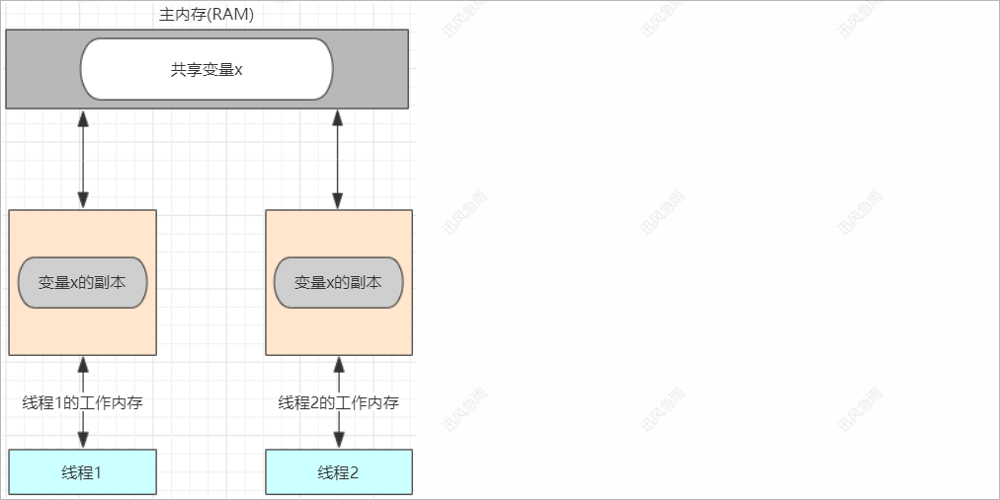
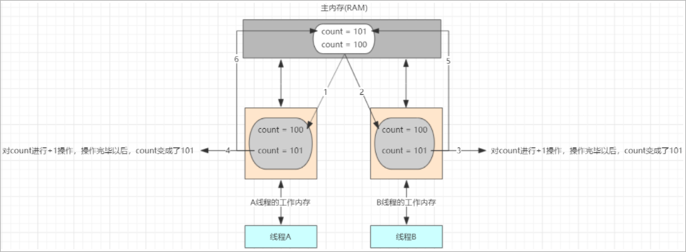
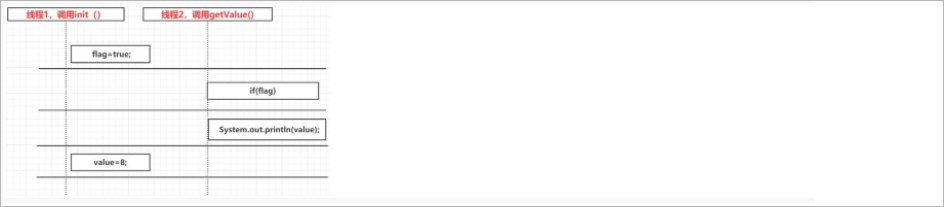
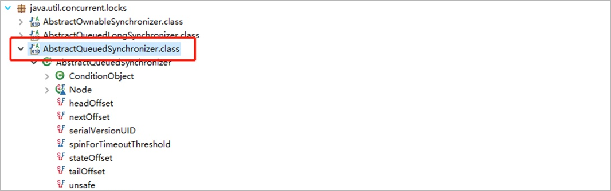
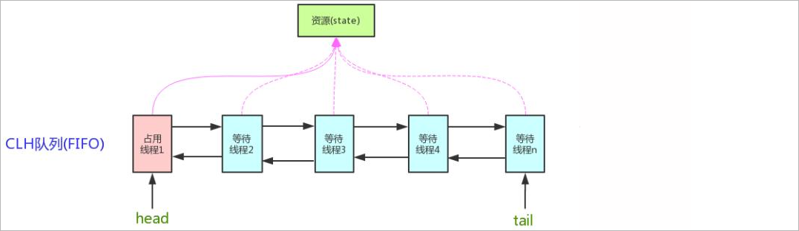
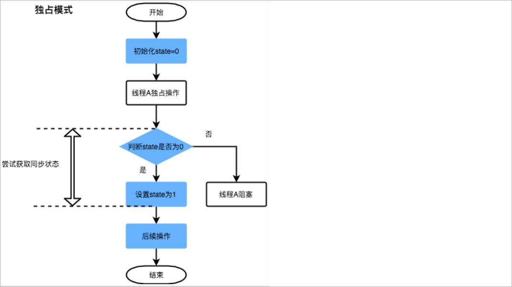
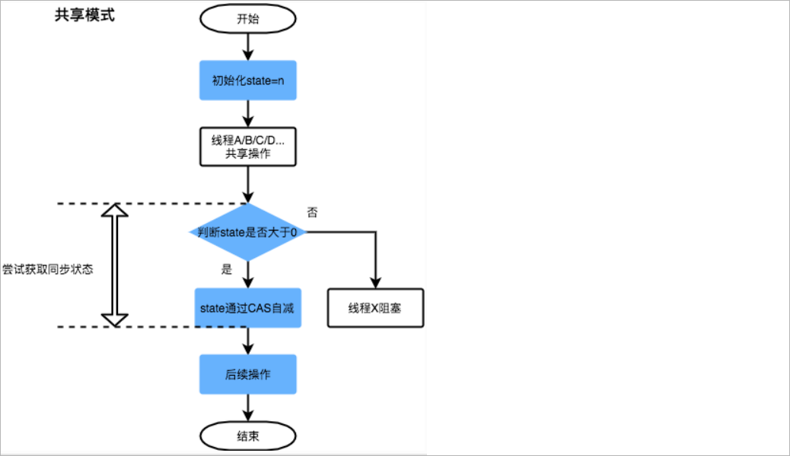

# 1 并发工具类

在JDK的并发包里提供了几个非常有用的并发容器和并发工具类。供我们在多线程开发中进行使用。

## 1.1 CountDownLatch

### 1.1.1 CountDownLatch概述

CountDownLatch被称之为**倒计数器**，CountDownLatch允许一个或多个线程等待其他线程完成操作以后，再执行当前线程；比如我们在主线程需要开

启2个其他线程，当其他的线程执行完毕以后我们再去执行主线程，针对这个需求我们就可以使用CountDownLatch来进行实现。CountDownLatch中

count down是倒着数数的意思；CountDownLatch是通过一个计数器来实现的，每当一个线程完成了自己的任务后，可以调用countDown()方法让计数

器-1，当计数器到达0时，调用CountDownLatch的await()方法的线程阻塞状态解除，继续执行。


CountDownLatch的相关方法

```java
public CountDownLatch(int count)						// 初始化一个指定计数器的CountDownLatch对象
public void await() throws InterruptedException			// 让当前线程等待
public void countDown()									// 计数器进行减1
```

### 1.1.2 代码演示

案例需求：使用CountDownLatch完成上述需求(我们在主线程需要开启2个其他线程，当其他的线程执行完毕以后我们再去执行主线程)

实现思路：在main方法中创建一个CountDownLatch对象，把这个对象作为作为参数传递给其他的两个任务线程


线程任务类1

```java
public class CountDownLatchThread01 implements Runnable {

    // CountDownLatch类型成员变量
    private CountDownLatch countDownLatch ;
    public CountDownLatchThread01(CountDownLatch countDownLatch) {      // 构造方法的作用：接收CountDownLatch对象
        this.countDownLatch = countDownLatch ;
    }

    @Override
    public void run() {

        try {
            Thread.sleep(10000);
            System.out.println("10秒以后执行了CountDownLatchThread01......");
        } catch (InterruptedException e) {
            e.printStackTrace();
        }

        // 调用CountDownLatch对象的countDown方法对计数器进行-1操作
        countDownLatch.countDown();

    }

}
```


线程任务类2

```java
public class CountDownLatchThread02 implements Runnable {

    // CountDownLatch类型成员变量
    private CountDownLatch countDownLatch ;
    public CountDownLatchThread02(CountDownLatch countDownLatch) {      // 构造方法的作用：接收CountDownLatch对象
        this.countDownLatch = countDownLatch ;
    }

    @Override
    public void run() {

        try {
            Thread.sleep(3000);
            System.out.println("3秒以后执行了CountDownLatchThread02......");
        } catch (InterruptedException e) {
            e.printStackTrace();
        }

        // 调用CountDownLatch对象的countDown方法对计数器进行-1操作
        countDownLatch.countDown();

    }

}
```


测试类

```java
public class CountDownLatchDemo01 {

    public static void main(String[] args) {

        //  1. 创建一个CountDownLatch对象
        CountDownLatch countDownLatch = new CountDownLatch(2) ;                 // CountDownLatch中的计数器的默认值就是2

        //  2. 创建线程任务类对象，并且把这个CountDownLatch对象作为构造方法的参数进行传递
        CountDownLatchThread01 countDownLatchThread01 = new CountDownLatchThread01(countDownLatch) ;

        //  3. 创建线程任务类对象，并且把这个CountDownLatch对象作为构造方法的参数进行传递
        CountDownLatchThread02 countDownLatchThread02 = new CountDownLatchThread02(countDownLatch) ;

        //  4. 创建线程对象，并启动线程
        Thread t1 = new Thread(countDownLatchThread01);
        Thread t2 = new Thread(countDownLatchThread02);
        t1.start();
        t2.start();

        //  5. 在主线程中调用 CountDownLatch中的await让主线程处于阻塞状态
        try {
            countDownLatch.await();
        } catch (InterruptedException e) {
            e.printStackTrace();
        }

        //  6. 程序结束的输出
        System.out.println("主线程执行了.... 程序结束了......");
    }

}
```

控制台输出结果

```java
3秒以后执行了CountDownLatchThread02......
10秒以后执行了CountDownLatchThread01......
主线程执行了.... 程序结束了......
```

CountDownLatchThread02线程先执行完毕，此时计数器-1；CountDownLatchThread01线程执行完毕，此时计数器-1；当计数器的值为0的时候，主

线程阻塞状态接触，主线程向下执行。

### 1.1.3 应用场景

常见应用场景：

1、多图片上传

2、大的Excel上传

3、多服务接口调用


## 1.2 CyclicBarrier

### 1.2.1 CyclicBarrier概述

CyclicBarrier的字面意思是可循环使用（Cyclic）的屏障（Barrier）。它要做的事情是，让一组线程到达一个屏障（也可以叫同步点）时被阻塞，直

到最后一个线程到达屏障时，屏障才会开门，所有被屏障拦截的线程才会继续运行。


例如：公司召集5名员工开会，等5名员工都到了，会议开始。我们创建5个员工线程，1个开会线程，几乎同时启动，使用CyclicBarrier保证5名员工

线程全部执行后，再执行开会线程。


CyclicBarrier的相关方法

```java
public CyclicBarrier(int parties, Runnable barrierAction)   // 用于在线程到达屏障时，优先执行barrierAction，方便处理更复杂的业务场景
public int await()											// 每个线程调用await方法告诉CyclicBarrier我已经到达了屏障，然后当前线程被阻塞
```


### 1.2.2 代码演示

案例演示：模拟员工开会

实现步骤：

1、创建一个员工线程类(EmployeeThread),该线程类中需要定义一个CyclicBarrier类型的形式参数

2、创建一个开会线程类(MettingThread)

3、测试类

* 创建CyclicBarrier对象

* 创建5个EmployeeThread线程对象，把第一步创建的CyclicBarrier对象作为构造方法参数传递过来

* 启动5个员工线程


员工线程类

```java
public class EmployeeThread extends Thread {

    // CyclicBarrier类型的成员变量
    private CyclicBarrier cyclicBarrier ;
    public EmployeeThread(CyclicBarrier cyclicBarrier) {        // 使用构造方法对CyclicBarrier进行初始化
        this.cyclicBarrier = cyclicBarrier ;
    }

    @Override
    public void run() {

        try {

            // 模拟开会人员的随机到场
            Thread.sleep((int) (Math.random() * 1000));
            System.out.println(Thread.currentThread().getName() + " 到了! ");
            cyclicBarrier.await();
        } catch (Exception e) {
            e.printStackTrace();
        }

    }

}
```

开会线程类

```java
public class MettingThread extends Thread {

    @Override
    public void run() {
        System.out.println("好了，人都到了，开始开会......");
    }

}
```

测试类

```java
public class CyclicBarrierDemo01 {

    public static void main(String[] args) {

        // 创建CyclicBarrier对象
        CyclicBarrier cyclicBarrier = new CyclicBarrier(5 , new MettingThread()) ;

        // 创建5个EmployeeThread线程对象，把第一步创建的CyclicBarrier对象作为构造方法参数传递过来
        EmployeeThread thread1 = new EmployeeThread(cyclicBarrier) ;
        EmployeeThread thread2 = new EmployeeThread(cyclicBarrier) ;
        EmployeeThread thread3 = new EmployeeThread(cyclicBarrier) ;
        EmployeeThread thread4 = new EmployeeThread(cyclicBarrier) ;
        EmployeeThread thread5 = new EmployeeThread(cyclicBarrier) ;

        // 启动5个员工线程
        thread1.start();
        thread2.start();
        thread3.start();
        thread4.start();
        thread5.start();

    }

}
```

### 1.2.3 应用场景

应用场景：CyclicBarrier可以用于多线程计算数据，最后合并计算结果的场景。

比如：现在存在两个文件，这个两个文件中存储的是某一个员工两年的工资信息(一年一个文件)，现需要对这两个文件中的数据进行汇总；使用两个线

程读取2个文件中的数据，当两个文件中的数据都读取完毕以后，进行数据的汇总操作。


## 1.3 Semaphore

### 1.3.1 Semaphore概述

Semaphore字面意思是信号量的意思，它的作用是**控制访问特定资源的线程数目**。非常适合需求量大，而资源又很紧张的情况。比如给定一个资源

数目有限的资源池，假设资源数目为N，每一个线程均可获取一个资源，但是当资源分配完毕时，后来线程需要阻塞等待，直到前面已持有资源的线程

释放资源之后才能继续。


举例：6辆车抢占3个车位


Semaphore的常用方法

```java
public Semaphore(int permits)						permits 表示许可线程的数量
public void acquire() throws InterruptedException	表示获取许可
public void release()								表示释放许可
```

### 1.3.2 代码演示

```java
public class SemaphoreDemo {

    public static void main(String[] args) {
        
        // 初始化信号量，3个车位
        Semaphore semaphore = new Semaphore(3);

        // 6个线程，模拟6辆车
        for (int i = 0; i < 6; i++) {
            new Thread(()->{
                try {
                    // 抢占一个停车位
                    semaphore.acquire();
                    System.out.println(Thread.currentThread().getName() + " 抢到了一个停车位！！");
                    TimeUnit.SECONDS.sleep(new Random().nextInt(10));		  // 停一会儿车
                    System.out.println(Thread.currentThread().getName() + " 离开停车位！！");
                    // 开走，释放一个停车位
                    semaphore.release();
                    
                } catch (InterruptedException e) {
                    e.printStackTrace();
                }
            }, String.valueOf(i)).start();
        }
    }
}
```

### 1.3.3 应用场景

应用场景：限流

# 2 volatile关键字

## 2.1 看程序说结果

分析如下程序，说出在控制台的输出结果。

Thread的子类

```java
public class VolatileThread extends Thread {

    // 定义成员变量
    private boolean flag = false ;
    public boolean isFlag() { return flag;}

    @Override
    public void run() {

        // 线程休眠1秒
        try {
            Thread.sleep(1000);
        } catch (InterruptedException e) {
            e.printStackTrace();
        }

        // 将flag的值更改为true
        this.flag = true ;
        System.out.println("flag=" + flag);

    }
}
```

测试类

```java
public class VolatileThreadDemo01 {
    
    public static void main(String[] args) {

        // 创建VolatileThread线程对象
        VolatileThread volatileThread = new VolatileThread() ;
        volatileThread.start();

        // main方法
        while(true) {
            if(volatileThread.isFlag()) {
                System.out.println("执行了======");
            }
        }
        
    }
}
```

控制台输出结果

```java
flag=true
```

按照我们的分析，当我们把volatileThread线程启动起来以后，那么volatileThread线程开始执行。在volatileThread线程的run方法中，线程休眠1s，

休眠一秒以后那么flag的值应该为true，此时我们在主线程中在调用volatileThread线程中的isFlag()方法，返回的就应该true，那么既然是true，那

么就会在控制台输出"执行了======"；但是此时在控制台并没有输出该信息，那么这是为什么呢？要想知道原因，那么我们就需要学习一下JMM。


## 2.2 JMM简介

概述：JMM(Java Memory Model)Java内存模型,是java虚拟机规范中所定义的一种内存模型。

Java内存模型(Java Memory Model)描述了Java程序中各种变量(线程共享变量)的访问规则，以及在JVM中将变量存储到内存和从内存中读取变量这

样的底层细节。


特点：

1、所有的共享变量都存储于主内存(计算机的RAM)这里所说的变量指的是实例变量和类变量。不包含局部变量，因为局部变量是线程私有的，因此不

存在竞争问题。

2、每一个线程还存在自己的工作内存，线程的工作内存，保留了被线程使用的变量的工作副本。

3、线程对变量的所有的操作(读，写)都必须在工作内存中完成，而不能直接读写主内存中的变量，不同线程之间也不能直接访问对方工作内存中的变

量，线程间变量的值的传递需要通过主内存完成。

 

## 2.3 问题分析

了解了一下JMM,那么接下来我们就来分析一下上述程序产生问题的原因。

 

产生问题的流程分析：

1、VolatileThread线程从主内存读取到数据放入其对应的工作内存

2、将flag的值更改为true，但是这个时候flag的值还没有回写主内存

3、此时main线程读取到了flag的值并将其放入到自己的工作内存中，此时flag的值为false

4、VolatileThread线程将flag的值写回到主内存，但是main函数里面的while(true)调用的是系统比较底层的代码，速度快，快到没有时间再去读取主

内存中的值，所以while(true)读取到的值一直是false。(如果有一个时刻main线程从主内存中读取到了flag的最新值，那么if语句就可以执行，main线

程何时从主内存中读取最新的值，我们无法控制)


我们可以让主线程执行慢一点，执行慢一点以后，在某一个时刻，可能就会读取到主内存中最新的flag的值，那么if语句就可以进行执行。


测试类：

```java
public class VolatileThreadDemo02 {

    public static void main(String[] args) throws InterruptedException {

        // 创建VolatileThread线程对象
        VolatileThread volatileThread = new VolatileThread() ;
        volatileThread.start();

        // main方法
        while(true) {
            if(volatileThread.isFlag()) {
                System.out.println("执行了======");
            }

            // 让线程休眠100毫秒
            TimeUnit.MILLISECONDS.sleep(100);
        }

    }
}
```

控制台输出结果

```java
flag=true
执行了======
执行了======
执行了======
....
```

此时我们可以看到if语句已经执行了。当然我们在真实开发中可能不能使用这种方式来处理这个问题，那么这个问题应该怎么处理呢？我们就需要学习

下一小节的内容。

## 2.4 问题处理

### 2.4.1 加锁

第一种处理方案，我们可以通过加锁的方式进行处理。

测试类

```java
public class VolatileThreadDemo03 {

    public static void main(String[] args) throws InterruptedException {

        // 创建VolatileThread线程对象
        VolatileThread volatileThread = new VolatileThread() ;
        volatileThread.start();

        // main方法
        while(true) {

            // 加锁进行问题处理
            synchronized (volatileThread) {
                if(volatileThread.isFlag()) {
                    System.out.println("执行了======");
                }
            }

        }

    }
}
```

控制台输出结果

```java
flag=true
执行了======
执行了======
执行了======
....
```


工作原理说明

对上述代码加锁完毕以后，某一个线程支持该程序的过程如下：

a.线程获得锁

b.清空工作内存

c.从主内存拷贝共享变量最新的值到工作内存成为副本

d.执行代码

e.将修改后的副本的值刷新回主内存中

f.线程释放锁

### 2.4.2 volatile关键字

第二种处理方案，我们可以通过volatile关键字来修饰flag变量。

线程类

```java
public class VolatileThread extends Thread {

    // 定义成员变量
    private volatile boolean flag = false ;
    public boolean isFlag() { return flag;}

    @Override
    public void run() {

        // 线程休眠1秒
        try {
            Thread.sleep(1000);
        } catch (InterruptedException e) {
            e.printStackTrace();
        }

        // 将flag的值更改为true
        this.flag = true ;
        System.out.println("flag=" + flag);

    }
}
```

控制台输出结果

```java
flag=true
执行了======
执行了======
执行了======
....
```


工作原理说明

   

执行流程分析

1、VolatileThread线程从主内存读取到数据放入其对应的工作内存

2、将flag的值更改为true，但是这个时候flag的值还没有回写主内存

3、此时main线程读取到了flag的值并将其放入到自己的工作内存中，此时flag的值为false

4、VolatileThread线程将flag的值写到主内存

5、main线程工作内存中的flag变量副本失效

6、main线程再次使用flag时，main线程会从主内存读取最新的值，放入到工作内存中，然后在进行使用


总结： volatile保证不同线程对共享变量操作的可见性，也就是说一个线程修改了volatile修饰的变量，当修改写回主内存时，另外一个线程立即看到

最新的值。但是volatile不保证**原子性**(关于原子性问题，我们在下面的小节中会介绍)。


volatile与synchronized的区别：

1、volatile只能修饰实例变量和类变量，而synchronized可以修饰方法，以及代码块。

2、volatile保证数据的可见性，但是不保证原子性(多线程进行写操作，不保证线程安全);而synchronized是一种排他（互斥）的机制(因此有时我们也

将synchronized这种锁称之为排他（互斥）锁)，synchronized修饰的代码块，被修饰的代码块称之为同步代码块，无法被中断可以保证原子性，也可

以间接的保证可见性。

# 3 并发编程三特性

## 3.1 可见性

可见性是指当多个线程访问同一个变量时，一个线程修改了这个变量的值，其他线程能够立即看到修改的值。

volatile关键字修饰的共享变量是可以保证可见性的。

## 3.2 原子性

### 3.2.1 原子性说明

概述：所谓的原子性是指在一次操作或者多次操作中，要么所有的操作全部都得到了执行并且不会受到任何因素的干扰而中断，要么所有的操作都不执

行，**多个操作是一个不可以分割的整体**。


比如：从张三的账户给李四的账户转1000元，这个动作将包含两个基本的操作：从张三的账户扣除1000元，给李四的账户增加1000元。这两个操作必

须符合原子性的要求，要么都成功要么都失败。


### 3.2.2 看程序说结果

分析如下程序的执行结果

线程类

```java
public class VolatileAtomicThread implements Runnable {

    // 定义一个int类型的变量
    private int count = 0 ;

    @Override
    public void run() {
        
        // 对该变量进行++操作，100次
        for(int x = 0 ; x < 100 ; x++) {
            count++ ;					
            System.out.println("count =========>>>> " + count);
        }
        
    }

}
```

测试类

```java
public class VolatileAtomicThreadDemo {

    public static void main(String[] args) {

        // 创建VolatileAtomicThread对象
        VolatileAtomicThread volatileAtomicThread = new VolatileAtomicThread() ;

        // 开启100个线程对count进行++操作
        for(int x = 0 ; x < 100 ; x++) {
            new Thread(volatileAtomicThread).start();
        }
        
    }

}
```

程序分析：我们在主线程中通过for循环启动了100个线程，每一个线程都会对VolatileAtomicThread类中的count加100次。那么直接结果应该是

10000。但是真正的执行结果和我们分析的是否一样呢？运行程序(多运行几次)，查看控制台输出结果

```java
....
count =========>>>> 9997
count =========>>>> 9998
count =========>>>> 9999
```

通过控制台的输出，我们可以看到最终count的结果可能并不是10000。接下来我们就来分析一下问题产生的原因。

### 3.2.3 问题分析说明

以上问题主要是发生在count++操作上：

count++操作包含3个步骤：

1、从主内存中读取数据到工作内存

2、对工作内存中的数据进行++操作

3、将工作内存中的数据写回到主内存

count++操作不是一个原子性操作，也就是说在某一个时刻对某一个操作的执行，有可能被其他的线程打断。

 

产生问题的执行流程分析：

1、假设此时count的值是100，线程A需要对改变量进行自增1的操作，首先它需要从主内存中读取变量count的值。由于CPU的切换关系，此时CPU的

执行权被切换到了B线程。A线程就处于就绪状态，B线程处于运行状态。

2、线程B也需要从主内存中读取count变量的值,由于线程A没有对count值做任何修改因此此时B读取到的数据还是100

3、线程B工作内存中对count执行了+1操作，但是未刷新之主内存中

4、此时CPU的执行权切换到了A线程上，由于此时线程B没有将工作内存中的数据刷新到主内存，因此A线程工作内存中的变量值还是100，没有失

效。A线程对工作内存中的数据进行了+1操作。

5、线程B将101写入到主内存

6、线程A将101写入到主内存

虽然计算了2次，但是只对A进行了1次修改。

### 3.2.4 volatile原子性测试

我们刚才说到了volatile在多线程环境下只保证了共享变量在多个线程间的可见性，但是**不保证原子性**。那么接下来我们就来做一个测试。测试的思

想，就是使用volatile修饰count。

线程类

```java
public class VolatileAtomicThread implements Runnable {

    // 定义一个int类型的变量,并且使用volatile修饰
    private volatile int count = 0 ;

    @Override
    public void run() {
        
        // 对该变量进行++操作，100次
        for(int x = 0 ; x < 100 ; x++) {
            count++ ;					
            System.out.println("count =========>>>> " + count);
        }
        
    }

}
```

控制台输出结果(需要运行多次)

```java
...
count =========>>>> 9997
count =========>>>> 9998
count =========>>>> 9999
```

通过控制台结果的输出，我们可以看到程序还是会出现问题。因此也就证明volatile关键字是不保证原子性的。

volatile关键字使用场景：状态位的变量

### 3.2.5 问题处理

解决方案：

1、加锁

2、使用原子类


我们可以给count++操作添**加锁**，那么count++操作就是临界区中的代码，临界区中的代码一次只能被一个线程去执行，所以count++就变成了原子操

作。

线程任务类

```java
public class VolatileAtomicThread implements Runnable {

    // 定义一个int类型的变量,
    private int count = 0 ;

    // 定义一个Object类型的变量，该变量将作为同步代码块的锁
    private Object obj = new Object();

    @Override
    public void run() {
        
        // 对该变量进行++操作，100次
        for(int x = 0 ; x < 100 ; x++) {
            synchronized (obj){
                count++ ;
                System.out.println("count =========>>>> " + count);
            }

        }
        
    }

}
```

控制台输出结果

```java
count =========>>>> 9998
count =========>>>> 9999
count =========>>>> 10000
```

## 3.3 有序性

有序性：它指的是程序执行的顺序按照代码的先后顺序执行。

正常情况下，这是没什么可说的，但是如果在Java中，并且是并发情况，就不得不说了。计算机在执行程序时，为了提高性能，编译器和处理器常常

会对**指令重排**。处理器在进行重排序时，必须要考虑指令之间的**数据依赖性**。

如下代码：

```java
public void mySort() {
	int x = 11;
	int y = 12;
	x = x + 5;
	y = x * x;
}
```

按照正常的顺序进行执行，那么执行顺序应该是：1 2 3 4 。但是如果发生了指令重排，那么此时的执行顺序可能是：① 1 3 2 4  ② 2 1 3 4 但是肯定

不会出现：4 3 2 1这种顺序，因为处理器在进行重排时候，必须考虑到指令之间的数据依赖性。多线程环境里编译器和CPU指令优化根本无法识别多

个线程之间存在的数据依赖性，比如说下面的程序代码如果两个方法在两个不同的线程里面调用就可能出现问题。

```java
private static int value;
private static volatile boolean flag;

public static void init(){
    value=8;     //语句1 
    flag=true;   //语句2  
}

public static void getValue(){
    if(flag){
        System.out.println(value);
    }
}
```

根据上面代码，如果程序代码运行都是按顺序的，那么getValue() 中打印的value值必定是等于8的，不过如果init()方法经过了指令重排序，那么结果

就不一定了。进行重排序后代码执行顺序可能如下。

```java
flag=true;  //语句2  
value=8;    //语句1
```

如果init()方法经过了指令重排序后，这个时候两个线程分别调用 init()和getValue()方法，那么就有可能出现下图的情况，导致最终打印出来的value数

据等于0。

 

解决方案：使用volatile修饰flag，禁止指令重排。


# 4 原子类与CAS算法

## 4.1 AtomicInteger

### 4.1.1 简介以及入门

概述：java从JDK1.5开始提供了java.util.concurrent.atomic包(简称Atomic包)，这个包中的原子操作类提供了一种用法简单，性能高效，线程安全地

更新一个变量的方式。因为变量的类型有很多种，所以在Atomic包里一共提供了13个类，属于4种类型的原子更新方式，分别是原子更新基本类型、原

子更新数组、原子更新引用和原子更新属性(字段)。本次我们只讲解使用原子的方式更新基本类型，使用原子的方式更新基本类型Atomic包提供了以

下3个类：

AtomicBoolean： 原子更新布尔类型

AtomicInteger： 原子更新整型

AtomicLong：	原子更新长整型

以上3个类提供的方法几乎一模一样，所以本节仅以AtomicInteger为例进行讲解，AtomicInteger的常用方法如下：

```java
public AtomicInteger()：	   				初始化一个默认值为0的原子型Integer
public AtomicInteger(int initialValue)： 初始化一个指定值的原子型Integer

int get():   			 				 获取值
int getAndIncrement():      			 以原子方式将当前值加1，注意，这里返回的是自增前的值。
int incrementAndGet():     				 以原子方式将当前值加1，注意，这里返回的是自增后的值。
int addAndGet(int data):				 以原子方式将输入的数值与实例中的值（AtomicInteger里的value）相加，并返回结果。
int getAndSet(int value):   			 以原子方式设置为newValue的值，并返回旧值。
```

案例演示AtomicInteger的基本使用：

```java
public class AtomicIntegerDemo01 {

    // 原子型Integer
    public static void main(String[] args) {

        // 构造方法
        // public AtomicInteger()：初始化一个默认值为0的原子型Integer
        // AtomicInteger atomicInteger = new AtomicInteger() ;
        // System.out.println(atomicInteger);

        // public AtomicInteger(int initialValue)： 初始化一个指定值的原子型Integer
        AtomicInteger atomicInteger = new AtomicInteger(5) ;
        System.out.println(atomicInteger);

        // 获取值
        System.out.println(atomicInteger.get());

        // 以原子方式将当前值加1，这里返回的是自增前的值
        System.out.println(atomicInteger.getAndIncrement());
        System.out.println(atomicInteger.get());

        // 以原子方式将当前值加1，这里返回的是自增后的值
        System.out.println(atomicInteger.incrementAndGet());

        // 以原子方式将输入的数值与实例中的值（AtomicInteger里的value）相加，并返回结果
        System.out.println(atomicInteger.addAndGet(8));

        // 以原子方式设置为newValue的值，并返回旧值
        System.out.println(atomicInteger.getAndSet(20));
        System.out.println(atomicInteger.get());

    }

}
```

### 4.1.2 问题解决

使用AtomicInteger解决第5章的案例存在的问题：

```java
public class VolatileAtomicThread implements Runnable {

    // 定义一个int类型的变量
    private AtomicInteger atomicInteger = new AtomicInteger() ;

    @Override
    public void run() {

        // 对该变量进行++操作，100次
        for(int x = 0 ; x < 100 ; x++) {
            int i = atomicInteger.incrementAndGet();
            System.out.println("count =========>>>> " + i);
        }

    }

}
```

控制台输出结果

````java
...
count =========>>>> 9998
count =========>>>> 9999
count =========>>>> 10000
````

通过控制台的执行结果，我们可以看到最终得到的结果就是10000，因此也就证明AtomicInteger所提供的方法是原子性操作方法。

## 4.2 CAS算法

AtomicInteger原理： 自旋锁 + CAS算法

### 4.2.1 CAS简介

CAS的全称是： Compare And Swap(比较再交换); 是现代CPU广泛支持的一种对内存中的共享数据进行操作的一种特殊指令。CAS可以将read-

modify-write转换为原子操作，这个原子操作直接由CPU保证。CAS有3个操作数：内存值V，旧的预期值A，要修改的新值B。当且仅当旧预期值A和

内存值V相同时，将内存值V修改为B并返回true，否则什么都不做，并返回false。

举例说明：

1. 在内存值V当中，存储着值为10的变量。

  

2. 此时线程1想要把变量的值增加1。对线程1来说，旧的预期值 A = 10 ，要修改的新值 B = 11。

 

3. 在线程1要提交更新之前，另一个线程2抢先一步，把内存值V中的变量值率先更新成了11。

 

4. 线程1开始提交更新，首先进行A和内存值V的实际值比较（Compare），发现A不等于V的值，提交失败。

 

5. 线程1重新获取内存值V作为当前A的值，并重新计算想要修改的新值。此时对线程1来说，A = 11，B = 12。这个重新尝试的过程被称为<font color="red" size="4">**自旋**</font>。

 

6. 这一次比较幸运，没有其他线程改变V的值。线程1进行Compare，发现A和V的值是相等的。

 

7. 线程1进行SWAP，把内存V的值替换为B，也就是12。

 

举例说明：这好比春节的时候抢火车票，下手快的会抢先买到票，而下手慢的可以再次尝试，直到买到票。

### 4.2.2 源码分析

那么接下来我们就来查看一下AtomicInteger类中incrementAndGet方法的源码。

```java
public class AtomicInteger extends Number implements java.io.Serializable {
    
    // cas算法的实现类
    private static final jdk.internal.misc.Unsafe U = jdk.internal.misc.Unsafe.getUnsafe();
    
    // 表示变量值在内存中的偏移量地址，unsafe类就是根据内存偏移量地址获取数据值。
    private static final long VALUE = U.objectFieldOffset(AtomicInteger.class, "value");
    private volatile int value;
    
    // 以原子方式将当前值加1，这里返回的是自增后的值
    public final int incrementAndGet() {
        
        /* this表示当前AtomicInteger对象 ，1表示要增加的值 */
        return U.getAndAddInt(this, VALUE, 1) + 1;		// 调用Unsafe类中的getAndAddInt方法
        
    }
    
}
```

UnSafe类

```java
public final class Unsafe {
    
    // Unsafe类中的getAndAddInt方法
    public final int getAndAddInt(Object o, long offset, int delta) {
        
        int v;
        
        // do...while就是自旋操作,当CAS成功以后，循环结束
        do {
            // 获取AtomicInteger类中所封装的int类型的值，就相当于旧的预期值A
            v = getIntVolatile(o, offset); 
            
            // 调用本类的weakCompareAndSetInt方法实现比较在交换； o: AtomicInteger对象, v: 相当于旧的预期值A, v + delta：新值B
        } while (!weakCompareAndSetInt(o, offset, v, v + delta));
        
        return v;
    }
    
    // Unsafe类中的weakCompareAndSetInt方法
    public final boolean weakCompareAndSetInt(Object o, long offset, int expected, int x) {
        return compareAndSetInt(o, offset, expected, x);
    }

    // 本地方法，调用CPU指令实现CAS
    public final native boolean compareAndSetInt(Object o, long offset, int expected, int x);
    
}
```

### 4.2.3 CAS缺点

常见缺点：

开销大：在并发量比较高的情况下，如果反复尝试更新某个变量，却又一直更新不成功，会给CPU带来较大的压力

ABA问题：当变量从A修改为B再修改回A时，变量值等于期望值A，但是无法判断是否修改，CAS操作在ABA修改后依然成功。

不能保证代码块的原子性：CAS机制所保证的只是一个变量的原子性操作，而不能保证整个代码块的原子性。


### 4.2.4 CAS与Synchronized

CAS和Synchronized都可以保证多线程环境下共享数据的安全性。那么他们两者有什么区别？


synchronized是从悲观的角度出发：

总是假设最坏的情况，每次去拿数据的时候都认为别人会修改，所以每次在拿数据的时候都会上锁，这样别人想拿这个数据就会阻塞直到它拿到锁

（共享资源每次只给一个线程使用，其它线程阻塞，用完后再把资源转让给其它线程）。因此synchronized我们也将其称之为悲观锁。jdk中的

ReentrantLock也是一种悲观锁。


CAS是从乐观的角度出发:

总是假设最好的情况，每次去拿数据的时候都认为别人不会修改，所以不会上锁，但是在更新的时候会判断一下在此期间别人有没有去更新这个数据

CAS这种机制我们也可以将其称之为乐观锁。


# 5 AQS

## 5.1 AQS简介

AQS 的全称为（AbstractQueuedSynchronizer），这个类在 java.util.concurrent.locks 包下面。

 

AQS 是一个用来**构建锁**和**同步器**的框架，使用 AQS 能简单且高效地构造出应用广泛的大量的同步器， 比如我们提到的 ReentrantLock，

Semaphore，其他的诸如 ReentrantReadWriteLock，SynchronousQueue，FutureTask(jdk1.7) 等等皆是基于AQS的。当然，我们自己也能利用 

AQS 非常轻松容易地构造出符合我们自己需求的同步器。


AQS它提供了"**把锁分配给谁**"这一问题的一种解决方案，使得锁的开发人员可以将精力放在“如何加解锁上”，避免陷于把锁进行分配而带来的种种细

节陷阱之中。


AQS的结构：

 

AQS维护了一个volatile语义(支持多线程下的可见性)的共享资源变量**state**和一个FIFO（first-in-first-out）**线程等待队列**(多线程竞争state资源被

阻塞时，会进入此队列)。

## 5.2 工作模式

### 5.2.1 独占模式

#### 原理介绍

独占模式下时，其他线程视图获取该锁将无法取得成功，只有一个线程能执行，如ReentrantLock采用独占模式。

工作流程如下所示：

 

线程获取锁的流程：

1、线程A获取锁，将state的值由0设置为1

2、在A没有释放锁之前，线程B也来获取锁，线程B获取到state的值为1，表示锁被占用。线程B创建Node节点放入队尾，并且阻塞线程B

3、同理线程C获取到的state的值为1，表示锁被占用。线程C创建Node节点放入队尾，并且阻塞线程C

线程释放锁的流程：

1、线程A执行完毕以后，将state的值由1设置为0

2、唤醒下一个Node B节点，然后删除线程A节点

#### ReentrantLock源码分析

以非公平锁为例，获取锁的相关源码：

```java
// java.util.concurrent.locks.ReentrantLock.FairSync
final void lock() {
    acquire(1);
}

protected final boolean tryAcquire(int acquires) {
    final Thread current = Thread.currentThread();
    int c = getState();
    if (c == 0) {
        if (!hasQueuedPredecessors() &&				// 从线程有序等待队列中获取等待
            compareAndSetState(0, acquires)) {		// 使用CAS对state进行+1
            setExclusiveOwnerThread(current);		// 如果获取锁成功，把当前线程设置为有锁线程
            return true;
        }
    }
    else if (current == getExclusiveOwnerThread()) {	// 可重入
        int nextc = c + acquires;		// 每重入一次stat累加acquires
        if (nextc < 0)
            throw new Error("Maximum lock count exceeded");
        setState(nextc);
        return true;
    }
    return false;
}

// java.util.concurrent.locks.AbstractQueuedSynchronizer
public final void acquire(int arg) {
    if (!tryAcquire(arg) && acquireQueued(addWaiter(Node.EXCLUSIVE), arg))  // 获取锁，如果获取失败将构建链表的Node节点
        selfInterrupt();
}
```

### 5.2.2 共享模式

#### 原理说明

共享模式下，多个线程可以成功获取到锁，多个线程可同时执行。如：CountDownLatch、Semaphore

工作流程如下所示：

 

获取锁的流程：

1、线程A判断state的值是否大于0，如果否创建Node节点，将其加入到阻塞队列末尾。

2、如果大于0相当于获取到了锁，使用CAS算法对state进行-1

释放锁的流程

1、执行业务操作，业务操作完毕以后对state的值进行+1操作

2、唤醒下一个Node B节点，然后删除线程A节点

#### CountDownLatch源码分析

```java
// java.util.concurrent.CountDownLatch
public void countDown() {
    sync.releaseShared(1);
}

// java.util.concurrent.CountDownLatch.Sync
protected boolean tryReleaseShared(int releases) {
    // Decrement count; signal when transition to zero
    for (;;) {
        int c = getState();
        if (c == 0)
            return false;
        int nextc = c-1;
        if (compareAndSetState(c, nextc))
            return nextc == 0;
    }
}


// java.util.concurrent.locks.AbstractQueuedSynchronizer
public final boolean releaseShared(int arg) {
    if (tryReleaseShared(arg)) {
        doReleaseShared();
        return true;
    }
    return false;
}
```


