# 1 jvm概述

## 1.1 jvm简介

JVM是Java Virtual Machine（Java虚拟机）的缩写，是一个虚构出来的计算机，是通过在实际的计算机上仿真模拟计算机功能来实现的，JVM屏蔽了与具体操作系统平台相关的信息，Java程序只需生成在Java虚拟机上运行的字节码，就可以在多种平台上不加修改的运行。JVM在执行字节码时，

实际上最终还是把字节码解释成具体平台上的机器指令执行。

如下图所示：

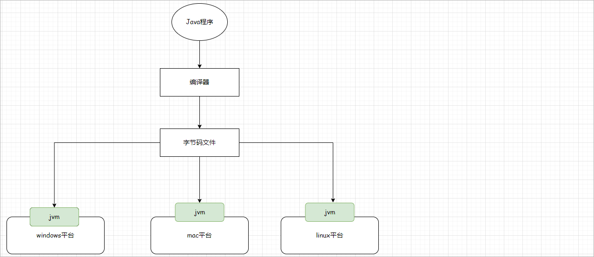 

jvm的作用：   加载并执行Java字节码文件(.class)

java程序特点：跨平台性

## 1.2 jvm规范和jvm

**Java虚拟机规范**（Java Virtual Machine Specification）是一份由Sun Microsystems（现在是Oracle Corporation）制定的文档，它定义了Java虚拟机的**结构、指令集、类文件格式、类加载器、字节码执行引擎**等方面的内容。Java虚拟机规范是Java平台的核心标准之一，它确保了Java程序在不同的硬件和操作系统上都能够正确地运行。

Java虚拟机（Java Virtual Machine）是实现Java虚拟机规范的软件，它是Java程序运行的基础。Java虚拟机负责将Java程序转换成机器码执行，并提供了一系列的功能和特性，例如内存管理、线程管理、异常处理等。Java虚拟机可以在不同的硬件和操作系统上运行，从而实现Java程序的跨平台性。

它们的关系如下所示：

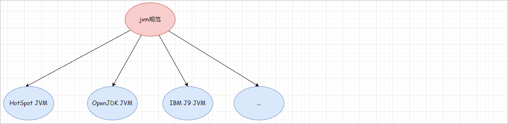 

1、Oracle HotSpot JVM：Oracle HotSpot是目前最常用的Java虚拟机，也是官方提供的JVM实现。它具有成熟的垃圾回收器和即时编译器，广泛应用于生产环境。

2、OpenJDK JVM：OpenJDK是一个开源的Java开发工具包，其中包含了Java语言的参考实现。OpenJDK中也包含了HotSpot JVM，因此它可以作为一种常见的Java虚拟机使用。

3、IBM J9 JVM：IBM J9是IBM公司开发的Java虚拟机，具有高度优化的垃圾回收器和即时编译器。它在性能和资源利用方面有一定的优势，并且支持多种操作系统和硬件平台。

除了以上列举的常见Java虚拟机外，还有一些其他的实现，如BEA JRockit、Excelsior JET等。不同的Java虚拟机在性能、垃圾回收、即时编译等方面可能有所差异，开发者可以根据具体需求选择适合的Java虚拟机。

可以通过如下的命令查看当前所使用的jvm：

```shell
java -version
```


## 1.3 jvm架构

jvm的整体架构如下所示：

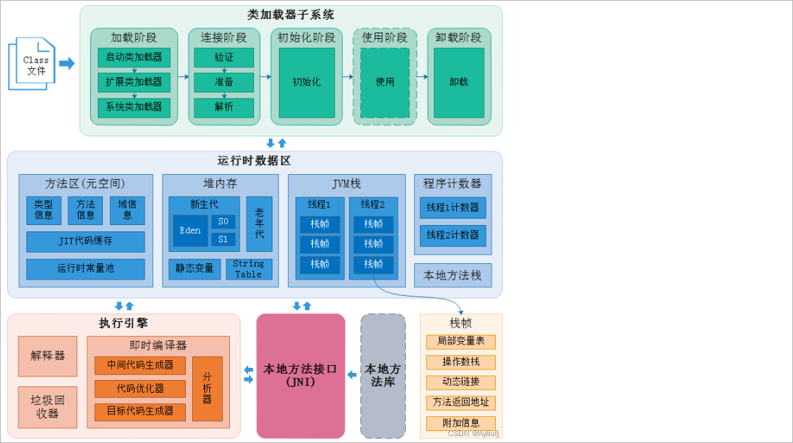 

在整个jvm中包含了三个子系统：

1、类加载器子系统：负责将Java类加载到JVM中，并生成对应的Class对象。Java类可以从本地文件系统、网络、JAR包等多种来源加载。

2、运行时数据区：是Java虚拟机用于存储和管理程序运行时数据的区域。

3、执行引擎：它负责执行Java程序的字节码指令

# 2 类加载器子系统

## 2.1 类加载器子系统概述

类加载器子系统负责将Java类加载到JVM中，并生成对应的**Class对象**。Java类可以从本地文件系统、网络、JAR包等多种来源加载。

整个类的加载过程包含了如下几个阶段：

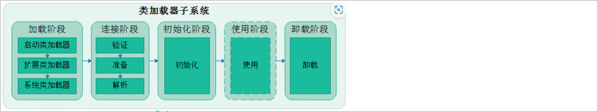 

加载：通过一个类的全限定名获取这个类所对应的二进制字节流，然后通过该二进制字节流将其加载到JVM中，并且为之创建一个Class对象

验证：为了确保Class文件字节流中包含的信息符合当前虚拟机的要求，并且不会危害虚拟机自身安全

准备：负责为类的类变量（被static修饰的变量）分配内存，并设置默认初始化值

解析：将类的二进制数据流中的符号引用替换为直接引用

初始化：根据程序员通过程序制定的主观计划去初始化类变量和其他资源，比如：对成员变量进行显式初始化

## 2.2 类加载器ClassLoader

### 2.2.1 类加载器的作用

负责加载class文件，class文件在文件开头有特定的文件标示，并且ClassLoader只负责class文件的加载，至于它是否可以运行，则由Execution 

Engine决定。

如下图所示：

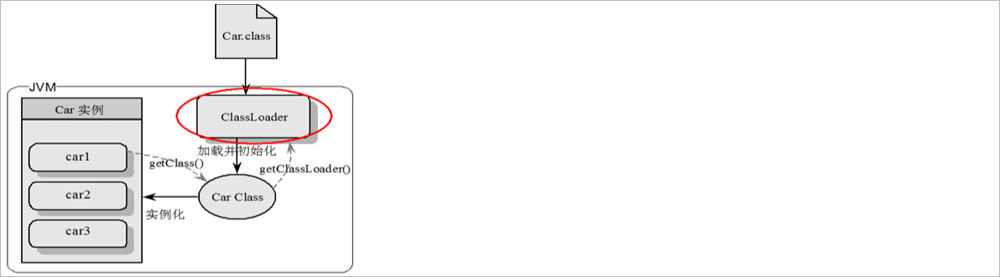 

解释说明：

1、通过类加载器将Car.class字节码文件加载到jvm中，然后创建一个与之对应的Class对象

2、Car字节码文件一旦加入到jvm以后，那么此时就可以使用该字节码文件创建对应的实例对象

3、可以通过调用实例对象的getClass方法获取字节码文件对象

4、可以调用字节码文件对象的getClassLoader方法获取加载该类所对应的类加载器

### 2.2.2 类加载器的分类

从Java虚拟机的角度来讲，只存在如下两种不同的类加载器：

1、启动类加载器（Bootstrap ClassLoader）, 这个类加载器使用C++语言实现，是虚拟机自身的一部分

2、其他类加载器，这些类加载器都由Java语言实现，独立于虚拟机外部，并且全部都继承自抽象类（java.lang.**ClassLoader**）

从Java开发人员的角度来讲，类加载器还可以划分的更细致一下，可以分为4种，其他前三种jvm已经提供：

绝大部分Java程序都会使用到以下3种系统提供的类加载器：

1、启动类加载器（Bootstrap class loader）：它是虚拟机的内置类加载器，通过表示为null。负责加载Java核心类库，如rt.jar中的类。启动类加载器是由C++实现的，不是一个Java类。

2、扩展类加载器（Extension Class Loader）：扩展类加载器负责加载Java的扩展类库，位于JRE的lib/ext目录下的jar包。

3、应用程序类加载器（Application Class Loader）：也称为**系统类加载器**，它负责加载应用程序的类，即开发者自己编写的类。

4、自定义类加载器


如下图所示：

 


类加载器之间是存在逻辑上的继承关系，但是不存在物理上的继承，它们的继承体系如下所示：

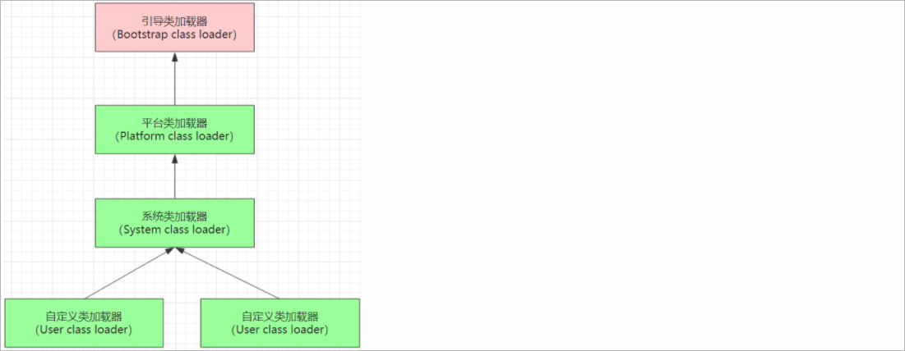 

代码演示：

```java
public class StudentDemo01 {

    public static void main(String[] args) {

        // 获取加载Student类所对应的类加载器
        ClassLoader classLoader = Student.class.getClassLoader();
        System.out.println(classLoader);

        // 获取classLoader类加载器所对应的父类加载器
        ClassLoader loaderParent = classLoader.getParent();
        System.out.println(loaderParent);

        // 获取loaderParent类加载器所对应的父类加载器
        ClassLoader parentParent = loaderParent.getParent();
        System.out.println(parentParent);       // 引导类加载器，是通过null进行表示
    }

}
```

### 2.2.3 双亲委托(派)机制

类加载器在加载一个类的时候遵循的是双亲委派机制，双亲委派模型的工作过程是：如果一个类加载器收到了类加载的请求，它首先不会自己尝试加载这个类，而是把这请求委派给父类加载器去完成，每一个层次的类加载器都是如此，因此所有的加载请求最终都应该传说到顶层的启动类加载器中，只有当父类加载器返回自己无法完成这个加载请求（它的搜索返回中没有找到所需的类）时，子类加载器才会尝试自己去加载。

JVM类加载器使用双亲委派机制有以下几个好处：

1、**避免重复加载**：当一个类需要被加载时，首先会委派给父类加载器进行加载。如果父类加载器能够找到并加载该类，就不会再由子类加载器重复加载，避免了重复加载同一个类的问题。

2、**确保类的唯一性**：通过双亲委派机制，类加载器在加载类时会按照一定的顺序进行查找和加载。这样可以确保同一个类在不同的类加载器中只会被加载一次，保证了类的唯一性。

3、**提高安全性**：双亲委派机制可以防止恶意代码通过自定义类加载器来替换核心类库中的类。因为在加载核心类库时，会优先委派给启动类加载器进行加载，而启动类加载器是由JVM提供的，具有较高的安全性。

面试题：是否可以自定义一个java.lang.String类进行使用

案例演示：自定义java.lang.String类，发现无法加载自定义类，只能加载jdk中的String。

```java
package java.lang;

public class String {
    static {
        System.out.println("自定义String");
    }
}
```

调用String类：

```java
package com.atguigu.jvmdemo.chap01;
public class StringDemo {
    public static void main(String[] args) {
        String s = new String("就不告诉你");		// 无法调用自定义类。原因：双亲委派模型
        System.out.println(s);
    }
}
```

# 3 运行时数据区

## 3.1 运行时数据区概述

JVM中的运行时数据区子系统（Runtime Data Area Subsystem）是Java虚拟机用于存储和管理程序运行时数据的区域。运行时数据区又可以为划分

为如下几个部分：

   

## 3.2 程序计数器

作用：是一块较小的内存空间，可以理解为是当前线程所执行程序的字节码文件的行号指示器，存储的是当前线程所执行的**行号**

特点：**线程私有**空间 ，唯一一个**不会出现内存溢出**的内存空间

## 3.3 Java虚拟机栈

### 3.3.1 Java虚拟机栈简介

JVM栈（Java Virtual Machine Stack）是Java虚拟机在运行时为每个线程分配的内存区域之一【**线程私有**空间】。它用于存储线程执行方法时的局部变量、操作数栈、方法调用和返回信息。

如下所示：

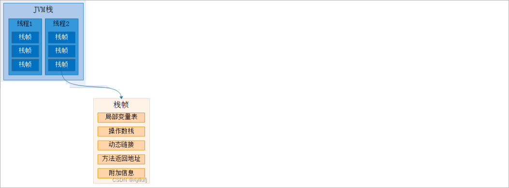 

JVM栈以栈帧（Stack Frame）为单位进行管理，每个栈帧对应一个方法的执行。当一个方法被调用时，JVM会为该方法创建一个新的栈帧，并将其推入当前线程的JVM栈顶。当方法执行完毕或者遇到异常时，栈帧会被弹出，恢复到上一个栈帧的状态。

### 3.3.2 栈帧详解

每个栈帧由三部分组成：局部变量表（Local Variable Table）、操作数栈（Operand Stack）、动态链接（Dynamic Linking）

#### 局部变量表

作用： 存储方法参数和方法体内的局部变量：8种基本类型变量、对象引用（reference）。

可以用如下方式查看字节码中一个方法内定义的的局部变量，当程序运行时，这些局部变量会被加载到局部变量表中。

定义代码如下：

```java
package com.atguigu.jvmdemo.chap02;
public class LocalVariableTableDemo {

    public static void main(String[] args) {
        int i = 100;
        String s = "hello";
        char c = 'c';
        Date date = new Date();
    }
}
```

查看局部变量：

```shell
类路径> javap -v 类名.class
```

输出内容如下所示：

 

也可以使用idea的字节码指令插件【**jclasslib**】进行查看。


#### 操作数栈

操作数栈（Operand Stack）：用于存储方法执行过程中的**操作数**。JVM栈是基于操作数栈进行计算的，包括方法的参数传递、方法调用和返回值等操作。

代码演示：

```java
package com.atguigu.jvmdemo;

public class LocalVariableTableDemo {

    public static void main(String[] args) {

        int i = 15 ;            // 定义一个变量i值为15
        int j = 8 ;             // 定义一个变量j值为8
        int k = i + j ;         // 计算i + j的值，并将结果赋值给k

    }

}
```

通过jclasslib查看程序对应的字节码指令如下所示：

```java
 0 bipush 15   // 将常量15压入操作数栈顶。
 2 istore_1	   // 从操作数栈顶弹出一个值，并存储到局部变量1中。
 3 bipush 8	   // 将常量8压入操作数栈顶。
 5 istore_2	   // 从操作数栈顶弹出一个值，并存储到局部变量2中。
 6 iload_1	   // 将局部变量1的值加载到操作数栈顶。
 7 iload_2	   // 将局部变量2的值加载到操作数栈顶。
 8 iadd		   // 从操作数栈顶弹出两个值（局部变量1和局部变量2），执行整数相加操作，并将结果压入操作数栈顶。
 9 istore_3	   // 从操作数栈顶弹出一个值，并存储到局部变量3中。
10 return	   // 返回方法。
```

执行流程如下所示：

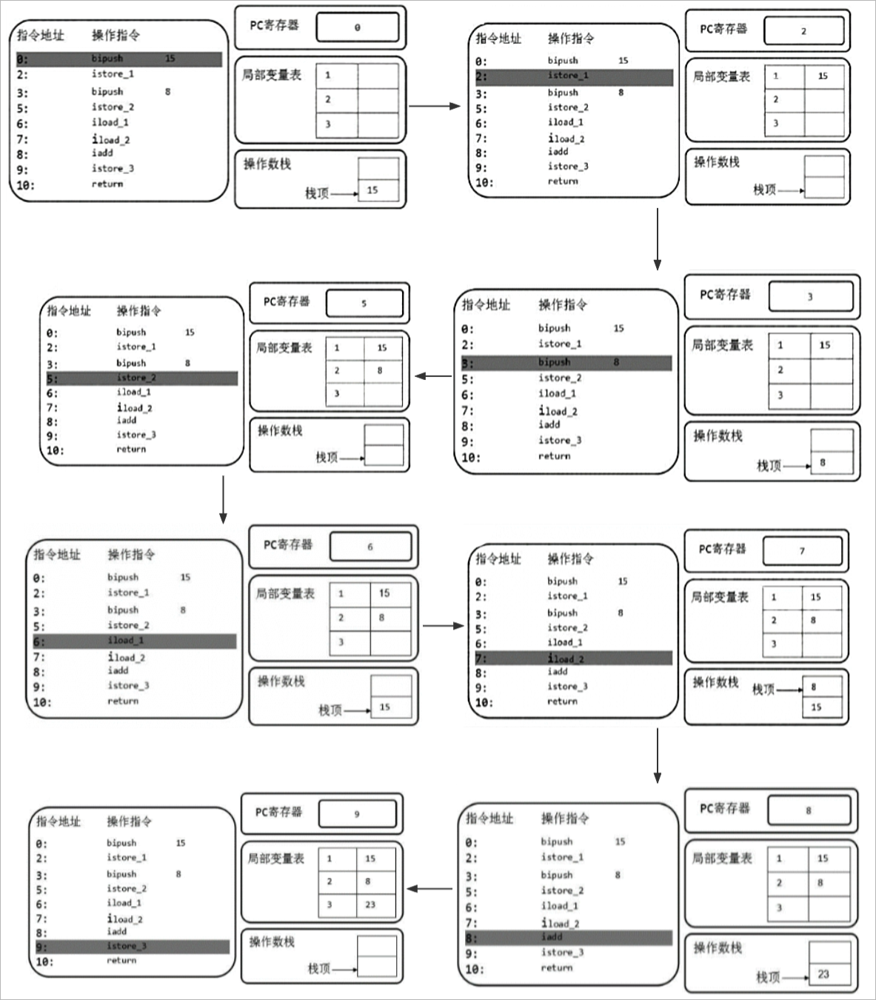  

#### 动态链接

动态链接是指在方法调用过程中，将**符号引用（Symbolic Reference）解析为实际的方法或字段**。符号引用是一种用于表示方法或字段的符号名称，它与具体的内存地址没有直接关联。而动态链接的作用就是将符号引用转换为实际的内存地址，以便正确地执行方法调用。

动态链接的过程如下：

1、解析符号引用：当一个方法调用发生时，JVM首先会根据方法的符号引用来查找对应的方法或字段。

2、链接阶段：在链接阶段，JVM会将符号引用解析为实际的内存地址。这个过程可以分为两种情况：

* 静态链接：对于静态方法或字段，链接过程在编译期间完成，即在类加载的准备阶段进行解析。

- 动态链接：对于实例方法或字段，链接过程在运行时进行。JVM会根据对象的实际类型来确定方法或字段的内存地址。

3、方法调用：一旦符号引用被解析为实际的内存地址，JVM就可以通过该地址执行方法调用或字段访问操作。


代码演示：

```java
public class LocalVariableTableDemo {

    public void methodA() {			// 定义方法methodA
        methodB() ;					// 调用methodB方法
    }

    public void methodB() {			// 定义方法methodB

    }

}
```

通过jclasslib查看程序对应的字节码指令如下所示：

```shell
# methodA方法的字节码指令
0 aload_0  # 将局部变量表中索引为0的变量（即this）加载到操作数栈顶。这表示将当前对象的引用加载到操作数栈顶。
1 invokevirtual #2 <com/atguigu/jvmdemo/LocalVariableTableDemo.methodB : ()V>  # 执行实例方法调用指令，调用索引为2的常量池中的方法符号引用。该方法的描述符为()V，表示无参数且返回值为void。
4 return  # 返回指令，从当前方法返回。
```

常量池中的数据存储如下所示：

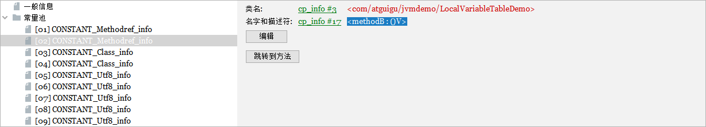 

#### 方法返回地址

方法返回地址存储的是调用该方法的**程序计数器的值**。

**作用：**可以知道调用完当前方法后，上一层方法接着做什么。

一个方法的结束，有两种方式，分别是正常执行完成结束和出现异常导致非正常结束。

无论通过哪种方式退出，在方法退出后都返回到该方法被调用的位置。

1、方法正常退出时，调用者的程序计数器的值作为返回地址，即调用该方法的指令的下一条指令的地址。

2、而通过异常退出的，返回地址是要通过异常表来确定。


### 3.3.3 StackOverflowError

JVM栈的大小是固定的【通常为1MB】，可以通过命令行参数【**-Xss**】进行调整。每个线程都有自己独立的JVM栈，用于支持线程的并发执行。**栈太****小或者方法调用过深**，都将抛出StackOverflowError异常


演示代码：

```java
// -Xss256k：将每个线程的栈大小设置为256KB。
// -Xss1m：将每个线程的栈大小设置为1MB。
// -Xss2m：将每个线程的栈大小设置为2MB。
// 可以根据具体需求来调整栈内存大小。需要注意的是，栈内存的大小应该根据应用程序的需求和系统资源情况进行合理的设置。过小的栈容量可能导致
// StackOverflowError异常，而过大的栈容量可能导致系统资源的浪费。
public class StackDemo02 {   
    
    // 记录调用了多少次出现了栈内存溢出
    private static int count = 0 ;

    // 入口方法
    public static void main(String[] args) {

        try {
            show() ;
        }catch (Throwable e) {
            e.printStackTrace();
        }

        System.out.println("show方法被调用了:" + count + "次");

    }

    // 测试方法
    public static void show() {
        count++ ;
        System.out.println("show方法执行了.....");
        show();
    }

}
```

## 3.4 本地方法栈

与虚拟机栈作用相似。但它不是为Java方法服务的，而是本地方法，本地方法的实现一般都是通过c语言。由于规范对这块没有强制要求，不同虚拟机

实现方法不同。

本地方法：**被native所修饰的方法**

```java
public class Object {
    
    public final native Class<?> getClass();		// 获取字节码文件对象的本地方法
    public native int hashCode();					// 获取对象hashCode值的本地方法
    ...
        
}
```

## 3.5 Java虚拟机堆

### 3.5.1 Java虚拟机堆简介

Java虚拟机堆是Java内存区域中一块用来存放**对象**实例的区域，新创建的对象，数组都使用堆内存；【从Java7开始，常量池也会使用堆内存】

堆内存还可以继续进行细分，如下所示：

 

说明：

1、新生代占整个堆内存的1/3、老年代占整个堆内存的2/3

2、新生代又可以细分为：伊甸园(Eden)、幸存区(from、to)，它们之间的比例默认情况下是8:1:1


**特点**：

1、被**线程共享**，因此需要考虑线程安全问题

2、会产生内存溢出问题


测试代码：

```java
public class HeapDemo01 {

    public static void main(String[] args) {

        int count = 0 ;									// 定义一个变量
        ArrayList arrayList = new ArrayList() ;			// 创建一个ArrayList对象

        try {

            while(true) {
                arrayList.add(new Object()) ;
                count++ ;
            }

        }catch (Throwable a) {
            a.printStackTrace();
            System.out.println("总共执行了:" + count + "次");			// 输出程序执行的次数
        }

    }

}
```

### 3.5.2 堆内存大小研究

在默认情况下，Java虚拟机堆内存的初始大小为物理内存的1/64，并且最大可达物理内存的1/4。其中，新生代和老年代的初始比例通常是1:2，即新

生代占堆内存的1/3，老年代占堆内存的2/3。

可以通过如下的命令查看堆内存的内存分配情况：

```shell
# pid表示的进程的id、可以使用jps命令查询对应的进程id
jmap -heap <pid>		

# 也可以通过如下的jvm参数查看内存分配情况
-XX:+PrintGCDetails
```

打印出来的内存信息如下所示：

```shell
Heap Configuration:
MinHeapFreeRatio		 = 0  // 最小堆空闲比例为0，表示堆内存不会自动收缩
MaxHeapFreeRatio         = 100  // 最大堆空闲比例为100，表示堆内存可以完全释放
MaxHeapSize              = 8518631424 (8124.0MB)  // 最大堆大小为8518631424字节，即8124.0MB
NewSize                  = 177209344 (169.0MB)  // 新生代初始大小为177209344字节，即169.0MB
MaxNewSize               = 2839543808 (2708.0MB)  // 新生代最大大小为2839543808字节，即2708.0MB
OldSize                  = 355467264 (339.0MB)  // 老年代初始大小为355467264字节，即339.0MB
NewRatio                 = 2  // 新生代和老年代的初始比例为2
SurvivorRatio            = 8  // Eden区和Survivor区的初始比例为8
MetaspaceSize            = 21807104 (20.796875MB)  // 元空间的初始大小为21807104字节，即20.796875MB
CompressedClassSpaceSize = 1073741824 (1024.0MB)  // 压缩类空间的大小为1073741824字节，即1024.0MB
MaxMetaspaceSize         = 17592186044415 MB  // 元空间的最大大小为17592186044415MB
G1HeapRegionSize         = 0 (0.0MB)  // G1堆区域的大小为0字节，即0.0MB

Heap Usage:
PS Young Generation

Eden Space:
capacity = 133169152 (127.0MB)  // Eden区的容量为133169152字节，即127.0MB
used     = 7990192 (7.6200408935546875MB)  // Eden区已使用7990192字节，即7.6200408935546875MB
free     = 125178960 (119.37995910644531MB)  // Eden区剩余125178960字节，即119.37995910644531MB
6.00003219964936% used  // Eden区使用率为6.00003219964936%

From Space:
capacity = 22020096 (21.0MB)  // From Space的容量为22020096字节，即21.0MB
used     = 0 (0.0MB)  // From Space未使用
free     = 22020096 (21.0MB)  // From Space剩余22020096字节，即21.0MB
0.0% used  // From Space使用率为0.0%

To Space:
capacity = 22020096 (21.0MB)  // To Space的容量为22020096字节，即21.0MB
used     = 0 (0.0MB)  // To Space未使用
free     = 22020096 (21.0MB)  // To Space剩余22020096字节，即21.0MB
0.0% used  // To Space使用率为0.0%

PS Old Generation
capacity = 355467264 (339.0MB)  // 老年代的容量为355467264字节，即339.0MB
used     = 0 (0.0MB)  // 老年代未使用
free     = 355467264 (339.0MB)  // 老年代剩余355467264字节，即339.0MB
0.0% used  // 老年代使用率为0.0%
```

### 3.5.3 堆内存大小设定

#### -XX:NewRatio

-XX:NewRatio参数：该参数用于设置新生代和老年代的初始比例。例如，-XX:NewRatio=2表示新生代占堆内存的1/3，老年代占堆内存的2/3。

#### -XX:SurvivorRatio

-XX:SurvivorRatio参数：该参数用于设置Eden区和Survivor区的初始比例。例如，-XX:SurvivorRatio=8表示Eden区占新生代的8/10，每个Survivor区占新生代的1/10。

#### -Xms

设置堆的初始大小。例如，-Xms512m表示将堆的初始大小设置为512MB。

#### -Xmx

设置堆的最大大小。例如，-Xmx1024m表示将堆的最大大小设置为1GB。

#### -Xmn

设置新生代的大小。例如，-Xmn256m表示将新生代的大小设置为256MB。

### 3.5.4 对象的分配过程

**① 对象优先在Eden分配**：对象优先在『伊甸园』分配，当『伊甸园』没有足够的空间时，触发 '**Minor GC**'(新生代的GC)

情况一：伊甸园的内存空间足够，不会发生'Minor GC'

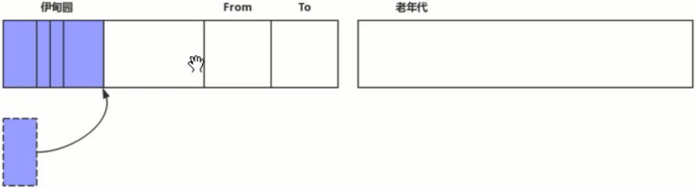 

情况二：伊甸园的空间不够了

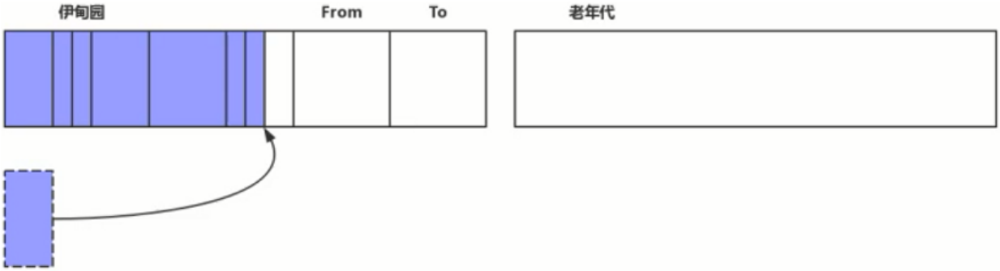 

垃圾回收线程启动，进行垃圾回收，此时会触发"**stop the world   STW**"(停止所有用户线程)

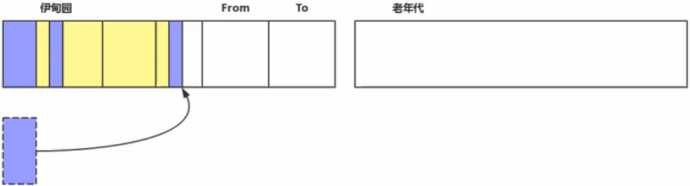 

Eden区中所有存活的对象都会被复制到“To”，而在“From”区中，仍存活的对象会根据他们的**年龄值**来决定去向。年龄最多一定值(最大值是15，对象在Survivor区中每熬过一次Minor GC，年龄就会增加1岁)(年龄阈值，可以通过-XX:MaxTenuringThreshold来设置)的对象会被移动到年老代中，没

有达到阈值的对象会被复制到“To”区域。

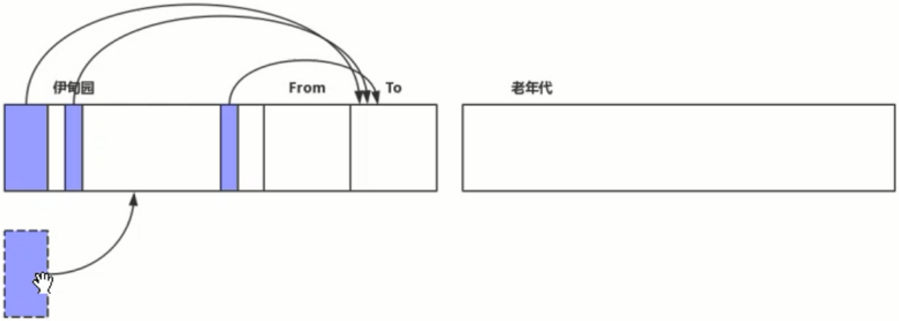 

"From"和"To"会交换他们的角色,下一次垃圾回收的时候也是从Eden将存活的对象复制到TO区

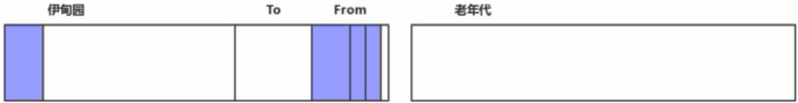 

Minor GC会一直重复这样的过程，直到“To”区被填满，“To”区被填满之后，会将所有对象移动到年老代中。


案例演示：

jvm参数设置：

```shell
-XX:+UseSerialGC -verbose:gc -XX:+PrintGCDetails -XX:+PrintGCTimeStamps -Xloggc:./gc.log -Xms20M -Xmx20M -Xmn10M -XX:SurvivorRatio=8

-XX:+UseSerialGC 是指使用 Serial + SerialOld 回收器组合
-XX:+PrintGCDetails -verbose:gc 是指打印 GC 详细信息
-XX:+PrintGCTimeStamps 打印gc日志的时间戳
-Xloggc:./gc.log 将gc日志输出到一个日志文件中
-Xms20M -Xmx20M -Xmn10M 是指分配给JVM的最小，最大以及新生代内存
-XX:SurvivorRatio=8 是指『伊甸园』与『幸存区 From』和『幸存区 To』比例为 8:1:1
```

定义内存大小变量

```java
private static final int _512KB = 512 * 1024;
private static final int _1MB = 1024 * 1024;
private static final int _4MB = 4 * 1024 * 1024;
private static final int _7MB = 7 * 1024 * 1024;
private static final int _8MB = 8 * 1024 * 1024;
```


案例1：没有创建数组对象，看参数运行情况

案例2：创建一个4M的数组，查看内存分配情况

```java
// 创建一个4M大小的数组
byte[] bytes = new byte[_4MB] ;
```

```java
Heap
 def new generation   total 9216K, used 8192K [0x00000000fec00000, 0x00000000ff600000, 0x00000000ff600000)
  eden space 8192K, 100% used [0x00000000fec00000, 0x00000000ff400000, 0x00000000ff400000)  // 在伊甸园中创建对象
  from space 1024K,   0% used [0x00000000ff400000, 0x00000000ff400000, 0x00000000ff500000)
  to   space 1024K,   0% used [0x00000000ff500000, 0x00000000ff500000, 0x00000000ff600000)
 tenured generation   total 10240K, used 0K [0x00000000ff600000, 0x0000000100000000, 0x0000000100000000)
   the space 10240K,   0% used [0x00000000ff600000, 0x00000000ff600000, 0x00000000ff600200, 0x0000000100000000)
 Metaspace       used 3444K, capacity 4496K, committed 4864K, reserved 1056768K
  class space    used 376K, capacity 388K, committed 512K, reserved 1048576K
```

没有触发GC操作，对象直接在Eden分配；


案例3：创建一个7M的数组，查看内存分配情况

```java
// 创建一个7M大小的数组
byte[] bytes1 = new byte[_7MB] ;
```

```java
-- 触发垃圾回收
[GC (Allocation Failure) [DefNew: 2004K->647K(9216K), 0.0023439 secs] 2004K->647K(19456K), 0.0024142 secs] [Times: user=0.00 sys=0.00, real=0.00 secs] 
Heap
 def new generation   total 9216K, used 7897K [0x00000000fec00000, 0x00000000ff600000, 0x00000000ff600000)
  eden space 8192K,  88% used [0x00000000fec00000, 0x00000000ff314930, 0x00000000ff400000)
  from space 1024K,  63% used [0x00000000ff500000, 0x00000000ff5a1e58, 0x00000000ff600000)
  to   space 1024K,   0% used [0x00000000ff400000, 0x00000000ff400000, 0x00000000ff500000)
 tenured generation   total 10240K, used 0K [0x00000000ff600000, 0x0000000100000000, 0x0000000100000000)
   the space 10240K,   0% used [0x00000000ff600000, 0x00000000ff600000, 0x00000000ff600200, 0x0000000100000000)
 Metaspace       used 3446K, capacity 4496K, committed 4864K, reserved 1056768K
  class space    used 376K, capacity 388K, committed 512K, reserved 1048576K
```

由于程序在启动的时候jdk内部还会存在一些对象的创建，因此当我们分配了一个7M的内存空间，eden内存不足，因此发生了一次Minor GC！并且将

存活下的对象最终存储到from区中。


案例4： 在案例3的基础上，在分配一个512KB的数组内存空间

```java
byte[] bytes1 = new byte[_7MB] ;
byte[] bytes2 = new byte[_512KB] ;
```

```java
[GC (Allocation Failure) [DefNew: 2005K->623K(9216K), 0.0015235 secs] 2005K->623K(19456K), 0.0015799 secs] [Times: user=0.00 sys=0.00, real=0.00 secs] 
Heap
 def new generation   total 9216K, used 8713K [0x00000000fec00000, 0x00000000ff600000, 0x00000000ff600000)
  eden space 8192K,  98% used [0x00000000fec00000, 0x00000000ff3e6820, 0x00000000ff400000)
  from space 1024K,  60% used [0x00000000ff500000, 0x00000000ff59bdb8, 0x00000000ff600000)
  to   space 1024K,   0% used [0x00000000ff400000, 0x00000000ff400000, 0x00000000ff500000)
 tenured generation   total 10240K, used 0K [0x00000000ff600000, 0x0000000100000000, 0x0000000100000000)
   the space 10240K,   0% used [0x00000000ff600000, 0x00000000ff600000, 0x00000000ff600200, 0x0000000100000000)
 Metaspace       used 3444K, capacity 4496K, committed 4864K, reserved 1056768K
  class space    used 376K, capacity 388K, committed 512K, reserved 1048576K

```

触发一次GC操作！并且将存活下的对象最终存储到from区中，第二次分配_512KB大小的内存空间的时候，直接在伊甸园分配即可。


案例5： 在4的基础上在分配一个512KB的数组内存空间

```java
byte[] bytes1 = new byte[_7MB] ;
byte[] bytes2 = new byte[_512KB] ;
byte[] bytes3 = new byte[_512KB] ;
```

```java
[GC (Allocation Failure) [DefNew: 2004K->620K(9216K), 0.0018706 secs] 2004K->620K(19456K), 0.0019275 secs] [Times: user=0.00 sys=0.00, real=0.00 secs] 
[GC (Allocation Failure) [DefNew: 8628K->539K(9216K), 0.0063389 secs] 8628K->8323K(19456K), 0.0063773 secs] [Times: user=0.00 sys=0.01, real=0.01 secs] 
Heap
 def new generation   total 9216K, used 1133K [0x00000000fec00000, 0x00000000ff600000, 0x00000000ff600000)
  eden space 8192K,   7% used [0x00000000fec00000, 0x00000000fec94930, 0x00000000ff400000)
  from space 1024K,  52% used [0x00000000ff400000, 0x00000000ff486de0, 0x00000000ff500000)
  to   space 1024K,   0% used [0x00000000ff500000, 0x00000000ff500000, 0x00000000ff600000)
 tenured generation   total 10240K, used 7784K [0x00000000ff600000, 0x0000000100000000, 0x0000000100000000)
   the space 10240K,  76% used [0x00000000ff600000, 0x00000000ffd9a040, 0x00000000ffd9a200, 0x0000000100000000)
 Metaspace       used 3443K, capacity 4496K, committed 4864K, reserved 1056768K
  class space    used 376K, capacity 388K, committed 512K, reserved 1048576K
```

触发了2次垃圾回收！并且将from区中存活的对象存储到老年代！

**② 大对象直接晋升至老年代**

当对象太大，伊甸园包括幸存区都存放不下时，这时候老年代的连续空间足够，此对象会直接晋升至老年代，不会发生 GC

 

结果

 


案例演示：

案例1：直接分配一个8M的内存空间

```java
byte[] bytes1 = new byte[_8MB] ;
```

伊甸园总大小只有 8 MB，但新分配的对象大小已经是 8MB，而幸存区都仅有 1MB，也无法容纳这个对象

```java
Heap
 def new generation   total 9216K, used 2169K [0x00000000fec00000, 0x00000000ff600000, 0x00000000ff600000)
  eden space 8192K,  26% used [0x00000000fec00000, 0x00000000fee1e560, 0x00000000ff400000)
  from space 1024K,   0% used [0x00000000ff400000, 0x00000000ff400000, 0x00000000ff500000)
  to   space 1024K,   0% used [0x00000000ff500000, 0x00000000ff500000, 0x00000000ff600000)
 tenured generation   total 10240K, used 8192K [0x00000000ff600000, 0x0000000100000000, 0x0000000100000000)
   the space 10240K,  80% used [0x00000000ff600000, 0x00000000ffe00010, 0x00000000ffe00200, 0x0000000100000000)
 Metaspace       used 3443K, capacity 4496K, committed 4864K, reserved 1056768K
  class space    used 376K, capacity 388K, committed 512K, reserved 1048576K
```

可以看到结果并没有发生 GC，大对象直接被放入了老年代「tenured generation   total 10240K, used 8192K」


案例演示2：老年代连续空间不足，触发 Full GC

```java
byte[] bytes1 = new byte[_8MB] ;
byte[] bytes2 = new byte[_8MB] ;
```

第一个 8MB 直接进入老年代，第二个 8MB 对象在分配时发现老年代空间不足，只好尝试先进行一次 Minor GC，结果发现新生代没有连续空间，只

好触发一次 Full GC，最后发现老年代也没有连续空间，这时出现 OutOfMemoryError

```java
[GC (Allocation Failure) [DefNew: 2004K->647K(9216K), 0.0022693 secs][Tenured: 8192K->8838K(10240K), 0.0452151 secs] 10197K->8838K(19456K), [Metaspace: 3438K->3438K(1056768K)], 0.0504669 secs] [Times: user=0.00 sys=0.00, real=0.05 secs] 
[Full GC (Allocation Failure) [TenuredException in thread "main" : 8838K->8820K(10240K), 0.0027463 secs] 8838K->8820K(19456K), [Metaspace: 3438K->3438K(1056768K)], 0.0027877 secs] [Times: user=0.00 sys=0.00, real=0.00 secs] 
java.lang.OutOfMemoryError: Java heap space
	at com.itheima.jvm.gc.ObjectMemoryDemo.main(ObjectMemoryDemo.java:14)
Heap
 def new generation   total 9216K, used 246K [0x00000000fec00000, 0x00000000ff600000, 0x00000000ff600000)
  eden space 8192K,   3% used [0x00000000fec00000, 0x00000000fec3d890, 0x00000000ff400000)
  from space 1024K,   0% used [0x00000000ff500000, 0x00000000ff500000, 0x00000000ff600000)
  to   space 1024K,   0% used [0x00000000ff400000, 0x00000000ff400000, 0x00000000ff500000)
 tenured generation   total 10240K, used 8820K [0x00000000ff600000, 0x0000000100000000, 0x0000000100000000)
   the space 10240K,  86% used [0x00000000ff600000, 0x00000000ffe9d220, 0x00000000ffe9d400, 0x0000000100000000)
 Metaspace       used 3470K, capacity 4496K, committed 4864K, reserved 1056768K
  class space    used 379K, capacity 388K, committed 512K, reserved 1048576K
```

### 3.5.5 对内存分代意义

年轻代和老年代的划分是为了更好的内存分派及回收，提高效率。

1、堆是垃圾回收机制的重点区域。我们知道垃圾回收机制有三种，minor gc，major gc 和full gc，针对于堆的就是前两种。年轻代的叫 minor gc，老年代的叫major gc。

2、分代的垃圾回收策略，是基于这样一个事实：不同的对象的生命周期是不一样的。因此，不同生命周期的对象可以采取不同的收集方式，以便提高回收效率。

3、分代垃圾回收采用分治的思想，进行代际的划分，把不同生命周期的对象放在不同代上，不同代上采用最适合它的垃圾回收方式进行回收。

## 3.6 方法区

### 3.6.1 方法区概述

方法区是被所有**线程共享**。《深入理解Java虚拟机》书中对方法区存储内容的经典描述如下：它用于存储已被虚拟机加载的类型信息、常量、静态变量、即时编译器编译后的代码缓存等：

 

方法区主要包含以下几个重要的组成部分：

1、类信息：方法区存储了加载的类的结构信息，包括类的名称、父类、接口、字段、方法等。这些信息在类加载过程中被加载到方法区，并且在运行时被使用。

2、运行时常量池：每个类都有一个运行时常量池，它是方法区的一部分。运行时常量池用于存储编译期生成的各种字面量和符号引用。例如，字符串常量、类和方法的符号引用等都存储在运行时常量池中。

3、静态变量：所有类的静态变量都存储在方法区中。静态变量在类加载时被初始化，并且在整个程序的生命周期内存在。

4、即时编译器编译后的代码：当JVM将某段热点代码（HotSpot）识别出来后，会将其编译为机器码以提高执行效率。这些编译后的代码被存储在方法区中。


方法区演进细节：

 


补充：只有Hotspot才有永久代。BEA JRockit、IBM J9等来说，是不存在永久代的概念的。原则上如何实现属于虚拟机自己的实现细节，不受《Java虚拟机规范》管束，并不要求统一。

变化的原因：

1、提高内存的回收效率(方法区内存的回收效率远远低于堆内存，因为方法去中存储的都是类信息，静态变量...这些信息不能被轻易回收)

2、字符串常量池在方法区，那么很容易产生内存溢出(因为方法区的垃圾回收效率比较低)


特点：

1、线程共享：方法区是所有线程共享的内存区域。在JVM中，每个线程都有自己的程序计数器、虚拟机栈和本地方法栈，但是方法区是所有线程共享的。这意味着多个线程可以同时访问和修改方法区中的数据。

2、可调整大小：方法区的大小可以通过JVM参数进行调整。在旧版本的JVM中，方法区被称为永久代（Permanent Generation），可以使用

> -XX:PermSize和-XX:MaxPermSize参数来设置永久代的初始大小和最大大小。而在JDK 8及以上版本，方法区被替换为元空间（Metaspace），可以使用-XX:MetaspaceSize和-XX:MaxMetaspaceSize参数来设置元空间的初始大小和最大大小。

3、会产生内存溢出：不合理的类加载和卸载、过多的常量池等因素可能导致方法区溢出（OutOfMemoryError）


### 3.6.2 内存溢出演示

测试代码如下所示：

```java
/**
	jdk1.8的元数据区可以使用参数-XX:MaxMetaspaceSzie设定大小	
 * 演示元空间内存溢出
 * -XX:-UseCompressedClassPointers -XX:MaxMetaspaceSize=10m
 	UseCompressedClassPointers使用指针压缩，如果不使用这个参数可能会出现: Compressed class space内存溢出
 */
public class MaxMetaspaceDemo extends ClassLoader {				// 当前这个类就是一个类加载器
    
    public static void main(String[] args) {
        
        // 定义变量，记录程序产生类的个数
        int j = 0;
        
        try {
            
            MaxMetaspaceDemo test = new MaxMetaspaceDemo();
            
            for (int i = 0; i < 10000; i++, j++) {
                
                // 字节码写入器
                ClassWriter cw = new ClassWriter(0);
                
                // 定义一个类版本为Opcodes.V1_1，它的访问域为public，名称为Class{i},父类为java.lang.Object，不实现任何接口
                cw.visit(Opcodes.V1_1, Opcodes.ACC_PUBLIC, "Class" + i, null, "java/lang/Object", null);
                byte[] code = cw.toByteArray();
                
                // 加载该类
                test.defineClass("Class" + i, code, 0, code.length);
            }
        } finally {
            System.out.println(j);
        }
    }
}
```

# 4 执行引擎

## 4.1 执行引擎概述

执行引擎的结构如下所示：

 

执行引擎主要包含以下几个重要的组成部分：

1、解释器（Interpreter）：解释器逐条解释字节码指令，并将其转换为对应的机器码进行执行。解释器的优点是实现简单、快速启动和适应性强，但由于每次执行都需要解释字节码，因此执行效率相对较低。

2、即时编译器（Just-In-Time Compiler，JIT）：即时编译器将热点代码（HotSpot）从字节码直接编译成机器码，以提高执行效率。热点代码通常是经过多次执行的代码块，即被频繁调用的方法或循环等。即时编译器可以根据运行时的情况进行优化，例如内联展开、方法内联、去除无用代码等。JVM中常用的即时编译器有C1（Client Compiler）和C2（Server Compiler）。

3、垃圾回收器（Garbage Collector）：垃圾回收器负责自动回收不再使用的对象，并释放其占用的内存空间。执行引擎与垃圾回收器紧密合作，当执行引擎发现某个对象不再被引用时，会通知垃圾回收器进行回收。垃圾回收器的工作涉及到堆内存的分配和释放，以及对象的标记、清除等操作。

## 4.2 垃圾对象判定

要进行垃圾回收，那么首先需要找出垃圾，如果判断一个对象是否为垃圾呢? 

两种算法：

1、引用计数法

2、可达性分析算法

### 4.2.1 引用计数法

**① 引用计数法**：堆中每个对象实例都有一个引用计数。当一个对象被创建时，且将该对象实例分配给一个变量，该变量计数设置为1。当任何其它变量被赋值为这个对象的引用时，计数加1（a = b,则b引用的对象实例的计数器+1），但当一个对象实例的某个引用超过了生命周期或者被设置为一个新值时，对象实例的引用计数器减1。任何引用计数器为0的对象实例可以被当作垃圾收集。

特点：简单、无法解决循环引用问题

定义学生类：

```java
public class Student {

    // 定义成员变量
    public Object instance ;

}
```

编写测试类：

```java
/*
	jvm参数：-verbose:gc -XX:+PrintGCDetails -XX:+PrintGCTimeStamps
	-verbose:gc -XX:+PrintGCDetails：打印gc日志信息
	-XX:+PrintGCTimeStamps: 打印gc日志的时间戳
*/
public class ReferenceCountGcDemo {

    public static void main(String[] args) {

        // 创建Student对象
        Student a = new Student() ;
        Student b = new Student() ;

        // 进行循环引用
        a.instance = b ;
        b.instance = a ;

        // 将a对象和b对象设置为null
        a = null ;
        b = null ;

        // 调用System.gc进行垃圾回收
        System.gc();                    // 如果没有触发垃圾回收说明Hotspot的jvm使用的就是引用计数法来判断对象是否为垃圾

    }

}
```

控制台输出gc日志:   

```java
0.076: [GC (System.gc()) [PSYoungGen: 7802K->856K(151552K)] 7802K->864K(498688K), 0.0008493 secs] [Times: user=0.17 sys=0.02, real=0.00 secs] 
0.077: [Full GC (System.gc()) [PSYoungGen: 856K->0K(151552K)] [ParOldGen: 8K->620K(347136K)] 864K->620K(498688K), [Metaspace: 3356K->3356K(1056768K)], 0.0044768 secs] [Times: user=0.00 sys=0.00, real=0.00 secs] 
Heap
 PSYoungGen      total 151552K, used 3901K [0x0000000716c00000, 0x0000000721500000, 0x00000007c0000000)
  eden space 130048K, 3% used [0x0000000716c00000,0x0000000716fcf748,0x000000071eb00000)
  from space 21504K, 0% used [0x000000071eb00000,0x000000071eb00000,0x0000000720000000)
  to   space 21504K, 0% used [0x0000000720000000,0x0000000720000000,0x0000000721500000)
 ParOldGen       total 347136K, used 620K [0x00000005c4400000, 0x00000005d9700000, 0x0000000716c00000)
  object space 347136K, 0% used [0x00000005c4400000,0x00000005c449b318,0x00000005d9700000)
 Metaspace       used 3365K, capacity 4496K, committed 4864K, reserved 1056768K
  class space    used 370K, capacity 388K, committed 512K, reserved 1048576K
```

```java
① 0.076: 代表gc发生的时间，从jvm启动以来经过的秒数
③ [PSYoungGen：表示GC发生的区域, 不同的垃圾收集器展示的区域名称不一样，PSYoungGen表示的是新生代，这里默认使用的是Parallel Scavenge收集器 (-XX:+UseSerialGC)
④ 7802K->856K(151552K)：GC前该区域已使用容量 -> GC后该区域已使用容量(该区域的总容量)
⑤ 7802K->864K(498688K)：GC前Java堆已使用容量 -> GC后Java堆已使用容量(Java堆总容量)
⑥ 0.0008493 secs：该区域GC所占用的时间
⑦ [Times: user=0.17 sys=0.02, real=0.00 secs]: 分别表示用户态消耗的CPU时间、内核态消耗的CPU时间和操作从开始到结束所经过的墙钟时间(墙钟时间包括非运算的等待耗时)。多线程操作会叠加这些CPU时间，所以user、sys时间超过real时间是完全正常的。  
```

### 4.2.2 可达性分析算法

**② 可达性分析算法 **： 可达性分析算法又叫做**跟搜索法**，就是通过一系列的称之为"GC Roots"的对象作为起始点，从这些节点开始向下搜索，搜索

走过的路径被称为（Reference Chain)，当一个对象到GC Roots没有任何引用链相连时（即从GC Roots节点到该节点不可达），则证明该对象是不可用的。(类似于葡萄串)；

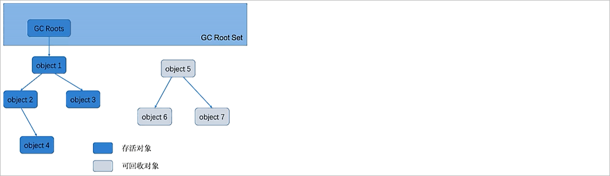 


在Java语言中，可以作为GC Roots的对象包括下面几种：

1、虚拟机栈（栈帧中的本地变量表）中的引用对象  ==> 正在运行的方法中的参数、局部变量等

2、方法区中的类静态属性引用的对象 ==> 类的引用类型的静态变量

3、方法区中的常量引用的对象 ==> 运行时常量池中的对象，例如程序中需要使用的类的类类型对象

4、本地方法栈中JNI（Native方法）的引用对象 ==> 正在运行的本地方法

5、Java虚拟机的内部引用 ==> 基本数据类型对应的Class对象，常驻异常对象（空指针、OOM等），系统类加载器

6、被同步锁synchronize持有的对象。


## 4.3 垃圾回收算法

当判断一个对象为垃圾以后，那么此时就需要对垃圾进行回收，不同的区域使用的垃圾回收算法是不一样的。

### 4.3.1 标记清除

执行过程：首先标记出所有需要回收的对象，在标记完成后统一回收所有被标记的对象。

 

优点：速度比较快

缺点：会产生内存碎片，碎片过多，仍会使得连续空间少

### 4.3.2 标记整理

执行过程：首先标记出所有需要回收的对象，在标记完成后统一进行整理，整理是指存活对象向一端移动来减少内存碎片，相对效率较低

 

优点：无内存碎片

缺点：效率较低

### 4.3.3 复制算法

执行过程：开辟两份大小相等空间，一份空间始终空着，垃圾回收时，将存活对象拷贝进入空闲空间；

 

优点：无内存碎片

缺点：占用空间多

注意：如果有很多对象的存活率较高，这时我们采用复制算法，那么效率就比较低；

### 4.3.4 分代回收

概述：根据对象存活周期的不同，将对象划分为几块，比如Java的堆内存，分为新生代和老年代，然后根据各个年代的特点采用最合适的算法；新生代对象的存活的时间都比较短，因此使用的是【复制算法】；而老年代对象存活的时间比较长那么采用的就是【标记清除】或者【标记整理】；

## 4.4 四种引用类型

了为了更灵活地管理对象的生命周期和内存使用，在Java中提供了四种常见的引用类型。

### 4.4.1 强引用

Java中默认声明的就是强引用，比如：

```java
Object obj = new Object(); //只要obj还指向Object对象，Object对象就不会被回收
obj = null;  //手动置null
```

只要**强引用存在，垃圾回收器将永远不会回收被引用的对象**，哪怕内存不足时，JVM也会直接抛出OutOfMemoryError，不会去回收。如果想中断强引用与对象之间的联系，可以显示的将强引用赋值为null，这样一来，JVM就可以适时的回收对象了！

示例：

```java
/**
 * JVM参数：-verbose:gc -XX:+PrintGCDetails -Xms10M -Xmx10M -Xmn5M
 */
public class StrongReferenceDemo01 {

    private static List<Object> list = new ArrayList<Object>() ;
    public static void main(String[] args) {

        // 创建对象
        for(int x = 0 ;  x < 10 ; x++) {
            byte[] buff = new byte[1024 * 1024 * 1];
            list.add(buff);
        }

    }

}
```

### 4.4.2 软引用

软引用是用来描述一些非必需但仍有用的对象。**在内存足够的时候，软引用对象不会被回收，只有在内存不足时，系统则会回收软引用对象，如果回收了软引用对象之后仍然没有足够的内存，才会抛出内存溢出异常**。这种特性常常被用来实现缓存技术，比如网页缓存，图片缓存等。

在 JDK1.2 之后，用java.lang.ref.**SoftReference**类来表示软引用。

示例代码：

```java
/**
 * JVM参数：-verbose:gc -XX:+PrintGCDetails -Xms10M -Xmx10M -Xmn5M
 */
public class SoftReferenceDemo01 {

    private static List<Object> list = new ArrayList<>();

    public static void main(String[] args) {

        // 创建数组对象
        for(int x = 0 ; x < 10 ; x++) {
            SoftReference<byte[]> softReference = new SoftReference<byte[]>(new byte[1024 * 1024 * 1]) ;
            list.add(softReference) ;
        }

        System.gc();  // 主动通知垃圾回收器进行垃圾回收
        
        for(int i=0; i < list.size(); i++){
            Object obj = ((SoftReference) list.get(i)).get();
            System.out.println(obj);
        }
        
    }

}
```

我们发现无论循环创建多少个软引用对象，打印结果总是有一些为null，这里就说明了在内存不足的情况下，软引用将会被自动回收。

### 4.4.3 弱引用

弱引用的引用强度比软引用要更弱一些，**无论内存是否足够，只要 JVM 开始进行垃圾回收，那些被弱引用关联的对象都会被回收**。在 JDK1.2

之后,用java.lang.ref.**WeakReference**来表示弱引用。

示例代码：

```java
/**
 * JVM参数：-verbose:gc -XX:+PrintGCDetails -Xms10M -Xmx10M -Xmn5M
 */
public class WeakReferenceDemo01 {

    private static List<Object> list = new ArrayList<>();

    public static void main(String[] args) {

        // 创建数组对象
        for(int x = 0 ; x < 10 ; x++) {
            WeakReference<byte[]> weakReference = new WeakReference<byte[]>(new byte[1024 * 1024 * 1]) ;
            list.add(weakReference) ;
        }

        System.gc();  // 主动通知垃圾回收器进行垃圾回收

        for(int i=0; i < list.size(); i++){
            Object obj = ((WeakReference) list.get(i)).get();
            System.out.println(obj);
        }
        
    }

}
```

### 4.4.4 虚引用

虚引用是最弱的一种引用关系，如果**一个对象仅持有虚引用，那么它就和没有任何引用一样，它随时可能会被回收**，在 JDK1.2 之后，用 PhantomReference 类来表示，通过查看这个类的源码，发现它只有一个构造函数和一个 get() 方法，而且它的 get() 方法仅仅是返回一个null，也就是说将永远无法通过虚引用来获取对象，虚引用必须要和 ReferenceQueue 引用队列一起使用。

```java
public class PhantomReference<T> extends Reference<T> {

    /**
     * Returns this reference object's referent.  Because the referent of a
     * phantom reference is always inaccessible, this method always returns
     * <code>null</code>.
     *
     * @return  <code>null</code>
     */
    public T get() {
        return null;
    }

    /**
     * Creates a new phantom reference that refers to the given object and
     * is registered with the given queue.
     *
     * <p> It is possible to create a phantom reference with a <tt>null</tt>
     * queue, but such a reference is completely useless: Its <tt>get</tt>
     * method will always return null and, since it does not have a queue, it
     * will never be enqueued.
     *
     * @param referent the object the new phantom reference will refer to
     * @param q the queue with which the reference is to be registered,
     *          or <tt>null</tt> if registration is not required
     */
    public PhantomReference(T referent, ReferenceQueue<? super T> q) {
        super(referent, q);
    }

}
```

特点：

1、每次垃圾回收时都会被回收，主要用于监测对象是否已经从内存中删除

2、虚引用必须和引用队列关联使用, 当垃圾回收器准备回收一个对象时，如果发现它还有虚引用，就会把这个虚引用加入到与之关联的引用队列中

3、程序可以通过判断引用队列中是否已经加入了虚引用，来了解被引用的对象是否将要被垃圾回收。如果程序发现某个虚引用已经被加入到引用队列，那么就可以在所引用的对象的内存被回收之前采取必要的行动

示例代码：

```java
public class PhantomReferenceDemo {

    public static void main(String[] args) throws InterruptedException {

        // 创建一个引用队列
        ReferenceQueue<Object> referenceQueue = new ReferenceQueue<Object>();
        
        // 创建一个虚引用，指向一个Object对象
        PhantomReference<Object> phantomReference = new PhantomReference<Object>(new Object(), referenceQueue);
        
        // 主动通知垃圾回收器进行垃圾回收
        System.gc();
        
        // 从引用队列中获取元素, 该方法是阻塞方法
        System.out.println(referenceQueue.remove()); 

    }
}
```

## 4.5 垃圾收集器

在进行垃圾回收的时候是通过垃圾收集器完成的。

### 4.5.1 常见的垃圾收集器

常见的垃圾收集器汇总，如下图所示：

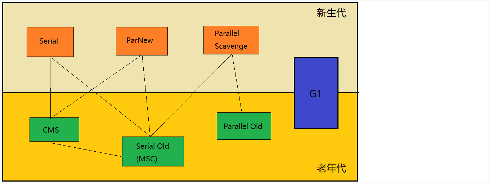 

不同的垃圾收集器，作用的堆内存空间是不一样的；上面的  serial ， parnew ， Paraller Scavenge 是新生代的垃圾回收器；CMS ， Serial Old ， Paralle Old是老年代的垃圾收集器 ， G1垃圾收集器可以作用于新生代和老年代； 连线表示垃圾收集器可以搭配使用；

可以通过如下的命令查看当前进程所使用的垃圾收集器：

```shell
jcmd <PID> VM.flags
```


### 4.5.2 Serial/Serial Old收集器

特点：

1、Serial是一个**单线程**的垃圾收集器

2、"Stop The World"，它进行垃圾收集时，必须暂停其他所有的工作线程，直到它收集结束。在用户不可见的情况下把用户正常工作的线程全部停掉。

3、垃圾回收算法选择：新生代（Serial）使用复制算法、老年代（Serial Old）使用标记整理算法

4、参数控制

* -XX:+UseSerialGC 年轻代和老年代都用串行收集器

如下图所示：

 

应用场景：

1、使用场景：多用于桌面应用，Client端的垃圾回收器

2、桌面应用内存小，进行垃圾回收的时间比较短，只要不频繁发生停顿就可以接受

### 4.5.3 ParNew收集器

概述:ParNew收集器收集器其实就是Serial收集器的**多线程**版本，除了使用多线程进行垃圾收集之外，其余行为包括Serial收集器可用的所有控制参数、收集算法、Stop The world、对象分配规则、回收策略等都与Serial收集器完全一样，实现上这两种收集器也共用了相当多的代码。

如下所示：

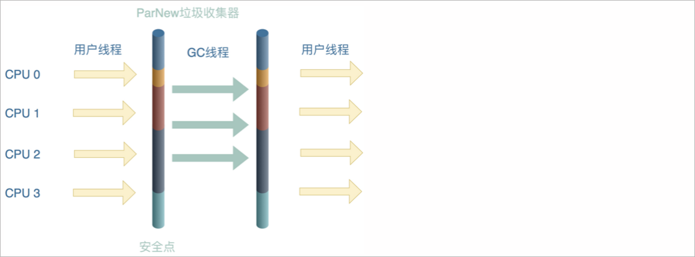 

特点：

1、垃圾回收算法选择：新生代（Serial）使用复制算法、老年代（Serial Old）使用标记整理算法

2、参数控制：

* -XX:+UseParNewGC 年轻代使用ParNew，老年代使用 Serial Old
* 通过-XX:ParallelGCThreads控制线程数量

应用场景：它却是许多运行在 Server 模式下的虚拟机中首选的新生代收集器

注意：如果是单核cpu即使使用该垃圾回收器也无法提高执行效率

### 4.5.4 Parallel / Parallel Old收集器

Parallel收集器类似ParNew收集器，Parallel收集器更关注系统的吞吐量。可以通过参数来打开自适应调节策略，虚拟机会根据当前系统的运行情况收集性能监控信息，**动态调整这些参数以提供最合适的停顿时间或最大的吞吐量**；也可以通过参数控制GC的时间不大于多少毫秒或者比例。

**吞吐量**：就是 CPU 用于运行用户代码的时间与 CPU 总消耗时间的比值，即**吞吐量=运行用户代码时间/（运行用户代码时间+垃圾收集时间）**，虚拟机总共运行了 100 分钟，其中垃圾收集花掉 1 分钟，那吞吐量就是 99%  

特点：

1、新生代使用复制算法、老年代使用标记整理算法。

2、参数控制：

* -XX:+UseParallelGC 年轻代使用Paraller Scavenge，老年代使用Serial Old
* -XX:+UseParallelOldGC 新生代Paraller Scavenge，老年代使用Paraller Old

3、Parallel Old是Parallel Scavenge收集器的老年代版本，使用多线程和标记整理算法。这个收集器是在JDK 1.6中才开始提供

应用场景：高吞吐量则可以高效率地利用 CPU 时间，尽快完成程序的运算任务，主要适合在后台运算而不需要太多交互的任务。

### 4.5.5 CMS收集器(重点)

概述：CMS  (Concurrent Mark Sweep）收集器是-种以获取最短回收停顿时间为目标的收集器。

特点：

1、CMS 收集器是基于“标记-清除”算法实现的

2、目前很大一部分的Java应用集中在互联网站或者B/S系统的服务端上,这类应用尤其重视服务的响应速度，希望系统**停顿时间最短**，以给用户带来较好的体验。

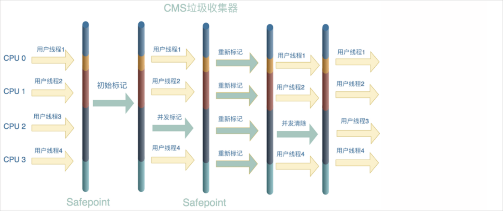 

垃圾回收步骤流程：

1、初始标记（CMS initial mark)  		  -------- 标记一下 GC Roots 能**直接关联**到的对象，速度很快（stop the world）

2、并发标记（CMS concurrent mark）  -------- 对初始标记标记过的对象，进行trace（进行追踪，得到所有关联的对象，进行标记）

3、重新标记（CMS remark)                   -------- 为了修正并发标记期间因用户程序导致标记产生变动的标记记录（stop the world）

4、并发清除（CMS concurrent sweep)  

缺点：会产生垃圾碎片


参数控制：

1、-XX:+UseConcMarkSweepGC，表示年轻代使用ParNew，老年代的用CMS + Serial Old

2、-XX:+ UseCMSCompactAtFullCollection Full GC后，进行一次碎片整理；整理过程是独占的，会引起停顿时间变长

3、 -XX:+CMSFullGCsBeforeCompaction 设置进行几次Full GC后，进行一次碎片整理

4、-XX:ParallelCMSThreads 设定CMS的线程数量（一般情况约等于可用CPU数量）

### 4.5.6 G1收集器

#### G1收集器简介

在《GC收集算法与GC收集器》这篇文章中介绍了JVM中经典的垃圾收集器，这些垃圾收集器的共性是在整个垃圾收集过程中，一定会发生Stop The World，并且STW的时间是根据垃圾标记所需要的时间来确定，可能依然会存在某次垃圾收集时，**STW的时间过长的问题**，导致这个问题的原因在于经典的垃圾收集器都是对整个新生代或老年代进行垃圾回收，要**扫描的对象太多了**。但STW又是每个垃圾收集器都不可避免的，垃圾收集器的发展就是为了能够尽量缩短STW的时间。

G1采用了开创性的**局部收集**的设计思路和以Region为基本单位的内存布局方式，它将Java堆空间划分成多个大小相等的独立区域(Region)，JVM目标是总共**不超过2048个Region**(由JVM源码参数TARGET_REGION_NUMBER定义)，虽然可以超过该值，但不推荐。

通常**Region的大小**等于堆空间总大小除以Region的个数，比如堆空间大小为4096MB，总共有2048个Region，那么每个Region的大小为2MB，也可以通过参数**-XX:G1HeapRegionSize**来指定Region的大小，假设参数值为4MB，那么堆空间就只有1024个Region了，一般推荐默认的计算方式。

G1对应的堆空间的内存布局如下所示：

 

G1虽然抛弃了将新生代和老年代作为整块内存空间的方式，但依然保留了新生代和老年代的概念。只是老年代和新生代的内存空间不再是物理连续的了，它们都是Region的集合。

G1将所有Region分为四种类型：Eden、Survivor、Old、Humongous。


**默认新生代的Region内存占堆空间的5%**，如果堆空间大小为4096MB，那么新生代占用200MB左右的内存，按照每个Region为2MB，对应就是100个Region。也可以通过参数-XX:G1NewSizePercent设置新生代初始占比。在系统运行过程中，JVM会**动态地给年轻代增加更多的Region**，但新生代的占比最多不会超过60%，可以通过参数-XX:G1MaxNewSizePercent设置。**Region的区域类型是动态变化的，可能之前是年轻代，经过了垃圾回收之后就变成了老年代**。G1中的新生代依然与经典垃圾收集器中一样，分为Eden区和Survivor区，默认比例也是8:1:1，如果新生代有100个

Region，那么就是Eden区占用80个，两个Survivor区各占用10个。


G1收集器对于对象从新生代转移到老年代与CMS等经典垃圾收集器是一样的，但对于大对象的处理有所不同。**G1为大对象**的内存分配专门设计了一个**Humongous**类型的Region，而不再是让对象直接进入老年代的Region。在G1中，大对象的判断是**超过一个Region大小的50%**，按照每个Region大小为2MB来计算，只要对象超过了1MB，就会被放入到Humongous的Region中，如果一个对象太大，一个Region放不下，可能会存在**跨多个Region**来存放。在进行**Full GC**的时候除了要收集新生代和老年代的Region外，还会将Humongous的Region一并进行回收。

#### G1垃圾回收过程

G1的垃圾回收过程如下图所示：

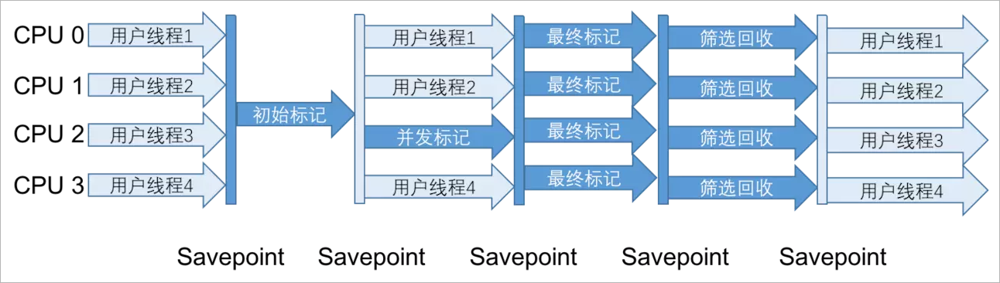

大致可划分为以下几个步骤：

1、初始标记（Initial Making）：需要暂定所有线程，即STW，并记录下**GC Roots**能直接引用的对象，速度很快，与CMS的初始标记一样。

2、并发标记（Concurrent Marking）：可以与应用线程一起工作，进行可达性分析，与CMS的并发标记一样

3、最终标记（Final Marking）：需要暂定所有线程(STW)，根据指定的算法修复一些引用的状态，与CMS的重新标记是一样的

4、筛选回收（Live Data Counting and Evacuation）：筛选回收阶段会对各个Region的**回收价值和成本**进行排序，根据用户所期望的GC停顿STW时间(可以通过参数 -XX:MaxGCPauseMillis设置)来制定回收计划，然后按照制定的回收计划采用**复制算法**进行垃圾回收。


比如此时有1000个Region都满了，但根据用户设置的STW时间，本次垃圾回收只能停顿200毫秒，那么通过之前的回收成本计算，200毫秒只能回收600个Region的内存空间，那么G1就会只回收这600个Region(Collection Set，要回收的集合)的内存空间，尽量把GC的停顿时间控制在用户指定的停顿时间内。


在回收的时候，使用的是**复制算法**，将一个Region中的存活对象移动到另一个空的Regin中，然后将之前的Region内存空间清空，G1就不需要像CMS那样回收完内存后因为有很多脆片还要进行整理，采用复制算法几乎不会有内存碎片。CMS在并发清理阶段，垃圾收集线程是可以与用户线程一起并发执行，但G1因为内部实现太复杂就没有实现并行回收，不过到了**ZGC**【JDK11提供的一种低延迟的垃圾回收器】就实现了并发收集。


**在筛选回收阶段对各个Region进行回收价值和成本进行排序，这句话怎么理解？**

比如现在有Region1、Region2和Region3三个区域，其中Region1预计可以回收1.5MB内存，预计耗时2MS；Region2预计可以回收1MB内存，预计耗时1MS；Region3预计可以回收0.5MB内存，预计耗时1MS。那么Region1、Region2和Region3各自的回收价值与成本比值分别是：0.75、1和0.5。**比值越高说明同样的付出，收益越高**，如果此时只能回收一个Region的内存空间，G1就会选择Region2进行回收。这种方式保证了G1收集器在有限的时间内尽可能地提高收集效率。


### 4.5.7 常见的垃圾收集器对比

如下所示：

| 垃圾收集器   | 主要特点                                         | 适用场景                                               |
| ------------ | ------------------------------------------------ | ------------------------------------------------------ |
| Serial       | 单线程垃圾回收，暂停应用程序                     | 小型或简单的应用程序，单核处理器或较小的内存环境       |
| Parallel     | 多线程并行垃圾回收，暂停应用程序                 | 多核处理器，需要高吞吐量的应用程序                     |
| CMS          | 并发标记和并发清除，减少停顿时间                 | 对响应时间要求较高的应用程序                           |
| G1           | 划分堆内存为多个区域，可预测的停顿时间和高吞吐量 | 大内存、多核处理器的服务端应用程序                     |
| Serial Old   | 单线程垃圾回收，暂停应用程序（针对老年代）       | 小型或简单的老年代应用程序，单核处理器或较小的内存环境 |
| Parallel Old | 多线程并行垃圾回收，暂停应用程序（针对老年代）   | 多核处理器，需要高吞吐量的老年代应用程序               |


# 5 本地方法接口/本地库

在Java虚拟机（JVM）中，本地方法接口（Native Method Interface，JNI）和本地库（Native Library）是用于与底层系统交互的机制。

本地方法接口（JNI）允许Java代码调用使用其他编程语言（如C、C++）编写的本地方法。这些本地方法是通过JNI接口定义的，并且在Java代码中以native关键字声明。当Java代码调用本地方法时，JVM会将控制权转移到本地方法实现所在的本地库。

本地库是一个包含本地方法实现的动态链接库（DLL）或共享对象文件（SO）。它是使用其他编程语言编写的，通常是为了与底层操作系统或硬件进行交互。本地库可以通过JNI加载到JVM中，并提供给Java代码调用。

使用本地方法接口和本地库，Java程序可以利用底层系统的功能和性能优势，例如访问硬件设备、调用操作系统特定的API、执行高性能计算等。同时，本地方法也可以用于与现有的C/C++代码进行集成，以便重用现有的代码库。


# 6 线上问题定位

面试题：项目上线之后出现了问题，如何解决?

如果存在运维人员，运维人员会配合我们开发人员，拉取项目的运行日志。我们结合项目的日志和本地项目源码，进行问题定位和分析，最后解决更新源码，运维部署迭代。一般情况下是没有运维人员的，那么问题的排查就需要开发人员进行完成；开发人员排查问题直接操作生产服务器，根据问题的内容进行排查，不同的问题【接口报错，RT超时、CPU飙高、OOM...】排查方案是一不一样的。

## 6.1 接口报错以及RT超时

排查问题方式：直接排查项目的运行日志，tomcat的logs，找到运行日志或者项目目录logs文件夹，去分析运行日志，找到问题点，进行问题定位和分析，最后解决，更新源码，运维部署迭代。

如果是分布式系统关于日志的采集可能需要有一套完整的日志采集系统：Spring Boot Admin、ELK

Spring Boot Admin的监控架构：

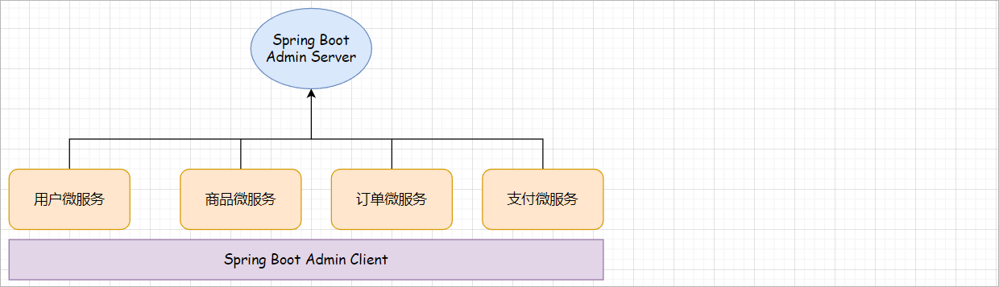 

微服务集成Spring Boot Admin Client，Spring Boot Admin Client会定时的将微服务相关信息(CPU的使用率、线程信息、内存信息)汇报给Spring Boot Admin Server。Spring Boot Admin Server也会采集到每一条微服务所产生的日志数据。


ELK的监控架构：

ELK是三个技术栈的简称：ElasticSearch(存储日志数据)、Logstash(采集日志数据)、Kibana(可视化的数据展示)，常见的日志采集架构如下所示：

**架构一**

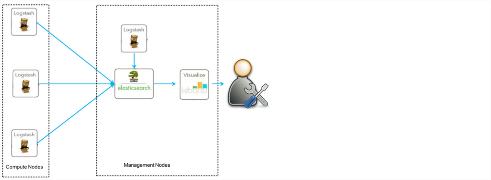 

这是最简单的一种ELK架构方式。优点是搭建简单，易于上手。缺点是Logstash耗资源较大，运行占用CPU和内存高。另外没有消息队列缓存，存在数据丢失隐患。此架构由Logstash分布于各个节点上搜集相关日志、数据，并经过分析、过滤后发送给远端服务器上的Elasticsearch进行存储。

Elasticsearch将数据以分片的形式压缩存储并提供多种API供用户查询，操作。用户亦可以更直观的通过配置Kibana Web方便的对日志查询，并根据数据生成报表。


**架构图二**

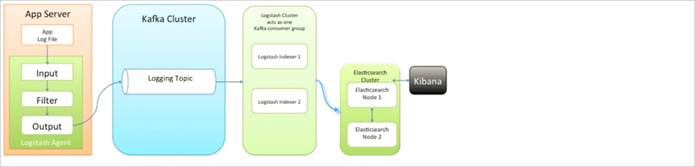 

此种架构引入了消息队列机制，位于各个节点上的Logstash Agent先将数据/日志传递给Kafka（或者Redis），并将队列中消息或数据间接传递给Logstash，Logstash过滤、分析后将数据传递给Elasticsearch存储。最后由Kibana将日志和数据呈现给用户。因为引入了Kafka（或者Redis）,所以即使远端Logstash server因故障停止运行，数据将会先被存储下来，从而避免数据丢失。

## 6.2 没有报错、程序卡死

这种问题参数的主要原因可能是CPU飙升、内存飙升、死锁等。

### 6.2.1 CPU飙升问题排查

具体步骤如下所示：

1、通过top查看系统各种资源的占用情况，看看CPU占用是否过高

2、通过ps -ef | grep java查询指定的进程id

3、通过top -H -p pid查看指定进程中的线程信息

 

4、将线程的id的十进制数据转换成十六进制：printf "%x" tid

5、通过jstack -l pid查询进行中的线程nid(native thread id)

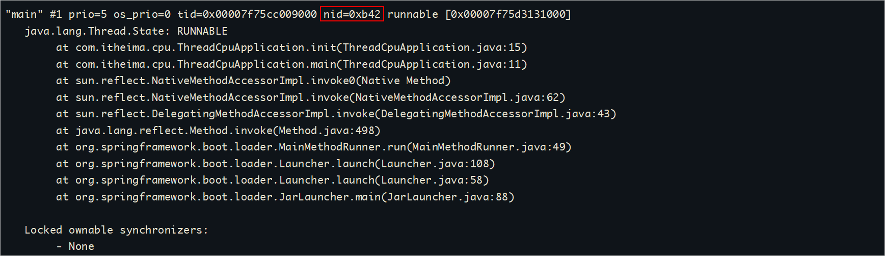 

注意：这就要求给每一个线程分配一个线程名称

### 6.2.2 死锁问题排查

**死锁**：线程死锁是指由于两个或者多个线程互相持有对方所需要的资源，导致这些线程处于等待状态，无法前往执行。

死锁演示：

Thread的子类

```java
public class DeadThread extends Thread {

    // 定义成员变量，来切换线程去执行不同步代码块的执行
    private boolean flag ;
    public DeadThread(boolean flag) {
        this.flag = flag ;
    }

    @Override
    public void run() {

        if(flag) {

            synchronized (MyLock.R1) {   
                System.out.println(Thread.currentThread().getName() + "---获取到了R1锁，申请R2锁....");
                synchronized (MyLock.R2) {
                    System.out.println(Thread.currentThread().getName() + "---获取到了R1锁，获取到了R2锁....");
                }
            }

        }else {

            synchronized (MyLock.R2) {	
                System.out.println(Thread.currentThread().getName() + "---获取到了R2锁，申请R1锁....");
                synchronized (MyLock.R1) {
                    System.out.println(Thread.currentThread().getName() + "---获取到了R2锁，获取到了R1锁....");
                }
            }
            
        }

    }

}
```

锁接口

```java
public interface MyLock {

    // 定义锁对象
    public static  final Object R1 = new Object() ;
    public static  final Object R2 = new Object() ;

}
```

测试类

```java
public class DeadThreadDemo1 {

    public static void main(String[] args) {

        // 创建线程对象
        DeadThread deadThread1 = new DeadThread(true) ;
        DeadThread deadThread2 = new DeadThread(false) ;

        // 启动两个线程
        deadThread1.start();
        deadThread2.start();

    }

}
```

控制台输出结果

```java
Thread-0---获取到了R1锁，申请R2锁....
Thread-1---获取到了R2锁，申请R1锁....
```

此时程序并没有结束，这种现象就是死锁现象...线程Thread-0持有R1的锁等待获取R2锁，线程Thread-1持有R2的锁等待获取R1的锁。


当程序出现了死锁现象，我们应该如何进行诊断呢？使用jdk自带的工具： jstack、jconsole、jvisualvm

对上面的程序使用jstack进行死锁诊断

```java
C:\Users\Administrator>jps
7408
8144 DeadThreadDemo1
3620
9108 Launcher
9180 Jps

C:\Users\Administrator>jstack -l 8144
2019-10-19 14:52:01
Full thread dump Java HotSpot(TM) 64-Bit Server VM (11+28 mixed mode):
...
"Thread-0":
        at com.itheima.javase.security.demo10.DeadThread.run(DeadThread.java:19)
        - waiting to lock <0x000000008c591218> (a java.lang.Object)   // 等待锁0x000000008c591218
        - locked <0x000000008c591208> (a java.lang.Object)			  // 已经拥有的锁0x000000008c591208
"Thread-1":
        at com.itheima.javase.security.demo10.DeadThread.run(DeadThread.java:29)
        - waiting to lock <0x000000008c591208> (a java.lang.Object)   // 等待锁0x000000008c591208
        - locked <0x000000008c591218> (a java.lang.Object)			  // 已经拥有的锁0x000000008c591218

Found 1 deadlock.		// 发现了一个1个死锁


C:\Users\Administrator>
```

## 6.3 OOM异常

### 6.3.1 问题定位

可以采取以下步骤：

1、收集错误信息：首先查看应用程序的日志文件，寻找与内存相关的错误信息。通常OOM异常会在日志中有相应的记录，包括堆栈跟踪和错误消息。

2、分析堆转储文件：当应用程序发生OOM异常时，JVM通常会**生成一个堆转储文件**(Heap Dump)，其中包含了应用程序在发生异常时的内存快照。

3、使用内存分析工具：将生成的堆转储文件导入到内存分析工具中，如Eclipse Memory Analyzer（MAT）、YourKit Java Profiler、VisualVM 

Heap Dump Analyzer等。这些工具可以帮助分析堆转储文件，查找内存泄漏、大对象、对象引用关系等问题。

4、检查内存使用情况：通过内存分析工具，查看应用程序的内存使用情况，包括堆内存、非堆内存、对象数量、对象大小等指标。特别关注内存占用较高的对象或数据结构，以及是否存在异常的内存增长趋势。

5、查找内存泄漏：使用内存分析工具，检查堆转储文件中的对象引用关系，查找可能导致内存泄漏的对象。特别关注长时间存活的对象、被遗忘的引用、缓存对象等。

6、优化内存使用：根据分析结果，进行相应的优化措施。例如，减少对象的创建和销毁、优化数据结构、调整缓存策略、增加堆内存大小等。

7、监控和测试：在优化后，持续监控应用程序的内存使用情况，并进行性能测试，以确保问题已经解决或得到改善。

需要注意的是，OOM异常可能有多种原因，如内存泄漏、内存溢出、过度使用第三方库等。因此，在定位OOM异常时，需要综合考虑多个因素，并进行适当的分析和测试。

### 6.3.2 案例演示

具体步骤：

**1、生成堆转储文件**

方案一：系统已经OOM挂了，针对该情况，需要在启动程序的时候就添加jvm生成转存文件的参数，如下所示：

```shell
java -XX:+HeapDumpOnOutOfMemoryError -XX:HeapDumpPath=./jvm_logs/ -jar oom.jar
```

方案二：系统正在运行中还未产生OOM，我们想查看一下内存的使用情况，就可以通过如下命令进行实现：

```shell
jmap -dump:format=b,file=oom-dump.hprof pid   # b表示二进制的意思
```

2、使用VisualVM 工具或者MAT工具进行内存分析

VisualVM工具：打开jvisualvm工具  ----> 载入文件 ----> 查看类实例数最多的并且和业务相关的对象  ----> GcROOT对象  ----> 查看线程栈


