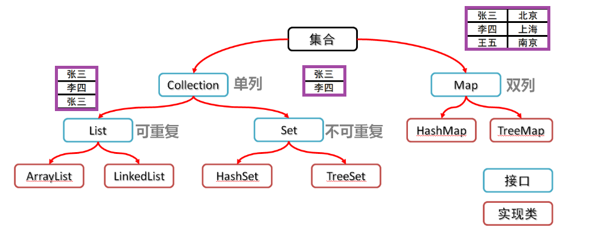
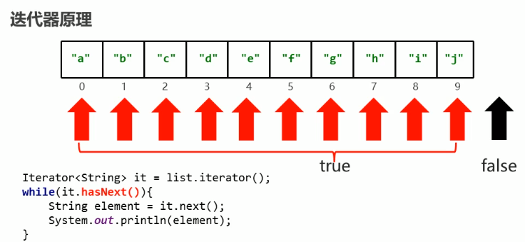

# 第10章 集合与迭代器

## 学习目标

- [ ] 能够熟练使用Collection集合的API
- [ ] 能够使用Iterator迭代器遍历Collection系列的集合
- [ ] 能够使用foreach遍历Collection系列的集合
- [ ] 能够说出foreach循环与Iterator迭代器的联系与区别
- [ ] 掌握三种Collection集合的元素删除方式


## 10.1 Collection集合概述和使用

### 10.1.1 集合的概念

集合是java中提供的一种容器，可以用来存储多个数据。

#### 数组和集合的区别【理解】

- 相同点

  都是容器,可以存储多个数据

- 不同点

  - 数组的长度是不可变的,集合的长度是可变的

  - 数组可以存基本数据类型和引用数据类型

    集合只能存引用数据类型,如果要存基本数据类型,需要存对应的包装类

##### 需求:

```tex
需求：我有3个学生，请把这些学生信息存储到数组中，并遍历数组，获取得到每一个学生信息。

班里又来了新学生呢?怎么存储?
数组的长度是不可变的,集合的长度是可变的
```

##### 代码演示

```java
package com.atguigu;

public class Demo1 {

    /*
    需求：我有3个学生，请把这3个学生的信息存储到数组中，并遍历数组，获取得到每一个学生信息。
     */
    public static void main(String[] args) {
        //int[] arr = new int[5];					//创建基本数据类型数组
        Student[] arr = new Student[5];				//创建引用数据类型数组
        arr[0] = new Student("张三", 23);				//创建一个学生对象,存储在数组的第一个位置
        arr[1] = new Student("李四", 24);				//创建一个学生对象,存储在数组的第二个位置
        arr[2] = new Student("王五", 25);				//创建一个学生对象,存储在数组的第三个位置

        for(int i = 0; i < arr.length; i++) {
            System.out.println(arr[i]);
        }
    }
}

```


#### 集合类体系结构【理解】

集合主要分为两大系列：Collection和Map，Collection 表示一组对象，Map表示一组映射关系或键值对。



### 10.1.2 Collection接口

```tex
- 是单例集合的顶层接口,它表示一组对象,这些对象也称为Collection的元素
- JDK 不提供此接口的任何直接实现.它提供更具体的子接口(如Set和List)实现

- 创建Collection集合的对象
  - 多态的方式

Collection<E>是所有单列集合的父接口，因此在Collection中定义了单列集合(List和Set)通用的一些方法，这些方法可用于操作所有的单列集合
```

#### Collection集合常用方法

 ```tex
- 添加元素
add(E obj)：添加元素对象到当前集合中

- 删除元素
boolean remove(Object obj) ：从当前集合中删除第一个找到的与obj对象equals返回true的元素。
boolean removeIf(Predicate<? super E> filter)：根据条件进行移除
void   clear()：清空集合中的元素

- 查询与获取元素
boolean isEmpty()：判断当前集合是否为空集合。
boolean contains(Object obj)：判断当前集合中是否存在一个与obj对象equals返回true的元素。
int size()：获取当前集合中实际存储的元素个数
Object[] toArray()：返回包含当前集合中所有元素的数组

- 带All的方法后面讲
addAll(Collection<? extends E> other)：添加other集合中的所有元素对象到当前集合中
boolean removeAll(Collection<?> coll)：从当前集合中删除所有与coll集合中相同的元素。
boolean containsAll(Collection<?> c)：判断c集合中的元素是否在当前集合中都存在。
 ```

##### 代码演示

~~~java
package com.atguigu;

import org.junit.Test;

import java.util.ArrayList;
import java.util.Collection;
import java.util.function.Predicate;

/*
    - 添加元素
    add(E obj)：添加元素对象到当前集合中

    - 删除元素
    boolean remove(Object obj) ：从当前集合中删除第一个找到的与obj对象equals返回true的元素。
    boolean removeIf(Object o)：根据条件进行移除
    void   clear()：清空集合中的元素

    - 查询与获取元素
    boolean isEmpty()：判断当前集合是否为空集合。
    boolean contains(Object obj)：判断当前集合中是否存在一个与obj对象equals返回true的元素。
    int size()：获取当前集合中实际存储的元素个数
    Object[] toArray()：返回包含当前集合中所有元素的数组
 */
public class Demo {

    /*
    - 添加元素
    add(E obj)：添加元素对象到当前集合中
     */
    @Test
    public void test01(){
        Collection<String> collection = new ArrayList<>();
        collection.add("aaa");
        collection.add("bbb");
        collection.add("ccc");
        collection.add("dddd");
        System.out.println("collection = " + collection);
    }

    /*
        - 删除元素
        boolean remove(Object obj) ：从当前集合中删除第一个找到的与obj对象equals返回true的元素。
        boolean removeIf(Object o)：根据条件进行移除
        void   clear()：清空集合中的元素
     */
    @Test
    public void test02(){

        Collection<String> collection = new ArrayList<>();
        collection.add("aaa");
        collection.add("bbb");
        collection.add("ccc");
        collection.add("dddd");
        boolean result1 = collection.remove("aaa");
        boolean result2 = collection.remove("ddd");
        System.out.println("result1 = " + result1);
        System.out.println("result2 = " + result2);
        System.out.println("collection = " + collection);

        System.out.println("----------------");

        //removeif底层会遍历集合,得到集合中的每一个元素s
        //符合条件,则删除,否则不删除
        collection.removeIf(new Predicate<String>() {
                                @Override
                                public boolean test(String s) {
                                    return s.length() == 3;
                                }
                            }
        );
        System.out.println("collection = " + collection);

        System.out.println("-------------");
        //就是将集合中所有的元素全部删除.
        collection.clear();
        System.out.println("collection = " + collection);

    }

    /*
    - 查询与获取元素
    boolean isEmpty()：判断当前集合是否为空集合。
    boolean contains(Object obj)：判断当前集合中是否存在一个与obj对象equals返回true的元素。
    int size()：获取当前集合中实际存储的元素个数
    Object[] toArray()：返回包含当前集合中所有元素的数组
     */
    @Test
    public void test03(){
        Collection<String> collection = new ArrayList<>();
        collection.add("aaa");
        collection.add("bbb");
        collection.add("ccc");
        collection.add("dddd");

        boolean result = collection.contains("a");
        System.out.println("result = " + result);
        boolean result2 = collection.contains("aaa");
        System.out.println("result2 = " + result2);
        System.out.println("collection = " + collection);

        System.out.println("-------------------");
        // collection.clear();
        boolean result3 = collection.isEmpty();
        System.out.println("result3 = " + result3);

        System.out.println("-------------------");
        int size = collection.size();
        System.out.println("size = " + size);

        System.out.println("------------------------");
        Object[] objects = collection.toArray();
        for (int i = 0; i < collection.toArray().length; i++) {
            System.out.println(objects[i]);
        }
    }

}
~~~

## 10.2 Collection集合的遍历

### 10.2.1 Iterator接口(迭代器)

```tex
迭代器介绍
	迭代：即Collection集合元素的通用获取方式。在取元素之前先要判断集合中有没有元素，如果有，就把这个元素取出来，继续在判断，如果还有就再取出出来。一直把集合中的所有元素全部取出。这种取出方式专业术语称为迭代。

- 迭代器,Collection集合的专用遍历方式
- Iterator<E> iterator(): 返回此集合中元素的迭代器,该迭代器对象默认指向当前集合的0索引
```

##### Iterator接口的常用方法：

```tex
boolean hasNext(): 如果仍有元素可以迭代，则返回 true。
E next(): 返回迭代的下一个元素。

void remove():从迭代器指向的 collection 中移除迭代器返回的最后一个元素（可选操作）。
```

##### 代码演示

~~~java
package com.atguigu.iterator;

import org.junit.Test;

import java.util.ArrayList;
import java.util.Collection;
import java.util.Iterator;

public class IteratorDemo1 {
    public static void main(String[] args) {
        //创建集合对象
        Collection<String> c = new ArrayList<>();

        //添加元素
        c.add("hello");
        c.add("world");
        c.add("java");
        c.add("javaee");

        //Iterator<E> iterator()：返回此集合中元素的迭代器，通过集合的iterator()方法得到
        Iterator<String> it = c.iterator();

        //用while循环改进元素的判断和获取
        while (it.hasNext()) {
            String s = it.next();
            System.out.println(s);
        }
    }
}
~~~

> 提示：在进行集合元素取出时，如果集合中已经没有元素了，还继续使用迭代器的next方法，将会发生java.util.NoSuchElementException没有集合元素的错误。

### 10.2.2 迭代器的实现原理

我们在之前案例已经完成了Iterator遍历集合的整个过程。当遍历集合时，首先通过调用集合的iterator()方法获得迭代器对象，然后使用hashNext()方法判断集合中是否存在下一个元素，如果存在，则调用next()方法将元素取出，否则说明已到达了集合末尾，停止遍历元素。

Iterator迭代器对象在遍历集合时，内部采用指针的方式来跟踪集合中的元素，为了让初学者能更好地理解迭代器的工作原理，接下来通过一个图例来演示Iterator对象迭代元素的过程：



在调用Iterator的next方法之前，迭代器指向第一个元素，当第一次调用迭代器的next方法时，返回第一个元素，然后迭代器的索引会向后移动一位，指向第二个元素，当再次调用next方法时，返回第二个元素，然后迭代器的索引会再向后移动一位，指向第三个元素，依此类推，直到hasNext方法返回false，表示到达了集合的末尾，终止对元素的遍历。

### 10.2.3 增强for循环

- ##### 介绍

  - 它是JDK5之后出现的,其内部原理是一个Iterator迭代器
  - **实现Iterable接口的类才可以使用迭代器和增强for**
  - **简化数组和Collection集合的遍历(并且只推荐做遍历使用)**

- ##### 格式

  ​	for(集合/数组中元素的数据类型 变量名 :  集合/数组名) {

  ​			// 已经将当前遍历到的元素封装到变量中了,直接使用变量即可

  ​	}

- ##### 代码演示

  ```java
  public class MyCollectonDemo1 {
      public static void main(String[] args) {
          ArrayList<String> list =  new ArrayList<>();
          list.add("a");
          list.add("b");
          list.add("c");
          list.add("d");
          list.add("e");
          list.add("f");
  
          //1,数据类型一定是集合或者数组中元素的类型
          //2,str仅仅是一个变量名而已,在循环的过程中,依次表示集合或者数组中的每一个元素
          //3,list就是要遍历的集合或者数组
          for(String str : list){
              System.out.println(str);
          }
      }
  }
  ```

##### 注意事项:

```tex
增强for循环内部不能直接操作集合的元素,只推荐做遍历使用
```

```java
package com.atguigu.stringdemo;

import java.util.ArrayList;

public class Demo {

    public static void main(String[] args) {
        ArrayList<String> list =  new ArrayList<>();
        list.add("a");
        list.add("b");
        list.add("c");
        list.add("d");
        list.add("e");
        list.add("f");

        //1,数据类型一定是集合或者数组中元素的类型
        //2,str仅仅是一个变量名而已,在循环的过程中,依次表示集合或者数组中的每一个元素
        //3,list就是要遍历的集合或者数组
        for(String str : list){
            str = "*";// 增强for循环内部不能直接操作集合元素本身
            System.out.println(str);
        }
        System.out.println(list);
    }

}
--------控制台输出结果------------------
 [a, b, c, d, e, f]   
```


#### 遍历Collection的三种方式

##### 代码演示

```java
package com.atguigu;

import org.junit.Test;

import java.util.ArrayList;
import java.util.Collection;
import java.util.Iterator;
import java.util.function.Predicate;


public class Demo{
    public static void main(String[] args) {

        Collection c = new ArrayList();
        c.add(new Student("张三",23));		//Object obj = new Student("张三",23);
        c.add(new Student("李四",24));
        c.add(new Student("王五",25));
        c.add(new Student("赵六",26));

        //第一种遍历方式    迭代器迭代 可以获取元素的属性
        Iterator it = c.iterator();//获取一个迭代器
        while (it.hasNext()) {
            Object obj = it.next();
            Student s = (Student)obj;                //向下强转
            System.out.println(s.getName() + "..." + s.getAge());
        }
        System.out.println("-----------------");

        //第二种迭代方式，普通for循环可以获取元素
        Object[] arr = c.toArray();
        for (int i = 0; i < arr.length; i++) {
            Student s = (Student)arr[i];            //向下强转
            System.out.println(s.getName() + "..." + s.getAge());
        }
        System.out.println("-----------------");

        //第三种迭代方式 增强for循环 可以获取元素
        for (Object  obj2: arr) {
            Student s = (Student)obj2;              //向下强转
            System.out.println(s.getName() + "..." + s.getAge());
        }
    }
}
```

##### Student类

```java
package com.atguigu;

public class Student {

    private String name;
    private int age;

    public Student() {
    }

    public Student(String name, int age) {
        this.name = name;
        this.age = age;
    }

    public String getName() {
        return name;
    }

    public void setName(String name) {
        this.name = name;
    }

    public int getAge() {
        return age;
    }

    public void setAge(int age) {
        this.age = age;
    }

    @Override
    public String toString() {
        return "Student{" +
                "name='" + name + '\'' +
                ", age=" + age +
                '}';
    }
}

```

### 10.2.4 使用Iterator迭代器删除元素

java.util.Iterator迭代器中有一个方法：

​	void remove() ;

那么，既然Collection已经有remove(xx)方法了，为什么Iterator迭代器还要提供删除方法呢？

因为在JDK1.8之前Collection接口没有removeIf方法，即无法根据条件删除。

例如：要删除以下集合元素中的偶数

```java
package com.atguigu.test;


import java.util.ArrayList;
import java.util.Collection;
import java.util.Iterator;
import java.util.function.Predicate;

public class Demo5 {

    /*
    定义一个Collection,添加6个整数,要删除集合元素中的偶数

    ConcurrentModificationException  并发修改异常  (并发--> "同时")

    当方法检测到对象的并发修改，但不允许这种修改时，抛出此异常。
    解决方案:
        操作集合元素的始终保持是同一个对象
     */
    public static void main(String[] args) {

        Collection c = new ArrayList();
        c.add(1);
        c.add(2);
        c.add(3);
        c.add(4);
        c.add(5);
        c.add(6);

        Iterator iterator = c.iterator();
        while (iterator.hasNext()) {
            Object obj = iterator.next();
            Integer i = (Integer) obj;

            // 报错,ConcurrentModificationException  并发修改异常
            /*c.removeIf(new Predicate() {

                @Override
                public boolean test(Object o) {// o  代表每一个元素
                    Integer i = (Integer) o;
                    return i % 2 == 0;
                }
            });*/

            if(i % 2 == 0){
                iterator.remove();
            }
        }

        System.out.println(c);

    }
}
```

### 10.2.5 Iterator迭代器的快速失败（fail-fast）机制

如果在Iterator、ListIterator迭代器创建后的任意时间从结构上修改了集合（通过迭代器自身的 remove 或 add 方法之外的任何其他方式），则迭代器将抛出 ConcurrentModificationException。因此，面对并发的修改，迭代器很快就完全失败，而不是冒着在将来不确定的时间任意发生不确定行为的风险。

这样设计是因为，迭代器代表集合中某个元素的位置，内部会存储某些能够代表该位置的信息。当集合发生改变时，该信息的含义可能会发生变化，这时操作迭代器就可能会造成不可预料的事情。因此，果断抛异常阻止，是最好的方法。这就是Iterator迭代器的快速失败（fail-fast）机制。

#### 1、ConcurrentModificationException异常(并发修改异常)

```java
package com.atguigu.iterator;

import java.util.ArrayList;
import java.util.Collection;
import java.util.Iterator;

public class TestConcurrentModificationException {
    public static void main(String[] args) {
        Collection coll = new ArrayList();
        coll.add("hello");
        coll.add("world");
        coll.add("java");
        coll.add("haha");
        coll.add("mysql");

        Iterator iterator = coll.iterator();
        while(iterator.hasNext()){
            String str = (String)iterator.next();
            if(str.contains("a")){
                coll.remove(str);//foreach遍历集合过程中，调用集合的remove方法
            }
        }

        /*for (Object o : coll) {
            String str = (String) o;
            if(str.contains("a")){
                coll.remove(o);//foreach遍历集合过程中，调用集合的remove方法
            }
        }*/
    }
}
```

