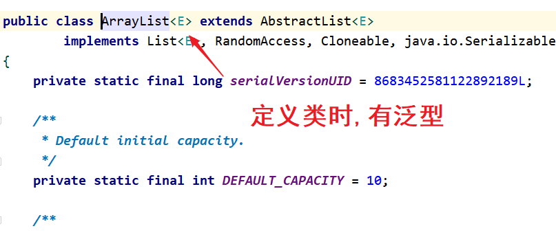

# 第11章 泛型

## 学习目标

* [ ] 能够理解泛型的好处和意义
* [ ] 能够在使用集合相关API时正确指定泛型
* [ ] 能够使用其他泛型类、泛型接口
* [ ] 能够认识泛型方法
* [ ] 能够使用泛型定义类、接口、方法
* [ ] 能够理解泛型上限
* [ ] 能够阐述泛型通配符的作用
* [ ] 能够识别通配符的上下限

## 11.1 泛型的概念

### 11.1.1 泛型的概述

- 泛型的介绍

  ​	泛型是JDK5中引入的特性，它提供了**编译时**类型安全检测机制

- 泛型的好处

  1. 把运行时期的问题提前到了编译期间
  2. 避免了强制类型转换

- 泛型的定义格式

  - <类型>: 指定一种类型的格式.尖括号里面可以任意书写,一般只写一个字母.例如: <E> <T>
  - <类型1,类型2…>: 指定多种类型的格式,多种类型之间用逗号隔开.例如: <E,T> <K,V>

##### 举例:

java.lang.Comparable接口和java.util.Comparator接口，是用于对象比较大小的规范接口，这两个接口只是限定了当一个对象大于另一个对象时返回正整数，小于返回负整数，等于返回0。但是并不确定是什么类型的对象比较大小，之前的时候只能用Object类型表示，使用时既麻烦又不安全，因此JDK1.5就给它们增加了泛型。

```java
public interface Comparable<T>{
    int compareTo(T o) ;
}
```

```java
public interface Comparator<T>{
     int compare(T o1, T o2) ;
}
```

其中<T>就是类型参数，即泛型。

### 11.1.2 泛型的好处

```tex
引入泛型的好处
        既能保证安全，又能简化代码。
        因为把不安全的因素在编译期间就排除了；既然通过了编译，那么类型一定是符合要求的，就避免了类型转换
```

##### 示例代码：

```java
package com.atguigu;

import java.util.ArrayList;
import java.util.Collection;
import java.util.Iterator;

public class Demo{

    /*
        引入泛型的好处
        既能保证安全，又能简化代码。
        因为把不安全的因素在编译期间就排除了；既然通过了编译，那么类型一定是符合要求的，就避免了类型转换
     */
    public static void main(String[] args) {

        Collection c = new ArrayList();
        c.add(new Student("张三",23));		//Object obj = new Student("张三",23);
        c.add(new Student("李四",24));
        c.add(new Student("王五",25));
        c.add("aab");
        c.add(33);
        c.add(true);
        //遍历集合
        Iterator it = c.iterator();// 由于在定义Collection中没有定义泛型,所以存入的内容默认为Object
        while (it.hasNext()) {
            Object obj = it.next();
            // System.out.println(obj.getName()); //报错 object 不能访问子类特有的成员

            Student s = (Student)obj;             // 需要 向下强转

            // 下面代码报错 ClassCastException String cannot be cast to com.atguigu.Student
            // System.out.println(s.getName() + "..." + s.getAge());
        }

    }
}
```

##### Student类

```java
package com.atguigu;

public class Student {

    private String name;
    private int age;

    public Student() {
    }

    public Student(String name, int age) {
        this.name = name;
        this.age = age;
    }

    public String getName() {
        return name;
    }

    public void setName(String name) {
        this.name = name;
    }

    public int getAge() {
        return age;
    }

    public void setAge(int age) {
        this.age = age;
    }

    @Override
    public String toString() {
        return "Student{" +
                "name='" + name + '\'' +
                ", age=" + age +
                '}';
    }
}

```

## 11.2 泛型的应用(理解)


### 11.2.1 泛型类

```tex
声明类或接口时，在类名或接口名后面声明类型变量，我们把这样的类或接口称为泛型类或泛型接口

修饰符 class 类名<类型> {  }

例如：
public class ArrayList<E>    

泛型类的类型在创建对象时被确认
```

#### 1、使用核心类库中的泛型类

```tex
自从JDK1.5引入泛型的概念之后，对之前核心类库中的API做了很大的修改，例如：集合框架集中的相关接口和类、java.lang.Comparable接口、java.util.Comparator接口、Class类等等。

下面以ArrayList集合为例演示泛型的使用。
```

```java
package com.atguigu.stringdemo;

import java.util.ArrayList;

public class Demo {

    public static void main(String[] args) {
        ArrayList<String> list =  new ArrayList<>();
        list.add("a");
        list.add("b");
        list.add("c");
        list.add("d");
        list.add("e");
        list.add("f");

        System.out.println(list);
    }

}
```



#### 2、自定义泛型类

```tex
格式:修饰符 class 类名<类型>{}
	<类型>:指定一种类型的格式,里面可以任意书写,按变量定义规则即可,一般只写一个字母
示例:public class Box<T>{}

	此处的T可以随意写任意的大写标识,常见的有T、E、K、v等标识泛型
```

##### 代码演示

```java
package com.atguigu.stringdemo;

public class Box<E> {
    private E element;

    public E getElement() {
        return element;
    }

    public void setElement(E element) {
        this.element = element;
    }
}

```

```java
测试类:

package com.atguigu.stringdemo;


public class Demo {

    public static void main(String[] args) {

        Box<String> box1 = new Box<>();
        box1.setElement("革命尚未成功,同志还需努力");// 如果不写泛型,此时参数类型为Object
        System.out.println(box1.getElement());

        Box<Integer> box2 = new Box<>();
        box2.setElement(20);
        System.out.println(box2.getElement());
    }

}

```

### 11.2.2 泛型接口

#### 1、核心类中的泛型接口

```tex
java.util.List<E>
实现类 java.util.ArrayList<E>

泛型接口的使用方式
	1> 实现类没有确定具体的数据类型(ArrayList属于此类)
	2> 实现类确定了具体的数据类型
```


#### 2、自定义泛型接口

```tex
格式: 修饰符 interface 接口名<类型> {  }
示例: public interface Book<T>{}
```

##### 代码演示

```java
package com.atguigu.stringdemo;


import java.util.ArrayList;

public class Demo {

    public static void main(String[] args) {

        // 再创建对象时,确认泛型的数据类型
        new BookImpl1<String>().method("书中自有黄金屋");
        new BookImpl1<Boolean>().method(true);

        // 具体的实现类,不需要写泛型
        new BookImpl2().method(333);

    }


}


interface Book<E>{
    void method(E e);
}

// 1>实现类没有确定具体的数据类型
class BookImpl1<E> implements Book<E>{

    @Override
    public void method(E e) {
        System.out.println(e);
    }
}

// 2>实现类确定了具体的数据类型
class BookImpl2 implements Book<Integer>{

    @Override
    public void method(Integer integer) {
        System.out.println(integer);
    }
}

```

### 11.2.3 泛型方法

```tex
声明方法时，在【修饰符】与返回值类型之间声明类型变量，我们把声明了类型变量的方法称为泛型方法

方法在调用时才能确认泛型类型
```

#### 1、使用核心类中的泛型方法

```tex
在java.util.ArrayList中有个泛型方法

<T> T[] toArray(T[] a)   按适当顺序（从第一个到最后一个元素）返回包含此列表中所有元素的数组；返回数组的运行时类型是指定数组的运行时类型。

Object[] toArray()  按适当顺序（从第一个到最后一个元素）返回包含此列表中所有元素的数组。 
```

##### 代码演示

```java
package com.atguigu.stringdemo;


import java.util.ArrayList;
import java.util.Arrays;

public class Demo {

    public static void main(String[] args) {
        ArrayList<String> list =  new ArrayList<>();
        list.add("a");
        list.add("b");
        list.add("c");
        list.add("d");
        list.add("e");
        list.add("f");
        System.out.println(list);

        Object[] objects = list.toArray();
        System.out.println(Arrays.toString(objects));

        String[] strings = list.toArray(new String[list.size()]);
        System.out.println(Arrays.toString(strings));
    }

}

```

#### 2、自定义泛型方法

```tex
格式:修饰符<类型> 返回值类型 方法名(类型 变量名){}

示例:public<T> void show(T t){}
```

##### 代码演示

```java
定义一个泛型方法,传递一个集合和四个元素,将元素添加到集合并返回
```

```java
package com.atguigu.stringdemo;


import java.util.ArrayList;

public class Demo {

    public static void main(String[] args) {

        ArrayList<String> list1 = addElement(new ArrayList<String>(), "aa", "bb", "cc", "dd");
        System.out.println(list1);

        ArrayList<Integer> list2 = addElement(new ArrayList<Integer>(), 1, 2, 3, 4);
        System.out.println(list2);

    }

    public static <T> ArrayList<T> addElement(ArrayList<T> list,T t1, T t2,T t3, T t4) {
        list.add(t1);
        list.add(t2);
        list.add(t3);
        list.add(t4);
        return list;
    }
}

```

#### 3、知识点扩展:

```tex
泛型方法的定义

一个类中可以出现多个泛型

1.如果一个方法 ,声明上没有泛型,但是 使用到了泛型,默认 当方法的泛型和类的泛型是一致的
            推荐 方法的泛型与类 的泛型一致
2.如果一个方法,使用泛型时,类型和类的泛型不一致 ,那么必须要在方法声明上 标出

3. 如果一个静态方法,使用泛型,必须要单独定义,而且要和类泛型不一致(即使是相同的字母,代表的也是不同的类型)
	  静态方法的加载时机是随着类的加载而加载,优先于对象,所以必须单独定义
```

##### 代码演示

```java
package com.generics;

public class Demo12 {

    /*
        泛型方法的定义
        格式
         修饰符 <类型> 返回值  方法(对应的类型  变量名){}
         一个类中可以出现多个泛型

        1.如果一个方法 ,声明上没有泛型,但是 使用到了泛型,默认 当方法的泛型和类的泛型是一致的
            推荐 方法的泛型与类 的泛型一致
        2.如果一个方法,使用泛型时,类型和类的泛型不一致 ,那么必须要在方法声明上 标出

        3. 如果一个静态方法,使用泛型,必须要声明出来,必须和类泛型是不一样(即使是相同的字母,代表的也是不同的类型)

        一个类的泛型  ,数据类型 什么时候 确认   创建对象 时
        一个方法的泛型 ,数据类型 什么时候确认   调用方法时
     */
    public static void main(String[] args) {

        Test2<String> test = new Test2<>();
        test.method01("aaa");
        // test.method01(111);   报错
        test.method02(true);

        System.out.println("---------");
        test.method03(111);// 当前元素类型与类的泛型类型不一致


    }
}

class Test2<K>{

    public void method01(K k){
        System.out.println(k);
    }

    public<W> void method02(W w){
        System.out.println(w);
    }

    public static  <S> void method03(S s){
        System.out.println(s);
    }
}

```

##### 案例二

```java
package com.atguigu.test;

public class Demo10 {

    /*
        泛型定义在方法上

        格式
            修饰符 <泛型类型> 返回值类型  方法名(泛型类型 变量名){
            }

            1> 如果 一个实例方法的泛型和当前类的泛型是一致的,
                那么 <泛型类型> 是可以省略的(  修饰符 <泛型类型> 返回值类型)
            2> 如果 一个实例方法的泛型和当前类的泛型是不一致的,
                那么 <泛型类型> 是不可以省略的
            3> 如果一个静态方法,定义时 泛型的确认时机和类的泛型确认时机 不一样,推荐使用不同的泛型类型
     */
    public static void main(String[] args) {

        Test<String> test1 = new Test<>();
        test1.method1("aaa");

        Test<Integer> test2 = new Test<>();
        test2.method2("aaa");

        Test<String> test3 = new Test<>();
        test3.method3(111);


    }
}

class Test<Q> {

    // 默认和当前的类的泛型是一致的  修饰符和返回值 之间<类型> 可以省略
    public void method1(Q q){
        System.out.println(q);
    }

    // 如果方法的声明中 出现了类不一致的泛型类型 那么 <类型> 不能省略
    public<W>  void method2(W w){
        System.out.println(w);
    }


    // 静态方法  泛型的确认时机 和类的泛型的确认时机是不同的
    // 推荐 静态方法 泛型使用和类的泛型类型不一致
    // 如果 静态方法  泛型使用和类的泛型类型 书写一致时,运行时 也是会当做两个不同的类进行加载
    public static<K>  void method3(K k){
        System.out.println(k);
    }

    // 不推荐
    /*public static<Q>  void method3(Q q){
        System.out.println(q);
    }*/
}

```


### 11.2.4 类型通配符

#### 1、类型通配符

```tex
- 类型通配符: <?>
  - ArrayList<?>: 表示元素类型未知的ArrayList,它的元素可以匹配任何的类型
  - 但是并不能把元素添加到ArrayList中了,获取出来的也是父类类型
  
- 类型通配符上限: <? extends 类型>(规定了上边界)
  - ArrayListList <? extends Number>: 它表示的类型是Number或者其子类型
  
- 类型通配符下限: <? super 类型>(规定了下边界)
  - ArrayListList <? super Number>: 它表示的类型是Number或者其父类型
```

##### 代码演示

```java
package com.atguigu.stringdemo;


import java.util.ArrayList;

public class Demo {

    public static void main(String[] args) {

        ArrayList<Integer> list1 = new ArrayList<>();
        ArrayList<String> list2 = new ArrayList<>();
        ArrayList<Number> list3 = new ArrayList<>();
        ArrayList<Object> list4 = new ArrayList<>();

        method1(list1);
        method1(list2);
        method1(list3);
        method1(list4);
        
        method2(list1);
        method2(list2);//报错
        method2(list3);
        method2(list4);//报错

        method3(list1);//报错
        method3(list2);//报错
        method3(list3);
        method3(list4);
    }

    // 泛型通配符: 此时的泛型?,可以是任意类型
    public static void method1(ArrayList<?> list){}

    // 泛型的上限: 此时的泛型?,必须是Number类型或者Number类型的子类
    public static void method2(ArrayList<? extends Number> list){}
    
    // 泛型的下限: 此时的泛型?,必须是Number类型或者Number类型的父类
    public static void method3(ArrayList<? super Number> list){}

}
```

#### 2、类型通配符上限、类型通配符下限


##### 代码演示

```tex
- Collection

addAll(Collection<? extends E> other)：添加other集合中的所有元素对象到当前集合中
boolean removeAll(Collection<?> coll)：从当前集合中删除所有与coll集合中相同的元素。
boolean containsAll(Collection<?> c)：判断c集合中的元素是否在当前集合中都存在。
```

```java
package com.atguigu.stringdemo;


import org.junit.Test;

import java.util.ArrayList;

public class Demo {


    @Test
    public void test01(){
        ArrayList<Student> list1 = new ArrayList<>();
        list1.add(new Student("张三", 23));
        list1.add(new Student("李四", 24));

        ArrayList<BaseStudent> list2 = new ArrayList<>();
        list2.add(new BaseStudent("张三", 23));
        list2.add(new BaseStudent("赵六", 26));

        list1.addAll(list2);//将list2中的每一个元素添加到list1中
        // list2.addAll(list1);//报错 ,参数的泛型类型只能是<= 调用者泛型类型
        System.out.println(list1);
        System.out.println(list1.size());// 4
    }

    @Test
    public void test02(){
        ArrayList list1 = new ArrayList<>();
        list1.add(new Student("张三", 23));
        list1.add(new Student("李四", 24));

        ArrayList list2 = new ArrayList<>();
        list2.add(new BaseStudent("张三", 23));
        list2.add(new BaseStudent("赵六", 26));

        list1.add(list2);//将list2当做整体元素添加到list1中
        System.out.println(list1);
        System.out.println(list1.size());// 3
    }

    @Test
    public void test03(){
        ArrayList list1 = new ArrayList();
        list1.add("a");
        list1.add("b");
        list1.add("c");
        list1.add("d");

        ArrayList list2 = new ArrayList();
        list2.add("a");
        list2.add("b");
        list2.add("z");

        boolean b = list1.removeAll(list2);					//删除的是交集
        System.out.println(b);
        System.out.println(list1);
    }

    @Test
    public void test04(){
        ArrayList list1 = new ArrayList();
        list1.add("a");
        list1.add("b");
        list1.add("c");
        list1.add("d");

        ArrayList list2 = new ArrayList();
        list2.add("a");
        list2.add("b");
        // list2.add("z");

        boolean b = list1.containsAll(list2);					//判断调用的集合是否包含传入的集合
        System.out.println(b);
    }

}
```