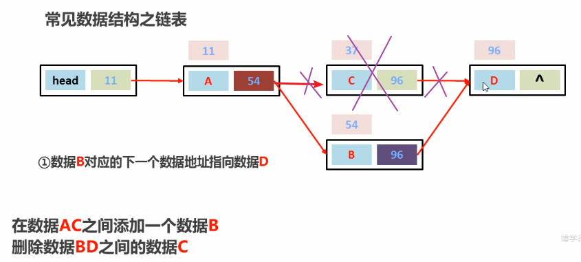
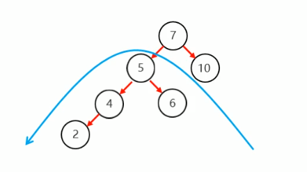
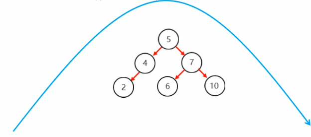
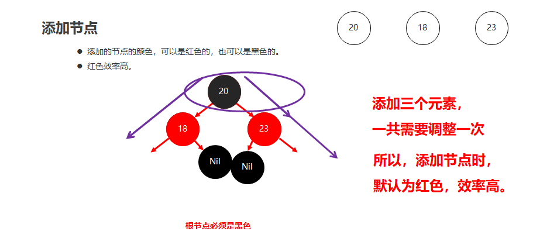
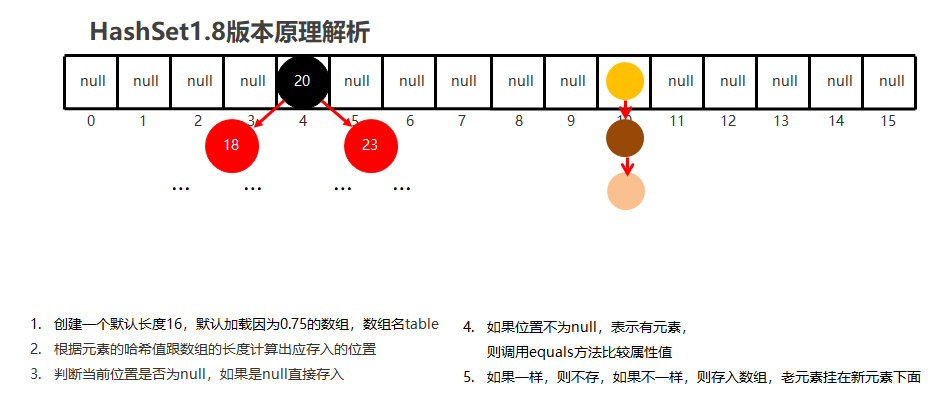
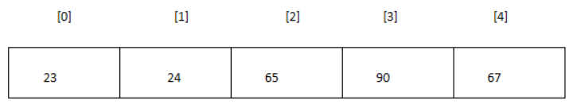

第12章 集合与数据结构

## 学习目标

* [ ] 掌握List接口的常用方法
* [ ] 能够说出List接口的常用实现类集合的区别
* [ ] 能够说出Set接口的常用实现类集合的区别
* [ ] 能够说出List系列与Set系列集合的区别
* [ ] 能够说出Map接口的常用实现类集合的区别
* [ ] 能够说出Set系列与Map系列集合的关系
* [ ] 能够说出Collection系列与Map系列集合的区别
* [ ] 能够画出Collection系列集合的关系图
* [ ] 能够画出Collection和Map等所有常用集合的关系图
* [ ] 掌握Collections集合工具类的使用
* [ ] 对数据结构有初步了解
* [ ] 理解动态数组的实现方式
* [ ] 理解单链表与双链表的实现方式
* [ ] 理解哈希表的实现方式

# 第12章 集合与数据结构

## 12.1 List集合

```tex
java.util.List接口继承自`Collection`接口，是单列集合的一个重要分支，习惯性地会将实现了`List`接口的对象称为List集合

在JavaSE中List名称的类型有两个，一个是java.util.List集合接口，一个是java.awt.List图形界面的组件，别导错包了。
```

- ##### List集合的概述

  - 有序集合,这里的有序指的是存取顺序
  - 用户可以精确控制列表中每个元素的插入位置,用户可以通过整数索引访问元素,并搜索列表中的元素
  - 与Set集合不同,列表通常允许重复的元素

- ##### List集合的特点

  - 存取有序
  - 可以重复
  - 有索引

List集合类中元素有序、且可重复。这就像银行门口客服，给每一个来办理业务的客户分配序号：第一个来的是“张三”，客服给他分配的是0；第二个来的是“李四”，客服给他分配的1；以此类推，最后一个序号应该是“总人数-1”。


注意：

List集合关心元素**是否有序**，而不关心是否重复，请大家记住这个原则。例如“张三”可以领取两个号。

### 12.1.1 List集合的特有方法

| 方法名                          | 描述                                    |
| ------------------------------- | --------------------------------------- |
| void add(int index,E   element) | 在此集合中的指定位置插入指定的元素      |
| E remove(int   index)           | 删除指定索引处的元素，返回被删除的元素, |
| E set(int index,E   element)    | 修改指定索引处的元素，返回被修改的元素  |
| E get(int   index)              | 返回指定索引处的元素                    |

##### 注:List集合特有的方法都是跟索引相关

```java
package com.atguigu.list;

import java.util.ArrayList;
import java.util.List;

public class TestListMethod {
    public static void main(String[] args) {
        // 创建List集合对象
        List<String> list = new ArrayList<String>();

        // 往 尾部添加 指定元素
        list.add("图图");
        list.add("小美");
        list.add("不高兴");

        System.out.println(list);
        // add(int index,String s) 往指定位置添加
        list.add(1,"没头脑");

        System.out.println(list);
        // String remove(int index) 删除指定位置元素  返回被删除元素
        // 删除索引位置为2的元素
        System.out.println("删除索引位置为2的元素");
            System.out.println(list.get(i));
        }
        //还可以使用增强for
        for (String string : list) {
            System.out.println(string);
        }
    
    	 List<Integer> list = new ArrayList<>();
        list.add(1);
        list.add(2);
        list.add(3);
        list.remove(3);// 当List的泛型为Integer,调用remove()时,如果传入的是int类型，则认为是索引，不会自动装箱
        System.out.println(list);
    }
}
```

##### List新增一种遍历方式

```java
package com.atguigu;

import java.util.ArrayList;
import java.util.List;

public class Demo2 {

    /*
        List集合,增加一种遍历方式
     */
    public static void main(String[] args) {
        List<String> list = new ArrayList<>();
        list.add("aa");
        list.add("bb");
        list.add("bb");
        list.add("cc");
        list.add("cc");
        list.add("dd");
        System.out.println(list);

        // 遍历
        System.out.println("-----------------");
        for (int i = 0; i < list.size(); i++) {               
             System.out.println(list.get(i));
        }
        System.out.println(list);

    }
}

```


### 12.1.2 List接口的常见实现类

```tex
List接口的实现类有很多，常见的有：

	ArrayList(动态数组)、Vector（动态数组）、LinkedList（双向链表）、Stack（栈）
```

##### LinkedList特有的方法

```tex
public void addFirst(E e)及addLast(E e) // 在指定的头部或者尾部添加元素
public E getFirst()及getLast()//获取头部或尾部元素
public E removeFirst()及public E removeLast()//移除头部或尾部的元素
```

##### 代码演示

```java
package com.atguigu;

import java.util.LinkedList;

public class Demo23 {

    public static void main(String[] args) {

        LinkedList list = new LinkedList();
        list.addFirst("a");
        list.addFirst("b");
        list.addFirst("c");
        list.addFirst("d");
        list.addLast("e");

        System.out.println(list);
        System.out.println(list.getFirst());
        System.out.println(list.getLast());
        System.out.println(list.removeFirst());// 返回被移除的元素
        System.out.println(list.removeLast());

        System.out.println(list);
    }
}
```

## 12.2 数据结构(一)

```tex
数据结构是计算机存储、组织数据的方式。是指相互之间存在一种或多种特定关系的数据元素的集合。

通常情况下,精心选择的数据结构可以带来更高的运行或者存储效率

栈
队列
数组
链表
```

### 12.2.1 栈

```tex
堆栈是一种先进后出（FILO：first in last out）或后进先出（LIFO：last in first out）的结构。
```

#### 1.栈结构特点:一端开口,一端封闭


#### **2.入栈顺序:A->B->C->D**


#### 3.出栈顺序:D->C->B->A


#### 4.栈结构特点:先进后出


### 12.2.2 队列

```tex
队列（Queue）是一种（但并非一定）先进先出（FIFO）的结构。
```

#### 1.队列的特点:一端开口称之为"后端",一端开头,称之为"前端"


#### 2.入队列顺序:A->B->C->D(后端进入队列)


#### 3.出队列顺序:A->B->C->D


#### 4.队列结构特点:先进先出


### 12.2.3 数组

```tex
数组(Array)是一种线性表数据结构。它用一组连续的内存空间,来存储一组具有相同类型的数据。

效率特点:
	查询快、增删慢
```

#### 1.数组的示意图


#### 2.List集合中ArrayList与Vector的底层物理结构都是数组，我们称为动态数组

```tex
- ArrayList是新版的动态数组，线程不安全，效率高，Vector是旧版的动态数组，线程安全，效率低。

查看ArrayList的get(int index)源码,可看出底层是数组实现的

public E get(int index) {
        rangeCheck(index);
        return elementData(index);
}

E elementData(int index) {
        return (E) elementData[index];//通过索引找到元素值
}
```

### 12.2.4 链表

```tex
- 链表是线性表的链式存储的实现（物理顺序可以是任意的，不一定要与逻辑顺序一致)
	* 线性表是指存储相同类型的一组数据	
	
- 链表中除了第一个和最后一个元素外，每一个元素都有它的一个直接前驱和直接后继，第一个元素有一个直接后继，最后一个元素有一个直接前驱

- 链表基本元素是结点，它里面包含数据域与指针域，结点之间用指针连接起来，形成一个简单的链。

效率特点:
	查询慢、增删快
	
- LinkedList是一个双向链表,每个结点Node都包含了对前一个和后一个元素的引用
	内部维护了两个变量first指向了链表头部,last指向链表尾部
```

#### 1.链表的结构示意图


#### 2.链表添加数据示意图


#### 3.链表删除元素示意图

#### 4.双向链表示意图


## 12.3 List相关源码解析

### 12.3.1 ArrayList部分源码分析

##### JDK1.8

```java
private class ArrayList<E>{

	Object[] elementData;//数组用来存储ArrayList的元素
	private int size;//记录实际存的元素的个数
	private static final Object[] DEFAULTCAPACITY_EMPTY_ELEMENTDATA = {};//空数组，长度为0的数组
	
	/*
	这里的空数组，不能存储元素。它的作用是，当我们new ArrayList()，并没有存储元素时，
	并不需要申请额外的空间。因为你此时还没有存储元素，也可能不存。
	例如：当你某个方法  public ArrayList select(String goodsName){根据商品名称，查询符合的商品信息
			//....
			//结果有可能没有找到，我们又不希望返回null，调用者有可能粗心没有检查null，会报空指针异常。
			//所以我这里给它new ArrayList()，但是里面确实没有元素，所以就不要new Object[10];浪费了
						}
	*/
	private static final int DEFAULT_CAPACITY = 10; //默认容量
    private static final int MAX_ARRAY_SIZE = Integer.MAX_VALUE - 8;
	
	public ArrayList() {
        this.elementData = DEFAULTCAPACITY_EMPTY_ELEMENTDATA;
    }
	
	public boolean add(E e) {
		//看是否需要扩容
        ensureCapacityInternal(size + 1);  // Increments modCount!!
		
		//将新元素存储到elementData[size]位置，并且size加1
        elementData[size++] = e;
        return true;
    }
	
	private void ensureCapacityInternal(int minCapacity) {
		//判断elementData是否是空数组，如果是，意味着我还未存过元素
        if (elementData == DEFAULTCAPACITY_EMPTY_ELEMENTDATA) {
			//minCapacity：最小需要容量
			//Math.max(DEFAULT_CAPACITY, minCapacity)返回DEFAULT_CAPACITY和minCapacity中最大值
			//DEFAULT_CAPACITY：10
			//minCapacity是形参，调用这个方法时传入的实参值是多少它就是多少。
            minCapacity = Math.max(DEFAULT_CAPACITY, minCapacity);
        }

        ensureExplicitCapacity(minCapacity);
    }
	
	private void ensureExplicitCapacity(int minCapacity) {
        modCount++;//修改次数加1

        // overflow-conscious code
		//minCapacity：最小需要容量
		//elementData.length：当前数组的长度
		//if (minCapacity - elementData.length > 0) 意味着当前数组不够用了
        if (minCapacity - elementData.length > 0)
            grow(minCapacity);
    }

    // 扩容的方法
	private void grow(int minCapacity) {
        // overflow-conscious code
		//oldCapacity：原来的数组的长度
        int oldCapacity = elementData.length;
		//newCapacity：新数组的长度 = 原来数组的长度 + 原来数组的长度 /2; 即1.5倍
        int newCapacity = oldCapacity + (oldCapacity >> 1);
		
		//minCapacity：最小需要容量
		//如果1.5倍还不够
        if (newCapacity - minCapacity < 0)
            newCapacity = minCapacity; //新数组的长度就按照你需要的容量来
		
		//新数组的长度 > 最大数组容量，就给你一个最大的数组容
        if (newCapacity - MAX_ARRAY_SIZE > 0)
            newCapacity = hugeCapacity(minCapacity);
		
        // minCapacity is usually close to size, so this is a win:
		//从elementData复制元素到新数组中，新数组的长度为newCapacity
        elementData = Arrays.copyOf(elementData, newCapacity);
    }
	
	public void add(int index, E element) {
        rangeCheckForAdd(index);

		//看是否需要扩容
        ensureCapacityInternal(size + 1);  // Increments modCount!!
		
		//将[index]以及后面的元素往右移动
        System.arraycopy(elementData, index, elementData, index + 1,size - index);
		
		//将新元素添加到 elementData[index]
        elementData[index] = element;
		//元素个数增加
        size++;
    }
	
	private void rangeCheckForAdd(int index) {
		//elementData实际已经存储[0,size-1]
		//可插入的位置[0,size]
        if (index > size || index < 0)
            throw new IndexOutOfBoundsException(outOfBoundsMsg(index));
    }
	
	
	public E remove(int index) {
        rangeCheck(index);//删除时的下标检查

        modCount++;
		
		//用oldValue记录要被删除的[index]位置的元素，因为之后要返回被删除的元素
        E oldValue = elementData(index);

		//要移动的元素的个数
        int numMoved = size - index - 1;
		//如果要移动的元素的个数>0，再调用System.arraycopy()方法移动，如果是0就不调用了
		//如果我们要删除的是当前数组的[size-1]的元素，意味着不需要移动，那么就不用调用System.arraycopy方法，不需要入栈，出栈，浪费时间
        if (numMoved > 0)
            System.arraycopy(elementData, index+1, elementData, index, numMoved);
		
		//让GC垃圾回收器，回收elementData[size-1]位置的无用元素
        elementData[--size] = null; // clear to let GC do its work

        return oldValue;
    }
	private void rangeCheck(int index) {
        if (index >= size)
            throw new IndexOutOfBoundsException(outOfBoundsMsg(index));
    }
	
	public boolean remove(Object o) {
        if (o == null) {
            for (int index = 0; index < size; index++)
                if (elementData[index] == null) {//如果o是空，那么我们看elementData中谁是null
                    fastRemove(index);
                    return true;
                }
        } else {
            for (int index = 0; index < size; index++)
                if (o.equals(elementData[index])) {//如果o非空，那么用equals比较，看哪个满足，而且用o.equals(xx)
                    fastRemove(index);
                    return true;
                }
        }
        return false;
    }
	
	private void fastRemove(int index) {
        modCount++;
        int numMoved = size - index - 1;
        if (numMoved > 0)
            System.arraycopy(elementData, index+1, elementData, index,
                             numMoved);
        elementData[--size] = null; // clear to let GC do its work
    }
	
	
	public E set(int index, E element) {
        rangeCheck(index);//检查下标

		//先记录要被替换的[index]位置的元素		
        E oldValue = elementData(index);
        elementData[index] = element;
        return oldValue;
    }
	
	public E get(int index) {
        rangeCheck(index);//检查下标

        return elementData(index);
    }
	
	E elementData(int index) {
        return (E) elementData[index];
    }
	
	
	public Iterator<E> iterator() {
        return new Itr();
    }
	
	//实现了Iterator接口
	private class Itr implements Iterator<E> {
		//游标，当前迭代器遍历到动态数组哪个位置了
        int cursor;       // index of next element to return
		//上一个迭代的位置
        int lastRet = -1; // index of last element returned; -1 if no such
		//后面单独讲
        int expectedModCount = modCount;

        public boolean hasNext() {
			//有效元素的范围[0,size-1]
            return cursor != size;
        }

        @SuppressWarnings("unchecked")
        public E next() {
            checkForComodification();
			
			//用i记录当前迭代器遍历到动态数组哪个位置了
            int i = cursor;
			
			//加这个判断是以防用户在next()方法之前没有调用hasNext()方法
            if (i >= size)
                throw new NoSuchElementException();
			
			//用一个变量记录了当前动态数组的elementData
            Object[] elementData = ArrayList.this.elementData;
			
			//和并发有关
            if (i >= elementData.length)
                throw new ConcurrentModificationException();
			
			
            cursor = i + 1;//下次访问的元素的下标
            return (E) elementData[lastRet = i];//i是本次遍历的数组的下标位置，用lastRet记录，对应下一次调用next方法，lastRet就是上次的下标
			//变量是在remove方法中用到了
		}

        public void remove() {
            if (lastRet < 0)
                throw new IllegalStateException();
            checkForComodification();

            try {
				//删除的是你刚刚调用next()方法取走的位置的元素
                ArrayList.this.remove(lastRet);
                cursor = lastRet;//因为删除元素，[cursor]会被往前移动，所以这里要cursor = lastRet
                lastRet = -1;//因为[lastRet]位置被删除了，然后不存在了，如果连续调用remove()就会报错
                expectedModCount = modCount;
            } catch (IndexOutOfBoundsException ex) {
                throw new ConcurrentModificationException();
            }
        }		
}	
```

### 12.3.2 LinkedList部分源码分析

Java中有双链表的实现：LinkedList，它是List接口的实现类。

```java
	public class LinkedList<E>{
	int size = 0;
	Node<E> first;//头结点
	Node<E> last;//尾结点
	
	private static class Node<E> {
        E item; //数据项
        Node<E> next; //下一个结点的地址
        Node<E> prev; //上一个结点的地址

        Node(Node<E> prev, E element, Node<E> next) {
            this.item = element;
            this.next = next;
            this.prev = prev;
        }
    }
	
	public boolean add(E e) {
        linkLast(e);//连接到最后
        return true;
    }
	
	void linkLast(E e) {
		//last是当前链表的最后一个结点
        final Node<E> l = last;
		
		//创建新结点
		//Node(Node<E> prev, E element, Node<E> next) ：
		//新结点的prev是 原来链表的最后一个结点l，即让新结点的prev指向原来的最后一个结点
		//新结点的next是 null
		//新结点的数据项是：e
        final Node<E> newNode = new Node<>(l, e, null);
		
		//新结点变成了链表的最后一个结点
        last = newNode;
		
		//l是原来链表的最后一个结点
		//如果l==null，说明原来链表是一个空链表
        if (l == null)
			//first：链表的第一个结点，
			//现在这个新结点即是第一个结点，又是最后一个结点
            first = newNode;
        else//l==null不成立，说明原来的链表非空
			//l是原来链表的最后一个结点，原来的最后一个结点指向了新结点
            l.next = newNode;

		//结点个数增加
		size++;
        modCount++;
    }
	
	
	public void add(int index, E element) {
        checkPositionIndex(index);//检查index是否合法，合法的位置[0，size]

        if (index == size)//连接到最后
            linkLast(element);
        else //否则，就是插入到中间
            linkBefore(element, node(index));
    }
	
	private void checkPositionIndex(int index) {
        if (!isPositionIndex(index))
            throw new IndexOutOfBoundsException(outOfBoundsMsg(index));
    }
	private boolean isPositionIndex(int index) {
        return index >= 0 && index <= size;
    }
	
	//返回了链表的[index]位置的结点
	Node<E> node(int index) {
        // assert isElementIndex(index);
		//index < (size >>1) 即  index < size/2，说明位置在链表的前半段
        if (index < (size >> 1)) {
			//从头开始找比较合适
            Node<E> x = first;
            for (int i = 0; i < index; i++)
                x = x.next;
            return x;
        } else {//否则，说明位置在链表的后半段
			//从最后往前找比较合适
            Node<E> x = last;
            for (int i = size - 1; i > index; i--)
                x = x.prev;
            return x;
        }
    }
	
	//e：是要新增的结点的数据
	//succ是[index]位置的结点
	void linkBefore(E e, Node<E> succ) {
        // assert succ != null;
		//pred是[index]位置的前一个结点
        final Node<E> pred = succ.prev;
		//创建新结点，Node(Node<E> prev, E element, Node<E> next) 
		//新结点的prev指向[index]位置的前一个结点
		//新结点的next指向原来[index]的结点
        final Node<E> newNode = new Node<>(pred, e, succ);
		
		//原来[index]位置的结点  的prev指向新结点
        succ.prev = newNode;
		
		//原来[index]位置的前一个结点是null，说明要插入的位置是头结点的位置
        if (pred == null)
			//新结点就是新的头结点
            first = newNode;
        else
			//否则原来[index]位置的前一个结点的next指向新结点
            pred.next = newNode;
			
        size++;
        modCount++;
    }
	
	
	public boolean remove(Object o) {
        if (o == null) {
            for (Node<E> x = first; x != null; x = x.next) {
                if (x.item == null) {//如果条件满足，说明x是要被删除的结点
                    unlink(x);
                    return true;
                }
            }
        } else {
            for (Node<E> x = first; x != null; x = x.next) {
                if (o.equals(x.item)) {//如果条件满足，说明x是要被删除的结点
                    unlink(x);
                    return true;
                }
            }
        }
        return false;
    }
	
	//x是要被删除的结点
	E unlink(Node<E> x) {
        // assert x != null;
        final E element = x.item;//被删除结点的数据
        final Node<E> next = x.next;//被删除结点的下一个结点
        final Node<E> prev = x.prev;//被删除结点的上一个结点

		//被删除结点的上一个结点是null，说明被删除结点是第一个结点
        if (prev == null) {
			//第一个结点变为被删除结点的下一个结点
            first = next;
        } else {
			//否则被删除结点的上一个结点 的next 指向 被删除结点的下一个结点
            prev.next = next;
			//被删除结点与它之前的上一个结点断开
            x.prev = null;
        }

		//被删除结点的下一个结点是null，说明被删除结点是最后一个结点
        if (next == null) {
			//链表的最后一个结点，变成被删除结点的上一个结点
            last = prev;
        } else {
			//否则，被删除结点的下一个结点的prev = 被删除结点的上一个结点
            next.prev = prev;
			//被删除结点与它之前的下一个结点断开
            x.next = null;
        }

		//把被删除结点的数据置空
        x.item = null;//经过x.prev = null ,x.next == null, x.item==null，相当于x与其结点断开关系，数据也置空，可以彻底被回收
        
		//元素个数减少
		size--;
        modCount++;
        return element;
    }
	
	public E remove(int index) {
        checkElementIndex(index);//检查index是否合法，合法的位置[0,size-1]
        return unlink(node(index));
    }
	
	private void checkElementIndex(int index) {
        if (!isElementIndex(index))
            throw new IndexOutOfBoundsException(outOfBoundsMsg(index));
    }

    private void checkPositionIndex(int index) {
        if (!isPositionIndex(index))
            throw new IndexOutOfBoundsException(outOfBoundsMsg(index));
    }
	
	public E get(int index) {
        checkElementIndex(index);
		//node()返回了链表的[index]位置的结点
        return node(index).item;
    }
}
```

## 12.4 Set集合

```tex
Set接口是Collection的子接口，set接口没有提供额外的方法。但是比Collection接口更加严格了。

Set 集合不允许包含相同的元素，如果试把两个相同的元素加入同一个 Set 集合中，则添加操作失败。

Set集合支持的遍历方式和Collection集合一样：foreach和Iterator。

Set的常用实现类有：HashSet、TreeSet、LinkedHashSet。
```

### 12.4.1 HashSet的基本使用

```tex
HashSet 是 Set 接口的典型实现，大多数时候使用 Set 集合时都使用这个实现类。

java.util.HashSet底层的实现其实是一个java.util.HashMap支持，然后HashMap的底层物理实现是一个Hash表。（什么是哈希表，在HashMap小节在细讲，这里先不展开）

如果Set集合的泛型是自定义对象,要想实现去重,则需要重写 equals()与hashCode()

- equals()  比较属性值
- hashCode()  相同属性值的对象  code尽可能一样   --> 调用equals()
```

##### 代码演示:存储字符串并遍历

```java
package com.atguigu;


import java.util.HashSet;
import java.util.Set;

public class Demo1 {

    /*
        Set 集合 存取无序,无索引,不可以存储重复的元素
     */
    public static void main(String[] args) {

        Set<String> set = new HashSet<>();
        //添加元素
        set.add("ccc");
        set.add("aaa");
        set.add("aaa");
        set.add("bbb");

       // for (int i = 0; i < set.size(); i++) {
       //     //Set集合是没有索引的，所以不能使用通过索引获取元素的方法
       // }

        System.out.println(set);
    }
}

```

##### 代码演示:存储自定义对象并去重

```java
package com.atguigu.set;

import java.util.HashSet;

public class Demo5 {

    /*
        Set 集合
            存储无序,无索引,不可以存储重复的元素

            核心:  保证元素的唯一性

            equals()  比较属性值
            hashCode()  相同属性值的对象  code相同  目的是--> 调用equals()
                        不相同属性值的对象  code尽量相同  目的是--> 节约equals()的次数
     */
    public static void main(String[] args) {

        HashSet<String> set = new HashSet<>();
        set.add("aaa");
        set.add("aaa");
        set.add("bbb");
        set.add("bbb");
        set.add("ccc");
        set.add("ccc");
        set.add("aaa");
        // System.out.println(set);
        // System.out.println("-----------");

        // 默认情况下:相同的对象指的是地址值相同的对象
        // 开发约定 同一个数据类型 属性值完全相同 --> 同一个对象
        HashSet<Person> set2 = new HashSet<>();
        set2.add(new Person("张三",23));
        set2.add(new Person("张三",23));
        set2.add(new Person("李四",24));
        set2.add(new Person("李四",24));
        set2.add(new Person("王五",25));
        set2.add(new Person("王五",25));
        System.out.println(set2);
    }
}

```

##### Preson

```java
package com.atguigu.set;

import java.util.Objects;

public class Person {

    private String name;
    private Integer age;

    public Person() {
    }

    public Person(String name, Integer age) {
        this.name = name;
        this.age = age;
    }

    public String getName() {
        return name;
    }

    public void setName(String name) {
        this.name = name;
    }

    public Integer getAge() {
        return age;
    }

    public void setAge(Integer age) {
        this.age = age;
    }

    @Override
    public String toString() {
        return "Person{" +
                "name='" + name + '\'' +
                ", age=" + age +
                '}';
    }

    // 比较的是  由 地址值 -- >属性值
    // hashcode 一样  才会被调用
    @Override
    public boolean equals(Object o) {

        System.out.println("-----equals-----------");


        if (this == o) return true;
        if (!(o instanceof Person)) return false;
        Person person = (Person) o;
        return Objects.equals(name, person.name) &&
                Objects.equals(age, person.age);
    }

    @Override
    public int hashCode() {
        return 1;
    }
}

```

### 12.4.2 LinkedHashSet

```tex
LinkedHashSet是HashSet的子类，它在HashSet的基础上，在结点中增加两个属性before和after维护了结点的前后添加顺序。`java.util.LinkedHashSet`，它是链表和哈希表组合的一个数据存储结构。LinkedHashSet插入性能略低于 HashSet，但在迭代访问 Set 里的全部元素时有很好的性能。

LinkedHashSet 可以保证存取有序
```

```java
package com.atguigu;

import java.util.HashSet;
import java.util.LinkedHashSet;
import java.util.Set;

public class Demo1 {

    /*
        LinkedHashSet 可以保证存取有序
     */
    public static void main(String[] args) {

        Set<String> set = new LinkedHashSet<>();
        //添加元素
        set.add("ccc");
        set.add("aaa");
        set.add("aaa");
        set.add("bbb");

       // for (int i = 0; i < set.size(); i++) {
       //     //Set集合是没有索引的，所以不能使用通过索引获取元素的方法
       // }

        System.out.println(set);
    }
}

```

### 12.4.3 TreeSet的基本使用

```tex
TreeSet特点：

- 不允许重复
- 没有索引
- 实现排序：自然排序或自定义排序
	* TreeSet()：根据其元素的自然排序进行排序
		 让添加的元素类型实现Comparable接口，并重写compareTo方法
		 
	* TreeSet(Comparator comparator) ：根据指定的比较器实现compare方法进行排序
```

#### 1. 自然排序

```tex
TreeSet()：根据其元素的自然排序进行排序
	让添加的元素类型实现Comparable接口，并重写compareTo方法

该方法的返回值 代表 两个对象的差值
	返回值为0:说明两个对象差值为0  结果为相等--> 去重
	返回值正数:说明  前元素 < 后元素   正序输出
    返回值负数:说明  前元素 > 后元素   倒序输出
```

##### 1.1 代码演示：存储Integer类型的整数并遍历

```java
package com.atguigu;

import java.util.TreeSet;

public class Demo1 {

        public static void main(String[] args) {
            
            //创建集合对象
            TreeSet<Integer> ts = new TreeSet<Integer>();

            //添加元素
            ts.add(10);
            ts.add(40);
            ts.add(30);
            ts.add(50);
            ts.add(20);

            ts.add(30);

            //遍历集合
            for(Integer i : ts) {
                System.out.println(i);
            }
            
        }
    }

```

##### 1.2 代码演示:存储Person类型的元素并遍历

```java
package com.atguigu.set;

import java.util.TreeSet;

public class Demo7 {

    /*
        TreeSet 去重
            通过排序 进行去重

            核心: 如何保证元素的唯一性

            1>  Comparable   自然排序
                该元素 具备排序的功能 (扩展该接口)  重写comparTo()
                    该方法的返回值 代表 两个对象的差值
                    返回值 0  差值为0  相等--> 去重
                          正数  前 < 小   正序
                          负数  前 > 后  后序
     */
    public static void main(String[] args) {

        // method();
        // add 内部 对元素进行排序
        TreeSet<Person> set2 = new TreeSet<>();
        set2.add(new Person("张三",23));
        set2.add(new Person("张三",23));
        set2.add(new Person("张三",24));

        set2.add(new Person("李四",23));
        set2.add(new Person("李四",24));
        set2.add(new Person("李四",24));

        System.out.println(set2);
    }

    private static void method() {
        TreeSet<Integer> set = new TreeSet<>();
        set.add(11);
        set.add(11);
        set.add(33);
        set.add(33);
        set.add(22);
        set.add(22);
        set.add(66);
        set.add(66);
        set.add(88);
        set.add(88);
        set.add(44);
        set.add(44);

        System.out.println(set);
    }
}

```

###### Person类

```java
package com.atguigu.set;

import java.util.Objects;

public class Person implements Comparable{// 扩展了 Comparable 接口 扩展了一个排序的功能

    private String name;
    private Integer age;

    public Person() {
    }

    public Person(String name, Integer age) {
        this.name = name;
        this.age = age;
    }

    public String getName() {
        return name;
    }

    public void setName(String name) {
        this.name = name;
    }

    public Integer getAge() {
        return age;
    }

    public void setAge(Integer age) {
        this.age = age;
    }

    @Override
    public String toString() {
        return "Person{" +
                "name='" + name + '\'' +
                ", age=" + age +
                '}';
    }

    // 该方法的返回值 代表的就是 排序的依据(两个对象的差值)
    //  返回值为 0  两个对象的差值为0
    // 返回值 为 < 0  -1   前 > 后   倒序
    // 返回值 为 > 0 1     前< 后  正序
    // 按照 对象的年龄  正序排序
    // 当年龄相等,再按姓名名  默认字符串排序
    @Override
    public int compareTo(Object o) {
        Person p = (Person)o;
        int num  = this.getAge() - p.getAge();
        return (num == 0) ? this.getName().compareTo(p.getName()) :num;
    }

}
```

#### 2.自定义排序

```tex
TreeSet(Comparator comparator) ：根据指定的比较器实现compare方法进行排序
```

##### 2.1 引入案例 :请使用TreeSet编写程序,将字符串"helloatguigu"进行排序,顺序为: aegghillotuu

```java
package com.atguigu.set;

import java.util.Comparator;
import java.util.TreeSet;

public class Demo8 {

    /*
        需求,请编写程序,将字符串"helloatguigu"进行排序,顺序为: aegghillotuu
     */
    public static void main(String[] args) {
        String s = "helloatguigu";
        char[] arr = s.toCharArray();
        TreeSet<Character> set = new TreeSet<>(new Comparator<Character>() {
            @Override
            public int compare(Character o1, Character o2) {
                int num = o1.compareTo(o2);
                return (num == 0) ? 1:num;
            }
        });

        for (char c : arr) {
            set.add(c);
        }
        System.out.println(set);
    }
}
```

##### 2.2 代码演示:存储Teacher类型并遍历

```java
package com.atguigu;

import java.util.Comparator;
import java.util.TreeSet;

public class Demo1 {

        public static void main(String[] args) {

            //创建集合对象
            TreeSet<Teacher> ts = new TreeSet<>(new Comparator<Teacher>() {
                @Override
                public int compare(Teacher o1, Teacher o2) {
                    //o1表示现在要存入的那个元素
                    //o2表示已经存入到集合中的元素

                    //主要条件
                    int result = o1.getAge() - o2.getAge();
                    //次要条件
                    // return (result == 0 )? o1.getName().compareTo(o2.getName()) : result;
                    return -1;
                }
            });
            //创建老师对象
            Teacher t1 = new Teacher("zhangsan",23);
            Teacher t2 = new Teacher("lisi",22);
            Teacher t3 = new Teacher("wangwu",24);
            Teacher t4 = new Teacher("zhaoliu",24);
            //把老师添加到集合
            ts.add(t1);
            ts.add(t2);
            ts.add(t3);
            ts.add(t4);
            //遍历集合
            for (Teacher teacher : ts) {
                System.out.println(teacher);
            }
        }
}
```

##### Teacher类

```java
package com.atguigu;

public class Teacher {
    private String name;
    private int age;

    public Teacher() {
    }

    public Teacher(String name, int age) {
        this.name = name;
        this.age = age;
    }

    public String getName() {
        return name;
    }

    public void setName(String name) {
        this.name = name;
    }

    public int getAge() {
        return age;
    }

    public void setAge(int age) {
        this.age = age;
    }

    @Override
    public String toString() {
        return "Teacher{" +
                "name='" + name + '\'' +
                ", age=" + age +
                '}';
    }
}

```

##### 2.3 综合案例

```tex
需求：键盘录入5个学生信息(姓名,语文成绩,数学成绩,英语成绩),按照总分从高到低输出到控制台。

测试数据:
张三,66,88,99
李四,66,88,99
王五,77,88,99
赵六,99,99,99
钱七,66,66,88
```

##### 代码演示

```java
package com.atguigu.set;

import java.util.Comparator;
import java.util.Scanner;
import java.util.TreeSet;

public class Demo9 {

    /*
    需求：键盘录入5个学生信息(姓名,语文成绩,数学成绩,英语成绩),按照总分从高到低输出到控制台。

测试数据
张三,66,88,99
李四,66,88,99
王五,77,88,99
赵六,99,99,99
钱七,66,66,88
    分析:
        1. 键盘录入   获得 String "姓名,语文成绩,数学成绩,英语成绩"
        2. 获取字符串中的 信息  分割 --> String[] --> arr[i]
        2. 排序  倒序 不去重
        3. 定义一个学生类 属性:姓名,语文成绩,数学成绩,英语成绩,总分  有参构造(arr[i])
        4. TreeSet  存5个元素   循环

    String --> 切割 --> String[]  -- >  arr[i] - > new Student(arr[0],arr[1]..) --> TreeSet
     */
    public static void main(String[] args) {

        // 1.键盘录入 String "姓名,语文成绩,数学成绩,英语成绩"
        Scanner sc = new Scanner(System.in);
        System.out.println("请输入学生的信息,格式:姓名,语文成绩,数学成绩,英语成绩");

        TreeSet<Student> set = new TreeSet<>(new Comparator<Student>() {

            // 总分排序  倒序 不去重
            @Override
            public int compare(Student s1, Student s2) {
                int num = (int) (s2.getSum() - s1.getSum());
                return (num == 0) ? 1 : num;
            }
        });
        // 多次 操作
        while(set.size() < 5){

            String line = sc.nextLine();// "姓名,语文成绩,数学成绩,英语成绩"
            // 2. 获取字符串中的 信息  分割 --> String[] --> arr[0]
            String[] strArr = line.split(",");//
            Double chinese = Double.valueOf(strArr[1]);
            Double math = Double.valueOf(strArr[2]);
            Double english = Double.valueOf(strArr[3]);

            set.add(new Student(strArr[0],chinese,math,english));
        }

        System.out.println(set);
    }
}

```

##### Student类 

```java
package com.atguigu.bean;

/**
 * 学生类  属性: 姓名,语文成绩,数学成绩,英语成绩,总分
 */
public class Student {

    private String name;
    private double chinese;
    private double math;
    private double english;
    
    // sum属性不可以通过外部赋值,且不提供set方法
    private double sum;

    public Student() {
    }

    
    public Student(String name, double chinese, double math, double english) {
        this.name = name;
        this.chinese = chinese;
        this.math = math;
        this.english = english;
        this.sum = this.chinese + this.math + this.english;
    }

    public String getName() {
        return name;
    }

    public void setName(String name) {
        this.name = name;
    }

    public double getChinese() {
        return chinese;
    }

    public void setChinese(double chinese) {
        this.chinese = chinese;
    }

    public double getMath() {
        return math;
    }

    public void setMath(double math) {
        this.math = math;
    }

    public double getEnglish() {
        return english;
    }

    public void setEnglish(double english) {
        this.english = english;
    }

    public double getSum() {
        return sum;
    }


    @Override
    public String toString() {
        return "Student{" +
                "name='" + name + '\'' +
                ", chinese=" + chinese +
                ", math=" + math +
                ", english=" + english +
                ", sum=" + sum +
                '}';
    }
}

```


## 12.5 Map集合

### 12.5.1 Map集合概述

```tex
Map:映射键到值的对象(存储的是键值对对象)

interface Map<K,V>  K：键的类型；V：值的类型

- 映射
	现实生活中，我们常会看到这样的一种关系：IP地址与主机名，身份证号与个人，系统用户名与系统用户对象等，这种一一对应的关系，就叫做映射。
```

### 12.5.2 Map集合的特点

```tex
- 双列集合(存储的都是一对对元素)
	映射键到值的对象。Map不能包含重复的键，每个键可以映射到至多一个值。

- 键不可以重复,值可以重复
- 键和值 可以存储null 吗  都可以
- null键固定位置  0索引

- Collection中的集合，元素是孤立存在的，向集合中存储元素采用一个个元素的方式存储。
- Map中的集合，元素是成对存在的。每个元素由键与值两部分组成，通过键可以找对所对应的值。
- Collection中的集合称为单列集合，Map中的集合称为双列集合。
```

### 12.5.3 Map常用方法

```tex
1、添加操作
- V put(K key,V value)
- void putAll(Map<? extends K,? extends V> m)

2、删除
- void clear()
- V remove(Object key)

3、元素查询的操作
- V get(Object key)
- boolean containsKey(Object key)
- boolean containsValue(Object value)
- boolean isEmpty()
- Set<K> keySet()
- Collection<V> values()
- Set<Map.Entry<K,V>> entrySet()

4、其他方法
- int size()
```

##### 代码演示一

```java
package com.atguigu.set;

import java.util.HashMap;
import java.util.Map;

public class Demo {

    /*
        Map的常见方法
        1、添加操作
        - V put(K key,V value)
        - void putAll(Map<? extends K,? extends V> m)// <? extends K,? extends V> 泛型 固定上边界

        2、删除
        - void clear()
        - V remove(Object key)
     */
    public static void main(String[] args) {

        // 1、添加操作
        // - V put(K key,V value)
        // - void putAll(Map<? extends K,? extends V> m)// <? extends K,? extends V> 泛型 固定上边界
        Map<Integer,String> map = new HashMap<>();
        map.put(1,"aa");
        map.put(1,"bb");
        map.put(2,"cc");
        map.put(2,"dd");
        map.put(3,"ee");
        map.put(4,"ff");
        System.out.println(map);

        Map<Number,String> map2 = new HashMap<>();
        map2.put(5,"aa");
        map2.put(5,"bb");
        map2.put(6,"cc");
        map2.put(6,"dd");
        map2.put(7,"ee");
        map2.put(8,"ff");
        System.out.println(map2);

        // map.putAll(map2);//报错  <? extends K,? extends V> 泛型 固定上边界
        map2.putAll(map);
        System.out.println(map2);
        System.out.println(map2.size());

        // 2、删除
        //         - void clear()
        //         - V remove(Object key)

        map.remove(3);
        System.out.println(map);
        map.clear();
        System.out.println(map);
        System.out.println(map.size());

    }
}

```

##### 代码演示二

```java
package com.atguigu.set;

import java.util.HashMap;
import java.util.Map;

public class Demo {

    /*
        3、元素查询的操作
        - V get(Object key)
        - boolean containsKey(Object key)
        - boolean containsValue(Object value)
        - boolean isEmpty()

        4、其他方法
        - int size()
     */
    public static void main(String[] args) {

        Map<Integer,String> map = new HashMap<>();
        map.put(1,"aa");
        map.put(1,"bb");
        map.put(2,"cc");
        map.put(2,"dd");
        map.put(3,"ee");
        map.put(4,"ee");
        System.out.println(map);

        System.out.println(map.get(2));
        System.out.println(map.containsKey(3));
        System.out.println(map.containsValue("ee"));

        // map.clear();
        System.out.println(map.isEmpty());
    }
}

```


### 12.5.4  Map集合的遍历

```tex
Collection集合的遍历：（1）foreach（2）通过Iterator对象遍历

Map的遍历，不能支持foreach，因为Map接口没有继承java.lang.Iterable<T>接口，也没有实现Iterator iterator()方法。只能用如下方式遍历：

（1）分开遍历：

- 单独遍历所有key
- 单独遍历所有value

（2）成对遍历：

- 遍历的是映射关系Map.Entry类型的对象，Map.Entry是Map接口的内部接口。每一种Map内部有自己的Map.Entry的实现类。在Map中存储数据，实际上是将Key---->value的数据存储在Map.Entry接口的实例中，再在Map集合中插入Map.Entry的实例化对象 
```

* 如图示：


```java
package com.atguigu.map;

import java.util.Collection;
import java.util.HashMap;
import java.util.Map;
import java.util.Set;

public class TestMapIterate {
    public static void main(String[] args) {
        HashMap<String,String> map = new HashMap<>();
        map.put("许仙", "白娘子");
        map.put("董永", "七仙女");
        map.put("牛郎", "织女");
        map.put("法海", "小青");

        System.out.println("所有的key:");
        Set<String> keySet = map.keySet();
        for (String key : keySet) {
            System.out.println(key);
        }

        System.out.println("所有的value：");
        Collection<String> values = map.values();
        for (String value : values) {
            System.out.println(value);
        }

        System.out.println("所有的映射关系");
        Set<Map.Entry<String,String>> entrySet = map.entrySet();
        for (Map.Entry<String,String> entry : entrySet) {
//			System.out.println(entry);
            System.out.println(entry.getKey()+"->"+entry.getValue());
        }
    }
}
```

### 12.5.5 Map的常见实现类

```tex
Map接口的常用实现类：HashMap、TreeMap、LinkedHashMap和Properties。其中HashMap是 Map 接口使用频率最高的实现类。
```

#### **1、HashMap和Hashtable**

```tex
HashMap和Hashtable都是哈希表。HashMap和Hashtable判断两个 key 相等的标准是：两个 key 的hashCode 值相等，并且 equals() 方法也返回 true。因此，为了成功地在哈希表中存储和获取对象，用作键的对象必须实现 hashCode 方法和 equals 方法。

- Hashtable是线程安全的，任何非 null 对象都可以用作键或值。
- HashMap是线程不安全的，并允许使用 null 值和 null 键。
```


##### 代码演示

```java
package com.atguigu.set;

import java.util.HashMap;
import java.util.Hashtable;
import java.util.Map;

public class Demo {

    /*
       HashMap和Hashtable
  		- Hashtable是线程安全的，任何非 null 对象都可以用作键或值。
		- HashMap是线程不安全的，并允许使用 null 值和 null 键。
     */
    public static void main(String[] args) {

        Map<Integer,String> map = new HashMap<>();
        map.put(1,"aa");
        map.put(1,"bb");
        map.put(2,"cc");
        map.put(2,"dd");
        map.put(3,"ee");
        map.put(4,"ee");
        map.put(4,null);
        map.put(null,null);
        // map.put(null,"ff");
        System.out.println(map);

        Map<Integer,String> map2 = new Hashtable<>();
        map2.put(1,"aa");
        map2.put(1,"bb");
        map2.put(2,"cc");
        map2.put(2,"dd");
        map2.put(3,"ee");
        map2.put(4,"ee");
        map2.put(4,null);//Hashtable 不允许存储null键或者null值
        // map2.put(null,null);
        // map.put(null,"ff");
        System.out.println(map2);


    }
}

```

#### **2、LinkedHashMap**

```tex
LinkedHashMap 是 HashMap 的子类。此实现与 HashMap 的不同之处在于，后者维护着一个运行于所有条目的双重链接列表。此链接列表定义了迭代顺序，该迭代顺序通常就是将键插入到映射中的顺序（插入顺序）。

保证了键的存取有序
```

##### 代码演示:添加员工姓名为key，薪资为value

```java
package com.atguigu.map;

import java.util.LinkedHashMap;
import java.util.Map;
import java.util.Set;

public class TestLinkedHashMap {
    public static void main(String[] args) {
        LinkedHashMap<String,Double> map = new LinkedHashMap<>();
        map.put("张三", 10000.0);
        //key相同，新的value会覆盖原来的value
        //因为String重写了hashCode和equals方法
        map.put("张三", 12000.0);
        map.put("李四", 14000.0);
        //HashMap支持key和value为null值
        String name = null;
        Double salary = null;
        map.put(name, salary);

        Set<Map.Entry<String, Double>> entrySet = map.entrySet();
        for (Map.Entry<String, Double> entry : entrySet) {
            System.out.println(entry);
        }
    }
}
```

#### 3、TreeMap

```tex
基于红黑树（Red-Black tree）的 NavigableMap 实现。该映射根据其键的自然顺序进行排序，或者根据创建映射时提供的 Comparator 进行排序，具体取决于使用的构造方法。
```


##### 代码示例：添加员工姓名为key，薪资为value

```java
package com.atguigu.set;

import java.util.*;

public class Demo {

    /*
        TreeMap 遍历元素
     */
    public static void main(String[] args) {

        TreeMap<String, Integer> map = new TreeMap<>();
        map.put("Jack", 11000);
        map.put("Jack", 18000);
        map.put("Alice", 12000);
        map.put("zhangsan", 13000);
        map.put("baitao", 14000);
        map.put("Lucy", 15000);
        map.put("luck", 16000);

        //String实现了Comparable接口，默认按照Unicode编码值排序
        Set<Map.Entry<String, Integer>> entrySet = map.entrySet();
        for (Map.Entry<String, Integer> entry : entrySet) {
            System.out.println(entry);
        }

        System.out.println("--------------------");
        //指定定制比较器Comparator，按照Unicode编码值排序，但是忽略大小写
        TreeMap<String, Integer> map2 = new TreeMap<>(new Comparator<String>() {

            @Override
            public int compare(String o1, String o2) {
                return o1.compareToIgnoreCase(o2);
            }
        });
        map2.put("Jack", 11000);
        map2.put("Jack", 18000);
        map2.put("Alice", 12000);
        map2.put("zhangsan", 13000);
        map2.put("baitao", 14000);
        map2.put("Lucy", 15000);
        map2.put("lucy", 16000);

        Set<Map.Entry<String, Integer>> entrySet2 = map2.entrySet();
        for (Map.Entry<String, Integer> entry2 : entrySet2) {
            System.out.println(entry2);
        }
    }
}
```

#### **4、Properties**

```tex
Properties 类是 Hashtable 的子类，Properties 可保存在流中或从流中加载。属性列表中每个键及其对应值都是一个字符串。

存取数据时，建议使用setProperty(String key,String value)方法和getProperty(String key)方法。

Properties，该类主要用于读取Java的配置文件，不同的编程语言有自己所支持的配置文件，配置文件中很多变量是经常改变的，为了方便用户的配置，能让用户够脱离程序本身去修改相关的变量设置。就像在Java中，其配置文件常为.properties文件，是以键值对的形式进行参数配置的。

一般的配置文件格式为:
key=value

如:jdbc.properties
driverClassName=com.mysql.cj.jdbc.Driver
url=jdbc:mysql://localhost:3306/atguigu
username=root
password=root
```

##### 代码示例：

```java
package com.atguigu.set;

import java.io.FileInputStream;
import java.io.FileNotFoundException;
import java.io.IOException;
import java.util.*;

public class TestProperties {

    /*
        Properties
     */
    public static void main(String[] args) throws Exception {

            // 获取当前源文件字符编码
            Properties properties = System.getProperties();
            String fileEncoding = properties.getProperty("file.encoding");
            System.out.println("fileEncoding = " + fileEncoding);

            // 添加元素,获取元素
            Properties properties2 = new Properties();
            properties2.setProperty("user","sarah");
            properties2.setProperty("password","123456");
            System.out.println(properties2);
            System.out.println(properties2.get("user"));

            // Properties一般用来读取Java配置文件
            properties2.load(new FileInputStream("D:\\000.txt"));
            System.out.println(properties2.getProperty("username"));


        }

    }
```

### 12.5.6 Set集合与Map集合的关系

```tex
Set的内部实现其实是一个Map。即HashSet的内部实现是一个HashMap，TreeSet的内部实现是一个TreeMap，LinkedHashSet的内部实现是一个LinkedHashMap。
```

##### 部分源代码摘要：

##### HashSet源码：

```java
    public HashSet() {
        map = new HashMap<>();
    }

    public boolean add(E e) {
        return map.put(e, PRESENT)==null;
    }
```

##### TreeSet源码：

```java
    public TreeSet() {
        this(new TreeMap<E,Object>());
    }

    public TreeSet(Comparator<? super E> comparator) {
        this(new TreeMap<>(comparator));
    }

    public TreeSet(Collection<? extends E> c) {
        this();
        addAll(c);
    }

    public boolean add(E e) {
        return m.put(e, PRESENT)==null;
    }
```

但是，咱们存到Set中只有一个元素，又是怎么变成(key,value)的呢？

以HashSet中的源码为例：

```java
private static final Object PRESENT = new Object();
public boolean add(E e) {
    return map.put(e, PRESENT)==null;
}
public Iterator<E> iterator() {
    return map.keySet().iterator();
}
```

原来是，把添加到Set中的元素作为内部实现map的key，然后用一个常量对象PRESENT对象，作为value。

这是因为Set的元素不可重复和Map的key不可重复有相同特点。Map有一个方法keySet()可以返回所有key。

## 12.6 数据结构(二)

### 12.6.1 二叉树(了解)

- #### 二叉树的特点

  - 二叉树中,**任意一个节点的度要小于等于2**
    - 节点: 在树结构中,每一个元素称之为节点
    - 度: 每一个节点的子节点数量称之为度

  

  

  

- #### 二叉树结构图

  

### 12.6.2 二叉查找树(了解)

- 二叉查找树的特点

  - 二叉查找树,又称二叉排序树或者二叉搜索树
  - 每一个节点上最多有两个子节点
  - **左子树**上所有节点的值都**小于**根节点的值
  - **右子树**上所有节点的值都**大于**根节点的值

- 二叉查找树和普通二叉树对比结构图

  

- ##### 二叉查找树添加节点规则

  - 小的存左边
  - 大的存右边
  - 一样的不存

  

##### 练习:二叉查找树添加节点


### 12.6.3 平衡二叉树(了解)

- #### 平衡二叉树的特点

  - **二叉树左右两个子树的高度差不超过1**

  - **任意节点**的左右两个子树都是一颗平衡二叉树

    ##### 判断是否是平衡二叉树

    

  

- #### 平衡二叉树旋转

  - ##### 旋转触发时机

    - 当添加一个节点之后,**该树不再是一颗平衡二叉树**

  - ##### 左旋

    - 就是将**根节点的右侧往左拉**,原先的**右子节点变成新的父节点**,并把多余的**左子节**点出让,给已经降级的根节点当**右子节点**

    

    

  - ##### 右旋

    - 就是将**根节点的左侧往右拉**,**左子节点变成了新的父节点**,并把多余的**右子节**点出让,给已经降级根节点当**左子节点**

      

      
      
      

- ##### 平衡二叉树旋转的四种情况

  - ##### 左左

    - 左左: 当根节点**左子树的左子树**有节点插入,导致二叉树不平衡

    - 如何旋转: 直接对整体进行**右旋**即可

      

    

  - ##### 左右

    - 左右: 当根节点**左子树的右子树**有节点插入,导致二叉树不平衡

    - 如何旋转: 先在**左子树**对应的节点位置进行**左旋**,在对整体进行**右旋**

      

    

    1>**左子树**对应的节点位置进行**左旋**

    

    2>整体进行**右旋**

    

    

  - ##### 右右
  
    - 右右: 当根节点**右子树的右子树**有节点插入,导致二叉树不平衡
  
    - 如何旋转: 直接对整体进行**左旋**即可
  
      
  
    
  
  - ##### 右左
  
    - 右左:当根节点**右子树的左子树**有节点插入,导致二叉树不平衡
  
    - 如何旋转: 先在**右子树**对应的节点位置进行**右旋**,在对整体进行**左旋**
  
      
      
      1> **右子树**对应的节点位置进行**右旋**
      
      
      
      
      
      ##### 2> 整体进行**左旋**
      
      

### 12.6.4 红黑树(了解)

- 红黑树的特点

  - 平衡二叉B树
  - 每一个节点可以是红或者黑
  - 红黑树**不是高度平衡的**,它的平衡是通过"**自己的红黑规则**"进行实现的

- 红黑树的红黑规则有哪些

  1. 每一个节点或是红色的,或者是黑色的

  2. **根节点必须是黑色**

  3. 如果一个节点**没有子节点或者父节点**,则该节点相应的指针属性值为**Nil**,这些Nil视为叶节点,每个叶节点(Nil)是黑色的

  4. 如果某一个节点是红色,那么它的子节点必须是黑色(**不能出现两个红色节点相连** 的情况)

  5. 对每一个节点,从该节点到其所有**后代叶节点**的**简单路径**上,均包含**相同数目的黑色节点**

     

- 红黑树添加节点的默认颜色

  - **添加节点时,默认为红色,效率高**

  - 举例:添加三个节点:20,18,23

    

- 红黑树添加节点后如何保持红黑规则

  - 添加节点:20,18,23,22,16,24,19,15,14
  - 
  - 根节点位置
    - **直接变为黑色**
  - 非根节点位置
    - **父节点为黑色**
      - 不需要任何操作,默认红色即可
    - **父节点为红色**
      - **叔叔节点为红色**
        1. 将"父节点"设为黑色,将"叔叔节点"设为黑色
        2. 将"祖父节点"设为红色
        3. 如果"祖父节点"为根节点,则将根节点再次变成黑色
      - **叔叔节点为黑色**
        1. 将"父节点"设为黑色
        2. 将"祖父节点"设为红色
        3. 以"祖父节点"为支点进行旋转


##### 1>父节点为红色,且叔叔节点为红色(22节点)


##### 2>父节点为红色,且叔叔节点为黑色(14节点)


### 12.6.5 哈希表结构(了解)

```tex
- 哈希值简介

  是JDK根据对象的地址或者属性值,计算出来的int类型的数值

- 如何获取哈希值

  Object类中的public int hashCode()：返回对象的哈希码值

- 哈希值的特点
  - 同一个对象多次调用hashCode()方法返回的哈希值是相同的
  - 默认情况下，不同对象的哈希值是不同的(通过地址值计算的)。而重写hashCode()方法，可能出现不同对象的哈希值相同(通过属性值计算的)
  
  
  - 属性值相同的两个对象,hashCode一定相同
  - hashCode值相同的两个对象,有可能不同(所以,需要进一步调用equals()比较属性值)
  - hashCode值不同的两个对象,那么这两个对象一定不相同  
```


##### JDK1.8以前

​	数组 + 链表


##### JDK1.8以后

- **节点个数少于等于8个**

  ​	数组 + 链表

- **节点个数多于8个**

  ​	数组 + 红黑树




##### HashMap中的哈希表中相关名词

```tex
 - table:
 	HashMap其中维护了一个长度为2的幂次方的Entry类型的数组table
 	使用数组的目的是查询和添加的效率高，可以根据索引直接定位到某个table[index]
 	index = hash & (length - 1)
 	
 - 桶(bucket):
 	数组的每一个元素被称为一个桶
 
 - Map.Entry:
 	实现类 Entry
 	JDK1.7,添加的映射关系(key,value)最终被封装为一个Map.Entry类型的对象，放到某个table[index]桶中。		
    
  - HashMap.Node/HashMap.TreeNode:
  	直接或间接的实现了Map.Entry接口,JDK1.8后,添加的映射关系(key,value)最终被封装为一个HashMap.Node或HashMap.TreeNode类型的对象,放到某个table[index]桶中。也就是说table[index]下的映射关系可能串起来一个链表或一棵红黑树。

```

## 12.7 Map相关源码解析(理解)

### 12.7.1 JDK1.7 HashMap的put方法部分源码分析

##### （1）几个关键的概念：

##### 初始化容量：

```java
int DEFAULT_INITIAL_CAPACITY = 1 << 4;//16  目的是体现2的n次方
```

##### ①默认负载因子

```java
static final float DEFAULT_LOAD_FACTOR = 0.75f;
```

##### ②阈值：扩容的临界值

```java
int threshold;
```

```java
threshold = table.length * loadFactor;
```

##### ③负载因子

```java
final float loadFactor;
```

负载因子的值大小有什么关系？

如果太大，threshold就会很大，那么如果冲突比较严重的话，就会导致table[index]下面的结点个数很多，影响效率。

如果太小，threshold就会很小，那么数组扩容的频率就会提高，数组的使用率也会降低，那么会造成空间的浪费。

##### ④数组的元素类型:

```java
public class HashMap<K,V>{
    
    static class Entry<K,V> implements Map.Entry<K,V> {
            final K key;
            V value;
            Entry<K,V> next;
            int hash;
            //...省略
    }
    //...
}
```

##### 部分源码

```java
// JDK1.7 
private class HashMap<K,V> extends AbstractMap<K,V>
        implements Map<K,V>, Cloneable, Serializable {

    static final int DEFAULT_INITIAL_CAPACITY = 1 << 4; // 默认的初始化容量 16

    static final float DEFAULT_LOAD_FACTOR = 0.75f;// 默认加载因子 0.75F

    static final int TREEIFY_THRESHOLD = 8;

    static final int UNTREEIFY_THRESHOLD = 6;

    static final int MIN_TREEIFY_CAPACITY = 64;

    public HashMap() {
        //DEFAULT_INITIAL_CAPACITY：默认的初始化容量 16
        //DEFAULT_LOAD_FACTOR：默认加载因子 0.75F
        this(DEFAULT_INITIAL_CAPACITY, DEFAULT_LOAD_FACTOR);//调用本类的其他构造器
    }

    
    public V put(K key, V value) {
        //table是数组，存储键值对的数组，元素的类型Entry类型。
        //如果HashMap还没有添加过元素，table就是一个空数组
        if (table == EMPTY_TABLE) {
            inflateTable(threshold);//阈值 = 16; 阈值初始化为16
            //如果数组是空数组，长度变为16，threshold = capacity * loadFactor = 16 * 0.75 = 12
        }

        //HashMap允许key为null，Hashtable不允许
        if (key == null)//如果key为null，特殊处理
            return putForNullKey(value);// key为null的键值对，一定是存储在table[0]下面的。

        //计算key的hash值
        int hash = hash(key);
        //计算新的映射关系的存储下标table[i] ,依据为:key的hash值和数组的长度
        int i = indexFor(hash, table.length);


        //先取出table[i]的头结点
        //如果头结点不满足，就依次判断下面的结点  e = e.next
        for (Entry<K, V> e = table[i]; e != null; e = e.next) {
            Object k;
            //如果e.hash == hash 并且 要么是e.key 和新的映射关系的key地址相同或equls相同
            //说明e的key与新的映射关系的key相同
            if (e.hash == hash && ((k = e.key) == key || key.equals(k))) {
                //用新的value覆盖原来的value
                V oldValue = e.value;
                e.value = value;
                e.recordAccess(this);
                return oldValue;
            }
        }

        modCount++;
        //添加新的映射关系到table[i]的位置，作为table[i]的头结点，原来table[i]下面的链表连接到它next中
        addEntry(hash, key, value, i);
        return null;
    }

    private void inflateTable(int toSize) {
        // Find a power of 2 >= toSize
        //如果数组的长度不是2的n次方，纠正为2的n次方
        int capacity = roundUpToPowerOf2(toSize);

        //重新计算阈值 = capacity * loadFactor;
        threshold = (int) Math.min(capacity * loadFactor, MAXIMUM_CAPACITY + 1);

        //table重新建新数组 ，长度为 capacity
        table = new Entry[capacity];

        //暂时不管它，hash种子有关
        initHashSeedAsNeeded(capacity);
    }
    

    private V putForNullKey(V value) {
        //整个for循环的作用：
        //(1)先取出数组table[0]的第一个元素e，如果e不为null
        //(2)判断e的key是否为null，如果e.key为null，就用新的value覆盖原来的value
        //(3)e=e.next，继续判断下一个结点
        //所有的操作都是在table[0]下面的
        //key为null的键值对，一定是存储在table[0]下面的。
        for (Entry<K, V> e = table[0]; e != null; e = e.next) {
            if (e.key == null) {
                V oldValue = e.value;
                e.value = value;
                e.recordAccess(this);
                return oldValue;
            }
        }
        modCount++;

        //把新的键值对(null,value)存储到table[0]的下面
        addEntry(0, null, value, 0);//hash=0,key=null,value=value,bucketIndex=0
        return null;
    }

    void addEntry(int hash, K key, V value, int bucketIndex) {
        //size：HashMap中所有键值对的个数
        //size >= threshold，达到阈值 并且 table[bucketIndex]非空
        //同时满足它俩的话，就会扩容
        if ((size >= threshold) && (null != table[bucketIndex])) {
            resize(2 * table.length);//把数组table扩大为原来的2倍
            hash = (null != key) ? hash(key) : 0; //重写计算key的hash值
            bucketIndex = indexFor(hash, table.length);//重新计算[bucketIndex]
			/*
			为什么数组扩容后，要重新计算下标？
			index = hash & table.length-1;  如果table.length变了，就需要重新计算 [index]
			*/
        }

        createEntry(hash, key, value, bucketIndex);
    }

    //本来我们想着直接使用key的hashCode()计算的结果的，但是很多时候用户自己实现的hashCode()不是很好
    //冲突现象比较严重，所以他在hashCode()的基础上做了一些干扰的操作，使得hash值更分散。
    //如果hash值更分散，那么存储到table中就会更均匀分布，而不是都在某个table[index]
    final int hash(Object k) {
        int h = hashSeed;
        if (0 != h && k instanceof String) {
            return sun.misc.Hashing.stringHash32((String) k);
        }

        h ^= k.hashCode();

        // This function ensures that hashCodes that differ only by
        // constant multiples at each bit position have a bounded
        // number of collisions (approximately 8 at default load factor).
        h ^= (h >>> 20) ^ (h >>> 12);
        return h ^ (h >>> 7) ^ (h >>> 4);
    }

    void createEntry(int hash, K key, V value, int bucketIndex) {
        //取出[bucketIndex]位置的元素，即table[bucketIndex]的头结点
        Entry<K, V> e = table[bucketIndex];

        //table[bucketIndex]的头结点变为新结点(key,value)的Entry对象。
        //原来table[bucketIndex]下面的链表作为新结点的next
        table[bucketIndex] = new Entry<>(hash, key, value, e);
        //元素个数增加
        size++;
    }

    //HashMaP的元素类型，类似于我们在LinkedList中看到都Node，只是另一种形式的结点
    static class Entry<K, V> implements Map.Entry<K, V> {
        final K key;
        V value;
        Entry<K, V> next;
        int hash;

        /**
         * Creates new entry.
         */
        Entry(int h, K k, V v, Entry<K, V> n) {
            value = v;
            next = n;
            key = k;
            hash = h;
        }
    }

    // 用key的hash值 & 和数组的长度-1,计算下标
    static int indexFor(int h, int length) {
        // assert Integer.bitCount(length) == 1 : "length must be a non-zero power of 2";
        //用key的hash值， 和数组的长度-1做运算得到下标，范围[0,table.length-1]范围内
        return h & (length - 1);
    }
}
```

1、put(key,value)

（1）当第一次添加映射关系时，数组初始化为一个长度为**16**的**HashMap$Entry**的数组，这个HashMap$Entry类型是实现了java.util.**Map.Entry**接口

（2）特殊考虑：如果key为null，index直接是[0],hash也是0

（3）如果key不为null，在计算index之前，会对key的hashCode()值，做一个hash(key)再次哈希的运算，这样可以使得Entry对象更加散列的存储到table中

（4）计算index = table.length-1 & hash;

（5）如果table[index]下面，已经有映射关系的key与我要添加的新的映射关系的key相同了，会用新的value替换旧的value。

（6）如果没有相同的，会把新的映射关系添加到链表的头，原来table[index]下面的Entry对象连接到新的映射关系的next中。

（7）添加之前先判断if(size >= threshold  &&  table[index]!=null)如果该条件为true，会扩容

```java
if(size >= threshold  &&  table[index]!=null){

	①会扩容

	②会重新计算key的hash

	③会重新计算index

}
```

（8）size++


2、get(key)

（1）计算key的hash值，用这个方法hash(key)

（2）找index = table.length-1 & hash;

（3）如果table[index]不为空，那么就挨个比较哪个Entry的key与它相同，就返回它的value

3、remove(key)

（1）计算key的hash值，用这个方法hash(key)

（2）找index = table.length-1 & hash;

（3）如果table[index]不为空，那么就挨个比较哪个Entry的key与它相同，就删除它，把它前面的Entry的next的值修改为被删除Entry的next

### 12.7.2  JDK1.8 HashMap中put方法源码分析

```java
几个常量和变量：
（1）DEFAULT_INITIAL_CAPACITY：默认的初始容量 16
（2）MAXIMUM_CAPACITY：最大容量  1 << 30
（3）DEFAULT_LOAD_FACTOR：默认加载因子 0.75
（4）TREEIFY_THRESHOLD：默认树化阈值8，当链表的长度达到这个值后，要考虑树化
（5）UNTREEIFY_THRESHOLD：默认反树化阈值6，当树中的结点的个数达到这个阈值后，要考虑变为链表
	如果父节点左右节点出现了null
	或父节点的左子树的左节点 出现了null
（6）MIN_TREEIFY_CAPACITY：最小树化容量64
		当单个的链表的结点个数达到8，并且table的长度达到64，才会树化。
		当单个的链表的结点个数达到8，但是table的长度未达到64，会先扩容
（7）Node<K,V>[] table：数组
（8）size：记录有效映射关系的对数，也是Entry对象的个数
（9）int threshold：阈值(扩容= length * 加载因子)，当size达到阈值时，考虑扩容
（10）double loadFactor：加载因子，影响扩容的频率


扩容时机:
1> 当单个的链表的结点个数达到8，但是table的长度未达到64，会先扩容
2> 当size达到扩容阈值时，考虑扩容
```

```java
JDK1.8 元素类型为HashMap.Node 或 HashMap.TreeNode

public class HashMap<K,V>{

    transient Node<K,V>[] table;
    static class Node<K,V> implements Map.Entry<K,V> {
            final int hash;
            final K key;
            V value;
            Node<K,V> next;
            //...省略
    }
    static final class TreeNode<K,V> extends LinkedHashMap.Entry<K,V> {
        TreeNode<K,V> parent;  // red-black tree links
        TreeNode<K,V> left;
        TreeNode<K,V> right;
        TreeNode<K,V> prev;
        boolean red;//是红结点还是黑结点
        //...省略
    }
    //....
}
```

```java
   package com.atguigu.set;

import java.io.Serializable;
import java.util.AbstractMap;
import java.util.Map;

// JDK1.8
private class HashMap<K,V> extends AbstractMap<K,V>
		implements Map<K,V>, Cloneable, Serializable {

		static final int DEFAULT_INITIAL_CAPACITY = 1 << 4; // 默认的初始化容量 16

		static final float DEFAULT_LOAD_FACTOR = 0.75f;// 默认加载因子 0.75F

		static final int TREEIFY_THRESHOLD = 8;

		static final int UNTREEIFY_THRESHOLD = 6;

		static final int MIN_TREEIFY_CAPACITY = 64;

public HashMap() {
	   //把加载因子，初始化为0.75
        this.loadFactor = DEFAULT_LOAD_FACTOR; // all other fields defaulted
    }
	
	public V put(K key, V value) {
        return putVal(hash(key), key, value, false, true);
    }
	
	//虽然是JDK1.7的算法不同，但是仍然是为了干扰key对象的hashCode值，得到一个更加分散的hash值
	static final int hash(Object key) {
        int h;
        return (key == null) ? 0 : (h = key.hashCode()) ^ (h >>> 16);
    }
	
	final V putVal(int hash, K key, V value, boolean onlyIfAbsent,boolean evict) {
        Node<K,V>[] tab; // tab就是table
		Node<K,V> p; //table[i]的头结点
		int n, i;// n为扩容后的数组长度   i为通过hash(key)&(table.length-1) 的index
		
		//tab就是table
		//如果table是null或者是一个长度为0的数组
		//用n记录了table的长度
        if ((tab = table) == null || (n = tab.length) == 0)
			//对table重新调整了一下大小，长度变为16，threshold = 12
            n = (tab = resize()).length;
		
		/*
		i = (n-1) & hash  = (table.length-1) & hash;
		p = table[i]的头结点
		如果p为null，说明table[i]还没存储过其他元素
		*/
        if ((p = tab[i = (n - 1) & hash]) == null)
			//直接创建一个Node结点放到table[i]中，新结点的next是null
            tab[i] = newNode(hash, key, value, null);
        else {//如果p不为空，说明table[i]下面有其他结点
            Node<K,V> e; K k;
			//第一个if,是判断 table[i]的头结点是否是和新的映射关系的key重复
            if (p.hash == hash && ((k = p.key) == key || (key != null && key.equals(k))))
                e = p;//如果重复，用e记录
            else if (p instanceof TreeNode)
				//如果p是树结点，就在树中查找是否有重复的key，如果有重复的用e记录哪个重复的结点
                e = ((TreeNode<K,V>)p).putTreeVal(this, tab, hash, key, value);
            else {//如果p下面是链表，就在链表中查找是否有重复的key，如果有用e记录哪个重复的结点
				//一边找，一边记录当前链表的结点的个数
                for (int binCount = 0; ; ++binCount) {
                    if ((e = p.next) == null) {
                        p.next = newNode(hash, key, value, null);
						//当链表的结点的个数 >= TREEIFY_THRESHOLD（树化阈值） - 1
						//因为新结点还未加入，如果加入，就称为8个了
                        if (binCount >= TREEIFY_THRESHOLD - 1) // -1 for 1st
							//考虑树化
                            treeifyBin(tab, hash);
                        break;
                    }
                    if (e.hash == hash &&
                        ((k = e.key) == key || (key != null && key.equals(k))))
                        break;
                    p = e;
                }
            }
			
			//如果e不为null，说明找到了重复的，就用新的value覆盖原来的value
            if (e != null) { // existing mapping for key
                V oldValue = e.value;
                if (!onlyIfAbsent || oldValue == null)
                    e.value = value;
                afterNodeAccess(e);
                return oldValue;
            }
        }
        ++modCount;
		
		//如果++size > threshold，说明要扩容
        if (++size > threshold)
            resize();
		
        afterNodeInsertion(evict);
        return null;
    }


	final Node<K,V>[] resize() {
		Node<K,V>[] oldTab = table;//oldTab原来的table
		//oldCap：原来数组的长度
		int oldCap = (oldTab == null) ? 0 : oldTab.length;

		//oldThr：原来的阈值
		int oldThr = threshold;//最开始threshold是0

		//newCap，新容量
		//newThr：新阈值
		int newCap, newThr = 0;
		if (oldCap > 0) {//说明原来不是空数组
			if (oldCap >= MAXIMUM_CAPACITY) {//是否达到数组最大限制
				threshold = Integer.MAX_VALUE;
				return oldTab;
			}else if ((newCap = oldCap << 1) < MAXIMUM_CAPACITY &&
					oldCap >= DEFAULT_INITIAL_CAPACITY){
				//newCap = 旧的容量*2 ，新容量<最大数组容量限制
				//新容量：32,64，...
				//oldCap >= 初始容量16
				//新阈值重新算 = 24，48 ....
				newThr = oldThr << 1; // double threshold
			}
		}else if (oldThr > 0){ // initial capacity was placed in threshold
			newCap = oldThr;
		}else {               // zero initial threshold signifies using defaults
			newCap = DEFAULT_INITIAL_CAPACITY;//新容量是默认初始化容量16
			//新阈值= 默认的加载因子 * 默认的初始化容量 = 0.75*16 = 12
			newThr = (int)(DEFAULT_LOAD_FACTOR * DEFAULT_INITIAL_CAPACITY);
		}
		if (newThr == 0) {
			float ft = (float)newCap * loadFactor;
			newThr = (newCap < MAXIMUM_CAPACITY && ft < (float)MAXIMUM_CAPACITY ?
					(int)ft : Integer.MAX_VALUE);
		}
		threshold = newThr;//阈值赋值为新阈值12，24.。。。

		//创建了一个新数组，长度为newCap，16，32,64.。。
		@SuppressWarnings({"rawtypes","unchecked"})
		Node<K,V>[] newTab = (Node<K,V>[])new Node[newCap];
		table = newTab;


		if (oldTab != null) {//原来不是空数组
			//把原来的table中映射关系，倒腾到新的table中
			for (int j = 0; j < oldCap; ++j) {
				Node<K,V> e;
				if ((e = oldTab[j]) != null) {//e是table下面的结点
					oldTab[j] = null;//把旧的table[j]位置清空
					if (e.next == null)//如果是最后一个结点
						newTab[e.hash & (newCap - 1)] = e;//重新计算e的在新table中的存储位置，然后放入
					else if (e instanceof TreeNode)//如果e是树结点
						//把原来的树拆解，放到新的table
						((TreeNode<K,V>)e).split(this, newTab, j, oldCap);
					else { // preserve order
						Node<K,V> loHead = null, loTail = null;
						Node<K,V> hiHead = null, hiTail = null;
						Node<K,V> next;
						/*
						把原来table[i]下面的整个链表，重新挪到了新的table中
						*/
						do {
							next = e.next;
							if ((e.hash & oldCap) == 0) {
								if (loTail == null)
									loHead = e;
								else
									loTail.next = e;
								loTail = e;
							}
							else {
								if (hiTail == null)
									hiHead = e;
								else
									hiTail.next = e;
								hiTail = e;
							}
						} while ((e = next) != null);
						if (loTail != null) {
							loTail.next = null;
							newTab[j] = loHead;
						}
						if (hiTail != null) {
							hiTail.next = null;
							newTab[j + oldCap] = hiHead;
						}
					}
				}
			}
		}
		return newTab;
	}

	final void treeifyBin(Node<K,V>[] tab, int hash) {
		int n, index;
		Node<K,V> e;
		//MIN_TREEIFY_CAPACITY：最小树化容量64
		//如果table是空的，或者  table的长度没有达到64
		if (tab == null || (n = tab.length) < MIN_TREEIFY_CAPACITY)
			resize();//先扩容
		else if ((e = tab[index = (n - 1) & hash]) != null) {
			//用e记录table[index]的结点的地址
			TreeNode<K,V> hd = null, tl = null;
			/*
			do...while，把table[index]链表的Node结点变为TreeNode类型的结点
			*/
			do {
				TreeNode<K,V> p = replacementTreeNode(e, null);
				if (tl == null)
					hd = p;//hd记录根结点
				else {
					p.prev = tl;
					tl.next = p;
				}
				tl = p;
			} while ((e = e.next) != null);

			//如果table[index]下面不是空
			if ((tab[index] = hd) != null)
				hd.treeify(tab);//将table[index]下面的链表进行树化
		}
	}


	static class Node<K,V> implements Map.Entry<K,V> {
		final int hash;
		final K key;
		V value;
		Node<K,V> next;
		//...省略
	}
	static final class TreeNode<K,V> extends LinkedHashMap.Entry<K,V> {
		TreeNode<K,V> parent;  // red-black tree links
		TreeNode<K,V> left;
		TreeNode<K,V> right;
		TreeNode<K,V> prev;
		boolean red;//是红结点还是黑结点
		//...省略
	}
	//....
}
```

#### 1、添加过程

A. 先计算key的hash值，如果key是null，hash值就是0，如果为null，使用(h = key.hashCode()) ^ (h >>> 16)得到hash值；

B. 如果table是空的，先初始化table数组；

C. 通过hash值计算存储的索引位置index = hash & (table.length-1)

D. 如果table[index]==null，那么直接创建一个Node结点存储到table[index]中即可

E. 如果table[index]!=null

​	a) 判断table[index]的根结点的key是否与新的key“相同”（hash值相同并且(满足key的地址相同或key的equals返回true)），如果是那么用e记录这个根结点

​	b) 如果table[index]的根结点的key与新的key“不相同”，而且table[index]是一个TreeNode结点，说明table[index]下是一棵红黑树，如果该树的某个结点的key与新的key“相同”（hash值相同并且(满足key的地址相同或key的equals返回true)），那么用e记录这个相同的结点，否则将(key,value)封装为一个TreeNode结点，连接到红黑树中

​	c) 如果table[index]的根结点的key与新的key“不相同”，并且table[index]不是一个TreeNode结点，说明table[index]下是一个链表，如果该链表中的某个结点的key与新的key“相同”，那么用e记录这个相同的结点，否则将新的映射关系封装为一个Node结点直接链接到链表尾部，并且判断table[index]下结点个数达到**TREEIFY_THRESHOLD(8)**个，如果table[index]下结点个数已经达到，那么再判断table.length是否达到**MIN_TREEIFY_CAPACITY(64)**，如果没达到，那么先扩容，扩容会导致所有元素重新计算index，并调整位置，如果table[index]下结点个数已经达到**TREEIFY_THRESHOLD(8)**个并table.length也已经达到**MIN_TREEIFY_CAPACITY(64)**，那么会将该链表转成一棵自平衡的红黑树。

F. 如果在table[index]下找到了新的key“相同”的结点，即e不为空，那么用新的value替换原来的value，并返回旧的value，结束put方法

G. 如果新增结点而不是替换，那么size++，并且还要重新判断size是否达到threshold阈值，如果达到，还要扩容。

```java
if(size > threshold ){
	①会扩容

	②会重新计算key的hash

	③会重新计算index

}
```


2、remove(key)

（1）计算key的hash值，用这个方法hash(key)

（2）找index = table.length-1 & hash;

（3）如果table[index]不为空，那么就挨个比较哪个Entry的key与它相同，就删除它，把它前面的Entry的next的值修改为被删除Entry的next

（4）如果table[index]下面原来是红黑树，结点删除后，个数小于等于6，会把红黑树变为链表

#### 代码演示

自定义一个key

```java
package com.atguigu.map;

import java.util.Objects;

public class MyKey {

    private int num;

    public MyKey() {
    }

    public MyKey(int num) {
        this.num = num;
    }

    public int getNum() {
        return num;
    }

    public void setNum(int num) {
        this.num = num;
    }

    @Override
    public String toString() {
        return "MyKey{" +
                "num=" + num +
                '}';
    }

    @Override
    public boolean equals(Object o) {
        if (this == o) return true;
        if (!(o instanceof MyKey)) return false;
        MyKey myKey = (MyKey) o;
        return num == myKey.num;
    }

    @Override
    public int hashCode() {
        if(num <= 20){// 为了引发hash冲突
            return 100;
        }
        return Objects.hash(num);
    }
}

```

##### 测试类

```java
package com.atguigu.map;


import java.util.HashMap;

public class Demo9 {

    public static void main(String[] args) {

        HashMap<MyKey,Integer> map = new HashMap<>();
        for (int i = 0; i < 15; i++) {
            map.put(new MyKey(i),i);
        }

        for(int i = 15; i >= 0; i--){
            map.remove(new MyKey(i));
        }


    }
}

```

##### IDEA设置(Debug模式下)


##### 总结

```tex
    1> new HashMap<>()  --> table  = null
    2> put             --> 初始化table  容量16,默认的加载因子 0.75   树化的阈值 8
    3> index = hash & (table.length -1);
    4> 树化的时机
          树化阈值 >= 8   且  数组的长度>= 64
    5> 反树化的时机
           反树化阈值 < =6    有可能反树化--> 链表
           (父节点的左节点或右节点出现了null)
           (父节点的左子树的左节点出现了null)
    6> 扩容的时机
          6.1>树化阈值 >= 8 但 数组的长度< 64  
          6.2>size >= 扩容阈值(数组的长度 * 加载因子) 
```


## 12.8 HashMap常见面试题(重要)

### 1、 HashMap是如何决定某个映射关系存在哪个桶的呢？

因为hash值是一个整数，而数组的长度也是一个整数，有两种思路：

①hash 值 % table.length会得到一个[0,table.length-1]范围的值，正好是下标范围，但是用%运算效率没有位运算符&高。

②**hash 值 & (table.length-1)，任何数 & (table.length-1)的结果也一定在[0, table.length-1]范围**。

```TEX
JDK1.8选用的是第二种
```


```tex
& 遇0则0 (运算规则：对应位都是1才为1)
```

```java
hashCode值是   ？
table.length是10
table.length-1是9

？   ????????
9	 00001001
&_____________
	 00000000	[0]
	 00000001	[1]
	 00001000	[8]
	 00001001	[9]
	 一定[0]~[9]
```

```java
hashCode值是   ？
table.length是16
table.length-1是15

？   ????????
15	 00001111
&_____________
	 00000000	[0]
	 00000001	[1]
	 00000010	[2]
	 00000011	[3]
	 ...
	 00001111    [15]
	 范围是[0,15]，一定在[0,table.length-1]范围内
```

JDK1.7：

```java
    static int indexFor(int h, int length) {
        // assert Integer.bitCount(length) == 1 : "length must be a non-zero power of 2";
        return h & (length-1); //此处h就是hash
    }
```

JDK1.8：

```java
    final V putVal(int hash, K key, V value, boolean onlyIfAbsent, boolean evict) {
        Node<K,V>[] tab; Node<K,V> p; int n, i;
        if ((tab = table) == null || (n = tab.length) == 0)
            n = (tab = resize()).length;
        if ((p = tab[i = (n - 1) & hash]) == null)  // i = (n - 1) & hash
            tab[i] = newNode(hash, key, value, null);
        //....省略大量代码
}
```

### 2、数组的长度始终是2的n次幂

table数组的默认初始化长度：

```java
static final int DEFAULT_INITIAL_CAPACITY = 1 << 4;
```

如果你手动指定的table长度不是2的n次幂，会通过如下方法给你纠正为2的n次幂

JDK1.7：

HashMap处理容量方法：

```java
    private static int roundUpToPowerOf2(int number) {
        // assert number >= 0 : "number must be non-negative";
        return number >= MAXIMUM_CAPACITY
                ? MAXIMUM_CAPACITY
                : (number > 1) ? Integer.highestOneBit((number - 1) << 1) : 1;
    }
```

Integer包装类：

```java
    public static int highestOneBit(int i) {
        // HD, Figure 3-1
        i |= (i >>  1);
        i |= (i >>  2);
        i |= (i >>  4);
        i |= (i >>  8);
        i |= (i >> 16);
        return i - (i >>> 1);
    }
```

JDK1.8：

```java
    static final int tableSizeFor(int cap) {
        int n = cap - 1;
        n |= n >>> 1;
        n |= n >>> 2;
        n |= n >>> 4;
        n |= n >>> 8;
        n |= n >>> 16;
        return (n < 0) ? 1 : (n >= MAXIMUM_CAPACITY) ? MAXIMUM_CAPACITY : n + 1;
    }
```

如果数组不够了，扩容了怎么办？扩容了还是2的n次幂，因为每次数组扩容为原来的2倍

JDK1.7：

```java
    void addEntry(int hash, K key, V value, int bucketIndex) {
        if ((size >= threshold) && (null != table[bucketIndex])) {
            resize(2 * table.length);//扩容为原来的2倍
            hash = (null != key) ? hash(key) : 0;
            bucketIndex = indexFor(hash, table.length);
        }
        createEntry(hash, key, value, bucketIndex);
    }
```

JDK1.8：

```java
    final Node<K,V>[] resize() {
        Node<K,V>[] oldTab = table;
        int oldCap = (oldTab == null) ? 0 : oldTab.length;//oldCap原来的容量
        int oldThr = threshold;
        int newCap, newThr = 0;
        if (oldCap > 0) {
            if (oldCap >= MAXIMUM_CAPACITY) {
                threshold = Integer.MAX_VALUE;
                return oldTab;
            }//newCap = oldCap << 1  新容量=旧容量扩容为原来的2倍
            else if ((newCap = oldCap << 1) < MAXIMUM_CAPACITY &&
                     oldCap >= DEFAULT_INITIAL_CAPACITY)
                newThr = oldThr << 1; // double threshold
        	}
   		//......此处省略其他代码
	}
```

##### 那么为什么要保持table数组一直是2的n次幂呢？

```java
因为 2 的 n 次方-1 的二进制值是前面都 0，后面几位都是 1，这样的话，与 hash 进行 &运算的结果就能保证在[0,table.length-1]范围内，而且是均匀的。
```

```java
- hashCode值是   00101001
	table.length是8
	table.length-1是7

     00101001
	 00000111
&_____________
	 00001001	

- hashCode值是   00111100
     00111100
	 00000111
&_____________
	 00000100	

- hashCode值是   00111100
  	 01110011
	 00000111
&_____________
	 00000011	
```

```java
- hashCode值是   00101001
	table.length是5
	table.length-1是4

     00101001
	 00000100
&_____________
	 00001000	

- hashCode值是   00111100
     00111100
	 00000100
&_____________
	 00000100	

- hashCode值是   00111100
  	 01110011
	 00000100
&_____________
	 00000000
如果数组长度为5.参与运算的则为length-1 = 4,那么计算出来的索引最后两位永远为0,因此数组的元素分布不均匀
,数组中的某些位置永远用不到。
```

### 3、hash是hashCode的再运算

不管是JDK1.7还是JDK1.8中，都不是直接用key的hashCode值直接与table.length-1计算求下标的，而是先对key的hashCode值进行了一个运算，JDK1.7和JDK1.8关于hash()的实现代码不一样，但是不管怎么样都是为了提高hash code值与 (table.length-1)的按位与运算的结果，尽量的均匀分布。

JDK1.7：

```java
    final int hash(Object k) {
        int h = hashSeed;
        if (0 != h && k instanceof String) {
            return sun.misc.Hashing.stringHash32((String) k);
        }

        h ^= k.hashCode();
        h ^= (h >>> 20) ^ (h >>> 12);
        return h ^ (h >>> 7) ^ (h >>> 4);
    }
```

JDK1.8：

```java
	static final int hash(Object key) {
        int h;
        return (key == null) ? 0 : (h = key.hashCode()) ^ (h >>> 16);
    }
```

虽然算法不同，但是思路都是将hashCode值的高位二进制与低位二进制值进行了异或，然高位二进制参与到index的计算中。

为什么要hashCode值的二进制的高位参与到index计算呢？

因为一个HashMap的table数组一般不会特别大，至少在不断扩容之前，那么table.length-1的大部分高位都是0，直接用hashCode和table.length-1进行&运算的话，就会导致总是只有最低的几位是有效的，那么就算你的hashCode()实现的再好也难以避免发生碰撞，这时让高位参与进来的意义就体现出来了。它对hashcode的低位添加了随机性并且混合了高位的部分特征，显著减少了碰撞冲突的发生。

### 4、 解决[index]冲突问题

虽然从设计hashCode()到上面HashMap的hash()函数，都尽量减少冲突，但是仍然存在两个不同的对象返回的**hashCode值相同**，或者hashCode值就算不同，**通过hash()函数计算后，得到的index**也会存在大量的相同，因此key分布完全均匀的情况是不存在的。那么发生碰撞冲突时怎么办？

JDK1.8之前使用：数组+链表的结构。

JDK1.8之后使用：数组+链表/红黑树的结构。

即hash相同或**hash&(table.lengt-1)**的值相同，那么就存入同一个“桶”table[index]中，使用链表或红黑树连接起来。


### 5、 为什么JDK1.8会出现红黑树和链表共存呢？

因为当冲突比较严重时，table[index]下面的链表就会很长，那么会导致查找效率大大降低，而如果此时选用二叉树可以大大提高查询效率。

但是二叉树的结构又过于复杂，如果结点个数比较少的时候，那么选择链表反而更简单。

所以会出现红黑树和链表共存。

### 6、 什么时候树化？什么时候反树化？

```java
static final int TREEIFY_THRESHOLD = 8;//树化阈值
static final int UNTREEIFY_THRESHOLD = 6;//反树化阈值
static final int MIN_TREEIFY_CAPACITY = 64;//最小树化容量
```

- 当某table[index]下的链表的结点个数达到8，并且table.length>=64，那么如果新Entry对象还添加到该table[index]中，那么就会将table[index]的链表进行树化。
- 当某table[index]下的红黑树结点个数少于6个，此时，
  - 当继续删除table[index]下的树结点，最后这个根结点的左右结点有null，或根结点的左结点的左结点为null，会反树化
  - 当重新添加新的映射关系到map中，导致了map重新扩容了，这个时候如果table[index]下面还是小于等于6的个数，那么会反树化

### 7、  关于映射关系的key是否可以修改？

映射关系存储到HashMap中会存储key的hash值，这样就不用在每次查找时重新计算每一个Entry或Node（TreeNode）的hash值了，因此如果已经put到Map中的映射关系，再修改key的属性，而这个属性又参与hashcode值的计算，那么会导致匹配不上。

这个规则也同样适用于LinkedHashMap、HashSet、LinkedHashSet、Hashtable等所有散列存储结构的集合。

##### 建议:

Map的键,数据类型推荐使用String 类,包装类

JDK1.7：

```java
public class HashMap<K,V>{
    transient Entry<K,V>[] table = (Entry<K,V>[]) EMPTY_TABLE;
    static class Entry<K,V> implements Map.Entry<K,V> {
            final K key;
            V value;
            Entry<K,V> next;
            int hash; //记录Entry映射关系的key的hash(key.hashCode())值
            //...省略
    }
    //...
}
```

JDK1.8：

```java
public class HashMap<K,V>{
    transient Node<K,V>[] table;
    static class Node<K,V> implements Map.Entry<K,V> {
            final int hash;//记录Node映射关系的key的hash(key.hashCode())值
            final K key;
            V value;
            Node<K,V> next;
            //...省略
    }
    //....
}
```

> 所以实际开发中，经常选用String，Integer等作为key，因为它们都是不可变对象。

## 12.9 集合框架图(Collection、Map)


```tex
- Vector和ArrayList的区别
	共同点:都是数组实现的
	不同点:
		Vector是线程安全的动态数组，数组初始化长度为 10，默认扩容为 2 倍。
		ArrayList是线程不安全的动态数组，数组初始化长度为 0，默认扩容为 1.5 倍。
	
-HashMap与Hashtable的区别	
	相同点:都是哈希表实现的
	不同点:
		Hashtable是线程安全的，任何非 null 对象都可以用作键或值。
		HashMap是线程不安全的，并允许使用 null 值和 null 键。	
```

## 12.10 Collections工具类

```tex
参考操作数组的工具类：Arrays。

Collections 是一个操作 Set、List 和 Map 等集合的工具类。Collections 中提供了一系列静态的方法对集合元素进行排序、查询和修改等操作，还提供了对集合对象设置不可变、对集合对象实现同步控制等方法

- 添加
public static <T> boolean addAll(Collection<? super T> c,T... elements)
	将所有指定元素添加到指定 collection 中

- 查找
public static <T> int binarySearch(List<? extends Comparable<? super T>> list,T key)
	在List集合中查找某个元素的下标

static <T extends Object & Comparable<? super T>> T max(Collection<? extends T> coll) 
	返回最大元素的集合，根据其元素的自然排序
	
public static int frequency(Collection<?> c,Object o)
	返回指定集合中指定元素的出现次数
	
- 其他操作
- 反转
public static void reverse(List<?> list)反转指定列表List中元素的顺序。

- 排序
public static <T extends Comparable<? super T>> void sort(List<T> list)
	根据元素的自然顺序对指定 List 集合元素按升序排序
public static <T> void sort(List<T> list,Comparator<? super T> c)
	根据指定的 Comparator 产生的顺序对 List 集合元素进行排序
public static void shuffle(List<?> list) List 集合元素进行随机排序，类似洗牌
		
- 复制
public static <T> void copy(List<? super T> dest,List<? extends T> src)
	将src中的内容复制到dest中,目标列表必须至少为源列表的长(替换原位置元素)(dest 长度 >= src)
- 替换
public static <T> boolean replaceAll(List<T> list，T oldVal，T newVal)
	使用新值替换 List 对象的所有旧值
	
- 交换
public static void swap(List<?> list,int i,int j)
	将指定 list 集合中的 i 处元素和 j 处元素进行交换
- 转换
Collections 类中提供了多个 synchronizedXxx() 方法，该方法可使将指定集合包装成线程同步的集合，从而可以解决多线程并发访问集合时的线程安全问题
```

##### 代码演示一(添加和查找)

```java
package com.atguigu.set;

import java.util.ArrayList;
import java.util.Collection;
import java.util.Collections;
import java.util.List;

public class Demo1 {

    /*
    Collections 是一个操作 Set、List 和 Map 等集合的工具类。Collections 中提供了一系列静态的方法对集合元素进行排序、查询和修改等操作，还提供了对集合对象设置不可变、对集合对象实现同步控制等方法

    - 添加
    public static <T> boolean addAll(Collection<? super T> c,T... elements)
        将所有指定元素添加到指定 collection 中
    - 查找
    public static <T> int binarySearch(List<? extends Comparable<? super T>> list,T key)
        在List集合中查找某个元素的下标
    static <T extends Object & Comparable<? super T>> T max(Collection<? extends T> coll)
        返回最大元素的集合，根据其元素的自然排序
    public static int frequency(Collection<?> c,Object o)
        返回指定集合中指定元素的出现次数
     */
    public static void main(String[] args) {

        // - 添加
        // public static <T> boolean addAll(Collection<? super T> c,T... elements)
        // 将所有指定元素添加到指定 collection 中
        List<Object> list = new ArrayList<>();
        Collections.addAll(list, "hello","java");
        Collections.addAll(list, 1,2,3,4,3);
        System.out.println(list);

        List<Integer> list2 = new ArrayList<>();
        Collections.addAll(list2, 1,2,3,5,8);
        System.out.println(list2);
		
        // 查找
        System.out.println("------------------");
        System.out.println(Collections.binarySearch(list2,3));
        System.out.println(Collections.max(list2));
        System.out.println(Collections.frequency(list,3));
        System.out.println(Collections.frequency(list,4));

    }
}

```

##### 代码演示二(反转和排序)

```java
package com.atguigu.set;

import java.util.*;

public class Demo1 {

    /*
    - 其他操作
        反转
        public static void reverse(List<?> list)反转指定列表List中元素的顺序。

        排序
        public static <T extends Comparable<? super T>> void sort(List<T> list)
            根据元素的自然顺序对指定 List 集合元素按升序排序
        public static <T> void sort(List<T> list,Comparator<? super T> c)
            根据指定的 Comparator 产生的顺序对 List 集合元素进行排序
        public static void shuffle(List<?> list) List 集合元素进行随机排序，类似洗牌

     */
    public static void main(String[] args) {

        // 反转和排序
        List<Integer> list2 = new ArrayList<>();
        Collections.addAll(list2, 1,2,3,1,3,5,8,7,6);
        System.out.println("初始list:" + list2);

        // Collections.reverse(list2);
        // Collections.sort(list2);
        Collections.sort(list2, new Comparator<Integer>() {

            @Override
            public int compare(Integer o1, Integer o2) {
                return o2-o1;
            }
        });
        System.out.println("倒序排序后,list:" + list2);

        Collections.shuffle(list2);
        System.out.println("随机排序后,list:" + list2);

    }
}

```

##### 代码演示三(复制/替换/交换/转换)

```java
package com.atguigu.set;

import java.util.*;

public class Demo1 {

    /*
    - 其他操作
        复制
        public static <T> void copy(List<? super T> dest,List<? extends T> src)
            将src中的内容复制到dest中,目标列表必须至少为源列表的长(替换原位置元素)

        替换
        public static <T> boolean replaceAll(List<T> list，T oldVal，T newVal)
            使用新值替换 List 对象的所有旧值

        交换
        public static void swap(List<?> list,int i,int j)
            将指定 list 集合中的 i 处元素和 j 处元素进行交换

        转换
        Collections 类中提供了多个 synchronizedXxx() 方法，
        该方法可使将指定集合包装成线程同步的集合，从而可以解决多线程并发访问集合时的线程安全问题

     */
    public static void main(String[] args) {

        List<Integer> list2 = new ArrayList<>();
        Collections.addAll(list2, 1,2,3,1,3,5,8,7,6,5);
        System.out.println("初始list2:" + list2);

        List<Integer> list3 =new ArrayList<>();
        list3.add(100);
        list3.add(99);
        list3.add(98);
        System.out.println("初始list3:" + list3);
        Collections.copy(list2,list3);// 將list3的元素复制到list2中(替换原位置元素)
        System.out.println("复制了list3的值后的list2:" + list2);

        Collections.replaceAll(list2,1,9);
        System.out.println("将元素1替换9后,list2:" + list2);

        Collections.swap(list2,3,5);
        System.out.println("将索引3和5对应的元素交换,list2:" + list2);

        List<Integer> list4 = Collections.synchronizedList(list2);
        System.out.println(list4);

    }
}

```


## 附录

### 数据结构

**数据结构**就是研究数据的**逻辑结构和物理结构**以及它们之间相互关系，并对这种结构定义**相应的运算**，而且确保经过这些运算后所得到的新结构仍然是原来的结构类型。

（1）数据的逻辑结构指反映数据元素之间的逻辑关系，而与他们在计算机中的存储位置无关(**面向数据元素**)

- 散列结构：数据结构中的元素之间除了“同属一个集合” 的相互关系外，别无其他关系；
- 线性结构：数据结构中的元素存在一对一的相互关系；
- 树形结构：数据结构中的元素存在一对多的相互关系；
- 图形结构：数据结构中的元素存在多对多的相互关系。


（2）数据的物理结构/存储结构：是描述数据具体在内存中的存储（如：数组结构、链式结构、索引结构、哈希结构）等，一种数据逻辑结构可表示成一种或多种物理存储结构。(面向计算机)

- 数组结构：元素在内存中是**连续存储**的，即元素存储在**一整块连续的存储空间**中，此时根据索引的查询效率是非常高的，因为可以根据下标索引直接一步到位找到元素位置，如果在数组末尾添加和删除元素效率也非常高。缺点是，如果事先申请足够大的内存空间，可能造成空间浪费，如果事先申请较小的内存空间，可能造成频繁扩容导致元素频繁搬家。另外，在数组中间添加、删除元素操作，就需要移动元素，此时效率也要打折。
- 链式结构：元素在内存中是**不要求连续存储**的，但是**元素是封装在结点**当中的，结点中需要存储元素数据，以及相关结点对象的引用地址。结点与结点之间可以是一对一的关系，也可以一对多的关系，比如：链表、树等。遍历链式结构只能从头遍历，对于较长的链表来说查询效率不高，对于树结构来说，查询效率比链表要高一点，因为每次可以确定一个分支，从而排除其他分支，但是相对于数组来说，还是数组[下标]的方式更快。树的实现方式有很多种，无非就是在添加/删除效率 与 查询效率之间权衡。
- 索引结构：元素在内存中是不要求连续存储的，但是需要有**单独的一个索引表**来记录每一个元素的地址，这种结构根据索引的查询效率很高，但是需要额外存储和维护索引表。
- 哈希结构：元素的存储位置需要通过其**hashCode值**来计算，查询效率也很多，但是要考虑和解决好哈希冲突问题。

数据结构和算法是一门完整并且复杂的课程。


Java的核心类库中提供很多数据结构对应的集合类型，例如动态数组、双向链表、顺序栈、链式栈、队列、双端队列、红黑树、哈希表等等。

### 栈

堆栈是一种先进后出（FILO：first in last out）或后进先出（LIFO：last in first out）的结构。

栈只是逻辑结构，其物理结构可以是数组，也可以是链表，即栈结构分为顺序栈和链式栈。

核心类库中的栈结构有Stack和LinkdeList。Stack就是顺序栈，它是Vector的子类。LinkedList是链式栈。

体现栈结构的操作方法：

- peek()方法：查看栈顶元素，不弹出
- pop()方法：弹出栈
- push(E e)方法：压入栈 

```java
package com.atguigu.list;

import org.junit.Test;

import java.util.LinkedList;
import java.util.Stack;

public class TestStack {
    @Test
    public void test1(){
        Stack<Integer> list = new Stack<>();
        list.push(1);
        list.push(2);
        list.push(3);

        System.out.println("list = " + list);

        System.out.println("list.peek()=" + list.peek());
        System.out.println("list.peek()=" + list.peek());
        System.out.println("list.peek()=" + list.peek());

/*
		System.out.println("list.pop() =" + list.pop());
		System.out.println("list.pop() =" + list.pop());
		System.out.println("list.pop() =" + list.pop());
		System.out.println("list.pop() =" + list.pop());//java.util.NoSuchElementException
*/

		while(!list.empty()){
            System.out.println("list.pop() =" + list.pop());
        }
    }

    @Test
    public void test2(){
        LinkedList<Integer> list = new LinkedList<>();
        list.push(1);
        list.push(2);
        list.push(3);

        System.out.println("list = " + list);

        System.out.println("list.peek()=" + list.peek());
        System.out.println("list.peek()=" + list.peek());
        System.out.println("list.peek()=" + list.peek());

/*
		System.out.println("list.pop() =" + list.pop());
		System.out.println("list.pop() =" + list.pop());
		System.out.println("list.pop() =" + list.pop());
		System.out.println("list.pop() =" + list.pop());//java.util.NoSuchElementException
*/

        while(!list.isEmpty()){
            System.out.println("list.pop() =" + list.pop());
        }
    }
}
```

### 队列

队列是逻辑结构，其物理结构可以是数组，也可以是链表。队列有普通队列、双端队列、并发队列等等，核心类库中的队列实现类有很多（后面会学到很多），LinkdeList是双端队列的实现类。

**Queue**除了基本的 `Collection`操作外，==队列==还提供其他的插入、提取和检查操作。每个方法都存在两种形式：一种抛出异常（操作失败时），另一种返回一个特殊值（`null` 或  `false`，具体取决于操作）。`Queue` 实现通常不允许插入  元素，尽管某些实现（如 ）并不禁止插入  。即使在允许 null 的实现中，也不应该将  插入到  中，因为  也用作  方法的一个特殊返回值，表明队列不包含元素。 

|      | *抛出异常* | *返回特殊值* |
| ---- | ---------- | ------------ |
| 插入 | add(e)     | offer(e)     |
| 移除 | remove()   | poll()       |
| 检查 | element()  | peek()       |

**Deque**，名称 *deque* 是“double ended queue（**双端队列**）”的缩写，通常读为“deck”。此接口定义在双端队列两端访问元素的方法。提供插入、移除和检查元素的方法。每种方法都存在两种形式：一种形式在操作失败时抛出异常，另一种形式返回一个特殊值（`null`  或 `false`，具体取决于操作）。Deque接口的实现类有ArrayDeque和LinkedList，它们一个底层是使用数组实现，一个使用双向链表实现。

|          | **第一个元素（头部）** |               | **最后一个元素（尾部）** |              |
| -------- | ---------------------- | ------------- | ------------------------ | ------------ |
|          | *抛出异常*             | *特殊值*      | *抛出异常*               | *特殊值*     |
| **插入** | addFirst(e)            | offerFirst(e) | addLast(e)               | offerLast(e) |
| **移除** | removeFirst()          | pollFirst()   | removeLast()             | pollLast()   |
| **检查** | getFirst()             | peekFirst()   | getLast()                | peekLast()   |

此接口扩展了 `Queue`接口。在将双端队列用作队列时，将得到  FIFO（先进先出）行为。将元素添加到双端队列的末尾，从双端队列的开头移除元素。从 `Queue` 接口继承的方法完全等效于  `Deque` 方法，如下表所示：  

| **`Queue` 方法** | **等效 `Deque` 方法** |
| ---------------- | --------------------- |
| add(e)           | addLast(e)            |
| offer(e)         | offerLast(e)          |
| remove()         | removeFirst()         |
| poll()           | pollFirst()           |
| element()        | getFirst()            |
| peek()           | peekFirst()           |

双端队列也可用作 LIFO（后进先出）堆栈。应优先使用此接口而不是遗留 `Stack` 类。在将双端队列用作堆栈时，元素被推入双端队列的开头并从双端队列开头弹出。堆栈方法完全等效于 `Deque` 方法，如下表所示：  

| **堆栈方法** | **等效 `Deque` 方法** |
| ------------ | --------------------- |
| push(e)      | addFirst(e)           |
| pop()        | removeFirst()         |
| peek()       | peekFirst()           |

结论：Deque接口的实现类既可以用作FILO堆栈使用，又可以用作FIFO队列使用。

```java
package com.atguigu.queue;

import java.util.LinkedList;

public class TestQueue {
    public static void main(String[] args) {
        LinkedList<String> list = new LinkedList<>();
        list.addLast("张三");
        list.addLast("李四");
        list.addLast("王五");
        list.addLast("赵六");

        while (!list.isEmpty()){
            System.out.println("list.removeFirst()=" + list.removeFirst());
        }
    }
}
```

### 数组

#### 1、动态数组的特点

逻辑结构特点：线性结构

物理结构特点：

- 申请内存：一次申请一大段连续的空间，一旦申请到了，内存就固定了。
- 存储特点：所有数据存储在这个连续的空间中，数组中的每一个元素都是一个具体的数据（或对象），所有数据都紧密排布，不能有间隔。

例如：整型数组



例如：对象数组


#### 2、自定义动态数组(拓展)

```java
package com.atguigu.list;

import java.util.Arrays;
import java.util.Iterator;
import java.util.NoSuchElementException;

public class MyArrayList<E> implements Iterable<E>{
    private Object[] all;
    private int total;

    public MyArrayList(){
        all = new Object[10];
    }

    public void add(E e) {
        ensureCapacityEnough();
        all[total++] = e;
    }

    private void ensureCapacityEnough() {
        if(total >= all.length){
            all = Arrays.copyOf(all, all.length + (all.length>>1));
        }
    }

    public void insert(int index, E value) {
        //是否需要扩容
        ensureCapacityEnough();
        //添加元素的下标检查
        addCheckIndex(index);
        if(total-index > 0) {
            System.arraycopy(all, index, all, index+1, total-index);
        }
        all[index]=value;
        total++;
    }

    private void addCheckIndex(int index) {
        if(index<0 || index>total){
            throw new IndexOutOfBoundsException(index+"越界");
        }
    }

    public void delete(E e) {
        int index = indexOf(e);
        if(index==-1){
            throw new NoSuchElementException(e+"不存在");
        }
        delete(index);
    }

    public void delete(int index) {
        //删除元素的下标检查
        checkIndex(index);
        if(total-index-1 > 0) {
            System.arraycopy(all, index+1, all, index, total-index-1);
        }
        all[--total] = null;
    }

    private void checkIndex(int index) {
        if(index<0 || index>total){
            throw new IndexOutOfBoundsException(index+"越界");
        }
    }

    public void update(int index, E value) {
        //更新修改元素的下标检查
        checkIndex(index);
        all[index] = value;
    }

    public void update(E old, E value) {
        int index = indexOf(old);
        if(index!=-1){
            update(index, value);
        }
    }

    public boolean contains(E e) {
        return indexOf(e) != -1;
    }

    public int indexOf(E e) {
        int index = -1;
        if(e==null){
            for (int i = 0; i < total; i++) {
                if(e == all[i]){
                    index = i;
                    break;
                }
            }
        }else{
            for (int i = 0; i < total; i++) {
                if(e.equals(all[i])){
                    index = i;
                    break;
                }
            }
        }
        return index;
    }

    public E get(int index) {
        //获取元素的下标检查
        checkIndex(index);
        return (E) all[index];
    }


    public int size() {
        return total;
    }

    public Iterator<E> iterator() {
        return new Itr();
    }

    private class Itr implements Iterator<E>{
        private int cursor;

        @Override
        public boolean hasNext() {
            return cursor!=total;
        }

        @Override
        public E next() {
            return (E) all[cursor++];
        }

        @Override
        public void remove() {
            MyArrayList.this.delete(--cursor);
        }
    }
}

```

测试类：

```java
package com.atguigu.list;

import java.util.Iterator;

public class TestMyArrayList {
    public static void main(String[] args) {

        MyArrayList<String> my = new MyArrayList<>();
        my.add("hello");
        my.add("java");
        my.add("java");
        my.add("world");
        my.add(null);
        my.add(null);
        my.add("atguigu");
        my.add("list");
        my.add("data");

        System.out.println("元素个数：" + my.size());
        for (String s : my) {
            System.out.println(s);
        }
        System.out.println("-------------------------");
        System.out.println("在[1]插入尚硅谷后：");
        my.insert(1, "尚硅谷");
        System.out.println("元素个数：" + my.size());
        for (String s : my) {
            System.out.println(s);
        }
        System.out.println("--------------------------");
        System.out.println("删除[1]位置的元素后：");
        my.delete(1);
        System.out.println("元素个数：" + my.size());
        for (String s : my) {
            System.out.println(s);
        }

        System.out.println("删除atguigu元素后：");
        my.delete("atguigu");
        System.out.println("元素个数：" + my.size());
        for (String s : my) {
            System.out.println(s);
        }

        System.out.println("删除null元素后：");
        my.delete(null);
        System.out.println("元素个数：" + my.size());
        for (String s : my) {
            System.out.println(s);
        }
        System.out.println("------------------------------");
        System.out.println("替换[3]位置的元素为尚硅谷后：");
        my.update(3, "尚硅谷");
        System.out.println("元素个数：" + my.size());
        for (String s : my) {
            System.out.println(s);
        }

        System.out.println("替换java为JAVA后：");
        my.update("java", "JAVA");
        System.out.println("元素个数：" + my.size());
        for (String s : my) {
            System.out.println(s);
        }
        System.out.println("------------------------------------");
        System.out.println("是否包含java：" +my.contains("java"));
        System.out.println("java的位置：" + my.indexOf("java"));
        System.out.println("haha的位置：" + my.indexOf("haha"));
        System.out.println("[0]位置元素是：" + my.get(0));

        System.out.println("------------------------------------");
        System.out.println("删除字符串长度>4的元素后：");
        Iterator<String> iterator = my.iterator();
        while(iterator.hasNext()) {
            String next = iterator.next();
            if(next != null && next.length()>4) {
                iterator.remove();
            }
        }
        System.out.println("元素个数：" + my.size());
        for (String string : my) {
            System.out.println(string);
        }
    }
}
```

### 链表

逻辑结构：线性结构

物理结构：不要求连续的存储空间

存储特点：数据必须封装到“结点”中，结点包含多个数据项，数据值只是其中的一个数据项，其他的数据项用来记录与之有关的结点的地址。

例如：以下列出几种常见的链式存储结构（当然远不止这些）


#### 1、自定义单链表（拓展）

```java
package com.atguigu.list;

import java.util.Iterator;

public class MyOneWayLinkedList<E>  implements Iterable<E>{
    private Node head;
    private int total;

    public void add(E e){
        Node newNode = new Node(e, null);
        if(head == null){
            head = newNode;
        }else{
            Node node = head;
            while(node.next!=null){
                node = node.next;
            }
            node.next = newNode;
        }
        total++;
    }

    private Node[] findNodes(Object obj){
        Node[] result = new MyOneWayLinkedList.Node[2];
        Node node = head;
        Node find = null;
        Node beforeFind = null;

        if(obj == null){
            while(node != null){
                if(node.data == null){
                    find = node;
                    break;
                }
                beforeFind = node;
                node = node.next;
            }

        }else{
            while(node != null){
                if(obj.equals(node.data)){
                    find = node;
                    break;
                }
                beforeFind = node;
                node = node.next;
            }
        }
        result[0] = beforeFind;
        result[1] = find;
        return result;
    }

    public void delete(Object obj){
        Node[] nodes = findNodes(obj);
        Node beforeFind = nodes[0];
        Node find = nodes[1];
        if(find != null){
            if(beforeFind == null){
                head = find.next;
            }else {
                beforeFind.next = find.next;
            }
            total--;
        }
    }

    private Node findNode(Object obj){
        return findNodes(obj)[1];
    }

    public boolean contains(Object obj){
        return findNode(obj) != null;
    }

    public void update(E old, E value) {
        Node find = findNode(old);
        if(find != null){
            find.data = value;
        }
    }

    public int size() {
        return total;
    }

    @Override
    public Iterator<E> iterator() {
        return new Itr();
    }

    private class Itr implements Iterator<E>{
        private Node node = head;

        @Override
        public boolean hasNext() {
            return node != null;
        }

        @Override
        public E next() {
            E value = node.data;
            node = node.next;
            return value;
        }
    }


    private class Node{
        E data;
        Node next;

        Node(E data, Node next) {
            this.data = data;
            this.next = next;
        }
    }
}
```

```java
package com.atguigu.list;

public class TestMyOneWayLinkedList{
    public static void main(String[] args) {
        MyOneWayLinkedList<String> my = new MyOneWayLinkedList<>();
        my.add("hello");
        my.add("world");
        my.add(null);
        my.add(null);
        my.add("java");
        my.add("java");
        my.add("atguigu");

        System.out.println("一共有：" + my.size());
        System.out.println("所有元素：");
        for (String s : my) {
            System.out.println(s);
        }
        System.out.println("-------------------------------------");
        System.out.println("查找java,null,haha的结果：");
        System.out.println(my.contains("java"));
        System.out.println(my.contains(null));
        System.out.println(my.contains("haha"));
        System.out.println("-------------------------------------");
        System.out.println("替换java,null后：");
        my.update("java","JAVA");
        my.update(null,"chai");
        System.out.println("所有元素：");
        for (String s : my) {
            System.out.println(s);
        }
        System.out.println("-------------------------------------");
        System.out.println("删除hello,JAVA,null,atguigu后：");
        my.delete("hello");
        my.delete("JAVA");
        my.delete(null);
        my.delete("atguigu");
        System.out.println("所有元素：");
        for (String s : my) {
            System.out.println(s);
        }
    }
}
```

#### 2、自定义双链表（拓展）

```java
package com.atguigu.list;

import java.util.Iterator;

public class MyLinkedList<E> implements Iterable<E>{
    private Node first;
    private Node last;
    private int total;

    public void add(E e){
        Node newNode = new Node(last, e, null);

        if(first == null){
            first = newNode;
        }else{
            last.next = newNode;
        }
        last = newNode;
        total++;
    }

    public int size(){
        return total;
    }

    public void delete(Object obj){
        Node find = findNode(obj);
        if(find != null){
            if(find.prev != null){
                find.prev.next = find.next;
            }else{
                first = find.next;
            }
            if(find.next != null){
                find.next.prev = find.prev;
            }else{
                last = find.prev;
            }

            find.prev = null;
            find.next = null;
            find.data = null;

            total--;
        }
    }

    private Node findNode(Object obj){
        Node node = first;
        Node find = null;

        if(obj == null){
            while(node != null){
                if(node.data == null){
                    find = node;
                    break;
                }
                node = node.next;
            }
        }else{
            while(node != null){
                if(obj.equals(node.data)){
                    find = node;
                    break;
                }
                node = node.next;
            }
        }
        return find;
    }

    public boolean contains(Object obj){
        return findNode(obj) != null;
    }

    public void update(E old, E value){
        Node find = findNode(old);
        if(find != null){
            find.data = value;
        }
    }

    @Override
    public Iterator<E> iterator() {
        return new Itr();
    }

    private class Itr implements Iterator<E>{
        private Node node = first;

        @Override
        public boolean hasNext() {
            return node!=null;
        }

        @Override
        public E next() {
            E value = node.data;
            node = node.next;
            return value;
        }
    }

    private class Node{
        Node prev;
        E data;
        Node next;

        Node(Node prev, E data, Node next) {
            this.prev = prev;
            this.data = data;
            this.next = next;
        }
    }
}
```

自定义双链表测试：

```java
package com.atguigu.list;

public class TestMyLinkedList {
    public static void main(String[] args) {
        MyLinkedList<String> my = new MyLinkedList<>();
        my.add("hello");
        my.add("world");
        my.add(null);
        my.add(null);
        my.add("java");
        my.add("java");
        my.add("atguigu");

        System.out.println("一共有：" + my.size());
        System.out.println("所有元素：");
        for (String s : my) {
            System.out.println(s);
        }
        System.out.println("-------------------------------------");
        System.out.println("查找java,null,haha的结果：");
        System.out.println(my.contains("java"));
        System.out.println(my.contains(null));
        System.out.println(my.contains("haha"));

        System.out.println("-------------------------------------");
        System.out.println("替换java,null后：");
        my.update("java","JAVA");
        my.update(null,"chai");
        System.out.println("所有元素：");
        for (String s : my) {
            System.out.println(s);
        }
        System.out.println("-------------------------------------");
        System.out.println("删除hello，JAVA,null，atguigu后：");
        my.delete("hello");
        my.delete("JAVA");
        my.delete(null);
        my.delete("atguigu");
        System.out.println("所有元素：");
        for (String s : my) {
            System.out.println(s);
        }
    }
}
```

### 二叉树

普通二叉树：

```java
public class BinaryTree<E>{
    private TreeNode root; //二叉树的根结点
    private int total;//结点总个数
    
    private class TreeNode{
        //至少有以下几个部分
        TreeNode parent;
        TreeNode left;
        E data;
        TreeNode right;
        
        public TreeNode(TreeNode parent, TreeNode left, E data, TreeNode right) {
            this.parent = parent;
            this.left = left;
            this.data = data;
            this.right = right;
        }
	}
}
```

TreeMap红黑树：

```java
public class TreeMap<K,V> {
    private transient Entry<K,V> root;
    private transient int size = 0;
    
	static final class Entry<K,V> implements Map.Entry<K,V> {
        K key;
        V value;
        Entry<K,V> left;
        Entry<K,V> right;
        Entry<K,V> parent;
        boolean color = BLACK;

        /**
         * Make a new cell with given key, value, and parent, and with
         * {@code null} child links, and BLACK color.
         */
        Entry(K key, V value, Entry<K,V> parent) {
            this.key = key;
            this.value = value;
            this.parent = parent;
        }
    }
}
```

