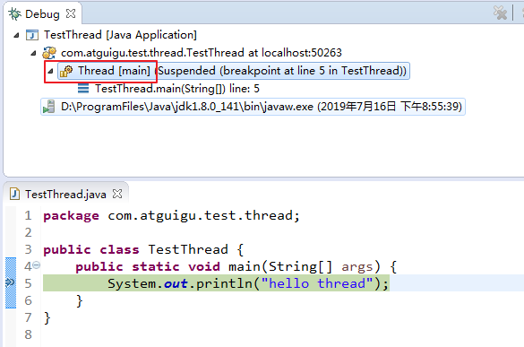

# day19多线程

## 学习目标

- [ ] 说出进程的概念
- [ ] 说出线程的概念
- [ ] 能够理解并发与并行的区别
- [ ] 能够开启新线程
- [ ] 能够描述Java中多线程运行原理
- [ ] 能够使用继承类的方式创建多线程
- [ ] 能够使用实现接口的方式创建多线程
- [ ] 能够说出实现接口方式的好处
- [ ] 能够解释安全问题的出现的原因
- [ ] 能够使用同步代码块解决线程安全问题
- [ ] 能够使用同步方法解决线程安全问题
- [ ] 能够说出线程6个状态的名称
- [ ] 能够理解线程通信概念
- [ ] 能够理解等待唤醒机制
- [ ] 能够说出线程的生命周期


我们在之前，学习的程序在没有跳转语句的前提下，都是由上至下依次执行，那现在想要设计一个程序，边打游戏边听歌，怎么设计？

要解决上述问题,咱们得使用多进程或者多线程来解决.

## 19.1 相关概念

### 19.1.1 并发与并行（了解）

* **并行**（parallel）：指多个事件任务在**同一时刻**发生（同时发生）。指在同一时刻，有多条指令在多个处理器上同时执行。单核CPU同一时刻只能处理一条指令，所以单核CPU做不到并行处理。
* **并发**（concurrency）：指两个或多个事件在**同一个微小的时间段内**发生。指在同一个时刻只能有一条指令执行，但多个进程的指令被快速轮换执行，使得在宏观上具有多个进程同时执行的效果。程序并发执行可以在有限条件下，充分利用CPU资源，这是我们研究的重点。


在操作系统中，安装了多个程序，并发指的是在一段时间内宏观上有多个程序同时运行，这在单 CPU 系统中，每一时刻只能有一个程序执行，即微观上这些程序是分时的交替运行，只不过是给人的感觉是同时运行，那是因为分时交替运行的时间是非常短的。

而在多个 CPU 系统中，则这些可以并发执行的程序便可以分配到多个处理器上（CPU），实现多任务并行执行，即利用每个处理器来处理一个可以并发执行的程序，这样多个程序便可以同时执行。目前电脑市场上说的多核 CPU，便是多核处理器，核越多，**并行**处理的程序越多，能大大的提高电脑运行的效率。

> 注意：**单核**处理器的计算机肯定是**不能并行**的处理多个任务的，只能是多个任务在单个CPU上并发运行。同理，线程也是一样的，从宏观角度上理解线程是并行运行的，但是从微观角度上分析却是串行运行的，即一个线程一个线程的去运行，当系统只有一个CPU时，线程会以某种顺序执行多个线程，我们把这种情况称之为线程调度。

单核CPU：只能并发

多核CPU：并行+并发

例子：

- 并行：多项工作一起执行，之后再汇总，例如：泡方便面，电水壶烧水，一边撕调料倒入桶中

- 并发：同一时刻多个线程在访问同一个资源，多个线程对一个点，例如：春运抢票、电商秒杀...

### 19.1.2 线程与进程

* **程序**：为了完成某个任务和功能，选择一种编程语言编写的一组指令的集合。

* **软件**：1个或多个应用程序+相关的素材和资源文件等构成一个软件系统。

* **进程**是对一个程序运行过程（创建-运行-消亡）的描述，系统会为每个运行的程序建立一个进程，并为进程分配独立的系统资源，比如内存空间等资源。

* **线程**：线程是进程中的一个执行单元，负责完成执行当前程序的任务，一个进程中至少有一个线程。一个进程中是可以有多个线程的，这时这个应用程序也可以称之为多线程程序。多线程使得程序可以并发执行，充分利用CPU资源。 

  **面试题**：进程是操作系统调度和分配资源的最小单位，线程是CPU调度的最小单位。不同的进程之间是不共享内存的。进程之间的数据交换和通信的成本是很高。不同的线程是共享同一个进程的内存的。当然不同的线程也有自己独立的内存空间。对于方法区，堆中中的同一个对象的内存，线程之间是可以共享的，但是栈的局部变量永远是独立的。

例如：

**每个应用程序的运行都是一个进程**

我们可以再电脑底部任务栏，右键----->打开任务管理器,可以查看当前任务的进程：


**一个应用程序的多次运行，就是多个进程**


**一个进程中包含多个线程**


### 19.1.3多线程的优点与应用场景

- **主要优点：**
  - 充分利用CUP空闲时间片，用尽可能短的时间完成用户的请求。也就是使程序的响应速度更快 。
- **应用场景：**
  - 多任务处理。多个用户请求服务器，服务端程序可以开启多个线程分别处理每个用户的请求，互不影响。
  - 单个大任务处理。下载一个大文件，可以开启多个线程一起下载，减少整体下载时间。

### 19.1.4 线程调度

指CPU资源如何分配给不同的线程。常见的两种线程调度方式：

- 分时调度

  所有线程轮流使用 CPU 的使用权，平均分配每个线程占用 CPU 的时间。

- 抢占式调度

  优先让优先级高的线程使用 CPU，如果线程的优先级相同，那么会随机选择一个(线程随机性)，**Java采用的是抢占式调度方式**。

  -  抢占式调度详解

    大部分操作系统都支持多进程并发运行，现在的操作系统几乎都支持同时运行多个程序。比如：现在我们上课一边使用编辑器，一边使用录屏软件，同时还开着画图板，dos窗口等软件。此时，这些程序是在同时运行，”感觉这些软件好像在同一时刻运行着“。

    实际上，CPU(中央处理器)使用抢占式调度模式在多个线程间进行着高速的切换。对于CPU的一个核而言，某个时刻，只能执行一个线程，而 CPU的在多个线程间切换速度相对我们的感觉要快，看上去就是在同一时刻运行。
    其实，多线程程序并不能提高程序的运行速度，但能够提高程序运行效率，让CPU的使用率更高。

    

## 19.2 线程的创建与启动

java虚拟机是支持多线程的，当运行Java程序时，至少已经有一个线程了，那就是main线程。



那么如何创建和启动一个新的线程呢？创建线程的简单方式有两种：

### 19.2.1 继承Thread类

Java中`java.lang.Thread`是表示线程的类，每个Thread类或其子类的实例代表一个线程对象。

**通过继承Thread类来创建并启动多线程的步骤:**

1. 定义Thread类的子类，并重写该类的run()方法，该run()方法的方法体就代表了线程需要完成的任务,因此把run()方法称为线程执行体。
2. 创建Thread子类的实例，即创建了线程对象
3. 调用线程对象的start()方法来启动该线程

**自定义线程类：**

~~~java
public class MyThread extends Thread {
	//定义指定线程名称的构造方法
	public MyThread(String name) {
		//调用父类的String参数的构造方法，指定线程的名称
		super(name);
	}
	/**
	 * 重写run方法，完成该线程执行的逻辑
	 */
	@Override
	public void run() {
		for (int i = 0; i < 10; i++) {
			System.out.println(getName()+"：正在执行！"+i);
		}
	}
}
~~~

**测试类：创建线程对象并启动线程**

~~~java
public class Demo01 {
	public static void main(String[] args) {
		//创建自定义线程对象
		MyThread mt = new MyThread("新的线程！");
		//开启新线程
		mt.start();
		//在主方法中执行for循环
		for (int i = 0; i < 10; i++) {
			System.out.println("main线程！"+i);
		}
	}
}
~~~

**多线程执行情况分析**


**注意事项：**

- 手动调用run方法不是启动线程的方式，只是普通方法调用。
- start方法启动线程后，run方法会由JVM调用执行。
- 不要重复启动同一个线程，否则抛出异常`IllegalThreadStateException`

- 不要使用Junit单元测试多线程，不支持，主线程结束后会调用`System.exit()`直接退出JVM;

### 19.2.2 实现Runnable接口

Java有单继承的限制，当我们无法继承Thread类时，那么该如何做呢？在核心类库中提供了Runnable接口，我们可以实现Runnable接口，重写run()方法，然后再通过Thread类的对象代理启动和执行我们的线程体run()方法

**通过实现Runnable接口创建线程并启动的步骤:**

1. 定义Runnable接口的实现类，并重写该接口的run()方法，该run()方法的方法体同样是该线程的线程执行体。
2. 创建Runnable实现类的实例，并以此实例作为Thread的target来创建Thread对象，该Thread对象才是真正
   的线程对象。
3. 调用线程对象的start()方法来启动线程。

**自定义线程任务类：**

```java
  public class MyRunnable implements Runnable{
  	@Override  
      public void run() {
          for (int i = 0; i < 20; i++) {
          	System.out.println(Thread.currentThread().getName()+" "+i);         
  		}       
  	}    
  }
```

**测试类：创建线程对象并启动线程**

```java
  public class Demo {
      public static void main(String[] args) {
          //创建自定义类对象  线程任务对象
          MyRunnable mr = new MyRunnable();
          //创建线程对象
          Thread t = new Thread(mr, "小强");
          t.start();
          for (int i = 0; i < 20; i++) {
              System.out.println("旺财 " + i);
          }
      }
  }
```

### 19.2.3 两种创建线程方式比较

- Thread类本身也是实现了Runnable接口的，run方法都来自Runnable接口，run方法也是真正要执行的线程任务。

  ```java
  public class Thread implements Runnable {}
  ```

- 因为Java类是单继承的，所以继承Thread的方式有单继承的局限性，但是使用上更简单一些。

- 实现Runnable接口的方式，避免了单继承的局限性，并且可以使多个线程对象共享一个Runnable实现类（线程任务类）对象，从而方便在多线程任务执行时共享数据。

### 19.2.4 匿名内部类对象创建线程

匿名内部类对象的方式创建线程，并不是一种新的创建线程的方式，只是在线程任务只需执行一次的情况下，我们无需单独创建线程类，可以采用匿名对象的方式：

```java
new Thread("新的线程！"){
	@Override
	public void run() {
		for (int i = 0; i < 10; i++) {
			System.out.println(getName()+"：正在执行！"+i);
		}
	}
}.start();
```

```java
new Thread(new Runnable(){
    @Override
    public void run() {
        for (int i = 0; i < 10; i++) {
            System.out.println(Thread.currentThread().getName()+"：" + i);
        }
    }
}).start();
```


## 19.3 Thread类

### 19.3.1 构造方法

- public Thread() :分配一个新的线程对象。
- public Thread(String name) :分配一个指定名字的新的线程对象。
- public Thread(Runnable target) :分配一个带有指定目标新的线程对象。
- public Thread(Runnable target,String name) :分配一个带有指定目标新的线程对象并指定名字。

### 19.3.2 线程使用基础方法

* public void run() :此线程要执行的任务在此处定义代码。
* public String getName() :获取当前线程名称。
* public static Thread currentThread() :返回对当前正在执行的线程对象的引用。 
* public final int getPriority() ：返回线程优先级 
* public final void setPriority(int newPriority) ：改变线程的优先级

  * 每个线程都有一定的优先级，优先级高的线程将获得较多的执行机会。每个线程默认的优先级都与创建它的父线程具有相同的优先级。Thread类提供了setPriority(int newPriority)和getPriority()方法类设置和获取线程的优先级，其中setPriority方法需要一个整数，并且范围在[1,10]之间，通常推荐设置Thread类的三个优先级常量：
  * MAX_PRIORITY（10）：最高优先级 
  * MIN _PRIORITY （1）：最低优先级
  * NORM_PRIORITY （5）：普通优先级，默认情况下main线程具有普通优先级。

```java
public static void main(String[] args) {
    Thread t = new Thread(){
        public void run(){
            System.out.println(getName() + "的优先级：" + getPriority());
        }
    };
    t.setPriority(Thread.MAX_PRIORITY);
    t.start();

    System.out.println(Thread.currentThread().getName() +"的优先级：" + Thread.currentThread().getPriority());
}
```

### 19.3.3 线程控制常见方法

* public void start() :导致此线程开始执行; Java虚拟机调用此线程的run方法。

* public static void sleep(long millis) :线程睡眠，使当前正在执行的线程以指定的毫秒数暂停（暂时停止执行）。

* public static void yield()：线程礼让，yield只是让当前线程暂时失去执行权，让系统的线程调度器重新调度一次，希望优先级与当前线程相同或更高的其他线程能够获得执行机会，但是这个不能保证，完全有可能的情况是，当某个线程调用了yield方法暂停之后，线程调度器又将其调度出来重新执行。

* void join() ：加入线程，当前线程中加入一个新线程，等待加入的线程终止后再继续执行当前线程。 

  void join(long millis) ：等待该线程终止的时间最长为 millis 毫秒。如果millis时间到，将不再等待。 

  void join(long millis, int nanos) ：等待该线程终止的时间最长为 millis 毫秒 + nanos 纳秒。 

* public final void stop()：强迫线程停止执行。 该方法具有不安全性，已被弃用，最好不要使用。

  - 调用 stop() 方法会立刻停止 run() 方法中剩余的全部工作，包括在 catch 或 finally 语句中的，并抛出ThreadDeath异常(通常情况下此异常不需要显示的捕获)，因此可能会导致一些清理性的工作的得不到完成，如文件，数据库等的关闭。
  - 调用 stop() 方法会立即释放该线程所持有的所有的锁，导致数据得不到同步，出现数据不一致的问题。

* public void interrupt()：中断线程，实际上是给线程打上一个中断的标记，并不会真正使线程停止执行。

* public static boolean interrupted()：检查线程的中断状态，调用此方法会清除中断状态（标记）。

* public boolean isInterrupted()：检查线程中断状态，不会清除中断状态（标记）

  


#### 示例

1. #### 代码：倒计时

   ```java
   	public static void main(String[] args) {
   		for (int i = 10; i>=0; i--) {
   			System.out.println(i);
   			try {
   				Thread.sleep(1000);
   			} catch (InterruptedException e) {
   				e.printStackTrace();
   			}
   		}
   		System.out.println("新年快乐！");
   	}
   ```

2. #### 示例代码：强行加塞

   主线程：打印[1,10]，每隔10毫秒打印一个数字，

   自定义线程类：不停的问是否结束，输入Y或N，

   现在当主线程打印完5之后，就让自定义线程类加塞，直到自定义线程类结束，主线程再继续。

   ```java
   import java.util.Scanner;
   
   public class TestJoin {
   	public static void main(String[] args) {
   		ChatThread t = new ChatThread();
   		t.start();
   		
   		for (int i = 1; i <= 10; i++) {
   			System.out.println("main:" + i);
   			try {
   				Thread.sleep(10);
   			} catch (InterruptedException e) {
   				e.printStackTrace();
   			}
            //当main打印到5之后，需要等join进来的线程停止后才会继续了。
   			if(i==5){
   				try {
   					t.join();
   				} catch (InterruptedException e) {
   					e.printStackTrace();
   				}
   			}
   		}
   	}
   }
   class ChatThread extends Thread{
   	public void run(){
   		Scanner input = new Scanner(System.in);
   		while(true){
   			System.out.println("是否结束？（Y、N）");
   			char confirm = input.next().charAt(0);
   			if(confirm == 'Y' || confirm == 'y'){
   				break;
   			}
   		}
   		input.close();
   	}
   }
   ```

3. #### 示例代码：友谊赛

   案例：编写龟兔赛跑多线程程序，设赛跑长度为30米

   兔子的速度是10米每秒，兔子每跑完10米休眠的时间10秒

   乌龟的速度是1米每秒，乌龟每跑完10米的休眠时间是1秒

   要求：要等兔子和乌龟的线程结束，主线程（裁判）才能公布最后的结果。

   ```java
   public class Racer extends Thread {
   	private String name;//运动员名字
   	private long runTime;//每米需要时间，单位毫秒
   	private long restTime;//每10米的休息时间，单位毫秒
   	private long distance;//全程距离，单位米
   	private long totalTime;//跑完全程的总时间
   
   	public Racer(String name, long distance, long runTime, long restTime) {
   		super();
   		this.name = name;
   		this.distance = distance;
   		this.runTime = runTime;
   		this.restTime = restTime;
   	}
   
   	@Override
   	public void run() {
   		long sum = 0;
   		long start = System.currentTimeMillis();
   		while (sum < distance) {
   			System.out.println(name + "正在跑...");
   			try {
   				Thread.sleep(runTime);// 每米距离，该运动员需要的时间
   			} catch (InterruptedException e) {
   				return ;
   			}
   			sum++;
   			try {
   				if (sum % 10 == 0 && sum < distance) {
   					// 每10米休息一下
   					System.out.println(name+"已经跑了"+sum+"米正在休息....");
   					Thread.sleep(restTime);
   				}
   			} catch (InterruptedException e) {
   				return ;
   			}
   		}
   		long end = System.currentTimeMillis();
   		totalTime = end - start;
   		System.out.println(name+"跑了"+sum+"米，已到达终点，共用时"+totalTime/1000.0+"秒");
   	}
   
   	public long getTotalTime() {
   		return totalTime;
   	}
   }
   ```

   ```java
   public class TestJoin {
   	public static void main(String[] args) {
   		Racer rabbit = new Racer("兔子", 30, 100, 10000);
   		Racer turtoise = new Racer("乌龟", 30, 1000, 1000);
   		
   		rabbit.start();
   		turtoise.start();
   		
           //因为要兔子和乌龟都跑完，才能公布结果
   		try {
   			rabbit.join();
   		} catch (InterruptedException e) {
   			e.printStackTrace();
   		}
   		try {
   			turtoise.join();
   		} catch (InterruptedException e) {
   			e.printStackTrace();
   		}		
   		System.out.println("比赛结束");
           if(rabbit.getTotalTime()==turtoise.getTotalTime()){
               System.out.println("平局");
           }else if(rabbit.getTotalTime()<turtoise.getTotalTime()){
               System.out.println("兔子赢");
           }else{
               System.out.println("乌龟赢");
           }
   	}
   }
   ```

4. #### 示例代码：冠军赛

   案例：编写龟兔赛跑多线程程序，设赛跑长度为30米

   兔子的速度是10米每秒，兔子每跑完10米休眠的时间10秒

   乌龟的速度是1米每秒，乌龟每跑完10米的休眠时间是1秒

   要求：只要兔子和乌龟中有人到达终点，就宣布比赛结束，没到达终点的也停下来。

   ```java
   public class Player extends Thread{
   	private String name;//运动员名字
   	private long runTime;//每米需要时间，单位毫秒
   	private long restTime;//每10米的休息时间，单位毫秒
   	private long distance;//全程距离，单位米
   	private boolean flag = true;
   	private volatile boolean ended = false;
   
   	public Player(String name, long distance, long runTime, long restTime) {
   		super();
   		this.name = name;
   		this.distance = distance;
   		this.runTime = runTime;
   		this.restTime = restTime;
   	}
   
   	@Override
   	public void run() {
   		long sum = 0;
   		while (sum < distance && flag) {
   			System.out.println(name + "正在跑...");
   			try {
   				Thread.sleep(runTime);// 每米距离，该运动员需要的时间
   			} catch (InterruptedException e) {
   				break ;
   			}
   			sum++;
   			try {
   				if (sum % 10 == 0 && sum < distance && flag) {
   					// 每10米休息一下
   					System.out.println(name+"已经跑了"+sum+"米正在休息....");
   					Thread.sleep(restTime);
   				}
   			} catch (InterruptedException e) {
   				break ;
   			}
   		}
   		ended = sum == distance ? true : false;
   		System.out.println(name+"跑了"+sum+"米");
   	}
   
   	public void setFlag(boolean flag) {
   		this.flag = flag;
   	}
   
   	public boolean isEnded() {
   		return ended;
   	}
   	
   }
   ```

   ```java
   public class TestStop {
   	public static void main(String[] args) {
   		Thread.currentThread().setPriority(Thread.MAX_PRIORITY);
   		Player rabbit = new Player("兔子", 30, 100, 10000);
   		Player turtoise = new Player("乌龟", 30, 1000, 1000);
   		
   		rabbit.start();
   		turtoise.start();
   		
   		while(true){
   			if(rabbit.isEnded() || turtoise.isEnded()){
   				rabbit.setFlag(false);
   				turtoise.setFlag(false);
   				rabbit.interrupt();//中断休眠
   				turtoise.interrupt();//中断休眠
   				//只要有人跑完，就结束比赛，并公布结果
   				break;
   			}
   		}
   		
   		System.out.println("比赛结束");
   		if(rabbit.isEnded() && turtoise.isEnded()){
   			System.out.println("平局");
   		}else if(rabbit.isEnded()){
   			System.out.println("兔子赢");
   		}else{
   			System.out.println("乌龟赢");
   		}
   	}
   }
   ```

   > volatile的作用是确保不会因编译器的优化而省略某些指令，volatile的变量是说这变量可能会被意想不到地改变，每次都小心地重新读取这个变量的值，而不是使用保存在寄存器里的备份，这样，编译器就不会去假设这个变量的值了。

5. ####  守护线程

   ```java
   public class TestThread {
   	public static void main(String[] args) {
   		MyDaemon m = new MyDaemon();
   		m.setDaemon(true);
   		m.start();
   
   		for (int i = 1; i <= 100; i++) {
   			System.out.println("main:" + i);
   		}
   	}
   }
   
   class MyDaemon extends Thread {
   	public void run() {
   		while (true) {
   			System.out.println("我一直守护者你...");
   			try {
   				Thread.sleep(1);
   			} catch (InterruptedException e) {
   				e.printStackTrace();
   			}
   		}
   	}
   }
   ```

   

## 19.4 线程安全

当我们使用多个线程访问**同一资源**（可以是同一个变量、同一个文件、同一条记录等）的时候，但是如果多个线程中对资源有读和写的操作，就会出现前后数据不一致问题，这就是线程安全问题。

案例：三个窗口售卖共100张火车票。

### 19.4.1 线程安全问题引出

1. #### 局部变量不能共享

   示例代码：

   ```javascript
   package com.atguigu.safe;
   
   public class SaleTicketDemo1 {
   	public static void main(String[] args) {
   		Window w1 = new Window();
   		Window w2 = new Window();
   		Window w3 = new Window();
   		
   		w1.start();
   		w2.start();
   		w3.start();
   	}
   }
   class Window extends Thread{
   	public void run(){
   		int total = 100;
   		while(total>0) {
   			System.out.println(getName() + "卖出一张票，剩余:" + --total);
   		}
   	}
   }
   ```

   结果：发现卖出300张票。

   问题：局部变量是每次调用方法都是独立的，那么每个线程的run()的total是独立的，不是共享数据。

2. ####  不同对象的实例变量不共享

   ```java
   package com.atguigu.safe;
   
   public class SaleTicketDemo2 {
   	public static void main(String[] args) {
   		TicketSaleThread t1 = new TicketSaleThread();
   		TicketSaleThread t2 = new TicketSaleThread();
   		TicketSaleThread t3 = new TicketSaleThread();
   		
   		t1.start();
   		t2.start();
   		t3.start();
   	}
   }
   class TicketSaleThread extends Thread{
   	private int total = 10;
   	public void run(){
   		while(total>0) {
   			System.out.println(getName() + "卖出一张票，剩余:" + --total);
   		}
   	}
   }
   ```

   结果：发现卖出300张票。

   问题：不同的实例对象的实例变量是独立的。

3. ####  静态变量是共享的

   示例代码：

   ```java
   package com.atguigu.safe;
   
   public class SaleTicketDemo3 {
   	public static void main(String[] args) {
   		TicketThread t1 = new TicketThread();
   		TicketThread t2 = new TicketThread();
   		TicketThread t3 = new TicketThread();
   		
   		t1.start();
   		t2.start();
   		t3.start();
   	}
   }
   class TicketThread extends Thread{
   	private static int total = 10;
   	public void run(){
   		while(total>0) {
   			try {
   				Thread.sleep(10);//加入这个，使得问题暴露的更明显
   			} catch (InterruptedException e) {
   				e.printStackTrace();
   			}
   			System.out.println(getName() + "卖出一张票，剩余:" + --total);
   		}
   	}
   }
   ```

   结果：发现卖出近100张票。

   问题（1）：但是有重复票或负数票问题。

   原因：线程安全问题

   问题（2）：如果要考虑有两场电影，各卖100张票，这场卖完就没票了，新的线程对象也没有票卖了

   原因：TicketThread类的静态变量，是所有TicketThread类的对象共享。本来成员变量就是run方法共享的数据，再用static不合适。

4. ####  同一个对象的实例变量共享

   示例代码：多个Thread线程使用同一个Runnable对象

   ```java
   package com.atguigu.safe;
   
   public class SaleTicketDemo3 {
   	public static void main(String[] args) {
   		TicketSaleRunnable tr = new TicketSaleRunnable();
   		Thread t1 = new Thread(tr,"窗口一");
   		Thread t2 = new Thread(tr,"窗口一");
   		Thread t3 = new Thread(tr,"窗口一");
   		
   		t1.start();
   		t2.start();
   		t3.start();
   	}
   }
   class TicketSaleRunnable implements Runnable{
   	private int total = 10;
   	public void run(){
   		while(total>0) {
   			try {
   				Thread.sleep(10);//加入这个，使得问题暴露的更明显
   			} catch (InterruptedException e) {
   				e.printStackTrace();
   			}
   			System.out.println(Thread.currentThread().getName() + "卖出一张票，剩余:" + --total);
   		}
   	}
   }
   ```

   结果：发现卖出近100张票。

   问题：但是有重复票或负数票问题。

   原因：线程安全问题

### 19.4.2 线程安全问题原因分析

出现重复打印票和负数的问题分析（跟阻塞没关系）：


**总结：线程安全问题的出现因为具备了以下条件**

1. **多线程执行**
2. **共享数据**
3. **多条语句操作共享数据**

### 19.4.3 线程安全问题解决方式

上述线程安全问题的必备条件1和2是我们需要的，要解决只能从第三个点上想办法。要解决上述多线程并发访问一个资源的安全性问题:也就是解决重复票与不存在票问题，Java中提供了**线程同步机制**来解决。


Java中常使用关键字**synchronized** 来实现同步机制：

**同步方法**：synchronized 关键字直接修饰方法，表示同一时刻只有一个线程能进入这个方法，其他线程在外面等着。

```java
public synchronized void method(){
    可能会产生线程安全问题的代码
}
```

**同步代码块**：synchronized 关键字可以用于某个区块前面，表示只对这个区块的资源实行互斥访问。
格式:

```java
synchronized(同步锁){
     需要同步操作的代码
}
```

### 19.4.4 锁对象选择

同步锁对象：

- 锁对象可以是任意类型。
- 多个线程对象  要使用同一把锁。

#### 1、同步代码块的锁对象

- 静态代码块中：使用当前类的Class对象
- 非静代码块中：习惯上先考虑this，但是要注意是否同一个this

**代码示例：**

```java
//售票线程任务类
class SaleTicket implements Runnable {
    //票数
    private int count = 100;//共享资源

    @Override
    public void run() {
        while (true) {
			//同步代码块，this为锁对象
            synchronized (this) {
                if (count > 0) {
                    System.out.println(Thread.currentThread().getName() + "--" + count);
                    count--;
                }
            }

        }
    }
}

//测试类
public class DemoSaleTicket {
    public static void main(String[] args) {
        //创建线程任务对象
        SaleTicket st = new SaleTicket(ticket);
		//创建售票线程对象，并启动线程
        new Thread(st).start();
        new Thread(st).start();

    }
}
```

**代码改进：**

```java
//售票线程任务类
class SaleTicket implements Runnable {
    private int count = 100;

    //售票线程任务
    @Override
    public void run() {
        while (true) {
            synchronized (this) {
                sell();//调用售票方法
            }

        }
    }
    //提取出售票方法
    private  void sell() {
        if (count > 0) {
            System.out.println(Thread.currentThread().getName() + "--" + count);
            count--;
        }
    }
}


//测试类
public class DemoSaleTicket {
    public static void main(String[] args) {
        //创建线程任务对象
        SaleTicket st = new SaleTicket(ticket);
        //创建售票线程对象，并启动线程
        new Thread(st).start();
        new Thread(st).start();

    }
}
```


#### 2、同步方法的锁对象

- 静态方法：当前类的Class对象

- 非静态方法：this


**示例代码：**

```java
public class SaleTicket implements Runnable {
    private int count = 100;

    @Override
    public void run() {
        while (true) {
				//直接调用同步方法
                sell();
        }
    }
    //将售票方法改进为：同步方法，非静态的同步方法的锁对象默认为this
    private synchronized void sell() {
        if (count > 0) {
            System.out.println(Thread.currentThread().getName() + "--" + count);
            count--;
        }
    }
}

```

**示例改造：**

```java
//共享资源类（将共享数据与同步方法封装到一个类中）
class Ticket {
    private int count=100;//票数

    //****同步方法，非静态同步方法的锁对象默认为this
    public synchronized void sell() {
        if (count > 0) {
            System.out.println(Thread.currentThread().getName() + "--" + count--);
        }
    }
    
    public int getCount() {
        return count;
    }

}

//线程任务类
class SaleTicketRunnable implements Runnable {
    //共享的资源
    private Ticket ticket;
    //通过构造器传入共享资源
    public SaleTicketRunnable(Ticket ticket) {
        this.ticket = ticket;
    }
    //线程任务
    @Override
    public void run() {
        while (true) {
            //售票
            ticket.sell();
            if(ticket.getCount()<=0)//售完跳出循环，结束线程任务
                break;
        }
    }

}
//测试类
public class DemoSaleTicket {
    public static void main(String[] args) {
        //创建共享资源
        Ticket ticket = new Ticket();
        //创建资源操作线程对象
        SaleTicket st = new SaleTicket(ticket);
        //创建售票线程对象，并启动线程
        new Thread(st).start();
        new Thread(st).start();

    }
}
```


> 锁的范围太小：不能解决安全问题，要同步所有操作共享资源的语句。
>
> 锁的范围太大：因为一旦某个线程抢到锁，其他线程就只能等待，所以范围太大，效率会降低，不能合理利用CPU资源。

### 19.4.5 如何编写多线程的程序呢？

- 原则：
  - 线程操作资源类
  - 高内聚低耦合 

- 步骤：
  - 编写资源类
  - 考虑线程安全问题，在资源类中考虑使用同步代码块或同步方法

```java
public class TestSynchronized {
	public static void main(String[] args) {
		// 2、创建资源对象
		Ticket ticket = new Ticket();

		// 3、启动多个线程操作资源类的对象
		Thread t1 = new Thread("窗口一") {
			public void run() {
				while (true) {
					try {
						Thread.sleep(10);// 加入这个，使得问题暴露的更明显
						ticket.sale();
					} catch (Exception e) {
						e.printStackTrace();
						break;
					}
				}
			}
		};
		Thread t2 = new Thread("窗口二") {
			public void run() {
				while (true) {
					try {
						Thread.sleep(10);// 加入这个，使得问题暴露的更明显
						ticket.sale();
					} catch (Exception e) {
						e.printStackTrace();
						break;
					}
				}
			}
		};
		Thread t3 = new Thread(new Runnable() {
			public void run() {
				while (true) {
					try {
						Thread.sleep(10);// 加入这个，使得问题暴露的更明显
						ticket.sale();
					} catch (Exception e) {
						e.printStackTrace();
						break;
					}
				}
			}
		}, "窗口三");

		t1.start();
		t2.start();
		t3.start();
	}
}

// 1、编写资源类
class Ticket {
	private int total = 10;

	public synchronized void sale() {
		if(total<=0){
			throw new RuntimeException(Thread.currentThread().getName() + "发现没有票了");
		}
		System.out.println(Thread.currentThread().getName() + "卖出一张票，剩余:" + --total);
	}
	public int getTotal() {
		return total;
	}
}
```

### 19.4.6 单例设计模式的线程安全问题

#### 1、饿汉式没有线程安全问题

饿汉式：上来就创建对象

```java
package com.atguigu.thread4;

public class OnlyOneDemo {
	public static void main(String[] args) {
		OnlyOne o1 = OnlyOne.INSTANCE;
		OnlyOne o2 = OnlyOne.INSTANCE;
		
		System.out.println(o1);
		System.out.println(o2);
		System.out.println(o1==o2);
	}
}
class OnlyOne{
	public static final OnlyOne INSTANCE = new OnlyOne();
	private OnlyOne(){
		
	}
}
```

#### 2、懒汉式线程安全问题

```java

public class Singleton {
    private static Singleton ourInstance;

    public static Singleton getInstance() {
        //一旦创建了对象，之后再次获取对象，都不会再进入同步代码块，提升效率
        if (ourInstance == null) {
            //同步锁，锁住判断语句与创建对象并赋值的语句
            synchronized (Singleton.class) {
                if (ourInstance == null) {
                    ourInstance = new Singleton();
                }
            }
        }
        return ourInstance;
    }

    private Singleton() {
    }
}

```


```java
//测试类
public class Demo {
    public static void main(String[] args) {
        //开启多个线程获取单例
        new SingletonThread().start();
        new SingletonThread().start();
        new SingletonThread().start();

    }
}
//线程类
class SingletonThread extends Thread{
    @Override
    public void run() {
            Singleton instance = Singleton.getInstance();
            System.out.println(instance);//打印对象地址，查看每个线程获取的实例是否同一个
    }
}
```


## 19.5 线程间通信

### 19.5.1 **为什么要处理线程间通信：**

**为什么要处理线程间通信：**

多个线程在处理同一个资源，但是处理的动作（线程的任务）却不相同。而多个线程并发执行时, 在默认情况下CPU是随机切换线程的，当我们需要多个线程来共同完成一件任务，并且我们希望他们有规律的执行, 那么多线程之间需要一些通信机制，可以协调它们的工作，以此来帮我们达到多线程共同操作一份数据。

比如：线程A用来生成包子的，线程B用来吃包子的，包子可以理解为同一资源，线程A与线程B处理的动作，一个是生产，一个是消费，此时B线程必须等到A线程完成后才能执行，那么线程A与线程B之间就需要线程通信

### 19.5.2 等待唤醒机制

**什么是等待唤醒机制**

这是多个线程间的一种**协作**机制。谈到线程我们经常想到的是线程间的**竞争（race）**，比如去争夺锁，但这并不是故事的全部，线程间也会有协作机制。

就是在一个线程满足某个条件时，就进入等待状态（**wait()**/**wait(time)**）， 等待其他线程执行完他们的指定代码过后再将其唤醒（**notify()**）;或可以指定wait的时间，等时间到了自动唤醒；在有多个线程进行等待时，如果需要，可以使用 notifyAll()来唤醒所有的等待线程。wait/notify 就是线程间的一种协作机制。

1. wait：线程不再活动，不再参与调度，进入 wait set 中，因此不会浪费 CPU 资源，也不会去竞争锁了，这时的线程状态即是 WAITING或TIMED_WAITING。它还要等着别的线程执行一个**特别的动作**，也即是“**通知（notify）**”或者等待时间到，在这个对象上等待的线程从wait set 中释放出来，重新进入到调度队列（ready queue）中
2. notify：则选取所通知对象的 wait set 中的一个线程释放；
3. notifyAll：则释放所通知对象的 wait set 上的全部线程。

> 注意：
>
> 被通知线程被唤醒后也不一定能立即恢复执行，因为它当初中断的地方是在同步块内，而此刻它已经不持有锁，所以她需要再次尝试去获取锁（很可能面临其它线程的竞争），成功后才能在当初调用 wait 方法之后的地方恢复执行。
>
> 总结如下：
>
> - 如果能获取锁，线程就从 WAITING 状态变成 RUNNABLE（可运行） 状态；
> - 否则，线程就从 WAITING 状态又变成 BLOCKED（等待锁） 状态

**调用wait和notify方法需要注意的细节**

1. wait方法与notify方法必须要由同一个锁对象调用。因为：对应的锁对象可以通过notify唤醒使用同一个锁对象调用的wait方法后的线程。
2. wait方法与notify方法是属于Object类的方法的。因为：锁对象可以是任意对象，而任意对象的所属类都是继承了Object类的。
3. wait方法与notify方法必须要在同步代码块或者是同步函数中使用。因为：必须要通过锁对象调用这2个方法。

### 19.5.3 生产者与消费者问题

等待唤醒机制可以解决经典的“生产者与消费者”的问题。

生产者与消费者问题（英语：Producer-consumer problem），也称有限缓冲问题（英语：Bounded-buffer problem），是一个多线程同步问题的经典案例。该问题描述了两个（多个）共享固定大小缓冲区的线程——即所谓的“生产者”和“消费者”——在实际运行时会发生的问题。生产者的主要作用是生成一定量的数据放到缓冲区中，然后重复此过程。与此同时，消费者也在缓冲区消耗这些数据。该问题的关键就是要保证生产者不会在缓冲区满时加入数据，消费者也不会在缓冲区中空时消耗数据。

生产者与消费者问题中其实隐含了两个问题：

* 线程安全问题：因为生产者与消费者共享数据缓冲区，不过这个问题可以使用同步解决。
* 线程的协调工作问题：
  * 要解决该问题，就必须让生产者线程在缓冲区满时等待(wait)，暂停进入阻塞状态，等到下次消费者消耗了缓冲区中的数据的时候，通知(notify)正在等待的线程恢复到就绪状态，重新开始往缓冲区添加数据。同样，也可以让消费者线程在缓冲区空时进入等待(wait)，暂停进入阻塞状态，等到生产者往缓冲区添加数据之后，再通知(notify)正在等待的线程恢复到就绪状态。通过这样的通信机制来解决此类问题。

#### 一个厨师一个服务员问题

案例：有家餐馆的取餐口比较小，只能放10份快餐，厨师做完快餐放在取餐口的工作台上，服务员从这个工作台取出快餐给顾客。现在有1个厨师和1个服务员。

```java
package com.atguigu.thread5;

public class TestCommunicate {
	public static void main(String[] args) {
		// 1、创建资源类对象
		Workbench workbench = new Workbench();

		// 2、创建和启动厨师线程
		new Thread("厨师") {
			public void run() {
				while (true) {
					workbench.put();
				}
			}
		}.start();

		// 3、创建和启动服务员线程
		new Thread("服务员") {
			public void run() {

				while (true) {
					workbench.take();
				}
			}
		}.start();
	}

}

// 1、定义资源类
class Workbench {
	private static final int MAX_VALUE = 10;
	private int num;

	public synchronized void put() {
		if (num >= MAX_VALUE) {
			try {
				this.wait();
			} catch (InterruptedException e) {
				e.printStackTrace();
			}
		}
		num++;
		System.out.println(Thread.currentThread().getName() + "制作了一份快餐，现在工作台上有：" + num + "份快餐");
		this.notify();
	}

	public synchronized void take() {
		if (num <= 0) {
			try {
				this.wait();
			} catch (InterruptedException e) {
				e.printStackTrace();
			}
		}
		num--;
		System.out.println(Thread.currentThread().getName() + "取走了一份快餐，现在工作台上有：" + num + "份快餐");
		this.notify();
	}
}


```

#### 多个厨师多个服务员问题

案例：有家餐馆的取餐口比较小，只能放10份快餐，厨师做完快餐放在取餐口的工作台上，服务员从这个工作台取出快餐给顾客。现在有多个厨师和多个服务员。

```java
package com.atguigu.thread5;

public class TestCommunicate2 {
	public static void main(String[] args) {
		// 1、创建资源类对象
		WindowBoard windowBoard = new WindowBoard();

		// 2、创建和启动厨师线程
		// 3、创建和启动服务员线程
		Cook c1 = new Cook("张三",windowBoard);
		Cook c2 = new Cook("李四",windowBoard);
		Waiter w1 = new Waiter("小红",windowBoard);
		Waiter w2 = new Waiter("小绿",windowBoard);
		
		c1.start();
		c2.start();
		w1.start();
		w2.start();
	}

}
//1、定义资源类
class WindowBoard {
	private static final int MAX_VALUE = 10;
	private int num;

	public synchronized void put() {
		while (num >= MAX_VALUE) {//必须循环判断。
			try {
				this.wait();//wait后会释放锁，Cooker1线程释放后，Cooker2线程获得锁（本应Waiter获得）进来后if继续wait，释放锁，Cooker1又快速获得锁，继续向下执行。。。
			} catch (InterruptedException e) {
				e.printStackTrace();
			}
		}
		num++;
		System.out.println(Thread.currentThread().getName() + "制作了一份快餐，现在工作台上有：" + num + "份快餐");
		this.notifyAll();
	}

	public synchronized void take() {
		while (num <= 0) {
			try {
				this.wait();
			} catch (InterruptedException e) {
				e.printStackTrace();
			}
		}
		num--;
		System.out.println(Thread.currentThread().getName() + "取走了一份快餐，现在工作台上有：" + num + "份快餐");
		this.notifyAll();
	}
}


//2、定义厨师类
class Cook extends Thread{
	private WindowBoard windowBoard;
	
	public Cook(String name,WindowBoard windowBoard) {
		super(name);
		this.windowBoard = windowBoard;
	}

	public void run(){
		while(true) {
			windowBoard.put();
		}
	}
}


//3、定义服务员类
class Waiter extends Thread{
	private WindowBoard windowBoard;
	
	public Waiter(String name,WindowBoard windowBoard) {
		super(name);
		this.windowBoard = windowBoard;
	}

	public void run(){
		while(true) {
			windowBoard.take();
		}
	}
}

```

### 练习

```Properties
一个数字线程打印数字：  1 2 3 4 5.....52
一个字母线程打印字母:  A B C D E F.... Z
两个线程进行协作
最终效果:
1 2 A 3 4 B 5 6 C 7  8  D  9  10  E.... 51 52 Z
-----------------------------------
1 2 3 4 5 6 7 8 9 10 11 12 13 14 15....
思路:
	每一个值占用一个位置如果是3的倍数打印字母否则打印数字

```


```java
//普通同步方法实现
public class Test {
    public static void main(String[] args) {
        Print print = new Print();

        NumThread numThread = new NumThread(print);

        CharThread charThread = new CharThread(print);

        numThread.start();
        charThread.start();

    }

}

package com.atguigu.notify.exer;

public class NumThread  extends Thread{

    Print p ;

    public NumThread(Print p) {
        this.p = p;
    }

    @Override
    public void run() {
        for (int i = 1; i <=52 ; i++) {

            try {
                p.printNum(i);
            } catch (InterruptedException e) {
                throw new RuntimeException(e);
            }
        }
    }
}
class CharThread extends Thread{
    Print p;

    public CharThread(Print p) {
        this.p = p;
    }

    @Override
    public void run() {
        for(char c='A';c<='Z';c++){
            try {
                p.printChar(c);
            } catch (InterruptedException e) {
                throw new RuntimeException(e);
            }
        }
    }
}


public class Print {
    //记录位置
    int position = 1;

    //打印数字的方法
    public synchronized void printNum(int num) throws InterruptedException {
        //如果是3的倍数  数字线程等待
        while (position % 3 == 0) {
            this.wait();
        }
        Thread.sleep(20);
        //展示数字
        System.out.print(num + " ");

        //更改位置
        position++;
        //通知字母线程打印字母
        this.notifyAll();
    }

    //打印字母的方法
    public synchronized void printChar(char c) throws InterruptedException {
        //如果不是3的倍数  字母线程等待
        while (position % 3 != 0) {
            this.wait();
        }
        //打印字母
        System.out.print(c + " ");

        //更改位置
        position++;
        //通知数字线程执行
        this.notifyAll();

    }

}
```

```java
//静态同步方法实现
public class Test {

    public static void main(String[] args) {

        NumThread numThread = new NumThread();
        CharThread charThread = new CharThread();

        numThread.start();
        charThread.start();

    }
}

public class Print {
    //记录位置
    static int position = 1;
    //打印数字的方法
    public static synchronized void printNum(int num) throws InterruptedException {
        //如果是3的倍数  数字线程等待
        while (position % 3 == 0) {
            Print.class.wait();
        }
        Thread.sleep(20);
        //展示数字
        System.out.print(num + " ");

        //更改位置
        position++;
        //通知字母线程打印字母
        Print.class.notifyAll();
    }

    //打印字母的方法
    public static synchronized void printChar(char c) throws InterruptedException {
        //如果不是3的倍数  字母线程等待
        while (position % 3 != 0) {
            Print.class.wait();
        }
        //打印字母
        System.out.print(c + " ");

        //更改位置
        position++;
        //通知数字线程执行
        Print.class.notifyAll();

    }

}

public class NumThread  extends Thread{
    @Override
    public void run() {
        for (int i = 1; i <=52 ; i++) {

            try {
                Print.printNum(i);
            } catch (InterruptedException e) {
                throw new RuntimeException(e);
            }
        }
    }
}
class CharThread extends Thread{
    @Override
    public void run() {
        for(char c='A';c<='Z';c++){
            try {
                Print.printChar(c);
            } catch (InterruptedException e) {
                throw new RuntimeException(e);
            }
        }
    }
}

```


## 19.6 线程生命周期

### 19.6.1 传统线程模型的五种线程状态(简单)

传统线程模型中把线程的生命周期描述为五种状态：**新建（New）**、**就绪（Runnable）**、**运行（Running）**、**阻塞（Blocked）**、**死亡（Dead）**。CPU需要在多条线程之间切换，于是线程状态会多次在运行、阻塞、就绪之间切换。


**1.** **新建**

当一个Thread类或其子类的对象被声明并创建时，新生的线程对象处于新建状。此时它和其他Java对象一样，仅仅由JVM为其分配了内存，并初始化了实例变量的值。此时的线程对象并没有任何线程的动态特征，程序也不会执行它的线程体run()。

**2.** **就绪**

但是当线程对象调用了start()方法之后，线程就从新建状态转为就绪状态。这时线程并未执行，只是具备了运行的条件，还需要获取CPU资源后才能执行。

**3.** **运行**

如果处于就绪状态的线程获得了CPU资源，开始执行run()方法的线程体代码，则该线程处于运行状态。如果计算机只有一个CPU，在任何时刻只有一个线程处于运行状态，如果计算机有多个处理器，将会有多个线程并行(Parallel)执行。

当然，美好的时光总是短暂的，而且CPU讲究雨露均沾。对于抢占式策略的系统而言，系统会给每个可执行的线程一个小时间段来处理任务，当该时间用完，系统会剥夺该线程所占用的资源，让其回到就绪状态等待下一次被调度。此时其他线程将获得执行机会，而在选择下一个线程时，系统会适当考虑线程的优先级。

**4.** **阻塞**

当在运行过程中的线程遇到某些特殊情况时，线程会临时放弃CPU资源，不再执行，即进入阻塞状态。比如：线程调用了sleep()方法，会主动放弃所占用的CPU资源。

**5.** **死亡**

线程完成任务结束或意外终止后，线程就处于死亡状态。

### 19.6.2  JDK定义的六种线程状态（了解）


在`java.lang.Thread`类内部定义了一个枚举类用来描述线程的六种状态：

```java
    public enum State {
        NEW,
        RUNNABLE,
        BLOCKED,
        WAITING,
        TIMED_WAITING,
        TERMINATED;
    }
```

跟传统线程模型中的线程状态不同的是：

1. 枚举类中没有区分`就绪`和`运行`状态，而是定义成了一种状态`Runnable`。

   - 因为对于Java对象来说，只能标记为可运行，至于什么时候运行，不是JVM来控制的了，是OS来进行调度的，而且时间非常短暂，因此对于Java对象的状态来说，无法区分。只能我们人为的进行想象和理解。

2. 传统模型中的阻塞状态在枚举类的定义中又细分为了三种状态的：`BLOCKED`、`WAITING`、`TIMED_WAITING`。

   - `BLOCKED`：是指互有竞争关系的几个线程，其中一个线程占有锁对象时，其他线程只能等待锁。只有获得锁对象的线程才能有执行机会。

   - `TIMED_WAITING`：当前线程执行过程中遇到Thread类的sleep或join，Object类的wait，LockSupport类的park方法，并且在调用这些方法时，设置了时间，那么当前线程会进入TIMED_WAITING，直到时间到，或被中断。

   - `WAITING`：当前线程执行过程中遇到遇到Object类的wait，Thread类的join，LockSupport类的park方法，并且在调用这些方法时，没有指定时间，那么当前线程会进入WAITING状态，直到被唤醒。

     - 通过Object类的wait进入`WAITING`状态的要有Object的notify/notifyAll唤醒；

     - 通过Condition的await进入`WAITING`状态的要有Conditon的signal方法唤醒；

     - 通过LockSupport类的park方法进入`WAITING`状态的要有LockSupport类的unpark方法唤醒

     - 通过Thread类的join进入`WAITING`状态，只有调用join方法的线程对象结束才能让当前线程恢复；

   *说明：当从`WAITING`或`TIMED_WAITING`恢复到`Runnable`状态时，如果发现当前线程没有得到监视器锁，那么会立刻转入`BLOCKED`状态。*


## 


## 19.7 释放锁操作与死锁

任何线程进入同步代码块、同步方法之前，必须先获得对同步监视器的锁定，那么何时会释放对同步监视器的锁定呢？

### **1、释放锁的操作**

当前线程的同步方法、同步代码块执行结束。

当前线程在同步代码块、同步方法中出现了未处理的Error或Exception，导致当前线程异常结束。

当前线程在同步代码块、同步方法中执行了锁对象的wait()方法，当前线程被挂起，并释放锁。

### 2、死锁

不同的线程分别锁住对方需要的同步监视器对象不释放，都在等待对方先放弃时就形成了线程的死锁。一旦出现死锁，整个程序既不会发生异常，也不会给出任何提示，只是所有线程处于阻塞状态，无法继续。

```java
public class TestDeadLock {
	public static void main(String[] args) {
		Object g = new Object();
		Object m = new Object();
		Owner s = new Owner(g,m);
		Customer c = new Customer(g,m);
		new Thread(s).start();
		new Thread(c).start();
	}
}
class Owner implements Runnable{
	private Object goods;
	private Object money;

	public Owner(Object goods, Object money) {
		super();
		this.goods = goods;
		this.money = money;
	}

	@Override
	public void run() {
		synchronized (goods) {
			System.out.println("先给钱");
			synchronized (money) {
				System.out.println("发货");
			}
		}
	}
}
class Customer implements Runnable{
	private Object goods;
	private Object money;

	public Customer(Object goods, Object money) {
		super();
		this.goods = goods;
		this.money = money;
	}

	@Override
	public void run() {
		synchronized (money) {
			System.out.println("先发货");
			synchronized (goods) {
				System.out.println("再给钱");
			}
		}
	}
}
```

### 3、面试题：sleep()和wait()方法的区别

（1）sleep()不释放锁，wait()释放锁

（2）sleep()指定休眠的时间，wait()可以指定时间也可以无限等待直到notify或notifyAll

（3）sleep()在Thread类中声明的静态方法，wait方法在Object类中声明

​         调用wait()方法是由锁对象调用，而锁对象的类型是任意类型的对象。
