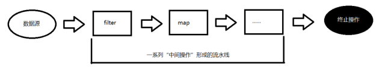
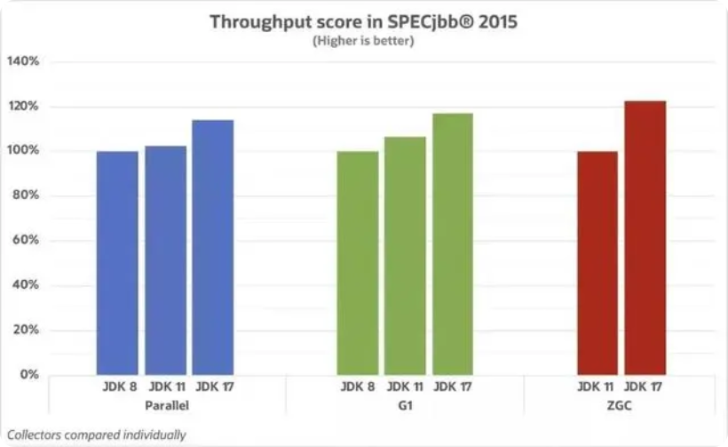
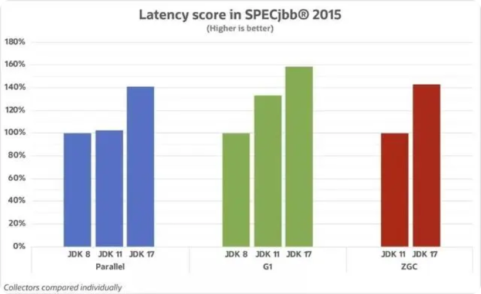
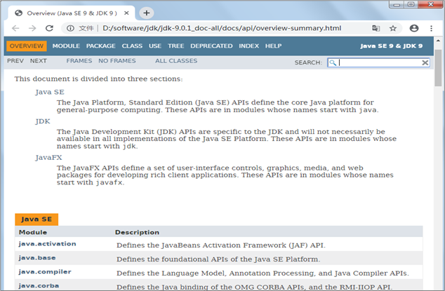

# day23新特性

## 学习目标

- [ ] 能够理解函数式编程相对于面向对象的优点
- [ ] 理解函数式接口概念
- [ ] 了解@FunctionalInterface注解
- [ ] 掌握Lambda表达式的语法规则
- [ ] 能够使用Lambda表达式给函数式接口的变量赋值
- [ ] 能够使用方法引用和构造器引用
- [ ] 了解Stream流的作用和特点
- [ ] 能够使用StreamAPI进行数据处理分析
- [ ] 能够使用Optional类包装对象并获取其中包装的对象
- [ ] 了解Java9-Java17的新特性


## 23.1 Lambda表达式

### 23.1.1 函数式编程思想

在数学中，**函数**就是有输入量、输出量的一套计算方案，也就是“拿什么东西做什么事情”。编程中的函数，也有类似的概念，你调用我的时候，给我实参为形参赋值，然后通过运行方法体，给你返回一个结果。对于调用者来做，关注这个方法具备什么样的功能。相对而言，面向对象过分强调“必须通过对象的形式来做事情”，而函数式思想则尽量忽略面向对象的复杂语法——**强调做什么，而不是谁来做**。

**生活举例：**


当我们需要从北京到上海时，可以选择高铁、汽车、骑行或是徒步。我们的真正目的是到达上海，而如何才能到达上海的形式并不重要，所以我们一直在探索有没有更好的方式。


Oracle所发布的Java 8（JDK 1.8）中，加入了**Lambda表达式**的重量级新特性，为我们打开了新世界的大门。Java8引入了Lambda表达式之后，Java也开始支持函数式编程。


Lambda表达式不是Java最早使用的，很多语言就支持Lambda表达式，例如：C++，C#，Python，Scala等。如果有Python或者Javascript的语言基础，对理解Lambda表达式有很大帮助，可以这么说lambda表达式其实就是实现SAM接口的语法糖，使得Java也算是支持函数式编程的语言。Lambda**写的好**可以极大的减少代码冗余，同时可读性也好过冗长的（啰嗦的）匿名内部类。

> 备注：“语法糖”是指使用更加方便，但是原理不变的代码语法。例如在遍历集合时使用的for-each语法，其实
> 底层的实现原理仍然是迭代器，这便是“语法糖”。从应用层面来讲，Java中的Lambda可以被当做是匿名内部
> 类的“语法糖”，但是二者在原理上是不同的。

```java
package com.atguigu.lambda;

import org.junit.Test;

import java.util.Arrays;
import java.util.Comparator;

public class TestLambda {
    @Test
    public void test1(){
        String[] arr = {"hello","java","hi","chai","atguigu"};
        //把上面的字符串按照长短排序，从短到长
//        Arrays.sort(arr);//按照编码排序
        //public static <T> void sort(T[] a, Comparator<? super T> c)
        Arrays.sort(arr, new Comparator<String>() {
            @Override
            public int compare(String o1, String o2) {
//                return o1.length()-o2.length();
                return Integer.compare(o1.length(), o2.length());
            }
        });
        /*
        上面的写法使用了匿名内部类，既声明了一个类，又创建了一个对象。
        创建这个对象的目的是为了给sort方法的第二个形参c赋值。
        声明匿名内部类的目的是为了重写public int compare(String o1, String o2)
         */
        System.out.println(Arrays.toString(arr));
    }

    @Test
    public void test2(){
        String[] arr = {"hello","java","hi","chai","atguigu"};
        //这个需求中我们关心的是什么？ 如何比较两个字符串的大小，至于对象不重要
        Arrays.sort(arr, (o1, o2) -> Integer.compare(o1.length(), o2.length()));
        System.out.println(Arrays.toString(arr));
    }
}

```

**做什么，而不是谁来做，怎么做**

我们真的希望创建一个匿名内部类对象吗？不。我们只是为了做这件事情而**不得不**创建一个对象。我们真正希望做的事情是：将`compareTo`方法体内的代码传递给`sort`方法知晓。

**传递一段代码**——这才是我们真正的目的。而创建对象只是受限于面向对象语法而不得不采取的一种手段方式。那，有没有更加简单的办法？如果我们将关注点从“怎么做”回归到“做什么”的本质上，就会发现只要能够更好地达到目的，过程与形式其实并不重要。使用Lambda表达式不再有“不得不创建接口对象”的束缚，就是这么简单！

### 23.1.2 函数接口的概念

Lambda表达式其实就是实现SAM接口的语法糖，所谓SAM接口就是Single Abstract Method，即该接口中只有一个抽象方法需要实现，当然该接口可以包含其他非抽象方法。

其实只要满足“SAM”特征的接口都可以称为函数式接口，都可以使用Lambda表达式，但是如果要更明确一点，最好在声明接口时，加上@FunctionalInterface。一旦使用该注解来定义接口，编译器将会强制检查该接口是否确实有且仅有一个抽象方法，否则将会报错。

### 23.1.3 Java8之前的函数式接口

之前学过的接口已经很多了：Cloneable、Comparable、Comparator、Runnable、Iterable、Iterator、Collection、List、Queue、Deque、Set、Map、Serializable、FileFilter、FilenameFilter等，但是满足SAM特征的接口不多。

虽然Iterable和Comparable接口也只有一个抽象方法，但它们没有@FunctionalInterface注解标记，因此不算。

| 序号 | 接口                    | 抽象方法                                      | SAM接口 |
| ---- | ----------------------- | --------------------------------------------- | ------- |
| 1    | java.lang.Runnable      | public void run()                             |         |
| 2    | java.util.Comparator<T> | public int compare(T t1, T t2)                |         |
| 3    | java.io.FileFilter      | public boolean accept(File pathname)          |         |
| 4    | java.io.FilenameFilter  | public  boolean accept(File dir, String name) |         |

### 23.1.4 Lambda表达式语法

Lambda表达式是用来给“函数式接口”的变量或形参赋值用的。其实本质上，Lambda表达式是用于实现“函数式接口”的抽象方法的语法格式，或者是给函数式接口的变量传递一段实现抽象方法的方法体代码。

Lambda表达式语法格式

```java
(形参列表) -> {Lambda体}
```

语法格式说明：

* (形参列表)它就是你要赋值的函数式接口的抽象方法的(形参列表)，照抄
* {Lambda体}就是实现这个抽象方法的方法体
* ->称为Lambda操作符（减号和大于号中间不能有空格，而且必须是英文状态下半角输入方式）

#### 1、标准格式演示

```java
package com.atguigu.lambda;

import org.junit.Test;

import java.io.File;
import java.io.FileFilter;
import java.util.Arrays;
import java.util.Comparator;

public class TestLambdaGrammar {
    @Test
    public void test1(){
        Runnable r = new Runnable() {
            @Override
            public void run() {
                System.out.println("我爱尚硅谷");
            }
        };
    }
    @Test
    public void test2(){
        Runnable r = ()-> { System.out.println("我爱尚硅谷"); };
    }
    
    @Test
    public void test4(){
        String[] arr = {"hello","java","hi","chai","atguigu"};
        //把上面的字符串按照长短排序，从短到长
        Arrays.sort(arr, new Comparator<String>() {
            @Override
            public int compare(String o1, String o2) {
                return Integer.compare(o1.length(), o2.length());
            }
        });

        System.out.println(Arrays.toString(arr));
    }

    @Test
    public void test5(){
        String[] arr = {"hello","java","hi","chai","atguigu"};
        //把上面的字符串按照长短排序，从短到长
        Arrays.sort(arr, (String o1, String o2)-> { return Integer.compare(o1.length(), o2.length()); });
        System.out.println(Arrays.toString(arr));
    }

    @Test
    public void test7(){
        File dir = new File("d:\\atguigu");
        File[] subFiles = dir.listFiles(new FileFilter() {
            @Override
            public boolean accept(File sub) {
                return sub.isFile();
            }
        });
        for (File subFile : subFiles) {
            System.out.println(subFile);
        }
    }

    @Test
    public void test8(){
        File dir = new File("d:\\atguigu");
        File[] subFiles = dir.listFiles((File sub)-> { return sub.isFile();});
        for (File subFile : subFiles) {
            System.out.println(subFile);
        }
    }
}

```

#### 2、Lambda表达式的简化

某些情况下Lambda表达式可以精简：

* 当{Lambda体}中只有一句语句时，可以省略{}和{;}
* 当{Lambda体}中只有一句语句时，并且这个语句还是一个return语句，那么{、return、;}三者可以省略。它们三要么一起省略，要么都不省略。
* 当Lambda表达式(形参列表)的类型已知，获取根据泛型规则可以自动推断，那么(形参列表)的数据类型可以省略。
* 当Lambda表达式(形参列表)的形参个数只有一个，并且类型已知或可以自动推断，则形参的数据类型和()可以一起省略，但是形参名不能省略。
* 当Lambda表达式(形参列表)是空参时，()不能省略

```java
    @Test
    public void test3(){
        Runnable r = ()-> System.out.println("我爱尚硅谷");
    }


    @Test
    public void test6(){
        String[] arr = {"hello","java","hi","chai","atguigu"};
        //把上面的字符串按照长短排序，从短到长
        Arrays.sort(arr, (o1, o2)-> Integer.compare(o1.length(), o2.length()));
        System.out.println(Arrays.toString(arr));
    }
    
    @Test
    public void test9(){
        File dir = new File("d:\\atguigu");
        File[] subFiles = dir.listFiles(sub->sub.isFile());
        for (File subFile : subFiles) {
            System.out.println(subFile);
        }
    }
}

```

### 23.1.5 Java8之后引入的函数式接口

Java8在java.util.function新增了很多函数式接口：主要分为四大类，消费型、供给型、判断型、功能型。基本可以满足我们的开发需求。当然你也可以定义自己的函数式接口。

#### **1、消费型接口**

消费型接口的抽象方法特点：有形参，但是返回值类型是void

| 序号 | 接口名               | 抽象方法                       | 描述                       |
| ---- | -------------------- | ------------------------------ | -------------------------- |
| 1    | Consumer<T>          | void accept(T t)               | 接收一个对象用于完成功能   |
| 2    | BiConsumer<T,U>      | void accept(T t, U u)          | 接收两个对象用于完成功能   |
| 3    | DoubleConsumer       | void accept(double value)      | 接收一个double值           |
| 4    | IntConsumer          | void accept(int value)         | 接收一个int值              |
| 5    | LongConsumer         | void accept(long value)        | 接收一个long值             |
| 6    | ObjDoubleConsumer<T> | void accept(T t, double value) | 接收一个对象和一个double值 |
| 7    | ObjIntConsumer<T>    | void accept(T t, int value)    | 接收一个对象和一个int值    |
| 8    | ObjLongConsumer<T>   | void accept(T t, long value)   | 接收一个对象和一个long值   |

已知在JDK1.8中java.lang.Iterable接口中增加了一个默认方法：

- `public default void forEach(Consumer<? super T> action) `该方法功能是遍历Collection集合，并将传递给action参数的操作代码应用在每一个元素上。

因为Collection接口继承了Iterable接口，这就意味着所有Collection系列的接口都包含该方法。

```java
package com.atguigu.four;

import java.util.Arrays;
import java.util.List;

public class TestConsumer {
    public static void main(String[] args) {
        List<String> list = Arrays.asList("java","c","python","c++","VB","C#");
        list.forEach(s -> System.out.println(s));
    }
}
```


#### **2、供给型接口**

这类接口的抽象方法特点：无参，但是有返回值

| 序号 | 接口名          | 抽象方法               | 描述              |
| ---- | --------------- | ---------------------- | ----------------- |
| 1    | Supplier<T>     | T get()                | 返回一个对象      |
| 2    | BooleanSupplier | boolean getAsBoolean() | 返回一个boolean值 |
| 3    | DoubleSupplier  | double getAsDouble()   | 返回一个double值  |
| 4    | IntSupplier     | int getAsInt()         | 返回一个int值     |
| 5    | LongSupplier    | long getAsLong()       | 返回一个long值    |

```java
package com.atguigu.four;

import java.util.function.Supplier;

public class TestSupplier {
    public static void main(String[] args) {
        Supplier<String> supplier = () -> "尚硅谷";
        System.out.println(supplier.get());
    }
}
```


#### **3、判断型接口**

这类接口的抽象方法特点：有参，但是返回值类型是boolean结果。

| 序号 | 接口名           | 抽象方法                   | 描述             |
| ---- | ---------------- | -------------------------- | ---------------- |
| 1    | Predicate<T>     | boolean test(T t)          | 接收一个对象     |
| 2    | BiPredicate<T,U> | boolean test(T t, U u)     | 接收两个对象     |
| 3    | DoublePredicate  | boolean test(double value) | 接收一个double值 |
| 4    | IntPredicate     | boolean test(int value)    | 接收一个int值    |
| 5    | LongPredicate    | boolean test(long value)   | 接收一个long值   |

已知：JDK1.8时，Collecton<E>接口增加了一下方法，其中一个如下：

- `public default boolean removeIf(Predicate<? super E> filter)` 用于删除集合中满足filter指定的条件判断的。

```java
package com.atguigu.four;

import java.util.ArrayList;

public class TestPredicate {
    public static void main(String[] args) {
        ArrayList<String> list = new ArrayList<>();
        list.add("hello");
        list.add("java");
        list.add("atguigu");
        list.add("ok");
        list.add("yes");

        System.out.println("删除之前：");
        list.forEach(t-> System.out.println(t));

        //删除包含o字母的元素
        list.removeIf(s -> s.contains("o"));

        System.out.println("删除包含o字母的元素之后：");
        list.forEach(t-> System.out.println(t));
    }
}
```


#### **4、功能型接口**

这类接口的抽象方法特点：既有参数又有返回值

| 序号 | 接口名                  | 抽象方法                                        | 描述                                                |
| ---- | ----------------------- | ----------------------------------------------- | --------------------------------------------------- |
| 1    | Function<T,R>           | R apply(T t)                                    | 接收一个T类型对象，返回一个R类型对象结果            |
| 2    | UnaryOperator<T>        | T apply(T t)                                    | 接收一个T类型对象，返回一个T类型对象结果            |
| 3    | DoubleFunction<R>       | R apply(double value)                           | 接收一个double值，返回一个R类型对象                 |
| 4    | IntFunction<R>          | R apply(int value)                              | 接收一个int值，返回一个R类型对象                    |
| 5    | LongFunction<R>         | R apply(long value)                             | 接收一个long值，返回一个R类型对象                   |
| 6    | ToDoubleFunction<T>     | double applyAsDouble(T value)                   | 接收一个T类型对象，返回一个double                   |
| 7    | ToIntFunction<T>        | int applyAsInt(T value)                         | 接收一个T类型对象，返回一个int                      |
| 8    | ToLongFunction<T>       | long applyAsLong(T value)                       | 接收一个T类型对象，返回一个long                     |
| 9    | DoubleToIntFunction     | int applyAsInt(double value)                    | 接收一个double值，返回一个int结果                   |
| 10   | DoubleToLongFunction    | long applyAsLong(double value)                  | 接收一个double值，返回一个long结果                  |
| 11   | IntToDoubleFunction     | double applyAsDouble(int value)                 | 接收一个int值，返回一个double结果                   |
| 12   | IntToLongFunction       | long applyAsLong(int value)                     | 接收一个int值，返回一个long结果                     |
| 13   | LongToDoubleFunction    | double applyAsDouble(long value)                | 接收一个long值，返回一个double结果                  |
| 14   | LongToIntFunction       | int applyAsInt(long value)                      | 接收一个long值，返回一个int结果                     |
| 15   | DoubleUnaryOperator     | double applyAsDouble(double operand)            | 接收一个double值，返回一个double                    |
| 16   | IntUnaryOperator        | int applyAsInt(int operand)                     | 接收一个int值，返回一个int结果                      |
| 17   | LongUnaryOperator       | long applyAsLong(long operand)                  | 接收一个long值，返回一个long结果                    |
|      |                         |                                                 |                                                     |
| 18   | BiFunction<T,U,R>       | R apply(T t, U u)                               | 接收一个T类型和一个U类型对象，返回一个R类型对象结果 |
| 19   | BinaryOperator<T>       | T apply(T t, T u)                               | 接收两个T类型对象，返回一个T类型对象结果            |
| 20   | ToDoubleBiFunction<T,U> | double applyAsDouble(T t, U u)                  | 接收一个T类型和一个U类型对象，返回一个double        |
| 21   | ToIntBiFunction<T,U>    | int applyAsInt(T t, U u)                        | 接收一个T类型和一个U类型对象，返回一个int           |
| 22   | ToLongBiFunction<T,U>   | long applyAsLong(T t, U u)                      | 接收一个T类型和一个U类型对象，返回一个long          |
| 23   | DoubleBinaryOperator    | double applyAsDouble(double left, double right) | 接收两个double值，返回一个double结果                |
| 24   | IntBinaryOperator       | int applyAsInt(int left, int right)             | 接收两个int值，返回一个int结果                      |
| 25   | LongBinaryOperator      | long applyAsLong(long left, long right)         | 接收两个long值，返回一个long结果                    |

已知，java.util.List接口在Java8版本中新增了一个方法：

- default void replaceAll(UnaryOperator<E> operator)将该列表的每个元素替换为将该运算符应用于该元素的结果。

```java
    @Test
    public void test(){
        ArrayList<String> list = new ArrayList<>();
        list.add("hello");
        list.add("java");
        list.add("world");
        list.add("haha");

        //使用Lambda表达式实现Function<T,R>接口的子接口UnaryOperator<T>，
        // 可以实现将一个字符串首字母转为大写的功能。
        list.replaceAll(s -> s.substring(0,1).toUpperCase() + s.substring(1));
        System.out.println(list);
    }
```


### 23.1.6 自定义函数式接口

只要确保接口中有且仅有一个抽象方法即可：

```java
修饰符 interface 接口名称 {
    public abstract 返回值类型 方法名称(可选参数信息);
    // 其他非抽象方法内容
}
```

> 接口当中抽象方法的 public abstract 是可以省略的

例如：声明一个计算器`Calculator`<T,R>接口，内含抽象方法`calculate`可以对两个参数进行计算，并返回结果。其中T是参数类型，R是返回值类型。

```java
package com.atguigu.fi;

@FunctionalInterface
public interface Calculator<T,R> {
    R calculate(T a, T b);
}
```

例如：声明一个转换器Convertor<T,R>，包含抽象方法change，可以将参数转换为另一个值，并返回结果。其中T是参数类型，R是返回值类型。

```java
package com.atguigu.fi;

@FunctionalInterface
public interface Convertor<T,R> {
    R change(T t);
}
```

示例代码：

```java
package com.atguigu.lambda;

import com.atguigu.fi.Calculator;
import com.atguigu.fi.Convertor;
import org.junit.Test;

public class LambdaGrammarSimple {
    @Test
    public void test01() {
        //使用Lambda表达式实现Calculator接口，求两个整数的和的功能
        Calculator<Integer,Integer> c1 = (Integer a, Integer b) -> {return a+b;};
        System.out.println(c1.calculate(5, 2));

        Calculator<Integer,Integer> c2 = (Integer a, Integer b) ->  a+b;
        System.out.println(c2.calculate(5, 2));

        Calculator<Integer,Integer> c3 = (a,  b) -> a+b;
        System.out.println(c3.calculate(5, 2));
        //上面三种写法完全等价
    }

    @Test
    public void test02() {
        //使用Lambda表达式实现Convertor接口，实现取字符串的首字母的功能
        Convertor<String,Character> c1 = (String str)-> {return str.charAt(0);};
        System.out.println(c1.change("hello"));

        Convertor<String,Character> c2 = (String str)-> str.charAt(0);
        System.out.println(c2.change("world"));

        Convertor<String,Character> c3 = (str)-> str.charAt(0);
        System.out.println(c3.change("atguigu"));

        Convertor<String,Character> c4 = str-> str.charAt(0);
        System.out.println(c4.change("chai"));
        //上面四种写法完全一致
    }

}
```

## 23.2 Optional类

到目前为止，臭名昭著的空指针异常是导致Java应用程序失败的最常见原因。以前，为了解决空指针异常，Google公司著名的Guava项目引入了Optional类，Guava通过使用检查空值的方式来防止代码污染，它鼓励程序员写更干净的代码。受到Google Guava的启发，Optional类已经成为Java 8类库的一部分。

   Optional实际上是个容器：它可以保存类型T的值，或者仅仅保存null。Optional提供很多有用的方法，这样我们就不用显式进行空值检测。

| 序号 | 构造器或方法                                                 | 描述                                                         |
| ---- | ------------------------------------------------------------ | ------------------------------------------------------------ |
| 1    | static <T> Optional<T> empty()                               | 用来创建一个空的Optional                                     |
| 2    | static <T> Optional<T> of(T value)                           | 用来创建一个非空的Optional                                   |
| 3    | static <T> Optional<T> ofNullable(T value)                   | 用来创建一个可能是空，也可能非空的Optional                   |
|      |                                                              |                                                              |
| 4    | T get()                                                      | 返回Optional容器中的对象。要求Optional容器必须非空。T get()与of(T value)使用是安全的 |
| 5    | T orElse(T other)                                            | 如果Optional容器中非空，就返回所包装值，如果为空，就用orElse(T other)other指定的默认值（备胎）代替。一般orElse(T other) 与ofNullable(T value)配合使用 |
| 6    | T orElseGet(Supplier<? extends T> other)                     | 如果Optional容器中非空，就返回所包装值，如果为空，就用Supplier接口的Lambda表达式提供的值代替 |
| 7    | <X extends Throwable> T orElseThrow(Supplier<? extends X> exceptionSupplier) | 如果Optional容器中非空，就返回所包装值，如果为空，就抛出你指定的异常类型代替原来的NoSuchElementException |
|      |                                                              |                                                              |
| 8    | boolean isPresent()                                          | 判断Optional容器中的值是否存在                               |
| 9    | void ifPresent(Consumer<? super T> consumer)                 | 判断Optional容器中的值是否存在，如果存在，就对它进行Consumer指定的操作，如果不存在就不做 |
| 10   | <U> Optional<U> map(Function<? super T,? extends U> mapper)  | 判断Optional容器中的值是否存在，如果存在，就对它进行Function接口指定的操作，如果不存在就不做 |


```java
package com.atguigu.optional;

import java.util.Optional;

import org.junit.Test;

public class TestOptional {
 


    @Test
    public void test8(){
        String str = null;
        Optional<String> opt = Optional.ofNullable(str);
        String string = opt.orElseThrow(()->new RuntimeException("值不存在"));
        System.out.println(string);
    }


    @Test
    public void test7(){
        String str = null;
        Optional<String> opt = Optional.ofNullable(str);
        String string = opt.orElseGet(()->new String("atguigu"));
        System.out.println(string);
    }

    @Test
    public void test6(){
        String str = "hello";
        Optional<String> opt = Optional.ofNullable(str);
        String string = opt.orElse("atguigu");
        System.out.println(string);
    }

    @Test
    public void test5(){
        String str = null;
        Optional<String> opt = Optional.ofNullable(str);
//		System.out.println(opt.get());//java.util.NoSuchElementException: No value present
        String string = opt.orElse("atguigu");
        System.out.println(string);
    }

 


    @Test
    public void test3(){
        String str = null;
        Optional<String> opt = Optional.ofNullable(str);
        System.out.println(opt);
    }

  
}

```


## 23.3 方法引用与构造器引用

Lambda表达式是可以简化函数式接口的变量与形参赋值的语法。而方法引用和构造器引用是为了简化Lambda表达式的。

### 23.3.1 语法格式与使用要求

当Lambda表达式满足一些特殊的情况时，还可以再简化：

（1）Lambda体只有一句语句，并且是通过调用一个对象的/类现有的方法来完成的

（2）并且Lambda表达式的形参正好全部用上，Lambda体中没有额外的数据参与

| 序号 | 语法格式             | 场景                                                         |
| ---- | -------------------- | ------------------------------------------------------------ |
| 1    | 实例对象名::实例方法 | Lambda表达式有多个形参，Lambda体是调用Lambda体外的某个实例对象的实例方法完成，并且Lambda表达式的形参正好依次按顺序作为该方法调用的实参 |
| 2    | 类名::静态方法       | Lambda表达式有多个形参，Lambda体是调用某个类的静态方法完成，并且Lambda表达式的形参正好依次按顺序作为该方法调用的实参 |
| 3    | 类名::实例方法       | Lambda表达式只有1个形参，该参数正好Lambda体中调用方法的对象  |
|      |                      | Lambda表达式有多个形参，其中第1个参数正好是Lambda体中调用方法的对象，其余形参正好依次按顺序作为该方法调用的实参 |
|      |                      |                                                              |
| 4    | 类名::new            | 当Lambda表达式是一个new表达式，并且Lambda表达式形参正好依次按顺序作为所调用构造器的实参 |
| 5    | 数组类型名::new      | 当Lambda表达式是一个创建数组对象的new表达式，Lambda表达式的形参正好是创建数组的长度 |

### 23.3.2 演示案例

```java
package com.atguigu.lambda;

import org.junit.Test;

import java.io.File;
import java.io.FileFilter;
import java.util.*;
import java.util.function.Supplier;
import java.util.stream.Collectors;
import java.util.stream.Stream;

public class TestMethodReference {
    @Test
    public void test1(){
        Runnable r = ()-> System.out.println("我爱尚硅谷");
        //不能用方法引用
    }
    @Test
    public void test2(){
        List<Integer> list = Arrays.asList(1,3,4,8,9);
        //list.forEach(t -> System.out.println(t));

        //用方法引用再简化
        list.forEach(System.out::println);
    }

    @Test
    public void test3(){
//        Stream<Double> stream = Stream.generate(() -> Math.random());
        Stream<Double> stream = Stream.generate(Math::random);

        //结束Stream
        //Consumer<T> 的抽象方法  void accept(T t)
        stream.forEach(t-> System.out.println(t));
    }


    @Test
    public void test4(){
        File dir = new File("d:\\atguigu");

//        File[] subFiles = dir.listFiles(sub->sub.isFile());
        File[] subFiles = dir.listFiles(File::isFile);

        for (File subFile : subFiles) {
            System.out.println(subFile);
        }
    }

    @Test
    public void test5(){
        String[] arr = {"hello","java","hi","chai","atguigu"};
        //这个需求中我们关心的是什么？ 如何比较两个字符串的大小，至于对象不重要
//        Arrays.sort(arr, (o1, o2) -> Integer.compare(o1.length(), o2.length()));
//        Arrays.sort(arr, Comparator.comparingInt(s->s.length()));
        Arrays.sort(arr, Comparator.comparingInt(String::length));
        System.out.println(Arrays.toString(arr));
    }

    @Test
    public void test6(){
        String[] arr = {"Hello","java","chai"};
        Arrays.sort(arr, (s1,s2) -> s1.compareToIgnoreCase(s2));

        //用方法引用简化
        /*
         * Lambda表达式的形参，第一个（例如：s1），正好是调用方法的对象，剩下的形参(例如:s2)正好是给这个方法的实参
         */
        Arrays.sort(arr, String::compareToIgnoreCase);
    }


    @Test
    public void test7(){
        ArrayList<String> list = new ArrayList<>();
        Collections.addAll(list,"张三","李四","王五");
        //用list集合中的姓名，创建一个一个的Student对象
//        ArrayList<Student>

     /*   List<Student> result = list.stream()
                .map(name -> new Student(name)) //Function<T,R> R apply(T t)
                .collect(Collectors.toList());*/

        List<Student> result = list.stream()
                .map(Student::new) //Function<T,R> R apply(T t)
                .collect(Collectors.toList());

        result.forEach(System.out::println);
    }

    @Test
    public void test8(){
        Optional<Integer> opt1 = Optional.ofNullable(16);
//        Optional<String[]> opt2 = opt1.map(len -> new String[len]);
        Optional<String[]> opt2 = opt1.map(String[]::new);
        System.out.println(opt2.orElse(new String[0]).length);
    }
}

```


## 23.4 StreamAPI

Java8中有两大最为重要的改变。第一个是 Lambda 表达式；另外一个则是 Stream API。

### 23.4.1 Stream特点

Stream API ( java.util.stream) 把真正的函数式编程风格引入到Java中。这是目前为止对Java类库最好的补充，因为Stream API可以极大提高Java程序员的生产力，让程序员写出高效率、干净、简洁的代码。

Stream 是 Java8 中处理集合的关键抽象概念，它可以指定你希望对集合进行的操作，可以执行非常复杂的查找、过滤和映射数据等操作。 使用Stream API 对集合数据进行操作，就类似于使用 SQL 执行的数据库查询。也可以使用 Stream API 来并行执行操作。简言之，Stream API 提供了一种高效且易于使用的处理数据的方式。

Stream是数据渠道，用于操作数据源（集合、数组等）所生成的元素序列。“集合讲的是数据，负责存储数据，Stream流讲的是计算，负责处理数据！”

注意：

①Stream 自己不会存储元素。

②Stream 不会改变源对象。每次处理都会返回一个持有结果的新Stream。

③Stream 操作是延迟执行的。这意味着他们会等到需要结果的时候才执行。

```java
package com.atguigu.stream;

import org.junit.Test;

import java.util.ArrayList;
import java.util.stream.Stream;

public class TestStream {
    @Test
    public void test1(){
        //1、创建Stream，指定数据源来创建Stream
        ArrayList<String> list = new ArrayList<>();
        list.add("hello");
        list.add("java");
        list.add("hi");
        list.add("heihei");
        Stream<String> stream = list.stream();

        //2、加工处理
        //假设我要处理的要求：把里面所有的e字母，修改为a
        //Function<T,R> 的抽象方法  R apply(T t)
        stream = stream.map(s-> s.replace('e','a'));
        //假设我要处理的要求：筛选出包含a字母的单词
        //Predicate<T>接口   boolean test(T t)
        stream = stream.filter(s -> s.contains("a"));
        //处理，打印所有包含"a"字母的单词
        //Consumer<T> 的抽象方法  void accept(T t)
        stream = stream.peek( s -> System.out.println(s));
        
        //3、结束处理
        //统计满足条件的单词的个数
//         long count = stream.count();//没有这一步，前面的加工处理不执行
//        System.out.println("count = " + count);

        System.out.println("list = " + list);//不会修改数据源
    }
}

```


### 23.4.2 Stream操作的步骤

1- 创建 Stream：通过一个数据源（如：集合、数组），获取一个流

2- 中间操作：每次处理都会返回一个持有结果的新Stream，即中间操作的方法返回值仍然是Stream类型的对象，因此中间操作可以是个操作链，可对数据源的数据进行n次处理，但是在终结操作前，并不会真正执行。

3- 终止操作：终止操作的方法返回值类型就不再是Stream了，因此一旦执行终止操作，就结束整个Stream操作了。一旦执行终止操作，就执行中间操作链，最终产生结果并结束Stream。





### 23.4.3 创建StreamAPI

**1、创建 Stream方式一：通过集合**

Java8 中的 Collection 接口被扩展，提供了两个获取流的方法：

* public default Stream<E> stream() : 返回一个顺序流

* public default Stream<E> parallelStream() : 返回一个并行流

**2、创建 Stream方式二：通过数组**

Java8 中的 Arrays 的静态方法 stream() 可以获取数组流：

* public static <T> Stream<T> stream(T[] array): 返回一个流

重载形式，能够处理对应基本类型的数组：

* public static IntStream stream(int[] array)：返回一个整型数据流
* public static LongStream stream(long[] array)：返回一个长整型数据流
* public static DoubleStream stream(double[] array)：返回一个浮点型数据流

**3、创建 Stream方式三：通过Stream的of()**

可以调用Stream类静态方法 of(), 通过显示值创建一个流。它可以接收任意数量的参数。

* public static<T> Stream<T> of(T... values) : 返回一个顺序流

**4、创建 Stream方式四：创建无限流**

可以使用静态方法 Stream.iterate() 和 Stream.generate(), 创建无限流。

* public static<T> Stream<T> iterate(final T seed, final UnaryOperator<T> f):返回一个无限流
* public static<T> Stream<T> generate(Supplier<T> s) ：返回一个无限流

```java
package com.atguigu.stream;

import org.junit.Test;

import java.util.ArrayList;
import java.util.Arrays;
import java.util.stream.Stream;

public class TestCreateStream {
    @Test
    public void test1(){
        ArrayList<String> list = new ArrayList<>();
        list.add("hello");
        list.add("java");
        list.add("hi");
        list.add("heihei");
        Stream<String> stream = list.stream();
    }

    @Test
    public void test2(){
        String[] arr = {"hello","world","java"};
        Stream<String> stream = Arrays.stream(arr);
    }

    @Test
    public void test3(){
        Stream<String> stringStream = Stream.of("hello", "world", "java");
    }

    @Test
    public void test4(){
        //Supplier<T> 的抽象方法  T get()
        Stream<Double> stream = Stream.generate(() -> Math.random());

        //结束Stream
        //Consumer<T> 的抽象方法  void accept(T t)
        stream.forEach(t-> System.out.println(t));
    }

    @Test
    public void test5(){
        //Stream<T> iterate(final T seed, final UnaryOperator<T> f)
        //seed：种子
        //UnaryOperator<T>： T apply(T t)
//       Stream<Integer> stream =  Stream.iterate(1, t -> t+2);
       Stream<Integer> stream =  Stream.iterate(1, t -> {
           try {
               Thread.sleep(10);
           } catch (InterruptedException e) {
               e.printStackTrace();
           }
           return t+2;});

        //结束Stream
        //Consumer<T> 的抽象方法  void accept(T t)
        stream.forEach(t-> System.out.println(t));
    }
}

```


### 23.4.4  中间操作API

多个中间操作可以连接起来形成一个流水线，除非流水线上触发终止操作，否则中间操作不会执行任何的处理！而在终止操作时一次性全部处理，称为“惰性求值”。

| 序号 | **方  法**                             | **描  述**                                                   |
| ---- | -------------------------------------- | ------------------------------------------------------------ |
| 1    | Stream filter(Predicate p)             | 接收 Lambda ， 从流中排除某些元素                            |
| 2    | Stream distinct()                      | 筛选，通过流所生成元素的equals() 去除重复元素                |
| 3    | Stream limit(long maxSize)             | 截断流，使其元素不超过给定数量                               |
| 4    | Stream skip(long n)                    | 跳过元素，返回一个扔掉了前 n 个元素的流。若流中元素不足 n 个，则返回一个空流。与 limit(n) 互补 |
| 5    | Stream peek(Consumer action)           | 接收Lambda，对流中的每个数据执行Lambda体操作                 |
| 6    | Stream sorted()                        | 产生一个新流，其中按自然顺序排序                             |
| 7    | Stream sorted(Comparator com)          | 产生一个新流，其中按比较器顺序排序                           |
| 8    | Stream map(Function f)                 | 接收一个函数作为参数，该函数会被应用到每个元素上，并将其映射成一个新的元素。 |
| 9    | Stream mapToDouble(ToDoubleFunction f) | 接收一个函数作为参数，该函数会被应用到每个元素上，产生一个新的 DoubleStream。 |
| 10   | Stream mapToInt(ToIntFunction f)       | 接收一个函数作为参数，该函数会被应用到每个元素上，产生一个新的 IntStream。 |
| 11   | Stream  mapToLong(ToLongFunction f)    | 接收一个函数作为参数，该函数会被应用到每个元素上，产生一个新的 LongStream。 |
| 12   | Stream flatMap(Function f)             | 接收一个函数作为参数，将流中的每个值都换成另一个流，然后把所有流连接成一个流 |

```java
package com.atguigu.stream;

import org.junit.Test;

import java.util.*;
import java.util.stream.Collectors;
import java.util.stream.Stream;

public class TestMiddle {
    @Test
    public void test1(){
        //（1）创建Stream，指定数据源来创建Stream（必须有）
        Stream<Integer> stream = Stream.of(1, 2, 3, 4, 5);

        //没有中间处理操作

        //（3）结束处理，获取结果，称为“终结操作”（必须有）
        stream.forEach(t-> System.out.println(t));
    }

    @Test
    public void test2(){
        //（1）创建Stream，指定数据源来创建Stream（必须有）
        Stream<Integer> stream = Stream.of(1, 2, 3, 4, 5,8,10,12,14);

        //中间处理操作：可以多步
        //filter(Predicate p)
        //Predicate<T> boolean test(T t)
        //找出偶数
        stream = stream.filter(t->t%2==0);
        //Stream 	sorted()  自然排序
//        Stream 	sorted(Comparator com) 定制排序
//       stream =  stream.sorted();//默认升序
        //Comparator<T> int compare(T t1, T t2)
       stream =  stream.sorted((t1,t2) -> t2-t1);//降序


        //（3）结束处理，获取结果，称为“终结操作”（必须有）
        stream.forEach(t-> System.out.println(t));
    }

    @Test
    public void test3(){
        //操作链
        Stream.of(1, 2, 3, 4, 5,8,10,12,14)
                .filter(t->t%2==0)
                .sorted((t1,t2) -> t2-t1)
                .forEach(t-> System.out.println(t));
    }

    @Test
    public void test4(){
        //把一组数字中，不同的数字筛选出来，打印这些数字，并且把这些不同的数字从小到大收集到List中
        List<Integer> list = Stream.of(1, 1, 3, 4, 5, 8, 1, 12, 5, 3, 2, 4, 12)
                .distinct() //去重复
                .sorted() //排序
                .peek(t -> System.out.println(t))
                .collect(Collectors.toList());

        System.out.println("list = " + list);
    }

    @Test
    public void test5(){
        //随机产生一些[0,100)的整数，取出前10个
        //Supplier<T> 的抽象方法  T get()
        Random random = new Random();
        List<Integer> list = Stream.generate(() -> random.nextInt(100))
                .limit(10)
                .collect(Collectors.toList());
        System.out.println("list = " + list);
    }

    @Test
    public void test6(){
        //取出第3个数字
        Optional<Integer> three = Stream.of(1, 2, 3, 4, 5)
                .skip(2)
                .findFirst();
        System.out.println(three);
    }

    @Test
    public void test7(){
        //取出第3个数字
         Stream.of(1, 2, 3, 4, 5)
                .skip(2)
                .limit(1)
                 .forEach(t-> System.out.println(t));
    }

    @Test
    public void test8(){
        //找出最老的3个员工，年龄最大的3个员工
        ArrayList<Employee> list = new ArrayList<>();
        list.add(new Employee(1,"张三",23,15000));
        list.add(new Employee(2,"李四",24,14000));
        list.add(new Employee(3,"王五",25,18000));
        list.add(new Employee(4,"赵六",22,12000));
        list.add(new Employee(5,"陈前",29,12000));
        list.add(new Employee(6,"林上清",27,12000));
        list.add(new Employee(7,"昆昆",27,12000));


        List<Employee> result = list.stream()
                .sorted((e1, e2) -> e2.getAge() - e1.getAge())
                .limit(3)
                .collect(Collectors.toList());

        System.out.println("result = " + result);
    }

    @Test
    public void test9(){
        //找出最老的3个员工，年龄最大的3个员工
        ArrayList<Employee> list = new ArrayList<>();
        list.add(new Employee(1,"张三",23,15000));
        list.add(new Employee(2,"李四",24,14000));
        list.add(new Employee(3,"王五",25,18000));
        list.add(new Employee(4,"赵六",22,12000));
        list.add(new Employee(5,"陈前",29,12000));
        list.add(new Employee(6,"林上清",27,12000));
        list.add(new Employee(7,"昆昆",27,12000));


        //年龄第3名的员工
        List<Employee> result = list.stream()
                .sorted((e1, e2) -> e2.getAge() - e1.getAge())
                .skip(2)
                .limit(1)
                .collect(Collectors.toList());

        System.out.println("result = " + result);
    }

    @Test
    public void test10(){
        //找出最老的3个员工，年龄最大的3个员工
        ArrayList<Employee> list = new ArrayList<>();
        list.add(new Employee(1,"张三",23,15000));
        list.add(new Employee(2,"李四",24,14000));
        list.add(new Employee(3,"王五",25,18000));
        list.add(new Employee(4,"赵六",22,12000));
        list.add(new Employee(5,"陈前",29,12000));
        list.add(new Employee(6,"林上清",27,12000));
        list.add(new Employee(7,"昆昆",27,12000));


        //年龄第3名的员工，年龄值不能重复
        //思路：先找出年龄值是第3的值，然后再找员工
        //Stream 	mapToInt(ToIntFunction f)
        //ToIntFunction<T> int applyAsInt(T value);
        OptionalInt ageOption = list.stream()
                .sorted((t1,t2)->t2.getAge()-t1.getAge())
                .mapToInt(emp -> emp.getAge())
                .distinct()
                .skip(2)
                .findFirst();
        System.out.println("age = " + ageOption);

        list.stream()
                .filter(emp -> emp.getAge() == ageOption.getAsInt())
                .forEach(t-> System.out.println(t));

    }

    @Test
    public void test11(){
        ArrayList<Employee> list = new ArrayList<>();
        list.add(new Employee(1,"张三",23,15000));
        list.add(new Employee(2,"李四",24,14000));
        list.add(new Employee(3,"王五",25,18000));
        list.add(new Employee(4,"赵六",22,12000));
        list.add(new Employee(5,"陈前",29,12000));
        list.add(new Employee(6,"林上清",27,12000));
        list.add(new Employee(7,"昆昆",27,12000));

        //把薪资低于15000，都涨工资为15000，然后统计总薪资值
        OptionalDouble sumSalary = list.stream()
                .map(emp -> {
                    if (emp.getSalary() < 15000) {
                        emp.setSalary(15000);
                    }
                    return emp;
                })  //Function<T,R> R apply(T t)
                .peek(t -> System.out.println(t))
                .mapToDouble(t -> t.getSalary())  //DoubleStream mapToDouble(ToDoubleFunction<? super T> mapper)  ToDoubleFunction<T> double apply(T t)
                .reduce((t1, t2) -> t1 + t2);//Optional<T> reduce(BinaryOperator<T> accumulator);   BinaryOperator<T,T> T apply(T t1, T t2)
        System.out.println("sumSalary = " + sumSalary);

    }

    @Test
    public void test12(){
        /*
         Stream 	map(Function f)
          Stream 	flatMap(Function f)
         */
        Stream.of("hello","java","world")  //首字母变大写
                .map(t->t.substring(0,1).toUpperCase().concat(t.substring(1)))  //Function<T,R> R apply(T t)
                .forEach(t-> System.out.println(t));
    }

    @Test
    public void test13(){
        /*
         Stream 	map(Function f)
          Stream 	flatMap(Function f)
         */
        Stream.of("hello","java","world")  //取出首字母
                .map(t->t.charAt(0))  //Function<T,R> R apply(T t)
                .forEach(t-> System.out.println(t));

        //map操作，元素的个数不会发生变化，类型可能变化
    }

    @Test
    public void test14(){
        /*
          <R> Stream<R> map(Function<? super T, ? extends R> mapper);
                T类型->R类型对象
         <R> Stream<R> flatMap(Function<? super T, ? extends Stream<? extends R>> mapper);
                T类型->Stream<R>流
         */
        Stream.of("hello","java","world")  //把所有单词的每一个字母取出来
            .flatMap(s->Arrays.stream(s.split("|")))
                .forEach(t-> System.out.println(t));

       /* String s = "hello";
         String[] strings = s.split("|");
        System.out.println(Arrays.toString(strings));*/
    }

    @Test
    public void test15(){
        /*
         需求：给你一组单词，统计里面使用了几个字母
         */
        long count = Stream.of("hello", "java", "world", "atguigu")  //把所有单词的每一个字母取出来
                .flatMap(s -> Arrays.stream(s.split("|")))
                .distinct()
                .count();

        System.out.println("count = " + count);
    }

    @Test
    public void test16(){
        /*
         需求：给你一组单词，统计里面使用了几个字母，并找出这些字母
         */
        Set<String> set = Stream.of("hello", "java", "world", "atguigu")  //把所有单词的每一个字母取出来
                .flatMap(s -> Arrays.stream(s.split("|")))
                .collect(Collectors.toSet());
        System.out.println("字母有："+set);
        System.out.println("个数：" + set.size());
        /*
        字母有：[a, d, e, g, h, i, j, l, o, r, t, u, v, w]
        个数：14
         */
    }

    @Test
    public void test17(){
        //"hello", "java", "world", "atguigu"
        ArrayList<String> list = new ArrayList<>();
        Collections.addAll(list,"hello", "java", "world", "atguigu");

        HashSet<Character> set = new HashSet<>();
        for (String s : list) {//s依次是 "hello", "java", "world", "atguigu"
            char[] chars = s.toCharArray();
            /*
            当s是hello时，
            chars数组：{'h','e','l','l','o'}
             */
            for (int i = 0; i < chars.length; i++) {
                set.add(chars[i]);//把chars数组的一个一个的字符添加到set中
            }
        }
        System.out.println("字母有："+ set);
        System.out.println("个数：" + set.size());
    }

}

```

```java
package com.atguigu.stream;

public class Employee {
    private int id;
    private String name;
    private int age;
    private double salary;

    public Employee(int id, String name, int age, double salary) {
        this.id = id;
        this.name = name;
        this.age = age;
        this.salary = salary;
    }

    public int getId() {
        return id;
    }

    public void setId(int id) {
        this.id = id;
    }

    public String getName() {
        return name;
    }

    public void setName(String name) {
        this.name = name;
    }

    public int getAge() {
        return age;
    }

    public void setAge(int age) {
        this.age = age;
    }

    public double getSalary() {
        return salary;
    }

    public void setSalary(double salary) {
        this.salary = salary;
    }

    @Override
    public String toString() {
        return "Employee{" +
                "id=" + id +
                ", name='" + name + '\'' +
                ", age=" + age +
                ", salary=" + salary +
                '}';
    }
}

```


### 23.4.5  终结操作API

终端操作会从流的流水线生成结果。其结果可以是任何不是流的值，例如：List、Integer，甚至是 void。流进行了终止操作后，不能再次使用。

| 序号 | 方法的返回值类型 | **方法**                             | **描述**                                                     |
| ---- | ---------------- | ------------------------------------ | ------------------------------------------------------------ |
| 1    | boolean          | **allMatch(Predicate p)**            | 检查是否匹配所有元素                                         |
| 2    | boolean          | **anyMatch**(**Predicate p**)        | 检查是否至少匹配一个元素                                     |
| 3    | boolean          | **noneMatch(Predicate  p)**          | 检查是否没有匹配所有元素                                     |
| 4    | Optional<T>      | **findFirst()**                      | 返回第一个元素                                               |
| 5    | Optional<T>      | **findAny()**                        | 返回当前流中的任意元素                                       |
| 6    | long             | **count()**                          | 返回流中元素总数                                             |
| 7    | Optional<T>      | **max(Comparator c)**                | 返回流中最大值                                               |
| 8    | Optional<T>      | **min(Comparator c)**                | 返回流中最小值                                               |
| 9    | void             | **forEach(Consumer c)**              | 迭代                                                         |
| 10   | T                | **reduce(T iden, BinaryOperator b)** | 可以将流中元素反复结合起来，得到一个值。返回 T               |
| 11   | U                | **reduce(BinaryOperator b)**         | 可以将流中元素反复结合起来，得到一个值。返回 Optional<T>     |
| 12   | R                | **collect(Collector c)**             | 将流转换为其他形式。接收一个 Collector接口的实现，用于给Stream中元素做汇总的方法 |

Collector 接口中方法的实现决定了如何对流执行收集的操作(如收集到 List、Set、Map)。另外， Collectors 实用类提供了很多静态方法，可以方便地创建常见收集器实例。

```java
package com.atguigu.stream;

import org.junit.Test;

import java.util.List;
import java.util.Optional;
import java.util.Set;
import java.util.stream.Collectors;
import java.util.stream.Stream;

public class TestEndStream {
    @Test
    public void test1(){
        Stream<Integer> stream = Stream.of(1, 2, 3, 5, 7, 9);
        
        //终结操作
        //判断stream中的所有数据，是否都满足 偶数的要求
        //allMatch(Predicate<? super T> predicate)
        //Predicate<T> boolean test(T t)
        boolean result = stream.allMatch(num -> num % 2 == 0);
        System.out.println("result = " + result);
    }

    @Test
    public void test2(){
        Stream<Integer> stream = Stream.of(1, 2, 3, 5, 7, 9);

        //终结操作
        //判断stream中的所有数据，是否有数字满足 偶数的要求
        //anyMatch(Predicate<? super T> predicate)
        //Predicate<T> boolean test(T t)
        boolean result = stream.anyMatch(num -> num % 2 == 0);
        System.out.println("result = " + result);
    }


    @Test
    public void test3(){
        Stream<Integer> stream = Stream.of(1,  3, 5, 7, 9);

        //终结操作
        //判断stream中的所有数据，是否都不满足 偶数的要求
        //noneMatch(Predicate<? super T> predicate)
        //Predicate<T> boolean test(T t)
        boolean result = stream.noneMatch(num -> num % 2 == 0);
        System.out.println("result = " + result);
    }

    @Test
    public void test4(){
        Stream<Integer> stream = Stream.of(1,  3, 5, 7, 9);

        //获取流中第一个元素
        Optional<Integer> first = stream.findFirst();
        System.out.println(first);//Optional[1]
    }

    @Test
    public void test5(){
        Stream<Integer> stream = Stream.of(1,  3, 5, 7, 9);

        //加工处理一下，筛选出所有的偶数
        //Stream<T> filter(Predicate<? super T> predicate);
        //Predicate<T> boolean test(T t)
        stream = stream.filter(num -> num%2==0);

        //获取流中第一个元素
        Optional<Integer> first = stream.findFirst();
        System.out.println(first);//Optional.empty
    }

    @Test
    public void test6(){
        Stream<Integer> stream = Stream.of(1,  3, 5, 7, 9);
        //统计流中的元素个数
        long count = stream.count();
        System.out.println("count = " + count);
    }

    @Test
    public void test7(){
        Stream<Integer> stream = Stream.of(11,  93, 50, 75, 9);
        //找出流中的最大值和最小值
        //Comparator<T> int compare(T t1 ,T t2)
        Optional<Integer> max = stream.max((t1, t2) -> t1-t2);
        System.out.println("max = " + max);//max = Optional[93]
    }

    @Test
    public void test8(){
        Stream<Integer> stream = Stream.of(11,  93, 50, 75, 9);
        Optional<Integer> min = stream.min((t1, t2) -> t1 - t2);
        System.out.println("min = " + min);
    }

    @Test
    public void test9(){
        Stream<Integer> stream = Stream.of(11,  93, 50, 75, 9);
        //遍历流中的数据
        //  void forEach(Consumer<? super T> action);
        //Consumer<T> 的抽象方法  void accept(T t)
        stream.forEach(t-> System.out.println(t));
    }

    @Test
    public void test10(){
        Stream<Integer> stream = Stream.of(11,  93, 50, 75, 9);
        //使用reduce方法找出最大值，不用max方法
        //Optional<T> reduce(BinaryOperator<T> accumulator);
        //BinaryOperator<T,T> T apply(T t1, T t2)
        Optional<Integer> max = stream.reduce((t1, t2) -> t1 > t2 ? t1 : t2);
        System.out.println("max = " + max);
    }
    
    @Test
    public void test11(){
        Stream<Integer> stream = Stream.of(11,  93, 50, 75, 9);
        
        //把流中的元素值累加起来
        //Optional<T> reduce(BinaryOperator<T> accumulator);
        //BinaryOperator<T,T> T apply(T t1, T t2)
        final Optional<Integer> sum = stream.reduce((t1, t2) -> t1 + t2);
        System.out.println("sum = " + sum);
    }

    @Test
    public void test12(){
        Stream<Integer> stream = Stream.of(11,  93, 50, 75, 9, 52,24,96,52,24,96);

        //筛选出所有的偶数，放到一个List集合中
        //中间处理
        //Stream<T> filter(Predicate<? super T> predicate);
        //Predicate<T> boolean test(T t)
        stream = stream.filter(t->t%2==0);

        //收集这些元素到List中
        List<Integer> list = stream.collect(Collectors.toList());
        System.out.println("list = " + list);
    }
    
    @Test
    public void test13(){
        Stream<Integer> stream = Stream.of(11,  93, 50, 75, 9, 52,24,96,52,24,96);

        //筛选出所有的偶数，放到一个Set集合中
        //中间处理
        //Stream<T> filter(Predicate<? super T> predicate);
        //Predicate<T> boolean test(T t)
        stream = stream.filter(t->t%2==0);

        Set<Integer> set = stream.collect(Collectors.toSet());
        System.out.println("set = " + set);
    }
}

```

## 23.5 Java9-17新特性

### 23.5.1 JDK版本的选择

历经曲折的Java 9在4次跳票后，终于在2017年9月21日发布。从Java 9这个版本开始，Java 的计划发布周期是6个月，这意味着Java的更新从传统的以特性驱动的发布周期，转变为以时间驱动的发布周期，并逐步地将Oracle JDK原商业特性进行开源。针对企业客户的需求，Oracle将以3年为周期发布长期支持版本（Long Term Support，LTS），最近的LTS版本就是Java 11和Java17了，其他都是过渡版本

在Java 17正式发布之前，Java开发框架Spring率先在官博宣布，Spring Framework 6和Spring Boot 3计划在2022年第四季度实现总体可用性的高端基线：

1、Java 17+(来自 Spring Framework 5.3.x 线中的 Java 8-17)

2、Jakarta EE 9+（来自Spring框架5.3.x 线中的 Java EE 7-8）

3.Spring 官方说明：`https://spring.io/blog/2022/01/20/spring-boot-3-0-0-m1-is-now-available`


> 意味着：Springboot3.0 是需要用Java17和Spring6.0为基础建设。如果从企业选型最新Springboot3.0作为架构来说，它搭配jdk17肯定是标配了。
>
> 针对于Spring 6，官网的说明会弃用java8以9为最低版本，而且兼容tomcat10+。

4.JDK17针对于GC方面作出了优化,以及做了性能的提高

   a.在吞吐量方面，Parallel 中 JDK 8 和 JDK 11 差距不大，JDK 17 相较 JDK 8 提升 15% 左右；G1 中 JDK 17 比 JDK 8 提升  18%；ZGC 在 JDK 11引入，JDK 17 对比JDK 11 提升超过 20% 



  b. 在 GC 延迟方面，JDK 17 的提升更为明显。在 Parallel 中 JDK 17 对比 JDK 8 和JDK 11 提升 40%；在 G1 中，JDK 11 对比 JDK 8 提升 26%，JDK 17 对比 JDK 8 提升接近 60%！ZGC 中 JDK 17 对比 JDK  11 提升超过 40% 



>  从GC性能角度去看，JDK 11对比JDK 8延迟提升不到40%；反观JDK 17对比JDK 8 延迟提升 60%，吞吐量提升 18%；可以看到JDK17的提升还是非常明显的 

由于JDK对性能提升方面都是自动的，所以我们可以直接学习JDK新特性中的语法和API。我们要知道的是下面的语法不都是从JDK17才开始有的，但是JDK17都支持这些语法和API。

### 23.5.2 接口的私有方法

Java8版本接口增加了两类成员：

- 公共的默认方法
- 公共的静态方法

Java9版本接口又新增了一类成员：

- 私有的方法

为什么JDK1.9要允许接口定义私有方法呢？因为我们说接口是规范，规范时需要公开让大家遵守的

**私有方法**：因为有了默认方法和静态方法这样具有具体实现的方法，那么就可能出现多个方法由共同的代码可以抽取，而这些共同的代码抽取出来的方法又只希望在接口内部使用，所以就增加了私有方法。

```java
package com.atguigu.inter;

public interface MyInter{
    private void m1(){
        System.out.println("接口中的私有方法");
    }
    private static void m2(){
        System.out.println("接口中的私有静态方法");
    }
}
```

### 23.5.3 钻石操作符与匿名内部类结合

自Java 9之后我们将能够与匿名实现类共同使用钻石操作符，即匿名实现类也支持类型自动推断

```java
package com.atguigu.anonymous;

import java.util.Arrays;
import java.util.Comparator;

public class TestAnonymous {
    public static void main(String[] args) {
        String[] arr = {"hello","Java"};
        Arrays.sort(arr,new Comparator<>() {
            @Override
            public int compare(String o1, String o2) {
                return o1.compareToIgnoreCase(o2);
            }
        });
    }
}
```

Java 8的语言等级编译会报错：“'<>' cannot be used with anonymous classes。”Java 9及以上版本才能编译和运行正常。

### 23.5.4 try..catch升级

之前我们讲过JDK 1.7引入了trywith-resources的新特性，可以实现资源的自动关闭，此时要求：

- 该资源必须实现java.io.Closeable接口
- 在try子句中声明并初始化资源对象
- 该资源对象必须是final的

```java
try(IO流对象1声明和初始化;IO流对象2声明和初始化){
    可能出现异常的代码
}catch(异常类型 对象名){
	异常处理方案
}
```

JDK1.9又对trywith-resources的语法升级了

- 该资源必须实现java.io.Closeable接口
- 在try子句中声明并初始化资源对象，也可以直接使用已初始化的资源对象
- 该资源对象必须是final的

```java
IO流对象1声明和初始化;
IO流对象2声明和初始化;

try(IO流对象1;IO流对象2){
    可能出现异常的代码
}catch(异常类型 对象名){
	异常处理方案
}
```


```java
package com.atguigu.trycatch;

import org.junit.Test;

import java.io.FileInputStream;
import java.io.FileOutputStream;
import java.io.FileWriter;
import java.io.IOException;

public class TestTryCatch {

    /**
     * jdk7之前的IO异常处理方案
     */
    @Test
    public void test1() {
        FileWriter fw = null;
        try {
            fw = new FileWriter("io\\1.txt");
            fw.write("张三");
        } catch (IOException e) {
            throw new RuntimeException(e);
        } finally {
            if (fw != null) {
                try {
                    fw.close();
                } catch (IOException e) {
                    e.printStackTrace();
                }
            }
        }
    }

    /**
     * jdk7开始有的下面这种IO流异常处理方式
     * try(IO流对象1声明和初始化;IO流对象2声明和初始化){
     *     可能出现异常的代码
     * }catch(异常类型 对象名){
     *     异常处理方案
     * }
     *
     * jvm会自动刷新和关闭流对象
     */
    @Test
    public void test2(){
        try (FileWriter fw = new FileWriter("io\\2.txt");) {
            fw.write("张三");
        } catch (IOException e) {
            e.printStackTrace();
        }
    }

    /**
     * Java 9 中，用资源语句编写try将更容易，我们可以在try子句中使用已经初始化过的资源
     * IO流对象1声明和初始化;
     * IO流对象2声明和初始化;
     * try(IO流对象1;IO流对象2){
     *     可能出现异常的代码
     * }catch(异常类型 对象名){
     *     异常处理方案
     * }
     *
     * jvm会自动刷新和关闭流对象
     */
    public static void test3()throws Exception{
        FileInputStream fis = new FileInputStream("io\\1.jpg");
        FileOutputStream fos = new FileOutputStream("io\\2.jpg");
        try(fis;fos){
            byte[] bytes = new byte[1024];
            int len;
            while((len = fis.read(bytes))!=-1){
                fos.write(bytes,0,len);
            }
        } catch (Exception e) {
            e.printStackTrace();
        }
    }
}

```

### 23.5.5 局部变量类型自动推断

jdk10之前，我们定义局部变量都必须要明确数据的数据类型，但是到了JDK10，出现了一个最为重要的特性，就是`局部变量类型推断`，顾名思义，就是定义局部变量时，不用先确定具体的数据类型了，可以直接根据具体数据推断出所属的数据类型。

```java
  var 变量名 = 值;
```

```java
package com.atguigu.var;

import java.util.ArrayList;
import java.util.Arrays;

/**
 * Description:
 *
 * @Author atguigu
 * @Create 2022/11/5 14:49
 * @Version 1.0
 */
public class TestVariable {
    public static void main(String[] args) {
        var a = 1;
        System.out.println("a = " + a);

        var s = "hello";
        System.out.println("s = " + s);

        var d = Math.random();
        System.out.println("d = " + d);

        var list = Arrays.asList("hello","world");
        for (var o : list) {
            System.out.println(o);
        }
    }
}
```

### 23.5.6 switch表达式

switch表达式在Java 12中作为预览语言出现，在Java 13中进行了二次预览，得到了再次改进，最终在Java 14中确定下来。另外，在Java17中预览了switch模式匹配。

传统的switch语句在使用中有以下几个问题。

（1）匹配是自上而下的，如果忘记写break，那么后面的case语句不论匹配与否都会执行。

（2）所有的case语句共用一个块范围，在不同的case语句定义的变量名不能重复。

（3）不能在一个case语句中写多个执行结果一致的条件，即每个case语句后只能写一个常量值。

（4）整个switch语句不能作为表达式返回值。

#### 1、Java12的switch表达式

Java 12对switch语句进行了扩展，将其作为增强版的switch语句或称为switch表达式，可以写出更加简化的代码。

- 允许将多个case语句合并到一行，可以简洁、清晰也更加优雅地表达逻辑分支。
- 可以使用-> 代替 :
  - ->写法默认省略break语句，避免了因少写break语句而出错的问题。
  - ->写法在标签右侧的代码段可以是表达式、代码块或 throw语句。
  - ->写法在标签右侧的代码块中定义的局部变量，其作用域就限制在代码块中，而不是蔓延到整个switch结构。
- 同一个switch结构中不能混用“→”和“:”，否则会有编译错误。使用字符“:”，这时fall-through规则依然有效，即不能省略原有的break语句。"："的写法表示继续使用传统switch语法。

案例需求：

请使用switch-case结构实现根据月份输出对应季节名称。例如，3～5月是春季，6～8月是夏季，9～11月是秋季，12～2月是冬季。

Java12之前写法：

```java
@Test
    public void test1() {
        int month = 3;
        switch (month) {
            case 3:
            case 4:
            case 5:
                System.out.println("春季");
                break;
            case 6:
            case 7:
            case 8:
                System.out.println("夏季");
                break;
            case 9:
            case 10:
            case 11:
                System.out.println("秋季");
                break;
            case 12:
            case 1:
            case 2:
                System.out.println("冬季");
                break;
            default:
                System.out.println("月份输入有误！");
        }
    }
```


Java12之后写法：

```java
package com.atguigu.switchexp;

import org.junit.Test;

import java.util.Scanner;

public class TestSwitch12 {

    @Test
    public void test121() {
        int month = 3;
        switch(month) {
            case 3,4,5 -> System.out.println("春季");
            case 6,7,8 -> System.out.println("夏季");
            case 9,10,11 -> System.out.println("秋季");
            case 12,1,2 -> System.out.println("冬季");
            default -> System.out.println("月份输入有误！");
        }
    }

    @Test
    public void test122(){
        int month = 3;
        String monthName = switch(month) {
            case 3,4,5 -> "春季";
            case 6,7,8 -> "夏季";
            case 9,10,11 -> "秋季";
            case 12,1,2 -> "冬季";
//            default -> "error";
            default -> throw new IllegalArgumentException("月份有误！");
        };
        System.out.println("monthName = " + monthName);
    }
    @Test
    public void test123(){
        int month = 3;
        switch(month) {
            case 3,4,5 : System.out.println("春季");//仍然会贯穿
            case 6,7,8 : System.out.println("夏季");
            case 9,10,11 : System.out.println("秋季");
            case 12,1,2 : System.out.println("冬季");
            default : System.out.println("月份输入有误！");
        }
    }

    @Test
    public void test(){
        double balance = 0.0;
        Scanner input = new Scanner(System.in);
        boolean flag = true;
        while(flag) {
            System.out.println("1、存钱");
            System.out.println("2、取钱");
            System.out.println("3、查询");
            System.out.println("4、退出");
            System.out.print("请选择：");
            int select = input.nextInt();
            switch (select){
                case 1->{
                    System.out.print("请输入存钱金额：");
                    double money = input.nextDouble();
                    balance += money;
                }
                case 2->{
                    System.out.print("请输入取钱金额：");
                    double money = input.nextDouble();
                    balance -= money;
                }
                case 3-> System.out.println("余额：" + balance);
                case 4 -> flag = false;
                default -> System.out.println("输入有误");
            }
        }
        input.close();
    }
}

```

#### 2、Java13的switch表达式

Java 13提出了第二个switch表达式预览，引入了yield语句，用于返回值。这意味着，switch表达式（返回值）应该使用yield语句，switch语句（不返回值）应该使用break语句。

案例需求：根据星期值，获取星期名称。

Java13之前写法：

```java
    @Test
    public void test2() {
        int week = 2;
        String weekName = "";
        switch (week) {
            case 1:
                weekName = "Monday";
                break;
            case 2:
                weekName = "Tuesday";
                break;
            case 3:
                weekName = "Wednesday";
                break;
            case 4:
                weekName = "Thursday";
                break;
            case 5:
                weekName = "Friday";
                break;
            case 6:
                weekName = "Saturday";
                break;
            case 7:
                weekName = "Sunday";
                break;
            default:
                System.out.println("Week number is between 1 and 7.");
                weekName = "Error";
        }
        System.out.println("weekName = " + weekName);
    }
```

Java13之后写法：

```java
package com.atguigu.switchexp;

import org.junit.Test;

public class TestSwitch13 {
    @Test
    public void test1(){
        int week = 2;
        String weekName = switch(week) {
            case 1 -> "Monday";
            case 2 -> "Tuesday";
            case 3 -> "Wednesday";
            case 4 -> "Thursday";
            case 5 -> "Friday";
            case 6 -> "Saturday";
            case 7 -> {
                System.out.println("Weekend!");
                yield "Sunday";
            }
            default -> {
                System.out.println("Week number is between 1 and 7.");
                yield "Error";
            }
        };
        System.out.println("weekName = " + weekName);
    }
}

```

#### 3、Java17的switch表达式

Java17==预览==了switch模式匹配，允许switch表达式和语句可以针对多个模式进行测试，每个模式都有特定的操作，这使得复杂的面向数据的查询能够简洁而安全地表达。

案例需求：根据传入数据的类型不同，返回不同格式的字符串。

不使用模式匹配：

 ```java
     public static String formatterIf(Object o) {
         String formatted = "unknown";
         if (o instanceof Integer i) {
             formatted = String.format("int %d", i);
         } else if (o instanceof Long l) {
             formatted = String.format("long %d", l);
         } else if (o instanceof Double d) {
             formatted = String.format("double %f", d);
         } else if (o instanceof String s) {
             formatted = String.format("String %s", s);
         }
         return formatted;
     }
 ```

使用模式匹配：

```java
	public static String formatterSwitch(Object o) {
        return switch (o) {
            case Integer i -> String.format("int %d", i);
            case Long l  -> String.format("long %d", l);
            case Double d -> String.format("double %f", d);
            case String s -> String.format("String %s", s);
            default    -> o.toString();
        };
    }
```

直接在switch上支持Object类型，这就等于同时支持多种类型，使用模式匹配得到具体类型，大大简化了代码量，这个功能还是挺实用的，期待转正。

### 23.5.6 文本块

预览的新特性文本块在Java 15中被最终确定下来，Java 15之后我们就可以放心使用该文本块了。

#### 1、Java13文本块

JDK 12引入了Raw String Literals特性，但在其发布之前就放弃了这个特性。这个JEP与引入多行字符串文字（文本块）在意义上是类似的。Java 13中引入了文本块（预览特性），这个新特性跟Kotlin中的文本块是类似的。

**现实问题**

在Java中，通常需要使用String类型表达HTML，XML，SQL或JSON等格式的字符串，在进行字符串赋值时需要进行转义和连接操作，然后才能编译该代码，这种表达方式难以阅读并且难以维护。

文本块就是指多行字符串，例如一段格式化后的XML、JSON等。而有了文本块以后，用户不需要转义，Java能自动搞定。因此，**文本块将提高Java程序的可读性和可写性。**

**目标**

- 简化跨越多行的字符串，避免对换行等特殊字符进行转义，简化编写Java程序。
- 增强Java程序中字符串的可读性。

**举例**

会被自动转义，如有一段以下字符串：

```html
<html>
  <body>
      <p>Hello, 尚硅谷</p>
  </body>
</html>
```

将其复制到Java的字符串中，会展示成以下内容：

```java
"<html>\n" +
"    <body>\n" +
"        <p>Hello, 尚硅谷</p>\n" +
"    </body>\n" +
"</html>\n";
```

即被自动进行了转义，这样的字符串看起来不是很直观，在JDK 13中，就可以使用以下语法了：

```java
"""
<html>
  <body>
      <p>Hello, world</p>
  </body>
</html>
""";
```

使用“”“作为文本块的开始符和结束符，在其中就可以放置多行的字符串，不需要进行任何转义。看起来就十分清爽了。

文本块是Java中的一种新形式，它可以用来表示任何字符串，并且提供更多的表现力和更少的复杂性。

（1）文本块由零个或多个字符组成，由开始和结束分隔符括起来。

- 开始分隔符由三个双引号字符表示，后面可以跟零个或多个空格，最终以行终止符结束。
- 文本块内容以开始分隔符的行终止符后的第一个字符开始。
- 结束分隔符也由三个双引号字符表示，文本块内容以结束分隔符的第一个双引号之前的最后一个字符结束。

以下示例代码是错误格式的文本块：

```java
String err1 = """""";//开始分隔符后没有行终止符

String err2 = """  """;//开始分隔符后没有行终止符
```

如果要表示空字符串需要以下示例代码表示：

```java
String emp1 = "";//推荐
String emp2 = """
   """;//第二种需要两行，更麻烦了
```

（2）允许开发人员使用“\n”“\f”和“\r”来进行字符串的垂直格式化，使用“\b”“\t”进行水平格式化。如以下示例代码就是合法的。

```java
String html = """
    <html>\n
      <body>\n
        <p>Hello, world</p>\n
      </body>\n
    </html>\n
    """;
```

（3）在文本块中自由使用双引号是合法的。

```java
String story = """
   Elly said,"Maybe I was a bird in another life."

Noah said,"If you're a bird , I'm a bird."
 """;
```

#### 2、Java14文本块

Java 14给文本块引入了两个新的转义序列。一是可以使用新的\s转义序列来表示一个空格；二是可以使用反斜杠“\”来避免在行尾插入换行字符，这样可以很容易地在文本块中将一个很长的行分解成多行来增加可读性。

例如，现在编写多行字符串的方式如下所示：

```java
String literal = "人最宝贵的东西是生命，生命对人来说只有一次。" +

        "因此，人的一生应当这样度过：当一个人回首往事时，" +

        "不因虚度年华而悔恨，也不因碌碌无为而羞愧；" +

        "这样，在他临死的时候，能够说，" +

        "我把整个生命和全部精力都献给了人生最宝贵的事业" +

        "——为人类的解放而奋斗。";

```

在文本块中使用“\”转义序列，就可以写成如下形式：

```java
String text = """

    人最宝贵的东西是生命，生命对人来说只有一次。\

    因此，人的一生应当这样度过：当一个人回首往事时，\

    不因虚度年华而悔恨，也不因碌碌无为而羞愧；\

    这样，在他临死的时候，能够说，\

    我把整个生命和全部精力都献给了人生最宝贵的事业\

    ——为人类的解放而奋斗。

    """;
```


### 23.5.7 instanceof模式匹配

instanceof的模式匹配在JDK14、15中预览，在JDK16中转正。有了它就不需要编写先通过instanceof判断再强制转换的代码。

案例需求：

现有一个父类Animal及它的两个子类Bird和Fish，现在要判断某个对象是Bird实例对象还是Fish实例对象，并向下转型然后调用各自扩展的方法。

```java
package com.atguigu.instanceofnew;

abstract class Animal {
}
class Bird extends Animal {
    public void fly(){
        System.out.println("fly~~");
    }
}
class Fish extends Animal {
    public void swim(){
        System.out.println("swim~~");
    }
}
```

之前我们调用一个对象中的方法,我们会先判断类型,如果调用子类特有方法,我们需要向下转型,如下面代码:

```java
 	public static void old(Animal animal){
        if (animal instanceof Bird) {
            Bird bird = (Bird) animal;
            bird.fly();
        } else if (animal instanceof Fish) {
            Fish fish = (Fish) animal;
            fish.swim();
        }
    }
```

从JDK14开始,我们不需要单独强转,直接省略强转的过程

```java
	public static void now(Animal animal) {
        if (animal instanceof Bird bird) {
            bird.fly();
        } else if (animal instanceof Fish fish){
            fish.swim();
        }
    }
```

### 23.5.8 Record类

Record类在JDK14、15预览特性，在JDK16中转正。

record是一种全新的类型，它本质上是一个 final类，同时所有的属性都是 final修饰，它会自动编译出get、hashCode 、比较所有属性值的equals、toString 等方法，减少了代码编写量。使用 Record 可以更方便的创建一个常量类。

**1.注意:**

- Record只会有一个全参构造
- 重写的equals方法比较所有属性值
- 可以在Record声明的类中定义静态字段、静态方法或实例方法。
- 不能在Record声明的类中定义实例字段；
- 类不能声明为abstract；
- 不能显式的声明父类，默认父类是java.lang.Record类
- 因为Record类是一个 final类，所以也没有子类等。

```java
package com.atguigu.record;

public class TestRecord {
    public static void main(String[] args) {
        Triangle t = new Triangle(3, 4, 5);
        System.out.println(t);
        System.out.println("面积：" + t.area());
        System.out.println("周长：" + t.perimeter());
        System.out.println("边长：" + t.a() + "," + t.b() + "," + t.c());

        Triangle t2 = new Triangle(3, 4, 5);
        System.out.println(t.equals(t2));
    }
}

record Triangle(double a, double b, double c) {
    public double area() {
        if (a > 0 && b > 0 && c > 0 && a + b > c && b + c > a && a + c > b) {
            double p = (a + b + c) / 2;
            return Math.sqrt(p * (p - a) * (p - b) * (p - c));
        }
        throw new IllegalArgumentException("不是合法的三角形");
    }

    public double perimeter() {
        return a + b + c;
    }
}
```

### 23.5.9 密封类

其实很多语言中都有`密封类`的概念，在Java语言中,也早就有`密封类`的思想，就是final修饰的类，该类不允许被继承。而从JDK15开始,针对`密封类`进行了升级。

Java 15通过密封的类和接口来增强Java编程语言，这是新引入的预览功能并在Java 16中进行了二次预览，并在Java17最终确定下来。这个预览功能用于限制超类的使用，密封的类和接口限制其他可能继承或实现它们的其他类或接口。

```java
【修饰符】 sealed class 密封类 【extends 父类】【implements 父接口】 permits 子类{
    
}
【修饰符】 sealed interface 接口 【extends 父接口们】 permits 实现类{
    
}
```

- 密封类用 sealed 修饰符来描述，
- 使用 permits 关键字来指定可以继承或实现该类的类型有哪些
- 一个类继承密封类或实现密封接口，该类必须是sealed、non-sealed、final修饰的。
- sealed修饰的类或接口必须有子类或实现类

```java
package com.atguigu.sealed;

import java.io.Serializable;

sealed class Graphic /*extends Object implements Serializable*/ permits Circle,Rectangle, Triangle {

}
final class Triangle extends Graphic{

}
non-sealed class Circle extends Graphic{

}
sealed class Rectangle extends Graphic permits Square{

}
final class Square extends Rectangle{
    
}
```

```java
package com.atguigu.sealed;

import java.io.Serializable;

public class TestSealedInterface {
}
sealed interface Flyable /*extends Serializable*/ permits Bird {
    
}
non-sealed class Bird implements Flyable{
    
}
```

### 23.5.10 其他

陆续在新版本变化的API有很多，因篇幅问题不能一一列举。

Java 9带来了很多重大的变化，其中最重要的变化是Java平台模块系统的引入。众所周知，Java发展已经超过20年，Java和相关生态在不断丰富的同时也越来越暴露出一些问题。

（1）当某些应用很简单时。夸张地说，如若仅是为了打印一个“helloworld”，那么之前版本的JRE中有一个很重要的rt.jar（如Java 8的rt.jar中有60.5M），即运行一个“helloworld”，也需要一个数百兆的JRE环境，而这在很多小型设备中是很难实现的。

（2）当某些应用很复杂，有很多业务模块组成时。我们以package的形式设计和组织类文件，在起初阶段还不错，但是当我们有数百个package时，它们之间的依赖关系一眼是看不完的，当代码库越来越大，创建越复杂，盘根错节的“意大利面条式代码”的概率会呈指数级增长，这给后期维护带来了麻烦，而可维护性是软件设计和演进过程中最重要的问题。

（3）一个问题是classpath。所有的类和类库都堆积在classpath中。当这些JAR文件中的类在运行时有多个版本时，Java的ClassLoader就只能加载那个类的某个版本。在这种情形下，程序的运行就会有歧义，有歧义是一件非常坏的事情。这个问题总是频繁出现，它被称为“JAR Hell”。

（4）很难真正对代码进行封装, 而系统并没有对不同部分（也就是 JAR 文件）之间的依赖关系有明确的概念。每个公共类都可以被类路径下的其他类访问到，这样就会在无意中使用了并不想被公开访问的API。

模块就是为了修复这些问题存在的。模块化系统的优势有以下几点。

- 模块化的主要目的是减少内存的开销。

- 只需要必要模块，而非全部JDK模块，可简化各种类库和大型应用的开发和维护。
- 改进Java SE平台，使其可以适应不同大小的计算设备。
- 改进其安全性、可维护性。用模块管理各个package，其实就是在package外再裹一层，可以通过声明暴露某个package，不声明默认就是隐藏。因此，模块化系统使代码组织上更安全，因为它可以指定哪些部分可以暴露，哪些部分需要隐藏。
- 更可靠的配置，通过明确指定的类的依赖关系代替以前易错的路径（class-path）加载机制。模块必须声明对其他模块的显示依赖，并且模块系统会验证应用程序所有阶段的依赖关系：编译时、链接时和运行时。假设一个模块声明对另一个模块的依赖，并且第二个模块在启动时丢失，JVM检测到依赖关系丢失，在启动时就会失败。在Java 9之前，当使用缺少的类型时，这样的应用程序只会生成运行时错误而不是启动时错误。

Java 9是一个庞大的系统工程，从根本上带来了一个整体改变，包括JDK的安装目录，以适应模块化的设计。

大家可以发现在Java 9之后，API的组织结构也变了。

原来Java 8的API，包是顶级的封装，Java 8的API结构如图所示。


而Java 9的API，模块是顶级的封装，模块之下才是包，如java.base模块，Java 9的API中Java SE部分的模块结构如图所示。




