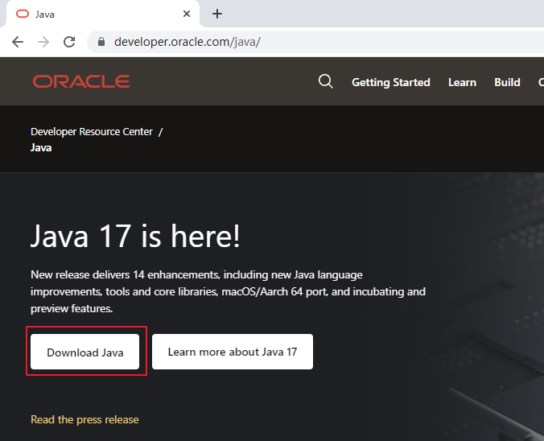
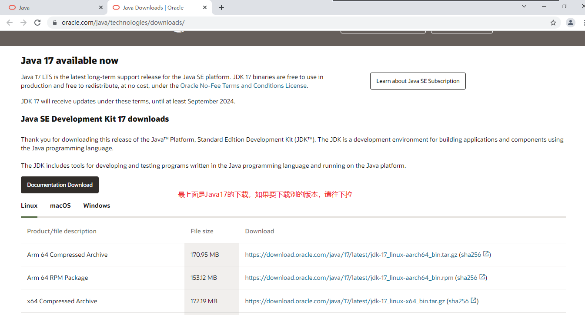
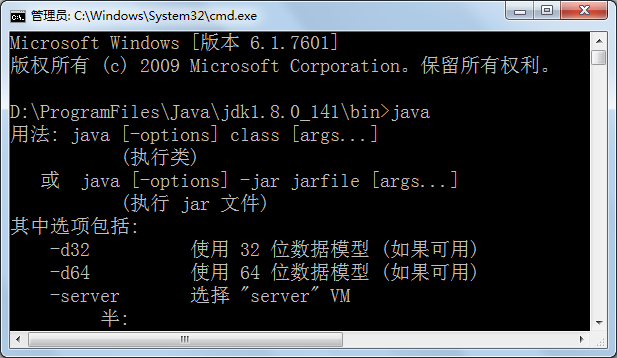
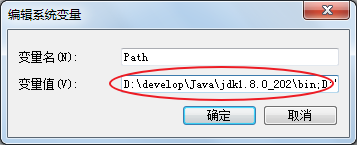
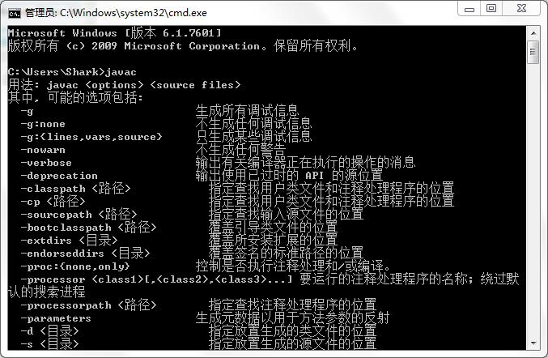
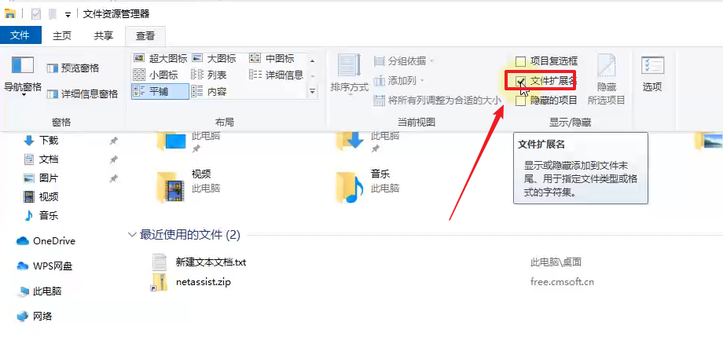

# JavaSE_第1章 Java概述

## 学习目标

* [ ] 理解Java语言的跨平台实现原理
* [ ] 理解JDK/JRE/JVM的组成和作用
* [ ] 掌握配置环境变量
* [ ] 掌握HelloWorld程序编译并执行

## 1.1 JavaSE课程体系介绍

见《第一个阶段课程体系介绍.xmind》

## 1.2 Java是什么

Java是一种计算机编程语言。

```tex
Java是一门面向对象的编程语言，不仅吸收了C++语言的各种优点，还摒弃了C++里难以理解的多继承、指针等概念，因此Java语言具有功能强大和简单易用两个特征。Java语言作为静态面向对象编程语言的代表，极好地实现了面向对象理论，允许程序员以优雅的思维方式进行复杂的编程。
Java具有简单性、面向对象、分布式、健壮性、安全性、平台独立与可移植性、多线程、动态性等特点。Java可以编写桌面应用程序、Web应用程序、分布式系统和嵌入式系统应用程序等。
```

### 1.2.1  计算机语言是什么

所谓计算机编程语言，就是人与计算机之间进行信息交流沟通的一种特殊语言。

人们可以使用编程语言对计算机下达命令，让计算机完成人们需要的功能。

### 1.2.2 计算机语言发展

* 第一代：机器语言
  * 1946年2月14日，世界上第一台计算机ENAC诞生，使用的是最原始的穿孔卡片。这种卡片上使用的语言是只有专家才能理解的语言，它是用二进制代码表示的语言，与人类语言差别极大，这种语言就称为机器语言。机器语言是第一代计算机语言。这种语言本质上是计算机能识别的唯一语言，人类很难理解。以后的语言就是在这个的基础上简化而来。虽然后来发展的语言能让人类直接理解但最终送入计算机的还是这种机器语言。
* 第二代：汇编语言
  * 计算机语言发展到第二代，出现了汇编语言。汇编语言用**助记符**代替了操作码，用**地址符号或标号**代替地址码。这样就用符号代替了机器语言的二进制码。汇编语言也称为符号语言。汇编语言是面向机器的，能直接与存储器、接口电路打交道，也能申请中断，因此汇编语言程序能直接管理和控制硬件设备。程序设计人员必须对计算机有相当深入的了解，才能使用汇编语言编制程序。汇编语言缺乏通用性，程序不易移植。不同计算机的汇编语言之间是不能通用的，因为它们各自都有适合于自己机型特点的汇编语言。但是，掌握了一种计算机的汇编语言，有助于学习其他计算机的汇编语言。比起机器语言，汇编大大进步了。尽管还是复杂，用起来容易出错，但在计算机语言发展史上是机器语言向更高级的语言进化的桥梁。
* 第三代：高级语言
  * 当计算机语言发展到第三代时，就进入了“**面向人类**”的高级语言。高级语言是一种接近于人们使用习惯的程序设计语言。它允许用英文写计算程序，程序中的符号和算式也与日常用的数学式子差不多。高级语言发展于20世纪50年代中叶到70年代，流行的高级语言已经开始固化在计算机内存里了，比如 Basic语言。现在，计算机语言仍然在不断的发展，种类也相当多，比如 FORTRAN语言， COBOL语言，C语言，C++，C#， PASCAL，Java，Python等等。高级语言接近于自然语言和数学语言，容易为人们掌握；独立于机器，有一定的通用性；计算机不能直接识别和执行用高级语言编写的程序，需要使用编译器或者解释器，转换为机器语言才能被识别和执行；用高级语言编写的程序大大提高了编写效率。


### 1.2.3 计算机语言分类


### 1.2.4 计算机语言排行榜

TIOBE排行榜是根据互联网上有经验的程序员、课程和第三方厂商的数量，并使用搜索引擎（如Google、Bing、Yahoo!）以及Wikipedia、Amazon、YouTube和Baidu等统计出的排名数据。


计算机语言走势


## 1.3 Java语言概述

### 1.3.1 Java语言发展历史


Java之父——詹姆斯.高斯林(James Gosling)。


Java版本发行时间线:

|   发行版本    |  发行时间  |                             备注                             |
| :-----------: | :--------: | :----------------------------------------------------------: |
|     Java      | 1995.05.23 |     Sun公司在Sun world会议上正式发布Java和HotJava浏览器      |
|   Java 1.0    | 1996.01.23 |             Sun公司发布了Java的第一个开发工具包              |
|   Java 1.1    | 1997.02.19 |                                                              |
|   Java 1.2    | 1998.12.08 |    拆分成：J2SE（标准版）、J2EE（企业版）、J2ME（小型版）    |
|   Java 1.3    | 2000.05.08 |                                                              |
|    Java1.4    | 2004.02.06 |                                                              |
| **Java 5.0**  | 2004.09.30 | ①版本号从1.4直接更新至5.0；②平台更名为JavaSE、JavaEE、JavaME |
|   Java 6.0    | 2006.12.11 |               2009.04.20 Oracle宣布收购SUN公司               |
|   Java 7.0    | 2011.07.02 |                                                              |
| **Java 8.0**  | 2014.03.18 |                                                              |
|   Java 9.0    | 2017.09.22 |    ①每半年更新一次；②Java 9.0开始不再支持windows 32位系统    |
|   Java 10.0   | 2018.03.21 |                                                              |
| **Java 11.0** | 2018.09.25 |           JDK安装包取消独立JRE安装包，长期支持版本           |
|   Java 12.0   | 2019.03.19 |                                                              |
|   Java 13.0   | 2019.9.18  |                                                              |
|   Java 14.0   | 2020.3.17  |                                                              |
|   Java 15.0   |   2020.9   |                                                              |
|   Java16.0    |   2021.3   |                                                              |
| **Java17.0**  |   2021.9   |                      最新的长期支持版本                      |

### 1.3.2 Java是最好的语言吗？


**不是，因为在每个领域都有更合适的编程语言。**

- C 语言无疑是现代计算机软件编程语言的王者，几乎所有的操作系统都是 C 语言写成的。C语言是面向过程的编程语言。
- C++ 是面向对象的 C 语言，一直在不断的改进。为了与C兼容，C++被迫做出了很多重大的设计妥协，结果导致语言过分华丽，过分复杂。为了与C兼容，C++并没有采用自动内存管理的策略，从而丧失了修正C最严重问题的机会。另外C++的OO设计耦合度过高，导致组件之间出现很厚的粘合层，并且带来了严重的可维护性问题。C++的应用主要集中在GUI（图形化界面）、游戏和多媒体工具包方面，其他地方很少用到。
- C#是.NET开发平台的主语言。.NET开发平台包括虚拟机CLR、公共类库以及编译工具等开发环境，它是Java语言强有力的竞争对手。但是.NET环境只有Windows有。
- Visual Basic主要用于图形化界面程序的设计，目前也是基于.NET平台。


- JavaScript 是能运行在浏览器中的语言，丰富的前端界面离不开 Javascript 的功劳。近年来的 Node.js 又在后端占有一席之地。
- Python 用于系统管理，并通过高性能预编译的库，提供 API 来进行科学计算，文本处理等，是 Linux 必选的解释性语言。Python的应用方向主要是数据分析、人工智能和机器学习、网络爬虫、自动化测试、web开发、科学计算和统计等。Python的优势是语法简洁清晰，也具有丰富和强大的类库。但是Python更像是胶水语言，它通常用于将其他语言（尤其是C/C++）制作的各种模块轻松的联结在一起。而且Python的运行效率非常低。
- PHP是一种通用开源脚本语言。PHP是在服务器端执行的脚本语言。PHP独特的语法混合了C、Java、Perl以及 PHP 自创的语法。利于学习，使用广泛，主要适用于Web开发领域。LAMP（Linux+Apache+MySQL+PHP）免费套装让很多创业公司可以实现快速低成本的搭建公司网站。虽然 PHP语言使用简单，但是一直有安全漏洞问题要解决。多线程支持不好，性能低下，代码不规范等问题。行业领跑者们从着眼未来考虑，在大数据、物联网、人工智能等方面的广泛应用前景下，对待PHP的重视程度就逐渐下降了。
- Ruby 强于 DSL（领域特定语言），程序员可以定义丰富的语义来充分表达自己的思想。
- Erlang 就是为分布式计算设计的，能保证在大规模并发访问的情况下，保持强壮和稳定性。
- Go 语言内置了并发能力，可以编译成本地代码。当前新的网络相关项目，很大比例是由 Go 语言编写的，如 Docker、Kubernetes 等。
- 函数式编程有 Lisp，编写 iOS 程序有 Swift/Objective-C。
- R的思想是：它可以提供一些集成的统计工具，但更大量的是它提供各种数学计算、统计计算的函数，从而使使用者能灵活机动的进行数据分析，甚至创造出符合需要的新的统计计算方法 
- SQL 是用于访问和处理关系型数据库的标准语言， 这类数据库包括：MySQL，Oracle, SQL Server, DB2, PostgreSQL，Sybase, Access 等等 

一句话概括，**能留在排行榜之上的语言，都是好的语言，在其所在的领域能做到最好。**

### 1.3.3 Java语言的特点

（1）**优点**

* **面向对象：**Java语言支持封装、继承、多态，面向对象编程，让程序更好达到`高内聚`，`低耦合`的标准。
* **支持分布式：**Java语言支持Internet应用的开发，在基本的Java应用编程接口中有一个网络应用编程接口（java net），它提供了用于网络应用编程的类库，包括URL、URLConnection、Socket、ServerSocket等。Java的RMI（远程方法激活）机制也是开发分布式应用的重要手段。
* **健壮型：**Java的强类型机制、异常处理、垃圾的自动收集等是Java程序健壮性的重要保证。对指针的丢弃是Java的明智选择。
* **安全性高：**Java通常被用在网络环境中，为此，Java提供了一个安全机制以防恶意代码的攻击。如：安全防范机制（类ClassLoader），如分配不同的名字空间以防替代本地的同名类、字节代码检查。
* **跨平台性：**Java程序（后缀为java的文件）在Java平台上被编译为体系结构中立的字节码格式（后缀为class的文件），然后可以在实现这个Java平台的任何系统中运行。

（2）**缺点**

- 语法过于复杂，严谨，对程序员的约束比较多，与python和php等相比入门相对较难。但是一旦学会了，就业岗位需求量大，而且薪资待遇节节攀升。
- 一般适用于大型网站开发，整个架构会比较重，对于初创公司开发和维护人员的成本比较高（即薪资高），选择用Java语言开发网站或应用系统的需要一定的经济实力。

### 1.3.4 Java生态圈

根据2020年IDC（Internet Data Center互联网数据中心）的最新报告《Java迎来25岁》，超过900万的开发人员代表全球69%的全职开发人员使用Java——比其他任何语言都多。

**Java是目前应用最为广泛的软件开发平台之一。**随着Java以及Java社区的不断壮大，Java 也早已不再是简简单单的一门计算机语言了，它更是一个平台、一种文化、一个社区。

**作为一个平台，**Java虚拟机扮演着举足轻重的作用。除了 Java语言，任何一种能够被编译成字节码的计算机语言都属于Java这个平台。Groovy、Scala、 JRuby、Kotlin等都是Java平台的一部分，它们依赖于Java虚拟机，同时，Java平台也因为它们变得更加丰富多彩。

**作为一种文化，**Java几乎成为了 “开源”的代名词。在Java程序中，有着数不清的开源软件和框架。如Tomcat、Struts, Hibernate, Spring,MyBatis等。就连JDK和JVM自身也有不少开源的实现，如OpenJDK、Apache Harmony。可以说，“共享”的精神在Java世界里体现得淋漓尽致。

**作为一个社区，**Java拥有全世界最多的技术拥护者和开源社区支持，有数不清的论坛和资料。从桌面应用软件、嵌入式开发到企业级应用、后台服务器、中间件，都可以看到Java的身影。其应用形式之复杂、参与人数之众多也令人咋舌。可以说，Java社区已经俨然成为了一个良好而庞大的生态系统。**其实这才是Java最大的优势和财富。**

### 1.3.5 Java技术体系平台

* **JavaSE**（Java Platform, Standard Edition标准版）：允许您在桌面和服务器上开发和部署Java应用程序。Java提供了丰富的用户界面、性能、多功能性、可移植性和当今应用程序所需的安全性。
* **JavaEE**（Java Platform, Enterprise Edition企业版）：是为开发企业环境下的应用程序提供的一套解决方案，主要针对于Web应用程序开发。
* **JavaME**（Java Platform, Micro Edition 小型版）：为互联网上的嵌入式和移动设备上运行的应用提供了一个健壮、灵活的环境：微控制器、传感器、网关、移动电话、个人数字助理（PDA）、电视机顶盒、打印机等等。JavaME包括灵活的用户界面、健壮的安全性、内置的网络协议，以及支持动态下载的网络和离线应用程序。基于JavaME的应用程序在许多设备上都是可移植的，但是利用了每个设备的本机功能。
  *  Java Embedded: 用于解锁物联网的智能设备的价值：
    通过远程市场更新和刷新功能延长产品生命周期和价值；
    利用Java的可伸缩性、健壮性、可移植性和全套功能，提高生产效率，降低成本，缩短上市时间；
    在边缘启用快速数据功能；
  * Java Card：使安全元件（如智能卡和其他防篡改安全芯片）能够承载采用Java技术的应用程序。Java card提供了一个安全的、可互操作的执行平台，它可以在一个资源受限的设备上存储和更新多个应用程序，同时保持最高的认证级别和与标准的兼容性。
  * Java TV：是一种基于JavaME的技术，它为开发在tv和机顶盒设备上运行的java应用程序提供了一个性能良好、安全且易于实现的解决方案。使用Java TV运行时，开发人员可以轻松创建应用程序，例如电子节目指南（EPG）、视频点播（VOD）客户端、游戏和教育应用程序、用于访问Internet数据的应用程序（例如天气、新闻播报器、社交网络）以及大多数蓝光光盘标题上的用户界面和奖金内容。


## 1.4 Java语言跨平台原理（理解）

### 1、Java语言跨平台原理

很多时候，我们写的程序可能要在多个操作系统运行，这个时候就要求我们的程序需要在尽可能不改动的情况下完实现这个目标。不同的语言实现跨平台的方式不同。**Java语言实现跨平台是建立在“虚拟机”基础之上的**。

在Java出现之前，最为流行的编程语言是C和C++。如果我们想要在一台使用x86_64指令集的CPU的机器（如个人PC）上运行一个C语言程序，就需要编写一个将C语言翻译成x86_64汇编语言的编译器。如果想要在一台使用arm指令集的CPU的机器（如苹果手机）上，运行一个C语言程序，同样需要编写一个将C语言翻译成arm汇编语言的编译器。这样严重影响了C程序的跨平台性，因为针对特定的指令集开发编译器是一个难度非常大的工作。


那么Java是如何解决这个问题的呢？Java设计了一套简洁的虚拟指令集，也就是**字节码**。如果我们想要在一台机器上运行Java程序，只需要将Java程序编译成字节码就可以了。编写一个将Java程序翻译成Java字节码的编译器，比起编写一个将Java程序翻译成x86_64指令集的编译器来说，要简单得多。可是这里产生了一个问题，难道我们的机器可以直接执行字节码这样的虚拟指令集吗？当然是不能的。我们需要针对不同的指令集，开发对应的字节码解释器。这个工作同样比较简单,实现了**"一处编译,到处运行"**的效果。


Java虚拟机（JVM，Java Virtual Machine）是由软件技术模拟出计算机运行的一个虚拟的计算机，它负责解释执行字节码指令集。也就是说，**只要一台机器可以运行Java的虚拟机，那么就能运行Java语言编写的程序。而不同的平台，需要安装不同的Java虚拟机程序**。那么我们编写完Java程序之后，需要先将.java的源文件编译为.class的字节码文件，然后在Java虚拟机中来执行这些字节码文件。


Java虚拟机的设计不仅仅解决了Java程序跨平台的问题，同时解决了很多语言的跨平台问题。


- .NET（C#，VB等语言）也有虚拟机，也能实现跨平台，但是只能在Windows操作系统下安装.NET环境。
- C++不受虚拟机的限制，但是需要用不同平台的编译器重新编译一次。需要编写n个版本的编译器。
- Java虚拟机可以配置在MacOS，Windows（PC操作系统）,Linux等上，但是不能配置在WP（Windows Phone），IOS（移动操作系统）上，只能配置在android（移动操作系统）。Java程序可以实现一次编译处处运行。


### 2、JVM、JRE、JDK的关系

- **JVM**（Java Virtual Machine ）：Java虚拟机，是运行所有Java程序的假想计算机，是Java程序的运行环境之一，也是Java 最具吸引力的特性之一。我们编写的Java代码，都运行在**JVM** 之上。

- **JRE ** (Java Runtime Environment) ：是**Java程序的运行时环境**，包含`JVM` 和运行时所需要的`核心类库`。

- **JDK**  (Java Development's Kit)：是**Java程序开发工具包**，包含`JRE` 和开发人员使用的工具。

  JVM:虚拟机

  JRE:Java程序的运行环境  包含 JVM + 核心类库

  JDK:Java程序的开发工具包  包含:JRE + 开发工具包

我们想要运行一个已有的Java程序，那么只需安装`JRE` 即可。

我们想要开发一个全新的Java程序，那么必须安装`JDK` ，其内部包含`JRE`。

JDK =JRE +


## 1.5 开发环境搭建（掌握）

### 1、JDK的下载

* 下载网址：www.oracle.com 

* 下载步骤：

  * 登录Oracle公司官网，www.oracle.com，如图所示：在底部选择Developers开发者

    

  * 在**Developers**页面中间的技术分类部分，选择`Java`，单击进入，如图所示：

    

    展示的是最新Java版本，例如Java17。单击Download Java，然后选择具体的版本下载。

    

  * 选择Download Java按钮后




选择**Accept License Agreement**，


注册或登录后下载


### 2、JDK的安装

* 安装步骤：

  * 双击`jdk-8u202-windows-x64.exe`文件，并单击`下一步`，如图所示：

    

  * 取消独立JRE的安装，单击`公共JRE前的下拉列表`，选择`此功能将不可用`如图所示：

    

  * 修改安装路径，单击更改，如图所示：

    

  * 将安装路径修改为`D:\develop\Java\jdk1.8.0_202\`，并单击确定，如图所示：

    

  * 单击下一步，如图所示：

    

  * 稍后几秒，安装完成，如图所示：

    

  * 目录结构，如图所示：

    

### 3、配置环境变量

为什么配置path？

希望在命令行使用javac.exe等工具时，任意目录下都可以找到这个工具所在的目录。

例如：我们在C:\Users\Irene目录下使用java命令，结果如下：


我们在JDK的安装目录的bin目录下使用java命令，结果如下：



我们不可能每次使用java.exe，javac.exe等工具的时候都进入到JDK的安装目录下，太麻烦了。我们希望在任意目录下都可以使用JDK的bin目录的开发工具，因此我们需要告诉操作系统去哪里找这些开发工具，这就需要配置path环境变量。

#### 方案一：只配置path

* 步骤：

  * 打开桌面上的计算机，进入后在左侧找到`计算机`，单击鼠标`右键`，选择`属性`，如图所示：

    

  * 选择`高级系统设置`，如图所示：

    

  * 在`高级`选项卡，单击`环境变量`，如图所示：

    

  * 在`系统变量`中，选中`Path` 环境变量，`双击`或者`点击编辑` ,如图所示：

    

  * 在变量值的最前面，键入`D:\develop\Java\jdk1.8.0_202\bin;`  分号必须要写，而且还要是**英文符号**。如图所示：

    

  * 环境变量配置完成，**重新开启**DOS命令行，在任意目录下输入`javac` 命令，运行成功。

    

#### 方案二：配置JAVA_HOME+path

```tex
		
环境变量的配置
			
	配置
		JAVA_HOME
			我的电脑> 属性-> 高级系统设置->环境变量->
			新建JAVA_HOME(属性值是bin目录的父级目录)
		path
			%JAVA_HOME%\bin(设置后上移位置)
```

* 步骤：

  * 打开桌面上的计算机，进入后在左侧找到`计算机`，单击鼠标`右键`，选择`属性`，如图所示：

    

  * 选择`高级系统设置`，如图所示：

    

  * 在`高级`选项卡，单击`环境变量`，如图所示：

    

  * 在`系统变量`中，单击`新建` ，创建新的环境变量，如图所示：

    

  * 变量名输入`JAVA_HOME`，变量值输入 `D:\develop\Java\jdk1.8.0_202` ，并单击`确定`，如图所示：

    

  * 选中`Path` 环境变量，`双击`或者`点击编辑` ,如图所示：

    

  * 在变量值的最前面，键入`%JAVA_HOME%\bin;`  分号必须要写，而且还要是**英文符号**。如图所示：

    

    **windows7以后的系统为下图界面**

    
  
  * 环境变量配置完成，**重新开启**DOS命令行，在任意目录下输入`javac` 命令，运行成功。
  
    


## 1.6 入门程序HelloWorld（掌握）

### 1.6.1 HelloWorld案例

#### 1、程序开发步骤说明

JDK安装完毕，可以开发我们第一个Java程序了。

Java程序开发三步骤：**编写**、**编译**、**运行**。


#### 2、编写第一个Java程序

步骤

```tex
A:定义类
B:写main方法
C:写输出语句
D:Java程序开发运行与工作原理
E:编译和运行程序
```

##### 具体如下:

1. 在 目录下新建文本文件，完整的文件名修改为`HelloWorld.java`，其中文件名为`HelloWorld`，后缀名必须为  **.java**  。
3. 在文件中输入如下代码，并且保存  ：

```java
public class HelloWorld {
  	public static void main(String[] args) {
    	System.out.println("HelloWorld");
  	}
}
```

> 友情提示：
>
> 每个字母和符号必须与示例代码一模一样。
>
> 文件需显示后缀名




第一个`HelloWord` 源程序就编写完成了，但是这个文件是程序员编写的，JVM是看不懂的，也就不能运行，因此我们必须将编写好的`Java源文件` 编译成JVM可以看懂的`字节码文件` ，也就是  .class  文件。

#### 3、编译Java源文件生成.class字节码文件

在源文件所在的地址栏输入cmd,然后回车。


```java
javac Java源文件名.后缀名
```

举例：

```
javac HelloWorld.java
```


编译成功后，命令行没有任何提示。打开`D:\atguigu\javaee\JavaSE20190624\code\day01_code`目录，发现产生了一个新的文件 `HelloWorld.class`，该文件就是编译后的文件，是Java的可运行文件，称为**字节码文件**，有了字节码文件，就可以运行程序了。 

> Java源文件的编译工具`javac.exe`

注意:

​	如果电脑不显示后缀名,需要进行设置

​	打开任意一个文件夹,工具栏选择"文件夹选项"


#### 4、运行Java程序

在DOS命令行中，在字节码文件目录下，使用`java` 命令进行运行。

命令：

```java
java 主类名字
提示：主类是指包含main方法的类：
```

举例

```java
java HelloWorld
注意：HelloWorld没有后缀
```


> Java字节码文件的运行工具：java.exe

### 1.6.2 HelloWorld案例常见错误

* 	找不到文件
  - 文件扩展名隐藏导致编译失败
  - 文件名写错
* 	单词拼写问题
  * 正确：class		错误：Class
  * 正确：String              错误：string
  * 正确：System            错误：system
  * 正确：main		错误：mian
* 	Java语言是一门严格区分大小写的语言
* 	标点符号使用问题
  - 不能用中文符号，英文半角的标点符号（正确）
  - 括号问题，成对出现

### 1.6.3 Java程序的结构与格式

结构：

```java
类{
    方法{
        语句;
    }
}
```

格式：

（1）大括号要对齐,并且成对写

​		 {}的左半部分{在行尾，右半部分}单独一行，与和它成对的"{"的行首对齐

（2）每一级缩进一个Tab键

（2）并排语句和运算符两侧加空格

### 1.6.4 Java程序的入口

Java程序的入口是main方法

```java
public static void main(String[] args){
    
}
```

### 1.6.5 源文件名与类名一致问题

（1）源文件名是否必须与类名一致？

```java
如果这个类不是public，那么源文件名可以和类名不一致。但是不便于代码维护。

如果这个类是public，那么要求源文件名必须与类名一致。否则编译报错。

我们建议大家，不管是否是public，都与源文件名保持一致，而且一个源文件尽量只写一个类，目的是为了好维护。
```

（2）一个源文件中是否可以有多个类？public呢？

```java
一个源文件中可以有多个类，编译后会生成多个.class字节码文件。

但是一个源文件只能有一个public的类。
```

（3）main方法必须在public的类中吗？

```java
不是。

但是后面写代码时，基本上main方法（主方法）习惯上都在public类中。
```

 

