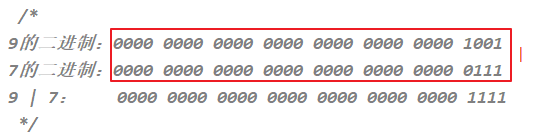
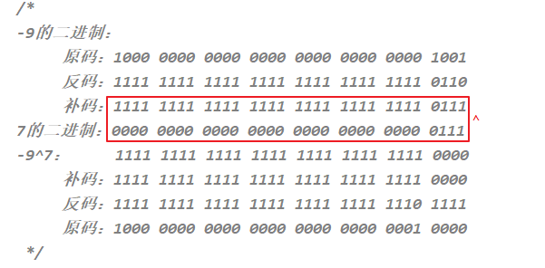
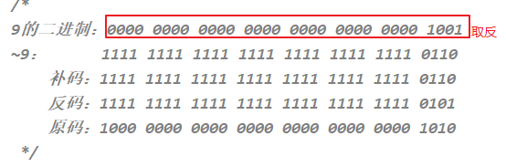

#  JavaSE_第2章【Java基础语法】

## 学习目标

* [ ] 熟练使用单行注释和多行注释
* [ ] 能够辨识关键字
* [ ] 理解标识符的含义，正确定义标识符
* [ ] 理解Java中的基本数据类型分类
* [ ] 能够理解常量的概念
* [ ] 能够理解变量的概念
* [ ] 了解进制
* [ ] 理解基本数据类型
* [ ] 掌握算术运算符
* [ ] 掌握赋值运算符
* [ ] 掌握比较运算符
* [ ] 掌握逻辑运算符
* [ ] 掌握三元运算符
* [ ] 理解位运算符

## 2.1 注释（*comment*）（掌握）

- **注释**：就是对代码的解释和说明。其目的是让**人们**能够更加轻松地了解代码。为代码添加注释，是十分必须要的，它不影响程序的编译和运行。
- Java中有**单行注释**、**多行注释**和**文档注释**
  - 单行注释以 `//`开头，以`换行`结束，格式如下：
  
    ```java
    // 注释内容
    ```
  
  - 多行注释以 `/*`开头，以`*/`结束，格式如下：
  
    ```java
    /*
    	注释内容
     */
    ```
  
  - 文档注释以`/**`开头，以`*/`结束，
  
  - Java特有的注释，通过工具可将文档注释内容，生成html说明文档(**后面具体讲解**) 
  
    ```java
    /**
    	注释内容
     */
    ```

## 2.2 关键字（*keyword*）（掌握）

**关键字**

```tex
是指在程序中，被Java语言赋予特定含义的单词。
```

**特点**

```tex
组成关键字的字母全部小写。
```

**已学关键字**

```tex
public、class、static、void

关键字比较多，不需要死记硬背，学到哪里记到哪里即可。	
```

>  **关键字一共50个，其中const和goto是保留字存在，目前并不使用。**

> **true,false,null看起来像关键字，但从技术角度，它们是特殊的布尔值和空值。**


## 2.3 标识符( identifier)（掌握）

**标识符**

```tex
给类、变量、方法、包等命名的字符序列，称为标识符。
```

**组成规则**

```tex
- 英文大小写字母（a-z，A-Z）
- 数字字符（0-9）
- $ 和 _ 
```

**命名规则**

``` tex
- 不能使用Java的关键字
- 不能数字开头
- 严格区分大小写：A和a是两个不同的标识符
```

**命名规范(建议遵守,多数程序员约定俗成的）**

```tex
原则:
	驼峰命名，见名知意
- 包名
	每一个单词都小写，单词之间使用点.分割，形式：xxx.yyy.zzz
- 类名、接口名
	每个单词的首字母都大写，形式：XxxYyyZzz
	例如：HelloWorld，String，System等
- 方法名、变量名
	从第二个单词开始首字母大写，其余字母小写，形式：xxxYyyZzz
	例如：age,name,bookName,main
- 常量名
	每一个单词都大写，单词之间使用下划线_分割，形式：XXX_YYY_ZZZ
	例如：JAVA_HOME、MAX_VALUE
```

更多细节详见《代码整洁之道.pdf》《Java开发手册（泰山版）》


## 2.4 常量值（*literal value*）（掌握）

**常量值**

```tex
在程序执行的过程中，其值不可以发生改变
```

**常量值分类**

```tex
- 字面值常量
- 自定义常量(面向对象部分讲解)
```

**字面值常量值分类**

| 序号 | 类型         | 说明                         |          举例           |
| ---- | :----------- | ---------------------------- | :---------------------: |
| 1    | 整数常量值   | 所有整数                     | 12，-23, 1567844444557L |
| 2    | 浮点常量值   | 所有小数                     |      12.34F，12.34      |
| 3    | 字符常量值   | 用单引号括起来的内容(单个值) |     ‘a’，'0'，‘尚’      |
| 4    | 字符串常量值 | 用双引号括起来的内容         |      ”HelloWorld“       |
| 5    | 布尔常量值   | 只有两个值:true和false       |       true，false       |
| 6    | 空常量值     | null(数组部分讲)             |          null           |

```java
public class ConstantDemo {
	public static void main(String[] args) {		
		//输出整数常量值
		System.out.println(12);
		System.out.println(-23);
		
		//输出小数常量值
        System.out.println(12.34F);
		System.out.println(12.34);
		
		//输出字符常量值
		System.out.println('a');
		System.out.println('0');
        System.out.println('尚');
		
		//输出布尔常量值
		System.out.println(true);
		System.out.println(false);
        
        //输出字符串常量值
		System.out.println("HelloWorld");
	}
}
```

注意事项:

**转义字符:**    **想输出""就会需要用到转义字符**


**示例代码**

```java
public class TestEscapeCharacter {
    public static void main(String[] args){
        System.out.println("hello\tjava");
        System.out.println("hello\rjava");
        System.out.println("hello\njava");
        System.out.println("hello\\world");
        System.out.println("\"hello\"");
        char shuang = '"';
        System.out.println(shuang + "hello" + shuang);
        System.out.println("'hello'");
        char dan ='\'';
        System.out.println(dan + "hello" + dan);
    }
}
```

```java
public class TestTab {
    public static void main(String[] args){
        System.out.println("hello\tworld\tjava.");
        System.out.println("chailinyan\tis\tbeautiful.");
        System.out.println("姓名\t基本工资\t年龄");
        System.out.println("张三\t10000.0\t23");
    }
}
```

## 2.5  计算机如何存储数据

### 2.5.1 计算机存储单位（掌握）


- **字节（Byte）：**是计算机信息技术用于计量存储容量的一种计量单位，一字节等于八位。
- **位（bit）：**是数据存储的最小单位。也就是二进制。二进制数系统中，每个0或1就是一个位，叫做bit（比特），其中8 bit 就称为一个字节(Byte)。
- **转换关系：**
  - 8 bit = 1 Byte
  - 1024 Byte = 1 KB
  - 1024 KB = 1 MB
  - 1024 MB = 1 GB
  - 1024 GB = 1 TB

```tex
计算机世界中只有二进制。那么在计算机中存储和运算的所有数据都要转为二进制。包括数字、字符、图片、声音、视频等。
```

### 2.5.2 进制（了解）

- **概述**

  ```tex
  就是进位制，是人们规定的一种进位方法。 对于任何一种进制--X进制，就表示某一位置上的数运算时是逢X进一位。二进制就是逢二进一，八进制是逢八进一，十进制是逢十进一，十六进制是逢十六进一。
  
  例如一周有七天,七进制,一年有十二个月,十二进制
  ```

- **进制的分类**

  ```tex
  - 十进制：
  	数字组成：0-9
  	整数默认就是十进制
  
  - 二进制：
  	数字组成：0-1
  	表现形式:以0b开头(b可大写可小写)
  
  - 八进制：很少使用(将二进制中的三位用一位表示)
  	数字组成：0-7
  	表现形式:以0开头
  
  - 十六进制(将二进制中的四位用一位表示)
  	数字组成：0-9，a-f
  	表现形式:以0x开头(x可大写可小写)
  ```

  

- **示例代码**

  **输出不同进制时100代表的数据**

  ```java
  class Demo1_Scale { // scale 进制
  	public static void main(String[] args) {
  		
          // 输出不同进制时100代表的数据
  		System.out.println(0b100); // 4? 二进制表示形式前面加0b(b可以大写也可以小写)
  		System.out.println(0100); // 64? 八进制表示形式前面加0
  		System.out.println(100);
  		System.out.println(0x100); // 256? 十六进制表示形式前面加0x(可以大写也可以小写)
  	}
  }
  
  ```

- **进制的换算**

  | 十进制 | 二进制 | 八进制 | 十六进制 |
  | ------ | ------ | ------ | -------- |
  | 0      | 0      | 0      | 0        |
  | 1      | 1      | 1      | 1        |
  | 2      | 10     | 2      | 2        |
  | 3      | 11     | 3      | 3        |
  | 4      | 100    | 4      | 4        |
  | 5      | 101    | 5      | 5        |
  | 6      | 110    | 6      | 6        |
  | 7      | 111    | 7      | 7        |
  | 8      | 1000   | 10     | 8        |
  | 9      | 1001   | 11     | 9        |
  | 10     | 1010   | 12     | a或A     |
  | 11     | 1011   | 13     | b或B     |
  | 12     | 1100   | 14     | c或C     |
  | 13     | 1101   | 15     | d或D     |
  | 14     | 1110   | 16     | e或E     |
  | 15     | 1111   | 17     | f或F     |
  | 16     | 10000  | 20     | 10       |

  - **任意进制到十进制的转换原理**

    ```tex
    把系数*基数的权次幂相加即可
    
    系数：就是每一位上的数据。
    
    基数：X进制，基数就是X。
    
    权：在右边，从0开始编号，对应位上的编号即为该位的权。
    ```

    

    

  - **十进制到任意进制的转换原理**
  
    ```tex
    除积倒取余
    
    ```
  

除以基数得到余数直到商为零，对所得余数倒序反转
    

  - **快速的进制转换法(8421码)**
  
    ```tex
     8421码是中国大陆的叫法，8421码是BCD代码中最常用的一种。在这种编码方式中每一位二值代码的1都是代表一个固定数值，把每一位的1代表的十进制数加起来，得到的结果就是它所代表的十进制数码
    ```

    ##### **通过8421码的方式进行二进制和十进制的相互转换**

    **对应关系图:**

    

    **需求**:

    ​	将二进制11001100转换为十进制形式

    ​	将十进制60转换为二进制形式
  
     
  
    

## 2.6 变量（*variable*）（掌握）

### 2.6.1 变量的概念

```tex
在程序执行的过程中，其值可以发生改变的量

Java变量是程序中最基本的存储单元,其要素包括变量名,变量类型和作用域。

从本质上来讲,变量其实是内存中的一小块区域,使用变量名来访问这块区域,
因此,每一个变量使用前,必须要先申请(声明),然后必须进行赋值(填充内容),才能使用
```

### 2.6.2 变量的定义格式

```tex
- 格式1：数据类型 变量名 = 变量值; 【常用方式】
- 格式2：数据类型 变量名;
	    变量名 = 变量值;
```

```tex
数据类型

- 变量的数据类型决定了在内存中开辟多大空间
- 变量的数据类型也决定了该变量可以存什么值

变量名

- 见名知意非常重要

值

- 基本数据类型的变量：存储数据值
- 引用数据类型的变量：存储地址值，即对象的首地址。例如：String类型的变量存储的是字符串对象的首地址（关于对象后面章节再详细讲解）
```

### 2.6.3 变量的使用步骤

```tex
1 声明:内存中申请空间
2 赋值(初始化):把“值”赋值给变量对应的内存空间,代码上就是:右边的值赋值给左边的变量
3 使用
```

### 2.6.4 使用变量的注意事项？

```tex
1 作用域(变量定义在哪一级大括号中，哪个大括号的范围就是这个变量的作用域)
	变量的使用,需在作用域内,否则会报“找不到符号”错误
	在同一个作用域中不能重名
2 初始化值
	局部变量在使用之前必须赋值,否则会报“未初始化”错误
3 变量值的类型必须与变量声明的类型一致或兼容（<=）
```

### 2.6.5 最终变量（final）

最终变量习惯上也称为常量，因为它是通过在声明变量的数据类型前面加final的方式实现的，所以叫最终变量。

加final修饰后，这个变量的值就不能修改了，一开始赋值多少，就是多少，所以此时的变量名通常称为常量名。

常量名通常所有字母都大写，每一个单词之间使用下划线分割，从命名上和变量名区分开来。

具体后面讲final关键字时具体讲解。

```java
public class FinalVariableDemo {
	public static void main(String[] args){
        //定义常量
        final int FULL_MARK = 100;//满分
       // FULL_MARK = 150;//错误，final修饰的变量，是常量，不能重新赋值
        
        //输出常量值
        System.out.println("满分：" + FULL_MARK);
        
        //小王的成绩比满分少1分
        int wang = FULL_MARK - 1;
        //小尚得了满分
        int shang = FULL_MARK;
        //小刘得了一半分
        int liu = FULL_MARK/2;
        
        //输出变量值
        System.out.println("小王成绩：" + wang);
        System.out.println("小尚成绩：" + shang);
        System.out.println("小刘成绩：" + liu);
	}
}
```

## 2.7 Java中的数据类型(data type)（掌握）

**作用**

```tex
Java语言是强类型语言，对于每一种数据都定义了明确的具体数据类型，在内存中分配了不同大小的内存空间。
```

**分类**

```tex
- 基本数据类型
- 引用数据类型(后面讲)
```


### 2.6.1 基本数 据类型分类(4类8种)（掌握）


- **整数型**

  ```tex
  - byte 	  占一个字节  	    -128到127【记住】
  - short   占两个字  		 -2^15~2^15-1
  - int 	  占四个字节 		-2^31~2^31-1		整数的默认类型是int
  - long    占八个字节 		-2^63~2^63-1
  
  注意事项:
  在定义long类型时候,推荐在long类型的值后面加特殊的标识(l或者L,推荐使用L)
  ```

  

  

  ```tex
  一个字节可以存储的整数范围
  
  1个字节：8位
  
  0000 0001  ~  0111 111 ==> 1~127
  
  1000 0001 ~ 1111 1111 ==> -127 ~ -1
  
  0000 0000 ==>0
  
  1000 0000 ==> -128（特殊规定）=-127-1
  ```

  

- **浮点型**

  ```tex
  - float 	占四个字节 		-3.403E38~3.403E38
  	单精度浮点型，占内存：4个字节，精度：科学记数法的小数点后6~7位
  - double 	占八个字节		-1.798E308~1.798E308		小数的默认类型是double
  	双精度浮点型，占内存：8个字节，精度：科学记数法的小数点后15~16位
  	
  注意事项:
  在定义float类型时候,必须在float类型的值后面加特殊的标识(f或者F,一般使用f)
  在定义double类型时候,可以在double类型的值后面加特殊的标识(d或者D,一般不加)
  
  - 为什么float（4个字节）比long（8个字节）的存储范围大？
  - 为什么float和double不精确？
  - 为什么double（8个字节）比float（4个字节）精度范围大？
  
  因为float、double底层也是二进制，先把小数转为二进制，然后把二进制表示为科学记数法，然后只保存：
  
  ①符号位②指数位（需要移位）③尾数位
  
  > *详见《float型和double型数据的存储方式.docx》*
  ```

  

  

- **字符型** 

  ```tex
  - char 	占两个字节 		0~65535    char类型 取的数值 代表的是码表值
  - 具有数字和字母双重特性，能够进行数学运算（a+1）
  - 允许使用转义字符'\'将其后的字符转变为其他的含义,例'\n'
  
  -注意事项:
  各个国家都有字节的字符集编码表,这些字符集互不兼容,但都向下兼容ASCII表
  中国大陆:GB2312 现在统一GBK
  
  Java在程序中为了能够统一标识全世界的所有字符,用了一个万国码字符集,即Unicode字符集
  即每一个字符对应一个唯一的Unicode编码值。
  char类型的数值参与算术运算或比较大小时，都是用编码值进行计算的。
  
  在Unicode字符集中char类型是占两个字节的,
  但如果把char类型的数据在网络中传输,或者文件中表示的话,还需要考虑具体的编码方式
  如:UTF-8,GBK等
  ```

  

  

  **ASCII 码表**

  

  | ASCII值 | 对应字符 | ASCII值 | 对应字符 | ASCII值 | 对应字符 | ASCII值 | 对应字符 |
  | ------- | -------- | ------- | -------- | ------- | -------- | ------- | -------- |
  | 0       | NUT      | 32      | (space)  | 64      | @        | 96      | 、       |
  | 1       | SOH      | 33      | ！       | 65      | A        | 97      | a        |
  | 2       | STX      | 34      | ”        | 66      | B        | 98      | b        |
  | 3       | ETX      | 35      | #        | 67      | C        | 99      | c        |
  | 4       | EOT      | 36      | $        | 68      | D        | 100     | d        |
  | 5       | ENQ      | 37      | %        | 69      | E        | 101     | e        |
  | 6       | ACK      | 38      | &        | 70      | F        | 102     | f        |
  | 7       | BEL      | 39      | ,        | 71      | G        | 103     | g        |
  | 8       | BS       | 40      | (        | 72      | H        | 104     | h        |
  | 9       | HT       | 41      | )        | 73      | I        | 105     | i        |
  | 10      | LF       | 42      | *        | 74      | J        | 106     | j        |
  | 11      | VT       | 43      | +        | 75      | K        | 107     | k        |
  | 12      | FF       | 44      | ,        | 76      | L        | 108     | l        |
  | 13      | CR       | 45      | -        | 77      | M        | 109     | m        |
  | 14      | SO       | 46      | .        | 78      | N        | 110     | n        |
  | 15      | SI       | 47      | /        | 79      | O        | 111     | o        |
  | 16      | DLE      | 48      | 0        | 80      | P        | 112     | p        |
  | 17      | DCI      | 49      | 1        | 81      | Q        | 113     | q        |
  | 18      | DC2      | 50      | 2        | 82      | R        | 114     | r        |
  | 19      | DC3      | 51      | 3        | 83      | X        | 115     | s        |
  | 20      | DC4      | 52      | 4        | 84      | T        | 116     | t        |
  | 21      | NAK      | 53      | 5        | 85      | U        | 117     | u        |
  | 22      | SYN      | 54      | 6        | 86      | V        | 118     | v        |
  | 23      | TB       | 55      | 7        | 87      | W        | 119     | w        |
  | 24      | CAN      | 56      | 8        | 88      | X        | 120     | x        |
  | 25      | EM       | 57      | 9        | 89      | Y        | 121     | y        |
  | 26      | SUB      | 58      | :        | 90      | Z        | 122     | z        |
  | 27      | ESC      | 59      | ;        | 91      | [        | 123     | {        |
  | 28      | FS       | 60      | <        | 92      | /        | 124     | \|       |
  | 29      | GS       | 61      | =        | 93      | ]        | 125     | }        |
  | 30      | RS       | 62      | >        | 94      | ^        | 126     | ~        |
  | 31      | US       | 63      | ?        | 95      | _        | 127     | DEL      |

  

- **布尔型**

  

  ```tex
  计算机中
  true底层使用1表示
  false底层使用0表示
  ```

- ##### 示例代码

  ```java
  class Demo1_DataType { // DataType数据类型
  	public static void main(String[] args) {
  		// 整数类型
  		byte b = 10; // 占一个字节,-128 到 127
  		short s = 20; // 占两个字节
  		int i = 30; // 占四个字节 整数默认的数据类型就是int类型
  		long x = 8888888888L;
  		// 占八个字节 如果long类型后面加L进行标识最好加大L,因为小l太像一了     int A = 0；
          double  B = 0.0;
          
  		System.out.println(b);
  		System.out.println(s);
  		System.out.println(i);
  		System.out.println(x);
  
  		// System.out.println(12345 + 54321l);
  
  		// 浮点类型
  		float f = 12.3F; // 占四个字节 小数给float赋值时，必须加f标识，f大小写都可
  		double d = 33.4;
          
  		// 占八个字节 小数默认的数据类型是double,double类型后面也可以用D或d标识,但是一般不加
  		System.out.println(f);
  		System.out.println(d);
  
  		// 字符类型
  		char c = 'a'; // 占两个字节
  		System.out.println(c);
  
  		// 布尔类型
  		boolean b1 = true;
  		boolean b2 = false;
  		System.out.println(b1);
  		System.out.println(b2);
  	}
  ```
  
  

- **各种基本数据类型的默认值**

  

### 2.6.2 基本数据类型转换（Conversion）（掌握）

在Java程序中，不同的基本数据类型的值经常需要进行相互转换。

Java语言所提供的**七种数值类型**之间可以相互转换，基本数据类型转换有两种转换方式：自动类型转换和强制类型转换。

boolean类型不参与。

- #####  自动类型转换（隐式类型转换）

  ```tex
  将`取值范围小的类型`自动提升为`取值范围大的类型`
  
  Java中的默认转换规则
  - byte short char 运算过程中 自动提升为  int
  - 取值范围小的数据类型与取值范围大的数据类型进行运算,会先将小的数据类型提升为其中最大的类型,再运算。
  ```

  **基本数据类型的转换规则如图所示**：


- **示例代码**

  ```java
  class Demo3_DataTypeConversion { // Conversion转换
  	public static void main(String[] args) {
  		// 数据类型转换之隐式转换
  		int x = 3;
  		byte b = 4;
  
  		x = x + b; // b类型从byte自动提升为int，再进行运算
  		System.out.println(x);
          
          long l = 88L;
          l = l + b; // b类型从byte自动提升为int，遇到long类型又自动提升为long类型,再进行运算
          System.out.println(l);
  	}
  }
  ```

  ```java
  - 当byte,short,char数据类型进行算术运算时，按照int类型处理
  byte b1 = 1;
  byte b2 = 2;
  byte b3 = b1 + b2;//编译报错，b1 + b2自动升级为int
  char c1 = '0';
  char c2 = 'A';
  System.out.println(c1 + c2);//113 
  
  - 当把存储范围小的值（常量值、变量的值、表达式计算的结果值）赋值给了存储范围大的变量时。
  int i = 'A';//char自动升级为int，其实就是把字符的编码值赋值给i变量了
  double d = 10;//int自动升级为double
  byte b = 127; //右边的整数常量值必须在-128~127范围内
  //byte bigB = 130;//错误，右边的整数常量值超过byte范围
  long bigNum = 12345678912L;//右边的整数常量值如果超过int范围，必须加L，否则编译不通过
  
  - 当存储范围小的数据类型与存储范围大的数据类型一起混合运算时，会按照其中最大的类型运算。
  int i = 1;
  byte b = 1;
  double d = 1.0;
  double sum = i + b + d;//混合运算，升级为double
  ```

- **示例图解**

  

- ##### 强制类型转换（显示类型转换）

  ```tex
  将`取值范围大的类型`强制转换成`取值范围小的类型`
  ```

  - **强制转换问题**

    ```java
    int a = 10;
    byte b = 20; 
    b = a + b;  //有问题，错误: 可能损失精度
    ```

  - **强制转换格式**

    ```java
    目标类型 变量名=(目标类型)(被转换的数据);
    
    示例：
    int a = 10;
    byte b = 20;
    b = (byte)(a + b);  // 强制转换
    ```

  - **需注意事项**

    ```tex
    如果超出了被赋值的数据类型的取值范围得到的结果会与你期望的结果不同。
    
    byte b = (byte)(127 + 1);
    结果是什么?
    ```

  - **示例代码**

    ```java
    class Demo3_DataTypeConversion { // Conversion转换
    	public static void main(String[] args) {
    		// 数据类型转换之强制转换
    		
    		  int x = 3; 
    		  byte b = 4;
    		  
    		  b = (byte)(x + b); 
    		  System.out.println(b);
    
    		byte b2 = (byte) 300;
    		System.out.println(b2); // 结果：44
    	}
    }
    ```

    ```java
    int i = (int)3.14;//强制类型转换，损失精度
    
    double d = 1.2;
    int num = (int)d;//损失精度
    
    int i = 200;
    byte b = (byte)i;//溢出
    
    ```

    

  - 

  将`1.5` 赋值到`int` 类型变量会发生什么？产生编译失败，肯定无法赋值。

```java
int i = 3.14; // 错误
```

想要赋值成功，只有通过强制类型转换，将`double` 类型强制转换成`int` 类型才能赋值。

- **强制类型转换**：。

 比较而言，自动转换是Java自动执行的，而强制转换需要我们自己手动执行。

**转换格式：**

```java
数据类型 变量名 = （数据类型）被强转数据值;  //()中的数据类型必须<=变量的数据类型，一般都是=
```

（1）当把存储范围大的值（常量值、变量的值、表达式计算的结果值）赋值给了存储范围小的变量时，需要强制类型转换，提示：有风险，可能会损失精度或溢出

```java
byte b = (byte)(127 + 1);
```

（2）当某个值想要提升数据类型时，也可以使用强制类型转换

```java
int i = 1;
int j = 2;
double shang = (double)i/j;
```

提示：这个情况的强制类型转换是没有风险的。

- ##### 基本数据类型与字符串类型的转换

  ```tex
  - 任意数据类型的数据与String类型进行“+”运算时，结果一定是String类型
  
  - 但是String类型不能通过强制类型()转换，转为其他的类型
  ```

  - 示例代码

    ```java
    System.out.println("" + 1 + 2);//成功的,结果为12 
    
    String str = "123";
    int num = (int)str;//错误的
    ```

## 2.8 运算符（Operator）和标点符号（Separators）（掌握）

### 2.8.1 运算符的分类：

|        分类         |                        运算符                        |
| :-----------------: | :--------------------------------------------------: |
|  算术运算符（7个）  |                +、-、*、/、%、++、--                 |
| 赋值运算符（12个）  | =、+=、-=、*=、/=、%=、>>=、<<=、>>>=、&=、\|=、^=等 |
|  关系运算符（6个）  |                 >、>=、<、<=、==、!=                 |
|  逻辑运算符（6个）  |                &、\|、^、!、&&、\|\|                 |
|  三元运算符（2个）  |               (条件表达式)?结果1:结果2               |
|   位运算符（7个）   |               &、\|、^、~、<<、>>、>>>               |
| Lambda运算符（1个） |                     ->（后面学）                     |

### 2.8.2 算术运算符

|  算术运算符   |            符号解释             |
| :-----------: | :-----------------------------: |
|      `+`      | 加法运算，字符串连接运算，正号  |
|      `-`      |         减法运算，负号          |
|      `*`      |            乘法运算             |
|      `/`      | 除法运算，整数/整数结果还是整数 |
|      `%`      | 求余运算，余数的符号只看被除数  |
| `++` 、  `--` |          自增自减运算           |


- **示例代码**

```java
public class OperatorDemo01 {
	public static void main(String[] args) {
		int a = 3;
		int b = 4;
		
		System.out.println(a + b);// 7
		System.out.println(a - b);// -1
		System.out.println(a * b);// 12
		System.out.println(a / b);// 整数相除结果只能是整数
		System.out.println(a % b);// 3
        /*
         %运算符
		* 当左边的绝对值小于右边绝对值时,结果是左边
		* 当左边的绝对值等于右边或是右边的倍数时,结果是0
		* 当左边的绝对值大于右边绝对值时,结果是余数
		* %运算符结果的符号只和左边有关系,与右边无关
		* 任何一个正整数%2结果不是0就是1可以用来当作切换条件 
        */
        System.out.println(5%2);//1
		System.out.println(5%-2);//1
		System.out.println(-5%2);//-1
		System.out.println(-5%-2);//-1		
		//商*除数 + 余数 = 被除数
		//5%-2  ==>商是-2，余数时1    (-2)*(-2)+1 = 5
		//-5%2  ==>商是-2，余数是-1   (-2)*2+(-1) = -4-1=-5
	}
}
```

- ####  “+”号的两种用法

  - 第一种：对于`+`两边都是数值的话，`+`就是加法的意思
  - 第二种：对于`+`两边至少有一边是字符串得话，`+`就是拼接的意思

```java
public class OperatorDemo02 {
	public static void main(String[] args) {
		// 字符串类型的变量基本使用
		// 数据类型 变量名称 = 数据值;
		String str1 = "Hello";
		System.out.println(str1); // Hello
		
		System.out.println("Hello" + "World"); // HelloWorld
		
		String str2 = "Java";
		// String + int --> String
		System.out.println(str2 + 520); // Java520
		// String + int + int
		// String		+ int
		// String
		System.out.println(str2 + 5 + 20); // Java520
	}
}
```

- #### 自加自减运算

```tex
++：自加。对原有的数据进行+1
--：自减。对原有的数据进行-1
```

- **单独使用**

  - 变量在单独运算的时候，变量`前++`和变量`后++`，变量的是一样的；

  - 例如:

    `++a`;

    `a++`;

- **参与运算使用**

  ```tex
  放在操作数的前面，先自增或者自减，然后再参与运算。
  放在操作数的后面，先参与运算（相当于先取出一个副本），再自增或者自减。
  参与运算示例：
  	b = a++;
  	b = ++a;	
  ```

- **示例演示**

```java
class Demo2_Operator {
	/*
	* a:单独使用：
		* 放在操作数的前面和后面效果一样。(这种用法是我们比较常见的)
	* b:参与运算使用：
		* 放在操作数的前面，先自增或者自减，然后再参与运算。
		* 放在操作数的后面，先参与运算，再自增或者自减。
	*/
	public static void main(String[] args) {
		//单独使用
		/*int a = 3;
		//a++;		//a = a + 1;
		++a;		//a = a + 1;
		System.out.println(a);*/

		//参与运算使用
		int a = 3;
		int b;
		//b = a++;	//当++在变量后面的时候,会先将变量中的值取出做赋值操作,然后再自身加1
		b = ++a;	//当++在变量前面的时候,会先自身加1,然后在将结果赋值
		System.out.println("a = " + a);
		System.out.println("b = " + b);
	}
}
```

- **练习1**

  ```java
  int a = 10;
  int b = 10;
  int c = 10;
  
  a = b++;
  c = --a;
  b = ++a;
  a = c--;
  请分别计算出a,b,c的值
  
  答案:
  int a = 10;
  int b = 10;
  int c = 10;
  	
  a = b++;					//a = 10 ,b = 11
  c = --a;					//a = 9, c = 9			
  b = ++a;					//a = 10, b = 10	
  a = c--;					//a = 9, c = 8			
  		
  System.out.println("a = " + a + ",b = " + b + ",c = " + c);
  ```

* **练习2**
  
  ```java
  1 byte b = 10;
  2 b++;
  3 b = b + 1;
  哪句会报错,为什么?
  
  byte b = 10;
  b++;				//b = (byte)(b + 1)  // ++、--运算符隐含了强制类型转换
  b = b + 1;				
  //当byte与int进行混合运算的时候,会提升为int类型,两个int相加的结果还是int,赋值给byte会损失精度
  System.out.println("b = " + b);
  ```
  
* **练习3**
  
  ```java
  int a = 10;
  int b = 20;
  需求:交换两个变量的值,使得a = 20, b = 10
   
  答案:
  public class SwapVariableDemo1{
  	public static void main(String[] args){
  		int a = 10;
  		int b = 20;
  		
  		System.out.println("交换之前：a = " + a +",b = " + b);
  		
  		int temp = a;
  		a = b;
  		b = temp;
  		
  		System.out.println("交换之后：a = " + a +",b = " + b);
  	}
  }
  ```
  
* **小结：**
  
  * **++在前，先自增，后使用；**
  * **++在后，先使用，后自增。**

### 2.8.3 赋值运算符

- **基本的赋值运算符：**

  ```tex
  =
  
  把=右边的数据赋值给左边变量
  ```

- **扩展的赋值运算符**

  ```tex
  +=,-=,*=,/=,%=
  
  把左边和右边做对应运算，然后赋值给左边。
  ```

- **示例代码**

  ```java
  public class OperatorDemo04 {
  	public static void main(String[] args) {
  		int a = 3;
  		int b = 4;
          int c = a + b;        
          
  		b += a;// 相当于 b = b + a ; 
  		System.out.println(a); // 3
  		System.out.println(b); // 7	
          System.out.println(c); //7
  		
  		short s = 3;
  		// s = s + 4; 代码编译报错，因为将int类型的结果赋值给short类型的变量s时，可能损失精度
  		s += 4; // 代码没有报错
          //因为在得到int类型的结果后，JVM自动完成一步强制类型转换，将int类型强转成short
  		System.out.println(s);
          
          int j = 1;
  		j += ++j * j++;//类似于  j = j + (++j * j++);
  		System.out.println(j);//5
          
          
  	}
  }
  ```
  
- **练习1**

  ```java
  short s=1;s = s+1; //2
  short s=1;s+=1;//2
  上面两个代码有没有问题，如果有，那里有问题
  
  答案:
  short s=1;s = s+1; // 会报错
  // 当short与int进行运算的时候,会提升为int类型,两个int类型相加的结果也是int类型
  
  short s=1;s+=1;	  // 不报错
  //s = (short)(s + 1);  += 隐含了强制类型转换
  ```

- **注意事项**

  ```tex
  - 扩展赋值运算符隐含强制类型转换。
  
  - 所有的赋值运算符的=左边一定是一个变量
  ```

### 2.8.4 关系运算符/比较运算符

```tex
返回值一定是布尔类型  (true  false)

"=="不能写成"="。否则，会得到意想不到的结果
```

| 关系运算符 |                           符号解释                           |
| :--------: | :----------------------------------------------------------: |
|    `<`     |  比较符号左边的数据是否小于右边的数据，如果小于结果是true。  |
|    `>`     |  比较符号左边的数据是否大于右边的数据，如果大于结果是true。  |
|    `<=`    | 比较符号左边的数据是否小于或者等于右边的数据，如果大于结果是false。 |
|    `>=`    | 比较符号左边的数据是否大于或者等于右边的数据，如果小于结果是false。 |
|    `==`    |          比较符号两边数据是否相等，相等结果是true。          |
|   `！=`    |     不等于符号 ，如果符号两边的数据不相等，结果是true。      |


- **示例代码**

  ```java
  class Day02 {
  	public static void main(String[] args) {
  		int x = 10;
  		int y = 10;
  		boolean flag = (x == y);  // flag = true
  		// boolean flag = (x = y); // 报错：等号左边需要布尔型的值，而x=y结果为10
  
  		boolean b1 = true;
  		boolean b2 = false;
  		boolean b3 = (b1 == b2); 
  		boolean b4 = (b1 = b2);  
  		System.out.println(b3); // false
  		System.out.println(b4); // false
  	}
  }
  ```

  ```java
  class Demo1_Operator {
  	public static void main(String[] args) {
  		//==,!=,>,>=,<,<= 
  		System.out.println(4 == 3);
  		System.out.println(4 != 3);
  		System.out.println(4 > 4);
  		System.out.println(4 >= 4);
  		System.out.println(4 < 3);
  		System.out.println(4 <= 3);
  	}
  }
  
  结果：
  false
  true
  false
  true
  false
  false
  ```

### 2.8.4 逻辑运算符

```tex
用来连接两个布尔类型值的运算符（`!`除外），最终结果一定是boolean值(true `false`)
```

| 逻辑运算符 |   符号解释   |                         符号特点                         |
| :--------: | :----------: | :------------------------------------------------------: |
|    `&`     |    与，且    |              符号左右两边同时满足,则为true               |
|    `|`     |      或      |              符号左右两边有一个满足则为true              |
|    `^`     |     异或     |  左右两边返回值是否不相同 (相同为`false`，不同为`true`)  |
|    `!`     |      非      | 非`false`则`true`，非`true`则`false`(偶数个不改变本身。) |
|    `&&`    | 双与，短路与 |                左边为false，则右边不执行                 |
|    `||`    | 双或，短路或 |                 左边为true，则右边不执行                 |

- **运算结论**

  ```tex
  &逻辑与：遇false则false，如果需要返回true,要求符号两边都是true。
  |逻辑或：遇true则true,如果需要返回true,只要符号一边是true即可。
  ^逻辑异或：相同为false，不同为true。
  !逻辑非：非false则true，非true则false。 特点：偶数个不改变本身。
  ```

- **示例代码**

  ```java
  class Demo1_Operator {
  	public static void main(String[] args) {
  		//&,|,^,!
  		//int x = 10;
  		//5 < x < 15
  		//x > 5 & x < 15
  
  		int a = 10;//边声明边赋值
  		int b = 20;
  		int c = 30;
  
         //逻辑与 & 并且and 遇false则false
  		/*System.out.println(a < b & b < c);		//true & true = true
  		System.out.println(a < b & b > c);			//true & false = false
  		System.out.println(a > b & b < c);			//false & true = false
  		System.out.println(a > b & b > c);			//false & false = false*/
  		
         //逻辑或 或or 遇true则true
  		/*System.out.println(a < b | b < c);		//true | true = true
  		System.out.println(a < b | b > c);			//true | false = true
  		System.out.println(a > b | b < c);			//false | true = true
  		System.out.println(a > b | b > c);			//false | flase = false*/
  
  		//逻辑异或 ^ 两边相同为false,两边不同为true
          //请问两边不同吗?  满足  true   不满足 false
  		/*System.out.println(a < b ^ b < c);		//true ^true = false
  		System.out.println(a < b ^ b > c);			//true ^false = true
  		System.out.println(a > b ^ b < c);			//false ^ true = true
  		System.out.println(a > b ^ b > c);			//false^flase = false*/
  
  		//逻辑非!
  		// System.out.println(!true);
  		// System.out.println(!!true);
  	}
  }
  ```

- **逻辑运算符&&和&区别**

  ```tex
  逻辑返回值最终结果一样。
  &&具有短路效果。左边是false，右边不执行。
  &是无论左边是false还是true,右边都会执行。
  ```

* **逻辑运算符||和|区别**
  
  ```TEX
  逻辑返回值最终结果一样
  ||具有短路效果。左边是true,右边不执行
  |是无论左边是false还是true,右边都会执行
  ```
  
* **示例代码**

```java
class Demo2_Operator {
	/*
	&&与&的区别
		最终结果一样。
		&&具有短路效果。左边是false，右边不执行。

	||与|的区别
		最终的结果是一样
		具有短路效果,左边为true,右边不执行
	*/
	public static void main(String[] args) {
		/*int a = 10;
		int b = 20;
		int c = 30;
        // 最终结果一样。
		System.out.println(a < b && b < c);		//true && true = true
		System.out.println(a < b && b > c);		//true && false = false
		System.out.println(a > b && b < c);		//false && true = false
		System.out.println(a > b && b > c);		//false && false = false
		
		System.out.println(a < b & b < c);		//true & true = true
		System.out.println(a < b & b > c);		//true & false = false
		System.out.println(a > b & b < c);		//false & true = false
		System.out.println(a > b & b > c);		//false & false = false
		*/

		int x = 3;
		int y = 4;
        // &&具有短路效果。左边是false，右边不执行。
		//System.out.println((++x == 3) & (++y == 4));//false & false = false
		//System.out.println("x = " + x);					//x = 4
		//System.out.println("y = " + y);					//y = 5
		System.out.println("---------------------------");
		System.out.println((++x == 3) && (++y == 4));	//false & false = false
		System.out.println("x = " + x);					//x = 4
		System.out.println("y = " + y);					//y = 4
	}
}
```

### 2.8.5  三元运算符

- **三元运算符格式：**

```java
数据类型 变量 = 条件表达式？结果1：结果2;
```

- ##### 三元运算符的执行流程
  
  ```tex
  先执行条件表达式,依据此返回值决定赋值结果
  如果条件为true，运算后的结果是将值1赋值给变量；
  如果条件为false，运算后的结果是将值2赋值给变
  ```
  
- **示例代码**

  - **获取两个数中的最大值**

    ```java
    class Demo1_Operator {
    	public static void main(String[] args) {
    
    		//(关系表达式) ? 表达式1 : 表达式2;
    		int x = 10;
    		int y = 5;
    		int z;
    		z = (x > y) ? x : y;
    		System.out.println("z = " + z);
    	}
    }
    ```

  - ##### 比较两个整数是否相同

    ```java
    class Test1_Operator {
    	public static void main(String[] args) {
    
    		//比较两个整数是否相同
    		int x = 10;
    		int y = 10;
    		//boolean b = (x == y) ? true : false;
    		boolean b = (x == y);
    		System.out.println("b = " +  b);
    	
    	}
    }
    ```

  - **获取三个整数中的最大值**

    ```java
    class Test1_Operator {
    	public static void main(String[] args) {
    
    		//获取三个整数中的最大值
    		int a = 10;
    		int b = 20;
    		int c = 30;
    		//先比较任意两个数的值,找出这两个数中的最大值
    		int temp = (a > b) ? a : b;
    		//用前两个数的最大值与第三个数比较,获取最大值
    		int max = (temp > c) ? temp : c;
    		System.out.println("max =" + max);
            
            // 只用三元运算符求三个值的最大值：
    		// int max = (((a > b) ? a : b) > c) ? ((a > b) ? a : b) : c;
    	}
    
    ```

### 2.8.6  位运算符(了解)

直接对**二进制数字**进行运算

| 位运算符 |                    符号解释                    |
| :------: | :--------------------------------------------: |
|   `&`    |        按位与，当两位相同时为1时才返回1        |
|   `|`    |         按位或，只要有一位为1即可返回1         |
|   `~`    | 按位非，将操作数的每个位（包括符号位）全部取反 |
|   `^`    |    按位异或。当两位相同时返回0，不同时返回1    |
|   `<<`   |                   左移运算符                   |
|   `>>`   |                   右移运算符                   |
|  `>>>`   |                无符号右移运算符                |

- 位运算符的运算过程都是基于**补码**运算，但是看结果，我们得换成**原码**，再换成十进制看结果
- 从二进制到十进制都是基于原码
- 正数的原码反码补码都一样，负数原码反码补码不一样
- byte,short,char在计算时按照int类型处理

> 如何区分&,|,^是逻辑运算符还是位运算符？
>
> 如果操作数是boolean类型，就是逻辑运算符，如果操作数是整数，那么就位运算符。

```tex
 -原码
		* 就是二进制定点表示法，即最高位为符号位，“0”表示正，“1”表示负，其余位表示数值的大小。
		* 通过一个字节,也就是8个二进制位表示+7和-7
		* 0(符号位)	0000111
		* 1(符号位)	0000111
 -反码
		* 正数的反码与其原码相同；负数的反码是对其原码逐位取反，但符号位除外。
		原码  1000111
		反码  1111000
		补码  1111001
 -补码       
		* 正数的补码与其原码相同；负数的补码是在其反码的末位加1。
        


 正数的：  源码、反码、补码都相同。
 负数的：源码、反码是源码取反、补码是反码末位+1.


 负数的:
 原码到补码，补码到原码
 从右侧第一个1开始找，右侧的内容不变，左侧的内容除符号位不变，其余位，0变1,1变0。    )
```


#### （1）左移：<<

​	运算规则：左移几位就相当于乘以2的几次方

​	**注意：**当左移的位数n超过该数据类型的总位数时，相当于左移（n-总位数）位

​				byte,short,char在计算时按照int类型处理

```java
3<<4  类似于  3*2的4次= 3*16 = 48
```

  

```java
-3<<4  类似于  -3*2的4次= -3*16 = -48
```


#### （2）右移：>>

快速运算：类似于除以2的n次，如果不能整除，**向下取整**

```java
69>>4  类似于  69/2的4次 = 69/16 =4
```


```
-69>>4  类似于  -69/2的4次 = -69/16 = -5
```


#### （3）无符号右移：>>>

运算规则：往右移动后，左边空出来的位直接补0，不看符号位

正数：和右移一样

负数：右边移出去几位，左边补几个0，结果变为正数

```
69>>>4  类似于  69/2的4次 = 69/16 =4
```


```
-69>>>4   结果：268435451
```


#### （4）按位与：&(遇0则0)

运算规则：对应位都是1才为1

​		1 & 1 结果为1

​		1 & 0 结果为0

​		0 & 1 结果为0

​		0 & 0 结果为0

```
9&7 = 1
```


```
-9&7 = 7
```


#### （5）按位或：|

运算规则：对应位只要有1即为1

​		1 | 1 结果为1

​		1 | 0 结果为1

​		0 | 1 结果为1

​		0 & 0 结果为0

```
9|7  结果： 15
```



```
-9|7 结果： -9
```


#### （6）按位异或：^(相同0,不同1)

​	运算规则：对应位一个为1一个为0，才为1

​		1 ^ 1 结果为0

​		1 ^ 0 结果为1

​		0 ^ 1 结果为1

​		0 ^ 0 结果为0

```
9^7  结果为14
```


```
-9^7 结果为-16
```



#### （7）按位取反：~

运算规则：~0就是1  

​			   ~1就是0

```java
~9  结果：-10
```



```java
~-9  结果：8
```


### 2.8.7 运算符优先级


提示说明：

（1）表达式不要太复杂

（2）先算的使用()

口诀：

单目运算排第一；

乘除余二加减三；

移位四，关系五；

等和不等排第六；

位与、异或和位或；

短路与和短路或；

依次从七到十一；

条件排在第十二；

赋值一定是最后；

### 2.8.8 标点符号

在Java中一共有12个标点符号。（后面再一一学习）


- 小括号()用于强制类型转换、表示优先运算表达式、方法参数列表
- 大括号{}用于数组元素列表、类体、方法体、复合语句代码块边界符
- 中括号[]用于数组
- 分号;用于结束语句
- 逗号,用于多个赋值表达式的分隔符和方法参数列表分隔符
- 英文句号.用于成员访问和包目录结构分隔符
- 英文省略号...用于可变参数
- @用于注解
- 双冒号::用于方法引用

各个标点符号的使用在后续章节中一一揭晓。


## 总结

```tex
1.常量
	概念
		在程序运行过程中,其值不会发生改变的量
	分类
		字符常量  格式'' 单个字符
		字符串常量 格式"" 可以为空串
		布尔常量  范围:true false
		整数常量  范围:所有的整数
		小数常量  范围:所有的小数
		空常量     null
		
2.变量
	概念
		在程序运行过程中,其值可以变化的量
	定义格式
		数据类型 变量名 = 变量值;
	使用步骤
		1.声明 2.赋值 3.使用
	使用注意事项
		在同一个作用域内,变量名不可以重名
		
3.数据类型
	分类
		基本数据类型
			字符型
				char 两个字节  0-65535
			浮点型
				float 四个字节   f/F()
				double 八个字节  默认值
			整数型
				byte 一个字节 -128 127
				short 两个字节 
				int  四个字节  默认
				long 八个字节
			布尔型
				boolean
		引用数据类型
			字符串 数组  类
	转换
		自动转换
			1.byte short char->int
			2.运算时,取值小->大
		强制转换
			2.如int->byte
				格式
					目标类型 变量名 = (目标类型)(需转换的值);
					
1.运算符
	算术运算符
		+ - * / % ++ --
		/ 9/2 结果商(整数的结果还是整数)
		% 9 % 2 结果 余数
		++ 自增1
			++ 与其他的操作同一行
			++ 在前 与++ 在后的区别
			++ 在前 先自增,再其他的操作
			++ 在后 先其他的操作,再自增
		-- 自减1
	
	赋值运算符
		= 基础的赋值运算符
		将 = 右边的值,赋值给左边的变量
		扩展运算符
		+= -= *= /= %=
		将左边与右边做对应的运算,将结果重新赋值给左边
		int i = 3; i += 2; 类似于 i = i + 2;
		+= 优化:内含强制转换
	
	关系运算符/比较运算符
		> == < <= >= !=
		== 是比较是否相等的符号
		
	逻辑运算符
		& ! | ^ && ||
		特点:符号两边连接 布尔类型,结果一定是布尔类型
		& 与 且/ 左右两边同时满足,则为true 遇false则false
		| 或     左右两边满足一个则为true,遇true则true
		^ 异或   左边两边不相同,则为true
		! 非     !true->false !fasel ->true
		
		&& 与 & 的区别
		相同点
			遇到fasle则返回false ,逻辑结果是相同的
		不同点
			&& 具备短路效果,左边为false,右边则不执行
			&  遇到false,则返回false,左边为false,右边继续执行
		
		|| 与 | 的区别  如同上题
	
	三元运算符
		定义格式
			数据类型 变量名 = (条件表达式)? 结果1: 结果2;
		执行流程:
			1.条件表达式
			2.true 结果1 赋值给 变量名
			3.false 结果2 赋值给 变量名
			
	位运算符(直接对二进制进行运算)
		& | ~ ^ << >> >>>
		<< m 运算:乘以2的m次幂
		>> n 运算:除以2的n次幂
		区分位运算&和逻辑运算&  
			逻辑运算符连接的是布尔类型
			位运算符连接的是数字
		
2.语句
	输入输出语句
		输入语句
			Scanner
			1> 导包
				import java.util.Scanner;
				位置:class 上面
			2>创建键盘录入对象
				Scanner sc = new Scanner(System.in);
			3> 使用功能
			// int x = 3;
				int x = sc.nextInt();//x 代表 键盘录入的数据 赋值给x
			4> 释放资源
				sc.close()
				
	选择语句
		if
			第一种
				if(判断条件){
					//true
				}
			第二种
				if(判断条件){
					// true
				}else{
					// false
				}
			第三种
				if(判断条件1){
				}else if(判断条件2){
				}else if(判断条件3){
				}...
				else{//以上是条件都不满足
				}
			假设有一个值同时满足当前if语句里面的判断条件,执行:优先执行顺序自上而下
			
		switch
			表达式:byte ,short char int  ,String ,枚举
			switch(表达式){
				case 常量1:
				break;
				case 常量2:
				break;
				...
				default:
				break;			
			}	
			注意事项:
				1> case后面的常量不可以重复
				2> break可以省略,形成case穿透
				3> default可以省略,顺序可以变化
			switch与if语句
				可以完全互换吗?
				swirch可以完全转换为if语句,反之则不成立					
```

