 


# 第三章 流程控制语句&方法定义

## 学习目标

- [ ] 掌握键盘输入各种数据类型的值
- [ ] 理解if语句的格式和执行流程
- [ ] 理解if...else语句的格式和执行流程
- [ ] 理解if...else if语句的格式和执行流程
- [ ] 了解if语句和三元运算符互换
- [ ] 理解switch选择语句的格式和执行流程
- [ ] 掌握switch选择语句接收的数据类型
- [ ] 理解case的穿透性
- [ ] 掌握break在switch中的使用
- [ ] 掌握default在switch中的使用
- [ ] 了解Math.random()和Math.sqrt(x)等的使用
- [ ] 理解for语句的格式和执行流程
- [ ] 理解while语句的格式和执行流程
- [ ] 了解do...while语句的格式和执行流程
- [ ] 了解跳出语句break，continue的意义
- [ ] 理解死循环的执行流程
- [ ] 理解循环嵌套的执行流程
- [ ] 理解方法的调用执行机制
- [ ] 理解方法的参数传递机制
- [ ] 掌握方法的可变参数的使用
- [ ] 掌握方法的重载的使用


## 3.1 语句

本章我们将学习语句。

程序的功能是由语句来完成的，语句分为单语句和复合语句。

**单语句又分为：**

（1）空语句，什么功能都没有。它就是单独的一个分号；（ 需要避免 ）

（2）表达式语句，就是表达式后面加分号;

-  new表达式;
-  方法调用表达式;
-  计算表达式中的赋值表达式、自增自减表达式

**复合语句分为：**

（1）分支语句：if...else，switch...case

（2）循环语句：for,while,do...while

（3）跳转语句：break,continue,return,throw

（4）try语句：try...catch...finally（后面学习）

（5）同步语句：synchronized（后面学习）

不同的语句执行顺序和效果是不同的，下面我们一一学习它们。

## 3.2 输出输入语句

### 3.2.1 输出语句

- #### 两种常见的输出语句

  - **换行输出语句**：输出内容后进行换行，格式如下：

    ```java
    System.out.println(输出内容);//输出内容之后，紧接着换行
    ```

    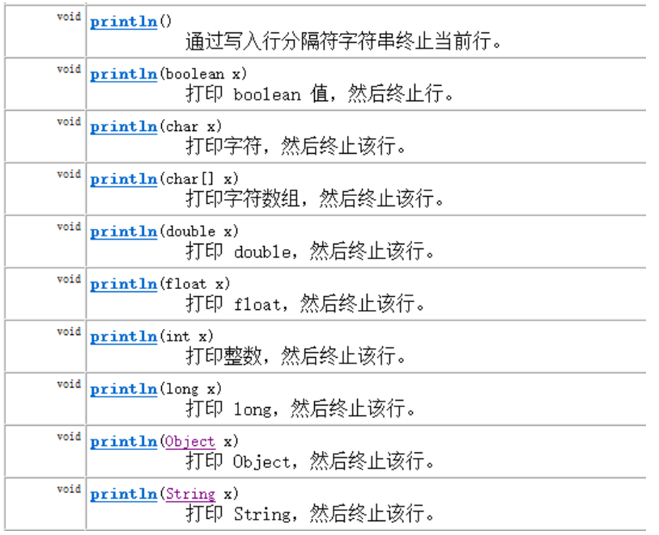

  -   **不换行输出语句**：输出内容后不换行，格式如下

    ```java
    System.out.print(输出内容);////输出内容之后不换行
    ```

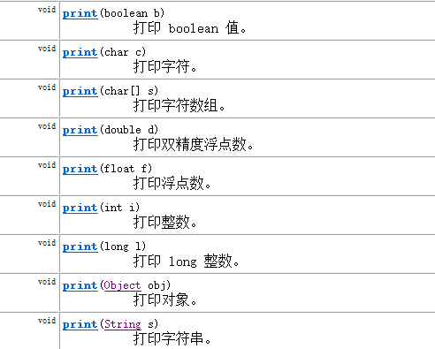

示例代码：

```java
public class TestPrintlnAndPrint {
    public static void main(String[] args) {
        String name = "陈叶";
        int age = 18;

        //对比如下两组代码：
        System.out.println(name);
        System.out.println(age);

        System.out.print(name);
        System.out.print(age);
        System.out.println(); //()里面为空，效果等同于换行，输出一个换行符
        //等价于 System.out.print("\n"); 或  System.out.print('\n');
        //System.out.print();//错误，()里面不能为空   核心类库PrintStream类中没有提供print()这样的方法

        //对比如下两组代码：
        System.out.print("姓名：" + name +",");//""中的内容会原样显示
        System.out.println("年龄：" + age);//""中的内容会原样显示

        System.out.print("name = " + name + ",");
        System.out.println("age = " + age);
    }
}
```


>注意事项：
>
>​	换行输出语句，括号内可以什么都不写，只做换行处理
>
>​	不换行输出语句，括号内什么都不写的话，编译报错
>
>​	如果()中有多项内容，那么必须使用 + 连接起来
>
>​	如果某些内容想要原样输出，就用""引起来，而要输出变量中的内容，则不要把变量名用""引起来

### 3.2.2 输入语句(工具使用)

- 键盘输入代码的四个步骤：

```tex
- 导包
	格式： import java.util.Scanner; //包  文件
	位置：在class上面。
- 创建键盘录入对象
	格式：Scanner sc = new Scanner(System.in);//标准输入流
	new 关键字 创建一个引用数据类型的对象
- 通过对象获取数据
	格式：int x = sc.nextInt();
- 释放资源
	格式:sc.close();
```

- #### 整数类型的数据输入

  示例代码：

  需求:

  ​	键盘录入一个整数,并输出至控制台

```java
import java.util.Scanner;
class Demo2_Scanner {
	public static void main(String[] args) {
		/*
        // 录入一个整数
        Scanner sc = new Scanner(System.in);		//创建键盘录入对象
		System.out.println("请输入一个整数:");
		int x = sc.nextInt();						//将键盘录入的数据存储在x中
		System.out.println(x);*/

		// 录入两个整数
		Scanner sc = new Scanner(System.in);		//创建键盘录入对象
		System.out.println("请输入第一个整数:");
		int x = sc.nextInt();						//将键盘录入的数据存储在x中
		System.out.println(x);
		System.out.println("请输入第二个整数:");
		int y = sc.nextInt();						//将键盘录入的数据存储在y中
		System.out.println(y);
        
        // 释放资源
        sc.close();
	}
}
```

#### 2、nextInt()与nextLine()

```java
nextInt();获取的是一个int类型的内容
nextLine();获取的是一行字符串内容
```

## 3.3 顺序结构

```tex
- 顺序结构就是程序从上到下逐行地执行。

- 表达式语句都是顺序执行的。并且上一行对某个变量的修改对下一行会产生影响。
```


```java
public class TestStatement{
	public static void main(String[] args){
		int x = 1;
		int y = 2;
		System.out.println("x = " + x);		
        System.out.println("y = " + y);	
        //对x、y的值进行修
a        x++;
        y = 2 * x + y;
        x = x * 10;	
        System.out.println("x = " + x);
        System.out.println("y = " + y);
    }
}
```


## 3.4 选择结构

```tex
选择结构是当给定判断条件时，根据条件来判断是否满足某些条件，如果满足实行提前规定好的一段代码，反之执行另一代码的一种结构体。

分类:
- if分支语句

- swith分支语句
```

### 3.4.1 单分支条件判断：if

- **if语句第一种格式：** if

```java
if(条件表达式)｛
  	语句体; // 关系表达式返回值为true 才会执行
｝
```

- **执行流程**

  - 首先判断条件表达式看其结果是true还是false

  - 如果是true就执行语句体

  - 如果是false就不执行语句体

    

案例：从键盘第一个小的整数赋值给small，第二个大的整数赋值给big，如果输入的第一个整数大于第二个整数，就交换。输出显示small和big变量的值。

```java
import java.util.Scanner;

public class Test09If {
    public static void main(String[] args) {
        Scanner input = new Scanner(System.in);

        System.out.print("请输入第一个整数：");
        int small = input.nextInt();

        System.out.print("请输入第二个整数：");
        int big = input.nextInt();

        if (small > big) {
            int temp = small;
            small = big;
            big = temp;
        }
        System.out.println("small=" + small + ",big=" + big);

        input.close();
    }
}
```

### 3.4.2 双分支条件判断：if...else

- **if语句第二种格式：** if...else

```java
if(关系表达式) { 
  	语句体1;// 关系表达式返回值为true 执行语句体1
}else {
  	语句体2;// 关系表达式返回值为false 执行语句体2
}
```

- 执行流程

  - 首先判断关系表达式看其结果是true还是false

  - 如果是true就执行语句体1

  - 如果是false就执行语句体2

- 
   案例：从键盘输入一个整数，判定是偶数还是奇数    

```java
import java.util.Scanner;

public class Test10IfElse {
    public static void main(String[] args){
        // 判断给定的数据是奇数还是偶数
        Scanner input = new Scanner(System.in);

        System.out.print("请输入整数：");
        int a = input.nextInt();

        if(a % 2   0) {
            System.out.println(a + "是偶数");
        } else{
            System.out.println(a + "是奇数");
        }

        input.close();
    }
}
```

- if语句的第二种格式和三元的相互转换问题

```tex
- 三元运算符实现的，都可以采用if语句实现。反之不成立。
	
- 什么时候if语句实现不能用三元改进呢?
* 当if语句控制的操作是一个输出语句的时候就不能。
* 为什么呢?
  因为三元运算符是一个运算符，运算符操作完毕就应该有一个结果，而不是一个输出。
```

### 3.4.3 多分支条件判断：if...else if

- **if语句第三种格式：** if...else if ...else

```java
if (判断条件1) {
  	执行语句1;
} else if (判断条件2) {
  	执行语句2;
}
...
}else if (判断条件n) {
 	执行语句n;
} else {
  	执行语句n+1;// 以上条件全不满足,则执行else语句
}
```

- **执行流程**
  - 首先判断关系表达式1看其结果是true还是false

  - 如果是true就执行语句体1，然后结束当前多分支

  - 如果是false就继续判断关系表达式2看其结果是true还是false

  - 如果是true就执行语句体2，然后结束当前多分支

  - 如果是false就继续判断关系表达式…看其结果是true还是false

  - …

  - 如果没有任何关系表达式为true，就执行语句体n+1，然后结束当前多分支。

    


- 
- 

```java
import java.util.Scanner;

public class Test11IfElseIf {
    public static void main(String[] args) {
        Scanner input = new Scanner(System.in);
        System.out.print("请输入成绩[0,100]：");
        int score = input.nextInt();

        if(score<0 || score>100){
            System.out.println("你的成绩是错误的");
        }else if(score>=90 && score<=100){
            System.out.println("你的成绩属于优秀");
        }else if(score>=80 && score<90){
            System.out.println("你的成绩属于好");
        }else if(score>=70 && score<80){
            System.out.println("你的成绩属于良");
        }else if(score>=60 && score<70){
            System.out.println("你的成绩属于及格");
        }else {
            System.out.println("你的成绩属于不及格");
        }
        
        input.close();
    }
}

```
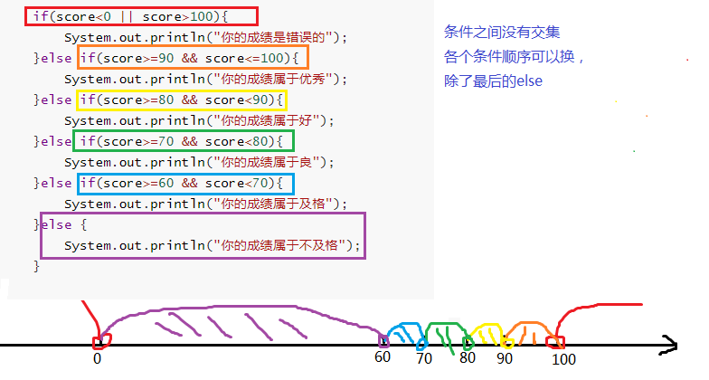

```java
import java.util.Scanner;

public class Test11IfElseIf {
    public static void main(String[] args) {
        Scanner input = new Scanner(System.in);
        System.out.print("请输入成绩[0,100]：");
        int score = input.nextInt();

        if(score<0 || score>100){
            System.out.println("你的成绩是错误的");
        }else if(score>=90){
            System.out.println("你的成绩属于优秀");
        }else if(score>=80){
            System.out.println("你的成绩属于好");
        }else if(score>=70){
            System.out.println("你的成绩属于良");
        }else if(score>=60){
            System.out.println("你的成绩属于及格");
        }else {
            System.out.println("你的成绩属于不及格");
        }

        input.close();
    }
}

```

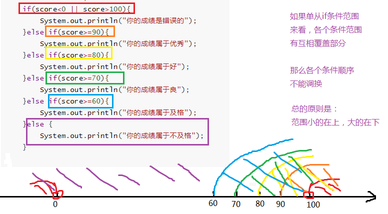

### 3.4.4 if..else嵌套

在if的语句块中，或者是在else语句块中，
又包含了另外一个条件判断（可以是单分支、双分支、多分支）

执行的特点：
（1）如果是嵌套在if语句块中的
只有当外部的if条件满足，才会去判断内部的条件
（2）如果是嵌套在else语句块中的
只有当外部的if条件不满足，进入else后，才会去判断内部的条件

案例：求出三个整数中的最大值

```java
class Demo6_IfIf {
	public static void main(String[] args) {
		int a = 40;
		int b = 50;
		int c = 30;
		
		if (a > b) {
			if (a > c) {
				System.out.println(a + "是最大值");
			}else {
				System.out.println(c + "是最大值");
			}
		}else {	//b >= a
			if (b > c) {
				System.out.println(b + "是最大值");
			}else {
				System.out.println(c + "是最大值");
			}
		}
	}
}
```


### 3.4.5 switch...case多分支选择结构

- 语法格式：

  []中括号代表可省略

```java
switch(表达式){
    case 常量值1:
        语句块1;
        [break;]// 遇到break,结束当前case语句 
    case 常量值2:
        语句块2;
        [break;]   
    ...
   [default:
        语句块n+1;//如果上述的常量值与case均不匹配，则执行本代码
        [break;]
     ]
}
```

- 格式解释

  ```tex
  - switch表示这是switch语句
  	表达式的取值：byte,short,char,int
  	JDK5以后可以是枚举
  	JDK7以后可以是String
  - case后面跟的是要和表达式进行比较的值
  - 语句体部分可以是一条或多条语句
  - break表示中断，结束的意思，可以结束switch语句
  - default语句表示所有情况都不匹配的时候，就执行该处的内容，和if语句的else相似
  ```

  

- 执行过程：

```tex
先计算表达式的值，
然后和case后面的匹配，
如果有就执行对应的语句，否则执行default控制的语句
直到遇到break或者右大括号｝，结束switch语句。
```

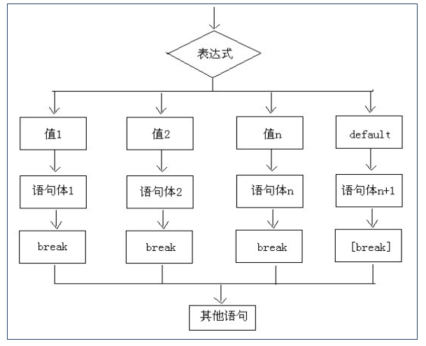

- ##### 案例：从键盘输入星期的整数值，输出星期的英文单词


```java
import java.util.Scanner;

public class Test13SwitchDemo1 {
    public static void main(String[] args) {
        //定义指定的星期
        Scanner input = new Scanner(System.in);
        System.out.print("请输入星期值：");
        int weekday = input.nextInt();

        //switch语句实现选择
        switch(weekday) {
            case 1:
                System.out.println("Monday");
                break;
            case 2:
                System.out.println("Tuesday");
                break;
            case 3:
                System.out.println("Wednesday");
                break;
            case 4:
                System.out.println("Thursday");
                break;
            case 5:
                System.out.println("Friday");
                break;
            case 6:
                System.out.println("Saturday");
                break;
            case 7:
                System.out.println("Sunday");
                break;
            default:
                System.out.println("你输入的星期值有误！");
                break;
        }

        input.close();
    }
}
```
- #### 利用case的穿透性


在switch语句中，如果case的后面不写break，将出现穿透现象，也就是一旦匹配成功，不会在判断下一个case的值，直接向后运行，直到遇到break或者整个switch语句结束，switch语句执行终止。

练习：键盘录入一个月份(1-12),依据月份在控制台输出其对应的季节

```java
import java.util.Scanner;

/*
 * 需求：键盘录入一个月份(1-12),依据月份在控制台输出其对应的季节
 * 		一年有四季
 * 		3,4,5	春季
 * 		6,7,8	夏季
 * 		9,10,11	秋季
 * 		12,1,2	冬季
 */
public class Test14SwitchDemo2 {
    public static void main(String[] args) {
        Scanner input = new Scanner(System.in);
        System.out.print("请输入月份：");
        int month = input.nextInt();

        /*
		switch(month) {
            case 1:
                System.out.println("冬季");
                break;
            case 2:
                System.out.println("冬季");
                break;
            case 3:
                System.out.println("春季");
                break;
            case 4:
                System.out.println("春季");
                break;
            case 5:
                System.out.println("春季");
                break;
            case 6:
                System.out.println("夏季");
                break;
            case 7:
                System.out.println("夏季");
                break;
            case 8:
                System.out.println("夏季");
                break;
            case 9:
                System.out.println("秋季");
                break;
            case 10:
                System.out.println("秋季");
                break;
            case 11:
                System.out.println("秋季");
                break;
            case 12:
                System.out.println("冬季");
                break;
            default:
                System.out.println("你输入的月份有误");
                break;
		}
		*/

        // 改进版
        switch(month) {
            case 1:
            case 2:
            case 12:
                System.out.println("冬季");
                break;
            case 3:
            case 4:
            case 5:
                System.out.println("春季");
                break;
            case 6:
            case 7:
            case 8:
                System.out.println("夏季");
                break;
            case 9:
            case 10:
            case 11:
                System.out.println("秋季");
                break;
            default:
                System.out.println("你输入的月份有误");
                break;
        }

        input.close();
    }
}

```

- ##### 常见错误实现1：


```java
		switch(month){
			case 3|4|5://3|4|5 用了位运算符，11 | 100 | 101结果是 111是7
				System.out.println("春季");
				break;
			case 6|7|8://6|7|8用了位运算符，110 | 111 | 1000结果是1111是15
				System.out.println("夏季");
				break;
			case 9|10|11://9|10|11用了位运算符，1001 | 1010 | 1011结果是1011是11
				System.out.println("秋季");
				break;
			case 12|1|2://12|1|2 用了位运算符，1100 | 1 | 10 结果是1111，是15
				System.out.println("冬季");
				break;
			default:
				System.out.println("输入有误");
		}
```

- ##### 常见错误实现2：


```java
		//编译不通过
		switch(month){
			case 3,4,5:
				System.out.println("春季");
				break;
			case 6,7,8:
				System.out.println("夏季");
				break;
			case 9,10,11:
				System.out.println("秋季");
				break;
			case 12,1,2:
				System.out.println("冬季");
				break;
			default:
				System.out.println("输入有误");
		}
```

- #### 选择结构switch语句的注意事项【掌握】

  ```tex
  - case后面只能是常量，不能是变量，而且，多个case后面的值不能出现相同的。
  - default可以省略吗?
  可以省略。一般不建议省略。因为它的作用是对不正确的情况给出提示。
  除非判断的值是固定的。(单选题)
      特殊情况：`q
  - break可以省略吗?
  可以省略，一般不建议。否则结果可能不是你想要的。
  会出现一个现象：case穿透。
  	一般不省略，根据需求判断是否需要省略（后面学）
  - default的位置一定要在最后吗?
  可以出现在switch语句任意位置。但是建议在最后。
  - switch语句的结束条件：
  	* 遇到break
  	*执行到程序的末尾，即执行到switch的右大括号就结束了
  ```
  
- #### if语句与switch语句比较
  
  ```tex
  - switch语句可以实现的功能,都可以使用if去完成
  - 反之则不成立
  ```
  
  - if语句的条件是一个布尔类型值，if条件表达式为true则进入分支，可以用于范围的判断，也可以用于等值的判断，使用范围更广。
  - switch语句的条件是一个常量值（byte,short,int,char,枚举,String），只能判断某个变量或表达式的结果是否等于某个常量值，使用场景较狭窄。
  - 当条件是判断某个变量或表达式是否等于某个固定的常量值时，使用if和switch都可以，习惯上使用switch更多。当条件是区间范围的判断时，只能使用if语句。
  - 另外，使用switch可以利用穿透性，同时执行多个分支，而if...else没有穿透性。

## 3.5 循环结构(重要)

- **循环语句**

  ```tex
  循环语句可以在满足循环条件的情况下，反复执行某一段代码，这段被重复执行的代码被称为循环体语句，当反复执行这个循环体时，需要通过修改循环变量使得循环判断条件为false，从而结束循环，否则循环将一直执行下去，形成死循环。
  ```

- **循环语句的组成**:

```tex
- 初始化语句：
	一条或者多条语句，这些语句完成一些初始化操作。
- 判断条件语句：
	这是一个boolean 表达式，这个表达式能决定是否执行循环体。
- 循环体语句：
	这个部分是循环体语句，也就是我们要多次做的事情。
- 控制条件语句：
	这个部分在一次循环体结束后，下一次循环判断条件执行前执行。
	通过用于控制循环条件中的变量，使得循环在合适的时候结束。
```

### 3.5.1 循环结构的分类

```tex
- for
- while
- do...while
```

### 3.5.2 循环结构for语句的格式和基本使用

- #### for循环语句格式：


```java
for(初始化语句①; 循环条件语句②; 循环控制条件语句④){
	循环体语句③
}
```

> 注意：
>
> （1）for(;;)中的两个；是不能多也不能少
>
> （2）循环条件必须是boolean类型
>

- #### 执行流程：

  ```tex
  - 第一步：执行初始化语句①，完成循环变量的初始化；
  - 第二步：执行循环条件语句②，看循环条件语句的值是true，还是false；
      如果是true，执行第三步；
      如果是false，循环语句中止，循环不再执行。
  - 第三步：执行循环体语句③
  - 第四步：执行循环控制条件语句④，针对循环变量重新赋值
  - 第五步：根据循环变量的新值，重新从第二步开始再执行一遍
  ```

- 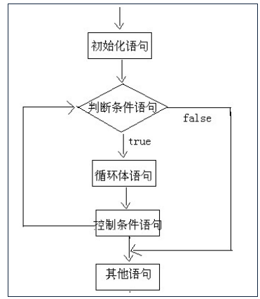

- #### 案例：在控制台输出10次"helloworld"

  ```java
  class Demo1_For {
  	public static void main(String[] args) {
  		/*
             //在控制输出10次helloworld,这样做不推荐,因为复用性太差
             System.out.println("helloworld");
  		   //............
          */
  		for (int i = 1;i <= 10 ;i++ ) {
  			System.out.println("helloworld");
  		}
  	}
  }
  ```

  

- #### 案例:

  - ##### 输出数据1-10的数字

  - ##### 输出数据10-1的数字

```java
class Test1_For {
	public static void main(String[] args) {
		for (int i = 1;i <= 10 ;i++ ){
			System.out.println("i = " + i);
		}
		System.out.println("-----------------------");
		for (int i = 10;i >= 1 ;i-- ) {
			System.out.println("i = " + i);
		}
	}
}
```

- #### 注意事项

  ```tex
  - 判断条件语句无论简单还是复杂，结果是boolean类型。
  - 循环体语句如果是一条语句，大括号可以省略；
  	如果是多条语句，大括号不能省略。建议永远不要省略。
  - 一般来说：有左大括号就没有分号，有分号就没有左大括号
  ```

- #### 案例:

  - ##### 求1-100的累加和

  - ##### 求出1-100之间偶数和

  - ##### 求出1-100之间奇数和

  ```tex
  /*
  	分析:1-100数据的和
  	0 + 1
  	1 + 2
  	3 + 3
  	6 + 4
  	...
  */
  ```

  ```java
  class Test2_For {
  	public static void main(String[] args) {
  		//1-10的和
  		/*int sum = 0;
  		for (int i = 1;i <= 10 ;i++ ) {
  			sum = sum + i; 
  		}
  		System.out.println("sum = " + sum);*/
  
  		//1-100的偶数和
  		/*int sum = 0;
  		for (int i = 1;i <= 100 ;i++ ) {
  			if (i % 2 == 0) {
  				sum = sum + i;
  			}
  		}
  		System.out.println("sum = " + sum);*/
  
  		//1-100的奇数和
  		int sum = 0;
  		for (int i = 1;i <= 100 ;i+=2 ) {
  			/*if (i % 2 != 0) {
  				sum = sum + i;
  			}*/
  			sum = sum + i;
  		}
  		System.out.println("sum = " + sum);
  	}
  }
  ```

- #### **案例**

  - 在控制台输出100-999中所有的”水仙花数”

    ```tex
    在控制台输出100-999中所有的”水仙花数”
    
    - 说明:所谓的水仙花数是指一个三位数，其各位数字的立方和等于该数本身。
    	举例：153就是一个水仙花数。
    	153 = 1*1*1 + 5*5*5 + 3*3*3 = 1 + 125 + 27 = 153
    - 分析:
    ①　100 - 999
    ②　获取每一个位数的值,百位,十位,个位
  ③　判断各个位上的立方和是否等于这个数,如果等于打印
    ```
  
    ```java
    class Test3_Flower {
    	public static void main(String[] args) {
    		for (int i = 100;i <= 999 ;i++ ) {		//获取100到999之间的数
    			int ge = i % 10;						//123 % 10 
    			int shi = i / 10 % 10;					//12 % 10;
    			int bai = i / 10 / 10 % 10;			//1 % 10
    			if (ge * ge * ge + shi * shi * shi + bai * bai * bai == i) {
    				System.out.println(i);
    			}
    		}
    	}
  }
    ```

  - ##### 统计100-999中”水仙花数”共有多少个
  
    ```tex
    分析:
    1,需要有一个变量记录住水仙花数的个数
    2,获取到所有的3位数
    3,判断是否满足水仙花数
    4,如果满足条件,计数器就自增
    ```
  
    ```java
    class Test4_FlowerCount {
    	public static void main(String[] args) {
    		int count = 0;
    		for (int i = 100;i <= 999 ;i++ ) {
    			int ge = i % 10;
    			int shi = i / 10 % 10;
    			int bai = i / 10 / 10;
    			if (i == ge * ge * ge + shi * shi * shi + bai * bai * bai) {
    				count ++;				//满足条件就自增,计数器思想
    			}
    		}
    		System.out.println(count);
    	}
    }
    ```

### 3.5.3 循环结构while语句的格式和基本使用

- #### **while循环语句基本格式：**

  - ##### 完整格式

    ```tex
    初始化语句;
    while(判断条件语句) {
    	循环体语句;
    	控制条件语句;
    }
    
    注意:
    while()中的循环条件不能空着
    ```

- #### **执行流程**：

  ```tex
  - 第一步：执行循环条件语句①，看循环条件语句的值是true，还是false；
    	如果是true，执行第二步；
    	如果是false，循环语句中止，循环不再执行。
  - 第二步：执行循环体语句②；
  - 第三步：循环体语句执行完后，重新从第一步开始再执行一遍
  ```

  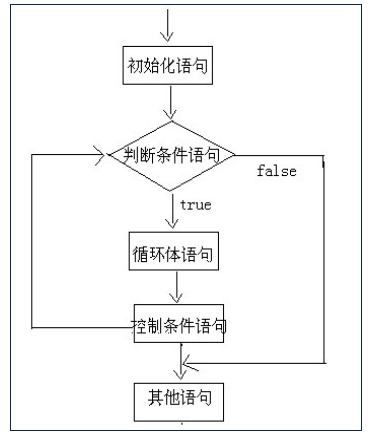

* #### **案例**

  - 请在控制台输出数据1-10

  ```java
  class Demo1_While {
  	public static void main(String[] args) {
  		int x = 1;
  		while (x <= 10) {
  			System.out.println("x = " +  x);
  			x++;
  		}
  	}
  }
  ```

* #### **案例**

  - ##### 求和思想：求1-100之和

  - **统计思想：统计100-999之间”水仙花数”共有多少个**

    ```java
    class Test1_While {
    	public static void main(String[] args) {
    		/*
    		* A:求和思想
    			* 求1-100之和
    		* B:统计思想
    			* 统计”水仙花数”共有多少个
    		*/
    		
    		//求1-100之和
    		/*int sum = 0;
    		int i = 1;
    		while (i <= 100) {
    			sum += i;					//sum = sum + i;
    			i++;						//让变量i自增
    		}
    		System.out.println("sum = " + sum);*/
    
    		//统计”水仙花数”共有多少个
    		int count = 0;					//计数器
    		int i = 100;
    		while (i <= 999) {
    			int ge = i % 10;
    			int shi = i / 10 % 10;
    			int bai = i / 100;
    			if (i == ge * ge * ge + shi * shi * shi + bai * bai * bai) {
    				count ++;
    			}
    			i++;    //此处i++千万不能丢.
    		}
    		System.out.println("count =" + count);
        }
    }
    ```

    

  - ##### 一张A4纸厚度是1毫米,珠穆朗玛峰的高度8848米,请问:将纸对折多少次可以达到珠穆朗玛峰的高度?

    ```java
    class Test1_While {
    	public static void main(String[] args) {
        	int zH = 1;//单位是毫米
    		int sH = 8848 * 100 * 10;
    		int count = 0;
    
    
    		//循环代表的是不断的对折
    		while(zH < sH){
    			//对折
    			//zH = zH * 2;
    			zH *= 2;
    			count++;
    		}
    
    		System.out.println(count);
        }
    }
    ```

###  3.5.4 循环结构do...while语句的格式和基本使用

- #### **基本格式**

```java
do {
    循环体语句①；
} while (循环条件语句②)；
```

- #### **完整格式**

  ```tex
  初始化语句;
  do {
  	循环体语句;
  	控制条件语句;
  }while(判断条件语句);
  
  注意：
  
  （1）while(循环条件)中循环条件必须是boolean类型
  
  （2）do{}while();最后有一个分号
  
  （3）do...while结构的循环体语句是至少会执行一次，这个和for和while是不一样的
  ```

- #### **执行流程**

  ```tex
  - 第一步：执行循环体语句①；
  - 第二步：执行循环条件语句②，看循环条件语句的值是true，还是false；
    	如果是true，执行第三步；
    	如果是false，循环语句终止，循环不再执行。
  - 第三步：循环条件语句执行完后，重新从第一步开始再执行一遍
  
  
  1 34234 234 234 234
  ```

- #### 案例

  - **请在控制台输出数据1-10**

    ```java
    public static void main(String[] args) {
    		int i = 1;
    		do {
    			System.out.println(i);
    			i++;
    		} while (i<=10);
    }
    ```

  - **看代码说结果**

    ```java
    public static void main(String[] args) {
    		int i = 1;
    		do {
    			System.out.println(i);
    			i++;
    		} while (i > 10);
    }
    ```

###  3.5.5 循环结构三种循环语句的区别

* #### 从循环次数角度分析
  
  * do...while循环至少执行一次循环体语句
  * for和while循环先循环条件语句是否成立，然后决定是否执行循环体语句
  
* #### 如何选择

  * 遍历有明显的循环次数（范围）的需求，选择for循环
  * 遍历没有明显的循环次数（范围）的需求，循环while循环
  * 如果循环体语句块至少执行一次，可以考虑使用do...while循环
  * 本质上：三种循环之间完全可以互相转换，都能实现循环的功能

### 3.5.6 循环结构之死循环(无限循环)

- #### 两种最简单的死循环格式

```java
for(;;){...}
while(true){...}
```

- #### 案例：实现爱你到永远(for循环)

```java
public class Test03EndlessFor {
    public static void main(String[] args) {
        for (; ;){
            System.out.println("我爱你！");
        }
//        System.out.println("end");//永远无法到达的语句，编译报错
    }
}
```

```java
public class Test03EndlessFor {
    public static void main(String[] args) {
        for (; true;){ //条件永远成立
            System.out.println("我爱你！");
        }
    }
}
```

```java
public class Test03EndlessFor {
    public static void main(String[] args) {
        for (int i=1; i<=10; ){ //循环变量没有修改，条件永远成立，死循环
            System.out.println("我爱你！");
        }
    }
}
```

- #### 案例：实现爱你到永远(while循环)

```java
public class Test04EndlessFor {
    public static void main(String[] args) {
        while (true){
            System.out.println("我爱你！");
        }
//        System.out.println("end");//永远无法到达的语句，编译报错
    }
}

```

- #### 案例：实现爱你到永远(do...while循环)

```java
public class Test05EndlessFor {
    public static void main(String[] args) {
        do{
            System.out.println("我爱你！");
        }while (true);            
//        System.out.println("end");//永远无法到达的语句，编译报错
    }
}
```

### 3.5.6 循环嵌套(重点+难点)

- **嵌套循环**

```tex
是指一个循环的循环体是另一个循环。比如for循环里面还有一个for循环，就是嵌套循环。当然可以是三种循环任意互相嵌套。
```

- **两个for嵌套循环格式**	

```java
for(初始化语句①; 循环条件语句②; 控制语句⑦) {
    for(初始化语句③; 循环条件语句④; 控制语句⑥) {
      	循环体语句⑤;
    }
}
```

**执行特点：**

```tex
外循环控制行数，内循环控制列数（外循环控制打印几行，内循环控制每行打印几列）

外循环执行一次，内循环执行一轮（时钟：时针走一个格子，分针走一圈）。
```

- #### 案例:

  - #### 打印4行5列的星星

  ```tex
  如图:
  	*****
  	*****
  	*****
  	*****
  注意：
  System.out.println("*"); 	输出并换行
  System.out.print("*");		输出但不换行
  System.out.println();       可以实现换行。
  ```

  ```java
  class Demo1_ForFor {
  	public static void main(String[] args) {
  		/*for (int i = 1;i <= 3 ;i++ ) {		//外循环
  			System.out.println("i = " + i);
  			for (int j = 1;j <= 3 ;j++ ) {		//内循环
  				System.out.println("j = " + j);
  			}
  		}*/
  		for (int i = 1;i <= 4 ;i++ ) {			//外循环决定的是行数
  			for (int j = 1;j <= 5 ;j++ ) {		//内循环决定每行有多少列
  				System.out.print("*");
  			}
  			System.out.println();
  		}
  	}
  }
  ```

  - #### 打印5行直角三角形

    ```tex
    如图:
    	*
    	**
    	***
    	****
    	*****
    	
    ```
  ```
  
    class Demo2_ForFor {
    	public static void main(String[] args) {
    		for (int i = 1;i <= 5 ; i++) {		//外循环决定行数
    			for (int j = 1;j <= i ;j++ ) {	//内循环决定每行有多少列
    				System.out.print("*");
    			}
    			System.out.println();			//将光标换到下一行的行首
    		}
    	}
  ```

- #### 在控制台输出九九乘法表
  
  ```tex
  分析：
  	- 九九乘法表中的每一个公式当做一个*,结构和上面的案例中直角三角形相似
  	- 尝试先完成9层直角三角形的图案的输出
    	- 将*用实际公式代替
    	*
    	**
    	***
    
    	1 * 1 = 1
    	1 * 2 = 2   2 * 2 = 4
    	1 * 3 = 3   2 * 3 = 6 3 * 3 = 9
    	...
    	保持积极的心态，从熟悉的知识点着手,逐渐解决问题
  ```
  
    #### 如图:
  
    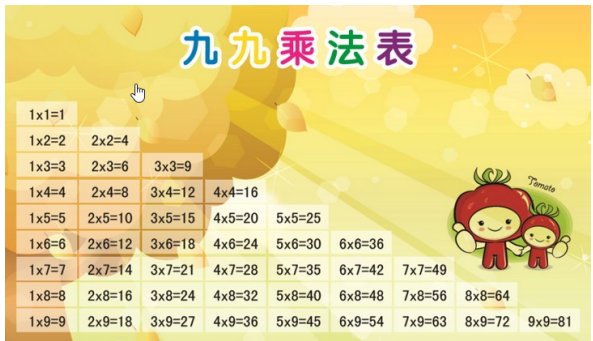
  
    ```java
    实现方式一(不符合要求)
    class Demo_sxh {
    	public static void main(String[] args) {
    		System.out.println("1*1=1");
    		System.out.println("1*2=2 2*2=4");
    		System.out.println("1*3=3 2*3=6 3*3=9");
    		//......
    	}
    }
    ```
  
    ```java
    分析：
    	- 九九乘法表中的每一个公式当做一个*,结构和上面的案例中直角三角形相似
    	- 尝试先完成9层直角三角形的图案的输出
    	- 将*用实际公式代替
    	*
    	**
    	***
    
    	1 * 1 = 1
    	1 * 2 = 2   2 * 2 = 4
    	1 * 3 = 3   2 * 3 = 6 3 * 3 = 9
    	...
    	保持积极的心态，从熟悉的知识点着手,逐渐解决问题
    
    
    class Demo3_For99 {
    	public static void main(String[] args) {
    		for (int i = 1;i <= 9 ;i++ ) {					//行数
    			for (int j = 1;j <= i ;j++ ) {				//列数
    				System.out.print(j + "*" + i + "=" + (i * j) + "\t" );
    			}
    			System.out.println();
    		}
    		
    		//System.out.println("\"");				转义双引号
    		System.out.println('\'');				//转义单引号
    	}
    }
    ```

思考题：

```tex
思考如下图案的完成
        *****
        ****
        ***
        **
        *
```

### 3.5.7 控制跳转语句 break

- #### break含义

  ```tex
  退出 ,结束
  ```

- #### 使用场景：

  ```tex
  - 在选择结构switch语句中
  - 在循环语句中
  - 离开使用场景的存在是没有意义的
  ```

- #### 案例

  ```java
  class Demo1_Break {
  	public static void main(String[] args) {
  		for (int x = 1;x <= 10 ;x++ ) {
  			if (x == 4) {
  				break;		//结束循环
  			}
  			System.out.println("x = " + x);
  		}
  	}
  }
  ```


### 3.5.8 控制跳转语句 continue

- #### continue含义

  ```tex
  退出本次循环，继续下次循环
  ```

- ### 使用场景

  ```tex
  只能在循环中 
  ```

- #### 案例

  ```java
  class Demo2_Continue {
  	public static void main(String[] args) {
  		for (int x = 1;x <= 10 ;x++ ) {
  			if (x == 4) {
  				continue; //终止本次循环,继续下次循环
  			}
  			System.out.println("x = " + x);
  		}
  	}
  }
  ```

- #### 案例

  - ##### 在下面特定之处填写代码,分别完成如下需求

  - 在控制台输出2次"我爱学习,学习使我快乐"

  - 在控制台输出7次"我爱学习,学习使我快乐"

  - 在控制台输出13次"我爱学习,学习使我快乐"

```java
for(int x=1; x<=10; x++) {
		if(x%3==0) {
			//在此处填写代码
			System.out.println(“我爱学习,学习使我快乐”);

		}
		System.out.println(“我爱学习,学习使我快乐”);
}
	
```

```java
class Test1 {
	public static void main(String[] args) {
		for(int x=1; x<=10; x++) {
			if(x%3==0) {
				//break;			//控制台输出2次:“我爱学习,学习使我快乐“
				//continue;			//在控制台输出7次:“我爱学习,学习使我快乐“
				//System.out.println("我爱学习,学习使我快乐");
                                   //在控制台输出13次:“我爱学习,学习使我快乐“	
			}
			System.out.println("我爱学习,学习使我快乐");
		}
	}
}	
```

### 3.5.9 控制跳转语句 return

- #### **return**

  ```tex
  返回(如果方法有返回值,结束的时候讲返回值传递给调用者)
  用于方法的结束
  ```

- #### return和break以及continue的区别?

  ```tex
  - return是结束方法
  - break是跳出循环
  - continue是终止本次循环继续下次循环
  ```

- #### 案例

  ```java
  class Demo4_Return {
  	public static void main(String[] args) {
  		for (int i = 1;i <= 10 ;i++ ) {
  			if (i == 4) {				
  				//break;			//停止循环
  				return;				//结束方法,因此循环也结束
  			}
  		}
  		System.out.println("循环结束了");
      }
  }
  ```

## 3.6 方法的定义和使用（Method）(重点+难点)

### 3.6.1 方法的作用

```tex
提高代码的复用性
```

### 3.6.2 什么是方法

```tex
完成特定功能的代码块。

方法也叫函数，是一组代码语句的封装，从而实现代码重用，从而减少冗余代码，通常它是一个独立功能的定义，方法是一个类中最基本的功能单元
```

### 3.6.3 方法的格式

```tex
修饰符 返回值类型 方法名(参数类型 参数名1,参数类型 参数名2）{
		方法体语句;
		return 返回值;
} 

声明方法的位置
	必须在类中方法外，即不能在一个方法中直接定义另一个方法。
```

### 3.6.4 方法的格式说明

```tex
- 修饰符：
	可选。目前就用 public static。后面我们再详细的讲解其他的修饰符。访问权限 static 表示这个方法在类加载的时候同时一起加载进内存
- 返回值类型：就是功能结果的数据类型,方法执行后将结果返回到调用者。
	无返回值类型：void
	有返回值类型:基本数据类型/引用数据类型
- 方法名：给方法起一个名字，见名知意，符合命名规则。
- 参数列表：(多个参数用逗号隔开)
	形式参数；在定义方法时方法名后面括号中声明的变量称为形式参数（简称形参），用于接收实际参数的。
	实际参数：调用方法时方法名后面括号中的使用的值/变量/表达式称为实际参数（简称实参）,就是实际参与运算的值。	
	调用时，实参的个数、类型、顺序顺序要与形参列表一一对应。如果方法没有形参，就不需要也不能传实参。
	无论是否有参数，声明方法和调用方法时()都不能丢失。
- 参数类型：就是参数的数据类型
- 参数名：就是参数对应的变量名
- 方法体语句：就是完成功能的代码。
- return：结束方法的。
- 返回值：就是功能的结果，由return带给调用者。
	* 如果被调用方法的返回值类型是void，调用时不需要也不能接收和处理（打印或参与计算）返回值结果。
	* 如果被调用方法有返回值，即返回值类型不是void，
	* 方法调用表达式的结果可以作为赋值表达式的值，
	* 方法调用表达式的结果可以作为计算表达式的一个操作数，
	* 方法调用表达式的结果可以作为另一次方法调用的实参，
	* 方法调用表达式的结果可以不接收和处理，方法调用表达式直接加;成为一个独立的语句，这种情况，返回值丢失。
```

### 3.6.5 方法的定义和调用

#### 3.6.5.1 定义方法需要明确的内容

```tex
- 明确返回值类型    
- 明确参数列表  
```

#### 3.6.5.2 案例:

- ##### 定义一个方法,功能为:求两个整数之和

  ```java
  分析:
  	 返回值类型  int (两个整数求和,最终返回值应该也是整数)
  	 参数列表   int a,int b(需要有两个整数,才能求和)
           
  class Demo2_Sum {
  	public static void main(String[] args) {
  		/*int a = 10;
  		int b = 20;
  		int sum = a + b;
  		System.out.println(sum);
  		int c = 30;
  		int d = 40;
  		int sum2 = c + d;
  		System.out.println(sum2);*/
  
  		int sum = add(10,20);
  		System.out.println(sum);
  		//add(30,40);					//有返回值方法的单独调用,没有意义
  		System.out.println(add(30,40));	//这样调用是可以,but如果需要用这个结果不推荐这样调用
  		//盘子 = 炒菜(地沟油,苏丹红,镉大米,烂白菜);
  	}	
  
  	public static int add(int a,int b) {	//int a = 10,int b = 20
  		int sum = a + b;
  		return sum;						//如果有返回值必须用return语句带回
  	}
  	/*
  	盘子 炒菜(油,调料,米,菜) {
  		炒菜的动作
  		return 一盘菜;
  	}
  	*/
  } 
  ```

#### 3.6.5.3 方法调用执行顺序

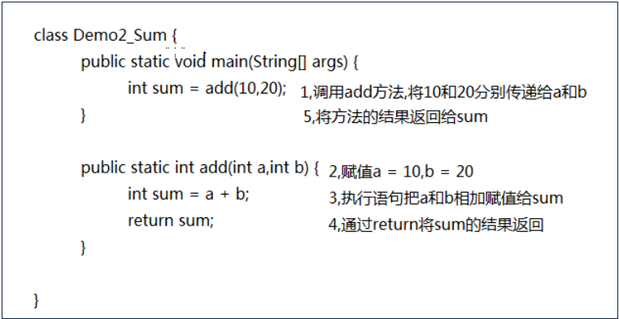

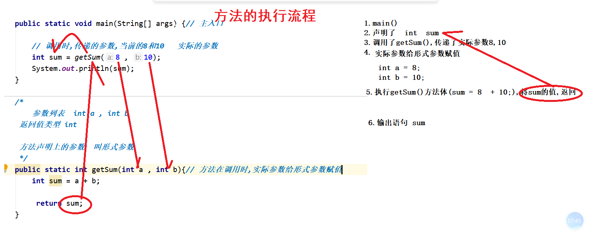

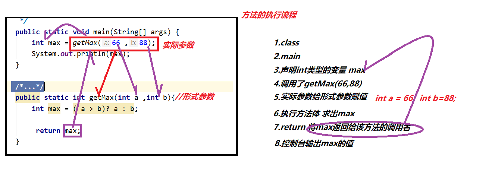

#### 3.6.5.4 方法注意事项

```tex
- 方法不调用不执行
- 方法与方法是平级关系，不能嵌套定义
- 方法定义的时候参数之间用逗号隔开
- 方法调用的时候不用再传递数据类型
- 如果方法有明确的返回值，一定要有return带回一个值
```

#### 3.6.5.5 练习案例

- ##### 键盘录入两个数据，返回两个数中的较大值

- ##### 键盘录入两个数据，比较两个数是否相等 

  ```java
  import java.util.Scanner;
  class Test1_Method {
  	public static void main(String[] args) {
  		Scanner sc = new Scanner(System.in);	//创建键盘录入对象
  		System.out.println("请输入第一个整数:");
  		int x = sc.nextInt();					//将键盘录入的整数存储在x中
  		System.out.println("请输入第二个整数:");
  		int y = sc.nextInt();					//将键盘录入的整数存储在y中
  		//int max = getMax(x,y);
  		//System.out.println(max);
  		boolean b = isEquals(x,y);
  		System.out.println(b);
  	}
  
  	/*
  	返回连个整数的较大值
  	1,明确返回值类型 int
  	2,明确参数列表 int a,int b
  	*/
  	public static int getMax(int a,int b) {
  		return a > b ? a : b;
  	}
  	/*
  	判断两个整数是否相等
  	1,明确返回值类型 boolean
  	2,明确参数列表 int a,int b
  	*/
  	public static boolean isEquals(int a,int b) {  //isEquals 是否相等
  		return a == b;
  	}
  }
  ```
  
- ##### 根据键盘录入的行数和列数，在控制台输出矩形星形

  ```java
  import java.util.Scanner;
  class Demo3_Method {
  	public static void main(String[] args) {
  		Scanner sc = new Scanner(System.in);		//创建键盘录入对象
  		System.out.println("请输入行数:");
  		int row = sc.nextInt();				//将键盘录入的行数存储在row中
  		System.out.println("请输入列数:");
  		int column = sc.nextInt();		//将键盘录入的列数存储在column中
  		
  		//System.out.println(print(row,column));	//错误: 此处不允许使用 '空' 类型,返回值是void的方法不能输出调用
  		//返回值是void的方法只能单独调用
  		print(row,column);
  	}
  
  	/*
  	在控制台输出矩形星形
  	1,明确返回值类型,经分析没有具体的返回值类型,void
  	2,明确参数列表int a,int b
  	*/
  	public static void print(int a,int b) {
  		for (int i = 1;i <= a ;i++ ) {				//行数
  			for (int j = 1;j <= b ;j++ ) {			//列数
  				System.out.print("*");
  			}
  			System.out.println();
  		}
  		//return ;			//如果返回值类型是void,return可以省略,即使省略系统也会默认给加上,形式是return;
  	}
  }
  ```

- ##### 根据键盘录入的数据输出对应的乘法表

  ```java
  import java.util.Scanner;
  class Test2_Method {
  	public static void main(String[] args) {
  		Scanner sc = new Scanner(System.in);		//创建键盘录入对象
  		System.out.println("请录入一个整数,范围在1-9之间");
  		int num = sc.nextInt();				//将键盘录入的整数存储在num中
  		print99(num);
  	}
  
  	/*
  	打印99乘法表
  	1,返回值类型void
  	2,参数列表,int a
  	*/
  	public static void print99(int num) {
  		for (int i = 1;i <= num ;i++ ) {					//行数
  			for (int j = 1;j <= i ;j++ ) {				//列数
  				System.out.print(j + "*" + i + "=" + (i * j) + "\t" );
  			}
  			System.out.println();
  		}
  	}
  }
  ```

### 3.6.6 方法重载概述和基本使用

```tex
- 在同一个类中，方法名相同，参数列表不同(参数个数\参数类型\参数顺序不同)。与返回值类型无关。
- 参数列表不同：
	* 参数个数不同
	* 参数类型不同
	* 参数的顺序不同(算重载,但是在开发中几乎不用)
- 重载方法调用：JVM通过方法的参数列表，调用匹配的方法。
  	* 先找个数、类型最匹配的
  	* 再找个数和类型可以兼容的，如果同时多个方法可以兼容将会报错


```

- #### 案例
  - ##### 定义一个方法,求2个整数之和

  - ##### 定义一个方法,求3个整数之和

  - ##### 定义一个方法,求2个小数之和

    ```java
    class Demo4_Overload {						//overload重载
    	public static void main(String[] args) {
    		double sum1 = add(10,20.1);
    		System.out.println(sum1);
    		int sum2 = add(10,20,30);
    		System.out.println(sum2);
    		double sum3 = add(12.3,13);
    		System.out.println(sum3);
    	}
    	/*
    	求两个整数的和
    	1,返回值类型int
    	2,参数列表 int a,int b
    	*/
    	public static double add(int a,double b) {
    		return a + b;
    	}
    	/*
    	求三个整数的和
    	1,返回值类型int
    	2,参数列表 int a,int b,int c
    	*/
    	public static int add(int a,int b,int c) {
    		return a + b + c;
    	}
    	/*
    	求两个小数的和
    	1,返回值类型double
    	2,参数列表 double a,double b
    	*/
    	public static double add(double a,int b) {
    		return a + b;
    	}
    }
    ```


### 3.6.7  方法的递归

```tex
方法自己调用自己的现象就称为递归

从前有座山,山上有座庙,庙里有个老和尚喜欢给小和尚讲故事,故事的内容是......
```

- #### 递归的分类

```tex
- 递归分为两种，直接递归和间接递归。
- 直接递归称为方法自身调用自己。
- 间接递归可以A方法调用B方法，B方法调用C方法，C方法调用A方法。
```

- #### 递归调用的注意事项

  ```tex
  - 递归一定要有条件限定，保证递归能够停止下来，否则会发生栈内存溢出。
  - 在递归中虽然有限定条件，但是递归深度不能太深，否则效率低下，或者也会发生栈内存溢出。
  - 能够使用循环代替的，尽量使用循环代替递归
  ```

- #### 案例演示

  ##### 使用递归,计算出5的阶乘

  ```java
  public class Demo8 {
  
  	/**
  	 * @param args
  	 * 递归:方法自己调用自己
  	 * 5!
  	 * 5 * 4 * 3 * 2 * 1
  	 * 
  	 * 5 * fac(4)(代表4!)
  	 * 		4 * fac(3)(代表3!)
  	 * 				3 * fac(2)(代表2!) 
  	 * 						2 * fac(1)(代表1!)
  	 */
  	public static void main(String[] args) {
  		
  		System.out.println(fun(5));
  	}
  	//如果调用的次数过多就会导致栈内存 
  	public static int fun(int num) {
  		if(num == 1) {
  			return 1;
  		}else {
  			return num * fun(num - 1);
  		}
  	}
  }
  ```

  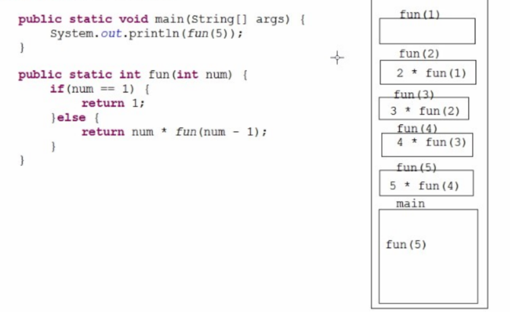
