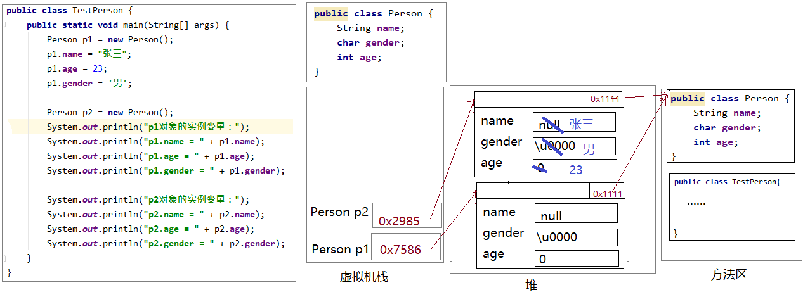
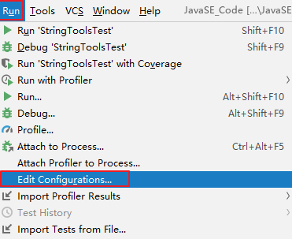
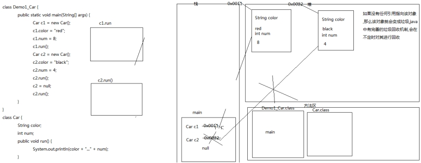
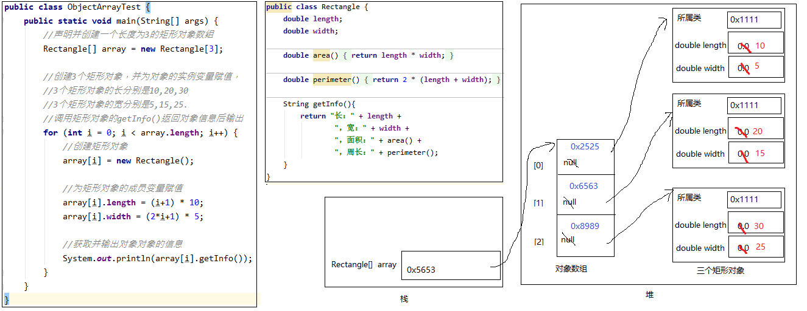

 第5章 面向对象基础（上） 

## 学习目标

- [ ] 初步了解面向对象的思想
- [ ] 理解类与对象的概念和关系
- [ ] 能够掌握类的定义格式
- [ ] 能够掌握创建对象格式
- [ ] 理解包的作用
- [ ] 掌握包的声明和导入
- [ ] 掌握实例变量的声明和使用
- [ ] 掌握实例方法的声明和调用
- [ ] 理解实例变量与局部变量的区别
- [ ] 了解命令行参数
- [ ] 了解方法的递归调用
- [ ] 应用对象数组解决问题
- [ ] 掌握二维数组的声明、初始化、使用

# 第5章 面向对象基础（上）

## 5.1 面向对象编程

### 5.1.1 面向对象编程思想概述

#### 5.1.1.1编程语言概述

Java是一种计算机程序设计语言。所有的计算机程序一直都是围绕着两件事在进行的，程序设计就是用某种语言编写代码来完成这两件事，所以程序设计语言又称为编程语言（编写程序的语言）。

- ##### 如何表示和存储数据

  - 基本数据类型的常量和变量：表示和存储一个个独立的数据
  - 对象：表示和存储与某个具体事物相关的多个数据（例如：某个学生的姓名、年龄、联系方式等）
  - 数据结构：表示和存储一组对象，数据结构有数组、链表、栈、队列、散列表、二叉树、堆......

- ##### 基于这些数据都有什么操作行为，其实就是实现什么功能

  - 数据的输入和输出
  - 基于一个或两个数据的操作：赋值运算、算术运算、比较运算、逻辑运算等
  - 基于一组数据的操作：统计分析、查找最大值、查找元素、排序、遍历等

#### 5.1.1.2 程序设计方法

C语言是一种面向过程的程序设计语言，因为C语言是在面向过程思想的指引下去设计、开发计算机程序的。

Java语言是一种面向对象的程序设计语言，因为Java语言是在面向对象思想的指引下去设计、开发计算机程序的。

其中面向对象和面向过程都是一种编程思想，基于不同的思想会产生不同的程序设计方法。

- ##### 面向过程的程序设计思想（Process-Oriented Programming），简称POP
  
  - 关注的焦点是过程：过程就是操作数据的步骤，如果某个过程的实现代码在很多地方重复出现，那么就可以把这个过程抽象为一个函数，这样就可以大大简化冗余代码，也便于维护。
  
  - 代码结构：**以函数为组织单位**。独立于函数之外的数据称为全局数据，在函数内部的称为局部数据。
  
- ##### 面向对象的程序设计思想（ Object Oriented Programming），简称OOP
  
  - 关注的焦点是类：面向对象思想就是在计算机程序设计过程中，参照现实中事物，将事物的属性特征、行为特征抽象出来，用类来表示。某个事物的一个具体个体称为实例或对象。
  - 代码结构：**以类为组织单位**。每种事物都具备自己的**属性**（即表示和存储数据，在类中用成员变量表示）和**行为/功能**（即操作数据，在类中用成员方法表示）。
  
- ##### 举例:两种程序设计思想表示:吃煎饼果子/洗衣服

### 5.1.2 类和对象

#### 5.1.2.1 什么是类

```tex
- 类是一类具有相同特性的事物的抽象描述，是一组相关属性和行为的集合。(比如：姓名，年龄，学习，这样就把所有的学生成为学生类)
	Java中最基本的单位是类,用来描述现实生活中的事物(如:学生类)
- 类的成员变量(属性)
	就是该事物的状态信息(如:学生类的姓名、年龄)
- 类的成员方法(行为)
	就是该事物能做什么操作或者能有什么功能(如:学生类吃饭、学习的功能)
```

#### 5.1.2.2 什么是对象(实例)

```tex
对象是一类事物的一个具体个体（对象并不是找个女朋友）。即对象是类的一个实例，必然具备该类事物的属性和行为。

例如：
类:学生类
对象:学生类中的具体一个实例(学生张三)

类:汽车类
对象:汽车类中的具体一个实例(宝马车)
```

#### 5.1.2.3 类与对象的关系

```tex
- 类是对一类事物的描述，是抽象的。
- 对象是一类事物的实例，是具体的。
- 类是对象的模板，对象是类的实体。
```

 

### 5.1.3 如何定义类

#### 5.1.3.1 类的定义格式

关键字：class（小写）

```java
【修饰符】 class 类名{

}

如:
public class Student{
    
}

类的内部,一般由五大部分组成：

成员变量/Field域
成员方法（method）
构造器
代码块
成员内部类
```

#### 5.1.3.2 学生类的定义

```tex
学生类
属性:姓名,年龄,性别
行为:学习,睡觉
```

```java
学生类:

/*
	需求：用Java语言描述现实中的学生                              Java语言
	事物：学生类                                              -->    class
	事物的属性（名词）：姓名  name，年龄  age，性别 gener    -->    成员变量
	事物的行为（动词）：学习 study ，吃饭 eat，睡觉 sleep    -->    成员方法
*/
class Student {//描述的学生类
 
	String name;   //学生的属性（名词） 名字
	int age;       //学生的属性（名词） 年龄
	String gener;  //学生的属性（名词） 性别

	//行为：学习（返回值类型void ,参数列表）
	public void study(String  subject) {//subject 学科
	
		System.out.println("我是学生学习"+subject+"学科的方法");
	}

	//行为（动词）：吃饭
	public  void eat() {
	
		System.out.println("我是学生吃饭的方法");
	}

	//行为：睡觉
	public  void sleep() {
	
		System.out.println("我是学生睡觉的方法");
	}	

}
```

```java
测试类:

class Demo_Student {//   测试类/主类

    /*
    如何使用一个类
        1> 创建对象
            类名 对象名 = new 类名();
        2>使用对象
            对象名.属性名 / 对象名.方法名()
    */
	public static void main(String[] args) {

		Student s = new Student();//创建一个学生类的对象
		s.name = "阿哲";  //使用属性（成员变量），  对象.成员变量
		s.age = 68;
		s.gener = "第三方";
		s.study("Java基础");          //调用方法的格式： 对象.成员方法
		s.eat();
		s.sleep();
		System.out.println("我的名字是" + s.name + ",我的年龄是" + s.age+",我的性别是" + s.gener);
		
	}
}
```

#### 5.1.3.3 手机类的定义

```tex
模仿学生类,完成手机类的定义
手机类
属性:品牌(brand)价格(price)
行为:打电话(call),发信息(sendMessage)玩游戏(playGame)
```

```java
手机类:

/*
* 属性:品牌(brand)价格(price)
* 行为:打电话(call),发信息(sendMessage)玩游戏(playGame)

*/
class Phone {
	String brand;					//品牌
	int price;						//价格

	public void call() {			//打电话
		System.out.println("打电话");
	}

	public void sendMessage() {		//发信息
		System.out.println("发信息");
	}

	public void playGame() {		//玩游戏
		System.out.println("玩游戏");
	}
}
```

```java
测试类:

class Demo2_Phone {
    
    /*
    如何使用一个类
        1> 创建对象
            类名 对象名 = new 类名();
        2>使用对象
            对象名.属性名 / 对象名.方法名()
    */
	public static void main(String[] args) {
		//创建对象
		Phone p = new Phone();
		//调用对象中的属性并赋值
		p.brand = "锤子";
		p.price = 998;

		System.out.println(p.brand + "..."  + p.price);

		//调用成员方法
		p.call();
		p.sendMessage();
		p.playGame();
	}
}
```

- ####  思考题:把大象放入冰箱分几步,如何使用Java代码实现

```tex
分析
- 把大象关冰箱分几步?  
	三步 :1 打开冰箱, 2.把大象放进去 3.关闭冰箱
- 这个过程涉及到几个事物?  
	大象 (属性:姓名,年龄  功能: 吃饭 睡觉) 
	冰箱(属性: 品牌,价格 功能:打开 ,盛放(大象的类型  变量) 关闭)
```

```java
大象类:
class Elephant {

	//属性:姓名,年龄
	String name;
	int age;

	//功能: 吃饭 睡觉
	public void eat(){
		System.out.println("这是一个吃饭的功能");
	}

	public void sleep(){
		System.out.println("这是一个睡觉的功能");
	}
}
```

```java
冰箱类
冰箱(属性: 品牌,价格 功能:打开 ,盛放(大象的类型  变量) 关闭)
class IceBox {

	//属性: 品牌,价格
	String brand = "格力";
	int price = 1200;

	//功能:打开 ,盛放(大象的类型  变量) 关闭)

	public void open(){
		System.out.println("这是一个打开冰箱的功能");
	}

	public void put(Elephant e){//参数列表 大象 e
		System.out.println("这是一个盛放大象的功能,盛放的大象,姓名是" + e.name + "大象的年龄为:"  + e.age);
	}

	public void close(){
		System.out.println("这是一个关闭冰箱的功能");
	}
}
```

```java
测试类
class Demo3 {

	public static void main(String[] args) {

		//把大象关冰箱分几步     创建对象  使用对象
		IceBox ib = new IceBox();
		ib.brand = "海尔";
		ib.price = 8800;
		System.out.println("该冰箱的品牌为" + ib.brand + ",价格为:" + ib.price);
		ib.open();

		//Elephant e = new Elephant();//匿名对象  没有名字的对象
		ib.put(new Elephant());//new Elephant();  匿名对象2018/8/27
		ib.put(new Elephant());

		//创建第二个冰箱
		IceBox ib2 = new IceBox();
		ib2.brand = "格力";
		ib2.price = 1200;
		System.out.println("该冰箱的品牌为" + ib2.brand + ",价格为:" + ib2.price);

		//三
		IceBox ib3 = ib2;
		ib3.brand = "美的";
		ib3.price = 999;
		System.out.println("该冰箱的品牌为" + ib3.brand + ",价格为:" + ib3.price);


		System.out.println("该冰箱的品牌为" + ib2.brand + ",价格为:" + ib2.price);//?


	}
}
```

### 5.1.4 如何使用类

```tex
- 文件名问题
	在一个java文件中写两个类：一个基本的类，一个测试类。
	建议：文件名称和测试类名称一致。
- 如何使用对象?
	创建对象并使用
	格式：类名 对象名 = new 类名();
- 如何使用成员变量呢?
	对象名.变量名
- 如何使用成员方法呢?
	对象名.方法名(...)
```

#### 5.1.4.1如何使用类的对象

关键字：new

每new一次,就会产生一个新的对象

```java
new 类名()//也称为匿名对象

//给创建的对象命名
//或者说，把创建的对象用一个引用数据类型的变量保存起来，这样就可以反复使用这个对象了
类名 对象名 = new 类名();
```

那么，对象名中存储的是什么呢？答：对象地址

```java
public class TestStudent{
    public static void main(String[] args){
        System.out.println(new Student());//Student@7852e922

        Student stu = new Student();
        System.out.println(stu);//Student@4e25154f
        
        int[] arr = new int[5];
		System.out.println(arr);//[I@70dea4e
    }
}
```

发现学生对象和数组对象类似，直接打印对象名和数组名都是显示“类型@对象的hashCode值"，所以说类、数组都是引用数据类型，引用数据类型的变量中存储的是对象的地址，或者说指向堆中对象的首地址。

那么像“Student@4e25154f”是对象的地址吗？不是，因为Java是对程序员隐藏内存地址的，不暴露内存地址信息，所以打印对象时不直接显示内存地址，而是JVM帮你调用了对象的toString方法，将对象的基本信息转换为字符串并返回，默认toString方法返回的是“对象的运行时类型@对象的hashCode值的十六进制值”，程序员可以自己改写toString方法的代码（后面会讲如何改写）。


#### 5.1.4.2 如何使用成员变量

- ##### 如何声明成员变量


```java
【修饰符】 class 类名{
    【修饰符】 数据类型  成员变量名; 
}
```

- ##### 示例：

```java
public class Person{
	String name;
    char gender;
    int age;
}
```

```tex
位置要求：必须在类中，方法外

类型要求：可以是Java的任意类型，包括基本数据类型、引用数据类型（类、接口、数组等）

修饰符：成员变量的修饰符有很多，例如：public、protected、private、static、volatile、transient、final等，后面会一一学习。

其中static可以将成员变量分为两大类，静态变量和非静态变量。其中静态变量又称为类变量，非静态变量又称为实例变量或者属性。

接下来先学习实例变量。
```

- ##### 实例变量的特点

  ```tex
  - 实例变量的值是属于某个对象的
  
  	* 必须通过对象才能访问实例变量
  	* 每个对象的实例变量的值是独立的
  
  - 实例变量有默认值(就是该实例变量对应数据类型的默认值)
  ```

- ##### 实例变量的访问

```java
对象.实例变量
```

- ##### 示例

```java
package com.atguigu.test03.field;

public class TestPerson {
    public static void main(String[] args) {
        Person p1 = new Person();
        p1.name = "张三";
        p1.age = 23;
        p1.gender = '男';

        Person p2 = new Person();
        /*
        （1）实例变量的值是属于某个对象的
        - 必须通过对象才能访问实例变量
        - 每个对象的实例变量的值是独立的
        （2）实例变量有默认值
         */
        System.out.println("p1对象的实例变量：");
        System.out.println("p1.name = " + p1.name);
        System.out.println("p1.age = " + p1.age);
        System.out.println("p1.gender = " + p1.gender);

        System.out.println("p2对象的实例变量：");
        System.out.println("p2.name = " + p2.name);
        System.out.println("p2.age = " + p2.age);
        System.out.println("p2.gender = " + p2.gender);
    }
}
```



#### 5.1.4 .3 如何调用实例方法

- ##### 方法调用语法格式


```java
对象.非静态方法(【实参列表】)
```

- #####  方法的特殊参数问题

  - ##### 形参是类类型（引用数据类型）

    ```tex
    如果你看到了一个方法的形式参数是一个类类型(引用类型)，这里其实需要的是该类的对象。
    ```

    ```java
    学生类:
    class Student {
    	String name;					//姓名
    	int age;						//年龄
    
    	public void speak() {
    		System.out.println(name + "..." + age);
    	}
    }
    ```

    ```java
    测试类
    class Demo1_Student {
    	public static void main(String[] args) {
    		print(10);
    
    		Student s = new Student();					//创建对象,并将对象的地址值赋值给s
                
    		//print(s);
            print(new Student());
    
    	}
    
    	public static void print(int x) {				//基本数据类型当作形式参数
    		System.out.println(x);
    	}
    
    	public static void print(Student stu) {			//引用数据类型当作形式参数
    		stu.name = "张三";
    		stu.age = 23;
    		stu.speak();
    	}
    }
    ```

  - #####   形参是可变参数

    ```tex
    - 在JDK1.5之后，当定义一个方法时，形参的类型可以确定，但是形参的个数不确定，那么可以考虑使用可变参数。可变参数的格式：
    
    - 格式
    【修饰符】 返回值类型 方法名(参数类型... 形参名){  }
    
    - 可变参数的特点和要求：
    	* 一个方法最多只能有一个可变参数
    	* 如果一个方法包含可变参数，那么可变参数必须是形参列表的最后一个,前面传的参数默认给对应的参数赋值
    	* 在声明它的方法中，可变参数当成数组使用,个数范围从0到无穷大
    	* 其实这个书写“≈”
    ```

    ```tex
    - 先定义一个方法print(int[] arr) 参数列表是int数组,
    - 再定义一个方法print(int... arr) 参数列表为可变参数   
    	报错:表示不是重载而是同一个方法 ==> 可变参数等同于数组
    
    - 继续演示参数列表从0到无穷大  空,arr,11,2,33,44,55
    ```

    ```java
    public class Demo3_ChangeableArgs {
    
    	public static void main(String[] args) {
    		int[] arr = {11,22,33,44,55};
    		//print(arr);
    		print(11,22,33,44,55);	//当参数有多个的时候，可变参数一定是最后一个参数，前面传的参数默认给对应的参数赋值	
    		System.out.println("---------------");
    		//print();
    		System.out.println("-----------------");
    		show(11,22,33,44,55);
    	}
    	
    	/*public static void print(int[] arr) {
    		for (int i = 0; i < arr.length; i++) {
    			System.out.println(arr[i]);
    		}
    	}*/
    	public static void show(int j,int ... arr) {			//可变参数其实是一个数组
    		for (int i = 0; i < arr.length; i++) {
    			System.out.println(arr[i]);
    		}
    	}
    	
    	public static void print(int ... arr) {			//可变参数其实是一个数组
    		for (int i = 0; i < arr.length; i++) {
    			System.out.println(arr[i]);
    		}
    	}
    }
    ```

  - ##### 参数类型为:命令行参数（了解）

    ```tex
    通过命令行给main方法的形参传递的实参称为命令行参数
    ```

    ```java
    public class TestCommandParam{
    	//形参：String[] args
    	public static void main(String[] args){
    		System.out.println(args);
    		System.out.println(args.length);
    		
    		for(int i=0; i<args.length; i++){
    			System.out.println("第" + (i+1) + "个参数的值是：" + args[i]);
    		}
    	}
    }
    ```

命令行：

```command
java TestCommandParam
```

```command
java TestCommandParam 1 2 3
```

```command
java TestCommandParam hello atguigu
```

IDEA工具：

（1）配置运行参数




（2）运行程序


- #### 方法的参数传递机制
  - ##### 方法的形参是基本数据类型时，形参值的改变不会影响实参；(String)

    ```java
    案例：编写方法，交换两个整型变量的值
    
    public class PrimitiveTypeParam {
        void swap(int a, int b){//交换两个形参的值
            int temp = a;
            a = b;
            b = temp;
        }
    
        public static void main(String[] args) {
            PrimitiveTypeParam tools = new PrimitiveTypeParam();
            int x = 1;
            int y = 2;
            System.out.println("交换之前：x = " + x +",y = " + y);//1,2
            tools.swap(x,y);//实参x,y是基本数据类型，给形参的是数据的“副本”，调用完之后，x与y的值不变
            System.out.println("交换之后：x = " + x +",y = " + y);//1,2
        }
    }
    ```

    

  - ##### 方法的形参是引用数据类型时，形参地址值的改变不会影响实参，但是形参地址值里面的数据的改变会影响实参，例如，修改数组元素的值，或修改对象的属性值。

    - ##### 注意：String、Integer等特殊类型容易

    ```java
    public class MyData{
        int x;
        int y;
    }
    ```

    ```java
    package com.atguigu.test05.param;
    
    public class ReferenceTypeParam {
        void swap(MyData my){//形参my是引用数据类型，接收的是对象的地址值，形参my和实参data指向同一个对象
            //里面交换了对象的两个实例变量的值
            int temp = my.x;
            my.x = my.y;
            my.y = temp;
        }
    
        public static void main(String[] args) {
            ReferenceTypeParam tools = new ReferenceTypeParam();
            MyData data = new MyData();
            data.x = 1;
            data.y = 2;
            System.out.println("交换之前：x = " + data.x +",y = " + data.y);//1,2
            tools.swap(data);//实参是data，给形参my的是对象的地址值，调用完之后，x与y的值交换
            System.out.println("交换之后：x = " + data.x +",y = " + data.y);//2,1
        }
    
    }
    ```

### 5.1.5 对象的内存图

#### 	5.1.5.1 一个对象的内存图

- ##### 案例

  ```java
  class Car {
  	//实例变量
  	String color;						//车的颜色
  	int num;							//车的轮胎数
  
  	public void run() {					//车运行
  		System.out.println(color + "..." + num);
  	}
  }
  ```

  ```java
  class Demo1_Car {
  	public static void main(String[] args) {
  		Car c1 = new Car();				//创建对象
  
  		//调用属性并赋值
  		c1.color = "red";				//为车的颜色赋值
  		c1.num = 8;						//为车的轮胎数赋值
  
  		//调用行为
  		c1.run();	
  	}
  }
  ```

- ##### 内存图

  

#### 	5.1.5.2 两个对象的内存图

- ##### 内存图

  

#### 	5.1.5.3 三个引用两个对象的内存图

- ##### 内存图

  

### 5.1.6 实例初始化

#### 	5.1.6.1 构造器

```
我们发现我们new完对象时，所有成员变量都是默认值，如果我们需要赋别的值，需要挨个为它们再赋值，太麻烦了。我们能不能在new对象时，直接为当前对象的某个或所有成员变量直接赋值呢。

可以，Java给我们提供了构造器（Constructor)。
```

- ##### 构造器的作用

  ```tex
  构建本类对象,给对象的属性值(实例变量)进行初始化(赋值)。
  ```

- ##### 构造器的语法格式

  ```tex
  构造器又称为构造方法，那是因为它长的很像方法。但是和方法还是有所区别的。
  ```

```java
【修饰符】 class 类名{
    【修饰符】 构造器名(){
    	// 实例初始化代码
    }
    【修饰符】 构造器名(参数列表){
        // 实例初始化代码
    }
}

注意事项：

1. 构造器在每一次创建对象时都会执行;
2. 构造器名必须与它所在的类名必须相同。
3. 构造器没有返回值，所以不需要返回值类型，甚至不需要void
4. 如果你不提供构造器，系统会给出无参数构造器，并且该构造器的修饰符默认与类的修饰符相同
   如果你提供了构造器，系统将不再提供无参数构造器，需要的话自己定义。
5. 构造器是可以重载的，既可以定义参数，也可以不定义参数。
6. 构造器的修饰符只能是权限修饰符，不能被其他任何修饰
```

代码如下：

Student类

```java
package com.atguigu.constructor;

public class Student {
    private String name;
    private int age;

    // 无参构造
    public Student() {}

    // 有参构造
    public Student(String a,int b) {
        name = a;
        age = b;
    }

      
   
}

```

测试类:

```java
package com.atguigu.constructor;

public class TestStudent {
    public static void main(String[] args) {
        //调用无参构造创建学生对象
        Student s1 = new Student();

        //调用有参构造创建学生对象
        Student s2 = new Student("张三",23);

        System.out.println(s1.getInfo());
        System.out.println(s2.getInfo());
    }
}
```

### 5.1.7 实例变量与局部变量的区别

```tex
1、声明位置和方式
（1）实例变量：在类中方法外
（2）局部变量：在方法体{}中或方法的形参列表、代码块中

2、在内存中存储的位置不同
（1）实例变量：堆(实例变量属于对象,对象进堆内存)
（2）局部变量：栈(局部变量属于方法,方法进栈内存)

3、生命周期
（1）实例变量：和对象的生命周期一样，随着对象的创建而存在，随着对象被GC回收而消亡，
			而且每一个对象的实例变量是独立的。
（2）局部变量：和方法调用的生命周期一样，每一次方法被调用而在存在，随着方法执行的结束而消亡，而且每一次方法调用都是独立。

4、作用域
（1）实例变量：通过对象就可以使用，本类中“this.，没有歧义还可以省略this.”，其他类中“对象.”
（2）局部变量：出了作用域就不能使用

5、修饰符（后面来讲）
（1）实例变量：public,protected,private,final,volatile,transient等
（2）局部变量：final

6、默认值
（1）实例变量：有默认值
（2）局部变量：没有，必须手动初始化。其中的形参比较特殊，靠实参给它初始化。
```


### 5.1.8 匿名对象的概述和应用

#### 5.1.7.1 匿名对象的概述

```tex
没有名字的对象,即匿名对象
```

#### 5.1.7.2 匿名对象的应用场景

```tex
调用方法，仅仅只调用一次的时候

匿名对象可以作为实际参数传递
```

#### 5.1.7.3 匿名对象的好处

```tex
节省代码

调用多次的时候，不适合。匿名对象调用完毕就会变成垃圾。可以被垃圾回收器回收。
```

#### 5.1.7.4 案例

```java
class Car {
	String color;			//颜色
	int num;				//轮胎数

	public void run() {
		System.out.println(color + "..." + num);
	}
}
```

```java
class Demo3_Car {
	public static void main(String[] args) {
		//Car c1 = new Car();
		/*c1.color = "red";//这样写的话，代码的复用性太差
		c1.num = 8;
		c1.run();
        
		new Car().run();*/
		//method(c1);

		method(new Car());

		//Car c2 = new Car();
		//method(c2);
		method(new Car());				//匿名对象可以当作参数传递
	}

	//抽取方法提高代码的复用性
	public static void method(Car cc) {	//Car cc = new Car();
		cc.color = "red";
		cc.num = 8;
		cc.run();
	}
}
```

### 5.1.9 对象数组

```tex
对象数组，
首先要创建数组对象本身，即确定数组的长度，然后再创建每一个元素对象，如果不创建，数组的元素的默认值就是null，所以很容易出现空指针异常NullPointerException。
```

#### 5.1.9.1 对象数组的声明和使用

```java
学生类:

/*
	需求：用Java语言描述现实中的学生                              Java语言
	事物：学生类                                              -->    class
	事物的属性（名词）：姓名  name，年龄  age，性别 gener    -->    成员变量
	事物的行为（动词）：学习 study ，吃饭 eat，睡觉 sleep    -->    成员方法
*/
class Student {//描述的学生类
 
	String name;   //学生的属性（名词） 名字
	int age;       //学生的属性（名词） 年龄
	String gener;  //学生的属性（名词） 性别

	//行为：学习（返回值类型void ,参数列表）
	public void study(String  subject) {//subject 学科
	
		System.out.println("我是学生学习"+subject+"学科的方法");
	}

	//行为（动词）：吃饭
	public  void eat() {
	
		System.out.println("我是学生吃饭的方法");
	}

	//行为：睡觉
	public  void sleep() {
	
		System.out.println("我是学生睡觉的方法");
	}	

}


```

```java
package com.atguigu.test08.array;

public class ObjectArrayTest {

    public static void main(String[] args) {
        
        Student[] arr = new Student[3];
        Student student = arr[0];
        System.out.println(student.age);//NullPointerException

        arr[0] = new Student();
        arr[1] = new Student();
        arr[2] = new Student();
        for (int i = 0; i < arr.length; i++) {
            Student stu = arr[i];
            System.out.println(stu);
            System.out.println(stu.age);
        }
    }
}
```

#### 5.1.9.2  对象数组的内存图分析

对象数组中数组元素存储的是元素对象的首地址。



### 5.1.10 包（Package）

#### 5.1.10.1 包的作用

```tex
-可以避免类重名：有了包之后，类的全名称就变为：包.类名
-可以控制某些类型或成员的可见范围
	如果某个类型或者成员的权限修饰缺省的话，那么就仅限于本包使用。
- 分类组织管理众多的类

例如：
- java.lang----包含一些Java语言的核心类，如String、Math、Integer、 System和Thread等，提供常用功能
- java.net----包含执行与网络相关的操作的类和接口。
- java.io ----包含能提供多种输入/输出功能的类。
- java.util----包含一些实用工具类，如集合框架类、日期时间、数组工具类Arrays，文本扫描仪Scanner，随机值产生工具Random。
- java.text----包含了一些java格式化相关的类
- java.sql和javax.sql----包含了java进行JDBC数据库编程的相关类/接口
- java.awt和java.swing----包含了构成抽象窗口工具集（abstract window toolkits）的多个类，这些类被用来构建和管理应用程序的图形用户界面(GUI)
```

#### 5.1.10.2 如何声明包

关键字：package

```java
package 包名;

注意：

(1)必须在源文件的代码首行
(2)一个源文件只能有一个声明包的package语句
```

```tex
包的命名规范和习惯：
（1）所有单词都小写，每一个单词之间使用.分割
（2）习惯用公司的域名倒置开头

例如：com.atguigu.xxx;
	建议大家取包名时不要使用“java.xx"包
```

#### 5.1.10.3 如何跨包使用类

```tex
注意：
	只有public的类才能被跨包使用

- 使用类型的全名称
例如：java.util.Scanner input = new java.util.Scanner(System.in);

- 使用import 语句之后，代码中使用简名称
import语句告诉编译器到哪里去寻找类。
```

- ##### import语句的语法格式：

```java
import 包.类名;
import 包.*;

注意：

使用java.lang包下的类，不需要import语句，就直接可以使用简名称

import语句必须在package下面，class的上面

当使用两个不同包的同名类时，例如：java.util.Date和java.sql.Date。一个使用全名称，一个使用简名称
```

- ##### 示例代码：

```java
package com.atguigu.test02.pkg;

import com.atguigu.test01.oop.Student;

import java.util.Date;
import java.util.Scanner;

public class TestPackage {
    public static void main(String[] args) {
/*        java.util.Scanner input = new java.util.Scanner(System.in);
        com.atguigu.test01.oop.Student stu = new com.atguigu.test01.oop.Student();*/

        Scanner input = new Scanner(System.in);
        Student student = new Student();

        Date d1 = new Date();
        java.sql.Date d2 = new java.sql.Date(0);
    }
}
```


#### 5.10.4 权限修饰符

#### public,protected,缺省,private

| 修饰符    | 本类 | 本包 | 其他包子类 | 其他包非子类 |
| --------- | ---- | ---- | ---------- | ------------ |
| private   | √    | ×    | ×          | ×            |
| 缺省      | √    | √    | ×          | ×            |
| protected | √    | √    | √          | ×            |
| public    | √    | √    | √          | √            |

外部类：public和缺省

成员变量、成员方法、构造器、成员内部类：public,protected,缺省,private