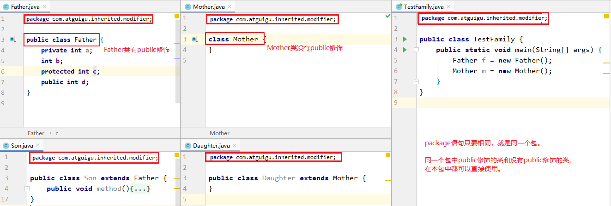
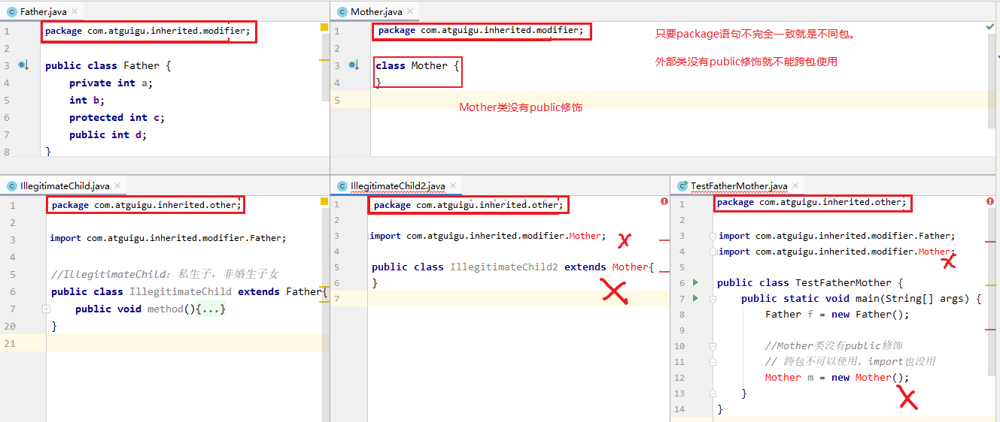
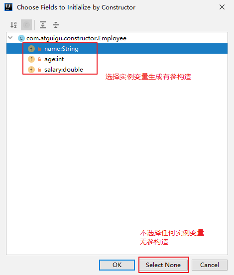

# 第6章【面向对象基础--中】

## 教学目标

* [ ] 理解封装的概念
* [ ] 掌握权限修饰符的使用
* [ ] 掌握成员变量的私有化
* [ ] 能够写出类的继承格式
* [ ] 能够说出继承的特点
* [ ] 能够说出方法重写的概念以及和重载的区别
* [ ] 能够应用多态解决问题
* [ ] 理解向上转型与向下转型
* [ ] 能够使用instanceof关键字判断对象类型
* [ ] 掌握构造器的声明与使用
* [ ] 能够使用this关键字解决问题
* [ ] 能够使用super关键字解决问题
* [ ] 了解非静态代码块的格式和执行特点
* [ ] 了解实例初始化过程
* [ ] 了解native关键字
* [ ] 掌握final关键字的使用
* [ ] 了解Object类的常用方法
* [ ] 会重写Object的常用方法
* [ ] 了解JavaBean概念

# 第6章 面向对象基础--中

## 6.1 封装

### 6.1.1 封装概述

#### 1、为什么需要封装？

* 我要用洗衣机，只需要按一下开关和洗涤模式就可以了。有必要了解洗衣机内部的结构吗？有必要碰电动机吗？
* 我们使用的电脑，内部有CPU、硬盘、键盘、鼠标等等，每一个部件通过某种连接方式一起工作，但是各个部件之间又是独立的
* 现实生活中，每一个个体与个体之间是有边界的，每一个团体与团体之间是有边界的，而同一个个体、团体内部的信息是互通的，只是对外有所隐瞒。

面向对象编程语言是对客观世界的模拟，客观世界里每一个事物的内部信息都是隐藏在对象内部的，外界无法直接操作和修改，只能通过指定的方式进行访问和修改。封装可以被认为是一个保护屏障，防止该类的代码和数据被其他类随意访问。适当的封装可以让代码更容易理解与维护，也加强了代码的安全性。

随着我们系统越来越复杂，类会越来越多，那么类之间的访问边界必须把握好，面向对象的开发原则要遵循“高内聚、低耦合”，而“高内聚，低耦合”的体现之一：

* 高内聚：类的内部数据操作细节自己完成，不允许外部干涉；
* 低耦合：仅对外暴露少量的方法用于使用

**隐藏对象内部的复杂性，只对外公开简单和可控的访问方式**，从而提高系统的可扩展性、可维护性。通俗的讲，把该隐藏的隐藏起来，该暴露的暴露出来。这就是封装性的设计思想。

#### 2、如何实现封装呢？

实现封装就是指控制类或成员的可见性范围？这就需要依赖访问控制修饰符，也称为权限修饰符来控制。

权限修饰符：public,protected,缺省,private

| 修饰符    | 本类 | 本包 | 其他包子类 | 其他包非子类 |
| --------- | ---- | ---- | ---------- | ------------ |
| private   | √    | ×    | ×          | ×            |
| 缺省      | √    | √    | ×          | ×            |
| protected | √    | √    | √          | ×            |
| public    | √    | √    | √          | √            |

外部类：public和缺省

成员变量、成员方法、构造器、成员内部类：public,protected,缺省,private

### 6.1.2 成员变量/属性私有化问题

**<span style="color:red">成员变量（field）私有化</span>之后，提供标准的<span style="color:red">get/set</span>方法，我们把这种成员变量也称为<span style="color:red">属性（property）</span>。**

> 或者可以说只要能通过get/set操作的就是事物的属性，哪怕它没有对应的成员变量。

#### 1、成员变量封装的目的

* 隐藏类的实现细节
  * 让使用者只能通过事先预定的方法来访问数据，从而可以在该方法里面加入控制逻辑，限制对成员变量的不合理访问。还可以进行数据检查，从而有利于保证对象信息的完整性。
  * 便于修改，提高代码的可维护性。主要说的是隐藏的部分，在内部修改了，如果其对外可以的访问方式不变的话，外部根本感觉不到它的修改。例如：Java8->Java9，String从char[]转为byte[]内部实现，而对外的方法不变，我们使用者根本感觉不到它内部的修改。
* 对外提供公共的访问方式

#### 2、实现步骤

1. 使用 `private` 修饰成员变量

```java
private 数据类型 变量名 ；
```

2. 提供 `getXxx`方法 / `setXxx` 方法，可以访问成员变量，代码如下：

```java
public class Person {
    private String name;
  	private int age;
    private boolean marry;

	public void setName(String n) {
		name = n;
    }

    public String getName() {
        return name;
	}

    public void setAge(int a) {
        age = a;
    }

    public int getAge() {
        return age;
    }
    
    public void setMarry(boolean m){
        marry = m;
    }
    
    public boolean isMarry(){
        return marry;
    }
}
```

3、测试

```java
package com.atguigu.encapsulation;

public class TestPerson {
    public static void main(String[] args) {
        Person p = new Person();

        //实例变量私有化，跨类是无法直接使用的
/*        p.name = "张三";
        p.age = 23;
        p.marry = true;*/

        p.setName("张三");
        System.out.println("p.name = " + p.getName());

        p.setAge(23);
        System.out.println("p.age = " + p.getAge());

        p.setMarry(true);
        System.out.println("p.marry = " + p.isMarry());
    }
}
```

### 6.1.3 this关键字

在实例方法中可以使用this关键字调用当前对象的成员。

- this：在实例方法中，表示调用该方法的对象引用  
- 可以区分成员变量和局部变量重名
- 如果没有歧义，完全可以省略this。

#### 1、存在歧义(局部变量与实例变量重名).

```java
public class Person {
    private String name;
  	private int age;
    private boolean marry;

	public void setName(String n) {
		name = n;
    }

    public String getName() {
        return name;
	}

    public void setAge(int age) {//将当前形参名改为和实例变量名一样的age
        age = age;
    }

    public int getAge() {
        return age;
    }
    
    public void setMarry(boolean m){
        marry = m;
    }
    
    public boolean isMarry(){
        return marry;
    }
}
```

测试类

```java
package com.atguigu.encapsulation;

public class TestPerson {
    public static void main(String[] args) {
        Person p = new Person();

        p.setName("张三");
        System.out.println("p.name = " + p.getName());

        p.setAge(23);
        System.out.println("p.age = " + p.getAge());//没有赋值成功

        p.setMarry(true);
        System.out.println("p.marry = " + p.isMarry());
    }
}
```

#### 2、使用this.

```java
public class Person {
    private String name;
  	private int age;
    private boolean marry;

	public void setName(String n) {
		name = n;
    }

    public String getName() {
        return name;
	}

    public void setAge(int age) {//将当前形参名改为和实例变量名一样的age
        this.age = age;
    }

    public int getAge() {
        return age;
    }
    
    public void setMarry(boolean m){
        marry = m;
    }
    
    public boolean isMarry(){
        return marry;
    }
}
```

测试类

```java
package com.atguigu.encapsulation;

public class TestPerson {
    public static void main(String[] args) {
        Person p = new Person();

        p.setName("张三");
        System.out.println("p.name = " + p.getName());

        p.setAge(23);
        System.out.println("p.age = " + p.getAge());//赋值成功

        p.setMarry(true);
        System.out.println("p.marry = " + p.isMarry());
    }
}
```

#### 3.this在构造器中的使用(同一个类中的构造器互相调用)

```tex
- this()：调用本类的无参构造
- this(实参列表)：调用本类的有参构造
- this()和this(实参列表)只能出现在构造器首行
- 不能出现递归调用
```

```java
package com.atguigu.constructor;

public class Student {
    private String name;
    private int age;

    // 无参构造
    public Student() {
//        this("",18);//调用本类有参构造
    }

    // 有参构造
    public Student(String name,int age) {
        this();//调用本类无参构造
        this.name = name;
        this.age = age;
    }

    public String getName() {
        return name;
    }
    public void setName(String name) {
        this.name = name;
    }
    public int getAge() {
        return age;
    }
    public void setAge(int age) {
        this.age = age;
    }

    public String getInfo(){
        return "姓名：" + name +"，年龄：" + age;
    }
}
```

### 6.1.4 IDEA自动生成get/set方法模板

#### 1、如何解决局部变量与实例变量同名问题

当局部变量与实例变量（非静态成员变量）同名时，在实例变量必须前面加“this.”

```java
package com.atguigu.encapsulation;

public class Employee {
    private String name;
    private int age;
    private boolean marry;

    public String getName() {
        return name;
    }

    public void setName(String name) {
        this.name = name;
    }

    public int getAge() {
        return age;
    }

    public void setAge(int age) {
        this.age = age;
    }

    public boolean isMarry() {
        return marry;
    }

    public void setMarry(boolean marry) {
        this.marry = marry;
    }
}
```

```java
package com.atguigu.encapsulation;

public class TestEmployee {
    public static void main(String[] args) {
        Employee e = new Employee();

        e.setName("张三");
        System.out.println("e.name = " + e.getName());

        e.setAge(23);
        System.out.println("e.age = " + e.getAge());

        e.setMarry(true);
        System.out.println("e.marry = " + e.isMarry());
    }
}
```

#### 2、IDEA自动生成get/set方法模板

- 大部分键盘模式按Alt + Insert键。
- 部分键盘模式需要按Alt + Insert + Fn键。
- Mac电脑快捷键需要单独设置


##### 案例:

​	使用IDEA快捷键快速创建学生类和手机类

### 6.1.5 IDEA生成构造器：Alt + Insert


- #### IDEA查看构造器和方法形参列表快捷键：Ctrl + P


### 6.1.6 给成员变量赋值的两种方式的区别

#### 	6.1.6.1 setXxx()方法

```
修改属性值	
```

####     6.1.6.2 构造器

```tex
给对象中属性进行初始化
```

#### 	案例演示

```java
学生类:

class Student {
	private String name;							//姓名
	private int age;								//年龄

	public Student(){}								//空参构造

	public Student(String name,int age) {			//有参构造
		this.name = name;
		this.age = age;
	}

	public void setName(String name) {				//设置姓名
		this.name = name;
	}

	public String getName() {						//获取姓名
		return name;
	}

	public void setAge(int age) {					//设置年龄
		this.age = age;
	}

	public int getAge() {							//获取年龄
		return age;
	}

	public void show() {
		System.out.println("我的姓名是:" + name +  ",我的年龄是:" +  age);
	}
}

```

```java
测试类:

class Demo4_Student {
	public static void main(String[] args) {
		Student s1 = new Student();					//使用空参构造
		s1.setName("张三");							//设置姓名
		s1.setAge(23);								//设置年龄
		s1.setAge(33);                              // 同个对象可以通过set方式多次赋值
		System.out.println("学生一的姓名是:" + s1.getName() + ",我的年龄是:" + s1.getAge());
        
		Student s2 = new Student("李四",24);
        System.out.println("学生二的姓名是:" + s2.getName() + ",我的年龄是:" + s2.getAge());
		
        Student s3 = new Student("王五",25);         //再次调用构造器为属性赋值时,产生新的对象
        System.out.println("学生三的姓名是:" + s3.getName() + ",我的年龄是:" + s3.getAge());
	}
}
```


## 6.2 继承

### 6.2.1 继承的概述

#### 生活中的继承

* 财产：富二代

* 样貌：如图所示：

  

  

  

* 才华：如图所示：

  

继承有延续（下一代延续上一代的基因、财富）的意思。

#### Java中的继承

如图所示：


多个类中存在相同属性和行为时，将这些内容**抽取**到单独一个类中，那么多个类中无需再定义这些属性和行为，只需要和抽取出来的类构成某种关系。如图所示：


其中，多个类可以称为**子类**，也叫**派生类**；多个类抽取出来的这个类称为**父类**、**超类（superclass）**或者**基类**。

**继承描述的是事物之间的所属关系，这种关系是：`is-a` 的关系。**例如，图中猫属于动物，狗也属于动物。可见，父类更通用或更一般，子类更具体。我们通过继承，可以使多种事物之间形成一种关系体系。

#### 继承的好处

* 提高**代码的复用性**。
* 提高**代码的维护性**。
* 表示类与类之间的is-a关系,是多态的前提

#### 继承的弊端

- 增加了类和类的耦合性
- 类与类的关联越紧密,认为耦合性越高

### 6.2.2 继承的语法格式

通过 `extends` 关键字，可以声明一个子类继承另外一个父类，定义格式如下：

```java
【修饰符】 class 父类 {
	...
}

【修饰符】 class 子类 extends 父类 {
	...
}

```

#### 1、父类

```java
package com.atguigu.inherited.grammar;

/*
 * 定义动物类Animal，做为父类
 */
public class Animal {
    // 定义name属性
    String name;
    // 定义age属性
    int age;

    // 定义动物的吃东西方法
    public void eat() {
        System.out.println(age + "岁的"
                + name + "在吃东西");
    }
}

```

#### 2、子类

```java
package com.atguigu.inherited.grammar;

/*
 * 定义猫类Cat 继承 动物类Animal
 */
public class Cat extends Animal {
    int count;//记录每只猫抓的老鼠数量

    // 定义一个猫抓老鼠的方法catchMouse
    public void catchMouse() {
        count++;
        System.out.println("抓老鼠，已经抓了"
                + count + "只老鼠");
    }
}
```

#### 3、测试类

```java
package com.atguigu.inherited.grammar;

public class TestCat {
    public static void main(String[] args) {
        // 创建一个猫类对象
        Cat cat = new Cat();
        // 为该猫类对象的name属性进行赋值
        cat.name = "Tom";
        // 为该猫类对象的age属性进行赋值
        cat.age = 2;
        // 调用该猫继承来的eat()方法
        cat.eat();
        // 调用该猫的catchMouse()方法
        cat.catchMouse();
        cat.catchMouse();
        cat.catchMouse();
    }
}
```

### 6.2.3 继承的特点

#### 1.子类会继承父类所有的"非私有"实例变量和实例方法

从类的定义来看，类是一类具有相同特性的事物的抽象描述。父类是所有子类共同特征的抽象描述。而实例变量和实例方法就是事物的特征，那么父类中声明的实例变量和实例方法代表子类事物也有这个特征。

- 当子类对象被创建时，在堆中给对象申请内存时，就要看子类和父类都声明了什么实例变量，这些实例变量都要分配内存。
- 当子类对象调用方法时，编译器会先在子类模板中看该类是否有这个方法，如果没找到，会看它的父类甚至父类的父类是否声明了这个方法，遵循从下往上找的顺序，找到了就停止，一直到根父类都没有找到，就会报编译错误。

所以**继承意味着子类的对象除了看子类的类模板还要看父类的类模板**。


#### 2.Java只支持单继承，不支持多重继承

```java
public class A{}
class B extends A{}

//一个类只能有一个父类，不可以有多个直接父类。
class C extends B{} 	//ok
class C extends A，B...	//error
```

#### 3.Java支持多层继承(继承体系)

```java
class A{}
class B extends A{}
class C extends B{}
```

> 顶层父类是Object类。所有的类默认继承Object，作为父类。

#### 4.一个父类可以同时拥有多个子类

```java
class A{}
class B extends A{}
class D extends A{}
class E extends A{}
```

### 6.2.4 IDEA中如何查看继承关系

#### 1.子类和父类是一种相对的概念

例如：B类对于A来说是子类，但是对于C类来说是父类

#### 2.查看继承关系快捷键

例如：选择A类名，按**Ctrl + H**就会显示A类的继承树。

：A类的父类和子类

：A类的父类

：A类的所有子类

例如：在类继承目录树中选中某个类，比如C类，按Ctrl+ Alt+U就会用图形化方式显示C类的继承祖宗


### 案例

定义一个继承体系

父类:一代手机,属性:品牌,价格/功能:打电话,发信息

子类:二代手机,属性:品牌,价格/功能:打电话,发信息,拍照

子类:三代手机,属性:品牌,价格/功能:打电话,发信息,拍照,玩游戏

定义后,请在测试类中测试二代三代手机的功能

```java
package com.atguigu.test;

public class Demo2 {

    /*
    案例

    定义一个继承体系
    父类:一代手机,属性:品牌,价格 / 功能:打电话,发信息
    子类:二代手机,属性:品牌,价格 / 功能:打电话,发信息,拍照
    子类:三代手机,属性:品牌,价格 / 功能:打电话,发信息,拍照,玩游戏

    定义后,请在测试类中测试二代三代手机的功能

    现象(方法的重写/覆盖)
        子父类中 ,出现了一模一样的方法
        应用场景
            需要父类的功能,但是需要对父类的功能进行覆盖(原有的功能不能满足子类的需求)


      方法的重载和方法的重写  区别
        重载:空参有参
            同一个类中     方法名相同   参数列表不同    与返回值无关
        重写:子父类功能的覆盖
            子父类中       方法名相同   参数列表相同    与返回值相同(返回值是子父类)
     */
    public static void main(String[] args) {

        Phone2 p2 = new Phone2();
        p2.call();
        p2.sendMessage();
        p2.takePhoto();

        System.out.println("-----------------------------------------------");
        Phone3 p3 = new Phone3();
        p3.call();
        p3.sendMessage();
        p3.takePhoto();
        p3.playGame();
    }


}


/*
       父类:一代手机,属性:品牌,价格 / 功能:打电话,发信息
 */
class Phone1{
    // 属性:品牌,价格
    String brand;
    double price;

    public Phone1() {
        System.out.println("-----------父----空参构造");
    }

    public Phone1(String brand, double price) {
        System.out.println("-----------父----有参构造");
        this.brand = brand;
        this.price = price;
    }

    // 功能:打电话,发信息
    public void call(){
        System.out.println("----一代手机:通话是双向收费的-");
    }

    public void sendMessage(){
        System.out.println("----一代手机:发信息只能发送文字信息-");
    }
}

/*
子类:二代手机,属性:品牌,价格 / 功能:打电话,发信息,拍照
 */
class Phone2 extends Phone1{

    public Phone2() {
        System.out.println("-----------二代----空参构造");
    }

    public Phone2(String brand, double price) {
        super(brand, price);
        System.out.println("-----------二代----有参构造");
    }

    public void takePhoto(){
        System.out.println("-------二代手机:拍照的像素------50W-");
    }

    public void call(){
        System.out.println("----二代手机:通话是单向收费的,接听免费的,打电话一分钟一毛----");
    }

    public void sendMessage(){
        System.out.println("----二代手机:发信息可以发送彩信-");
    }
}

/*
子类:三代手机,属性:品牌,价格 / 功能:打电话,发信息,拍照,玩游戏
 */
class Phone3 extends Phone2{

    public Phone3() {
        System.out.println("-----------三代----空参构造");
    }

    public Phone3(String brand, double price) {
        super(brand, price);
        System.out.println("-----------三代----有参构造");
    }

    public void playGame(){
        System.out.println("-----playGame--");
    }

    public void takePhoto(){
        System.out.println("-------三代手机:拍照的像素------4800W-");
    }

}

```


### 6.2.5 权限修饰符限制问题

权限修饰符：public,protected,缺省,private

| 修饰符    | 本类 | 本包                      | 其他包子类                  | 其他包非子类 |
| --------- | ---- | ------------------------- | --------------------------- | ------------ |
| private   | √    | ×                         | ×                           | ×            |
| 缺省      | √    | √（本包子类非子类都可见） | ×                           | ×            |
| protected | √    | √（本包子类非子类都可见） | √（其他包仅限于子类中可见） | ×            |
| public    | √    | √                         | √                           | √            |

外部类：public和缺省

成员变量、成员方法等：public,protected,缺省,private

#### 1、外部类要跨包使用必须是public，否则仅限于本包使用

（1）外部类的权限修饰符如果缺省，本包使用没问题



（2）外部类的权限修饰符如果缺省，跨包使用有问题



##### protected 关键字访问演示

```tex
子父类在同一个包,然后进行跨包访问
```

##### 父类

```java
package com.atguigu.bean;

public class Father {

    private void method1(){
        System.out.println("--------Father--private--method");
    }

    void method2(){
        System.out.println("--------Father--缺省--method2");
    }

    protected void method3(){
        System.out.println("--------Father--protected--method3");
    }

    public void method4(){
        System.out.println("--------Father----method4");
    }

}

```

##### 子类

```java
package com.atguigu.bean;

public class Son extends Father {

}
```

##### 测试类

```java
package com.atguigu.test;

import com.atguigu.Father;
import com.atguigu.Son;

public class Test {

    public static void main(String[] args) {
        Son son = new Son();
        son.method4();
        // son.method3();// 报错,不可访问 protected 跨包访问时,仅于子类中可见
    }
}


class Son2 extends Father{
    public void show(){
        method3();// 可以访问   protected 跨包访问时,仅于子类中可见
    }
}
```


#### 2、成员的权限修饰符问题

（1）本包下使用：成员的权限修饰符可以是public、protected、缺省


（2）跨包下使用：要求严格


（3）跨包使用时，如果类的权限修饰符缺省，成员权限修饰符>类的权限修饰符也没有意义


#### 3、父类成员变量私有化（private）

子类虽会继承父类私有(private)的成员变量，但子类不能对继承的私有成员变量直接进行访问，可通过继承的get/set方法进行访问。如图所示：


父类代码：

```java
package com.atguigu.inherited.modifier;

public class Person {
    private String name;
    private int age;

    public String getName() {
        return name;
    }

    public void setName(String name) {
        this.name = name;
    }

    public int getAge() {
        return age;
    }

    public void setAge(int age) {
        this.age = age;
    }

    public String getInfo(){
        return "姓名：" + name + "，年龄：" + age;
    }
}

```

子类代码：

```java
package com.atguigu.inherited.modifier;

public class Student extends Person {
    private int score;

    public int getScore() {
        return score;
    }

    public void setScore(int score) {
        this.score = score;
    }

    public String getInfo(){
//        return "姓名：" + name + "，年龄：" + age;
        //在子类中不能直接使用父类私有的name和age
        return "姓名：" + getName() + "，年龄：" + getAge();
    }
}

```

测试类代码：

```java
package com.atguigu.inherited.modifier;

public class TestStudent {
    public static void main(String[] args) {
        Student student = new Student();

        student.setName("张三");
        student.setAge(23);
        student.setScore(89);

        System.out.println(student.getInfo());
    }
}
```

IDEA在Debug模式下查看学生对象信息：


### 6.2.6 继承中子父类成员变量的关系

- #### 继承关系中,如何使用实例变量(同名变量及不同名变量)

```tex
就近原则:如果子类和父类出现了同名的成员变量,子类会优先使用子类中的同名变量。

注意:
子父类出现同名的变量只是在讲课中举例子有,在开发中是不会出现这种情况
```

```java
class Demo2 {
	public static void main(String[] args) {
		new Son().print();
	}
}
class Father {
	int num1 = 10;
	//int num2 = 30;//先演示的时候,不加此处的num2
}

class Son extends Father {
	//int num1 = 40;//先演示的时候,不加此处
	int num2 = 20;
	public void print(){
		System.out.println(num1); 
		System.out.println(num2);
	}
}
```

- #### this和super的区别和应用

  - this:代表当前函数所在对象的引用
    - this.成员变量 调用本类的成员变量,也可以调用父类的成员变量
    - this(...) 调用本类的构造方法
    - this.成员方法 调用本类的成员方法,也可以调用父类的方法
  - super:代表当前对象父类的引用
    - super.成员变量       调用父类的成员变量
    - super(...)       调用父类的构造方法
    - super.成员方法       调用父类的成员方法

- ##### 案例演示

  ```tex
  需求:
  	请在下面代码?处填写合适的内容,使得在控制台分别输出40/30/20/10
  
  class Father {
  	int num = 10;
  	int num2 = 40;
  }
  
  class Son extends Father {
  	int num = 20;
  	
  	public void print() {
  		int num = 30;
  		System.out.println(?);				
  		System.out.println(?);				
  		System.out.println(?);
  		System.out.println(?);
  	}
  }
  
  答案:
  	this.num2或super.num2// this既可以调用本类的,也可以调用父类的(本类没有的情况下)
  	num       // 就近原则,局部变量和成员变量同名,就先读取局部变量
  	this.num  // 就近原则,子类成员变量和父类成员变量同名,就先读取子类成员变量
  	super.num // super只能获取父类的成员
  	
  ```

  

### 6.2.7  继承中构造器的关系

```tex
- 子类继承父类时，不会继承父类的构造器。
	只能通过super()或super(实参列表)的方式调用父类的构造器。
- super();子类构造器中一定会调用父类的构造器，默认调用父类的无参构造，
	super();可以省略。
- super(实参列表);如果父类没有无参构造或者有无参构造但是子类就是想要调用父类的有参构造，则必须使用		 super(实参列表);
- super()和super(实参列表)都只能出现在子类构造器的首行,并且与this(...)只能出现其一
```

##### 案例演示

##### 父类:

```java
package com.atguigu.constructor;

public class Employee {
    private String name;
    private int age;
    private double salary;

    public Employee() {
        System.out.println("父类Employee无参构造");
    }

    public Employee(String name, int age, double salary) {
        this.name = name;
        this.age = age;
        this.salary = salary;
        System.out.println("父类Employee有参构造");
    }

    public String getName() {
        return name;
    }

    public void setName(String name) {
        this.name = name;
    }

    public int getAge() {
        return age;
    }

    public void setAge(int age) {
        this.age = age;
    }

    public double getSalary() {
        return salary;
    }

    public void setSalary(double salary) {
        this.salary = salary;
    }

    public String getInfo(){
        return "姓名：" + name + "，年龄：" + age +"，薪资：" + salary;
    }
}

```

##### 子类:

```java
package com.atguigu.constructor;

public class Manager extends Employee{
    private double bonusRate;

    public Manager() {
        super();//可以省略
    }

    public Manager(String name, int age, double salary, double bonusRate) {
        super(name, age, salary);//调用父类的有参构造
        this.bonusRate = bonusRate;
    }

    public double getBonusRate() {
        return bonusRate;
    }

    public void setBonusRate(double bonusRate) {
        this.bonusRate = bonusRate;
    }

    @Override
    public String getInfo() {
        return super.getInfo() +"，奖金比例：" + bonusRate;
    }
}

```

##### 测试类

```java
package com.atguigu.constructor;

public class TestEmployee {
    public static void main(String[] args) {
        Manager m1 = new Manager();
        System.out.println(m1.getInfo());

        Manager m2 = new Manager("张三",23,20000,0.1);
        System.out.println(m2.getInfo());
    }
}
```

形式一：

```java
class A{

}
class B extends A{

}

class Test{
    public static void main(String[] args){
        B b = new B();
        //A类和B类都是默认有一个无参构造，B类的默认无参构造中还会默认调用A类的默认无参构造
        //但是因为都是默认的，没有打印语句，看不出来
    }
}
```

形式二：

```java
class A{
	A(){
		System.out.println("A类无参构造器");
	}
}
class B extends A{

}
class Test{
    public static void main(String[] args){
        B b = new B();
        //A类显示声明一个无参构造，
		//B类默认有一个无参构造，
		//B类的默认无参构造中会默认调用A类的无参构造
        //可以看到会输出“A类无参构造器"
    }
}
```

形式三：

```java
class A{
	A(){
		System.out.println("A类无参构造器");
	}
}
class B extends A{
	B(){
		System.out.println("B类无参构造器");
	}
}
class Test{
    public static void main(String[] args){
        B b = new B();
        //A类显示声明一个无参构造，
		//B类显示声明一个无参构造，        
		//B类的无参构造中虽然没有写super()，但是仍然会默认调用A类的无参构造
        //可以看到会输出“A类无参构造器"和"B类无参构造器")
    }
}
```

形式四：

```java
class A{
	A(){
		System.out.println("A类无参构造器");
	}
}
class B extends A{
	B(){
        super();
		System.out.println("B类无参构造器");
	}
}
class Test{
    public static void main(String[] args){
        B b = new B();
        //A类显示声明一个无参构造，
		//B类显示声明一个无参构造，        
		//B类的无参构造中明确写了super()，表示调用A类的无参构造
        //可以看到会输出“A类无参构造器"和"B类无参构造器")
    }
}
```

形式五：

```java
class A{
	A(int a){
		System.out.println("A类有参构造器");
	}
}
class B extends A{
	B(){
		System.out.println("B类无参构造器");
	}
}
class Test05{
    public static void main(String[] args){
        B b = new B();
        //A类显示声明一个有参构造，没有写无参构造，那么A类就没有无参构造了
		//B类显示声明一个无参构造，        
		//B类的无参构造没有写super(...)，表示默认调用A类的无参构造
        //编译报错，因为A类没有无参构造
    }
}
```


形式六：

```java
class A{
	A(int a){
		System.out.println("A类有参构造器");
	}
}
class B extends A{
	B(){
		super();
		System.out.println("B类无参构造器");
	}
}
class Test06{
    public static void main(String[] args){
        B b = new B();
        //A类显示声明一个有参构造，没有写无参构造，那么A类就没有无参构造了
		//B类显示声明一个无参构造，        
		//B类的无参构造明确写super()，表示调用A类的无参构造
        //编译报错，因为A类没有无参构造
    }
}
```


形式七：

```java
class A{
	A(int a){
		System.out.println("A类有参构造器");
	}
}
class B extends A{
	B(int a){
		super(a);
		System.out.println("B类有参构造器");
	}
}
class Test07{
    public static void main(String[] args){
        B b = new B(10);
        //A类显示声明一个有参构造，没有写无参构造，那么A类就没有无参构造了
		//B类显示声明一个有参构造，        
		//B类的有参构造明确写super(a)，表示调用A类的有参构造
        //会打印“A类有参构造器"和"B类有参构造器"
    }
}
```

形式八：

```java
class A{
    A(){
        System.out.println("A类无参构造器");
    }
	A(int a){
		System.out.println("A类有参构造器");
	}
}
class B extends A{
    B（）{
        super();//可以省略，调用父类的无参构造
        System.out.println("B类无参构造器");
    }
	B(int a){
		super(a);//调用父类有参构造
		System.out.println("B类有参构造器");
	}
}
class Test8{
    public static void main(String[] args){
        B b1 = new B();
        B b2 = new B(10);
    }
}
```

### 6.2.8 继承中成员方法的关系

```java
- 不同名的方法:直接调用父类的就可以
- 同名的方法:称为方法的重写,用子类对象直接调用的是子类已经重写的方法    
- 要想调用父类的方法,可以在子类重写的方法中添加super();）
```

- ### 方法重写（Override）

我们说父类的所有方法子类都会继承，但是当某个方法被继承到子类之后，子类觉得父类原来的实现不适合于子类，该怎么办呢？我们可以进行方法重写 (Override)

#### 1、方法重写

比如新的手机增加来电显示头像的功能，代码如下：

```java
package com.atguigu.inherited.method;

public class Phone {
    public void sendMessage(){
        System.out.println("发短信");
    }
    public void call(){
        System.out.println("打电话");
    }
    public void showNum(){
        System.out.println("来电显示号码");
    }
}

```

```java
package com.atguigu.inherited.method;

//smartphone：智能手机
public class Smartphone extends Phone{
    //重写父类的来电显示功能的方法
    public void showNum(){
        //智能手机的显示功能进行了升级:增加了来电显示姓名和图片功能
        System.out.println("来电显示号码");
        System.out.println("显示来电姓名");
        System.out.println("显示头像");
    }
}
```

```java
package com.atguigu.inherited.method;

public class TestOverride {
    public static void main(String[] args) {
        // 创建子类对象
        Smartphone sp = new Smartphone();

        // 调用父类继承而来的方法
        sp.call();

        // 调用子类重写的方法
        sp.showNum();
    }
}
```

#### 2、在子类中如何调用父类被重写的方法

```java
package com.atguigu.inherited.method;

//smartphone：智能手机
public class Smartphone extends Phone{
    //重写父类的来电显示功能的方法
    public void showNum(){
        //保留父类来电显示号码的功能
        super.showNum();//此处必须加super.，否则就是就近原则调用的本类showNum(),形成无限递归，最终栈内存溢出
        
        //来电显示姓名和图片功能
        System.out.println("显示来电姓名");
        System.out.println("显示头像");
     
    }
}
```

#### 3、IDEA重写方法快捷键：Ctrl + O


```java
package com.atguigu.inherited.method;

//smartphone：智能手机
public class Smartphone extends Phone{
    //重写父类的来电显示功能的方法
    public void showNum(){
        //来电显示姓名和图片功能
        System.out.println("显示来电姓名");
        System.out.println("显示头像");

        //保留父类来电显示号码的功能
        super.showNum();//此处必须加super.，否则就是无限递归，那么就会栈内存溢出
    }

    @Override
    public void call() {
        super.call();
        System.out.println("视频通话");
    }
}
```

> @Override：写在方法上面，用来检测是不是满足重写方法的要求。这个注解就算不写，只要满足要求，也是正确的方法覆盖重写。建议保留，这样编译器可以帮助我们检查格式，另外也可以让阅读源代码的程序员清晰的知道这是一个重写的方法。

#### 4、重写方法的要求

1.必须保证父子类之间重写方法的名称相同。

2.必须保证父子类之间重写方法的参数列表也完全相同。

2.子类方法的返回值类型必须【小于等于】父类方法的返回值类型（小于其实就是是它的子类，例如：Student < Person）。

> 注意：如果返回值类型是基本数据类型和void，那么必须是相同

3.子类方法的权限必须【大于等于】父类方法的权限修饰符。

> 注意：public > protected > 缺省 > private
>
> 父类私有方法不能重写
>
> 跨包的父类缺省的方法也不能重写


#### 5、方法的重载和方法的重写

方法的重载：方法名相同，形参列表不同。不看返回值类型。

方法的重写：见上面。

（1）同一个类中

```java
package com.atguigu.inherited.method;

public class TestOverload {
    public int max(int a, int b){
        return a > b ? a : b;
    }
    public double max(double a, double b){
        return a > b ? a : b;
    }
    public int max(int a, int b,int c){
        return max(max(a,b),c);
    }
}
```

（2）父子类中

```java
package com.atguigu.inherited.method;

public class TestOverloadOverride {
    public static void main(String[] args) {
        Son s = new Son();
        s.method(1);//只有一个形式的method方法

        Daughter d = new Daughter();
        d.method(1);
        d.method(1,2);//有两个形式的method方法
    }
}

class Father{
    public void method(int i){
        System.out.println("Father.method");
    }
}
class Son extends Father{
    public void method(int i){//重写
        System.out.println("Son.method");
    }
}
class Daughter extends Father{
    public void method(int i,int j){//重载
        System.out.println("Daughter.method");
    }
}
```

## 6.3 多态

```tex
多态
	事物存在的多种形态 
	
是继封装、继承之后，面向对象的第三大特性。

生活中，比如求面积的功能，圆、矩形、三角形实现起来是不一样的。跑的动作，小猫、小狗和大象，跑起来是不一样的。再比如飞的动作，昆虫、鸟类和飞机，飞起来也是不一样的。可见，同一行为，通过不同的事物，可以体现出来的不同的形态。那么此时就会出现各种子类的类型。

多态前提
* 要有继承关系。
* 要有方法重写。
* 要有父类引用指向子类对象。
```

### 6.3.1 多态解决什么样的问题

有的时候，我们在设计一个数组、或一个成员变量、或一个方法的形参、返回值类型时，无法确定它具体的类型，只能确定它是某个系列的类型。

```tex
需求:使用Java语言模拟以下场景
学校附近来了一个马戏团(Circus),热闹非凡,刚才给附近的居民发了表演节目单,
节目单有两个表演的节目: 
1.表演(老虎钻火圈)
	提示:真正表演的是老虎,老虎作为参数,调用老虎自己表演的功能
2.表演(小熊骑单车)
	提示:真正表演的是小熊,小熊作为参数,调用小熊自己表演的功能
```

##### 代码实现:

##### 	马戏团类

```java
// 马戏团类  行为 老虎表演  小熊表演
class Circus {
	//老虎表演  钻火圈
	public void perform(Tiger t){
		t.perform();
	}
	//小熊表演  骑单车
	public void perform(Bear b){
		b.perform();
	}
}
```

##### 父类:马戏团动物类

```java
// 马戏团动物类CircusAnimal    行为:  表演perform
class CircusAnimal{
	public void perform(){
		System.out.println("动物表演");
	}
}
```

##### 子类:马戏团里的老虎,小熊等

```java
//老虎类  行为  老虎表演钻火圈
class Tiger extends CircusAnimal {
	//具备父类的功能 但是功能进行重写 覆盖
	public void perform(){
		System.out.println("老虎表演钻火圈");
	}
}

//小熊类  行为  小熊表演骑单车
class  Bear extends CircusAnimal {
	public void perform(){
		System.out.println("小熊表演骑单车");
	}
}
```

#### 测试类

```java
class Demo1 {
	public static void main(String[] args) {
		//创建对象  使用对象
		Circus c = new Circus();
		c.perform(new Tiger());//老虎表演节目
		c.perform(new Bear());//小熊表演节目
	}
}
```

```java
新增需求:
马戏团之前的节目,附近居民都看过了,吸引力不足,团长又新增节目单
1.小猫表演吃鱼
2.小狗表演逗猫
```

```java
//马戏团新增节目单   小猫表演  小狗表演
class Circus {
    
	// 新增节目单...
	//小猫表演  吃鱼
	public void perform(Cat c){
		c.perform();
	}
	//小狗表演  逗猫
	public void perform(Dog d){
		d.perform();
	}
}
```


```java
class Cat extends CircusAnimal {
	public void perform(){
		System.out.println("小猫表演吃鱼");
	}
}

class Dog extends CircusAnimal {
	public void perform(){
		System.out.println("小狗表演逗猫");
	}
}

```

##### 测试类

```java
class Demo1 {
	public static void main(String[] args) {
		//创建对象  使用对象
		Circus c = new Circus();
		c.perform(new Tiger());//老虎表演节目
		c.perform(new Bear());//小熊表演节目
		c.perform(new Cat());//小猫表演节目
		c.perform(new Dog());//小狗表演节目

	}
}
```

```tex
新增需求:
马戏团又要新增节目单:
小蛇,小松鼠,小狐狸......

按照之前的定义方式,每新增一个节目单,Circus类就会对应新增一个表演功能

现在对其进行优化
	- 利用多态,将Circus类中的所有的perform()优化为一个方法
		参数定义为这些表演动物的父类类型CircusAnimal
		这样,不管有多少个动物表演的节目单,最终都是只需要一个表演方法均适应
	- 其他代码不变,仍能完成既定功能
```

```java
// 马戏团类  
class Circus {
	//老虎表演  过山车
	/*public void perform(Tiger t){
		t.perform();
	}
	//小熊表演  钻火圈
	public void perform(Bear b){
		b.perform();
	}
	//小猫表演  吃鱼
	public void perform(Cat c){
		c.perform();
	}
	//小狗表演  逗猫
	public void perform(Dog d){
		d.perform();
	}*/

	//要使用继承体系最基本的共性的功能时  使用父类
	//多态的三个前提 1.要有继承关系  2.要有方法重写  3.父类引用指向子类对象
	public void perform(CircusAnimal  ca){
		//当实际参数给形式参数赋值时相当于
		//CircusAnimal  ca = new Tiger();   多态
		ca.perform();
	}
}
```

（1）声明一个Dog类，包含public void eat()方法，输出“狗狗啃骨头”

（2）声明一个Cat类，包含public void eat()方法，输出“猫咪吃鱼仔”

（3）声明一个Person类，

- 包含宠物属性
- 包含领养宠物方法 public void adopt(宠物类型 pet)
- 包含喂宠物吃东西的方法 public void feed()，实现为调用宠物对象.eat()方法

### 6.3.2 多态的形式和体现

#### 1、多态引用

Java规定父类类型的变量可以接收子类类型的对象，这一点从逻辑上也是说得通的。

```java
父类类型 变量名 = 子类对象；
```

> 父类类型：指子类继承的父类类型，或者实现的父接口类型。
>
> 所以说继承是多态的前提

#### 2、多态引用的表现

表现：编译时类型与运行时类型不一致，编译时看“父类”，运行时看“子类”。

#### 3、多态引用的好处和弊端

```tex
多态的好处
		1> 提高代码的复用性
		2> 提高了代码的扩展性
		3> 可以当作形式参数,可以接收任意子类对象
		
多态的弊端	
		不能访问子类特有的成员(成员变量和成员的方法)
```


弊端：编译时，只能调用父类声明的方法，不能调用子类扩展的方法；

好处：运行时，看“子类”，如果子类重写了方法，一定是执行子类重写的方法体；变量引用的子类对象不同，执行的方法就不同，实现动态绑定。代码编写更灵活、功能更强大，可维护性和扩展性更好了。

#### 4、多态演示

让Dog和Cat都继承Pet宠物类。

```java
package com.atguigu.polymorphism.grammar;

public class Pet {
    private String nickname;

    public String getNickname() {
        return nickname;
    }

    public void setNickname(String nickname) {
        this.nickname = nickname;
    }

    public void eat(){
        System.out.println(nickname + "吃东西");
    }
}
```

```java
package com.atguigu.polymorphism.grammar;

public class Cat extends Pet {
    //子类重写父类的方法
    @Override
    public void eat() {
        System.out.println("猫咪" + getNickname() + "吃鱼仔");
    }

    //子类扩展的方法
    public void catchMouse() {
        System.out.println("抓老鼠");
    }
}
```

```java
package com.atguigu.polymorphism.grammar;

public class Dog extends Pet {
    //子类重写父类的方法
    @Override
    public void eat() {
        System.out.println("狗狗" + getNickname() + "啃骨头");
    }

    //子类扩展的方法
    public void watchHouse() {
        System.out.println("看家");
    }
}
```

```java
package com.atguigu.polymorphism.grammar;

public class TestPet {
    public static void main(String[] args) {
        //多态引用
        Pet pet = new Dog();
        pet.setNickname("小白");

        //多态的表现形式
        /*
        编译时看父类：只能调用父类声明的方法，不能调用子类扩展的方法；
        运行时，看“子类”，如果子类重写了方法，一定是执行子类重写的方法体；
         */
        pet.eat();//运行时执行子类Dog重写的方法
//        pet.watchHouse();//不能调用Dog子类扩展的方法

        pet = new Cat();
        pet.setNickname("雪球");
        pet.eat();//运行时执行子类Cat重写的方法
    }
}
```

### 6.3.3 应用多态解决问题

#### 1、声明变量是父类类型，变量赋值子类对象

- 方法的形参是父类类型，调用方法的实参是子类对象
- 实例变量声明父类类型，实际存储的是子类对象

```java
package com.atguigu.polymorphism.grammar;

public class OnePersonOnePet {
    private Pet pet;
    public void adopt(Pet pet) {//形参是父类类型，实参是子类对象
        this.pet = pet;
    }
    public void feed(){
        pet.eat();//pet实际引用的对象类型不同，执行的eat方法也不同
    }
}
```

```java
package com.atguigu.polymorphism.grammar;

public class TestOnePersonOnePet {
    public static void main(String[] args) {
        OnePersonOnePet person = new OnePersonOnePet();

        Dog dog = new Dog();
        dog.setNickname("小白");
        person.adopt(dog);//实参是dog子类对象，形参是父类Pet类型
        person.feed();

        Cat cat = new Cat();
        cat.setNickname("雪球");
        person.adopt(cat);//实参是cat子类对象，形参是父类Pet类型
        person.feed();
    }
}
```

#### 2、数组元素是父类类型，元素对象是子类对象

```java
package com.atguigu.polymorphism.grammar;

public class OnePersonManyPets {
    private Pet[] pets;//数组元素类型是父类类型，元素存储的是子类对象

    public void adopt(Pet[] pets) {
        this.pets = pets;
    }

    public void feed() {
        for (int i = 0; i < pets.length; i++) {
            pets[i].eat();//pets[i]实际引用的对象类型不同，执行的eat方法也不同
        }
    }
}
```

```java
package com.atguigu.polymorphism.grammar;

public class TestPets {
    public static void main(String[] args) {
        Pet[] pets = new Pet[2];
        pets[0] = new Dog();//多态引用
        pets[0].setNickname("小白");
        pets[1] = new Cat();//多态引用
        pets[1].setNickname("雪球");

        OnePersonManyPets person = new OnePersonManyPets();
        person.adopt(pets);
        person.feed();
    }
}
```

#### 3、方法返回值类型声明为父类类型，实际返回的是子类对象

```java
package com.atguigu.polymorphism.grammar;

public class PetShop {
    //返回值类型是父类类型，实际返回的是子类对象
    public Pet sale(String type){
        switch (type){
            case "Dog":
                return new Dog();
            case "Cat":
                return new Cat();
        }
        return null;
    }
}
```

```java
package com.atguigu.polymorphism.grammar;

public class TestPetShop {
    public static void main(String[] args) {
        PetShop shop = new PetShop();

        Pet dog = shop.sale("Dog");
        dog.setNickname("小白");
        dog.eat();

        Pet cat = shop.sale("Cat");
        cat.setNickname("雪球");
        cat.eat();
    }
}
```

### 6.3.4 向上转型与向下转型

首先，一个对象在new的时候创建是哪个类型的对象，它从头至尾都不会变。即这个对象的运行时类型，本质的类型用于不会变。但是，把这个对象赋值给不同类型的变量时，这些变量的编译时类型却不同。

这个和基本数据类型的转换是不同的。基本数据类型是把数据值copy了一份，相当于有两种数据类型的值。而对象的赋值不会产生两个对象。

#### 1、为什么要类型转换呢？

因为多态，就一定会有把子类对象赋值给父类变量的时候，这个时候，<font color="red">**在编译期间**</font>，就会出现类型转换的现象。

但是，使用父类变量接收了子类对象之后，我们就**不能调用**子类拥有，而父类没有的方法了。这也是多态给我们带来的一点"小麻烦"。所以，想要调用子类特有的方法，必须做类型转换，使得<font color='red'>**编译通过**</font>。

* **向上转型**：当左边的变量的类型（父类） > 右边对象/变量的类型（子类），我们就称为向上转型
  * 此时，编译时按照左边变量的类型处理，就只能调用父类中有的变量和方法，不能调用子类特有的变量和方法了
  * 但是，**运行时，仍然是对象本身的类型**，所以执行的方法是子类重写的方法体。
  * 此时，一定是安全的，而且也是自动完成的

* **向下转型**：当左边的变量的类型（子类）<右边对象/变量的编译时类型（父类），我们就称为向下转型
  * 此时，编译时按照左边变量的类型处理，就可以调用子类特有的变量和方法了
  * 但是，**运行时，仍然是对象本身的类型**
  * 不是所有通过编译的向下转型都是正确的，可能会发生ClassCastException，为了安全，可以通过isInstanceof关键字进行判断


#### 2、如何向上转型与向下转型

向上转型：自动完成

向下转型：（子类类型）父类变量

```java
package com.atguigu.polymorphism.grammar;

public class ClassCastTest {
    public static void main(String[] args) {
        //没有类型转换
        Dog dog = new Dog();//dog的编译时类型和运行时类型都是Dog

        //向上转型
        Pet pet = new Dog();//pet的编译时类型是Pet，运行时类型是Dog
        pet.setNickname("小白");
        pet.eat();//可以调用父类Pet有声明的方法eat，但执行的是子类重写的eat方法体
//        pet.watchHouse();//不能调用父类没有的方法watchHouse

        Dog d = (Dog) pet;
        System.out.println("d.nickname = " + d.getNickname());
        d.eat();//可以调用eat方法
        d.watchHouse();//可以调用子类扩展的方法watchHouse

        Cat c = (Cat) pet;//编译通过，因为从语法检查来说，pet的编译时类型是Pet，Cat是Pet的子类，所以向下转型语法正确
        //这句代码运行报错ClassCastException，因为pet变量的运行时类型是Dog，Dog和Cat之间是没有继承关系的
    }
}
```

#### 3、instanceof关键字

为了避免ClassCastException的发生，Java提供了 `instanceof` 关键字，给引用变量做类型的校验，只要用instanceof判断返回true的，那么强转为该类型就一定是安全的，不会报ClassCastException异常。

```
变量/匿名对象 instanceof 数据类型 
```

那么，哪些instanceof判断会返回true呢？

- 变量/匿名对象的编译时类型 与  instanceof后面数据类型是直系亲属关系才可以比较
- 变量/匿名对象的运行时类型<= instanceof后面数据类型，才为true

示例代码：

```java
package com.atguigu.polymorphism.grammar;

public class TestInstanceof {
    public static void main(String[] args) {
        Pet[] pets = new Pet[2];
        pets[0] = new Dog();//多态引用
        pets[0].setNickname("小白");
        pets[1] = new Cat();//多态引用
        pets[1].setNickname("雪球");

        for (int i = 0; i < pets.length; i++) {
            pets[i].eat();

            if(pets[i] instanceof Dog){
                Dog dog = (Dog) pets[i];
                dog.watchHouse();
            }else if(pets[i] instanceof Cat){
                Cat cat = (Cat) pets[i];
                cat.catchMouse();
            }
        }
    }
}
```

### 6.3.5 虚方法

在Java中虚方法是指在编译阶段和类加载阶段都不能确定方法的调用入口地址，在运行阶段才能确定的方法，即可能被重写的方法。

当我们通过“对象xx.方法”的形式调用一个虚方法时，要如何确定它具体执行哪个方法呢？

（1）静态分派：先看这个对象xx的编译时类型，在这个对象的编译时类型中找到能匹配的方法

```
匹配的原则：看实参的编译时类型与方法形参的类型的匹配程度
A：找最匹配    实参的编译时类型 = 方法形参的类型
B：找兼容      实参的编译时类型 < 方法形参的类型
```

（2）动态绑定：再看这个对象xx的运行时类型，如果这个对象xx的运行时类重写了刚刚找到的那个匹配的方法，那么执行重写的，否则仍然执行刚才编译时类型中的那个匹配的方法

```java
class MyClass{
    public void method(Father f) {
        System.out.println("fu-----father");
    }
    public void method(Son s) {
        System.out.println("fu-----son");
    }
}
class MySub extends MyClass{
    public void method(Father d) {
        System.out.println("sub--father");
    }
    public void method(Daughter d) {
        System.out.println("sub--daughter");
    }
}
class Father{

}
class Son extends Father{

}
class Daughter extends Father{

}

```

```java
public class TestVirtualMethod {
    public static void main(String[] args) {
        MyClass my = new MySub();
        Father f = new Father();
        Son s = new Son();
        Daughter d = new Daughter();
        my.method(f);//sub--father
        my.method(s);//fu-----son
        my.method(d);//sub--father
        
    }
}
```

### 6.3.6 成员变量没有多态一说

```java
package com.atguigu.polymorphism.grammar;

public class TestVariable {
    public static void main(String[] args) {
        Base b = new Sub();
        System.out.println(b.a);
        System.out.println(((Sub)b).a);

        Sub s = new Sub();
        System.out.println(s.a);
        System.out.println(((Base)s).a);
    }
}
class Base{
    int a = 1;
}
class Sub extends Base{
    int a = 2;
}
```


#### 、IDEA生成构造器：Alt + Insert





#### 6、IDEA查看构造器和方法形参列表快捷键：Ctrl + P


## 6.5 关键字和API

### 6.5.1 this和super关键字

#### 1.this和super的意义

this：当前对象

- 在构造器和非静态代码块中，表示正在new的对象
- 在实例方法中，表示调用当前方法的对象

super：引用父类声明的成员

无论是this和super都是和对象有关的。

#### 2.this和super的使用格式

- this
  - this.成员变量：表示当前对象的某个成员变量，而不是局部变量
  - this.成员方法：表示当前对象的某个成员方法，完全可以省略this.
  - this()或this(实参列表)：调用另一个构造器协助当前对象的实例化，只能在构造器首行，只会找本类的构造器，找不到就报错
- super
  - super.成员变量：表示当前对象的某个成员变量，该成员变量在父类中声明的
  - super.成员方法：表示当前对象的某个成员方法，该成员方法在父类中声明的
  - super()或super(实参列表)：调用父类的构造器协助当前对象的实例化，只能在构造器首行，只会找直接父类的对应构造器，找不到就报错

#### 3.避免子类和父类声明重名的成员变量

**<font color='red'>特别说明：定义时不推荐子类声明和父类重名的成员变量</font>**

因为，子类会继承父类所有的成员变量，所以：

- 如果重名的成员变量表示相同的意义，就无需重复声明

- 如果重名的成员变量表示不同的意义，会引起歧义

在阿里的开发规范等文档中都做出明确说明：


#### 4.解决成员变量重名问题

- 如果实例变量与局部变量重名，可以在实例变量前面加this.进行区别
- 如果子类实例变量和父类实例变量重名，并且父类的该实例变量在子类仍然可见，在子类中要访问父类声明的实例变量需要在父类实例变量前加super.，否则默认访问的是子类自己声明的实例变量
- 如果父子类实例变量没有重名，只要权限修饰符允许，在子类中完全可以直接访问父类中声明的实例变量，也可以用this.实例访问，也可以用super.实例变量访问

```java
class Father{
	int a = 10;
	int b = 11;
}
class Son extends Father{
	int a = 20;
    
    public void test(){
		//子类与父类的属性同名，子类对象中就有两个a
		System.out.println("子类的a：" + a);//20  先找局部变量找，没有再从本类成员变量找
        System.out.println("子类的a：" + this.a);//20   先从本类成员变量找
        System.out.println("父类的a：" + super.a);//10    直接从父类成员变量找
		
		//子类与父类的属性不同名，是同一个b
		System.out.println("b = " + b);//11  先找局部变量找，没有再从本类成员变量找，没有再从父类找
		System.out.println("b = " + this.b);//11   先从本类成员变量找，没有再从父类找
		System.out.println("b = " + super.b);//11  直接从父类局部变量找
	}
	
	public void method(int a, int b){
		//子类与父类的属性同名，子类对象中就有两个成员变量a，此时方法中还有一个局部变量a		
		System.out.println("局部变量的a：" + a);//30  先找局部变量
        System.out.println("子类的a：" + this.a);//20  先从本类成员变量找
        System.out.println("父类的a：" + super.a);//10  直接从父类成员变量找

        System.out.println("b = " + b);//13  先找局部变量
		System.out.println("b = " + this.b);//11  先从本类成员变量找
		System.out.println("b = " + super.b);//11  直接从父类局部变量找
    }
}
class Test{
    public static void main(String[] args){
        Son son = new Son();
		son.test();
		son.method(30,13);  
    }
}
```

总结：起点不同（就近原则）**(前提:权限修饰符允许在子类中访问)**

* **变量前面没有super.和this.**
  * 在构造器、代码块、方法中如果出现使用某个变量，先查看是否是当前块声明的局部变量，
  * 如果不是局部变量，先从当前执行代码的本类去找成员变量
  * 如果从当前执行代码的本类中没有找到，会往上找父类声明的成员变量

* **变量前面有this.** 
  * 通过this找成员变量时，先从当前执行代码的本类去找成员变量
  * 如果从当前执行代码的本类中没有找到，会往上找父类声明的成员变量

* **变量前面super.** 
  * 通过super找成员变量，直接从当前执行代码的直接父类去找成员变量
  * 如果直接父类没有，就去父类的父类中找

#### 5.解决成员方法重写后调用问题

- 如果子类没有重写父类的方法，只有权限修饰符运行，在子类中完全可以直接调用父类的方法；
- 如果子类重写了父类的方法，在子类中需要通过super.才能调用父类被重写的方法，否则默认调用的子类重写的方法

```java
public class Test{
    public static void main(String[] args){
    	Son s = new Son();
    	s.test();
    	
    	Daughter d = new Daughter();
    	d.test();
    }
}
class Father{
	protected int num = 10;
	public int getNum(){
		return num;
	}
}
class Son extends Father{
	private int num = 20;
    
	public void test(){
		System.out.println(getNum());//10  本类没有找父类，执行父类中的getNum()
		System.out.println(this.getNum());//10  本类没有找父类，执行父类中的getNum()
		System.out.println(super.getNum());//10  本类没有找父类，执行父类中的getNum()
	}
}
class Daughter extends Father{
	private int num = 20;
    
    @Override
	public int getNum(){
		return num;
	}
    
	public void test(){
		System.out.println(getNum());//20  先找本类，执行本类的getNum()
		System.out.println(this.getNum());//20  先找本类，执行本类的getNum()
		System.out.println(super.getNum());//10  直接找父类，执行父类中的getNum()
	}
}
```

总结：

* **方法前面没有super.和this.**
  * 先从子类找匹配方法，如果没有，再从直接父类找，再没有，继续往上追溯

* **方法前面有this.**
  * 先从子类找匹配方法，如果没有，再从直接父类找，再没有，继续往上追溯

* **方法前面有super.**
  * 从当前子类的直接父类找，如果没有，继续往上追溯

### 6.5.2 native关键字(了解)

#### 1.native的意义

native：本地的，原生的

#### 2.native的语法

native只能修饰方法，表示这个方法的方法体代码不是用Java语言实现的，而是由C/C++语言编写的。但是对于Java程序员来说，可以当做Java的方法一样去正常调用它，或者子类重写它。

JVM内存的管理：


| 区域名称   | 作用                                                         |
| ---------- | ------------------------------------------------------------ |
| 程序计数器 | 程序计数器是CPU中的寄存器，它包含每一个线程下一条要执行的指令的地址 |
| 本地方法栈 | 当程序中调用了native的本地方法时，本地方法执行期间的内存区域 |
| 方法区     | 存储已被虚拟机加载的类信息、常量、静态变量、即时编译器编译后的代码等数据。 |
| 堆内存     | 存储对象（包括数组对象），new来创建的，都存储在堆内存。      |
| 虚拟机栈   | 用于存储正在执行的每个Java方法的局部变量表等。局部变量表存放了编译期可知长度的各种基本数据类型、对象引用，方法执行完，自动释放。 |

### 6.5.3 final关键字

#### 1.final的意义

final：最终的，不可更改的

#### 2.final修饰类

表示这个类不能被继承，没有子类

```java
final class Eunuch{//太监类
	
}
class Son extends Eunuch{//错误
	
}
```

#### 3.final修饰方法

表示这个方法不能被子类重写

```java
class Father{
	public final void method(){
		System.out.println("father");
	}
}
class Son extends Father{
	public void method(){//错误
		System.out.println("son");
	}
}
```

#### 4.final修饰变量

final修饰某个变量（成员变量或局部变量），表示它的值就不能被修改，即常量，常量名建议使用大写字母。

> 如果某个成员变量用final修饰后，没有set方法，并且必须初始化（可以显式赋值、或在初始化块赋值、实例变量还可以在构造器中赋值）

```java
package com.atguigu.keyword.finals;

public class TestFinal {
    public static void main(String[] args){
        final int MIN_SCORE = 0;
        final int MAX_SCORE = 100;

        MyDate m1 = new MyDate();
        System.out.println(m1.getInfo());

        MyDate m2 = new MyDate(2022,2,14);
        System.out.println(m2.getInfo());
    }
}
class MyDate{
    //没有set方法,必须有显示赋值的代码
    private final int year;
    private final int month;
    private final int day;

    public MyDate(){
        year = 1970;
        month = 1;
        day = 1;
    }

    public MyDate(int year, int month, int day) {
        this.year = year;
        this.month = month;
        this.day = day;
    }

    public int getYear() {
        return year;
    }

    public int getMonth() {
        return month;
    }

    public int getDay() {
        return day;
    }

    public String getInfo(){
        return year + "年" + month + "月" + day + "日";
    }
}
```

### API概述

### 6.5.4 什么是API

​	API (**A**pplication **P**rogramming **I**nterface) ：应用程序编程接口


/%E9%99%88%E5%8F%B6%E8%80%81%E5%B8%88%E5%85%B1%E4%BA%AB%E6%96%87%E4%BB%B6%E5%A4%B9/day14/note/%E5%B0%9A%E7%A1%85%E8%B0%B7-%E9%99%88%E5%8F%B6-JavaSE-%E7%AC%AC9%E7%AB%A0%E3%80%90%E5%9F%BA%E7%A1%80API%E4%B8%8E%E5%B8%B8%E8%A7%81%E7%AE%97%E6%B3%95%E3%80%91.assets/1662215036095.png)

- Java中的API

  ```tex
  指的就是 JDK 中提供的各种功能的 Java类，这些类将底层的实现封装了起来，我们不需要关心这些类是如何实现的，只需要学习这些类如何使用即可，我们可以通过帮助文档来学习这些API如何使用。
  
  注意:
  	API与API帮助文档不是一同事
  ```


### 6.5.5 Object根父类

#### 1.如何理解根父类

类 `java.lang.Object`是类层次结构的根类，即所有类的父类。每个类都使用 `Object` 作为超类。

* Object类型的变量与除Object以外的任意引用数据类型的对象都多态引用
* 所有对象（包括数组）都实现这个类的方法。
* 如果一个类没有特别指定父类，那么默认则继承自Object类。例如：


```java
public class MyClass /*extends Object*/ {
  	// ...
}
```

#### 2.Object类的其中5个方法

​	**API(Application Programming Interface)**，应用程序编程接口。Java API是一本程序员的`字典` ，是JDK中提供给我们使用的类的说明文档。所以我们可以通过查询API的方式，来学习Java提供的类，并得知如何使用它们。在API文档中是无法得知这些类具体是如何实现的，如果要查看具体实现代码，那么我们需要查看**src源码**。

​	根据JDK源代码及Object类的API文档，Object类当中包含的方法有11个。今天我们主要学习其中的5个：

##### （1）toString()

方法签名：public String toString()

①默认情况下，toString()返回的是“对象的运行时类型 @ 对象的hashCode值的十六进制形式"

②通常是建议重写

③如果我们直接System.out.println(对象)，默认会自动调用这个对象的toString()

> 因为Java的引用数据类型的变量中存储的实际上时对象的内存地址，但是Java对程序员隐藏内存地址信息，所以不能直接将内存地址显示出来，所以当你打印对象时，JVM帮你调用了对象的toString()。

例如自定义的Person类：

```java
public class Person {  
    private String name;
    private int age;

    @Override
    public String toString() {
        return "Person{" + "name='" + name + '\'' + ", age=" + age + '}';
    }
}
```

##### （2）getClass()

public final Class<?> getClass()：获取对象的运行时类型

> 因为Java有多态现象，所以一个引用数据类型的变量的编译时类型与运行时类型可能不一致，因此如果需要查看这个变量实际指向的对象的类型，需要用getClass()方法

```java
	public static void main(String[] args) {
		Object obj = new Person();
		System.out.println(obj.getClass());//运行时类型
	}
```

##### （3）equals()

public boolean equals(Object obj)：用于判断当前对象this与指定对象obj是否“相等”

①默认情况下，equals方法的实现等价于与“==”，比较的是对象的地址值

②我们可以选择重写，重写有些要求：

A：

B：如果重写equals，那么一定要遵循如下几个原则：

​	a：自反性：x.equals(x)返回true

​	b：传递性：x.equals(y)为true, y.equals(z)为true，然后x.equals(z)也应该为true

​	c：一致性：只要参与equals比较的属性值没有修改，那么无论何时调用结果应该一致

​	d：对称性：x.equals(y)与y.equals(x)结果应该一样

​	e：非空对象与null的equals一定是false

```java
class User{
	private String host;
	private String username;
	private String password;
	public User(String host, String username, String password) {
		super();
		this.host = host;
		this.username = username;
		this.password = password;
	}
	public User() {
		super();
	}
	public String getHost() {
		return host;
	}
	public void setHost(String host) {
		this.host = host;
	}
	public String getUsername() {
		return username;
	}
	public void setUsername(String username) {
		this.username = username;
	}
	public String getPassword() {
		return password;
	}
	public void setPassword(String password) {
		this.password = password;
	}
	@Override
	public String toString() {
		return "User [host=" + host + ", username=" + username + ", password=" + password + "]";
	}
	@Override
	public int hashCode() {
		final int prime = 31;
		int result = 1;
		result = prime * result + ((host == null) ? 0 : host.hashCode());
		result = prime * result + ((password == null) ? 0 : password.hashCode());
		result = prime * result + ((username == null) ? 0 : username.hashCode());
		return result;
	}
    
	@Override
	public boolean equals(Object obj) {
		if (this == obj)
			return true;// 两个对象的地址值相同  一定是同一个对象
		if (obj == null)
			return false;// 参数obj 不存在
		if (this.getClass() != obj.getClass())
			return false;// 对应的字节码文件不是相同的--> 不是同一个类型
        
		User other = (User) obj;//  确定两个对象都存在,并且是同一个类型
		if (host == null) {
			if (other.host != null)
				return false;
		} else if (!host.equals(other.host))
			return false;
		if (password == null) {
			if (other.password != null)
				return false;
		} else if (!password.equals(other.password))
			return false;
		if (username == null) {
			if (other.username != null)
				return false;
		} else if (!username.equals(other.username))
			return false;
		return true;
	}
	
}
```

##### （4）hashCode()

public int hashCode()：返回每个对象的hash值。

如果重写equals，那么通常会一起重写hashCode()方法，hashCode()方法主要是为了当对象存储到哈希表（后面集合章节学习）等容器中时提高存储和查询性能用的，这是因为关于hashCode有两个常规协定：

* ①如果两个对象的hash值是不同的，那么这两个对象一定不相等；
* ②如果两个对象的hash值是相同的，那么这两个对象不一定相等。

重写equals和hashCode方法时，要保证满足如下要求：

- ①如果两个对象调用equals返回true，那么要求这两个对象的hashCode值一定是相等的；

- ②如果两个对象的hashCode值不同的，那么要求这个两个对象调用equals方法一定是false；

- ③如果两个对象的hashCode值相同的，那么这个两个对象调用equals可能是true，也可能是false

```java
	public static void main(String[] args) {
		System.out.println("Aa".hashCode());//2112
		System.out.println("BB".hashCode());//2112
	}
```

##### （5）finalize()

protected void finalize()：用于最终清理内存的方法


演示finalize()方法被调用：

```java
package com.atguigu.api;

public class TestFinalize {
    public static void main(String[] args) throws Throwable{
        for (int i=1; i <=10; i++){
            MyDemo my = new MyDemo(i);
            //每一次循环my就会指向新的对象，那么上次的对象就没有变量引用它了，就成垃圾对象
        }
        
        //为了看到垃圾回收器工作，我要加下面的代码，让main方法不那么快结束，因为main结束就会导致JVM退出，GC也会跟着结束。
        System.gc();//如果不调用这句代码，GC可能不工作，因为当前内存很充足，GC就觉得不着急回收垃圾对象。
        //调用这句代码，会让GC尽快来工作。
        Thread.sleep(5000);//单位是毫秒，让当前程序休眠5秒再结束
    }
}

class MyDemo{
    private int value;

    public MyDemo(int value) {
        this.value = value;
    }

    @Override
    public String toString() {
        return "MyDemo{" + "value=" + value + '}';
    }

    //重写finalize方法，让大家看一下它的调用效果
    @Override
    protected void finalize() throws Throwable {
//        正常重写，这里是编写清理系统内存的代码
//        这里写输出语句是为了看到finalize()方法被调用的效果
        System.out.println(this+ "轻轻的走了，不带走一段代码....");
    }
}
```

每一个对象的finalize()只会被调用一次，哪怕它多次被标记为垃圾对象。当一个对象没有有效的引用/变量指向它，那么这个对象就是垃圾对象。GC（垃圾回收器）通常会在第一次回收某个垃圾对象之前，先调用一下它的finalize()方法，然后再彻底回收它。但是如果在finalize()方法，这个垃圾对象“复活”了（即在finalize()方法中意外的又有某个引用指向了当前对象，这是要避免的），被“复活”的对象如果再次称为垃圾对象，GC就不再调用它的finalize方法了，避免这个对象称为“僵尸”。

```java
package com.atguigu.api;

public class TestFinalize {
    private static MyDemo[] arr =  new MyDemo[10];
    private static int total;
    
    public static void add(MyDemo demo){
        arr[total++] = demo;
    }

    public static void main(String[] args) throws Throwable{
        for (int i=1; i <=10; i++){
            MyDemo my = new MyDemo(i);
            //每一次循环my就会指向新的对象，那么上次的对象就没有变量引用它了，就成垃圾对象
        }

        //为了看到垃圾回收器工作，我要加下面的代码，让main方法不那么快结束，因为main结束就会导致JVM退出，GC也会跟着结束。
        System.gc();//如果不调用这句代码，GC可能不工作，因为当前内存很充足，GC就觉得不着急回收垃圾对象。
        //调用这句代码，会让GC尽快来工作。
        Thread.sleep(5000);//单位是毫秒，让当前程序休眠5秒再结束


        for (int i = 0; i < arr.length; i++) {
            System.out.println(arr[i]);//MyDemo的对象还在，没有被回收掉，因为在回收过程中被复活了
        }

        for (int i = 0; i < arr.length; i++) {
            arr[i] = null;//让这些元素不引用MyDemo的对象，这些对象再次称为垃圾对象
            System.out.println(arr[i]);
        }
        arr = null;

        System.gc();//再次让GC工作，使得MyDemo的对象再次被回收
        Thread.sleep(5000);//单位是毫秒，让当前程序休眠5秒再结束
    }
}

class MyDemo{
    private int value;

    public MyDemo(int value) {
        this.value = value;
    }

    @Override
    public String toString() {
        return "MyDemo{" + "value=" + value + '}';
    }

    //重写finalize方法，让大家看一下它的调用效果
    @Override
    protected void finalize() throws Throwable {
//        正常重写，这里是编写清理系统内存的代码
//        这里写输出语句是为了看到finalize()方法被调用的效果
        System.out.println("我轻轻的走了，不带走一段代码....");

        TestFinalize.add(this);
        //把当前对象this放到一个数组中，这样就有变量引用它，当前对象就不能被回收了
        //当下次this对象再次称为垃圾对象之后，GC就不会调用它的finalize()方法了
    }
}
```

面试题：对finalize()的理解？

* 当对象被GC确定为要被回收的垃圾，在回收之前由GC帮你调用这个方法，不是由程序员手动调用。
* 这个方法与C语言的析构函数不同，C语言的析构函数被调用，那么对象一定被销毁，内存被回收，而finalize方法的调用不一定会销毁当前对象，因为可能在finalize()中出现了让当前对象“复活”的代码

* 每一个对象的finalize方法只会被调用一次。

* 子类可以选择重写，一般用于彻底释放一些资源对象，而且这些资源对象往往时通过C/C++等代码申请的资源内存


##### （6）重写toString、equals和hashCode方法（Alt+Insert）

建议使用IDEA中的Alt + Insert快捷键，而不是Ctrl + O快捷键。

#### 3.标准JavaBean

`JavaBean` 是 Java语言编写类的一种标准规范。符合`JavaBean` 的类，要求：

（1）类必须是具体的和公共的，

（2）并且具有无参数的构造方法，

（3）成员变量私有化，并提供用来操作成员变量的`set` 和`get` 方法。

（4）重写toString方法

```java
public class ClassName{
  //成员变量
    
  //构造方法
  	//无参构造方法【必须】
  	//有参构造方法【建议】
  	
  //getXxx()
  //setXxx()
  //其他成员方法
}
```

 编写符合`JavaBean` 规范的类，以学生类为例，标准代码如下：

```java
public class Student {
	// 成员变量
	private String name;
	private int age;

	// 构造方法
	public Student() {
	}

	public Student(String name, int age) {
		this.name = name;
		this.age = age;
	}

	// get/set成员方法
	public void setName(String name) {
		this.name = name;
	}

	public String getName() {
		return name;
	}

	public void setAge(int age) {
		this.age = age;
	}

	public int getAge() {
		return age;
	}
    
    //其他成员方法列表
    public String toString(){
        return "姓名：" + name + "，年龄：" + age;
    }
}
```

测试类，代码如下：

```java
public class TestStudent {
	public static void main(String[] args) {
		// 无参构造使用
		Student s = new Student();
		s.setName("柳岩");
		s.setAge(18);
		System.out.println(s.getName() + "---" + s.getAge());
        System.out.println(s);

		// 带参构造使用
		Student s2 = new Student("赵丽颖", 18);
		System.out.println(s2.getName() + "---" + s2.getAge());
        System.out.println(s2);
	}
}
```

