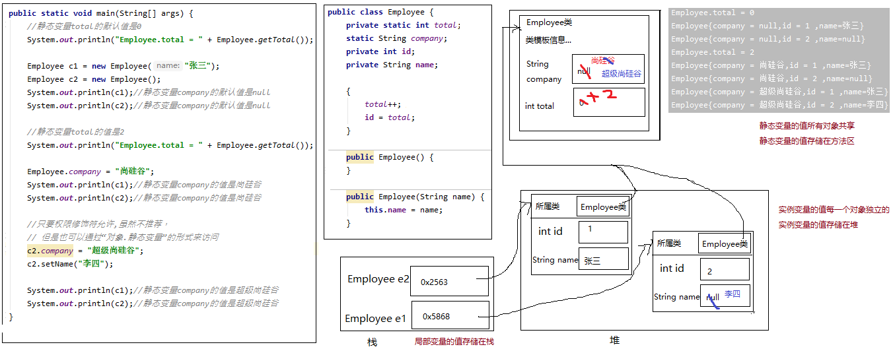
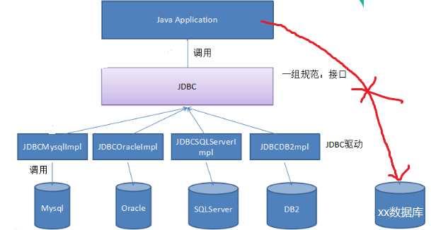
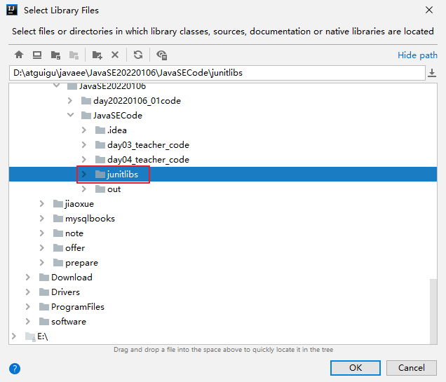
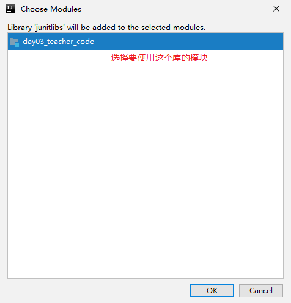
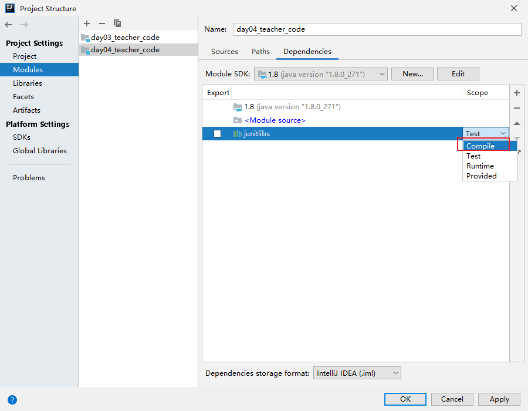
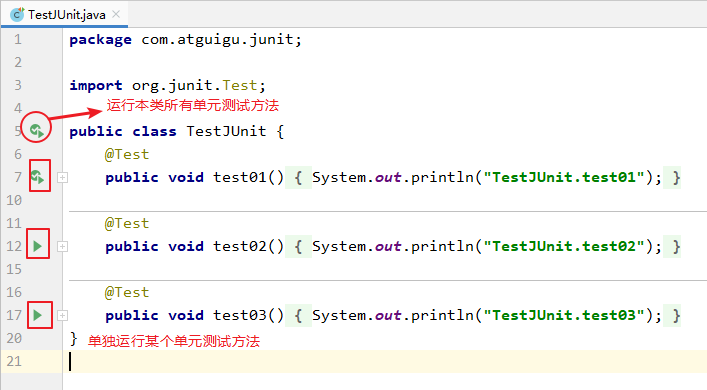

# 第7章 面向对象基础（下）

## 学习目标

* [ ] 会区分静态的类变量和非静态的实例变量
* [ ] 会区分静态的类方法和非静态的实例方法
* [ ] 了解类初始化
* [ ] 认识枚举类型
* [ ] 会使用枚举类型
* [ ] 认识包装类
* [ ] 会使用包装类进行处理字符串
* [ ] 会分析包装类的相关面试题
* [ ] 能够声明抽象类
* [ ] 能够说出抽象类的特点
* [ ] 能够继承抽象类
* [ ] 掌握声明接口的格式
* [ ] 掌握实现接口的格式
* [ ] 能够说出接口中的特点
* [ ] 能够识别内部类的几种形式
* [ ] 能够声明静态内部类和非静态成员内部类
* [ ] 能够看懂和声明匿名内部类
* [ ] 了解注解的概念

## 7.1 静态

### 7.1.1 静态关键字（static）

加载时机: **随着类的加载而加载**

```tex
特点:

		1.随着类的加载而加载

		2.优先于对象存在

		3.多了一种调用方法:可以直接使用类名调用(对象名仍然可以继续调用)

		4.使用static修饰的成员变量,被所有的对象所共享
```

在类中声明的实例变量，其值是每一个对象独立的。但是有些成员变量的值不需要或不能每一个对象单独存储一份，即有些成员变量和当前类的对象无关。

在类中声明的实例方法，在类的外面必须要先创建对象，才能调用。但是有些方法的调用和当前类的对象无关，那么创建对象就有点麻烦了。

此时，就需要将和当前类的对象无关的成员变量、成员方法声明为静态的（static）。

### 7.1.2 静态变量

#### 1、语法格式

有static修饰的成员变量就是静态变量。

```java
【修饰符】 class 类{
	【其他修饰符】 static 数据类型  静态变量名;
}
```

#### 2、静态变量的特点

- 静态变量的默认值规则和实例变量一样。
- 静态变量值是所有对象共享。

- 静态变量的值存储在方法区。
- 静态变量在本类中，可以在任意方法、代码块、构造器中直接使用。
- 如果权限修饰符允许，在其他类中可以通过“类名.静态变量”直接访问，也可以通过“对象.静态变量”的方式访问（但是更推荐使用类名.静态变量的方式）。
- 静态变量的get/set方法也静态的，当局部变量与静态变量重名时，使用“类名.静态变量”进行区分。

| 分类     | 数据类型                       | 默认值   |
| -------- | ------------------------------ | -------- |
| 基本类型 | 整数（byte，short，int，long） | 0        |
|          | 浮点数（float，double）        | 0.0      |
|          | 字符（char）                   | '\u0000' |
|          | 布尔（boolean）                | false    |
|          | 数据类型                       | 默认值   |
| 引用类型 | 数组，类，接口                 | null     |

演示：

```java
package com.atguigu.keyword;

public class Employee {
    private static int total;//这里私有化，在类的外面必须使用get/set方法的方式来访问静态变量
    static String company; //这里缺省权限修饰符，是为了演示在类外面演示“类名.静态变量”的方式访问
    private int id;
    private String name;

    {
        //两个构造器的公共代码可以提前到非静态代码块
        total++; 
        id = total; //这里使用total静态变量的值为id属性赋值
    }

    public Employee() {
    }

    public Employee(String name) {
        this.name = name;
    }

    public void setId(int id) {
        this.id = id;
    }

    public int getId() {
        return id;
    }

    public String getName() {
        return name;
    }

    public void setName(String name) {
        this.name = name;
    }

    public static int getTotal() {
        return total;
    }

    public static void setTotal(int total) {
        Employee.total = total;
    }

    @Override
    public String toString() {
        return "Employee{company = " + company + ",id = " + id + " ,name=" + name +"}";
    }
}
```

```java
package com.atguigu.keyword;

public class TestStaticVariable {
    public static void main(String[] args) {
        //静态变量total的默认值是0
        System.out.println("Employee.total = " + Employee.getTotal());

        Employee c1 = new Employee("张三");
        Employee c2 = new Employee();
        System.out.println(c1);//静态变量company的默认值是null
        System.out.println(c2);//静态变量company的默认值是null
        System.out.println("Employee.total = " + Employee.getTotal());//静态变量total值是2

        Employee.company = "尚硅谷";
        System.out.println(c1);//静态变量company的值是尚硅谷
        System.out.println(c2);//静态变量company的值是尚硅谷

        //只要权限修饰符允许,虽然不推荐，但是也可以通过“对象.静态变量”的形式来访问
        c1.company = "超级尚硅谷";

        System.out.println(c1);//静态变量company的值是超级尚硅谷
        System.out.println(c2);//静态变量company的值是超级尚硅谷
    }
}
```

#### 3、静态变量内存分析



#### 4、静态类变量和非静态实例变量、局部变量

- 静态类变量（简称静态变量）：存储在方法区，有默认值，所有对象共享，生命周期和类相同，还可以有权限修饰符、final等其他修饰符
- 非静态实例变量（简称实例变量）：存储在堆中，有默认值，每一个对象独立，生命周期每一个对象也独立，还可以有权限修饰符、final等其他修饰符
- 局部变量：存储在栈中，没有默认值，每一次方法调用都是独立的，有作用域，只能有final修饰，没有其他修饰符

### 7.1.3 静态方法

#### 1、语法格式

有static修饰的成员方法就是静态方法。

```java
【修饰符】 class 类{
	【其他修饰符】 static 返回值类型 方法名(形参列表){
        方法体
    }
}
```

#### 2、静态方法的特点

- 静态方法在本类的任意方法、代码块、构造器中都可以直接被调用。
- 只要权限修饰符允许，静态方法在其他类中可以通过“类名.静态方法“的方式调用。也可以通过”对象.静态方法“的方式调用（但是更推荐使用类名.静态方法的方式）。
- 静态方法可以被子类继承，但不能被子类重写。
- 静态方法的调用都只看编译时类型。

```java
package com.atguigu.keyword;

public class Father {
    public static void method(){
        System.out.println("Father.method");
    }

    public static void fun(){
        System.out.println("Father.fun");
    }
}
```

```java
package com.atguigu.keyword;

public class Son extends Father{
//    @Override //尝试重写静态方法，加上@Override编译报错，去掉Override不报错，但是也不是重写
    public static void fun(){
        System.out.println("Son.fun");
    }
}
```

```java
package com.atguigu.keyword;

public class TestStaticMethod {
    public static void main(String[] args) {
        Father.method();
        Son.method();//继承静态方法

        Father f = new Son();
        f.method();//执行Father类中的method
    }
}
```

### 7.1.4 静态代码块与非静态代码块(了解)

#### 7.1.4.1 静态代码块与非静态代码块的概述

```tex
- 非静态代码块
	如果想和构造器一样，也用于实例变量的初始化等操作,可以使用非静态代码块
	
- 静态代码块
	如果想要为静态变量初始化，可以直接在静态变量的声明后面直接赋值，也可以使用静态代码块。
```

#### 7.1.4.2 静态代码块与非静态代码块的语法格式

```java
- 非静态代码块

	【修饰符】 class 类{
    	{
        	非静态代码块
    	}
       
	}

- 静态代码块

	在代码块的前面加static，就是静态代码块。

	【修饰符】 class 类{
		static{
       	 静态代码块
    	}
	}
```

#### 7.1.4.3 静态代码块与非静态代码块的特点

```tex
- 非静态代码块
	每创建一个对象实例,就会被执行一次,优先于构造器执行
	
- 静态代码块
	在类初始化时执行，只执行一次
	静态代码块的执行优先于非静态代码块和构造器。
```

```java
package com.atguigu.keyword;

public class Chinese {
//    private static String country = "中国";

    private static String country;
    private String name;

    {
        System.out.println("非静态代码块，country = " + country);
    }

    static {
        country = "中国";
        System.out.println("静态代码块");
    }

    public Chinese(String name) {
        this.name = name;
    }
}
```

```java
package com.atguigu.keyword;

public class TestStaticBlock {
    public static void main(String[] args) {
        Chinese c1 = new Chinese("张三");
        Chinese c2 = new Chinese("李四");
    }
}

```

### 7.1.5 类初始化

（1）类的初始化就是为静态变量初始化。实际上，类初始化的过程时在调用一个<clinit>()方法，而这个方法是编译器自动生成的。编译器会将如下两部分的**所有**代码，**按顺序**合并到类初始化<clinit>()方法体中。

- 静态类成员变量的显式赋值语句

- 静态代码块中的语句


（2）每个类初始化只会进行一次，如果子类初始化时，发现父类没有初始化，那么会先初始化父类。

（3）类的初始化一定优先于实例初始化。

#### 7.1.5.1 类初始化代码优先于实例初始化,只执行一次

#### 7.1.5.2 父类优先于子类初始化

#### 7.1.5.3 非静态代码块初始化时机优先于构造器

```java
package com.atguigu;

public class Demo7 {

    /*
        1.构造器 和非静态代码块 生命周期  归属于 对象
          每创建一个对象,执行一次构造器和非静态代码块
          非静态代码块  优先于构造器  执行

        2. 静态代码块 生命周期  归属于类
           优先于对象存在
           只执行一次

        3. static 修饰的成员  归属于类
            加载时机 优先于对象存在
            调用方式,两种  :
                类名.方法名()  --> 更推荐
                对象名.方法名()

        4.如果创建一个子类
            一定会加载其父类的字节码 (类相关的一定会被加载),子类的类信息
            每创建一个子类对象,优先访问父类的构造(非静态代码块优先于构造),然后是子类的构造
     */
    public static void main(String[] args) {

        /*
          第一个结论:
          Fu2 fu = new Fu2();
         fu.method2();
         System.out.println("-----------");
         Fu2 fu2 = new Fu2();
         fu2.method2();*/

        // 第二个结论
        /*Fu2 fu = new Fu2();
        fu.method2();
        System.out.println("-----------");
        Fu2 fu2 = new Fu2();
        fu2.method2();*/

        // 第三个结论
       /* Fu2 fu = new Fu2();
        fu.method();
        Fu2.method();*/


        // 第四个结论
         Zi2 zi = new Zi2();
        // zi.method2();
          zi.method();
         //Zi2.method();
    }
}

class Fu2{
    static{
        System.out.println("-----Fu静态代码块-----" );
    }

    { // 普通的代码块,非静态代码块 加载时机 优先于构造器  属于对象
        System.out.println("-----Fu非静态代码块------" );
    }

    public Fu2(){// 属于对象  随着对象的创建而创建   每创建一个 创建一次
        System.out.println("------Fu-------构造");
    }


    public static void method(){
        System.out.println("--------Fu-----静态方法");
    }

    public void method2(){
        System.out.println("-------Fu---非静态方法");
    }


}

class Zi2 extends Fu2{
    static{
        System.out.println("-----Zi静态代码块------" );
    }

    {
        System.out.println("-----Zi非静态代码块------" );
    }

    public Zi2(){
        System.out.println("------ZI-------构造");
    }


    public static void method(){// 不是 方法的重写
        System.out.println("--------Zi-----静态方法");
    }

    public void method2(){ // 方法的重写
        System.out.println("-------Zi---非静态方法");
    }

}
```

### 7.1.6 静态和非静态的区别

#### 1、本类中的访问限制区别

静态的类变量和静态的方法可以在本类的任意方法、代码块、构造器中直接访问。

非静态的实例变量和非静态的方法==只能==在本类的非静态的方法、非静态代码块、构造器中直接访问。

即：

- 静态直接访问静态，可以
- 非静态直接访问非静态，可以
- 非静态直接访问静态，可以
- 静态直接访问非静态，不可以

#### 2、在其他类的访问方式区别

静态的类变量和静态的方法可以通过“类名.”的方式直接访问；也可以通过“对象."的方式访问。（但是更推荐使用==”类名."==的方式）

非静态的实例变量和非静态的方法==只能==通过“对象."方式访问。

#### 3、this和super的使用

静态的方法和静态的代码块中，==不允许==出现this和super关键字，如果有重名问题，使用“类名.”进行区别。

非静态的方法和非静态的代码块中，可以使用this和super关键字。

### 7.1.7 静态导入(了解)

##### 不推荐使用

```java
import static 包.类名.静态成员名;
```

演示：

```java
package com.atguigu.static_keyworld;

// 静态导入
import static java.util.Arrays.sort;
// import java.util.Arrays;

public class Demo7 {

    /*
        静态导入
        1: 按照这种方式  将一个类中的静态方法导入  import static java.util.Arrays.sort;
        2. 静态导入后,该方法则不需要使用类名.调用,直接调用该方法

        不推荐   有可能产生歧义

     */
    public static void main(String[] args) {

        int[] arr = {33,22,11,44,55};
        // Arrays.sort(arr);
        sort(arr);//如果本类中有同名方法,容易有歧义

        // 遍历数组
        for (int i = 0; i < arr.length; i++) {
            System.out.println(arr[i]);
        }

    }


    public static void sort(int [] arr ){
        System.out.println("本类----------sort");
    }
}


```

## 7.2 抽象类

### 7.2.1 概述

抽象：即不具体、或无法具体

例如：当我们声明一个几何图形类：圆、矩形、三角形类等，发现这些类都有共同特征：求面积、求周长、获取图形详细信息。那么这些共同特征应该抽取到一个公共父类中。但是这些方法在父类中又**无法给出具体的实现**，而是应该交给子类各自具体实现。那么父类在声明这些方法时，**就只有方法签名，没有方法体**，我们把没有方法体的方法称为**抽象方法**。Java语法规定，包含抽象方法的类必须是**抽象类**。

```tex
概述: 使用abstract关键字修饰的类就是抽象类

特点: 这种类不能被创建对象,它一般就是用来做父类的,被子类继承的
```

### 7.2.2 语法格式

```tex
- 抽象方法：
	被abstract修饰
	没有方法体的方法
	
	抽象方法的作用:
		强制要求子类必须重写
	
- 抽象类
	被abstract修饰的类。
```

抽象类的语法格式

```java
【权限修饰符】 abstract class 类名{
    
}
【权限修饰符】 abstract class 类名 extends 父类{
    
}
```

抽象方法的语法格式

```java
【其他修饰符】 abstract 返回值类型 方法名(【形参列表】);
```

> 注意：抽象方法没有方法体

代码举例：

```java
public abstract class Animal {
    public abstract void eat()；
}
```

```java
public class Cat extends Animal {
    public void eat (){
      	System.out.println("小猫吃鱼和猫粮")； 	 
    }
}
```

```java
public class CatTest {
 	 public static void main(String[] args) {
        // 创建子类对象
        Cat c = new Cat(); 
       
        // 调用eat方法
        c.eat();
  	}
}
```

此时的方法重写，是子类对父类抽象方法的完成实现，我们将这种方法重写的操作，也叫做**实现方法**。


### 7.2.3 注意事项

关于抽象类的使用，以下为语法上要注意的细节，虽然条目较多，但若理解了抽象的本质，无需死记硬背。

1. 抽象类**不能创建对象**，如果创建，编译无法通过而报错。只能创建其非抽象子类的对象。

   > 理解：假设创建了抽象类的对象，调用抽象的方法，而抽象方法没有具体的方法体，没有意义。

2. 抽象类中，也有构造方法，是供子类创建对象时，初始化父类成员变量使用的。

   > 理解：子类的构造方法中，有默认的super()或手动的super(实参列表)，需要访问父类构造方法。

3. 抽象类中，不一定包含抽象方法，但是有抽象方法的类必定是抽象类。

   > 理解：未包含抽象方法的抽象类，目的就是不想让调用者创建该类对象，通常用于某些特殊的类结构设计。

4. 抽象类的子类，必须重写抽象父类中**所有的**抽象方法，否则，编译无法通过而报错。除非该子类也是抽象类。 

   > 理解：假设不重写所有抽象方法，则类中可能包含抽象方法。那么创建对象后，调用抽象的方法，没有意义。

##### 抽象类的成员特点(普通类+抽象方法)

### 7.2.4 抽象类的应用场景

```tex
在父类中,需要定义该共性功能,但具体实现要求子类自己去完成,有这种需求时,该功能定义为抽象的,abstract
同理,如果父类中的共性功能,非必要子类必须去实现,即可定义为普通方法

抽象类的定义和设计,更多的还是当做一个继承体系的父类,使得子类继承该父类的共性属性和功能
只是在遇到需要子类必须去实现功能时,需要定义抽象功能
```

##### 代码案例:

```java
package com.atguigu.test;

public class Demo1 {
    public static void main(String[] args) {
        // 网络游戏 game = new 网络游戏(); // 报错,抽象类不能实例化
         网络游戏 game = new 王者荣耀();
         game.联网();
         game.选角色();
         game.充值();
         game.小学学历以上();
    }

}

abstract class 网络游戏{
    public abstract void 联网();
    public abstract void 选角色();
    public abstract void 充值();// 非必须要实现的功能-->可定义为普通方法
    public abstract void 小学学历以上();// 非必须要实现的功能-->可定义为普通方法a	
}

class 王者荣耀 extends 网络游戏{

    @Override
    public void 联网() {// 必须要实现的功能
        System.out.println("网络---WIFI");
    }

    @Override
    public void 选角色() {// 必须要实现的功能
        System.out.println("角色---安琪拉");
    }

    @Override
    public void 充值() {// 非必须要实现的功能-->可定义为普通方法
        System.out.println("充值---500元");
    }

    @Override
    public void 小学学历以上() {// 非必须要实现的功能-->可定义为普通方法
        System.out.println("学历---初中");
    }
}

```

### 7.2.5 抽象类的定义和使用

```tex
需求:
	定义一个父类Animal类
	共性功能为eat(),此功能要求每个动物类都具备,但具体实现交给子类
	共性功能sleep(),此功能让所有子类继承即可
	
	子类:猫类
	行为
		吃饭:实现父类eat()方法,具体吃饭方式为:"小猫爱吃草"
		抓老鼠:特有的功能
		
	子类:狗类
	行为
		吃饭:实现父类eat()方法,具体吃饭方式为:"小狗爱吃肉"
		抓老鼠:特有的功能
		
抽象类和普通类的定义和使用,只有abstract一点特殊之处
```

```java
public class Demo3 {

    /*
    需求:
        定义一个父类Animal类
        共性功能为eat(),此功能要求每个动物类都具备,但具体实现交给子类
        共性功能sleep(),此功能让所有子类继承即可

        子类:猫类
        行为
            吃饭:实现父类eat()方法,具体吃饭方式为:"小猫爱吃草"
            抓老鼠:特有的功能

        子类:狗类
        行为
            吃饭:实现父类eat()方法,具体吃饭方式为:"小狗爱吃肉"
            抓老鼠:特有的功能

        抽象类  Animal
            一般情况下有子类,完成该功能的实现
            本质:  普通类 + 抽象方法
         抽象类的成员
            成员变量
                即可以是变量也可以是常量
            构造
                有
            成员方法
                普通方法
                抽象方法
         设计理念
            更倾向于是一个继承体系的父类,继承共性的功能,唯独提了一点要求()
            体现的  子类 is  a  父类

     */public static void main(String[] args) {

        // 1.抽象类不能被实例化
        // Animal a = new Animal() ;// 报错,
       new Cat().eat();
       new Cat().catchMouse();
       new Cat().sleep();

       Dog d = new Dog();
       d.eat();
       d.catchMouse();
       d.sleep();
    }


    public static void method(Animal animal){//  Animal animal = new Cat();
        animal.eat();
    }
}

abstract class Animal{
    public abstract  void eat();// 父类仅提供该功能,具体实现交给子类

    public Animal(){}

    public void sleep(){
        System.out.println("动物睡觉的功能");
    }
}

class Cat extends Animal{

    @Override
    public void eat() {
        System.out.println("小猫爱吃草");
    }

    public void catchMouse(){
        System.out.println("小猫抓老鼠");
    }
}

class Dog extends Animal{

    @Override
    public void eat() {
        System.out.println("小狗爱吃肉");
    }

    public void catchMouse(){
        System.out.println("狗拿耗子,多管闲事");
    }
}

```

### 7.2.6 修饰符一起使用问题？

|           | 外部类 | 成员变量 | 代码块 | 构造器 | 方法 | 局部变量 | 内部类（后面讲） |
| --------- | ------ | -------- | ------ | ------ | ---- | -------- | ---------------- |
| public    | √      | √        | ×      | √      | √    | ×        | √                |
| protected | ×      | √        | ×      | √      | √    | ×        | √                |
| 缺省      | √      | √        | ×      | √      | √    | ×        | √                |
| private   | ×      | √        | ×      | √      | √    | ×        | √                |
| static    | ×      | √        | √      | ×      | √    | ×        | √                |
| final     | √      | √        | ×      | ×      | √    | √        | √                |
| abstract  | √      | ×        | ×      | ×      | √    | ×        | √                |
| native    | ×      | ×        | ×      | ×      | √    | ×        | ×                |

不能和abstract一起使用的修饰符？

（1）abstract和**final**不能一起修饰**方法和类**

（2）abstract和**static**不能一起修饰**方法**

（3）abstract和**native**不能一起修饰**方法**

（4）abstract和**private**不能一起修饰**方法**


static和final一起使用：

（1）修饰方法：可以，因为都不能被重写

（2）修饰成员变量：可以，表示静态常量

（3）修饰局部变量：不可以，static不能修饰局部变量

（4）修饰代码块：不可以，final不能修改代码块

（5）修饰内部类：可以一起修饰成员内部类，不能一起修饰局部内部类

### 7.2.7 总结

```tex
抽象
       关键字: abstract
    抽象方法
        1>使用abstract 修饰的方法
        2>没有具体的方法体
        3>如果一个类中,出现了抽象方法,所在的类一定是抽象类
        
    抽象类
        1>使用abstract 修饰的类
        2>抽象类中,可以没有抽象方法
        3>抽象类,不能被实例化
            创建一个抽象类的引用时,可以创建一个该类的子类对象
        4>抽象类的子类
            普通类:必须要重写父类的所有抽象方法
            抽象类:可以不重写或者部分重写父类的抽象方法
    抽象类的成员
            成员变量
                即可以是变量也可以是常量
            构造
                有
            成员方法
                普通方法
                抽象方法
         设计理念
            更倾向于是一个继承体系的父类,继承共性的功能,唯独提了一点要求()
            体现的  子类 is  a  父类

    结论
        一个抽象父类,定义一个抽象方法时,意图有一个实现类实现该方法
```


## 7.3 接口(难点)

### 7.3.1 概述

```tex
- 代码含义
	Java中的interface
	作用:弥补了单继承的缺点
	
- 现实含义
	对外提供规则
	
举例
	学生类 都有学习的方法(泛称类的学习 普通的学习)
	子类A 需求:学习Java  父类没有此功能,但是单继承   所以"学习Java" 只能自己定义
	子类B,C,D同样都有需求:学习Java
	
	存在了一个事物(尚硅谷接口):具备 学习Java的功能    由于受到单继承的约束 不能继承该事物,不能继承该功能
	
	假设将该事物定义为一个不是类类型的特殊事物--> 接口interface
	接口的功能:扩展功能   多继承 多实现的
	作为子类ABCD 可以实现该接口,实现里面提供的功能
```

生活中大家每天都在用USB接口，那么USB接口与我们今天要学习的接口有什么相同点呢？

 	USB是通用串行总线的英文缩写，是Intel公司开发的总线架构，使得在计算机上添加串行设备（鼠标、键盘、打印机、扫描仪、摄像头、充电器、MP3机、手机、数码相机、移动硬盘等）非常容易。只须将设备插入计算机的USB端口中，系统会自动识别和配置。 有了USB，我们电脑需要提供的各种插槽的口越来越少，而能支持的其他设备的连接却越来越多。

​	那么我们平时看到的电脑上的USB插口、以及其他设备上的USB插口是什么呢？

​	其实，不管是电脑上的USB插口，还是其他设备上的USB插口都只是遵循了USB规范的一种具体设备而已。

​	根据时代发展，USB接口标准经历了一代USB、第二代USB 2.0和第三代USB 3.0 。

​	USB规格第一次是于1995年，由Intel、IBM、Compaq、Microsoft、NEC、Digital、North Telecom等七家公司组成的USBIF(USB Implement Forum)共同提出，USBIF于1996年1月正式提出USB1.0规格，频宽为1.5Mbps。

   USB2.0技术规范是有由Compaq、Hewlett Packard、Intel、Lucent、Microsoft、NEC、Philips共同制定、发布的，规范把外设数据传输速度提高到了480Mbps，被称为USB 2.0的高速(High-speed)版本.

   USB 3.0是最新的USB规范，该规范由英特尔等公司发起,USB3.0的最大传输带宽高达5.0Gbps(640MB/s),USB3.0 引入全双工数据传输。5根线路中2根用来发送数据，另2根用来接收数据，还有1根是地线。也就是说，USB 3.0可以同步全速地进行读写操作。

| **USB版本** | **最大传输速率** | **速率称号**          | **最大输出电流** | **推出时间** |
| ----------- | ---------------- | --------------------- | ---------------- | ------------ |
| USB1.0      | 1.5Mbps(192KB/s) | 低速(Low-Speed)       | 5V/500mA         | 1996年1月    |
| USB1.1      | 12Mbps(1.5MB/s)  | 全速(Full-Speed)      | 5V/500mA         | 1998年9月    |
| USB2.0      | 480Mbps(60MB/s)  | 高速(High-Speed)      | 5V/500mA         | 2000年4月    |
| USB3.0      | 5Gbps(500MB/s)   | 超高速(Super-Speed)   | 5V/900mA         | 2008年11月   |
| USB 3.1     | 10Gbps(1280MB/s) | 超高速+(Super-speed+) | 20V/5A           | 2013年12月   |

 下面是USB2.0和USB3.0标准下的各类接口示意图： 


​		电脑边上提供了USB插槽，这个插槽遵循了USB的规范，只要其他设备也是遵循USB规范的，那么就可以互联，并正常通信。至于这个电脑、以及其他设备是哪个厂家制造的，内部是如何实现的，我们都无需关心。

​		这种设计是将规范和实现分离，这也正是Java接口的好处。Java的软件系统会有很多模块组成，那么各个模块之间也应该采用这种面相接口的低耦合，为系统提供更好的可扩展性和可维护性。

- 接口就是规范，定义的是一组规则，体现了现实世界中“如果你是/要...则必须能...”的思想。继承是一个"是不是"的is-a关系，而接口实现则是 "能不能"的has-a关系。
  - 例如：你能不能用USB进行连接，或是否具备USB通信功能，就看你是否遵循USB接口规范
  - 例如：Java程序是否能够连接使用某种数据库产品，那么要看该数据库产品有没有实现Java设计的JDBC规范




### 7.3.2 定义格式

接口的定义，它与定义类方式相似，但是使用 `interface` 关键字。它也会被编译成.class文件，但一定要明确它并不是类，而是另外一种引用数据类型。

> 引用数据类型：数组，类，枚举，接口，注解。

#### 1、接口的声明格式

```java
【修饰符】 interface 接口名{
    //接口的成员列表：
    // 公共的静态常量
    // 公共的抽象方法
    // 公共的默认方法（JDK1.8以上）
    // 公共的静态方法（JDK1.8以上）
    // 私有方法（JDK1.9以上）
}
```

示例代码：

```java
package com.atguigu.interfacetype;

public interface Usb3{
    //静态常量
    long MAX_SPEED = 500*1024*1024;//500MB/s

    //抽象方法
    void in();
    void out();

    //默认方法
    default void start(){
        System.out.println("开始");
    }
    default void stop(){
        System.out.println("结束");
    }

    //静态方法
    static void show(){
        System.out.println("USB 3.0可以同步全速地进行读写操作");
    }
}
```

#### 2、接口的成员说明

接口定义的是多个类共同的公共行为规范，这些行为规范是与外部交流的通道，这就意味着接口里通常是定义一组公共方法。

在JDK8之前，接口中只允许出现：

（1）公共的静态的常量：其中public static final可以省略

（2）公共的抽象的方法：其中public abstract可以省略

> 理解：接口是从多个相似类中抽象出来的规范，不需要提供具体实现
>

在JDK1.8时，接口中允许声明默认方法和静态方法：

（3）公共的默认的方法：其中public 可以省略，建议保留，但是default不能省略

（4）公共的静态的方法：其中public 可以省略，建议保留，但是static不能省略

在JDK1.9时，接口又增加了：

（5）私有方法

##### 除此之外，接口中不能有其他成员，没有构造器，没有初始化块，因为接口中没有成员变量需要动态初始化。

##### 注意:接口不能实例化


### 7.3.3 接口的使用

#### 1、使用接口的静态成员

接口不能直接创建对象，但是可以通过接口名直接调用接口的静态方法和静态常量。

```java
package com.atguigu.interfacetype;

public class TestUsb3 {
    public static void main(String[] args) {
        //通过“接口名.”调用接口的静态方法
        Usb3.show();
        //通过“接口名.”直接使用接口的静态常量
        System.out.println(Usb3.MAX_SPEED);
    }
}
```

#### 2、类实现接口（implements）

接口**不能创建对象**，但是可以被类实现（`implements` ，类似于被继承）。

类与接口的关系为实现关系，即**类实现接口**，该类可以称为接口的实现类，也可以称为接口的子类。实现的动作类似继承，格式相仿，只是关键字不同，实现使用 ` implements`关键字。

```java
【修饰符】 class 实现类  implements 接口{
	// 重写接口中抽象方法【必须】，当然如果实现类是抽象类，那么可以不重写
  	// 重写接口中默认方法【可选】
}

【修饰符】 class 实现类 extends 父类 implements 接口{
    // 重写接口中抽象方法【必须】，当然如果实现类是抽象类，那么可以不重写
  	// 重写接口中默认方法【可选】
}
```

注意：

1. 如果接口的实现类是非抽象类，那么**必须重写接口中所有抽象方法**。

2. 默认方法可以选择保留，也可以重写。

   > 重写时，default单词就不要再写了，它只用于在接口中表示默认方法，到类中就没有默认方法的概念了

3. **接口中的静态方法不能被继承也不能被重写**

示例代码：

```java
package com.atguigu.interfacetype;

public class MobileHDD implements Usb3 {
    //重写/实现接口的抽象方法，【必选】
    public void out() {
        System.out.println("读取数据并发送");
    }
    public void in(){
        System.out.println("接收数据并写入");
    }

    //重写接口的默认方法，【可选】
    //重写默认方法时，default单词去掉
    public void end(){
        System.out.println("清理硬盘中的隐藏回收站中的东西，再结束");
    }
}

```

#### 3、使用接口的非静态方法

- 对于接口的静态方法，直接使用“接口名.”进行调用即可
  - 也只能使用“接口名."进行调用，不能通过实现类的对象进行调用
- 对于接口的抽象方法、默认方法，只能通过实现类对象才可以调用
  - 接口不能直接创建对象，只能创建实现类的对象

```java
package com.atguigu.interfacetype;

public class TestMobileHDD {
    public static void main(String[] args) {
        //创建实现类对象
        MobileHDD b = new MobileHDD();

        //通过实现类对象调用重写的抽象方法，以及接口的默认方法，如果实现类重写了就执行重写的默认方法，如果没有重写，就执行接口中的默认方法
        b.start();
        b.in();
        b.stop();

        //通过接口名调用接口的静态方法
//        MobileHDD.show();
//        b.show();
        Usb3.show();
    }
}
```

#### 4、接口的多实现（implements）

之前学过，在继承体系中，一个类只能继承一个父类。而对于接口而言，一个类是可以实现多个接口的，这叫做接口的**多实现**。并且，一个类能继承一个父类，同时实现多个接口。

实现格式：

```java
【修饰符】 class 实现类  implements 接口1，接口2，接口3。。。{
	// 重写接口中所有抽象方法【必须】，当然如果实现类是抽象类，那么可以不重写
  	// 重写接口中默认方法【可选】
}

【修饰符】 class 实现类 extends 父类 implements 接口1，接口2，接口3。。。{
    // 重写接口中所有抽象方法【必须】，当然如果实现类是抽象类，那么可以不重写
  	// 重写接口中默认方法【可选】
}
```

> 接口中，有多个抽象方法时，实现类必须重写所有抽象方法。**如果抽象方法有重名的，只需要重写一次**。

定义多个接口：

```java
package com.atguigu.interfacetype;

public interface A {
    void showA();
    void show();
}
```

```java
package com.atguigu.interfacetype;

public interface B extends A {
    void showB();
    void show();
}
```

定义实现类：

```java
package com.atguigu.interfacetype;

public class C implements A,B {
    @Override
    public void showA() {
        System.out.println("showA");
    }

    @Override
    public void showB() {
        System.out.println("showB");
    }

    @Override
    public void show() {
        System.out.println("show");
    }
}

```

测试类

```java
package com.atguigu.interfacetype;

public class TestC {
    public static void main(String[] args) {
        C c = new C();
        c.showA();
        c.showB();
        c.show();
    }
}
```

#### 5、接口的多继承  （extends)

一个接口能继承另一个或者多个接口，接口的继承也使用 `extends` 关键字，子接口继承父接口的方法。

定义父接口：

```java
package com.atguigu.interfacetype;

public interface Chargeable {
    void charge();
    void in();
    void out();
}
```

定义子接口：

```java
package com.atguigu.interfacetype;

public interface UsbC extends Chargeable,Usb3 {
    void reverse();
}
```

定义子接口的实现类：

```java
package com.atguigu.interfacetype;

public class TypeCConverter implements UsbC {
    @Override
    public void reverse() {
        System.out.println("正反面都支持");
    }

    @Override
    public void charge() {
        System.out.println("可充电");
    }

    @Override
    public void in() {
        System.out.println("接收数据");
    }

    @Override
    public void out() {
        System.out.println("输出数据");
    }
}
```

> 所有父接口的抽象方法都有重写。
>
> 方法签名相同的抽象方法只需要实现一次。

#### 6、接口与实现类对象构成多态引用

实现类实现接口，类似于子类继承父类，因此，接口类型的变量与实现类的对象之间，也可以构成多态引用。通过接口类型的变量调用方法，最终执行的是你new的实现类对象实现的方法体。

接口的不同实现类：

```java
package com.atguigu.interfacetype;

public class Mouse implements Usb3 {
    @Override
    public void out() {
        System.out.println("发送脉冲信号");
    }

    @Override
    public void in() {
        System.out.println("不接收信号");
    }
}
```

```java
package com.atguigu.interfacetype;

public class KeyBoard implements Usb3{
    @Override
    public void in() {
        System.out.println("不接收信号");
    }

    @Override
    public void out() {
        System.out.println("发送按键信号");
    }
}

```

测试类

```java
package com.atguigu.interfacetype;

public class TestComputer {
    public static void main(String[] args) {
        Computer computer = new Computer();
        Usb3 usb = new Mouse();
        computer.setUsb(usb);
        usb.start();
        usb.out();
        usb.in();
        usb.stop();
        System.out.println("--------------------------");

        usb = new KeyBoard();
        computer.setUsb(usb);
        usb.start();
        usb.out();
        usb.in();
        usb.stop();
        System.out.println("--------------------------");

        usb = new MobileHDD();
        computer.setUsb(usb);
        usb.start();
        usb.out();
        usb.in();
        usb.stop();
    }
}
```


### 7.3.4 接口的特点总结

- 接口本身不能创建对象，只能创建接口的实现类对象，接口类型的变量可以与实现类对象构成多态引用。
- 声明接口用interface，接口的成员声明有限制：
- (1）公共的静态常量（2）公共的抽象方法（3）公共的默认方法（4）公共的静态方法（5）私有方法（JDK1.9以上）
- 类可以实现接口，关键字是implements，而且支持多实现。如果实现类不是抽象类，就必须实现接口中所有的抽象方法。如果实现类既要继承父类又要实现父接口，那么继承（extends）在前，实现（implements）在后。
- 接口可以继承接口，关键字是extends，而且支持多继承。
- 接口的默认方法可以选择重写或不重写。如果有冲突问题，另行处理。子类重写父接口的默认方法，要去掉default，子接口重写父接口的默认方法，不要去掉default。
- 接口的静态方法不能被继承，也不能被重写。接口的静态方法只能通过“接口名.静态方法名”进行调用。

```tex
     接口
        对外扩展
        定义格式
        	修饰符  interface 接口名{}

     成员
        JDK1.8 之前
            成员变量:只能是常量
            成员方法:只能是抽象的
            构造:没有构造    接口不能实例化
        JDK1.8
            成员方法:新增了默认方法和静态方法
        JDK1.9
         	成员方法:新增了私有方法
```

##### 综合案例:

```tex
案例
            定义一个父类 Person
            共性属性:姓名,年龄
            共性功能:睡觉
            共性抽象功能: show()  作用是描述自己是什么类,属性值是多少

            存在三个接口
            吃的接口   interface Eat {   吃的功能  }
            听的接口   interface  Hear{   听的功能}
            说的接口   interface Say{  说的功能}

            两个子类
               哑巴类  Dumb  Person的子类
               聋子类  Deaf  Person 的子类
         利用面向对象思想,使用多态的方式,调用两个子类的功能
```

```java
package com.atguigu.test;

public class Demo6 {

    /*
        案例
            定义一个父类 Person
            共性属性:姓名,年龄
            共性功能:睡觉
            共性抽象功能: show()  作用是描述自己是什么类,属性值是多少

            存在三个接口
            吃的接口   interface Eat {   吃的功能  }
            听的接口   interface  Hear{   听的功能}
            说的接口   interface Say{  说的功能}

            两个子类
               哑巴类  Dumb  Person的子类
               聋子类  Deaf  Person 的子类
         利用面向对象思想,使用多态的方式,调用两个子类的功能
     */
    public static void main(String[] args) {

        // 利用面向对象思想,使用多态的方式,调用两个子类的功能
        Person p1 = new Dumb();
        p1.show();
        p1.sleep();
        Dumb d1 = (Dumb)p1;
        d1.eat();
        d1.hear();

        Person p2 = new Deaf();
        p2.show();
        p2.sleep();
        Deaf d2 = (Deaf)p2;
        d2.eat();
        d2.say();
    }
}


/*
定义一个父类 Person
            共性属性:姓名,年龄
            共性功能:吃饭
            共性抽象功能: show()  作用是描述自己是什么类,属性值是多少
 */

abstract class Person{
    String name;
    int age;

    public void sleep(){
        System.out.println("Person-----sleep()");
    }

    public abstract  void show();
}


/*
存在三个接口
            吃的接口   interface Eat {   吃的功能  }
            听的接口   interface  Hear{   听的功能}
            说的接口   interface Say{  说的功能}
 */
interface Eat{
    public abstract  void eat();
}

interface  Hear{
    void hear();// 补充public abstract
}

interface Say{
    void say();
}

/*
        哑巴类  Dumb  Person的子类
        实现 Eat,Hear
 */
class Dumb extends  Person  implements Eat,Hear{

    String name = "小黑";
    int age = 1;

    @Override
    public void show() {// Person  作用是描述自己是什么类,属性值是多少
        System.out.println("我当前是哑巴类,属性值 name = " + this.name + ",age = " + this.age);
    }

    @Override
    public void hear() {
        System.out.println("Dumb-------hear()");
    }

    @Override
    public void eat(){
        System.out.println("Dumb ----eat()");
    }
}

/*
聋子类  Deaf  Person 的子类
 */

class Deaf extends Person implements Eat,Say{

    String name = "小白";
    int age = 2;

    @Override
    public void show() {
        System.out.println("我当前是聋子类,属性值 name = " + this.name + ",age = " + this.age);
    }

    @Override
    public void eat() {
        System.out.println("Deaf ----eat()");
    }

    @Override
    public void say() {
        System.out.println("Deaf ----say()");
    }
}
```

### 7.3.5 抽象类和接口的区别

```tex
抽象类和接口的区别
      成员变量
         	抽象类
            	既可以是常量也可以是变量
         	接口
            	一定是常量
      构造
          	抽象类
              	 有构造
          	接口
                	没有构造
      成员方法
        	抽象类
            	既可以是普通方法,也可以是抽象方法
        	接口
            	JDK1.8之前,必须是抽象方法(JDK8之后出现了默认方法和静态方法,JDK9出现了私有方法)
       设计理念
          	抽象父类
                作为一个继承体系顶层,将共性行为和属性被继承下去
                体现  子类 is  a  父类
          	接口
                作为一个功能进行扩展
```

## 7.4 内部类(理解)

### 7.4.1 概述

1、什么是内部类？

将一个类A定义在另一个类B里面，里面的那个类A就称为**内部类**，B则称为**外部类**。

2、为什么要声明内部类呢？

总的来说，遵循高内聚低耦合的面向对象开发总原则。便于代码维护和扩展。

具体来说，当一个事物的内部，还有一个部分需要一个完整的结构进行描述，而这个内部的完整的结构又只为外部事物提供服务，不在其他地方单独使用，那么整个内部的完整结构最好使用内部类。

而且内部类因为在外部类的里面，因此可以直接访问外部类的私有成员。

3、内部类都有哪些形式？

根据内部类声明的位置（如同变量的分类），我们可以分为：

（1）成员内部类：(静态/非静态)

（2）局部内部类

### 7.4.2 成员内部类

语法格式：

```java
【修饰符】 class 外部类{
    【其他修饰符】 【static】 class 内部类{
    }
}

字节码文件名称:外部类$静态内部类名
```

#### 1、静态内部类

有static修饰的成员内部类叫做静态内部类。它的特点：

访问特点:

```tex
 1.在静态内部类中只能访问外部类的静态成员(包含私有的)
 2.在其他类中创建内部类对象:
 	格式:外部类名.内部类名 对象名 = new 外部类名.内部类名();
 3.在外部类中想要访问静态内部类的成员时
 	如果是静态成员,使用静态内部类类名.成员
 	如果是非静态成员,使用静态内部类对象名.成员
 4.内部类如何访问外部类的成员
    只能访问外部类的静态成员
   	如果成员变量重名,优先访问本类的成员,需要调用外部类的,使用外部类类名/对象名.调用
```

- 和其他类一样，它只是定义在外部类中的另一个完整的类结构
  - 可以继承自己的想要继承的父类，实现自己想要实现的父接口们，和外部类的父类和父接口无关
  - 可以在静态内部类中声明属性、方法、构造器等结构，包括静态成员
  - 可以使用abstract修饰，因此它也可以被其他类继承
  - 可以使用final修饰，表示不能被继承
  - 编译后有自己的独立的字节码文件，只不过在内部类名前面冠以外部类名和$符号。
- 和**外部类不同的是，它可以允许四种权限修饰符**：public，protected，缺省，private
  - 外部类只允许public或缺省的
- **只**可以在静态内部类中使用外部类的**静态成员**
  - 在静态内部类中不能使用外部类的非静态成员哦
  - 如果在内部类中有变量与外部类的静态成员变量同名，可以使用“外部类名."进行区别
- 在外部类的外面不需要通过外部类的对象就可以创建静态内部类的对象（通常应该避免这样使用）

> 其实严格的讲（在James Gosling等人编著的《The Java Language Specification》）静态内部类不是内部类，而是类似于C++的嵌套类的概念，外部类仅仅是静态内部类的一种命名空间的限定名形式而已。所以接口中的内部类通常都不叫内部类，因为接口中的内部成员都是隐式是静态的（即public static)。例如：Map.Entry。

##### 代码演示

```java
package com.atguigu.test;

public class Demo2 {

    public static void main(String[] args) {
        
        /*创建一个静态的内部类
        	格式 外部类.内部类 对象名 = new 外部类. 内部类();
        */
        Outer.Inner1 inner1 = new Outer.Inner1();
        inner1.innerStaticMethod();// 第一种方式访问静态内部类的静态方法
        Outer.Inner1.innerStaticMethod();// 第二种方式访问静态内部类的静态方法

        System.out.println("----------------");
        inner1.innerMethod();// 只能通过这种方式访问静态内部类的非静态方法

    }
}

class Outer{ // 外部类

    private static String a = "外部类的静态属性------a";
    private static String b = "外部类的静态属性------b";
    private  String c = "外部类的非静态属性------c";
    private  String d = "外部类的非静态属性------d";


    static class Inner1{
        private static String a = "内部类的静态属性------a";
        private  String c = "内部类的非静态属性------c";

        // 静态内部类的静态方法
        public static void innerStaticMethod(){
            System.out.println("static-------Inner1-------innerStaticMethod");
            System.out.println("Outer.a" + Outer.a);
            System.out.println("Outer.b" + Outer.b);
            System.out.println("Outer.b" + b);// 内部类可以直接访问外部成员(静态的可以访问静态)
            System.out.println("Inner1.a" + a);// 优先访问本类成员
            System.out.println("-----------------------------");
            // System.out.println("Outer.c----非静态的" + Outer.c); // c是非静态的,不可以类名直接方法Outer.c
            System.out.println("Outer.c----非静态的" + new Outer().c);
            // System.out.println("Inner1.c" + c);// 报错,静态的只能访问静态的
            System.out.println("Inner1.c" + new Inner1().c);// 创建外部类对象去访问
            // System.out.println("Outer.d" + d); // 报错 静态的只能访问静态的
            System.out.println("Outer.d" + new Outer().d);// 创建外部类对象去访问
        }

        // 静态内部类的非静态方法
        public  void innerMethod(){
            System.out.println("Inner1-------innerMethod");
            System.out.println("Outer.a" + Outer.a);
            System.out.println("Outer.b" + Outer.b);
            System.out.println("Outer.b" + b);// 内部类可以直接访问外部成员(静态的可以访问静态)
            System.out.println("Inner1.a" + a);// 优先访问本来成员
            System.out.println("-----------------------------");
            // System.out.println("Outer.c----非静态的" + Outer.c); // c是非静态的,不可以类名直接方法Outer.c
            System.out.println("Outer.c----非静态的" + new Outer().c);
             System.out.println("Inner1.c" + c);// 报错,静态的只能访问静态的
            System.out.println("Inner1.c" + new Inner1().c);// 只能通过创建外部类对象去访问外部类的非静态成员
            // System.out.println("Outer.d" + d); // 报错 不能访问外部类的非静态成员  唯一不能访问
            System.out.println("Outer.d" + new Outer().d);// 只能通过创建外部类对象去访问外部类的非静态成员
        }


    }

}

```


#### 2、非静态成员内部类

没有static修饰的成员内部类叫做非静态内部类。非静态内部类的特点：

```tex
 1.在内部类中可以访问一切外部类成员(包含私有的)
 2.在其他类中创建内部类对象:
 	格式:外部类名.内部类名 对象名 = new 外部类名().new 内部类名();
 3.在外部类中想要访问非静态内部类的成员时,必须创建内部类对象
 	如果是非静态成员,使用静态内部类对象名.成员
 4.内部类如何访问外部类的成员
    可以任意访问外部类的成员
   	如果成员变量重名,优先访问本类的成员,需要调用外部类的,使用外部类类名/对象名.调用
```

- 和其他类一样，它只是定义在外部类中的另一个完整的类结构
  - 可以继承自己的想要继承的父类，实现自己想要实现的父接口们，和外部类的父类和父接口无关
  - 可以在非静态内部类中声明属性、方法、构造器等结构，但是**不允许声明静态成员**，但是可以**继承**父类的静态成员，而且**可以声明静态常量**。
  - 可以使用abstract修饰，因此它也可以被其他类继承
  - 可以使用final修饰，表示不能被继承
  - 编译后有自己的独立的字节码文件，只不过在内部类名前面冠以外部类名和$符号。
- 和外部类不同的是，它可以允许四种权限修饰符：public，protected，缺省，private
  - **外部类只允许public或缺省的**
- 还可以在非静态内部类中使用外部类的**所有成员**，**哪怕是私有的**
- 在外部类的静态成员中不可以使用非静态内部类哦
  - 就如同静态方法中不能访问本类的非静态成员变量和非静态方法一样
- 在外部类的外面必须通过外部类的对象才能创建非静态内部类的对象（通常应该避免这样使用）
  - 如果要在外部类的外面使用非静态内部类的对象，通常在外部类中提供一个方法来返回这个非静态内部类的对象比较合适
  - 因此在非静态内部类的方法中有两个this对象，一个是外部类的this对象，一个是内部类的this对象

```java
package com.atguigu.test;

public class Demo2 {

    public static void main(String[] args) {


        System.out.println("----------------------------------------");
        Outer.Inner2 inner2 = new Outer().new Inner2();
        inner2.inFun();

        System.out.println("--------------------------------------");
        Outer.outMethod();
        System.out.println("-----------------------");
        Outer out = new Outer();
        out.outFun();
        
        
		System.out.println("------------------------");
        Outer.Inner1.inMethod();
        Outer.Inner1 inner1 = new Outer.Inner1();
        inner1.inFun();
    }
}
class Outer{
    private static String a = "外部类的静态a";
    private static String b  = "外部类的静态b";
    private String c = "外部类对象的非静态c";
    private String d = "外部类对象的非静态d";

    static class Inner1{
        private static String a ="静态内部类的静态a";
        private String c = "静态内部类对象的非静态c";
        public static void inMethod(){
            System.out.println("Inner.inMethod");
            System.out.println("Outer.a = " + Outer.a);
            System.out.println("Inner1.a = " + a);
            System.out.println("b = " + b);
            // System.out.println("c = " + c);//不能访问外部类和自己的非静态成员
            // System.out.println("d = " + d);//不能访问外部类的非静态成员
        }
        public void inFun(){
            System.out.println("Inner1.inFun");
            System.out.println("Outer.a = " + Outer.a);
            System.out.println("Inner.a = " + a);
            System.out.println("b = " + b);
            System.out.println("c = " + c);
            // System.out.println("d = " + d);//不能访问外部类的非静态成员
        }
    }

    class Inner2{
        private String a = "非静态内部类对象的非静态a";
        private String c = "非静态内部类对象的非静态c";

        public void inFun(){
            System.out.println("Inner2.inFun");
            System.out.println("Outer.a = " + Outer.a);
            System.out.println("a = " + a);
            System.out.println("b = " + b);
            System.out.println("Outer.c = " + Outer.this.c);
            System.out.println("c = " + c);
            System.out.println("d = " + d);
        }
    }

    public static void outMethod(){
        System.out.println("Outer.outMethod");
        System.out.println("a = " + a);
        System.out.println("Inner1.a = " + Inner1.a);
        System.out.println("b = " + b);
        // System.out.println("c = " + c);// 报错 直接访问时,静态的只能访问静态的
        // System.out.println("d = " + d);// 报错 直接访问时,静态的只能访问静态的
        Inner1 inner1 = new Inner1();
        System.out.println("inner1.c = " + inner1.c);
    }

    public void outFun(){
        System.out.println("Outer.outFun");
        System.out.println("a = " + a);
        System.out.println("Inner1.a = " + Inner1.a);
        System.out.println("b = " + b);
        System.out.println("c = " + c);
        System.out.println("d = " + d);
        Inner1 inner1 = new Inner1();
        System.out.println("inner1.c = " + inner1.c);
    }


}
```

|          |                                      | 静态内部类                                      | 非静态内部类                               |
| -------- | ------------------------------------ | ----------------------------------------------- | ------------------------------------------ |
| 类角色   | 字节码文件                           | 外部类名$内部类名                               | 相同                                       |
|          | 修饰符                               | public，缺省，abstract，final                   | 相同                                       |
|          | 父类或父接口                         | 可以                                            | 相同                                       |
|          | 可以包含的成员                       | 所有成员                                        | **不允许有静态成员**                       |
| 成员角色 | 修饰符                               | public、protected、缺省、private，final，static | 没有static                                 |
|          | 依赖于外部类                         | 依赖                                            | 相同                                       |
|          | 依赖于外部类的对象                   | 不依赖                                          | 依赖                                       |
| 使用     | 在外部类中使用内部类                 | 没有限制                                        | 在外部类的静态方法等中不能使用非静态内部类 |
|          | 在内部类中使用外部类                 | 静态内部类中不能使用外部类的非静态成员          | 没有限制                                   |
|          | 在外部类的外面使用内部类的静态成员   | 外部类名.静态内部类名.静态成员                  | **没有**                                   |
|          | 在外部类的外面使用内部类的非静态成员 | 见下面的备注1                                   | 见下面的框2                                |
| 重名     |                                      | 外部类名.重名的成员名                           | 外部类名.this.重名的成员                   |

```java
备注1:
外部类名.静态内部类名 对象名 = 外部类名.静态内部类名();
对象名.非静态成员();
```

```java
备注2:
外部类名.非静态内部类名 对象名 = new 外部类名().new 非静态内部类名();
对象名.非静态成员();
```


### 7.4.4 局部内部类

语法格式：

```java
【修饰符】 class 外部类{
    【修饰符】 返回值类型  方法名(【形参列表】){
            【final/abstract】 class 内部类{
    	}
    }    
}


字节码文件名称:外部类$编号局部内部类名

- 局部内部类内部不能有静态成员
- 局部内部类有严格的作用域(方法)
- 局部内部类访问外部类的非静态成员时,取决于当前局部内部类所在的方法是不是静态的
- 局部内部类访问外部局部变量时,该外部局部变量需要是final修饰的(JDK1.8已自动加上final关键字)
```

局部内部类的特点：

- 和外部类一样，它只是定义在外部类的某个方法中的另一个完整的类结构
  - 可以继承自己的想要继承的父类，实现自己想要实现的父接口们，和外部类的父类和父接口无关
  - 可以在局部内部类中声明属性、方法、构造器等结构，**但不包括静态成员，除非是从父类继承的或静态常量**
  - 可以使用abstract修饰，因此它也可以被同一个方法的在它后面的其他内部类继承
  - 可以使用final修饰，表示不能被继承
  - 编译后有自己的独立的字节码文件，只不过在内部类名前面冠以外部类名、$符号、编号。
    - 这里有编号是因为同一个外部类中，不同的方法中存在相同名称的局部内部类
- 和成员内部类不同的是，它前面不能有权限修饰符等
- 局部内部类如同局部变量一样，有作用域
- 局部内部类中是否能访问外部类的非静态的成员，取决于所在的方法
- 局部内部类中还可以使用所在方法的局部常量，即用final声明的局部变量
  - JDK1.8之后，如果某个局部变量在局部内部类中被使用了，自动加final
  - 为什么在局部内部类中使用外部类方法的局部变量要加final呢？考虑生命周期问题。

示例代码：

```java
package com.atguigu.test;

public class Demo2 {

    public static void main(String[] args) {

    }
}

class Outer2{

    public void method(){

        class Inner3{} // 标准的局部内部类  但一般不这样使用
    }

    public AA method2(){

        // 开发中常见的局部内部类
        // 方式一
       /*class BB implements AA{

           @Override
           public void show() {

           }
       }
        return  new BB();*/

        // 方式二
       return  new AA(){// 匿名内部类

           @Override
           public void show() {

           }
       };
    }
}


interface AA{
    void show();
}
```

### 7.4.5 匿名内部类(掌握)

当我们在开发过程中，需要用到一个抽象类的子类的对象或一个接口的实现类的对象，而且只创建一个对象，而且逻辑代码也不复杂。那么我们原先怎么做的呢？

（1）编写类，继承这个父类或实现这个接口

（2）重写父类或父接口的方法

（3）创建这个子类或实现类的对象

这里，因为考虑到这个子类或实现类是一次性的，那么我们“费尽心机”的给它取名字，就显得多余。那么我们完全可以使用匿名内部类的方式来实现，避免给类命名的问题。

```java
new 父类(【实参列表】){
    重写方法...
}
//()中是否需要【实参列表】，看你想要让这个匿名内部类调用父类的哪个构造器，如果调用父类的无参构造，那么()中就不用写参数，如果调用父类的有参构造，那么()中需要传入实参
```

```java
new 父接口(){
    重写方法...
}
//()中没有参数，因为此时匿名内部类的父类是Object类，它只有一个无参构造
```

> 匿名内部类是没有名字的类，因此在声明类的同时就创建好了唯一的对象。

注意：

匿名内部类是一种特殊的局部内部类，只不过没有名称而已。所有局部内部类的限制都适用于匿名内部类。例如：

- 在匿名内部类中是否可以使用外部类的非静态成员变量，看所在方法是否静态
- 在匿名内部类中如果需要访问当前方法的局部变量，该局部变量需要加final

思考：这个对象能做什么呢？

（1）使用匿名内部类的对象直接调用方法

```java
interface A{
	void a();
}
public class Test{
    public static void main(String[] args){
    	new A(){
			@Override
			public void a() {
				System.out.println("aaaa");
			}
    	}.a();
    }
}
```

（2）通过父类或父接口的变量多态引用匿名内部类的对象

```java
interface A{
	void a();
}
public class Test{
    public static void main(String[] args){
    	A obj = new A(){
			@Override
			public void a() {
				System.out.println("aaaa");
			}
    	};
    	obj.a();
    }
}
```

（3）匿名内部类的对象作为实参

```java
interface A{
	void method();
}
public class Test{
    public static void test(A a){
    	a.method();
    }
    
    public static void main(String[] args){
    	test(new A(){

			@Override
			public void method() {
				System.out.println("aaaa");
			}
    	});
    }   
}
```

## 7.5 枚举

### 7.5.1 概述

```tex
枚举类是特殊的类,默认继承的是java.lang.Enum类
	关键字 enum

枚举的对象时有限的几个

应用场景:
	有些事物的值只有固定的几个,需要对该类的对象数量进行限制
```


某些类型的对象是有限的几个，这样的例子举不胜举：

* 星期：Monday(星期一)......Sunday(星期天)
* 性别：Man(男)、Woman(女)
* 月份：January(1月)......December(12月)
* 季节：Spring(春节)......Winter(冬天)
* 支付方式：Cash（现金）、WeChatPay（微信）、Alipay(支付宝)、BankCard(银行卡)、CreditCard(信用卡)
* 员工工作状态：Busy（忙）、Free（闲）、Vocation（休假）
* 订单状态：Nonpayment（未付款）、Paid（已付款）、Fulfilled（已配货）、Delivered（已发货）、Checked（已确认收货）、Return（退货）、Exchange（换货）、Cancel（取消）

**枚举类型本质上也是一种类，只不过是这个类的对象是固定的几个，而不能随意让用户创建。**

在JDK1.5之前，需要程序员自己通过特殊的方式来定义枚举类型。

在JDK1.5之后，Java支持enum关键字来快速的定义枚举类型。

### 7.5.2 JDK1.5之前

在JDK1.5之前如何声明枚举类呢？

* 构造器加private**私有化**
* 本类内部创建一组常量对象，并添加public static final修饰符，对外暴露这些常量对象

示例代码：

```java
public class Season{
    
    // 声明的对象是公共的静态的
	public static final Season SPRING = new Season();
	public static final Season SUMMER = new Season();
	public static final Season AUTUMN = new Season();
	public static final Season WINTER = new Season();
	
    // 构造器是私有的
	private Season(){
		
	}
	
	public String toString(){
		if(this == SPRING){
			return "春";
		}else if(this == SUMMER){
			return "夏";
		}else if(this == AUTUMN){
			return "秋";
		}else{
			return "冬";
		}
	}
}
```

```java
public class TestSeason {
	public static void main(String[] args) {
		Season spring = Season.SPRING;
		System.out.println(spring);
        
        Season spring2 = Season.SPRING;
        System.out.println(spring1 == spring2);// true 有限的几个对象
	}
}
```


### 7.5.3 JDK1.5之后

#### 1、enum关键字声明枚举

```java
【修饰符】 enum 枚举类名{
    常量对象列表
}

【修饰符】 enum 枚举类名{
    常量对象列表;
    
    其他成员列表;
}
```

示例代码：

```java
package com.atguigu.enumeration;

public enum Week {
    MONDAY,TUESDAY,WEDNESDAY,THURSDAY,FRIDAY,SATURDAY,SUNDAY
}
```

```java
public class TestEnum {
	public static void main(String[] args) {
		Week monday = Week.MONDAY;
        System.out.println(monday);
        
        Week week = new Week();// 报错,构造是私有的
	}
}
```

#### 2、枚举类的要求和特点

```tex
- 枚举类的构造,一定是private 
- 枚举类的构造可以是空参构造,可以是有参构造
	* 编译器给枚举类默认提供的是private的无参构造，
	  如果枚举类需要的是无参构造，就不需要声明，写常量对象列表时也不用加参数，
	* 如果枚举类定义有参构造,直接在常量对象名后面加(实参列表)就可以
	
- 枚举类的常量对象列表必须在枚举类的首行，并且建议大写(因为是常量)
- 如果常量对象列表后面没有其他代码，那么“；”可以省略，否则不可以省略“；”

- 枚举类默认继承的是java.lang.Enum类，因此不能再继承其他的类型(Enum类继承了Object类)
	- enum的父类是Enum，但是enum不能主动写成extends Enum
- 枚举类重写了Object的toString方法,默认返回的是常量名(可以再次重写,返回属性值)
- JDK1.5之后switch，提供支持枚举类型，case后面可以写枚举常量名。

- 枚举类型如有其它属性，建议（不是必须）这些属性也声明为final的，因为常量对象   在逻辑意义上应该不可变。
```

示例代码：

```java
package com.atguigu.enumeration;

public enum Week {
    MONDAY("星期一"),
    TUESDAY("星期二"),
    WEDNESDAY("星期三"),
    THURSDAY("星期四"),
    FRIDAY("星期五"),
    SATURDAY("星期六"),
    SUNDAY("星期日");

    private final String description;

    private Week(String description){
        this.description = description;
    }

    @Override
    public String toString() {
        return super.toString() +":"+ description;
    }
}
```

```java
package com.atguigu.enumeration;

public class TestWeek {
    public static void main(String[] args) {
        Week week = Week.MONDAY;
        
        Week monday = Week.MONDAY;
        Week tuesday = Week.TUESDAY;
        Week wednesday = Week.WEDNESDAY;
        Week thursday = Week.THURSDAY;
        Week friday = Week.FRIDAY;
        Week satuday = Week.SATUDAY;
        Week sunday = Week.SUNDAY;
        System.out.println(monday);
        System.out.println(tuesday);
        System.out.println(wednesday);
        System.out.println(thursday);
        System.out.println(friday);
        System.out.println(satuday);
        System.out.println(sunday);

        switch (week){
            case MONDAY:
                System.out.println("怀念周末，困意很浓");break;
            case TUESDAY:
                System.out.println("进入学习状态");break;
            case WEDNESDAY:
                System.out.println("死撑");break;
            case THURSDAY:
                System.out.println("小放松");break;
            case FRIDAY:
                System.out.println("又信心满满");break;
            case SATURDAY:
                System.out.println("开始盼周末，无心学习");break;
            case SUNDAY:
                System.out.println("一觉到下午");break;
        }
    }
}
```


#### 3、枚举类型常用方法

```java
1.String toString(): 默认返回的是常量名（对象名），可以继续手动重写该方法！
2.String name():返回的是常量名（对象名）
3.int ordinal():返回常量的顺序号，默认从0开始
4.枚举类型[] values():返回该枚举类的所有的常量对象，返回类型是当前枚举的数组类型，是一个静态方法
5.枚举类型 valueOf(String name)：根据枚举常量对象名称获取枚举对象
```

示例代码：

```java
package com.atguigu.enumeration;

import java.util.Scanner;

public class TestEnumMethod {
    public static void main(String[] args) {
         /*
            1.String toString(): 默认返回的是常量名（对象名），可以继续手动重写该方法！
            2.String name():返回的是常量名（对象名）
            3.int ordinal():返回常量的顺序号，默认从0开始
        */
        Week monday = Week.MONDAY;
        Week tuesday = Week.TUESDAY;
        Week wednesday = Week.WEDNESDAY;
        Week thursday = Week.THURSDAY;
        Week friday = Week.FRIDAY;
        Week satuday = Week.SATUDAY;
        Week sunday = Week.SUNDAY;
        System.out.println(monday);// 默认调用参数对象的toString()
        System.out.println(tuesday);
        System.out.println(wednesday);
        System.out.println(thursday);
        System.out.println(friday);
        System.out.println(satuday);
        System.out.println(sunday);
        System.out.println("----------------");

        /*
          4.枚举类型[] values():返回该枚举类的所有的常量对象，
          返回类型是当前枚举的数组类型，是一个静态方法
         */
        System.out.println(monday.name());// 返回的是该对象名
        System.out.println(monday.ordinal());// 返回常量的顺序号，默认从0开始
        System.out.println(tuesday.name());
        System.out.println(tuesday.ordinal());// 1
        System.out.println(wednesday.name());
        System.out.println(wednesday.ordinal());// 2
        System.out.println(thursday.name());
        System.out.println(thursday.ordinal());// 3
        System.out.println(friday.name());
        System.out.println(friday.ordinal());// 4
        System.out.println(satuday.name());
        System.out.println(satuday.ordinal());// 5
        System.out.println(monday.name());
        System.out.println(sunday.ordinal());// 6
        System.out.println("----------------");
        for (Week value : Week.values()) {
            System.out.println("value = " + value);
        }

        /*
            5.枚举类型 valueOf(String name)：根据枚举常量对象名称获取枚举对象
         */
        Week week = Week.valueOf("MONDAY");
        System.out.println("week = " + week);
    }
}
```

## 7.6 包装类

### 7.6.1 包装类

```tex
Java提供了两个类型系统，基本类型与引用类型，使用基本类型在于效率，然而将基本数据类型封装成对象有两个好处:
	1>可以在对象中定义更多的功能方法的操作该数据
	2>当要使用只针对对象设计的API或新特性（例如泛型），那么基本数据类型的数据就需要用包装类来包装。
```

##### 示例代码

```java
package com.atguigu;

import java.util.ArrayList;

public class Demo1 {

    /*
        Java提供了两个类型系统，基本类型与引用类型，使用基本类型在于效率，
            然而将基本数据类型封装成对象有两个好处:
                1>可以在对象中定义更多的功能方法的操作该数据
                2>当要使用只针对对象设计的API或新特性（例如泛型），
                那么基本数据类型的数据就需要用包装类来包装。
     */
    public static void main(String[] args) {

        int a = 6;
        int a1 = getA(a);// 基本数据类型不能调用方法
        // System.out.println("a1 = " + a1);

        ArrayList list =  new ArrayList();
        // list.add()    // 有些API设计时,只针对引用数据类型

        // int --> Integer
        Integer i = new Integer(6);// int类型和它的包装类
        System.out.println(i);

    }
    
    public static int getA(int a){
        return 110;
    }
}

```

##### 所有的基本数据类型和它对应的包装类

| 序号 | 基本数据类型 | 包装类（java.lang包） |
| ---- | ------------ | --------------------- |
| 1    | byte         | Byte                  |
| 2    | short        | Short                 |
| 3    | int          | **Integer**           |
| 4    | long         | Long                  |
| 5    | float        | Float                 |
| 6    | double       | Double                |
| 7    | char         | **Character**         |
| 8    | boolean      | Boolean               |

##### 以Integer为例

### 7.6.2  自动装箱和自动拆箱

 装箱：把基本数据类型转为包装类对象。

> 转为包装类的对象，是为了使用专门为对象设计的API和特性

拆箱：把包装类对象拆为基本数据类型。

> 转为基本数据类型，一般是因为需要运算，Java中的大多数运算符是为基本数据类型设计的。比较、算术等

基本数值---->包装对象

```java
Integer obj1 = new Integer(4);//使用构造函数函数
Integer obj2 = Integer.valueOf(4);//使用包装类中的valueOf方法
```

包装对象---->基本数值

```java
Integer obj = new Integer(4);
int num1 = obj.intValue();
```

**JDK1.5之后**，可以自动装箱与拆箱。

> 注意：只能与自己对应的类型之间才能实现自动装箱与拆箱。

```java
Integer i = 4;//自动装箱。相当于Integer i = Integer.valueOf(4);
i = i + 5;//等号右边：将i对象转成基本数值(自动拆箱) i.intValue() + 5;
//加法运算完成后，再次装箱，把基本数值转成对象。
```

```java
Integer i = 1;
Double d = 1;//错误的，1是int类型
```

```java
package com.atguigu.test;

public class Demo2 {

    public static void main(String[] args) {
        // 装箱和拆箱 ---JDK1.5 之前
        /*Integer obj1 = new Integer(4);//使用构造函数函数
        Integer obj2 = Integer.valueOf(4);//使用包装类中的valueOf方法
        System.out.println(obj2);

        Integer obj = new Integer(4);
        int num1 = obj.intValue();
        System.out.println(num1);*/

        // JDK1.5之后
        Integer i = 4;// 自动装箱
        System.out.println(i);

        int num = i;// 自动拆箱
        System.out.println(num);
    }
}

```


### 7.6.3 包装类的一些API

#### 1、基本数据类型和字符串之间的转换

（1）把基本数据类型转为字符串

```java
int a = 10;
//String str = a;//错误的
//方式一：
String str = a + "";
//方式二：
String str = String.valueOf(a);
```

（2）把字符串转为基本数据类型

String转换成对应的基本类型 ，除了Character类之外，其他所有包装类都具有parseXxx静态方法可以将字符串参数转换为对应的基本类型，例如：

* `public static int parseInt(String s)`：将字符串参数转换为对应的int基本类型。
* `public static long parseLong(String s)`：将字符串参数转换为对应的long基本类型。
* `public static double parseDouble(String s)`：将字符串参数转换为对应的double基本类型。

或把字符串转为包装类，然后可以自动拆箱为基本数据类型

* ```public static Integer valueOf(String s)```：将字符串参数转换为对应的Integer包装类，然后可以自动拆箱为int基本类型
* ```public static Long valueOf(String s)```：将字符串参数转换为对应的Long包装类，然后可以自动拆箱为long基本类型
* ```public static Double valueOf(String s)```：将字符串参数转换为对应的Double包装类，然后可以自动拆箱为double基本类型

注意:如果字符串参数的内容无法正确转换为对应的基本类型，则会抛出`java.lang.NumberFormatException`异常。

```java
int a = Integer.parseInt("整数的字符串");
double d = Double.parseDouble("小数的字符串");
boolean b = Boolean.parseBoolean("true或false");

int a = Integer.valueOf("整数的字符串");
double d = Double.valueOf("小数的字符串");
boolean b = Boolean.valueOf("true或false");
```

##### 代码演示:

```java
package com.atguigu.test;

public class Demo3 {


    /*
        基本数据类型和字符串的转换
            目标类型.valueOf();
     */
    public static void main(String[] args) {

        // int --> String
        int num = 10;
        String s1 = 10 + "";     // 推荐
        System.out.println(s1 + 10);

        Integer i1 = new Integer(num);// int-->Integer
        String s2 = i1.toString();//Integer -> String
        System.out.println(s2 + 10);

        String s3 = String.valueOf(num);  // 推荐
        System.out.println(s3);

        // String --> int
        String s4 = "200";
        Integer i2 = Integer.valueOf(s4);// 推荐
        int num2 = i2;
        System.out.println(num2 + 10);

    }
}
```


#### 2、数据类型的最大最小值

```java
Integer.MAX_VALUE和Integer.MIN_VALUE
Long.MAX_VALUE和Long.MIN_VALUE
Double.MAX_VALUE和Double.MIN_VALUE
```

#### 3、字符转大小写

```java
Character.toUpperCase('x');
Character.toLowerCase('X');
```

#### 4、整数转进制

```java
Integer.toBinaryString(int i) 
Integer.toHexString(int i)
Integer.toOctalString(int i)
```

#### 5、比较的方法

```java
Double.compare(double d1, double d2)
Integer.compare(int x, int y) 
```

##### 代码演示

```java
package com.atguigu.test;

public class Demo4 {
    public static void main(String[] args) {
        int maxValue = Integer.MAX_VALUE;
        System.out.println("maxValue = " + maxValue);

        int minValue = Integer.MIN_VALUE;
        System.out.println(minValue);

        char a = Character.toLowerCase('A');
        char b = Character.toUpperCase('b');
        System.out.println(a + "..." + b);

        System.out.println(Integer.toBinaryString(60));
        System.out.println(Integer.toHexString(60));
        System.out.println(Integer.toOctalString(60));

        System.out.println("-----------------");
        System.out.println(Integer.compare(3,8));// 前<后 负数
        System.out.println(Integer.compare(8,3));// 前>后 正数

    }
}

```


### 7.6.4 Integer面试题

##### 需求:不运行以下程序,请直接写出结果

```java
package com.atguigu.test;

public class Demo4 {
    public static void main(String[] args) {
        Integer i1 = new Integer(127);
        Integer i2 = new Integer(127);
        System.out.println(i1 == i2);
        System.out.println(i1.equals(i2));
        System.out.println("-------------");

        Integer i3 = new Integer(138);
        Integer i4 = new Integer(138);
        System.out.println(i3 == i4);
        System.out.println(i3.equals(i4));
        System.out.println("-------------");

        Integer i7 = 127;
        Integer i8 = 127;
        System.out.println(i7 == i8);
        System.out.println(i7.equals(i8));
        System.out.println("-------------");

        Integer i9 = 128;
        Integer i10 = 128;
        System.out.println(i9 == i10);
        System.out.println(i9.equals(i10));

    }
}


-------------运行结果---------------
false
true
-------------
false
true
-------------
true
true
-------------
false
true
    
-------------源码解读---------------    
/*
		 * -128到127是byte的取值范围,如果在这个取值范围内,自动装箱就不会新创建对象,而是从常量池中获取
		 * 如果超过了byte取值范围就会再新创建对象

		 * 源码分析:
		 * public static Integer valueOf(int i) {
		        assert IntegerCache.high >= 127;
		        if (i >= IntegerCache.low && i <= IntegerCache.high)			//i>= -128 && i <= 127
		            return IntegerCache.cache[i + (-IntegerCache.low)];
		        return new Integer(i);
		    }
		 */
```

##### 1、包装类缓存对象

| 包装类    | 缓存对象    |
| --------- | ----------- |
| Byte      | -128~127    |
| Short     | -128~127    |
| Integer   | -128~127    |
| Long      | -128~127    |
| Float     | 没有        |
| Double    | 没有        |
| Character | 0~127       |
| Boolean   | true和false |

```java
Integer a = 1;
Integer b = 1;
System.out.println(a == b);//true

Integer i = 128;
Integer j = 128;
System.out.println(i == j);//false

Integer m = new Integer(1);//新new的在堆中
Integer n = 1;//这个用的是缓冲的常量对象，在方法区
System.out.println(m == n);//false

Integer x = new Integer(1);//新new的在堆中
Integer y = new Integer(1);//另一个新new的在堆中
System.out.println(x == y);//false
```

```java
Double d1 = 1.0;
Double d2 = 1.0;
System.out.println(d1==d2);//false 比较地址，没有缓存对象，每一个都是新new的
```


#### 2、类型转换问题

```java
Integer i = 1000;
double j = 1000;
System.out.println(i==j);//true  会先将i自动拆箱为int，然后根据基本数据类型“自动类型转换”规则，转为double比较
```

```java
Integer i = 1000;
int j = 1000;
System.out.println(i==j);//true 会自动拆箱，按照基本数据类型进行比较
```

```java
Integer i = 1;
Double d = 1.0
System.out.println(i==d);//编译报错 比较引用数据类型 前提:两个类型一致 (或子父类)
```

##### 代码演示

```java
package com.atguigu.test;

public class Demo6 {

    /*
        ==  既可以比较基本数据类型也可以比较引用数据类型
        比较引用数据类型 前提:两个类型一致 (或子父类)
     */
    public static void main(String[] args) {
        Integer i = 1;
        Double d = 1.0;
        // System.out.println(i == d);

        System.out.println(new Cat() == new  Animal());
    }
}

class Animal{}
class Cat extends  Animal{}
class Dog{}

```

#### 3、包装类当做参数传递后,值不改变

```tex
方法参数的值传递
            如果存在参数列表,当这个参数传递了方法执行之后,该参数值是否发生了变化
            基本数据类型 当做参数进行传递后,该值本身不会发生改变
            引用数据类型 当做参数进行传递后,该地址值没有发生改变,可以改变属性值


特殊情况
            包装类  当做参数进行传递,结论和基本数据类型一致
            String  当做参数进行传递,结论和基本数据类型一致
```


```java
package com.atguigu.test;

import com.atguigu.bean.Student;

import java.util.Arrays;

public class Demo7 {

    /*
        方法参数的值传递
            如果存在参数列表,当这个参数传递了方法执行之后,该参数值是否发生了变化
            基本数据类型 当做参数进行传递后,该值本身不会发生改变
            引用数据类型 当做参数进行传递后,该地址值没有发生改变,可以改变属性值


        特殊情况
            包装类  当做参数进行传递,结论和基本数据类型一致
            String  当做参数进行传递,结论和基本数据类型一致
     */
    public static void main(String[] args) {

        // 基本数据类型
        int intValue = 10;
        double doubleValue = 10.0;

        // 引用数据类型
        int[] arrValue = {11,33,22,44};
        Student studentValue = new Student("张三",10);

        // 特殊类  String和包装类
        String stringValue = "10";
        Integer integerValue = 10;

        method(intValue,doubleValue,arrValue,studentValue,stringValue,integerValue);

        System.out.println(intValue);// 没变
        System.out.println(doubleValue);// 没变
        System.out.println(Arrays.toString(arrValue)); // 改变
        System.out.println(studentValue);// 改变
        System.out.println("---------------");
        System.out.println(stringValue);// 没变
        System.out.println(integerValue);// 没变

    }

    private static void method(int intValue, double doubleValue, int[] arrValue, Student studentValue,String stringValue,Integer integerValue) {

        System.out.println("-----------------");
        // 对参数类别分别进行操作
        intValue += 10;
        doubleValue += 10;

        for (int i = 0; i < arrValue.length; i++) {
            arrValue[i] +=10;
        }

        studentValue.setAge(studentValue.getAge() + 10);

        stringValue += 10;
        integerValue += 10;
    }


}

```


## 7.7 注解

### 7.7.1 什么是注解

注解是以“**@注解名**”格式在代码中存在的

```java
格式
	@注解名
作用
	对程序进行标注和解释
常见注解
    @SuppressWarnings(value=”all”)
    @Override
    @Deprecated
```

注解Annotation是从JDK5.0开始引入。

虽然说注解也是一种注释，因为它们都不会改变程序原有的逻辑，只是对程序增加了某些注释性信息。不过它又不同于单行注释和多行注释，对于单行注释和多行注释是给程序员看的，而注解是**可以被编译器或其他程序**读取的一种注释，程序还可以根据注解的不同，做出相应的处理。所以注解是插入到代码中以便有工具可以对它们进行处理的标签。

### 7.7.2 三个最基本的注解

#### 1、@Override

​	用于检测被标记的方法为有效的重写方法，如果不是，则报编译错误!

​	只能标记在方法上。

​	它会被编译器程序读取。

#### 2、@Deprecated

​	用于表示被标记的数据已经过时，不建议使用。

​	可以用于修饰 属性、方法、构造、类、包、局部变量、参数。

​	它会被编译器程序读取。

#### 3、@SuppressWarnings

​	抑制编译警告。

​	可以用于修饰类、属性、方法、构造、局部变量、参数

​	它会被编译器程序读取。

##### 示例代码一：

```java
package com.atguigu.test;

import java.util.Date;

/*
    注解
    @注解名
    @SuppressWarnings(value=”unchecked”)
        压制警告
    @Override
        方法的重写
    @Deprecated
        告知当前的方法过时了
 */
public class TestAnnotation1 {

    public static void main(String[] args) {
        String result = new Date().toLocaleString();// 该方法有注解@Deprecated
        System.out.println("result = " + result);
    }

    @SuppressWarnings(value = "all")// 压制警告
    public static void method(){
        int a = 10;
        int b = 20;
    }

}

class AA{

    @Override// 方法重写
    public String toString() {
        return super.toString();
    }
}


```

##### 示例代码二:

```java
package com.atguigu.test;

public class TestAnnotation2 {
    public static void main(String[] args) {
        Zi zi = new Zi();
        zi.method1();
        zi.method2();
    }

}
class Fu{
    public void method1(){};
}

@SuppressWarnings(value = "all")// 告诉编译器 该类的内部所有警告都压制
class Zi extends Fu{

    @Override// 告诉编译期 当前方法是重写了父类的method(),需要满足对应语法
    public void method1() {
        super.method1();
    }

    @Deprecated// 告诉编译器 该方法已经过时
    public void method2(){
        System.out.println("-----------method2");
    }

    @SuppressWarnings(value = "all")// 告诉编译器 该方法的内部所有警告都压制
    public void method3(){
        System.out.println("--------method3");
        int a = 10;
        int b = 20;
    }

    public void method4(){
        System.out.println("--------method3");
        int a = 10;
        int b = 20;
    }

}
```

### 7.7.3 JUnit  (@Test)

JUnit是由 Erich Gamma 和 Kent Beck 编写的一个回归测试框架（regression testing framework）,供Java开发人员编写单元测试之用。多数Java的开发环境都已经集成了JUnit作为单元测试的工具。JUnit测试是程序员测试，即所谓白盒测试，因为程序员知道被测试的软件如何（How）完成功能和完成什么样（What）的功能。

要使用JUnit，必须在项目的编译路径中必须引入JUnit的库，即相关的.class文件组成的jar包。如何把JUnit的jar添加到编译路径如图所示：

后面会学习maven，在maven仓库中统一管理所有**第三方框架**和**工具组件的jar**，但是现在没有学习maven之前，可以使用本地**jar包(里面有很多的功能类)**。

#### 1、引入本地JUnitjar

第一步：在当前IDEA项目目录下建立junitlibs，把下载的JUnit的相关jar包放进去：


第二步：在项目中添加Libraries库




第三步：选择要在哪些module中应用JUnit库



第四步：检查是否应用成功


**注意Scope：选择Complie，否则编译时，无法使用JUnit。**

第5步：下次如果有新的模块要使用该libs库，这样操作即可





#### 2、编写和运行@Test单元测试方法

JUnit4版本，要求@Test标记的方法必须满足如下要求：

- 所在的类必须是public的，非抽象的，包含唯一的无参构造的。
- @Test标记的方法本身必须是public，非抽象，非静态的，void无返回值，()无参数的。

```java
package com.atguigu.junit;

import org.junit.Test;

public class TestJUnit {
    @Test
    public void test01(){
        System.out.println("TestJUnit.test01");
    }

    @Test
    public void test02(){
        System.out.println("TestJUnit.test02");
    }

    @Test
    public void test03(){
        System.out.println("TestJUnit.test03");
    }
}
```




