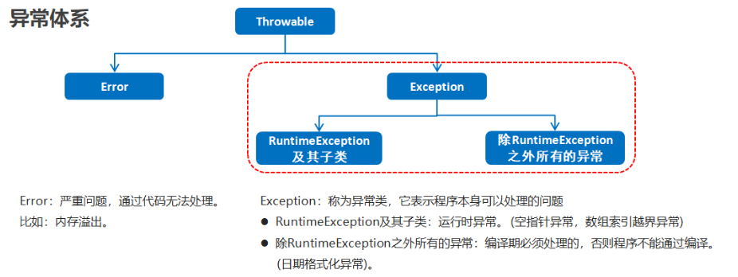
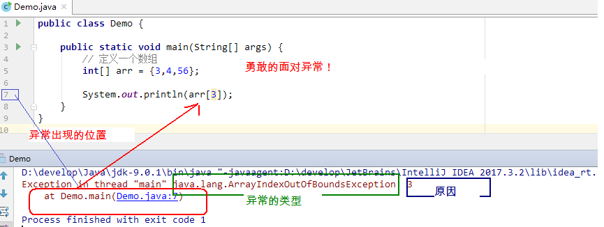
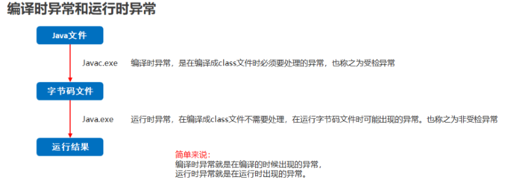
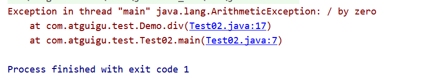

# 第8章 异常

## 学习目标

- [ ] 能够辨别程序中异常和错误
- [ ] 说出异常的分类
- [ ] 说出虚拟机处理异常的方式
- [ ] 列出常见的5个运行时异常
- [ ] 列出常见的5个编译时异常
- [ ] 能够使用try...catch关键字处理异常
- [ ] 能够使用throw抛出异常对象
- [ ] 能够使用throws关键字处理异常
- [ ] 能够自定义异常类
- [ ] 能够处理自定义异常类

## 8.1 认识异常

### 8.1.1 概述

```tex
指的是程序在执行过程中，出现的非正常的情况，如果不处理最终会导致JVM的非正常停止。
```

在使用计算机语言进行项目开发的过程中，即使程序员把代码写得尽善尽美，在系统的**运行过程**中仍然会遇到一些问题，因为很多问题不是靠代码能够避免的，比如：客户输入数据的格式问题，读取文件是否存在，网络是否始终保持通畅等等。

```tex
注意:
	语法错误和逻辑代码错误,不是异常
```

### 8.1.2 异常的体系结构



##### Throwable

`java.lang.Throwable` 类是 Java 语言中所有错误或异常的超类。

##### Throwable的子类:

`Throwable`有两个直接子类：

`java.lang.Error`与`java.lang.Exception`，平常所说的异常指`java.lang.Exception`

- ##### Error

  - 表示严重错误，一旦发生必须停下来查看问题并解决问题才能继续，无法仅仅通过try...catch解决的错误。
  - 例如：StackOverflowError（栈内存溢出）和OutOfMemoryError（堆内存溢出，简称OOM）。

- ##### Exception(常说的异常  )

  - 表示普通异常，其它因编程错误或偶然的外在因素导致的一般性问题，程序员可以通过代码的方式检测、提示和纠正，使程序继续运行，但是只要发生也是必须处理，否则程序也会挂掉。（这就好比普通感冒、阑尾炎、牙疼等，可以通过短暂休息、吃药、打针、或小手术简单解决，但是也不能搁置不处理，不然也会要人命）。

  - 例如：空指针访问、试图读取不存在的文件、网络连接中断、数组下标越界等

    

    无论是Error还是Exception，还有很多子类，异常的类型非常丰富。***当代码运行出现异常时，特别是我们不熟悉的异常时，不要紧张，把异常的简单类名，拷贝到API中去查去认识它即可。***

    

##### 异常的分类

##### 	编译时异常和运行时异常(受检异常和非受检异常)



- ##### 编译时异常

  - （即checked异常、受检异常）：在代码编译阶段，编译器就能明确**警示**当前代码**可能发生（不是一定发生）**xx异常，并**督促**程序员提前编写处理它的代码。
  - 除RuntimeException外的其他Exception子类
  - 必须显示处理，否则程序就会发生错误，无法通过编译

- ##### 运行时异常(非受检异常)

  - （即runtime异常、unchecked非受检异常）：即在代码编译阶段，编译器完全不做任何检查，无论该异常是否会发生，编译器都不给出任何提示。只有等代码运行起来并确实发生了xx异常，它才能被发现。通常，这类异常是由程序员的代码编写不当引起的，只要稍加判断，或者细心检查就可以避免的。例如：ArrayIndexOutOfBoundsException数组下标越界异常，ClassCastException类型转换异常。
  - 都是RuntimeException类及其子类
  - 无需显示处理，也可以和编译时异常一样处理

### 8.1.3 演示常见的错误和异常

#### 1、Error

最常见的就是VirtualMachineError，它有两个经典的子类：StackOverflowError、OutOfMemoryError。

```java
package com.atguigu.test;

public class Test01{

    public static void main(String[] args) {
        fun();//StackOverflowError
    }

    public static void fun(){
        fun();
    }
}

```

```java
package com.atguigu.test;

public class Test02 {

    public static void main(String[] args) {
        int[] arr = new int[Integer.MAX_VALUE];//OutOfMemoryError
    }

}


```

#### 2、运行时异常

```java
package com.atguigu.exception;

import org.junit.Test;

import java.util.Scanner;

public class TestRuntimeException {
    @Test
    public void test01(){
        //NullPointerException
        int[][] arr = new int[3][];
        System.out.println(arr[0].length);
    }

    @Test
    public void test02(){
        //ClassCastException
        Object obj = 15;
        String str = (String) obj;
    }

    @Test
    public void test03(){
        //ArrayIndexOutOfBoundsException
        int[] arr = new int[5];
        for (int i = 1; i <= 5; i++) {
            System.out.println(arr[i]);
        }
    }

    @Test
    public void test04(){
        //InputMismatchException
        Scanner input = new Scanner(System.in);
        System.out.print("请输入一个整数：");//输入非整数
        int num = input.nextInt();
        input.close();
    }

    @Test
    public void test05(){
        int a = 1;
        int b = 0;
        //ArithmeticException
        System.out.println(a/b);
    }
}

```

#### 3、编译时异常

```java
package com.atguigu.exception;

import org.junit.Test;

import java.io.FileInputStream;
import java.io.FileNotFoundException;
import java.sql.Connection;
import java.sql.DriverManager;
import java.sql.SQLException;

public class TestCheckedException {
    @Test
    public void test06() throws InterruptedException{
        Thread.sleep(1000);//休眠1秒
    }

    @Test
    public void test07() throws FileNotFoundException {
        FileInputStream fis = new FileInputStream("Java学习秘籍.txt");
    }

    @Test
    public void test08() throws SQLException {
        Connection conn = DriverManager.getConnection("....");
    }
}
```

## 8.2 异常的处理

### 8.2.1 JVM默认处理异常的方式:

```tex
当代码在main函数中出现了异常时,main函数收到这个问题时,有两种处理方式:

- 自己有处理异常的代码,则自己将该问题处理,然后继续运行

- 自己没有针对的处理方式,只有交给调用main的jvm来处理

	* jvm有一个默认的异常处理机制
		将该异常的名称,异常的信息.异常出现的位置打印在了控制台上
		将程序停止运行
```

```java
package com.atguigu.test;

public class Test02 {

    public static void main(String[] args) {
        System.out.println(5 / 0);
    }

}
```



### 8.2.2 如何处理异常?

```tex
处理异常原则: 
	- 如果该异常内部不处理,希望交由调用者处理,这时用throws(声明式异常)		
	- 如果该异常内部可以将问题处理,用try
	
	* 区别:
		* 后续程序不需要继续运行就throws
		* 后续程序需要继续运行就try
		
	* 如果JDK没有提供对应的异常，需要自定义异常。
	
Java异常处理的五个关键字：try、catch、finally、throw、throws
```

#### 8.2.2.1 处理异常方式一:

####  throws的方式处理异常(自己不处理)

```tex
定义功能方法时，需要把出现的问题暴露出来让调用者去处理

那么就通过throws在方法上标识(提示方法的调用者该方法可能会出现异常)。

定义格式:
	throws 异常类名1,异常类名2…{   }	
	位置:
		方法的定义后
		
throws可抛的异常类型

	- throws 后面抛出的是编译时异常(声明必须显示)
		必须对其进行处理（JVM会报错）
		如果在编写方法体的代码时，某句代码可能发生某个编译时异常，不处理编译不通过，但是在当前方法体中可能不适合处理或无法给出合理的处理方式，就可以通过throws在方法签名中声明该方法可能会发生xx异常，需要调用者处理。
	
	- throws 后面抛出的是运行时异常 (声明可以省略)
	可以处理也可以不处理（JVM不报错）
	当然，throws后面也可以写运行时异常类型，只是运行时异常类型，写或不写对于编译器和程序执行来说都没有任何区别。如果写了，唯一的区别就是调用者调用该方法后，使用try...catch结构时，IDEA可以获得更多的信息，需要添加什么catch分支。
```

##### 代码演示

```java
package com.atguigu;

import java.io.FileInputStream;
import java.io.FileNotFoundException;

public class Demo3 {

    public static void main(String[] args) throws FileNotFoundException {
        method1();
        method2();

    }

    public static void method1() throws ArrayIndexOutOfBoundsException{
        int[] arr = {1,2,3};
        System.out.println(arr[3]);
    }

    public static void method2() throws FileNotFoundException {
        FileInputStream fis = new FileInputStream("aaa.txt");
    }
}

```

##### 手动抛出异常对象：throw

Java程序的执行过程中如出现异常，会生成一个异常类对象，该异常对象将被提交给Java运行时系统，这个过程称为抛出(throw)异常。异常对象的生成有两种方式：

- 由虚拟机自动生成：程序运行过程中，虚拟机检测到程序发生了问题，就会在后台自动创建一个对应异常类的实例对象并抛出——自动抛出。
- 由开发人员手动创建：**new 异常类型(【实参列表】)**;，如果创建好的异常对象不抛出对程序没有任何影响，和创建一个普通对象一样，但是一旦throw抛出，就会对程序运行产生影响了。

**使用格式：**

```java
定义
	throw new 异常类名(参数);

位置:
	方法内
```

throw语句抛出的异常对象，和JVM自动创建和抛出的异常对象一样。

- 如果是编译时异常类型的对象，同样需要使用throws或者try...catch处理，否则编译不通过。
- 如果是运行时异常类型的对象，编译器不提示。
- 但是无论是编译时异常类型的对象，还是运行时异常类型的对象，如果没有被try..catch合理的处理，都会导致程序崩溃。

throw语句会导致程序执行流程被改变，throw语句是明确抛出一个异常对象，因此它下面的代码将不会执行，如果当前方法没有try...catch处理这个异常对象，throw语句就会代替return语句提前终止当前方法的执行，并返回一个异常对象给调用者。

##### 代码演示

```java
package com.atguigu;

import com.atguigu.bean.Person;

public class Demo4 {

    /*
    异常
        程序在运行时,遇到的非正常的现象

        异常分类
            Error  严重 硬件  程序员处理不了

            Exception
                可能代码逻辑引发的问题
         如何处理异常
         1> 自己不处理 把异常抛给调用者去处理
            格式  方法的声明后 + throws + 异常类型(如 Exception )
                引发的 编译期异常
                作用:旨在提醒该方法的调用者 该方法可能会有异常产生,要求调用者必须处理
                throws
                    标记 表示提醒调用者该方法可能有异常
                    位置:方法的声明上  +  异常类型

                throw
                    动作  表示方法内部抛出的具体异常对象
                    位置:方法内部  + 异常对象

            谁来决定该方法抛的异常是  编译期异常还是运行时异常
            	如果方法上声明了throws ,
                那么后面的异常类型除了RuntimeExcetion表示运行时异常外,其它都是编译期异常
                
                如果throws的异常是Exception 那么默认是  编译期异常
                如果throw 抛的是Exception 那么 该方法必须要有throws + Exception
                如果throw 抛的是RuntimeExcetion  那么 该方法可以不写throws

         2> 自己处理 try...catch

     */
    public static void main(String[] args) {
        Person p = new Person();
        p.setName("张三");
        p.setAge(233);// 编译期异常
        System.out.println(p);
    }
}

```

##### Person类

```java
package com.atguigu.bean;

public class Person {

    private String name;
    private int age;

    public Person() {
    }

    public Person(String name, int age) {
        this.name = name;
        this.age = age;
    }

    public String getName() {
        return name;
    }

    public void setName(String name) {
        this.name = name;
    }

    public int getAge() {
        return age;
    }

    // throws 方法声明上  标记 提醒该方法的调用者  +  异常类型
    public void setAge(int age) {//

        if(age >= 0 && age <= 150){

            this.age = age;
        }

        // throw  动作 抛出一个异常对象  + 异常对象
        throw new RuntimeException("年龄不合法") ;

    }

    @Override
    public String toString() {
        return "Person{" +
                "name='" + name + '\'' +
                ", age=" + age +
                '}';
    }
}

```


##### throw的概述以及和throws的区别

```tex
- throws
		* 用在方法声明后面，跟的是异常类名
		* 可以跟多个异常类名，用逗号隔开，多个异常之间没有顺序约束。
		* 表示抛出异常，由该方法的调用者来处理
- throw
		* 用在方法体内，跟的是异常对象
		* 只能抛出一个异常对象名
		* 表示抛出异常，由方法体内的语句处理

本质
throws  标记          表明调用该方法有可能会出现异常    表象
throw   具体的逻辑行为  抛出去异常                    动作
```

#### 8.2.2.2  处理异常方式二:

#### try…catch捕获异常(自己处理)

```tex
定义功能方法时，需要把出现的问题自己捕获并解决

那么就通过try…catch方式处理

- try...catch
- try...catch...finally
- try...finally

注意事项：
当通过trycatch将问题处理了,程序会继续执行
```

#### 1、try...catch基本格式

捕获异常语法如下：

~~~java
try{
     可能发生xx异常的代码
}catch(异常类型1  e){
     处理异常的代码1
}catch(异常类型2  e){
     处理异常的代码2
}
....
    
如果多个catch分支的异常处理代码一致，那么在JDK1.7之后还支持如下写法：  
try{
     可能发生xx异常的代码
}catch(异常类型1 | 异常类型2  e){
     处理异常的代码1
}catch(异常类型3  e){
     处理异常的代码2
}
....
~~~

try{}中编写可能发生xx异常的业务逻辑代码。

catch分支，分为两个部分，catch()中编写异常类型和异常参数名，{}中编写如果发生了这个异常，要做什么处理的代码。如果有多个catch分支，并且多个异常类型有父子类关系，**必须保证小的子异常类型在上**，大的父异常类型在下。

当某段代码可能发生异常，不管这个异常是编译时异常（受检异常）还是运行时异常（非受检异常），我们都可以使用try块将它括起来，并在try块下面编写catch分支尝试捕获对应的异常对象。

- 如果在程序运行时，try块中的代码没有发生异常，那么catch所有的分支都不执行。
- 如果在程序运行时，try块中的代码发生了异常，根据异常对象的类型，将从上到下选择第一个匹配的catch分支执行。此时try中发生异常的语句下面的代码将不执行，而整个try...catch之后的代码可以继续运行。
- 如果在程序运行时，try块中的代码发生了异常，但是所有catch分支都无法匹配（捕获）这个异常，那么JVM将会终止当前方法的执行，并把异常对象“抛”给调用者,由调用者去处理。

##### 示例代码：

```java
package com.atguigu.test;

public class Test02 {

    public static void main(String[] args) {

        int a = 10;
        int b = 0;
        int[] arr = {11,22,33,44,55};

        try {
            System.out.println(a / b);
            System.out.println(arr[10]);
            arr = null;
            System.out.println(arr[0]);
        } catch (ArithmeticException e) {
            System.out.println("除数不能为零");
        } catch (ArrayIndexOutOfBoundsException e) {
            System.out.println("索引越界了");
        } catch (Exception e) {
            System.out.println("出错了");
        }

        //JDK7之后写法
        /*try {
            System.out.println(a / b);
            System.out.println(arr[10]);
        } catch (ArithmeticException | ArrayIndexOutOfBoundsException e) {
            System.out.println("出错了");
        }*/

    }

 }
```

#### 2、在catch分支中获取异常信息

如何获取异常信息，Throwable类中定义了一些查看方法:

* `public String getMessage()`:获取异常的描述信息,原因(提示给用户的时候,就提示错误原因。


* `public void printStackTrace()`:打印异常的跟踪栈信息并输出到控制台。

​            *包含了异常的类型,异常的原因,还包括异常出现的位置,在开发和调试阶段,都得使用printStackTrace。*

##### 代码演示

```java
package com.atguigu.test;

public class Test02 {

    public static void main(String[] args) {

        int a = 10;
        int b = 0;
        int[] arr = {11,22,33,44,55};

        /*try {
            System.out.println(a / b);
            System.out.println(arr[10]);
            arr = null;
            System.out.println(arr[0]);
        } catch (ArithmeticException e) {
            System.out.println("除数不能为零");
        } catch (ArrayIndexOutOfBoundsException e) {
            System.out.println("索引越界了");
        } catch (Exception e) {
            System.out.println("出错了");
        }*/

        //JDK7之后写法
        try {
            System.out.println(a / b);
            System.out.println(arr[10]);
        } catch (ArithmeticException | ArrayIndexOutOfBoundsException e) {
            e.printStackTrace();
            System.out.println(e.getMessage());
        }

    }


 }

```

#### 3、 finally块    

```java
finally
 	关键字: 最终的
 
作用
 	被finally控制的语句体一定会执行，即使cath语句中有return语句，也一定会执行
	* 特殊情况：在执行到finally之前jvm退出了(比如System.exit(0))

应用场景
	因为异常会引发程序跳转，从而会导致有些语句执行不到。而程序中有一些特定的代码无论异常 是否发生，都需要执行。例如，IO流的关闭，数据库连接的断开等。这样的代码通常就会放到finally块中。

- 注意
	1.finally不能单独使用;
	2.finally控制的语句体一定会执行，除非退出JVM例如System.exit(0),此时finally才不会执行;
	3.不要在finally中写return语句及逻辑业务的代码,finally只推荐作用于释放资源。
	
	
用法:

 try{
     
 }catch(...){
     
 }finally{
     无论try中是否发生异常，也无论catch是否捕获异常，也不管try和catch中是否有return语句，都一定会执行
 }
 
 或
 try{
     
 }finally{
     无论try中是否发生异常，也不管try中是否有return语句，都一定会执行。
 } 
```

##### 示例代码：

```java
package com.atguigu.test;

public class Test02 {

    public static void main(String[] args) {
        System.out.println(demo());

    }

    public static int demo(){
        try {
            System.out.println("try...");
            // System.out.println(1 / 0);
            return 1;

        } catch (Exception e) {
            System.out.println("catch...");
            return 2;
        } finally {
            System.out.println("finally...");
            // return 3;
        }
    }
 }    
```

##### 示例代码

```java
package com.atguigu;

public class Demo6 {
    /*
        不运行代码,请回答此方法的返回值为多少?且x进行了几次赋值动作?
     */
    public static void main(String[] args) {
        System.out.println(demo1());
    }

    private static int demo1() {

        int x = 10;
        try {
            x = 20;
            System.out.println(1/0);
            return x;
        } catch (Exception e) {
            System.out.println("出错了");
            x = 30;
            return x;
        } finally {
            System.out.println("执行了吗");
            x = 40;
        }

    }
}
```


##### finally相关面试题

```tex
final,finally和finalize的区别

	final	修饰符 关键字 最终的不可以更改的
			* 修饰类,不能被继承
			* 修饰方法,不能被重写
			* 修饰变量,只能赋值一次,变成了常量
			
	finally是try语句中的一个语句体,不能单独使用,用来释放资源,finally语句中的代码一定会执行
	
	finalize是一个Object方法,当垃圾回收器确定不存在对该对象的 引用时，由对象的垃圾回收器调用此方法。
```


## 8.3 自定义异常

**为什么需要自定义异常类:**

我们说了Java中不同的异常类,分别表示着某一种具体的异常情况,那么在开发中总是有些异常情况是核心类库中没有定义好的，此时我们需要**根据自己业务的异常情况来定义异常类,让异常更符合业务,更见名知意**。例如年龄负数问题，考试成绩负数问题等等。

**异常类如何定义:**

```tex
1.定义一个见名知意的异常类

2.与异常类建立继承关系
	继承java.lang.Exception,为编译时异常
	继承java.lang.RuntimeException为运行时异常
	
3.定义构造器
	空参+有参(String Message)
	
注意:
	自定义的异常只能通过throw抛出
```

##### 代码演示:

~~~java
package com.atguigu.define;

public class AgeOutOfBoundsException extends Exception {

	public AgeOutOfBoundsException() {
		
	}

	public AgeOutOfBoundsException(String message) {
		super(message);
	
	}

}
~~~

```java
package com.atguigu.define;

class Person {
	private String name;
	private int age;
	public Person() {
		super();
		
	}
	public Person(String name, int age) {
		super();
		this.name = name;
		this.age = age;
	}
	public String getName() {
		return name;
	}
	public void setName(String name) {
		this.name = name;
	}
	public int getAge() {
		return age;
	}
	public void setAge(int age) throws AgeOutOfBoundsException {
		if(age >0 && age <= 150) {
			this.age = age;
		}else {
			throw new AgeOutOfBoundsException("年龄非法");
		}
	}
	
	
}
```

```java
package com.atguigu.define;

public class TestException {
   		
	public static void main(String[] args) throws Exception {
		Person p = new Person();
		p.setAge(-17);
		System.out.println(p.getAge());
	}
} 
```

## 8.4 感悟


  

