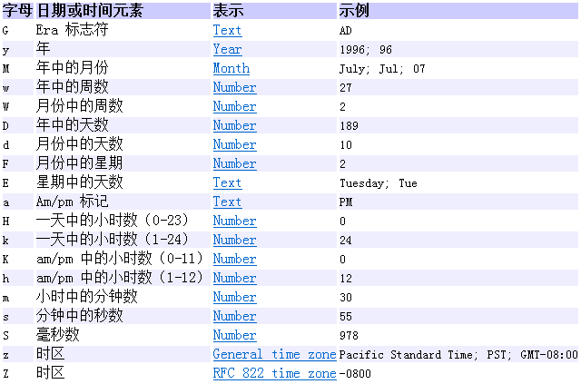

# 第9章 基础API

## 学习目标

* [ ] 熟练掌握String类的API

* [ ] 熟练掌握StringBuilder和StringBuffer类的API

* [ ] 了解数学相关API

* [ ] 了解日期时间API

* [ ] 了解系统类API

* [ ] 掌握数组基础算法

* [ ] 掌握数组工具类的使用

  

# 第9章 基础API

## 9.1 API概述

###  9.1.1 什么是API

​	API (**A**pplication **P**rogramming **I**nterface) ：应用程序编程接口


- Java中的API

  ```tex
  指的就是 JDK 中提供的各种功能的 Java类，这些类将底层的实现封装了起来，我们不需要关心这些类是如何实现的，只需要学习这些类如何使用即可，我们可以通过帮助文档来学习这些API如何使用。
  
  注意:
  	API与API帮助文档不是一同事
  ```

### 9.1.2  如何使用API帮助文档【应用】

- ##### 打开帮助文档


- ##### 找到索引选项卡中的输入框


- ##### 在输入框中输入Random


- ##### 看类在哪个包下


- ##### 看类的描述


- ##### 看构造方法


- ##### 看成员方法


## 9.2 String(不可变字符序列)(重点)

### 概述

```tex
1 String 类在 java.lang 包下，所以使用的时候不需要导包;

2 String 类代表字符串，Java 程序中的所有字符串文字（例如“abc”）都被实现为此类的实例;

3 字符串是常量；它们的值在创建之后不能更改。(引用关系可以被改变)。

补充:
    - 因为字符串对象设计为不可变,因此字符串有常量池来保存很多常量对象
    - Java 语言提供对字符串串联符号（"+"）以及将其他对象转换为字符串的特殊支持（toString()方法）。
```

### 9.2.1 字符串的特点

1、字符串String类型本身是final声明的，意味着我们不能继承String。

2、字符串的对象也是不可变对象，意味着一旦进行修改，就会产生新对象

> 我们修改了字符串后，如果想要获得新的内容，必须重新接收。
>
> 如果程序中涉及到大量的字符串的修改操作，那么此时的时空消耗比较高。可能需要考虑使用StringBuilder或StringBuffer的可变字符序列。

3、String对象内部是用字符数组进行保存的

> JDK1.9之前有一个char[] value数组，JDK1.9之后byte[]数组

`"abc"` 等效于 `char[] data={ 'a' , 'b' , 'c' }`。

4、String类中这个char[] values数组也是final修饰的，意味着这个数组不可变，然后它是private修饰，外部不能直接操作它，String类型提供的所有的方法都是用新对象来表示修改后内容的，所以保证了String对象的不可变。

5、就因为字符串对象设计为不可变，那么所以字符串有常量池来保存很多常量对象

常量池在方法区。

```java
String s1 = "abc";
String s2 = "abc";
System.out.println(s1 == s2);
// 内存中只有一个"abc"对象被创建，同时被s1和s2共享。
```

### 9.2.2 字符串常见的构造方法

```tex
public String():空构造   “”
public String(byte[] bytes):把字节数组转成字符串
public String(byte[] bytes,int index,int length):把字节数组的一部分转成字符串
public String(char[] value):把字符数组转成字符串   //字符常量 字符串
public String(char[] value,int index,int count):把字符数组的一部分转成字符串
public String(String original):把字符串常量值转成字符串   
```

##### 示例代码:

```java
package com.atguigu.string;

public class Demo1 {

    /*
        字符串的常见构造
        public String():空构造   “”
        public String(byte[] bytes):把字节数组转成字符串
        public String(byte[] bytes,int index,int length):把字节数组的一部分转成字符串
        public String(char[] value):把字符数组转成字符串   //字符常量 字符串
        public String(char[] value,int index,int count):把字符数组的一部分转成字符串
        public String(String original):把字符串常量值转成字符串
     */
    public static void main(String[] args)  {

        //字符串常量对象
        String str = "hello";
        System.out.println("str = " + str);

        // 无参构造
        String str1 = new String();
        System.out.println("str1 = " + str1);

        //通过字符数组构造
        byte[] arr1 = {97,98,99,100,101,102};
        String str2 = new String(arr1);		//将arr2字节数组全部转换
        String str3 = new String(arr1,2,3);		//将arr2字节数组从2索引开始转换3个
        System.out.println("str2 = " + str2);
        System.out.println("str3 = " + str3);

        //通过字符数组构造
        char[] arr2 = {'a', 'b', 'c','d','e'};
        String str4 = new String(arr2);//将arr1字符数组全部转换
        String str5 = new String(arr2,0,2);//将arr1字符数组从0索引开始转换2个
        System.out.println("str4 = " + str4);
        System.out.println("str5 = " + str5);

        //创建"hello"字符串常量的副本
        String str6 = new String("hello");
        System.out.println("str6 = " + str6);

    }

}
```

### 9.2.3 创建字符串对象的区别对比

- **通过构造方法创建**

  ​	通过 new 创建的字符串对象，每一次 new 都会申请一个内存空间，虽然内容相同，但是地址值不同

- **直接赋值方式创建**

  ​	以“ ”方式给出的字符串，只要字符序列相同(顺序和大小写)，无论在程序代码中出现几次，JVM 都只会建立一个 String 对象，并在字符串池中维护

  ##### 面试题

  ```java
  String str1 = "hello";
  String str2 = new String("hello");
  
  //上面的代码一共有几个字符串对象。
  //2个
  
  相关概念
  	常量池特殊性:
  		如果常量在常量池中已经存在,再使用时不需要重新创建,直接使用
  ```

### 9.2.4 字符串拼接问题(面试题)

#### "+"拼接结果的存储和比较问题

原则：

```tex
（1）常量+常量：结果是常量池(常量优化,因为编译期间就可以确定结果)
（2）常量与变量 或 变量与变量：结果是堆
（3）拼接后调用intern方法：结果在常量池
```

##### 代码演示:

```java
package com.atguigu;

import org.junit.Test;

public class Demo1 {

    @Test
    public void test01(){

        final String s1 = "hello";
        final String s2 = "world";
        String s3 = "hello";
        String s4 = "world";

        String s5 = "helloworld";

        String s6 = s1 + s2;//常量+ 常量 结果在常量池中，因为编译期间就可以确定结果
        String s7 = s3 + "world";//s3是变量，"world"常量，变量 + 常量的结果在堆中
        String s8 = s3 + s4;//s3和s3都是变量，变量 + 变量的结果在堆中
        String s9 = "hello" + "world";//常量+ 常量 结果在常量池中，因为编译期间就可以确定结果

        System.out.println(s5 == s6);//true
        System.out.println(s5 == s7);//false
        System.out.println(s5 == s8);//false
        System.out.println(s5 == s9);//true
    }

    @Test
    public void test02(){
        String s1 = "hello";
        String s2 = "world";
        String s3 = "helloworld";

        String s4 = (s1 + "world").intern();//把拼接的结果放到常量池中
        String s5 = (s1 + s2).intern();

        System.out.println(s3 == s4);//true
        System.out.println(s3 == s5);//true
    }
}

```

### 9.2.5 字符串的常用方法

#### 1、系列1：判断功能

```tex
boolean equals(Object obj):比较字符串的内容是否相同,区分大小写  
boolean equalsIgnoreCase(String str):比较字符串的内容是否相同,忽略大小写
boolean contains(String str):判断字符串中是否包含参数字符串
boolean startsWith(String str):判断字符串是否以指定的参数字符串开头
boolean endsWith(String str):判断字符串是否以某个指定的参数字符串结尾
boolean isEmpty():判断字符串是否为空。 与null区分
```

##### 代码演示一:

```java
package com.atguigu.string;

public class Demo2 {

    /*
    String的判断功能
    boolean equals(Object obj):比较字符串的内容是否相同,区分大小写
    boolean equalsIgnoreCase(String str):比较字符串的内容是否相同,忽略大小写
    boolean contains(String str):判断字符串中是否包含参数字符串
    boolean startsWith(String str):判断字符串是否以指定的参数字符串开头
    boolean endsWith(String str):判断字符串是否以某个指定的参数字符串结尾
    boolean isEmpty():判断字符串是否为空。 与null区分
     */
    public static void main(String[] args) {

        String s1 = "abCED";
        String s2 = "ABCED";
        System.out.println(s1.equals(s2));
        System.out.println(s1.equalsIgnoreCase(s2));

        System.out.println("----------------");
        String s3 = "adgjk";
        String s4 = "gj";
        System.out.println(s3.contains(s4));

        System.out.println("---------");
        String s5 = "sfsdjgodi";
        String s6 = "sf";
        System.out.println(s5.startsWith(s6));
        String s7 = "di";
        System.out.println(s5.endsWith(s7));

        System.out.println("---------");
        String s8 = "";
        String s9 = new String();
        String s10 = new String("");
        System.out.println(s8.isEmpty());
        System.out.println(s9.isEmpty());
        System.out.println(s10.isEmpty());
        System.out.println(s8.length());
        System.out.println(s9.length());
        System.out.println(s10.length());

        System.out.println("-------------");
        String s11 = null;
        System.out.println(s11.isEmpty());//NullPointerException


    }
}

```

##### 特殊字符串_空字符串

##### 1、哪些是空字符串

```tex
空字符串：长度为0的字符串
```

```java
package com.atguigu;


public class Demo1 {

    public static void main(String[] args) {
        String str1 = "";
        String str2 = new String();
        String str3 = new String("");
        System.out.println(str1.length());// 0
        System.out.println(str2.length());// 0
        System.out.println(str3.length());// 0
    }
}

```

##### 2、对字符串的非空判断(null 及空字符串)

```java
if("".equals(str))

if(str!=null  && str.isEmpty())

if(str!=null && str.equals(""))

if(str!=null && str.length()==0)
```

#### 2、系列2：获取功能

```tex
int length():获取字符串的长度。
char charAt(int index):获取指定索引位置的字符
int indexOf(int ch):返回指定字符在此字符串中第一次出现处的索引。
int indexOf(String str):返回指定字符串在此字符串中第一次出现处的索引。
int indexOf(int ch,int fromIndex):返回指定字符在此字符串中从指定位置后第一次出现处的索引。
int indexOf(String str,int fromIndex):返回指定字符串在此字符串中从指定位置后第一次出现处的索引。
lastIndexOf
String substring(int start):从指定位置开始截取字符串(含),默认到末尾。
String substring(int start,int end):从指定位置开始(含)到指定位置结束截取字符串。
```

##### 代码演示

```java
package com.atguigu;

import org.junit.Test;

public class Demo {
    /*
    String的获取功能
    int length():获取字符串的长度。
    char charAt(int index):获取指定索引位置的字符
    
    int indexOf(int ch):返回指定字符在此字符串中第一次出现处的索引。
    int indexOf(String str):返回指定字符串在此字符串中第一次出现处的索引。
    int indexOf(int ch,int fromIndex):返回指定字符在此字符串中从指定位置后第一次出现处的索引。
    int indexOf(String str,int fromIndex):返回指定字符串在此字符串中从指定位置后第一次出现处的索引。
    lastIndexOf
    
    String substring(int start):从指定位置开始截取字符串(含),默认到末尾。
    String substring(int start,int end):从指定位置开始(含)到指定位置结束截取字符串。
     */
    @Test
    public void test01(){

        //int[] arr = {11,22,33};
        //System.out.println(arr.length);				//数组中的length是属性
        String s1 = "sarah";
        System.out.println(s1.length());                //length()是一个方法,获取的是每一个字符的个数
        String s2 = "天王盖地虎";
        System.out.println(s2.length());

        char c = s2.charAt(4);                            //根据索引获取对应位置的字符
        System.out.println(c);
        char c2 = s2.charAt(5);                        //报错 StringIndexOutOfBoundsException字符串索引越界异常
        System.out.println(c2);

    }

    @Test
    public void test02(){

        String s1 = "sarah";
        int index = s1.indexOf('a');		//参数接收的是int类型的,传递char类型的会自动提升
        System.out.println("index = " + index);

        int index2 = s1.indexOf('z');       //如果不存在返回就是-1
        System.out.println("index2 = " + index2);

        int index3 = s1.indexOf("a");      //获取字符串中第一个字符出现的位置
        System.out.println("index3 = " + index3);//1
        int index6 = s1.lastIndexOf("a");
        System.out.println("index6 = " + index6);//3

        int index4 = s1.indexOf('a',2);//返回指定字符在此字符串中从指定位置后第一次出现处的索引
        System.out.println("index4 = " + index4);

        int index5 = s1.indexOf("a",4); //返回指定字符串在此字符串中从指定位置后第一次出现处的索引
        System.out.println("index5 = " + index5);
        
    }
    
    @Test
    public void test03(){
        
        String s1 = "sarah";
        String substring = s1.substring(1);//从指定位置开始截取字符串,默认到末尾。
        System.out.println("substring = " + substring);
        String substring1 = s1.substring(1, 3);//从指定位置开始到指定位置结束截取字符串。
        System.out.println("substring1 = " + substring1);
    }
   
}

```

#### 3、系列3：转换功能：

 ```tex
byte[] getBytes():把字符串转换为字节数组。
char[] toCharArray():把字符串转换为字符数组。
static String valueOf(char[] chs):把字符数组转成字符串。
static String valueOf(int i):把int类型的数据转成字符串。
	注意：String类的valueOf方法可以把任意类型的数据转成字符串。
String toLowerCase():把字符串转成小写。(了解)
String toUpperCase():把字符串转成大写。
String concat(String str):把字符串拼接。(concat方法拼接，哪怕是两个常量对象拼接，结果也是在堆)   
 ```

##### 代码演示一

```java
package com.atguigu;

import org.junit.Test;

public class Demo {
    /*
    String的转换功能
    byte[] getBytes():把字符串转换为字节数组。
    char[] toCharArray():把字符串转换为字符数组。
    static String valueOf(char[] chs):把字符数组转成字符串。
    static String valueOf(int i):把int类型的数据转成字符串。
        注意：String类的valueOf方法可以把任意类型的数据转成字符串。
    String toLowerCase():把字符串转成小写。(了解)
    String toUpperCase():把字符串转成大写。
    String concat(String str):把字符串拼接。(concat方法拼接，哪怕是两个常量对象拼接，结果也是在堆)
     */
    @Test
    public void test01(){

        String s1 = "abc";
        byte[] arr = s1.getBytes();
        for (int i = 0; i < arr.length; i++) {
            System.out.print(arr[i] + " ");
        }

        System.out.println("----------");
        String s2 = "你好你好";
        byte[] arr2 = s2.getBytes();
        for (int i = 0; i < arr2.length; i++) {
            System.out.print(arr2[i] + " ");		//gbk一个中文代表两个字节
        }											//gbk码表特点,中文的第一个字节肯定是负数


    }

    @Test
    public void test02(){

        String s = "sarah";
        char[] arr = s.toCharArray();			//将字符串转换为字符数组

        for (int i = 0; i < arr.length; i++) {
            System.out.print(arr[i] + " ");
        }
    }

    @Test
    public void test03(){

        char[] arr = {'a','b','c'};
        String s = String.valueOf(arr);			//底层是由String类的构造方法完成的
        System.out.println(s);

        String s2 = String.valueOf(100);		//将100转换为字符串
        System.out.println(s2 + 100);

        Person p1 = new Person("张三", 23);
        System.out.println(p1);
        String s3 = String.valueOf(p1);			//调用的是对象的toString方法
        System.out.println(s3);
    }


    @Test
    public void test04(){
        String s1 = "Sarah";
        String s2 = "chengxuYUAN";
        String s3 = s1.toLowerCase();
        String s4 = s2.toUpperCase();

        System.out.println(s3);
        System.out.println(s4);

        System.out.println(s3 + s4);				//用+拼接字符串更强大,可以用字符串与任意类型相加
        System.out.println(s3.concat(s4));			//concat方法调用的和传入的都必须是字符串

        // concat方法拼接，哪怕是两个常量对象拼接，结果也是在堆
        System.out.println("--------------------");
        String s5 = "sarah";
        String s6 = "CHENGXUYUAN";
        
        String s7 = "sarahCHENGXUYUAN";
        String s8 = "sarah" + "CHENGXUYUAN";// 常量+ 常量 结果在常量池中
        String s9 = s5 + s6;// 变量 + 变量的结果在堆中
        String s10 = "sarah" + s6;// 变量 + 常量的结果在堆中
        String s11 = "sarah".concat("CHENGXUYUAN");//concat方法拼接，哪怕是两个常量对象拼接，结果也是在堆

        System.out.println(s7 == s8);
        System.out.println(s7 == s9);
        System.out.println(s7 == s10);
        System.out.println(s7 == s11);
    }

}

```

Person类

```java
package com.atguigu;

public class Person {
    private String name;
    private int age;

    public Person() {
        super();

    }

    public Person(String name, int age) {
        super();
        this.name = name;
        this.age = age;
    }

    public String getName() {
        return name;
    }

    public void setName(String name) {
        this.name = name;
    }

    public int getAge() {
        return age;
    }

    public void setAge(int age) {
        this.age = age;
    }

    @Override
    public String toString() {
        return "Person [name=" + name + ", age=" + age + "]";
    }
}

```

#### 4、系列4：String类的其他功能

```tex
- String的替换功能及案例演示
	String replace(char old,char new) 将该字符串的old字符用new字符替换
	String replace(String old,String new)
- String的去除字符串两边空字符及案例演示
	String trim()      //去除字符串前后的空字符 "  啊啊啊"
- String的按字典顺序比较两个字符串及案例演示
	int compareTo(String str)// 先获取两个字符串的长度,如果字符相同则返回长度的差值,否则返回的是字符码表值的差值
	int compareToIgnoreCase(String str)(比较忽略大小写)
- String字符串在常量池中共享
	public String intern()：结果在常量池中共享
```

##### 代码演示

```java
package com.atguigu;

import org.junit.Test;

public class Demo {
    /*
     - String的替换功能及案例演示
        String replace(char old,char new) 将该字符串的old字符用new字符替换
        String replace(String old,String new)
    - String的去除字符串两空格及案例演示
        String trim()      //去除字符串前后的空字符
    - String的按字典顺序比较两个字符串及案例演示
        int compareTo(String str)// 先获取两个字符串的长度,如果字符相同则返回长度的差值,否则返回的是字符码表值的差值
        int compareToIgnoreCase(String str)(比较忽略大小写)
    - String字符串在常量池中共享
        public String intern()：结果在常量池中共享
     */
    @Test
    public void test01(){

        String s = "sarah";
        String s2 = s.replace('a', 'o');			//用o替换i
        System.out.println("s2 = " + s2);

        String s3 = s.replace('z', 'o');			//z不存在,保留原字符不改变
        System.out.println("s3 = " + s3);

        String s4 = s.replace("ar", "haha");
        System.out.println("s4 = " + s4);

    }

    @Test
    public void test02(){

        String s = "   ni   hao   ";
        String s2 = s.trim();
        System.out.println("**" + s2+ "**");
    }

    @Test
    public void test03(){

        String s1 = "a";
        String s2 = "aaaa";

        int num = s1.compareTo(s2);				//按照码表值比较
        System.out.println("num = " + num);

        String s3 = "ab";
        String s4 = "ac";
        int num2 = s3.compareTo(s4);
        System.out.println("num2 = " + num2);

        String s5 = "sarah";
        String s6 = "Sarah";
        int num3 = s5.compareTo(s6);
        System.out.println(num3);

        int num4 = s5.compareToIgnoreCase(s6);
        System.out.println(num4);
    }


    @Test
    public void test04(){
        String s1 = "aa";
        String s2 = "bb";
        String s3 = "aabb";
        String s4 = s1 + s2;
        String s5 = s4.intern();
        System.out.println(s3 == s4);
        System.out.println(s3 == s5);
    }

}

```

#### 5、系列5：正则表达式

##### 概述

```tex
正则表达式
是指一个用来描述或者匹配一系列符合某个语法规则的字符串的单个字符串。其实就是一种规则。有自己特殊的应用。
作用:比如注册邮箱,邮箱有用户名和密码,一般会对其限制长度,这个限制长度的事情就是正则表达式做的
```

##### 案例演示

```tex
需求:给定一串字符串,校验其是否是 qq号码
	1:要求必须是5-15位数字
	2:0不能开头
	3:必须都是数字
```

```java
package com.atguigu.string;

public class Demo6 {

    /*
     需求：校验qq号码.
         1:要求必须是5-15位数字
         2:0不能开头
         3:必须都是数字
     */
    public static void main(String[] args) {

        System.out.println(checkQQ("012345"));
        System.out.println(checkQQ("a1b345"));
        System.out.println(checkQQ("123456"));
        System.out.println(checkQQ("1234567890987654321"));

        // 使用正则表达式完成需求
        System.out.println("-----------");
        String regex = "[1-9]\\d{4,14}";
        System.out.println("012345".matches(regex));
        System.out.println("a1b345".matches(regex));
        System.out.println("123456".matches(regex));
        System.out.println("1234567890987654321".matches(regex));
    }

    /*
    需求：校验qq号码.
         1:要求必须是5-15位数字
         2:0不能开头
         3:必须都是数字
     明确返回值类型boolean
     明确参数列表String qq

     */

    public static boolean checkQQ(String qq) {

        boolean flag = true;// 声明一个变量,默认为true ,代表校验结果
        if(qq.length() >= 5 && qq.length() <= 15){
            if(!qq.startsWith("0")){
                char[] arr = qq.toCharArray();
                for (int i = 0; i < arr.length; i++) {
                    char ch = arr[i];
                    if(!(ch >= '0' && ch <= '9')){
                        flag = false;
                        break;
                    }
                }
            }else{
                flag = false;
            }
        }else{
            flag = false;
        }

        return flag;

    }
}

```

##### String类中的正则匹配相关方法

```tex
boolean matchs(正则表达式)：判断当前字符串是否匹配某个正则表达式。
String[] split(正则表达式)：按照某种规则进行拆分
public String replaceAll(String regex,String replacement),按照正则表达式进行替换
```

```java
package com.atguigu.string;

public class Demo8 {

    /*
        将一个字符串按照一定的正则进行切割
        如果分隔符为. 则需注意,需要使用\\.
     */
    public static void main(String[] args) {

        // String s = "张三,李四,王五";
        // String[] arr = s.split(",");				//通过正则表达式切割字符串

        String s = "张三.李四.王五";
        String[] arr = s.split("\\.");				//通过正则表达式切割字符串

        for (int i = 0; i < arr.length; i++) {
            System.out.println(arr[i]);
        }

    }
}
```

##### 代码演示二

```tex
需求:删除字符串中所有的数字
```

```java
package com.atguigu;

public class Demo9 {

    /*
    	需求:删除字符串中所有的数字
    */
    public static void main(String[] args) {
        String s = "atestyjuki1322456vfgd12345";
        String regex = "\\d";			//\\d代表的是任意数字

        String s2 = s.replaceAll(regex, "");
        System.out.println(s2);
    }
}
```

### 9.2.6  String综合案例

#### 1、综合案例一

```tex
需求:模拟用户登录,共三次机会,并提示还有几次。(正确用户名和密码都是admin)
```

```java
package com.atguigu;

import java.util.Scanner;

public class Demo3 {
    /**
     * 需求：模拟登录,给三次机会,并提示还有几次。
     * 用户名和密码都是admin
     * 分析:
     * 1,模拟登录,需要键盘录入,Scanner
     * 2,给三次机会,需要循环,for
     * 3,并提示有几次,需要判断,if
     */
    public static void main(String[] args) {
        Scanner sc = new Scanner(System.in);		//创建键盘录入对象

        for(int i = 0; i < 3; i++) {
            System.out.println("请输入用户名:");
            String userName = sc.nextLine();			//将键盘录入的用户名存储在userName中
            System.out.println("请输入密码:");
            String password = sc.nextLine();			//将键盘录入的密码存储在password中

            //如果是字符串常量和字符串变量比较,通常都是字符串常量调用方法,将变量当作参数传递,防止空指针异常
            if("admin".equals(userName) && "admin".equals(password)) {
                System.out.println("欢迎" + userName + "登录");
                break;									//跳出循环
            }else {
                if(i == 2) {
                    System.out.println("您的错误次数已到,请明天再来吧");
                }else {
                    System.out.println("录入错误,您还有" + (2-i) + "次机会");
                }
            }

        }
    }
}

```

#### 2、综合案例二

```tex
需求：统计一个字符串中大写字母字符，小写字母字符，数字字符出现的次数,其他字符出现的次数。
ABCDEabcd123456!@#$%^
```

```java
package com.atguigu;

public class Demo3 {

   	/* 分析:字符串是有字符组成的,而字符的值都是有范围的,通过范围来判断是否包含该字符
		如果包含就让计数器变量自增
	 */
    public static void main(String[] args) {
        String s = "ABCDEabcd123456!@#$%^";
        int big = 0;
        int small = 0;
        int num = 0;
        int other = 0;
        //1,获取每一个字符,通过for循环遍历
        for(int i = 0; i < s.length(); i++) {
            char c = s.charAt(i);						//通过索引获取每一个字符
            //2,判断字符是否在这个范围内
            if(c >= 'A' && c <= 'Z') {
                big++;									//如果满足是大写字母,就让其对应的变量自增
            }else if(c >= 'a' && c <= 'z') {
                small++;
            }else if(c >= '0' && c <= '9') {
                num++;
            }else {
                other++;
            }
        }

        //3,打印每一个计数器的结果
        System.out.println(s + "中大写字母有:" + big + "个,小写字母有:" + small + "个,数字字符:"
                + num + "个,其他字符:" + other + "个");
    }
}

```

#### 3、综合案例三

```tex
需求：把数组中的数据按照指定个格式拼接成一个字符串
	举例：
		int[] arr = {1,2,3};	
	输出结果：
		"[1, 2, 3]"
```

```java
package com.atguigu;

public class Demo {

    /**
     * 分析:
     1,需要定义一个字符串"["
     2,遍历数组获取每一个元素
     3,用字符串与数组中的元素进行拼接
     */
    public static void main(String[] args) {
        int[] arr = {1,2,3};
        String s = "[";							//定义一个字符串用来与数组中元素拼接

        for (int i = 0; i < arr.length; i++) {	//{1,2,3}
            if(i == arr.length - 1) {
                s += arr[i] + "]";			//[1, 2, 3]
            }else {
                s += arr[i] + ", ";			//[1, 2,
            }
        }

        System.out.println(s);
    }
}

```

#### 4、综合案例四

```tex
需求：把一个字符串的首字母转成大写，其余为小写。(需求只考虑英文大小写字母字符)
	例:woaisaraHHahaaaa
```

```java
package com.atguigu.string;

public class Demo5 {

	/*
		需求：把一个字符串的首字母转成大写，其余为小写。(需求只考虑英文大小写字母字符)
	例:woaisaraHHahaaaa
	*/
    public static void main(String[] args) {
        
        String s = "woaisaraHHahaaaa";
        
        String s2 = s.substring(0, 1);// w
        String s3 = s2.toUpperCase();// W
        String s4 = s.substring(1);//oaisaraHHahaaaa
        String s5 = s4.toLowerCase();//oaisarahhahaaaa
        String s6 = s3.concat(s5);//Woaisarahhahaaaa

        System.out.println(s6);
    }
}
```

##### 链式编程

```java
package com.atguigu.string;

public class Demo5 {

    /*
    需求：把一个字符串的首字母转成大写，其余为小写。(需求只考虑英文大小写字母字符)
	例:woaisaraHHahaaaa
     */
    public static void main(String[] args) {

        String s = "woaisaraHHahaaaa";

        String s2 = s.substring(0, 1).toUpperCase().concat(s.substring(1).toLowerCase());
        System.out.println(s2);
    }
}
```

#### 5、综合案例五

```tex
 需求：把字符串反转
	举例：键盘录入"abc"		
	输出结果："cba"
```

```java
package com.atguigu;

import java.util.Scanner;

public class Demo {

    /**
     * 	*分析:
     *1,通过键盘录入获取字符串Scanner
     *2,将字符串转换成字符数组
     *3,倒着遍历字符数组,并再次拼接成字符串
     *4,打印
     */
    public static void main(String[] args) {
        Scanner sc = new Scanner(System.in);				//创建键盘录入对象
        System.out.println("请输入一个字符串:");
        String line = sc.nextLine();						//将键盘录入的字符串存储在line中

        char[] arr = line.toCharArray();					//将字符串转换为字符数组

        String s = "";
        for(int i = arr.length-1; i >= 0; i--) {			//倒着遍历字符数组
            s = s + arr[i];									//拼接成字符串
        }

        System.out.println(s);
    }
}

```

#### 6、综合案例六

```tex
 需求：统计大串中小串出现的次数
 	例如:
	大串为:"woaishangguigu,guiguobutonbao,sfdfobguigdaimao,dguishujiushihguiguomao"
    小串为:"guigu"
```

```java
package com.atguigu;

public class Demo {

    /*
        1.定义计数器
        2.通过indexOf()方法在大串中找小串
            如果没有 返回-1 程序结束
            如果有 返回索引值
        3. 依据获取的索引值加上小串的长度,在大串中进行截取,将截取后的大串重新赋值给大串
        4.循环执行
     */
    public static void main(String[] args) {
        //定义大串
        String max = "woaishangguigu,guiguobutongyubao,sfdfobguigdaimao,dguiaolaoshujiushihguiguomao";
        //定义小串
        String min = "guigu";

        //定义计数器变量
        int count = 0;
        //定义索引
        int index = 0;
        //定义循环,判断小串是否在大串中出现
        while((index = max.indexOf(min)) != -1) {
            count++;									//计数器自增
            max = max.substring(index + min.length());//将截取了小串剩余的部分重新赋值给大串
        }

        System.out.println(count);
    }
}

```


## 9.3 StringBuilder(可变字符序列)

### 9.3.1 StringBuilder类概述

```tex
一个可变的字符序列。此类提供一个与 StringBuffer 兼容的 API，但不保证同步。
```

```tex
因为String对象是不可变对象，虽然可以共享常量对象，但是对于频繁字符串的修改和拼接操作，效率极低。因此，JDK又在java.lang包提供了可变字符序列StringBuilder和StringBuffer类型。

注意:StringBuilder、StringBuffer的API是完全一致的
	因此我们以StringBuilder为标的,来学习可变字符序列

- StringBuilder、StringBuffe的区别:
	StringBuffer：线程安全的（因为它的方法有synchronized修饰）
	StringBuilder：线程不安全的
```

### 9.3.2 StringBuilder类的构造方法

**常用的构造方法**

| 方法名                             | 说明                                       |
| ---------------------------------- | ------------------------------------------ |
| public StringBuilder()             | 创建一个空白可变字符串对象，不含有任何内容 |
| public StringBuilder(String   str) | 根据字符串的内容，来创建可变字符串对象     |

**示例代码**

```java
public class StringBuilderDemo01 {
    public static void main(String[] args) {
        
        //public StringBuilder()：创建一个空白可变字符串对象，不含有任何内容
        StringBuilder sb = new StringBuilder();
        System.out.println("sb:" + sb);
        System.out.println("sb.length():" + sb.length());

        //public StringBuilder(String str)：根据字符串的内容，来创建可变字符串对象
        StringBuilder sb2 = new StringBuilder("hello");
        System.out.println("sb2:" + sb2);
        System.out.println("sb2.length():" + sb2.length());
    }
}
```

### 9.3.3 StringBuilder常用的成员方法

```tex
public StringBuilder append(任意类型)  // 添加数据，并返回对象本身
public StringBuffer insert(int offset,String str) //指定位置添加数据，并返回对象本身
public StringBuffer deleteCharAt(int index):  //删除指定位置的字符，并返对象回本身
public StringBuffer delete(int start,int end) // 删除从start开始到end的内容，并返回对象本身
public StringBuffer replace(int start,int end,String str) // 从start开始到end用str替换，并返回对象本身
public StringBuilder reverse() // 返回相反的字符序列
public String substring(int start) // 从指定位置截取到末尾,返回一个字符串
public String substring(int start,int end) // 截取(start,end]区间的内容，返回一个字符串
```

- **示例代码**

```java
package com.atguigu;

import org.junit.Test;

public class Demo2 {
    /*
       public StringBuilder append(任意类型)  // 添加数据，并返回对象本身
       public StringBuffer insert(int offset,String str) //指定位置添加数据，并返回对象本身
       public StringBuffer deleteCharAt(int index):  //删除指定位置的字符，并返对象回本身
       public StringBuffer delete(int start,int end) // 删除从start开始到end的内容，并返回对象本身(start,end]
       public StringBuffer replace(int start,int end,String str) // 从start开始到end用str替换，并返回对象本身(start,end]
       public StringBuilder reverse() // 返回相反的字符序列
       public String substring(int start) // 从指定位置截取到末尾,返回一个字符串
       public String substring(int start,int end) // 截取(start,end]区间的内容，返回一个字符串
    */
    @Test
    public void test01(){
        StringBuilder sb = new StringBuilder();
        StringBuilder sb2 = sb.append(11);
        StringBuilder sb3 = sb.append('a');
        StringBuilder sb4 = sb.append(true);
        StringBuilder sb5 = sb.append("aaaa");

        System.out.println("sb = " + sb);
        System.out.println("sb2 = " + sb2);
        System.out.println("sb3 = " + sb3);
        System.out.println("sb4 = " + sb4);
        System.out.println("sb5 = " + sb5);

        System.out.println(sb == sb2);
        System.out.println(sb == sb3);
        System.out.println(sb == sb4);
        System.out.println(sb == sb5);

    }

    @Test
    public void test02(){
        StringBuilder sb = new StringBuilder("djhlsdj");
        StringBuilder sb2 = sb.insert(2, "---");
        System.out.println(sb);
        System.out.println(sb2);
    }

    @Test
    public void test03(){

        StringBuilder sb = new StringBuilder("dgoidfjwoie");
        StringBuilder sb2 = sb.deleteCharAt(2);
        System.out.println("sb = " + sb);
        System.out.println("sb2 = " + sb2);

        StringBuilder sb3 = sb.delete(2, 5);
        System.out.println("sb3 = " + sb3);

    }

    @Test
    public void test04(){
        StringBuilder sb = new StringBuilder("dfjelkfj");
        StringBuilder sb2 = sb.replace(0, 3, "==");
        System.out.println("sb2 = " + sb2);

        StringBuilder sb3 = sb.reverse();
        System.out.println("sb3 = " + sb3);
    }

    @Test
    public void test05(){
        StringBuilder sb = new StringBuilder("dfjelkfj");
        String str = sb.substring(2);
        System.out.println("sb = " + sb);
        System.out.println("str = " + str);

        String str2 = sb.substring(2, 6);
        System.out.println("str2 = " + str2);
    }
}

```

### 9.3.4 StringBuilder和String相互转换

- StringBuilder转换为String
  - 通过构造方法  public String(Object obj)
  - 通过toString()方法
  - 通过subString(0,length)
- String转换为StringBuilder
  - 通过构造方法 public StringBuilder(String s)
  - 通过append()方法
- **示例代码**

```java
package com.atguigu;

import org.junit.Test;

public class Demo3 {
    /*
       - StringBuilder转换为String
          - 通过构造方法  public String(Object obj)
          - 通过toString()方法
          - 通过subString(0,length)
        - String转换为StringBuilder
          - 通过构造方法public StringBuilder(String s)
          - 通过append()方法
    */
    @Test
    public void test01() {

        StringBuilder sb = new StringBuilder("sdf");
        String s = new String(sb);
        String s1 = sb.toString();
        String s2 = sb.substring(0, sb.length());
        System.out.println("s1 = " + s1);
        System.out.println("s = " + s);
        System.out.println("s2 = " + s2);

    }

    @Test
    public void test02() {
        String s = "ldkjf";
        StringBuilder sb = new StringBuilder(s);
        StringBuilder sb2 = new StringBuilder();
        StringBuilder sb3 = sb2.append(s);
        System.out.println("sb = " + sb);
        System.out.println("sb3 = " + sb3);

    }
}
```

### 9.3.5  StringBuilder案例

```tex
使用StringBuilder完成

需求：把数组中的数据按照指定个格式拼接成一个字符串
	举例：
		int[] arr = {1,2,3};	
	输出结果：
		"[1, 2, 3]"
```

```java
package com.atguigu.string;

import java.util.Scanner;

public class Demo4 {

    /**
     * 分析:
     1,需要定义一个字符串"["
     2,遍历数组获取每一个元素
     3,用StringBuilderappend()拼接数组中的元素进行
     4,StringBuilder 转成字符串
     */
    public static void main(String[] args) {
        int[] arr = {1,2,3};
        StringBuilder sb = new StringBuilder("[");							//定义一个字符串用来与数组中元素拼接

        for (int i = 0; i < arr.length; i++) {	//{1,2,3}
            if(i == arr.length - 1) {
                sb.append(arr[i] + "]");			//[1, 2, 3]
            }else {
                sb.append(arr[i] + ", ");		//[1, 2,
            }
        }

        String s = sb.toString();
        System.out.println(s);
    }

    
}

```

## 9.4 和数学相关的API

### 9.4.1 java.lang.Math

`java.lang.Math` 类包含用于执行基本数学运算的方法，如初等指数、对数、平方根和三角函数。类似这样的工具类，其所有方法均为静态方法，并且不会创建对象，调用起来非常简单。

```tex
public static double abs(double a) ` ：返回 double 值的绝对值。 
public static double ceil(double a)` ：返回大于等于参数的最小的整数。(天花板,向上取整)
public static double floor(double a) ` ：返回小于等于参数最大的整数。(地板,向下取整)
public static long round(double a)` ：返回最接近参数的 long。(类似于四舍五入方法)  
public static double pow(double a,double b)：返回a的b幂次方
public static double sqrt(double a)：返回a的平方根(开平方)
public static double random()：返回[0,1)的随机值
public static final double PI：返回圆周率
public static double max(double x, double y)：返回x,y中的最大值
public static double min(double x, double y)：返回x,y中的最小值
```

##### 代码演示

```java
package com.atguigu;

import org.junit.Test;

public class Demo {

    /*
        public static double abs(double a) ` ：返回 double 值的绝对值。
        public static double ceil(double a)` ：返回大于等于参数的最小的整数。(天花板,向上取整)
        public static double floor(double a) ` ：返回小于等于参数最大的整数。(地板,向下取整)
        public static long round(double a)` ：返回最接近参数的 long。(类似于四舍五入方法)
        public static double pow(double a,double b)：返回a的b幂次方
        public static double sqrt(double a)：返回a的平方根(开平方)
        public static double random()：返回[0,1)的随机值
        public static final double PI：返回圆周率
        public static double max(double x, double y)：返回x,y中的最大值
        public static double min(double x, double y)：返回x,y中的最小值
     */
    @Test
    public void test1(){
        //取绝对值
        System.out.println(Math.abs(-10));

        System.out.println(Math.ceil(12.3));            //向上取整,但是结果是一个double
        System.out.println(Math.ceil(12.99));

        System.out.println(Math.floor(12.3));            //向下取整,但是结果是一个double
        System.out.println(Math.floor(12.99));

        System.out.println(Math.PI); // 圆周率

    }

    @Test
    public void test2(){
        //四舍五入
        System.out.println(Math.round(12.3f));
        System.out.println(Math.round(12.9f));
        System.out.println(Math.round(-12.4));
        System.out.println(Math.round(-12.5));// 需注意 
        System.out.println(Math.round(-12.6));
    }

    @Test
    public void test3(){

        //前面的数是底数,后面的数是指数
        System.out.println(Math.pow(2, 3));                //2的3次方

        //开平方
        System.out.println(Math.sqrt(4));
        System.out.println(Math.sqrt(2));

        //生成0.0到1.0之间的所以小数,包括0.0,不包括1.0
        System.out.println(Math.random());

        //获取两个值中的最大值,最小值
        System.out.println(Math.max(20.2, 30.3));
        System.out.println(Math.min(20.2, 30.3));

    }

}
```

### 9.4.2 java.math包

#### （1）BigInteger

```tex
不可变的任意精度的整数。可以让超过Integer范围内的数据进行运算

构造方法
	- public BigInteger(String val)
成员方法
	- BigInteger add(BigInteger val)            加
	- BigInteger subtract(BigInteger val)       减
	- BigInteger multiply(BigInteger val)       乘
	- BigInteger divide(BigInteger val)         除
	- BigInteger remainder(BigInteger val)      余
```

代码演示

```java
package com.test;
import org.junit.Test;
import java.math.BigInteger;

public class Test2_BigInteger {

    @Test
    public void test1(){
		// long bigNum = 123456789123456789123456789L;//报错

        BigInteger b1 = new BigInteger("123456789123456789123456789");
        BigInteger b2 = new BigInteger("78923456789123456789123456789");

		// System.out.println("和：" + (b1+b2));//错误的，无法直接使用+进行求和

        System.out.println("和：" + b1.add(b2));
        System.out.println("减：" + b1.subtract(b2));
        System.out.println("乘：" + b1.multiply(b2));
        System.out.println("除：" + b2.divide(b1));
        System.out.println("余：" + b2.remainder(b1));
    }

}

```

#### （2）BigDecimal

```tex
不可变的、任意精度的有符号十进制数。
 
由于在运算的时候，float类型和double很容易丢失精度。所以，为了能精确的表示、计算浮点数，Java提供了BigDecimal

构造方法
	- public BigDecimal(String val)
成员方法
	- BigDecimal(String val) 
	- BigDecimal add(BigDecimal val) 
	- BigDecimal subtract(BigDecimal val)
	- BigDecimal multiply(BigDecimal val) 
	- BigDecimal divide(BigDecimal val) 
	- BigDecimal divide(BigDecimal divisor, int roundingMode) 
	- BigDecimal divide(BigDecimal divisor, int scale, RoundingMode roundingMode) 
	- BigDecimal remainder(BigDecimal val) 
	- ....
```

##### 代码演示

```java
package com.atguigu;

import org.junit.Test;

import java.math.BigDecimal;
import java.math.BigInteger;
import java.math.RoundingMode;

public class Demo {

    /*
    不可变的任意精度的整数。可以让超过Integer范围内的数据进行运算

    构造方法
    - public BigInteger(String val)
    成员方法
    - BigInteger add(BigInteger val)            加
    - BigInteger subtract(BigInteger val)       减
    - BigInteger multiply(BigInteger val)       乘
    - BigInteger divide(BigInteger val)         除
    - BigInteger remainder(BigInteger val)      余
    */
    @Test
    public void test01(){
        double d1 = 2.0;
        double d2 = 1.1;
        System.out.println(d1 - d2);
    }

    @Test
    public void test02(){

       /* System.out.println(2.0 - 1.1);   //这种方式在开发中不推荐,因为不够精确
		BigDecimal b1 = new BigDecimal(2.0);
		BigDecimal b2 = new BigDecimal(1.1);
		System.out.println(b1 - b2);//错误的，无法直接使用+进行求和
		System.out.println(b1.subtract(b2));// 正确写法*/

        BigDecimal b1 = new BigDecimal("123.45678912345678912345678912345678");
        BigDecimal b2 = new BigDecimal("7.8923456789123456789123456789998898888");


        System.out.println("加：" + b1.add(b2));
        System.out.println("减：" + b1.subtract(b2));
        System.out.println("乘：" + b1.multiply(b2));
        // 报错 java.lang.ArithmeticException: Non-terminating decimal expansion; no exact representable decimal result.
        // 非终止小数扩展；没有精确可表示的十进制结果(除不尽)
        // System.out.println("除：" + b1.divide(b2));
        System.out.println("除：" + b1.divide(b2, RoundingMode.CEILING));//除不尽时,结果的舍入模式为向上取整
        System.out.println("除：" + b1.divide(b2, 20,RoundingMode.CEILING));//除不尽时,保留20位,结果的舍入模式为向上取整
        System.out.println("除：" + b1.divide(b2,20,RoundingMode.FLOOR));//除不尽时,保留20位,结果的舍入模式为向下取整
        System.out.println("余：" + b1.remainder(b2));
    }


}  
```

#### （3）RoundingMode枚举类(除法除不尽时,可选的舍入模式)

```tex
CEILING ：向正无限大方向舍入的舍入模式。 

DOWN ：向零方向舍入的舍入模式。 

FLOOR：向负无限大方向舍入的舍入模式。 

HALF_DOWN ：向最接近数字方向舍入的舍入模式，如果与两个相邻数字的距离相等，则向下舍入。 

HALF_EVEN：向最接近数字方向舍入的舍入模式，如果与两个相邻数字的距离相等，则向相邻的偶数舍入。

HALF_UP：向最接近数字方向舍入的舍入模式，如果与两个相邻数字的距离相等，则向上舍入。 

UNNECESSARY：用于断言请求的操作具有精确结果的舍入模式，因此不需要舍入。 

UP：远离零方向舍入的舍入模式。 
```

### 9.4.3 java.util.Random

##### Random类的概述

```tex
- 此类用于产生随机数

  如果用相同的种子创建两个 Random 实例,则对每个实例进行相同的方法调用序列，它们将生成并返回相同的数字序列。
```

##### 构造方法

```tex
- public Random()

- public Random(long seed)//参数为种子
```

##### 常用方法

```tex
- public int nextInt()
		返回下一个伪随机数，它是此随机数生成器的序列中均匀分布的 int 值。
		
- public int nextInt(int n)(重点掌握)
		返回一个伪随机数，它是取自此随机数生成器序列的、在 0（包括）和指定值（不包括）之间均匀分布的 int 值。 

	
其他产生随机数的方法:
    - boolean nextBoolean():返回下一个伪随机数，它是取自此随机数生成器序列的均匀分布的 boolean 值。 
    
    - void nextBytes(byte[] bytes):生成随机字节并将其置于用户提供的 byte 数组中。 
    
    - double nextDouble():返回下一个伪随机数，它是取自此随机数生成器序列的、在 0.0 和 1.0 之间均匀分布的 double 值。 
    
    - float nextFloat():返回下一个伪随机数，它是取自此随机数生成器序列的、在 0.0 和 1.0 之间均匀分布的 float 值。 
    
    - double nextGaussian():返回下一个伪随机数，它是取自此随机数生成器序列的、呈高斯（“正态”）分布的 double 值，其平均值是 0.0，标准差是 1.0。 
    
    - long nextLong():返回下一个伪随机数，它是取自此随机数生成器序列的均匀分布的 long 值。 
```


用于产生随机数


```java
package com.atguigu;
 
import java.util.Random;
 
public class Test2_Random {
 
    @Test
	public  void test() {
		Random r = new Random();
		/*int x = r.nextInt();
		
		System.out.println(x);*/
		
		for(int i = 0; i < 10; i++) {
			//System.out.println(r.nextInt());
			System.out.println(r.nextInt(100));			//要求掌握,生成在0到n范围内的随机数,包含0不包含n
		}
		
		/*
		 * -1244746321
			1060493871
			
			-1244746321
			1060493871
 
		 */
		/*Random r2 = new Random(1001);
		
		int a = r2.nextInt();
		int b = r2.nextInt();
		
		System.out.println(a);
		System.out.println(b);*/
	}
 
}
```

## 9.5 日期时间相关的API

### 9.5.1 JDK1.8之前

#### 1、java.util.Date

```tex
Date 表示特定的瞬间，精确到毫秒

构造方法
	- public Date()  如果没有传参数代表的是当前系统时间
	- public Date(long date) 把该毫秒值换算成日期时间对象,如果构造方法中参数传为0代表的是1970年1月1日   元年
	
成员方法
	- public long getTime() 当前系统时间距离1970-1-1 0:0:0 0毫秒的时间差，毫秒为单位
      与System.currentTimeMillis()功能相似
	- public void setTime(long time)  设置毫秒值,改变时间对象
```

```java
	@Test
	public void test5(){
		long time = Long.MAX_VALUE;
		Date d = new Date(time);
		System.out.println(d);
	}
	
	@Test
	public void test4(){
		long time = 1559807047979L;
		Date d = new Date(time);
		System.out.println(d);
	}
	@Test
	public void test3(){
		Date d = new Date();
		long time = d.getTime();
		System.out.println(time);//1559807047979
	}
	
	@Test
	public void test2(){
		long time = System.currentTimeMillis();
		System.out.println(time);//1559806982971
		//当前系统时间距离1970-1-1 0:0:0 0毫秒的时间差，毫秒为单位
	}
	
	@Test
	public void test1(){
		Date d = new Date();
		System.out.println(d);
	}
```

#### 2、java.text.DateFormat

##### 概述

```tex
DateFormat 是日期/时间格式化子类的抽象类，它以与语言无关的方式格式化并解析日期或时间。是抽象类，所以使用其子类SimpleDateFormat

实现日期和字符串的相互转换
```

##### 构造方法

```tex
- public SimpleDateFormat()//默认的时间转换格式

- public SimpleDateFormat(String pattern)//自定义格式  取决于  参数格式
```

##### 成员方法

```tex
- public final String format(Date date)     Date --> String

- public Date parse(String source)			String --> Date   // 字符串需是日期格式
```


SimpleDateFormat用于日期时间的格式化。



```java
package com.atguigu.array;
import org.junit.Test;
import java.text.DateFormat;
import java.text.ParseException;
import java.text.SimpleDateFormat;
import java.util.Date;
public class Demo7 {

    @Test
    public void test1(){
        //DateFormat df = new DateFormat();				//DateFormat是抽象类,不允许实例化
        //DateFormat df1 = new SimpleDateFormat();
        DateFormat df1 = DateFormat.getDateInstance();	//相当于父类引用指向子类对象,右边的方法返回一个子类对象
    }

    @Test
    public void test2(){
        Date d = new Date();							//获取当前时间对象
        SimpleDateFormat sdf = new SimpleDateFormat();	//创建日期格式化类对象  默认格式
        System.out.println(sdf.format(d));	 			//当前时间 格式为 xx-xx-xx 上/下午xx:xx
    }

    @Test
    public void test3(){

        Date d = new Date();							//获取当前时间对象
        //SimpleDateFormat sdf = new SimpleDateFormat("yyyy年-MM年-dd日 HH:mm:ss");
        SimpleDateFormat sdf = new SimpleDateFormat("yyyy/MM/dd HH:mm:ss");//创建日期格式化类对象
        System.out.println(sdf.format(d));				//将日期对象转换为字符串

    }

    @Test
    public void test4() throws ParseException {
        //将时间字符串转换成日期对象
        String str = "2000年08月08日 08:08:08";
        SimpleDateFormat sdf = new SimpleDateFormat("yyyy年MM月dd日 HH:mm:ss");
        Date d = sdf.parse(str);						//将时间字符串转换成日期对象
        System.out.println(d);
    }

}
```

### 9.5.2 JDK1.8之后

```tex
可以说，对日期和时间的操作一直是Java程序员最痛苦的地方之一。第三次引入的API是成功的，并且java 8中引入的java.time API 已经纠正了过去的缺陷，将来很长一段时间内它都会为我们服务。

Java 8 吸收了 Joda-Time 的精华，以一个新的开始为 Java 创建优秀的 API。新的 java.time 中包含了所有关于时钟（Clock），本地日期（LocalDate）、本地时间（LocalTime）、本地日期时间（LocalDateTime）、时区（ZonedDateTime）和持续时间（Duration）的类。
```

#### 1、新增日期类 (理解) 

- LocalDate       表示日期（年月日）  

- LocalTime       表示时间（时分秒）

- LocalDateTime    表示时间+ 日期 （年月日时分秒）

- 

  ##### 引入案例

  ```tex
  定义一个时间, String s = "2022年12月12日 00:00:00";
              将整个时间+1天,再按照原来的格式进行输出
  ```

  ##### 代码演示

  ```java
  package com.atguigu.string;
  
  import java.text.ParseException;
  import java.text.SimpleDateFormat;
  import java.time.LocalDateTime;
  import java.time.format.DateTimeFormatter;
  import java.util.Date;
  
  public class Demo1 {
  
      /*
          需求:
              定义一个时间, String s = "2022年12月12日 00:00:00";
              将整个时间+1天,再按照原来的格式进行输出
       */
      public static void main(String[] args) throws ParseException {
  
          // method();
          String s = "2022年12月12日 00:00:00";
          DateTimeFormatter pattern = DateTimeFormatter.ofPattern("yyyy年MM月dd日 HH:mm:ss");
          LocalDateTime localDateTime = LocalDateTime.parse(s, pattern);
  
          LocalDateTime newLocalDateTime = localDateTime.plusDays(1);
          String result = newLocalDateTime.format(pattern);
          System.out.println(result);
  
      }
  
      private static void method() throws ParseException {
          String s = "2022年12月12日 00:00:00";
          SimpleDateFormat sdf = new SimpleDateFormat("yyyy年MM月dd日 HH:mm:ss");
          Date date = sdf.parse(s);
  
          long time = date.getTime();
          time = time + (1000 * 60 * 60 *24);
          Date newDate = new Date(time);
          String result = sdf.format(newDate);
          System.out.println(result);
      }
  
  
  }
  
  ```

#### 2、LocalDateTime类

#####  2.1 LocalDateTime创建方法 (应用) 


- 方法说明

  | 方法名                                                    | 说明                                              |
  | --------------------------------------------------------- | ------------------------------------------------- |
  | public static LocalDateTime now()                         | 获取当前系统时间                                  |
  | public static LocalDateTime of  (年, 月 , 日, 时, 分, 秒) | 使用指定年月日和时分秒初始化一个LocalDateTime对象 |

- 示例代码

  ```java
  public class JDK8DateDemo2 {
      public static void main(String[] args) {
          LocalDateTime now = LocalDateTime.now();
          System.out.println(now);
  
          LocalDateTime localDateTime = LocalDateTime.of(2022, 11, 11, 11, 11, 11);
          System.out.println(localDateTime);
      }
  }
  ```

##### 2.2 LocalDateTime获取方法 (应用)

- 方法说明

  | 方法名                          | 说明                        |
  | ------------------------------- | --------------------------- |
  | public int getYear()            | 获取年                      |
  | public int getMonthValue()      | 获取月份（1-12）            |
  | public int getDayOfMonth()      | 获取月份中的第几天（1-31）  |
  | public int getDayOfYear()       | 获取一年中的第几天（1-366） |
  | public DayOfWeek getDayOfWeek() | 获取星期                    |
  | public int getMinute()          | 获取分钟                    |
  | public int getHour()            | 获取小时                    |

- 示例代码

  ```java
  package com.atguigu.string;
  
  
  import java.time.DayOfWeek;
  import java.time.LocalDateTime;
  
  public class Demo1 {
  
      /*
          public int getYear()获取年
          public int getMonthValue()获取月份（1-12）
          public int getDayOfMonth()获取月份中的第几天（1-31）
          public int getDayOfYear()获取一年中的第几天（1-366）
          public DayOfWeek getDayOfWeek()获取星期
          public int getMinute()获取分钟
          public int getHour()获取小时
       */
  
      public static void main(String[] args) {
  
          LocalDateTime localDateTime = LocalDateTime.of(2022, 11, 11, 11, 11, 20);
  
          int year = localDateTime.getYear();
          System.out.println("year = " + year);
          int month = localDateTime.getMonthValue();
          System.out.println("month = " + month);
          int day = localDateTime.getDayOfMonth();
          System.out.println("day = " + day);
  
          int dayOfYear = localDateTime.getDayOfYear();
          System.out.println("dayOfYear = " + dayOfYear);
  
          DayOfWeek dayOfWeek = localDateTime.getDayOfWeek();
          System.out.println("dayOfWeek = " + dayOfWeek);
  
          int minute = localDateTime.getMinute();
          System.out.println("minute = " + minute);
  
          int hour = localDateTime.getHour();
          System.out.println("hour = " + hour);
      }
  }
  ```

##### 2.3 LocalDateTime转换方法 (应用)


- 方法说明

  | 方法名                           | 说明                      |
  | -------------------------------- | ------------------------- |
  | public LocalDate  toLocalDate () | 转换成为一个LocalDate对象 |
  | public LocalTime toLocalTime ()  | 转换成为一个LocalTime对象 |

- 示例代码

  ```java
  public class JDK8DateDemo4 {
      public static void main(String[] args) {
          LocalDateTime localDateTime = LocalDateTime.of(2020, 12, 12, 8, 10, 12);
          //public LocalDate toLocalDate ()    转换成为一个LocalDate对象
          LocalDate localDate = localDateTime.toLocalDate();
          System.out.println(localDate);
  
          //public LocalTime toLocalTime ()    转换成为一个LocalTime对象
          LocalTime localTime = localDateTime.toLocalTime();
          System.out.println(localTime);
      }
  }
  ```

##### 2.4 LocalDateTime格式化和解析 (应用)

- 方法说明

  | 方法名                                                    | 说明                                                        |
  | --------------------------------------------------------- | ----------------------------------------------------------- |
  | public String format (指定格式)                           | 把一个LocalDateTime格式化成为一个字符串                     |
  | public LocalDateTime parse (准备解析的字符串, 解析格式)   | 把一个日期字符串解析成为一个LocalDateTime对象               |
  | public static DateTimeFormatter ofPattern(String pattern) | 使用指定的日期模板获取一个日期格式化器DateTimeFormatter对象 |

- 示例代码

  ```java
  package com.atguigu.string;
  
  
  import java.time.DayOfWeek;
  import java.time.LocalDateTime;
  import java.time.format.DateTimeFormatter;
  
  public class Demo1 {
  
      /*
          public String format (指定格式)把一个LocalDateTime格式化成为一个字符串
          public LocalDateTime parse (准备解析的字符串, 解析格式)把一个日期字符串解析成为一个LocalDateTime对象
          public static DateTimeFormatter ofPattern(String pattern)使用指定的日期模板获取一个日期格式化器DateTimeFormatter对象
       */
  
      public static void main(String[] args) {
          //method1();
          //method2();
      }
  
      private static void method2() {
          
          //public static LocalDateTime parse (准备解析的字符串, 解析格式) 把一个日期字符串解析成为一个LocalDateTime对象
          String s = "2020年11月12日 13:14:15";
          DateTimeFormatter pattern = DateTimeFormatter.ofPattern("yyyy年MM月dd日 HH:mm:ss");
          LocalDateTime parse = LocalDateTime.parse(s, pattern);
          System.out.println(parse);
      }
  
      private static void method1() {
          
          LocalDateTime localDateTime = LocalDateTime.of(2022, 11, 12, 13, 14, 15);
          System.out.println(localDateTime);
          
          //public String format (指定格式)   把一个LocalDateTime格式化成为一个字符串
          DateTimeFormatter pattern = DateTimeFormatter.ofPattern("yyyy年MM月dd日 HH:mm:ss");
          String s = localDateTime.format(pattern);
          System.out.println(s);
      }
  }
  ```

##### 2.5 LocalDateTime增加或者减少时间的方法 (应用)

- 方法说明

  | 方法名                                         | 说明           |
  | ---------------------------------------------- | -------------- |
  | public LocalDateTime plusYears (long years)    | 添加或者减去年 |
  | public LocalDateTime plusMonths(long months)   | 添加或者减去月 |
  | public LocalDateTime plusDays(long days)       | 添加或者减去日 |
  | public LocalDateTime plusHours(long hours)     | 添加或者减去时 |
  | public LocalDateTime plusMinutes(long minutes) | 添加或者减去分 |
  | public LocalDateTime plusSeconds(long seconds) | 添加或者减去秒 |
  | public LocalDateTime plusWeeks(long weeks)     | 添加或者减去周 |

- 示例代码

  ```java
  /**
   * JDK8 时间类添加或者减去时间的方法
   */
  public class JDK8DateDemo6 {
      public static void main(String[] args) {
          //public LocalDateTime plusYears (long years)   添加或者减去年
  
          LocalDateTime localDateTime = LocalDateTime.of(2022, 11, 11, 13, 14, 15);
          //LocalDateTime newLocalDateTime = localDateTime.plusYears(1);
          //System.out.println(newLocalDateTime);
  
          LocalDateTime newLocalDateTime = localDateTime.plusYears(-1);
          System.out.println(newLocalDateTime);
      }
  }
  ```

##### 2.6 LocalDateTime减少或者增加时间的方法 (应用)

- 方法说明

  | 方法名                                          | 说明           |
  | ----------------------------------------------- | -------------- |
  | public LocalDateTime  minusYears (long years)   | 减去或者添加年 |
  | public LocalDateTime  minusMonths(long months)  | 减去或者添加月 |
  | public LocalDateTime minusDays(long days)       | 减去或者添加日 |
  | public LocalDateTime minusHours(long hours)     | 减去或者添加时 |
  | public LocalDateTime minusMinutes(long minutes) | 减去或者添加分 |
  | public LocalDateTime minusSeconds(long seconds) | 减去或者添加秒 |
  | public LocalDateTime minusWeeks(long weeks)     | 减去或者添加周 |

- 示例代码

  ```java
  /**
   * JDK8 时间类减少或者添加时间的方法
   */
  public class JDK8DateDemo7 {
      public static void main(String[] args) {
          
          //public LocalDateTime minusYears (long years)  减去或者添加年
          LocalDateTime localDateTime = LocalDateTime.of(2020, 11, 11, 13, 14, 15);
          //LocalDateTime newLocalDateTime = localDateTime.minusYears(1);
          //System.out.println(newLocalDateTime);
  
          LocalDateTime newLocalDateTime = localDateTime.minusYears(-1);
          System.out.println(newLocalDateTime);
  
      }
  }
  ```

##### 2.7 LocalDateTime修改方法 (应用)

- 方法说明

  | 方法名                                              | 说明                           |
  | --------------------------------------------------- | ------------------------------ |
  | public LocalDateTime withYear(int year)             | 直接修改年                     |
  | public LocalDateTime withMonth(int month)           | 直接修改月                     |
  | public LocalDateTime withDayOfMonth(int dayofmonth) | 直接修改日期(一个月中的第几天) |
  | public LocalDateTime withDayOfYear(int dayOfYear)   | 直接修改日期(一年中的第几天)   |
  | public LocalDateTime withHour(int hour)             | 直接修改小时                   |
  | public LocalDateTime withMinute(int minute)         | 直接修改分钟                   |
  | public LocalDateTime withSecond(int second)         | 直接修改秒                     |

- 示例代码

  ```java
  /**
   * JDK8 时间类修改时间
   */
  public class JDK8DateDemo8 {
      public static void main(String[] args) {
          //public LocalDateTime withYear(int year)   修改年
          LocalDateTime localDateTime = LocalDateTime.of(2020, 11, 11, 13, 14, 15);
         // LocalDateTime newLocalDateTime = localDateTime.withYear(2048);
         // System.out.println(newLocalDateTime);
  
          LocalDateTime newLocalDateTime = localDateTime.withMonth(20);
          System.out.println(newLocalDateTime);
  
      }
  }
  ```

#### 3、 Period (应用)

```
Period:用于计算两个“日期”间隔
```

- 方法说明

  | 方法名                                          | 说明                 |
  | ----------------------------------------------- | -------------------- |
  | public static Period between(开始时间,结束时间) | 计算两个“时间"的间隔 |
  | public int getYears()                           | 获得这段时间的年数   |
  | public int getMonths()                          | 获得此期间的总月数   |
  | public int getDays()                            | 获得此期间的天数     |
  | public long toTotalMonths()                     | 获取此期间的总月数   |

- 示例代码

  ```java
  /**
   *  计算两个时间的间隔
   */
  public class JDK8DateDemo9 {
      public static void main(String[] args) {
          //public static Period between(开始时间,结束时间)  计算两个"时间"的间隔
  
          LocalDate localDate1 = LocalDate.of(2020, 1, 1);
          LocalDate localDate2 = LocalDate.of(2048, 12, 12);
          Period period = Period.between(localDate1, localDate2);
          System.out.println(period);//P28Y11M11D
  
          //public int getYears()         获得这段时间的年数
          System.out.println(period.getYears());//28
          //public int getMonths()        获得此期间的月数
          System.out.println(period.getMonths());//11
          //public int getDays()          获得此期间的天数
          System.out.println(period.getDays());//11
  
          //public long toTotalMonths()   获取此期间的总月数
          System.out.println(period.toTotalMonths());//347
  
      }
  }
  ```

#### 4、 Duration (应用)

```tex
Duration:用于计算两个“时间”间隔
```

- ##### 方法说明

  | 方法名                                           | 说明                 |
  | ------------------------------------------------ | -------------------- |
  | public static Durationbetween(开始时间,结束时间) | 计算两个“时间"的间隔 |
  | public long toSeconds()                          | 获得此时间间隔的秒   |
  | public int toMillis()                            | 获得此时间间隔的毫秒 |
  | public int toNanos()                             | 获得此时间间隔的纳秒 |

- 示例代码

  ```java
  /**
   *  计算两个时间的间隔
   */
  public class JDK8DateDemo10 {
      public static void main(String[] args) {
          //public static Duration between(开始时间,结束时间)  计算两个“时间"的间隔
  
          LocalDateTime localDateTime1 = LocalDateTime.of(2020, 1, 1, 13, 14, 15);
          LocalDateTime localDateTime2 = LocalDateTime.of(2020, 1, 2, 11, 12, 13);
          Duration duration = Duration.between(localDateTime1, localDateTime2);
          System.out.println(duration);//PT21H57M58S
          //public long toSeconds()	       获得此时间间隔的秒
          System.out.println(duration.toSeconds());//79078
          //public int toMillis()	           获得此时间间隔的毫秒
          System.out.println(duration.toMillis());//79078000
          //public int toNanos()             获得此时间间隔的纳秒
          System.out.println(duration.toNanos());//79078000000000
      }
  }
  ```

## 9.6 其他常用的API

### 9.6.1 java.lang.System类

常用方法

```tex
系统类中很多好用的方法，其中常用几个如下：

- static long currentTimeMillis() ：返回当前系统时间距离1970-1-1 0:0:0的毫秒值
- static void exit(int status) ：退出当前系统
- static void gc() ：运行垃圾回收器。
```

```java
import org.junit.Test;

public class TestSystem {
    @Test
    public void test01(){
        long time = System.currentTimeMillis();
        System.out.println("现在的系统时间距离1970年1月1日凌晨：" + time + "毫秒");

        System.exit(0);

        System.out.println("over");//不会执行
    }

  
    @Test
    public void test02() throws InterruptedException {
        for (int i=1; i <=10; i++){
            MyDemo my = new MyDemo(i);
            //每一次循环my就会指向新的对象，那么上次的对象就没有变量引用它了，就成垃圾对象
        }

        System.gc();//如果不调用这句代码，GC可能不工作，因为当前内存很充足，GC就觉得不着急回收垃圾对象。
    }
}

class MyDemo{
    private int value;

    public MyDemo(int value) {
        this.value = value;
    }

    @Override
    public String toString() {
        return "MyDemo{" + "value=" + value + '}';
    }

    //重写finalize方法，让大家看一下它的调用效果
    @Override
    protected void finalize() throws Throwable {
//        正常重写，这里是编写清理系统内存的代码
//        这里写输出语句是为了看到finalize()方法被调用的效果
        System.out.println(this+ "轻轻的走了，不带走一段代码....");
    }
}
```

### 9.6.2 java.util.Scanner类

```tex
一个可以使用正则表达式来解析基本类型和字符串的简单文本扫描器
```

##### 常用构造方法

```tex
 Scanner(InputStream source)
```

##### 常用的成员方法

```tex
- hasNextXxx()  判断是否还有下一个输入项,其中Xxx可以是Int,Double等。如果需要判断是否包含下一个字符串，则可以省略Xxx
- nextXxx()  获取下一个输入项。Xxx的含义和上个方法中的Xxx相同,默认情况下，Scanner使用空格，回车等作为分隔符

- public int nextInt():获取一个int类型的值

- public String nextLine():获取一个String类型的值

注意事项
 Scanner获取数据出现的小问题及解决方案	
 
 nextInt()是键盘录入整数的方法,当我们录入10的时候
         * 其实在键盘上录入的是10和\r\n,nextInt()方法只获取10就结束了
 nextLine()是键盘录入字符串的方法,可以接收任意类型,但是他凭什么能获取一行呢?
         * 通过\r\n,只要遇到\r\n就证明一行结束,nextLine()遇到\r\n就结束了
         
 解决方案1:再创建一个Scanner,但是浪费空间
 解决方案2:因为键盘录入的都是字符串,所以都用nextLine()方法,然后再进行转换(推荐)
```

##### 代码演示一

```java
package com.atguigu.string;

import java.util.Scanner;

public class Demo1 {

    public static void main(String[] args) {
        /*
         * 如果输入整数回车,显示该整数
         * 如果输入其他类型回车,则抛出异常InputMismatchException:超出int的取值范围或者和int的类型不匹配
         */
        Scanner sc = new Scanner(System.in);// 创建键盘录入对象

        System.out.println("请输入一个整数");
        // int i = sc.nextInt(); //键盘录入整数存储在i中
        // System.out.println(i);

        if (sc.hasNextInt()) {
            int i = sc.nextInt();
            System.out.println("您输入的有效整数为:" + i);
        } else {
            System.out.println("你输入的类型错误!");
        }
    }
}
```

##### 代码演示二

```java
package com.atguigu.string;

import java.util.Scanner;

public class Demo1 {

    /*
        Scanner获取数据出现的小问题及解决方案
     */
    public static void main(String[] args) {

        Scanner sc = new Scanner(System.in);
		/*//第一个小操作
		System.out.println("请输入第一个整数:");
		int i = sc.nextInt();
		System.out.println("请输入第二个整数:");
		int j = sc.nextInt();
		System.out.println("i = "+i+", j = "+j);*/

		/*//第二个小操作
		System.out.println("请输入第一个字符串:");
		String line1 = sc.nextLine();
		System.out.println("请输入第二个字符串:");
		String line2 = sc.nextLine();
		System.out.println("line1 = "+line1+", line2 = "+line2);*/

        //第三个小操作
        //如果输入10回车,没有输入第二个字符串就已经输出结果:i = 10, line2 =
        /* nextInt()是键盘录入整数的方法,当我们录入10的时候
         其实在键盘上录入的是10和\r\n,nextInt()方法只获取10就结束了
         nextLine()是键盘录入字符串的方法,可以接收任意类型,但是他凭什么能获取一行呢?
         通过\r\n,只要遇到\r\n就证明一行结束,nextLine()遇到\r\n就结束了*/
		/*System.out.println("请输入第一个整数:");
		int i = sc.nextInt();
		System.out.println("请输入第二个字符串:");
		String line2 = sc.nextLine();
		System.out.println("i = "+ i +", line2 = "+line2);

		//为了证明line2中并没有存放\r\n,因为nextLine()遇到\r\n就结束了,所以不会存入line2中
		System.out.print("------------------");
		System.out.print(line2);
		System.out.println("===============");*/

        //解决上面的问题,方案1:再创建一个Scanner,但是浪费空间
        //方案2:因为键盘录入的都是字符串,所以都用nextLine()方法,然后再进行转换(推荐)
        System.out.println("请输入第一个整数:");
        int i2 = sc.nextInt();

        Scanner sc2 = new Scanner(System.in);
        System.out.println("请输入第二个字符串:");
        String line = sc2.nextLine();

        System.out.println(i2);
        System.out.println(line);
    }
}
```

### 9.6.3 java.util.Arrays类

```tex
工具类:一般都是静态方法，私有构造

java.util.Arrays数组工具类，提供了很多静态方法来对数组进行操作
```

##### 常用方法

```tex
public static String toString(int[] a)
public static void sort(int[] a)
public static int binarySearch(int[] a,int key)
```

##### 代码演示

```java
package com.atguigu.string;

import java.util.Arrays;

public class Demo1 {

    /*
        public static String toString(int[] a)
        public static void sort(int[] a)
        public static int binarySearch(int[] a,int key)
     */
    public static void main(String[] args) {
        int[] arr = {33,22,11,44,66,55};
        System.out.println(Arrays.toString(arr));			//数组转字符串

        Arrays.sort(arr);									//排序
        // System.out.println(Arrays.sort(arr));  //报错 System.out.println()方法中不可以填写没有返回值的方法

        int[] arr2 = {11,22,33,44,55,66};
        System.out.println(Arrays.binarySearch(arr2, 22));
        System.out.println(Arrays.binarySearch(arr2, 66));
        System.out.println(Arrays.binarySearch(arr2, 9));	//-插入点-1
    }
}
```

## 9.7 数组的常见算法

#### 9.7.1 数组的元素查找

- ##### 案例需求:查找指定元素第一次在数组中出现的索引

  - ##### 实现方式一:顺序查找

    ```tex
    顺序查找：挨个查看
    
    要求：对数组元素的顺序没要求
    ```

    ```java
    class Demo12_Array {
    	public static void main(String[] args) {
    		int[] arr = {11,22,33,44,55,66,77};
    		int index = getIndex(arr,88);
    		System.out.println(index);
    	}
    	/*
    	查找元素索引
    	1,返回值类型int
    	2,明确参数列表,int[] arr,int value
    	*/
    	public static int getIndex(int[] arr,int value) {
    		for (int i = 0;i < arr.length ;i++ ) {	//数组的遍历
    			if (arr[i] == value) {		//如果数组中的元素与查找的元素匹配
    				return i;
    			}
    		}
    		return -1;
    		
    	}
    }
    ```

  - ##### 实现方式二:二分查找

    ```tex
    原理：与中间索引值做比较 ，改变最大索引值，最小索引值，改变查找范围
    Min代表最小值的索引，max代表最大值的索引，mid代表需要查找的值的索引
    
    前提：数组元素有序
    ```

```java
    public class Demo2_Array {
     
    	public static void main(String[] args) {
    		int[] arr = {11,22,33,44,55,66,77};
    		System.out.println(getIndex(arr, 22));
    		System.out.println(getIndex(arr, 66));
    		System.out.println(getIndex(arr, 88));
    	}
    	
    	/*
    	 * 二分查找
    	 * 1,返回值类型,int
    	 * 2,参数列表int[] arr,int value
    	 */
    	
    	private static int getIndex(int[] arr, int num) {
    
            int min = 0;
            int max = arr.length -1;
            int mid = (min + max) /2;
    
            while(true){
    
                if(min > max){              // 如果最小索引大于最大索引,则不存在
                    return -1;
                }
                if (arr[mid] > num){        // 当中间值大于了要找的值
                    max = mid -1;           // 最大的索引改变
                    mid = (min + max) /2;   // 更新中间索引
                }else if(arr[mid] < num){   // 当中间值小于了要找的值
                    min = mid + 1;          // 最小的索引改变
                    mid = (min + max) /2;   // 更新中间索引
                }else{                      // 找到了
                    return mid;
                }
            }
    
        }
    }
```

#### 9.7.2  数组的元素排序 

- #### 排序算法概述

  ```tex
  数组的排序算法很多，实现方式各不相同，时间复杂度、空间复杂度、稳定性也各不相同：
  
  需求:
  	数组元素{24, 69, 80, 57, 13},请对数组元素进行排序。
  	排序后的结果应为:{13,24,57,69,80}
  ```

/%E9%99%88%E5%8F%B6%E8%80%81%E5%B8%88%E5%85%B1%E4%BA%AB%E6%96%87%E4%BB%B6%E5%A4%B9/day05/note/%E5%B0%9A%E7%A1%85%E8%B0%B7_%E9%99%88%E5%8F%B6_%E7%AC%AC4%E7%AB%A0%20%E6%95%B0%E7%BB%84.assets/image-20211222111142684.png)

- #### 时间复杂度：

常见的算法时间复杂度由小到大依次为：Ο(1)＜Ο(log2n)＜Ο(n)＜Ο(nlog2n)＜Ο(n<sup>2</sup>)＜Ο(n<sup>3</sup>)＜…＜Ο(2<sup>n</sup>)＜Ο(n!)

```
一个算法执行所耗费的时间，从理论上是不能算出来的，必须上机运行测试才能知道。但我们不可能也没有必要对每个算法都上机测试，只需知道哪个算法花费的时间多，哪个算法花费的时间少就可以了。并且一个算法花费的时间与算法中语句的执行次数成正比例，哪个算法中语句执行次数多，它花费时间就多。一个算法中的语句执行次数称为语句频度或时间频度。记为T(n)。n称为问题的规模，当n不断变化时，时间频度T(n)也会不断变化。但有时我们想知道它变化时呈现什么规律。为此，我们引入时间复杂度概念。 一般情况下，算法中基本操作重复执行的次数是问题规模n的某个函数，用T(n)表示，若有某个辅助函数f(n),使得当n趋近于无穷大时，T(n)/f(n)的极限值为不等于零的常数，则称f(n)是T(n)的同数量级函数。记作T(n)=Ｏ(f(n)),称Ｏ(f(n)) 为算法的渐进时间复杂度，简称时间复杂度。
```

- #### 空间复杂度：

```
类似于时间复杂度的讨论，一个算法的空间复杂度(Space Complexity)S(n)定义为该算法所耗费的存储空间，它也是问题规模n的函数。

```

- #### 稳定性：

```
排序一定会设计到数组元素位置的交换。如果两个元素相等，无论它们原来是否相邻，在排序过程中，最后它们变的相邻，但是它们前后顺序并没有改变，就称为稳定的，否则就是不稳定的。
```

/%E9%99%88%E5%8F%B6%E8%80%81%E5%B8%88%E5%85%B1%E4%BA%AB%E6%96%87%E4%BB%B6%E5%A4%B9/day05/note/%E5%B0%9A%E7%A1%85%E8%B0%B7_%E9%99%88%E5%8F%B6_%E7%AC%AC4%E7%AB%A0%20%E6%95%B0%E7%BB%84.assets/image-20211222113701365.png)

- ##### 冒泡排序

  - ##### 需求

    ```tex
    数组元素{21, 67, 88, 52, 19},请对数组元素进行排序。
    排序后的结果应为:{19,21,52,67,88}
    ```

  - ##### 原理

    ```tex
    Java中的经典算法之冒泡排序（Bubble Sort）
    
    相邻元素两两比较，大的往后放
    第一次完毕，最大值出现在了最大索引处
    
    本质: 通过比较做排序 
    1.比较的次数   双重for 循环   (外循环决定比较多少轮,内循环决定每轮比较多少次)
    2.谁 和谁比较   相邻的两个元素  for(变量  外循环  I  内循环 j ) arr[i]  arr[j]
    3.如何比较   前> 后  交换  arr[j] > arr[j + 1]
    ```

  - ##### 图示

  - /%E9%99%88%E5%8F%B6%E8%80%81%E5%B8%88%E5%85%B1%E4%BA%AB%E6%96%87%E4%BB%B6%E5%A4%B9/day05/note/%E5%B0%9A%E7%A1%85%E8%B0%B7_%E9%99%88%E5%8F%B6_%E7%AC%AC4%E7%AB%A0%20%E6%95%B0%E7%BB%84.assets/1658744456646.png)

  

  - ##### 代码实现

    ```java
    public class Demo1_ArrayBubbleSort {	
    	public static void main(String[] args) {
    		int[] arr = {21, 67, 88, 52, 19};
    		bubbleSort(arr);
    		print(arr);
    	}
    	
    	/*
    	 * 冒泡排序
    	 * 1,返回值类型,void/
    	 * 2,参数列表,int[] arr
    	 * 
    	 * 	第一次:arr[0]与arr[1],arr[1]与arr[2],arr[2]与arr[3],arr[3]与arr[4]比较4次
    		第二次:arr[0]与arr[1],arr[1]与arr[2],arr[2]与arr[3]比较3次
    		第三次:arr[0]与arr[1],arr[1]与arr[2]比较2次
    		第四次:arr[0]与arr[1]比较1次
    	 */
    	
    	public static void bubbleSort(int[] arr) {
    		for (int i = 0; i < arr.length - 1; i++) {				//外循环只需要比较arr.length-1次就可以了
    			for (int j = 0; j < arr.length - 1 - i; j++) {		
    				if(arr[j] > arr[j+1]) {
    					/*int temp = arr[j];
    					arr[j] = arr[j + 1];
    					arr[j+1] = temp;*/
    					swap(arr,j,j+1);
    				}
    			}
    		}
    	}
    	
    	/*
    	 * 打印数组
    	 * 1,返回值类型void
    	 * 2,参数列表int[]arr
    	 */
    	
    	public static void print(int[] arr) {
    		for (int i = 0; i < arr.length; i++) {
    			System.out.print(arr[i] + " ");
    		}
    	}	    
      
    	
    	/*
    	 * 换位操作
    	 * 1,返回值类型,void
    	 * 2,参数列表int[] arr.int i,int j
    	 * 
    	 * 如果某个方法,只针对本类使用,不想让其他类使用就可以定义成私有的
    	 */
    	
    	private static void swap(int[] arr,int i,int j) {
    		int temp = arr[i];
    		arr[i] = arr[j];
    		arr[j] = temp;
    	}
    }
        
    ```

- #### 选择排序  

  - ##### 需求

    ```tex
    数组元素{21, 67, 88, 52, 19},请对数组元素进行排序。
    排序后的结果应为:{19,21,52,67,88}
    ```

  - ##### 原理

    ```tex
    从0索引开始，依次和后面元素比较，小的往前放
    第一次完毕，最小值出现在了最小索引处
    ```

  - ##### 图解

  - /%E9%99%88%E5%8F%B6%E8%80%81%E5%B8%88%E5%85%B1%E4%BA%AB%E6%96%87%E4%BB%B6%E5%A4%B9/day05/note/%E5%B0%9A%E7%A1%85%E8%B0%B7_%E9%99%88%E5%8F%B6_%E7%AC%AC4%E7%AB%A0%20%E6%95%B0%E7%BB%84.assets/1658804851907.png)

  - ##### 图解结论

    ```tex
           选择排序
           原理:首元素和每一个元素做比较,小的在前,大的在后
    
           本质是元素的交换
           交换的次数
               ****(首轮交换的次数= arr.length - 1)
               ***
               **
               *
           交换的条件  arr[i] > arr[j]
           交换的内容  arr[i] , arr[j] (j 初始值为 i + 1)
           交换的方式   引入第三方变量
    ```

    

  - ##### 代码实现

    ```java
    public class Demo1_Array {
    	
    	public static void main(String[] args) {
    		int[] arr = {21, 67, 88, 52, 19};		
    		//selectSort(arr);
    		print(arr);
    	}
    	
    	/*
    	 * 打印数组
    	 * 1,返回值类型void
    	 * 2,参数列表int[]arr
    	 */
    	
    	public static void print(int[] arr) {
    		for (int i = 0; i < arr.length; i++) {
    			System.out.print(arr[i] + " ");
    		}
    	}
    	
    	/*
    	 * 选择排序
    	 * 1,返回值类型void
    	 * 2,参数列表int[] arr
    	 原理:首元素和每一个元素做比较,小的在前,大的在后
    
         本质是元素的交换
           交换的次数
               ****(首轮交换的次数= arr.length - 1)
               ***
               **
               *
           交换的条件  arr[i] > arr[j]
           交换的内容  arr[i] , arr[j] (j 初始值为 i + 1)
           交换的方式   引入第三方变量
         */
        public static void sort(int[] arr) {
    
            // 外循环决定行数  首轮交换的次数= arr.length - 1
            for (int i = 0; i < arr.length - 1; i++){
    
                // 交换的内容  arr[i] , arr[j] (j 初始值为 i + 1)
                for (int j = i + 1 ;j < arr.length -1 -i + i + 1;j++){// 内循环决定了每行有多少列
    
                    // 交换的条件  arr[i] > arr[j]
                    if (arr[i] > arr[j]){
                        int temp = arr[i];
                        arr[i] = arr[j];
                        arr[j] = temp;
                    }
                }
    
            }
        }
        
    	/*
    	 * 换位操作
    	 * 1,返回值类型,void
    	 * 2,参数列表int[] arr.int i,int j
    	 * 
    	 * 如果某个方法,只针对本类使用,不想让其他类使用就可以定义成私有的
    	 */
    	
    	private static void swap(int[] arr,int i,int j) {
    		int temp = arr[i];
    		arr[i] = arr[j];
    		arr[j] = temp;
    	}
    }
    ```

## 9.8 附录

### 9.7.1 字符编码的发展

#### 1、**ASCII码**

计算机一开始发明的时候是用来解决数字计算的问题，后来人们发现，计算机还可以做更多的事，例如文本处理。但由于计算机只识“数”，因此人们必须告诉计算机哪个数字来代表哪个特定字符，例如65代表字母‘A’，66代表字母‘B’，以此类推。但是计算机之间字符-数字的对应关系必须得一致，否则就会造成同一段数字在不同计算机上显示出来的字符不一样。因此美国国家标准协会ANSI制定了一个标准，规定了常用字符的集合以及每个字符对应的编号，这就是ASCII字符集（Character Set），也称ASCII码。

那时候的字符编解码系统非常简单，就是简单的查表过程。其中：

* 0～31及127(共33个)是控制字符或通信专用字符（其余为可显示字符），如控制符：LF（换行）、CR（回车）、FF（换页）、DEL（删除）、BS（退格)
* 32～126(共95个)是字符(32是空格），其中48～57为0到9十个阿拉伯数字。65～90为26个大写英文字母，97～122号为26个小写英文字母，其余为一些标点符号、运算符号等。

#### 2、**OEM字符集的衍生**

当计算机开始发展起来的时候，人们逐渐发现，ASCII字符集里那可怜的128个字符已经不能再满足他们的需求了。人们就在想，一个字节能够表示的数字（编号）有256个，而ASCII字符只用到了0x00~0x7F，也就是占用了前128个，后面128个数字不用白不用，因此很多人打起了后面这128个数字的主意。可是问题在于，很多人同时有这样的想法，但是大家对于0x80-0xFF这后面的128个数字分别对应什么样的字符，却有各自的想法。这就导致了当时销往世界各地的机器上出现了大量各式各样的OEM字符集。不同的OEM字符集导致人们无法跨机器交流各种文档。例如职员甲发了一封简历résumés给职员乙，结果职员乙看到的却是r?sum?s，因为é字符在职员甲机器上的OEM字符集中对应的字节是0x82，而在职员乙的机器上，由于使用的OEM字符集不同，对0x82字节解码后得到的字符却是?。

#### 3、**多字节字符集（MBCS）和中文字符集**

上面我们提到的字符集都是基于单字节编码，也就是说，一个字节翻译成一个字符。这对于拉丁语系国家来说可能没有什么问题，因为他们通过扩展第8个比特，就可以得到256个字符了，足够用了。但是对于亚洲国家来说，256个字符是远远不够用的。因此这些国家的人为了用上电脑，又要保持和ASCII字符集的兼容，就发明了多字节编码方式，相应的字符集就称为多字节字符集（Muilti-Bytes Charecter Set）。例如中国使用的就是双字节字符集编码。

例如目前最常用的中文字符集GB2312，涵盖了所有简体字符以及一部分其他字符；GBK（K代表扩展的意思）则在GB2312的基础上加入了对繁体字符等其他非简体字符。这两个字符集的字符都是使用1-2个字节来表示。Windows系统采用936代码页来实现对GBK字符集的编解码。在解析字节流的时候，如果遇到字节的最高位是0的话，那么就使用936代码页中的第1张码表进行解码，这就和单字节字符集的编解码方式一致了。如果遇到字节的最高位是1的话，那么就表示需要两个字节值才能对应一个字符。


#### 4、**ANSI标准、国家标准、ISO标准**

不同ASCII衍生字符集的出现，让文档交流变得非常困难，因此各种组织都陆续进行了标准化流程。例如美国ANSI组织制定了ANSI标准字符编码（注意，我们现在通常说到ANSI编码，通常指的是平台的默认编码，例如英文操作系统中是ISO-8859-1，中文系统是GBK），ISO组织制定的各种ISO标准字符编码，还有各国也会制定一些国家标准字符集，例如中国的GBK，GB2312和GB18030。

操作系统在发布的时候，通常会往机器里预装这些标准的字符集还有平台专用的字符集，这样只要你的文档是使用标准字符集编写的，通用性就比较高了。例如你用GB2312字符集编写的文档，在中国大陆内的任何机器上都能正确显示。同时，我们也可以在一台机器上阅读多个国家不同语言的文档了，前提是本机必须安装该文档使用的字符集。

#### **5、Unicode的出现**

虽然通过使用不同字符集，我们可以在一台机器上查阅不同语言的文档，但是我们仍然**无法解决一个问题：如果一份文档中含有不同国家的不同语言的字符，那么无法在一份文档中显示所有字符**。为了解决这个问题，我们需要一个全人类达成共识的巨大的字符集，这就是Unicode字符集。

Unicode字符集涵盖了目前人类使用的所有字符，并为每个字符进行统一编号，分配唯一的字符码（Code Point）。Unicode字符集将所有字符按照使用上的频繁度划分为17个层面（Plane），每个层面上有216=65536个字符码空间。其中第0个层面BMP，基本涵盖了当今世界用到的所有字符。其他的层面要么是用来表示一些远古时期的文字，要么是留作扩展。我们平常用到的Unicode字符，一般都是位于BMP层面上的。目前Unicode字符集中尚有大量字符空间未使用。

==在内存中每一个字符使用它在Unicode字符集中的唯一编码值表示==，这是没有问题的。因为Unicode字符集中字符编码值的范围是[0, 65535]，在Java的JVM内存中无论这个字符的编码值是多少，都分配2个字节。

但是==在其他环境中==，例如文件中、IO流中等，Unicode就不完美了，这里有三个的问题，一个是，在文件或IO流中英文字母等ASCII码表中的字符只用一个字节表示，第二个问题是如何才能区别这是Unicode和ASCII，即计算机怎么知道两个字节表示一个符号，而不是分别表示两个符号呢？第三个，如果和GBK等双字节编码方式一样，用最高位是1或0表示两个字节和一个字节，就少了很多值无法用于表示字符，不够表示所有字符。Unicode在很长一段时间内无法推广，直到互联网的出现，为解决Unicode如何在网络上传输的问题，于是面向传输的众多 UTF（UCS Transfer Format）标准出现了，顾名思义，UTF-8就是每次8个位传输数据，而UTF-16就是每次16个位。UTF-8就是在互联网上使用最广的一种Unicode的实现方式，这是为传输而设计的编码，并使编码无国界，这样就可以显示全世界上所有文化的字符了。

UTF-8最大的一个特点，就是它是一种变长的编码方式。它可以使用1~4个字节表示一个符号。从unicode到uft-8并不是直接的对应，而是要过一些算法和规则来转换（**即Uncidoe字符集≠UTF-8编码方式**）。

Unicode符号范围         | UTF-8编码方式

(十六进制)                      |        （二进制）

—————————————————————–

0000 0000-0000 007F | 0xxxxxxx（兼容原来的ASCII）

0000 0080-0000 07FF | 110xxxxx 10xxxxxx

0000 0800-0000 FFFF | 1110xxxx 10xxxxxx 10xxxxxx

0001 0000-0010 FFFF | 11110xxx 10xxxxxx 10xxxxxx 10xxxxxx


因此，Unicode只是定义了一个庞大的、全球通用的字符集，并为每个字符规定了唯一确定的编号，具体存储成什么样的字节流，取决于字符编码方案。推荐的Unicode编码是UTF-16和UTF-8。

早期字符编码、字符集和代码页等概念都是表达同一个意思。例如GB2312字符集、GB2312编码，936代码页，实际上说的是同个东西。

但是对于Unicode则不同，Unicode字符集只是定义了字符的集合和唯一编号，Unicode编码，则是对UTF-8、UCS-2/UTF-16等具体编码方案的统称而已，并不是具体的编码方案。所以当需要用到字符编码的时候，你可以写gb2312，codepage936，utf-8，utf-16，但请不要写Unicode。

### 9.7.2 正则表达式

正则表达式，又称规则表达式（英语：Regular Expression，在代码中常简写为regex、regexp或RE）。正则表达式是对字符串操作的一种逻辑公式，就是用事先定义好的一些特定字符、及这些特定字符的组合，组成一个“规则字符串”，这个“规则字符串”用来表达对字符串的一种过滤逻辑。通常被用来检索、替换那些符合某个模式(规则)的文本。

#### 1、正则表达式构造摘要

##### （1）字符类

`[abc]`：`a`、`b` 或 `c`（简单类）

`[^abc]`：任何字符，除了 `a`、`b` 或 `c`（否定）

`[a-zA-Z]`：`a` 到 `z` 或 `A` 到 `Z`，两头的字母包括在内（范围）

##### （2）预定义字符类

`.`：任何字符（与[行结束符](#lt)可能匹配也可能不匹配）

`\d`：数字：`[0-9]`

`\D`：非数字： `[^0-9]`

`\s`：空白字符：`[ \t\n\x0B\f\r]`

`\S`：非空白字符：`[^\s]`

`\w`：单词字符：`[a-zA-Z_0-9]`

`\W`：非单词字符：`[^\w]`

##### （3）POSIX 字符类（仅 US-ASCII）

```\p{Lower} ```小写字母字符：[a-z] 

```\p{Upper} ```大写字母字符：[A-Z] 

```\p{ASCII} ```所有 ASCII：[\x00-\x7F] 

```\p{Alpha} ```字母字符：[\p{Lower}\p{Upper}] 

```\p{Digit}``` 十进制数字：[0-9] 

```\p{Alnum} ```字母数字字符：[\p{Alpha}\p{Digit}] 

```\p{Punct}``` 标点符号：!"#$%&'()*+,-./:;<=>?@[\]^_`{|}~ 

```\p{Blank}``` 空格或制表符：[ \t] 

##### （4）边界匹配器

`^`：行的开头

`$`：行的结尾

##### （5）Greedy 数量词

*X*`?`：*X*，一次或一次也没有

*X*`*`：*X*，零次或多次

*X*`+`：*X*，一次或多次

*X*`{`*n*`}`：*X*，恰好 *n* 次

*X*`{`*n*`,}`：*X*，至少 *n* 次

*X*`{`*n*`,`*m*`}`：*X*，至少 *n* 次，但是不超过 *m* 次

##### （6）Logical 运算符

*XY*：*X* 后跟 *Y*

*X*`|`*Y*：*X* 或 *Y*

`(`*X*`)`：X，作为捕获组

##### （7）特殊构造（非捕获） 

(?:X) ：X，作为非捕获组 

(?>X)： X，作为独立的非捕获组 

(?=X) ：X，通过零宽度的正 lookahead 

(?<=X) ：X，通过零宽度的正 lookbehind 

(?!X) ：X，通过零宽度的负 lookahead 

(?<!X) ：X，通过零宽度的负 lookbehind 

#### 2、常见的正则表达式示例

- 验证用户名和密码，要求第一个字必须为字母，一共6~16位字母数字下划线组成：（^[a-zA-Z]\w{5,15}$）
- 验证电话号码：xxx/xxxx-xxxxxxx/xxxxxxxx：（^(\d{3,4}-)\d{7,8}$）

- 验证手机号码：( ^(13[0-9]|14[5|7]|15[0|1|2|3|5|6|7|8|9]|18[0|1|2|3|5|6|7|8|9])\d{8}$ )

- 验证身份证号： (^\d{15}$)|(^\d{18}$)|(^\d{17}(\d|X|x)$) 

- 验证Email地址：(^\w+([-+.]\w+)*@\w+([-.]\w+)*\.\w+([-.]\w+)*$)

- 只能输入由数字和26个英文字母组成的字符串：(^[A-Za-z0-9]+$)

- 整数或者小数：(^[0-9]+(\.\[0-9\]+){0,1}$)

- 中文字符的正则表达式：([\u4e00-\u9fa5])

- 金额校验(非零开头的最多带两位小数的数字)：(^(\[1-9\][0-9]*)+(.[0-9]{1,2})?$)

- IPV4地址：(((\\d{1,2})|(1\\d{1,2})|(2[0-4]\\d)|(25[0-5]))\\.){3}((\\d{1,2})|(1\\d{1,2})|(2[0-4]\\d)|(25[0-5]))


#### 3、捕获组

**捕获组分为：**

- 普通捕获组：从正则表达式左侧开始，每出现一个左括号"("记做一个分组，分组编号从 1 开始。0 代表整个表达式。
- 命名捕获组：每个以左括号开始的捕获组，都紧跟着 **?**，而后才是正则表达式。

（1）普通捕获组：

```java
(\\d{4})-((\\d{2})-(\\d{2}))
```

以“2017-04-25”时间字符串为例，有4个捕获组，0是整个表达式。

| 编号 | 捕获组                    | 匹配       |
| :--- | :------------------------ | :--------- |
| 0    | (\d{4})-((\d{2})-(\d{2})) | 2017-04-25 |
| 1    | (\d{4})                   | 2017       |
| 2    | ((\d{2})-(\d{2}))         | 04-25      |
| 3    | (\d{2})                   | 04         |
| 4    | (\d{2})                   | 25         |

```java
package com.atguigu.pattern;

import org.junit.Test;

import java.util.regex.Matcher;
import java.util.regex.Pattern;

public class TestCaptureGroup{
    @Test
    public void test01(){
        Pattern pattern = Pattern.compile("(\\d{4})-((\\d{2})-(\\d{2}))");
        Matcher matcher = pattern.matcher("2017-04-25");
        matcher.find();//必须要有这句
        System.out.printf("\nmatcher.group(0) value:%s", matcher.group(0));
        System.out.printf("\nmatcher.group(1) value:%s", matcher.group(1));
        System.out.printf("\nmatcher.group(2) value:%s", matcher.group(2));
        System.out.printf("\nmatcher.group(3) value:%s", matcher.group(3));
        System.out.printf("\nmatcher.group(4) value:%s", matcher.group(4));
    }
}
```


（2）命名捕获组：

```java
(\\d{4})-((\\d{2})-(\\d{2})) 非命名捕获组，普通捕获组
(?<year>\\d{4})-(?<md>(?<month>\\d{2})-(?<date>\\d{2}))
```

以“2017-04-25”时间字符串为例，有4个捕获组，0是整个表达式。

| 编号 | 名称  | 捕获组                        | 匹配       |
| :--- | :---- | :---------------------------- | :--------- |
| 0    | 0     | (?\d{4})-(?(?\d{2})-(?\d{2})) | 2017-04-25 |
| 1    | year  | (?\d{4})-                     | 2017       |
| 2    | md    | (?(?\d{2})-(?\d{2}))          | 04-25      |
| 3    | month | (?\d{2})                      | 04         |
| 4    | date  | (?\d{2})                      | 25         |

```java
package com.atguigu.pattern;

import org.junit.Test;

import java.util.regex.Matcher;
import java.util.regex.Pattern;

public class TestCaptureGroup{
    @Test
    public void test02(){
        Pattern pattern = Pattern.compile("(?<year>\\d{4})-(?<md>(?<month>\\d{2})-(?<date>\\d{2}))");
        Matcher matcher = pattern.matcher("2017-04-25");
        matcher.find();//必须要有这句
        System.out.printf("\n===========使用名称获取=============");
        System.out.printf("\nmatcher.group(0) value:%s", matcher.group(0));
        System.out.printf("\n matcher.group('year') value:%s", matcher.group("year"));
        System.out.printf("\nmatcher.group('md') value:%s", matcher.group("md"));
        System.out.printf("\nmatcher.group('month') value:%s", matcher.group("month"));
        System.out.printf("\nmatcher.group('date') value:%s", matcher.group("date"));
        matcher.reset();
        System.out.printf("\n===========使用编号获取=============");
        matcher.find();
        System.out.printf("\nmatcher.group(0) value:%s", matcher.group(0));
        System.out.printf("\nmatcher.group(1) value:%s", matcher.group(1));
        System.out.printf("\nmatcher.group(2) value:%s", matcher.group(2));
        System.out.printf("\nmatcher.group(3) value:%s", matcher.group(3));
        System.out.printf("\nmatcher.group(4) value:%s", matcher.group(4));
    }
}

```

#### 4、非捕获组

在左括号后紧跟 **?:**，而后再加上正则表达式，构成非捕获组。:还可以换成>、=、<=、!、<!等

- (?:X) ：X，作为非捕获组 
- (?>X)： X，作为独立的非捕获组 
- 
- (?=X) ：X，通过零宽度的正 lookahead 
- (?<=X) ：X，通过零宽度的正 lookbehind 
- 
- (?!X) ：X，通过零宽度的负 lookahead 

- (?<!X) ：X，通过零宽度的负 lookbehind 


##### （1）(?:X) 和(?>X)

- (?:X) ：X，作为非捕获组 
- (?>X)： X，作为独立的非捕获组 

现有字符串：

```java
String str = "12332aa438aaf";
```

需要找出这样的两位字符（数字，或小写字母），它后面有两个a。找出这样的字符连同aa一起。

有如下两个正则：

```java
[0-9a-z]{2}(?:aa)
[0-9a-z]{2}(?>aa)
```

```java
package com.atguigu.pattern;

import java.util.regex.Matcher;
import java.util.regex.Pattern;

public class TestNotCaptureGroup1 {
    public static void main(String[] args) {
        String str = "12332aa438aaf";

        Pattern p1 = Pattern.compile("[0-9a-z]{2}(?:aa)");
        //匹配两位字符（数字，或字母），且后面有两个a
        Matcher m1 = p1.matcher(str);
        while(m1.find()){
            System.out.println(m1.group(0));
        }

        System.out.println("----------------------");
        Pattern p2 = Pattern.compile("[0-9a-z]{2}(?>aa)");
        //匹配两位字符（数字，或字母），且后面有两个a
        Matcher m2 = p2.matcher(str);
        while(m2.find()){
            System.out.println(m2.group(0));
        }
    }
}
```

运行结果：

```java
32aa
38aa
----------------------
32aa
38aa

```

##### （2）(?=X)和(?<=X)

- (?=X) ：X，通过零宽度的正 lookahead，肯定式向前查找

- (?<=X)：X，通过零宽度的正 lookbehind，肯定式向后查找

现有字符串：

```java
String str = "12332aa438aaf";
```

- 找出这样的两位字符（数字，或字母），它后面有两个a（不包含aa）。
- 找出这样的两位字符（数字，或字母），它前面有两个a（不包含aa）。

有如下两个正则：

```java
[0-9a-z]{2}(?=aa)
(?<=aa)[0-9a-z]{2}
```

```java
package com.atguigu.pattern;

import java.util.regex.Matcher;
import java.util.regex.Pattern;

public class TestNotCaptureGroup2 {
    public static void main(String[] args) {
        String str = "12332aa438aaf";

        Pattern p1 = Pattern.compile("[0-9a-z]{2}(?=aa)");
        //匹配两位字符（数字，或字母），且后面有两个a
        Matcher m1 = p1.matcher(str);
        while(m1.find()){
            System.out.println(m1.group(0));
        }

        System.out.println("---------------------");

        Pattern p2 = Pattern.compile("(?<=aa)[0-9a-z]{2}");
        //匹配两个字符（数字，或字母），且前面有两个a
        Matcher m2 = p2.matcher(str);
        while(m2.find()){
            System.out.println(m2.group(0));
        }
    }
}
```

运行结果：

```java
32
38
---------------------
43
```

什么是零宽度？

```java
根据"[0-9a-z]{2}(?=aa)"正则，"12332aa438aaf"第一次匹配了32，继续查找下一次是从32后面的aa开始找，而不是数字4开始找。
```

上面的代码修改str的值：

```java
package com.atguigu.pattern;

import java.util.regex.Matcher;
import java.util.regex.Pattern;

public class TestNotCaptureGroup3 {
    public static void main(String[] args) {
        String str = "aaaaaaaa";
        Pattern p = Pattern.compile("[0-9a-z]{2}(?=aa)");
        Matcher m = p.matcher(str);
        while(m.find()){
            System.out.println(m.group(0));
        }
    }
}
```

运行结果是：

```java
aa
aa
aa
```

解析：

第一次匹配比较容易找到，那就是前四个：aaaa ,当然第三和第四个 a 是不捕获的，所以输出是第一和第二个a；
接着继续查找，这时是从第三个a开始，三到六，这4个a区配到了，所以输出第三和第四个a；
接着继续查找，这时是从第五个a开始，五到八，这4个a区配到了，所以输出第五和第六个a；
接着往后查找，这时是从第七个a开始，显然，第七和第八个a,不满足正则的匹配条件，查找结束。

##### （3）(?!X) 和(?<!X)

把'=' 换成了'!'，意思也正好相反。

```java
package com.atguigu.pattern;

import java.util.regex.Matcher;
import java.util.regex.Pattern;

public class TestNotCaptureGroup4 {
    public static void main(String[] args) {
        String str = "12332aa438aaf";

        Pattern p1 = Pattern.compile("[0-9a-z]{2}(?!aa)");
        //匹配两位字符（数字，或字母），且后面没有两个a
        Matcher m1 = p1.matcher(str);
        while(m1.find()){
            System.out.println(m1.group(0));
        }

        System.out.println("---------------------");

        Pattern p2 = Pattern.compile("(?<!aa)[0-9a-z]{2}");
        //匹配两个字符（数字，或字母），且前面没有两个a
        Matcher m2 = p2.matcher(str);
        while(m2.find()){
            System.out.println(m2.group(0));
        }
    }
}
```

运行结果：

```java
12
33
2a
a4
8a
af
---------------------
12
33
2a
a4
38
aa
```

#### 5、捕获组和非捕获组一起使用

现有如下需求：有金额：8899￥、8899.66￥ 和 6688$等，要求提炼出它们的货币金额和货币种类。现在少于一元钱基本上买不到东西了，所以希望忽略小数部分。

现需要两个捕获组：一个组匹配货币金额，一个组匹配货币种类：

```java
(\\d+)([￥$])
```

而小数部分的匹配是非捕获组：

```java
(?:\\.?)(?:\\d*)
```

完整的正则表达式：

```java
(\\d+)(?:\\.?)(?:\\d*)([￥$])
```

```java
package com.atguigu.pattern;

import java.util.regex.Matcher;
import java.util.regex.Pattern;

public class TestNotCaptureGroup5 {
    public static void main(String[] args) {

        Pattern p = Pattern.compile("(\\d+)(?:\\.?)(?:\\d*)([￥$])");
        String[] arr = {"8895￥","8899.66￥","6688$","8965"};
        for (String str : arr) {
            Matcher m = p.matcher(str);
            if(m.matches()){
                System.out.println("货币金额: " + m.group(0));
                System.out.println("货币金额: " + m.group(1));
                System.out.println("货币种类: " + m.group(2));
                //非捕获组（?:），它可以理解为只匹配而不捕获。所以无论是否匹配(?:\\.?)(?:\\d*)，都不捕获，即无论是否有小数，这里都只有group(1)和group(2)
                //捕获组，可以理解为匹配且捕获。捕获整数部分金额值，和金额单位值。
            }
        }
    }
}
```

