# 第一章  JDBC概述

之前我们学习了JavaSE，编写了Java程序，数据保存在变量、数组、集合等中，无法持久化，后来学习了IO流可以将数据写入文件，但不方便管理数据以及维护数据的关系；

后来我们学习了数据库管理软件MySQL，可以方便的管理数据。

那么如何将它俩结合起来呢？即Java程序<==>MySQL，实现数据的存储和处理。

答案：使用JDBC技术，后期可以使用MyBatis等持久层框架（底层仍然使用了JDBC）。

## 1.1 JDBC概述

JDBC：Java Database Connectivity，它是代表一组独立于任何数据库管理系统（DBMS）的API，声明在java.sql与javax.sql包中，是SUN(现在Oracle)提供的一组接口规范。由各个数据库厂商来提供实现类，这些实现类的集合构成了数据库驱动jar。


即JDBC技术包含两个部分：

（1）java.sql包和javax.sql包中的API

> 因为为了项目代码的可移植性，可维护性，SUN公司从最初就制定了Java程序连接各种数据库的统一接口规范。这样的话，不管是连接哪一种DBMS软件，Java代码可以保持一致性。

（2）各个数据库厂商提供的jar

> 因为各个数据库厂商的DBMS软件各有不同，那么内部如何通过sql实现增、删、改、查等管理数据，只有这个数据库厂商自己更清楚，因此把接口规范的实现交给各个数据库厂商自己实现。

```java
package com.atguigu.jdbc;

/*
一、JDBC的概述
1、之前学习了Java，又学习了MySQL数据库
JDBC 把  Java程序 和 MySQL数据库连起来，Java程序是负责数据的输入，业务的处理，数据的显示，MySQL负责数据的存储和管理。

2、JDBC：Java Database Connectivity
JDBC = JDK核心类库中的一套API（接口+部分工具类） + 数据库厂商提供的驱动jar


Java程序不仅仅能够连接MySQL数据库，可以连接很多数据库（Oracle，SQL Server，DB2，...）。
这就有一个问题？
    数据库不同，它们的操作方式会有所不同，因为它们的底层实现方式，实现的语言等都是不同的。
    那么Java去连接不同的数据库时，就会有不同的API。这样的话，就会导致：
    （1）程序员的学习成本增加
    （2）如果发生数据库迁移，Java代码就需要“重写”
    如果是这样的话，就非常麻烦，可移植性、可维护性等非常差。

SUN公司（现在Oracle）就说，必须统一一套API，可以操作各种数据库。但是SUN公司又不同知道所有数据库内部是如何实现的，
也无法要求所有的数据库厂商按照统一的标准来开发他们的数据库软件。
SUN公司（现在Oracle）就设计了一套接口 + 部分类。然后各个数据库厂商，来提供这些接口的实现类。

==>Java程序中面向接口编程，在程序运行时，又需要引入这些接口的实现类，这些实现类就是数据库驱动jar。


 */
public class TestJDBC {
}

```


## 1.2 Java程序连接MySQL数据库

### 1.2.1 引入mysql驱动jar

```
（1）在模块路径下建一个文件夹“jdbclibs”，把mysql的驱动jar放到里面
MySQL5.7：mysql-connector-java-5.1.36-bin.jar
MySQL8.0：mysql-connector-java-8.0.19.jar
（2）在jdbclibs文件夹上右键-->Add as Library...
（3）填写库名称、选择这个库应用范围（模块）-->选择使用的具体模块
```

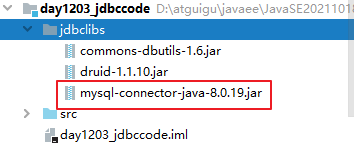

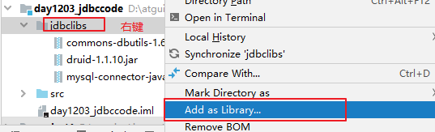

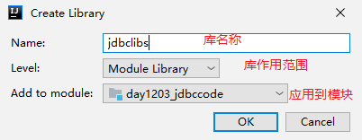


### 1.2.2 Java代码连接MySQL数据库

```java
/*步骤：
1、模块添加了依赖的mysql驱动相关库

2、在内存中加载驱动类（可选）
        更早版本mysql驱动类：org.gjt.mm.mysql.Driver
        最近版本：com.mysql.jdbc.Driver
        MySQL8.0版本：com.mysql.cj.jdbc.Driver
 
  //新版的mysql驱动jar可以省略这步，旧版的mysql驱动jar必须加这一步。
  // 因为新版mysql驱动jar包下有一个META-INF/services/java.sql.Driver文件
  //里面有填写mysql驱动类的全名称，DriverManager会自动读取这个文件，并加载对应的驱动类
  //后期使用数据库连接池，或者MyBatis等框架时，在配置文件中加这个驱动类的配置即可
 Class.forName("com.mysql.cj.jdbc.Driver"); 

3、连接数据库：通过DriverManager工具类获取数据库连接Connection的对象。
此时的Java程序是MySQL的一个客户端
连接数据库：
     MySQL服务器主机的IP地址：
     端口号
     用户名
     密码
网址：http://www.atguigu.com

    String url = "jdbc:mysql://localhost:3306/test";
    Connection conn = DriverManager.getConnection(url, "root", "123456");
    
    MySQL8使用低版本的jar包时，url需要加参数：serverTimezone=UTC，否则会报错：
    Exception in thread "main" java.sql.SQLException: The server time zone value '�й���׼ʱ��' 
    String url = "jdbc:mysql://localhost:3306/test?serverTimezone=UTC";
    


4、断开连接：使用close方法。
 */
```

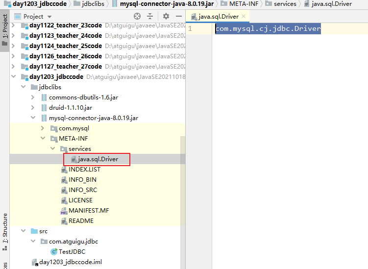

```java
package com.atguigu.jdbc;

import java.sql.Connection;
import java.sql.DriverManager;

public class TestJDBC {
    public static void main(String[] args)throws Exception {
        Class.forName("com.mysql.cj.jdbc.Driver");
        Connection conn =  DriverManager.getConnection("jdbc:mysql://localhost:3306/atguigu?serverTimezone=UTC","root","123456");
        System.out.println("conn = " + conn);
        conn.close();
    }
}
```


## 1.3 实现增删改查

```java
/*步骤：
1、模块添加了依赖的mysql驱动相关库

2、在内存中加载驱动类（可选）
 Class.forName("com.mysql.cj.jdbc.Driver"); 

3、连接数据库
通过DriverManager工具类获取数据库连接Connection的对象。
    String url = "jdbc:mysql://localhost:3306/test?serverTimezone=UTC";
    Connection conn = DriverManager.getConnection(url, "root", "123456");

 4、操作数据库
（1）通过Connection对象获取Statement或PreparedStatement对象
（2）通过Statement或PreparedStatement对象执行sql
执行增、删、改：int executeUpate()
执行查询：ResultSet executeQuery()
（3）如果服务器有查询结果返回，需要用ResultSet接收
遍历结果集的方法：
boolean next()：判断是否还有下一行
getString(字段名或序号),getInt(字段名或序号),getObject(字段名或序号)

5、释放资源（close）
 */
```

### 1.3.1 添加数据

```java
package com.atguigu.crud;

import java.sql.Connection;
import java.sql.DriverManager;
import java.sql.PreparedStatement;

/*
用JDBC实现添加一条记录到atguigu数据库的t_department表中。

mysql> desc t_department;
+-------------+--------------+------+-----+---------+----------------+
| Field       | Type         | Null | Key | Default | Extra          |
+-------------+--------------+------+-----+---------+----------------+
| did         | int          | NO   | PRI | NULL    | auto_increment |
| dname       | varchar(20)  | NO   | UNI | NULL    |                |
| description | varchar(200) | YES  |     | NULL    |                |
+-------------+--------------+------+-----+---------+----------------+
3 rows in set (0.01 sec)


mysql> select * from t_department;
+-----+--------+------------------+
| did | dname  | description      |
+-----+--------+------------------+
|   1 | 研发部 | 负责研发工作     |
|   2 | 人事部 | 负责人事管理工作 |
|   3 | 市场部 | 负责市场推广工作 |
|   4 | 财务部 | 负责财务管理工作 |
|   5 | 后勤部 | 负责后勤保障工作 |
|   6 | 测试部 | 负责测试工作     |
+-----+--------+------------------+
6 rows in set (0.00 sec)

步骤：
1、一个项目引入一次数据库驱动jar就可以
2、建立数据库连接
（1）加载驱动类：通过Class类的forName方法注册驱动
（2）获取数据库连接
通过DriverManager类的静态方法获取数据库连接对象
3、通过数据库连接对象获取Statement或PreparedStatement对象，用来执行sql
4、通过Statement或PreparedStatement对象调用
（1）int executeUpdate()：执行insert,update,delete等更新数据库数据的sql

5、关闭，释放各种资源
 */
public class TestInsert {
    public static void main(String[] args)throws Exception {
        //把驱动类加载到内存中
        Class.forName("com.mysql.cj.jdbc.Driver");
        //B：获取数据库连接对象
        String url = "jdbc:mysql://localhost:3306/atguigu?serverTimezone=UTC";
        Connection connection = DriverManager.getConnection(url,"root","123456");
        //Connection   ==> 网络编程的Socket

        String sql = "insert into t_department values(null,'测试数据部门','测试数据部门简介')";//发给服务器的sql
        PreparedStatement pst = connection.prepareStatement(sql);
        //PreparedStatement ==> IO流  网络编程的socket.getOutputStream()发生数据用的
        int len = pst.executeUpdate();
        //返回sql影响的记录数
        System.out.println(len>0 ? "添加成功" : "添加失败");

        pst.close();
        connection.close();
        /*
mysql> select * from t_department;
+-----+--------------+------------------+
| did | dname        | description      |
+-----+--------------+------------------+
|   1 | 研发部       | 负责研发工作     |
|   2 | 人事部       | 负责人事管理工作 |
|   3 | 市场部       | 负责市场推广工作 |
|   4 | 财务部       | 负责财务管理工作 |
|   5 | 后勤部       | 负责后勤保障工作 |
|   6 | 测试部       | 负责测试工作     |
|   7 | 测试数据部门 | 测试数据部门简介 |
+-----+--------------+------------------+
7 rows in set (0.00 sec)
         */
    }
}

```


### 1.3.2 修改数据

```java
package com.atguigu.crud;

import java.sql.Connection;
import java.sql.DriverManager;
import java.sql.PreparedStatement;

public class TestUpdate {
    public static void main(String[] args)throws Exception {
        //把驱动类加载到内存中
        Class.forName("com.mysql.cj.jdbc.Driver");
        //B：获取数据库连接对象
        String url = "jdbc:mysql://localhost:3306/atguigu?serverTimezone=UTC";
        Connection connection = DriverManager.getConnection(url, "root", "123456");
        //Connection   ==> 网络编程的Socket

        String sql = "update t_department set description = 'xx' where did = 7";//发给服务器的sql
        PreparedStatement pst = connection.prepareStatement(sql);
        //PreparedStatement ==> IO流  网络编程的socket.getOutputStream()发生数据用的
        int len = pst.executeUpdate();
        //返回sql影响的记录数
        System.out.println(len > 0 ? "修改成功" : "修改失败");

        pst.close();
        connection.close();
    }
}
/*
mysql> select * from t_department;
+-----+--------------+------------------+
| did | dname        | description      |
+-----+--------------+------------------+
|   1 | 研发部       | 负责研发工作     |
|   2 | 人事部       | 负责人事管理工作 |
|   3 | 市场部       | 负责市场推广工作 |
|   4 | 财务部       | 负责财务管理工作 |
|   5 | 后勤部       | 负责后勤保障工作 |
|   6 | 测试部       | 负责测试工作     |
|   7 | 测试数据部门 | xx               |
+-----+--------------+------------------+
7 rows in set (0.00 sec)
 */
```


### 1.3.3 删除数据

```java
package com.atguigu.crud;

import java.sql.Connection;
import java.sql.DriverManager;
import java.sql.PreparedStatement;

public class TestDelete {
    public static void main(String[] args)throws Exception {
        //把驱动类加载到内存中
        Class.forName("com.mysql.cj.jdbc.Driver");
        //B：获取数据库连接对象
        String url = "jdbc:mysql://localhost:3306/atguigu?serverTimezone=UTC";
        Connection connection = DriverManager.getConnection(url, "root", "123456");
        //Connection   ==> 网络编程的Socket

        String sql = "delete from t_department where did = 7";//发给服务器的sql
        PreparedStatement pst = connection.prepareStatement(sql);
        //PreparedStatement ==> IO流  网络编程的socket.getOutputStream()发生数据用的
        int len = pst.executeUpdate();
        //返回sql影响的记录数
        System.out.println(len > 0 ? "删除成功" : "删除失败");

        pst.close();
        connection.close();
    }
}
/*
mysql> select * from t_department;
+-----+--------+------------------+
| did | dname  | description      |
+-----+--------+------------------+
|   1 | 研发部 | 负责研发工作     |
|   2 | 人事部 | 负责人事管理工作 |
|   3 | 市场部 | 负责市场推广工作 |
|   4 | 财务部 | 负责财务管理工作 |
|   5 | 后勤部 | 负责后勤保障工作 |
|   6 | 测试部 | 负责测试工作     |
+-----+--------+------------------+
6 rows in set (0.00 sec)
 */
```


### 1.3.4 查询数据

```java
package com.atguigu.crud;

import java.sql.Connection;
import java.sql.DriverManager;
import java.sql.PreparedStatement;
import java.sql.ResultSet;

/*
步骤：
1、一个项目引入一次数据库驱动jar就可以
2、建立数据库连接
（1）加载驱动类：通过Class类的forName方法注册驱动
（2）获取数据库连接
通过DriverManager类的静态方法获取数据库连接对象
3、通过数据库连接对象获取Statement或PreparedStatement对象，用来执行sql
4、通过Statement或PreparedStatement对象调用
（1）int executeUpdate()：执行insert,update,delete等更新数据库数据的sql
（2）ResultSet executeQuery()：执行select查询的sql，返回一个结果集
（3）boolean execute()：可以用来执行DDL语句


遍历结果集ResultSet的方法：
boolean next()：判断是否还有下一行
getString(字段名或序号),getInt(字段名或序号),getObject(字段名或序号)

5、关闭，释放各种资源
 */
public class TestSelect {
    public static void main(String[] args)throws Exception {
        //把驱动类加载到内存中
        Class.forName("com.mysql.cj.jdbc.Driver");
        //B：获取数据库连接对象
        String url = "jdbc:mysql://localhost:3306/atguigu?serverTimezone=UTC";
        Connection connection = DriverManager.getConnection(url, "root", "123456");
        //Connection   ==> 网络编程的Socket

        String sql = "select * from t_department";//发给服务器的sql
        PreparedStatement pst = connection.prepareStatement(sql);
        //PreparedStatement ==> IO流  网络编程的socket.getOutputStream()发生数据用的

        ResultSet resultSet = pst.executeQuery();//==>IO流  输入流，又像是集合和迭代器的集成
        while(resultSet.next()){ //while循环一次，迭代一行，遍历一行
            int did = resultSet.getInt("did");//get一次得到一个单元格的数据
            String dname = resultSet.getString("dname");
            String decription = resultSet.getString("description");
            System.out.println(did +"\t" + dname +"\t" + decription);
        }

        resultSet.close();
        pst.close();
        connection.close();
    }
}
```


# 第二章 轻松处理各种问题

## 2.1 避免sql拼接问题

### 准备代码和sql

```mysql
        Scanner input = new Scanner(System.in);
        System.out.print("请输入姓名：");
        String ename = input.next();//李四

        System.out.print("请输入薪资：");
        double salary = input.nextDouble();//15000

        System.out.print("请输入出生日期：");
        String birthday = input.next();//1990-1-1

        System.out.print("请输入性别：");
        char gender = input.next().charAt(0);//男

        System.out.print("请输入手机号码：");
        String tel = input.next();//13578595685

        System.out.print("请输入邮箱：");
        String email = input.next();//zhangsan@atguigu.com
        
        input.close();
```

```mysql
INSERT INTO t_employee(ename,salary,birthday,gender,tel,email,hiredate)VALUES(值列表);
```


### 问题演示代码


```java
package com.atguigu.problem;

import org.junit.Test;

import java.sql.Connection;
import java.sql.DriverManager;
import java.sql.PreparedStatement;
import java.util.Date;
import java.util.Scanner;

/*
避免sql拼接问题

演示：从键盘输入数据，存储到atguigu数据库的t_employee表中。

mysql> desc t_employee;
+----------------+----------------------------------+------+-----+---------+----------------+
| Field          | Type                             | Null | Key | Default | Extra          |
+----------------+----------------------------------+------+-----+---------+----------------+
| eid            | int                              | NO   | PRI | NULL    | auto_increment |
| ename          | varchar(20)                      | NO   |     | NULL    |                |
| salary         | double                           | NO   |     | NULL    |                |
| commission_pct | decimal(3,2)                     | YES  |     | NULL    |                |
| birthday       | date                             | NO   |     | NULL    |                |
| gender         | enum('男','女')                  | NO   |     | 男      |                |
| tel            | char(11)                         | NO   |     | NULL    |                |
| email          | varchar(32)                      | NO   |     | NULL    |                |
| address        | varchar(150)                     | YES  |     | NULL    |                |
| work_place     | set('北京','深圳','上海','武汉') | NO   |     | 北京    |                |
| hiredate       | date                             | NO   |     | NULL    |                |
| job_id         | int                              | YES  | MUL | NULL    |                |
| mid            | int                              | YES  | MUL | NULL    |                |
| did            | int                              | YES  | MUL | NULL    |                |
+----------------+----------------------------------+------+-----+---------+----------------+
14 rows in set (0.00 sec)


PreparedStatement接口是Statement接口的子接口的。
Statement接口是不支持 ？ 形式的sql，只能拼接。
 */
public class TestSQLConcat {
    @Test
    public void test01()throws Exception{
        Scanner input = new Scanner(System.in);
        System.out.print("请输入姓名：");
        String ename = input.next();//李四

        System.out.print("请输入薪资：");
        double salary = input.nextDouble();//15000

        System.out.print("请输入出生日期：");
        String birthday = input.next();//1990-1-1

        System.out.print("请输入性别：");
        char gender = input.next().charAt(0);//男

        System.out.print("请输入手机号码：");
        String tel = input.next();//13578595685

        System.out.print("请输入邮箱：");
        String email = input.next();//zhangsan@atguigu.com

        //A:把驱动类加载到内存中
        Class.forName("com.mysql.cj.jdbc.Driver");
        //B：获取数据库连接对象
        String url = "jdbc:mysql://localhost:3306/atguigu?serverTimezone=UTC";
        Connection connection = DriverManager.getConnection(url,"root","123456");
        //Connection   ==> 网络编程的Socket

        //给t_employee表中的有非空约束的字段赋值，因为work_place有默认值，这里就没有管它
        String sql = "INSERT INTO t_employee(ename,salary,birthday,gender,tel,email,hiredate)VALUES(" +
                "'" + ename +"'," + //这里的'，是mysql中表示字符串和日期的单引号
                salary + "," +
                "'" + birthday +"'," +
                "'" + gender +"'," +
                "'" + tel +"'," +
                "'" + email +"'," +
                "curdate()" +   //mysql中日期函数，获取当前系统时间
                ")";
        //C：通过连接对象，获取PreparedStatement对象
        PreparedStatement pst = connection.prepareStatement(sql);

        //D：执行sql
        int len = pst.executeUpdate();
        System.out.println(len>0 ? "添加成功" : "添加失败");

        //E：释放连接等资源
        pst.close();
        connection.close();
         input.close();
    }

    @Test
    public void test02()throws Exception{
        Scanner input = new Scanner(System.in);
        System.out.print("请输入姓名：");
        String ename = input.next();//李四

        System.out.print("请输入薪资：");
        double salary = input.nextDouble();//15000

        System.out.print("请输入出生日期：");
        String birthday = input.next();//1990-1-1

        System.out.print("请输入性别：");
        char gender = input.next().charAt(0);//男

        System.out.print("请输入手机号码：");
        String tel = input.next();//13578595685

        System.out.print("请输入邮箱：");
        String email = input.next();//zhangsan@atguigu.com

        //A:把驱动类加载到内存中
        Class.forName("com.mysql.cj.jdbc.Driver");
        //B：获取数据库连接对象
        String url = "jdbc:mysql://localhost:3306/atguigu?serverTimezone=UTC";
        Connection connection = DriverManager.getConnection(url,"root","123456");
        //Connection   ==> 网络编程的Socket

        //给t_employee表中的有非空约束的字段赋值，因为work_place有默认值，这里就没有管它
        String sql = "INSERT INTO t_employee(ename,salary,birthday,gender,tel,email,hiredate)VALUES(?,?,?,?,?,?,?)";
        //这里的？就像占位符，表示要给几个字段赋值
        //C：通过连接对象，获取PreparedStatement对象
        PreparedStatement pst = connection.prepareStatement(sql);//此时对sql进行预编译，里面是带？的

        //要给每一个？指定具体的值
        /*
        PreparedStatement支持给每一个字段指定值时，确定数据类型，例如：
        pst.setString(1,ename);
        pst.setDouble(2,salary);
        ...
        但是这样有点麻烦，还要一一去确定数据类型
        PreparedStatement支持用Object统一处理
        pst.setObject(1,ename);
        pst.setObject(2,salary);
         */
        pst.setObject(1,ename);  //这里的1，表示第1个？
        pst.setObject(2,salary);  //这里的2，表示第2个？
        pst.setObject(3,birthday);  //这里的3，表示第3个？
        pst.setObject(4,gender);  //这里的4，表示第4个？
        pst.setObject(5,tel);  //这里的5，表示第5个？
        pst.setObject(6,email);  //这里的6，表示第6个？
        pst.setObject(7,"curdate()");  //这里的7，表示第7个？
        //每一个？与你要赋值的字段对应，不能对错了

        //D：执行sql
        int len = pst.executeUpdate();
        System.out.println(len>0 ? "添加成功" : "添加失败");

        /*
        (1)上面的代码执行出错了：java.sql.SQLException: Data truncated for column 'gender' at row 1
        原因： pst.setObject(4,gender); 把gender自动包装为Character对象
        解决方案：把char类型用String类型表示。

        (2)com.mysql.cj.jdbc.exceptions.MysqlDataTruncation: Data truncation: Incorrect date value: 'curdate()' for column 'hiredate' at row 1
         pst.setObject(7,"curdate()");  "curdate()"代表字符串，setObject把curdate()识别为一个字符串，而不是mysql函数， 这句代码给hiredate字段赋值的是一个String
        hiredate需要的是一个日期。

        解决方案：pst.setObject(7, new Date());
         */

        //E：释放连接等资源
        pst.close();
        connection.close();
        input.close();
    }

    @Test
    public void test03()throws Exception{
        Scanner input = new Scanner(System.in);
        System.out.print("请输入姓名：");
        String ename = input.next();//李四

        System.out.print("请输入薪资：");
        double salary = input.nextDouble();//15000

        System.out.print("请输入出生日期：");
        String birthday = input.next();//1990-1-1

        System.out.print("请输入性别：");
//        char gender = input.next().charAt(0);//男
        String gender = input.next();//男

        System.out.print("请输入手机号码：");
        String tel = input.next();//13578595685

        System.out.print("请输入邮箱：");
        String email = input.next();//zhangsan@atguigu.com

        //A:把驱动类加载到内存中
        Class.forName("com.mysql.cj.jdbc.Driver");
        //B：获取数据库连接对象
        String url = "jdbc:mysql://localhost:3306/atguigu?serverTimezone=UTC";
        Connection connection = DriverManager.getConnection(url,"root","123456");
        //Connection   ==> 网络编程的Socket

        //给t_employee表中的有非空约束的字段赋值，因为work_place有默认值，这里就没有管它
        String sql = "INSERT INTO t_employee(ename,salary,birthday,gender,tel,email,hiredate)VALUES(?,?,?,?,?,?,?)";
        //这里的？就像占位符，表示要给几个字段赋值
        //C：通过连接对象，获取PreparedStatement对象
        PreparedStatement pst = connection.prepareStatement(sql);//此时对sql进行预编译，里面是带？的

        //要给每一个？指定具体的值
        /*
        PreparedStatement支持给每一个字段指定值时，确定数据类型，例如：
        pst.setString(1,ename);
        pst.setDouble(2,salary);
        ...
        但是这样有点麻烦，还要一一去确定数据类型
        PreparedStatement支持用Object统一处理
        pst.setObject(1,ename);
        pst.setObject(2,salary);
         */
        pst.setObject(1,ename);  //这里的1，表示第1个？
        pst.setObject(2,salary);  //这里的2，表示第2个？
        pst.setObject(3,birthday);  //这里的3，表示第3个？
        pst.setObject(4,gender);  //这里的4，表示第4个？
        pst.setObject(5,tel);  //这里的5，表示第5个？
        pst.setObject(6,email);  //这里的6，表示第6个？
        pst.setObject(7, new Date());  //这里的7，表示第7个？
        //每一个？与你要赋值的字段对应，不能对错了

        //D：执行sql
        int len = pst.executeUpdate();
        System.out.println(len>0 ? "添加成功" : "添加失败");

        /*
        上面的代码执行出错了：java.sql.SQLException: Data truncated for column 'gender' at row 1
        原因： pst.setObject(4,gender); 把gender自动包装为Character对象
        解决方案：把char类型用String类型表示。
         */

        //E：释放连接等资源
        pst.close();
        connection.close();
         input.close();
    }
}
```

## 2.2 避免sql注入问题

### 准备代码和sql

```java
Scanner input = new Scanner(System.in);
System.out.print("请输入你要查询的员工的编号：");
String id = input.nextLine();
input.close();
```

```mysql
select * from t_employee where eid = 值;
```

### 问题演示代码

```java
package com.atguigu.problem;

import org.junit.Test;

import java.sql.Connection;
import java.sql.DriverManager;
import java.sql.PreparedStatement;
import java.sql.ResultSet;
import java.util.Scanner;

/*
避免sql注入问题

演示：从键盘输入员工编号，查询员工信息。每一个员工都可以输入自己的编号，查看自己的信息。
 */
public class TestSQLInject {
    @Test
    public void test01()throws Exception{
        Scanner input = new Scanner(System.in);
        System.out.print("请输入你要查询的员工的编号：");
        String id = input.nextLine();
        // 第一种正常输入：1
        // 第二种恶意输入：1 or 1=1  第一个1表示员工编号， 后面 or 1= 1表示条件，而1=1是永远成立，其他条件全部失效

        //把驱动类加载到内存中
        Class.forName("com.mysql.cj.jdbc.Driver");
        //B：获取数据库连接对象
        String url = "jdbc:mysql://localhost:3306/atguigu?serverTimezone=UTC";
        Connection connection = DriverManager.getConnection(url, "root", "123456");
        //Connection   ==> 网络编程的Socket

        String sql = "select * from t_employee where eid = " + id;
        System.out.println("sql = " + sql);//select * from t_employee where eid = 1 or 1=1
        PreparedStatement pst = connection.prepareStatement(sql);

        //执行查询
        ResultSet rs = pst.executeQuery();
        /*
        ResultSet接口提供了
        (1)boolean next()：判断是否有下一条记录
        (2)获取某个单元格的数据
        String getString(字段名)
        int getInt(字段名)
        double getDouble(字段名)
        ...

        有点麻烦，需要一一去对应字段名
        Object getObject(字段名)
        Object getObject(字段的序号)  从1开始。
         */
        while(rs.next()){//while循环一次，代表一行
            //t_employee有14个字段
            for(int i=1; i<=14; i++){//for循环一次，代表一行中的一个单元格
                System.out.print(rs.getObject(i)+"\t");
            }
            System.out.println();
        }

        rs.close();
        pst.close();
        connection.close();
        input.close();
/*
用户输入 1 or 1=1，盗取了表中的所有数据。
1	孙洪亮	28000.0	0.65	1980-10-08	男	13789098765	shl@atguigu.com	白庙村西街	北京,深圳	2011-07-28	1	1	1
2	何进	7001.0	0.10	1984-08-03	男	13456732145	hj@atguigu.com	半截塔存	深圳,上海	2015-07-03	2	1	1
3	邓超远	8000.0	null	1985-04-09	男	18678973456	dcy666@atguigu.com	宏福苑	北京,深圳,上海,武汉	2014-07-01	3	7	1
4	黄熙萌	9456.0	null	1986-09-07	女	13609876789	hxm@atguigu.com	白庙村东街	深圳,上海,武汉	2015-08-08	8	22	3
5	陈浩	8567.0	null	1978-08-02	男	13409876545	ch888@atguigu.com	回龙观	北京,深圳,上海	2015-01-01	3	7	1
6	韩庚年	12000.0	null	1985-04-03	男	18945678986	hgn@atguigu.com	龙泽	深圳,上海	2015-02-02	3	2	1
7	贾宝玉	15700.0	0.24	1982-08-02	男	15490876789	jby@atguigu.com	霍营	北京,武汉	2015-03-03	2	1	1
8	李晨熙	9000.0	0.40	1983-03-02	女	13587689098	lc@atguigu.com	东三旗	深圳,上海,武汉	2015-01-06	4	1	1
9	李易峰	7897.0	null	1984-09-01	男	13467676789	lyf@atguigu.com	西山旗	武汉	2015-04-01	3	7	1
10	陆风	8789.0	null	1989-04-02	男	13689876789	lf@atguigu.com	天通苑一区	北京	2014-09-03	2	1	1
11	黄冰茹	15678.0	null	1983-05-07	女	13787876565	hbr@atguigu.com	立水桥	深圳	2014-04-04	4	1	1
12	孙红梅	9000.0	null	1986-04-02	女	13576234554	shm@atguigu.com	立城苑	上海	2014-02-08	3	7	1
13	李冰冰	18760.0	null	1987-04-09	女	13790909887	lbb@atguigu.com	王府温馨公寓	北京	2015-06-07	3	2	1
14	谢吉娜	18978.0	0.25	1990-01-01	女	13234543245	xjn@atguigu.com	园中园	上海,武汉	2015-09-05	5	14	2
15	董吉祥	8978.0	null	1987-05-05	男	13876544333	djx@atguigu.com	小辛庄	北京,上海	2015-08-04	6	14	2
16	彭超越	9878.0	null	1988-03-06	男	18264578930	pcy@atguigu.com	西二旗	深圳,武汉	2015-03-06	8	22	3
17	李诗雨	9000.0	null	1990-08-09	女	18567899098	lsy@atguigu.com	清河	北京,深圳,武汉	2013-06-09	8	22	3
18	舒淇格	16788.0	0.10	1978-09-04	女	18654565634	sqg@atguigu.com	名流花园	北京,深圳,武汉	2013-04-05	9	18	4
19	周旭飞	7876.0	null	1988-06-13	女	13589893434	sxf@atguigu.com	小汤山	北京,深圳	2014-04-07	10	18	4
20	章嘉怡	15099.0	0.10	1989-12-11	女	15634238979	zjy@atguigu.com	望都家园	北京	2015-08-04	11	20	5
21	白露	9787.0	null	1989-09-04	女	18909876789	bl@atguigu.com	西湖新村	上海	2014-06-05	12	20	5
22	刘烨	13099.0	0.32	1990-11-09	男	18890980989	ly@atguigu.com	多彩公寓	北京,上海	2016-08-09	7	22	3
23	陈纲	13090.0	null	1990-02-04	男	18712345632	cg@atguigu.com	天通苑二区	深圳	2016-05-09	3	2	1
24	吉日格勒	10289.0	null	1990-04-01	男	17290876543	jrgl@163.com	北苑	北京	2017-02-06	12	20	5
25	额日古那	9087.0	null	1989-08-01	女	18709675645	ergn@atguigu.com	望京	北京,上海	2017-09-01	3	2	1
26	李红	5000.0	null	1995-02-15	女	15985759663	lihong@atguigu.com	冠雅苑	北京	2021-09-01	null	null	null
27	周洲	8000.0	null	1990-01-01	男	13574528569	zhouzhou@atguigu.com	冠华苑	北京,深圳	2020-08-15	3	2	null
28	张三	15000.0	null	1999-05-05	男	10086	zhangsan@atguigu.com	null	北京	2021-12-03	null	null	null
29	李四	14000.0	null	2000-09-09	女	10010	lisi@atguigu.com	null	北京	2021-12-03	null	null	null

 */
    }

    @Test
    public void test02()throws Exception {
        Scanner input = new Scanner(System.in);
        System.out.print("请输入你要查询的员工的编号：");
        String id = input.nextLine();
        // 第一种正常输入：1
        // 第二种恶意输入：1 or 1=1  第一个1表示员工编号， 后面 or 1= 1表示条件，而1=1是永远成立，其他条件全部失效

        //把驱动类加载到内存中
        Class.forName("com.mysql.cj.jdbc.Driver");
        //B：获取数据库连接对象
        String url = "jdbc:mysql://localhost:3306/atguigu?serverTimezone=UTC";
        Connection connection = DriverManager.getConnection(url, "root", "123456");
        //Connection   ==> 网络编程的Socket

        String sql = "select * from t_employee where eid = ? ";//不用拼接了
        PreparedStatement pst = connection.prepareStatement(sql);

        //给？指定值
        pst.setObject(1, id);
        //因为这里把 "2 or 1=1"当成一个整体赋值给eid
        //select * from t_employee where eid = '2 or 1=1';
        /*
        eid字段是int类型，mysql在解析时，发现给eid赋值了字符串，会把字符串尽量转为int类型的值。
        SELECT '2 or 1=1'+0;  得到结果是2。
        select * from t_employee where eid = '2 or 1=1';
        等价于
        select * from t_employee where eid = 2;
         */

        //执行查询
        ResultSet rs = pst.executeQuery();
        /*
        ResultSet接口提供了
        (1)boolean next()：判断是否有下一条记录
        (2)获取某个单元格的数据
        String getString(字段名)
        int getInt(字段名)
        double getDouble(字段名)
        ...

        有点麻烦，需要一一去对应字段名
        Object getObject(字段名)
        Object getObject(字段的序号)  从1开始。
         */
        while (rs.next()) {//while循环一次，代表一行
            //t_employee有14个字段
            for (int i = 1; i <= 14; i++) {//for循环一次，代表一行中的一个单元格
                System.out.print(rs.getObject(i) + "\t");
            }
            System.out.println();
        }

        rs.close();
        pst.close();
        connection.close();
        input.close();
    }
}
```


## 2.3 使用字节IO流读取图片等给blob等二进制类型数据赋值

### 准备代码和sql

```java
        Scanner input = new Scanner(System.in);
        System.out.print("请输入用户名：");
        String username = input.next();

        System.out.print("请输入密码：");
        String password = input.next();

        System.out.print("请选择照片：");
        String path = input.next();//这里没有图形化界面，只能输入路径，通过IO流读取图片的内容
        
		input.close();
```

```mysql
CREATE TABLE `t_user` (
  `id` int(11) NOT NULL AUTO_INCREMENT,
  `username` varchar(20) NOT NULL,
  `password` varchar(50) NOT NULL,
  `photo` blob,
  PRIMARY KEY (`id`)
);

添加记录：insert into t_user values(null,?,?,?);

修改表结构：ALTER TABLE t_user MODIFY photo MEDIUMBLOB;
```


### 问题演示代码

```java
package com.atguigu.problem;

import org.junit.Test;

import java.io.FileInputStream;
import java.sql.Connection;
import java.sql.DriverManager;
import java.sql.PreparedStatement;
import java.util.Scanner;

/*
CREATE TABLE `t_user` (
  `id` int(11) NOT NULL AUTO_INCREMENT,
  `username` varchar(20) NOT NULL,
  `password` varchar(50) NOT NULL,
  `photo` blob,
  PRIMARY KEY (`id`)
);

mysql> desc t_user;
+----------+-------------+------+-----+---------+----------------+
| Field    | Type        | Null | Key | Default | Extra          |
+----------+-------------+------+-----+---------+----------------+
| id       | int         | NO   | PRI | NULL    | auto_increment |
| username | varchar(20) | NO   |     | NULL    |                |
| password | varchar(50) | NO   |     | NULL    |                |
| photo    | blob        | YES  |     | NULL    |                |
+----------+-------------+------+-----+---------+----------------+
4 rows in set (0.00 sec)
 */
public class TestBlob {
    @Test
    public void test01()throws Exception{
        Scanner input = new Scanner(System.in);
        System.out.print("请输入用户名：");
        String username = input.next();

        System.out.print("请输入密码：");
        String password = input.next();

        System.out.print("请选择照片：");
        String path = input.next();//这里没有图形化界面，只能输入路径，通过IO流读取图片的内容

        //把驱动类加载到内存中
        Class.forName("com.mysql.cj.jdbc.Driver");
        //B：获取数据库连接对象
        String url = "jdbc:mysql://localhost:3306/atguigu?serverTimezone=UTC";
        Connection connection = DriverManager.getConnection(url, "root", "123456");
        //Connection   ==> 网络编程的Socket

        String sql = "insert into t_user values(null,?,?,?)";
        PreparedStatement pst = connection.prepareStatement(sql);

        //设置？的值
        pst.setObject(1, username);
        pst.setObject(2, password);
//        pst.setObject(3, path);//不对，因为path是一个路径
        pst.setObject(3, new FileInputStream(path)); //用字节IO流来表示二进制数据

        //执行sql
        int len = pst.executeUpdate();
        System.out.println(len >0 ? "添加成功" : "添加失败");

        pst.close();
        connection.close();

        input.close();
/*
当存储的图片特别大时：
（1）com.mysql.cj.jdbc.exceptions.PacketTooBigException: Packet for query is too large (6,638,795 > 4,194,304).
You can change this value on the server by setting the 'max_allowed_packet' variable.
解决方案：修改my.ini配置文件      max_allowed_packet变量的值
先停止服务，然后修改my.ini文件，再重启服务

（2）com.mysql.cj.jdbc.exceptions.MysqlDataTruncation: Data truncation: Data too long for column 'photo' at row 1
问题是：blob类型的数据，存不下这么大的图片
解决方案：修改字段的数据类型

alter table t_user modify photo mediumblob;

mysql> alter table t_user modify photo mediumblob;
ERROR 2013 (HY000): Lost connection to MySQL server during query
No connection. Trying to reconnect...
Connection id:    9
Current database: atguigu

Query OK, 1 row affected (0.08 sec)
Records: 1  Duplicates: 0  Warnings: 0

mysql> desc t_user;
+----------+-------------+------+-----+---------+----------------+
| Field    | Type        | Null | Key | Default | Extra          |
+----------+-------------+------+-----+---------+----------------+
| id       | int         | NO   | PRI | NULL    | auto_increment |
| username | varchar(20) | NO   |     | NULL    |                |
| password | varchar(50) | NO   |     | NULL    |                |
| photo    | mediumblob  | YES  |     | NULL    |                |
+----------+-------------+------+-----+---------+----------------+
4 rows in set (0.01 sec)
 */
    }
}

```

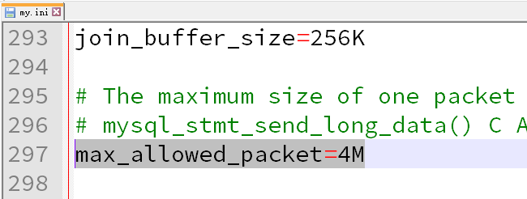

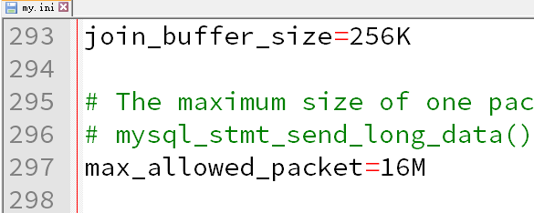

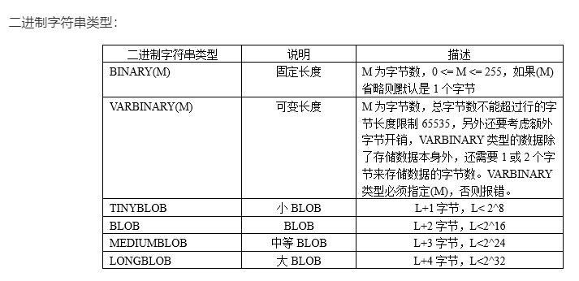

## 2.4 获取自增长键值

### 准备代码和sql

```mysql
INSERT INTO t_employee(ename,salary,birthday,gender,tel,email,hiredate)VALUES(?,?,?,?,?,?,?)
```

```java
		Scanner input = new Scanner(System.in);
        System.out.print("请输入姓名：");
        String ename = input.next();//李四

        System.out.print("请输入薪资：");
        double salary = input.nextDouble();//15000

        System.out.print("请输入出生日期：");
        String birthday = input.next();//1990-1-1

        System.out.print("请输入性别：");
        String gender = input.next();//男  mysql的gender是枚举类型，这里用String处理

        System.out.print("请输入手机号码：");
        String tel = input.next();//13578595685

        System.out.print("请输入邮箱：");
        String email = input.next();//zhangsan@atguigu.com

		input.close();
```


### 问题演示代码

```java
package com.atguigu.problem;

import org.junit.Test;

import java.sql.*;
import java.util.Date;
import java.util.Scanner;

/*
获取自增长键值：
mysql中很多表都是有自增长字段，特别是id。
当我们添加了一个员工、部门，添加成功后，需要立刻返回该员工、部门的自增长的id值。

（1）在用Connection数据库连接对象获取PreparedStatement对象时，要加一个参数
PreparedStatement pst = connection.prepareStatement(sql, Statement.RETURN_GENERATED_KEYS);
这里Statement.RETURN_GENERATED_KEYS表示，执行sql后，返回自增长键值

（2）执行完成之后，需要从PreparedStatement对象中获取自增长键值
 ResultSet rs = pst.getGeneratedKeys(); //方法别调错
if(rs.next()){ //因为只有一条记录，所以只有一个自增长键值，用if即可
    System.out.println("新员工编号是：" + rs.getObject(1));//因为自增长键值只有一个，所以这里直接getObject(1)即可
}
 */
public class TestGenerateKey {
    @Test
    public void test03()throws Exception{
        Scanner input = new Scanner(System.in);
        System.out.print("请输入姓名：");
        String ename = input.next();//李四

        System.out.print("请输入薪资：");
        double salary = input.nextDouble();//15000

        System.out.print("请输入出生日期：");
        String birthday = input.next();//1990-1-1

        System.out.print("请输入性别：");
        String gender = input.next();//男  mysql的gender是枚举类型，这里用String处理

        System.out.print("请输入手机号码：");
        String tel = input.next();//13578595685

        System.out.print("请输入邮箱：");
        String email = input.next();//zhangsan@atguigu.com

        //A:把驱动类加载到内存中
        Class.forName("com.mysql.cj.jdbc.Driver");
        //B：获取数据库连接对象
        String url = "jdbc:mysql://localhost:3306/atguigu?serverTimezone=UTC";
        Connection connection = DriverManager.getConnection(url,"root","123456");
        //Connection   ==> 网络编程的Socket

        //给t_employee表中的有非空约束的字段赋值，因为work_place有默认值，这里就没有管它
        String sql = "INSERT INTO t_employee(ename,salary,birthday,gender,tel,email,hiredate)VALUES(?,?,?,?,?,?,?)";
        //这里的？就像占位符，表示要给几个字段赋值
        //C：通过连接对象，获取PreparedStatement对象
        PreparedStatement pst = connection.prepareStatement(sql, Statement.RETURN_GENERATED_KEYS);//此时对sql进行预编译，里面是带？的
        //Statement.RETURN_GENERATED_KEYS表示，执行sql后，返回自增长键值

        //要给每一个？指定具体的值
        /*
        PreparedStatement支持给每一个字段指定值时，确定数据类型，例如：
        pst.setString(1,ename);
        pst.setDouble(2,salary);
        ...
        但是这样有点麻烦，还要一一去确定数据类型
        PreparedStatement支持用Object统一处理
        pst.setObject(1,ename);
        pst.setObject(2,salary);
         */
        pst.setObject(1,ename);  //这里的1，表示第1个？
        pst.setObject(2,salary);  //这里的2，表示第2个？
        pst.setObject(3,birthday);  //这里的3，表示第3个？
        pst.setObject(4,gender);  //这里的4，表示第4个？
        pst.setObject(5,tel);  //这里的5，表示第5个？
        pst.setObject(6,email);  //这里的6，表示第6个？
        pst.setObject(7, new Date());  //这里的7，表示第7个？
        //每一个？与你要赋值的字段对应，不能对错了

        //D：执行sql
        int len = pst.executeUpdate();
        System.out.println(len>0 ? "添加成功" : "添加失败");

        ResultSet rs = pst.getGeneratedKeys();
        if(rs.next()){
            System.out.println("新员工编号是：" + rs.getObject(1));//因为自增长键值只有一个，所以这里直接getObject(1)即可
        }

        //E：释放连接等资源
        rs.close();
        pst.close();
        connection.close();
        input.close();
    }
}

```

## 2.5 批处理

### 准备代码和sql

```mysql
insert into t_department values(null,?,?)
```

### 问题演示代码

```java
package com.atguigu.problem;

import org.junit.Test;

import java.sql.Connection;
import java.sql.DriverManager;
import java.sql.PreparedStatement;

/*
批处理：
    批量执行一组sql。大多数情况下都是批量执行insert语句。

    演示：给部门表批量添加1000条部门测试信息。

MySQL服务器端，默认批处理功能没有开启。需要通过参数告知mysql服务器，开启批处理功能。
在url后面再加一个参数 rewriteBatchedStatements=true

url的格式：
    jdbc:mysql://localhost:3306/atguigu
    如果要加参数，需要用一个?，表示后面是参数

    jdbc:mysql://localhost:3306/atguigu?serverTimezone=UTC

    如果有多个参数，参数之间使用&连接，
    每一个参数都是key=value的格式。

 jdbc:mysql://localhost:3306/atguigu?serverTimezone=UTC&rewriteBatchedStatements=true

 如何实现批处理？
 （1）url中加rewriteBatchedStatements=true
jdbc:mysql://localhost:3306/atguigu?serverTimezone=UTC&rewriteBatchedStatements=true

（2）PreparedStatement对象调用
A：addBatch()
B：executeBatch()

（3）不要把values写错value（学生问题）
 */
public class TestBatch {
    @Test
    public void test01()throws Exception{
        long start = System.currentTimeMillis();

        //把驱动类加载到内存中
        Class.forName("com.mysql.cj.jdbc.Driver");
        //B：获取数据库连接对象
        String url = "jdbc:mysql://localhost:3306/atguigu?serverTimezone=UTC";
        Connection connection = DriverManager.getConnection(url, "root", "123456");
        //Connection   ==> 网络编程的Socket

        String sql = "insert into t_department values(null,?,?)";
        PreparedStatement pst = connection.prepareStatement(sql);
        //上面的sql是重复使用的，PreparedStatement对象也重复使用，不用new1000个对象。
        //mysql服务器端也可以优化，提高性能

        for(int i=1; i<=1000; i++){
            //设置1000次？的值
            pst.setObject(1,"测试"+i);
            pst.setObject(2,"测试简介"+i);

            pst.executeUpdate();//这里就不接收返回值了
            //逐条添加，每设置一次？，就立刻添加一条
            //设置完？是在内存中，添加到表中，是要用IO流写到文件中，
            // 添加1000条意味着要用IO流与文件通信1000次
        }

        pst.close();
        connection.close();

        long end = System.currentTimeMillis();
        System.out.println("耗时：" + (end-start));//耗时：4700
    }

    @Test
    public void test02()throws Exception{
        long start = System.currentTimeMillis();

        //把驱动类加载到内存中
        Class.forName("com.mysql.cj.jdbc.Driver");
        //B：获取数据库连接对象
        String url = "jdbc:mysql://localhost:3306/atguigu?serverTimezone=UTC";
        Connection connection = DriverManager.getConnection(url, "root", "123456");
        //Connection   ==> 网络编程的Socket

        String sql = "insert into t_department values(null,?,?)";
        PreparedStatement pst = connection.prepareStatement(sql);
        //上面的sql是重复使用的，PreparedStatement对象也重复使用，不用new1000个对象。
        //mysql服务器端也可以优化，提高性能

        for(int i=1001; i<=2000; i++){
            //设置1000次？的值
            pst.setObject(1,"测试"+i);
            pst.setObject(2,"测试简介"+i);

//            pst.executeUpdate();//不用设置一次？，就执行一次
            pst.addBatch();//先攒着这些数据，设置完？，sql会重新编译一下，生成一条新的完整的sql
        }
        pst.executeBatch();//最后一口气执行

//        这里虽然调用了批处理执行sql的方法，但是url中没有告诉mysql开启批处理的功能，仍然是一条一条添加的

        pst.close();
        connection.close();

        long end = System.currentTimeMillis();
        System.out.println("耗时：" + (end-start));//耗时：4714
    }

    @Test
    public void test03()throws Exception{
        long start = System.currentTimeMillis();

        //把驱动类加载到内存中
        Class.forName("com.mysql.cj.jdbc.Driver");
        //B：获取数据库连接对象
        String url = "jdbc:mysql://localhost:3306/atguigu?serverTimezone=UTC&rewriteBatchedStatements=true";
        Connection connection = DriverManager.getConnection(url, "root", "123456");
        //Connection   ==> 网络编程的Socket

        String sql = "insert into t_department values(null,?,?)";
        PreparedStatement pst = connection.prepareStatement(sql);
        //上面的sql是重复使用的，PreparedStatement对象也重复使用，不用new1000个对象。
        //mysql服务器端也可以优化，提高性能

        for(int i=2001; i<=3000; i++){
            //设置1000次？的值
            pst.setObject(1,"测试"+i);
            pst.setObject(2,"测试简介"+i);

//            pst.executeUpdate();//不用设置一次？，就执行一次
            pst.addBatch();//先攒着这些数据，设置完？，sql会重新编译一下，生成一条新的完整的sql
        }
        pst.executeBatch();//最后一口气执行

        pst.close();
        connection.close();

        long end = System.currentTimeMillis();
        System.out.println("耗时：" + (end-start));//耗时：1625
    }
    
        @Test
    public void test04()throws Exception{
        long start = System.currentTimeMillis();

        //把驱动类加载到内存中
        Class.forName("com.mysql.cj.jdbc.Driver");
        //B：获取数据库连接对象
        String url = "jdbc:mysql://localhost:3306/atguigu?serverTimezone=UTC&rewriteBatchedStatements=true";
        Connection connection = DriverManager.getConnection(url, "root", "123456");
        //Connection   ==> 网络编程的Socket

        String sql = "insert into t_department values(null,?,?)";//如果把values写错value，批处理不起作用
        PreparedStatement pst = connection.prepareStatement(sql);
        //上面的sql是重复使用的，PreparedStatement对象也重复使用，不用new1000个对象。
        //mysql服务器端也可以优化，提高性能

        for(int i=2001; i<=3000; i++){
            //设置1000次？的值
            pst.setObject(1,"测试"+i);
            pst.setObject(2,"测试简介"+i);

//            pst.executeUpdate();//不用设置一次？，就执行一次
            pst.addBatch();//先攒着这些数据，设置完？，sql会重新编译一下，生成一条新的完整的sql
        }
        pst.executeBatch();//最后一口气执行

        pst.close();
        connection.close();

        long end = System.currentTimeMillis();
        System.out.println("耗时：" + (end-start));//耗时：4625
    }
}

```

## 2.6 事务处理

### 准备代码和sql

```mysql
演示：
	update t_department set description = 'xx' where did = 2;
	update t_department set description = 'yy' where did = 3;

	故意把其中一条sql语句写错。

    update t_department set description = 'xx' where did = 2;
	update t_department set description = 'yy' what did = 3;  #what是错误的
```

### 问题演示代码

```java
package com.atguigu.problem;

import org.junit.Test;

import java.sql.Connection;
import java.sql.DriverManager;
import java.sql.PreparedStatement;
import java.sql.SQLException;

/*
如果多条sql要组成一个事务，要么一起成功，要么一起失败。
例如：订单
    （1）修改商品表的商品库存和销量
    （2）订单表新建订单数据
    （3）订单明细表新建订单明细记录（多条）
    ....
    这些sql要么一起成功，要么都还原到最初。

演示：
	update t_department set description = 'xx' where did = 2;
	update t_department set description = 'yy' where did = 3;

	故意把其中一条sql语句写错。

    update t_department set description = 'xx' where did = 2;
	update t_department set description = 'yy' what did = 3;  #what是错误的，故意制造错误

JDBC如何管理事务？
（1）mysql默认是自动提交事务，每执行一条语句成功后，自动提交。
需要开启手动提交模式。

Connection连接对象.setAutoCommit(false);//取消自动提交模式，开始手动提交模式

(2)sql执行成功，别忘了提交事务
Connection连接对象.commit();

（3）sql执行失败，回滚事务
Connection连接对象.rollback();
 */
public class TestTransaction {
    @Test
    public void test01()throws Exception{
        //把驱动类加载到内存中
        Class.forName("com.mysql.cj.jdbc.Driver");
        //B：获取数据库连接对象
        String url = "jdbc:mysql://localhost:3306/atguigu?serverTimezone=UTC";
        Connection connection = DriverManager.getConnection(url, "root", "123456");
        //Connection   ==> 网络编程的Socket

        connection.setAutoCommit(false);//取消自动提交模式，开始手动提交模式

        String s1 = "update t_department set description = 'xx' where did = 2";
        String s2 = "update t_department set description = 'yy' what did = 3";

        try(PreparedStatement p1 = connection.prepareStatement(s1);
            PreparedStatement p2 = connection.prepareStatement(s2);) {

            p1.executeUpdate();
            p2.executeUpdate();
            System.out.println("两条更新成功");
            connection.commit();//提交事务
        }catch(SQLException e){
            e.printStackTrace();
            System.out.println("失败");
            connection.rollback();//回滚事务
        }finally {
            connection.close();
        }
    }
}

```

# 第三章 数据库连接池

## 1、什么是数据库连池

连接对象的缓冲区。负责申请，分配管理，释放连接的操作。

## 2、为什么要使用数据库连接池

（1）不使用数据库连接池，每次都通过DriverManager获取新连接，用完直接抛弃断开，连接的利用率太低，太浪费。
（2）对于数据库服务器来说，压力太大了。我们数据库服务器和Java程序对连接数也无法控制，很容易导致数据库服务器崩溃。

我们就希望能管理连接。

- 我们可以建立一个连接池，这个池中可以容纳一定数量的连接对象，一开始，我们可以先替用户先创建好一些连接对象，等用户要拿连接对象时，就直接从池中拿，不用新建了，这样也可以节省时间。然后用户用完后，放回去，别人可以接着用。
- 可以提高连接的使用率。当池中的现有的连接都用完了，那么连接池可以向服务器申请新的连接放到池中。
  直到池中的连接达到“最大连接数”，就不能在申请新的连接了，如果没有拿到连接的用户只能等待。

## 3、市面上有很多现成的数据库连接池技术

* JDBC 的数据库连接池使用 javax.sql.DataSource 来表示，DataSource 只是一个接口（通常被称为数据源），该接口通常由服务器(Weblogic, WebSphere, Tomcat)提供实现，也有一些开源组织提供实现：
  * **DBCP** 是Apache提供的数据库连接池，**速度相对c3p0较快**，但因自身存在BUG，Hibernate3已不再提供支持
  * **C3P0** 是一个开源组织提供的一个数据库连接池，**速度相对较慢，稳定性还可以**
  * **Proxool** 是sourceforge下的一个开源项目数据库连接池，有监控连接池状态的功能，**稳定性较c3p0差一点**
  * **BoneCP** 是一个开源组织提供的数据库连接池，速度快
  * **Druid** 是阿里提供的数据库连接池，据说是集DBCP 、C3P0 、Proxool 优点于一身的数据库连接池

## 4、如何使用德鲁伊数据库连接池

```java
(1)引入jar包
    和引入mysql驱动jar方式一样
（3）创建数据库连接池对象
（4）获取连接
```

```java
package com.atguigu.pool;

import com.alibaba.druid.pool.DruidDataSourceFactory;

import javax.sql.DataSource;
import java.sql.Connection;
import java.sql.SQLException;
import java.util.Properties;

public class TestPool {
    static int count = 0;

    public static void main(String[] args) throws Exception {
        Properties pro = new Properties();
        pro.setProperty("driverClassName","com.mysql.cj.jdbc.Driver");
        pro.setProperty("url","jdbc:mysql://localhost:3306/atguigu");
        pro.setProperty("username","root");
        pro.setProperty("password","123456");
        pro.setProperty("initialSize","5");//表示预先缓存5个连接
        pro.setProperty("maxActive","10");//最多的连接数量10
        pro.setProperty("maxWait","1000");//等待连接的时间，超过时间就报异常
         DataSource ds = DruidDataSourceFactory.createDataSource(pro);
/*        Connection connection = ds.getConnection();
        System.out.println("connection = " + connection);*/

/*        for(int i=1; i<=15; i++){
            Connection connection = ds.getConnection();
            System.out.println("第" + i+ "个connection = " + connection);

            //这里没有写connection.close()，连接没有关闭，没有还给连接池，一直占用
//            connection.close();
        }*/

        for(int i=1; i<=15; i++){

            new Thread(){
                @Override
                public void run() {
                    try {
                        Connection connection = ds.getConnection();
                        System.out.println("第" + (count++)+ "个connection = " + connection);

                        try {
                            Thread.sleep(1000);
                        } catch (InterruptedException e) {
                            e.printStackTrace();
                        }

                        connection.close();
                    } catch (SQLException e) {
                        e.printStackTrace();
                    }
                }
            }.start();

        }
    }
}
```


| 配置                          | **缺省** | **说明**                                                     |
| ----------------------------- | -------- | ------------------------------------------------------------ |
| name                          |          | 配置这个属性的意义在于，如果存在多个数据源，监控的时候可以通过名字来区分开来。 如果没有配置，将会生成一个名字，格式是：”DataSource-” + System.identityHashCode(this) |
| jdbcUrl                       |          | 连接数据库的url，不同数据库不一样。例如：mysql : jdbc:mysql://10.20.153.104:3306/druid2 oracle : jdbc:oracle:thin:@10.20.149.85:1521:ocnauto |
| username                      |          | 连接数据库的用户名                                           |
| password                      |          | 连接数据库的密码。如果你不希望密码直接写在配置文件中，可以使用ConfigFilter。详细看这里：<https://github.com/alibaba/druid/wiki/%E4%BD%BF%E7%94%A8ConfigFilter> |
| driverClassName               |          | 根据url自动识别 这一项可配可不配，如果不配置druid会根据url自动识别dbType，然后选择相应的driverClassName(建议配置下) |
| initialSize                   | 0        | 初始化时建立物理连接的个数。初始化发生在显示调用init方法，或者第一次getConnection时 |
| maxActive                     | 8        | 最大连接池数量                                               |
| maxIdle                       | 8        | 已经不再使用，配置了也没效果                                 |
| minIdle                       |          | 最小连接池数量                                               |
| maxWait                       |          | 获取连接时最大等待时间，单位毫秒。配置了maxWait之后，缺省启用公平锁，并发效率会有所下降，如果需要可以通过配置useUnfairLock属性为true使用非公平锁。 |
| poolPreparedStatements        | false    | 是否缓存preparedStatement，也就是PSCache。PSCache对支持游标的数据库性能提升巨大，比如说oracle。在mysql下建议关闭。 |
| maxOpenPreparedStatements     | -1       | 要启用PSCache，必须配置大于0，当大于0时，poolPreparedStatements自动触发修改为true。在Druid中，不会存在Oracle下PSCache占用内存过多的问题，可以把这个数值配置大一些，比如说100 |
| validationQuery               |          | 用来检测连接是否有效的sql，要求是一个查询语句。如果validationQuery为null，testOnBorrow、testOnReturn、testWhileIdle都不会其作用。 |
| testOnBorrow                  | true     | 申请连接时执行validationQuery检测连接是否有效，做了这个配置会降低性能。 |
| testOnReturn                  | false    | 归还连接时执行validationQuery检测连接是否有效，做了这个配置会降低性能 |
| testWhileIdle                 | false    | 建议配置为true，不影响性能，并且保证安全性。申请连接的时候检测，如果空闲时间大于timeBetweenEvictionRunsMillis，执行validationQuery检测连接是否有效。 |
| timeBetweenEvictionRunsMillis |          | 有两个含义： 1)Destroy线程会检测连接的间隔时间2)testWhileIdle的判断依据，详细看testWhileIdle属性的说明 |
| numTestsPerEvictionRun        |          | 不再使用，一个DruidDataSource只支持一个EvictionRun           |
| minEvictableIdleTimeMillis    |          |                                                              |
| connectionInitSqls            |          | 物理连接初始化的时候执行的sql                                |
| exceptionSorter               |          | 根据dbType自动识别 当数据库抛出一些不可恢复的异常时，抛弃连接 |
| filters                       |          | 属性类型是字符串，通过别名的方式配置扩展插件，常用的插件有： 监控统计用的filter:stat日志用的filter:log4j防御sql注入的filter:wall |
| proxyFilters                  |          | 类型是List，如果同时配置了filters和proxyFilters，是组合关系，并非替换关系 |


# 第四章 JDBCTools工具类

## 4.1 druid.properties文件

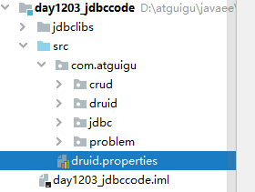

```java
#key=value
driverClassName=com.mysql.cj.jdbc.Driver
url=jdbc:mysql://localhost:3306/atguigu?serverTimezone=UTC&rewriteBatchedStatements=true
username=root
password=123456
initialSize=5
maxActive=10
maxWait=1000
```

## 4.2 JDBCTools工具类1.0版

### 4.2.1 JDBCToolsVersion1类

```java
package com.atguigu.tools;

import com.alibaba.druid.pool.DruidDataSourceFactory;

import javax.sql.DataSource;
import java.sql.Connection;
import java.sql.SQLException;
import java.util.Properties;

public class JDBCToolsVersion1 {
    private static DataSource ds;
    static{//静态代码块，JDBCToolsVersion1类初始化执行
        try {
            Properties pro = new Properties();
            pro.load(ClassLoader.getSystemResourceAsStream("druid.properties"));
            ds = DruidDataSourceFactory.createDataSource(pro);
        } catch (Exception e) {
            e.printStackTrace();
        }
    }

    public static Connection getConnection() throws SQLException {
        return ds.getConnection();//这么写，不能保证同一个线程，两次getConnection()得到的是同一个Connection对象
                            //如果不能保证是同一个连接对象，就无法保证事务的管理
    }

    public static void free(Connection conn) throws SQLException {
        conn.setAutoCommit(true);
        conn.close();//还给连接池
    }
}
```

```java
package com.atguigu.tools;

import java.sql.Connection;
import java.sql.SQLException;
import java.sql.Statement;

public class TestInsert {
    public static void main(String[] args) throws SQLException {
        Connection connection = JDBCToolsVersion1.getConnection();

        String sql = "INSERT INTO t_department VALUES(NULL,'保安部','负责安保工作')";

        Statement s = connection.createStatement();

        int len = s.executeUpdate(sql);
        System.out.println("len = " + len);


        s.close();

        JDBCToolsVersion1.free(connection);
    }
}
```

### 4.2.2 事务处理问题

```java
package com.atguigu.tools;

import java.sql.Connection;
import java.sql.SQLException;
import java.sql.Statement;

public class UpdateUtils1 {
    public static void updateSQL(String sql)throws SQLException {
        Connection connection = JDBCToolsVersion1.getConnection();//自动提交
        Statement s = null;
        try {
            s = connection.createStatement();
            int len = s.executeUpdate(sql);
        } catch (SQLException e) {
            e.printStackTrace();
        }finally{
            s.close();
            JDBCToolsVersion1.free(connection);
        }
    }
}
```

```java
    @Test
    public void test1() throws SQLException {
        //加上事务管理，或者说，手动提交事务模式
        String sql1 = "update t_department set description = 'xx' where did = 2";
        String sql2 = "update t_department set description = 'yy' what did = 3";//故意把where写错，写成what
//        String sql2 = "update t_department set description = 'yy' where did = 3";
        Connection connection = null;
        try {
            connection = JDBCToolsVersion1.getConnection();//不同的连接对象
            connection.setAutoCommit(false);

            UpdateUtils1.updateSQL(sql1);
            UpdateUtils1.updateSQL(sql2);

            //提交事务
            connection.commit();
        } catch (SQLException e) {
            e.printStackTrace();
            //回滚事务
            connection.rollback();
        }finally{
            JDBCToolsVersion1.free(connection);
        }
    }
```

## 4.3 使用ThreadLocal类

其中ThreadLocal的介绍如下：

JDK 1.2的版本中就提供java.lang.ThreadLocal，为解决多线程程序的并发问题提供了一种新的思路。使用这个工具类可以很简洁地编写出优美的多线程程序。通常用来在在多线程中管理共享数据库连接、Session等

ThreadLocal用于保存某个线程共享变量，原因是在Java中，每一个线程对象中都有一个ThreadLocalMap<ThreadLocal, Object>，其key就是一个ThreadLocal，而Object即为该线程的共享变量。而这个map是通过ThreadLocal的set和get方法操作的。对于同一个static ThreadLocal，不同线程只能从中get，set，remove自己的变量，而不会影响其他线程的变量。

1、ThreadLocal对象.get: 获取ThreadLocal中当前线程共享变量的值。

2、ThreadLocal对象.set: 设置ThreadLocal中当前线程共享变量的值。

3、ThreadLocal对象.remove: 移除ThreadLocal中当前线程共享变量的值。

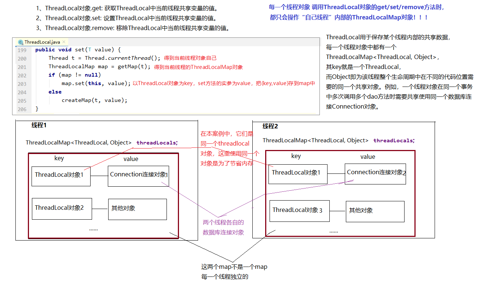

线程（事务）结束后别忘了移除共享对象。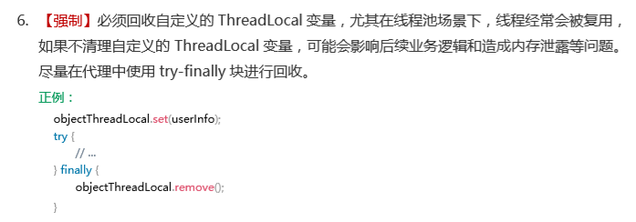

```java
package com.atguigu.tools;

public class TestThreadLocal {
    private static ThreadLocal<String> tl = new ThreadLocal<>();

    public static void print(){
        System.out.println(Thread.currentThread().getName() +"->" +tl.get());
    }

    /*
               这里有两个线程，每一个线程都有自己的ThreadLocalMap对象，
               它们此时都有一个key为tl的键值对，但是两个map中tl对应的value不一样，一个是atguigu，一个是mysql
                */
    public static void main(String[] args) {
        new Thread("线程1"){
            @Override
            public void run() {
                System.out.println(Thread.currentThread().getName()+"set之前：" );
                print();

                tl.set("atguigu");

                System.out.println(Thread.currentThread().getName()+"set之后：" );
                print();

                try {
                    Thread.sleep(1000);
                } catch (InterruptedException e) {
                    e.printStackTrace();
                }

                System.out.println(Thread.currentThread().getName()+"休眠1秒之后：" );
                print();

                tl.remove();

                System.out.println(Thread.currentThread().getName()+"移出之后：" );
                print();
            }
        }.start();

        new Thread("线程2"){
            @Override
            public void run() {
                System.out.println(Thread.currentThread().getName()+"set之前：" );
                print();

                tl.set("mysql");

                System.out.println(Thread.currentThread().getName()+"set之后：" );
                print();

                try {
                    Thread.sleep(1000);
                } catch (InterruptedException e) {
                    e.printStackTrace();
                }

                System.out.println(Thread.currentThread().getName()+"休眠1秒之后：" );
                print();

                tl.remove();

                System.out.println(Thread.currentThread().getName()+"移出之后：" );
                print();
            }
        }.start();
    }
}

```


## 4.4 JDBCTools工具类2.0版

### 4.4.1 JDBCToolsVersion1类

```java
package com.atguigu.tools;

import com.alibaba.druid.pool.DruidDataSourceFactory;

import javax.sql.DataSource;
import java.sql.Connection;
import java.sql.SQLException;
import java.util.Properties;

/*
这个工具类的作用就是用来给所有的SQL操作提供“连接”，和释放连接。
这里使用ThreadLocal的目的是为了让同一个线程，在多个地方getConnection得到的是同一个连接。
这里使用DataSource的目的是为了（1）限制服务器的连接的上限（2）连接的重用性等
 */
public class JDBCTools {
    private static DataSource ds;
    private static ThreadLocal<Connection> tl = new ThreadLocal<>();
    static{//静态代码块，JDBCToolsVersion1类初始化执行
        try {
            Properties pro = new Properties();
            pro.load(ClassLoader.getSystemResourceAsStream("druid.properties"));
            ds = DruidDataSourceFactory.createDataSource(pro);
        } catch (Exception e) {
            e.printStackTrace();
        }
    }

    public static Connection getConnection() throws SQLException {
         Connection connection = tl.get();
         if(connection  == null){//当前线程还没有拿过连接，就给它从数据库连接池拿一个
             connection = ds.getConnection();
             tl.set(connection);
         }
         return connection;
    }

    public static void free() throws SQLException {
        Connection connection = tl.get();
        if(connection != null){
            tl.remove();
            connection.setAutoCommit(true);//避免还给数据库连接池的连接不是自动提交模式（建议）
            connection.close();
        }
    }
}

```

### 4.4.2 事务处理

```java
package com.atguigu.tools;

import java.sql.Connection;
import java.sql.SQLException;
import java.sql.Statement;

public class UpdateUtils2 {
    public static void updateSQL(String sql)throws SQLException {
        Connection connection = JDBCTools.getConnection();
        Statement s =connection.createStatement();
        int len = s.executeUpdate(sql);
        System.out.println("len = " + len);
        s.close();
        //这里不关闭连接
    }
}
```

```java
@Test
    public void test2() throws SQLException {
        //加上事务管理，或者说，手动提交事务模式
        String sql1 = "update t_department set description = 'xx' where did = 2";
        String sql2 = "update t_department set description = 'yy' what did = 3";//故意把where写错，写成what
//        String sql2 = "update t_department set description = 'yy' where did = 3";
        Connection connection = null;
        try {
            connection = JDBCTools.getConnection();
            connection.setAutoCommit(false);

            UpdateUtils2.updateSQL(sql1);
            UpdateUtils2.updateSQL(sql2);

            //提交事务
            connection.commit();
        } catch (SQLException e) {
            e.printStackTrace();
            //回滚事务
            connection.rollback();
        }

        JDBCTools.free();
    }
```


# 第五章 封装DAO层代码

## 5.1 DAO

Java是面向对象语言，数据在Java中通常以对象的形式存在。

把数据库中的记录<---->Java的对象对应起来。

我们把访问数据库的代码封装起来，这些类称为DAO（Data Access Object）。它相当于是一个数据访问接口，夹在业务逻辑与数据库资源中间。

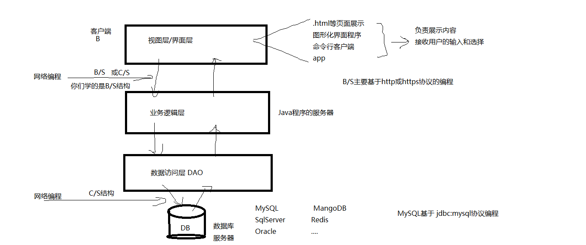

## 5.2 反射封装BaseDAOImpl类

基本上每一个数据表都应该有一个对应的DAO接口及其实现类，发现对所有表的操作（增、删、改、查）代码重复度很高，所以可以抽取公共代码，给这些DAO的实现类可以抽取一个公共的父类，我们称为BaseDAOImpl.

```java
package com.atguigu.dao;

import com.atguigu.tools.JDBCTools;

import java.lang.reflect.Field;
import java.sql.PreparedStatement;
import java.sql.ResultSet;
import java.sql.ResultSetMetaData;
import java.sql.SQLException;
import java.util.ArrayList;

public abstract class BaseDAO {
    /*
    通用的增、删、改的方法
    String sql：sql
    Object... args：给sql中的?设置的值列表，可以是0~n
     */
    protected int update(String sql,Object... args) throws SQLException {
//        创建PreparedStatement对象，对sql预编译
        PreparedStatement ps = JDBCTools.getConnection().prepareStatement(sql);
        //设置?的值
        if(args != null && args.length>0){
            for(int i=0; i<args.length; i++) {
                ps.setObject(i+1, args[i]);//?的编号从1开始，不是从0开始，数组的下标是从0开始
            }
        }

        //执行sql
        int len = ps.executeUpdate();
        ps.close();
        //这里不关闭连接，连接的关闭统一交给事务管理的位置关闭
        return len;
    }

    /*
    通用的查询多个Javabean对象的方法，例如：多个员工对象，多个部门对象等
    这里的clazz接收的是T类型的Class对象，
    如果查询员工信息，clazz代表Employee.class，
    如果查询部门信息，clazz代表Department.class，
     */
    protected <T> ArrayList<T> query(Class<T> clazz,String sql, Object... args) throws Exception {
        //        创建PreparedStatement对象，对sql预编译
        PreparedStatement ps = JDBCTools.getConnection().prepareStatement(sql);
        //设置?的值
        if(args != null && args.length>0){
            for(int i=0; i<args.length; i++) {
                ps.setObject(i+1, args[i]);//?的编号从1开始，不是从0开始，数组的下标是从0开始
            }
        }

        ArrayList<T> list = new ArrayList<>();
        ResultSet res = ps.executeQuery();

        /*
        获取结果集的元数据对象。
        元数据对象中有该结果集一共有几列、列名称是什么等信息
         */
         ResultSetMetaData metaData = res.getMetaData();
        int columnCount = metaData.getColumnCount();//获取结果集列数

        //遍历结果集ResultSet，把查询结果中的一条一条记录，变成一个一个T 对象，放到list中。
        while(res.next()){
            //循环一次代表有一行，代表有一个T对象
            T t = clazz.newInstance();//要求这个类型必须有公共的无参构造

            //把这条记录的每一个单元格的值取出来，设置到t对象对应的属性中。
            for(int i=1; i<=columnCount; i++){
                //for循环一次，代表取某一行的1个单元格的值
                Object value = res.getObject(i);

                //这个值应该是t对象的某个属性值
                //获取该属性对应的Field对象
//                String columnName = metaData.getColumnName(i);//获取第i列的字段名
                String columnName = metaData.getColumnLabel(i);//获取第i列的字段名或字段的别名
                Field field = clazz.getDeclaredField(columnName);
                field.setAccessible(true);//这么做可以操作private的属性

                field.set(t, value);
            }

            list.add(t);
        }

        res.close();
        ps.close();
        return list;
    }

    protected <T> T queryBean(Class<T> clazz,String sql, Object... args) throws Exception {
        ArrayList<T> list = query(clazz, sql, args);
        return list == null || list.size()==0 ? null : list.get(0);
    }
}

```

## 5.3 部门DAO演示

### 1、部门类

```java
package com.atguigu.bean;

public class Department {
    private int did;
    private String dname;
    private String description;

    public Department(int did, String dname, String description) {
        this.did = did;
        this.dname = dname;
        this.description = description;
    }

    public Department() {
    }

    public int getDid() {
        return did;
    }

    public void setDid(int did) {
        this.did = did;
    }

    public String getDname() {
        return dname;
    }

    public void setDname(String dname) {
        this.dname = dname;
    }

    public String getDescription() {
        return description;
    }

    public void setDescription(String description) {
        this.description = description;
    }

    @Override
    public String toString() {
        return "Department{" +
                "did=" + did +
                ", dname='" + dname + '\'' +
                ", description='" + description + '\'' +
                '}';
    }
}

```

### 2、部门DAO接口

```java
package com.atguigu.dao;

import com.atguigu.bean.Department;

import java.util.List;

public interface DepartmentDAO {
    //添加一个部门
    boolean addDepartment(Department department);
     //根据主键did删除一个部门
    boolean removeByDid(int did);
    //修改部分信息
    boolean updateDepartment(Department department);
    //根据部门编号，查询一个部门对象
    Department getByDid(int did);
    //查询所有部门对象
    List<Department> getAll();
    //其他方法略
}
```

### 3、部门DAO实现类

#### sql

```mysql
insert into t_department values(null,?,?);
select * from t_department;
update t_department set dname=?,description=? where did=?;
select * from t_department where did = ?;
delete from t_department where did = ?;
```

#### 部门DAO实现类

```java
package com.atguigu.dao;

import com.atguigu.bean.Department;

import java.sql.SQLException;
import java.util.List;

public class DepartmentDAOImpl extends BaseDAO implements DepartmentDAO {
    @Override
    public boolean addDepartment(Department department) {
        try {
            String sql = "insert into t_department values(null,?,?)";//第一个null是因为部门表的第一个字段did是自增的
            return update(sql,department.getDname(),department.getDescription())>0;
        } catch (SQLException e) {
            throw new RuntimeException(e);
        }
    }

    @Override
    public boolean removeByDid(int did) {
        try {
            String sql = "delete from t_department where did = ?";
            return update(sql,did)>0;
        } catch (SQLException e) {
            throw new RuntimeException(e);
        }
    }

    @Override
    public boolean updateDepartment(Department department) {
        try {
            String sql = "update t_department set dname=? , description=? where did =?";//根据did可以定位到一条记录，主键
            return update(sql,department.getDname(),department.getDescription(),department.getDid())>0;
        } catch (SQLException e) {
            throw new RuntimeException(e);
        }
    }

    @Override
    public List<Department> getAll() {
        try {
            String sql = "select * from t_department";
            return queryList(Department.class,sql);
        } catch (Exception e) {
            throw new RuntimeException();
        }
    }

    @Override
    public Department getByDid(int did) {
        try {
            String sql ="select * from t_department where did =?";
            return queryBean(Department.class,sql,did);
        } catch (Exception e) {
            throw new RuntimeException(e);
        }
    }

}

```

#### 测试部门DAO实现类

```java
package com.atguigu.dao;

import com.atguigu.bean.Department;
import org.junit.Test;

public class TestDepartmentDAO {
    DepartmentDAOImpl dao = new DepartmentDAOImpl();
    @Test
    public void test1(){
        Department d = new Department("保安部","负责安保工作");
        dao.addDepartment(d);
    }

    @Test
    public void test2(){
        Department d = dao.getByDid(7);
        d.setDescription("xx");
        dao.updateDepartment(d);
    }

    @Test
    public void test3(){
        dao.removeByDid(7);
    }

    @Test
    public void test4(){
        dao.getAll().forEach(System.out::println);
    }
}

```

## 5.4 员工DAO实现演示

### 1、员工类1.0版（有mysql<-->Java类型问题）

```java
package com.atguigu.bean;

import java.util.Date;

public class Employee {
    private int eid;
    private String ename;
    private double salary;
    private double commissionPct;
    private Date birthday;
    private char gender;
    private String tel;
    private String email;
    private String address;
    private String workPlace;
    private Date hiredate;
    private int jobId;
    private int mid;
    private int did;

    public int getEid() {
        return eid;
    }

    public void setEid(int eid) {
        this.eid = eid;
    }

    public String getEname() {
        return ename;
    }

    public void setEname(String ename) {
        this.ename = ename;
    }

    public double getSalary() {
        return salary;
    }

    public void setSalary(double salary) {
        this.salary = salary;
    }

    public double getCommissionPct() {
        return commissionPct;
    }

    public void setCommissionPct(double commissionPct) {
        this.commissionPct = commissionPct;
    }

    public Date getBirthday() {
        return birthday;
    }

    public void setBirthday(Date birthday) {
        this.birthday = birthday;
    }

    public char getGender() {
        return gender;
    }

    public void setGender(char gender) {
        this.gender = gender;
    }

    public String getTel() {
        return tel;
    }

    public void setTel(String tel) {
        this.tel = tel;
    }

    public String getEmail() {
        return email;
    }

    public void setEmail(String email) {
        this.email = email;
    }

    public String getAddress() {
        return address;
    }

    public void setAddress(String address) {
        this.address = address;
    }

    public String getWorkPlace() {
        return workPlace;
    }

    public void setWorkPlace(String workPlace) {
        this.workPlace = workPlace;
    }

    public Date getHiredate() {
        return hiredate;
    }

    public void setHiredate(Date hiredate) {
        this.hiredate = hiredate;
    }

    public int getJobId() {
        return jobId;
    }

    public void setJobId(int jobId) {
        this.jobId = jobId;
    }

    public int getMid() {
        return mid;
    }

    public void setMid(int mid) {
        this.mid = mid;
    }

    public int getDid() {
        return did;
    }

    public void setDid(int did) {
        this.did = did;
    }

    @Override
    public String toString() {
        return "Employee{" +
                "eid=" + eid +
                ", ename='" + ename + '\'' +
                ", salary=" + salary +
                ", commissionPct=" + commissionPct +
                ", birthday=" + birthday +
                ", gender=" + gender +
                ", tel='" + tel + '\'' +
                ", email='" + email + '\'' +
                ", address='" + address + '\'' +
                ", workPlace='" + workPlace + '\'' +
                ", hiredate=" + hiredate +
                ", jobId=" + jobId +
                ", mid=" + mid +
                ", did=" + did +
                '}';
    }
}

```

### 2、员工类2.0版

```java
package com.atguigu.bean;

import java.math.BigDecimal;
import java.util.Date;

public class Employee {
    private Integer eid;
    private String ename;
    private Double salary;
    private BigDecimal commissionPct;
    private Date birthday;
    private String gender;
    private String tel;
    private String email;
    private String address;
    private String workPlace;
    private Date hiredate;
    private Integer jobId;
    private Integer mid;
    private Integer did;

    public Integer getEid() {
        return eid;
    }

    public void setEid(Integer eid) {
        this.eid = eid;
    }

    public String getEname() {
        return ename;
    }

    public void setEname(String ename) {
        this.ename = ename;
    }

    public Double getSalary() {
        return salary;
    }

    public void setSalary(Double salary) {
        this.salary = salary;
    }

    public BigDecimal getCommissionPct() {
        return commissionPct;
    }

    public void setCommissionPct(BigDecimal commissionPct) {
        this.commissionPct = commissionPct;
    }

    public Date getBirthday() {
        return birthday;
    }

    public void setBirthday(Date birthday) {
        this.birthday = birthday;
    }

    public String getGender() {
        return gender;
    }

    public void setGender(String gender) {
        this.gender = gender;
    }

    public String getTel() {
        return tel;
    }

    public void setTel(String tel) {
        this.tel = tel;
    }

    public String getEmail() {
        return email;
    }

    public void setEmail(String email) {
        this.email = email;
    }

    public String getAddress() {
        return address;
    }

    public void setAddress(String address) {
        this.address = address;
    }

    public String getWorkPlace() {
        return workPlace;
    }

    public void setWorkPlace(String workPlace) {
        this.workPlace = workPlace;
    }

    public Date getHiredate() {
        return hiredate;
    }

    public void setHiredate(Date hiredate) {
        this.hiredate = hiredate;
    }

    public Integer getJobId() {
        return jobId;
    }

    public void setJobId(Integer jobId) {
        this.jobId = jobId;
    }

    public Integer getMid() {
        return mid;
    }

    public void setMid(Integer mid) {
        this.mid = mid;
    }

    public Integer getDid() {
        return did;
    }

    public void setDid(Integer did) {
        this.did = did;
    }

    @Override
    public String toString() {
        return "Employee{" +
                "eid=" + eid +
                ", ename='" + ename + '\'' +
                ", salary=" + salary +
                ", commissionPct=" + commissionPct +
                ", birthday=" + birthday +
                ", gender=" + gender +
                ", tel='" + tel + '\'' +
                ", email='" + email + '\'' +
                ", address='" + address + '\'' +
                ", workPlace='" + workPlace + '\'' +
                ", hiredate=" + hiredate +
                ", jobId=" + jobId +
                ", mid=" + mid +
                ", did=" + did +
                '}';
    }
}

```


### 3、员工DAO接口

```java
package com.atguigu.dao;

import com.atguigu.bean.Employee;

import java.util.List;

public interface EmployeeDAO {
    //添加一个员工
    boolean addEmployee(Employee employee);
    //根据员工编号查询一个员工对象
    Employee getByEid(int eid);
    //根据员工编号删除一个员工对象，即删除一条记录
    boolean removeEmployee(int eid);
    //查询所有的员工对象
    List<Employee> getAll();
    //其他方法略
}
```

### 4、员工DAO实现类

#### sql

```mysql
INSERT INTO t_employee(`eid`,`ename`,`salary`,`commission_pct`,`birthday`,`gender`,`tel`,`email`,`address`,`work_place`,`hiredate`,`job_id`,`mid`,`did`)VALUES(NULL,?,?,?,?,?,?,?,?,?,?,?,?,?);

delete from t_employee where eid = ?;

update t_employee set `ename`=?,`salary`=?,`commission_pct`=?,`birthday`=?,`gender`=?,`tel`=?,`email`=?,`address`=?,`work_place`=?,`hiredate`=?,`job_id`=?,`mid`=?,`did`=? where `eid`=?;

SELECT * FROM t_employee;

SELECT `eid`,`ename`,`salary`,`commission_pct` AS commissionPct,`birthday`,`gender`,`tel`,`email`,`address`,`work_place` AS workPlace,`hiredate`,`job_id` AS jobId,`mid`,`did` FROM t_employee;


SELECT `eid`,`ename`,`salary`,`commission_pct` AS commissionPct,`birthday`,`gender`,`tel`,`email`,`address`,`work_place` AS workPlace,`hiredate`,`job_id` AS jobId,`mid`,`did` FROM t_employee where eid=?
```

#### 员工DAO实现类

```java
package com.atguigu.dao;

import com.atguigu.bean.Employee;

import java.sql.SQLException;
import java.util.List;

public class EmployeeDAOImpl extends BaseDAO implements EmployeeDAO {
    @Override
    public boolean addEmployee(Employee employee) {
        try {
            String sql = "insert into t_employee(`eid`,`ename`,`salary`,`commission_pct`,`birthday`," +
                    "`gender`,`tel`,`email`,`address`,`work_place`,`hiredate`,`job_id`,`mid`,`did`)" +
                    "values(null,?,?,?,?,?,?,?,?,?,?,?,?,?)";//null表示eid是自增的
            return update(sql,employee.getEname(),
                    employee.getSalary(),
                    employee.getCommissionPct(),
                    employee.getBirthday(),
                    employee.getGender(),
                    employee.getTel(),
                    employee.getEmail(),
                    employee.getAddress(),
                    employee.getWorkPlace(),
                    employee.getHiredate(),
                    employee.getJobId(),
                    employee.getMid(),
                    employee.getDid()
            )>0;
        } catch (SQLException e) {
            throw new RuntimeException(e);
        }
    }

    @Override
    public boolean removeEmployee(int eid) {
        String sql = "delete from t_employee where eid = ?";
        try {
            return update(sql,eid)>0;
        } catch (SQLException e) {
            throw new RuntimeException(e);
        }
    }

    @Override
    public boolean updateEmployee(Employee employee) {
        try {
            String sql = "update t_employee set `ename`=?,`salary`=?,`commission_pct`=?,`birthday`=?,`gender`=?,`tel`=?,`email`=?,`address`=?,`work_place`=?,`hiredate`=?,`job_id`=?,`mid`=?,`did`=? where `eid`=?";
            return update(sql,employee.getEname(),
                    employee.getSalary(),
                    employee.getCommissionPct(),
                    employee.getBirthday(),
                    employee.getGender(),
                    employee.getTel(),
                    employee.getEmail(),
                    employee.getAddress(),
                    employee.getWorkPlace(),
                    employee.getHiredate(),
                    employee.getJobId(),
                    employee.getMid(),
                    employee.getDid(),
                    employee.getEid()
            )>0;
        } catch (SQLException e) {
            throw new RuntimeException(e);
        }
    }

    @Override
    public Employee getByEid(int eid) {
        try {
            //        String sql = "select * from t_employee where eid = ?";
            String sql = "SELECT `eid`,`ename`,`salary`,`commission_pct` AS commissionPct,`birthday`,`gender`,`tel`,`email`,`address`,`work_place` AS workPlace,`hiredate`,`job_id` AS jobId,`mid`,`did` FROM t_employee where eid = ?";
            return queryBean(Employee.class,sql,eid);
        } catch (Exception e) {
            throw new RuntimeException(e);
        }
    }

    @Override
    public List<Employee> getAll() {
        try {
            //        String sql = "select * from t_employee";
            String sql = "SELECT `eid`,`ename`,`salary`,`commission_pct` AS commissionPct,`birthday`,`gender`,`tel`,`email`,`address`,`work_place` AS workPlace,`hiredate`,`job_id` AS jobId,`mid`,`did` FROM t_employee";
            return queryList(Employee.class,sql);
        } catch (Exception e) {
            throw new RuntimeException(e);
        }
    }
}

```


#### 测试员工DAO实现类

```java
package com.atguigu.dao;

import com.atguigu.bean.Employee;
import org.junit.Test;

import java.text.SimpleDateFormat;
import java.util.Date;
import java.util.List;
import java.util.Scanner;

public class TestEmployeeDAO {
    @Test
    public void test01(){
        //先测试查询所有员工对象
        EmployeeDAOImpl dao = new EmployeeDAOImpl();
        List<Employee> all = dao.getAll();
        all.forEach(System.out::println);
        /*
        （1）java.lang.RuntimeException: java.lang.NoSuchFieldException: commission_pct
            原因：mysql的atguigu库，t_employee表中 奖金比例字段名是  commission_pct
        而Javabean Employee类中奖金比例是commissionPct
        如何解决？
        编写特殊的sql，在select语句中给表的字段取别名，
            select commission_pct as commissionPct

        公共的查询方法getList和getBean方法中，反射获取Field对象是根据ResultSet结果集中的表头来确定属性名。
        String columnName = metaData.getColumnName(i);
        换成
        String columnName = metaData.getColumnLabel(i);

        （2）java.lang.RuntimeException: java.lang.IllegalArgumentException:
        Can not set double field com.atguigu.bean.Employee.commissionPct to java.math.BigDecimal。
        原因：mysql的atguigu库，t_employee表中 奖金比例字段数据类型是decimal，对应Java的java.math.BigDecimal，不是double。

        （3）java.lang.RuntimeException: java.lang.IllegalArgumentException:
        Can not set char field com.atguigu.bean.Employee.gender to java.lang.String
        原因：mysql的atguigu库，t_employee表中 gender是enum('男','女')，对应Java的String类型
        其实就算是  t_employee表中 gender是char类型，也是对应Java的String类型，因为mysql的char可以存储多个字符char(M)，必须用String类型

        （4）java.lang.RuntimeException: java.lang.IllegalArgumentException:
        Can not set int field com.atguigu.bean.Employee.jobId to null value
        原因：mysql的atguigu库，t_employee表中 job_id是int类型，但是mysql中的int类型可以设置NULL中，
        而Java中的int类型是不能设置为null，所以的mysql中的int要用Java的Integer对应

        类似的还有：double等
         */
    }

    @Test
    public void test02(){
        //测试查询一个员工的方法
        EmployeeDAOImpl dao = new EmployeeDAOImpl();

        Scanner input = new Scanner(System.in);
        System.out.print("请输入要查询的员工的编号：");
        int eid = input.nextInt();
        Employee employee = dao.getByEid(eid);
        System.out.println(employee);

        input.close();
    }

    @Test
    public void test03(){
        //测试删除一个员工的方法
        EmployeeDAOImpl dao = new EmployeeDAOImpl();

        Scanner input = new Scanner(System.in);
        System.out.print("请输入要删除的员工的编号：");
        int eid = input.nextInt();

        System.out.println(dao.removeEmployee(eid));
        input.close();
    }

    @Test
    public void test04()throws Exception{
        //测试添加员工方法
        Scanner input = new Scanner(System.in);
        System.out.print("请输入姓名：");
        String ename = input.next();//李四

        System.out.print("请输入薪资：");
        double salary = input.nextDouble();//15000

        System.out.print("请输入出生日期：");
        String birthday = input.next();//1990-1-1
        SimpleDateFormat sf = new SimpleDateFormat("yyyy-MM-dd");

        System.out.print("请输入性别：");
        String gender = input.next();
//        char gender = input.next().charAt(0);//男

        System.out.print("请输入手机号码：");
        String tel = input.next();//13578595685

        System.out.print("请输入邮箱：");
        String email = input.next();//zhangsan@atguigu.com

        EmployeeDAOImpl dao = new EmployeeDAOImpl();
        //sf.parse(birthday)把字符串的日期转为Date类型的日期
        Employee e = new Employee();
        e.setEname(ename);
        e.setSalary(salary);
        SimpleDateFormat sm = new SimpleDateFormat("yyyy-MM-dd");
        e.setBirthday(sm.parse(birthday));
        e.setGender(gender);
        e.setTel(tel);
        e.setEmail(email);
        e.setWorkPlace("北京");
        e.setHiredate(new Date());

        System.out.println(dao.addEmployee(e));

        input.close();
    }

    @Test
    public void test05(){
        EmployeeDAOImpl dao = new EmployeeDAOImpl();
        Employee emp = dao.getByEid(1);
        emp.setSalary(20000.0);
        dao.updateEmployee(emp);

    }
}


```

# 第六章 Apache的Dbutils

## 6.1 Apache的commons-dbutils

commons-dbutils 是 Apache 组织提供的一个开源 JDBC工具类库，它是对JDBC的简单封装，学习成本极低，并且使用dbutils能极大简化jdbc编码的工作量，同时也不会影响程序的性能。

其中QueryRunner类封装了SQL的执行，是线程安全的。

（1）可以实现增、删、改、查、批处理、

（2）考虑了事务处理需要共用Connection。

（3）该类最主要的就是简单化了SQL查询，它与ResultSetHandler组合在一起使用可以完成大部分的数据库操作，能够大大减少编码量。

（4）不需要手动关闭连接，runner会自动关闭连接，释放到连接池中

**（1）更新**

public int update(Connection conn, String sql, Object... params) throws SQLException:用来执行一个更新（插入、更新或删除）操作。

......

**（2）插入**

public <T> T insert(Connection conn,String sql,ResultSetHandler<T> rsh, Object... params) throws SQLException：只支持INSERT语句，其中 rsh - The handler used to create the result object from the ResultSet of auto-generated keys.  返回值: An object generated by the handler.即自动生成的键值

....

**（3）批处理**

public int[] batch(Connection conn,String sql,Object[][] params)throws SQLException： INSERT, UPDATE, or DELETE语句

public <T> T insertBatch(Connection conn,String sql,ResultSetHandler<T> rsh,Object[][] params)throws SQLException：只支持INSERT语句

.....

**（4）使用QueryRunner类实现查询**

public Object query(Connection conn, String sql, ResultSetHandler rsh,Object... params) throws SQLException：执行一个查询操作，在这个查询中，对象数组中的每个元素值被用来作为查询语句的置换参数。该方法会自行处理 PreparedStatement 和 ResultSet 的创建和关闭。

....

ResultSetHandler接口用于处理 java.sql.ResultSet，将数据按要求转换为另一种形式。ResultSetHandler 接口提供了一个单独的方法：Object handle (java.sql.ResultSet  rs)该方法的返回值将作为QueryRunner类的query()方法的返回值。

该接口有如下实现类可以使用：

* BeanHandler：将结果集中的第一行数据封装到一个对应的JavaBean实例中。
* BeanListHandler：将结果集中的每一行数据都封装到一个对应的JavaBean实例中，存放到List里。
* ScalarHandler：查询单个值对象
* MapHandler：将结果集中的第一行数据封装到一个Map里，key是列名，value就是对应的值。
* MapListHandler：将结果集中的每一行数据都封装到一个Map里，然后再存放到List
* ColumnListHandler：将结果集中某一列的数据存放到List中。
* KeyedHandler(name)：将结果集中的每一行数据都封装到一个Map里，再把这些map再存到一个map里，其key为指定的key。
* ArrayHandler：把结果集中的第一行数据转成对象数组。
* ArrayListHandler：把结果集中的每一行数据都转成一个数组，再存放到List中。

## 6.2 使用Dbutils组件封装BaseDAOImpl

```java
package com.atguigu.apache;

import com.atguigu.tools.JDBCTools;
import org.apache.commons.dbutils.QueryRunner;
import org.apache.commons.dbutils.handlers.BeanHandler;
import org.apache.commons.dbutils.handlers.BeanListHandler;
import org.apache.commons.dbutils.handlers.MapListHandler;
import org.apache.commons.dbutils.handlers.ScalarHandler;

import java.sql.SQLException;
import java.util.List;
import java.util.Map;

public class ApacheBaseDAO {
    private QueryRunner queryRunner = new QueryRunner();

    protected int update(String sql,Object... args) throws SQLException {
        return queryRunner.update(JDBCTools.getConnection(),sql, args);
    }
    protected <T> List<T> queryList(Class<T> clazz, String sql, Object... args) throws Exception{
        return queryRunner.query(JDBCTools.getConnection(),sql,new BeanListHandler<>(clazz),args);
    }
    protected <T> T queryBean(Class<T> clazz, String sql, Object... args) throws Exception{
        return (T) queryRunner.query(JDBCTools.getConnection(),sql,new BeanHandler(clazz),args);
    }
    protected Object getValue( String sql, Object... args)throws Exception{
        return queryRunner.query(JDBCTools.getConnection(),sql,new ScalarHandler(),args);
    }

    protected List<Map<String,Object>> getMap(String sql, Object... args)throws Exception{
        return (List<Map<String,Object>>) queryRunner.query(JDBCTools.getConnection(),sql,new MapListHandler(),args);
    }
}

```

## 6.3 员工DAO演示

### 6.3.1 员工DAO接口2

```java
package com.atguigu.apache;

import com.atguigu.bean.Employee;

import java.util.List;
import java.util.Map;

public interface EmployeeDAO2 {
    //添加一个员工
    boolean addEmployee(Employee employee);
    //根据员工编号删除一个员工对象，即删除一条记录
    boolean removeEmployee(int eid);
    //修改员工信息
    boolean updateEmployee(Employee employee);

    //根据员工编号查询一个员工对象
    Employee getByEid(int eid);

    //查询所有的员工对象
    List<Employee> getAll();

    boolean deleteByEname(String name);
    List<Employee> getEmpBySalaryScope(double lowSalary, double highSalary);
    long count();//查询员工的数量
    Map<Object,Object> getAvgSalaryGroupByDid();
}

```

### 6.3.2 员工DAO接口实现类

```java
package com.atguigu.apache;

import com.atguigu.bean.Employee;

import java.sql.SQLException;
import java.util.HashMap;
import java.util.List;
import java.util.Map;

public class EmployeeDAOImpl2 extends ApacheBaseDAO implements EmployeeDAO2 {
    @Override
    public boolean addEmployee(Employee e) {
        String sql = "INSERT INTO t_employee(eid,ename,salary,commission_pct,birthday,gender,tel,email,address,work_place,hiredate,job_id,mid,did)VALUES(null,?,?,?,?,?,?,?,?,?,?,?,?,?)";
        try {
            return update(sql,e.getEname(),
                    e.getSalary(),
                    e.getCommissionPct(),
                    e.getBirthday(),
                    e.getGender(),
                    e.getTel(),
                    e.getEmail(),
                    e.getAddress(),
                    e.getWorkPlace(),
                    e.getHiredate(),
                    e.getJobId(),
                    e.getMid(),
                    e.getDid())>0;
        } catch (SQLException ex) {
            throw new RuntimeException(ex);
        }

    }

    @Override
    public boolean updateEmployee(Employee e) {
        String sql = "update t_employee set ename=?, salary=?,commission_pct=?,birthday=?," +
                "gender=?,tel=?,email=?,address=?,work_place=?,hiredate=?,job_id=?,mid=?,did=? where eid=?";
        try {
            return update(sql,e.getEname(),
                    e.getSalary(),
                    e.getCommissionPct(),
                    e.getBirthday(),
                    e.getGender(),
                    e.getTel(),
                    e.getEmail(),
                    e.getAddress(),
                    e.getWorkPlace(),
                    e.getHiredate(),
                    e.getJobId(),
                    e.getMid(),
                    e.getDid(),
                    e.getEid())>0;
        } catch (SQLException ex) {
            throw new RuntimeException(ex);
        }
    }

    @Override
    public boolean removeEmployee(int eid) {
        String sql = "delete from t_employee where eid=?";
        try {
            return update(sql, eid)>0;
        } catch (SQLException e) {
            throw new RuntimeException(e);
        }
    }

    @Override
    public boolean deleteByEname(String name) {
        String sql = "delete from t_employee where ename=?";
        try {
            return update(sql, name)>0;
        } catch (SQLException e) {
            throw new RuntimeException(e);
        }
    }

    @Override
    public List<Employee> getAll() {
        String sql = "select eid,ename,salary,commission_pct as commissionPct,birthday,gender,tel,email,address,work_place as workPlace,hiredate,job_id as jobId,mid,did from t_employee";
        try {
            return queryList(Employee.class, sql);
        } catch (Exception e) {
            throw new RuntimeException(e);
        }
    }

    @Override
    public Employee getByEid(int id) {
        String sql = "select eid,ename,salary,commission_pct as commissionPct,birthday,gender,tel,email,address,work_place as workPlace,hiredate,job_id as jobId,mid,did from t_employee where eid = ?";
        try {
            return queryBean(Employee.class, sql, id);
        } catch (Exception e) {
            throw new RuntimeException(e);
        }
    }

    @Override
    public List<Employee> getEmpBySalaryScope(double lowSalary, double highSalary) {
        String sql = "select eid,ename,salary,commission_pct as commissionPct,birthday,gender,tel,email,address,work_place as workPlace,hiredate,job_id as jobId,mid,did from t_employee " +
                "where salary between ? and ?";
        try {
            return queryList(Employee.class, sql, lowSalary, highSalary);
        } catch (Exception e) {
            throw new RuntimeException(e);
        }
    }

    @Override
    public long count() {
        String sql = "select count(*) from t_employee";
        try {
            return (long) getValue(sql);
        } catch (Exception e) {
            throw new RuntimeException(e);
        }
    }

    @Override
    public Map<Object, Object> getAvgSalaryGroupByDid() {
        String sql = "select did,avg(salary) from t_employee group by did";
        HashMap<Object,Object> map = new HashMap<>();
        try {
             List<Map<String, Object>> list = getMap(sql);

            for (Map<String, Object> stringObjectMap : list) {
                Object key = (Integer) stringObjectMap.get("did");
                Object value = stringObjectMap.get("avg(salary)");
                map.put(key,value);
            }


        } catch (Exception e) {
            throw new RuntimeException(e);
        }
        return map;
    }
}

```

### 6.3.3 测试员工DAO实现类

```java
package com.atguigu.apache;

import com.atguigu.bean.Employee;
import org.junit.Test;

import java.util.List;
import java.util.Map;
import java.util.Set;

public class TestEmployeeDAO2 {
    EmployeeDAOImpl2 dao2 = new EmployeeDAOImpl2();

    @Test
    public void test5(){
        dao2.deleteByEname("李冰冰");
    }

    @Test
    public void test6(){
        //查询10000-20000之间
        List<Employee> list = dao2.getEmpBySalaryScope(10000, 20000);
        list.forEach(System.out::println);
    }

    @Test
    public void test7(){
        System.out.println(dao2.count());
    }

    @Test
    public void test8(){
        Map<Object, Object> map = dao2.getAvgSalaryGroupByDid();
        Set<Map.Entry<Object, Object>> entries = map.entrySet();
        for (Map.Entry<Object, Object> entry : entries) {
            System.out.println(entry);
        }
    }
}

```


# 补充学生问题： jar包版本不兼容

使用低版本jar，例如：mysql-connector-java-8.0.19.jar

```
Exception in thread "main" com.mysql.jdbc.exceptions.jdbc4.MySQLNonTransientConnectionException: Could not create connection to database server.
	at sun.reflect.NativeConstructorAccessorImpl.newInstance0(Native Method)
	at sun.reflect.NativeConstructorAccessorImpl.newInstance(NativeConstructorAccessorImpl.java:62)
	at sun.reflect.DelegatingConstructorAccessorImpl.newInstance(DelegatingConstructorAccessorImpl.java:45)
	at java.lang.reflect.Constructor.newInstance(Constructor.java:423)
	at com.mysql.jdbc.Util.handleNewInstance(Util.java:408)
	at com.mysql.jdbc.Util.getInstance(Util.java:383)
	at com.mysql.jdbc.SQLError.createSQLException(SQLError.java:1023)
	at com.mysql.jdbc.SQLError.createSQLException(SQLError.java:997)
	at com.mysql.jdbc.SQLError.createSQLException(SQLError.java:983)
	at com.mysql.jdbc.SQLError.createSQLException(SQLError.java:928)
	at com.mysql.jdbc.ConnectionImpl.connectOneTryOnly(ConnectionImpl.java:2576)
	at com.mysql.jdbc.ConnectionImpl.createNewIO(ConnectionImpl.java:2309)
	at com.mysql.jdbc.ConnectionImpl.<init>(ConnectionImpl.java:834)
	at com.mysql.jdbc.JDBC4Connection.<init>(JDBC4Connection.java:46)
	at sun.reflect.NativeConstructorAccessorImpl.newInstance0(Native Method)
	at sun.reflect.NativeConstructorAccessorImpl.newInstance(NativeConstructorAccessorImpl.java:62)
	at sun.reflect.DelegatingConstructorAccessorImpl.newInstance(DelegatingConstructorAccessorImpl.java:45)
	at java.lang.reflect.Constructor.newInstance(Constructor.java:423)
	at com.mysql.jdbc.Util.handleNewInstance(Util.java:408)
	at com.mysql.jdbc.ConnectionImpl.getInstance(ConnectionImpl.java:419)
	at com.mysql.jdbc.NonRegisteringDriver.connect(Loading class `com.mysql.jdbc.Driver'. This is deprecated. The new driver class is `com.mysql.cj.jdbc.Driver'. The driver is automatically registered via the SPI and manual loading of the driver class is generally unnecessary.
Exception in thread "main" java.sql.SQLException: The server time zone value '�й���׼ʱ��' is unrecognized or represents more than one time zone. You must configure either the server or JDBC driver (via the serverTimezone configuration property) to use a more specifc time zone value if you want to utilize time zone support.
	at com.mysql.cj.jdbc.exceptions.SQLError.createSQLException(SQLError.java:129)
	at com.mysql.cj.jdbc.exceptions.SQLError.createSQLException(SQLError.java:97)
	at com.mysql.cj.jdbc.exceptions.SQLError.createSQLException(SQLError.java:89)
	at com.mysql.cj.jdbc.exceptions.SQLError.createSQLException(SQLError.java:63)
	at com.mysql.cj.jdbc.exceptions.SQLError.createSQLException(SQLError.java:73)
	at com.mysql.cj.jdbc.exceptions.SQLExceptionsMapping.translateException(SQLExceptionsMapping.java:76)
	at com.mysql.cj.jdbc.ConnectionImpl.createNewIO(ConnectionImpl.java:835)
	at com.mysql.cj.jdbc.ConnectionImpl.<init>(ConnectionImpl.java:455)
	at com.mysql.cj.jdbc.ConnectionImpl.getInstance(ConnectionImpl.java:240)
	at com.mysql.cj.jdbc.NonRegisteringDriver.connect(NonRegisteringDriver.java:199)
	at java.sql.DriverManager.getConnection(DriverManager.java:664)
	at java.sql.DriverManager.getConnection(DriverManager.java:247)
.java:344)
	at java.sql.DriverManager.getConnection(DriverManager.java:664)
	at java.sql.DriverManager.getConnection(DriverManager.java:247)
```

看异常好像是无事务连接异常，无法创建连接。将MySQL驱动改为了最新的8.0版本的MySQL驱动。显示那个驱动类已经过时了，新的驱动类是“com.mysql.cj.jdbc.Driver”，而不是“com.mysql.jdbc.Driver”了，并且还说我没有配置时区，查了一下，原来从JDBC6.0开始驱动类使用了新的，并且url中必须要设置时区，否侧会报错。

```
如果继续使用旧版jar包，注意驱动类名改为:com.mysql.cj.jdbc.Driver
url后加入时区设置：jdbc:mysql://localhost:3306/test?useUnicode=true&characterEncoding=UTF8&serverTimezone=UTC
```

