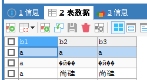
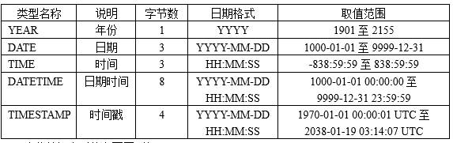
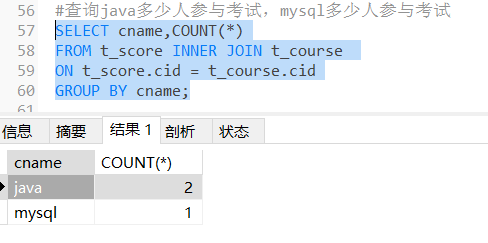

# 第1章 MySQL数据库概述

## 1.1 为什么要用数据库？

- 数据库是什么？
  - 集合存储和管理数据的地方
  - DB：数据库（Database）
- 为什么要用数据库？
  - 集中存储和管理
  - 按照一定的结构组织和管理，便于检索和维护
- 数据的持久化？
  - 数据存储在内存中，虽然效率更高，但是一旦程序崩溃或断定，数据就会丢失
  - 将数据写到可掉电式设备中，通常按一定格式写到文件中，才能永久保存
- 用普通文件存储行不行？
  - 把数据写入到硬盘上的文件中，当然可以实现持久化的目标，但是不利于后期的检索和管理等。
- MySQL、Oracle、SqlServer是什么？
  - MySQL、Oracle、SqlServer都是数据库管理系统（DBMS，Database Management System）是一种操纵和管理数据库的大型软件，例如建立、使用和维护数据库。

## 1.2 MySQL数据库管理系统

在互联网行业，MySQL数据库毫无疑问已经是最常用的数据库。MySQL数据库由瑞典MySQL AB公司开发。公司名中的“AB”是瑞典语“aktiebolag”股份公司的首字母缩写。该公司于2008年1月16号被Sun（Stanford University Network）公司收购。然而2009年，SUN公司又被Oracle收购。因此，MySQL数据库现在隶属于Oracle（甲骨文）公司。MySQL中的“My”是其发明者（Michael Widenius，通常称为Monty）根据其女儿的名字来命名的。对这位发明者来说，MySQL数据库就仿佛是他可爱的女儿。

MySQL的优点有很多，其中主要的优势有如下几点：

- 可移植性：MySQL数据库几乎支持所有的操作系统，如Linux、Solaris、FreeBSD、Mac和Windows。
- 免费：MySQL的社区版完全免费，一般中小型网站的开发都选择 MySQL 作为网站数据库。
- 开源：2000 年，MySQL公布了自己的源代码，并采用GPL（GNU General Public License）许可协议，正式进入开源的世界。开源意味着可以让更多人审阅和贡献源代码，可以吸纳更多优秀人才的代码成果。
- 关系型数据库：MySQL可以利用标准SQL语法进行查询和操作。
- 速度快、体积小、容易使用：与其他大型数据库的设置和管理相比，其复杂程度较低，易于学习。MySQL的早期版本（主要使用的是MyISAM引擎）在高并发下显得有些力不从心，随着版本的升级优化（主要使用的是InnoDB引擎），在实践中也证明了高压力下的可用性。从2009年开始，阿里的“去IOE”备受关注，淘宝DBA团队再次从Oracle转向MySQL，其他使用MySQL数据库的公司还有Facebook、Twitter、YouTube、百度、腾讯、去哪儿、魅族等等，自此，MySQL在市场上占据了很大的份额。
- 安全性和连接性：十分灵活和安全的权限和密码系统，允许基于主机的验证。连接到服务器时，所有的密码传输均采用加密形式，从而保证了密码安全。由于MySQL是网络化的，因此可以在因特网上的任何地方访问，提高数据共享的效率。
- 丰富的接口：提供了用于C、C++、Java、PHP、Python、Ruby和Eiffel、Perl等语言的API。
- 灵活：MySQL并不完美，但是却足够灵活，能够适应高要求的环境。同时，MySQL既可以嵌入到应用程序中，也可以支持数据仓库、内容索引和部署软件、高可用的冗余系统、在线事务处理系统等各种应用类型。
- MySQL最重要、最与众不同的特性是它的存储引擎架构，这种架构的设计将查询处理（Query Processing）及其他系统任务（Server Task）和数据的存储/提取相分离。这种处理和存储分离的设计可以在使用时根据性能、特性，以及其他需求来选择数据存储的方式。MySQL中同一个数据库，不同的表格可以选择不同的存储引擎。其中使用最多的是InnoDB 和MyISAM，MySQL5.5之后InnoDB是默认的存储引擎。

针对不同用户，MySQL提供三个不同的版本。

（1）MySQL Enterprise Server（企业版）：能够以更高的性价比为企业提供数据仓库应用，该版本需要付费使用，官方提供电话技术支持。

（2）MySQL Cluster（集群版）：MySQL 集群是 MySQL 适合于分布式计算环境的高可用、高冗余版本。它采用了 NDB Cluster 存储引擎，允许在 1 个集群中运行多个 MySQL 服务器。它不能单独使用，需要在社区版或企业版基础上使用。

（3）MySQL Community Server（社区版）：在开源GPL许可证之下可以自由的使用。该版本完全免费，但是官方不提供技术支持。本书是基于社区版讲解和演示的。在MySQL 社区版开发过程中，同时存在多个发布系列，每个发布处在不同的成熟阶段。

- MySQL5.7（RC）是当前稳定的发布系列。RC（Release Candidate候选版本）版只针对严重漏洞修复和安全修复重新发布，没有增加会影响该系列的重要功能。从MySQL 5.0、5.1、5.5、5.6直到5.7都基于5这个大版本，升级的小版本。5.0版本中加入了存储过程、服务器端游标、触发器、视图、分布式事务、查询优化器的显著改进以及其他的一些特性。这也为MySQL 5.0之后的版本迈向高性能数据库的发展奠定了基础。
- MySQL8.0.26（GA）是最新开发的稳定发布系列。GA（General Availability正式发布的版本）是包含新功能的正式发布版本。这个版本是MySQL数据库又一个开拓时代的开始。

## 1.3 关系型数据库和关系型数据库

以下是2021年《DB-Engines Ranking》对各数据库受欢迎程度进行调查后的统计结果（查看数据库最新排名：https://db-engines.com/en/ranking）


上面的数据库分为：关系型数据库和非关系数据库。

- MySQL、Oracle、SqlServer等是关系型数据库管理系统。
- MongoDB、Redis、Elasticsearch等是非关系型数据库管理系统。

### 1、关系型数据库

关系型数据库，采用关系模型来组织数据，简单来说，**关系模型指的就是二维表格模型**。类似于Excel工作表。


### 2、No-SQL

大数据时代的来临，数据不仅仅是文本格式，还有视频，音频，图片多媒体结构的数据。数据多样性的特点需要非关系型数据库来进行存储。NoSQL最常见的解释是“non-relational”， “Not Only SQL”也被很多人接受。NoSQL仅仅是一个概念，泛指非关系型的数据库，区别于关系数据库。

NoSQL数据库种类繁多，但是一个共同的特点都是去掉关系数据库的关系型特性。因为数据之间无关系性，数据库的结构简单，所以具有非常高的读写性能，尤其在大数据量下，同样表现优秀。因为数据之间无关系性，这样就非常容易扩展，无形之间也在架构的层面上带来了可扩展的能力。

非关系型数据库分为以下几类：

（1）键值存储——每个单独的项都存储为键值对。键值存储是所有NoSQL数据库中最简单的数据库。例如Redis, Riak等。


（2）文档数据库——文档存储是基于键值对存储的，其结构较之于键值对存储更为复杂，可以说在键值对的基础上更深入了一步，将每个键与称为文档的复杂数据结构配对。文档存储是假定一个特定文档的结构可以使用一种特定的模式来说明，文档存储不会去关心那些所谓的标准化，只要数据在该结构下是有意义的就可以。例如MongoDB、Apache CouchDB、Couchbase等。

（3）宽列存储——基于列的数据库会将每一列分开单独存放，这种设计看起来很像基于行的数据库在每一列上都加了索引一样。数据库索引这种数据结构以牺牲存储空间和更多的写文件（索引更新）为代价使查找速度得到提升。索引是将行号映射到数据上，而基于列数据库是将数据映射到行号上面，这样的方式用于计算是很简单的。例如查找有多少人的爱好包含archery（箭术）是很容易计算出来的。除此之外将每一列单独存放可以优化压缩因为每张表中只存一类数据。而且在基于列的数据库中要想增加一列新的数据是很容易的，因为现有的那些列是不会受新增列的影响的。但是要想增加一整条记录就需要适应所有的表，防止各个表的数据之间对应关系出现错误。因此这使得基于行的数据库在事务处理的时候要优胜于基于列的数据库，因为它很好的实现了数据的实时更新。例如：Cassandra，Hbase，Scylla。

（4）图形存储——这些存储关于图形、网络的信息，例如社会关系、路线图、交通链接。例如：Neo4j，AllegroGraph。图形或者网络数据有两部分组成：

Node：实体本身，在一个社会关系中可以认为是一个人。

Edge：实体之间的关系。这个关系可以用一条线来表示，这条线有它自己的属性、方向。


## 1.4 表的关系

在关系数据库管理系统中，很多表之间是有关系的，表之间的关系分为一对一关系、一对多关系和多对多关系。

1．一对一

该关系中第一个表中的一个行只可以与第二个表中的一个行相关，且第二个表中的一个行也只可以与第一个表中的一个行相关。

例如，“员工基本信息表”和“员工紧急情况联系信息表”。“员工基本信息表”中存储的是频繁使用的信息，“员工紧急情况联系信息表”中存储的是不常用的信息，这两个表中的一条记录都代表一个员工的信息。“员工基本信息表”中的一条记录在“员工紧急情况联系信息表”中只能找到唯一的一条对应记录，反过来也一样，即它们是一一对应关系。这两个表存在相同意义的“员工编号”字段，使它们建立了一对一关系。


2．一对多

第一个表中的一个行可以与第二个表中的一个或多个行相关，但第二个表中的一个行只可以与第一个表中的一个行相关。

例如，“部门表”和“员工基本信息表”。“部门表”中的一条记录，在“员工基本信息表”中可以找到一条或多条记录对应，但反过来“员工基本信息表”中的一条记录在“部门表”中只能找到一条记录对应，即一个部门可以有多个员工，但是一个员工只能属于一个部门。这两个表存在相同意义的“部门编号”字段，使它们建立了一对多关系。


3．多对多

该关系中第一个表中的一个行可以与第二个表中的一个或多个行相关。第二个表中的一个行也可以与第一个表中的一个或多个行相关。通常两个表的多对多关系会借助第三张表，转换为两个一对多的关系。

例如，选课系统的“学生信息表”和“课程信息表”是多对多关系。一个学生可以选择多门课，一门课程可以被多个学生选择，即“学生信息表”中一条记录可以与“课程信息表”多条记录对应，反过来“课程信息表”的一条记录也可以与“学生信息表”中多条记录对应。它们之间借助第三张“选课信息表”实现关联关系，而“学生信息表”与“选课信息表”是一对多关系，“课程信息表”与“选课信息表”也是一对多关系。“选课信息表”中“学号”字段与“学生信息表”中“学号”字段意义相同。“课程信息表”中“课程编号”字段与“课程信息表”中“课程编号”字段意义相同。


# 第2章 SQL

## 2.1 什么是SQL

SQL：结构化查询语言，（Structure Query Language），专门用来操作/访问数据库的通用语言。


## 2.2 SQL演示

### 2.2.1 数据库

1、查看所有的数据库

```mysql
show databases;
```

2、创建自己的数据库

```mysql
create database 数据库名;

#创建atguigudb数据库
create database atguigudb;
```

3、删除数据库

```mysql
drop database 数据库名;
```

```mysql
#删除atguigudb数据库
drop database atguigudb;
```

4、使用自己的数据库

```mysql
use 数据库名;

#使用atguigudb数据库
use atguigudb;
```

说明：如果没有使用use语句，后面针对数据库的操作也没有加“数据名”的限定，那么会报“ERROR 1046 (3D000): No database selected”（没有选择数据库）

使用完use语句之后，如果接下来的SQL都是针对一个数据库操作的，那就不用重复use了，如果要针对另一个数据库操作，那么要重新use。

### 2.2.2 数据表

1、查看某个库的所有表格

```mysql
show tables from 数据库名;

show tables;  #如果是查看前面use的数据库中的所有表格，可以省略“from 数据库名”
```

2、创建新的表格

```mysql
create table 【数据库名.】表名称( #如果新表是建在use的数据库中，可以省略表名前面的“数据库名.”
	字段名  数据类型,
	字段名 数据类型
);
```

说明：如果是最后一个字段，后面就用加逗号，因为逗号的作用是分割每个字段。

```mysql
#创建学生表
create table student(
	id int,
    name varchar(20)  #要求名字最长不超过20个字符
);
```

3、查看定义好的表结构

```mysql
desc 【数据库名.】表名称;
```

```mysql
desc student; #如果要查看的表是在前面use的数据库中，可以省略表名前面的“数据库名.”
```

4、添加一条记录

```mysql
insert into 【数据库名.】表名称 values(值列表);

#添加两条记录到student表中
#如果要添加记录的表是在前面use的数据库中，可以省略表名前面的“数据库名.”
insert into student values(1,'张三');
insert into student values(2,'李四');
```

5、查看一个表的数据

```mysql
select * from 【数据库名.】表名称; #*表示查看所有列
```

```sql
select * from student;
```

6、删除表

```mysql
drop table 【数据库名.】表名称;
```

```mysql
#删除学生表
#如果要删除的表是在前面use的数据库中，可以省略表名前面的“数据库名.”
drop table student;
```

## 2.3 SQL的分类

DDL语句：数据定义语句（Data Define Language），例如：创建（create），修改（alter），删除（drop）等

DML语句：数据操作语句，例如：增（insert)，删（delete），改（update），查（select）

因为查询语句使用的非常的频繁，所以很多人把查询语句单拎出来一类，DQL（数据查询语言），DR（获取）L

DCL语句：数据控制语句，例如：grant，commit，rollback等

其他语句：USE语句，SHOW语句，SET语句等。这类的官方文档中一般称为命令。


## 2.4 SQL语法规范

（1）mysql的sql语法不区分大小写

A：数据库的表中的数据是否区分大小写。这个的话要看表格的字段的数据类型、编码方式以及校对规则。

ci（大小写不敏感），cs（大小写敏感），_bin（二元，即比较是基于字符编码的值而与language无关，区分大小写）

B：sql中的关键字，比如：create,insert等，不区分大小写。但是大家习惯上把关键字都“大写”。

（2）命名时：尽量使用26个英文字母大小写，数字0-9，下划线，不要使用其他符号，不要使用纯数字来命名

（3）建议不要使用mysql的关键字等来作为表名、字段名、数据库名等，

（4）习惯上在SQL语句中表名、字段名、数据库名等使用`（飘号）引起来

（5）同一个mysql软件中，数据库不能同名，同一个库中，表不能重名，同一个表中，字段不能重名

```mysql
mysql> show databases;
+--------------------+
| Database           |
+--------------------+
| information_schema |
| atguigudb          |
| mysql              |
| performance_schema |
| sys                |
+--------------------+
5 rows in set (0.00 sec)

mysql> create database atguigudb;
ERROR 1007 (HY000): Can't create database 'atguigudb'; database exists
```

```mysql
mysql> show tables;
+---------------------+
| Tables_in_atguigudb |
+---------------------+
| student             |
| temp                |
+---------------------+
2 rows in set (0.00 sec)

mysql> create table temp(id int);
ERROR 1050 (42S01): Table 'temp' already exists
```

```
mysql> create table tt(
    ->  id int,
    ->  id int
    -> );
ERROR 1060 (42S21): Duplicate（重复） column name 'id'
```

（6）数据库和表名、字段名等对象名中间不要包含空格

```mysql
create database my atguigu;

ERROR 1064 (42000): You have an error in your SQL syntax; check the manual that corresponds to your MySQL server version for the right syntax to use near 'atguigu' at line 1
```

（7）给字段和表取别名时，as可以省略

- 表的别名不能包含空格
- 如果给字段取别名，也尽量不包含空格，包含字段别名中包含空格，请用双引号

```sql
select 字段名1 as 别名1, 字段名2 as 别名2 from 表名称 as 别名;
```

```sql
mysql> select * from student;
+------+------+
| id   | name |
+------+------+
|    1 | 张三 |
|    2 | 李四 |
+------+------+
2 rows in set (0.00 sec)

mysql> select id "学号",name "姓名" from student 学生表;
+------+------+
| 学号 | 姓名 |
+------+------+
|    1 | 张三 |
|    2 | 李四 |
+------+------+
2 rows in set (0.00 sec)

mysql> select id 学号,name 姓名 from student;
+------+------+
| 学号 | 姓名 |
+------+------+
|    1 | 张三 |
|    2 | 李四 |
+------+------+
2 rows in set (0.00 sec)

mysql> select id 学 号,name 姓 名 from student; 
ERROR 1064 (42000): You have an error in your SQL syntax; check the manual that corresponds to your MySQL server version for the right syntax to use n
ear '号,name 姓 名 from student' at line 1
```

## 2.5 标点符号

mysql脚本中标点符号的要求如下：

- 本身成对的标点符号必须成对，例如：()，''，""。

- 所有标点符号必须英文状态下半角输入方式下输入。


几个特殊的标点符号：

- 小括号()：在创建表、添加数据、函数使用、子查询、计算表达式等等会用（）表示某个部分是一个整体结构。

- 单引号''：字符串和日期类型的数据值使用单引号''引起来，数值类型的不需要加标点符号。
- 双引号""：列的别名可以使用双引号""，给表名取别名==不要使用==双引号。


```mysql
create table tt(
    id int
    ;
    
ERROR 1064 (42000): You have an error in your SQL syntax; check the manual that corresponds to your MySQL server version for the right syntax to use near '' at line 2
```

```mysql
create table temp(
	c char
);
insert into temp values('尚) ; #缺一半单引号
                        
insert into temp values(‘尚’) ;  #标点符号是中文
```

```mysql
mysql> select * from student;
+------+------+
| id   | name |
+------+------+
|    1 | 张三 |
|    2 | 李四 |
+------+------+
2 rows in set (0.00 sec)

mysql> select id "学号",name "姓名" from student;
+------+------+
| 学号 | 姓名 |
+------+------+
|    1 | 张三 |
|    2 | 李四 |
+------+------+
2 rows in set (0.00 sec)
```

## 2.6 SQL脚本中如何加注释

SQL脚本中如何加注释

- 单行注释：#注释内容（mysql特有的）

- 单行注释：--空格注释内容    其中--后面的空格必须有

- 多行注释：/* 注释内容 */

```mysql
create table tt(
	id int, #编号
    `name` varchar(20), -- 姓名
    gender enum('男','女')
    /*
    性别只能从男或女中选择一个，
    不能两个都选，或者选择男和女之外的
    */
);
```

## 2.7 导入导出sql脚本

### 2.7.1 导入执行sql脚本命令

在命令行客户端==登录mysql==，使用source指令导入

```mysql
mysql> source d:\练习脚本.sql
```

注意：

（1）在使用命令行导入SQL脚本之前，请使用记事本或NotePad++等文本编辑器打开SQL脚本查看SQL脚本中是否有USE语句，如果没有，那么在命令行中需要先使用USE语句指定具体的数据库，否则会报“No database selected”的错误。

（2）sql脚本的路径文件名尽量避免中文，空格，或者路径名太长等情况。


### 2.7.2 导出sql脚本命令

在命令行客户端不登录mysql，使用mysqldump命令。

```cmd
mysqldump -u用戶名 -p密码 数据库名 > 脚本名.sql
mysqldump -u用戶名 -p密码 数据库名 表名 > 脚本名.sql
```


# 第3章 MySQL支持的数据类型

## 3.1 数值类型：包括整数和小数

数值类型主要用来存储数字，不同的数值类型提供不同的取值范围，可以存储的值范围越大，所需要的存储空间也越大。MySQL支持所有标准SQL中的数值类型，其中包括严格数据类型（INTEGER、SMALLINT、DECIMAL、NUMERIC）和近似数值类型（FLOAT、REAL、DOUBLE PRECISION）。MySQL还扩展了TINYINT、MEDIUMINT和BIGINT等3种不同长度的整数类型，并增加了BIT类型，用来存储位数据。

对于MySQL中的数值类型，还要做如下说明：

- 关键字INT是INTEGER的同义词。
- 关键字DEC和FIXED是DECIMAL的同义词。
- NUMERIC和DECIMAL类型被视为相同的数据类型。

- DOUBLE视为DOUBLE PRECISION的同义词，并在REAL_AS_FLOAT SQL模式未启用的情况下，将REAL也视为DOUBLE PRECISION的同义词。

### 1、整数类型


说明：

对于整数类型，MySQL还支持在类型名称后面加小括号(M)，而小括号中的M表示显示宽度，M的取值范围是(0, 255)。int(M)这个M在字段的属性中指定了unsigned（无符号）和zerofill（零填充）的情况下才有意义。表示当整数值不够M位时，用0填充。如果整数值超过M位但是没有超过当前数据类型的范围时，就按照实际位数存储。当M宽度超过当前数据类型可存储数值范围的最大宽度时，也是以实际存储范围为准。

MySQL8之前，int没有指定(M)，默认显示(11)。最多能存储和显示11位整数。从MySQL 8.0.17开始，整数数据类型没有zerofill的情况下不推荐使用显示宽度属性，默认显示int。

```mysql
#演示整数类型
#创建一个表格，表格的名称“t_int”，
#包含两个字段i1和i2，分别是int和int(2)类型
#create table t_int(i1 int,i2 int(2));
create table t_int(
	i1 int,
	i2 int(2)  #没有unsigned zerofill，(2)没有意义
);

#查看当前数据库的所有表格
show tables;
show tables from 数据库名;

#查看表结构
desc 表名称;
desc t_int;

mysql> desc t_int;
+-------+------+------+-----+---------+-------+
| Field | Type | Null | Key | Default | Extra |
+-------+------+------+-----+---------+-------+
| i1    | int  | YES  |     | NULL    |       |
| i2    | int  | YES  |     | NULL    |       |
+-------+------+------+-----+---------+-------+
2 rows in set (0.01 sec)

#创建一个表格，表格的名称“t_int2”，
#包含两个字段i1和i2，分别是int和int(2)类型
create table t_int2(
	i1 int,
	i2 int(2) unsigned zerofill
);

mysql> desc t_int2;
+-------+--------------------------+------+-----+---------+-------+
| Field | Type                     | Null | Key | Default | Extra |
+-------+--------------------------+------+-----+---------+-------+
| i1    | int                      | YES  |     | NULL    |       |
| i2    | int(2) unsigned zerofill | YES  |     | NULL    |       |
+-------+--------------------------+------+-----+---------+-------+
2 rows in set (0.01 sec)

#添加数据到表格中
insert into 表名称 values(值列表);
insert into t_int values(1234,1234);
insert into t_int2 values(1234,1234);

#查询数据
select * from 表名称;
select * from t_int;
select * from t_int2;

#添加数据到表格中
insert into 表名称 values(值列表);
insert into t_int values(1,1);
insert into t_int2 values(1,1);

insert into t_int values(12222228854225548778455,12222228854225548778455);
mysql> insert into t_int values(12222228854225548778455,12222228854225548778455);
ERROR 1264 (22003): Out of range value for column 'i1' at row 

```

### 2、bit类型

bit类型，如果没有指定(M)，默认是1位。这个1位，那么表示只能存1位的二进制值。这里(M)是表示二进制的位数。M范围从1到64。

对于位类型字段，之前版本直接使用SELECT语句将不会看到结果，而在MySQL8版本中默认以“0X”开头的十六进制形式显示，可以通过BIN()函数显示为二进制格式。


```mysql
#演示bit类型，存储二进制，只有0和1
#创建一个表格
create table t_bit(
	b1 bit,  #没有指定(M)，默认是1位二进制
	b2 bit(4) #能够存储4位二进制0000~1111
);

#查看表结构
desc t_bit;

mysql> desc t_bit;
+-------+--------+------+-----+---------+-------+
| Field | Type   | Null | Key | Default | Extra |
+-------+--------+------+-----+---------+-------+
| b1    | bit(1) | YES  |     | NULL    |       |
| b2    | bit(4) | YES  |     | NULL    |       |
+-------+--------+------+-----+---------+-------+
2 rows in set (0.01 sec)

#添加记录
insert into t_bit values(1,1);

#查看数据
select * from t_bit;

mysql> select * from t_bit;
+------------+------------+
| b1         | b2         |
+------------+------------+
| 0x01       | 0x01       |  #0x开头表示十六进制
+------------+------------+
1 row in set (0.00 sec)

#显示二进制值，需要使用bin函数
select bin(b1),bin(b2) from t_bit;

mysql> select bin(b1),bin(b2) from t_bit;
+---------+---------+
| bin(b1) | bin(b2) |
+---------+---------+
| 1       | 1       |
+---------+---------+
1 row in set (0.00 sec)

#添加记录
insert into t_bit values(2,2);

mysql> insert into t_bit values(2,2); 
#values()中是十进制值，需要转为二进制存储，2对应10，超过1位，b1存不下
ERROR 1406 (22001): Data too long for column 'b1' at row 1

#添加记录
insert into t_bit values(1,8);

#查看数据
select * from t_bit;

mysql> select * from t_bit;
+------------+------------+
| b1         | b2         |
+------------+------------+
| 0x01       | 0x01       |
| 0x01       | 0x08       |
+------------+------------+
2 rows in set (0.00 sec)


#显示二进制值，需要使用bin函数
select bin(b1),bin(b2) from t_bit;

mysql> select bin(b1),bin(b2) from t_bit;
+---------+---------+
| bin(b1) | bin(b2) |
+---------+---------+
| 1       | 1       |
| 1       | 1000    |
+---------+---------+
2 rows in set (0.00 sec)

#添加记录
insert into t_bit values(1,16); #16的二进制10000
mysql> insert into t_bit values(1,16);
ERROR 1406 (22001): Data too long for column 'b2' at row 1
```


### 3、小数类型

MySQL中使用浮点数和定点数来表示小数。浮点数有两种类型：单精度浮点数（FLOAT）和双精度浮点数（DOUBLE），定点数只有DECIMAL。浮点数和定点数都可以用(M，D)来表示。

- M是精度，表示该值总共显示M位，包括整数位和小数位，对于FLOAT和DOUBLE类型来说，M取值范围为0~255，而对于DECIMAL来说，M取值范围为0~65。
- D是标度，表示小数的位数，取值范围为0~30，同时必须<=M。

浮点型FLOAT(M，D) 和DOUBLE(M，D)是非标准用法，如果考虑到数据库迁移，则最好不要使用，而且从MySQL 8.0.17开始，FLOAT(M，D) 和DOUBLE(M，D)用法在官方文档中已经明确不推荐使用，将来可能被移除。另外，关于浮点型FLOAT和DOUBLE的UNSIGNED也不推荐使用了，将来也可能被移除。FLOAT和DOUBLE类型在不指定（M，D）时，默认会按照实际的精度来显示。DECIMAL类型在不指定（M，D）时，默认为（10，0），即只保留整数部分。例如，定义DECIMAL（5,2）的类型，表示该列取值范围是-999.99~999.99。如果用户插入数据的小数部分位数超过D位，MySQL会四舍五入处理，但是如果用户插入数据的整数部分位数超过“M-D”位，则会报“Out of range”的错误。

DECIMAL实际是以字符串形式存放的，在对精度要求比较高的时候（如货币、科学数据等）使用DECIMAL类型会比较好。浮点数相对于定点数的优点是在长度一定的情况下，浮点数能够表示更大的数据范围，它的缺点是会引起精度问题。


```mysql
#演示小数类型
#创建表格
create table t_double(
	d1 double,
	d2 double(5,2)  #-999.99~999.99
);

#查看表结构
desc t_double;

#添加数据
insert into t_double values(2.5,2.5);

#查看数据
select * from t_double;
mysql> select * from t_double;
+------+------+
| d1   | d2   |
+------+------+
|  2.5 | 2.50 |#d2字段小数点后不够2位用0补充
+------+------+
1 row in set (0.00 sec)

#添加数据
insert into t_double values(2.5526,2.5526);
insert into t_double values(2.5586,2.5586);

mysql> select * from t_double;
+--------+------+
| d1     | d2   |
+--------+------+
|    2.5 | 2.50 |
| 2.5526 | 2.55 |#小数点后有截断现象，并且会四舍五入
| 2.5586 | 2.56 |#小数点后有截断现象，并且会四舍五入
+--------+------+
3 rows in set (0.00 sec)


#添加数据
insert into t_double values(12852.5526,12852.5526);

#d2字段整数部分超过(5-2=3)位，添加失败
mysql> insert into t_double values(12852.5526,12852.5526); 
ERROR 1264 (22003): Out of range value for column 'd2' at row 1


#创建表格
create table t_decimal(
	d1 decimal,  #没有指定(M,D)默认是(10,0)
	d2 decimal(5,2)
);


#查看表结构
desc t_decimal;
mysql> desc t_decimal;
+-------+---------------+------+-----+---------+-------+
| Field | Type          | Null | Key | Default | Extra |
+-------+---------------+------+-----+---------+-------+
| d1    | decimal(10,0) | YES  |     | NULL    |       |
| d2    | decimal(5,2)  | YES  |     | NULL    |       |
+-------+---------------+------+-----+---------+-------+
2 rows in set (0.01 sec)

#添加数据
insert into t_decimal values(2.5,2.5);

#查看数据
select * from t_decimal;
mysql> select * from t_decimal;
+------+------+
| d1   | d2   |
+------+------+
|    3 | 2.50 |  #d1字段小数点后截断
+------+------+
1 row in set (0.00 sec)

insert into t_decimal values(12852.5526,12852.5526);

把小数赋值给整数类型的字段时，会截断小数部分，考虑四舍五入
insert into t_int2 values(1.5,1.5);
```


## 3.2 字符串类型

MySQL的字符串类型有CHAR、VARCHAR、BINARY、VARBINARY、BLOB、TEXT、ENUM、SET等。MySQL的字符串类型可以用来存储文本字符串数据，还可以存储二进制字符串。

文本字符串类型：


二进制字符串类型：


### 1、char和varchar

CHAR(M)为固定长度的字符串， M表示最多能存储的字符数，取值范围是0~255个字符，如果未指定(M)表示只能存储1个字符。例如CHAR(4)定义了一个固定长度的字符串列，其包含的字符个数最大为4，如果存储的值少于4个字符，右侧将用空格填充以达到指定的长度，当查询显示CHAR值时，尾部的空格将被删掉。

```mysql
create table temp(
	c1 char,
    c2 char(3)
);
```

```mysql
insert into temp values('男','女');#成功

insert into temp values('尚硅谷','尚硅谷');#失败
ERROR 1406 (22001): Data too long for column 'c1' at row 1

insert into temp values('男','尚硅谷');#成功
```

VARCHAR(M)为可变长度的字符串，M表示最多能存储的字符数，M的范围由最长的行的大小（通常是65535）和使用的字符集确定。例如utf8mb4字符编码单个字符所需最长字节值为4个字节，所以M的范围是[0, 16383]。而VARCHAR类型的字段实际占用的空间为字符串的实际长度加1或2个字节，这1或2个字节用于描述字符串值的实际字节数，即字符串值在[0,255]个字节范围内，那么额外增加1个字节，否则需要额外增加2个字节。

```mysql
create table temp(
	name varchar  #错误
);
```

```mysql
create table temp(
	name varchar(3)  #最多不超过3个字符
);
```

```mysql
insert into temp values('尚硅谷');

insert into temp values('尚硅谷真好');#ERROR 1406 (22001): Data too long for column 'name' at row 1

insert into temp values('好');
```

```mysql
drop table temp;
create table temp(
	name varchar(65535)
);
#ERROR 1074 (42000): Column length too big for column 'name' (max = 21845); use BLOB or TEXT instead
因为当前的表是UTF8，一个汉字占3个字节
```


例如，身份证号、手机号码、QQ号、用户名username、密码password、银行卡号等固定长度的文本字符串适合使用CHAR类型，而评论、朋友圈、微博不定长度的文本字符串更适合使用VARCHAR类型。

另外，存储引擎对于选择CHAR和VARCHAR是有影响的。

- 对于MyISAM存储引擎，最好使用固定长度的数据列代替可变长度的数据列。这样可以使整个表静态化，从而使数据检索更快，用空间换时间。
- 对于InnoDB存储引擎，使用可变长度的数据列，因为InnoDB数据表的存储格式不分固定长度和可变长度，因此使用CHAR不一定比使用VARCHAR更好，但由于VARCHAR是按照实际的长度存储的，比较节省空间，所以对磁盘I/O和数据存储总量比较好。

### 2、Enum和Set类型

无论是数值类型、日期类型、普通的文本类型，可取值的范围都非常大，但是有时候我们指定在固定的几个值范围内选择一个或多个，那么就需要使用ENUM枚举类型和SET集合类型了。比如性别只有“男”或“女”；上下班交通方式可以有“地铁”、“公交”、“出租车”、“自行车”、“步行”等。枚举和集合类型字段声明的语法格式如下：

字段名ENUM（‘值1’，‘值2’，…‘值n’）

字段名 SET（‘值1’，‘值2’，…‘值n’）

ENUM类型的字段在赋值时，只能在指定的枚举列表中取值，而且一次只能取一个。枚举列表最多可以有65535个成员。ENUM值在内部用整数表示，每个枚举值均有一个索引值， MySQL存储的就是这个索引编号。例如，定义ENUM类型的列(‘first’, ‘second’, ‘third’)。


SET类型的字段在赋值时，可从定义的值列表中选择1个或多个值的组合。SET列最多可以有64个成员。SET值在内部也用整数表示，分别是1，2，4，8……，都是2的n次方值，因为这些整数值对应的二进制都是只有1位是1，其余是0。


演示枚举类型：

```mysql
create table temp(
	gender enum('男','女'),
    hobby set('睡觉','打游戏','泡妞','写代码')
);
```

```mysql
insert into temp values('男','睡觉,打游戏'); #成功

insert into temp values('男,女','睡觉,打游戏'); #失败
#ERROR 1265 (01000): Data truncated for column 'gender' at row 1

insert into temp values('妖','睡觉,打游戏');#失败
ERROR 1265 (01000): Data truncated for column 'gender' at row 1

insert into temp values('男','睡觉,打游戏,吃饭');
ERROR 1265 (01000): Data truncated for column 'hobby' at row 1
```

```mysql
#文本类型中的枚举和集合
#枚举：固定的几个字符串值，从中选择一个
#集合：固定的几个字符串值，从中选择任意几个

create table t_enum_set(
	gender enum('男','女'),
	hobby set('游戏','睡觉','打代码','运动')
);

#查看表结构
desc t_enum_set;

mysql> desc t_enum_set;
+--------+------------------------------------+------+-----+---------+-------+
| Field  | Type                               | Null | Key | Default | Extra |
+--------+------------------------------------+------+-----+---------+-------+
| gender | enum('男','女')                    | YES  |     | NULL    |       |
| hobby  | set('游戏','睡觉','打代码','运动') | YES  |     | NULL    |       |
+--------+------------------------------------+------+-----+---------+-------+
2 rows in set (0.01 sec)


#添加数据
insert into t_enum_set
values('男','游戏');

#查看数据
select * from t_enum_set;

#添加数据
insert into t_enum_set
values('男,女','游戏,睡觉');

mysql> insert into t_enum_set
    -> values('男,女','游戏,睡觉');
ERROR 1265 (01000): Data truncated for column 'gender' at row 1

#添加数据
insert into t_enum_set
values('男','游戏,睡觉');

#添加数据
insert into t_enum_set
values('妖','游戏,睡觉');
mysql> insert into t_enum_set
    -> values('妖','游戏,睡觉');
ERROR 1265 (01000): Data truncated for column 'gender' at row 1

#添加数据
insert into t_enum_set
values('男','游戏,睡觉,做饭');
mysql> insert into t_enum_set
    -> values('男','游戏,睡觉,做饭');
ERROR 1265 (01000): Data truncated for column 'hobby' at row 1


insert into t_enum_set
values(2, 2);

mysql> select * from t_enum_set;
+--------+-----------+
| gender | hobby     |
+--------+-----------+
| 男     | 游戏      |
| 男     | 游戏,睡觉 |
| 女     | 睡觉      |
+--------+-----------+
3 rows in set (0.00 sec)


insert into t_enum_set
values(2, 5);
#5 可以看出 1和4的组合，00001 和 0100，0101


insert into t_enum_set
values(2, 7);
mysql> select * from t_enum_set;
+--------+------------------+
| gender | hobby            |
+--------+------------------+
| 男     | 游戏             |
| 男     | 游戏,睡觉        |
| 女     | 睡觉             |
| 女     | 游戏,打代码      |
| 女     | 游戏,睡觉,打代码 |
+--------+------------------+
5 rows in set (0.00 sec)

insert into t_enum_set
values(2, 15);
mysql> select * from t_enum_set;
+--------+-----------------------+
| gender | hobby                 |
+--------+-----------------------+
| 男     | 游戏                  |
| 男     | 游戏,睡觉             |
| 女     | 睡觉                  |
| 女     | 游戏,打代码           |
| 女     | 游戏,睡觉,打代码      |
| 女     | 游戏,睡觉,打代码,运动 |
+--------+-----------------------+
6 rows in set (0.00 sec)


insert into t_enum_set
values(2, 25);
mysql> insert into t_enum_set
    -> values(2, 25);
ERROR 1265 (01000): Data truncated for column 'hobby' at row 1
```


### 3、BINARY和VARBINARY类型

BINARY和VARBINARY类似于CHAR和VARCHAR，只是它们存储的是二进制字符串。

BINARY (M)为固定长度的二进制字符串，M表示最多能存储的字节数，取值范围是0~255个字节，如果未指定(M)表示只能存储1个字节。例如BINARY (8)，表示最多能存储8个字节，如果字段值不足(M)个字节，将在右边填充'\0'以补齐指定长度。

VARBINARY (M)为可变长度的二进制字符串，M表示最多能存储的字节数，总字节数不能超过行的字节长度限制65535，另外还要考虑额外字节开销，VARBINARY类型的数据除了存储数据本身外，还需要1或2个字节来存储数据的字节数。VARBINARY类型和VARCHAR类型一样必须指定(M)，否则报错。


```mysql
#演示二进制字符串类型binary和varbinary
#创建表格
create table t_binary(
	b1 binary, #没有指定(M)，默认是(1)
	b2 varbinary #没有指定(M)，报错，必须指定(M)
);
ERROR 1064 (42000): You have an error in your SQL syntax; 
check the manual that corresponds to your MySQL server 
version for the right syntax to use near ')' at line 4


create table t_binary(
	b1 binary, #默认(1)，最多能存储一个字节
	b2 binary(6), #最多能存储6个字节，不够6个用\u0000补全
	b3 varbinary(6) #(6)，最多能存储6个字节
);

#查看表结构
desc t_binary;

mysql> desc t_binary;
+-------+--------------+------+-----+---------+-------+
| Field | Type         | Null | Key | Default | Extra |
+-------+--------------+------+-----+---------+-------+
| b1    | binary(1)    | YES  |     | NULL    |       |
| b2    | binary(6)    | YES  |     | NULL    |       |
| b3    | varbinary(6) | YES  |     | NULL    |       |
+-------+--------------+------+-----+---------+-------+
3 rows in set (0.01 sec)


#添加数据
insert into t_binary
values('a','a','a');

#查看数据
select * from t_binary;
#显示16进制形式的值

mysql> select * from t_binary;
+------------+----------------+------------+
| b1         | b2             | b3         |
+------------+----------------+------------+
| 0x61       | 0x610000000000 | 0x61       |
+------------+----------------+------------+
1 row in set (0.00 sec)

#'a'的编码值是97（十进制），对应十六进制（61）
#0x610000000000 补够6个字节

#添加数据
insert into t_binary
values('尚','尚','尚');

mysql> insert into t_binary
    -> values('尚','尚','尚');
ERROR 1406 (22001): Data too long for column 'b1' at row 1
#'尚'无论在GBK还是UTF8编码下都不可能是1个字节

#添加数据
insert into t_binary
values('a','尚硅谷','尚硅谷');

mysql> select * from t_binary;
+------------+----------------+----------------+
| b1         | b2             | b3             |
+------------+----------------+----------------+
| 0x61       | 0x610000000000 | 0x61           |
| 0x61       | 0xC9D0B9E8B9C8 | 0xC9D0B9E8B9C8 |  #此时客户端是GBK，尚硅谷编码为6个字节
+------------+----------------+----------------+
2 rows in set (0.00 sec)

#添加数据
insert into t_binary
values('a','尚硅谷真好','尚硅谷尚硅谷真好');

mysql> insert into t_binary
    -> values('a','尚硅谷真好','尚硅谷尚硅谷真好');
ERROR 1406 (22001): Data too long for column 'b2' at row 1
```


### 4、二进制字符串和文本字符串

- 二进制字符串是存储客户端给服务器端传输的字符串的原始二进制值，而文本字符串则会按照表和字段的字符集编码方式对客户端给服务器传输的字符串进行转码处理。

- 二进制字符串严格区分大小写（因为大小写字符的编码值不同），文本字符串在大多数字符集和校对规则中不区分大小写。


（1）此时在sqlyog客户端查看“t_binary”的数据，发现乱码。


因为命令行客户端的编码默认是GBK，而服务器端t_binary表的编码是“utf8mb4”，如果是binary等这种二进制字符串的话，客户端传给服务器端的字符编码的二进制（基于GBK编码的），服务器接收后是“原样”存储，不转码的，所以表格中存储的是“尚硅谷”基于GBK编码的二进制值，在可视化工具中（UTF8编码）显示不了。


如果是char和varchar类型等这种文本字符串的话，客户端传给服务器端的字符编码的二进制（基于GBK编码的），并且会把编码方式一并告诉服务器端，服务器接收后会进行转码，存储为utf8的二进制值。例如：t_char表显示正常。


（2）当我们在可视化工具中，在t_binary表中添加“尚硅谷”时，“尚硅谷”以utf8mb4编码处理，一个汉字是3个字节，“尚硅谷”就有9个字节，而b2和b3最多能存6个字节。


当我们在可视化工具中，在t_binary表中添加“尚硅”时，“尚硅”以utf8mb4编码处理，一个汉字是3个字节，“尚硅”就有6个字节。



在命令行客户端，在t_binary表中添加“尚硅”时，“尚硅”以GBK编码处理，一个汉字是2个字节，“尚硅”就有4个字节。

```java
#添加数据
insert into t_binary
values('a','尚硅','尚硅');
```

在命令行查看数据，两条“尚硅”记录值不一样。

```mysql
mysql> select * from t_binary;
+------------+----------------+----------------+
| b1         | b2             | b3             |
+------------+----------------+----------------+
| 0x61       | 0x610000000000 | 0x61           |
| 0x61       | 0xC9D0B9E8B9C8 | 0xC9D0B9E8B9C8 |
| 0x61       | 0xE5B09AE7A185 | 0xE5B09AE7A185 |   #可视化工具中添加的，基于UTF8的  尚硅
| 0x61       | 0xC9D0B9E80000 | 0xC9D0B9E8     |   #命令行添加的，基于GBK   尚硅
+------------+----------------+----------------+
4 rows in set (0.00 sec)
```

（3）分别在t_char表和t_bianary表查询  查询'a'的记录

```java
#查询表中b1字段值为'a'的记录
select * from t_binary where b1 = 'a';

#查询表中b1字段值为'A'的记录
select * from t_binary where b1 = 'A';

mysql> select * from t_binary where b1 = 'a';
+------------+----------------+----------------+
| b1         | b2             | b3             |
+------------+----------------+----------------+
| 0x61       | 0x610000000000 | 0x61           |
| 0x61       | 0xC9D0B9E8B9C8 | 0xC9D0B9E8B9C8 |
| 0x61       | 0xE5B09AE7A185 | 0xE5B09AE7A185 |
| 0x61       | 0xC9D0B9E80000 | 0xC9D0B9E8     |
+------------+----------------+----------------+
4 rows in set (0.00 sec)

mysql> select * from t_binary where b1 = 'A';


#在char和varchar类型的表格中查询
#查询表中c1字段值为'a'的记录
select * from t_char where c1 = 'a';

#查询表中c1字段值为'A'的记录
select * from t_char where c1 = 'A';

mysql> select * from t_char where c1 = 'a';
+------+------+------+
| c1   | c2   | c3   |
+------+------+------+
| a    | a    | a    |
+------+------+------+
1 row in set (0.00 sec)

mysql> select * from t_char where c1 = 'A';
+------+------+------+
| c1   | c2   | c3   |
+------+------+------+
| a    | a    | a    |
+------+------+------+
1 row in set (0.00 sec)
```


### 5、BLOB和TEXT类型

BLOB是一个二进制大对象，用来存储可变数量的二进制字符串，分为TINYBLOB、BLOB、MEDIUMBLOB、LONGBLOB四种类型。TINYTEXT、TEXT、MEDIUMTEXT和LONGTEXT四种文本类型，它们分别对应于以上四种BLOB类型，具有相同的最大长度和存储要求。

BLOB类型与TEXT类型的区别如下：

（1）BLOB类型存储的是二进制字符串，TEXT类型存储的是文本字符串。BLOB类型还可以存储图片和声音等二进制数据。

（2）BLOB类型没有字符集，并且排序和比较基于列值字节的数值，TEXT类型有一个字符集，并且根据字符集对值进行排序和比较。

```mysql
#演示blob和text
#blob系列是大的二进制数据类型
#text系列是大的文本字符串类型
#创建表格
create table t_blob_text(
	b blob,
	t text
);

#查看表结构
desc t_blob_text;
mysql> desc t_blob_text;
+-------+------+------+-----+---------+-------+
| Field | Type | Null | Key | Default | Extra |
+-------+------+------+-----+---------+-------+
| b     | blob | YES  |     | NULL    |       |
| t     | text | YES  |     | NULL    |       |
+-------+------+------+-----+---------+-------+
2 rows in set (0.01 sec)

#添加数据
insert into t_blob_text
values('a','a');

insert into t_blob_text
values('尚硅谷','尚硅谷');

#查看数据
select * from t_blob_text;

mysql> select * from t_blob_text;
+----------------+--------+
| b              | t      |
+----------------+--------+
| 0x61           | a      |
| 0xC9D0B9E8B9C8 | 尚硅谷 |
+----------------+--------+
2 rows in set (0.00 sec)
```

BLOB类型的数据支持存储图片等数据。存储图片等数据需要借助图形界面工具来实现，下面以SQLyog图形界面工具为例演示操作步骤。

第1步，选择“t_blob_text"数据表，双击要编辑的BLOB类型的字段b单元格


第2步，选择“从文件导入”按钮，打开“Open File”对话框，选择图片文件。默认情况下“从文件导入”按钮不可用，去掉“设置为空”前面的对勾，就可以了.


第3步，导入图片成功，


注意， BLOB类型的数据除了受到类型本身大小的限制外，还会受到服务器端“max_allowed_packet”变量值限定的字节值大小限制。如果从客户端给服务器端上传的BLOB数据大小超过该值时会报错。


如果确实需要上传并存储更大的图片，可以停止MySQL服务并修改my.ini配置文件的“max_allowed_packet”值大小来解决这个问题，例如将“max_allowed_packet”的默认值4M修改为“max_allowed_packet=16M”


如果图片大小超过blob类型，还需要修改字段的数据类型为mediumblob或longblob类型。


## 3.3 日期时间类型



- 如果仅仅是表示年份信息，可以只使用YEAR类型，这样更节省空间，格式为“YYYY”，例如“2022”。YEAR允许的值范围是1901\~2155。YEAR还有格式为“YY”2位数字的形式，值是00\~69，表示2000\~2069年，值是70\~99，表示1970~1999年，从MySQL5.5.27开始，2位格式的YEAR已经不推荐使用。YEAR默认格式就是“YYYY”，没必要写成YEAR(4)，从MySQL 8.0.19开始，不推荐使用指定显示宽度的YEAR(4)数据类型。这个0年，如果是以整数的0添加的话，那么是0000年，如果是以日期/字符串的'0'添加的话，是2000年。
- 如果要表示年月日，可以使用DATE类型，格式为“YYYY-MM-DD”，例如“2022-02-04”。
- 如果要表示时分秒，可以使用TIME类型，格式为“HH:MM:SS”，例如“10:08:08”。
- 如果要表示年月日时分秒的完整日期时间，可以使用DATATIME类型，格式为“YYYY-MM-DD HH:MM:SS”，例如“2022-02-04 10:08:08”。
- 如果需要经常插入或更新日期时间为系统日期时间，则通常使用TIMESTAMP类型，格式为“YYYY-MM-DD HH:MM:SS”，例如“2022-02-04 10:08:08”。TIMESTAMP与DATETIME的区别在于TIMESTAMP的取值范围小，只支持1970-01-01 00:00:01 UTC至2038-01-19 03:14:07 UTC范围的日期时间值，其中UTC是世界标准时间，并且TIMESTAMP类型的日期时间值在存储时会将当前时区的日期时间值转换为时间标准时间值，检索时再转换回当前时区的日期时间值，这会更友好。而DATETIME则只能反映出插入时当地的时区，其他时区的人查看数据必然会有误差的。另外，TIMESTAMP的属性受MySQL版本和服务器SQLMode的影响很大。因为timestamp底层存储的是该日期时间距离“1970-01-01 00:00:01 UTC”的秒值，是int类型的，所以存储范围有限。

```sql
#修改当前的时区
set time_zone = '+9:00';
```


```java
   	@Test
	public void test1(){
		long time = Long.MAX_VALUE;
		Date d = new Date(time);
		System.out.println(d);
	}

	@Test
    public void test2(){
        long time = Integer.MAX_VALUE * 1000L; //注意类型，1000L，表示是long类型，相乘结果才能是long类型，否则相乘结果是int，就会被截断，数据丢失
        Date date = new Date(time);
        System.out.println(date);
        //Tue Jan 19 11:14:07 CST 2038
    }

	@Test
    public void test3() {
        int time = Integer.MAX_VALUE;
        System.out.println("time = " + time);//2147483647秒
        LocalDateTime d1 = LocalDateTime.of(1970, 1, 1, 0, 0, 0);
        LocalDateTime d2 = d1.plusSeconds(time);//plus：+ ，Second：秒
        System.out.println(d2);
    }
```

```mysql
create table temp(
	d1 datetime,
	d2 timestamp
);
```

```mysql
insert into temp values('2021-9-2 14:45:52','2021-9-2 14:45:52');
```

```mysql
#修改当前的时区
set time_zone = '+9:00';
```

```mysql
insert into temp values('202192144552','202192144552');
#ERROR 1292 (22007): Incorrect datetime value: '202192144552' for column 'd1' at row 1
```

```mysql
insert into temp values('20210902144552','20210902144552');
```

```mysql
insert into temp values('2021&9&2 14%45%52','2021#9#2 14@45@52');
```

```mysql
create table temp(
	d year
);
```

```mysql
insert into temp values(2021);
insert into temp values(85);
insert into temp values(22);
insert into temp values(69);
insert into temp values(0);
insert into temp values('0');
```

```mysql
mysql> select * from temp;
+------+
| d    |
+------+
| 2021 |
| 1985 |
| 2022 |
+------+
3 rows in set (0.00 sec)
```

## 3.4  其他类型

1、JSON类型

在MySQL5.7之前，如果需要在数据库中存储JSON数据只能使用VARCHAR或TEXT字符串类型。从5.7.8版本之后开始支持JSON数据类型。

2、空间类型

MySQL 空间类型扩展支持地理特征的生成、存储和分析。这里的地理特征表示世界上具有位置的任何东西，可以是一个实体，例如一座山；可以是空间，例如一座办公楼；也可以是一个可定义的位置，例如一个十字路口等等。现在的应用程序开发中空间数据的存储越来越多了，例如，钉钉的打卡位置是否在办公区域范围内，滴滴打车的位置、路线等。MySQL提供了非常丰富的空间函数以支持各种空间数据的查询和处理。

MySQL中使用Geometry（几何）来表示所有地理特征。Geometry指一个点或点的集合，代表世界上任何具有位置的事物。MySQL的空间数据类型（Spatial Data Type）对应于OpenGIS类，包括GEOMETRY、POINT、LINESTRING、POLYGON等单值类型以及MULTIPOINT、MULTILINESTRING、MULTIPOLYGON、GEOMETRYCOLLECTION存放不同几何值的集合类型。


# 第4章 运算符


## 4.1 算术运算符（掌握）

```mysql
加：+
	在MySQL +就是求和，没有字符串拼接
减：-
乘：*
除：/   div（只保留整数部分）
	div：两个数相除只保留整数部分
	/：数学中的除
模：%   mod

mysql中没有 +=等运算符
```

```mysql
#select 表达式
select 1+1;
update t_employee set salary = salary+100 where eid=27;

select 9/2, 9 div 2;

mysql> select 9/2, 9 div 2;
+--------+---------+
| 9/2    | 9 div 2 |
+--------+---------+
| 4.5000 |       4 |
+--------+---------+
1 row in set (0.00 sec)

select 9.5 / 1.5 , 9.5 div 1.5;

mysql> select 9.5 / 1.5 , 9.5 div 1.5;
+-----------+-------------+
| 9.5 / 1.5 | 9.5 div 1.5 |
+-----------+-------------+
|   6.33333 |           6 |
+-----------+-------------+
1 row in set (0.00 sec)

select 9 % 2, 9 mod 2;
select 9.5 % 1.5 , 9.5 mod 1.5;

select 'hello' + 'world';
mysql> select 'hello' + 'world';
+-------------------+
| 'hello' + 'world' |
+-------------------+
|                 0 |
+-------------------+
1 row in set, 2 warnings (0.00 sec)
```

## 4.2 比较运算符（掌握）

```mysql
大于：>
小于：<
大于等于：>=
小于等于：>=
等于：=   不能用于null判断
不等于：!=  或 <>  不能用于null判断

```

```mysql
#查询薪资高于15000的员工姓名和薪资
select ename,salary from t_employee where salary>15000;

mysql> select ename,salary from t_employee where salary>15000;
+--------+--------+
| ename  | salary |
+--------+--------+
| 孙洪亮 |  28000 |
| 贾宝玉 |  15700 |
| 黄冰茹 |  15678 |
| 李冰冰 |  18760 |
| 谢吉娜 |  18978 |
| 舒淇格 |  16788 |
| 章嘉怡 |  15099 |
+--------+--------+
7 rows in set (0.00 sec)

#查询薪资正好是9000的员工姓名和薪资
select ename,salary from t_employee where salary = 9000;
select ename,salary from t_employee where salary == 9000;#错误，不支持==  #注意Java中判断用==，mysql判断用=

mysql> select ename,salary from t_employee where salary == 9000;
ERROR 1064 (42000): You have an error in your SQL syntax;
 check the manual that corresponds to your MySQL server version for the right syntax to use near '== 9000' at line 1
 
#查询籍贯native_place不是北京的
select * from t_employee where native_place != '北京';
select * from t_employee where native_place <> '北京';

#查询员工表中部门编号不是1
select * from t_employee where did != 1;
select * from t_employee where did <> 1;

#查询奖金比例是NULL
select * from t_employee where commission_pct = null; 

mysql> select * from t_employee where commission_pct = null; #无法用=null判断
Empty set (0.00 sec)
#mysql中只要有null值参与运算和比较，结果就是null，底层就是0，表示条件不成立。

#查询奖金比例是NULL
select * from t_employee where commission_pct <=> null; 
select * from t_employee where commission_pct is null; 

#查询“李冰冰”、“周旭飞”、“李易峰”这几个员工的信息
select * from t_employee where ename in ('李冰冰','周旭飞','李易峰');

#查询部门编号为2、3的员工信息
select * from t_employee where did in(2,3);

#查询部门编号不是2、3的员工信息
select * from t_employee where did not in(2,3);

#查询薪资在[10000,15000]之间
select * from t_employee where salary between 10000 and 15000;

#查询姓名中第二个字是'冰'的员工
select * from t_employee where ename like '冰'; #这么写等价于 ename='冰'
select * from t_employee where ename like '_冰%'; 
#这么写匹配的是第二个字是冰，后面可能没有第三个字，或者有好几个字

update t_employee set ename = '王冰' where ename = '李冰冰';

select * from t_employee where ename like '_冰_'; 
#这么写匹配的是第二个字是冰，后面有第三个字，且只有三个字

#查询员工的姓名、薪资、奖金比例、实发工资
#实发工资 = 薪资 + 薪资 * 奖金比例
select ename as 姓名,
salary as 薪资,
commission_pct as 奖金比例,
salary + salary * commission_pct as 实发工资
from t_employee;

#NULL在mysql中比较和计算都有特殊性，所有的计算遇到的null都是null。
#实发工资 = 薪资 + 薪资 * 奖金比例
select ename as 姓名,
salary as 薪资,
commission_pct as 奖金比例,
salary + salary * ifnull(commission_pct,0) as 实发工资
from t_employee;
```

## 4.3 区间或集合范围比较运算符（掌握）

```mysql
区间范围：between x  and  y
	    not between x  and  y
集合范围：in (x,x,x)
	    not  in(x,x,x)
```

```mysql
#查询薪资在[10000,15000]
select * from t_employee where salary>=10000 && salary<=15000;
select * from t_employee where salary between 10000 and 15000;

#查询籍贯在这几个地方的
select * from t_employee where native_place in ('北京', '浙江', '江西');

#查询薪资不在[10000,15000]
select * from t_employee where salary not between 10000 and 15000;

#查询籍贯不在这几个地方的
select * from t_employee where native_place not in ('北京', '浙江', '江西');
```

## 4.4 模糊匹配比较运算符（掌握）

%：代表任意个字符

_：代表一个字符，如果两个下划线代表两个字符

```mysql
#查询名字中包含'冰'字
select * from t_employee where ename like '%冰%';

#查询名字以‘雷'结尾的
select * from t_employee where ename like '%雷';

#查询名字以’李'开头
select * from t_employee where ename like '李%';

#查询名字有冰这个字，但是冰的前面只能有1个字
select * from t_employee where ename like '_冰%';
```

```mysql
#查询当前mysql数据库的字符集情况
show variables like '%character%';
```

## 4.5 逻辑运算符（掌握）

```mysql
逻辑与：&& 或 and
逻辑或：|| 或 or
逻辑非：! 或 not
逻辑异或： xor
```

```mysql
#查询薪资高于15000，并且性别是男的员工
select * from t_employee where salary>15000 and gender='男';
select * from t_employee where salary>15000 && gender='男';

select * from t_employee where salary>15000 & gender='男';#错误 &按位与
select * from t_employee where (salary>15000) & (gender='男');

#查询薪资高于15000，或者did为1的员工
select  * from t_employee where salary>15000 or did = 1;
select  * from t_employee where salary>15000 || did = 1;

#查询薪资不在[15000,20000]范围的
select  * from t_employee where salary not between 15000 and 20000;
select  * from t_employee where !(salary between 15000 and 20000);

#查询薪资高于15000，或者did为1的员工，两者只能满足其一
select  * from t_employee where salary>15000 xor did = 1;
select  * from t_employee where (salary>15000) ^ (did = 1);
```


## 4.6 关于null值的问题（掌握）

```mysql
#（1）判断时
xx is null
xx is not null
xx <=> null

#(2)计算时
ifnull(xx,代替值)  当xx是null时，用代替值计算
```

```mysql
#查询奖金比例为null的员工
select * from t_employee where commission_pct = null;  #失败
select * from t_employee where commission_pct = NULL; #失败
select * from t_employee where commission_pct = 'NULL'; #失败

select * from t_employee where commission_pct is null;   #成功
select * from t_employee where commission_pct <=> null;  #成功  <=>安全等于
```

```mysql
#查询员工的实发工资，实发工资 = 薪资 + 薪资 * 奖金比例
select ename , salary + salary * commission_pct "实发工资" from t_employee; #失败，当commission_pct为null，结果都为null

select ename ,salary , commission_pct, salary + salary * ifnull(commission_pct,0) "实发工资" from t_employee;
```

## 4.7 位运算符（了解）

基本不用，知道一下

```mysql
左移：<<
右移：>>
按位与：&
按位或：|
按位异或：^
按位取反：~
```

# 第5章 系统预定义函数

函数：代表一个独立的可复用的功能。

和Java中的方法有所不同，不同点在于：MySQL中的函数必须有返回值，参数可以有可以没有。

MySQL中函数分为：

（1）系统预定义函数：MySQL数据库管理软件给我提供好的函数，直接用就可以，任何数据库都可以用公共的函数。

- 分组函数：或者又称为聚合函数，多行函数，表示会对表中的多行记录一起做一个“运算”，得到一个结果。
  - 求平均值的avg，求最大值的max，求最小值的min，求总和sum，求个数的count等
- 单行函数：表示会对表中的每一行记录分别计算，有n行得到还是n行结果
  - 数学函数、字符串函数、日期时间函数、条件判断函数、窗口函数等


（2）用户自定义函数：由开发人员自己定义的，通过CREATE FUNCTION语句定义，是属于某个数据库的对象。


## 5.1 分组函数

调用完函数后，结果的行数变少了，可能得到一行，可能得到少数几行。

分组函数有合并计算过程。

**常用分组函数类型**

* **AVG(x)** ：求平均值
* **SUM(x)**：求总和
* **MAX(x)** ：求最大值
* **MIN(x)** ：求最小值
* **COUNT(x) **：统计记录数
* ....

```mysql
#演示分组函数，聚合函数，多行函数
#统计t_employee表的员工的数量
SELECT COUNT(*) FROM t_employee;
SELECT COUNT(1) FROM t_employee;
SELECT COUNT(eid) FROM t_employee;
SELECT COUNT(commission_pct) FROM t_employee;

/*
count(*)或count(常量值)：都是统计实际的行数。
count(字段/表达式)：只统计“字段/表达式”部分非NULL值的行数。
*/

#找出t_employee表中最高的薪资值
SELECT MAX(salary) FROM t_employee;

#找出t_employee表中最低的薪资值
SELECT MIN(salary) FROM t_employee;

#统计t_employee表中平均薪资值
SELECT AVG(salary) FROM t_employee;

#统计所有人的薪资总和，财务想看一下，一个月要准备多少钱发工资
SELECT SUM(salary) FROM t_employee; #没有考虑奖金
SELECT SUM(salary+salary*IFNULL(commission_pct,0)) FROM t_employee; 

#找出年龄最小、最大的员工的出生日期
SELECT MAX(birthday),MIN(birthday) FROM t_employee;

#查询最新入职的员工的入职日期
SELECT MAX(hiredate) FROM t_employee;
```

## 5.2 单行函数（了解，用的时候查，太多了，演示一小部分）

调用完函数后，记录数不变，一行计算完之后还是一行。

### 1、数学函数

以下表格中也只是列出了一部分

| 函数          | 用法                                                         |
| ------------- | ------------------------------------------------------------ |
| ABS(x)        | 返回x的绝对值                                                |
| CEIL(x)       | 返回大于x的最小整数值                                        |
| FLOOR(x)      | 返回小于x的最大整数值                                        |
| MOD(x,y)      | 返回x/y的模                                                  |
| RAND()        | 返回0~1的随机值                                              |
| ROUND(x,y)    | 返回参数x的四舍五入的有y位的小数的值                         |
| TRUNCATE(x,y) | 返回数字x截断为y位小数的结果                                 |
| FORMAT(x,y)   | 强制保留小数点后y位，整数部分超过三位的时候以逗号分割，并且返回的结果是文本类型的 |
| SQRT(x)       | 返回x的平方根                                                |
| POW(x,y)      | 返回x的y次方                                                 |

```mysql
#单行函数
#演示数学函数
#在“t_employee”表中查询员工无故旷工一天扣多少钱，
#分别用CEIL、FLOOR、ROUND、TRUNCATE函数。
#假设本月工作日总天数是22天，
#旷工一天扣的钱=salary/22。
SELECT ename,salary/22,CEIL(salary/22),
FLOOR(salary/22),ROUND(salary/22,2),
TRUNCATE(salary/22,2) FROM t_employee; 


#查询公司平均薪资，并对平均薪资分别
#使用CEIL、FLOOR、ROUND、TRUNCATE函数
SELECT AVG(salary),CEIL(AVG(salary)),
FLOOR(AVG(salary)),ROUND(AVG(salary)),
TRUNCATE(AVG(salary),2) FROM t_employee;
```


### 2、字符串函数

下面列出部分字符串函数：

| 函数                                                         | 功能描述                                                     |
| ------------------------------------------------------------ | ------------------------------------------------------------ |
| CONCAT(S1,S2,……Sn)                                           | 连接S1,S2,……Sn为一个字符串                                   |
| CONCAT_WS(s,S1,S2,……Sn)                                      | 同CONCAT(S1,S2,…)函数，但每个字符串之间要加上s               |
| CHAR_LENGTH(s)                                               | 返回字符串s的字符数                                          |
| LENGTH(s)                                                    | 返回字符串s的字节数，和字符集有关                            |
| LOCATE(str1,str)或  POSITION(str1 in str)或  INSTR(str,str1) | 返回子字符串str1在str中的开始位置                            |
| UPPER(s)或UCASE(s)                                           | 将字符串s的所有字母转成大写字母                              |
| LOWER(s)或LCASE(s)                                           | 将字符串s的所有字母转成小写字母                              |
| LEFT(s,n)                                                    | 返回字符串s最左边的n个字符                                   |
| RIGHT(s,n)                                                   | 返回字符串s最右边的n个字符                                   |
| LPAD(str,len,pad)                                            | 用字符串pad对str最左边进行填充直到str的长度达到len           |
| RPAD(str,len,pad)                                            | 用字符串pad对str最右边进行填充直到str的长度达到len           |
| LTRIM(s)                                                     | 去掉字符串s左侧的空格                                        |
| RTRIM(s)                                                     | 去掉字符串s右侧的空格                                        |
| TRIM(s)                                                      | 去掉字符串s开始与结尾的空格                                  |
| TRIM([BOTH] s1 FROM s)                                       | 去掉字符串s开始与结尾的s1                                    |
| TRIM([LEADING] s1 FROM s)                                    | 去掉字符串s开始处的s1                                        |
| TRIM([TRAILING]s1 FROM s)                                    | 去掉字符串s结尾处的s1                                        |
| INSERT(str,index,len,instr)                                  | 将字符串str从index位置开始len个字符的替换为字符串instr       |
| REPLACE(str,a,b)                                             | 用字符串b替换字符串str中所有出现的字符串a                    |
| REPEAT(str,n)                                                | 返回str重复n次的结果                                         |
| REVERSE(s)                                                   | 将字符串反转                                                 |
| STRCMP(s1,s2)                                                | 比较字符串s1,s2                                              |
| SUBSTRING(s,index,len)                                       | 返回从字符串s的index位置截取len个字符                        |
| SUBSTRING_INDEX(str, 分隔符，count)                          | 如果count是正数，那么从左往右数，第n个分隔符的左边的全部内容。例如，substring_index("www.atguigu.com",".",1)是"www"。如果count是负数，那么从右边开始数，第n个分隔符右边的所有内容。例如，substring_index("www.atguigu.com",".",-1)是"com"。 |

```mysql
#字符串函数
#mysql中不支持 + 拼接字符串，需要调用函数来拼接
#（1）在“t_employee”表中查询员工姓名ename和电话tel，
#并使用CONCAT函数，CONCAT_WS函数。
SELECT CONCAT(ename,tel),CONCAT_WS('-',ename,tel) FROM t_employee;


#（2）在“t_employee”表中查询薪资高于15000的男员工姓名，
#并把姓名处理成“张xx”的样式。
#LEFT（s，n）函数表示取字符串s最左边的n个字符，
#而RPAD（s，len，p）函数表示在字符串s的右边填充p使得字符串长度达到len。
SELECT  RPAD(LEFT(ename,1),3,'x'),salary
FROM t_employee
WHERE salary>15000 AND gender ='男';

#（3）在“t_employee”表中查询薪资高于10000的男员工姓名、
#姓名包含的字符数和占用的字节数。
SELECT ename,CHAR_LENGTH(ename) AS 占用字符数,LENGTH(ename) AS 占用字节数量
FROM t_employee
WHERE salary>10000 AND gender ='男';


#（4）在“t_employee”表中查询薪资高于10000的男员工姓名和邮箱email，
#并把邮箱名“@”字符之前的字符串截取出来。
SELECT ename,email,
SUBSTRING(email,1, POSITION('@' IN email)-1)
FROM t_employee
WHERE salary > 10000 AND gender ='男';

#mysql中 SUBSTRING截取字符串位置，下标从1开始，不是和Java一样从0开始。
#mysql中 position等指定字符串中某个字符，子串的位置也不是从0开始，都是从1开始。

SELECT TRIM('    hello   world   '); #默认是去掉前后空白符
SELECT CONCAT('[',TRIM('    hello   world   '),']'); #默认是去掉前后空白符
SELECT TRIM(BOTH '&' FROM '&&&&hello   world&&&&'); #去掉前后的&符号
SELECT TRIM(LEADING '&' FROM '&&&&hello   world&&&&'); #去掉开头的&符号
SELECT TRIM(TRAILING '&' FROM '&&&&hello   world&&&&'); #去掉结尾的&符号
```


### 3、日期时间函数

| 函数                                                         | 功能描述                                            |
| ------------------------------------------------------------ | --------------------------------------------------- |
| CURDATE()或CURRENT_DATE()                                    | 返回当前系统日期                                    |
| CURTIME()或CURRENT_TIME()                                    | 返回当前系统时间                                    |
| NOW()/SYSDATE()/CURRENT_TIMESTAMP()/  LOCALTIME()/LOCALTIMESTAMP() | 返回当前系统日期时间                                |
| UTC_DATE()/UTC_TIME()                                        | 返回当前UTC日期值/时间值                            |
| UNIX_TIMESTAMP(date)                                         | 返回一个UNIX时间戳                                  |
| YEAR(date)/MONTH(date)/DAY(date)/  HOUR(time)/MINUTE(time)/SECOND(time) | 返回具体的时间值                                    |
| EXTRACT(type FROM date)                                      | 从日期中提取一部分值                                |
| DAYOFMONTH(date)/DAYOFYEAR(date)                             | 返回一月/年中第几天                                 |
| WEEK(date)/WEEKOFYEAR(date)                                  | 返回一年中的第几周                                  |
| DAYOFWEEK()                                                  | 返回周几，注意，周日是1，周一是2，…周六是7          |
| WEEKDAY(date)                                                | 返回周几，注意，周一是0，周二是1，…周日是6          |
| DAYNAME(date)                                                | 返回星期，MONDAY,TUESDAY,…SUNDAY                    |
| MONTHNAME(date)                                              | 返回月份，January,…                                 |
| DATEDIFF(date1,date2)/TIMEDIFF(time1,time2)                  | 返回date1-date2的日期间隔/返回time1-time2的时间间隔 |
| DATE_ADD(date,INTERVAL expr type)或ADDDATE/DATE_SUB/SUBDATE  | 返回与给定日期相差INTERVAL时间段的日期              |
| ADDTIME(time,expr)/SUBTIME(time,expr)                        | 返回给定时间加上/减去expr的时间值                   |
| DATE_FORMAT(datetime,fmt)/  TIME_FORMAT(time,fmt)            | 按照字符串fmt格式化日期datetime值/时间time值        |
| STR_TO_DATE(str,fmt)                                         | 按照字符串fmt对str进行解析，解析为一个日期          |
| GET_FORMAT(val_type,format_type)                             | 返回日期时间字符串的显示格式                        |

函数中日期时间类型说明

| 参数类型 | 描述 | 参数类型      | 描述     |
| -------- | ---- | ------------- | -------- |
| YEAR     | 年   | YEAR_MONTH    | 年月     |
| MONTH    | 月   | DAY_HOUR      | 日时     |
| DAY      | 日   | DAY_MINUTE    | 日时分   |
| HOUR     | 时   | DAY_SECOND    | 日时分秒 |
| MINUTE   | 分   | HOUR_MINUTE   | 时分     |
| SECOND   | 秒   | HOUR_SECOND   | 时分秒   |
| WEEK     | 星期 | MINUTE_SECOND | 分秒     |
| QUARTER  | 一刻 |               |          |

函数中format参数说明

| 格式符 | 说明                                                      | 格式符 | 说明                                                    |
| ------ | --------------------------------------------------------- | ------ | ------------------------------------------------------- |
| %Y     | 4位数字表示年份                                           | %y     | 两位数字表示年份                                        |
| %M     | 月名表示月份（January,…）                                 | %m     | 两位数字表示月份（01,02,03，…）                         |
| %b     | 缩写的月名（Jan.,Feb.,…）                                 | %c     | 数字表示月份（1,2,3…）                                  |
| %D     | 英文后缀表示月中的天数（1st,2nd,3rd,…）                   | %d     | 两位数字表示表示月中的天数（01,02,…）                   |
| %e     | 数字形式表示月中的天数（1,2,3,…）                         | %p     | AM或PM                                                  |
| %H     | 两位数字表示小数，24小时制（01,02,03,…）                  | %h和%I | 两位数字表示小时，12小时制（01,02,03,…）                |
| %k     | 数字形式的小时，24小时制（1,2,3,…）                       | %l     | 数字表示小时，12小时制（1,2,3,…）                       |
| %i     | 两位数字表示分钟（00,01,02,…）                            | %S和%s | 两位数字表示秒（00,01,02,…）                            |
| %T     | 时间，24小时制（hh:mm:ss）                                | %r     | 时间，12小时制（hh:mm:ss）后加AM或PM                    |
| %W     | 一周中的星期名称（Sunday,…）                              | %a     | 一周中的星期缩写（Sun.,Mon.,Tues.,…）                   |
| %w     | 以数字表示周中的天数（0=Sunday,1=Monday,…）               | %j     | 以3位数字表示年中的天数（001,002,…）                    |
| %U     | 以数字表示的的第几周（1,2,3,…）  其中Sunday为周中的第一天 | %u     | 以数字表示年中的年份（1,2,3,…）  其中Monday为周中第一天 |
| %V     | 一年中第几周（01~53），周日为每周的第一天，和%X同时使用   | %X     | 4位数形式表示该周的年份，周日为每周第一天，和%V同时使用 |
| %v     | 一年中第几周（01~53），周一为每周的第一天，和%x同时使用   | %x     | 4位数形式表示该周的年份，周一为每周第一天，和%v同时使用 |
| %%     | 表示%                                                     |        |                                                         |

GET_FORMAT函数中val_type 和format_type参数说明

| 值类型   | 格式化类型 | 显示格式字符串    |
| -------- | ---------- | ----------------- |
| DATE     | EUR        | %d.%m.%Y          |
| DATE     | INTERVAL   | %Y%m%d            |
| DATE     | ISO        | %Y-%m-%d          |
| DATE     | JIS        | %Y-%m-%d          |
| DATE     | USA        | %m.%d.%Y          |
| TIME     | EUR        | %H.%i.%s          |
| TIME     | INTERVAL   | %H%i%s            |
| TIME     | ISO        | %H:%i:%s          |
| TIME     | JIS        | %H:%i:%s          |
| TIME     | USA        | %h:%i:%s %p       |
| DATETIME | EUR        | %Y-%m-%d %H.%i.%s |
| DATETIME | INTERVAL   | %Y%m%d %H%i%s     |
| DATETIME | ISO        | %Y-%m-%d %H:%i:%s |
| DATETIME | JIS        | %Y-%m-%d %H:%i:%s |
| DATETIME | USA        | %Y-%m-%d %H.%i.%s |

```mysql
#日期时间函数
/*
获取系统日期时间值
获取某个日期或时间中的具体的年、月等值
获取星期、月份值，可以是当天的星期、当月的月份
获取一年中的第几个星期，一年的第几天
计算两个日期时间的间隔
获取一个日期或时间间隔一定时间后的另个日期或时间
和字符串之间的转换
*/
#（1）获取系统日期。CURDATE（）和CURRENT_DATE（）函数都可以获取当前系统日期。将日期值“+0”会怎么样？
SELECT CURDATE(),CURRENT_DATE();

#（2）获取系统时间。CURTIME（）和CURRENT_TIME（）函数都可以获取当前系统时间。将时间值“+0”会怎么样？
SELECT CURTIME(),CURRENT_TIME();

#（3）获取系统日期时间值。CURRENT_TIMESTAMP（）、LOCALTIME（）、SYSDATE（）和NOW（）
SELECT CURRENT_TIMESTAMP(),LOCALTIME(),SYSDATE(),NOW();

#（4）获取当前UTC（世界标准时间）日期或时间值。
#本地时间是根据地球上不同时区所处的位置调整 UTC 得来的，
#例如，北京时间比UTC时间晚8个小时。
#UTC_DATE(),CURDATE(),UTC_TIME(), CURTIME()
SELECT UTC_DATE(),CURDATE(),UTC_TIME(), CURTIME();


#（5）获取UNIX时间戳。
SELECT UNIX_TIMESTAMP(),UNIX_TIMESTAMP('2022-1-1');

#（6）获取具体的时间值，比如年、月、日、时、分、秒。
#分别是YEAR（date）、MONTH（date）、DAY（date）、HOUR（time）、MINUTE（time）、SECOND（time）。
SELECT YEAR(CURDATE()),MONTH(CURDATE()),DAY(CURDATE());
SELECT HOUR(CURTIME()),MINUTE(CURTIME()),SECOND(CURTIME());


#（7）获取日期时间的指定值。EXTRACT（type FROM date/time）函数
SELECT EXTRACT(YEAR_MONTH FROM CURDATE());

#（8）获取两个日期或时间之间的间隔。
#DATEDIFF（date1，date2）函数表示返回两个日期之间间隔的天数。
#TIMEDIFF（time1，time2）函数表示返回两个时间之间间隔的时分秒。

#查询今天距离员工入职的日期间隔天数
SELECT ename,DATEDIFF(CURDATE(),hiredate) FROM t_employee;

#查询现在距离中午放学还有多少时间
SELECT TIMEDIFF(CURTIME(),'12:0:0');

#（9）在“t_employee”表中查询本月生日的员工姓名、生日。
SELECT ename,birthday
FROM t_employee
WHERE MONTH(CURDATE()) = MONTH(birthday);


#(10)#查询入职时间超过5年的
SELECT ename,hiredate,DATEDIFF(CURDATE(),hiredate) 
FROM t_employee
WHERE DATEDIFF(CURDATE(),hiredate)  > 365*5;
```


### 4、加密函数

列出了部分的加密函数。

| 函数                  | 用法                                                         |
| --------------------- | ------------------------------------------------------------ |
| password(str)         | 返回字符串str的加密版本，41位长的字符串<font color='red'>（mysql8不再支持）</font> |
| md5(str)              | 返回字符串str的md5值，也是一种加密方式                       |
| SHA(str)              | 返回字符串str的sha算法加密字符串，40位十六进制值的密码字符串 |
| SHA2(str,hash_length) | 返回字符串str的sha算法加密字符串，密码字符串的长度是hash_length/4。hash_length可以是224、256、384、512、0，其中0等同于256。 |

```mysql
#加密函数
/*
当用户需要对数据进行加密时，
比如做登录功能时，给用户的密码加密等。
*/
#password函数在mysql8已经移除了
SELECT PASSWORD('123456');

#使用md5加密
SELECT MD5('123456'),SHA('123456'),sha2('123456',0);

SELECT CHAR_LENGTH(MD5('123456')),SHA('123456'),sha2('123456',0);


CREATE TABLE t_user(
id INT PRIMARY KEY AUTO_INCREMENT,
username VARCHAR(20),
PASSWORD VARCHAR(100)
);

INSERT INTO t_user VALUES(NULL,'chai',MD5('123456'));

SELECT * FROM t_user 
WHERE username='chai' AND PASSWORD =MD5('123456');


SELECT * FROM t_user 
WHERE username='chai' AND PASSWORD ='123456';
```

### 5、系统信息函数

| 函数       | 用法               |
| ---------- | ------------------ |
| database() | 返回当前数据库名   |
| version()  | 返回当前数据库版本 |
| user()     | 返回当前登录用户名 |

```mysql
#其他函数
SELECT USER();
SELECT VERSION();
SELECT DATABASE();
```

### 6、条件判断函数

| 函数                                                         | 功能                                                         |
| ------------------------------------------------------------ | ------------------------------------------------------------ |
| IF(value,t,f)                                                | 如果value是真，返回t,否则返回f                               |
| IFNULL(value1,value2)                                        | 如果value1不为空，返回value1,否则返回value2                  |
| CASE WHEN 条件1  THEN result1 WHEN 条件2  THEN result2 … ELSE resultn END | 依次判断条件，哪个条件满足了，就返回对应的result,所有条件都不满足就返回ELSE的result。如果没有单独的ELSE子句，当所有WHEN后面的条件都不满足时则返回NULL值结果。等价于Java中if...else if.... |
| CASE expr WHEN 常量值1  THEN 值1  WHEN 常量值2  THEN 值2 …  ELSE 值n END | 判断表达式expr与哪个常量值匹配，找到匹配的就返回对应值，都不匹配就返回ELSE的值。如果没有单独的ELSE子句，当所有WHEN后面的常量值都不匹配时则返回NULL值结果。等价于Java中switch....case |

```mysql
#条件判断函数
/*
这个函数不是筛选记录的函数，
而是根据条件不同显示不同的结果的函数。
*/
#如果薪资大于20000，显示高薪，否则显示正常
SELECT ename,salary,IF(salary>20000,'高薪','正常')
FROM t_employee;

#计算实发工资
#实发工资 = 薪资 + 薪资 * 奖金比例
SELECT ename,salary,commission_pct,
salary + salary * commission_pct
FROM t_employee;
#如果commission_pct是，计算完结果是NULL

SELECT ename,salary,commission_pct,
salary + salary * IFNULL(commission_pct,0) AS 实发工资
FROM t_employee;


SELECT ename,salary,commission_pct,
ROUND(salary + salary * IFNULL(commission_pct,0),2) AS 实发工资
FROM t_employee;

#查询员工编号，姓名，薪资，等级，等级根据薪资判断，
#如果薪资大于20000，显示“羡慕级别”，
#如果薪资15000-20000，显示“努力级别”，
#如果薪资10000-15000，显示“平均级别”
#如果薪资10000以下，显示“保底级别”
/*mysql中没有if...elseif函数，有case 函数。
等价于if...elseif 
*/
SELECT eid,ename,salary,
CASE WHEN salary>20000 THEN '羡慕级别'
     WHEN salary>15000 THEN '努力级别'
     WHEN salary>10000 THEN '平均级别'
     ELSE '保底级别'
END AS "等级"
FROM t_employee;  

#在“t_employee”表中查询入职7年以上的
#员工姓名、工作地点、轮岗的工作地点数量情况。
/*
计算工作地点的数量，转换为求 work_place中逗号的数量+1。
 work_place中逗号的数量 = work_place的总字符数 -  work_place去掉,的字符数
 work_place去掉, ，使用replace函数
*/
SELECT work_place, 
CHAR_LENGTH(work_place)-CHAR_LENGTH(REPLACE(work_place,',',''))
FROM t_employee;
 
 #类似于Java中switch...case
SELECT ename,work_place,
CASE (CHAR_LENGTH(work_place)-CHAR_LENGTH(REPLACE(work_place,',',''))+1)
WHEN 1 THEN '只在一个地方工作'
WHEN 2 THEN '在两个地方来回奔波'
WHEN 3 THEN '在三个地方流动'
ELSE '频繁出差'
END AS "工作地点数量情况"
FROM t_employee
WHERE DATEDIFF(CURDATE(),hiredate)  > 365*7;
```

### 7、其他函数

从5.7.8版本之后开始支持JSON数据类型，并提供了操作JSON类型的数据的相关函数。

MySQL提供了非常丰富的空间函数以支持各种空间数据的查询和处理。

这两类函数基础阶段不讲，如果项目中有用到查询API使用。

## 5.3 窗口函数

窗口函数也叫OLAP函数（Online Anallytical Processing，联机分析处理），可以对数据进行实时分析处理。窗口函数是每条记录都会分析，有几条记录执行完还是几条，因此也属于单行函数。

| 函数分类 | 函数                 | 功能描述                                                     |
| -------- | -------------------- | ------------------------------------------------------------ |
| 序号函数 | ROW_NUMBER()         | 顺序排序，每行按照不同的分组逐行编号，例如：1,2,3,4          |
|          | RANK()               | 并列排序，每行按照不同的分组进行编号，同一个分组中排序字段值出现重复值时，并列排序并跳过重复序号，例如：1,1,3 |
|          | DENSE_RANK()         | 并列排序，每行按照不同的分组进行编号，同一个分组中排序字段值出现重复值时，并列排序不跳过重复序号，例如：1,1,2 |
| 分布函数 | PERCENT_RANK()       | 排名百分比，每行按照公式（rank-1）/ （rows-1）进行计算。其中，rank为RANK()函数产生的序号，rows为当前窗口的记录总行数 |
|          | CUME_DIST()          | 累积分布值，表示每行按照当前分组内小于等于当前rank值的行数 / 分组内总行数 |
| 前后函数 | LAG（expr，n）       | 返回位于当前行的前n行的expr值                                |
|          | LEAD（expr，n）      | 返回位于当前行的后n行的expr值                                |
| 首尾函数 | FIRST_VALUE（expr）  | 返回当前分组第一行的expr值                                   |
|          | LAST_VALUE（expr）   | 返回当前分组每一个rank最后一行的expr值                       |
| 其他函数 | NTH_VALUE（expr，n） | 返回当前分组第n行的expr值                                    |
|          | NTILE（n）           | 用于将分区中的有序数据分为n个等级，记录等级数                |

窗口函数的语法格式如下

```mysql
函数名([参数列表]) OVER ()
函数名([参数列表]) OVER (子句)
```

over关键字用来指定窗口函数的窗口范围。如果OVER后面是空（），则表示SELECT语句筛选的所有行是一个窗口。OVER后面的（）中支持以下4种语法来设置窗口范围。

- WINDOW：给窗口指定一个别名；
- PARTITION BY子句：一个窗口范围还可以分为多个区域。按照哪些字段进行分区/分组，窗口函数在不同的分组上分别处理分析；
- ORDER BY子句：按照哪些字段进行排序，窗口函数将按照排序后结果进行分析处理；
- FRAME子句：FRAME是当前分区的一个子集，FRAME子句用来定义子集的规则。

```mysql
#（1）在“t_employee”表中查询薪资在[8000,10000]之间的员工姓名和薪资并给每一行记录编序号
SELECT ROW_NUMBER() OVER () AS "row_num",ename,salary
FROM t_employee WHERE salary BETWEEN 8000 AND 10000;

#（2）计算每一个部门的平均薪资与全公司的平均薪资的差值。
SELECT  did,AVG(salary) OVER() AS avg_all,
AVG(salary) OVER(PARTITION BY did) AS avg_did,
ROUND(AVG(salary) OVER()-AVG(salary) OVER(PARTITION BY did),2) AS deviation
FROM  t_employee;


#（3）在“t_employee”表中查询女员工姓名，部门编号，薪资，查询结果按照部门编号分组后在按薪资升序排列，并分别使用ROW_NUMBER（）、RANK（）、DENSE_RANK（）三个序号函数给每一行记录编序号。
SELECT ename,did,salary,gender,
ROW_NUMBER() OVER (PARTITION BY did ORDER BY salary) AS "row_num",
RANK() OVER (PARTITION BY did ORDER BY salary) AS "rank_num" ,
DENSE_RANK() OVER (PARTITION BY did ORDER BY salary) AS "ds_rank_num" 
FROM t_employee WHERE gender='女';

#或

SELECT ename,did,salary,
ROW_NUMBER() OVER w AS "row_num",
RANK() OVER w AS "rank_num" ,
DENSE_RANK() OVER w AS "ds_rank_num" 
FROM t_employee WHERE gender='女'
WINDOW w AS (PARTITION BY did ORDER BY salary);


#（4）在“t_employee”表中查询每个部门最低3个薪资值的女员工姓名，部门编号，薪资值。
SELECT ROW_NUMBER() OVER () AS "rn",temp.*
FROM(SELECT ename,did,salary,
ROW_NUMBER() OVER w AS "row_num",
RANK() OVER w AS "rank_num" ,
DENSE_RANK() OVER w AS "ds_rank_num" 
FROM t_employee WHERE gender='女'
WINDOW w AS (PARTITION BY did ORDER BY salary))temp 
WHERE temp.rank_num<=3;

#或
SELECT ROW_NUMBER() OVER () AS "rn",temp.*
FROM(SELECT ename,did,salary,
ROW_NUMBER() OVER w AS "row_num",
RANK() OVER w AS "rank_num" ,
DENSE_RANK() OVER w AS "ds_rank_num" 
FROM t_employee WHERE gender='女'
WINDOW w AS (PARTITION BY did ORDER BY salary))temp 
WHERE temp.ds_rank_num<=3;


#（5）在“t_employee”表中查询每个部门薪资排名前3的员工姓名，部门编号，薪资值。
SELECT temp.*
FROM(SELECT ename,did,salary,
DENSE_RANK() OVER w AS "ds_rank_num" 
FROM t_employee
WINDOW w AS (PARTITION BY did ORDER BY salary DESC))temp 
WHERE temp.ds_rank_num<=3;

#（6）在“t_employee”表中查询全公司薪资排名前3的员工姓名，部门编号，薪资值。
SELECT temp.*
FROM(SELECT ename,did,salary,
DENSE_RANK() OVER w AS "ds_rank_num" 
FROM t_employee
WINDOW w AS (ORDER BY salary DESC))temp 
WHERE temp.ds_rank_num<=3;
```

# 第6章 DML

## 6.1 添加语句

### （1）添加一条记录到某个表中

```mysql
insert into 表名称 values(值列表); #值列表中的值的顺序、类型、个数必须与表结构一一对应
```

```mysql
mysql> desc teacher;
+----------+------------------------+------+-----+---------+-------+
| Field    | Type                   | Null | Key | Default | Extra |
+----------+------------------------+------+-----+---------+-------+
| tid      | int(11)                | YES  |     | NULL    |       |
| tname    | varchar(5)             | YES  |     | NULL    |       |
| salary   | double                 | YES  |     | NULL    |       |
| weight   | double                 | YES  |     | NULL    |       |
| birthday | date                   | YES  |     | NULL    |       |
| gender   | enum('男','女')        | YES  |     | NULL    |       |
| blood    | enum('A','B','AB','O') | YES  |     | NULL    |       |
| phone    | char(11)               | YES  |     | NULL    |       |
+----------+------------------------+------+-----+---------+-------+
8 rows in set (0.00 sec)
```

```mysql
insert into teacher values(1,'张三',15000,120.5,'1990-5-1','男','O','13789586859');
```

```mysql
insert into teacher values(2,'李四',15000,'1990-5-1','男','O','13789586859'); #缺体重weight的值

ERROR 1136 (21S01): Column（列） count（数量） doesn't match（不匹配） value（值） count（数量) at row 1
```

### （2）添加一条记录到某个表中

```mysql
insert into 表名称 (字段列表) values(值列表); #值列表中的值的顺序、类型、个数必须与(字段列表)一一对应
```

```mysql
insert into teacher(tid,tname,salary,phone) values(3,'王五',16000,'15789546586');
```

### （3）添加多条记录到某个表中

```mysql
insert into 表名称 values(值列表),(值列表),(值列表); #值列表中的值的顺序、类型、个数必须与表结构一一对应
```

```mysql
insert into 表名称 (字段列表) values(值列表),(值列表),(值列表); #值列表中的值的顺序、类型、个数必须与(字段列表)一一对应
```

```mysql
insert into teacher (tid,tname,salary,phone) 
values(4,'赵六',16000,'15789546586'),
(5,'汪飞',18000,'15789548886'),
(6,'天琪',19000,'15909546586');
```

### （4）示例演示

```mysql
#演示基本的，简单的DML语句
#基于tempdb数据库演示
create database tempdb;
use tempdb;

#创建teacher表
create table teacher(
	id int,
	name varchar(20),
	gender enum('m','f'),
	birthday date,
	salary double,
	tel varchar(11)
);

#查看teacher表结构
mysql> desc teacher;
+----------+---------------+------+-----+---------+-------+
| Field    | Type          | Null | Key | Default | Extra |
+----------+---------------+------+-----+---------+-------+
| id       | int           | YES  |     | NULL    |       |
| name     | varchar(20)   | YES  |     | NULL    |       |
| gender   | enum('m','f') | YES  |     | NULL    |       |
| birthday | date          | YES  |     | NULL    |       |
| salary   | double        | YES  |     | NULL    |       |
| tel      | char(18)      | YES  |     | NULL    |       |
+----------+---------------+------+-----+---------+-------+
6 rows in set (0.01 sec)


#添加数据
#（1）第一种情况，给所有字段赋值
insert into 表名称 values(值列表);  
#这种情况要求(值列表)的每一个值的类型、顺序与表结构一一对应
#表中有几个字段，(值列表)必须有几个值，不能多也不能少
#值如果是字符串或日期类型，需要加单引号

#例如：添加一条记录到teacher表
insert into teacher values
(1,'张三','m','1998-7-8',15000.0,'18256953685');

#例如：添加一条记录到teacher表
insert into teacher values
(2,'李四','f','1998-7-8',15000.0); #少了电话号码

mysql> insert into teacher values
    -> (2,'李四','f','1998-7-8',15000.0);
ERROR 1136 (21S01): Column count doesn't match value count at row 1'
#(值列表)中值的数量和表结构中column列的数量不一致。

#例如：添加一条记录到teacher表
insert into teacher values
(2,'李四','f','北京宏福苑',15000.0,'18256953685'); #把生日写称为地址

mysql> insert into teacher values
    -> (2,'李四','f','北京宏福苑',15000.0,'18256953685');
ERROR 1292 (22007): Incorrect date value: '北京宏福苑' for column 'birthday' at row 1
#日期格式不对

#（2）第二种情况，给部分字段赋值
insert into 表名称 (部分字段列表) values(值列表);
#此时(值列表)中的值的数量、格式、顺序与(部分字段列表)对应即可

#例如：添加一条记录到teacher表，只给id和name字段赋值
insert into teacher (id,name) values (2,'李四'); 

mysql> select * from teacher;
+------+------+--------+------------+--------+-------------+
| id   | name | gender | birthday   | salary | tel         |
+------+------+--------+------------+--------+-------------+
|    1 | 张三 | m      | 1998-07-08 |  15000 | 18256953685 |
|    2 | 李四 | NULL   | NULL       |   NULL | NULL        | 
+------+------+--------+------------+--------+-------------+
2 rows in set (0.00 sec)
#没有赋值的字段都是默认值，此时默认值是NULL
#这种情况，当某个字段设置了“非空NOT NULL”约束，又没有提前指定“默认值”，
#那么在添加时没有赋值的话，会报错。明天演示非空约束。

#（3）一次添加多条记录
insert into 表名称  values(值列表1),(值列表2)...;
insert into 表名称 (部分字段列表) values(值列表),(值列表2)...;
#上面一个insert语句有几个(值列表)就表示添加几行记录。
#每一个值列表直接使用逗号分隔

#添加多条记录到teacher表
insert into teacher (id,name) values
 (3,'王五'),
 (4,'宋鑫'),
 (5,'赵志浩'),
 (6,'杨业行'),
 (7,'牛钰琪');
 
 #查看数据
 mysql> select * from teacher;
+------+--------+--------+------------+--------+-------------+
| id   | name   | gender | birthday   | salary | tel         |
+------+--------+--------+------------+--------+-------------+
|    1 | 张三   | m      | 1998-07-08 |  15000 | 18256953685 |
|    2 | 李四   | NULL   | NULL       |   NULL | NULL        |
|    3 | 王五   | NULL   | NULL       |   NULL | NULL        |
|    4 | 宋鑫   | NULL   | NULL       |   NULL | NULL        |
|    5 | 赵志浩 | NULL   | NULL       |   NULL | NULL        |
|    6 | 杨业行 | NULL   | NULL       |   NULL | NULL        |
|    7 | 牛钰琪 | NULL   | NULL       |   NULL | NULL        |
+------+--------+--------+------------+--------+-------------+
7 rows in set (0.00 sec)

```


## 6.2 修改语句

### 修改所有行

```mysql
update 表名称 set 字段名 = 值, 字段名 = 值; #给所有行修改
```

```mysql
#修改所有人的薪资，都涨了1000
update teacher set salary = salary + 1000 ; 
```

### 修改部分行

```mysql
update 表名称 set 字段名 = 值, 字段名 = 值 where 条件; #给满足条件的行修改
```

```mysql
#修改天琪的薪资降低5000
update teacher set salary = salary-5000 where tname = '天琪';
```


## 6.3 删除

### 删除部分行的数据

```mysql
delete from 表名称 where 条件;
```

```mysql
delete from teacher where tname = '天琪';
```

### 删除整张表的数据，但表结构留下

```mysql
delete from 表名称;
```

```mysql
delete from teacher;
```

### 截断表，清空表中的数据，只有表结构

```mysql
truncate 表名称;
```

```mysql
truncate teacher;
```

truncate表和delete表的区别：

delete是一条一条删除记录的。如果在事务中，事务提交之前支持回滚。（后面会讲事务）

truncate是把整个表drop，新建一张，效率更高。就算在事务中，也无法回滚。

```mysql
#同学问：是否可以删除salary字段的值，字段留着，值删掉
#可以实现，但是不是用delete，用update

#同学问：是否可以删除salary字段，连同字段和这个字段的数据都是删除
#可以实现，但是不是用delete，用alter table 表名称 drop column 字段名;

#同学问：只删除某个单元格的值
#可以实现，但是不是用delete，用update
```

# 第7章 关联查询（联合查询）

## 7.1 什么是关联查询

关联查询：两个或更多个表一起查询。

前提条件：这些一起查询的表之间是有关系的（一对一、一对多），它们之间一定是有关联字段，这个关联字段可能建立了外键，也可能没有建立外键。

比如：员工表和部门表，这两个表依靠“部门编号”进行关联。


## 7.2 关联查询结果分为几种情况


## 7.3  关联查询的SQL有几种情况

1、内连接：inner join  ... on

结果：A表 ∩ B表

2、左连接：A left join B on

（2）A表全部

（3）A表- A∩B

3、右连接：A right join B on

（4）B表全部

（5）B表-A∩B

4、全外连接：full outer join ... on，但是mysql不支持这个关键字，mysql使用union（合并）结果的方式代替

（6）A表∪B表：    （2） A表结果  union （4）B表的结果

（7）A∪B - A∩B     （3）A表- A∩B结果 union （5）B表-A∩B结果


```mysql
/*
（1）凡是联合查询的两个表，必须有“关联字段”，
关联字段是逻辑意义一样，数据类型一样，名字可以一样也可以不一样的两个字段。
比如：t_employee （A表）中did和t_department（B表）中的did。

发现关联字段其实就是“可以”建外键的字段。当然联合查询不要求一定建外键。

（2）联合查询必须写关联条件，关联条件的个数 = n - 1.
n是联合查询的表的数量。
如果2个表一起联合查询，关联条件数量是1，
如果3个表一起联合查询，关联条件数量是2，
如果4个表一起联合查询，关联条件数量是3，
。。。。
否则就会出现笛卡尔积现象，这是应该避免的。

（3）关联条件可以用on子句编写，也可以写到where中。
但是建议用on单独编写，这样呢，可读性更好。

每一个join后面都要加on子句
A inner|left|right join  B on 条件
A inner|left|right join  B on 条件 inner|left|right jon C on 条件


```


### 1、内连接

```mysql
（1）select 字段列表
from A表 inner join B表 on 关联条件
...;

（2）select 字段列表
from A表 , B表 
where 关联条件
...;

（1）和（2）结果一样。但是（2）先产生笛卡尔积再筛选，效率低。
```


```mysql
#演示内连接，结果是A∩B
/*
观察数据：
t_employee  看成A表
t_department 看成B表
此时t_employee （A表）中有 李红和周洲的did是NULL，没有对应部门，
    t_department（B表）中有 测试部，在员工表中找不到对应记录的。
*/

#查询所有员工的姓名，部门编号，部门名称
#如果员工没有部门的，不要
#如果部门没有员工的，不要
/*
员工的姓名在t_employee （A表）中
部门的编号，在t_employee （A表）和t_department（B表）都有
部门名称在t_department（B表）中
所以需要联合两个表一起查询。
*/
SELECT ename,did,dname
FROM t_employee INNER JOIN t_department;
#错误Column 'did' in field list is ambiguous
#因为did在两个表中都有，名字相同，它不知道取哪个表中字段了
#有同学说，它俩都是部门编号，随便取一个不就可以吗？
#mysql不这么认为，有可能存在两个表都有did，但是did的意义不同的情况。
#为了避免这种情况，需要在编写sql的时候，明确指出是用哪个表的did

SELECT ename,t_department.did,dname
FROM t_employee INNER JOIN t_department;
#语法对，结果不太对
#结果出现“笛卡尔积”现象， A表记录 * B表记录
/*
（1）凡是联合查询的两个表，必须有“关联字段”，
关联字段是逻辑意义一样，数据类型一样，名字可以一样也可以不一样的两个字段。
比如：t_employee （A表）中did和t_department（B表）中的did。

发现关联字段其实就是可以建外键的字段。当然联合查询不要求一定建外键。

（2）联合查询必须写关联条件，关联条件的个数 = n - 1.
n是联合查询的表的数量。
如果2个表一起联合查询，关联条件数量是1，
如果3个表一起联合查询，关联条件数量是2，
如果4个表一起联合查询，关联条件数量是3，
。。。。
否则就会出现笛卡尔积现象，这是应该避免的。

（3）关联条件可以用on子句编写，也可以写到where中。
但是建议用on单独编写，这样呢，可读性更好。

每一个join后面都要加on子句
A inner|left|right join  B on 条件
A inner|left|right join  B on 条件 inner|left|right jon C on 条件
*/


SELECT ename,t_department.did,dname
FROM t_employee INNER JOIN t_department 
ON t_employee.did = t_department.did;

SELECT *
FROM t_employee INNER JOIN t_department 
ON t_employee.did = t_department.did;


#查询部门编号为1的女员工的姓名、部门编号、部门名称、薪资等情况
SELECT ename,gender,t_department.did,dname,salary
FROM t_employee INNER JOIN t_department 
ON t_employee.did = t_department.did
WHERE t_department.did = 1 AND gender = '女';

#查询部门编号为1的员工姓名、部门编号、部门名称、薪资、职位编号、职位名称等情况
SELECT ename,gender,t_department.did,dname,salary,job_id,jname
FROM t_employee INNER JOIN t_department ON t_employee.did = t_department.did
 INNER JOIN t_job ON t_employee.`job_id` = t_job.`jid`
WHERE t_department.did = 1;

```

### 2、左连接

```mysql
#演示左连接
/*
(2)A
（3）A-A∩B
*/
/*
观察数据：
t_employee  看成A表
t_department 看成B表
此时t_employee （A表）中有 李红和周洲的did是NULL，没有对应部门，
    t_department（B表）中有 测试部，在员工表中找不到对应记录的。
*/
#查询所有员工，包括没有指定部门的员工，他们的姓名、薪资、部门编号、部门名称
SELECT ename,salary,t_department.did,dname
FROM t_employee LEFT JOIN t_department
ON t_employee.did = t_department.did;
#查询的是A结果  A left join B

#查询没有部门的员工信息
SELECT ename,salary,t_department.did,dname
FROM t_employee LEFT JOIN t_department
ON t_employee.did = t_department.did
WHERE t_employee.did IS NULL;
#查询的结果是A - A∩B
#此时的where条件，建议写子表的关联字段is null，这样更准确一点。
#如果要建外键，它们肯定有子表和父表的角色，写子表的关联字段is null
#因为父表中这个字段一般是主键，不会为null。

```

### 3、右连接

```mysql
/*
右连接
（4）B
（5）B - A∩B
*/
#演示右连接
/*
观察数据：
t_employee  看成A表
t_department 看成B表
此时t_employee （A表）中有 李红和周洲的did是NULL，没有对应部门，
    t_department（B表）中有 测试部，在员工表中找不到对应记录的。
*/
#查询所有部门，包括没有对应员工的部门，他们的姓名、薪资、部门编号、部门名称
SELECT ename,salary,t_department.did,dname
FROM t_employee RIGHT JOIN t_department
ON t_employee.did = t_department.did;
#查询的是B结果  A RIGHT join B

#查询没有员工部门的信息
SELECT ename,salary,t_department.did,dname
FROM t_employee RIGHT JOIN t_department
ON t_employee.did = t_department.did
WHERE t_employee.did IS NULL;
#查询的结果是B - A∩B
#此时的where条件，建议写子表的关联字段is null，这样更准确一点。
#如果要建外键，它们肯定有子表和父表的角色，写子表的关联字段is null
#因为父表中这个字段一般是主键，不会为null。


#查询所有员工，包括没有指定部门的员工，他们的姓名、薪资、部门编号、部门名称
SELECT ename,salary,t_department.did,dname
FROM t_department RIGHT JOIN t_employee
ON t_employee.did = t_department.did;
#查询的是B结果  A RIGHT join B

#查询没有部门的员工信息
SELECT ename,salary,t_department.did,dname
FROM t_department RIGHT JOIN t_employee
ON t_employee.did = t_department.did
WHERE t_employee.did IS NULL;
#查询的结果是B - A∩B  A right join B
#此时的where条件，建议写子表的关联字段is null，这样更准确一点。
#如果要建外键，它们肯定有子表和父表的角色，写子表的关联字段is null
#因为父表中这个字段一般是主键，不会为null。
```

### 4、union

```mysql
/*
union实现
（6）A∪B
（7）A∪B - A∩B
    A-A∩B  ∪  B-A∩B
*/
#演示用union合并两个查询结果实现A∪B 和A∪B - A∩B
/*
union合并时要注意：
（1）两个表要查询的结果字段是一样的
（2）UNION ALL表示直接合并结果，如果有重复的记录一并显示
   ALL去掉表示合并结果时，如果有重复记录，去掉。
（3）要实现A∪B的结果，那么必须是合并 查询是A表结果和查询是B表结果的select语句。
同样要实现A∪B - A∩B的结果，那么必须是合并查询是A-A∩B结果和查询是B-A∩B的select语句。
*/

#查询所有员工和所有部门，包括没有指定部门的员工和没有分配员工的部门。
SELECT *
FROM t_employee LEFT JOIN t_department
ON t_employee.did = t_department.did

UNION 

SELECT *
FROM t_employee RIGHT JOIN t_department
ON t_employee.did = t_department.did;


#以下union会报错
SELECT * FROM t_employee
UNION
SELECT * FROM t_department;
/*
错误代码： 1222
The used SELECT statements have a different number of columns
两个Select语句的列数是不同的。

column：列，表中的字段。
columns：很多的字段，即字段列表
select 字段列表 from 表名称;
*/


#联合 查询结果是A表的select 和查询结果是A∩B的select语句，是得不到A∪B
SELECT *
FROM t_employee LEFT JOIN t_department
ON t_employee.did = t_department.did

UNION 

SELECT *
FROM t_employee INNER JOIN t_department
ON t_employee.did = t_department.did;

#查询那些没有分配部门的员工和没有指定员工的部门，即A表和B表在对方那里找不到对应记录的数据。
SELECT *
FROM t_employee LEFT JOIN t_department
ON t_employee.did = t_department.did
WHERE t_employee.did IS NULL

UNION 

SELECT *
FROM t_employee RIGHT JOIN t_department
ON t_employee.did = t_department.did
WHERE t_employee.did IS NULL;
```

## 7.4 联合查询字段列表问题

```mysql
#查询字段的问题
#查询每一个员工及其所在部门的信息
#要求：显示员工的编号，姓名，部门编号，部门名称
SELECT eid,ename,did,dname
FROM t_employee INNER JOIN t_department
ON t_employee.did = t_department.did;
/*
错误代码： 1052
Column 'did' in field list is ambiguous（模糊不清的；引起歧义的）
*/

SELECT eid,ename,t_employee.did,dname
FROM t_employee INNER JOIN t_department
ON t_employee.did = t_department.did;


#查询每一个员工及其所在部门的信息
#要求，显示员工的编号，姓名，部门表的所有字段
SELECT eid,ename,t_department.*
FROM t_employee INNER JOIN t_department
ON t_employee.did = t_department.did;
```

## 7.5 自连接

```mysql
#演示特殊的联合查询/关联查询/多表查询：自连接
#物理上，是一张表
#逻辑上，是两张表
/*
分析表结构：t_employee表
mid：是表示存储员工的领导编号。即该员工归谁管。领导编号其实就是“领导”作为员工身份的员工编号
   例如：eid为3的员工邓超远，他的mid是7，表示他的领导是员工编号为7的员工。
   eid为7的员工是贾宝玉，他的eid是7，贾宝玉作为员工来说，他的编号是7，作为领导来说，他的编号也是7。

mid的取值范围受到eid字段的限制。mid的值选择必须是eid现有值范围。

可以理解为mid和eid是关联字段，如果要建外键，可以在mid字段上建外键。
foreign key(mid) references t_employee(eid)   

此时t_employee既是子表也是父表。
员工表t_employee建立了外键：
CONSTRAINT `t_employee_ibfk_3` FOREIGN KEY (`mid`) REFERENCES `t_employee` (`eid`) ON DELETE SET NULL ON UPDATE CASCADE
*/
#查询每一个员工自己的编号、名字、薪资和他的领导的编号、姓名、薪资。
SELECT emp.eid,emp.ename,emp.salary,  mgr.eid,mgr.ename,mgr.salary
FROM t_employee AS emp INNER JOIN t_employee AS mgr
ON emp.mid = mgr.eid; 
#把t_employee当成两张表，通过取别名的方式
#t_employee AS emp 把员工表 当成员工表
# t_employee AS mgr 把员工表  当成存储领导信息的领导表
#emp.mid = mgr.eid; 员工表的领导编号就是领导表的员工编号
```

# 第8章 select子句

## 8.1 select各个子句顺序

（1）select

（2）from：从哪些表中筛选

（3）inner|left|right ...  on：关联多表查询时，去除笛卡尔积

（4）where：从表中筛选的条件

（5）group by：分组依据

（6）having：在分组统计结果中再次筛选（with rollup)

（7）order by：排序

（8）limit：分页

必须按照（1）-（8）的顺序编写子句。

## 8.2 演示

### 8.2.1 select 列表

SELECT语句是用于查看计算结果、或者查看从数据表中筛选出的数据的。

SELECT语句的基本语法：

```java
SELECT 常量;
SELECT 表达式;
SELECT 函数;
SELECT * 
SELECT 字段列表
SELECT DISTICT 字段列表
```

mysql可以在查询结果中使用distinct关键字去重。

### 8.2.2 from子句

```mysql
#1、from子句
SELECT * 
FROM t_employee; #表示从某个表中筛选数据
```

### 8.2.3 on子句

```mysql
#2、on子句
/*
（1）on必须配合join使用
（2）on后面只写关联条件
所谓关联条件是两个表的关联字段的关系
（3）有n张表关联，就有n-1个关联条件
两张表关联，就有1个关联条件
三张表关联，就有2个关联条件
*/
SELECT *
FROM t_employee INNER JOIN t_department
ON t_employee.did = t_department.did;  #1个关联条件

#查询员工的编号，姓名，职位编号，职位名称，部门编号，部门名称
#需要t_employee员工表，t_department部门表，t_job职位表
SELECT eid,ename,t_job.job_id,t_job.job_name, `t_department`.`did`,`t_department`.`dname`
FROM t_employee INNER JOIN t_department INNER JOIN t_job
ON t_employee.did = t_department.did AND t_employee.job_id = t_job.job_id;

```

### 8.2.4 where子句

```mysql
#3、where子句，在查询结果中筛选
#查询女员工的信息，以及女员工的部门信息
SELECT *
FROM t_employee INNER JOIN t_department
ON t_employee.did = t_department.did
WHERE gender = '女';
```

### 8.2.5 group by子句

```mysql
#4、group by分组
#查询所有员工的平均薪资
SELECT AVG(salary) FROM t_employee;

#查询每一个部门的平均薪资
SELECT did,ROUND(AVG(salary),2 )
FROM t_employee
GROUP BY did;

#查询每一个部门的平均薪资，显示部门编号，部门的名称，该部门的平均薪资
SELECT t_department.did,dname,ROUND(AVG(salary),2 )
FROM t_department LEFT JOIN t_employee
ON t_department.did = t_employee.did
GROUP BY t_department.did;

#查询每一个部门的平均薪资，显示部门编号，部门的名称，该部门的平均薪资
#要求，如果没有员工的部门，平均薪资不显示null，显示0
SELECT t_department.did,dname,IFNULL(ROUND(AVG(salary),2),0)
FROM t_department LEFT JOIN t_employee
ON t_department.did = t_employee.did
GROUP BY t_department.did;

#查询每一个部门的女员工的平均薪资，显示部门编号，部门的名称，该部门的平均薪资
#要求，如果没有员工的部门，平均薪资不显示null，显示0
SELECT t_department.did,dname,IFNULL(ROUND(AVG(salary),2),0)
FROM t_department LEFT JOIN t_employee
ON t_department.did = t_employee.did
WHERE gender = '女'
GROUP BY t_department.did;
```


问题1：合计，WITH ROLLUP，加在group by后面

```mysql
#问题1：合计，WITH ROLLUP，加在group by后面
#按照部门统计人数
SELECT did, COUNT(*) FROM t_employee GROUP BY did;
#按照部门统计人数，并合计总数
SELECT did, COUNT(*) FROM t_employee GROUP BY did WITH ROLLUP;
SELECT IFNULL(did,'合计'), COUNT(*) FROM t_employee GROUP BY did WITH ROLLUP;
SELECT IFNULL(did,'合计') AS "部门编号" , COUNT(*)  AS "人数" FROM t_employee GROUP BY did WITH ROLLUP;

```

问题2：是否可以按照多个字段分组统计

```mysql
#问题2：是否可以按照多个字段分组统计
#按照不同的部门，不同的职位，分别统计男和女的员工人数
SELECT did, job_id, gender, COUNT(*)
FROM t_employee 
GROUP BY did, job_id, gender;
```


问题3：分组统计时，select后面字段列表的问题

```mysql
#问题4：分组统计时，select后面字段列表的问题
SELECT eid,ename, did, COUNT(*) FROM t_employee; 
#eid,ename, did此时和count(*)，不应该出现在select后面

SELECT eid,ename, did, COUNT(*) FROM t_employee GROUP BY did; 
#eid,ename此时和count(*)，不应该出现在select后面

SELECT  did, COUNT(*) FROM t_employee GROUP BY did;
#分组统计时，select后面只写和分组统计有关的字段，其他无关字段不要出现，否则会引起歧义
```


### 8.2.6 having子句

```mysql
#5、having
/*
having子句也写条件
where的条件是针对原表中的记录的筛选。where后面不能出现分组函数。
having子句是对统计结果（分组函数计算后）的筛选。having可以加分组函数。
*/
#查询每一个部门的女员工的平均薪资，显示部门编号，部门的名称，该部门的平均薪资
#要求，如果没有员工的部门，平均薪资不显示null，显示0
#最后只显示平均薪资高于12000的部门信息
SELECT t_department.did,dname,IFNULL(ROUND(AVG(salary),2),0)
FROM t_department LEFT JOIN t_employee
ON t_department.did = t_employee.did
WHERE gender = '女'
GROUP BY t_department.did
HAVING IFNULL(ROUND(AVG(salary),2),0) >12000;


#查询每一个部门的男和女员工的人数
SELECT did,gender,COUNT(*)
FROM t_employee
GROUP BY did,gender;

#查询每一个部门的男和女员工的人数，显示部门编号，部门的名称，性别，人数
SELECT t_department.did,dname,gender,COUNT(eid)
FROM t_employee RIGHT JOIN t_department
ON t_employee.did = t_department.did
GROUP BY t_department.did,gender;

#查询每一个部门薪资超过10000的男和女员工的人数，显示部门编号，部门的名称，性别，人数
#只显示人数低于3人
SELECT t_department.did,dname,gender,COUNT(eid)
FROM t_employee RIGHT JOIN t_department
ON t_employee.did = t_department.did
WHERE salary > 10000
GROUP BY t_department.did,gender
HAVING COUNT(eid) < 3;
```

### 8.2.7 order by子句

```mysql
#6、排序 order by
/*
升序和降序，默认是升序
asc代表升序
desc 代表降序
*/
#查询员工信息，按照薪资从高到低
SELECT * FROM t_employee
ORDER BY salary DESC;

#查询每一个部门薪资超过10000的男和女员工的人数，显示部门编号，部门的名称，性别，人数
#只显示人数低于3人，按照人数升序排列
SELECT t_department.did,dname,gender,COUNT(eid)
FROM t_employee RIGHT JOIN t_department
ON t_employee.did = t_department.did
WHERE salary > 10000
GROUP BY t_department.did,gender
HAVING COUNT(eid) < 3
ORDER BY COUNT(eid);


#查询员工的薪资，按照薪资从低到高，薪资相同按照员工编号从高到低
SELECT *
FROM t_employee
ORDER BY salary ASC , eid DESC;
```

### 8.2.8 limit子句

```mysql
#演示limit子句
/*
limit子句是用于分页显示结果。
limit m,n
n：表示最多该页显示几行
m：表示从第几行开始取记录，第一个行的索引是0
m = (page-1)*n  page表示第几页

每页最多显示5条，n=5
第1页，page=1，m = (1-1)*5 = 0;  limit 0,5
第2页，page=2，m = (2-1)*5 = 5;  limit 5,5
第3页，page=3，m = (3-1)*5 = 10;  limit 10,5
*/
#查询员工表的数据，分页显示，每页显示5条记录
#第1页
SELECT * FROM t_employee LIMIT 0,5;
#第2页
SELECT * FROM t_employee LIMIT 5,5;
#第3页
SELECT * FROM t_employee LIMIT 10,5;
#第4页
SELECT * FROM t_employee LIMIT 15,5;
#第5页
SELECT * FROM t_employee LIMIT 20,5;
#第6页
SELECT * FROM t_employee LIMIT 25,5;


#查询所有的男员工信息，分页显示，每页显示3条，第2页
#limit m,n  n=3,page=2,m=(page-1)*n=3
SELECT *
FROM t_employee
WHERE gender ='男'
LIMIT 3,3

#查询每一个编号为偶数的部门，显示部门编号，名称，员工数量，
#只显示员工数量>=2的结果，按照员工数量升序排列，
#每页显示2条，显示第1页
SELECT t_department.did,dname,COUNT(eid)
FROM t_employee RIGHT JOIN t_department
ON t_employee.did = t_department.did
WHERE t_department.did%2=0
GROUP BY t_department.did
HAVING COUNT(eid)>=2
ORDER BY COUNT(eid)
LIMIT 0,2;
```

## 8.3 行列转置

### 8.3.1 单表

```sql
DROP TABLE IF EXISTS `temp`;
CREATE TABLE `temp`  (
  `sid` int NOT NULL,
  `sname` varchar(255) CHARACTER SET utf8mb4 COLLATE utf8mb4_0900_ai_ci NULL DEFAULT NULL,
  `course` varchar(255) CHARACTER SET utf8mb4 COLLATE utf8mb4_0900_ai_ci NULL DEFAULT NULL,
  `score` int NULL DEFAULT NULL,
  PRIMARY KEY (`sid`) USING BTREE
) ENGINE = InnoDB CHARACTER SET = utf8mb4 COLLATE = utf8mb4_0900_ai_ci ROW_FORMAT = Dynamic;

-- ----------------------------
-- Records of temp
-- ----------------------------
INSERT INTO `temp` VALUES (1, '张三', '语文', 89);
INSERT INTO `temp` VALUES (2, '张三', '数学', 96);
INSERT INTO `temp` VALUES (3, '张三', '英语', 75);
INSERT INTO `temp` VALUES (4, '李四', '语文', 88);
INSERT INTO `temp` VALUES (5, '李四', '数学', 99);
```

```sql
select * from temp;
```


```sql
/*
不够完美
select sid,sname,
   case when course='语文' then score end as "语文",
   CASE WHEN course='数学' THEN score END AS "数学",
   CASE WHEN course='英语' THEN score END AS "英语"
from temp;*/

SELECT sid,sname,
   SUM(CASE WHEN course='语文' THEN score END) AS "语文",
   SUM(CASE WHEN course='数学' THEN score END) AS "数学",
   SUM(CASE WHEN course='英语' THEN score END) AS "英语"
FROM temp
GROUP BY sname;

```


### 8.3.2 多表

```sql
#学生表
drop table if exists t_stu;
create table t_stu(
	sid int primary key,
	sname varchar(20)
);

#添加学生信息
insert into t_stu values(1,'张三');
insert into t_stu values(2,'李四');

#课程表
drop table if exists t_course;
create table t_course(
	cid int primary key,
	cname varchar(50)
);

#添加课程信息
insert into t_course values(1,'java');
insert into t_course values(2,'mysql');
    
#成绩表
drop table if exists t_score;
create table t_score(
    id int primary key auto_increment,
	sid int ,
	cid int ,
	score int
);

insert into t_score values(null,1,1,89);
insert into t_score values(null,2,1,100);
insert into t_score values(null,1,2,79);
```

```sql
#查询每个人的每门课的成绩
SELECT t_stu.sid,sname,t_course.cid,cname,score
FROM t_stu INNER JOIN t_score ON t_stu.sid = t_score.sid
   INNER JOIN t_course ON t_course.cid = t_score.cid
ORDER BY t_stu.sid;
```


```sql
#查询每个人的每门课的成绩
SELECT sid,sname,
	SUM(CASE WHEN cname='java' THEN score END) AS "java",
	SUM(CASE WHEN cname='mysql' THEN score END) AS "mysql"
FROM 	
(SELECT t_stu.sid,sname,t_course.cid,cname,score
FROM t_stu INNER JOIN t_score ON t_stu.sid = t_score.sid
   INNER JOIN t_course ON t_course.cid = t_score.cid
ORDER BY t_stu.sid) temp
GROUP BY sid
ORDER BY sid;
```


```sql
#查询java多少人参与考试，mysql多少人参与考试
SELECT cname,COUNT(*)
FROM t_score INNER JOIN t_course 
ON t_score.cid = t_course.cid
GROUP BY cname;
```



```sql
SELECT 
SUM(CASE WHEN cname='java' THEN c END) AS "java",
SUM(CASE WHEN cname='mysql' THEN c END) AS "mysql"
FROM 
(SELECT cname,COUNT(*) AS c
FROM t_score INNER JOIN t_course 
ON t_score.cid = t_course.cid
GROUP BY cname)AS  temp;
```


# 第9章 子查询

## 9.1 SELECT的SELECT中嵌套子查询

```mysql
/*
子查询：嵌套在另一个SQL语句中的查询。
SELECT语句可以嵌套在另一个SELECT中，UPDATE，DELETE，INSERT，CREATE语句等。

(1)SELECT的SELECT中嵌套子查询
*/

#（1）在“t_employee”表中查询每个人薪资和公司平均薪资的差值，
#并显示员工薪资和公司平均薪资相差5000元以上的记录。
SELECT ename AS "姓名",
	salary AS "薪资",
 ROUND((SELECT AVG(salary) FROM t_employee),2) AS "全公司平均薪资",
 ROUND(salary-(SELECT AVG(salary) FROM t_employee),2) AS "差值"
FROM t_employee
WHERE ABS(ROUND(salary-(SELECT AVG(salary) FROM t_employee),2))>5000;

#（2）在“t_employee”表中查询每个部门平均薪资和公司平均薪资的差值。
SELECT did,AVG(salary),
AVG(salary)-(SELECT AVG(salary) FROM t_employee)
FROM t_employee
GROUP BY did;
```


## 9.2 SELECT的WHERE或HAVING中嵌套子查询

当子查询结果作为外层另一个SQL的过滤条件，通常把子查询嵌入到WHERE或HAVING中。根据子查询结果的情况，分为如下三种情况。

- 当子查询的结果是单列单个值，那么可以直接使用比较运算符，如“<”、“<=”、“>”、“>=”、“=”、“!=”等与子查询结果进行比较。
- 当子查询的结果是单列多个值，那么可以使用比较运算符IN或NOT IN进行比较。
- 当子查询的结果是单列多个值，还可以使用比较运算符, 如“<”、“<=”、“>”、“>=”、“=”、“!=”等搭配ANY、SOME、ALL等关键字与查询结果进行比较。

```mysql
/*
子查询嵌套在where后面。
在where或having后面的子查询结果是：
（1）单个值，那么可以用=，>,<,>=,<=,!=这样的运算符和子查询的结果做比较
（2）多个值，那么需要用in,not in, >all,>any....形式做比较
 如“<”、“<=”、“>”、“>=”、“=”、“!=”等搭配ANY、SOME、ALL等关键字与查询结果进行比较

*/
#（1）在“t_employee”表中查询薪资最高的员工姓名（ename）和薪资（salary）。
#SELECT ename,MAX(salary) FROM t_employee;#错误
#取表中第一行员工的姓名和全公司最高的薪资值一起显示。

SELECT ename,salary
FROM t_employee
WHERE salary = (SELECT MAX(salary) FROM t_employee);

#（2）在“t_employee”表中查询比全公司平均薪资高的男员工姓名和薪资。
SELECT ename,salary
FROM t_employee
WHERE salary > (SELECT AVG(salary) FROM t_employee) AND gender = '男';

#（3）在“t_employee”表中查询和“白露”，“谢吉娜”同一部门的员工姓名和电话。
SELECT ename,tel,did
FROM t_employee
WHERE did IN(SELECT did FROM t_employee WHERE ename='白露' || ename='谢吉娜');

SELECT ename,tel,did
FROM t_employee
WHERE did =ANY(SELECT did FROM t_employee WHERE ename='白露' || ename='谢吉娜');


#（4）在“t_employee”表中查询薪资比“白露”，“李诗雨”，“黄冰茹”三个人的薪资都要高的员工姓名和薪资。
SELECT ename,salary
FROM t_employee
WHERE salary >ALL(SELECT salary FROM t_employee WHERE ename IN('白露','李诗雨','黄冰茹'));


#（5）查询“t_employee”和“t_department”表，按部门统计平均工资，
#显示部门平均工资比全公司的总平均工资高的部门编号、部门名称、部门平均薪资，
#并按照部门平均薪资升序排列。
SELECT t_department.did,dname,AVG(salary)
FROM t_employee RIGHT JOIN t_department
ON t_employee.did = t_department.did
GROUP BY t_department.did
HAVING AVG(salary) >(SELECT AVG(salary) FROM t_employee)
ORDER BY AVG(salary);
```

## 9.3 SELECT中的EXISTS型子查询

EXISTS型子查询也是存在外层SELECT的WHERE子句中，不过它和上面的WHERE型子查询的工作模式不相同，所以这里单独讨论它。

如果EXISTS关键字后面的参数是一个任意的子查询，系统将对子查询进行运算以判断它是否返回行，如果至少返回一行，那么EXISTS的结果为true，此时外层查询语句将进行查询；如果子查询没有返回任何行，那么EXISTS的结果为false，此时外层查询语句不进行查询。EXISTS和NOT EXISTS的结果只取决于是否返回行，而不取决于这些行的内容，所以这个子查询输入列表通常是无关紧要的。

如果EXISTS关键字后面的参数是一个关联子查询，即子查询的WHERE条件中包含与外层查询表的关联条件，那么此时将对外层查询表做循环，即在筛选外层查询表的每一条记录时，都看这条记录是否满足子查询的条件，如果满足就再用外层查询的其他WHERE条件对该记录进行筛选，否则就丢弃这行记录。

```mysql
#exist型子查询
/*
（1）exists()中的子查询和外面的查询没有联合的情况下，
如果exists()中的子查询没有返回任何行，那么外面的子查询就不查了。
（2）exists()中的子查询与外面的查询有联合工作的情况下，
循环进行把外面查询表的每一行记录的值，代入()中子查询，如果可以查到结果，
就留下外面查询的这条记录，否则就舍去。
*/

#（1）查询“t_employee”表中是否存在部门编号为NULL的员工，
#如果存在，查询“t_department”表的部门编号、部门名称。
SELECT * FROM t_department 
WHERE EXISTS(SELECT * FROM t_employee  WHERE did IS NULL);

#（2）查询“t_department”表是否存在与“t_employee”表相同部门编号的记录，
#如果存在，查询这些部门的编号和名称。
SELECT * FROM t_department
WHERE EXISTS(SELECT * FROM t_employee WHERE t_employee.did = t_department.did);

#查询结果等价于下面的sql
SELECT DISTINCT t_department.*
FROM t_department INNER JOIN t_employee
ON t_department.did = t_employee.did;
```

## 9.4 SELECT的FROM中嵌套子查询

当子查询结果是多列的结果时，通常将子查询放到FROM后面，然后采用给子查询结果取别名的方式，把子查询结果当成一张“动态生成的临时表”使用。

```mysql
#子查询嵌套在from后面
/*
当一个查询要基于另一个查询结果来筛选的时候，
另一个查询还是多行多列的结果，那么就可以把这个查询结果当成一张临时表，
放在from后面进行再次筛选。

*/

#（1）在“t_employee”表中，查询每个部门的平均薪资，
#然后与“t_department”表联合查询
#所有部门的部门编号、部门名称、部门平均薪资。

SELECT did,AVG(salary) FROM t_employee GROUP BY did;

+------+-------------+
| did  | AVG(salary) |
+------+-------------+
|    1 |  11479.3125 |
|    2 |       13978 |
|    3 |    37858.25 |
|    4 |       12332 |
|    5 |       11725 |
+------+-------------+
5 ROWS IN SET (0.00 sec)

#用上面的查询结果，当成一张临时表，与t_department部门表做联合查询
#要给这样的子查询取别名的方式来当临时表用，不取别名是不可以的。
#而且此时的别名不能加""
#字段的别名可以加""，表的别名不能加""

SELECT t_department.did ,dname,AVG(salary)
FROM t_department LEFT JOIN (SELECT did,AVG(salary) FROM t_employee GROUP BY did) temp
ON t_department.did = temp.did;
#错误，from后面的t_department和temp表都没有salary字段，
#SELECT t_department.did ,dname,AVG(salary)出现AVG(salary)是错误的

SELECT t_department.did ,dname,pingjun
FROM t_department LEFT JOIN (SELECT did,AVG(salary) AS pingjun FROM t_employee GROUP BY did) temp
ON t_department.did = temp.did;


#（2）在“t_employee”表中查询每个部门中薪资排名前2的员工姓名、部门编号和薪资。
SELECT * FROM (
SELECT ename,did,salary,
DENSE_RANK() over (PARTITION BY did ORDER BY salary DESC) AS paiming
FROM t_employee) temp
WHERE temp.paiming <=2;
```

## 9.5 UPDATE中嵌套子查询

```mysql
#子查询也可以嵌套在update语句中
#（1）修改“t_employee”表中部门编号（did）和
#“测试部”部门编号（did）相同的员工薪资为原来薪资的1.5倍。
UPDATE t_employee
SET salary = salary * 1.5
WHERE did = (SELECT did FROM t_department WHERE dname = '测试部');

#（2）修改“t_employee”表中did为NULL的员工信息，
#将他们的did值修改为“测试部”的部门编号。
#子查询select did from t_department where dname = '测试部'
#这种子查询必须是单个值，否则无法赋值

UPDATE t_employee 
SET did = (SELECT did FROM t_department WHERE dname = '测试部')
WHERE did IS NULL;

#（3）修改“t_employee”表中“李冰冰”的薪资值等于“孙红梅”的薪资值。
#这里使用子查询先在“t_employee”表中查询出“孙红梅”的薪资。
#select salary from t_employee where ename = '孙红梅';

UPDATE t_employee
SET salary = (SELECT salary FROM t_employee WHERE ename = '孙红梅')
WHERE ename = '李冰冰';
#You can't specify target table 't_employee' for update in FROM clause'

UPDATE t_employee
SET salary = (SELECT salary FROM(SELECT salary FROM t_employee WHERE ename = '孙红梅')temp)
WHERE ename = '李冰冰';
#当update的表和子查询的表是同一个表时，需要将子查询的结果用临时表的方式表示
#即再套一层子查询，使得update和最外层的子查询不是同一张表

#（4）修改“t_employee”表“李冰冰”的薪资与她所在部门的平均薪资一样。
#子查询，查询李冰冰的部门编号 
#select did from t_employee where ename = '李冰冰';

#子查询第二层，查询李冰冰所在部门的平均薪资
#select avg(salary) from t_employee where did = (select did from t_employee where ename = '李冰冰');

#子查询第三层，把第二层的子查询结果当成临时表再查一下结果
#目的使得和外层的update不是同一张表
SELECT pingjun FROM (SELECT AVG(salary) pingjun FROM t_employee WHERE did = (SELECT did FROM t_employee WHERE ename = '李冰冰') temp)

#update更新
UPDATE t_employee
SET salary = 
(SELECT pingjun FROM 
	(SELECT AVG(salary) pingjun FROM t_employee WHERE did = 
		(SELECT did FROM t_employee WHERE ename = '李冰冰') ) temp)
WHERE ename = '李冰冰';
```

## 9.6 DELETE中嵌套子查询

```mysql
#delete语句中也可以嵌套子查询
#（1）从“t_employee”表中删除“测试部”的员工记录。
DELETE FROM t_employee 
WHERE did = (SELECT did FROM t_department WHERE dname = '测试部');


#（2）从“t_employee”表中删除和“李冰冰”同一个部门的员工记录。
#子查询 “李冰冰”的部门编号
#select did from t_employee where ename = '李冰冰';

DELETE FROM t_employee WHERE did = (SELECT did FROM t_employee WHERE ename = '李冰冰');
#You can't specify target table 't_employee' for update in FROM clause'
#删除和子查询是同一张表

DELETE FROM t_employee WHERE did = (SELECT did FROM (SELECT did FROM t_employee WHERE ename = '李冰冰')temp);
```

## 9.7 使用子查询复制表结构和数据

```mysql
#演示通过子查询复制表，
#（1）复制表结构
#（2）复制一条或多条记录
#（3）同时复制表结构和记录
#仅仅是复制表结构，可以用create语句
CREATE TABLE department LIKE t_department;

#使用INSERT语句+子查询，复制数据，此时INSERT不用写values
INSERT INTO department (SELECT * FROM t_department WHERE did<=3);

#同时复制表结构+数据
CREATE TABLE d_department AS (SELECT * FROM t_department);
#如果select后面是部分字段，复制的新表就只有这一部分字段
```

# 第10章 约束

## 10.1 约束的作用

约束是为了保证数据的完整性，数据完整性（Data Integrity）是指数据的精确性（Accuracy）和可靠性（Reliability）。它是应防止数据库中存在不符合语义规定的数据和防止因错误信息的输入输出造成无效操作或错误信息而提出的。

数据的完整性要从以下四个方面考虑：

* 实体完整性（Entity Integrity）：例如，同一个表中，不能存在两条完全相同无法区分的记录
* 域完整性（Domain Integrity）：例如：年龄范围0-120，性别范围“男/女”
* 引用完整性（Referential Integrity）：例如：员工所在部门，在部门表中要能找到这个部门
* 用户自定义完整性（User-defined Integrity）：例如：用户名唯一、密码不能为空等，本部门经理的工资不得高于本部门职工的平均工资的5倍。

## 10.2 约束的类型

### 1、约束类型

* 键约束：主键约束、外键约束、唯一键约束
* Not NULL约束：非空约束
* Check约束：检查约束
* Default约束：默认值约束

自增是键约束字段的一个额外的属性。

### 2、表级约束和列级约束

其中键约束和检查约束是表级约束，即不仅要看约束字段当前单元格的数据，还要看其他单元格的数据。

非空约束和默认值约束都是列级约束，即约束字段只看当前单元格的数据即可，和其他单元格无关。

所有的表级约束都可以在“information_schema.table_constraints”表中查看。

```mysql
SELECT * FROM information_schema.table_constraints WHERE table_name = '表名称';
```

### 3、约束和索引

在MySQL中键约束会自动创建索引，提高查询效率。索引的详细讲解在高级部分。

MySQL高级会给大家讲解索引、存储引擎等，因为高级要给大家分析SQL性能。而基础阶段先不管效率，只要能查出来就行。


约束和索引不同：

约束是一个逻辑概念，它不会单独占用物理空间，

索引是一个物理概念，它是会占用物理空间。

例如：字典

字典里面有要求，不能有重复的字（字一样，读音也一样），这是约束。

字典里面有“目录”，它可以快速的查找某个字，目录需要占用单独的页。

## 10.3 非空约束

### 1、作用

限定某个字段/某列的值不允许为空

### 2、关键字：not null

### 3、特点

（1）只能某个列单独限定非空，不能组合非空

（2）一个表可以有很多列都分别限定了非空

### 4、如何指定非空约束

```mysql
create table 表名称(
	字段名 数据类型 not null,
	字段名 数据类型 not null,
	字段名 数据类型
);
```

```sql
drop table if exists stu;
create table stu(
	id int not null,
	name varchar(20) not null,
	birthday date  #没有加not null的，允许为NULL
);

mysql> desc stu;
+----------+-------------+------+-----+---------+-------+
| Field    | Type        | Null | Key | Default | Extra |
+----------+-------------+------+-----+---------+-------+
| id       | int         | NO   |     | NULL    |       |
| name     | varchar(20) | NO   |     | NULL    |       |
| birthday | date        | YES  |     | NULL    |       |
+----------+-------------+------+-----+---------+-------+
3 rows in set (0.00 sec)

mysql> insert into stu values(1,'张三');
ERROR 1136 (21S01): Column count doesn't match value count at row 1'#错误，值列表数量与字段数量不匹配

insert into stu(id,name) values(1,'张三');
insert into stu(id,name,birthday) values(2,'李四','2000-1-1');
insert into stu values(3,'王五','2000-2-1');
insert into stu values(4,'赵六',null);

#给非空字段添加NULL值
mysql> insert into stu values(null,null,null);
ERROR 1048 (23000): Column 'id' cannot be null

#指定了id字段的值，但是没有指定name字段和birthday字段的值
mysql> insert into stu(id) values(1);
ERROR 1364 (HY000): Field 'name' doesn't have a default value'
#此时name设定了NOT NULL，但又没有提前指定默认值，
#如果没赋值只能处理为NULL，就违反非空约束

#总结：在insert添加记录时，必须给所有没有提前指定默认值的非空约束字段赋值。
```

## 10.4 唯一键约束

### 1、唯一键约束的作用

单列唯一：用来限制某个字段/某列的值不能重复。

组合唯一：用来限定几个字段的值组合不能重复。

### 2、关键字：unique key

### 3、特点

```mysql
（1）一个表可以有很多个唯一键约束，
（2）每一个唯一键约束字段都会自动创建索引。
（3）唯一键约束允许为空
（4）唯一键约束也可以是复合唯一
（5）删除唯一键约束的索引来删除唯一键约束
```

### 4、如何指定唯一键约束

```mysql
#在建表时，可以指定唯一键约束
create table 表名称(
	字段名 数据类型 unique key,
	字段名 数据类型 unique key,
	字段名 数据类型
);

create table 表名称(
	字段名 数据类型,
	字段名 数据类型,
	字段名 数据类型,
	unique key(字段名),
	unique key(字段名)
);
```

```sql
#创建一个表格，限定编号、身份证号码和手机号码唯一
drop table if exists emp;
create table emp(
	id int unique key,  #表示id字段值不能重复
	name varchar(20),
	cardid char(18),
	tel char(11),
	unique key(cardid),  #表示cardid字段值不能重复
	unique key(tel)  #表示tel字段值不能重复
);

mysql> desc emp;
+--------+-------------+------+-----+---------+-------+
| Field  | Type        | Null | Key | Default | Extra |
+--------+-------------+------+-----+---------+-------+
| id     | int         | YES  | UNI | NULL    |       |
| name   | varchar(20) | YES  |     | NULL    |       |
| cardid | char(18)    | YES  | UNI | NULL    |       |
| tel    | char(11)    | YES  | UNI | NULL    |       |
+--------+-------------+------+-----+---------+-------+
4 rows in set (0.00 sec)


#添加数据
insert into emp values(1,'张三','25678544522222','13589587585');
insert into emp values(2,'张三','25678544522211','13589587596');

#查询数据
select * from emp;

mysql> insert into emp values(3,'李四','25678544522233','13589587596');#手机号码重复，报错
ERROR 1062 (23000): Duplicate（复制、重复） entry（输入） '13589587596' for key 'emp.tel'


insert into emp values(3,'李四',null,null),(4,'王五',null,null);

mysql> select * from emp;
+------+------+----------------+-------------+
| id   | name | cardid         | tel         |
+------+------+----------------+-------------+
|    1 | 张三 | 25678544522222 | 13589587585 |
|    2 | 张三 | 25678544522211 | 13589587596 |
|    3 | 李四 | NULL           | NULL        | #NULL可以重复
|    4 | 王五 | NULL           | NULL        |
+------+------+----------------+-------------+
4 rows in set (0.00 sec)
```

### 5、复合唯一

```mysql
create table 表名称(
	字段名  数据类型,
    字段名  数据类型,  
    字段名  数据类型,
    unique key(字段列表) #字段列表中写的是多个字段名，多个字段名用逗号分隔，表示那么是复合唯一，即多个字段的组合是唯一的
);
```


```mysql
#学生表
drop table if exists stu;
create table stu(
	id int,
	name varchar(20)
);

#添加学生信息
insert into stu values(1,'张三');
insert into stu values(2,'李四');

mysql> select * from stu;
+------+------+
| id   | name |
+------+------+
|    1 | 张三 |
|    2 | 李四 |
+------+------+
2 rows in set (0.00 sec)

#课程表
drop table if exists course;
create table course(
	id int,
	title varchar(50)
);

#添加课程信息
insert into course values(1,'java');
insert into course values(2,'mysql');

mysql> select * from course;
+------+-------+
| id   | title |
+------+-------+
|    1 | java  |
|    2 | mysql |
+------+-------+
2 rows in set (0.00 sec)

#选课表
drop table if exists xuanke;
create table xuanke(
	xid int  unique key, #表示xid不能重复
	sid int,
	cid int,
	score int,
	unique key(sid,cid) #这么写表示sic和cid的组合不能重复，
						#单独看sid和cid是可以重复的
);

mysql> desc xuanke;
+-------+------+------+-----+---------+-------+
| Field | Type | Null | Key | Default | Extra |
+-------+------+------+-----+---------+-------+
| xid   | int  | YES  | UNI | NULL    |       |
| sid   | int  | YES  | MUL | NULL    |       |
| cid   | int  | YES  |     | NULL    |       |
| score | int  | YES  |     | NULL    |       |
+-------+------+------+-----+---------+-------+
4 rows in set (0.01 sec)

#添加选课成绩信息
insert into xuanke values(1,1,1,89);
insert into xuanke values(2,1,2,96);
insert into xuanke values(3,2,1,75);
insert into xuanke values(4,2,2,96);

mysql> select * from xuanke;
+------+------+------+-------+
| xid  | sid  | cid  | score |
+------+------+------+-------+
|    1 |    1 |    1 |    89 |
|    2 |    1 |    2 |    96 |
|    3 |    2 |    1 |    75 |
|    4 |    2 |    2 |    96 |
+------+------+------+-------+
4 rows in set (0.00 sec)
#单独看sid是可以重复的
#单独看cid是可以重复的
#组合看sid和cid是不可以重复的

insert into xuanke values(5,1,1,100); #sid为1和cid为1组合重复
mysql> insert into xuanke values(5,1,1,100);
ERROR 1062 (23000): Duplicate entry '1-1' for key 'xuanke.sid'
```


## 10.5 主键约束（重要）

### 1、主键约束的作用

用来唯一的确定一条记录

### 2、关键字：primary key

### 3、特点

（1）唯一并且非空

（2）一个表最多只能有一个主键约束

（3）如果主键是由多列组成，可以使用复合主键

（4）主键列会自动创建索引（能够根据主键查询的，就根据主键查询，效率更高）

主键列的唯一并且非空是约束的概念，但是mysql会给每个表的主键列创建索引，会开辟单独的物理空间来存储每一个主键的目录表（Btree结构）。这样设计的意义，可以根据主键快速查询到某一行的记录。

（5）如果删除主键约束了，主键约束对应的索引就自动删除了，但是非空约束不会自动删除。

### 4、唯一键约束和主键约束区别

```mysql
4、唯一键约束和主键约束的区别
（1）唯一键约束一个表可以有好几个，
但是主键约束只有一个
（2）唯一键约束本身不带非空限制，如果需要非空，需要单独定义。
主键约束不用再定义NOT NULL，自身就带非空限制。
```

### 5、如何指定主键约束

```mysql
create table 表名称(
	字段名  数据类型  primary key,
    字段名  数据类型,  
    字段名  数据类型  
);
create table 表名称(
	字段名  数据类型,
    字段名  数据类型,  
    字段名  数据类型,
    primary key(字段名)
);
```

```sql
#演示主键约束
#创建员工表
drop table if exists emp;
create table emp(
	id int primary key,
	ename varchar(20) not null,
	cardid char(18) unique key not null, #非空并且唯一
	tel char(11) unique key, #只是唯一，可以为空
	address varchar(100) #既可以为null，又可以重复
);

#查看表结构
desc emp;

mysql> desc emp;
+---------+--------------+------+-----+---------+-------+
| Field   | Type         | Null | Key | Default | Extra |
+---------+--------------+------+-----+---------+-------+
| id      | int          | NO   | PRI | NULL    |       |
| ename   | varchar(20)  | NO   |     | NULL    |       |
| cardid  | char(18)     | NO   | UNI | NULL    |       |
| tel     | char(11)     | YES  | UNI | NULL    |       |
| address | varchar(100) | YES  |     | NULL    |       |
+---------+--------------+------+-----+---------+-------+
5 rows in set (0.01 sec)

#添加数据
insert into emp 
values(1,'张三','524265198235684255','18536955456',null);

#添加数据
insert into emp 
values(2,'李四','524265198235685255',null,null);#tel可以为null

mysql> select * from emp;
+----+-------+--------------------+-------------+---------+
| id | ename | cardid             | tel         | address |
+----+-------+--------------------+-------------+---------+
|  1 | 张三  | 524265198235684255 | 18536955456 | NULL    |
|  2 | 李四  | 524265198235685255 | NULL        | NULL    |
+----+-------+--------------------+-------------+---------+
2 rows in set (0.00 sec)

#添加数据
insert into emp 
values(3,'李四','524265198235685895',null,null);

#添加数据
insert into emp 
values(3,'王五','524265198235675895',null,null);#主键重复

mysql> #添加数据
mysql> insert into emp
    -> values(3,'王五','524265198235675895',null,null);#主键重复
ERROR 1062 (23000): Duplicate entry '3' for key 'emp.PRIMARY'


#添加数据
insert into emp 
values(null,'王五','524265198235675775',null,null);#主键为null

mysql> insert into emp
    -> values(null,'王五','524265198235675775',null,null);#主键为null
ERROR 1048 (23000): Column 'id' cannot be null
```

### 6、复合主键

```mysql
create table 表名称(
	字段名  数据类型,
    字段名  数据类型,  
    字段名  数据类型,
    primary key(字段名1,字段名2)  #表示字段1和字段2的组合是唯一的，也可以有更多个字段
);
```

```java
#组合主键约束
#学生表
drop table if exists stu;
create table stu(
	id int,
	name varchar(20)
);

#添加学生信息
insert into stu values(1,'张三');
insert into stu values(2,'李四');

mysql> select * from stu;
+------+------+
| id   | name |
+------+------+
|    1 | 张三 |
|    2 | 李四 |
+------+------+
2 rows in set (0.00 sec)

#课程表
drop table if exists course;
create table course(
	id int,
	title varchar(50)
);

#添加课程信息
insert into course values(1,'java');
insert into course values(2,'mysql');

mysql> select * from course;
+------+-------+
| id   | title |
+------+-------+
|    1 | java  |
|    2 | mysql |
+------+-------+
2 rows in set (0.00 sec)
    
#创建一个表，两个字段设置主键
drop table if exists xuanke;
create table xuanke(
	sid int primary key,
	cid int primary key,
	score int
);

mysql> create table xuanke(
    ->  sid int primary key,  #定义两个主键，不是复合主键的意思
    ->  cid int primary key,  #定义两个主键，不是复合主键的意思
    ->  score int
    ->
    -> );
ERROR 1068 (42000): Multiple primary key defined

#定义选课表
drop table if exists xuanke;
create table xuanke(
	sid int,
	cid int,
	score int,
	primary key(sid,cid)  #组合/复合主键
);

mysql> desc xuanke;
+-------+------+------+-----+---------+-------+
| Field | Type | Null | Key | Default | Extra |
+-------+------+------+-----+---------+-------+
| sid   | int  | NO   | PRI | NULL    |       |
| cid   | int  | NO   | PRI | NULL    |       |
| score | int  | YES  |     | NULL    |       |
+-------+------+------+-----+---------+-------+
3 rows in set (0.01 sec)

insert into xuanke values(1,1,96),(2,1,85),(1,2,75),(2,2,45);

#添加重复主键报错
insert into xuanke values(1,1,75);
mysql> insert into xuanke values(1,1,75);
ERROR 1062 (23000): Duplicate entry '1-1' for key 'xuanke.PRIMARY'
```


## 10.6 默认值约束

### 1、作用

给某个字段/某列指定默认值，当添加时或修改时，可以使用默认值。

### 2、关键字：default

### 3、如何给字段加默认值

```mysql
create table 表名称(
	字段名  数据类型  primary key,
    字段名  数据类型  【unique key】 【not null】,  
    字段名  数据类型  【not null】 【default 默认值】 
);
```

```mysql
#演示默认值约束
#建表时，可以在字段后面给字段指定默认值
drop table if exists emp;
create table emp(
	eid int primary key,
	ename varchar(20) not null,
	gender enum('男','女') default '男' not null, #非空并且有默认值
	address varchar(100) default '不详'
);

#查看表结构
desc emp;
mysql> desc emp;
+---------+-----------------+------+-----+---------+-------+
| Field   | Type            | Null | Key | Default | Extra |
+---------+-----------------+------+-----+---------+-------+
| eid     | int             | NO   | PRI | NULL    |       |
| ename   | varchar(20)     | NO   |     | NULL    |       |
| gender  | enum('男','女') | NO   |     | 男      |       |
| address | varchar(100)    | YES  |     | 不详    |       |
+---------+-----------------+------+-----+---------+-------+
4 rows in set (0.01 sec)

mysql> insert into emp values(1,'张三');
ERROR 1136 (21S01): Column count doesn't match value count at row 1'#错误，值的数量和字段的数量不匹配

insert into emp(eid,ename) values(1,'张三');
insert into emp values(2,'李四',default,default);
insert into emp values(3,'王五',default,null);
insert into emp values(4,'翠花','女','北京');

mysql> select * from emp;
+-----+-------+--------+---------+
| eid | ename | gender | address |
+-----+-------+--------+---------+
|   1 | 张三  | 男     | 不详    |
|   2 | 李四  | 男     | 不详    |
|   3 | 王五  | 男     | NULL    |
|   4 | 翠花  | 女     | 北京    |
+-----+-------+--------+---------+
4 rows in set (0.00 sec)
```


## 10.7 自增属性

### 1、作用

作用：给某个字段自动赋值，这个值是一直往上增加，如果没有特意干扰的，每次自增1.

### 2、关键字：auto_increment

### 3、特点和要求

```mysql
（1）一个表只能有一个自增字段，因为一个表只有一个AUTO_INCREMENT属性记录自增字段值
（2）并且自增字段只能是key字段，即定义了主键、唯一键等键约束的字段。
一般都是给主键和唯一键加自增。
（3）自增字段应该是数值类型，一般都是整数类型。
（4）如果自增列指定了 0 和 null，会在当前最大值的基础上自增，
如果自增列手动指定了具体值，直接赋值为具体值。
（5）如果手动修改AUTO_INCREMENT属性值， 必须 > 当前自增字段的最大值
```

### 4、如何指定自增

```mysql
create table 表名称(
	字段名  数据类型  primary key auto_increment,
    字段名  数据类型  【unique key】 【not null】,  
    字段名  数据类型  【not null】 【default 默认值】 
);
```

### 5、查看下一个自增值

```mysql
show create table 【数据库名.】表名称;
```

```java
#演示自增属性
#创建表
drop table if exists emp;
create table emp(
	eid int auto_increment,
	ename varchar(20)
);

mysql> create table emp(
    ->  eid int auto_increment,
    ->  ename varchar(20)
    -> );
ERROR 1075 (42000): Incorrect table definition; 
there can be only one auto column and it must be defined as a key
    
create table emp(
	eid int primary key,
    ename varchar(20) unique key auto_increment
);
ERROR 1063 (42000): Incorrect column specifier for column 'ename'  因为ename不是整数类型

drop table if exists emp;
create table emp(
	eid int primary key auto_increment,
	ename varchar(20)
);

mysql> desc emp;
+-------+-------------+------+-----+---------+----------------+
| Field | Type        | Null | Key | Default | Extra          |
+-------+-------------+------+-----+---------+----------------+
| eid   | int         | NO   | PRI | NULL    | auto_increment |
| ename | varchar(20) | YES  |     | NULL    |                |
+-------+-------------+------+-----+---------+----------------+
2 rows in set (0.00 sec)

#添加数据
insert into emp(ename) values('李四');#不给自增字段指定值，也是自增
insert into emp values(null,'张三'); #给自增字段赋值NULL，也是自增

mysql> select * from emp;
+-----+-------+
| eid | ename |
+-----+-------+
|   1 | 李四  |
|   2 | 张三  |
+-----+-------+
2 rows in set (0.00 sec)

insert into emp values(0,'王五'); #给自增字段赋值0，也是自增

mysql> select * from emp;
+-----+-------+
| eid | ename |
+-----+-------+
|   1 | 李四  |
|   2 | 张三  |
|   3 | 王五  |
+-----+-------+
3 rows in set (0.00 sec)


insert into emp values(-5,'王五'); #给自增字段赋值-5（<3)

mysql> select * from emp;
+-----+-------+
| eid | ename |
+-----+-------+
|  -5 | 王五  |
|   1 | 李四  |
|   2 | 张三  |
|   3 | 王五  |
+-----+-------+
4 rows in set (0.00 sec)

insert into emp values(null,'赵六');

mysql> select * from emp;
+-----+-------+
| eid | ename |
+-----+-------+
|  -5 | 王五  |
|   1 | 李四  |
|   2 | 张三  |
|   3 | 王五  |
|   4 | 赵六  |
+-----+-------+
5 rows in set (0.00 sec)

#查看表定义
show create table emp;

mysql> show create table emp\G
*************************** 1. row ***************************
       Table: emp
Create Table: CREATE TABLE `emp` (
  `eid` int NOT NULL AUTO_INCREMENT,
  `ename` varchar(20) DEFAULT NULL,
  PRIMARY KEY (`eid`)
) ENGINE=InnoDB AUTO_INCREMENT=5 DEFAULT CHARSET=utf8mb4 COLLATE=utf8mb4_0900_ai_ci
1 row in set (0.00 sec)


insert into emp values(15, '柴');#给自增字段赋值15（>5）

mysql> select * from emp;
+-----+-------+
| eid | ename |
+-----+-------+
|  -5 | 王五  |
|   1 | 李四  |
|   2 | 张三  |
|   3 | 王五  |
|   4 | 赵六  |
|  15 | 柴    |
+-----+-------+
6 rows in set (0.00 sec)

mysql> show create table emp\G
*************************** 1. row ***************************
       Table: emp
Create Table: CREATE TABLE `emp` (
  `eid` int NOT NULL AUTO_INCREMENT,
  `ename` varchar(20) DEFAULT NULL,
  PRIMARY KEY (`eid`)
) ENGINE=InnoDB AUTO_INCREMENT=16 DEFAULT CHARSET=utf8mb4 COLLATE=utf8mb4_0900_ai_ci
1 row in set (0.00 sec)

#结论：当手动给自增字段赋值时，
#如果这个值大于当前“AUTO_INCREMENT”属性记录的自增值时，会修改“AUTO_INCREMENT”属性值，
#下次就从这个值基础上自增


insert into emp values(7, '宋');#给自增字段赋值7（<16）

mysql> select * from emp;
+-----+-------+
| eid | ename |
+-----+-------+
|  -5 | 王五  |
|   1 | 李四  |
|   2 | 张三  |
|   3 | 王五  |
|   4 | 赵六  |
|   7 | 宋    |
|  15 | 柴    |
+-----+-------+
7 rows in set (0.00 sec)


mysql> show create table emp\G
*************************** 1. row ***************************
       Table: emp
Create Table: CREATE TABLE `emp` (
  `eid` int NOT NULL AUTO_INCREMENT,
  `ename` varchar(20) DEFAULT NULL,
  PRIMARY KEY (`eid`)
) ENGINE=InnoDB AUTO_INCREMENT=16 DEFAULT CHARSET=utf8mb4 COLLATE=utf8mb4_0900_ai_ci
1 row in set (0.00 sec)

#建议大家实际开发中，不要随意修改“AUTO_INCREMENT”的值，让他自动维护。
```

## 10.8 检查约束

### 1、作用

检查（CHECK） 约束用于限制字段中的值的范围。如果对单个字段定义 CHECK 约束，那么该字段只允许特定范围的值。如果对一个表定义 CHECK 约束，那么此约束会基于行中其他字段的值在特定的字段中对值进行限制。

在MySQL 8.0.16版本之前， CREATE TABLE语句支持给单个字段定义CHECK约束的语法，但是不起作用。

### 2、关键字：check

例如MySQL8.0之前，就算给表定义了检查约束，也不起作用。在MySQL8.0.16版本之后，CREATE TABLE语句既支持给单个字段定义列级CHECK约束的语法，还支持定义表级CHECK约束的语法。

### 3、如何定义检查约束

```mysql
#在建表时，可以指定检查约束
create table 表名称(
	字段名1 数据类型 check(条件) 【enforced】,  #在字段后面直接加检查约束
	字段名2 数据类型,
	字段名3 数据类型,
	check (条件)  【enforced】#可以限定两个字段之间的取值条件
);
```

如果省略或指定为ENFORCED，则会创建检查约束并强制执行约束，不满足约束的数据行不能插入成功。

如果写的是not ENFORCED，则不满足检查约束也没关系。

```mysql
#演示检查约束
#创建表格，限定age>=18
drop table if exists emp;
create table emp(
	id int primary key auto_increment,
	name varchar(20) not null,
	age int check(age>=18)
);

#mysql5.7上面运行
insert into emp values(null,'张三',8);

mysql> select * from emp;
+----+------+------+
| id | name | age  |
+----+------+------+
|  1 | 张三 |    8 | #mysql5.7检查约束没有起作用
+----+------+------+
1 row in set (0.00 sec)

#mysql8.0.26上面运行
mysql> insert into emp values(null,'张三',8);
ERROR 3819 (HY000): Check constraint 'emp_chk_1' is violated.


drop table if exists emp;
create table emp(
	id int primary key auto_increment,
	name varchar(20) not null,
	age int check(age>=18), #列级约束
	birthday date not null, #出生日期
	hiredate date not null, #入职日期
	check( year(hiredate)-year(birthday)>=18)  #year(hiredate)表示取出入职日期的年份值
);

#添加数据
insert into emp values(null,'张三',23,'2000-1-1','2021-11-30');#满足条件

mysql> select * from emp;
+----+------+------+------------+------------+
| id | name | age  | birthday   | hiredate   |
+----+------+------+------------+------------+
|  1 | 张三 |   23 | 2000-01-01 | 2021-11-30 |
+----+------+------+------------+------------+
1 row in set (0.00 sec)

#添加数据
insert into emp values(null,'张三',8,'2013-1-1','2021-11-30');#不满足条件

mysql> insert into emp values(null,'张三',8,'2013-1-1','2021-11-30');
ERROR 3819 (HY000): Check constraint 'emp_chk_1' is violated.

insert into emp values(null,'张三',28,'2013-1-1','2021-11-30');#不满足条件
mysql> insert into emp values(null,'张三',28,'2013-1-1','2021-11-30');#不满足条件
ERROR 3819 (HY000): Check constraint 'emp_chk_2' is violated.
```


## 10.9 外键约束（了解）

外键约束会影响性能，效率，所以很多人不愿意加外键约束。

学生问题：

（1）如果两个表之间有关系（一对一、一对多），比如：员工表和部门表（一对多），它们之间是否一定要建外键约束？

答：不是的

（2）建和不建外键约束有什么区别？

答：

建外键约束，你的操作（创建表、删除表、添加、修改、删除）会受到限制，从语法层面受到限制。例如：在员工表中不可能添加一个员工信息，它的部门的值在部门表中找不到。

不建外键约束，你的操作（创建表、删除表、添加、修改、删除）不受限制，要保证数据的引用完整性，只能依靠程序员的自觉，或者是在Java程序中进行限定。例如：在员工表中，可以添加一个员工的信息，它的部门指定为一个完全不存在的部门。

（3）那么建和不建外键约束和查询有没有关系？

答：没有

### 1、作用

限定某个表的某个字段的引用完整性，

比如：员工表的员工所在部门的选择，必须在部门表能找到对应的部分。

### 2、关键字：foreign key


### 3、主表和从表/父表和子表

主表（父表）：被引用的表，被参考的表

从表（子表）：引用别人的表，参考别人的表

例如：员工表的员工所在部门这个字段的值要参考部门表，

​		部门表是主表，员工表是从表。

例如：学生表、课程表、选课表

​		选课表的学生和课程要分别参考学生表和课程表，

​		学生表和课程表是主表，选课表是从表。

### 4、特点

（1）在“从表”中指定外键约束，并且一个表可以建立多个外键约束

（2）创建(create)表时就指定外键约束的话，先创建主表，再创建从表

（3）删表时，先删从表（或先删除外键约束），再删除主表。或者先解除关系，再各自删除。

（4）从表的外键列，必须引用/参考主表的键列（主键或唯一键）

为什么？因为被依赖/被参考的值必须是唯一的

（5）从表的外键列的数据类型，要与主表被参考/被引用的列的数据类型一致，并且逻辑意义一致。

例如：都是表示部门编号，都是int类型。

（6）外键列也会自动建立索引（根据外键查询效率很高，很多）

（7）外键约束的删除，所以不会自动删除索引，如果要删除对应的索引，必须手动删除

### 5、如何指定外键约束

```mysql
create table 主表名称(
	字段1  数据类型  primary key,
    字段2  数据类型
);

create table 从表名称(
	字段1  数据类型  primary key,
    字段2  数据类型,
    foreign key （从表的某个字段) references 主表名(被参考字段)
);
#(从表的某个字段)的数据类型必须与主表名(被参考字段)的数据类型一致，逻辑意义也一样
#(从表的某个字段)的字段名可以与主表名(被参考字段)的字段名一样，也可以不一样
```


```java
#演示外键约束
#建表时，指定外键约束
drop table if exists dept;
create table dept(
	did int primary key auto_increment,
	dname varchar(50) unique key not null
);

drop table if exists emp;
create table emp(
	id int primary key auto_increment,
	name varchar(20) not null,
	departmentid int,  #子表中外键约束的字段名和父表的被引用字段名不要求一致，但是数据类型和逻辑意义要一样
	#外键约束只能在字段列表下面单独定义，不能在字段后面直接定义
	foreign key (departmentid) references dept(did)
);

#查看表结构
desc dept;
desc emp;

mysql> desc dept;
+-------+-------------+------+-----+---------+----------------+
| Field | Type        | Null | Key | Default | Extra          |
+-------+-------------+------+-----+---------+----------------+
| did   | int         | NO   | PRI | NULL    | auto_increment |
| dname | varchar(50) | NO   | UNI | NULL    |                |
+-------+-------------+------+-----+---------+----------------+
2 rows in set (0.01 sec)

mysql> desc emp;
+--------------+-------------+------+-----+---------+----------------+
| Field        | Type        | Null | Key | Default | Extra          |
+--------------+-------------+------+-----+---------+----------------+
| id           | int         | NO   | PRI | NULL    | auto_increment |
| name         | varchar(20) | NO   |     | NULL    |                |
| departmentid | int         | YES  | MUL | NULL    |                |
+--------------+-------------+------+-----+---------+----------------+
3 rows in set (0.00 sec)

#添加记录
#添加父表信息，没有影响
insert into dept values(null,'财务'),(null,'教学'),(null,'咨询'),(null,'后勤');

mysql> select * from dept;
+-----+-------+
| did | dname |
+-----+-------+
|   4 | 后勤  |
|   3 | 咨询  |
|   2 | 教学  |
|   1 | 财务  |
+-----+-------+
4 rows in set (0.00 sec)

#添加子表信息，有影响，受到约束
insert into emp values(null,'张三',1);#成功
insert into emp values(null,'李四',1);#成功
insert into emp values(null,'王五',2);#成功
insert into emp values(null,'赵六',6); #失败
#因为departmentid=1或2，在父表dept中可以找到对应记录
#因为departmentid=6，在父表dept中找不到对应记录

mysql> insert into emp values(null,'赵六',6);
ERROR 1452 (23000): Cannot add（添加） or update（修改） a child(子表） row（记录/行）:
 a foreign key constraint fails 
 (`atguigu`.`emp`, CONSTRAINT `emp_ibfk_1` FOREIGN KEY (`departmentid`) REFERENCES `dept` (`did`))

mysql> select * from emp;
+----+------+--------------+
| id | name | departmentid |
+----+------+--------------+
|  1 | 张三 |            1 |
|  2 | 李四 |            1 |
|  3 | 王五 |            2 |
+----+------+--------------+
3 rows in set (0.00 sec)


#修改子表的外键字段的信息，有影响，受到约束
update emp set departmentid = 3 where id = 1;#成功
#因为departmentid = 3在父表dept中可以找到对应部门

update emp set departmentid = 6 where id = 3; #失败  
#因为departmentid = 6在父表dept中找不到对应部门

mysql> update emp set departmentid = 6 where id = 3;
ERROR 1452 (23000): Cannot add or update a child row: 
a foreign key constraint fails (`atguigu`.`emp`, CONSTRAINT `emp_ibfk_1` FOREIGN KEY (`departmentid`) REFERENCES `dept` (`did`))


mysql> select * from emp;
+----+------+--------------+
| id | name | departmentid |
+----+------+--------------+
|  1 | 张三 |            3 |
|  2 | 李四 |            1 |
|  3 | 王五 |            2 |
+----+------+--------------+
3 rows in set (0.00 sec)

mysql> select * from dept;
+-----+-------+
| did | dname |
+-----+-------+
|   4 | 后勤  |
|   3 | 咨询  |
|   2 | 教学  |
|   1 | 财务  |
+-----+-------+
4 rows in set (0.00 sec)


#修改父表的被引用字段的值，受约束
update dept set did = 6 where did = 1;#失败
#因为did=1的部门被子表引用
update dept set did = 6 where did = 4;#成功
#因为 did=4的部门没有被子表引用

mysql> update dept set did = 6 where did = 1;
ERROR 1451 (23000): Cannot delete（删除） or update（修改） a parent（父表） row（记录/行）:
 a foreign key constraint fails 
 (`atguigu`.`emp`, CONSTRAINT `emp_ibfk_1` FOREIGN KEY (`departmentid`) REFERENCES `dept` (`did`))


mysql> select * from dept;
+-----+-------+
| did | dname |
+-----+-------+
|   6 | 后勤  |
|   3 | 咨询  |
|   2 | 教学  |
|   1 | 财务  |
+-----+-------+
4 rows in set (0.00 sec)

#删除父表的记录，受约束
delete from dept where did = 6; #成功
#因为 did=6的部门没有被子表引用

mysql> select * from dept;
+-----+-------+
| did | dname |
+-----+-------+
|   3 | 咨询  |
|   2 | 教学  |
|   1 | 财务  |
+-----+-------+
3 rows in set (0.00 sec)

#删除父表的记录，受约束
delete from dept where did = 1; #失败
#因为 did=1的部门被子表引用

mysql> delete from dept where did = 1;
ERROR 1451 (23000): Cannot delete or update a parent row:
 a foreign key constraint fails (`atguigu`.`emp`, CONSTRAINT `emp_ibfk_1` FOREIGN KEY (`departmentid`) REFERENCES `dept` (`did`))

#删除子表的数据，不受约束
delete from emp where name ='王五'; #可以

mysql> select * from emp;
+----+------+--------------+
| id | name | departmentid |
+----+------+--------------+
|  1 | 张三 |            3 |
|  2 | 李四 |            1 |
+----+------+--------------+
2 rows in set (0.00 sec)


#删除父表，受约束
drop table dept; #失败

mysql> drop table dept; #失败
ERROR 3730 (HY000): Cannot drop table 'dept' referenced by a foreign key constraint 'emp_ibfk_1' on table 'emp'.

#删除子表，不受约束
drop table emp;
```


### 6、演示问题

（1）失败：不是键列

```mysql
create table dept(
	did int ,		#部门编号
    dname varchar(50)			#部门名称
);

create table emp(
	eid int primary key,  #员工编号
    ename varchar(5),     #员工姓名
    deptid int,				#员工所在的部门
    foreign key (deptid) references dept(did)
);ERROR 1215 (HY000): Cannot add foreign key constraint  原因是dept的did不是键列
```

（2）失败：数据类型不一致

```mysql
create table dept(
	did int primary key,		#部门编号
    dname varchar(50)			#部门名称
);

create table emp(
	eid int primary key,  #员工编号
    ename varchar(5),     #员工姓名
    deptid char,				#员工所在的部门
    foreign key (deptid) references dept(did)
);ERROR 1215 (HY000): Cannot add foreign key constraint  原因是从表的deptid字段和主表的did字段的数据类型不一致，并且要它俩的逻辑意义一致
```

（3）成功，两个表字段名一样

```mysql
create table dept(
	did int primary key,		#部门编号
    dname varchar(50)			#部门名称
);

create table emp(
	eid int primary key,  #员工编号
    ename varchar(5),     #员工姓名
    did int,				#员工所在的部门
    foreign key (did) references dept(did)  
    #emp表的deptid和和dept表的did的数据类型一致，意义都是表示部门的编号
    #是否重名没问题，因为两个did在不同的表中
);
```

### 7、设置外键约束等级

* Cascade方式：在父表上update/delete记录时，同步update/delete掉子表的匹配记录 

* Set null方式：在父表上update/delete记录时，将子表上匹配记录的列设为null，但是要注意子表的外键列不能为not null  

* No action方式：如果子表中有匹配的记录,则不允许对父表对应候选键进行update/delete操作  

* Restrict方式：同no action, 都是立即检查外键约束

* Set default方式（在可视化工具SQLyog中可能显示空白）：父表有变更时,子表将外键列设置成一个默认的值，但Innodb不能识别

如果没有指定等级，就相当于Restrict方式。

```mysql
#父表
create table dept(
	did int primary key auto_increment,
	dname varchar(50) unique key not null
);

insert into dept values(null,'财务'),(null,'教学'),(null,'咨询'),(null,'后勤');

mysql> select * from dept;
+-----+-------+
| did | dname |
+-----+-------+
|   4 | 后勤  |
|   3 | 咨询  |
|   2 | 教学  |
|   1 | 财务  |
+-----+-------+
4 rows in set (0.00 sec)

#子表
create table emp(
	id int primary key auto_increment,
	name varchar(20) not null,
	departmentid int,
	foreign key (departmentid) references dept(did) on update cascade on delete set null
	#on delete set null要求departmentid字段没有not null约束
);

#添加子表时记录和  定义on update cascade on delete set null无关。还是要在主表能找到对应的记录。
insert into emp values(null,'张三',1);
insert into emp values(null,'李四',2);
insert into emp values(null,'王五',1);

mysql> select * from emp;
+----+------+--------------+
| id | name | departmentid |
+----+------+--------------+
|  1 | 张三 |            1 |
|  2 | 李四 |            2 |
|  3 | 王五 |            1 |
+----+------+--------------+
3 rows in set (0.00 sec)

#修改子表， 和  定义on update cascade on delete set null无关。还是要在主表能找到对应的记录。
update emp set departmentid = 6 where name = '王五';
#失败，因为departmentid = 6在父表dept中找不到对应部门

#修改父表被引用的did值， 和  定义on update cascade on delete set null有关。
update dept set did = 6 where did = 1; 
#此时did=1的记录被子表引用了，可以修改，并且会同时修改子表的departmentid=1的字段值为6，级联修改

mysql> select * from dept;
+-----+-------+
| did | dname |
+-----+-------+
|   4 | 后勤  |
|   3 | 咨询  |
|   2 | 教学  |
|   6 | 财务  |
+-----+-------+
4 rows in set (0.00 sec)

mysql> select * from emp;
+----+------+--------------+
| id | name | departmentid |
+----+------+--------------+
|  1 | 张三 |            6 |
|  2 | 李四 |            2 |
|  3 | 王五 |            6 |
+----+------+--------------+
3 rows in set (0.00 sec)

#删除父表dept被引用的did的记录， 和  定义on update cascade on delete set null有关。
delete from dept where did = 6; #did=6的部门在子表中有引用

mysql> select * from dept;
+-----+-------+
| did | dname |
+-----+-------+
|   4 | 后勤  |
|   3 | 咨询  |
|   2 | 教学  |
+-----+-------+
3 rows in set (0.00 sec)

mysql> select * from emp;
+----+------+--------------+
| id | name | departmentid |
+----+------+--------------+
|  1 | 张三 |         NULL |
|  2 | 李四 |            2 |
|  3 | 王五 |         NULL |
+----+------+--------------+
3 rows in set (0.00 sec)
```

# 11、修改表结构和约束

## 11.1 修改表结构

```sql
drop table if exists teacher;
create table teacher(
	tid int,
    tname varchar(5),
    salary double,
    weight double(5,2),
    birthday date,
    gender enum('男','女'),
    blood enum('A','B','AB','O'),
	tel char(11)
);
```

### 1、修改表名称：重命名表

```mysql
alter table 旧表名 rename 【to】 新表名;
rename table 旧表名称 to 新表名称;
```

例如：

```mysql
alter table teacher rename to t_tea;
rename table t_tea to teacher;
```

### 2、修改表结构：删除字段

```mysql
alter table 表名称 drop 【column】 字段名称; 
```

```mysql
alter table teacher drop column weight;
```

### 3、修改表结构：增加字段

```mysql
alter table 表名称 add 【column】 字段名称 数据类型; 
alter table 表名称 add 【column】 字段名称 数据类型 first;
alter table 表名称 add 【column】 字段名称 数据类型 after 另一个字段;
```


```mysql
alter table teacher add weight double(5,2);
alter table teacher drop column weight;

alter table teacher add weight double(5,2) first;
alter table teacher drop column weight;

alter table teacher add weight double(5,2) after salary;
alter table teacher drop column weight;
```

### 4、修改表结构：修改字段的名称

```mysql
alter table 表名称 change 【column】 旧字段名称 新的字段名称 新的数据类型; 
```

```mysql
mysql> desc teacher;
+----------+------------------------+------+-----+---------+-------+
| Field    | Type                   | Null | Key | Default | Extra |
+----------+------------------------+------+-----+---------+-------+
| tid      | int(11)                | YES  |     | NULL    |       |
| tname    | varchar(5)             | YES  |     | NULL    |       |
| salary   | double                 | YES  |     | NULL    |       |
| weight   | double                 | YES  |     | NULL    |       |
| birthday | date                   | YES  |     | NULL    |       |
| gender   | enum('男','女')        | YES  |     | NULL    |       |
| blood    | enum('A','B','AB','O') | YES  |     | NULL    |       |
| tel      | char(11)               | YES  |     | NULL    |       |
+----------+------------------------+------+-----+---------+-------+
8 rows in set (0.00 sec)

mysql> alter table teacher change tel phone char(11);
Query OK, 0 rows affected (0.01 sec)
Records: 0  Duplicates: 0  Warnings: 0

mysql> desc teacher;
+----------+------------------------+------+-----+---------+-------+
| Field    | Type                   | Null | Key | Default | Extra |
+----------+------------------------+------+-----+---------+-------+
| tid      | int(11)                | YES  |     | NULL    |       |
| tname    | varchar(5)             | YES  |     | NULL    |       |
| salary   | double                 | YES  |     | NULL    |       |
| weight   | double                 | YES  |     | NULL    |       |
| birthday | date                   | YES  |     | NULL    |       |
| gender   | enum('男','女')        | YES  |     | NULL    |       |
| blood    | enum('A','B','AB','O') | YES  |     | NULL    |       |
| phone    | char(11)               | YES  |     | NULL    |       |
+----------+------------------------+------+-----+---------+-------+
8 rows in set (0.00 sec)
```

### 5、修改表结构：修改字段的数据类型等

```mysql
alter table 表名称 modify 【column】 字段名称 新的数据类型; 
alter table 表名称 modify 【column】 字段名称 数据类型 first;
alter table 表名称 modify 【column】 字段名称 数据类型 after 另一个字段;
```

```mysql
mysql> desc teacher;
+----------+------------------------+------+-----+---------+-------+
| Field    | Type                   | Null | Key | Default | Extra |
+----------+------------------------+------+-----+---------+-------+
| tid      | int(11)                | YES  |     | NULL    |       |
| tname    | varchar(5)             | YES  |     | NULL    |       |
| salary   | double                 | YES  |     | NULL    |       |
| weight   | double(5,2)            | YES  |     | NULL    |       |
| birthday | date                   | YES  |     | NULL    |       |
| gender   | enum('男','女')        | YES  |     | NULL    |       |
| blood    | enum('A','B','AB','O') | YES  |     | NULL    |       |
| tel      | char(11)               | YES  |     | NULL    |       |
+----------+------------------------+------+-----+---------+-------+
8 rows in set (0.00 sec)

mysql> alter table teacher modify column weight double;
Query OK, 0 rows affected (0.01 sec)
Records: 0  Duplicates: 0  Warnings: 0

mysql> desc teacher;
+----------+------------------------+------+-----+---------+-------+
| Field    | Type                   | Null | Key | Default | Extra |
+----------+------------------------+------+-----+---------+-------+
| tid      | int(11)                | YES  |     | NULL    |       |
| tname    | varchar(5)             | YES  |     | NULL    |       |
| salary   | double                 | YES  |     | NULL    |       |
| weight   | double                 | YES  |     | NULL    |       |
| birthday | date                   | YES  |     | NULL    |       |
| gender   | enum('男','女')        | YES  |     | NULL    |       |
| blood    | enum('A','B','AB','O') | YES  |     | NULL    |       |
| tel      | char(11)               | YES  |     | NULL    |       |
+----------+------------------------+------+-----+---------+-------+
8 rows in set (0.00 sec)
```

## 11.2 修改约束

```sql
drop table if exists teacher;
create table teacher(
	tid int,
    tname varchar(5),
    cardid char(18),
    gender enum ('男','女'),
	age int
);
```

### 1、增加或删除主键

```sql
alter table 表名称 add primary key(字段名);
alter table 表名称 add primary key(字段列表);#复合主键
alter table 表名称 drop primary key;
```

```sql
desc teacher;

alter table teacher add primary key(tid);

desc teacher;

alter table teacher drop primary key;

desc teacher;
```

### 2、增加或删除唯一键

```sql
#如何在建表后添加唯一键约束
alter table 表名称 add unique 【key】(字段名);
alter table 表名称 add unique 【key】(字段列表);#复合唯一键
```

```sql
alter table 表名称 drop index 索引名;
#删除唯一键约束需要手动删除对应的索引
```

```sql
show index from 表名称;
SELECT * FROM information_schema.table_constraints WHERE table_name = '表名称';
```

```sql
alter table teacher add unique key (cardid);
```

```sql
alter table teacher drop index cardid;
```


### 3、修改表结构：修改非空、默认值约束、自增

```sql
alter table 表名称 modify 【column】 字段名称 新的数据类型 【not null】 【default 默认值】 【auto_increment】;
```

```sql
alter table teacher modify column tid int auto_increment;#键列才能加自增
alter table teacher modify column tname varchar(5) not null;
alter table teacher modify column gender enum ('男','女') not null default '男';
```


### 4、增加或删除检查约束

```sql
#如何在建表后添加检查约束，使用add check
alter table 表名称 add check(条件);
```

```sql
alter table 表名称 drop check 检查约束名;
```

```sql
SELECT * FROM information_schema.table_constraints WHERE table_name = '表名称';
```

```sql
alter table teacher add check(age>=18);

SELECT * FROM information_schema.table_constraints WHERE table_name = 'teacher';

alter table teacher drop check teacher_chk_1;
```

### 5、增加或删除外键约束

```sql
alter table 从表名称 add foreign key (从表的字段) references 主表（被引用字段) 【on update xx】【on delete xx】;
```

删除外键约束，不会自动删除外键约束列的索引，需要单独删除。

```mysql
(1)第一步先查看约束名和删除外键约束
show create table 从表名称; #可以看到外键约束名
SELECT * FROM information_schema.table_constraints WHERE table_name = '表名称';#查看某个表的约束名

alter table 从表名 drop foreign key 外键约束名;

（2）第二步查看索引名和删除索引
show index from 表名称; #查看某个表的索引名

alter table 从表名 drop index 索引名;
```

```mysql
drop table if exists dept;
create table dept(
	did int primary key auto_increment,
	dname varchar(50) unique key not null
);

drop table if exists emp;
create table emp(
	id int primary key auto_increment,
	name varchar(20) not null,
	departmentid int
);

alter table emp add foreign key (departmentid) references dept(did) on update cascade on delete restrict;

SELECT * FROM information_schema.table_constraints WHERE table_name = 'emp';

alter table emp drop foreign key emp_ibfk_1;

show index from emp;

alter table emp drop index departmentid;
```

# 第12章 事务

## 12.1 事务的特点

**1、事务处理**（事务操作）：**保证所有事务都作为一个工作单元来执行，即使出现了故障，都不能改变这种执行方式。当在一个事务中执行多个操作时，要么所有的事务都被提交(commit)，那么这些修改就永久地保存下来；要么数据库管理系统将放弃所作的所有修改，整个事务回滚(rollback)到最初状态。**

2、事务的ACID属性：

（1）**原子性（Automicity）**
原子性是指事务是一个不可分割的工作单位，事务中的操作要么都发生，要么都不发生。 

（2）**一致性（Consistency）**
事务必须使数据库从一个一致性状态变换到另外一个一致性状态。

（3）**隔离性（Isolation）**
事务的隔离性是指一个事务的执行不能被其他事务干扰，即一个事务内部的操作及使用的数据对并发的其他事务是隔离的，并发执行的各个事务之间不能互相干扰。

（4）**持久性（Durability）**
持久性是指一个事务一旦被提交，它对数据库中数据的改变就是永久性的，接下来的其他操作和数据库故障不应该对其有任何影响

```mysql
/*
原子性：
例如：
张三给李四转账500
张三转账之前余额是1000
李四转账之前余额是1000
成功：张三账号变为500，李四变为1500，
失败：张三账号是1000，李四还是1000.


#一致性
例如：
张三给李四转账500
张三转账之前余额是1000
李四转账之前余额是1000

要么他俩的余额不变， 还是1000，总和就是2000
要么他俩的余额有变化，张三500，李四1500，总和仍然是2000
错误：
张三500，李四1000，总和是1500，结果不对
张三1000，李四1500，总和是2500，结果不对

#隔离性
例如：张三要给李四转500，
      王五要给李四转500，
      张三转账是否成功，和王五是否转账成功无关。
      
      
#持久性：
例如：张三要给李四转500，一旦成功提交，就转账成功，撤不回来了。
      */
```

## 12.2  事务的开启、提交、回滚

MySQL默认情况下是自动提交事务。
每一条语句都是一个独立的事务，一旦成功就提交了。一条语句失败，单独一条语句不生效，其他语句是生效的。

### 12.2.1 手动提交模式

```mysql
#开启手动提交事务模式
set autocommit = false;  或  set autocommit = 0;

上面语句执行之后，它之后的所有sql，都需要手动提交才能生效，直到恢复自动提交模式。

#恢复自动提交模式
set autocommit = true; 或 set autocommit = 1;
```

例如：

```mysql
SET autocommit = FALSE;#设置当前连接为手动提交模式

UPDATE t_employee SET salary = 15000 
WHERE ename = '孙红雷';

COMMIT;#提交
```

例如：

```mysql
SET autocommit = FALSE;#设置当前连接为手动提交模式

UPDATE t_employee SET salary = 15000 
WHERE ename = '孙红雷';

#后面没有提交，直接关了连接，那么这句修改没有生效
```

### 12.2.2 自动提交模式下开启事务

```mysql
/*
也可以在自动提交模式下，开启一个事务。
(1)start transaction;

....

(3)commit; 或 rollback;   
在(1)和(3)之间的语句是属于手动提交模式，其他的仍然是自动提交模式。
*/

START TRANSACTION; #开始事务

UPDATE t_employee SET salary = 0 
WHERE ename = '李冰冰'; 

#下面没有写commit;那么上面这句update语句没有正式生效。
commit;#提交

START TRANSACTION;
DELETE FROM t_employee;
ROLLBACK; #回滚
```

### 12.2.3 DDL语句不支持事务

```mysql
#说明：DDL不支持事务
#DDL：create,drop,alter等创建库、创建表、删除库、删除表、修改库、修改表结构等这些语句不支持事务。
#换句话只对insert,update,delete语句支持事务。
TRUNCATE 表名称; 清空整个表的数据，不支持事务。 把表drop掉，新建一张表。

START TRANSACTION;
TRUNCATE t_employee;
ROLLBACK; #回滚  无效
```

## 12.3 事务的隔离级别

```mysql
/*
mysql支持四个隔离级别：
read-uncommitted：会出现脏读、不可重复读、幻读
read-committed：可以避免脏读，会出现不可重复读、幻读
repeatable-read：可以避免脏读、不可重复读、幻读。但是两个事务不能操作（写update,delete）同一个行。
serializable：可以避免脏读、不可重复读、幻读。但是两个事务不能操作（写update,delete）同一个表。

修改隔离级别：
set transaction_isolation='隔离级别';  
#mysql8之前 transaction_isolation变量名是 tx_isolation

查看隔离级别：
select @@transaction_isolation;
*/
```

**数据库事务的隔离性**：数据库系统必须具有隔离并发运行各个事务的能力, 使它们不会相互影响, 避免各种并发问题。**一个事务与其他事务隔离的程度称为隔离级别。**数据库规定了多种事务隔离级别, 不同隔离级别对应不同的干扰程度, 隔离级别越高, 数据一致性就越好, 但并发性越弱。

- 脏读：一个事务读取了另一个事务未提交数据；
- 不可重复读：同一个事务中前后两次读取同一条记录不一样。因为被其他事务修改了并且提交了。
- 幻读：一个事务读取了另一个事务新增、删除的记录情况，记录数不一样，像是出现幻觉。

**数据库提供的 4 种事务隔离级别：**

| 隔离级别         | 描述                                                         |
| ---------------- | ------------------------------------------------------------ |
| read-uncommitted | 允许A事务读取其他事务未提交和已提交的数据。会出现脏读、不可重复读、幻读问题 |
| read-committed   | 只允许A事务读取其他事务已提交的数据。可以避免脏读，但仍然会出现不可重复读、幻读问题 |
| repeatable-read  | 确保事务可以多次从一个字段中读取相同的值。在这个事务持续期间，禁止其他事务对这个字段进行更新。可以避免脏读和不可重复读。但是幻读问题仍然存在。注意：mysql中使用了MVCC多版本控制技术，在这个级别也可以避免幻读。 |
| serializable     | 确保事务可以从一个表中读取相同的行，相同的记录。在这个事务持续期间，禁止其他事务对该表执行插入、更新、删除操作。所有并发问题都可以避免，但性能十分低下。 |

* Oracle 支持的 2 种事务隔离级别：**READ-COMMITED**, SERIALIZABLE。 Oracle 默认的事务隔离级别为: READ COMMITED 。
* Mysql 支持 4 种事务隔离级别。 Mysql 默认的事务隔离级别为: **REPEATABLE-READ**。在mysql中REPEATABLE READ的隔离级别也可以避免幻读了。


# 第13章 用户管理

## 13.1 查看用户

MySQL中的用户和权限都保存在mysql系统库相应的数据表中。MySQL服务器通过权限表来控制用户对数据库的访问，由MySQL_install_db脚本初始化。存储账户权限信息的表主要有user、db、host、tables_priv、columns_priv和procs_priv。

- user表：存储连接MySQL服务的账户信息，账户对全局有效；
- db表：存储用户对某个具体数据库的操作权限；
- tables_priv表：存储用户对某个数据表的操作权限；
- columns_priv表：存储用户对数据表的某一列的操作权限；
- procs_priv表：存储用户对存储过程和函数的操作权限。

```sql
select * from mysql.user;
```


## 13.2 用户管理

创建、删除用户，以及为用户授权和撤销权限等sql（略）。请看可视化工具笔记。


# 第14章 MySQL8的部分新特性

## 1、系统表全部为InnoDB表

从 MySQL 8.0 开始，mysql 系统表和数据字典表使用 InnoDB 存储引擎，存储在 MySQL 数据目录下的 mysql.ibd 表空间文件中。在 MySQL 5.7 之前，这些系统表使用 MyISAM 存储引擎，存储在 mysql 数据库文件目录下各自的表空间文件中。关于数据库存储引擎的详细内容，在MySQL高级课程讲解。

在MySQL5.7版本中查看系统表类型，结果如下：

```mysql
mysql> #MySQL5.7
mysql> #查看系统表类型
mysql> SELECT DISTINCT(ENGINE) FROM information_schema.tables;
+----------------------+
| ENGINE             		|
+----------------------+
| MEMORY             		|
| InnoDB             		|
| MyISAM             		|
| CSV                		|
| PERFORMANCE_SCHEMA 	|
| NULL               		|
+----------------------+
6 rows in set (0.04 sec)
```

在MySQL8.0版本中查看系统表类型，结果如下：

```mysql
mysql> #MySQL8.0
mysql> #查看系统表类型
mysql> SELECT DISTINCT(ENGINE) FROM information_schema.tables;
+--------------------+
| ENGINE                |
+--------------------+
| InnoDB                |
| NULL                  |
| PERFORMANCE_SCHEMA |
| CSV                   |
+--------------------+
4 rows in set (0.00 sec)
```

系统表全部换成事务型的InnoDB表，默认的MySQL实例将不包含任何MyISAM表，除非手动创建MyISAM表。

## 2、默认字符集改为utf8mb4

在8.0版本之前，MySQL默认的字符集为Latin1，而8.0版本默认字符集为utf8mb4。

Latin1是ISO-8859-1的别名，有些环境下写作Latin-1。ISO-8859-1编码是单字节编码，不支持中文等多字节字符，但向下兼容ASCII。

MySQL中utf8字符集，它是utf8mb3的别称，使用三个字节编码表示一个字符。自MySQL4.1版本被引入，能够支持绝大多数语言的字符，但依然有些字符不能正确编码，如emoji表情字符等，为此MySQL5.5引入了utf8mb4字符集。在MySQL5.7对utf8mb4进行了大幅优化，并丰富了校验字符集。mb4就是“most byte 4”的意思，专门用来兼容四字节的Unicode，utf8mb4编码是utf8编码的超集，兼容utf8，并且能存储4字节的表情字符。如果原来某些库和表的字符集是utf8，可以直接修改为utf8mb4，不需要做其他转换。但是从uft8mb4转回utf8就会有问题。

使用SHOW语句查看MySQL5.7版本数据库的默认编码。

```mysql
mysql> #查看MySQL5.7数据库的默认编码
mysql> SHOW VARIABLES LIKE 'character_set_database';
+------------------------+--------+
| Variable_name            | Value  |
+------------------------+--------+
| character_set_database | latin1 |
+------------------------+--------+
1 row in set, 1 warning (0.00 sec)
```

使用SHOW语句查看MySQL8.0版本数据库的默认编码。

```mysql
mysql> #查看MySQL8.0数据库的默认编码
mysql> SHOW VARIABLES LIKE 'character_set_database';
+------------------------+---------+
| Variable_name            | Value   |
+------------------------+---------+
| character_set_database | utf8mb4 |
+------------------------+---------+
1 row in set, 1 warning (0.00 sec)
```

字符集校对规则是在字符集内用于字符比较和排序的一套规则，比如有的规则区分大小写，有的则无视。校对规则特征：

- 两个不同的字符集不能有相同的校对规则。
- 每个字符集有一个默认校对规则。
- 校对规则存在命名约定，以其相关的字符集名开始，中间包括一个语言名，并且以_ci、_cs或_bin结尾。其中_ci表示大小写不敏感、_cs表示大小写敏感、bin表示直接比较字符的二进制编码，即区分大小写。

使用SHOW语句查看utf8mb4字符集的部分校对规则如下：

```mysql
mysql> SHOW COLLATION LIKE 'utf8mb4_0900%';
+-----------+---------+-----+---------+----------+---------+--------------+
| Collation  | Charset | Id  | Default | Compiled | Sortlen | Pad_attribute|
+-------------------+---------+-----+---------+----------+-------+--------+
|utf8mb4_0900_ai_ci	| utf8mb4 | 255 | Yes    | Yes     |   0 | NO PAD        	|
|utf8mb4_0900_as_ci	| utf8mb4 | 305 |         | Yes     |   0 | NO PAD        	|
|utf8mb4_0900_as_cs	| utf8mb4 | 278 |         | Yes     |   0 | NO PAD        	|
|utf8mb4_0900_bin	| utf8mb4 | 309 |         | Yes     |   1 | NO PAD        	|
+-------------------+---------+-----+---------+----------+---------+------+
4 rows in set (0.00 sec)
```

## 3、支持检查约束（见上面检查约束）

## 4、支持窗口函数（见上面窗口函数）

## 5、用户管理

在MySQL 8.x中，默认的身份认证插件是“caching_sha2_password”，替代了之前的“mysql_native_password”。可以通过系统变量default_authentication_plugin和mysql数据库中的user表来看到这个变化。

在MySQL8之前默认的身份插件是“mysql_native_password”，即MySQL用户的密码使用PASSWORD函数进行加密。在MySQL 8.x中，默认的身份认证插件是“caching_sha2_password”，替代了之前的“mysql_native_password”，PASSWORD函数被弃用了。

在MySQL版本5.6.6版本起，在mysql.user表中添加了“password_expired”字段，它允许设置密码是否失效。如果“password_lifetime”字段值不为NULL，那么从MySQL服务启动时间开始，经过“password_lifetime”字段值的时间间隔之后，密码就过期了，即“password_expired”字段就为“Y”。任何密码超期的账号想要连接服务器端进行数据库操作都必须更改密码。MySQL8.0版本允许数据库管理员手动设置账户密码过期时间。

从MySQL 8.x版本开始允许限制重复使用以前的密码。

在MySQL8之前，如果要给多个用户授予相同的角色，需要为每个用户单独授权。在MySQL8之后，可以为多个用户赋予统一的角色，然后给角色授权即可，角色可以看成是一些权限的集合，这样就无须为每个用户单独授权。如果角色的权限修改，将会使得该角色下的所有用户的权限都跟着修改，这就非常方便。

mysql的密码字段有变化：

- mysql5.7之前mysql系统库的user表，密码字段名是password
- mysql5.7版本mysql系统库的user表，密码字段名是authentication_string

- mysql8.0版本mysql系统库的user表，密码字段名是authentication_string，另外用户管理还有角色概念，mysql系统库中有default_roles表。

## 6、其他新特性（略）

通用表达式、计算列、DDL操作支持原子性、数据字典合并等等。

通用表达式简称为CTE（Common Table Expressions）。CTE是命名的临时结果集，作用范围是当前语句。CTE可以理解为一个可以复用的子查询，但是和子查询又有区别，一个CTE可以引用其他CTE，CTE还可以是自引用(递归CTE)，也可以在同一查询中多次引用，但子查询不可以。

```mysql
WITH [RECURSIVE]
 cte_name [(col_name [, col_name] ...)] AS (subquery)
 [, cte_name [(col_name [, col_name] ...)] AS (subquery)] ...
```

通用表达式以“WITH”开头，如果“WITH”后面加“RECURSIVE”就表示接下来在通用表达式中需要递归引用自己，否则就不递归引用。每一个通用表达式都需要有一个名字，它相当于是子查询结果集的名字。

```mysql
#（1）在“t_employee”表中查询每个人薪资和公司平均薪资的的差值。
WITH temp AS (SELECT ROUND(AVG(salary),2) AS pingjun FROM t_employee)
SELECT ename AS "员工姓名",
    salary AS "薪资",
    pingjun "公司平均薪资",
    ROUND(salary - pingjun,2) "差值"
FROM t_employee,temp
HAVING ABS(差值)>5000;

#（2）查询薪资低于9000的员工编号，员工姓名，员工薪资，领导编号，领导姓名，领导薪资
WITH 
emp AS (SELECT eid,ename,salary,`mid` FROM t_employee WHERE salary <9000),
mgr(meid,mename,msalary) AS (SELECT eid,ename,salary FROM t_employee)
  
SELECT eid AS "员工薪资",
	ename AS "员工姓名",
	salary AS "员工薪资",
	meid AS "领导编号",
	mename AS "领导姓名",
	msalary AS "领导薪资"
FROM emp INNER JOIN mgr ON emp.mid = mgr.meid;

#（3）查询eid为21的员工，和他所有领导，直到最高领导。
CREATE TABLE emp AS (SELECT eid,ename,salary,tel,`mid` FROM t_employee WHERE salary < 10000);
UPDATE emp SET MID=19 WHERE eid=21; 
UPDATE emp SET MID=17 WHERE eid=19; 
UPDATE emp SET MID=16 WHERE eid=17; 
UPDATE emp SET MID=15 WHERE eid=16;
UPDATE emp SET MID=4 WHERE eid=15; 
UPDATE emp SET MID=NULL WHERE eid=4;
SELECT * FROM emp;


WITH RECURSIVE cte
AS ( 
	SELECT eid,ename,`mid`
 	FROM emp
 	WHERE eid = 21

UNION ALL

 	SELECT emp.eid,emp.ename,emp.mid
 	FROM emp INNER JOIN cte
 	ON emp.eid = cte.mid
 	WHERE emp.eid IS NOT NULL
)
SELECT * FROM cte;
```


