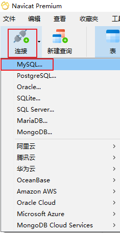
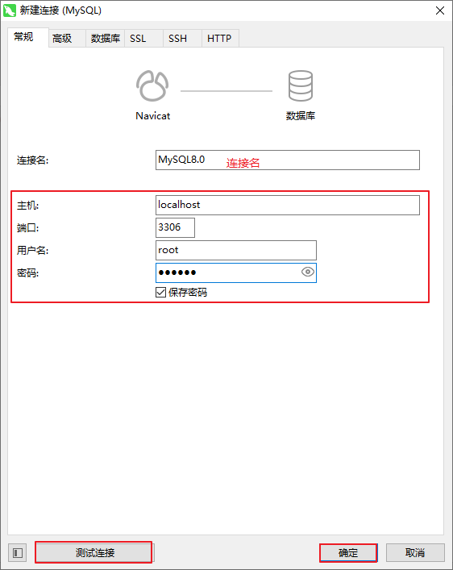
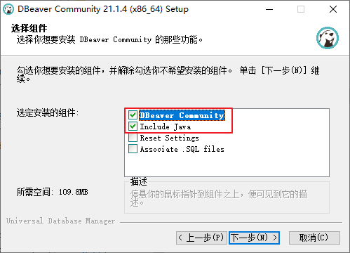
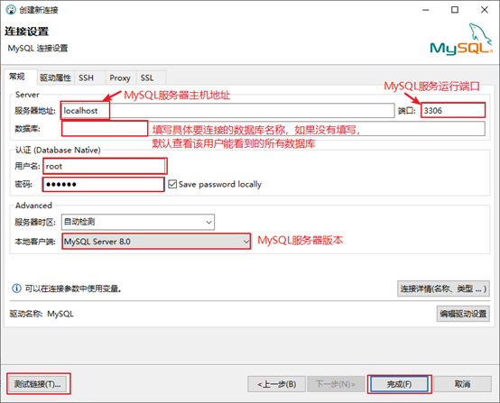
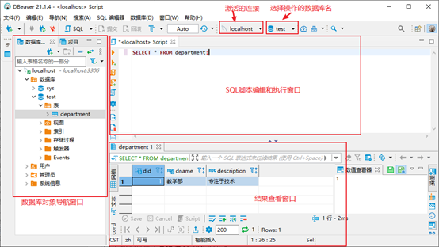
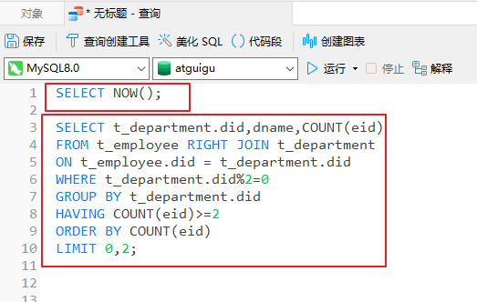
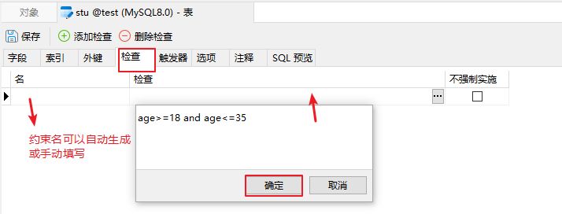

# 1、可视化工具的介绍

## 工具一：可视化工具Navicat

Navicat是一套可创建多个连接的数据库管理工具，用以方便管理 MySQL、Oracle、PostgreSQL、SQLite、SQL Server、MariaDB 和 MongoDB 等不同类型的数据库，它与阿里云、腾讯云、华为云、Amazon RDS、Amazon Aurora、Amazon Redshift、Microsoft Azure、Oracle Cloud 和 MongoDB Atlas等云数据库兼容。你可以创建、管理和维护数据库。Navicat 的功能足以满足专业开发人员的所有需求，但是对数据库服务器初学者来说又简单易操作。Navicat 的用户界面 (GUI) 设计良好，让你以安全且简单的方法创建、组织、访问和共享信息。





## 工具二：可视化工具SQLyog

SQLyog是一款简介高效且功能强大的图形化数据库管理工具。这款工具是使用C++语言开发的。用户可以使用这款软件来有效地管理MySQL数据库。该工具可以方便地创建数据库、表、视图和索引等，还可以方便地进行插入、更新和删除等操作，同时可以方便地进行数据库、数据表的备份和还原。该工具不仅可以通过SQL文件进行大量文件的导入和导出，还可以导入和导出XML、HTML和CSV等多种格式的数据。使用SQLyog中文社区版进行演示，下载地址为https://github.com/webyog/sqlyog-community/wiki/Downloads。

使用SQLyog图形化界面工具连接MySQL数据库的操作步骤如下。

步骤1：数据库菜单→点击“创建新连接”选项→打开连接管理窗口。在连接管理窗口可以选择“新建”按钮创建新的连接，也可以直接连接已保存的连接，然后进行参数设置，需要输入MySQL服务器IP地址、端口号、用户名、密码以及要连接的数据库名称等，其中数据库名称如果不写表示显示该用户有权限查看和操作的全部数据库。设置完成后，可以单击右侧的“测试连接”按钮，测试是否成功，如果没有问题，单击“连接”按钮连接数据库。


 步骤2：连接成功后，就可以对数据库进行管理和操作了。


## 工具三：可视化工具DBeaver

DBeaver是一个通用的数据库管理工具和 SQL 客户端，支持所有流行的数据库：MySQL、PostgreSQL、SQLite、Oracle、DB2、SQL Server、 Sybase、MS Access、Teradata、 Firebird、Apache Hive、Phoenix、Presto等。DBeaver比大多数的SQL管理工具要轻量，而且支持中文界面。DBeaver社区版作为一个免费开源的产品，和其他类似的软件相比，在功能和易用性上都毫不逊色。下载地址：https://dbeaver.io/download/。DBeaver的下载安装都非常简单，唯一需要注意是DBeaver 是用Java编程语言开发的，所以需要拥有 JDK（Java Development ToolKit）环境。JDK是 Java 语言开发工具包，也是整个Java 的核心，包括运行环境、工具以及基础类库。如果电脑上没有JDK，在选择安装DBeaver组件时，勾选“Include Java”即可。



使用DBeaver图形化界面工具连接MySQL数据库也很简单，操作步骤如下。

步骤1：数据库菜单→单击“新建连接”选项→打开连接管理窗口。选择要连接的数据库类型，单击“下一步”按钮。注意，如果提示缺少相应的数据库驱动，则直接根据提示下载即可。


步骤2：填写连接参数，需要指定要连接的MySQL服务器的IP地址，端口号，用户名密码、MySQL服务器版本等，如图2-43所示。填写完成之后，可以单击“测试链接”按钮，查看是否连接成功。如果没问题，单击“完成”按钮即可。



步骤3：连接成功后，就可以对数据库进行管理和操作了。



## 工具四：可视化工具MySQL Workbench

MySQL Workbench是MySQL官方提供的图形化界面管理工具，完全支持MySQL5.0以上的版本。它是著名的数据库设计工具DBDesigner4的继任者。MySQL Workbench 为数据库管理员、程序开发者和系统规划师提供可视化设计、模型建立、以及数据库管理功能。它包含了用于创建复杂的数据建模ER模型，正向和逆向数据库工程，也可以用于执行通常需要花费大量时间的、难以变更和管理的文档任务。MySQL工作台可在Windows、Linux和Mac上使用。随MySQL8一起发布的MySQL Workbench 8，可以直接连接MySQL8，不需要修改加密方式。当你创建、修改数据库及其表等数据库对象时，或针对表中的数据的添加、修改、删除操作时，可以提供生成SQL功能，对已经存在的表、函数等也可以提供生成SQL功能，这对于开发人员，或者初学者SQL的读者来说是个福音。下载地址：https://dev.mysql.com/downloads/workbench/。

​    使用MySQL Workbench图形化界面工具连接MySQL数据库的操作步骤如下。

步骤1：Database菜单→单击“Manage Server Connections”选项→打开连接管理窗口，如图2-37所示。在连接管理窗口中可以选择“New”按钮创建新的连接，也可以在左边“已有连接列表”中选择某个连接进行参数设置。需要指定要连接的MySQL服务器的IP地址，端口号，用户名和密码等。参数设置完成之后，可以单击“Test Connection”按钮测试某个连接是否可以连接成功。如果测试成功，可以看到“Successfully made the MySQL connection”的提示对话框。


步骤2：Database菜单→单击“Connect to Database”选项→打开数据库连接窗口。选择之前创建并设置的某个连接后，单击“OK”按钮进行连接登录MySQL数据库。


步骤3：连接成功后，就可以对MySQL数据库进行管理了。


# 2、连接MySQL服务器

## 2.1 建立连接


## 2.2 连接失败问题

### 问题1：服务器拒绝连接


MySQL服务未启动或者端口号错误。

### 问题2：主机地址错误


### 问题3：用户名或密码错误


### 问题4：可视化工具版本太低

有些可视化工具，特别是旧版本的图形界面工具，在连接MySQL8时出现“Authentication plugin 'caching_sha2_password' cannot be loaded”错误。


出现这个原因是MySQL8之前的版本中加密规则是mysql_native_password，而在MySQL8之后，加密规则是caching_sha2_password。

解决问题方法有两种：

第一种是升级图形界面工具版本。

第二种是把MySQL8用户登录密码加密规则还原成mysql_native_password。

第二种解决方案如下，用命令行登录MySQL数据库之后，执行如下命令修改用户密码加密规则并更新用户密码，这里修改用户名为“root@localhost”的用户密码规则为“mysql_native_password”，密码值为“123456”。

```sql
#修改'root'@'localhost'用户的密码规则和密码
ALTER USER 'root'@'localhost' IDENTIFIED WITH mysql_native_password BY '密码'; 
#刷新权限
FLUSH PRIVILEGES;
```


# 3、操作数据库

## 3.1 新建数据库


## 3.2 打开数据库


## 3.3 修改数据库


## 3.4 删除数据库


# 4、操作数据表

## 4.1 新建表

### 1、新建表


### 2、定义字段


### 3、保存


### 4、详细信息


### 5、完成设计


## 4.2 重命名表


## 4.3 修改表结构


## 4.4 打开表

双击表名或者右键打开表


## 4.5 增删改查


# 5、导入导出sql脚本

## 5.1 导出sql脚本


## 5.2 导入sql脚本

切记导入sql脚本之前，打开看一下sql脚本中的sql语句是干什么的。不要盲目导入。

sql脚本中有没有指定具体的“数据库”。如果没有指定数据库，那么需要在导入之前，在数据库名上右键导入。

如果指定的数据库不存在，是否需要手动创建数据库。

如果指定的数据库存在，执行脚本之后，是否会对当前数据库的数据造成破坏。

例如：以下脚本没有指定数据库，导入时需要自己手动指定数据库

```sql
/*
 Navicat Premium Data Transfer

 Source Server         : mysql8.0
 Source Server Type    : MySQL
 Source Server Version : 80026 (8.0.26)
 Source Host           : localhost:3306
 Source Schema         : atguigu

 Target Server Type    : MySQL
 Target Server Version : 80026 (8.0.26)
 File Encoding         : 65001

 Date: 28/10/2022 18:16:00
*/

SET NAMES utf8mb4;
SET FOREIGN_KEY_CHECKS = 0;

-- ----------------------------
-- Table structure for t_department
-- ----------------------------
DROP TABLE IF EXISTS `t_department`;
CREATE TABLE `t_department`  (
  `did` int NOT NULL AUTO_INCREMENT COMMENT '部门编号',
  `dname` varchar(20) CHARACTER SET utf8mb4 COLLATE utf8mb4_0900_ai_ci NOT NULL COMMENT '员工名称',
  `description` varchar(200) CHARACTER SET utf8mb4 COLLATE utf8mb4_0900_ai_ci NULL DEFAULT NULL COMMENT '员工简介',
  PRIMARY KEY (`did`) USING BTREE,
  UNIQUE INDEX `dname`(`dname` ASC) USING BTREE
) ENGINE = InnoDB AUTO_INCREMENT = 7 CHARACTER SET = utf8mb4 COLLATE = utf8mb4_0900_ai_ci ROW_FORMAT = Dynamic;

-- ----------------------------
-- Records of t_department
-- ----------------------------
INSERT INTO `t_department` VALUES (1, '研发部', '负责研发工作');
INSERT INTO `t_department` VALUES (2, '人事部', '负责人事管理工作');
INSERT INTO `t_department` VALUES (3, '市场部', '负责市场推广工作');
INSERT INTO `t_department` VALUES (4, '财务部', '负责财务管理工作');
INSERT INTO `t_department` VALUES (5, '后勤部', '负责后勤保障工作');
INSERT INTO `t_department` VALUES (6, '测试部', '负责测试工作');

-- ----------------------------
-- Table structure for t_employee
-- ----------------------------
DROP TABLE IF EXISTS `t_employee`;
CREATE TABLE `t_employee`  (
  `eid` int NOT NULL AUTO_INCREMENT COMMENT '员工编号',
  `ename` varchar(20) CHARACTER SET utf8mb4 COLLATE utf8mb4_0900_ai_ci NOT NULL COMMENT '员工姓名',
  `salary` double NOT NULL COMMENT '薪资',
  `commission_pct` decimal(3, 2) NULL DEFAULT NULL COMMENT '奖金比例',
  `birthday` date NOT NULL COMMENT '出生日期',
  `gender` enum('男','女') CHARACTER SET utf8mb4 COLLATE utf8mb4_0900_ai_ci NOT NULL DEFAULT '男' COMMENT '性别',
  `tel` char(11) CHARACTER SET utf8mb4 COLLATE utf8mb4_0900_ai_ci NOT NULL COMMENT '手机号码',
  `email` varchar(32) CHARACTER SET utf8mb4 COLLATE utf8mb4_0900_ai_ci NOT NULL COMMENT '邮箱',
  `address` varchar(150) CHARACTER SET utf8mb4 COLLATE utf8mb4_0900_ai_ci NULL DEFAULT NULL COMMENT '地址',
  `work_place` set('北京','深圳','上海','武汉') CHARACTER SET utf8mb4 COLLATE utf8mb4_0900_ai_ci NOT NULL DEFAULT '北京' COMMENT '工作地点',
  `hiredate` date NOT NULL COMMENT '入职日期',
  `job_id` int NULL DEFAULT NULL COMMENT '职位编号',
  `mid` int NULL DEFAULT NULL COMMENT '领导编号',
  `did` int NULL DEFAULT NULL COMMENT '部门编号',
  PRIMARY KEY (`eid`) USING BTREE,
  INDEX `job_id`(`job_id` ASC) USING BTREE,
  INDEX `did`(`did` ASC) USING BTREE,
  INDEX `mid`(`mid` ASC) USING BTREE,
  CONSTRAINT `t_employee_ibfk_1` FOREIGN KEY (`job_id`) REFERENCES `t_job` (`jid`) ON DELETE SET NULL ON UPDATE CASCADE,
  CONSTRAINT `t_employee_ibfk_2` FOREIGN KEY (`did`) REFERENCES `t_department` (`did`) ON DELETE SET NULL ON UPDATE CASCADE,
  CONSTRAINT `t_employee_ibfk_3` FOREIGN KEY (`mid`) REFERENCES `t_employee` (`eid`) ON DELETE SET NULL ON UPDATE CASCADE,
  CONSTRAINT `t_employee_chk_1` CHECK (`salary` > 0),
  CONSTRAINT `t_employee_chk_2` CHECK (`hiredate` > `birthday`)
) ENGINE = InnoDB AUTO_INCREMENT = 28 CHARACTER SET = utf8mb4 COLLATE = utf8mb4_0900_ai_ci ROW_FORMAT = Dynamic;

-- ----------------------------
-- Records of t_employee
-- ----------------------------
INSERT INTO `t_employee` VALUES (1, '孙洪亮', 28000, 0.65, '1980-10-08', '男', '13789098765', 'shl@atguigu.com', '白庙村西街', '北京,深圳', '2011-07-28', 1, 1, 1);
INSERT INTO `t_employee` VALUES (2, '何进', 7001, 0.10, '1984-08-03', '男', '13456732145', 'hj@atguigu.com', '半截塔存', '深圳,上海', '2015-07-03', 2, 1, 1);
INSERT INTO `t_employee` VALUES (3, '邓超远', 8000, NULL, '1985-04-09', '男', '18678973456', 'dcy666@atguigu.com', '宏福苑', '北京,深圳,上海,武汉', '2014-07-01', 3, 7, 1);
INSERT INTO `t_employee` VALUES (4, '黄熙萌', 9456, NULL, '1986-09-07', '女', '13609876789', 'hxm@atguigu.com', '白庙村东街', '深圳,上海,武汉', '2015-08-08', 8, 22, 3);
INSERT INTO `t_employee` VALUES (5, '陈浩', 8567, NULL, '1978-08-02', '男', '13409876545', 'ch888@atguigu.com', '回龙观', '北京,深圳,上海', '2015-01-01', 3, 7, 1);
INSERT INTO `t_employee` VALUES (6, '韩庚年', 12000, NULL, '1985-04-03', '男', '18945678986', 'hgn@atguigu.com', '龙泽', '深圳,上海', '2015-02-02', 3, 2, 1);
INSERT INTO `t_employee` VALUES (7, '贾宝玉', 15700, 0.24, '1982-08-02', '男', '15490876789', 'jby@atguigu.com', '霍营', '北京,武汉', '2015-03-03', 2, 1, 1);
INSERT INTO `t_employee` VALUES (8, '李晨熙', 9000, 0.40, '1983-03-02', '女', '13587689098', 'lc@atguigu.com', '东三旗', '深圳,上海,武汉', '2015-01-06', 4, 1, 1);
INSERT INTO `t_employee` VALUES (9, '李易峰', 7897, NULL, '1984-09-01', '男', '13467676789', 'lyf@atguigu.com', '西山旗', '武汉', '2015-04-01', 3, 7, 1);
INSERT INTO `t_employee` VALUES (10, '陆风', 8789, NULL, '1989-04-02', '男', '13689876789', 'lf@atguigu.com', '天通苑一区', '北京', '2014-09-03', 2, 1, 1);
INSERT INTO `t_employee` VALUES (11, '黄冰茹', 15678, NULL, '1983-05-07', '女', '13787876565', 'hbr@atguigu.com', '立水桥', '深圳', '2014-04-04', 4, 1, 1);
INSERT INTO `t_employee` VALUES (12, '孙红梅', 9000, NULL, '1986-04-02', '女', '13576234554', 'shm@atguigu.com', '立城苑', '上海', '2014-02-08', 3, 7, 1);
INSERT INTO `t_employee` VALUES (13, '李冰冰', 18760, NULL, '1987-04-09', '女', '13790909887', 'lbb@atguigu.com', '王府温馨公寓', '北京', '2015-06-07', 3, 2, 1);
INSERT INTO `t_employee` VALUES (14, '谢吉娜', 18978, 0.25, '1990-01-01', '女', '13234543245', 'xjn@atguigu.com', '园中园', '上海,武汉', '2015-09-05', 5, 14, 2);
INSERT INTO `t_employee` VALUES (15, '董吉祥', 8978, NULL, '1987-05-05', '男', '13876544333', 'djx@atguigu.com', '小辛庄', '北京,上海', '2015-08-04', 6, 14, 2);
INSERT INTO `t_employee` VALUES (16, '彭超越', 9878, NULL, '1988-03-06', '男', '18264578930', 'pcy@atguigu.com', '西二旗', '深圳,武汉', '2015-03-06', 8, 22, 3);
INSERT INTO `t_employee` VALUES (17, '李诗雨', 9000, NULL, '1990-08-09', '女', '18567899098', 'lsy@atguigu.com', '清河', '北京,深圳,武汉', '2013-06-09', 8, 22, 3);
INSERT INTO `t_employee` VALUES (18, '舒淇格', 16788, 0.10, '1978-09-04', '女', '18654565634', 'sqg@atguigu.com', '名流花园', '北京,深圳,武汉', '2013-04-05', 9, 18, 4);
INSERT INTO `t_employee` VALUES (19, '周旭飞', 7876, NULL, '1988-06-13', '女', '13589893434', 'sxf@atguigu.com', '小汤山', '北京,深圳', '2014-04-07', 10, 18, 4);
INSERT INTO `t_employee` VALUES (20, '章嘉怡', 15099, 0.10, '1989-12-11', '女', '15634238979', 'zjy@atguigu.com', '望都家园', '北京', '2015-08-04', 11, 20, 5);
INSERT INTO `t_employee` VALUES (21, '白露', 9787, NULL, '1989-09-04', '女', '18909876789', 'bl@atguigu.com', '西湖新村', '上海', '2014-06-05', 12, 20, 5);
INSERT INTO `t_employee` VALUES (22, '刘烨', 13099, 0.32, '1990-11-09', '男', '18890980989', 'ly@atguigu.com', '多彩公寓', '北京,上海', '2016-08-09', 7, 22, 3);
INSERT INTO `t_employee` VALUES (23, '陈纲', 13090, NULL, '1990-02-04', '男', '18712345632', 'cg@atguigu.com', '天通苑二区', '深圳', '2016-05-09', 3, 2, 1);
INSERT INTO `t_employee` VALUES (24, '吉日格勒', 10289, NULL, '1990-04-01', '男', '17290876543', 'jrgl@163.com', '北苑', '北京', '2017-02-06', 12, 20, 5);
INSERT INTO `t_employee` VALUES (25, '额日古那', 9087, NULL, '1989-08-01', '女', '18709675645', 'ergn@atguigu.com', '望京', '北京,上海', '2017-09-01', 3, 2, 1);
INSERT INTO `t_employee` VALUES (26, '李红', 5000, NULL, '1995-02-15', '女', '15985759663', 'lihong@atguigu.com', '冠雅苑', '北京', '2021-09-01', NULL, NULL, NULL);
INSERT INTO `t_employee` VALUES (27, '周洲', 8000, NULL, '1990-01-01', '男', '13574528569', 'zhouzhou@atguigu.com', '冠华苑', '北京,深圳', '2020-08-15', 3, 2, NULL);

-- ----------------------------
-- Table structure for t_job
-- ----------------------------
DROP TABLE IF EXISTS `t_job`;
CREATE TABLE `t_job`  (
  `jid` int NOT NULL AUTO_INCREMENT COMMENT '职位编号',
  `jname` varchar(20) CHARACTER SET utf8mb4 COLLATE utf8mb4_0900_ai_ci NOT NULL COMMENT '职位名称',
  `description` varchar(200) CHARACTER SET utf8mb4 COLLATE utf8mb4_0900_ai_ci NULL DEFAULT NULL COMMENT '职位简介',
  PRIMARY KEY (`jid`) USING BTREE,
  UNIQUE INDEX `jname`(`jname` ASC) USING BTREE
) ENGINE = InnoDB AUTO_INCREMENT = 13 CHARACTER SET = utf8mb4 COLLATE = utf8mb4_0900_ai_ci ROW_FORMAT = Dynamic;

-- ----------------------------
-- Records of t_job
-- ----------------------------
INSERT INTO `t_job` VALUES (1, '技术总监', '负责技术指导工作');
INSERT INTO `t_job` VALUES (2, '项目经理', '负责项目管理工作');
INSERT INTO `t_job` VALUES (3, '程序员', '负责开发工作');
INSERT INTO `t_job` VALUES (4, '测试员', '负责测试工作');
INSERT INTO `t_job` VALUES (5, '人事主管', '负责人事管理管理');
INSERT INTO `t_job` VALUES (6, '人事专员', '负责人事招聘工作');
INSERT INTO `t_job` VALUES (7, '运营主管', '负责市场运营管理工作');
INSERT INTO `t_job` VALUES (8, '市场员', '负责市场推广工作');
INSERT INTO `t_job` VALUES (9, '财务主管', '负责财务工作');
INSERT INTO `t_job` VALUES (10, '出纳', '负责出纳工作');
INSERT INTO `t_job` VALUES (11, '后勤主管', '负责后勤管理工作');
INSERT INTO `t_job` VALUES (12, '网络管理员', '负责网络管理');

SET FOREIGN_KEY_CHECKS = 1;
```


# 6、编写和执行sql

## 6.1 新建查询窗口


## 6.2 编写sql语句

### 1、手动编写sql



### 2、借助【美化SQL】工具

编写完SQL之后，请用【美化SQL】进行格式化。


### 3、借助【查询创建工具】

可以借助【查询创建工具】辅助编写SQL语句。


## 6.3 执行sql语句

### 1、执行所有sql


### 2、执行当前sql


### 3、执行sql中选中部分


# 7、约束

## 7.1 主键约束


## 7.2 唯一键约束


## 7.3 非空与默认值约束


## 7.4 自增


## 7.5 检查约束




## 7.6 外键约束


# 8、用户管理

## 8.1 打开用户管理


其中root用户是默认的超级管理员，root用户只能在localhost本机上连接mysql服务。

## 8.2 新建用户


MySQL的登录验证方式是：主机IP地址+用户名+密码三重验证

例如：mysql服务器在IP地址为192.168.31.152的主机上。

用户名：chai，主机：%，表示chai用户可以从任意一台主机上连接192.168.31.152机器上的mysql服务。

用户名：chai，主机：192.168.31.%，表示chai用户可以从192.168.31.*段的所有主机上连接192.168.31.152机器上的mysql服务。

用户名：chai，主机：192.168.31.23，表示chai用户只能从192.168.31.23主机连接192.168.31.152机器上的mysql服务。

在MySQL8之前默认的身份插件是“mysql_native_password”，即MySQL用户的密码使用PASSWORD函数进行加密。在MySQL 8.x中，默认的身份认证插件是“caching_sha2_password”，替代了之前的“mysql_native_password”，PASSWORD函数被弃用了。

在MySQL版本5.6.6版本起，在mysql.user表中添加了“password_expired”字段，它允许设置密码是否失效。如果“password_lifetime”字段值不为NULL，那么从MySQL服务启动时间开始，经过“password_lifetime”字段值的时间间隔之后，密码就过期了，即“password_expired”字段就为“Y”。任何密码超期的账号想要连接服务器端进行数据库操作都必须更改密码。MySQL8.0版本允许数据库管理员手动设置账户密码过期时间。

## 8.3 权限管理

- 服务器全局权限
- 数据库权限
- 数据表权限
- 字段权限
- 存储过程或函数子程序的权限

对用户的操作进行逐级权限验证，如果上一级有这个权限，下一级就不用验证了。

### 1、服务器权限


### 2、其他权限


## 8.3 新建角色


在MySQL8之前，如果要给多个用户授予相同的角色，需要为每个用户单独授权。在MySQL8之后，可以为多个用户赋予统一的角色，然后给角色授权即可，角色可以看成是一些权限的集合，这样就无须为每个用户单独授权。如果角色的权限修改，将会使得该角色下的所有用户的权限都跟着修改，这就非常方便。