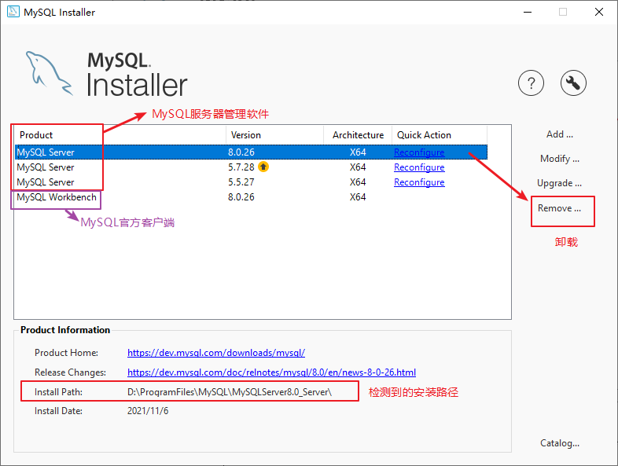
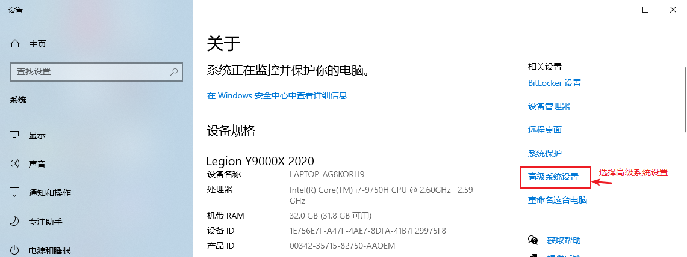
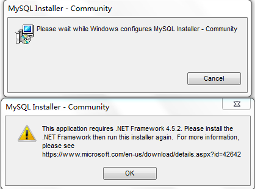
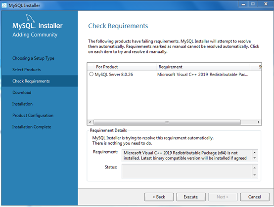

# 1、MySQL数据库的卸载

## 步骤一：软件的卸载准备

学习网络编程时，TCP/IP协议程序有服务器端和客户端。mysql这个数据库管理软件是使用TCP/IP协议。我们现在要卸载的是mysql的服务器端，它没有界面。

 【计算】-->右键-->【管理】-->【服务】-->【mysql的服务】-->【停止】


## 步骤二：软件的卸载

### **方式一：通过控制面板卸载**


### 方式二：通过mysql8的安装向导卸载

#### 1、双击mysql8的安装向导


#### 2、取消更新


#### 3、选择要卸载的mysql服务器软件的具体版本




#### 4、确认删除数据目录


#### 5、执行删除


#### 6、完成删除


## 步骤三：清理残余文件（部分同学需要）

如果卸载后还有残余文件，先对残余文件进行清理后再安装。

（1）服务目录：mysql服务的安装目录

（2）数据目录：如果没有指定过默认在C:\ProgramData\MySQL

如果自己单独指定过，就找到自己的数据目录，例如安装时指定过如下目录：


## 步骤四：清理服务列表中的服务名

如果在windows操作系统，卸载后mysql后，服务没有卸载干净，可以通过系统管理员在cmd命令行删除服务。


```
sc  delete  服务名
```


## 步骤五：清理原来的环境变量

找到path环境变量，将其中关于mysql的环境变量删除即，**切记<font color='red'>不要</font>把整个path删除。**

例如：删除  D:\ProgramFiles\MySQL\MySQLServer8.0_Server\bin;  这个部分




## 步骤六：清理注册表（选做，反复安装不成功的，可以尝试）

如何打开注册表编辑器：在系统的搜索框中输入regedit

* HKEY_LOCAL_MACHINE\SYSTEM\ControlSet001\Services\Eventlog\Application\MySQL服务 目录删除

* HKEY_LOCAL_MACHINE\SYSTEM\ControlSet001\Services\MySQL服务 目录删除

* HKEY_LOCAL_MACHINE\SYSTEM\ControlSet002\Services\Eventlog\Application\MySQL服务 目录删除

* HKEY_LOCAL_MACHINE\SYSTEM\ControlSet002\Services\MySQL服务 目录删除

* HKEY_LOCAL_MACHINE\SYSTEM\CurrentControlSet\Services\Eventlog\Application\MySQL服务目录删除

* HKEY_LOCAL_MACHINE\SYSTEM\CurrentControlSet\Services\MySQL服务删除

> 注册表中的ControlSet001,ControlSet002,不一定是001和002,可能是ControlSet005、006之类


# 2、MySQL数据库的安装（如果安装失败请看7）

<font color='red'>**注意：**</font>

<font color='red'>**必须用系统管理员身份运行mysql安装程序。**</font>

<font color='red'>**安装目录切记不要用中文。**</font>


## 步骤一：双击mysql8的安装向导


## 步骤二：分为首次安装和再安装

### 1、首次安装

#### （1）如果是首次安装mysql系列的产品，需要先安装mysql产品的安装向导


#### （2）选择安装模式


### 2、不是首次安装

#### （1）取消更新（如果电脑上有mysql相关软件才有）


#### （2）选择Add安装


## 步骤三：选择要安装的产品


## 步骤四：设置软件安装目录<font color='red'>（切记服务安装目录不要有中文字符，否则有问题）</font>


## 步骤五：执行安装


### 部分同学问题（缺少C++库）：


## 步骤六：完成安装


## 步骤七：准备设置


# 3、MySQL实例初始化和设置

## 步骤一：选择安装的电脑类型、设置端口号


## 步骤二：选择mysql账号密码加密规则

在MySQL 5.x中默认的身份认证插件为“mysql_native_password”。

在MySQL 8.x中，默认的身份认证插件是“caching_sha2_password”，替代了之前的“mysql_native_password”。


## 步骤三：设置root账户密码


## 步骤四：设置mysql服务名和服务启动策略

如果电脑上可能安装多个版本mysql，请在服务名后面保留版本标识，例如：MySQL80，这样可以区别用哪个版本的mysql


## 步骤五：执行设置（初始化mysql实例）


## 步骤六：完成设置


# 4、MySQL数据库环境变量的配置

```mysql
mysql -hlocalhost -P3306 -uroot -p回车
Enter password：输入密码
```

如果运行mysql命令，报错如下错误，说明需要配置环境变量


| 环境变量名 | 操作 |                 环境变量值                  |
| :--------: | :--: | :-----------------------------------------: |
| MYSQL_HOME | 新建 | D:\ProgramFiles\MySQL\MySQLServer8.0_Server |
|    path    | 编辑 |              %MYSQL_HOME%\bin               |

或者直接

| 环境变量名 | 操作 |                   环境变量值                    |
| :--------: | :--: | :---------------------------------------------: |
|    path    | 编辑 | D:\ProgramFiles\MySQL\MySQLServer8.0_Server\bin |


# 5、安装失败问题

## 安装问题1：无法打开MySQL8.0软件安装包？

​    在运行MySQL8.0软件安装包之前，用户需要确保系统中已经安装了.Net Framework相关软件，如果缺少此软件，将不能正常地安装MySQL8.0软件



解决方案：到这个地址https://www.microsoft.com/en-us/download/details.aspx?id=42642下载Microsoft .NET Framework 4.5并安装后，再去安装MySQL。

## 安装问题2：需要C++库

另外，还要确保Windows Installer正常安装。Windows上安装MySQL8.0需要操作系统提前已安装好Microsoft Visual C++ 2015-2019。



## 安装问题3：丢失MSVCP140.dll


解决方案同样是，提前到微软官网https://support.microsoft.com/en-us/topic/the-latest-supported-visual-c-downloads-2647da03-1eea-4433-9aff-95f26a218cc0下载相应的环境。

如果电脑提示需要更新操作系统，请做好更新后再安装。

# 6、MySQL实例初始化失败问题

## 问题1：初始化系统库失败

可能系统库无法写入，权限问题，用超级管理员或者换一个安装目录。

## 问题2：初始化系统库失败之中文乱码问题

例如：

mysqld: File '.\绐︽枃褰?bin.index' not found (OS errno 2 - No such file or directory)

解决方法：【计算机】右键-->【属性】  重命名计算机设备名称


## 问题3：mysql服务启动失败

MySQL error 1042: Unable to connect to any of the specified MySQL hosts.


解决方案：

如果是专业版操作系统：

电脑–>管理–>本地用户和组–>组–>双击Administrators–>添加–>高级
把NETWORK SERVICE添加到Administrators组


如果是家庭版操作系统：

计算机（点击鼠标右键）》管理（点击）》服务和应用程序（点击）》服务（点击）》MySQL80（点击鼠标右键）》属性》登录选项卡下将选择的此账户改为选择本地系统账户。之后重新执行excute


# 7、MySQL数据库服务的启动和停止

MySQL软件的服务器端必须先启动，客户端才可以连接和使用使用数据库。

如果接下来天天用，可以设置自动启动。

## 方式一：图形化方式

* 计算机（点击鼠标右键）》管理（点击）》服务和应用程序（点击）》服务（点击）》MySQL80（点击鼠标右键）==》启动或停止（点击）
* 控制面板（点击）》系统和安全（点击）》管理工具（点击）》服务（点击）》MySQL80（点击鼠标右键）==》启动或停止（点击）
* 任务栏（点击鼠标右键）》启动任务管理器（点击）》服务（点击）》MySQL80（点击鼠标右键）》启动或停止（点击）

## 方式二：命令行方式

必须是系统管理员才能运行下面的命令。

```cmd
启动 MySQL 服务命令：
net start MySQL80

停止 MySQL 服务命令：
net stop MySQL80
```

# 8、MySQL数据库客户端的登录

```java
MySQL服务器昨天已经装好了，默认在3306端口。

MySQL的客户端有哪些？
（1）cmd命令行
（2）mysql数据库管理系统的服务器本地有一个自带客户端，
只能以'root'@'localhost'用户从本地登录，只需要输入密码即可。
（3）可视化图形界面工具
SQLyog、Navicat、MySQL Front、DBeaver、MySQLWorkbench等
```

## 方式一：MySQL自带客户端

开始菜单==》所有程序==》MySQL==》MySQL Server 8.0==》MySQL 8.0 Command Line Client


> 说明：仅限于root用户

## 方式二：cmd命令行客户端

**mysql -h 主机名 -P 端口号 -u 用户名 -p密码**

```sql
例如：mysql -h localhost -P 3306 -u root -proot   

-h：host 主机名/IP地址
-P：port端口号
-u：user 用户名
-p：password密码
```

注意：

（1）-p与密码之间不能有空格，其他参数名与参数值之间可以有空格也可以没有空格

```sql
mysql -hlocalhost -P3306 -uroot -proot
```

（2）密码建议在下一行输入

```sql
mysql -h localhost -P 3306 -u root -p
Enter password:****
```

（3）如果是连本机：-hlocalhost就可以省略，如果端口号没有修改：-P3306也可以省略

  简写成：

```sql
mysql -u root -p
Enter password:******
```

（4）如果输入mysql命令报“不是内部或外部命令”，把mysql安装目录的bin目录配置到环境变量path中


## 方式三：可视化工具Navicat

Navicat是一套可创建多个连接的数据库管理工具，用以方便管理 MySQL、Oracle、PostgreSQL、SQLite、SQL Server、MariaDB 和 MongoDB 等不同类型的数据库，它与阿里云、腾讯云、华为云、Amazon RDS、Amazon Aurora、Amazon Redshift、Microsoft Azure、Oracle Cloud 和 MongoDB Atlas等云数据库兼容。你可以创建、管理和维护数据库。Navicat 的功能足以满足专业开发人员的所有需求，但是对数据库服务器初学者来说又简单易操作。Navicat 的用户界面 (GUI) 设计良好，让你以安全且简单的方法创建、组织、访问和共享信息。


# 9、mysql8忘记root用户密码

当出现忘记root用户密码的情况时，如果此时有其他用户拥有系统库mysql的user表的UPDATE权限，可以由其他用户通过SET语句修改root用户密码。但是如果遇到一种特殊情况，此时没有其他用户，或者其他用户没有系统库mysql的user表的UPDATE权限，也没有GRANT（给用户授权）的权限，那么怎么处理呢？操作步骤如下：

1.首先停止mysql的服务
2.新建一个文本文件，文本文件中就写一条修改密码的语句

```mysql
ALTER USER 'root'@'localhost' IDENTIFIED BY '123456';
```

例如在D盘根目录下新建一个文本文件“root_newpass.txt”，文件内容就上面一条语句。


3.使用管理员权限运行cmd命令行，运行以下命令：

```mysql
mysqld --defaults-file="D:\ProgramFiles\MySQL\MySQLServer8.0_Data\my.ini" --init-file="d:\root_newpass.txt"
```

注意：my.ini文件的路径看你自己的安装路径，找数据目录


上面命令意思就是初始化启动一次数据库，并运行这个修改密码的文件。效果演示如下：


上面的命令执行后，就像卡住了一样，这就是启动MySQL服务了。

4.然后按CTRL+C结束上面的运行命令


5.最后重新启动MySQL服务，用新密码登录即可

# 10、修改其他用户密码（记得原密码）

在命令行可以使用mysqladmin命令修改用户密码，命令格式如下：

```mysql
mysqladmin -u 用户名 -h 主机名  -p password "新密码"
Enter password:输入旧密码
```


# 11、修改其他用户密码（不记得原密码）

例如：“root”用户登录后，修改用户名为“shangguigu1”，主机名为“localhost”的用户的密码为“atguigu”。

```mysql
SET PASSWORD FOR 'shangguigu1'@'localhost' = '新密码';
```


