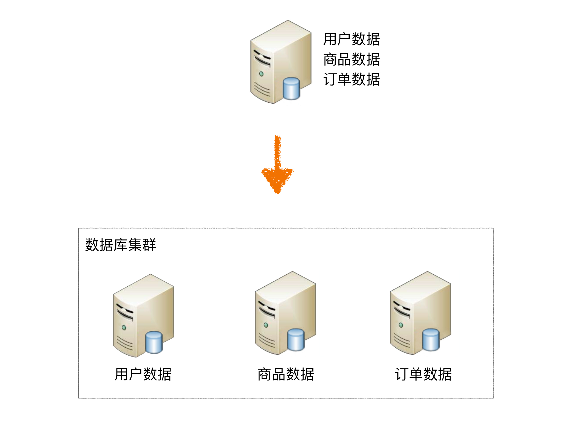
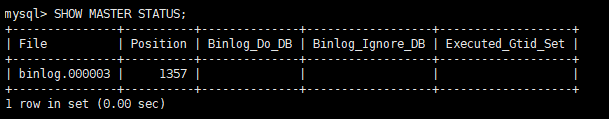

# ShardingSphere5

# 第01章 高性能架构模式

互联网业务兴起之后，海量用户加上海量数据的特点，单个数据库服务器已经难以满足业务需要，必须考虑数据库集群的方式来提升性能。

高性能数据库集群的：

1、第一种方式是**“读写分离”**

2、第二种方式是**“数据库分片”**。

## 1 读写分离架构

**读写分离原理：** 读写分离的基本原理是将数据库读写操作分散到不同的节点上，下面是其基本架构图：


**读写分离的基本实现：**

- 主库负责处理事务性的增删改操作，从库负责处理查询操作，能够有效的避免由数据更新导致的行锁，使得整个系统的查询性能得到极大的改善。

- 读写分离是根据 SQL 语义的分析，将读操作和写操作分别路由至主库与从库。

- 通过一主多从的配置方式，可以将查询请求均匀的分散到多个数据副本，能够进一步的提升系统的处理能力。

- 使用多主多从的方式，不但能够提升系统的吞吐量，还能够提升系统的可用性，可以达到在任何一个数据库宕机，甚至磁盘物理损坏的情况下

  仍然不影响系统的正常运行。

**下图展示了根据业务需要，将用户表的写操作和读操路由到不同的数据库的方案：**

 

## 2 数据库分片架构

**读写分离的问题：**

读写分离分散了数据库读写操作的压力，但没有分散存储压力，为了满足业务数据存储的需求，就需要**将存储分散到多台数据库服务器上**。

**数据分片：**

将存放在单一数据库中的数据分散地存放至多个数据库或表中，以达到提升性能瓶颈以及可用性的效果。 数据分片的有效手段是对关系型数据库进行

**分库和分表**。数据分片的拆分方式又分为**垂直分片和水平分片**。

### 2.1 垂直分片

就是一个数据库中的表分散的存储到不同的数据库中

**垂直分库：**

按照业务拆分的方式称为垂直分片，又称为纵向拆分，它的核心理念是**专库专用**。 在拆分之前，一个数据库由多个数据表构成，每个表对应着不同的

业务。而拆分之后，则是按照业务**将表进行归类，分布到不同的数据库**中，从而将压力分散至不同的数据库。

  

下图展示了根据业务需要，将用户表和订单表垂直分片到不同的数据库的方案：

 

垂直拆分可以缓解数据量和访问量带来的问题，但无法根治。如果垂直拆分之后，**表中的数据量依然超过单节点所能承载的阈值，则需要水平分片**

**来进一步处理。**


**垂直分表：**

**垂直分表适合将表中某些不常用的列，或者是占了大量空间的列拆分出去。**

假设我们是一个婚恋网站，用户在筛选其他用户的时候，主要是用 age 和 sex 两个字段进行查询，而 nickname 和 description 两个字段主要用于展

示，一般不会在业务查询中用到。description 本身又比较长，因此我们可以将这两个字段独立到另外一张表中，这样在查询 age 和 sex 时，就能带来

一定的性能提升。

垂直分表引入的复杂性主要体现在表操作的数量要增加。例如，原来只要一次查询就可以获取 name、age、sex、nickname、description，现在需要

两次查询，一次查询获取 name、age、sex，另外一次查询获取 nickname、description。


### 2.2 水平分片

水平分片：把一张表的数据拆分到不同的数据库表中


水平分片又称为横向拆分。 相对于垂直分片，它不再将数据根据业务逻辑分类，而是通过某个字段（或某几个字段），根据某种规则将**数据**分散至多

个库或表中**，**每个分片仅包含数据的一部分。 例如：根据主键分片，偶数主键的记录放入 0 库（或表），奇数主键的记录放入 1 库（或表），如下

图所示。


> **阿里巴巴Java开发手册：**
> 【推荐】单表行数超过 **500 万行**或者单表容量**超过 2GB**，才推荐进行分库分表。
> 说明：如果预计三年后的数据量根本达不到这个级别，请不要在创建表时就分库分表。

## 3 读写分离和数据分片架构

下图展现了将数据分片与读写分离**一同使用**时，应用程序与数据库集群之间的复杂拓扑关系。


## 4 实现方式

读写分离和数据分片具体的实现方式一般有两种：  **程序代码封装和中间件封装**。

### 4.1 程序代码封装

程序代码封装指在代码中抽象一个**数据访问层（或中间层封装）**，实现读写操作分离和数据库服务器连接的管理。

**其基本架构是：** 以读写分离为例


### 4.2 中间件封装

中间件封装指的是**独立一套系统出来**，实现读写操作分离和数据库服务器连接的管理。对于业务服务器来说，访问中间件和访问数据库没有区别，在

业务服务器看来，中间件就是一个数据库服务器。

**基本架构是：** 以读写分离为例


### 4.3 常用解决方案

Apache ShardingSphere（程序级别和中间件级别）

MyCat（数据库中间件）

# 第02章 ShardingSphere

## 1、简介

官网：[https://shardingsphere.apache.org/index\_zh.html](https://shardingsphere.apache.org/index_zh.html "https://shardingsphere.apache.org/index_zh.html")

文档：[https://shardingsphere.apache.org/document/5.1.1/cn/overview/](https://shardingsphere.apache.org/document/5.1.1/cn/overview/ "https://shardingsphere.apache.org/document/5.1.1/cn/overview/")

Apache ShardingSphere 由 JDBC、Proxy 和 Sidecar（规划中）这 3 款既能够独立部署，又支持混合部署配合使用的产品组成。

## 2、ShardingSphere-JDBC

**程序代码封装**

定位为轻量级 Java 框架，**在 Java 的 JDBC 层提供的额外服务**。 它使用客户端直连数据库，**以 jar 包形式提供服务**，无需额外部署和依赖，可

理解为增强版的 JDBC 驱动，完全兼容 JDBC 和各种 ORM 框架。


## 3、ShardingSphere-Proxy

**中间件封装**

定位为透明化的**数据库代理端**，提供封装了数据库二进制协议的服务端版本，用于完成对异构语言的支持。 目前提供 MySQL 和 PostgreSQL版

本，它可以使用任何兼容 MySQL/PostgreSQL 协议的访问客户端（如：MySQL Command Client, MySQL Workbench, Navicat 等）操作数据，对 

DBA 更加友好。


# 第03章 MySQL主从同步

## 1、MySQL主从同步原理

  

**基本原理：**

slave会从master读取binlog来进行数据同步

**具体步骤：**

- step1：master将数据改变记录到二进制日志（binary log）中。

- step2：当slave上执行 start slave 命令之后，slave会创建一个IO 线程用来连接master，请求master中的binlog。

- step3：当slave连接master时，master会创建一个 log dump 线程，用于发送 binlog 的内容。在读取 binlog 的内容的操作中，会对主节点上的 

  binlog 加锁，当读取完成并发送给从服务器后解锁。

- step4：IO 线程接收主节点 binlog dump 进程发来的更新之后，保存到 中继日志（relay log） 中。

-   step5：slave的SQL线程，读取relay log日志，并解析成具体操作，从而实现主从操作一致，最终数据一致。

## 2 一主多从配置

服务器规划：使用docker方式创建，主从服务器IP一致，端口号不一致

 


-   主服务器：容器名`atguigu-mysql-master`，端口`3306`
-   从服务器：容器名`atguigu-mysql-slave1`，端口`3307`
-   从服务器：容器名`atguigu-mysql-slave2`，端口`3308`

**注意：** 如果此时防火墙是开启的，`则先关闭防火墙，并重启docker`，否则后续安装的MySQL无法启动

```bash
#关闭docker
systemctl stop docker
#关闭防火墙
systemctl stop firewalld
#启动docker
systemctl start docker
```

### 2.1 准备主服务器

-   **step1：在docker中创建并启动MySQL主服务器：**`端口3306`

```bash
docker run -d \
-p 3306:3306 \
-v mysql01_config:/etc/mysql/conf.d \
-v mysql01_data:/var/lib/mysql \
-e MYSQL_ROOT_PASSWORD=1234 \
--name master \
mysql:8.0.29
```

-   **step2：创建MySQL主服务器配置文件：**

默认情况下MySQL的binlog日志是自动开启的，可以通过如下配置定义一些可选配置

```bash
vim /var/lib/docker/volumes/mysql01_config/_data/my.cnf
```

配置如下内容

```properties
[mysqld]
# 服务器唯一id，默认值1
server-id=1
# 设置日志格式，默认值ROW
binlog_format=ROW
# 二进制日志名，默认binlog
log-bin=binlog
# 设置需要复制的数据库，默认复制全部数据库
#binlog-do-db=mytestdb1
#binlog-do-db=mytestdb2

# 设置不需要复制的数据库
#binlog-ignore-db=mysql
#binlog-ignore-db=infomation_schema
```

重启MySQL容器

```bash
docker restart master
```

binlog格式说明：

- binlog\_format=STATEMENT：日志记录的是主机数据库的`写指令`，性能高，但是now()之类的函数以及获取系统参数的操作会出现主从数据不

  同步的问题。

- binlog\_format=ROW（默认）：日志记录的是主机数据库的`写后的数据`，批量操作时性能较差，解决now()或者  user()或者  @@hostname 等操

  作在主从机器上不一致的问题。

-   binlog\_format=MIXED：是以上两种level的混合使用，有函数用ROW，没函数用STATEMENT，但是无法识别系统变量

```bash
#修改默认密码校验方式
ALTER USER 'root'@'%' IDENTIFIED WITH mysql_native_password BY '1234';
```

-   **step5：主机中查询master状态：**

执行完此步骤后`不要再操作主服务器MYSQL`，防止主服务器状态值变化

```sql
#进入容器：env LANG=C.UTF-8 避免容器中显示中文乱码
docker exec -it master env LANG=C.UTF-8 /bin/bash

#进入容器内的mysql命令行
mysql -uroot -p

# 查询master阶段的状态
SHOW MASTER STATUS;
```

记下`File`和`Position`的值。执行完此步骤后不要再操作主服务器MYSQL，防止主服务器状态值变化。

 

### 2.2 准备从服务器

可以配置多台从机slave1、slave2...，这里以配置slave1为例

-   **step1：在docker中创建并启动MySQL从服务器：**`端口3307`

```bash
docker run -d \
-p 3307:3306 \
-v mysql02_conf:/etc/mysql/conf.d \
-v mysql02_data:/var/lib/mysql \
-e MYSQL_ROOT_PASSWORD=1234 \
--name slave01 \
mysql:8.0.29
```

-   **step2：创建MySQL从服务器配置文件：**

```bash
vim /var/lib/docker/volumes/mysql02_config/_data/my.cnf
```

配置如下内容：

```properties
[mysqld]
# 服务器唯一id，每台服务器的id必须不同，如果配置其他从机，注意修改id
server-id=2
# 中继日志名，默认xxxxxxxxxxxx-relay-bin
#relay-log=relay-bin
```

重启MySQL容器

```bash
docker restart slave01
```

-   **step4：在从机上配置主从关系：**

在**从机**上执行以下SQL操作

```sql
#进入容器：
docker exec -it slave01 env LANG=C.UTF-8 /bin/bash

#进入容器内的mysql命令行
mysql -uroot -p

# 关闭从节点服务
stop slave ;

# 设置主节点
CHANGE MASTER TO MASTER_HOST='192.168.100.201',MASTER_USER='root',MASTER_PASSWORD='1234',MASTER_PORT=3306,MASTER_LOG_FILE='binlog.000003',MASTER_LOG_POS=1357; 
```

### 2.3 启动主从同步

启动从机的复制功能，执行SQL：

```sql
START SLAVE;

-- 查看状态（不需要分号）
SHOW SLAVE STATUS\G
```

**两个关键进程：** 下面两个参数都是Yes，则说明主从配置成功！

 

### 2.4 实现主从同步

在主机中执行以下SQL，在从机中查看数据库、表和数据是否已经被同步

```sql
CREATE DATABASE db_user;
USE db_user;
CREATE TABLE t_user (
 id BIGINT AUTO_INCREMENT,
 uname VARCHAR(30),
 PRIMARY KEY (id)
);
INSERT INTO t_user(uname) VALUES('zhang3');
INSERT INTO t_user(uname) VALUES(@@hostname);
```

### 2.5 停止和重置

需要的时候，可以使用如下SQL语句

```sql
-- 在从机上执行。功能说明：停止I/O 线程和SQL线程的操作。
stop slave; 

-- 在从机上执行。功能说明：用于删除SLAVE数据库的relaylog日志文件，并重新启用新的relaylog文件。
reset slave;

-- 在主机上执行。功能说明：删除所有的binglog日志文件，并将日志索引文件清空，重新开始所有新的日志文件。
-- 用于第一次进行搭建主从库时，进行主库binlog初始化工作；
reset master;
```

### **2.6 常见问题**

#### 问题1

启动主从同步后，常见错误是`Slave_IO_Running： No 或者 Connecting` 的情况，此时查看下方的 `Last_IO_ERROR`错误日志，根据日志中显示

的错误信息在网上搜索解决方案即可


**典型的错误例如：**`Last_IO_Error: Got fatal error 1236 from master when reading data from binary log: 'Client requested master to start replication from position > file size'`

**解决方案：**

```sql
-- 在从机停止slave
SLAVE STOP;

-- 在主机查看mater状态
SHOW MASTER STATUS;

-- 在主机刷新日志
FLUSH LOGS;

-- 再次在主机查看mater状态（会发现File和Position发生了变化）

SHOW MASTER STATUS;

-- 修改从机连接主机的SQL，并重新连接即可
```

#### 问题2

启动docker容器后提示 `WARNING: IPv4 forwarding is disabled. Networking will not work.`

 

此错误，虽然不影响主从同步的搭建，但是如果想从远程客户端通过以下方式连接docker中的MySQL则没法连接

```bash
C:\Users\administrator>mysql -h 192.168.100.201 -P 3306 -u root -p
```

**解决方案：**

```bash
#修改配置文件：
vim /usr/lib/sysctl.d/00-system.conf
#追加
net.ipv4.ip_forward=1
#接着重启网络
systemctl restart network
```

# 第04章 ShardingSphere-JDBC读写分离

## 1 创建SpringBoot程序

### 1.1 创建项目

项目类型：Spring Initializr

SpringBoot脚手架：[http://start.aliyun.com](http://start.aliyun.com "http://start.aliyun.com")

项目名：sharding-jdbc-demo

SpringBoot版本：2.3.7.RELEASE

### 1.2 添加依赖

```xml
<dependencies>
    <dependency>
        <groupId>org.springframework.boot</groupId>
        <artifactId>spring-boot-starter-web</artifactId>
    </dependency>

    <dependency>
        <groupId>org.apache.shardingsphere</groupId>
        <artifactId>shardingsphere-jdbc-core-spring-boot-starter</artifactId>
        <version>5.1.1</version>
    </dependency>

    <dependency>
        <groupId>mysql</groupId>
        <artifactId>mysql-connector-java</artifactId>
        <scope>runtime</scope>
    </dependency>

    <dependency>
        <groupId>com.baomidou</groupId>
        <artifactId>mybatis-plus-boot-starter</artifactId>
        <version>3.3.1</version>
    </dependency>

    <dependency>
        <groupId>org.projectlombok</groupId>
        <artifactId>lombok</artifactId>
        <optional>true</optional>
    </dependency>
    
    <dependency>
        <groupId>org.springframework.boot</groupId>
        <artifactId>spring-boot-starter-test</artifactId>
    </dependency>
</dependencies>
```

### 1.3 创建实体类

```java
package com.atguigu.shardingjdbcdemo.entity;

@TableName("t_user")
@Data
public class User {
    @TableId(type = IdType.AUTO)
    private Long id;
    private String uname;
}
```

### 1.4 创建Mapper

```java
package com.atguigu.shardingjdbcdemo.mapper;

@Mapper
public interface UserMapper extends BaseMapper<User> {
    
}
```

### 1.5 配置读写分离

官网地址：https://shardingsphere.apache.org/document/5.1.1/cn/user-manual/shardingsphere-jdbc/yaml-config/rules/readwrite-splitting/

application.yml：

```yml
# 配置数据库的连接信息
spring:
  shardingsphere:
    datasource:
      names: master,slave01,slave02
      master:
        type: com.zaxxer.hikari.HikariDataSource
        driverClassName: com.mysql.jdbc.Driver
        jdbcUrl: jdbc:mysql://192.168.136.141:3306/db_user?useSSL=false&characterEncoding=UTF8
        username: root
        password: 1234
      slave01:
        type: com.zaxxer.hikari.HikariDataSource
        driverClassName: com.mysql.jdbc.Driver
        jdbcUrl: jdbc:mysql://192.168.136.141:3307/db_user?useSSL=false&characterEncoding=UTF8
        username: root
        password: 1234
      slave02:
        type: com.zaxxer.hikari.HikariDataSource
        driverClassName: com.mysql.jdbc.Driver
        jdbcUrl: jdbc:mysql://192.168.136.141:3308/db_user?useSSL=false&characterEncoding=UTF8
        username: root
        password: 1234
    rules:
      readwrite-splitting:
        data-sources:
          product-rw-rules:
            type: Static
            props:
              write-data-source-name: master
              read-data-source-names: slave01,slave02
            load-balancer-name: user_lb
        load-balancers:
          user_lb:
            type: ROUND_ROBIN
    props:
      sql-show: true
```

## 2 测试

### 2.1 读写分离测试

```java
package com.atguigu.shardingjdbcdemo;

@SpringBootTest
class ReadwriteTest {

    @Autowired
    private UserMapper userMapper;

    /**
     * 写入数据的测试
     */
    @Test
    public void testInsert(){

        User user = new User();
        user.setUname("张三丰");
        userMapper.insert(user);
    }

}
```

### 2.2 事务测试

为了保证主从库间的事务一致性，避免跨服务的分布式事务，ShardingSphere-JDBC的`主从模型中，事务中的数据读写均用主库`。

-   不添加@Transactional：insert对主库操作，select对从库操作
-   添加@Transactional：则insert和select均对主库操作
-   **注意：** 在JUnit环境下的@Transactional注解，默认情况下就会对事务进行回滚（即使在没加注解@Rollback，也会对事务回滚）

```java
/**
     * 事务测试
     */
@Transactional//开启事务
@Test
public void testTrans(){

    User user = new User();
    user.setUname("铁锤");
    userMapper.insert(user);

    List<User> users = userMapper.selectList(null);
}
```

### 2.3 负载均衡测试

```java

/**
     * 读数据测试
     */
@Test
public void testSelectAll(){
    List<User> users1 = userMapper.selectList(null);
    List<User> users2 = userMapper.selectList(null);//执行第二次测试负载均衡
}

```

也可以在web请求中测试负载均衡

```java
package com.atguigu.shardingjdbcdemo.controller;

@RestController
@RequestMapping("/userController")
public class UserController {

    @Autowired
    private UserMapper userMapper;

    /**
     * 测试负载均衡策略
     */
    @GetMapping("selectAll")
    public void selectAll(){
        List<User> users = userMapper.selectList(null);
        users.forEach(System.out::println);
    }
}
```

### 常见错误


ShardingSphere-JDBC远程连接的方式默认的密码加密规则是：mysql\_native\_password

因此需要在服务器端修改服务器的密码加密规则，如下：

```sql
ALTER USER 'root'@'%' IDENTIFIED WITH mysql_native_password BY '1234';
```

# 第05章 ShardingSphere-JDBC垂直分片

## 1、准备服务器

服务器规划：使用`docker`方式创建如下容器

 

-   服务器：容器名`server-user`，端口 `3301`
-   服务器：容器名`server-order`，端口`3302`

### 1.1、创建server-user容器

-   **step1：创建容器：**

```bash
docker run -d \
-p 3301:3306 \
-v mysql_user_conf:/etc/mysql/conf.d \
-v mysql_user_data:/var/lib/mysql \
-e MYSQL_ROOT_PASSWORD=1234 \
--name server-user \
mysql:8.0.29

ALTER USER 'root'@'%' IDENTIFIED WITH mysql_native_password BY '1234';
```

-   **step2：创建数据库：**

```sql
#进入容器：
docker exec -it server-user env LANG=C.UTF-8 /bin/bash
#进入容器内的mysql命令行
mysql -uroot -p

# 创建数据库
CREATE DATABASE db_user;
USE db_user;
CREATE TABLE t_user (
 id BIGINT AUTO_INCREMENT,
 uname VARCHAR(30),
 PRIMARY KEY (id)
);
```

### 1.2 创建server-order容器

-   **step1：创建容器：**

```bash
docker run -d \
-p 3302:3306 \
-v mysql_order_conf:/etc/mysql/conf.d \
-v mysql_order_data:/var/lib/mysql \
-e MYSQL_ROOT_PASSWORD=1234 \
--name server-order \
mysql:8.0.29

ALTER USER 'root'@'%' IDENTIFIED WITH mysql_native_password BY '1234';
```

-   **step2：创建数据库：**

```sql
#进入容器：
docker exec -it server-order env LANG=C.UTF-8 /bin/bash

#进入容器内的mysql命令行
mysql -uroot -p

# 创建order数据库
CREATE DATABASE db_order;
USE db_order;
CREATE TABLE t_order (
  id BIGINT AUTO_INCREMENT,
  order_no VARCHAR(30),
  user_id BIGINT,
  amount DECIMAL(10,2),
  PRIMARY KEY(id) 
);
```

## 2 程序实现

### 2.1 创建实体类

```java
package com.atguigu.shardingjdbcdemo.entity;

@TableName("t_order")
@Data
public class Order {
    @TableId(type = IdType.AUTO)
    private Long id;
    private String orderNo;
    private Long userId;
    private BigDecimal amount;
}
```

### 2.2 创建Mapper

```java
package com.atguigu.shardingjdbcdemo.mapper;

@Mapper
public interface OrderMapper extends BaseMapper<Order> {
}
```

### 2.3 配置垂直分片

```yml
spring:
  application:
    name: mysql-shardingsphere
  shardingsphere:
    datasource:
      names: server-user,server-order
      server-user:
        type: com.zaxxer.hikari.HikariDataSource
        driverClassName: com.mysql.jdbc.Driver
        jdbcUrl: jdbc:mysql://192.168.136.141:3301/db_user?useSSL=false&characterEncoding=UTF8
        username: root
        password: 1234
      server-order:
        type: com.zaxxer.hikari.HikariDataSource
        driverClassName: com.mysql.jdbc.Driver
        jdbcUrl: jdbc:mysql://192.168.136.141:3302/db_order?useSSL=false&characterEncoding=UTF8
        username: root
        password: 1234
    rules:
      sharding:
        tables:
          t_user:
            actual-data-nodes: server-user.t_user
          t_order:
            actual-data-nodes: server-order.t_order
    props:
      sql-show: true
```

## 3 测试垂直分片

```java
package com.atguigu.shardingjdbcdemo;

@SpringBootTest
public class ShardingTest {


    @Autowired
    private UserMapper userMapper;

    @Autowired
    private OrderMapper orderMapper;

    /**
     * 垂直分片：插入数据测试
     */
    @Test
    public void testInsertOrderAndUser(){

        User user = new User();
        user.setUname("强哥");
        userMapper.insert(user);

        Order order = new Order();
        order.setOrderNo("ATGUIGU001");
        order.setUserId(user.getId());
        order.setAmount(new BigDecimal(100));
        orderMapper.insert(order);

    }

    /**
     * 垂直分片：查询数据测试
     */
    @Test
    public void testSelectFromOrderAndUser(){
        User user = userMapper.selectById(1L);
        Order order = orderMapper.selectById(1L);
    }
}
```

# 第06章 ShardingSphere-JDBC水平分片

## 1 准备服务器

服务器规划：使用`docker`方式创建如下容器

 

-   服务器：容器名`server-order0`，端口`3310`
-   服务器：容器名`server-order1`，端口`3311`

### 1.1 创建server-order0容器

-   **step1：创建容器：**

```bash
docker run -d \
-p 3310:3306 \
-v mysql_order0_conf:/etc/mysql/conf.d \
-v mysql_order0_data:/var/lib/mysql \
-e MYSQL_ROOT_PASSWORD=1234 \
--name server-order0 \
mysql:8.0.29

ALTER USER 'root'@'%' IDENTIFIED WITH mysql_native_password BY '1234';
```

-   **step3：创建数据库：**

`注意：`水平分片的id需要在业务层实现，`不能依赖数据库的主键自增`

```sql
#进入容器：
docker exec -it server-order0 env LANG=C.UTF-8 /bin/bash

#进入容器内的mysql命令行
mysql -uroot -p

# 创建对应的数据库
CREATE DATABASE db_order;
USE db_order;
CREATE TABLE t_order0 (
  id BIGINT,
  order_no VARCHAR(30),
  user_id BIGINT,
  amount DECIMAL(10,2),
  PRIMARY KEY(id) 
);
CREATE TABLE t_order1 (
  id BIGINT,
  order_no VARCHAR(30),
  user_id BIGINT,
  amount DECIMAL(10,2),
  PRIMARY KEY(id) 
);
```

### 1.2 创建server-order1容器

-   **step1：创建容器：**

```bash
docker run -d \
-p 3311:3306 \
-v mysql_order1_conf:/etc/mysql/conf.d \
-v mysql_order1_data:/var/lib/mysql \
-e MYSQL_ROOT_PASSWORD=1234 \
--name server-order1 \
mysql:8.0.29

ALTER USER 'root'@'%' IDENTIFIED WITH mysql_native_password BY '1234';
```

-   **step2：创建数据库：** 和server-order0相同

`注意：`水平分片的id需要在业务层实现，不能依赖数据库的主键自增

```sql
# 创建对应的数据库
CREATE DATABASE db_order;
USE db_order;
CREATE TABLE t_order0 (
  id BIGINT,
  order_no VARCHAR(30),
  user_id BIGINT,
  amount DECIMAL(10,2),
  PRIMARY KEY(id) 
);
CREATE TABLE t_order1 (
  id BIGINT,
  order_no VARCHAR(30),
  user_id BIGINT,
  amount DECIMAL(10,2),
  PRIMARY KEY(id) 
);
```

## 2 基本水平分片

### 2.1 数据源配置

```properties
spring:
  application:
    name: mysql-shardingsphere
  shardingsphere:
    datasource:
      names: server-user,server-order0,server-order1
      server-user:
        type: com.zaxxer.hikari.HikariDataSource
        driverClassName: com.mysql.jdbc.Driver
        jdbcUrl: jdbc:mysql://192.168.136.143:3301/db_user?useSSL=false&characterEncoding=UTF8
        username: root
        password: 1234
      server-order0:
        type: com.zaxxer.hikari.HikariDataSource
        driverClassName: com.mysql.jdbc.Driver
        jdbcUrl: jdbc:mysql://192.168.136.143:3310/db_order?useSSL=false&characterEncoding=UTF8
        username: root
        password: 1234
      server-order1:
        type: com.zaxxer.hikari.HikariDataSource
        driverClassName: com.mysql.jdbc.Driver
        jdbcUrl: jdbc:mysql://192.168.136.143:3311/db_order?useSSL=false&characterEncoding=UTF8
        username: root
        password: 1234
```

### 2.3 标椎分片表配置

```properties
spring:
  shardingsphere:
    rules:
      sharding:
        tables:
          t_user:
            actual-data-nodes: server-user.t_user
          t_order:
            actual-data-nodes: server-order0.t_order0,server-order0.t_order1,server-order1.t_order0,server-order1.t_order1
            database-strategy:
              standard:
                sharding-column: user_id
                sharding-algorithm-name: order_db_alg
            table-strategy:
              standard:
                sharding-column: user_id
                sharding-algorithm-name: order_alg
        sharding-algorithms:
          order_db_alg:
            type: INLINE
            props:
              algorithm-expression: server-order$->{ user_id % 2}
          order_alg:
            type: INLINE
            props:
              algorithm-expression: t_order$->{ user_id % 2}
    props:
      sql-show: true
```

修改Order实体类的主键策略：

```java
//@TableId(type = IdType.AUTO)//依赖数据库的主键自增策略
@TableId(type = IdType.ASSIGN_ID)//分布式id
```

测试：保留上面配置中的一个分片表节点分别进行测试，检查每个分片节点是否可用

```java
/**
     * 水平分片：插入数据测试
     */
@Test
public void testInsertOrder(){

    Order order = new Order();
    order.setOrderNo("ATGUIGU001");
    order.setUserId(1L);
    order.setAmount(new BigDecimal(100));
    orderMapper.insert(order);
}
```

### 2.4 行表达式

优化上一步的分片表配置

<https://shardingsphere.apache.org/document/5.1.1/cn/features/sharding/concept/inline-expression/>

```properties
spring:
  shardingsphere:
	rules:
      sharding:
        tables:
          t_user:
            actual-data-nodes: server-user.t_user
          t_order:
            actual-data-nodes: server-order$->{0..1}.t_order$->{0..1}
```

### 2.5 分布式序列算法

**雪花算法：**

<https://shardingsphere.apache.org/document/5.1.1/cn/features/sharding/concept/key-generator/>

水平分片需要关注全局序列，因为不能简单的使用基于数据库的主键自增。


分库分表以后表的主键字段就不能使用自增策略，因为可能出现重复数据。

分布式系统中的主键生成策略：

1、uuid

2、redis

3、雪花算法(shardingsphere：SnowflakeKeyGenerateAlgorithm)


[雪花算法](https://so.csdn.net/so/search?q=雪花算法&spm=1001.2101.3001.7020)是推特开源的分布式ID生成算法，用于在不同的机器上生成唯一的ID的算法。该算法生成一个64bit的数字作为分布式ID，保证这个ID自增

并且全局唯一。

生成的64位ID结构如下：

 

雪花算法是 64 位 的二进制，一共包含了四部分：

1、1位是符号位，也就是最高位，始终是0，没有任何意义，因为要是唯一计算机二进制补码中就是负数，0才是正数。

2、41位是时间戳，具体到毫秒，41位的二进制可以使用69年，如果时间计算基准年为1970年，那么到2039年就不能再用了，当前也可以指定一个基

准年。

3、10位是机器标识，可以全部用作机器ID，也可以用来标识机房ID + 机器ID，10位最多可以表示1024台机器。

4、12位是计数序列号，也就是同一台机器上同一时间，理论上还可以同时生成不同的ID，12位的序列号能够区分出4096个ID。


这里有两种方案：一种是基于MyBatisPlus的id策略；一种是ShardingSphere-JDBC的全局序列配置。

`基于MyBatisPlus的id策略：`将Order类的id设置成如下形式

```java
@TableId(type = IdType.ASSIGN_ID)
private Long id;
```

`基于ShardingSphere-JDBC的全局序列配置`：和前面的MyBatisPlus的策略二选一

```yml
spring:
    rules:
      sharding:
        tables:
          t_order:
            key-generate-strategy:
              column: id
              key-generator-name: alg_snowflake
        key-generators:
          alg_snowflake:
            type: SNOWFLAKE
    props:
      sql-show: true
```

此时，需要将实体类中的id策略修改成以下形式：

```java
//当配置了shardingsphere-jdbc的分布式序列时，自动使用shardingsphere-jdbc的分布式序列
//当没有配置shardingsphere-jdbc的分布式序列时，自动依赖数据库的主键自增策略
@TableId(type = IdType.AUTO)
```

## 3 多表关联

### 3.1 创建关联表

在`server-order0、server-order1`服务器中分别创建两张订单详情表`t_order_item0、t_order_item1`

我们希望`同一个用户的订单表和订单详情表中的数据都在同一个数据源中，避免跨库关联`，因此这两张表我们使用**相同的分片策略**。

那么在`t_order_item`中我们也需要创建`order_no`和`user_id`这两个分片键

```sql
CREATE TABLE t_order_item0(
    id BIGINT,
    order_no VARCHAR(30),
    user_id BIGINT,
    price DECIMAL(10,2),
    `count` INT,
    PRIMARY KEY(id)
);

CREATE TABLE t_order_item1(
    id BIGINT,
    order_no VARCHAR(30),
    user_id BIGINT,
    price DECIMAL(10,2),
    `count` INT,
    PRIMARY KEY(id)
);
```

### 3.2 创建实体类

```java
package com.atguigu.shardingjdbcdemo.entity;

@TableName("t_order_item")
@Data
public class OrderItem {
    //当配置了shardingsphere-jdbc的分布式序列时，自动使用shardingsphere-jdbc的分布式序列
    @TableId(type = IdType.AUTO)
    private Long id;
    private String orderNo;
    private Long userId;
    private BigDecimal price;
    private Integer count;
}
```

### 3.3 创建Mapper

```java
package com.atguigu.shargingjdbcdemo.mapper;

@Mapper
public interface OrderItemMapper extends BaseMapper<OrderItem> {

}
```

### 3.4 配置关联表

t\_order\_item的分片表、分片策略、分布式序列策略和t\_order一致

```yml
spring:
  shardingsphere:
    rules:
      sharding:
        tables:
          t_order_item:
            actual-data-nodes: server-order$->{0..1}.t_order_item$->{0..1}
            database-strategy:
              standard:
                sharding-column: user_id
                sharding-algorithm-name: order_db_alg
            key-generate-strategy:
              column: id
              key-generator-name: alg_snowflake
            table-strategy:
              standard:
                sharding-column: user_id
                sharding-algorithm-name: order_item_alg
        sharding-algorithms:
          order_db_alg:
            type: INLINE
            props:
              algorithm-expression: server-order$->{ user_id % 2}
          order_item_alg:
            type: INLINE
            props:
              algorithm-expression: t_order_item$->{ user_id % 2}
        key-generators:
          alg_snowflake:
            type: SNOWFLAKE
    props:
      sql-show: true
```

### 3.5 测试插入数据

同一个用户的订单表和订单详情表中的数据都在同一个数据源中，避免跨库关联

```java
/**
     * 测试关联表插入
     */
@Test
public void testInsertOrderAndOrderItem(){

    for (long i = 1; i < 3; i++) {

        Order order = new Order();
        order.setOrderNo("ATGUIGU" + i);
        order.setUserId(1L);
        orderMapper.insert(order);

        for (long j = 1; j < 3; j++) {
            OrderItem orderItem = new OrderItem();
            orderItem.setOrderNo("ATGUIGU" + i);
            orderItem.setUserId(1L);
            orderItem.setPrice(new BigDecimal(10));
            orderItem.setCount(2);
            orderItemMapper.insert(orderItem);
        }
    }

    for (long i = 5; i < 7; i++) {

        Order order = new Order();
        order.setOrderNo("ATGUIGU" + i);
        order.setUserId(2L);
        orderMapper.insert(order);

        for (long j = 1; j < 3; j++) {
            OrderItem orderItem = new OrderItem();
            orderItem.setOrderNo("ATGUIGU" + i);
            orderItem.setUserId(2L);
            orderItem.setPrice(new BigDecimal(1));
            orderItem.setCount(3);
            orderItemMapper.insert(orderItem);
        }
    }

}
```

## 4 绑定表

`绑定表：`指分片规则一致的一组分片表。 使用绑定表进行多表关联查询时，必须使用分片键进行关联，否则会出现笛卡尔积关联或跨库关联，从而影

响查询效率。

**需求：** 查询每个订单的订单号和总订单金额

### 4.1 创建VO对象

```java
package com.atguigu.shardingjdbcdemo.entity;

@Data
public class OrderVo {
    private String orderNo;
    private BigDecimal amount;
}
```

### 4.2 添加Mapper方法

```java
package com.atguigu.shardingjdbcdemo.mapper;

@Mapper
public interface OrderMapper extends BaseMapper<Order> {

    @Select({"SELECT o.order_no, SUM(i.price * i.count) AS amount",
            "FROM t_order o JOIN t_order_item i ON o.order_no = i.order_no",
            "GROUP BY o.order_no"})
    List<OrderVo> getOrderAmount();

}
```

### 4.3 测试关联查询

```java
/**
     * 测试关联表查询
     */
@Test
public void testGetOrderAmount(){

    List<OrderVo> orderAmountList = orderMapper.getOrderAmount();
    orderAmountList.forEach(System.out::println);
}
```

### 4.4 配置绑定表

在原来水平分片配置的基础上添加如下配置：

```properties
spring:
  shardingsphere:
    rules:
      sharding:
        binding-tables[0]: t_order,t_order_item
```

配置完绑定表后再次进行关联查询的测试：

-   **如果不配置绑定表：测试的结果为8个SQL。** 多表关联查询会出现笛卡尔积关联。
-   **如果配置绑定表：测试的结果为4个SQL。** 多表关联查询不会出现笛卡尔积关联，关联查询效率将大大提升。


## 5 广播表

### 5.1 什么是广播表

**指所有的分片数据源中都存在的表，表结构及其数据在每个数据库中均完全一致**。 适用于数据量不大且需要与海量数据的表进行关联查询的场

景，例如：字典表。

广播具有以下特性：

（1）插入、更新操作会实时在所有节点上执行，保持各个分片的数据一致性

（2）查询操作，只从一个节点获取

（3）可以跟任何一个表进行 JOIN 操作

### 5.2 创建广播表

在server-order0、server-order1和server-user服务器中分别创建t\_dict表

```sql
CREATE TABLE t_dict(
    id BIGINT,
    dict_type VARCHAR(200),
    PRIMARY KEY(id)
);
```

### 5.3 程序实现

#### 5.3.1 创建实体类

```java
package com.atguigu.shardingjdbcdemo.entity;

@TableName("t_dict")
@Data
public class Dict {
    //可以使用MyBatisPlus的雪花算法
    @TableId(type = IdType.ASSIGN_ID)
    private Long id;
    private String dictType;
}
```

#### 5.3.2 创建Mapper

```java
package com.atguigu.shardingjdbcdemo.mapper;

@Mapper
public interface DictMapper extends BaseMapper<Dict> {
}
```

#### 5.3.3、配置广播表

```yml
spring:
  shardingsphere:
    rules:
      sharding:
        tables:
          t_dict:
            actual-data-nodes: server-user.t_dict,server-order$->{0..1}.t_dict
        broadcast-tables[0]: t_dict
    props:
      sql-show: true
```

### 5.4 测试广播表

```java
@Autowired
private DictMapper dictMapper;

/**
     * 广播表：每个服务器中的t_dict同时添加了新数据
     */
@Test
public void testBroadcast(){

    Dict dict = new Dict();
    dict.setDictType("type1");
    dictMapper.insert(dict);
}

/**
     * 查询操作，只从一个节点获取数据
     * 随机负载均衡规则
     */
@Test
public void testSelectBroadcast(){

    List<Dict> dicts = dictMapper.selectList(null);
    dicts.forEach(System.out::println);
}
```
