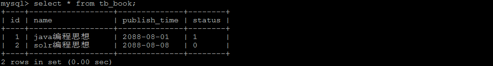
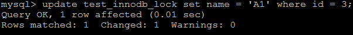
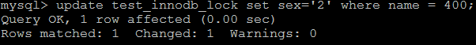
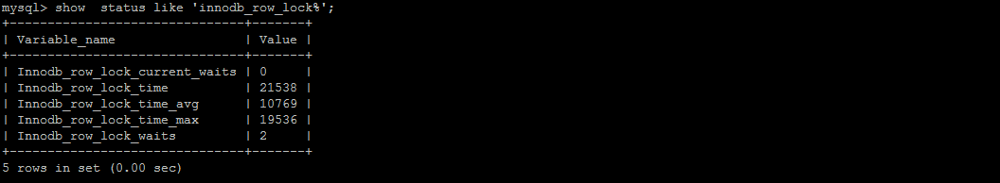
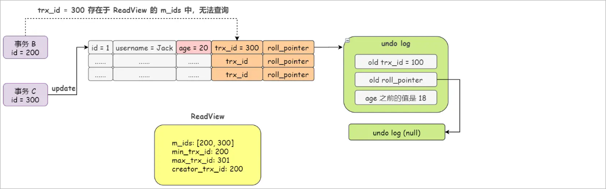

# 1 MySQL基础日志

## 1.1 日志分类

在任何一种数据库中，都会有各种各样的日志，记录着数据库工作的方方面面，以帮助数据库管理员追踪数据库曾经发生过的各种事件。MySQL有多

种类型的日志，用于记录数据库的操作和状态。以下是一些常见的MySQL日志：

1、错误日志（Error Log）：记录MySQL服务器在启动、运行过程中发生的错误和异常情况，如启动错误、语法错误等。

2、查询日志（Query Log）：记录所有执行的查询语句，包括SELECT、INSERT、UPDATE、DELETE等操作。可以用于分析查询性能和调试问

题，但需要注意对于高负载的系统，开启查询日志可能会对性能产生影响。

3、慢查询日志（Slow Query Log）：记录执行时间超过指定阈值的查询语句。慢查询日志可以帮助你找出执行时间较长的查询，以便进行性能优化。

4、二进制日志（Binary Log）：记录所有对数据库的更改操作，包括数据修改、表结构变更等。二进制日志可以用于数据恢复、主从复制等场景。

5、事务日志（Transaction Log）：也称为重做日志（Redo Log），记录正在进行的事务的更改操作。事务日志用于保证数据库的ACID特性，并支持

崩溃恢复。

## 1.2 错误日志

错误日志是 MySQL 中最重要的日志之一，它记录了当 mysqld 启动和停止时，以及服务器在运行过程中发生任何严重错误时的相关信息。当数据库出

现任何故障导致无法正常使用时，可以首先查看此日志。

查看日志位置指令 ： 

```sql
show variables like 'log_error%';
```

执行结果如下所示：

 

log_error设置为stderr并且MySQL以守护进程（daemon）方式运行，那么错误日志将被重定向到系统日志文件（如/var/log/syslog）或其他操作系

统特定的日志文件中，而不是直接输出到控制台。


可以通过如下配置，设置错误日志的输出位置：

打开MySQL的配置文件my.cnf。该文件通常位于MySQL安装目录下的/etc或者/etc/mysql子目录中。

```shell
[mysqld]
log_error = /var/lib/mysql/mysql-error.err
```

重启mysql进行测试。


查看日志内容 ： 

```sql
tail -f /var/lib/docker/volumes/mysql8_data/_data/mysql-error.err
```

 


## 1.3 查询日志

查询日志中记录了客户端的所有操作语句【CRUD】，而二进制日志不包含查询数据的SQL语句。

默认情况下， 查询日志是未开启的。如果需要开启查询日志，可以设置以下配置 ：

```sql
# 该选项用来开启查询日志 ， 可选值 ： 0 或者 1 ； 0 代表关闭， 1 代表开启 
general_log = 1

# 设置日志的文件名 ， 如果没有指定， 默认的文件名为 host_name.log 
general_log_file=file_name
```


在mysql 的配置文件 /var/lib/mysql/my.cnf 中配置如下内容 ： 

```sql
general_log=1
general_log_file=mysql_query.log
```

配置完毕之后，在数据库执行以下操作 ：

```sql
select * from t_emp ;
update t_emp emp set emp.age = 20 where emp.id = 10 ;
insert into t_emp(name , age , deptId , empno) VALUES('张三', 18 ,null , 100011) ;
delete from t_emp where id = 11 ;
```

执行完毕之后， 再次来查询日志文件 ： 

 


开启查询日志注意事项：

1、开启查询日志会对MySQL的性能产生一定影响，特别是在高负载环境下。因此，在生产环境中建议谨慎使用，并根据需要进行开启和关闭。

2、查询日志可能会记录大量的查询语句，导致日志文件过大。可以通过定期清理或限制日志文件大小来处理这个问题。

3、查询日志可能会包含敏感信息（如密码），因此要确保只有授权的人员可以访问查询日志文件。


## 1.4 慢查询日志

慢查询日志记录了所有执行时间超过参数 long_query_time 设置值，long_query_time 默认为 10 秒，最小为 0， 精度可以到微秒。

### 1.4.1 日志参数配置

默认情况下，MySQL数据库没有开启慢查询日志，需要我们手动来设置这个参数。当然，如果不是调优需要的话，一般不建议启动该参数，因为开启

慢查询日志会或多或少带来一定的性能影响。

慢查询日志默认是关闭的 。可以通过两个参数来控制慢查询日志 ：

```shell
# 该参数用来控制慢查询日志是否开启， 可取值： 1 和 0 ， 1 代表开启， 0 代表关闭
slow_query_log=1 

# 该参数用来指定慢查询日志的文件名
slow_query_log_file=slow_query.log

# 该选项用来配置查询的时间限制， 超过这个时间将认为值慢查询， 将需要进行日志记录， 默认10s
long_query_time=10
```

重启mysql进行测试。

### 1.4.2 日志内容读取

和错误日志、查询日志一样，慢查询日志记录的格式也是纯文本，可以被直接读取。

1、查询慢查询是否开启以及日志文件位置

```sql
SHOW VARIABLES LIKE '%slow_query_log%'; 
```

2、查询long_query_time 的值。

```sql
SHOW VARIABLES LIKE '%long_query_time%'; -- 查看值：默认10秒
```

3、执行查询操作

```sql
 select * from t_emp ;
```

由于在查询的执行时间小于10s，因此该查询不会记录到慢查询日志中。


模拟慢查询效果：

```sql
 select * from t_emp where id = 10 and sleep(11) ;   -- 使用SLEEP函数可以让查询暂停指定的时间
```


查看慢查询日志内容：

 

# 2 MySQL事务日志

## 2.1 事务概述

概述：就是由多个操作组成的一个逻辑单元，组成这个逻辑单元的多个操作要么都成功要么都失败。

作用：保证数据的一致性

举例：转账

## 2.2 ACID四大特性

**A：原子性(Atomicity)**

一个事务(transaction)中的所有操作，要么全部完成，要么全部不完成，不会结束在中间某个环节。事务在执行过程中发生错误，会被回滚

（Rollback）到事务开始前的状态，就像这个事务从来没有执行过一样。

**C：一致性(Consistency)**

事务的一致性指的是在一个事务执行之前和执行之后数据库都必须处于一致性状态。

如果事务成功地完成，那么系统中所有变化将正确地应用，系统处于有效状态。

如果在事务中出现错误，那么系统中的所有变化将自动地回滚，系统返回到原始状态。

**I：隔离性(Isolation)**

指的是在并发环境中，当不同的事务同时操纵相同的数据时，每个事务都有各自的完整数据空间。由并发事务所做的修改必须与任何其他并发事务所做

的修改隔离。

事务查看数据更新时，数据所处的状态要么是另一事务修改它之前的状态，要么是另一事务修改它之后的状态，事务不会查看到中间状态的数据。

**D：持久性(Durability)**

指的是只要事务成功结束，它对数据库所做的更新就必须保存下来。即使发生系统崩溃，重新启动数据库系统后，数据库还能恢复到事务成功结束时的

状态。


注意：

1、事务的隔离性由 **锁机制** 实现。

2、而事务的原子性、一致性和持久性由事务的 **redo日志**和**undo日志**来保证。

* redo log称为重做日志 ，它记录了对数据库进行修改的操作，包括插入、更新和删除等。Redo日志的主要作用是保证数据库的持久性和恢复能

  力。

* undo log称为回滚日志 ，它记录了对数据库进行修改的操作的**逆操作**，用于实现事务的回滚和MVCC（多版本并发控制）。


## 2.3 redo日志

### 2.3.1 innodb写数据过程

innodb存储引擎是以**页为单位**来管理存储空间的。在真正访问页面之前，需要把磁盘上的页缓存到内存【**Buffer Pool**】之后在可以访问。所有的变

更必须**先更新缓存池**中的数据。然后缓存池中的**脏页**会以一定的频率被刷到磁盘，通过缓存池来优化CPU和磁盘之间的鸿沟，这样就保证了整体的性

能不会下降太快。

### 2.3.2 redo日志的意义

#### 没有redo log存在的问题

缓冲池可以帮助我们消除CPU和磁盘之间的鸿沟，checkpoint机制可以保证数据的最终落盘，然而由于checkpoint **并不是每次变更的时候就触发**

**的**，而是master线程隔一段时间去处理的。所以最坏的情况就是事务提交后，刚写完缓冲池，数据库宕机了，那么这段数据就是丢失的，无法恢复。

> checkPoint机制主要的作用是将缓冲池中的脏页刷新到磁盘，


#### 事务的持久性怎么保证

事务包含持久性的特性，就是说对于一个已经提交的事务，在事务提交后即使系统发生了崩溃，这个事务对数据库中所做的更改也不能丢失。

##### 方案一

在事务提交完成之前把该事务所修改的所有页面都刷新到磁盘，但是这个简单粗暴的做法有些问题

**1、修改量与刷新磁盘工作量严重不成比例**

有的时候我们仅仅修改了一个页中的某一个字节，但是我们都知道在innodb中是以页为单位来进行磁盘io的，也就是说我们在进行事务提交的时候不得

不将一个完整的页面从内存刷到磁盘，我们都知道一个页面是16KB，只修改了一个字节就需要刷新16KB的数据到磁盘显然有点大题小做。

**2、随机IO刷新较慢**

一个事务可能包含很多个语句，即使一条语句可能也**会修改很多页面**，假如该事务修改的这些页面可能并不相邻，这就意味着在将某个事务修改的

Buffer Pool的页刷新到磁盘时，需要进行很多的磁盘IO，随机IO比顺序IO慢，尤其对传统的机械磁盘来说。

##### 方案二

我们只是想让已经提交了的事务对数据库中数据所做的修改永久生效，即使后来系统崩溃，在重启后也能把这种修改恢复出来。所以我们其实没有必

要在每次事务提交时就把该事务在内存中修改过的全部页面刷新到磁盘，只需要把**修改了哪些东西记录一下**就好。比如，某个事务将系统表空间中 

第10号 页面中偏移量为 100 处的那个字节的值 1 改成 2 。我们只需要记录一下：将第0号表 空间的10号页面的偏移量为100处的值更新为2。Innodb

引擎采用的就是方案二。


Innodb引擎采用的是WAL技术(write-ahead logging) , 这种技术就是先写日志，再写磁盘，只有日志写入成功，才算事务提交成功，这里的日志就是

redo log。


redo  log可以简单分为以下两个部分：

1、重做日志的缓冲 (**redo log buffer**) ，保存在内存中，是易失的。redo log buffer 大小，默认 16M ，最大值是4096M，最小值为1M。

```sql
show variables like '%innodb_log_buffer_size%';
```

2、重做日志文件 (**redo log file**) ，保存在硬盘中，是持久的。redo log日志文件如下所示：

 

整体写数据的流程如下所示：

 

整体流程说明：

第1步：先将原始数据从磁盘中读入内存中来，修改数据的内存拷贝 

第2步：生成一条重做日志并写入redo log buffer，记录的是数据被修改后的值 

第3步：当事务commit时，将redo log buffer中的内容刷新到 redo log file，对 redo log file采用追加 写的方式 

第4步：定期将内存中修改的数据刷新到磁盘中


当发生宕机且数据未刷新到磁盘的时候，可以通过redo log来恢复，保证了ACID中的D，这就是redo log的作用。

 

### 2.3.4 redo log的好处和特点

优点：

1、redo日志降低了刷盘频率 

2、redo日志占用的空间非常小

特点：

1、redo日志是顺序写入磁盘的

2、事务执行过程中，redo log不断记录

### 2.3.5 redo log的刷盘策略

redo log的写入并不是直接写入磁盘的，InnoDB引擎会在写redo log的时候先写redo log buffer，之后以 一定策略将redo log buffer刷入到真正的

redo log file 中。这里的策略这就是我们要说的刷盘策略。

 

**注意**：redo log buffer刷盘到redo log file的过程并不是真正的刷到磁盘中去，只是刷入到 **文件系统缓存（page cache）**中去（这是现代操作系统

为了提高文件写入效率做的一个优化），真正的写入会**交给系统自己来决定**（比如page cache足够大了）。那么对于InnoDB来说就存在一个问题，

如果交给系统来同步，同样如果系统宕机，那么数据也丢失了（虽然整个系统宕机的概率还是比较小的）。


针对这种情况，InnoDB给出 **innodb_flush_log_at_trx_commit** 参数，该参数控制 commit提交事务时，如何将 redo log buffer 中的日志刷新到 

redo log file 中。

```sql
-- 查看innodb_flush_log_at_trx_commit变量的值
SHOW VARIABLES LIKE '%innodb_flush_log_at_trx_commit%';
```


它支持三种策略：

1、**设置为0** ：表示每次事务提交时不进行刷盘操作【不往文件系统中写】。（系统默认master thread每隔1s进行一次重做日志的同步）。**性能最**

**佳、数据风险较高。**

 

2、**设置为1** ：表示每次事务提交时都将进行同步，刷盘操作（ 默认值 ）。**数据安全性较高、性能稍差。**

 

3、**设置为2** ：表示每次事务提交时都只把 **redo log buffer 内容写入 page cache**，不进行同步。由os自己决定什么时候同步到磁盘文件。**性**

**能较高数据安全性较高。**在发生数据库故障时，可能会丢失最近提交的事务的数据，因为尚未刷新到磁盘上的日志文件中。

 

## 2.4 undo日志

### 2.4.1 undo日志简介

事务需要保证 **原子性** ，也就是事务中的操作要么全部完成，要么什么也不做。但有时候事务执行到一半 会出现一些情况，比如： 

情况一：事务执行过程中可能遇到各种错误，比如 服务器本身的错误 ， 操作系统错误，甚至是突 然 断电 导致的错误。 

情况二：程序员可以在事务执行过程中手动输入ROLLBACK 语句结束当前事务的执行。

以上情况出现，我们需要把数据改回原先的样子，这个过程称之为 **回滚** ，这样就可以造成一个假象：这 个事务看起来什么都没做，所以符合 原子性 

要求。


如何保证原子性呢? 每当我们要对一条记录做改动时(INSERT、DELETE、UPDATE)，都需要**留一手** -------- 要把改动的东西记下来。比如：

1、你**插入一条记录**时，至少要把这条记录的**主键值记录**下来，之后回滚的时候只需要把这个主键值对应的**记录删除**掉就好了(对于INSER，

INNODB存储引擎会完成一个DELETE)。

2、你**删除一条记录**时，至少把这条记录的**内容都记录**下来，这样之后回滚时再把这些内容组成的**记录插入**到表中就好了(对于每个DELETE，

INNODB存储引擎会执行一个INSERT)。

3、你**修改一条记录**时，至少要把修改这条记录前的**旧值都记录**下来，这样之后回滚时把这条**记录更新**为旧值就好了(对于每个UPDATE,INNODB存

储引擎会执行一个反向的UPDATE,将修改之前的行放回去)。


MySQL把这些为了回滚而记录的这些内容称之为**撤销日志**或者**回滚日志**(undo log)


redo log是事务持久性的保证，undo log是事务原子性的保证。在事务中**更新数据**的**前置操作**其实是要先写入一个undo log。

 


undo日志作用：

1、回滚数据

2、MVCC


### 2.4.2 undo log存储结构

#### 回滚段与undo页

InnoDB对undo log的管理采用段的方式，也就是回滚段（**rollback segment**） 。每个回滚段记录了 1024 个 **undo log segment** ，而在每个undo 

log segment段中进行 **undo页** (存储的就是回滚记录)的申请。 在 InnoDB1.1版本之前 （不包括1.1版本），只有一个rollback segment，因此支持同时

在线的事务限制为 1024 。虽然对绝大多数的应用来说都已经够用。 从1.1版本开始InnoDB支持最大 128个rollback segment ，故其支持同时在线的

事务限制提高到 了 128*1024 。

 

```shell
# 通过如下的SQL语句查询回滚段的大小
mysql> SHOW VARIABLES LIKE 'innodb_rollback_segments';
+--------------------------+-------+
| Variable_name            | Value |
+--------------------------+-------+
| innodb_rollback_segments | 128   |
+--------------------------+-------+
1 row in set (0.00 sec)
```

#### undo页的重用

在MySQL中，undo页的重用是指当事务提交或回滚后，**之前使用的undo页可以被重新利用**来存储新的事务的undo信息。这个过程称为undo页的重

用。

Undo页是用于实现事务的回滚和MVCC（多版本并发控制）机制的关键组成部分。当一个事务执行更新操作时，旧的数据会被写入到undo页中，以便

在事务回滚时能够恢复到之前的状态。而在MVCC中，每个事务都可以看到自己开始之前的数据库快照，这些快照通过undo页来实现。

**当一个事务提交或回滚后，其对应的undo页就不再需要了**。为了节省空间和提高性能，MySQL会将这些不再需要的undo页标记为可重用状态，并

将它们添加到一个undo页的空闲链表中。当新的事务需要分配undo页时，MySQL会首先尝试从空闲链表中获取可重用的undo页，而不是分配新的页。

通过重用undo页，可以减少对磁盘空间的需求，提高系统性能。然而，如果系统中存在长时间运行的读事务或长时间运行的只读事务，可能会导致

undo页无法及时重用，从而增加了undo段的大小和磁盘空间的占用。

#### 回滚段与事务

1、每个事务只会使用一个回滚段，一个回滚段在同一时刻可能会服务于多个事务。

2、当一个事务开始的时候，会制定一个回滚段，在事务进行的过程中，当数据被修改时，原始的数据会被复制到回滚段。

3、当事务提交时，InnoDB存储引擎会做以下两件事情： 

* 将undo log放入列表中，以供之后的purge(**清理**)操作 
* 判断undo log所在的页是否可以重用，若可以分配给下个事务使用

#### 回滚段中的数据分类

##### uncommitted undo information

未提交的回滚数据（uncommitted undo information）是指在**事务执行过程中所做的修改，但尚未提交的数据**。这些数据包括已插入、已更新或已

删除的记录。在数据库中，当一个事务开始时，它可能会对数据库中的数据进行修改。这些修改操作会生成相应的undo信息，用于在事务回滚时撤销

这些修改。这些undo信息被存储在回滚段（rollback segment）中。


当一个事务还没有提交时，其所做的修改被视为未提交的回滚数据。这意味着其他事务无法看到这些修改，因为它们尚未被永久保存到数据库中。如果

该事务被回滚，那么这些未提交的回滚数据将被撤销，数据库恢复到事务开始之前的状态。

需要注意的是，未提交的回滚数据只存在于回滚段中，并且**只对当前正在执行的事务可见**。其他事务无法读取或修改这些未提交的数据。只有在事务

成功提交后，这些数据才会成为已提交的数据，对其他事务可见。

##### committed undo information

已经提交但未过期的回滚数据（committed undo information）是指在事务执行过程中所做的修改，并且已经成功提交到数据库中的数据。这些数据

包括已插入、已更新或已删除的记录。在数据库中，当一个事务成功提交后，其所做的修改会被永久保存到数据库中。同时，相应的undo信息也会保

留在回滚段中，以便在需要时进行回滚操作。

已经提交的回滚数据**对其他事务可见**，可以被读取和修改。这意味着其他事务可以看到并访问这些已提交的数据，而不仅仅局限于当前事务的范围

内。需要注意的是，已经提交的回滚数据只有**在没有过期的情况下才能被保留**。过期数据是指由于某些原因（如长时间未使用）而被标记为可回收的

数据。

##### expired undo information

事务已经提交并过期的数据（expired undo information）是指在事务执行过程中所做的修改，并且已经成功提交到数据库中，但由于某些原因被标记

为可回收的数据。这些数据包括已插入、已更新或已删除的记录。在数据库中，当一个事务成功提交后，其所做的修改会被永久保存到数据库中。同

时，相应的undo信息也会保留在回滚段中，以便在需要时进行回滚操作。

然而，由于一些策略或配置的原因，一些已经提交的回滚数据可能会被标记为过期。过期数据通常是由于长时间未使用或其他管理策略而被认为是可以

回收的数据。**过期的回滚数据可能会被后续的事务覆盖或清理，以释放存储空间或提高性能。**这意味着虽然这些数据已经成功提交，但它们**可能**

**不再对其他事务可见或可访问。**

需要注意的是，过期的回滚数据的处理方式可能因数据库管理系统而异。一些数据库系统会自动清理过期数据，而另一些则需要手动管理和清理。

### 2.4.3 undo log类型

在InnoDB存储引擎中，undo log分为：insert undo log和update undo log

#### insert undo log

Insert undo log（插入撤销日志）是数据库中用于记录**插入操作**的一种撤销日志。因为insert操作的记录，只对事务本身可见，对其他事务不可见(这

是事务的隔离性的要求)，因此 undo log可以在**事务提交之后删除**。

#### update undo log

Update undo log（更新撤销日志）是数据库中用于记录**更新操作(delete、update)**的一种撤销日志。该undo log可能需要提供MVCC机制，因此不能

**在事务提交是就进行删除。提交是放入undo log链表，等待purge线程进行最后的删除。**


### 2.4.4 undo log的生命周期

#### undo log生成过程

##### 简要生成过程

假设有2个数值，分别为A=1和B=2, 然后将A修改为3，B修改为4

```shell
1、start transaction ;
2、记录A=1到undo log  ;
3、update A = 3		;
4、记录A=3到redo log  ;
5、记录B=2到undo log  ;
6、update B = 4 ;
7、记录B=4到redo log  ;
8、将redo log刷新到磁盘
9、commit
```

异常情况分析：

1、在1~8步骤的任意一步系统宕机，事务未提交，该事务就不会对磁盘上的数据做任何影响。

2、如果在8~9之间宕机，恢复之后可以选择回滚，也可以选择继续完成事务提交，因为此时redo log已经持久化。

3、若在9之后系统宕机，内存映射中变更的数据还来不及刷回磁盘，那么系统恢复之后，可以根据redo log把数据刷回磁盘。


**只有Buffer Pool没有Redo Log和Undo log的流程：**

 

**有了Redo Log和Undo Log之后：**

 

在更新Buffer Pool中数据之前，我们需要先将该数据事务开始之前的状态写入Undo log中。假设更新到一半出错了，我们就可以通过Undo log来回滚

到事务开始前。


##### 详细生成过程

对于InnoDB引擎来说，每个行记录除了记录本身的数据之外，还有几个隐藏的列：

1、DB_ROW_ID: 如果没有为表显式的定义主键，并且表中也没有定义唯一索引，那么InnoDB会自动为表添加一个row_id的隐藏列作为主键。

2、DB_TRX_ID: 每个事物都会分配一个事务的ID，当对某条记录发生变更时，就会将这个事务的事务ID写入trx_id中。

3、DB_ROLL_PTR: 回滚指针，本质上就是指向undo log的指针。

 


当我们执行INSERT时：

```sql
begin;
INSERT INTO user (name) VALUES ("tom");
```

插入的数据都会生成一条insert undo log , 并且数据的回滚指针会指向它。undo log会记录undo log的序号，插入主键的列和值...., 那么在进行rollback

的时候，通过主键直接把对应的数据删除即可。

 


当我们执行UPDATE时：

对于更新的操作会产生update undo log，并且会分更新主键的和不更新主键的，假设现在执行：

```sql 
update user set name = 'Sun' where id = 1 ;
```

 

这时会把老的记录写入新的undo log，让回滚指针指向定的undo log，它的undo log是1，并且新的undo log会指向老的undo log(undo no = 0)。

假设现在执行：

```sql
update user set id = 2 where id = 1 ;
```

 

对于更新主键的操作，会先**把原来的数据deletemark标识打开**，这是并没有真正的删除数据，真正的删除会交给**清理线程**去判断，然后在后面插入

一条新的数据，新数据也会产生undo log，并且undo log的序号会递增。


可以发现每次对数据的变更都会产生一个undo log，当一条记录被变更多次时，那么就会产生多条undo log，undo log记录的是变更前的日志，并且每

个undo log的序号是递增的，那么要当回滚的时候，按照序号依次向前，这样就会找到原始数据了。

#### 回滚流程

以上面的例子来说，假设执行rollback，那么对应的流程应该是这样：

1、通过undo no=3的日志把id=2的数据删除 

2、通过undo no=2的日志把id=1的数据的deletemark还原成0 

3、通过undo no=1的日志把id=1的数据的name还原成Tom 

4、通过undo no=0的日志把id=1的数据删除


#### undo log的删除

1、针对于insert undo log 因为insert操作的记录，只对事务本身可见，对其他事务不可见。故该undo log可以在事务提交后直接删除，不需要进行

purge操作。 

2、针对于update undo log 该undo log可能需要提供MVCC机制，因此不能在事务提交时就进行删除。提交时放入undo log链表，等待purge线程进行

最后的删除。


# 3 MySQL锁

事务的 **隔离性** 由这章讲述的 **锁** 来实现。

## 3.1 锁概述

**锁**是计算机协调多个进程或者线程**并发访问某一个资源**的机制。在程序开发中会存在多线程同步的问题，当多个线程并发访问某一个数据的时候，尤

其针对一些敏感的数据(比如订单、金额等)，我们就需要保证这个数据在任何时刻**最多只有一个线程**在访问，保证数据的完整性和一致性。在开发过

程中加锁是为了保证数据的一致性，这个思想在数据库领域中同样很重要。


在数据库中，除传统的计算资源（如CPU、RAM、I/O等）的争用以外，数据也是一种供许多用户共享的资源。为保证数据的一致性，**需要对并发操**

**作进行控制** ，因此产生了锁 。同时锁机制也为实现MySQL的各个隔离级别提供了保证。 **锁冲突** 也是影响数据库 **并发访问性能** 的一个重要因素。

所以锁对数据库而 言显得尤其重要，也更加复杂。

## 3.2 并发事务带来的问题

在典型的应用程序中，多个事务并发运行，经常会操作相同的数据来完成各自的任务（多个用户对同一数据进行操作）。并发虽然是必须的，但可能会

导致以下的问题。

**脏读（Dirty read）**: 当一个事务正在访问数据并且对数据进行了修改，而这种修改还没有提交到数据库中，这时另外一个事务也访问了这个数据，

然后使用了这个数据。因为这个数据是还没有提交的数据，那么另外一个事务读到的这个数据是“脏数据”，依据“脏数据”所做的操作可能是不正确的。

**丢失修改（Lost to modify）**：指在一个事务读取一个数据时，另外一个事务也访问了该数据，那么在第一个事务中修改了这个数据后，第二个事

务也修改了这个数据。这样第一个事务内的修改结果就被丢失，因此称为丢失修改。 例如：事务1读取某表中的数据A=20，事务2也读取A=20，事务1

修改A=A-1，事务2也修改A=A-1，最终结果A=19，事务1的修改被丢失。

**不可重复读（Unrepeatableread）**：指在一个事务内多次读同一数据。在这个事务还没有结束时，另一个事务修改了该数据。那么，在第一个事务

中的两次读数据之间，由于第二个事务的修改导致第一个事务两次读取的数据可能不太一样。这就发生了在一个事务内两次读到的数据是不一样的情

况，因此称为不可重复读。

**幻读（Phantom read）**：幻读与不可重复读类似。它发生在一个事务（T1）读取了几行数据，接着另一个并发事务（T2）插入了一些数据时。在随

后的查询中，第一个事务（T1）就会发现多了一些原本不存在的记录，就好像发生了幻觉一样，所以称为幻读。

## 3.3 并发事务的解决方案

解决方案：对事务进行隔离

MySQL的四种隔离级别如下:

**读未提交(READ UNCOMMITTED)**：这个隔离级别下,其他事务可以看到本事务没有提交的部分修改。因此会造成脏读的问题(读取到了其他事

务未提交的部分,而之后该事务进行了回滚)。这个级别的性能没有足够大的优势,但是又有很多的问题,因此很少使用。

sql演示：

```sql
# 创建数据库表
create table goods_innodb(
	id int NOT NULL AUTO_INCREMENT,
	name varchar(20) NOT NULL,
    primary key(id)
)ENGINE=innodb DEFAULT CHARSET=utf8;

# 插入数据
insert into goods_innodb(name) values('华为');
insert into goods_innodb(name) values('小米');

# 会话一
set session transaction isolation level read uncommitted ;		# 设置事务的隔离级别为read uncommitted
start transaction ;												# 开启事务
select * from goods_innodb ;									# 查询数据

# 会话二
set session transaction isolation level read uncommitted ;		# 设置事务的隔离级别为read uncommitted
start transaction ;												# 开启事务
update goods_innodb set name = '中兴' where id = 2 ;			   # 修改数据

# 会话一
select * from goods_innodb ;									# 查询数据
```

**读已提交(READ COMMITTED)**：其他事务只能读取到本事务已经提交的部分。这个隔离级别有不可重复读的问题，在同一个事务内的两次读取,拿

到的结果竟然不一样,因为另外一个事务对数据进行了修改。

sql演示：

```sql
# 会话一
set session transaction isolation level read committed ;		# 设置事务的隔离级别为read committed
start transaction ;												# 开启事务
select * from goods_innodb ;									# 查询数据

# 会话二
set session transaction isolation level read committed ;		# 设置事务的隔离级别为read committed
start transaction ;												# 开启事务
update goods_innodb set name = '小米' where id = 2 ;			   # 修改数据

# 会话一
select * from goods_innodb ;									# 查询数据

# 会话二
commit;															# 提交事务

# 会话一
select * from goods_innodb ;									# 查询数据
```

**REPEATABLE READ(可重复读)**：可重复读隔离级别解决了上面不可重复读的问题(看名字也知道)，但是不能完全解决幻读。MySql默认的事务隔离

级别就是：**REPEATABLE READ**

```sql
SELECT @@global.transaction_isolation ;
```

sql演示(解决不可重复读)：

```sql
# 会话一
set session transaction isolation level REPEATABLE READ ;
start transaction ;												# 开启事务
select * from goods_innodb ;									# 查询数据

# 会话二
set session transaction isolation level REPEATABLE READ ;
start transaction ;												# 开启事务
update goods_innodb set name = '荣耀' where id = 1 ;			   # 修改数据

# 会话一
select * from goods_innodb ;									# 查询数据

# 会话二
commit;															# 提交事务

# 会话一
select * from goods_innodb ;									# 查询数据
```


sql演示(测试不会出现幻读的情况)：

```sql
# 会话一
set session transaction isolation level REPEATABLE READ ;
start transaction ;												# 开启事务
select * from goods_innodb ;									# 查询数据

# 会话二
set session transaction isolation level REPEATABLE READ ;
start transaction ;												# 开启事务
insert into goods_innodb(name) values('小米');			   	   # 插入数据
commit;															# 提交事务

# 会话一
select * from goods_innodb ;									# 查询数据
```

sql演示(测试出现幻读的情况)：

```sql
# 表结构进行修改
ALTER TABLE goods_innodb ADD version int(10) NULL ;

# 会话一
set session transaction isolation level REPEATABLE READ ;
start transaction ;												# 开启事务
select * from goods_innodb where version = 1;					# 查询一条不满足条件的数据

# 会话二
set session transaction isolation level REPEATABLE READ ;
start transaction ;												# 开启事务
insert into goods_innodb(name, version) values('vivo', 1);	    # 插入一条满足条件的数据 
commit;															# 提交事务

# 会话一
update goods_innodb set name = '金立' where version = 1; 		   # 将version为1的数据更改为'金立'
select * from goods_innodb where version = 1;					# 查询一条不满足条件的数据
```

**SERIALIZABLE(可串行化)**：这是最高的隔离级别,可以解决上面提到的所有问题,因为他强制将所以的操作串行执行,这会导致并发性能极速下降,因

此也不是很常用。


## 3.4 并发事务访问情况说明

并发事务访问相同记录的情况大致可以划分为3种：读-读情况、写-写情况、读-写或写-读情况

### 3.4.1 读-读情况

**读-读**情况，即并发事务相继**读取相同的记录** 。读取操作本身不会对记录有任何影响，并不会引起什么问题，所以允许这种情况的发生。

### 3.4.2 写-写情况

写-写 情况，即并发事务相继对相同的记录做出改动。 在这种情况下会发生 **脏写(脏写读取、脏写覆盖)** 的问题，任何一种隔离级别都不允许这

种问题的发生。所以在多个未提交事务相继对一条记录做改动时，需要让它们排队执行 ，这个排队的过程其实是通过**锁**来实现的。这个所谓 的锁其

实是一个 内存中的结构 ，在事务执行前本来是没有锁的，也就是说一开始是没有 锁结构 和记录进 行关联的，如图所示：

 

当一个事务想对这条记录做改动时，首先会看看内存中有没有与这条记录关联的**锁结构** ，当没有的时候 就会在内存中生成一个 锁结构 与之关联。比

如，事务 T1 要对这条记录做改动，就需要生成一个 锁结构 与之关联：

  

在锁结构中存在很多的信息，为了简化理解，只把两个比较重要的属性拿出来：

1、trx信息：代表这个锁结构是哪一个事务生成的

2、is_waiting: 代表当前事务是否在线等待

当事务T1改动了这条记录后，就生成了一个锁结构与该条记录关联，因为之前没有别的事务为这条记录加锁，所以is_waiting属性就是false，我们把

这个场景就称之为获取锁成功，或者加锁成功。然后就可以继续进行操作了。


在事务T1提交之前，另外一个事务T2也想对该记录做更改，那么先看看有没有锁结构与该条记录关联，发现有一个锁结构与之关联，然后也生成了一

个锁结构与这条记录关联，不过锁结构的is_waiting属性就是true，表示当前事务需要等待，我们把这个场景就称之为获取锁失败，或者加锁失败。如

下图所示：

 

当事务T1提交之后，就会把该事务生成的**锁结构释放掉**，然后看看有没有别的事务在等待获取锁，发现了事务T2还在等待获取锁，所以把**事务T2对**

**应的锁结构的is_waiting属性设置为false**，然后把该事务对应的线程唤醒，让他继续执行，此时事务T2就算获取到了锁，效果如下所示：

 


小结几种说法： 

1、**不加锁** 意思就是不需要在内存中生成对应的 锁结构 ，可以直接执行操作。 

2、**获取锁成功，或者加锁成功** 意思就是在内存中生成了对应的 锁结构 ，而且锁结构的 is_waiting 属性为 false ，也就是事务 可以继续执行操作。 

3、**获取锁失败，或者加锁失败**，或者没有获取到锁 意思就是在内存中生成了对应的 锁结构 ，不过锁结构的 is_waiting 属性为 true ，也就是事务 

需要等待，不可以继续执行操作。

### 3.4.3 读-写情况

读-写 或 写-读 ，即一个事务进行读取操作，另一个进行改动操作。这种情况下可能发生 脏读 、 不可重 复读 、 幻读 的问题。

要想解决这些问题就需要使用到到事务的隔离级别，而事务的隔离性的实现原理有两种：

1、使用**MVCC**：读操作利用多版本并发控制（ MVCC ），写操作进行加锁 。

> 普通的SELECT语句在READ COMMITTED和REPEATABLE READ隔离级别下会使用到MVCC读取记录。
>
> 1、在 READ COMMITTED 隔离级别下，一个事务在执行过程中**每次**执行SELECT操作时都会生成一 个**ReadView**，ReadView的存在本身就保证
>
> 了 事务不可以读取到未提交的事务所做的更改 ，也就 是避免了脏读现象； 
>
> 2、在 REPEATABLE READ 隔离级别下，一个事务在执行过程中只有 **第一次**执行SELECT操作 才会 生成一个**ReadView**，之后的SELECT操作都 
>
> 复用 这个ReadView，这样也就避免了不可重复读 和幻读的问题。

2、读、写操作都采用 加锁 的方式。


小结对比发现： 

1、采用 MVCC 方式的话， 读-写 操作彼此并不冲突， 性能更高 。 

2、采用 加锁 方式的话， 读-写 操作彼此需要 排队执行 ，影响性能。 

一般情况下我们当然愿意采用 MVCC 来解决 读-写 操作并发执行的问题，但是业务在某些特殊情况 下，要求必须采用 加锁 的方式执行。


## 3.5 锁的分类

从对数据操作的粒度分 ： 

1） 表锁：操作时，会锁定整个表。

2）页面锁：操作时，会锁定某一页的数据。

3） 行锁：操作时，会锁定当前操作行。

从对数据操作的类型分：

1） 读锁（共享锁）：针对同一份数据，多个读操作可以同时进行而不会互相影响。

2） 写锁（排它锁）：当前操作没有完成之前，它会阻断其他写锁和读锁。


相对其他数据库而言，MySQL的锁机制比较简单，其最显著的特点是不同的存储引擎支持不同的锁机制。下表中罗列出了各存储引擎对锁的支持情

况：

| 存储引擎 | 表级锁 | 行级锁 | 页面锁 |
| -------- | ------ | ------ | ------ |
| MyISAM   | 支持   | 不支持 | 不支持 |
| InnoDB   | 支持   | 支持   | 不支持 |
| MEMORY   | 支持   | 不支持 | 不支持 |
| BDB      | 支持   | 不支持 | 支持   |

MySQL这3种锁的特性可大致归纳如下 ：

| 锁类型 | 特点                                                         |
| ------ | ------------------------------------------------------------ |
| 表级锁 | 偏向MyISAM 存储引擎，开销小，加锁快；不会出现死锁；锁定粒度大，发生锁冲突的概率最高,并发度最低。 |
| 行级锁 | 偏向InnoDB 存储引擎，开销大，加锁慢；会出现死锁；锁定粒度最小，发生锁冲突的概率最低,并发度也最高。 |
| 页面锁 | 开销和加锁时间界于表锁和行锁之间；会出现死锁；锁定粒度界于表锁和行锁之间，并发度一般。 |

从上述特点可见，很难笼统地说哪种锁更好，只能就具体应用的特点来说哪种锁更合适！仅从锁的角度来说：表级锁更适合于以查询为主，只有少量按

索引条件更新数据的应用，如Web 应用；而行级锁则更适合于有大量按索引条件并发更新少量不同数据，同时又有并查询的应用。

## 3.6 MyISAM表锁

MyISAM 存储引擎只支持表锁，这也是MySQL开始几个版本中唯一支持的锁类型。

### 3.6.1 加锁特点

MyISAM 在执行查询语句（SELECT）前，会自动给涉及的所有表加读锁，在执行更新操作（UPDATE、DELETE、INSERT 等）前，会自动给涉及

的表加写锁，这个过程并不需要用户干预，因此，用户一般不需要直接用 LOCK TABLE 命令给 MyISAM 表显式加锁。

显示加表锁语法：

```sql
加读锁 ： lock table table_name read;
加写锁 ： lock table table_name write；
```

### 3.6.2 读锁案例

准备环境

```SQL
create database demo_03 default charset=utf8mb4;

use demo_03;

CREATE TABLE `tb_book` (
  `id` INT(11) auto_increment,
  `name` VARCHAR(50) DEFAULT NULL,
  `publish_time` DATE DEFAULT NULL,
  `status` CHAR(1) DEFAULT NULL,
  PRIMARY KEY (`id`)
) ENGINE=myisam DEFAULT CHARSET=utf8 ;

INSERT INTO tb_book (id, name, publish_time, status) VALUES(NULL,'java编程思想','2088-08-01','1');
INSERT INTO tb_book (id, name, publish_time, status) VALUES(NULL,'solr编程思想','2088-08-08','0');


CREATE TABLE `tb_user` (
  `id` INT(11) auto_increment,
  `name` VARCHAR(50) DEFAULT NULL,
  PRIMARY KEY (`id`)
) ENGINE=myisam DEFAULT CHARSET=utf8 ;

INSERT INTO tb_user (id, name) VALUES(NULL,'令狐冲');
INSERT INTO tb_user (id, name) VALUES(NULL,'田伯光');
```


客户端 一 ：

1）获得tb_book 表的读锁 

```sql
lock table tb_book read;
```


2） 执行查询操作

```sql
select * from tb_book;
```

 

可以正常执行 ， 查询出数据。


客户端 二 ：

3） 执行查询操作

```sql
select * from tb_book;
```

 


客户端 一 ：

4）查询未锁定的表

```sql
select name from tb_user;
```

  


客户端 二 ：

5）查询未锁定的表

```sql
select name from tb_user;
```

 

可以正常查询出未锁定的表；


客户端 一 ：

6） 执行插入操作 

```sql
insert into tb_book values(null,'Mysql高级','2088-01-01','1');
```

 

执行插入， 直接报错 ， 由于当前tb_book 获得的是 读锁， 不能执行更新操作。


客户端 二 ：

7） 执行插入操作 

```sql
insert into tb_book values(null,'Mysql高级','2088-01-01','1');
```

 

当在客户端一中释放锁指令 **unlock tables**  后 ， 客户端二中的 inesrt 语句 ， 立即执行 ；

### 3.6.3 写锁案例

客户端 一 :

1）获得tb_book 表的写锁 

```sql
lock table tb_book write ;
```

2）执行查询操作

```sql
select * from tb_book ;
```

 

查询操作执行成功；

3）执行更新操作

```sql
update tb_book set name = 'java编程思想（第二版）' where id = 1;
```

 

更新操作执行成功 ；


客户端 二 :

4）执行查询操作

```sql
select * from tb_book ;
```

 


当在客户端一中释放锁指令 unlock tables  后 ， 客户端二中的 select 语句 ， 立即执行 ；

 


### 3.6.4 结论

锁模式的相互兼容性如表中所示：

 

由上表可见： 

1、 对MyISAM 表的读操作，不会阻塞其他用户对同一表的读请求，但会阻塞对同一表的写请求；

2、对MyISAM 表的写操作，则会阻塞其他用户对同一表的读和写操作；

简而言之，就是读锁会阻塞写，但是不会阻塞读。而写锁，则既会阻塞读，又会阻塞写。

此外，MyISAM 的读写锁调度是写优先，这也是MyISAM不适合做写为主的表的存储引擎的原因。因为写锁后，其他线程不能做任何操作，大量的更

新会使查询很难得到锁，从而造成永远阻塞。

## 3.7 InnoDB行锁

### 3.7.1 加锁特点

行锁特点 ：偏向InnoDB 存储引擎，开销大，加锁慢；会出现死锁；锁定粒度最小，发生锁冲突的概率最低,并发度也最高。

InnoDB 与 MyISAM 的最大不同有两点：一是支持事务；二是 采用了行级锁。


InnoDB  实现了以下两种类型的行锁。

1、共享锁（S）：又称为读锁，简称S锁，共享锁就是多个事务对于同一数据可以共享一把锁，都能访问到数据，但是只能读不能修改。

2、排他锁（X）：又称为写锁，简称X锁，排他锁就是不能与其他锁并存，如一个事务获取了一个数据行的排他锁，其他事务就不能再获取该行的其

他锁，包括共享锁和排他锁，但是获取排他锁的事务是可以对数据就行读取和修改。

对于UPDATE、DELETE和INSERT语句，InnoDB会自动给涉及数据集加排他锁（X)；

对于普通SELECT语句，InnoDB不会加任何锁；


可以通过以下语句显示给记录集加共享锁或排他锁 。

```sql
共享锁（S）：SELECT * FROM table_name WHERE ... LOCK IN SHARE MODE
排他锁（X) ：SELECT * FROM table_name WHERE ... FOR UPDATE
```

### 3.7.2 案例准备工作

```sql
create table test_innodb_lock(
	id int(11),
	name varchar(16),
	sex varchar(1)
)engine = innodb default charset=utf8;

insert into test_innodb_lock values(1,'100','1');
insert into test_innodb_lock values(3,'3','1');
insert into test_innodb_lock values(4,'400','0');
insert into test_innodb_lock values(5,'500','1');
insert into test_innodb_lock values(6,'600','0');
insert into test_innodb_lock values(7,'700','0');
insert into test_innodb_lock values(8,'800','1');
insert into test_innodb_lock values(9,'900','1');
insert into test_innodb_lock values(1,'200','0');

create index idx_test_innodb_lock_id on test_innodb_lock(id);
create index idx_test_innodb_lock_name on test_innodb_lock(name);
```

### 3.7.3 行锁基本演示

| Session-1                                                    | Session-2                                                    |
| ------------------------------------------------------------ | ------------------------------------------------------------ |
|       关闭自动提交功能 |   关闭自动提交功能 |
|  可以正常的查询出全部的数据 |  可以正常的查询出全部的数据 |
| 查询id 为3的数据 ； | 获取id为3的数据 ； |
|  更新id为3的数据，但是不提交； |  更新id为3 的数据， 出于等待状态 |
|  通过commit， 提交事务 |  解除阻塞，更新正常进行 |
| 以上， 操作的都是同一行的数据，接下来，演示不同行的数据 ：   |                                                              |
|  更新id为3数据，正常的获取到行锁 ， 执行更新 ； |  由于与Session-1 操作不是同一行，获取当前行锁，执行更新； |


### 3.7.4 无索引行锁升级为表锁

如果不通过索引条件检索数据，那么InnoDB将对表中的所有记录加锁，实际效果跟表锁一样。


查看当前表的索引 ： show  index  from test_innodb_lock ;

 

| Session-1                                                    | Session-2                                                    |
| ------------------------------------------------------------ | ------------------------------------------------------------ |
| 关闭事务的自动提交 | 关闭事务的自动提交 |
| 执行更新语句 ：    | 执行更新语句， 但处于阻塞状态： |
| 提交事务：         | 解除阻塞，执行更新成功 ： |
|                                                              | 执行提交操作 ：    |

由于 执行更新时 ， name字段本来为varchar类型， 我们是作为数字类型使用，存在类型转换，索引失效，最终行锁变为表锁 ；


### 3.7.5 间隙锁危害

当我们用范围条件，而不是使用相等条件检索数据，并请求共享或排他锁时，InnoDB会给符合条件的已有数据进行加锁； 对于键值在条件范围内但并

不存在的记录，叫做 "间隙（GAP）" ， InnoDB也会对这个 "间隙" 加锁，这种锁机制就是所谓的 间隙锁（Next-Key锁） 。

示例 ： 

| Session-1                                                    | Session-2                                                    |
| ------------------------------------------------------------ | ------------------------------------------------------------ |
| 关闭事务自动提交   | 关闭事务自动提交   |
| 根据id范围更新数据 |                                                              |
|                                                              | 插入id为2的记录， 出于阻塞状态 |
| 提交事务 ；        |                                                              |
|                                                              | 解除阻塞 ， 执行插入操作 ： |
|                                                              | 提交事务 ：                                                  |

### 3.7.6 InnoDB 行锁争用情况

```sql
show  status like 'innodb_row_lock%';
```



```
Innodb_row_lock_current_waits: 当前正在等待锁定的数量
Innodb_row_lock_time: 从系统启动到现在锁定总时间长度
Innodb_row_lock_time_avg:每次等待所花平均时长
Innodb_row_lock_time_max:从系统启动到现在等待最长的一次所花的时间
Innodb_row_lock_waits: 系统启动后到现在总共等待的次数

当等待的次数很高，而且每次等待的时长也不小的时候，我们就需要分析系统中为什么会有如此多的等待，然后根据分析结果着手制定优化计划。
```


### 3.7.7 总结

InnoDB存储引擎由于实现了行级锁定，虽然在锁定机制的实现方面带来了性能损耗可能比表锁会更高一些，但是在整体并发处理能力方面要远远高于

MyISAM的表锁的。当系统并发量较高的时候，InnoDB的整体性能和MyISAM相比就会有比较明显的优势。

但是，InnoDB的行级锁同样也有其脆弱的一面，当我们使用不当的时候，可能会让InnoDB的整体性能表现不仅不能比MyISAM高，甚至可能会更

差。


优化建议：

1、尽可能让所有数据检索都能通过索引来完成，避免无索引行锁升级为表锁。

2、合理设计索引，尽量缩小锁的范围

3、尽可能减少索引条件，及索引范围，避免间隙锁

4、尽量控制事务大小，减少锁定资源量和时间长度

5、尽可使用低级别事务隔离（但是需要业务层面满足需求）


# 4 MySQL中的MVCC

## 4.1 MVCC概述

一想到并发控制，很多人第一反应就是加锁，的确，加锁确实是解决并发问题最常见的方案。但是，其实除了加锁以外，在数据库领域，还有一种无锁

的方案可以来实现并发控制，那就是大名鼎鼎的MVCC。


MVCC （Multiversion Concurrency Control），多版本并发控制。顾名思义，MVCC 是通过**数据行的多个版本管理来实现数据库的并发控制** 。

这项技术使得在InnoDB的事务隔离级别下执行 **一致性读** 操作有了保 证。换言之，就是为了查询一些正在被另一个事务更新的行，并且可以看到它们

被更新之前的值，这样 在做查询的时候就不用等待另一个事务释放锁。

在数据库中，对数据的操作主要有2中，分别是读和写，而在并发场景下，就可能出现以下三种情况：

> 读-读并发
>
> 写-写并发
>
> 读-写并发

我们都知道，在没有写的情况下发读-读并是不会出现问题的，而写-写并发这种情况比较常用的就是通过加锁的方式实现。那么，**读-写并发则可**

**以通过MVCC的机制解决。**

## 4.2 快照读和当前读

MVCC在MySQL InnoDB中的实现主要是为了提高数据库并发性能，用更好的方式去处理 读-写冲突 ，做到 即使有**读写冲突**时，也能做到 **不加锁 ，** **非阻塞并发读** ，而这个读指的就是 快照读 , 而非 当前读 。当前 读实际上是一种加锁的操作，是悲观锁的实现。而MVCC本质是采用乐观锁思想的一

种方式。

### 4.2.1 快照读

快照读又叫**一致性读**，读取的是快照数据。**不加锁的简单的 SELECT 都属于快照读**，即不加锁的非阻塞 读；比如这样：

```SQL
SELECT * FROM xx_table WHERE ...
```

之所以出现快照读的情况，是基于提高并发性能的考虑，快照读的实现是基于MVCC，它在很多情况下， 避免了加锁操作，降低了开销。 既然是基于

多版本，那么快照读可能读到的并不一定是数据的最新版本，而有可能是之前的历史版本。 快照读的前提是隔离级别不是串行级别，串行级别下的快

照读会退化成当前读。

### 4.2.2 当前读

和快照读相对应的另外一个概念叫做当前读，当前读读取的是记录的最新版本（最新数据，而不是历史版本的数据），读取时还要保证其他并发事务 

不能修改当前记录，会对读取的记录进行加锁。**加锁的 SELECT，或者对数据进行增删改都会进行当前读**。比如：

```sql
SELECT * FROM xx_table LOCK IN SHARE MODE;  # 共享锁
SELECT * FROM xx_table FOR UPDATE;			# 排它锁
INSERT INTO xx_table ...					# 排它锁
DELETE FROM xx_table ...					# 排它锁
UPDATE xx_table ...							# 排它锁
```

## 4.3 隐藏字段以及Undo Log版本链

对于使用 InnoDB 存储引擎的表来说，它的聚簇索引记录中都包含两个必 要的隐藏列。 

1、trx_id ：每次一个事务对某条聚簇索引记录进行改动时，都会把该事务的 **事务id** 赋值给 trx_id 隐藏列。 

2、roll_pointer ：每次对某条聚簇索引记录进行改动时，都会把旧的版本写入到 undo日志 中，然 后这个隐藏列就相当于一个指针，可以通过它来找

到该记录修改前的信息。

 

**insert undo只在事务回滚时起作用**，当事务提交后，该类型的undo日志就没用了，它占用的Undo Log Segment也会被系统回收（也就是该undo日

志占用的Undo页面链表要么被重用，要么被释放）。


假设 id = 100 的事务 A 插入一条行记录（id = 1, username = "Jack", age = 18），那么，这行记录的两个隐藏字段 trx_id = 100 和 roll_pointer

指向一个空的 undo log，因为在这之前并没有事务操作 id = 1 的这行记录。如图所示：

 

然后，id = 200 的事务 B 修改了这条行记录，把 age 从 18 修改成了 20，于是，这条行记录的 trx_id就变成了 200，roll_pointer就指向事务 A 生

成的 undo log ：

 

接着，id = 300 的事务 C 再次修改了这条行记录，把 age 从 20 修改成了 30，如下图：

 

可以看到，每次修改行记录都会更新 trx_id 和 roll_pointer 这两个隐藏字段，之前的多个数据快照对应的 undo log 会通过 roll_pointer 指针串联起

来，从而形成一个**版本链**。MVCC 这个机制，其实就是靠 update undo log 实现的。


那么，一条记录在同一时刻可能有多个事务在执行，那么，undo log会有一条记录的多个快照，那么在这一时刻发生SELECT要进行快照读的时候，要

读哪个快照呢？

## 4.4 MVCC之ReadView

### 4.4.1 ReadView简介

**Read View 主要来帮我们解决可见性的问题的**, 即他会来告诉我们本次事务应该看到哪个快照，不应该看到哪个快照。

MVCC主要针对的是READ COMMITTED、REPEATABLE READ

1、READ UNCOMMITTED 隔离级别的事务，由于可以读到未提交事务修改过的记录，所以直接读取记录的最新版本就好了。

2、SERIALIZABLE 隔离级别的事务，InnoDB规定使用加锁的方式来访问记录。

3、READ COMMITTED 和 REPEATABLE READ 隔离级别的事务，都必须保证读到 **已经提交了的** 事务修改过的记录。


这个ReadView中主要包含4个比较重要的内容，分别如下：

1、creator_trx_id ，创建这个 Read View 的事务 ID。

2、m_ids，生成 ReadView 时有哪些事务在执行但是还没提交的（称为 ”**活跃事务**“），这些活跃事务的 id 就存在这个字段里。

3、min_trx_id：m_ids 里最小的值

4、max_trx_id：生成 ReadView 时 InnoDB 将分配给下一个事务的 ID 的值（事务 ID 是递增分配的，越后面申请的事务 ID 越大）max_trx_id是

系统最大的事务id值，这里要注意是系统中的事务id，需要区别于正在活跃的事务ID。


注意：max_trx_id并不是trx_ids中的最大值，事务id是递增分配的。比如，现在有id为1， 2，3这三个事务，之后id为3的事务提交了。那么一个新

的读事务在生成ReadView时， m_ids就包括1和2，min_trx_id的值就是1，max_trx_id的值就是4。

### 4.4.2 ReadView工作原理

通过一个例子来理解下 ReaView 机制是如何做到判断当前事务能够看见哪些版本的：

假设表中已经被之前的事务 A（id = 100）插入了一条行记录（id = 1, username = "Jack", age = 18），如图所示：

 

接下来，有两个事务 B（id = 200） 和 C（id = 300）过来**并发执行**，事务 B 想要更新（update）这行 id = 1 的记录，而事务 C（select）想要查询

这行数据，这两个事务都执行了相应的操作但是**还没有进行提交**：

 


如果现在事务 B 开启了一个 ReadView，在这个 ReadView 里面：

1、m_ids 就包含了当前的活跃事务的 id，即事务 B 和事务 C 这两个 id，200 和 300

2、min_trx_id就是 200

3、max_trx_id是下一个能够分配的事务的 id，那就是 301

4、creator_trx_id是当前创建 ReadView 事务 B 的 id 200

 


现在事务 B 进行第一次查询，会把使用行记录的隐藏字段 trx_id 和 ReadView 的 min_trx_id 进行下判断，此时，发现 trx_id 是100，小于 

ReadView 里的 min_trx_id（200），这说明在事务 B 开始之前，修改这行记录的事务 A 已经提交了，所以开始于事务 A 提交之后的事务 B、是可以

查到事务 A 对这行记录的更新的。

```sql
row.trx_id < ReadView.min_trx_id
```

 


接着事务 C 过来修改这行记录，把 age = 18 改成了 age = 20，所以这行记录的 trx_id就变成了 300，同时 roll_pointer指向了事务 C 修改之前生成

的 undo log：

 


那这个时候事务 B 再次进行查询操作，会发现这行记录的 trx_id（300）大于 ReadView 的 min_trx_id（200），并且小于 max_trx_id（301）。

```sql
row.trx_id > ReadView.min_trx_id && row.trx_id < max_trx_id
```

这说明一个问题，就是更新这行记录的事务很有可能也存在于 ReadView 的 m_ids（活跃事务）中。所以事务 B 会去判断下 ReadView 的 m_ids 里面

是否存在 trx_id = 300的事务，显然是存在的，这就表示这个 id = 300 的事务是跟自己（事务 B）在同一时间段并发执行的事务，也就说明这行 

age = 20 的记录事务 B 是不能查询到的。

 

既然无法查询，那该咋整？事务 B 这次的查询操作能够查到啥呢？ 没错，undo log 版本链！

这时事务 B 就会顺着这行记录的 roll_pointer 指针往下找，就会找到最近的一条trx_id = 100 的 undo log，而自己的 id 是 200，即说明这个 

trx_id = 100 的 undo log 版本必然是在事务 B 开启之前就已经提交的了。所以事务 B 的这次查询操作读到的就是这个版本的数据即 age = 18。

通过上述的例子，我们得出的结论是，**通过 undo log 版本链和 ReadView 机制，可以保证一个事务不会读到并发执行的另一个事务的更新**。


那自己修改的值，自己能不能读到呢？肯定可以读到。不过上面的例子我们只涉及到了 ReadView 中的前三个字段，而 **creator_trx_id** 就与自己读

自己的修改有关，所以这里还是图解出来让大家更进一步理解下 ReadView 机制：

假设事务 C 的修改已经提交了，然后事务 B 更新了这行记录，把 age = 20 改成了 age = 66，如下图所示：

 

然后，事务 B 再来查询这条记录，发现 trx_id = 200与 ReadView 里的 creator_trx_id = 200 一样，这就说明这是我自己刚刚修改的啊，当然可以

被查询到。

```sql
row.trx_id = ReadView.creator_trx_id
```

 


那如果在事务 B 的执行期间，突然开了一个 id = 500 的事务 D，然后更新了这行记录的 age = 88 并且还提交了，然后事务 B 再去读这行记录，能读

到吗？

 

答案是不能的。

因为这个时候事务 B 再去查询这行记录，就会发现 trx_id = 500大于 ReadView 中的 max_trx_id = 301，这说明事务 B 执行期间，有另外一个事务

更新了数据，所以不能查询到另外一个事务的更新。

```sql
row.trx_id > ReadView.max_trx_id
```

 

那通过上述的例子，我们得出的结论是，**通过 undo log 版本链和 ReadView 机制，可以保证一个事务只可以读到该事务自己修改的数据或该**

**事务开始之前的数据**。

### 4.4.3 ReadView总结

#### ReadView的规则

有了这个ReadView，这样在访问某条记录时，只需要按照下边的步骤判断记录的某个版本是否可见。 

1、如果被访问版本的trx_id属性值与ReadView中的 creator_trx_id 值相同，意味着当前事务在访问 它自己修改过的记录，所以该版本可以被当前

事务访问。 

2、如果被访问版本的trx_id属性值小于ReadView中的 min_trx_id 值，表明生成该版本的事务在当前事务生成ReadView前已经提交，所以该版本可

以被当前事务访问。

3、如果被访问版本的trx_id属性值大于或等于ReadView中的 min_trx_id 值，表明生成该版本的事务在当前事务生成ReadView后才开启，所以该版

本不可以被当前事务访问。 

4、如果被访问版本的trx_id属性值在ReadView的 min_trx_id 和 min_trx_id 之间，那就需要判 断一下trx_id属性值是不是在 trx_ids 列表中。 

* 如果在，说明创建ReadView时生成该版本的事务还是活跃的，该版本不可以被访问。 
* 如果不在，说明创建ReadView时生成该版本的事务已经被提交，该版本可以被访问。

#### MVCC整体操作流程

了解了这些概念之后，我们来看下当查询一条记录的时候，系统如何通过MVCC找到它： 

1、首先获取事务自己的版本号，也就是事务 ID； 

2、获取 ReadView； 

3、查询得到的数据，然后与 ReadView 中的事务版本号进行比较； 

4、如果不符合 ReadView 规则，就需要从 Undo Log 中获取历史快照；

最后返回符合规则的数据。 在隔离级别为读已提交（Read Committed）时，一个事务中的每一次 SELECT 查询都会重新获取一次 Read View。

 

注意：此时同样的查询语句都会重新获取一次 Read View，这时如果 Read View 不同，就可能产生不可重复读或者幻读的情况。


当隔离级别为可重复读的时候，就避免了不可重复读，这是因为一个事务只在第一次 SELECT 的时候会 获取一次 Read View，而后面所有的 SELECT 

都会复用这个 Read View，如下表所示：


 
