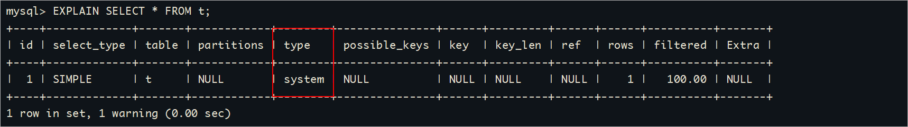

# 1 MySQL优化（索引优化）

## 1.1 优化简介

MySQL性能调优是指通过对MySQL数据库系统进行优化，以**提高其执行速度、响应时间和资源利用率**的过程。MySQL是一种常用的关系型数据库

管理系统，因此针对MySQL的性能调优主要集中在以下几个方面：

1、查询优化：通过分析和优化查询语句，包括使用合适的索引、避免全表扫描、优化JOIN操作等，以提高查询性能。

2、索引优化：合理设计和使用索引，包括选择合适的列作为索引、创建复合索引、删除不必要的索引等，以加快数据检索速度。

3、配置优化：调整MySQL的配置参数，如缓冲区大小、并发连接数、线程池大小等，以适应不同的工作负载和硬件环境。

4、内存管理：合理配置MySQL的内存使用，包括设置合适的缓冲池大小、排序缓冲区大小、临时表空间大小等，以提高内存利用率和减少磁盘IO。

5、存储引擎选择：根据应用需求选择合适的存储引擎，如InnoDB、MyISAM等，并针对不同存储引擎进行相应的优化。

6、数据库设计优化：合理设计数据库表结构、字段类型和关系，以减少数据冗余和提高查询效率。

以上只是MySQL性能调优的一些常见方面，具体的调优策略和方法需要根据具体情况进行分析和优化。通过综合考虑硬件、操作系统、网络和应用程序等因素，可以全面提升MySQL数据库的性能和可伸缩性。

## 1.2 性能分析（EXPLAIN）

### 1.2.1 EXPLAIN简介

查看SQL执行计划：使用EXPLAIN关键字可以**模拟优化器执行SQL查询语句**，从而知道MySQL是如何处理你的SQL语句的。分析你的查询语句或

是表结构的性能瓶颈。

**用法：**

```sql
EXPLAIN + SQL语句
```

### 1.2.2 数据准备

```sql
USE atguigudb;
 
CREATE TABLE t1(id INT(10) AUTO_INCREMENT, content VARCHAR(100) NULL, PRIMARY KEY (id));
CREATE TABLE t2(id INT(10) AUTO_INCREMENT, content VARCHAR(100) NULL, PRIMARY KEY (id));
CREATE TABLE t3(id INT(10) AUTO_INCREMENT, content VARCHAR(100) NULL, PRIMARY KEY (id));
CREATE TABLE t4(id INT(10) AUTO_INCREMENT, content1 VARCHAR(100) NULL, content2 VARCHAR(100) NULL, PRIMARY KEY (id));

CREATE INDEX idx_content1 ON t4(content1);  -- 创建普通索引

# 以下新增sql多执行几次，以便演示
INSERT INTO t1(content) VALUES(CONCAT('t1_',FLOOR(1+RAND()*1000)));
INSERT INTO t2(content) VALUES(CONCAT('t2_',FLOOR(1+RAND()*1000)));
INSERT INTO t3(content) VALUES(CONCAT('t3_',FLOOR(1+RAND()*1000)));
INSERT INTO t4(content1, content2) VALUES(CONCAT('t4_',FLOOR(1+RAND()*1000)), CONCAT('t4_',FLOOR(1+RAND()*1000)));
```

### 1.2.3 EXPLAIN结果字段说明

#### table

单表：显示这一行的数据是关于哪张表的

```sql
EXPLAIN SELECT * FROM t1;
```

 

多表：关联查询中，显示在执行计划第一行的是驱动表，第二行是被驱动表

```sql
EXPLAIN SELECT * FROM t1, t2 WHERE t1.id = t2.id;
```

  

#### id

在一个完整的查询语句中，每个SELECT关键字，都对应一个唯一的id。同时通过id也可以知道操作表的顺序。

**id相同：** 一个SELECT，id都是1 

```sql
EXPLAIN SELECT * FROM t1, t2, t3;
```

 

**id不同：**三个SELECT，id是1、2、3

```sql
EXPLAIN SELECT t1.id FROM t1 WHERE t1.id =(
  SELECT t2.id FROM t2 WHERE t2.id =(
    SELECT t3.id FROM t3 WHERE t3.content = 't3_479'
  )
);
```

 

**注意**：如果t3表查询无结果，则table列t1和t2处为NULL

 


**注意：**查询优化器可能对涉及子查询的语句进行优化，**转为连接查询**

```sql
EXPLAIN SELECT * FROM t1 WHERE content IN (SELECT content FROM t2 WHERE content = 'a');
```

 


**id为NULL：** 把t1和t2的查询结果合并，并创建名为<union1,2>的临时表，然后对结果去重 把t1和t2的查询结果合并

```sql
EXPLAIN SELECT * FROM t1 UNION SELECT * FROM t2;
```

 

因此包含UNION ALL的执行计划中就没有这条记录

```sql
EXPLAIN SELECT * FROM t1 UNION ALL SELECT * FROM t2;
```

 

1. UNION：使用UNION操作符时，会将多个SELECT语句的结果集合并，并去除重复的行。即，如果多个SELECT语句返回了相同的行，则只保留一行。

2. UNION ALL：使用UNION ALL操作符时，也会将多个SELECT语句的结果集合并，但不去除重复的行。即，如果多个SELECT语句返回了相同

   的行，则全部保留。

**小结：**

- id如果相同，可以认为是一组，`从上往下顺序执行`
- 在所有组中，`id值越大，越先执行`
- 关注点：每个id号码，表示一次独立的查询, `一个sql的查询趟数越少越好`

#### select_type

查询的类型，主要是用于区别普通查询、联合查询、子查询等的复杂查询。

**SIMPLE：**简单查询，查询中不包含子查询或者UNION。

```sql
EXPLAIN SELECT * FROM t1;
```

 


**PRIMARY：**主查询，查询中若包含子查询，则最外层查询被标记为PRIMARY。 

**SUBQUERY：**子查询，在SELECT或WHERE列表中包含了子查询。

```sql
EXPLAIN SELECT * FROM t3 WHERE id = ( SELECT id FROM t2 WHERE content= 'a');
```

 


 **DEPENDENT SUBQUREY：**如果包含了子查询，并且查询语句不能被优化器转换为连接查询，并且子查询是**相关子查询（子查询基于外部数据**

**列）**，则子查询就是DEPENDENT SUBQUREY。

```sql
EXPLAIN SELECT * FROM t3 WHERE id = ( SELECT id FROM t2 WHERE content = t3.content);
```

 


UNCACHEABLE SUBQUREY： 表示一个子查询（subquery）被标记为无法缓存。在某些数据库管理系统中，查询优化器会尝试将查询结果缓存起来

以提高性能，但对于被标记为UNCACHEABLE的子查询，查询优化器将不会缓存其结果。

```sql
EXPLAIN SELECT * FROM t3 WHERE id = ( SELECT id FROM t2 WHERE content = @@character_set_server);
```

 


**UNION：** 对于包含UNION或者UNION ALL的查询语句，除了最左边的查询是PRIMARY，其余的查询都是UNION。 

**UNION RESULT：** UNION会对查询结果进行查询去重，MYSQL会使用临时表来完成UNION查询的去重工作，针对这个临时表的查询就

是"UNION RESULT"。 

```sql
EXPLAIN 
SELECT * FROM t3 WHERE id = 1 
UNION  
SELECT * FROM t2 WHERE id = 1;
```

 

**DEPENDENT UNION：** 子查询中的UNION或者UNION ALL，除了最左边的查询是DEPENDENT SUBQUREY，其余的查询都是

DEPENDENT UNION。 

```sql
 EXPLAIN SELECT * FROM t1 WHERE content IN
 (
 SELECT content FROM t2 
 UNION 
 SELECT content FROM t3
 );
```

 


**DERIVED：** 在包含**派生表（子查询在from子句中）**的查询中，MySQL会递归执行这些子查询，把结果放在临时表里。

```sql
EXPLAIN SELECT * FROM (
   SELECT content, COUNT(*) AS c FROM t1 GROUP BY content
) AS derived_t1 WHERE c > 1;
```

这里的**<derived2>**就是在id为2的查询中产生的派生表。

 

#### type

type字段表示了查询操作的**访问类型**，用于描述查询引擎在执行查询时使用的访问方法。

**ALL：** 全表扫描，Full Table Scan，将遍历全表以找到匹配的行

```sql
EXPLAIN SELECT * FROM t1;
```

  

**index：**表示全索引扫描，即遍历整个索引树来获取结果，而**不需要回表**查找数据。

```sql
EXPLAIN SELECT content1 FROM t4;
```

 

```sql
EXPLAIN SELECT id FROM t1;
```

 


**range：** 只检索给定范围的行，使用一个索引来选择行。key 列显示使用了哪个索引，一般就是在你的where语句中出现了between、<、>、in等的查询。这种范围扫描索引扫描比全表扫描要好，因为它只需要开始于索引的某一点，而结束于另一点，不用扫描全部索引。 

```sql
EXPLAIN SELECT * FROM t1 WHERE id > 2;
```

 

**ref：** 表示使用了非唯一索引进行的等值比较，可能返回多个匹配的行。

```sql
EXPLAIN SELECT * FROM t4 WHERE content1 = 'a';
```

  


**eq_ref：**表示使用了连接（join）查询，并且连接条件是通过唯一索引进行的等值比较。

```sql
EXPLAIN SELECT * FROM t1, t2 WHERE t1.id = t2.id;
```

  


**system**：表示只有一行数据的表，这是最快的访问方式。

```sql
CREATE TABLE t(i int) Engine=MyISAM;
INSERT INTO t VALUES(1);
EXPLAIN SELECT * FROM t;
```

  


#### possible_keys 和 key

1、possible_keys表示执行查询时可能用到的索引，一个或多个。 查询涉及到的字段上若存在索引，则该索引将被列出，但不一定被查询实际使用。

2、keys表示实际使用的索引。如果为NULL，则没有使用索引。

```sql
EXPLAIN SELECT id FROM t1 WHERE id = 1;
```

 


#### key_len 

表示索引使用的字节数，根据这个值可以判断索引的使用情况，`检查是否充分利用了索引，针对联合索引值越大越好。`

**如何计算：**

1、先看索引上字段的类型。比如：int=4 ; varchar(20) =20 ; char(20) =20

2、如果是varchar或者char这种字符串字段，视字符集要乘不同的值，比如utf8要乘 3(MySQL5.7)，如果是utf8mb4要乘4，GBK要乘2

3、varchar这种动态字符串要加2个字节

4、允许为空的字段要加1个字节


```sql
CREATE TABLE `t_emp` (
  `id` INT(11) NOT NULL AUTO_INCREMENT,
  `empno` INT NOT NULL ,					-- 可以使用随机数字，或者从1开始的自增数字，不允许重复
  `name` VARCHAR(20) DEFAULT NULL,  		-- 随机生成，允许姓名重复 20 * 4 + 2 + 1= 83
  `age` INT(3) DEFAULT NULL,				-- 区间随机数  4 + 1
  `deptId` INT(11) DEFAULT NULL,			-- 1-1w之间随机数
  PRIMARY KEY (`id`)
) ENGINE=INNODB AUTO_INCREMENT=1;

-- 创建索引
CREATE INDEX idx_age_name ON t_emp(age, `name`);

-- 测试1
EXPLAIN SELECT * FROM t_emp WHERE age = 30 AND `name` = 'ab%';

-- 测试2
EXPLAIN SELECT * FROM t_emp WHERE age = 30;
```

 

#### ref

ref字段表示连接操作中使用的索引列。

**const：**  与索引列进行等值比较的东西是啥，const表示一个常数

```sql
EXPLAIN SELECT * FROM t4 WHERE content1 = 'a';
```

 

**ref=atguigudb.t1.id**   关联查询时出现，t2表和t1表的哪一列进行关联

```sql
EXPLAIN SELECT * FROM t1, t2 WHERE t1.id = t2.id;
```

  


#### rows

rows字段的值是一个估计值，表示查询操作在执行时**可能会扫描的行数**。这个估计值是根据统计信息和查询优化器的算法得出的，并不是实际执行时的准确值。它可以用来帮助我们评估查询的性能和效率。rows字段的值越小越好!

```sql
-- 如果是全表扫描，rows的值就是表中数据的估计行数
EXPLAIN SELECT * FROM t_emp WHERE empno = '100001';

-- 如果是使用索引查询，rows的值就是预计扫描索引记录行数
EXPLAIN SELECT * FROM t_emp WHERE deptId = 1;
```

 


#### filtered

最后查询出来的数据占所有服务器端（server）检查行数（rows）的百分比。值越大越好。


#### Extra

Extra字段提供了一些与查询操作相关的**附加信息**，帮助我们更好地理解查询的执行过程和性能特点。MySQL提供的额外信息有好几十个，这里只挑

比较重要的介绍。

**Impossible WHERE**：where子句的值总是false

```sql
EXPLAIN SELECT * FROM t_emp WHERE 1 != 1;
```

  


**Using where：** 使用了where，但在where上有字段没有创建索引。也可以理解为如果数据从引擎层被返回到server层进行过滤，那么就是Using 

where。

```sql
EXPLAIN SELECT * FROM t_emp WHERE `name` = '风清扬';
```

  


**Using filesort**：在对查询结果中的记录进行排序时，是可以使用索引的，如下所示：

```sql
EXPLAIN SELECT * FROM t1 ORDER BY id;
```

 

如果排序操作无法使用到索引，只能在内存中（记录较少时）或者磁盘中（记录较多时）进行排序（filesort），如下所示：

```sql
EXPLAIN SELECT * FROM t1 ORDER BY content;
```

 


**Using index：** **使用了覆盖索引**，表示直接访问索引就足够获取到所需要的数据，不需要通过索引回表

```sql
 EXPLAIN SELECT id, content1 FROM t4;
```

  

**Using index condition**: 叫作Index Condition Pushdown Optimization （**索引下推优化**）

```sql
-- content1列上有索引idx_content1
EXPLAIN SELECT * FROM t4 WHERE content1 > 'z' AND content1 LIKE '%a';
```

>1、`如果没有索引下推（ICP）`，那么MySQL在存储引擎层找到满足`content1 > 'z'`条件的第一条二级索引记录。`主键值进行回表`，返回完整的记录给server层，server层再判断其他的搜索条件是否成立。如果成立则保留该记录，否则跳过该记录。
>
>2、`如果使用了索引下推（ICP）`，那么MySQL在存储引擎层找到满足`content1 > 'z'`条件的第一条二级索引记录。`不着急执行回表`，而是在这
>
>条记录上先判断一下所有关于`idx_content1`索引中包含的条件是否成立，也就是`content1 > 'z' AND content1 LIKE '%a'`是否成立。如果
>
>这些条件不成立，则直接跳过该二级索引记录，去找下一条二级索引记录；如果这些条件成立，则执行回表操作，返回完整的记录给server层。

  

**注意：** 如果这里的查询条件`只有content1 > 'z'`，那么找到满足条件的索引后也会进行一次索引下推的操作，判断content1 > 'z'是否成立（这是源

码中为了编程方便做的冗余判断）

 


# 2 MySQL索引失效场景

## 2.1 数据准备

### 2.1.1 表结构说明

在做优化之前，要准备大量数据。接下来创建两张表，并往员工表里插入50W数据，部门表中插入1W条数据。

怎么快速插入50w条数据呢? 

1、使用jdbc程序

2、使用存储过程

怎么保证插入的数据不重复? 函数

```sql
CREATE TABLE `dept` (
  `id` INT(11) NOT NULL AUTO_INCREMENT,
  `deptName` VARCHAR(30) DEFAULT NULL,		-- 随机字符串，允许重复
  `address` VARCHAR(40) DEFAULT NULL,		-- 随机字符串，允许重复
  ceo INT NULL ,							-- 1-50w之间的任意数字
  PRIMARY KEY (`id`)
) ENGINE=INNODB AUTO_INCREMENT=1;

CREATE TABLE `emp` (
  `id` INT(11) NOT NULL AUTO_INCREMENT,
  `empno` INT NOT NULL ,					-- 可以使用随机数字，或者从1开始的自增数字，不允许重复
  `name` VARCHAR(20) DEFAULT NULL,  		-- 随机生成，允许姓名重复
  `age` INT(3) DEFAULT NULL,				-- 区间随机数
  `deptId` INT(11) DEFAULT NULL,			-- 1-1w之间随机数
  PRIMARY KEY (`id`)
  #CONSTRAINT `fk_dept_id` FOREIGN KEY (`deptId`) REFERENCES `t_dept` (`id`)
) ENGINE=INNODB AUTO_INCREMENT=1;
```

总结： 需要产生随机字符串和区间随机数的函数。 

### 2.1.2 随机函数

在MySQL中提供了很多的随机数函数，如下所示：

1、rand()：rand()函数返回一个0到1之间的随机浮点数。

2、rand(n)：rand(n)函数接受一个种子值n，并返回一个0到1之间的随机浮点数。当使用相同的种子值n时，rand(n)将会生成相同的随机数序列。

3、uuid()：uuid()函数用于生成一个通用唯一标识符（Universally Unique Identifier），也就是一个随机的字符串。

使用方式如下所示：

```sql
SELECT RAND(); 				-- 返回一个0到1之间的随机浮点数
SELECT FLOOR(RAND() * 10); 	-- 返回一个0到9之间的随机整数
SELECT UUID(); 				-- 返回一个随机的唯一标识符
```


自定义生成随机数的函数：

```sql
-- 查看mysql是否允许创建函数：
SHOW VARIABLES LIKE 'log_bin_trust_function_creators';
SET GLOBAL log_bin_trust_function_creators=1; 				-- 命令开启：允许创建函数设置：（global-所有session都生效）

-- 随机产生字符串
DELIMITER $$  -- 将分隔符设置为"$$"，以便在自定义函数中使用多个语句。
CREATE FUNCTION rand_string(n INT) RETURNS VARCHAR(255)  -- n表示的随机字符串的长度 
BEGIN    
  DECLARE chars_str VARCHAR(100) DEFAULT 'abcdefghijklmnopqrstuvwxyzABCDEFJHIJKLMNOPQRSTUVWXYZ';
  DECLARE return_str VARCHAR(255) DEFAULT '';
  DECLARE i INT DEFAULT 0;
  WHILE i < n DO  
    SET return_str = CONCAT(return_str,SUBSTRING(chars_str,FLOOR(1+RAND()*52),1));  
    SET i = i + 1;
  END WHILE;
  RETURN return_str;
END $$

-- 假如要删除
-- drop function rand_string;


-- 用于随机产生区间数字
DELIMITER $$
CREATE FUNCTION rand_num (from_num INT ,to_num INT) RETURNS INT(11)
BEGIN   
 DECLARE i INT DEFAULT 0;  
 SET i = FLOOR(from_num +RAND()*(to_num - from_num + 1));
RETURN i;  
END$$

-- 假如要删除
-- drop function rand_num;
```

### 2.1.3 存储过程

#### 存储过程简介

存储过程（Stored Procedure）是一组**预编译的SQL语句集合**，它们被命名并存储在数据库中，可以像调用函数一样被应用程序或其他存储过程调

用。存储过程通常用于**执行特定的业务逻辑操作**，并且可以接受参数、返回结果。

存储过程具有以下特点：

1、封装性：存储过程将一系列SQL语句封装在一个单独的代码块中，使得这些SQL语句可以作为一个整体进行管理和调用。

2、可重用性：存储过程可以被多个应用程序或其他存储过程调用，提高了代码的复用性。

3、安全性：存储过程可以设置访问权限，只允许授权用户或角色执行，从而保护数据的安全性。

4、性能优化：存储过程在数据库服务器端执行，减少了网络传输开销，提高了查询性能。

存储过程可以完成复杂的业务逻辑，包括数据处理、事务管理、错误处理等。它们还可以通过输入参数和输出参数与应用程序进行交互，实现更灵活

和可定制的数据操作。

#### 创建存储过程

```sql
-- 插入员工数据
DELIMITER $$			-- 将分隔符设置为"$$"，以便在存储过程中使用多个语句。
CREATE PROCEDURE  insert_emp(START INT, max_num INT)
BEGIN  
  DECLARE i INT DEFAULT 0;   
  SET autocommit = 0;   -- 将自动提交事务的选项设置为0，即关闭自动提交。
  REPEAT  				-- REPEAT ... END REPEAT; ：开始一个循环，循环结束条件是`i = max_num`，每次循环`i`递增1。
    SET i = i + 1;  
    INSERT INTO emp (empno, NAME, age, deptid ) VALUES ((START+i) ,rand_string(6), rand_num(30,50), rand_num(1,10000));  
    UNTIL i = max_num  
  END REPEAT;  
  COMMIT;  
END$$
 
-- 删除
-- drop PROCEDURE insert_emp;


-- 插入部门数据
DELIMITER $$
CREATE PROCEDURE insert_dept(max_num INT)
BEGIN  
  DECLARE i INT DEFAULT 0;   
  SET autocommit = 0;    
  REPEAT  
    SET i = i + 1;  
    INSERT INTO dept ( deptname,address,ceo ) VALUES (rand_string(8),rand_string(10),rand_num(1,500000));  
    UNTIL i = max_num  
  END REPEAT;  
  COMMIT;  
END$$
 
-- 删除
-- DELIMITER ;
-- drop PROCEDURE insert_dept;
```

#### 调用存储过程

```sql
-- 执行存储过程，往dept表添加1万条数据
CALL insert_dept(10000); 

-- 执行存储过程，往emp表添加50万条数据，编号从100000开始
CALL insert_emp(100000,500000); 
```

#### 开启SQL执行时间的显示

为了方便后面的测试中随时查看SQL运行的时间，测试索引优化后的效果，我们开启profiling

```sql
-- 显示sql语句执行时间
SET profiling = 1;
SHOW VARIABLES  LIKE '%profiling%';
SHOW PROFILES;
```

## 2.2 单表索引失效案例

MySQL中提高性能的一个最有效的方式是对数据表**设计合理的索引**。索引提供了高效访问数据的方法，并且加快查询的速度，因此索引对查询的速度

有着至关重要的影响。

我们创建索引后，用不用索引，最终是优化器说了算。**优化器会基于开销选择索引，怎么开销小就怎么来**。不是基于规则，也不是基于语义。

另外SQL语句是否使用索引，和数据库的版本、数据量、数据选择度（查询中选择的列数）运行环境都有关系。

```sql
-- 创建索引
CREATE INDEX idx_name ON emp(`name`);
```

### 2.2.1 计算、函数导致索引失效

```sql
-- 显示查询分析
EXPLAIN SELECT * FROM emp WHERE emp.name  LIKE 'abc%';
EXPLAIN SELECT * FROM emp WHERE LEFT(emp.name,3) = 'abc'; -- 索引失效
```

执行结果如下所示：

 

### 2.2.2 LIKE以%开头索引失效

```sql
EXPLAIN SELECT * FROM emp WHERE name LIKE '%ab%'; -- 索引失效
```

执行结果如下所示：

 

注意：Alibaba《Java开发手册》【强制】页面搜索严禁左模糊或者全模糊，如果需要请走搜索引擎来解决。

### 2.2.3 不等于(!= 或者<>)索引失效

```sql
EXPLAIN SELECT * FROM emp WHERE emp.name = 'abc' ;
EXPLAIN SELECT * FROM emp WHERE emp.name <> 'abc' ; -- 索引失效
```

执行结果如下所示：

 

### 2.2.4 IS NOT NULL 和 IS NULL

```sql
EXPLAIN SELECT * FROM emp WHERE emp.name IS NULL;
EXPLAIN SELECT * FROM emp WHERE emp.name IS NOT NULL; -- 索引失效
```

执行结果如下所示：

 

**注意：** 当数据库中的数据的**索引列的NULL值达到比较高的比例的时候**，即使在IS NOT NULL 的情况下 MySQL的查询优化器会选择使用索引，

此时**type的值是range（范围查询）**

```sql
-- 将 id>20000 的数据的 name 值改为 NULL
UPDATE emp SET `name` = NULL WHERE `id` > 20000;

-- 执行查询分析，可以发现 IS NOT NULL 使用了索引
-- 具体多少条记录的值为NULL可以使索引在IS NOT NULL的情况下生效，由查询优化器的算法决定
EXPLAIN SELECT * FROM emp WHERE emp.name IS NOT NULL;
```

执行结果如下所示：

 


**测试完将name的值改回来**

```sql
UPDATE emp SET `name` = rand_string(6) WHERE `id` > 20000;
```

### 2.2.5 类型转换导致索引失效

```sql
EXPLAIN SELECT * FROM emp WHERE name='123'; 
EXPLAIN SELECT * FROM emp WHERE name= 123; -- 索引失效
```

执行结果如下所示：

 

### 2.2.6 全索引匹配效率最高

```sql
-- 删除之前在emp表上的创建的索引
drop index idx_name on emp ;
```

**问题**： 为以下查询语句创建哪种索引效率最高

```sql
-- 查询分析
EXPLAIN SELECT * FROM emp WHERE emp.age = 30 and deptid = 4 AND emp.name = 'abcd';
-- 执行SQL
SELECT * FROM emp WHERE emp.age = 30 and deptid = 4 AND emp.name = 'abcd';
-- 查看执行时间
SHOW PROFILES;
```

**创建索引并重新执行以上测试：**

```sql
-- 创建索引：分别创建以下三种索引的一种，并分别进行以上查询分析
CREATE INDEX idx_age ON emp(age);
CREATE INDEX idx_age_deptid ON emp(age,deptid);
CREATE INDEX idx_age_deptid_name ON emp(age,deptid,`name`);
```

结论： 可以发现最高效的查询应用了联合索引idx_age_deptid_name

 

### 2.2.7 违背了最佳左前缀法则

**准备：**

```sql
-- 首先删除之前创建的索引
drop index idx_age ON emp ;
drop index idx_age_deptid ON emp ;
drop index idx_age_deptid_name ON emp ;

-- 创建索引
CREATE INDEX idx_age_deptid_name ON emp(age,deptid,`name`);
```

问题： 以下这些SQL语句能否命中idx_age_deptid_name 索引，可以匹配多少个索引字段

**测试：**

1、如果索引了多列，要遵守最左前缀法则。即查询**从索引的最左前列开始并且不跳过索引中的列**。

2、过滤条件要使用索引，必须按照**索引建立时的顺序，依次满足**，一旦跳过某个字段，索引后面的字段都无法被使用。

```sql
EXPLAIN SELECT * FROM emp WHERE emp.age=30 AND emp.name = 'abcd' ;
-- EXPLAIN结果：
-- key_len：5 只使用了age索引
-- 索引查找的顺序为 age、deptid、name，查询条件中不包含deptid，无法使用deptid和name索引

EXPLAIN SELECT * FROM emp WHERE emp.deptid=1 AND emp.name = 'abcd';
-- EXPLAIN结果：
-- type： ALL， 执行了全表扫描
-- key_len： NULL， 索引失效
-- 索引查找的顺序为 age、deptid、name，查询条件中不包含age，无法使用整个索引

EXPLAIN SELECT * FROM emp WHERE emp.age = 30 AND emp.deptid=1 AND emp.name = 'abcd';
-- EXPLAIN结果：
-- 索引查找的顺序为 age、deptid、name，匹配所有索引字段

EXPLAIN SELECT * FROM emp WHERE emp.deptid=1 AND emp.name = 'abcd' AND emp.age = 30;
-- EXPLAIN结果：
-- 索引查找的顺序为 age、deptid、name，匹配所有索引字段
```

### 2.2.8 索引中范围条件右边的列失效

**准备：**

```sql
-- 首先删除之前创建的索引
drop index idx_age_deptid_name ON emp ;
```

问题：为以下查询语句创建哪种索引效率最高

```sql
EXPLAIN SELECT * FROM emp WHERE emp.age=30 AND emp.deptId > 1000 AND emp.name = 'abc'; 
```

**测试1：**

```sql
-- 创建索引并执行以上SQL语句的EXPLAIN
CREATE INDEX idx_age_deptid_name ON emp(age,deptid,`name`);
-- key_len：10， 只是用了 age 和 deptid索引，name失效
```

**测试2**：

```sql
-- 创建索引并执行以上SQL语句的EXPLAIN（将deptid索引的放在最后）
CREATE INDEX idx_age_name_deptid ON emp(age,`name`,deptid);

-- 使用了完整的索引
```

执行结果如下所示：

 

补充：以上两个索引都存在的时候，MySQL优化器会自动选择最好的方案

# 3 MySQL关联查询优化

## 3.1 数据准备

创建两张表，并分插入16条和20条数据：

```sql
-- 分类
CREATE TABLE IF NOT EXISTS `class` (
`id` INT(10) UNSIGNED NOT NULL AUTO_INCREMENT,
`card` INT(10) UNSIGNED NOT NULL,
PRIMARY KEY (`id`)
);
-- 图书
CREATE TABLE IF NOT EXISTS `book` (
`bookid` INT(10) UNSIGNED NOT NULL AUTO_INCREMENT,
`card` INT(10) UNSIGNED NOT NULL,
PRIMARY KEY (`bookid`)
);
 
-- 插入16条记录
INSERT INTO class(card) VALUES(FLOOR(1 + (RAND() * 20)));
INSERT INTO class(card) VALUES(FLOOR(1 + (RAND() * 20)));
INSERT INTO class(card) VALUES(FLOOR(1 + (RAND() * 20)));
INSERT INTO class(card) VALUES(FLOOR(1 + (RAND() * 20)));
INSERT INTO class(card) VALUES(FLOOR(1 + (RAND() * 20)));
INSERT INTO class(card) VALUES(FLOOR(1 + (RAND() * 20)));
INSERT INTO class(card) VALUES(FLOOR(1 + (RAND() * 20)));
INSERT INTO class(card) VALUES(FLOOR(1 + (RAND() * 20)));
INSERT INTO class(card) VALUES(FLOOR(1 + (RAND() * 20)));
INSERT INTO class(card) VALUES(FLOOR(1 + (RAND() * 20)));
INSERT INTO class(card) VALUES(FLOOR(1 + (RAND() * 20)));
INSERT INTO class(card) VALUES(FLOOR(1 + (RAND() * 20)));
INSERT INTO class(card) VALUES(FLOOR(1 + (RAND() * 20)));
INSERT INTO class(card) VALUES(FLOOR(1 + (RAND() * 20)));
INSERT INTO class(card) VALUES(FLOOR(1 + (RAND() * 20)));
INSERT INTO class(card) VALUES(FLOOR(1 + (RAND() * 20)));
 
-- 插入20条记录
INSERT INTO book(card) VALUES(FLOOR(1 + (RAND() * 20)));
INSERT INTO book(card) VALUES(FLOOR(1 + (RAND() * 20)));
INSERT INTO book(card) VALUES(FLOOR(1 + (RAND() * 20)));
INSERT INTO book(card) VALUES(FLOOR(1 + (RAND() * 20)));
INSERT INTO book(card) VALUES(FLOOR(1 + (RAND() * 20)));
INSERT INTO book(card) VALUES(FLOOR(1 + (RAND() * 20)));
INSERT INTO book(card) VALUES(FLOOR(1 + (RAND() * 20)));
INSERT INTO book(card) VALUES(FLOOR(1 + (RAND() * 20)));
INSERT INTO book(card) VALUES(FLOOR(1 + (RAND() * 20)));
INSERT INTO book(card) VALUES(FLOOR(1 + (RAND() * 20)));
INSERT INTO book(card) VALUES(FLOOR(1 + (RAND() * 20)));
INSERT INTO book(card) VALUES(FLOOR(1 + (RAND() * 20)));
INSERT INTO book(card) VALUES(FLOOR(1 + (RAND() * 20)));
INSERT INTO book(card) VALUES(FLOOR(1 + (RAND() * 20)));
INSERT INTO book(card) VALUES(FLOOR(1 + (RAND() * 20)));
INSERT INTO book(card) VALUES(FLOOR(1 + (RAND() * 20)));
INSERT INTO book(card) VALUES(FLOOR(1 + (RAND() * 20)));
INSERT INTO book(card) VALUES(FLOOR(1 + (RAND() * 20)));
INSERT INTO book(card) VALUES(FLOOR(1 + (RAND() * 20)));
INSERT INTO book(card) VALUES(FLOOR(1 + (RAND() * 20)));
```

## 3.2 左外连接

没有创建索引前的测试： 进行了进行了全表扫描，查询次数为16*20

```sql
EXPLAIN SELECT * FROM class LEFT JOIN book ON class.card = book.card;
-- 左表class：驱动表、右表book：被驱动表
```

执行结果如下所示：

 


**测试1：**在驱动表上创建索引：进行了全索引扫描，查询次数是16*20

```sql
-- 创建索引
CREATE INDEX idx_class_card ON class(card);
```

执行结果如下所示：

 


**测试2：** 在被驱动表上创建索引：可以避免全表扫描，查询次数是16*1

```sql
-- 首先删除之前创建的索引
drop index idx_class_card on class ;

-- 创建索引
CREATE INDEX idx_book_card ON book(card);
```

执行结果如下所示：

 


**测试3：**同时给两张表添加索引：充分利用了索引，查询次数是16*1

```sql
-- 已经有了book索引
CREATE INDEX idx_class_card ON class(card);
```

执行结果如下所示：

 

结论：针对两张表的连接条件涉及的列，索引要创建在被驱动表上，驱动表尽量是小表

## 3.3 内连接

**测试：**将前面外连接中的LEFT JOIN 变成 INNER JOIN 

```sql
-- 换成inner join
EXPLAIN SELECT * FROM class INNER JOIN book ON class.card=book.card;

-- 交换class和book的位置
EXPLAIN SELECT * FROM book INNER JOIN class ON class.card=book.card;
```

**都有索引的情况下：** 查询优化器自动选择数据量小的表做为驱动表 

 


**class表有索引的情况下：** book表是驱动表

 


**book表有索引的情况下**： class表是驱动表

 


**都没有索引的情况下：** 选择数据量小的表做为驱动表

 


**结论：** 

1、发现即使交换表的位置，MySQL优化器也会自动选择驱动表。

2、自动选择驱动表的原则是：索引创建在被驱动表上，驱动表是小表。 


## 3.4 查询方式选择

**准备**：准备数据库表以及相关的数据

```sql
CREATE TABLE `t_dept` (
 `id` INT NOT NULL AUTO_INCREMENT,
 `deptName` VARCHAR(30) DEFAULT NULL,
 `address` VARCHAR(40) DEFAULT NULL,
 PRIMARY KEY (`id`)
);
 
CREATE TABLE `t_emp` (
 `id` INT NOT NULL AUTO_INCREMENT,
 `name` VARCHAR(20) DEFAULT NULL,
 `age` INT DEFAULT NULL,
 `deptId` INT DEFAULT NULL,
`empno` INT NOT NULL,
 PRIMARY KEY (`id`),
 KEY `idx_dept_id` (`deptId`)
 #CONSTRAINT `fk_dept_id` FOREIGN KEY (`deptId`) REFERENCES `t_dept` (`id`)
);

INSERT INTO t_dept(id,deptName,address) VALUES(1,'华山','华山');
INSERT INTO t_dept(id,deptName,address) VALUES(2,'丐帮','洛阳');
INSERT INTO t_dept(id,deptName,address) VALUES(3,'峨眉','峨眉山');
INSERT INTO t_dept(id,deptName,address) VALUES(4,'武当','武当山');
INSERT INTO t_dept(id,deptName,address) VALUES(5,'明教','光明顶');
INSERT INTO t_dept(id,deptName,address) VALUES(6,'少林','少林寺');

INSERT INTO t_emp(id,NAME,age,deptId,empno) VALUES(1,'风清扬',90,1,100001);
INSERT INTO t_emp(id,NAME,age,deptId,empno) VALUES(2,'岳不群',50,1,100002);
INSERT INTO t_emp(id,NAME,age,deptId,empno) VALUES(3,'令狐冲',24,1,100003);

INSERT INTO t_emp(id,NAME,age,deptId,empno) VALUES(4,'洪七公',70,2,100004);
INSERT INTO t_emp(id,NAME,age,deptId,empno) VALUES(5,'乔峰',35,2,100005);

INSERT INTO t_emp(id,NAME,age,deptId,empno) VALUES(6,'灭绝师太',70,3,100006);
INSERT INTO t_emp(id,NAME,age,deptId,empno) VALUES(7,'周芷若',20,3,100007);

INSERT INTO t_emp(id,NAME,age,deptId,empno) VALUES(8,'张三丰',100,4,100008);
INSERT INTO t_emp(id,NAME,age,deptId,empno) VALUES(9,'张无忌',25,5,100009);
INSERT INTO t_emp(id,NAME,age,deptId,empno) VALUES(10,'韦小宝',18,NULL,100010);

-- 给t_dept表添加ceo字段，该字段的值为t_emp表的id
ALTER TABLE t_dept ADD CEO INT(11);
UPDATE t_dept SET CEO=2 WHERE id=1;
UPDATE t_dept SET CEO=4 WHERE id=2;
UPDATE t_dept SET CEO=6 WHERE id=3;
UPDATE t_dept SET CEO=8 WHERE id=4;
UPDATE t_dept SET CEO=9 WHERE id=5;
```


需求：查询每一个人物所对应的掌门人名称

**方式一：**三表左连接方式

```sql
-- 员工表(t_emp)、部门表(t_dept)、ceo(t_emp)表 关联查询
EXPLAIN SELECT emp.name, ceo.name AS ceoname 
FROM t_emp emp
LEFT JOIN t_dept dept ON emp.deptid = dept.id 
LEFT JOIN t_emp ceo ON dept.ceo = ceo.id;
```

执行结果如下所示：

 

一趟查询，用到了主键索引，**效果最佳**


**方式二**：子查询方式

```sql
explain SELECT 
emp.name, 
(SELECT ceo.name FROM t_emp ceo WHERE ceo.id = dept.ceo) AS ceoname
FROM t_emp emp
LEFT JOIN t_dept dept ON emp.deptid = dept.id;
```

执行结果如下所示：

 

两趟查询，用到了主键索引，跟第一种比，效果稍微差点。


**方式三：**临时表连接方式1

```sql
EXPLAIN SELECT emp_with_ceo_id.name, emp.name AS ceoname FROM 
-- 查询所有员工及对应的ceo的id
( 
SELECT emp.name, dept.ceo 
FROM t_emp emp 
LEFT JOIN t_dept dept ON emp.deptid = dept.id 
) emp_with_ceo_id
LEFT JOIN t_emp emp ON emp_with_ceo_id.ceo = emp.id;
```

执行结果如下所示：

 

查询一趟，**MySQL查询优化器将衍生表查询转换成了连接表查询**，速度堪比第一种方式


**方式三：**临时表连接方式2

```sql
explain SELECT emp.name, ceo.ceoname FROM t_emp emp LEFT JOIN
( 
SELECT emp.deptId AS deptId, emp.name AS ceoname 
FROM t_emp emp 
INNER JOIN t_dept dept ON emp.id = dept.ceo 
) ceo
ON emp.deptId = ceo.deptId;

-- 查询并创建临时表ceo：包含ceo的部门id和ceo的name
```

执行结果如下所示：

 

查询一趟，MySQL查询优化器将衍生表查询转换成了连接表查询，但是只有一个表使用了索引，数据检索的次数稍多，性能最差。


**总结**：**能够直接多表关联的尽量直接关联，不用子查询。(减少查询的趟数)**


# 4 MySQL子查询优化

需求：查询非掌门人的信息

**方式一：**

```sql
-- 查询员工，这些员工的id没在（掌门人id列表中）
-- 【查询不是CEO的员工】
explain SELECT * FROM t_emp emp WHERE emp.id NOT IN 
(SELECT dept.ceo FROM t_dept dept WHERE dept.ceo IS NOT NULL);
```

执行结果如下所示：

 


**方式二：**

```sql
-- 推荐
explain SELECT emp.* FROM t_emp emp LEFT JOIN t_dept dept ON emp.id = dept.ceo WHERE dept.id IS NULL;
```

执行结果如下所示：

 

也可以为ceo添加一个索引字段：

 

**结论：** 尽量不要使用NOT IN 或者 NOT EXISTS，用LEFT JOIN xxx ON xx = xx WHERE xx IS NULL替代 

# 5 MySQL排序优化

## 5.1 排序索引失效情况

### 5.1.1 无过滤不索引

准备工作：

```sql
-- 删除emp表中的所有的索引
-- 创建新的索引结构
CREATE INDEX idx_age_deptid_name ON emp (age,deptid,`name`);
```

sql演示：

```sql
-- 没有使用索引：
EXPLAIN SELECT * FROM emp ORDER BY age,deptid;

-- 使用了索引：order by想使用索引，必须有过滤条件，索引才能生效，limit也可以看作是过滤条件
EXPLAIN SELECT * FROM emp ORDER BY age,deptid LIMIT 10; 
```

执行结果如下所示：

 

### 5.1.2 顺序错不索引

sql演示：

```sql
-- 排序使用了索引：
-- 注意：key_len = 5是where语句使用age索引的标记，order by语句使用索引不在key_len中体现。
-- order by语句如果没有使用索引，在extra中会出现using filesort。                  
EXPLAIN SELECT * FROM emp WHERE age=45 ORDER BY deptid;

-- 排序使用了索引：
EXPLAIN SELECT * FROM emp WHERE age=45 ORDER BY deptid, `name`; 

-- 排序没有使用索引：因为索引列中不存在empno
EXPLAIN SELECT * FROM emp WHERE age=45 ORDER BY deptid, empno;

-- 排序没有使用索引：order by 后的排序条件的顺序，与索引顺序不一致
EXPLAIN SELECT * FROM emp WHERE age=45 ORDER BY `name`, deptid;

-- 排序没有使用索引：出现的顺序要和复合索引中的列的顺序一致！
EXPLAIN SELECT * FROM emp WHERE deptid=45 ORDER BY age;
```

### 5.1.3 方向反不索引

sql演示：

```sql
-- 排序使用了索引：排序条件和索引一致，并方向相同，可以使用索引
EXPLAIN SELECT * FROM emp WHERE age=45 ORDER BY deptid DESC, `name` DESC;

-- 没有使用索引：两个排序条件方向相反
EXPLAIN SELECT * FROM emp WHERE age=45 ORDER BY deptid ASC, `name` DESC;
```

## 5.2 索引优化案例

排序优化的目的是，去掉 Extra 中的 using filesort

**准备**：

```sql
-- 删除emp表中之前所创建的所有的索引
-- 这个例子结合 show profiles; 查看运行时间
SET profiling = 1;
```

**需求：** 查询 年龄为30岁的，且员工编号小于101000的用户，按用户名称排序 

**测试1：** 很显然，type 是 ALL，即最坏的情况。Extra 里还出现了 Using filesort,也是最坏的情况。优化是必须的。

sql演示：

```sql
-- 查询 年龄为30岁的，且员工编号小于101000的用户，按用户名称排序 
explain select * from t_emp emp where emp.age = 30 and emp.empno < 101000 order BY emp.`name` ;
```

性能测试结果：

 

执行计划结果如下所示：

 


**优化思路：** 尽量让where的过滤条件和排序使用上索引

**step1：** 我们建一个三个字段的组合索引可否?

```sql
CREATE INDEX idx_age_empno_name ON t_emp (age,empno,`name`);
```

最后的name索引没有用到，出现了Using filesort。原因是，因为empno是一个范围过滤，所以索引后面的字段不会再使用索引了。所以我们建一个3

值索引是没有意义的。

性能测试结果：

  

执行计划结果如下所示：

 


**step2：** 那么我们先删掉这个索引：

```sql
DROP INDEX idx_age_empno_name ON t_emp;
```

为了去掉filesort我们可以把索引建成，也就是说empno 和name这个两个字段我只能二选其一。

```sql
CREATE INDEX idx_age_name ON t_emp(age,`name`);
```

这样我们优化掉了 using filesort。但是经过测试，性能反而下降

性能测试：

  

执行计划结果如下所示：

 


**step3：**如果我们选择那个范围过滤，而放弃排序上的索引呢? 

```sql
DROP INDEX idx_age_name ON t_emp;
CREATE INDEX idx_age_empno ON t_emp(age,empno);
```

性能测试：

 

执行计划结果如下所示：

 

执行原始的sql语句，查看性能，结果竟然有 filesort的 sql 运行速度，超过了已经优化掉 filesort的 sql，何故？

**原因：** 所有的**排序都是在条件过滤之后才执行的**，所以，如果条件过滤掉大部分数据的话，剩下几百几千条数据进行排序其实并不是很消耗性能，

即使索引优化了排序，但实际提升性能很有限。  相对的**empno < 101000** 这个条件，如果没有用到索引的话，要对几万条的数据进行扫描，这是非常消耗性能的，所以索引放在这个字段上性价比最高，是最优选择。


**结论：** 当【范围条件】和【group by 或者 order by】的字段出现二选一时，**优先观察条件字段的过滤数量，如果过滤的数据足够多，而需要排序的数据并不多时，优先把索引放在范围字段上**。也可以将选择权交给MySQL：索引同时存在，mysql自动选择最优的方案：（对于这个例子，

mysql选择idx_age_empno），但是，随着数据量的变化，选择的索引也会随之变化的。


## 5.3 双路排序和单路排序

如果排序没有使用索引，引起了filesort，那么filesort有两种算法

1、双路排序

2、单路排序

### 5.3.1 双路排序

 

原理：**第一遍扫描出需要排序的字段，然后进行排序后，根据排序结果，第二遍再扫描一下需要select的列数据。**这样会引起大量的随机IO，

效率不高，但是节约内存。排序使用quick sort，但是如果内存不够则会按照block进行排序，将排序结果写入磁盘文件，然后再将结果合并。

具体过程：

1、读取所有满足条件的记录。

2、对于每一行，存储一对值到缓冲区（排序列，行记录指针），一个是排序的索引列的值，即order by用到的列值，和指向该行数据的行指针。

3、当缓冲区满后，运行一个快速排序（qsort）来将缓冲区中数据排序，并将排序完的数据存储到一个临时文件，并保存一个存储块的指针，当然如果缓冲区不满，则不会创建临时文件了。

4、重复以上步骤，直到将所有行读完，并建立相应的有序的临时文件。

5、对块级进行排序，这个类似于归并排序算法，只通过两个临时文件的指针来不断交换数据，最终达到两个文件，都是有序的。

6、重复5直到所有的数据都排序完毕。

7、采取顺序读的方式，将每行数据读入内存，并取出数据传到客户端，这里读取数据时并不是一行一行读，读取缓存大小由read_rnd_buffer_size来指定。特点采取的方法为：快速排序 + 归并排序。

但有一个问题，就是，一行数据会**被读两次**，第一次是where条件过滤时，第二个是排完序后还得用行指针去读一次，一个优化的方法是，直接读入数据，排序的时候也根据这个排序，排序完成后，就直接发送到客户端了。

### 5.3.2 单路排序

在MySQL4.1版本之前只有第一种排序算法双路排序，第二种算法是从MySQL4.1开始的改进算法，主要目的是为了减少第一次算法中需要两次访问表

数据的IO操作，将两次变成了一次，但相应也会耗用更多的sort buffer空间。当然，MySQL4.1开始的以后所有版本同时也支持第一种算法。

 

具体过程：

1、读取满足条件的记录

2、对于每一行，记录排序的key和数据行指针，并且把要查询的列也读出来

3、根据索引key排序

4、读取排序完成的文件，并直接根据数据位置读取数据返回客户端，而不是去访问表

特点：

1、单路排序一次性将结果读取出来，然后在sort buffer中排序，避免了双路排序的两次读的随机IO。

2、这也有一个问题：当获取的列很多的时候，排序起来就**很占空间**


**结论及引申出的问题**

1、单路比多路要多占用更多内存空间

2、因为单路是把所有字段都取出，所以有可能取出的数据的总大小超出了**sort_buffer_size**的容量，导致每次只能取sort_buffer_size容量大小的数据，进行排序（创建tmp文件，多路合并），排完再取sort_buffer容量大小，再排……从而多次I/O。

3、单路本来想省一次I/O操作，反而导致了大量的I/O操作，反而得不偿失。


## 5.4 排序优化策略

优化策略：

1、减少select 后面的查询的字段：**order by时select * 是一个大忌**。

2、查询字段过多会占用sort_buffer_size的容量。**增大sort_buffer_size参数的设置**：当然，要根据系统的能力去提高，因为这个参数是针对每个进程（connection）的 1M-8M之间调整。 MySQL8.0，InnoDB存储引擎默认值是1048576字节，1MB。

```sql
SHOW VARIABLES LIKE '%sort_buffer_size%'; -- 默认1MB
```

查看结果如下所示：

 

3、增大**max_length_for_sort_data**参数的设置：MySQL根据max_length_for_sort_data变量来确定使用哪种算法，默认值是4096字节，如果需要返回的列的总长度**大于max_length_for_sort_data，使用双路排序算法**，否则使用单路排序算法。但是如果设的太高，数据总容量超出sort_buffer_size的概率就增大，明显症状是高的磁盘I/O活动和低的处理器使用率。1024-8192之间调整。

```sql
SHOW VARIABLES LIKE '%max_length_for_sort_data%'; -- 默认4K
```

查看结果如下所示：

 

**举例：**

1、如果数据总量很小（单路一次就可以读取所有数据），单条记录大小很大（大于4K，默认会使用双路排序），此时，可以增加max_length_for_sort_data的值，增加sort_buffer_size的值，让服务器默认使用单路排序。

2、如果数据总量很大（单路很多次IO才可以），单条记录大小很小（小于4K，默认会使用单路排序），此时，可以减小

max_length_for_sort_data的值，让服务器默认使用双路排序。


# 6 MySQL分组优化

1、group by 使用索引的原则几乎跟order by一致。但是**group by 即使没有过滤条件用到索引，也可以直接使用索引**（Order By 必须有过滤条件才能使用上索引）

2、包含了order by、group by、distinct这些查询的语句，where条件过滤出来的结果集请保持在1000行以内，否则SQL会很慢。

# 7 覆盖索引优化

1、禁止使用select *，禁止查询与业务无关字段

2、尽量利用覆盖索引


