# MySQL8高级-架构和优化

# 1 MySQL环境搭建

## 1.1 Docker安装MySQL

使用Docker安装MySQL，具体操作命令如下所示：

```shell
docker run -d \
-p 3309:3306 \
-v mysql8_conf:/etc/mysql/conf.d \
-v mysql8_data:/var/lib/mysql \
-e MYSQL_ROOT_PASSWORD=1234 \
--name atguigu-mysql8 \
--restart=always \
mysql:8.0.29
```

## 1.2 测试远程链接

测试连接：MySQL8版本，图形连接时还会出现如下问题 MySQL8版本，图形连接时还会出现如下问题

 

配置新连接报错：错误号码 2058，出现这个原因是MySQL 8 之前的版本中加密规则是**mysql_native_password**，而在MySQL 8之后，加密规则是

**caching_sha2_password**。

解决方案:

方案一：升级SQLyog和Navicat（因此，新版SQLyog和Navicat不会出现此问题）

方案二：把MySQL用户登录密码加密规则还原成mysql_native_password。


解决方案： 登录你的 MySQL 数据库 登录你的 MySQL 数据库

```shell
#进入容器：env LANG=C.UTF-8 避免容器中显示中文乱码
docker exec -it atguigu-mysql8 env LANG=C.UTF-8 /bin/bash

#进入容器内的mysql命令行
mysql -uroot -p

#修改默认密码校验方式
ALTER USER 'root'@'%' IDENTIFIED WITH mysql_native_password BY '1234';
```

然后再重新配置SQLyog的连接，重新填写密码，则可连接成功了。

## 1.3 字符集

### 1.3.1 默认字符集

MySQL 8版本之前，默认字符集为 **latin1**（ISO-8859-1） ，不支持中文，使用前必须设置字符集为utf8（utf8mb3）或utf8mb4。从MySQL 8开

始，数据库的默认字符集为 utf8mb4 ，从而避免中文乱码的问题。

```shell
# 查看MySQL使用的字符集
SHOW VARIABLES LIKE '%char%';
```

### 1.3.2 更改字符集

具体步骤：

1、编辑MySQL配置文件：打开MySQL的配置文件，通常是my.cnf（Linux）或my.ini（Windows）。可以使用文本编辑器打开该文件。

2、定位到[mysqld]部分：在配置文件中找到 [mysqld] 部分，这是MySQL服务器的配置部分。

3、添加字符集设置：在 [mysqld] 部分添加以下两行配置，用于设置默认字符集为UTF-8：

```shell
[mysqld]
character-set-server=utf8
collation-server=utf8_general_ci
```

这将设置MySQL服务器的默认字符集为UTF-8，并使用utf8_general_ci作为默认的排序规则。

4、保存并关闭配置文件：保存对配置文件的修改，并关闭文本编辑器。

5、重启MySQL服务：重启MySQL服务，以使配置更改生效。

### 1.3.3 utf8与utf8mb4

utf8 字符集表示一个字符需要使用1～4个字节，但是我们常用的一些字符使用1～3个字节就可以表示了。而字符集表示一个字符所用的最大字节长

度，在某些方面会影响系统的存储和性能，所以设计MySQL的设计者偷偷的定义了两个概念：

**utf8mb3** ：utf8mb3 阉割过的 utf8 字符集，只使用1～3个字节表示字符（无法存储emoji表情）。

**utf8mb4**：utf8mb4正宗的 utf8 字符集，使用1～4个字节表示字符。 

注意：MySQL5.7中的utf8是utf8mb3字符集 , MySQL8.0中的utf8是utf8mb4字符集

## 1.4  SQL大小写规范

### 1.4.1 Windows和Linux的区别

**Windows环境：**全部不区分大小写

**Linux环境：**

1、数据库名、表名、表的别名、变量名严格区分大小写；

2、列名与列的别名不区分大小写;

3、关键字、函数名称不区分大小写；

### 1.4.2 Linux下大小写规则设置

在MySQL 8中设置的具体步骤为：

```shell
1、停止MySQL服务 
2、删除数据目录，即删除 /var/lib/mysql 目录 
3、在MySQL配置文件（/etc/my.cnf ）的 [mysqld] 中添加 lower_case_table_names=1 
```

注意：不建议在开发过程中修改此参数，将会丢失所有数据

## 1.5 sql_mode

### 1.5.1 sql_mode简介

sql_mode是MySQL中的一个系统变量，用于控制MySQL服务器在执行SQL语句时的行为和规则。**它定义了MySQL对于SQL语句的语法、数据校**

**验和处理方式的严格程度。**

sql_mode可以通过设置来改变MySQL的默认行为，常见的sql_mode值包括：

1、STRICT_TRANS_TABLES：启用严格模式，要求插入或更新操作中的数据类型必须与表定义的数据类型完全匹配，否则会抛出错误。

2、NO_ZERO_IN_DATE：禁止在日期中使用零值，例如'0000-00-00'，否则会抛出错误。

3、NO_ZERO_DATE：禁止在日期或日期时间字段中使用零值，例如'0000-00-00'或'0000-00-00 00:00:00'，否则会抛出错误。

4、ERROR_FOR_DIVISION_BY_ZERO：当除数为零时，执行除法运算会抛出错误。

5、ONLY_FULL_GROUP_BY：要求GROUP BY子句中的列必须出现在SELECT列表中，或者是聚合函数的参数，否则会抛出错误。

6、ANSI_QUOTES：启用ANSI_QUOTES模式，要求使用双引号来引用字符串，而不是单引号。

除了上述常见的sql_mode值，还有其他一些选项可以根据需要进行配置。

可以通过以下方式查看当前的sql_mode设置：

```sql
SHOW VARIABLES LIKE 'sql_mode';
```

### 1.5.2 更改sql_mode

#### 临时设置

```java
SET GLOBAL sql_mode = 'mode1,model2,...';  -- 全局针对所有的客户端连接有效，要重新启动客户端生效，重启MySQL服务后失效
SET SESSION sql_mode = 'mode1,model2,...'; -- 当前会话生效，关闭当前会话就不生效了。可以省略SESSION关键字
```

#### 永久设置

在mysql配置文件中配置，永久生效：在mysql配置文件中配置，永久生效：在宿主机上执行以下命令，创建配置文件：

```shell
vim /atguigu/mysql/mysql8/conf/my.cnf
```

编辑配置文件

```.properties
[mysqld]
sql-mode = "mode1,model2,..."
```

重启mysql容器

```Bash
docker restart atguigu-mysql8
```

### 1.5.3 案例演示

建表并插入数据：

```sql
CREATE DATABASE atguigudb;
USE atguigudb;
CREATE TABLE employee(id INT, `name` VARCHAR(16),age INT,dept INT);
INSERT INTO employee VALUES(1,'zhang3',33,101);
INSERT INTO employee VALUES(2,'li4',34,101);
INSERT INTO employee VALUES(3,'wang5',34,102);
INSERT INTO employee VALUES(4,'zhao6',34,102);
INSERT INTO employee VALUES(5,'tian7',36,102);
```

需求：查询每个部门年龄最大的人

```sql
-- 错误演示
SELECT `name`, dept, MAX(age) FROM employee GROUP BY dept; 
```

以上查询语句在 **ONLY_FULL_GROUP_BY** 模式下查询出错，因为select子句中的name列并没有出现在group by子句中，也没有出现在函数中：


在非 “ONLY_FULL_GROUP_BY” 模式下可以正常执行，但是得到的是错误的结果：

```sqlite
SET SESSION sql_mode = ''; 
```


正确的查询方式：查询应该分两个步骤：

1、查询每个部门最大的年龄

2、查询人

正确的语句：

```sql
SELECT e.* 
FROM employee e
INNER JOIN (SELECT dept, MAX(age) age FROM employee GROUP BY dept) AS maxage 
ON e.dept = maxage.dept AND e.age = maxage.age;
```

测试完成后再将sql_mode设置回来：

```sqlite
SET SESSION sql_mode = 'ONLY_FULL_GROUP_BY,STRICT_TRANS_TABLES,NO_ZERO_IN_DATE,NO_ZERO_DATE,ERROR_FOR_DIVISION_BY_ZERO,NO_ENGINE_SUBSTITUTION';
```

# 2 MySQL逻辑架构

## 2.1 MySQL逻辑架构总览

MySQL的逻辑架构如下所示：

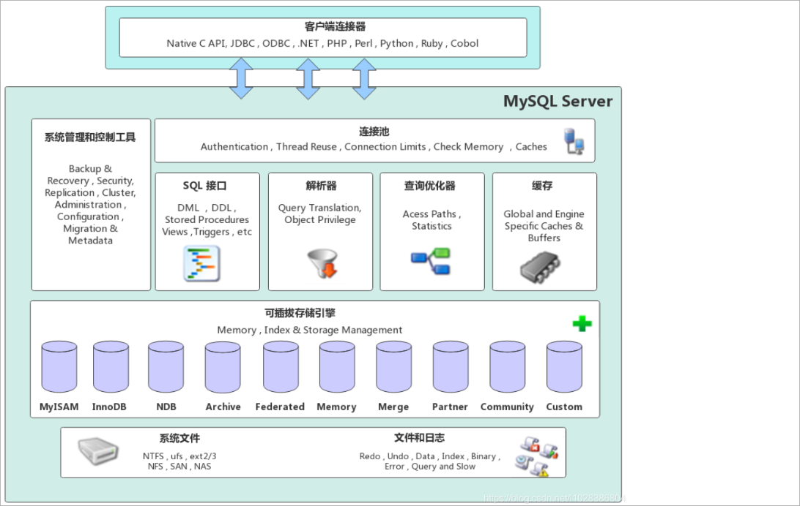  

## 2.2 逻辑架构详解

### 2.2.1 Connectors(客户端)

MySQL服务器之外的客户端程序，与具体的语言相关，例如Java中的JDBC，图形用户界面SQLyog等。本质上都是在TCP连接上通过MySQL协议和

MySQL服务器进行通信。

### 2.2.2 SQL层(服务层)

#### 连接层

1、客户端访问 MySQL 服务器前，做的第一件事就是**建立TCP连接**。

2、经过三次握手建立连接成功后， MySQL 服务器对 TCP 传输过来的账号密码做**身份认证、权限获取**。

3、用户名或密码不对，会收到一个**Access denied for user**错误，客户端程序结束执行

4、用户名密码认证通过，会从权限表查出账号拥有的权限与连接关联，之后的权限判断逻辑，都将依赖于此时读到的权限

5、TCP 连接收到请求后，必须要分配给一个线程专门与这个客户端的交互。所以还会有个**线程池**，去走后面的流程。每一个连接从线程池中获取线

程，省去了创建和销毁线程的开销。

#### 系统管理和控制工具

在MySQL服务层中，系统管理和控制工具是指用于管理和控制MySQL数据库服务器的软件工具。这些工具提供了对MySQL服务器的配置、监控、维

护和故障排除等功能。

以下是一些常见的MySQL系统管理和控制工具：

1、MySQL命令行客户端：MySQL自带的命令行客户端是一个基本的系统管理工具，可以通过命令行界面与MySQL服务器进行交互。管理员可以使

用命令行客户端执行SQL语句、管理用户权限、查看日志等操作。

2、MySQL Workbench：MySQL Workbench是官方提供的图形化管理工具，提供了丰富的功能来管理和控制MySQL服务器。它包括数据库设计、

查询开发、备份恢复、性能优化等模块，使管理员可以通过可视化界面轻松地进行各种管理任务。

3、phpMyAdmin：phpMyAdmin是一个基于Web的MySQL管理工具，通过浏览器访问，提供了图形化界面来管理MySQL服务器。它支持数据库的创

建、表的管理、数据的导入导出等操作，适合于简单的数据库管理需求。

4、MySQL Enterprise Monitor：MySQL Enterprise Monitor是MySQL官方提供的高级监控和管理工具。它可以实时监控MySQL服务器的性能指

标、健康状态和资源利用情况，并提供警报和建议来优化和调整MySQL环境。

5、Percona Toolkit：Percona Toolkit是一个由Percona开发的一组命令行工具，用于MySQL数据库的管理和维护。它包括了各种实用工具，如备份

恢复、查询分析、性能优化、数据同步等，可以帮助管理员更好地管理MySQL服务器。

这些系统管理和控制工具提供了不同级别的功能和灵活性，使管理员能够根据需要选择适合自己的工具来管理和控制MySQL服务器。无论是通过命令

行还是图形界面，这些工具都可以帮助管理员更高效地管理MySQL数据库。

#### SQL接口

作用：

1、接收用户的SQL命令，并且返回用户需要查询的结果。比如SELECT ... FROM就是调用SQL Interface

2、MySQL支持DML（数据操作语言）、DDL（数据定义语言）、存储过程、视图、触发器、自定义函数等多种SQL语言接口

#### 解析器

在SQL命令传递到解析器的时候会被解析器验证和解析。解析器中SQL 语句进行**词法分析、语法分析、语义分析**，并为其**创建语法树**。

1、词法分析：检测SQL语句的关键字是否正确

2、语法分析：检测SQL语句是否符合MySQL的语法要求，按照MySQl语法规则，生成解析树

3、语义分析：检查解析树是否合法，比如查看表是否存在，列是否存在

典型的解析树如下：

 

#### 查询优化器

SQL语句在语法解析后、查询前会使用查询优化器对查询进行优化，确定SQL语句的执行路径，生成一个执行计划。

#### 查询缓存组件

1、MySQL内部维持着一些Cache和Buffer，比如Query Cache用来缓存一条SELECT语句的执行结果，如果能够在其中找到对应的查询结果，那么就

不必再进行查询解析、查询优化和执行的整个过程了，直接将结果反馈给客户端。

2、这个缓存机制是由一系列小缓存组成的。比如表缓存，记录缓存，key缓存，权限缓存等 。

3、这个查询缓存可以在不同客户端之间共享 。

问：**大多数情况查询缓存就是个鸡肋，为什么呢？**

1、只有相同的SQL语句才会命中查询缓存。两个查询请求在任何字符上的不同（例如：空格、注释、大小写），都会导致缓存不会命中。

2、在两条查询之间 有 INSERT 、 UPDATE 、 DELETE 、 TRUNCATE TABLE 、 ALTER TABLE 、 DROP TABLE 或 DROP DATABASE 语句也

会导致缓存失效

3、因此 MySQL的查询缓存命中率不高。所以在MySQL 8之后就抛弃了这个功能。 

### 2.2.3 存储引擎层

存储引擎层（ Storage Engines），负责**MySQL中数据的存储和提取**，对物理服务器级别维护的底层数据执行操作，服务器通过API与存储引擎进

行通信。不同的存储引擎具有的功能不同，管理的表有不同的存储结构，采用的存取算法也不同，这样我们可以根据自己的实际需要进行选取。例如

MyISAM引擎和InnoDB引擎。

### 2.2.4 存储层

所有的数据、数据库、表的定义、表的每一行的内容、索引，都是存在文件系统 上，以文件的方式存在，并完成与存储引擎的交互。

## 2.3 查询流程说明

一条查询的SQL语句的执行流程如下所示：

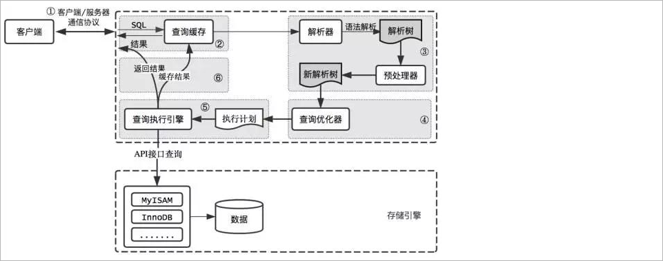 

**首先，**MySQL客户端通过协议与MySQL服务器建连接，通过SQL接口发送SQL语句，先检查查询缓存，如果命中，直接返回结果，否则进行语句解

析。也就是说，在解析查询之前，服务器会先访问查询缓存，如果某个查询结果已经位于缓存中，服务器就不会再对查询进行解析、优化、以及执行。

它仅仅将缓存中的结果返回给用户即可，这将大大提高系统的性能。

**接下来是解析过程，**MySQL解析器通过关键字将SQL语句进行解析，并生成一棵对应的解析树，解析器使用MySQL语法规则验证和解析SQL语句。

例如，它将验证是否使用了错误的关键字，或者使用关键字的顺序是否正确，引号能否前后匹配等；预处理器则根据MySQL规则进一步检查解析树是

否合法，例如，这里将检查数据表和数据列是否存在，还会解析名字和别名，看是否有歧义等，并生成一棵新解析树，新解析树可能和旧解析树结构一

致。

**然后是优化过程，**MySQL优化程序会对我们的语句做一些优化，将查询的IO成本和CPU成本降到最低。优化的结果就是生成一个执行计划。这个执

行计划表明了应该使用哪些索引执行查询，以及表之间的连接顺序是啥样，必要时将子查询转换为连接、表达式简化等等。我们可以使用**EXPLAIN**语

句来查看某个语句的执行计划。

**最后，**进入执行阶段。完成查询优化后，查询执行引擎会按照生成的执行计划调用存储引擎提供的接口执行SQL查询并将结果返回给客户端。在

MySQL8以下的版本，如果设置了查询缓存，这时会将查询结果进行缓存，再返回给客户端。

## 2.4 SQL执行流程

利用**SHOW VARIABLES** 可以查看SQL的执行流程。使用前需要先开启该功能：

### 2.4.1 MySQL8

> 1、开启profiling

确认profiling是否开启

```sql
SHOW VARIABLES LIKE '%profiling%';
```

profiling=0 代表关闭，我们需要把 profiling 打开，即设置为 1：

```sql
SET profiling = 1;  -- profiling = ON
```

> 2、显示查询

执行任意SQL语句：

```sql
SELECT * FROM atguigudb.employee; 
SELECT * FROM atguigudb.employee WHERE id = 5; 
```

显示最近的几次查询：

```sql
SHOW PROFILES;
```

> 3、查看执行流程

查看最后一个SQL的执行流程：

```sql
SHOW PROFILE;
```

查看指定SQL的执行流程：查询指定的 Query ID

```sql
SHOW PROFILE FOR QUERY 3;
```

执行结果信息说明：

 

### 2.4.2 MySQL5.7（了解）

> 1、查看查询缓存是否启用

```SQL
SHOW VARIABLES LIKE '%query_cache_type%';
```

> 2、开启查询缓存

```txt
修改配置文件：vim /etc/my.cnf
新增一行：query_cache_type=1
重启MySQL：systemctl restart mysqld
```

> 3、执行SQL并查看执行流程

参考MySQl8中执行流程的启用和查看方式，在MySQL5.7中查看执行流程

1、第一次执行查询SQL：

 

2、第二次执行相同的SQL：

 

# 3 MySQL存储引擎

## 3.1 查看存储引擎

查看MySQL提供什么存储引擎

```sql
SHOW ENGINES;
```

下面的结果表示MySQL中默认使用的存储引擎是InnoDB，支持事务，行锁，外键等。

 

也可以通过以下语句查看默认的存储引擎：

```sql
SHOW VARIABLES LIKE '%default_storage_engine%';
```

 

## 3.2 设置存储引擎（了解）

### 3.2.1 方法1

设置默认存储引擎：

```sql
SET DEFAULT_STORAGE_ENGINE=MyISAM;
```

### 3.2.1 方法2

或者修改 my.cnf 文件：vim /etc/my.cnf

在[mysqld]节点下新增一行：default-storage-engine=MyISAM

重启MySQL：systemctl restart mysqld

### 3.3.3 方法3

我们可以为 不同的**表设置不同的存储引擎**

```sql
CREATE TABLE 表名( 建表语句 ) ENGINE = 存储引擎名称;
ALTER TABLE 表名 ENGINE = 存储引擎名称;

-- 例如：
CREATE TABLE student(id INT, `name` VARCHAR(16),age INT,dept INT) ENGINE = MyISAM;
```

## 3.3 常见存储引擎介绍

在MySQL8中提供了很多的存储引擎，不同的存储引擎的特点是不一样的，常见的存储引擎有：InnoDB、MyISAM、Memory、Archive(高压缩比)、

Blackhole（黑洞）、CSV引擎、Federated引擎等。

### 3.3.1 InnoDB

#### 特点介绍

1、默认存储引擎：在MySQL 5.5版本之后，InnoDB成为了MySQL的默认存储引擎。

2、支持事务：InnoDB是一个支持ACID事务的存储引擎，可以提供数据的一致性和可靠性。

3、行级锁定：InnoDB使用行级锁定来实现并发控制，允许多个事务同时读取和写入不同的行，提高了并发性能。

4、外键约束：InnoDB支持外键约束，可以保证数据的完整性和一致性。

5、支持崩溃恢复：InnoDB具有崩溃恢复机制，可以在数据库异常关闭后进行恢复。

#### 测试SQL

##### 测试事务

```sql
-- 测试事务-----------------------------------------------------------------------------
create table goods_innodb(
	id int NOT NULL AUTO_INCREMENT,
	name varchar(20) NOT NULL,
    primary key(id)
)ENGINE=innodb DEFAULT CHARSET=utf8;

-- sql语句
start transaction;
insert into goods_innodb(id,name)values(null,'Meta20');
commit;
-- -----------------------------------------------------------------------------------
```

测试，发现在InnoDB中是存在事务的 ；

##### 测试外键

MySQL支持外键的存储引擎只有InnoDB ,在创建外键的时候， 要求父表必须有对应的索引,子表在创建外键的时候， 也会自动的创建对应的索引。

下面两张表中 ， country_innodb是父表 ， country_id为主键索引，city_innodb表是子表，country_id字段为外键，对应于country_innodb表的主

键country_id 。

```sql
create table country_innodb(
	country_id int NOT NULL AUTO_INCREMENT,
    country_name varchar(100) NOT NULL,
    primary key(country_id)
)ENGINE=InnoDB DEFAULT CHARSET=utf8;


create table city_innodb(
	city_id int NOT NULL AUTO_INCREMENT,
    city_name varchar(50) NOT NULL,
    country_id int NOT NULL,
    primary key(city_id),
    CONSTRAINT `fk_city_country` FOREIGN KEY(country_id) REFERENCES country_innodb(country_id) ON DELETE RESTRICT ON UPDATE CASCADE
)ENGINE=InnoDB DEFAULT CHARSET=utf8;

insert into country_innodb values(null,'China'),(null,'America'),(null,'Japan');
insert into city_innodb values(null,'Xian',1),(null,'NewYork',2),(null,'BeiJing',1);
```

在创建外键时， 可以指定在删除、更新父表时，对子表进行的相应操作，包括 RESTRICT、CASCADE、SET NULL 和 NO ACTION。

RESTRICT和NO ACTION相同， 是指限制在子表有关联记录的情况下， 父表不能更新；

CASCADE表示父表在更新或者删除时，更新或者删除子表对应的记录；

SET NULL 则表示父表在更新或者删除的时候，子表的对应字段被SET NULL 。

针对上面创建的两个表， 子表的外键指定是ON DELETE RESTRICT ON UPDATE CASCADE 方式的， 那么在主表删除记录的时候， 如果子表有对

应记录， 则不允许删除， 主表在更新记录的时候， 如果子表有对应记录， 则子表对应更新 。

表中数据如下图所示 ： 

 


外键信息可以使用如下两种方式查看 ： 

```sql
show create table city_innodb ;
```

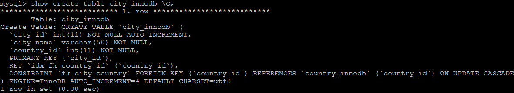 	

删除country_id为1 的country数据： 

```sql
 delete from country_innodb where country_id = 1;
```

 


更新主表country表的字段 country_id : 

```sql
update country_innodb set country_id = 100 where country_id = 1;
```

  

更新后， 子表的数据信息为 ： 

  

注意：关于锁的测试在后面的章节中在进行讲解

### 3.3.2 MyISAM

#### 特点介绍

1、不支持事务：MyISAM是一个不支持事务的存储引擎，无法提供数据的一致性和可靠性。

2、表级锁定：MyISAM使用表级锁定来实现并发控制，只允许一个事务对整个表进行读写操作，限制了并发性能。

3、较低的存储空间占用：相比InnoDB，MyISAM在存储空间占用方面较低，适合存储大量非事务性的数据。

#### 测试SQL

不支持事务测试：

```sql
create table goods_myisam(
	id int NOT NULL AUTO_INCREMENT,
	name varchar(20) NOT NULL,
    primary key(id)
)ENGINE=myisam DEFAULT CHARSET=utf8;
```

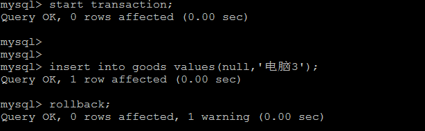 

通过测试，我们发现，在MyISAM存储引擎中，是没有事务控制的 ；

### 3.3.3 Memory

#### 特点介绍

1、数据存储在内存中：Memory存储引擎将数据完全存储在内存中，因此读写速度非常快。

2、不支持持久化：Memory存储引擎不支持数据的持久化，数据库重启后数据会丢失。

3、表级锁定：Memory使用表级锁定来实现并发控制，只允许一个事务对整个表进行读写操作，限制了并发性能。

4、适用于临时数据和缓存：由于数据存储在内存中且不支持持久化，Memory存储引擎适用于存储临时数据和缓存，而不适合长期存储。

#### 测试SQL

内存存储数据测试：

```sql

-- 建表语句
CREATE TABLE goods_memory (
    id INT PRIMARY KEY,
    column1 VARCHAR(50),
    column2 INT

) ENGINE=MEMORY;

-- 测试数据存储在内存中
INSERT INTO goods_memory (id, column1, column2) VALUES (1, 'value1', 100);
SELECT * FROM goods_memory;

-- 重启mysql容器，数据丢失
```

### 3.4 MyISAM和InnoDB的对比

| 对比项         | MyISAM                                                   | InnoDB                                                       |
| -------------- | -------------------------------------------------------- | ------------------------------------------------------------ |
| 外键           | 不支持                                                   | 支持                                                         |
| 事务           | 不支持                                                   | 支持                                                         |
| 行表锁         | 表锁，即使操作一条记录也会锁住整个表，不适合高并发的操作 | 行锁，操作时只锁某一行，不对其它行有影响，适合高并发的操作   |
| 缓存           | 只缓存索引，不缓存真实数据                               | 不仅缓存索引还要缓存真实数据，对内存要求较高，而且内存大小对性能有决定性的影响。支持聚簇索引 |
| 关注点         | 并发查询，节省资源、消耗少、简单业务                     | 并发写、事务、更大更复杂的资源操作                           |
| 默认使用       | N                                                        | Y                                                            |
| 自带系统表使用 | Y                                                        | N                                                            |

# 4 MySQL索引入门

## 4.1 索引概述

MySQL官方对索引的定义为：索引（index）是帮助MySQL高效获取数据的**数据结构**（有序）。在数据之外，数据库系统还维护者满足特定查找算法

的数据结构，这些数据结构以某种方式引用（指向）数据， 这样就可以在这些数据结构上实现高级查找算法，这种数据结构就是索引。如下面的示意

图所示 : 

 

左边是数据表，一共有两列七条记录，最左边的是数据记录的物理地址（注意逻辑上相邻的记录在磁盘上也并不是一定物理相邻的）。为了加快Col2

的查找，可以维护一个右边所示的二叉查找树，每个节点分别包含索引键值和一个指向对应数据记录物理地址的指针，这样就可以运用二叉查找快速获

取到相应数据。一般来说索引本身也很大，不可能全部存储在内存中，因此索引往往以索引文件的形式**存储在磁盘上**。索引是数据库中用来提高性能

的最常用的工具。

## 4.2 优点和缺点

优势

1） 类似于书籍的目录索引，提高数据检索的效率，降低数据库的IO成本。

2） 通过索引列对数据进行排序，降低数据排序的成本，降低CPU的消耗。

劣势

1） 实际上索引也是一张表，该表中保存了主键与索引字段，并指向实体类的记录，所以**索引列也是要占用空间**的。

2） 虽然索引大大提高了查询效率，同时却也**降低更新表的速度**，如对表进行INSERT、UPDATE、DELETE。因为更新表时，MySQL 不仅要保存

数据，还要保存一下索引文件每次更新添加了索引列的字段，都会调整因为更新所带来的键值变化后的索引信息。

## 4.3 索引体验

具体步骤如下所示：

> 1、数据准备

```sql
-- 上传课程资料中的tb_sku*.sql脚本到linux服务器中, /var/lib/docker/volumes/mysql8_data/_data/sku_sql

-- 在MySQL服务器的配置文件（my.cnf或my.ini）中，添加以下配置项：
[mysqld]
local_infile=1

-- 使用mysql客户端连接mysql
mysql --local-infile=1 -u root -p

-- 进入到mysql中的，执行如下命令导入数据
use atguigu ;

-- 根据课程资料中提供的建表语句创建数据库表

-- 使用load data命令导入数据
load data local infile '/var/lib/mysql/sku_sql/tb_sku1.sql' into table `tb_sku` fields terminated by ',' lines terminated by '\n';
load data local infile '/var/lib/mysql/sku_sql/tb_sku2.sql' into table `tb_sku` fields terminated by ',' lines terminated by '\n';
load data local infile '/var/lib/mysql/sku_sql/tb_sku3.sql' into table `tb_sku` fields terminated by ',' lines terminated by '\n';
load data local infile '/var/lib/mysql/sku_sql/tb_sku4.sql' into table `tb_sku` fields terminated by ',' lines terminated by '\n';
load data local infile '/var/lib/mysql/sku_sql/tb_sku5.sql' into table `tb_sku` fields terminated by ',' lines terminated by '\n';

-- 不创建索引进行查询
mysql> select * from tb_sku where name = '华为Meta1000' ;
1 row in set (17.04 sec)
```

> 2、创建索引查询

```sql
create index idx_sku_name on tb_sku(name) ;  -- 为name字段创建索引
mysql> select * from tb_sku where name = '华为Meta1000' ;
1 row in set (0.00 sec)
```

# 5 MySQL索引结构

## 5.1 索引结构

索引结构是指在数据库中用于**组织和管理索引的数据结构**。索引结构的设计和实现对于数据库的性能和效率具有重要影响。

常见的索引结构包括：

1、B树(B-tree): B树是一种平衡的**多路搜索树**，被广泛应用于数据库系统中。B树的特点是每个节点可以存储多个键值，并且保持有序。B树的高

度相对较低，可以快速定位到目标数据。

2、Hash索引（Hash Index）：Hash索引使用哈希函数将索引列的值映射为一个固定长度的哈希码，并将哈希码作为索引的键值。Hash索引适用于等值查询，可以快速定位到目标数据。然而，Hash索引不支持范围查询和排序操作。

3、R树（R-tree）：R树是一种用于处理多维数据的索引结构，常用于地理信息系统（GIS）和空间数据库中。R树可以高效地支持范围查询和最近邻查询。

4、Full-text （全文索引） ：全文索引也是MyISAM的一个特殊索引类型，主要用于全文索引，InnoDB从Mysql5.6版本开始支持全文索引。


MyISAM、InnoDB、Memory三种存储引擎对各种索引类型的支持

| 索引        | InnoDB引擎      | MyISAM引擎 | Memory引擎 |
| ----------- | --------------- | ---------- | ---------- |
| BTREE索引   | 支持            | 支持       | 支持       |
| HASH 索引   | 不支持          | 不支持     | 支持       |
| R-tree 索引 | 不支持          | 支持       | 不支持     |
| Full-text   | 5.6版本之后支持 | 支持       | 不支持     |

我们平常所说的索引，如果没有特别指明，都是指**B+树**（多路搜索树，并不一定是二叉的）结构组织的索引。其中聚集索引、复合索引、前缀索引、

唯一索引默认都是使用 B+tree 索引，统称为索引。

## 5.1 索引结构-树

### 5.5.1 二叉树

#### 二叉树

树有很多种，**每个节点最多只能有两个子节点**的一种形式称为二叉树。二叉树的子节点分为左节点和右节点。

 

#### BST树

##### BST的简介

BST(Binary Sort(Search) Tree)：对于二叉排序树的任何一个非叶子节点，要求左子节点的值比当前节点的值小，右子节点的值比当前节点的值大。

特别说明：如果有相同的值，可以将该节点放在左子节点或右子节点。

 

BST的生成演示：https://www.cs.usfca.edu/~galles/visualization/BST.html

##### BST的问题

二叉搜索树存在一个常见的问题：**瘸腿问题** ， 例如左子树全部为空，从形式上看，更像一个单链表，不能发挥BST的优势，影响了查询数据效率。

 

#### AVL树

##### AVL树简介

AVL树全称G.M. Adelson-Velsky和E.M. Landis，这是两个人的人名。

平衡二叉树也叫平衡二叉搜索树（Self-balancing binary search tree）又被称为AVL树， 可以保证较高的查询效率。


具有以下特点：

1、它是一棵空树或它的左右两个子树的高度差的绝对值不超过1

2、并且左右两个子树都是一棵平衡二叉树。

 

AVL的生成演示：https://www.cs.usfca.edu/~galles/visualization/AVLtree.html

##### AVL树问题

众所周知，IO操作的效率很低，在大量数据存储中，查询时我们不能一下子将所有数据加载到内存中，只能逐节点加载（一个节点一次IO）。如果我们利用二叉树作为索引结构，那么**磁盘的IO次数和索引树的高度是相关**的。平衡二叉树由于树深度过大而造成磁盘IO读写过于频繁，进而导致效率低下。

  

为了提高查询效率，就需要 减少磁盘IO数 。**为了减少磁盘IO的次数，就需要尽量降低树的高度**，需要把原来“瘦高”的树结构变的“矮胖”，树的每层的分叉越多越好。针对同样的数据，如果我们把二叉树改成 三叉树：

 

上面的例子中，我们将二叉树变成了三叉树，降低了树的高度。如果能够在一个节点中存放更多的数据，我们还可以进一步减少节点的数量，从而进一步降低树的高度。这就是多叉树。

### 5.5.2 B-tree

#### B-tree简介

B-tree又叫多路平衡搜索树，一颗m叉的B-tree特性如下：

1、树中每个节点最多包含m个孩子。

2、除根节点与叶子节点外，每个节点至少有[ceil(m/2)]个孩子。

3、若根节点不是叶子节点，则至少有两个孩子。

4、所有的叶子节点都在同一层。

5、每个非叶子节点由n个key与n+1个指针组成，其中[ceil(m/2)-1] <= n <= m-1 

如下所示：

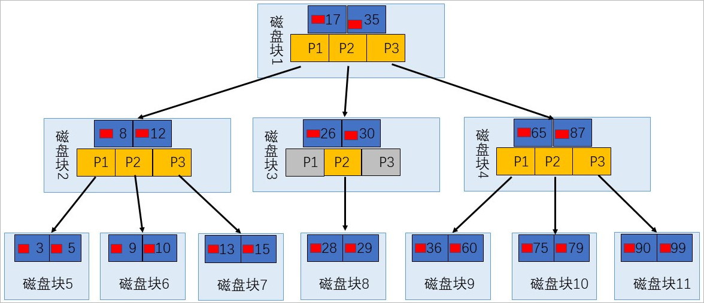 

#### 数据搜索

上图所表示的 B 树就是一棵 3 阶(叉)的 B 树。假设一个磁盘块可以存储一个节点的数据。我们可以看下磁盘块 2，里面的关键字为（8，12），它有 3 个孩子 (3，5)，(9，10) 和 (13，15)，你能看到 (3，5) 小于 8，(9，10) 在 8 和 12 之间，而 (13，15)大于 12，三节点的子树的值大小仍然遵守 BST 

二叉排序树的规则。


假设我们想要 查找的数据项是 9 ，那么步骤可以分为以下几步：

1、第一次磁盘IO：找到根节点磁盘块1，读入内存，执行二分查找，9 小于 17 ，得到指针 P1

2、第二次磁盘IO：按照指针P1找到磁盘块 2，读入内存，执行二分查找， 9 在 8 和 12 之间，得到指针 P2

3、第三次磁盘IO：按照指针P2找到磁盘块 6，读入内存，执行二分查找， 找到了数据项 9。

你能看出来在 B 树的搜索过程中，我们比较的次数并不少，但如果**把数据读取出来然后在内存中进行比较，这个时间就是可以忽略不计的**。而读取磁盘块本身需要进行 I/O 操作，消耗的时间比在内存中进行比较所需要的时间要多，是数据查找用时的重要因素。 B树相比于平衡二叉树来说磁盘 I/O 操作要少 ，在数据查询中比平衡二叉树效率要高。所以只要树的高度足够低，IO次数足够少，就可以提高查询性能 。


## 5.2 索引结构-B+tree

在mysql中大部分的存储引擎中所使用的索引结构就是B+tree。为了让大家更加清楚的了解B+tree的结构，我们来简单推演一下B+tree的构建过程。

### 5.2.1 InnoDB中的索引

#### 设计索引

假设有一个表index_demo，表中有2个INT类型的列，1个CHAR(1)类型的列，c1列为主键：

```sql
CREATE TABLE index_demo(c1 INT,c2 INT,c3 CHAR(1),PRIMARY KEY(c1)) ;
```

这个表使用 Compact 行格式来实际存储记录的。这里我们简化了index_demo表的行格式示意图：

 

我们只在示意图里展示记录的这几个部分： 

1、record_type ：记录头信息的一项属性，表示记录的类型， 0 表示普通记录、 2 表示最小记 录、 3 表示最大记录、 1 暂时还没用过，下面讲。 

2、next_record ：记录头信息的一项属性，表示下一条地址相对于本条记录的地址偏移量，我们用 箭头来表明下一条记录是谁。

3、各个列的值 ：这里只记录在 index_demo 表中的三个列，分别是 c1 、 c2 和 c3 。

4、其他信息 ：除了上述3种信息以外的所有信息，包括其他隐藏列的值以及记录的额外信息。


将记录格式示意图的其他信息项暂时去掉并把它竖起来的效果就是这样：

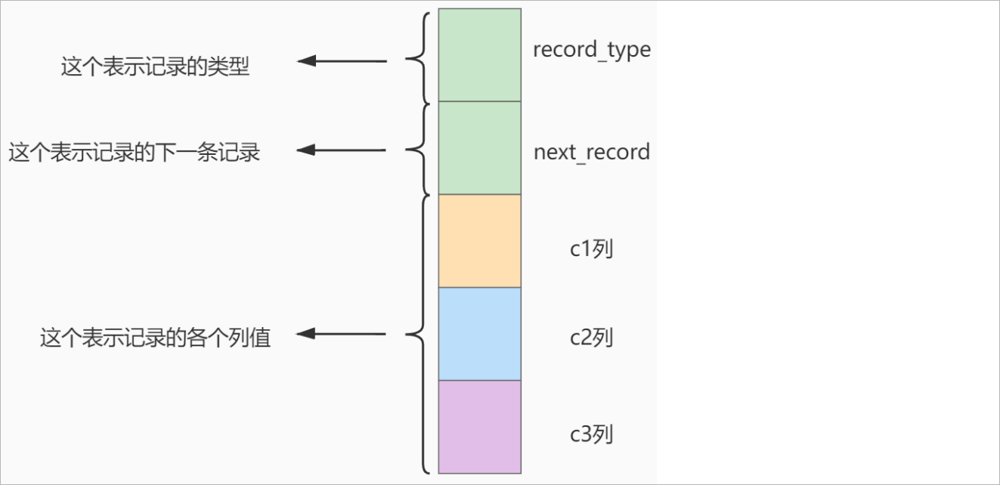 

把一些记录放到**页**里的示意图就是【**数据都是存储到数据页中，一个数据页占用一个磁盘块**】：

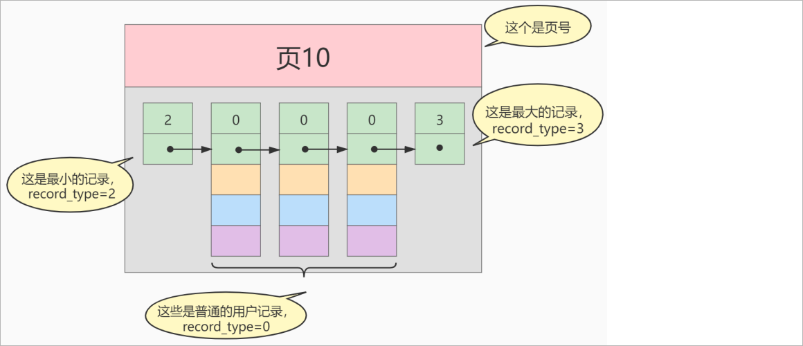 

MySQL InnoDB的默认的页大小是16KB：

```sql
-- 查看默认页的大小
SHOW GLOBAL STATUS LIKE 'Innodb_page_size';
```


数据存储在磁盘中，可能会占用多个数据页。如果各个页中的记录没有规律，我们就不得不依次遍历所有的数据页。如果我们想快速的定位到需要查找

的记录在哪些数据页中，我们可以这样做 ：我们可以为快速定位记录所在的数据页而建立一个**目录** ，建这个目录必须完成下边这些事：

1、下一个数据页中用户记录的主键值必须大于上一个页中用户记录的主键值。

2、给所有的页建立一个目录项。

所以我们为上边几个页做好的目录就像这样子：

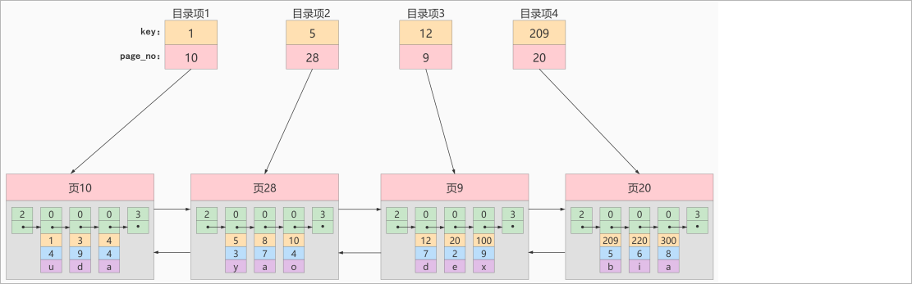 

以 页28 为例，它对应目录项2 ，这个目录项中包含着该页的页号 28 以及该页中用户记录的**最小主键值 5** 。我们只需要把几个目录项在物理存储器

上连续存储（比如：数组），就可以实现根据主键 值快速查找某条记录的功能了。


比如：查找主键值为 20 的记录，具体查找过程分两步： 

1、先从目录项中根据 二分法 快速确定出主键值为 20 的记录在 目录项3 中（因为 12 < 20 < 209 ），它对应的页是页9 。

2、再根据前边说的在页中查找记录的方式去 页9 中定位具体的记录。 至此，针对数据页做的简易目录就搞定了。这个目录有一个别名，称为**索引** 。


上述的目录项在存储的时候,如果使用的是连续的存储空间会存在一定的弊端：

1、如果删除了某一个数据页，那么该目录项也会随之删除，那么后面的目录项就需要移动到前面来，影响一定的删除效率

2、插入数据的时候也会影响一定的效率


#### InnoDB中的索引方案

##### 目录项纪录的页

我们把前边使用到的目录项放到数据页中的样子就是这样：

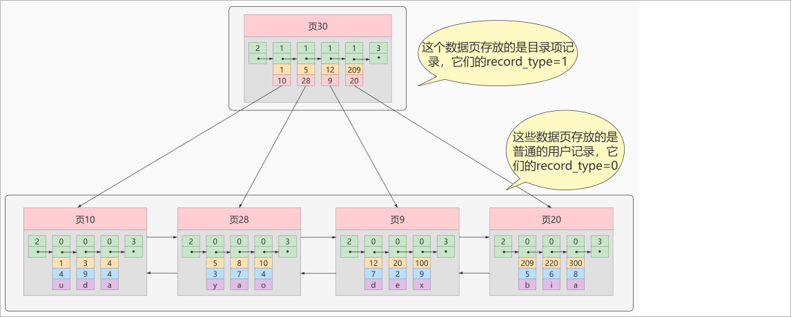  

目录项记录和普通的用户记录的不同点：

1、**目录项记录 的 record_type 值是1**，而 普通用户记录 的 record_type 值是0。

2、目录项记录只有主键值和页的编号两个列，而普通的用户记录的列是用户自己定义的，包含很多列，另外还有InnoDB自己添加的隐藏列。

现在查找主键值为 20 的记录，具体查找过程分两步：

1、先到页30中通过二分法快速定位到对应目录项，因为 12 ≤ 20 < 209 ，就是页9。

2、再到页9中根据二分法快速定位到主键值为 20 的用户记录。

##### 多个目录项纪录的页

当数据页越来越多的时候，目录页也会变多，如下所示：

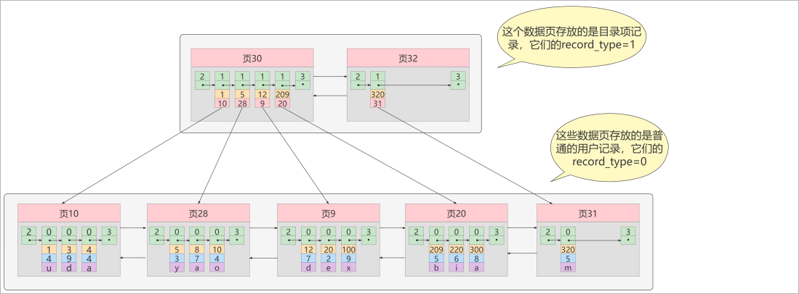 

从图中可以看出，我们插入了一条主键值为320的用户记录之后需要两个新的数据页： 

1、为存储该用户记录而新生成了 页31 。 

2、因为原先存储目录项记录的 页30的容量已满 （我们前边假设只能存储4条目录项记录），所以不得 不需要一个新的 页32 来存放 页31 对应的目录项。 现在因为存储目录项记录的页不止一个，所以如果我们想根据主键值查找一条用户记录大致需要3个步 骤，以查找主键值为 20 的记录为例： 

1、确定目录项记录页 我们现在的存储目录项记录的页有两个，即 页30 和 页32 ，又因为页30表示的目录项的主键值的 范围是 [1, 320) ，页32表示的目录项的主键值不小于 320 ，所以主键值为 20 的记录对应的目录项记录在页30 中。

2、通过目录项记录页 确定用户记录真实所在的页 。 在一个存储 目录项记录 的页中通过主键值定位一条目录项记录的方式说过了。 

3、在真实存储用户记录的页中定位到具体的记录。

##### 目录项记录页的目录页

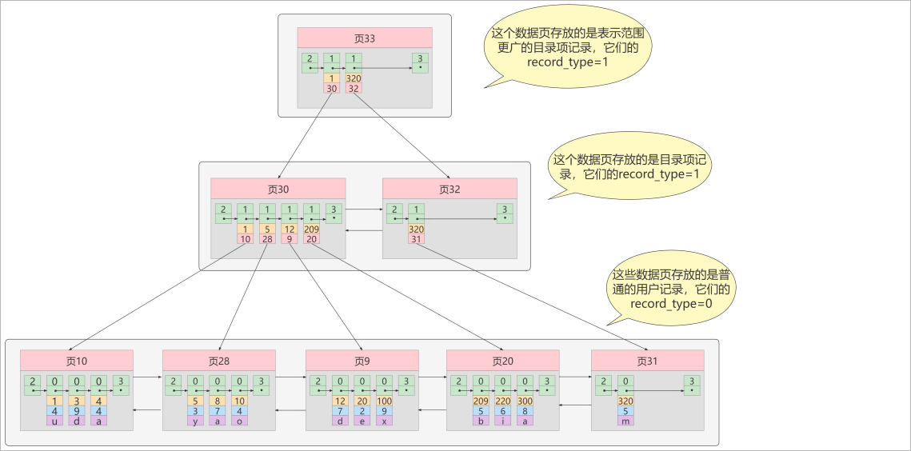 

如图，我们生成了一个存储更高级目录项的 页33 ，这个页中的两条记录分别代表页30和页32，如果用 户记录的主键值在 [1, 320) 之间，则到页30中

查找更详细的目录项记录，如果主键值 不小于320 的 话，就到页32中查找更详细的目录项记录。这个数据结构它的名称是 B+树 。

### 5.3.2 B+tree概述

一个B+树的节点其实可以分成好多层，规定最下边的那层，也就是存放我们用户记录的那层为第 **0** 层， 之后依次往上加。之前我们做了一个非常极端的假设：存放用户记录的页 **最多存放3条记录** ，存放目录项 记录的页 **最多存放4条记录** 。其实真实环境中一个页存放的记录数量是非常大的，假设所有存放用户记录 的叶子节点代表的数据页可以存放 100条用户记录 ，所有存放目录项记录的节点代表的数据页可以存 放 1000条目录项记录 ，那

么： 

1、如果B+树只有1层，也就是只有1个用于存放用户记录的节点，最多能存放 100 条记录。 

2、如果B+树有2层，最多能存放 1000×100=10,0000 条记录。 

3、如果B+树有3层，最多能存放 1000×1000×100=1,0000,0000 条记录。 

4、如果B+树有4层，最多能存放 1000×1000×1000×100=1000,0000,0000 条记录。相当多的记录！！！

你的表里能存放 100000000000 条记录吗？所以一般情况下，我们用到的**B+树都不会超过4层** ，那我们通过主键值去查找某条记录最多只需要做4个页面内的查找（查找3个目录项页和一个用户记录页），又因为在每个页面内有所谓的 **Page Directory （页目录）**，所以在页面内也可以通过**二分法**实现快速定位记录。

## 5.7 B树和B+树对比

**B+** **树和** **B** **树的差异：**

1、B+树中非叶子节点仅用于索引，不保存数据记录，跟记录有关的信息都放在叶子节点中。而B树中， 非叶子节点既保存索引，也保存数据记录 。

2、B+树中所有关键字[**主键**]都在叶子节点出现，叶子节点构成一个有序链表，而且叶子节点本身按照关键字的大小从小到大顺序链接。

3、B+树中非叶子节点的关键字也会同时存在于子节点中，并且是在子节点中所有关键字的最小值。

# 6 MySQL索引类型

索引分类是指根据索引的**数据结构**和**实现方式**将索引分为不同的类型。常见的索引分类包括聚集索引、非聚集索引、唯一索引、主键索引、全文索引等。每种类型的索引都有其特定的功能和适用场景，用于提高查询性能、保证数据完整性或支持特定的搜索需求。

## 6.1 聚簇索引

特点：

1、使用记录主键值的大小进行记录和页的排序，这包括三个方面的含义

* 页内的记录是按照主键的大小顺序排成一个单向链表。 
* 各个存放用户记录的页 也是根据页中用户记录的主键大小顺序排成一个 双向链表 。 
* 存放目录项记录的页分为不同的层次，在同一层次中的页也是根据页中目录项记录的主键 大小顺序排成一个双向链表 。

2、B+树的**叶子节点存储的是完整的用户记录**【所谓完整的用户记录，就是指这个记录中存储了所有列的值（包括隐藏列）】。

优点：

1、**数据访问更快** ，因为聚簇索引将索引和数据保存在同一个B+树中，因此从聚簇索引中获取数据比非 聚簇索引更快 

2、聚簇索引对于主键的 排序查找 和 范围查找 速度非常快 

3、按照聚簇索引排列顺序，查询显示一定范围数据的时候，由于数据都是紧密相连，数据库不用从多 个数据块中提取数据，所以 节省了大量的io操作 。

缺点：

1、**插入速度严重依赖于插入顺序** ，按照主键的顺序插入是最快的方式，否则将会出现页分裂，严重影 响性能。因此，对于InnoDB表，我们一般都会定义一个自增的ID列为主键

2、**更新主键的代价很高** ，因为将会导致被更新的行移动。因此，对于InnoDB表，我们一般定义**主键为不可更新** 

限制：

1、只有InnoDB引擎支持聚簇索引，**MyISAM不支持聚簇索引**。

2、由于数据的物理存储排序方式只能有一种，所以**每个MySQL的表只能有一个聚簇索引**。

3、如果没有为表定义主键，InnoDB会选择**非空的唯一索引列代替**。如果没有这样的列，InnoDB会**隐式的定义一个主键**作为聚簇索引。

4、为了充分利用聚簇索引的聚簇特性，InnoDB中**表的主键应选择有序的id**，不建议使用无序的id，比如UUID、MD5、HASH、字符串作为主键，

无法保证数据的顺序增长。

## 6.2 非聚簇索引

非聚餐索引常常也被称之为：二级索引、辅助索引

聚簇索引，只能在搜索条件是**主键值**时才发挥作用，因为B+树中的数据都是按照主键进行排序的，如果我们想以别的列作为搜索条件，那么需要创建

非聚簇索引。

**例如：**以c2列作为搜索条件，那么需要使用c2列创建一棵B+树，如下所示：

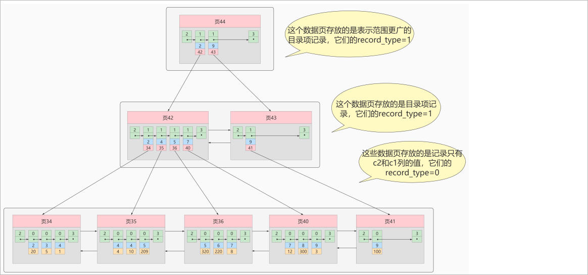 

**这个B+树与聚簇索引有几处不同：**

1、页内的记录是按照从c2列的大小顺序排成一个单向链表 。

2、页和页之间也是根据页中记录的c2列的大小顺序排成一个双向链表 。

3、非叶子节点存储的是记录的c2列+页号。

4、**叶子节点存储的并不是完整的用户记录**，而只是c2列+主键这两个列的值。


**例如：** 根据c2列的值查找c2=4的记录，查找过程如下： 根据c2列的值查找c2=4的记录，查找过程如下：

1、根据根页面44定位到页42（因为2 ≤  4 < 9）

2、由于c2列没有唯一性约束，所以c2=4的记录可能分布在多个数据页中，又因为 2 ≤ 4  ≤ 4，所以确定实际存储用户记录的页在页34和页35中。

3、在页34和35中定位到具体的记录。

4、但是这个B+树的叶子节点只存储了c2和c1（主键）两个列，所以我们必须**再根据主键值去聚簇索引中再查找一遍完整的用户记录**。

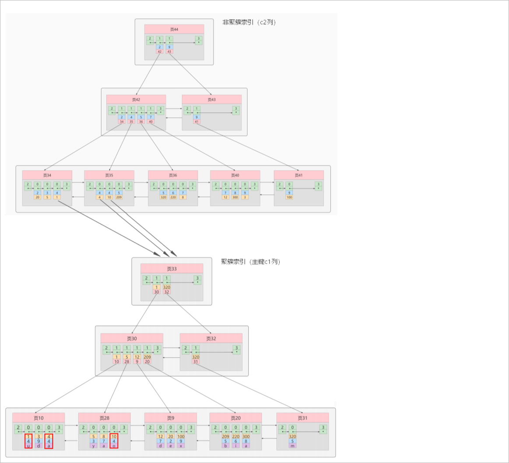 

**概念：回表**

我们根据这个以c2列大小排序的B+树只能确定我们要查找记录的主键值，所以如果我们想根据c2列的值查找到完整的用户记录的话，仍然需要到聚簇

索引中再查一遍，这个过程称为回表 。也就是根据c2列的值查询一条完整的用户记录**需要使用到2棵B+树**！


**问题：**

为什么我们还需要一次回表操作呢？直接把完整的用户记录放到叶子节点不OK吗？

**回答：**

如果把完整的用户记录放到叶子节点是可以不用回表。但是太占地方了，相当于每建立一棵B+树都需要把所有的用户记录再都拷贝一遍，这就有点太

浪费存储空间了。


一张表可以有多个非聚簇索引：

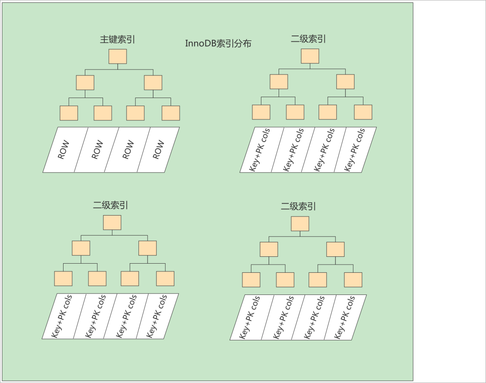 

## 6.3 联合索引

我们也可以同时以多个列的大小作为排序规则，也就是**同时为多个列建立索引**，比方说我们想让B+树按照c2和c3列的大小进行排序，这个包含两层

含义： 

1、先把各个记录和页按照c2列进行排序。 

2、在记录的c2列相同的情况下，采用c3列进行排序

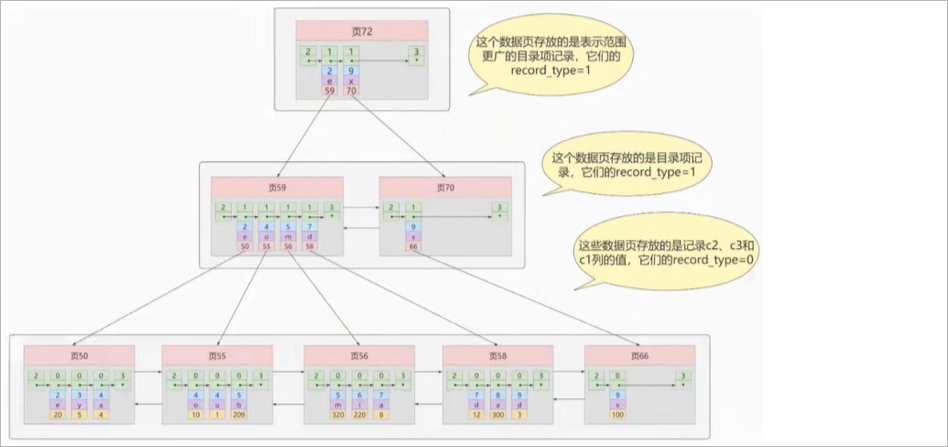 

注意：，以c2和c3列的大小为排序规则建立的B+树称为 联合索引 ，本质上也是一个二级索引。

它的意思与分别为c2和c3列分别建立索引的表述是不同的，不同点如下：

1、 建立联合索引只会建立如上图一样的1棵B+树。 

2、为c2和c3列分别建立索引会分别以c2和c3列的大小为排序规则建立2棵B+树。

## 6.4 覆盖索引

如果能通过读取索引就可以得到想要的数据，那就不需要读取用户记录，或者不用再做回表操作了。**一个索引包含了满足查询结果的数据**就叫做覆盖索引。例如，如果为前面例子中的数据库表创建c2列索引，则如下SQL会使用覆盖索引

```sql
SELECT c1, c2 from index_demo where c2 = 5;
```

# 7 MyISAM索引结构

## 7.1 索引结构简介

MyISAM引擎使用 B+Tree 作为索引结构，**叶子节点的data域存放的是数据记录的地址** 。

下图是MyISAM索引的原理图**（索引和数据分开存储，是非聚簇索引）**：

 

如果我们在Col2上建立一个二级索引，则此索引的结构如下图所示**（是非聚簇索引）**：

 

## 7.2 MyISAM与InnoDB对比

1、InnoDB的数据文件本身就是索引文件，而MyISAM索引文件和数据文件是分离的：

- InnoDB的表在磁盘上存储在以下文件中： **.ibd（表结构、索引和数据都存在一起,MySQL5.7表结构放在.frm中）**
- MyISAM的表在磁盘上存储在以下文件中：**.sdi（描述表结构，MySQL5.7是.frm）**、**.MYD（数据）**，**.MYI（索引）**

2、InnoDB中主键索引是聚簇索引，叶子节点中存储完整的数据记录；其他索引是非聚簇索引，存储相应记录主键的值 。

3、InnoDB要求表必须有主键 （ MyISAM可以没有 ）。如果没有显式指定，则MySQL系统会自动选择一个可以**非空且唯一**标识数据记录的列作为主键。如果不存在这种列，则MySQL自动为InnoDB表生成一个隐含字段作为主键。

4、MyISAM中无论是主键索引还是非主键索引都是非聚簇的，叶子节点记录的是数据的地址。

5、MyISAM的回表操作是十分快速的，因为是拿着地址偏移量直接到文件中取数据的，反观InnoDB是通过获取主键之后再去聚簇索引里找记录，虽然说也不慢，但还是比不上直接用地址去访问。

 

# 8 MySQL索引操作

## 8.1 创建索引

随表一起创建索引：

```sql
CREATE TABLE customer (
    
  id INT UNSIGNED AUTO_INCREMENT,
  customer_no VARCHAR(200),
  customer_name VARCHAR(200),
    
  PRIMARY KEY(id), -- 主键索引：列设定为主键后会自动建立索引，唯一且不能为空。
  UNIQUE INDEX uk_no (customer_no), -- 唯一索引：索引列值必须唯一，允许有NULL值，且NULL可能会出现多次。
  KEY idx_name (customer_name), -- 普通索引：既不是主键，列值也不需要唯一，单纯的为了提高查询速度而创建。
  KEY idx_no_name (customer_no,customer_name) -- 复合索引：即一个索引包含多个列。
);
```
单独建创索引：

```sql
CREATE TABLE customer1 (
  id INT UNSIGNED,
  customer_no VARCHAR(200),
  customer_name VARCHAR(200)
);

-- 建表后创建索引
ALTER TABLE customer1 ADD PRIMARY KEY customer1(id); -- 主键索引
CREATE UNIQUE INDEX uk_no ON customer1(customer_no); -- 唯一索引
CREATE INDEX idx_name ON customer1(customer_name);  -- 普通索引
CREATE INDEX idx_no_name ON customer1(customer_no,customer_name); -- 复合索引

ALTER TABLE customer1 MODIFY id INT UNSIGNED AUTO_INCREMENT, ADD PRIMARY KEY customer1(id); --创建自增的主键索引
```
使用ALTER命令：

```sql
ALTER TABLE customer1 ADD PRIMARY KEY (id); -- 主键索引
ALTER TABLE customer1 ADD UNIQUE INDEX uk_no (customer_no); -- 唯一索引
ALTER TABLE customer1 ADD INDEX idx_name (customer_name);   -- 普通索引
ALTER TABLE customer1 ADD INDEX idx_no_name (customer_no,customer_name);  -- 复合索引
```

## 8.2 查看索引

```sql
SHOW INDEX FROM customer;
```

## 8.3 删除索引

```sql
DROP INDEX idx_name ON customer; -- 删除单值、唯一、复合索引

ALTER TABLE customer MODIFY id INT UNSIGNED, DROP PRIMARY KEY; -- 删除主键索引(有主键自增)
ALTER TABLE customer1 DROP PRIMARY KEY;  -- 删除主键索引(没有主键自增)
```

# 9 MySQL索引使用场景

**哪些情况适合创建索引：**

1、频繁作为WHERE查询条件的字段

2、经常GROUP BY 和 ORDER BY的列

3、字段的值有唯一性的限制

4、DISTINCT字段需要创建索引

5、多表JOIN时，对连接字段创建索引

6、使用频繁的列，放到联合索引的左侧


**哪些情况不要创建索引：**

1、WHERE、GROUP BY 、ORDER BY里用不到的字段不创建索引

2、表的数据记录太少

3、避免对经常增删改的表创建索引


