# 第一章 消息中间件概述&#x20;

## 1.1.为什么学习消息队列&#x20;

电子商务应用中，经常需要对庞大的海量数据进行监控，随着网络技术和软件开发技术的不断提高，在实战开发中MQ的使用与日俱增，特别是RabbitMQ在分布式系统中存储转发消息，可以保证数据不丢失，也能保证高可用性，即集群部署的时候部分机器宕机可以继续运行。在大型电子商务类网站，如京东、淘宝、去哪儿等网站有着深入的应用 。

队列的主要作用是**消除高并发访问高峰，加快网站的响应速度**。

在不使用消息队列的情况下，用户的请求数据直接写入数据库，在高并发的情况下，会对数据库造成巨大的压力，同时也使得系统响应延迟加剧。

## 1.2.什么是消息中间件

MQ全称为**Message Queue**， 消息队列(MQ)是一种应用程序对应用程序的通信方法。

介绍：消息队列就是基础数据结构中的“先进先出”的一种数据机构。想一下，生活中买东西，需要排队，先排的人先买消费，就是典型的“先进先出”。

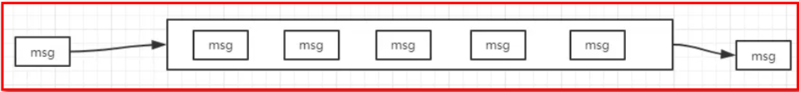

**消息传递：** 指的是程序之间通过消息发送数据进行通信，而不是通过直接调用彼此来通信，直接调用通常是用于诸如远程过程调用的技术。

**排队：** 指的是应用程序通过队列来通信。

**业务场景说明：**

消息队列在大型电子商务类网站，如京东、淘宝、去哪儿等网站有着深入的应用，为什么会产生消息队列？有几个原因：

不同进程（process）之间传递消息时，两个进程之间**耦合**程度过高，改动一个进程，引发必须修改另一个进程，为了**隔离**这两个进程，在两进程间抽离出一层（一个模块），所有两进程之间传递的消息，都必须通过消息队列来传递，单独修改某一个进程，不会影响另一个；

不同进程（process）之间传递消息时，为了实现标准化，将消息的格式规范化了，并且，某一个进程接受的**消息太多**，一下子无法处理完，并且也有先后顺序，必须对收到的消息**进行排队**，因此诞生了事实上的消息队列；

在项目中，可将一些无需即时返回且耗时的操作提取出来，进行\*\*异步处理\*\*，而这种异步处理的方式大大的节省了服务器的请求响应时间，从而\*\*提高\*\*了\*\*系统\*\*的\*\*吞吐量\*\*。

## 1.3.消息队列应用场景

首先我们先说一下消息中间件的主要的作用：

\*\*　　\[1]异步处理\*\*​

\*\*　　\[2]解耦服务\*\*​

\*\*　　\[3]流量削峰\*\*​

上面的三点是我们使用消息中间件最主要的目的.

### 1.3.1.应用解耦

**传统模式：**

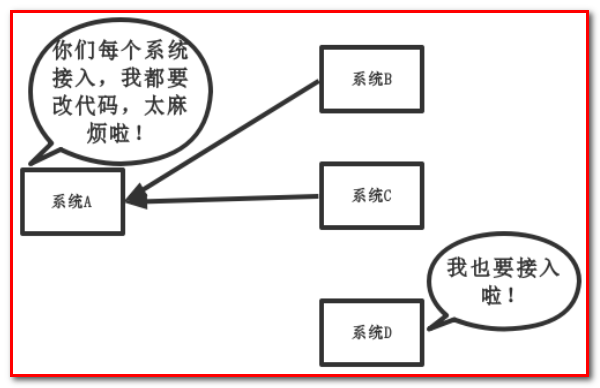

**传统模式的缺点：**

-   系统间耦合性太强，如上图所示，系统A在代码中直接调用系统B和系统C的代码，如果将来D系统接入，系统A还需要修改代码，过于麻烦！

**中间件模式：**

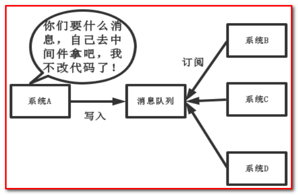

**中间件模式的的优点：**

-   将消息写入消息队列，需要消息的系统自己从消息队列中订阅，从而系统A不需要做任何修改。

### 1.3.2.异步处理

场景说明：用户注册后，需要发注册邮件和注册短信，传统的做法有两种

-   串行的方式
-   并行的方式

1.  **串行方式：**

将注册信息写入数据库后，发送注册邮件，再发送注册短信，以上三个任务全部完成后才返回给客户端。 这有一个问题是，邮件，短信并不是必须的，它只是一个通知，而这种做法让客户端等待没有必要等待的东西。

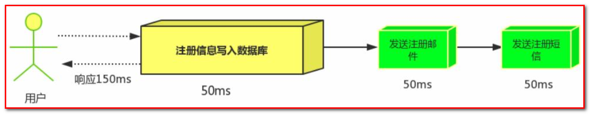

1.  **并行方式：**

将注册信息写入数据库后，发送邮件的同时，发送短信，以上三个任务完成后，返回给客户端，并行的方式能提高处理的时间。

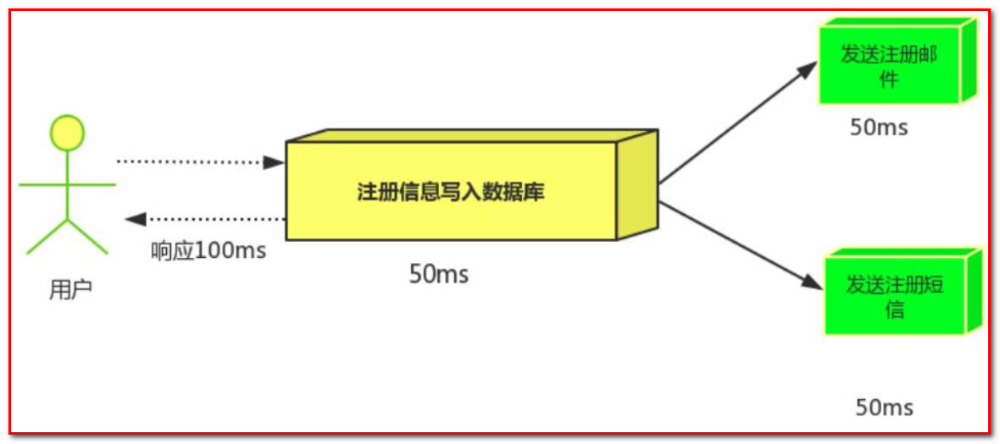

假设三个业务节点分别使用50ms，串行方式使用时间150ms，并行使用时间100ms。虽然并行已经提高了处理时间，但是，前面说过，邮件和短信对我正常的使用网站没有任何影响，客户端没有必要等着其发送完成才显示注册成功，应该是写入数据库后就返回.

**(3)消息队列**
引入消息队列后，把发送邮件，短信不是必须的业务逻辑异步处理

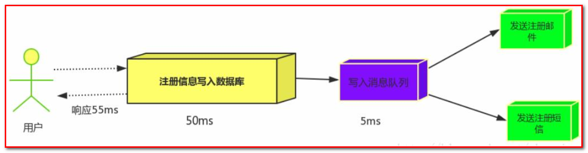

由此可以看出，引入消息队列后，用户的响应时间就等于写入数据库的时间+写入消息队列的时间(可以忽略不计)，

引入消息队列后处理后，响应时间是串行的3分之1，是并行的2分之1。

**传统模式的缺点：**

-   一些非必要的业务逻辑以同步的方式运行，太耗费时间。

**中间件模式的的优点：**

-   将消息写入消息队列，非必要的业务逻辑以异步的方式运行，加快响应速度

### 1.3.3.流量削峰

流量削峰一般在秒杀活动中应用广泛

**场景：** 秒杀活动，一般会因为流量过大，导致应用挂掉，为了解决这个问题，一般在应用前端加入消息队列。

**传统模式**

如订单系统，在下单的时候就会往数据库写数据。但是数据库只能支撑每秒1000左右的并发写入，并发量再高就容易宕机。低峰期的时候并发也就100多个，但是在高峰期时候，并发量会突然激增到5000以上，这个时候数据库肯定卡死了。

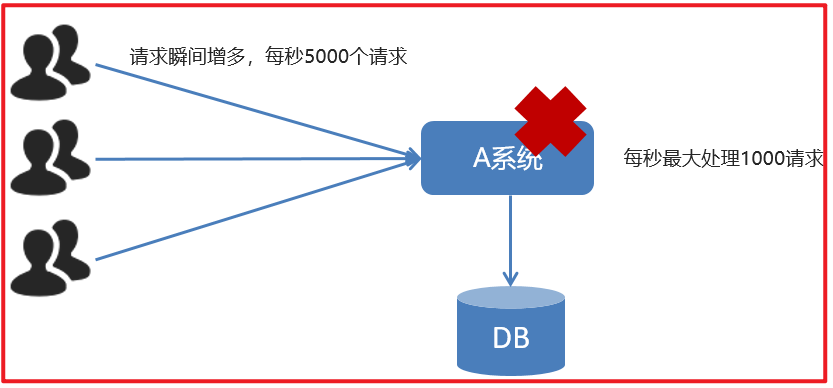

**传统模式的缺点：**

-   并发量大的时候，所有的请求直接怼到数据库，造成数据库连接异常

**中间件模式：**

消息被MQ保存起来了，然后系统就可以按照自己的消费能力来消费，比如每秒1000个数据，这样慢慢写入数据库，这样就不会卡死数据库了。

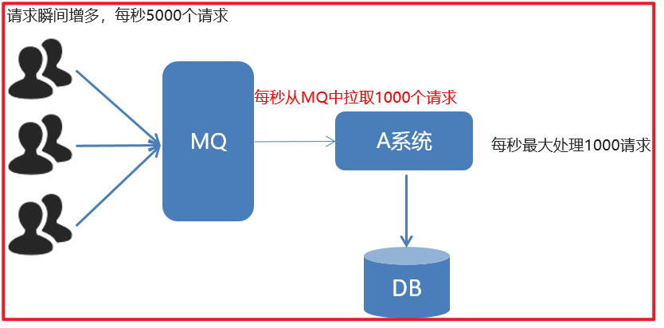

**中间件模式的的优点：**

系统A慢慢的按照数据库能处理的并发量，从消息队列中慢慢拉取消息。在生产中，这个短暂的高峰期积压是允许的。

流量削峰也叫做削峰填谷

使用了MQ之后，限制消费消息的速度为1000，但是这样一来，高峰期产生的数据势必会被积压在MQ中，高峰就被“削”掉了。但是因为消息积压，在高峰期过后的一段时间内，消费消息的速度还是会维持在 3消费完积压的消息，这就叫做“填谷”

### 1.3.4.什么是QPS，PV

QPS即每秒查询率，是对一个特定的查询服务器在规定时间内所处理流量多少的衡量标准。

每秒查询率

因特网上，经常用每秒查询率来衡量域名系统服务器的机器的性能，即为QPS。

或者理解：每秒的响应请求数，也即是最大吞吐能力。

计算关系：

QPS = 并发量 / 平均响应时间

并发量 = QPS \* 平均响应时间

原理：每天80%的访问集中在20%的时间里，这20%时间叫做峰值时间。

公式：( 总PV数 \* 80% ) / ( 每天秒数 \* 20% ) = 峰值时间每秒请求数(QPS) 。

机器：峰值时间每秒QPS / 单台机器的QPS = 需要的机器 。

### 1.3.5.什么是PV ， UV ， PR

① 什么是pv　　

**PV(page view)**，即页面浏览量，或点击量；通常是衡量一个网络新闻频道或网站甚至一条网络新闻的主要指标。

对pv的解释是，一个访问者在24小时(0点到24点)内到底看了你网站几个页面。这里需要强调：同一个人浏览你网站同一个页面，不重复计算pv量，点100次也算1次。说白了，pv就是一个访问者打开了你的几个页面。

PV之于网站，就像收视率之于电视，从某种程度上已成为投资者衡量商业网站表现的最重要尺度。

pv的计算：当一个访问者访问的时候，记录他所访问的页面和对应的IP，然后确定这个IP今天访问了这个页面没有。如果你的网站到了23点，单纯IP有60万条的话，每个访问者平均访问了3个页面，那么pv表的记录就要有180万条。

② 什么是uv
**uv(unique visitor)**，指访问某个站点或点击某条新闻的不同IP地址的人数。

在同一天内，uv只记录第一次进入网站的具有独立IP的访问者，在同一天内再次访问该网站则不计数。独立IP访问者提供了一定时间内不同观众数量的统计指标，而没有反应出网站的全面活动。

③ 什么是ＰＲ值
　　PR值，即**PageRank**，网页的级别技术，用来标识网页的等级/重要性。级别从1到10级，10级为满分。PR值越高说明该网页越受欢迎（越重要）。

　　例如：一个PR值为1的网站表明这个网站不太具有流行度，而PR值为7到10则表明这个网站非常受欢迎（或者说极其重要）。

## 1.4. AMQP 和 JMS

MQ是消息通信的模型；实现MQ的大致有两种主流方式：AMQP、JMS。

### 1.4.1. AMQP

AMQP是一种**高级消息队列协议（Advanced Message Queuing Protocol）**，更准确的说是一种binary wire-level protocol（**链接协议**）。这是其和JMS的本质差别，AMQP不从API层进行限定，而是直接定义网络交换的数据格式。

### 1.4.2. JMS

JMS即**Java消息服务（JavaMessage Service）** 应用程序接口，是一个Java平台中关于面向消息中间件（MOM）的API，用于在两个应用程序之间，或分布式系统中发送消息，进行异步通信。

### 1.4.3. AMQP 与 JMS 区别

-   JMS是定义了统一的接口，来对消息操作进行统一；AMQP是通过规定协议来统一数据交互的格式
-   JMS限定了必须使用Java语言；AMQP只是协议，不规定实现方式，因此是跨语言的。
-   JMS规定了两种消息模式；而AMQP的消息模式更加丰富

## 1.5. 消息队列产品

市场上常见的消息队列有如下：

-   ActiveMQ：基于JMS
-   ZeroMQ：基于C语言开发
-   Rabbitmq:基于AMQP协议，erlang语言开发，稳定性好
-   RocketMQ：基于JMS，阿里巴巴产品
-   Kafka：类似MQ的产品；分布式消息系统，高吞吐量

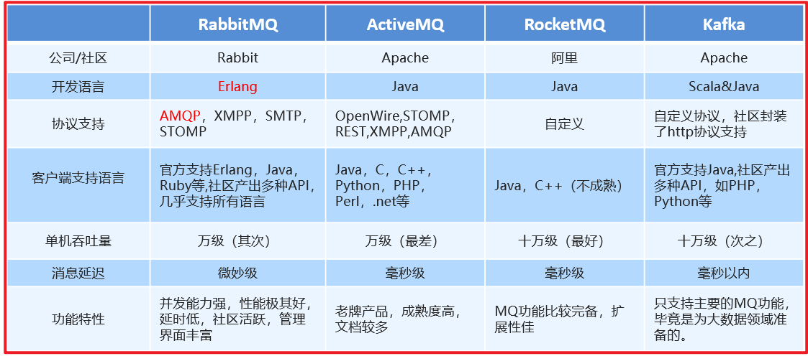

## 1.6. RabbitMQ

RabbitMQ是由erlang语言开发，基于AMQP（Advanced Message Queue 高级消息队列协议）协议实现的消息队列，它是一种应用程序之间的通信方法，消息队列在分布式系统开发中应用非常广泛。

RabbitMQ官方地址：[http://www.rabbitmq.com/](http://www.rabbitmq.com/ "http://www.rabbitmq.com/")&#x20;

RabbitMQ提供了**6种模式**：简单模式，work模式 ，Publish/Subscribe发布与订阅模式，Routing路由模式，Topics主题模式，RPC远程调用模式（远程调用，不太算MQ；暂不作介绍）；

官网对应模式介绍：[https://www.rabbitmq.com/getstarted.html](https://www.rabbitmq.com/getstarted.html "https://www.rabbitmq.com/getstarted.html")&#x20;

### 1.6.1 RabbitMQ简介

AMQP，即 Advanced
Message Queuing Protocol（高级消息队列协议），是一个网络协议，是应用层协议的一个开放标准，为面向消息的中间件设计。基于此协议的客户端与消息中间件可传递消息，并不受客户端/中间件不同产品，不同的开发语言等条件的限制。2006年，AMQP 规范发布。类比HTTP。

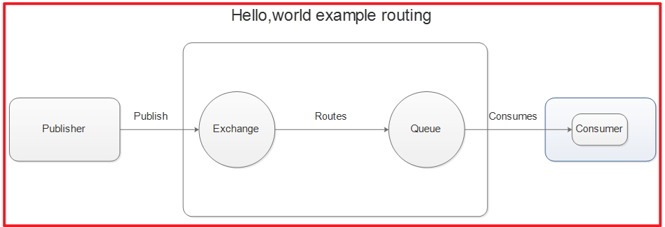

2007年，Rabbit 技术公司基于 AMQP 标准开发的 RabbitMQ 1.0 发布。RabbitMQ 采用 Erlang 语言开发。Erlang 语言由 Ericson 设计，专门为开发高并发和分布式系统的一种语言，在电信领域使用广泛。

RabbitMQ 基础架构如下图：

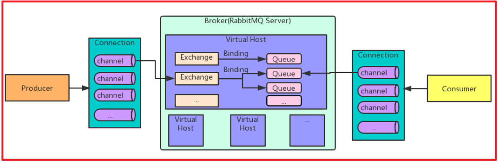

### 1.6.2 RabbitMQ 中的相关概念

Broker：接收和分发消息的应用，RabbitMQ Server就是 Message Broker

Virtual host:出于多租户和安全因素设计的，把 AMQP 的基本组件划分到一个虚拟的分组中，类似于网络中的 namespace 概念。当多个不同的用户使用同一个 RabbitMQ server 提供的服务时，可以划分出多个vhost，每个用户在自己的 vhost 创建 exchange／queue 等

Connection：publisher／consumer 和 broker 之间的 TCP 连接

Channel：如果每一次访问 RabbitMQ 都建立一个 Connection，在消息量大的时候建立 TCP Connection的开销将是巨大的，效率也较低。Channel 是在 connection 内部建立的逻辑连接，如果应用程序支持多线程，通常每个thread创建单独的 channel 进行通讯，AMQP method 包含了channel id 帮助客户端和message broker 识别 channel，所以 channel 之间是完全隔离的。Channel 作为轻量级的 Connection 极大减少了操作系统建立 TCP connection 的开销

Exchange：message 到达 broker 的第一站，根据分发规则，匹配查询表中的 routing key，分发消息到queue 中去。常用的类型有：**direct (point-to-point)**， **topic (publish-subscribe)** and **fanout (multicast)**

Queue：存储消息的容器，消息最终被送到这里，等待 consumer 取走

Binding：exchange 和 queue 之间的虚拟连接，binding 中可以包含 routing key。Binding 信息被保存到 exchange 中的查询表中，用于 message 的分发依据

