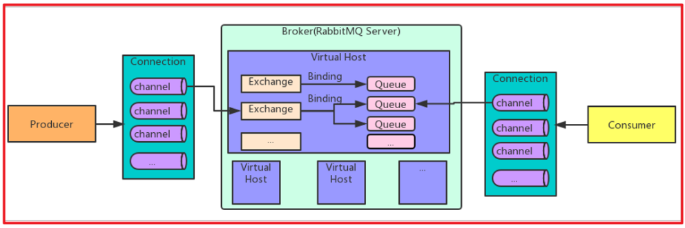

# 第十章 消息幂等性保障

幂等性指一次和多次请求某一个资源,对于资源本身应该具有同样的结果。也就是说,其任意多次执行对资源本身所产生的影响均与一次执行的影响相同。

在MQ中指,消费多条相同的消息,得到与消费该消息一次相同的结果。

**消息幂等性保障 乐观锁机制**

生产者发送消息：

id=1,money=500,version=1

消费者接收消息

id=1,money=500,version=1

id=1,money=500,version=1

消费者需要保证幂等性：第一次执行SQL语句

第一次执行：version=1

update account **set** money = money - 500 , version = version + 1

**where** id = 1 **and** version = 1

消费者需要保证幂等性：第二次执行SQL语句

第二次执行：version=2

update account **set** money = money - 500 , version = version + 1

**where** id = 1 **and** version = 1

