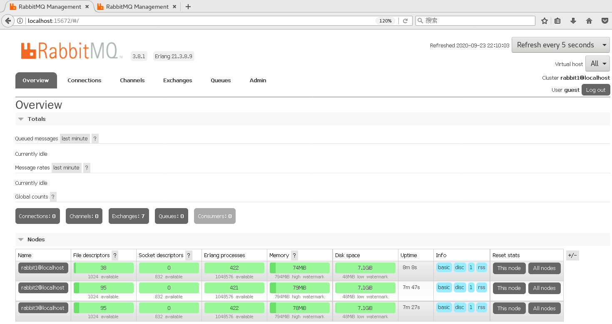
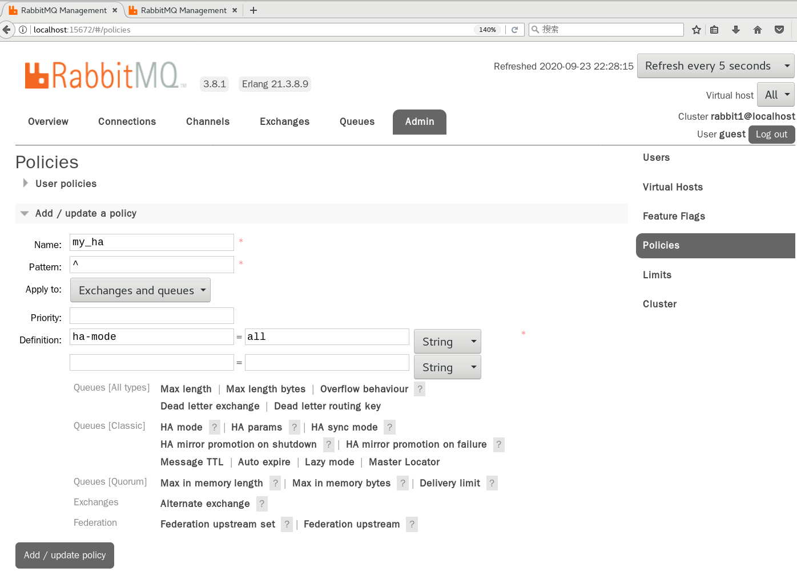
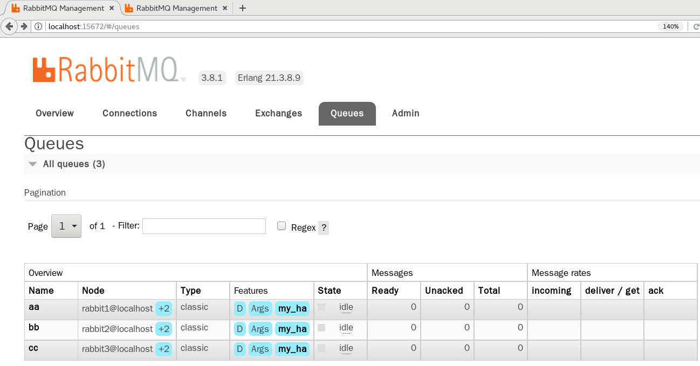
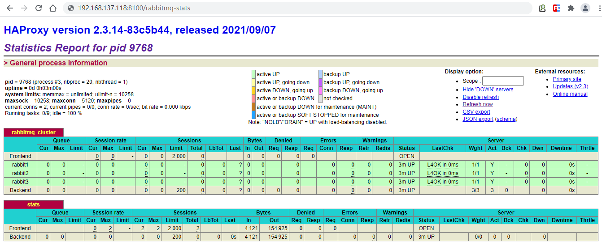

# 第十一章 RabbitMQ集群搭建

摘要：实际生产应用中都会采用消息队列的集群方案，如果选择RabbitMQ那么有必要了解下它的集群方案原理

一般来说，如果只是为了学习RabbitMQ或者验证业务工程的正确性那么在本地环境或者测试环境上使用其单实例部署就可以了，但是出于MQ中间件本身的可靠性、并发性、吞吐量和消息堆积能力等问题的考虑，在生产环境上一般都会考虑使用RabbitMQ的集群方案。

## 11.1 集群方案的原理

RabbitMQ这款消息队列中间件产品本身是基于Erlang编写，Erlang语言天生具备分布式特性（通过同步Erlang集群各节点的magic cookie来实现）。因此，RabbitMQ天然支持Clustering。这使得RabbitMQ本身不需要像ActiveMQ、Kafka那样通过ZooKeeper分别来实现HA方案和保存集群的元数据。集群是保证可靠性的一种方式，同时可以通过水平扩展以达到增加消息吞吐量能力的目的。

## 11.2 单机多实例部署

由于某些因素的限制，有时候你不得不在一台机器上去搭建一个rabbitmq集群，这个有点类似zookeeper的单机版。真实生成环境还是要配成多机集群的。有关怎么配置多机集群的可以参考其他的资料，这里主要论述如何在单机中配置多个rabbitmq实例。

主要参考官方文档：[https://www.rabbitmq.com/clustering.html](https://www.rabbitmq.com/clustering.html "https://www.rabbitmq.com/clustering.html")&#x20;

首先确保RabbitMQ运行没有问题

| \[root\@atguigu \~]# systemctl start rabbitmq-server.service&#xA;\[root\@atguigu \~]# systemctl status rabbitmq-server.service&#xA; |
| ----------------------------------------------------------------------------------------------------------------------------------- |

停止rabbitmq服务

| \[root\@atguigu \~]# systemctl stop rabbitmq-server.service&#xA; |
| ---------------------------------------------------------------- |

启动三个节点做集群演示：

由于web管理插件端口占用,所以还要指定其web插件占用的端口号。

| \[root\@atguigu \~]# RABBITMQ\_NODE\_PORT=5672 RABBITMQ\_NODENAME=rabbit1 RABBITMQ\_SERVER\_START\_ARGS="-rabbitmq\_management listener \[{port,15672}]"  rabbitmq-server -detached&#xA;\[root\@atguigu \~]# RABBITMQ\_NODE\_PORT=5673 RABBITMQ\_NODENAME=rabbit2 RABBITMQ\_SERVER\_START\_ARGS="-rabbitmq\_management listener \[{port,15673}]"  rabbitmq-server -detached&#xA;\[root\@atguigu \~]# RABBITMQ\_NODE\_PORT=5674 RABBITMQ\_NODENAME=rabbit3 RABBITMQ\_SERVER\_START\_ARGS="-rabbitmq\_management listener \[{port,15674}]"  rabbitmq-server -detached&#xA; |
| ------------------------------------------------------------------------------------------------------------------------------------------------------------------------------------------------------------------------------------------------------------------------------------------------------------------------------------------------------------------------------------------------------------------------------------------------------------------------------------------------------------------------------------------------------------------------ |

启动三个节点后，分别访问三个节点，后台管理页面，看看是否OK.

停止服务命令：

| rabbitmqctl -n rabbit1 stop&#xA;rabbitmqctl -n rabbit2 stop&#xA;rabbitmqctl -n rabbit3 stop&#xA; |
| ------------------------------------------------------------------------------------------------ |

rabbit1操作作为主节点：

| \[root\@atguigu \~]# **rabbitmqctl -n rabbit1 stop\_app**  &#xA;Stopping node rabbit1\@localhost ...&#xA;\[root\@atguigu \~]# **rabbitmqctl -n rabbit1 reset**     &#xA;Resetting node rabbit1\@localhost ...&#xA;\[root\@atguigu \~]# **rabbitmqctl -n rabbit1 start\_app**&#xA;Starting node rabbit1\@localhost ...&#xA; |
| -------------------------------------------------------------------------------------------------------------------------------------------------------------------------------------------------------------------------------------------------------------------------------------------------------------------------- |

rabbit2操作为从节点：

| \[root\@atguigu \~]# **rabbitmqctl -n rabbit2 stop\_app**&#xA;Stopping node rabbit2\@localhost ...&#xA;\[root\@atguigu \~]# **rabbitmqctl -n rabbit2 reset**&#xA;Resetting node rabbit2\@localhost ...&#xA;\[root\@atguigu \~]# **rabbitmqctl -n rabbit2 ****join\_cluster**** rabbit1**&#xA;Clustering node rabbit2\@localhost with rabbit1 ...&#xA;\[root\@atguigu \~]# **rabbitmqctl -n rabbit2 start\_app**&#xA;Starting node rabbit2\@localhost ...&#xA; |
| ------------------------------------------------------------------------------------------------------------------------------------------------------------------------------------------------------------------------------------------------------------------------------------------------------------------------------------------------------------------------------------------------------------------------------------------------------------- |

rabbit3操作为从节点：

| \[root\@atguigu \~]# **rabbitmqctl -n rabbit3 stop\_app**&#xA;Stopping node rabbit3\@localhost ...&#xA;\[root\@atguigu \~]#\*\* rabbitmqctl -n rabbit3 reset\*\*&#xA;Resetting node rabbit3\@localhost ...&#xA;\[root\@atguigu \~]# **rabbitmqctl -n rabbit3 ****join\_cluster**** rabbit1**&#xA;Clustering node rabbit3\@localhost with rabbit1\@super ...&#xA;\[root\@atguigu \~]# **rabbitmqctl -n rabbit3 start\_app**&#xA;Starting node rabbit3\@localhost ...&#xA; |
| ------------------------------------------------------------------------------------------------------------------------------------------------------------------------------------------------------------------------------------------------------------------------------------------------------------------------------------------------------------------------------------------------------------------------------------------------------------------------ |

查看集群状态：

| \[root\@atguigu \~]# **rabbitmqctl -n rabbit1 cluster\_status**&#xA;Cluster status of node rabbit1\@localhost ...&#xA;Basics&#xA; &#xA;Cluster name: rabbit1\@localhost&#xA; &#xA;Disk Nodes&#xA; &#xA;rabbit1\@localhost&#xA;rabbit2\@localhost&#xA;rabbit3\@localhost&#xA; &#xA;Running Nodes&#xA; &#xA;rabbit1\@localhost&#xA;rabbit2\@localhost&#xA;rabbit3\@localhost&#xA; &#xA;Versions&#xA; &#xA;rabbit1\@localhost: RabbitMQ 3.8.1 on Erlang 21.3.8.9&#xA;rabbit2\@localhost: RabbitMQ 3.8.1 on Erlang 21.3.8.9&#xA;rabbit3\@localhost: RabbitMQ 3.8.1 on Erlang 21.3.8.9&#xA; &#xA;Alarms&#xA; &#xA;(none)&#xA; &#xA;Network Partitions&#xA; &#xA;(none)&#xA; &#xA;Listeners&#xA; &#xA;Node: rabbit1\@localhost, interface: \[::], port: 25672, protocol: clustering, purpose: inter-node and CLI tool communication&#xA;Node: rabbit1\@localhost, interface: \[::], port: 5672, protocol: amqp, purpose: AMQP 0-9-1 and AMQP 1.0&#xA;Node: rabbit1\@localhost, interface: \[::], port: 15672, protocol: http, purpose: HTTP API&#xA;Node: rabbit2\@localhost, interface: \[::], port: 25673, protocol: clustering, purpose: inter-node and CLI tool communication&#xA;Node: rabbit2\@localhost, interface: \[::], port: 5673, protocol: amqp, purpose: AMQP 0-9-1 and AMQP 1.0&#xA;Node: rabbit2\@localhost, interface: \[::], port: 15673, protocol: http, purpose: HTTP API&#xA;Node: rabbit3\@localhost, interface: \[::], port: 25674, protocol: clustering, purpose: inter-node and CLI tool communication&#xA;Node: rabbit3\@localhost, interface: \[::], port: 5674, protocol: amqp, purpose: AMQP 0-9-1 and AMQP 1.0&#xA;Node: rabbit3\@localhost, interface: \[::], port: 15674, protocol: http, purpose: HTTP API&#xA; &#xA;Feature flags&#xA; &#xA;Flag: drop\_unroutable\_metric, state: enabled&#xA;Flag: empty\_basic\_get\_metric, state: enabled&#xA;Flag: implicit\_default\_bindings, state: enabled&#xA;Flag: quorum\_queue, state: enabled&#xA;Flag: virtual\_host\_metadata, state: enabled&#xA; |
| ------------------------------------------------------------------------------------------------------------------------------------------------------------------------------------------------------------------------------------------------------------------------------------------------------------------------------------------------------------------------------------------------------------------------------------------------------------------------------------------------------------------------------------------------------------------------------------------------------------------------------------------------------------------------------------------------------------------------------------------------------------------------------------------------------------------------------------------------------------------------------------------------------------------------------------------------------------------------------------------------------------------------------------------------------------------------------------------------------------------------------------------------------------------------------------------------------------------------------------------------------------------------------------------------------------------------------------------------------------------------------------------------------------------------------------------------------------------------------------------------------------------------------------------------------------------------------------------------------------------------------------------------------------------------------------------------------------------------------------------------------------------------------------------------------------------------------------------------------------------------------------------------------------------------------------------------------------------------------------------------------------------------------- |

web监控：

## rabbitmqctl -n rabbit1 add\_user admin admin

**rabbitmqctl -n rabbit1 set\_user\_tags admin administrator**

**rabbitmqctl -n rabbit1 change\_password admin 123456**

## 11.3 集群管理

rabbitmqctl join\_cluster {cluster\_node} \[–ram]

将节点加入指定集群中。在这个命令执行前需要停止RabbitMQ应用并重置节点。

rabbitmqctl cluster\_status

显示集群的状态。

rabbitmqctl change\_cluster\_node\_type {disc|ram}

修改集群节点的类型。在这个命令执行前需要停止RabbitMQ应用。

rabbitmqctl forget\_cluster\_node \[–offline]

将节点从集群中删除，允许离线执行。

rabbitmqctl update\_cluster\_nodes {clusternode}

在集群中的节点应用启动前咨询clusternode节点的最新信息，并更新相应的集群信息。这个和join\_cluster不同，它不加入集群。考虑这样一种情况，节点A和节点B都在集群中，当节点A离线了，节点C又和节点B组成了一个集群，然后节点B又离开了集群，当A醒来的时候，它会尝试联系节点B，但是这样会失败，因为节点B已经不在集群中了。rabbitmqctl update\_cluster\_nodes -n A C可以解决这种场景。

rabbitmqctl cancel\_sync\_queue \[-p vhost] {queue}

取消队列queue同步镜像的操作。

rabbitmqctl set\_cluster\_name {name}

设置集群名称。集群名称在客户端连接时会通报给客户端。Federation和Shovel插件也会有用到集群名称的地方。集群名称默认是集群中第一个节点的名称，通过这个命令可以重新设置。

## 11.4 RabbitMQ镜像集群配置

上面已经完成RabbitMQ默认集群模式，但并不保证队列的高可用性，尽管交换机、绑定这些可以复制到集群里的任何一个节点，但是队列内容不会复制。虽然该模式解决一项目组节点压力，但队列节点宕机直接导致该队列无法应用，只能等待重启，所以要想在队列节点宕机或故障也能正常应用，就要复制队列内容到集群里的每个节点，必须要创建镜像队列。

镜像队列是基于普通的集群模式的，然后再添加一些策略，所以你还是得先配置普通集群，然后才能设置镜像队列，我们就以上面的集群接着做。

设置的镜像队列可以通过开启的网页的管理端Admin->Policies，也可以通过命令。

-   Name:策略名称
-   Pattern：匹配的规则，如果是匹配所有的队列，是^.
-   Definition:使用ha-mode模式中的all，也就是同步所有匹配的队列。问号链接帮助文档。

## 11.5 负载均衡-HAProxy

HAProxy提供高可用性、负载均衡以及基于TCP和HTTP应用的代理，支持虚拟主机，它是免费、快速并且可靠的一种解决方案,包括Twitter，Reddit，StackOverflow，GitHub在内的多家知名互联网公司在使用。HAProxy实现了一种事件驱动、单一进程模型，此模型支持非常大的并发连接数。

[https://www.haproxy.org/](https://www.haproxy.org/ "https://www.haproxy.org/")&#x20;

### 11.5.1 安装HAProxy

| //下载依赖包&#xA;yum install gcc vim wget&#xA;//上传haproxy源码包; -C解压到指定的目录&#xA;tar -zxvf haproxy-2.3.14.tar.gz -C /usr/local&#xA;//进入目录、进行编译、安装&#xA;cd /usr/local/haproxy-2.3.14&#xA;// make 表示编译；TARGET=linux31 表示CentOS7系统；PREFIX=/usr/local/haproxy指定安装路径&#xA;// TARGET=linux310，内核版本，使用uname -r查看内核，如：3.10.0-514.el7，此时该参数就为linux310；&#xA;&#xA;make TARGET=linux310 PREFIX=/usr/local/haproxy&#xA;&#xA;make install PREFIX=/usr/local/haproxy&#xA;&#xA;mkdir /etc/haproxy&#xA;//添加用户组：-r 创建一个系统组；-g 组ID&#xA;groupadd -r -g 149 haproxy&#xA;//添加用户：-g 新账户组的名称；-r 创建一个系统用户；-s 新用户的登录shell; -u 新账户的用户ID&#xA;useradd -g haproxy -r -s /sbin/nologin -u 149 haproxy&#xA;//创建haproxy配置文件&#xA;vim /etc/haproxy/haproxy.cfg&#xA; |
| --------------------------------------------------------------------------------------------------------------------------------------------------------------------------------------------------------------------------------------------------------------------------------------------------------------------------------------------------------------------------------------------------------------------------------------------------------------------------------------------------------------------------------------------------------------------------------------------------------------------------------------------------------------------------------------------------------------------- |

### 11.5.2 配置HAProxy

配置文件路径：/etc/haproxy/haproxy.cfg

| #全局配置&#xA;global&#xA;    \#日志输出配置，所有日志都记录在本机，通过local0输出&#xA;    log 127.0.0.1 local0 info&#xA;    \#最大连接数&#xA;    maxconn 5120&#xA;    \#改变当前的工作目录&#xA;    chroot /usr/local/haproxy&#xA;    \#以指定的UID运行haproxy进程&#xA;    uid 99&#xA;    \#以指定的GID运行haproxy进程&#xA;    gid 99&#xA;    \#以守护进程方式运行haproxy&#xA;    daemon&#xA;    quiet&#xA;    nbproc 20&#xA;    \#当前进程PID文件&#xA;    pidfile /var/run/haproxy.pid&#xA;#默认配置&#xA;defaults&#xA;    \#应用全局的日志配置&#xA;    log global&#xA;    \#默认的模式mode{tcp\|http\|health}&#xA;    mode tcp&#xA;    \#日志类别&#xA;    option tcplog&#xA;    \#不记录检查检查日志信息&#xA;    option dontlognull&#xA;    \#3次失败则认为服务不可用&#xA;    retries 3&#xA;    option redispatch&#xA;    \#每个进程可用的最大连接数&#xA;    maxconn 2000   &#xA;#绑定配置&#xA;listen rabbitmq\_cluster&#xA;    bind \*:5677&#xA;    \#配置TCP模式&#xA;    mode tcp&#xA;    \#balance url\_param userid&#xA;    \#balance url\_param session\_id check\_post 64&#xA;    \#balance hdr(User-Agent)&#xA;    \#balance hdr(host)&#xA;    \#balance hdr(Host) use\_domain\_only&#xA;    \#balance rdp-cookie&#xA;    \#balance leastconn&#xA;    \#balance source //ip&#xA;    \#简单的轮询&#xA;    balance roundrobin&#xA;    \#server rabbit1 定义服务内部标识，&#xA;    \#127.0.0.1:5672 服务连接IP和端口，&#xA;    \#check inter 5000 定义每隔多少毫秒检查服务是否可用，&#xA;    \#rise 2 服务故障后需要多少次检查才能被再次确认可用，&#xA;    \#fall 2 经历多次失败的检查检查后，haproxy才会停止使用此服务&#xA;    \#weight 1 定义服务权重&#xA;    server rabbit1 192.168.197.129:5672 check inter 5000 rise 2 fall 2 weight 1&#xA;    server rabbit2 192.168.197.129:5673 check inter 5000 rise 2 fall 2 weight 1&#xA;    server rabbit3 192.168.197.129:5674 check inter 5000 rise 2 fall 2 weight 1&#xA;#haproxy监控页面地址&#xA;listen stats&#xA;    bind 192.168.197.129:8100&#xA;    mode http&#xA;    option httplog&#xA;    stats enable&#xA;    stats uri /rabbitmq-stats&#xA;    stats refresh 5s&#xA; |
| ------------------------------------------------------------------------------------------------------------------------------------------------------------------------------------------------------------------------------------------------------------------------------------------------------------------------------------------------------------------------------------------------------------------------------------------------------------------------------------------------------------------------------------------------------------------------------------------------------------------------------------------------------------------------------------------------------------------------------------------------------------------------------------------------------------------------------------------------------------------------------------------------------------------------------------------------------------------------------------------------------------------------------------------------------------------------------------------------------------------------------------------------------------------------------------------------------------------------------------------------------------------------------------------------------------------------------------------------------------------------------------------------------------------------------------------------------------------------------------------------------------------------------------------------------------------------------------------------------------------------------------------------------------------------------------------------------------------------------------------------------------------------------------------------------------------------------------------------------------------------------------------- |

启动HAproxy负载

| /usr/local/haproxy/sbin/haproxy -f /etc/haproxy/haproxy.cfg&#xA; |
| ---------------------------------------------------------------- |

//查看haproxy进程状态

| ps -ef \| grep haproxy&#xA; |
| --------------------------- |

访问如下地址对mq节点进行监控

[http://192.168.197.129:8100/rabbitmq-stats](http://192.168.197.129:8100/rabbitmq-stats "http://192.168.197.129:8100/rabbitmq-stats")

springboot yml文件中访问mq集群地址：

spring:&#x20;

&#x20; rabbitmq:&#x20;

&#x20;   host: 192.168.137.118

&#x20;   port: 5677

&#x20;   username: admin

&#x20;   password: 123456

virtual-host: /

\#addresses: 192.168.137.118:5672,192.168.137.118:5673,192.168.137.118:5674

