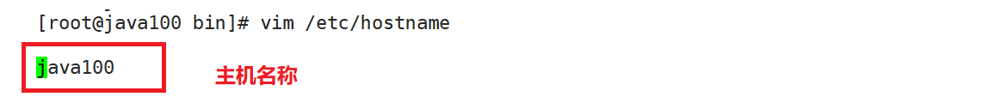
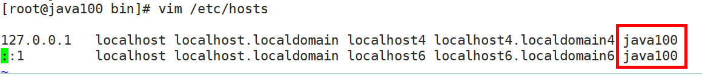
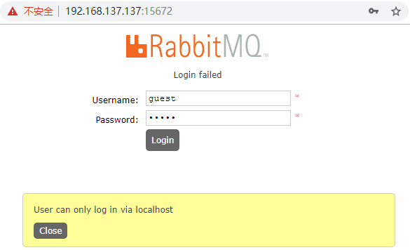
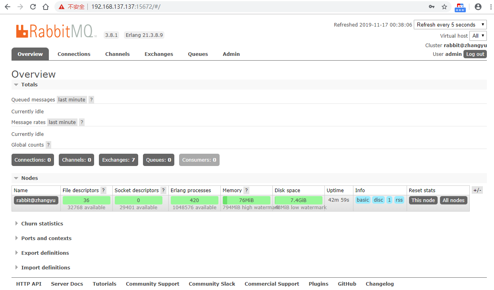
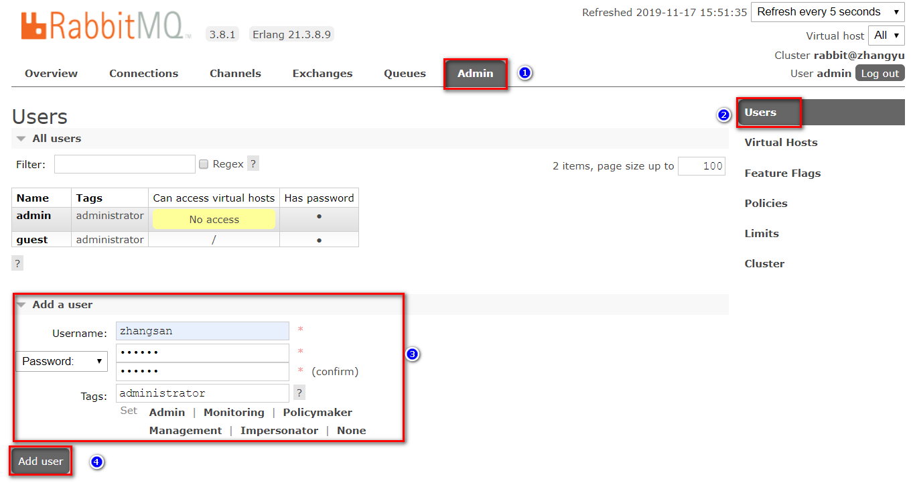
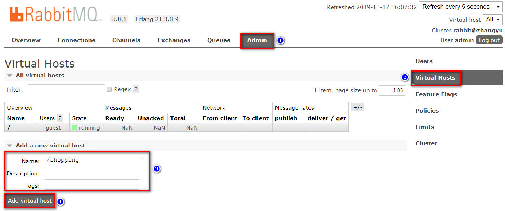
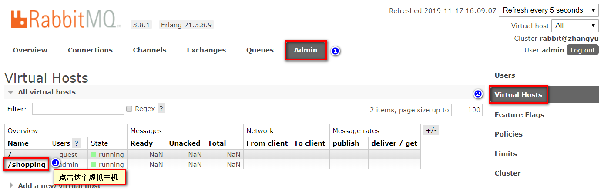
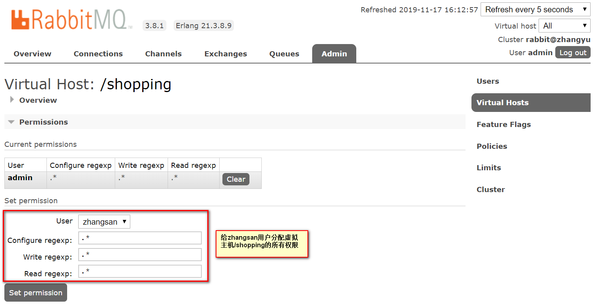
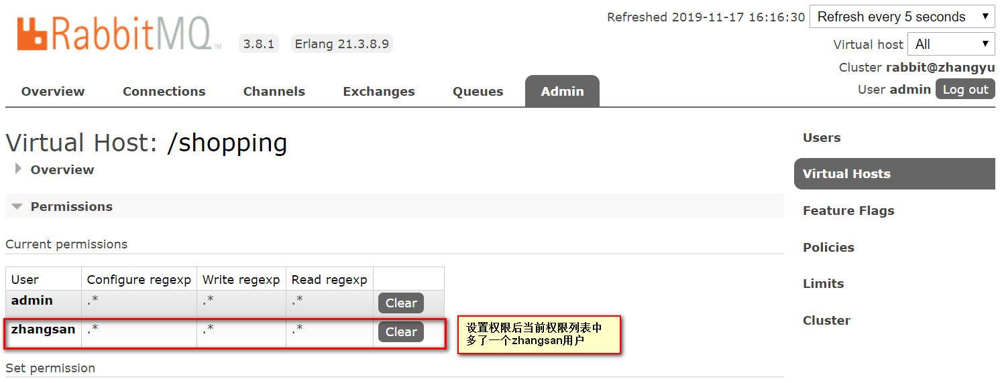

# 第二章 安装及配置RabbitMQ

## 2.1. 下载和安装

### 2.1.1. 下载

**1.下载Erlang的rpm包**

RabbitMQ是Erlang语言编写，所以Erlang环境必须要有，注：Erlang环境一定要与RabbitMQ版本匹配：

[https://www.rabbitmq.com/which-erlang.html](https://www.rabbitmq.com/which-erlang.html "https://www.rabbitmq.com/which-erlang.html")&#x20;

**2.下载socat的rpm包**

rabbitmq安装依赖于socat，所以需要下载socat。

socat下载地址：[http://repo.iotti.biz/CentOS/7/x86\_64/socat-1.7.3.2-5.el7.lux.x86\_64.rpm](http://repo.iotti.biz/CentOS/7/x86_64/socat-1.7.3.2-5.el7.lux.x86_64.rpm "http://repo.iotti.biz/CentOS/7/x86_64/socat-1.7.3.2-5.el7.lux.x86_64.rpm")

**3.下载RabbitMQ的rpm包**

RabbitMQ下载地址：[https://www.rabbitmq.com/download.html](https://www.rabbitmq.com/download.html "https://www.rabbitmq.com/download.html")（根据自身需求及匹配关系，下载对应rpm包）rabbitmq-server-3.8.1-1.el7.noarch.rpm

也可从github等网站下载。<https://hub.fastgit.org/rabbitmq/rabbitmq-server/releases/>

### 2.1.2. 安装

#### 1.安装Erlang、Socat、RabbitMQ

\*\*①rpm -ivh erlang-21.3.8.9-1.el7.x86\_64.rpm \*\*​

\*\*②rpm -ivh \*\***socat-1.7.3.2-1.el6.lux.x86\_64.rpm**

在安装rabbitmq之前需要先安装socat，否则，报错。

可以采用yum安装方式：yum install socat，我们这里采用rpm安装方式

\*\*③rpm -ivh ****rabbitmq-server-3.8.1-1.el7.noarch.rpm**** \*\*

/usr/lib/rabbitmq/bin/ 

#### 2.启用管理插件

rabbitmq-plugins enable rabbitmq\_management

#### 3.修改主机名

（1）vim /etc/hostname

（2）vim /etc/hosts

#### 4.启动RabbitMQ

systemctl start rabbitmq-server.service

systemctl status rabbitmq-server.service

systemctl restart rabbitmq-server.service

systemctl stop rabbitmq-server.service&#x20;

#### 5.查看进程

ps -ef | grep rabbitmq

### 2.1.3. 测试

-   关闭防火墙：systemctl stop firewalld.service
-   在web浏览器中输入地址：http\://虚拟机ip:15672/
-   输入默认账号密码： guest ： guest，guest用户默认不允许远程连接。

**增加自定义账号**

-   添加管理员账号密码：rabbitmqctl add\_user admin admin
-   分配账号角色：rabbitmqctl set\_user\_tags admin administrator
-   修改密码：rabbitmqctl change\_password admin 123456
-   查看用户列表：rabbitmqctl list\_users

使用新账号登录，成功界面

**管理界面标签页介绍**

-   overview：概览
-   connections：无论生产者还是消费者，都需要与RabbitMQ建立连接后才可以完成消息的生产和消费，在这里可以查看连接情况
-   channels：通道，建立连接后，会形成通道，消息的投递获取依赖通道。
-   Exchanges：交换机，用来实现消息的路由
-   Queues：队列，即消息队列，消息存放在队列中，等待消费，消费后被移除队列。

**端口：**

-   5672：rabbitMq的编程语言客户端连接端口
-   15672：rabbitMq管理界面端口
-   25672：rabbitMq集群的端口

### 2.1.4. 卸载

-   rpm -qa | grep rabbitmq
-   rpm -e rabbitmq-server

## 2.2. 管理界面

### 2.2.1. 添加用户

如果不使用guest，我们也可以自己创建一个用户：

1、 超级管理员(administrator)

可登录管理控制台，可查看所有的信息，并且可以对用户，策略(policy)进行操作。

2、 监控者(monitoring)

可登录管理控制台，同时可以查看rabbitmq节点的相关信息(进程数，内存使用情况，磁盘使用情况等)

3、 策略制定者(policymaker)

可登录管理控制台， 同时可以对policy进行管理。但无法查看节点的相关信息。

4、 普通管理者(management)

仅可登录管理控制台，无法看到节点信息，也无法对策略进行管理。

5、 其他

无法登录管理控制台，通常就是普通的生产者和消费者。

### 2.2.2. 创建Virtual Hosts

虚拟主机：类似于mysql中的database。他们都是以“/”开头

### 2.2.3. 设置权限

 

 

