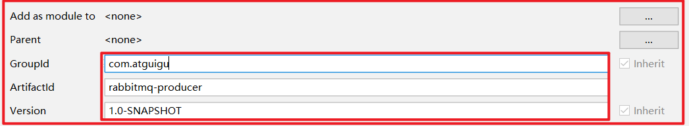
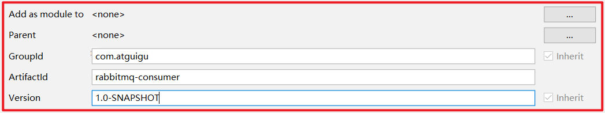
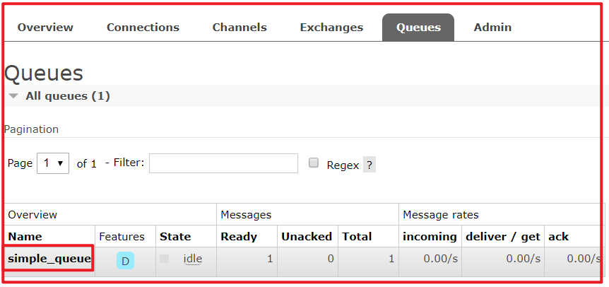
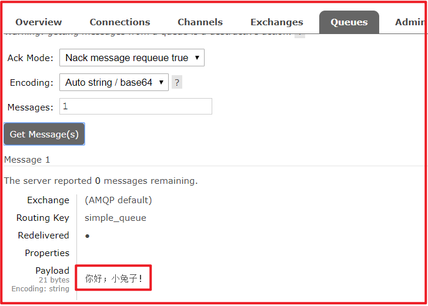
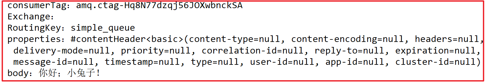

# 第三章 RabbitMQ入门

官网： [https://www.rabbitmq.com/](https://www.rabbitmq.com/ "https://www.rabbitmq.com/")&#x20;

需求：使用简单模式完成消息传递

步骤：&#x20;

1.  &#x20;创建工程（生产者、消费者）

② 分别添加依赖

③ 编写生产者发送消息

④ 编写消费者接收消息

## 3.1. 搭建示例工程

### 3.1.1. 创建工程

创建项目：rabbitmq\_producer

创建项目：rabbitmq\_consumer

### 3.1.2. 添加依赖

往两个rabbitmq的pom.xml文件中添加如下依赖：

&#x20;   <**dependencies**>

&#x20;       <**dependency**>

&#x20;           <**groupId**>com.rabbitmq\</**groupId**>

&#x20;           <**artifactId**>amqp-client\</**artifactId**>

&#x20;           <**version**>5.6.0\</**version**>

&#x20;       \</**dependency**>

&#x20;   \</**dependencies**>

&#x20;   <**build**>

&#x20;       <**plugins**>

&#x20;           <**plugin**>

&#x20;               <**groupId**>org.apache.maven.plugins\</**groupId**>

&#x20;               <**artifactId**>maven-compiler-plugin\</**artifactId**>

&#x20;               <**version**>3.8.0\</**version**>

&#x20;               <**configuration**>

&#x20;                   <**source**>1.8\</**source**>

&#x20;                   <**target**>1.8\</**target**>

&#x20;               \</**configuration**>

&#x20;           \</**plugin**>

&#x20;       \</**plugins**>

&#x20;   \</**build**>

## 3.2. 编写生产者

编写消息生产者 com.atguigu.rabbitmq.simple.Producer

**package** com.atguigu.rabbitmq.simple;

**import** com.rabbitmq.client.Channel;

**import** com.rabbitmq.client.Connection;

**import** com.rabbitmq.client.ConnectionFactory;

**import** java.util.Map;

**public** **class** **Producer** {

&#x20;   **public** **static** **void** **main**(String\[] args) **throws** Exception {

&#x20;       //创建连接工厂

&#x20;       ConnectionFactory connectionFactory = **new** ConnectionFactory();

&#x20;       //主机地址

&#x20;       connectionFactory.setHost("192.168.137.118");

&#x20;       //连接端口;默认为 5672

&#x20;       connectionFactory.setPort(5672);

&#x20;       //虚拟主机名称;默认为 /

&#x20;       connectionFactory.setVirtualHost("/");

&#x20;       //连接用户名；默认为guest

&#x20;       connectionFactory.setUsername("admin");

&#x20;       //连接密码；默认为guest

&#x20;       connectionFactory.setPassword("123456");

&#x20;       //创建连接

&#x20;       Connection connection = connectionFactory.newConnection();

&#x20;       //创建频道

&#x20;       Channel channel = connection.createChannel();

&#x20;       // 声明（创建）队列

&#x20;       /\*\*

&#x20;        \* queue      参数1：队列名称

&#x20;        \* durable    参数2：是否定义持久化队列,当mq重启之后,还在

&#x20;        \* exclusive  参数3：是否独占本次连接

&#x20;        \*            ① 是否独占,只能有一个消费者监听这个队列

&#x20;        \*            ② 当connection关闭时,是否删除队列

&#x20;        \* autoDelete 参数4：是否在不使用的时候自动删除队列,当没有consumer时,自动删除

&#x20;        \* arguments  参数5：队列其它参数

&#x20;        \*/

&#x20;       channel.queueDeclare("simple\_queue", **true**, **false**, **false**, **null**);

&#x20;       // 要发送的信息

&#x20;       String message = "你好；小兔子！";

&#x20;       /\*\*

&#x20;        \* 参数1：交换机名称,如果没有指定则使用默认Default Exchage

&#x20;        \* 参数2：路由key,简单模式可以传递队列名称

&#x20;        \* 参数3：配置信息

&#x20;        \* 参数4：消息内容

&#x20;        \*/

&#x20;       channel.basicPublish("", "simple\_queue", **null**, message.getBytes());

&#x20;       System.out.println("已发送消息：" + message);

&#x20;       // 关闭资源

&#x20;       channel.close();

&#x20;       connection.close();

&#x20;   }

}

运行程序：[http://192.168.137.118:15672](http://127.0.0.1:15672 "http://192.168.137.118:15672")&#x20;

在执行上述的消息发送之后；可以登录rabbitMQ的管理控制台,可以发现队列和其消息：

## 3.3. 编写消费者

编写消息的消费者 com.atguigu.rabbitmq.simple.Consumer

**package** com.atguigu.rabbitmq.simple;

**import**com.rabbitmq.client. \*;

**import** java.io.IOException;

**import** java.util.concurrent.TimeoutException;

**public** **class** **Consumer** {

&#x20;   **public** **static** **void** **main**(String\[] args) **throws** Exception {

&#x20;       //1.创建连接工厂

&#x20;       ConnectionFactory factory = **new** ConnectionFactory();

&#x20;       //2. 设置参数

&#x20;       factory.setHost("192.168.137.118");//ip

&#x20;       factory.setPort(5672); //端口  默认值 5672

&#x20;       factory.setVirtualHost("/");//虚拟机 默认值/

&#x20;       factory.setUsername("admin");//用户名

&#x20;       factory.setPassword("123456");//密码

&#x20;       //3. 创建连接 Connection

&#x20;       Connection connection = factory.newConnection();

&#x20;       //4. 创建Channel

&#x20;       Channel channel = connection.createChannel();

&#x20;       //5. 创建队列Queue

&#x20;       /\*

&#x20;       queueDeclare(String queue, boolean durable, boolean exclusive, boolean autoDelete, Map\<String, Object> arguments)

&#x20;       参数：

&#x20;           1\. queue：队列名称

&#x20;           2\. durable：是否持久化,当mq重启之后,还在

&#x20;           3\. exclusive：

&#x20;               \* 是否独占。只能有一个消费者监听这队列

&#x20;               \* 当Connection关闭时,是否删除队列

&#x20;           4\. autoDelete：是否自动删除。当没有Consumer时,自动删除掉

&#x20;           5\. arguments：参数。

&#x20;        \*/

&#x20;       //如果没有一个名字叫simple\_queue的队列,则会创建该队列,如果有则不会创建

&#x20;       channel.queueDeclare("simple\_queue",**true**,**false**,**false**,**null**);

&#x20;       // 接收消息

&#x20;       DefaultConsumer consumer = **new** DefaultConsumer(channel){

&#x20;           /\*

&#x20;              回调方法,当收到消息后,会自动执行该方法

&#x20;              1\. consumerTag：标识

&#x20;              2\. envelope：获取一些信息,交换机,路由key...

&#x20;              3\. properties：配置信息

&#x20;              4\. body：数据

&#x20;           \*/

&#x20;           @Override

&#x20;           **public** **void** **handleDelivery**(String consumerTag, Envelope envelope, AMQP.BasicProperties properties, **byte**\[] body) **throws** IOException {

&#x20;               System.out.println("consumerTag："+consumerTag);

&#x20;               System.out.println("Exchange："+envelope.getExchange());

&#x20;               System.out.println("RoutingKey："+envelope.getRoutingKey());

&#x20;               System.out.println("properties："+properties);

&#x20;               System.out.println("body："+**new** String(body));

&#x20;           }

&#x20;       };

&#x20;       /\*

&#x20;       basicConsume(String queue, boolean autoAck, Consumer callback)

&#x20;       参数：

&#x20;           1\. queue：队列名称

&#x20;           2\. autoAck：是否自动确认 ,类似咱们发短信,发送成功会收到一个确认消息

&#x20;           3\. callback：回调对象

&#x20;        \*/

&#x20;       // 消费者类似一个监听程序,主要是用来监听消息

&#x20;       channel.basicConsume("simple\_queue",**true**,consumer);

&#x20;  }

}

运行程序

## 3.4. 小结

上述的入门案例中中其实使用的是如下的简单模式：

在上图的模型中，有以下概念：

-   P：生产者，也就是要发送消息的程序
-   C：消费者：消息的接受者，会一直等待消息到来。
-   queue：消息队列，图中红色部分。类似一个邮箱，可以缓存消息；生产者向其中投递消息，消费者从其中取出消息。

