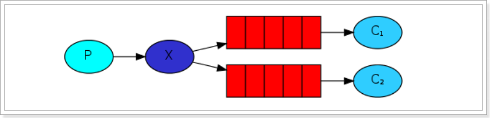

# 第五章 RabbitMQ模式

## 5.1. Work queues工作队列模式

### 5.1.1. 模式说明

Work Queues与入门程序的简单模式相比，多了一个或一些消费端，多个消费端共同消费同一个队列中的消息。

**应用场景**：对于 任务过重或任务较多情况使用工作队列可以**提高****任务处理的****速度**。

### 5.1.2. 代码

Work Queues与入门程序的简单模式的代码是几乎一样的；可以完全复制，并复制多一个消费者进行多个消费者同时消费消息的测试。

#### 1）抽取工具类

package com.atguigu.rabbitmq.util;

import com.rabbitmq.client.Connection;

import com.rabbitmq.client.ConnectionFactory;

public class **ConnectionUtil** {

&#x20;   public static Connection getConnection() throws Exception {

&#x20;       //定义连接工厂

&#x20;       ConnectionFactory factory = new ConnectionFactory();

&#x20;       //设置服务地址

&#x20;       factory.setHost("192.168.137.118");

&#x20;       //端口

&#x20;       factory.setPort(5672);

&#x20;       //设置账号信息，用户名、密码、vhost

&#x20;       factory.setVirtualHost("/");

&#x20;       factory.setUsername("admin");

&#x20;       factory.setPassword("123456");

&#x20;       // 通过工程获取连接

&#x20;       Connection connection = factory.newConnection();

&#x20;       return connection;

&#x20;   }

&#x20;   public static void **main**(String\[] args) throws Exception {

&#x20;       Connection con = ConnectionUtil.getConnection();

&#x20;       System.out.println(con);

&#x20;       //         amqp\://admin\@192.168.137.118:5672/

&#x20;       con.close();

&#x20;   }

}

#### 2）生产者

**package** com.atguigu.rabbitmq.work;

**import** com.rabbitmq.client.Channel;

**import** com.rabbitmq.client.Connection;

**import** com.rabbitmq.client.ConnectionFactory;

**public** **class** **Producer** {

&#x20;   **static** **final** String QUEUE\_NAME = "work\_queue";

&#x20;   **public** **static** **void** **main**(String\[] args) **throws** Exception {

&#x20;       Connection connection = ConnectionUtil.getConnection();

&#x20;       Channel channel = connection.createChannel();

&#x20;       channel.queueDeclare(QUEUE\_NAME,**true**,**false**,**false**,**null**);

&#x20;       **for** (**int** i = 1; i <= 10; i++) {

&#x20;           String body = i+"hello rabbitmq\~\~\~";

&#x20;           channel.basicPublish("",QUEUE\_NAME,**null**,body.getBytes());

&#x20;       }

&#x20;       channel.close();

&#x20;       connection.close();

&#x20;   }

}

#### 3）消费者1

**package** com.atguigu.rabbitmq.work;

**import**com.rabbitmq.client. \*;

**import** java.io.IOException;

**public** **class** **Consumer1** {

&#x20;   **static** **final** String QUEUE\_NAME = "work\_queue";

&#x20;   **public** **static** **void** **main**(String\[] args) **throws** Exception {

&#x20;       Connection connection = ConnectionUtil.getConnection();

&#x20;       Channel channel = connection.createChannel();

&#x20;       channel.queueDeclare(QUEUE\_NAME,**true**,**false**,**false**,**null**);

&#x20;       Consumer consumer = **new** DefaultConsumer(channel){

&#x20;           @Override

&#x20;           **public** **void** **handleDelivery**(String consumerTag, Envelope envelope, AMQP.BasicProperties properties, **byte**\[] body) **throws** IOException {

&#x20;               System.out.println("body："+**new** String(body));

&#x20;           }

&#x20;       };

&#x20;       channel.basicConsume(QUEUE\_NAME,**true**,consumer);

&#x20;   }

}

#### 4）消费者2

**Consumer2**与**Consumer1类一样。省略。**

运行两个消费者

### 5.1.3. 测试

启动两个消费者，然后再启动生产者发送消息；到IDEA的两个消费者对应的控制台查看是否竞争性的接收到消息。

### 5.1.4. 小结

1.  在一个队列中如果有多个消费者，那么消费者之间对于同一个消息的关系是\*\*竞争\*\*的关系。
2.  **Work Queues** 对于任务过重或任务较多情况使用工作队列可以提高任务处理的速度。

## 5.2. 订阅模式类型

订阅模式示例图：

前面2个案例中，只有3个角色：

-   P：生产者，也就是要发送消息的程序
-   C：消费者：消息的接受者，会一直等待消息到来。
-   queue：消息队列，图中红色部分

而在订阅模型中，多了一个exchange角色，而且过程略有变化：

-   P：生产者，也就是要发送消息的程序，但是不再发送到队列中，而是发给X（交换机）
-   C：消费者，消息的接受者，会一直等待消息到来。
-   Queue：消息队列，接收消息、缓存消息。
-   Exchange：交换机，图中的X。一方面，接收生产者发送的消息。另一方面，知道如何处理消息，例如递交给某个特别队列、递交给所有队列、或是将消息丢弃。到底如何操作，取决于Exchange的类型。**Exchange有常见以下3种类型**：
    -   Fanout：广播，将消息交给所有绑定到交换机的队列
    -   Direct：定向，把消息交给符合指定routing key 的队列
    -   Topic：通配符，把消息交给符合routing pattern（路由模式） 的队列

**Exchange（交换机）只负责转发消息，不具备存储消息的能力**，因此如果没有任何队列与Exchange绑定，或者没有符合路由规则的队列，那么消息会丢失！

## 5.3. Publish/Subscribe发布与订阅模式

### 5.3.1. 模式说明

发布订阅模式：
1、每个消费者监听自己的队列。
2、生产者将消息发给broker，由交换机将消息转发到绑定此交换机的每个队列，每个绑定交换机的队列都将接收
到消息

### 5.3.2. 代码

#### 1）生产者

**package** com.atguigu.rabbitmq.fanout;

**import** com.rabbitmq.client.BuiltinExchangeType;

**import** com.rabbitmq.client.Channel;

**import** com.rabbitmq.client.Connection;

**import** com.rabbitmq.client.ConnectionFactory;

**public** **class** **Producer** {

&#x20;   **public** **static** **void** **main**(String\[] args) **throws** Exception {

&#x20;       Connection connection = ConnectionUtil.getConnection();

&#x20;       Channel channel = connection.createChannel();

&#x20;       /\*

&#x20;      exchangeDeclare(String exchange, BuiltinExchangeType type, boolean durable, boolean autoDelete, boolean internal, Map\<String, Object> arguments)

&#x20;      参数：

&#x20;       1\. exchange：交换机名称

&#x20;       2\. type：交换机类型

&#x20;           DIRECT("direct"),：定向

&#x20;           FANOUT("fanout"),：扇形（广播）,发送消息到每一个与之绑定队列。

&#x20;           TOPIC("topic"),通配符的方式

&#x20;           HEADERS("headers");参数匹配

&#x20;       3\. durable：是否持久化

&#x20;       4\. autoDelete：自动删除

&#x20;       5\. internal：内部使用。 一般false

&#x20;       6\. arguments：参数

&#x20;       \*/

&#x20;       String exchangeName = "test\_fanout";

&#x20;       //5. 创建交换机

&#x20;       channel.exchangeDeclare(exchangeName, BuiltinExchangeType.FANOUT,**true**,**false**,**false**,**null**);

&#x20;       //6. 创建队列

&#x20;       String queue1Name = "test\_fanout\_queue1";

&#x20;       String queue2Name = "test\_fanout\_queue2";

&#x20;       channel.queueDeclare(queue1Name,**true**,**false**,**false**,**null**);

&#x20;       channel.queueDeclare(queue2Name,**true**,**false**,**false**,**null**);

&#x20;       //7. 绑定队列和交换机

&#x20;       /\*

&#x20;       queueBind(String queue, String exchange, String routingKey)

&#x20;       参数：

&#x20;           1\. queue：队列名称

&#x20;           2\. exchange：交换机名称

&#x20;           3\. routingKey：路由键,绑定规则

&#x20;               如果交换机的类型为fanout ,routingKey设置为""

&#x20;        \*/

&#x20;       channel.queueBind(queue1Name,exchangeName,"");

&#x20;       channel.queueBind(queue2Name,exchangeName,"");

&#x20;       String body = "日志信息：张三调用了findAll方法...日志级别：info...";

&#x20;       //8. 发送消息

&#x20;       channel.basicPublish(exchangeName,"",**null**,body.getBytes());

&#x20;       //9. 释放资源

&#x20;       channel.close();

&#x20;       connection.close();

&#x20;   }

}

运行

#### 2）消费者1

**package** com.atguigu.rabbitmq.fanout;

**import**com.rabbitmq.client. \*;

**import** java.io.IOException;

**public** **class** **Consumer1** {

&#x20;   **public** **static** **void** **main**(String\[] args) **throws** Exception {

&#x20;       Connection connection = ConnectionUtil.getConnection();

&#x20;       Channel channel = connection.createChannel();

&#x20;       String queue1Name = "test\_fanout\_queue1";

&#x20;       Consumer consumer = **new** DefaultConsumer(channel){

&#x20;           @Override

&#x20;           **public** **void** **handleDelivery**(String consumerTag, Envelope envelope, AMQP.BasicProperties properties, **byte**\[] body) **throws** IOException {

&#x20;               System.out.println("body："+**new** String(body));

&#x20;               System.out.println("将日志信息打印到控制台.....");

&#x20;           }

&#x20;       };

&#x20;       channel.basicConsume(queue1Name,**true**,consumer);

&#x20;   }

}

#### 3）消费者2

**package** com.atguigu.rabbitmq.fanout;

**import**com.rabbitmq.client. \*;

**import** java.io.IOException;

**public** **class** **Consumer2** {

&#x20;   **public** **static** **void** **main**(String\[] args) **throws** Exception {

&#x20;       Connection connection = ConnectionUtil.getConnection();

&#x20;       Channel channel = connection.createChannel();

&#x20;       String queue2Name = "test\_fanout\_queue2";

&#x20;       Consumer consumer = **new** DefaultConsumer(channel){

&#x20;           @Override

&#x20;           **public** **void** **handleDelivery**(String consumerTag, Envelope envelope, AMQP.BasicProperties properties, **byte**\[] body) **throws** IOException {

&#x20;               System.out.println("body："+**new** String(body));

&#x20;               System.out.println("将日志信息打印到控制台.....");

&#x20;           }

&#x20;       };

&#x20;       channel.basicConsume(queue2Name,**true**,consumer);

&#x20;   }

}

### 5.3.3. 测试

启动所有消费者，然后使用生产者发送消息；在每个消费者对应的控制台可以查看到生产者发送的所有消息；到达\*\*广播\*\*的效果。

在执行完测试代码后，其实到RabbitMQ的管理后台找到Exchanges选项卡，点击 fanout\_exchange 的交换机，可以查看到如下的绑定：

### 5.3.4. 小结

交换机需要与队列进行绑定，绑定之后；一个消息可以被多个消费者都收到。

**发布订阅模式与工作队列模式的区别**

1、工作队列模式不用定义交换机，而发布/订阅模式需要定义交换机。

2、发布/订阅模式的生产方是面向交换机发送消息，工作队列模式的生产方是面向队列发送消息(底层使用默认交换机)。

3、发布/订阅模式需要设置队列和交换机的绑定，工作队列模式不需要设置，实际上工作队列模式会将队列绑 定到默认的交换机 。

## 5.4. Routing路由模式

### 5.4.1. 模式说明

路由模式特点：

-   队列与交换机的绑定，不能是任意绑定了，而是要指定一个RoutingKey（路由key）
-   消息的发送方在 向 Exchange发送消息时，也必须指定消息的 RoutingKey。
-   Exchange不再把消息交给每一个绑定的队列，而是根据消息的Routing Key进行判断，只有队列的Routingkey与消息的 Routing key完全一致，才会接收到消息

图解：

-   P：生产者，向Exchange发送消息，发送消息时，会指定一个routing key。
-   X：Exchange（交换机），接收生产者的消息，然后把消息递交给 与routing key完全匹配的队列
-   C1：消费者，其所在队列指定了需要routing key 为 error 的消息
-   C2：消费者，其所在队列指定了需要routing key 为 info、error、warning 的消息

### 5.4.2. 代码

在编码上与 Publish/Subscribe发布与订阅模式 的区别是交换机的类型为：Direct，还有队列绑定交换机的时候需要指定routing key。

#### 1）生产者

**package** com.atguigu.rabbitmq.routing;

**import** com.rabbitmq.client.BuiltinExchangeType;

**import** com.rabbitmq.client.Channel;

**import** com.rabbitmq.client.Connection;

**import** com.rabbitmq.client.ConnectionFactory;

**public** **class** **Producer** {

&#x20;   **public** **static** **void** **main**(String\[] args) **throws** Exception {

&#x20;      Connection connection = ConnectionUtil.getConnection();

&#x20;      Channel channel = connection.createChannel();

&#x20;      String exchangeName = "test\_direct";

&#x20;      // 创建交换机

&#x20;      channel.exchangeDeclare(exchangeName,BuiltinExchangeType.DIRECT,**true**,**false**,**false**,**null**);

&#x20;      // 创建队列

&#x20;      String queue1Name = "test\_direct\_queue1";

&#x20;      String queue2Name = "test\_direct\_queue2";

&#x20;       // 声明（创建）队列

&#x20;      channel.queueDeclare(queue1Name,**true**,**false**,**false**,**null**);

&#x20;      channel.queueDeclare(queue2Name,**true**,**false**,**false**,**null**);

&#x20;      // 队列绑定交换机

&#x20;       // 队列1绑定error

&#x20;       channel.queueBind(queue1Name,exchangeName,"error");

&#x20;       // 队列2绑定info error warning

&#x20;       channel.queueBind(queue2Name,exchangeName,"info");

&#x20;       channel.queueBind(queue2Name,exchangeName,"error");

&#x20;       channel.queueBind(queue2Name,exchangeName,"warning");

&#x20;       String message = "日志信息：张三调用了delete方法.错误了,日志级别warning";

&#x20;       // 发送消息

&#x20;       channel.basicPublish(exchangeName,"warning",**null**,message.getBytes());

&#x20;       System.out.println(message);

&#x20;       channel.close();

&#x20;       connection.close();

&#x20;   }

}

运行

#### 2）消费者1

**package** com.atguigu.rabbitmq.routing;

**import**com.rabbitmq.client. \*;

**import** java.io.IOException;

**public** **class** **Consumer1** {

&#x20;   **public** **static** **void** **main**(String\[] args) **throws** Exception {

&#x20;       Connection connection = ConnectionUtil.getConnection();

&#x20;       Channel channel = connection.createChannel();

&#x20;       String queue1Name = "test\_direct\_queue1";

&#x20;       Consumer consumer = **new** DefaultConsumer(channel){

&#x20;           @Override

&#x20;           **public** **void** **handleDelivery**(String consumerTag, Envelope envelope, AMQP.BasicProperties properties, **byte**\[] body) **throws** IOException {

&#x20;               System.out.println("body："+**new** String(body));

&#x20;               System.out.println("将日志信息打印到控制台.....");

&#x20;           }

&#x20;       };

&#x20;       channel.basicConsume(queue1Name,**true**,consumer);

&#x20;   }

}

#### 3）消费者2

**package** com.atguigu.rabbitmq.routing;

**import**com.rabbitmq.client. \*;

**import** java.io.IOException;

**public** **class** **Consumer2** {

&#x20;   **public** **static** **void** **main**(String\[] args) **throws** Exception {

&#x20;       Connection connection = ConnectionUtil.getConnection();

&#x20;       Channel channel = connection.createChannel();

&#x20;       String queue2Name = "test\_direct\_queue2";

&#x20;       Consumer consumer = **new** DefaultConsumer(channel){

&#x20;           @Override

&#x20;           **public** **void** **handleDelivery**(String consumerTag, Envelope envelope, AMQP.BasicProperties properties, **byte**\[] body) **throws** IOException {

&#x20;               System.out.println("body："+**new** String(body));

&#x20;               System.out.println("将日志信息存储到数据库.....");

&#x20;           }

&#x20;       };

&#x20;       channel.basicConsume(queue2Name,**true**,consumer);

&#x20;   }

}

### 5.4.3. 测试

启动所有消费者，然后使用生产者发送消息；在消费者对应的控制台可以查看到生产者发送对应routing key对应队列的消息；到达\*\*按照需要接收\*\*的效果。

### 5.4.4. 小结

Routing模式要求队列在绑定交换机时要指定routing key，消息会转发到符合routing key的队列。

## 5.5. Topics通配符模式

### 5.5.1. 模式说明

Topic类型与Direct相比，都是可以根据RoutingKey把消息路由到不同的队列。只不过Topic类型Exchange可以让队列在绑定Routing key 的时候\*\*使用通配符\*\*！

Routingkey 一般都是有一个或多个单词组成，多个单词之间以”.”分割，例如： item.insert

通配符规则：

\#：匹配零个或多个词

\*：匹配不多不少恰好1个词

举例：

item.#：能够匹配item.insert.abc 或者 item.insert

item. \*：只能匹配item.insert

图解：

-   红色Queue：绑定的是usa.# ，因此凡是以 usa.开头的routing key 都会被匹配到
-   黄色Queue：绑定的是#.news ，因此凡是以 .news结尾的 routing key 都会被匹配

### 5.5.2. 代码

#### 1）生产者

使用topic类型的Exchange，发送消息的routing key有3种： order.info

**package** com.atguigu.rabbitmq.topic;

**import** com.rabbitmq.client.BuiltinExchangeType;

**import** com.rabbitmq.client.Channel;

**import** com.rabbitmq.client.Connection;

**import** com.rabbitmq.client.ConnectionFactory;

**public** **class** **Producer** {

&#x20;   **public** **static** **void** **main**(String\[] args) **throws** Exception {

&#x20;       Connection connection = ConnectionUtil.getConnection();

&#x20;       Channel channel = connection.createChannel();

&#x20;       String exchangeName = "test\_topic";

&#x20;       channel.exchangeDeclare(exchangeName, BuiltinExchangeType.TOPIC,**true**,**false**,**false**,**null**);

&#x20;       String queue1Name = "test\_topic\_queue1";

&#x20;       String queue2Name = "test\_topic\_queue2";

&#x20;       channel.queueDeclare(queue1Name,**true**,**false**,**false**,**null**);

&#x20;       channel.queueDeclare(queue2Name,**true**,**false**,**false**,**null**);

&#x20;       // 绑定队列和交换机

&#x20;       /\*\*

&#x20;        \*  参数：

&#x20;            1\. queue：队列名称

&#x20;            2\. exchange：交换机名称

&#x20;            3\. routingKey：路由键,绑定规则

&#x20;                如果交换机的类型为fanout ,routingKey设置为""

&#x20;        \*/

&#x20;       // routing key  系统的名称.日志的级别。

&#x20;       //需求： 所有error级别的日志存入数据库,所有order系统的日志存入数据库

&#x20;       channel.queueBind(queue1Name,exchangeName,"#.error");

&#x20;       String body = "日志信息：张三调用了findAll方法...日志级别：info...";

&#x20;       //发送消息goods.info,goods.error

&#x20;       channel.basicPublish(exchangeName,"order.info",**null**,body.getBytes());

&#x20;       channel.close();

&#x20;       connection.close();

&#x20;   }

}

运行程序

#### 2）消费者1

接收两种类型的消息：更新商品和删除商品

**package** com.atguigu.rabbitmq.topic;

**import**com.rabbitmq.client. \*;

**import** java.io.IOException;

**public** **class** **Consumer1** {

&#x20;   **public** **static** **void** **main**(String\[] args) **throws** Exception {

&#x20;       Connection connection = ConnectionUtil.getConnection();

&#x20;       Channel channel = connection.createChannel();

&#x20;       String queue1Name = "test\_topic\_queue1";

&#x20;       Consumer consumer = **new** DefaultConsumer(channel){

&#x20;           @Override

&#x20;           **public** **void** **handleDelivery**(String consumerTag, Envelope envelope, AMQP.BasicProperties properties, **byte**\[] body) **throws** IOException {

&#x20;               System.out.println("body："+**new** String(body));

&#x20;           }

&#x20;       };

&#x20;       channel.basicConsume(queue1Name,**true**,consumer);

&#x20;   }

}

#### 3）消费者2

接收所有类型的消息：新增商品,更新商品和删除商品。

**package** com.atguigu.rabbitmq.topic;

**import**com.rabbitmq.client. \*;

**import** java.io.IOException;

**public** **class** **Consumer2** {

&#x20;   **public** **static** **void** **main**(String\[] args) **throws** Exception {

&#x20;       Connection connection = ConnectionUtil.getConnection();

&#x20;       Channel channel = connection.createChannel();

&#x20;       String queue2Name = "test\_topic\_queue2";

&#x20;       Consumer consumer = **new** DefaultConsumer(channel){

&#x20;           @Override

&#x20;           **public** **void** **handleDelivery**(String consumerTag, Envelope envelope, AMQP.BasicProperties properties, **byte**\[] body) **throws** IOException {

&#x20;               System.out.println("body："+**new** String(body));

&#x20;           }

&#x20;       };

&#x20;       channel.basicConsume(queue2Name,**true**,consumer);

&#x20;   }

}

### 5.5.3. 测试

启动所有消费者，然后使用生产者发送消息；在消费者对应的控制台可以查看到生产者发送对应routing key对应队列的消息；到达\*\*按照需要接收\*\*的效果；并且这些routing key可以使用通配符。

### 5.5.4. 小结

Topic主题模式可以实现 Publish/Subscribe发布与订阅模式 和 Routing路由模式 的功能；只是Topic在配置routing key 的时候可以使用通配符，显得更加灵活。

## 5.6. 模式总结

RabbitMQ工作模式：
**1、简单模式 HelloWorld**
一个生产者、一个消费者，不需要设置交换机（使用默认的交换机）

**2、工作队列模式 Work Queue**
一个生产者、多个消费者（竞争关系），不需要设置交换机（使用默认的交换机）

**3、发布订阅模式 Publish/subscribe**
需要设置类型为fanout的交换机，并且交换机和队列进行绑定，当发送消息到交换机后，交换机会将消息发送到绑定的队列

**4、路由模式 Routing**
需要设置类型为direct的交换机，交换机和队列进行绑定，并且指定routing key，当发送消息到交换机后，交换机会根据routing key将消息发送到对应的队列

**5、通配符模式 Topic**
需要设置类型为topic的交换机，交换机和队列进行绑定，并且指定通配符方式的routing key，当发送消息到交换机后，交换机会根据routing key将消息发送到对应的队列

