# 第七章 RabbitMQ高级特性

## 7.1 消息的可靠投递

在使用 RabbitMQ 的时候，作为消息发送方希望**杜绝任何消息丢失**或者**投递失败**场景。RabbitMQ 为我们提供了**两种方式**用来**控制消息的投递可靠性模式**。

-   **confirm 确认模式**
-   **return 退回模式**

rabbitmq 整个消息投递的路径为：

producer—>rabbitmq broker—>exchange—>queue—>consumer

l消息从 producer 到 exchange 则会返回一个 confirmCallback 。

l消息从 exchange–>queue 投递失败则会返回一个 returnCallback 。

我们将利用这两个 callback 控制消息的可靠性投递

### 7.1.1 提供者代码实现

① 创建项目 rabbitmq-producer-spring

② 添加pom文件

&#x20;   <**dependencies**>

&#x20;       <**dependency**>

&#x20;           <**groupId**>org.springframework\</**groupId**>

&#x20;           <**artifactId**>spring-context\</**artifactId**>

&#x20;           <**version**>5.1.7.RELEASE\</**version**>

&#x20;       \</**dependency**>

&#x20;       <**dependency**>

&#x20;           <**groupId**>org.springframework.amqp\</**groupId**>

&#x20;           <**artifactId**>spring-rabbit\</**artifactId**>

&#x20;           <**version**>2.1.8.RELEASE\</**version**>

&#x20;       \</**dependency**>

&#x20;       <**dependency**>

&#x20;           <**groupId**>junit\</**groupId**>

&#x20;           <**artifactId**>junit\</**artifactId**>

&#x20;           <**version**>4.12\</**version**>

&#x20;       \</**dependency**>

&#x20;       <**dependency**>

&#x20;           <**groupId**>org.springframework\</**groupId**>

&#x20;           <**artifactId**>spring-test\</**artifactId**>

&#x20;           <**version**>5.1.7.RELEASE\</**version**>

&#x20;       \</**dependency**>

&#x20;   \</**dependencies**>

&#x20;   <**build**>

&#x20;       <**plugins**>

&#x20;           <**plugin**>

&#x20;               <**groupId**>org.apache.maven.plugins\</**groupId**>

&#x20;               <**artifactId**>maven-compiler-plugin\</**artifactId**>

&#x20;               <**version**>3.8.0\</**version**>

&#x20;               <**configuration**>

&#x20;                   <**source**>1.8\</**source**>

&#x20;                   <**target**>1.8\</**target**>

&#x20;               \</**configuration**>

&#x20;           \</**plugin**>

&#x20;       \</**plugins**>

&#x20;   \</**build**>

1.  &#x20;在resource 文件夹下面添加 配置文件 rabbitmq.properties

rabbitmq.host=192.168.197.129

rabbitmq.port=5672

rabbitmq.username=admin

rabbitmq.password=admin

rabbitmq.virtual-host=/

④ 在resource 文件夹下面添加 配置文件 spring-rabbitmq-producer.xml

\<?xml version="1.0" encoding="UTF-8"?>

<**beans** **xmlns**="<http://www.springframework.org/schema/beans>"

&#x20;      **xmlns:xsi**="<http://www.w3.org/2001/XMLSchema-instance>"

&#x20;      **xmlns:context**="<http://www.springframework.org/schema/context>"

&#x20;      **xmlns:rabbit**="<http://www.springframework.org/schema/rabbit>"

&#x20;      **xsi:schemaLocation**="<http://www.springframework.org/schema/beans>

&#x20;      <http://www.springframework.org/schema/beans/spring-beans.xsd>

&#x20;      <http://www.springframework.org/schema/context>

&#x20;      <https://www.springframework.org/schema/context/spring-context.xsd>

&#x20;      <http://www.springframework.org/schema/rabbit>

&#x20;      <http://www.springframework.org/schema/rabbit/spring-rabbit.xsd>">

&#x20;   \<!--加载配置文件-->

&#x20;   <**context:property-placeholder** **location**="classpath:rabbitmq.properties"/>

&#x20;   \<!-- 定义rabbitmq connectionFactory

&#x20;    确认模式开启：publisher-confirms="true"

&#x20;   \-->

&#x20;   <**rabbit:connection-factory** **id**="connectionFactory" **host**="\${rabbitmq.host}"

&#x20;                              **port**="\${rabbitmq.port}"

&#x20;                              **username**="\${rabbitmq.username}"

&#x20;                              **password**="\${rabbitmq.password}"

&#x20;                              **virtual-host**="\${rabbitmq.virtual-host}"

&#x20;                              **publisher-confirms**="true"

&#x20;                              **publisher-returns**="true"

&#x20;   />

&#x20;   \<!--定义管理交换机、队列-->

&#x20;   <**rabbit:admin** **connection-factory**="connectionFactory"/>

&#x20;   \<!--定义rabbitTemplate对象操作可以在代码中方便发送消息-->

&#x20;   <**rabbit:template** **id**="rabbitTemplate" **connection-factory**="connectionFactory"/>

&#x20;   \<!--消息可靠性投递（生产端）-->

&#x20;   <**rabbit:queue** **id**="test\_queue\_confirm" **name**="test\_queue\_confirm">\</**rabbit:queue**>

&#x20;   <**rabbit:direct-exchange** **name**="test\_exchange\_confirm">

&#x20;       <**rabbit:bindings**>

&#x20;           <**rabbit:binding** **queue**="test\_queue\_confirm" **key**="confirm">\</**rabbit:binding**>

&#x20;       \</**rabbit:bindings**>

&#x20;   \</**rabbit:direct-exchange**>

\</**beans**>

⑤ 创建测试类 ， 添加确认模式

**package** com.atguigu;

**import** org.junit.Test;

**import** org.junit.runner.RunWith;

**import** org.springframework.amqp.AmqpException;

**import** org.springframework.amqp.core.Message;

**import** org.springframework.amqp.core.MessagePostProcessor;

**import** org.springframework.amqp.rabbit.connection.CorrelationData;

**import** org.springframework.amqp.rabbit.core.RabbitTemplate;

**import** org.springframework.beans.factory.annotation.Autowired;

**import** org.springframework.test.context.ContextConfiguration;

**import** org.springframework.test.context.junit4.SpringJUnit4ClassRunner;

**import** org.springframework.test.context.junit4.SpringRunner;

@RunWith(SpringJUnit4ClassRunner.class)

@ContextConfiguration(locations = "classpath:spring-rabbitmq-producer.xml")

**public** **class** **ProducerTest** {

&#x20;   @Autowired

&#x20;   **private** RabbitTemplate rabbitTemplate;

&#x20;   /\*\*

&#x20;    \* 确认模式：

&#x20;    \* 步骤：

&#x20;    \* 1. 确认模式开启：ConnectionFactory中开启publisher-confirms="true"

&#x20;    \* 2. 在rabbitTemplate定义ConfirmCallBack回调函数

&#x20;    \*/

&#x20;   @Test

&#x20;   **public** **void** **testConfirm**() {

&#x20;       //2. 定义回调

&#x20;       rabbitTemplate.setConfirmCallback(**new** RabbitTemplate.ConfirmCallback() {

&#x20;           @Override

&#x20;           **public** **void** **confirm**(CorrelationData correlationData, **boolean** ack, String cause) {

&#x20;               **if** (ack){

&#x20;                   //接收成功

&#x20;                   System.out.println("接收成功消息" + cause);

&#x20;               }**else** {

&#x20;                   //接收失败

&#x20;                   System.out.println("接收失败消息" + cause);

&#x20;                   //做一些处理,让消息再次发送。

&#x20;               }

&#x20;           }

&#x20;       });

&#x20;       //3. 发送消息

&#x20;       rabbitTemplate.convertAndSend("test\_exchange\_confirm", "confirm", "message confirm....");//成功

&#x20;       //rabbitTemplate.convertAndSend("test\_exchange\_confirm000", "confirm", "message confirm....");//失败

&#x20;   }

}

运行程序

⑥ 添加回退模式

**package** com.atguigu;

**import** org.junit.Test;

**import** org.junit.runner.RunWith;

**import** org.springframework.amqp.AmqpException;

**import** org.springframework.amqp.core.Message;

**import** org.springframework.amqp.core.MessagePostProcessor;

**import** org.springframework.amqp.rabbit.connection.CorrelationData;

**import** org.springframework.amqp.rabbit.core.RabbitTemplate;

**import** org.springframework.beans.factory.annotation.Autowired;

**import** org.springframework.test.context.ContextConfiguration;

**import** org.springframework.test.context.junit4.SpringJUnit4ClassRunner;

**import** org.springframework.test.context.junit4.SpringRunner;

@RunWith(SpringJUnit4ClassRunner.class)

@ContextConfiguration(locations = "classpath:spring-rabbitmq-producer.xml")

**public** **class** **ProducerTest** {

&#x20;   @Autowired

&#x20;   **private** RabbitTemplate rabbitTemplate;

&#x20;   /\*\*

&#x20;    \* 回退模式： 当消息发送给Exchange后,Exchange路由到Queue失败时 才会执行 ReturnCallBack

&#x20;    \* 步骤：

&#x20;    \* 1. 开启回退模式：publisher-returns="true"

&#x20;    \* 2. 设置ReturnCallBack

&#x20;    \* 3. 设置Exchange处理消息的模式：

&#x20;    \*      1). 如果消息没有路由到Queue,则丢弃消息（默认）

&#x20;    \*      2). 如果消息没有路由到Queue,返回给消息发送方ReturnCallBack

&#x20;    \*            rabbitTemplate.setMandatory(true);

&#x20;    \*/

&#x20;   @Test

&#x20;   **public** **void** **testReturn**() {

&#x20;       //设置交换机处理失败消息的模式

&#x20;       rabbitTemplate.setMandatory(**true**);

&#x20;       //2.设置ReturnCallBack

&#x20;       rabbitTemplate.setReturnCallback(**new** RabbitTemplate.ReturnCallback() {

&#x20;           /\*\*

&#x20;            \* @param message   消息对象

&#x20;            \* @param replyCode 错误码

&#x20;            \* @param replyText 错误信息

&#x20;            \* @param exchange  交换机

&#x20;            \* @param routingKey 路由键

&#x20;            \*/

&#x20;           @Override

&#x20;           **public** **void** **returnedMessage**(Message message, **int** replyCode,String replyText,String exchange,String routingKey) {

&#x20;               System.out.println("return 执行了....");

&#x20;               System.out.println(message);

&#x20;               System.out.println(replyCode);

&#x20;               System.out.println(replyText);

&#x20;               System.out.println(exchange);

&#x20;               System.out.println(routingKey);

&#x20;               //处理

&#x20;           }

&#x20;       });

&#x20;       //3. 发送消息

&#x20;       rabbitTemplate.convertAndSend("test\_exchange\_confirm", "confirm", "message confirm....");

&#x9;// rabbitTemplate.convertAndSend("test\_exchange\_confirm", "confirm11", "message confirm....");

&#x20;   }

}

### 7.1.2 消息的可靠投递小结

-   设置 ConnectionFactory的publisher-confirms="true" 开启 确认模式。
-   使用 rabbitTemplate.setConfirmCallback 设置回调函数。当消息发送到 exchange 后回调 confirm 方法。在方法中判断 ack，如果为true，则发送成功，如果为false，则发送失败，需要处理。
-   设置 ConnectionFactory 的 publisher-returns="true" 开启 退回模式。
-   使用 rabbitTemplate.setReturnCallback 设置退回函数，当消息从exchange 路由到 queue 失败后，如果设置了 rabbitTemplate.setMandatory(true) 参数，则会将消息退回给 producer并执行回调函数returnedMessage

### 7.1.3 Consumer Ack

ack指Acknowledge，确认。 表示消费端收到消息后的确认方式。

有二种确认方式：

-   自动确认：acknowledge=“none” 默认
-   手动确认：acknowledge=“manual”

其中自动确认是指，当消息一旦被Consumer接收到，则自动确认收到，并将相应 message 从 RabbitMQ 的消息缓存中移除。但是在实际业务处理中，很可能消息接收到，业务处理出现异常，那么该消息就会丢失。

如果设置了手动确认方式，则需要在业务处理成功后，调用channel.basicAck()，手动签收，如果出现异常，则调用channel.basicNack()方法，让其自动重新发送消息。

① 创建项目 rabbitmq-consumer-spring

② 添加pom文件

&#x20;   <**dependencies**>

&#x20;       <**dependency**>

&#x20;           <**groupId**>org.springframework\</**groupId**>

&#x20;           <**artifactId**>spring-context\</**artifactId**>

&#x20;           <**version**>5.1.7.RELEASE\</**version**>

&#x20;       \</**dependency**>

&#x20;       <**dependency**>

&#x20;           <**groupId**>org.springframework.amqp\</**groupId**>

&#x20;           <**artifactId**>spring-rabbit\</**artifactId**>

&#x20;           <**version**>2.1.8.RELEASE\</**version**>

&#x20;       \</**dependency**>

&#x20;       <**dependency**>

&#x20;           <**groupId**>junit\</**groupId**>

&#x20;           <**artifactId**>junit\</**artifactId**>

&#x20;           <**version**>4.12\</**version**>

&#x20;       \</**dependency**>

&#x20;       <**dependency**>

&#x20;           <**groupId**>org.springframework\</**groupId**>

&#x20;           <**artifactId**>spring-test\</**artifactId**>

&#x20;           <**version**>5.1.7.RELEASE\</**version**>

&#x20;       \</**dependency**>

&#x20;   \</**dependencies**>

&#x20;   <**build**>

&#x20;       <**plugins**>

&#x20;           <**plugin**>

&#x20;               <**groupId**>org.apache.maven.plugins\</**groupId**>

&#x20;               <**artifactId**>maven-compiler-plugin\</**artifactId**>

&#x20;               <**version**>3.8.0\</**version**>

&#x20;               <**configuration**>

&#x20;                   <**source**>1.8\</**source**>

&#x20;                   <**target**>1.8\</**target**>

&#x20;               \</**configuration**>

&#x20;           \</**plugin**>

&#x20;       \</**plugins**>

&#x20;   \</**build**>

③ 在 resource 文件夹下面新建 rabbitmq.properties 文件 和 spring-rabbitmq-consumer.xml 文件

rabbitmq.properties 文件

rabbitmq.host=192.168.197.129

rabbitmq.port=5672

rabbitmq.username=admin

rabbitmq.password=admin

rabbitmq.virtual-host=/

spring-rabbitmq-consumer.xml 文件

\<?xml version="1.0" encoding="UTF-8"?>

<**beans** **xmlns**="<http://www.springframework.org/schema/beans>"

&#x20;      **xmlns:xsi**="<http://www.w3.org/2001/XMLSchema-instance>"

&#x20;      **xmlns:context**="<http://www.springframework.org/schema/context>"

&#x20;      **xmlns:rabbit**="<http://www.springframework.org/schema/rabbit>"

&#x20;      **xsi:schemaLocation**="<http://www.springframework.org/schema/beans>

&#x20;      <http://www.springframework.org/schema/beans/spring-beans.xsd>

&#x20;      <http://www.springframework.org/schema/context>

&#x20;      <https://www.springframework.org/schema/context/spring-context.xsd>

&#x20;      <http://www.springframework.org/schema/rabbit>

&#x20;      <http://www.springframework.org/schema/rabbit/spring-rabbit.xsd>">

&#x20;   \<!--加载配置文件-->

&#x20;   <**context:property-placeholder** **location**="classpath:rabbitmq.properties"/>

&#x20;   \<!-- 定义rabbitmq connectionFactory -->

&#x20;   <**rabbit:connection-factory** **id**="connectionFactory" **host**="\${rabbitmq.host}"

&#x20;                              **port**="\${rabbitmq.port}"

&#x20;                              **username**="\${rabbitmq.username}"

&#x20;                              **password**="\${rabbitmq.password}"

&#x20;                              **virtual-host**="\${rabbitmq.virtual-host}"/>

&#x20;   <**context:component-scan** **base-package**="com.atguigu.listener" />

&#x20;   \<!--定义监听器容器

&#x20;   acknowledge="manual"：手动签收

&#x20;   \-->

&#x20;   <**rabbit:listener-container** **connection-factory**="connectionFactory" **acknowledge**="manual">

&#x20;       <**rabbit:listener** **ref**="ackListener" **queue-names**="test\_queue\_confirm">\</**rabbit:listener**>

&#x20;   \</**rabbit:listener-container**>

\</**beans**>

#### 7.1.3.1 自动确认

④ 添加监听器

**package** com.atguigu.listener;

**import** org.springframework.amqp.core.Message;

**import** org.springframework.amqp.core.MessageListener;

**import** org.springframework.stereotype.Component;

@Component

**public** **class** **AckListener** **implements** **MessageListener** {

&#x20;   @Override

&#x20;   **public** **void** **onMessage**(Message message) {

&#x20;       System.out.println(**new** String(message.getBody()));

&#x20;   }

}

#### 7.1.3.2 手动确认

④ 添加监听器

**package** com.atguigu.listener;

**import** com.rabbitmq.client.Channel;

**import** org.springframework.amqp.core.Message;

**import** org.springframework.amqp.rabbit.listener.api.ChannelAwareMessageListener;

**import** org.springframework.stereotype.Component;

**import** java.io.IOException;

/\*\*

&#x20;\* Consumer ACK机制：

&#x20;\*  1. 设置手动签收。acknowledge="manual"

&#x20;\*  2. 让监听器类实现ChannelAwareMessageListener接口

&#x20;\*  3. 如果消息成功处理,则调用channel的 basicAck()签收

&#x20;\*  4. 如果消息处理失败,则调用channel的basicNack()拒绝签收,broker重新发送给consumer

\*/

@Component

**public** **class** **AckListener** **implements** **ChannelAwareMessageListener** {

&#x20;   @Override

&#x20;   **public** **void** **onMessage**(Message message, Channel channel) **throws** Exception {

&#x20;       Thread.sleep(1000);

&#x20;       // 获取消息传递标记

&#x20;       **long** deliveryTag = message.getMessageProperties().getDeliveryTag();

&#x20;       **try** {

&#x20;           // ① 接收消息

&#x20;           System.out.println(**new** String(message.getBody()));

&#x20;           // ② 处理业务逻辑

&#x20;           System.out.println("处理业务逻辑");

&#x20;           **int** i = 3/0;//出现错误

&#x20;           // ③ 手动签收

&#x20;           /\*\*

&#x20;            \* 第一个参数：表示收到的标签

&#x20;            \* 第二个参数：如果为true表示可以签收所有的消息

&#x20;            \*/

&#x20;           channel.basicAck(deliveryTag,**true**);

&#x20;       } **catch** (Exception e) {

&#x20;           e.printStackTrace();

&#x20;           // ④ 拒绝签收

&#x20;            /\*

&#x20;           第三个参数：requeue：重回队列。

&#x20;           设置为true,则消息重新回到queue,broker会重新发送该消息给消费端

&#x20;            \*/

&#x20;           channel.basicNack(deliveryTag,**true**,**true**);

&#x20;       }

&#x20;   }

}

⑤ 添加测试类

**package** com.atguigu;

**import** org.junit.Test;

**import** org.junit.runner.RunWith;

**import** org.springframework.test.context.ContextConfiguration;

**import** org.springframework.test.context.junit4.SpringJUnit4ClassRunner;

@RunWith(SpringJUnit4ClassRunner.class)

@ContextConfiguration(locations = "classpath:spring-rabbitmq-consumer.xml")

**public** **class** **ConsumerTest** {

&#x20;   @Test

&#x20;   **public** **void** **test**(){

&#x20;       **while** (**true**){

&#x20;       }

&#x20;   }

}

运行测试类 ，会一直监听消息 ，查看后台 [http://192.168.137.118:15672/#/queues](http://localhost:15672/#/queues "http://192.168.137.118:15672/#/queues")&#x20;

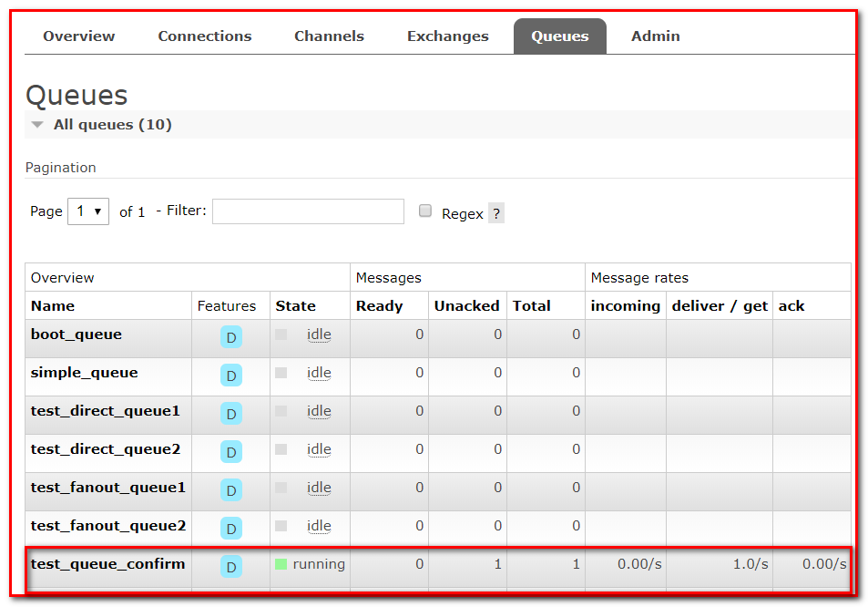

当程序报错，程序会拒绝签收，直到修改错误，修改上面的监听器，注释 除 0 错误 ，重新运行程序

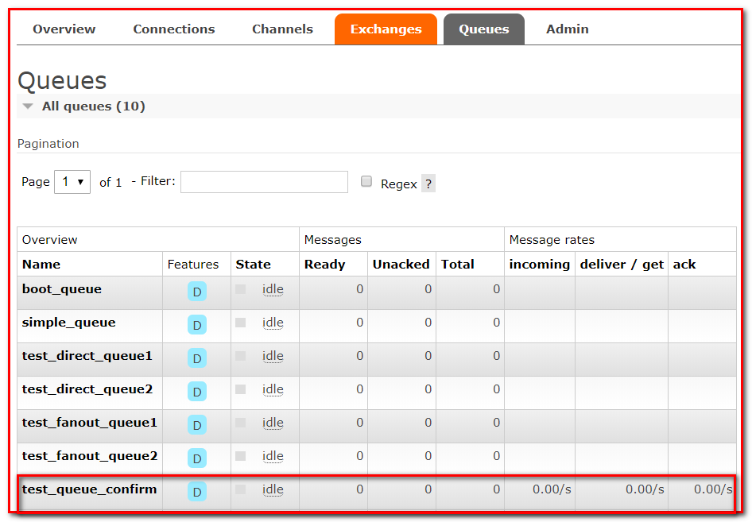

**Consumer Ack 小结**

在rabbit:listener-container标签中设置acknowledge属性，设置ack方式 none：自动确认，manual：手动确认

如果在消费端没有出现异常，则调用channel.basicAck(deliveryTag，true);方法确认签收消息

如果出现异常，则在catch中调用 basicNack，拒绝消息，让MQ重新发送消息。

## 7.2 消费端限流

① 在项目 rabbitmq-consumer-spring ，新建 com.atguigu.listener.QosListener

**package** com.atguigu.listener;

**import** com.rabbitmq.client.Channel;

**import** org.springframework.amqp.core.Message;

**import** org.springframework.amqp.rabbit.listener.api.ChannelAwareMessageListener;

/\*\*

&#x20;\* Consumer 限流机制

&#x20;\*  1. 确保消息被确认。不确认是不继续处理其他消息的

&#x20;\*  2. listener-container配置属性

&#x20;\*      prefetch = 1,表示消费端每次从mq拉去一条消息来消费,直到手动确认消费完毕后,才会继续拉取下一条消息。

&#x20;\*/

@Component

**public** **class** **QosListener** **implements** **ChannelAwareMessageListener** {

&#x20;   @Override

&#x20;   **public** **void** **onMessage**(Message message, Channel channel) **throws** Exception {

&#x20;       //1.获取消息

&#x20;       System.out.println(**new** String(message.getBody()));

&#x20;   }

}

② 修改spring-rabbitmq-consumer.xml 配置文件

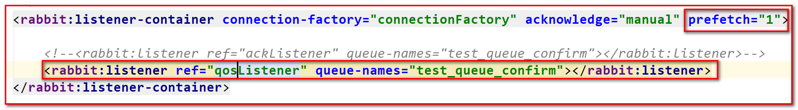

运行消费者，等待消息….

③ 在项目 rabbitmq-producer-spring , ProducerTest 测试方法

**package** com.atguigu;

**import** org.junit.Test;

**import** org.junit.runner.RunWith;

**import** org.springframework.amqp.core.Message;

**import** org.springframework.amqp.rabbit.connection.CorrelationData;

**import** org.springframework.amqp.rabbit.core.RabbitTemplate;

**import** org.springframework.beans.factory.annotation.Autowired;

**import** org.springframework.test.context.ContextConfiguration;

**import** org.springframework.test.context.junit4.SpringRunner;

@RunWith(SpringRunner.class)

@ContextConfiguration(locations = "classpath:spring-rabbitmq-producer.xml")

**public** **class** **ProducerTest** {

&#x20;   @Test

&#x20;   **public** **void** **testSend**() {

&#x20;       **for** (**int** i = 0; i < 10; i++) {

&#x20;           rabbitTemplate.convertAndSend("test\_exchange\_confirm","confirm","message confirm");

&#x20;       }

&#x20;   }

}   &#x20;

运行提供者

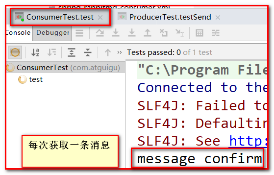

④ 查看后台 ，有 9 条消息待消费 ，有 1 条消息未确认

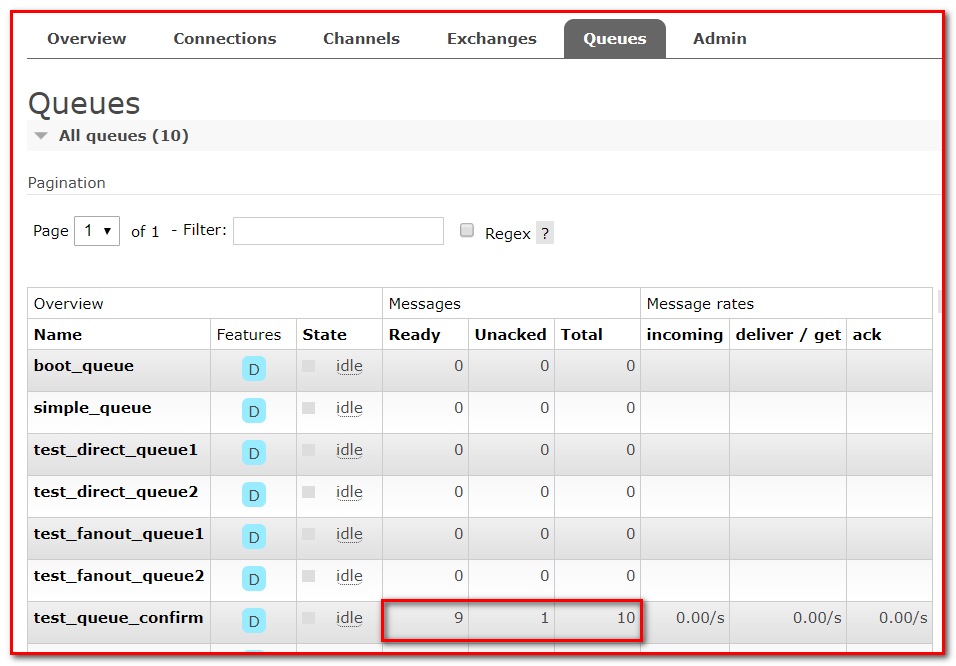

⑤ 修改消费者配置文件 ，去掉 prefetch="1" 会发现一次就可以消费所有消息

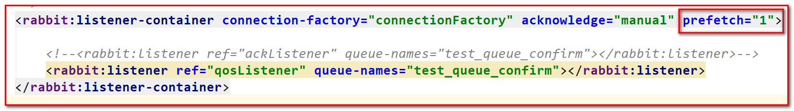

运行消费者测试类 ConsumerTest

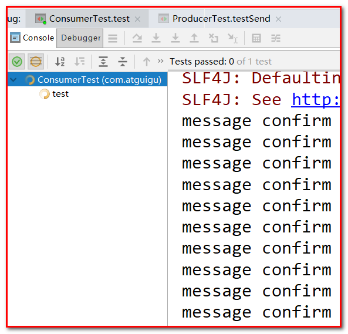

⑥ 修改 QosListener ， 添加手动签收方法 ，这样就可以确认消费限流

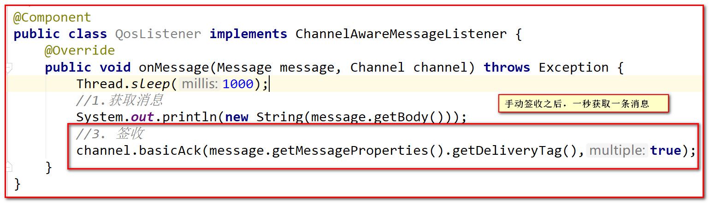

运行程序

**⑦ 消费端限流小结**

-   在 \<rabbit:listener-container>中配置 prefetch 属性设置消费端一次拉取多少条消息
-   消费端的必须确认才会继续处理其他消息。

## 7.3 TTL

TTL 全称 Time To Live（存活时间/过期时间）。

当消息到达存活时间后，还没有被消费，会被自动清除。

RabbitMQ可以对消息设置过期时间，也可以对整个队列（Queue）设置过期时间。

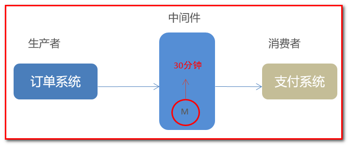

### 7.3.1 控制后台演示消息过期

① 修改管理后台界面，增加队列

参数：表示过期时间，单位毫秒 ，10000表示10秒

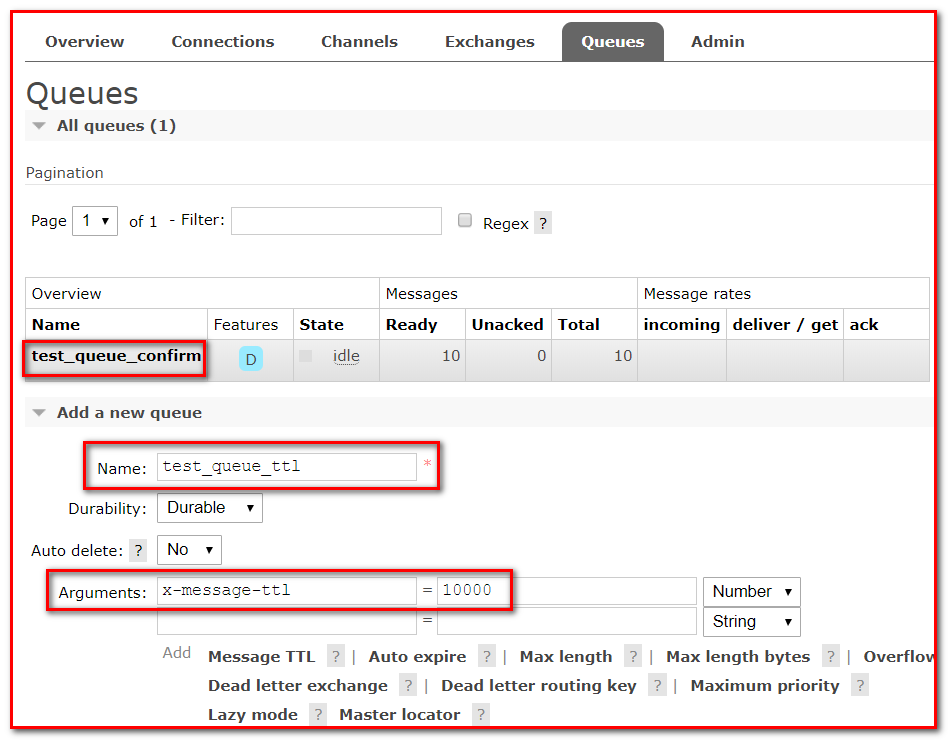

② 增加交换机

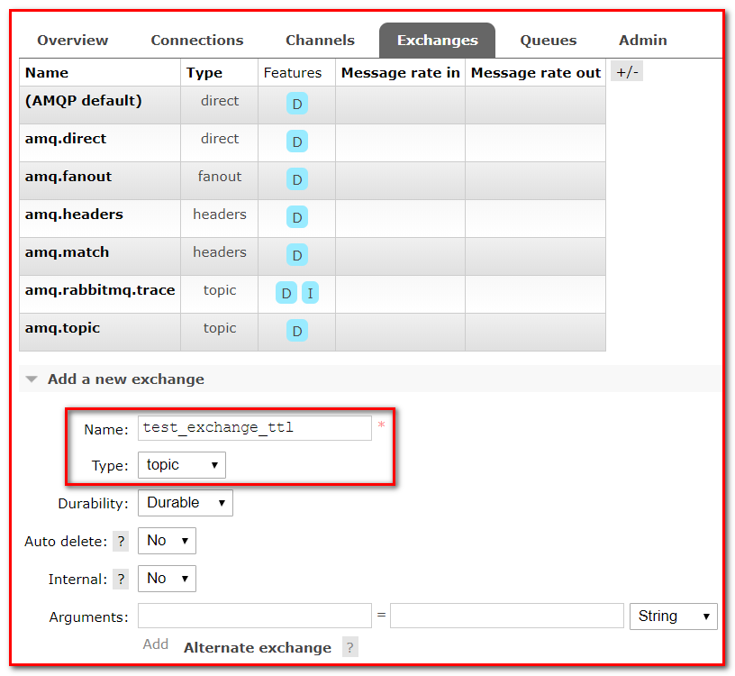

③ 绑定队列

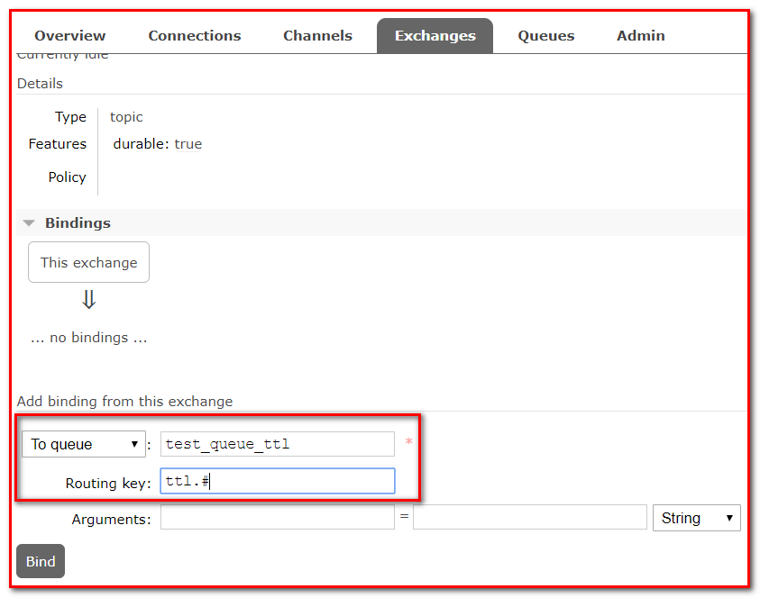

④ 发送消息

Delivery mode：2-Persistent表示需要进行持久化

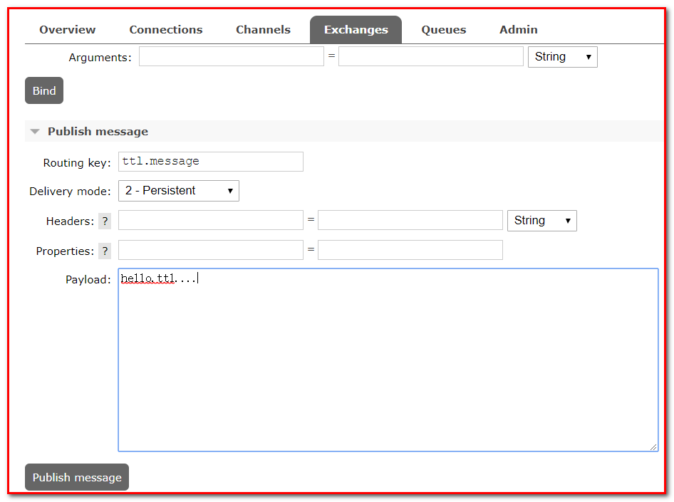

⑤ 查看消息，可以看到消息，但十秒之后，消息自动消失，因为我们设置了十秒消息过期

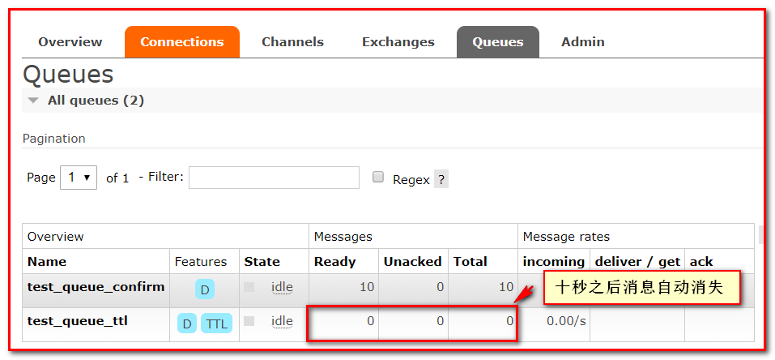

### 7.3.2 代码实现

#### 7.3.2.1 队列统一过期

修改 rabbitmq-producer-spring 项目的 配置文件 spring-rabbitmq-producer.xml

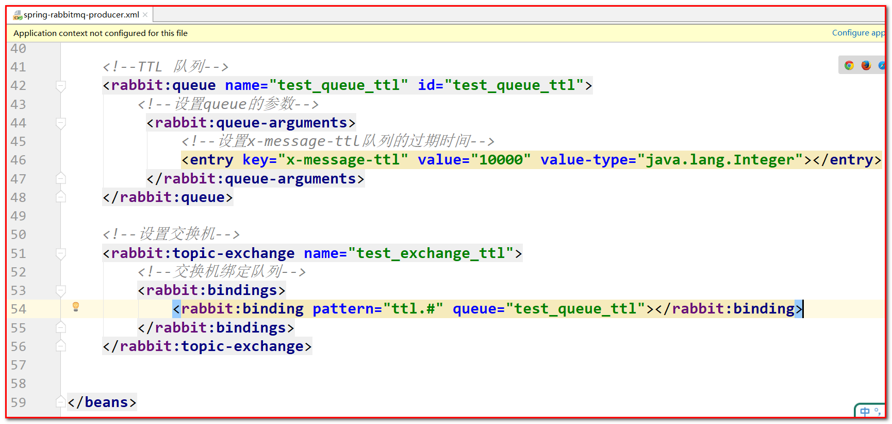

\<?xml version="1.0" encoding="UTF-8"?>

<**beans** **xmlns**="<http://www.springframework.org/schema/beans>"

&#x20;      **xmlns:xsi**="<http://www.w3.org/2001/XMLSchema-instance>"

&#x20;      **xmlns:context**="<http://www.springframework.org/schema/context>"

&#x20;      **xmlns:rabbit**="<http://www.springframework.org/schema/rabbit>"

&#x20;      **xsi:schemaLocation**="<http://www.springframework.org/schema/beans>

&#x20;      <http://www.springframework.org/schema/beans/spring-beans.xsd>

&#x20;      <http://www.springframework.org/schema/context>

&#x20;      <https://www.springframework.org/schema/context/spring-context.xsd>

&#x20;      <http://www.springframework.org/schema/rabbit>

&#x20;      <http://www.springframework.org/schema/rabbit/spring-rabbit.xsd>">

&#x20;   \<!--加载配置文件-->

&#x20;   <**context:property-placeholder** **location**="classpath:rabbitmq.properties"/>

&#x20;   \<!-- 定义rabbitmq connectionFactory -->

&#x20;   <**rabbit:connection-factory** **id**="connectionFactory" **host**="\${rabbitmq.host}"

&#x20;                              **port**="\${rabbitmq.port}"

&#x20;                              **username**="\${rabbitmq.username}"

&#x20;                              **password**="\${rabbitmq.password}"

&#x20;                              **virtual-host**="\${rabbitmq.virtual-host}"

&#x20;                              **publisher-confirms**="true"

&#x20;                              **publisher-returns**="true"/>

&#x20;   \<!--定义管理交换机、队列-->

&#x20;   <**rabbit:admin** **connection-factory**="connectionFactory"/>

&#x20;   \<!--定义rabbitTemplate对象操作可以在代码中方便发送消息-->

&#x20;   <**rabbit:template** **id**="rabbitTemplate" **connection-factory**="connectionFactory"/>

&#x20;   \<!--消息可靠性投递（生产端）-->

&#x20;   <**rabbit:queue** **id**="test\_queue\_confirm" **name**="test\_queue\_confirm">\</**rabbit:queue**>

&#x20;   <**rabbit:direct-exchange** **name**="test\_exchange\_confirm">

&#x20;       <**rabbit:bindings**>

&#x20;           <**rabbit:binding** **queue**="test\_queue\_confirm" **key**="confirm">\</**rabbit:binding**>

&#x20;       \</**rabbit:bindings**>

&#x20;   \</**rabbit:direct-exchange**>

&#x20;   \<!--TTL 队列-->

&#x20;   <**rabbit:queue** **name**="test\_queue\_ttl" **id**="test\_queue\_ttl">

&#x20;       \<!--设置queue的参数-->

&#x20;        <**rabbit:queue-arguments**>

&#x20;            \<!--

&#x20;              设置x-message-ttl队列的过期时间

&#x20;              默认情况下value-type的类型是String类型,但时间的类型是number类型,所以需要设置成integer类型

&#x20;            \-->

&#x20;            <**entry** **key**="x-message-ttl" **value**="10000" **value-type**="java.lang.Integer">\</**entry**>

&#x20;        \</**rabbit:queue-arguments**>

&#x20;   \</**rabbit:queue**>

&#x20;   \<!--设置交换机-->

&#x20;   <**rabbit:topic-exchange** **name**="test\_exchange\_ttl">

&#x20;       \<!--交换机绑定队列-->

&#x20;       <**rabbit:bindings**>

&#x20;           <**rabbit:binding** **pattern**="ttl.#" **queue**="test\_queue\_ttl">\</**rabbit:binding**>

&#x20;       \</**rabbit:bindings**>

&#x20;   \</**rabbit:topic-exchange**>

\</**beans**>

在测试类 ProducerTest 中,添加测试方法,发送消息

@Test

**public** **void** **testTTL**() {

&#x20;    **for** (**int** i = 0; i < 10; i++) {

&#x20;      rabbitTemplate.convertAndSend("test\_exchange\_ttl","ttl.hehe","message ttl");

&#x20;    }

}

查看控制台,发现有10条消息,十秒之后自动过期

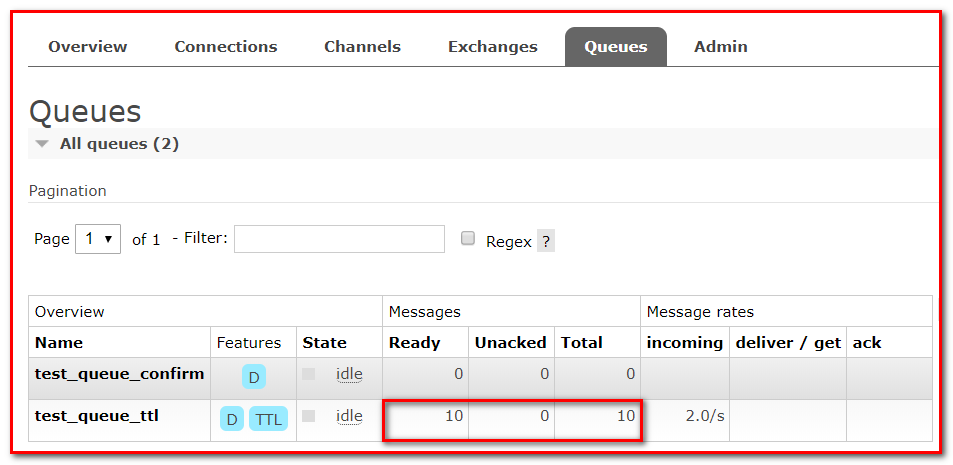

#### 7.3.2.2 消息过期

&#x20;    /\*\*

&#x20;    \* TTL：过期时间

&#x20;    \*  1. 队列统一过期

&#x20;    \*  2. 消息单独过期

&#x20;    \* 如果设置了消息的过期时间,也设置了队列的过期时间,它**以时间****短****的为准**。

&#x20;    \*/

&#x20;   @Test

&#x20;   **public** **void** **testMessageTtl**() {

&#x20;       // 消息后处理对象,设置一些消息的参数信息

&#x20;       MessagePostProcessor messagePostProcessor = **new** MessagePostProcessor() {

&#x20;           @Override

&#x20;           **public** Message **postProcessMessage**(Message message) **throws** AmqpException {

&#x20;               //1.设置message的信息

&#x20;               // 第二个方法：消息的过期时间 ,5秒之后过期

&#x20;               message.getMessageProperties().setExpiration("5000");

&#x20;               //2.返回该消息

&#x20;               **return** message;

&#x20;           }

&#x20;       };

&#x20;       //消息单独过期

&#x20;       rabbitTemplate.convertAndSend("test\_exchange\_ttl","ttl.hehe","message ttl....",messagePostProcessor);

&#x20;   }

运行程序,查看后台管理系统

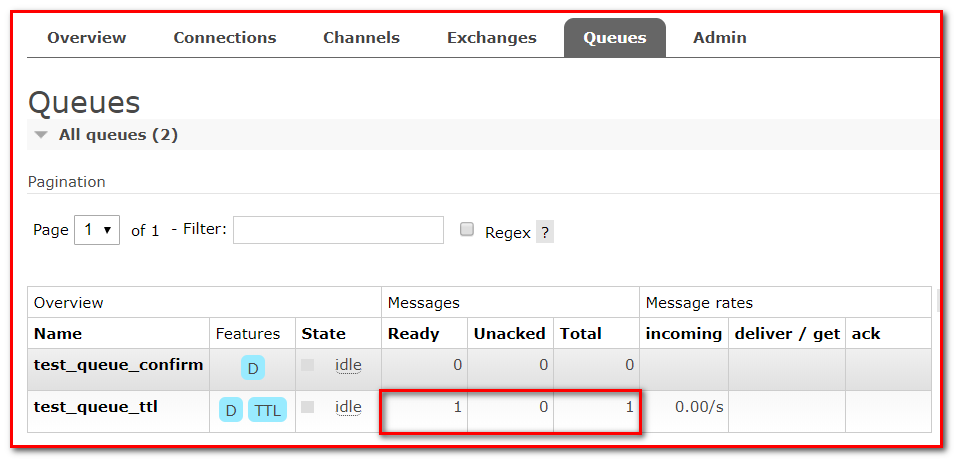

## 7.4 死信队列

死信队列，英文缩写：DLX 。DeadLetter Exchange（死信交换机），当消息成为Dead message后，可以被重新发送到另一个交换机，这个交换机就是DLX。

**什么是死信队列**

先从概念解释上搞清楚这个定义，死信，顾名思义就是无法被消费的消息，字面意思可以这样理解，一般来说，producer将消息投递到broker或者直接到queue里了，consumer从queue取出消息进行消费，但某些时候由于特定的原因导致queue中的某些消息无法被消费，这样的消息如果没有后续的处理，就变成了死信，有死信，自然就有了死信队列；

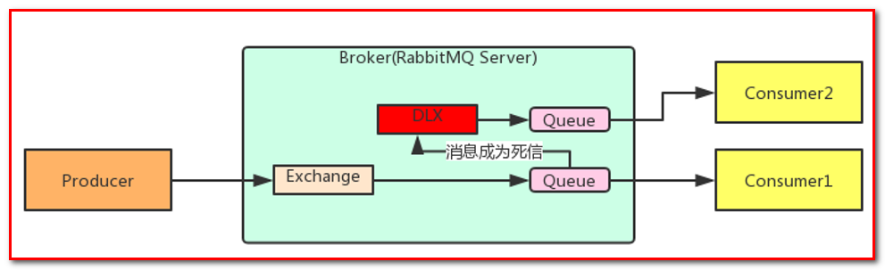

**消息成为死信的三种情况：**

1.  队列消息数量到达限制；比如队列最大只能存储10条消息，而发了11条消息，根据先进先出，最先发的消息会进入死信队列。
2.  消费者拒接消费消息，basicNack/basicReject，并且不把消息重新放入原目标队列，requeue=false；
3.  原队列存在消息过期设置，消息到达超时时间未被消费；

**死信的处理方式**

死信的产生既然不可避免，那么就需要从实际的业务角度和场景出发，对这些死信进行后续的处理，常见的处理方式大致有下面几种，

① 丢弃，如果不是很重要，可以选择丢弃

② 记录死信入库，然后做后续的业务分析或处理

③ 通过死信队列，由负责监听死信的应用程序进行处理

综合来看，更常用的做法是第三种，即通过死信队列，将产生的死信通过程序的配置路由到指定的死信队列，然后应用监听死信队列，对接收到的死信做后续的处理，

**队列绑定死信交换机：**

给队列设置参数： x-dead-letter-exchange 和 x-dead-letter-routing-key

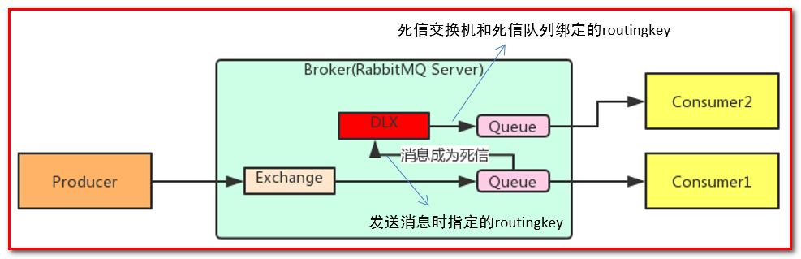

### 7.4.1 过期时间代码实现

修改生产者项目的配置文件 spring-rabbitmq-producer.xml ，增加如下代码

&#x20;  \<!--

&#x20;      死信队列：

&#x20;          1\. 声明正常的队列(test\_queue\_dlx)和交换机(test\_exchange\_dlx)

&#x20;          2\. 声明死信队列(queue\_dlx)和死信交换机(exchange\_dlx)

&#x20;          3\. 正常队列绑定死信交换机

&#x20;              设置两个参数：

&#x20;                  \* x-dead-letter-exchange：死信交换机名称

&#x20;                  \* x-dead-letter-routing-key：发送给死信交换机的routingkey

&#x20;  \-->

&#x20;   \<!--

&#x20;       1\. 声明正常的队列(test\_queue\_dlx)和交换机(test\_exchange\_dlx)

&#x20;   \-->

&#x20;   <**rabbit:queue** **name**="test\_queue\_dlx" **id**="test\_queue\_dlx">

&#x20;       \<!--3. 正常队列绑定死信交换机-->

&#x20;       <**rabbit:queue-arguments**>

&#x20;           \<!--3.1 x-dead-letter-exchange：死信交换机名称-->

&#x20;           <**entry** **key**="x-dead-letter-exchange" **value**="exchange\_dlx"/>

&#x20;           \<!--3.2 x-dead-letter-routing-key：发送给死信交换机的routingkey-->

&#x20;           <**entry** **key**="x-dead-letter-routing-key" **value**="dlx.hehe">\</**entry**>

&#x20;           \<!--4.1 设置队列的过期时间 ttl-->

&#x20;           <**entry** **key**="x-message-ttl" **value**="10000" **value-type**="java.lang.Integer"/>

&#x20;           \<!--4.2 设置队列的长度限制 max-length -->

&#x20;           <**entry** **key**="x-max-length" **value**="10" **value-type**="java.lang.Integer"/>

&#x20;       \</**rabbit:queue-arguments**>

&#x20;   \</**rabbit:queue**>

&#x20;   \<!--正常交换机-->

&#x20;   <**rabbit:topic-exchange** **name**="test\_exchange\_dlx">

&#x20;       <**rabbit:bindings**>

&#x20;           <**rabbit:binding** **pattern**="test.dlx.#" **queue**="test\_queue\_dlx">\</**rabbit:binding**>

&#x20;       \</**rabbit:bindings**>

&#x20;   \</**rabbit:topic-exchange**>

&#x20;   \<!--

&#x20;      2\. 声明死信队列(queue\_dlx)和死信交换机(exchange\_dlx)

&#x20;  \-->

&#x20;   <**rabbit:queue** **name**="queue\_dlx" **id**="queue\_dlx">\</**rabbit:queue**>

&#x20;   <**rabbit:topic-exchange** **name**="exchange\_dlx">

&#x20;       <**rabbit:bindings**>

&#x20;           <**rabbit:binding** **pattern**="dlx.#" **queue**="queue\_dlx">\</**rabbit:binding**>

&#x20;       \</**rabbit:bindings**>

&#x20;   \</**rabbit:topic-exchange**>

在测试类中，添加如下方法，进行测试

&#x20;    /\*\*

&#x20;    \* 发送测试死信消息：

&#x20;    \*  1. 过期时间

&#x20;    \*  2. 长度限制

&#x20;    \*  3. 消息拒收

&#x20;    \*/

&#x20;   @Test

&#x20;   **public** **void** **testDlx**(){

&#x20;       //1. 测试过期时间，死信消息

&#x20;       rabbitTemplate.convertAndSend("test\_exchange\_dlx","test.dlx.haha","我是一条消息,我会死吗？");

&#x20;   }

运行测试,查看管理台界面

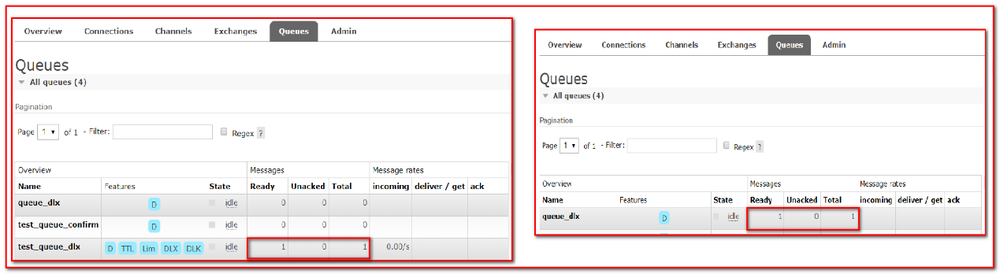

### 7.4.2 长度限制代码实现

修改测试类,添加测试方法

&#x20;    /\*\*

&#x20;    \* 发送测试死信消息：

&#x20;    \*  1. 过期时间

&#x20;    \*  2. 长度限制

&#x20;    \*  3. 消息拒收

&#x20;    \*/

&#x20;   @Test

&#x20;   **public** **void** **testDlx**(){

&#x20;       //1. 测试过期时间,死信消息

&#x20;       //rabbitTemplate.convertAndSend("test\_exchange\_dlx","test.dlx.haha","我是一条消息,我会死吗？");

&#x20;       //2. 测试长度限制后,消息死信

&#x20;       **for** (**int** i = 0; i < 20; i++) {

&#x20;           rabbitTemplate.convertAndSend("test\_exchange\_dlx","test.dlx.haha","我是一条消息,我会死吗？");

&#x20;       }

&#x20;   }

运行测试方法,进行测试

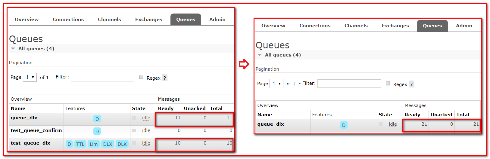

### 7.4.3 测试消息拒收

在消费者工程 创建 com.atguigu.listener.DlxListener

**package** com.atguigu.listener;

**import** com.rabbitmq.client.Channel;

**import** org.springframework.amqp.core.Message;

**import** org.springframework.amqp.rabbit.listener.api.ChannelAwareMessageListener;

**import** org.springframework.stereotype.Component;

@Component

**public** **class** **DlxListener** **implements** **ChannelAwareMessageListener** {

&#x20;   @Override

&#x20;   **public** **void** **onMessage**(Message message, Channel channel) **throws** Exception {

&#x20;       **long** deliveryTag = message.getMessageProperties().getDeliveryTag();

&#x20;       **try** {

&#x20;           //1.接收转换消息

&#x20;           System.out.println(**new** String(message.getBody()));

&#x20;           //2. 处理业务逻辑

&#x20;           System.out.println("处理业务逻辑...");

&#x20;           **int** i = 3/0;//出现错误

&#x20;           //3. 手动签收

&#x20;           channel.basicAck(deliveryTag,**true**);

&#x20;       } **catch** (Exception e) {

&#x20;           //e.printStackTrace();

&#x20;           System.out.println("出现异常,拒绝接受");

&#x20;           //4.拒绝签收,不重回队列 requeue=false

&#x20;           channel.basicNack(deliveryTag,**true**,**false**);

&#x20;       }

&#x20;   }

}

修改消费者配置文件 spring-rabbitmq-consumer.xml

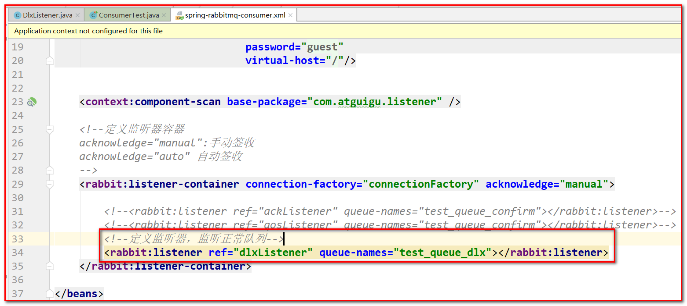

&#x20;   <**rabbit:listener-container** **connection-factory**="connectionFactory" **acknowledge**="manual">

&#x20;       \<!--\<rabbit:listener ref="ackListener" queue-names="test\_queue\_confirm">\</rabbit:listener>-->

&#x20;       \<!--\<rabbit:listener ref="qosListener" queue-names="test\_queue\_confirm">\</rabbit:listener>-->

&#x20;       \<!--定义监听器,监听正常队列-->

&#x20;       <**rabbit:listener** **ref**="dlxListener" **queue-names**="test\_queue\_dlx">\</**rabbit:listener**>

&#x20;   \</**rabbit:listener-container**>

运行消费者测试类

修改生产者测试代码

&#x20;    /\*\*

&#x20;    \* 发送测试死信消息

&#x20;    \*  1. 过期时间

&#x20;    \*  2. 长度限制

&#x20;    \*  3. 消息拒收

&#x20;    \*/

&#x20;   @Test

&#x20;   **public** **void** **testDlx**(){

&#x20;       //1. 测试过期时间,死信消息

&#x20;       //rabbitTemplate.convertAndSend("test\_exchange\_dlx","test.dlx.haha","我是一条消息,我会死吗？");

&#x20;       //2. 测试长度限制后,消息死信

//        for (int i = 0; i < 20; i++) {

//            rabbitTemplate.convertAndSend("test\_exchange\_dlx","test.dlx.haha","我是一条消息,我会死吗？");

//        }

&#x20;       //3. 测试消息拒收

&#x20;       rabbitTemplate.convertAndSend("test\_exchange\_dlx",

&#x20;                                    "test.dlx.haha",

&#x20;                                        "我是一条消息,我会死吗？");

&#x20;   }

发送消息,运行程序,查看后台管理界面

**死信队列小结**

1.  死信交换机和死信队列和普通的没有区别
2.  当消息成为死信后，如果该队列绑定了死信交换机，则消息会被死信交换机重新路由到死信队列
3.  消息成为死信的三种情况：
    -   队列消息长度（数量）到达限制；
    -   消费者拒接消费消息，并且不重回队列；
    -   原队列存在消息过期设置，消息到达超时时间未被消费；

## 7.5 延迟队列

延迟队列存储的对象肯定是对应的延时消息，所谓”延时消息”是指当消息被发送以后，并不想让消费者立即拿到消息，而是等待指定时间后，消费者才拿到这个消息进行消费。

场景：在订单系统中，一个用户下单之后通常有30分钟的时间进行支付，如果30分钟之内没有支付成功，那么这个订单将进行取消处理。这时就可以使用延时队列将订单信息发送到延时队列。

需求：

1.  下单后，30分钟未支付，取消订单，回滚库存。
2.  新用户注册成功30分钟后，发送短信问候。

实现方式：

1.  延迟队列

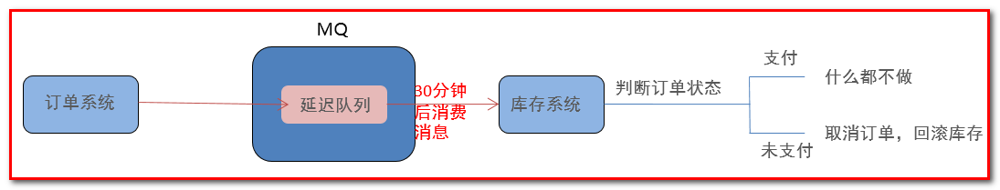

很可惜，在RabbitMQ中并未提供延迟队列功能。

但是可以使用：TTL+死信队列 组合实现延迟队列的效果。

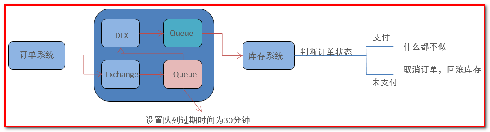

### 7.5.1 代码实现

#### 7.5.1.1 生产者

修改生产者代码 ，修改生产者配置文件 spring-rabbitmq-producer.xml

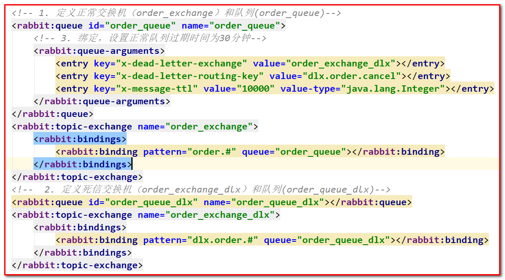

修改生产者，添加测试方法

&#x20;   @Test

&#x20;   **public**  **void** **testDelay**() **throws** InterruptedException {

&#x20;       //1.发送订单消息。 将来是在订单系统中,下单成功后,发送消息

&#x20;       rabbitTemplate.convertAndSend("order\_exchange",

&#x20;               "order.msg","订单信息：id=1,time=2020年10月17日11：41：47");

&#x20;       //2.打印倒计时10秒

&#x20;       **for** (**int** i = 10; i > 0 ; i--) {

&#x20;           System.out.println(i+"...");

&#x20;           Thread.sleep(1000);

&#x20;       }

&#x20;   }

运行程序创建订单延时队列

#### 7.5.1.2 消费者

修改消费者项目,添加 com.atguigu.listener.OrderListener

消费者

**package** com.atguigu.listener;

**import** com.rabbitmq.client.Channel;

**import** org.springframework.amqp.core.Message;

**import** org.springframework.amqp.rabbit.listener.api.ChannelAwareMessageListener;

**import** org.springframework.stereotype.Component;

@Component

**public** **class** **OrderListener** **implements** **ChannelAwareMessageListener** {

&#x20;   @Override

&#x20;   **public** **void** **onMessage**(Message message, Channel channel) **throws** Exception {

&#x20;       **long** deliveryTag = message.getMessageProperties().getDeliveryTag();

&#x20;       **try** {

&#x20;           //1.接收转换消息

&#x20;           System.out.println(**new** String(message.getBody()));

&#x20;           //2. 处理业务逻辑

&#x20;           System.out.println("处理业务逻辑...");

&#x20;           System.out.println("根据订单id查询其状态...");

&#x20;           System.out.println("判断状态是否为支付成功");

&#x20;           System.out.println("取消订单,回滚库存....");

&#x20;           //3. 手动签收

&#x20;           channel.basicAck(deliveryTag,**true**);

&#x20;       } **catch** (Exception e) {

&#x20;           //e.printStackTrace();

&#x20;           System.out.println("出现异常,拒绝接受");

&#x20;           //4.拒绝签收,不重回队列 requeue=false

&#x20;           channel.basicNack(deliveryTag,**true**,**false**);

&#x20;       }

&#x20;   }

}

修改消费者配置文件 spring-rabbitmq-consumer.xml

\<?xml version="1.0" encoding="UTF-8"?>

<**beans** **xmlns**="<http://www.springframework.org/schema/beans>"

&#x20;      **xmlns:xsi**="<http://www.w3.org/2001/XMLSchema-instance>"

&#x20;      **xmlns:context**="<http://www.springframework.org/schema/context>"

&#x20;      **xmlns:rabbit**="<http://www.springframework.org/schema/rabbit>"

&#x20;      **xsi:schemaLocation**="<http://www.springframework.org/schema/beans>

&#x20;      <http://www.springframework.org/schema/beans/spring-beans.xsd>

&#x20;      <http://www.springframework.org/schema/context>

&#x20;      <https://www.springframework.org/schema/context/spring-context.xsd>

&#x20;      <http://www.springframework.org/schema/rabbit>

&#x20;      <http://www.springframework.org/schema/rabbit/spring-rabbit.xsd>">

&#x20;   \<!--加载配置文件-->

&#x20;   <**context:property-placeholder** **location**="classpath:rabbitmq.properties"/>

&#x20;   \<!-- 定义rabbitmq connectionFactory -->

&#x20;   <**rabbit:connection-factory** **id**="connectionFactory" **host**="\${rabbitmq.host}"

&#x20;                              **port**="\${rabbitmq.port}"

&#x20;                              **username**="\${rabbitmq.username}"

&#x20;                              **password**="\${rabbitmq.password}"

&#x20;                              **virtual-host**="\${rabbitmq.virtual-host}"/>

&#x20;   <**context:component-scan** **base-package**="com.atguigu.listener" />

&#x20;   \<!--定义监听器容器

&#x20;   acknowledge="manual"：手动签收

&#x20;   acknowledge="auto" 自动签收

&#x20;   \-->

&#x20;   <**rabbit:listener-container** **connection-factory**="connectionFactory" **acknowledge**="manual">

&#x20;       \<!--\<rabbit:listener ref="ackListener" queue-names="test\_queue\_confirm">\</rabbit:listener>-->

&#x20;       \<!--\<rabbit:listener ref="qosListener" queue-names="test\_queue\_confirm">\</rabbit:listener>-->

&#x20;       \<!--定义监听器,监听正常队列-->

&#x20;       \<!--\<rabbit:listener ref="dlxListener" queue-names="test\_queue\_dlx">\</rabbit:listener>-->

&#x20;       \<!--延迟队列效果实现：  一定要监听的是 死信队列！！！-->

&#x20;       <**rabbit:listener** **ref**="orderListener" **queue-names**="order\_queue\_dlx">\</**rabbit:listener**>

&#x20;   \</**rabbit:listener-container**>

\</**beans**>

运行消费者测试类

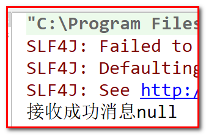

