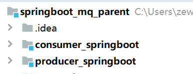
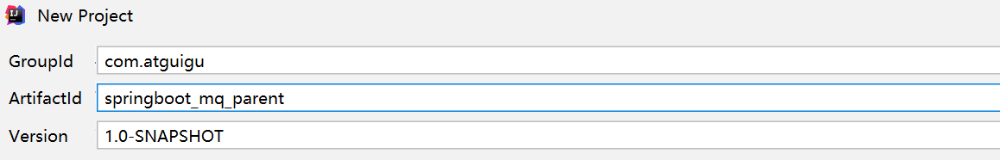
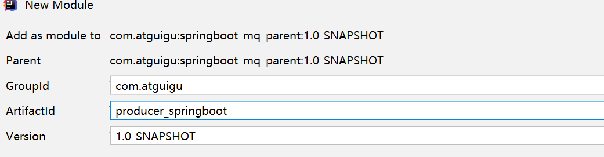
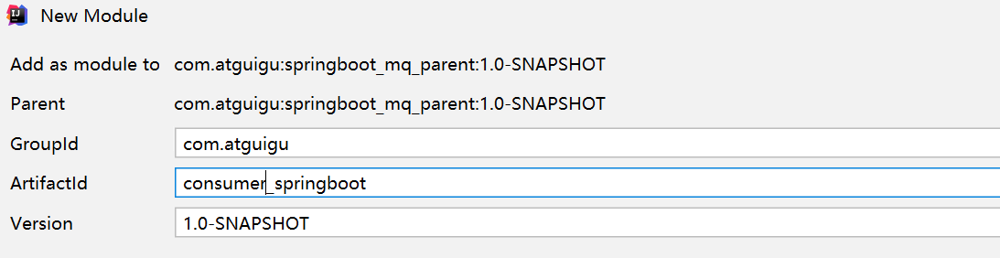
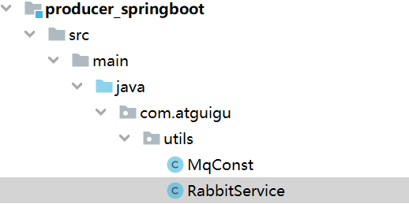
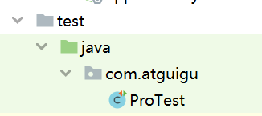
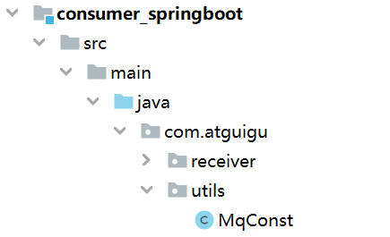
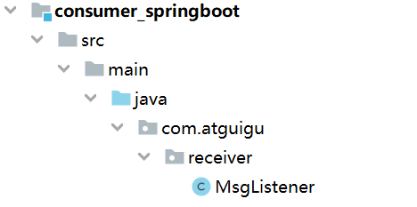
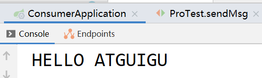

# 第八章 RabbitMQ集成微服务

## 8.1 RabbitMQ与SpringBoot整合

### 8.1.1. 搭建工程

#### 8.1.1.1. 创建父工程

#### 8.1.1.2. 创建两个子模块

（1）生产者子模块

（2）消费者子模块

#### 8.1.1.3. 父工程引入依赖

| \<parent>&#xA;    \<groupId>org.springframework.boot\</groupId>&#xA;    \<artifactId>spring-boot-starter-parent\</artifactId>&#xA;    \<version>2.3.6.RELEASE\</version>&#xA;\</parent>&#xA;&#xA;\<dependencies>&#xA;    *\<!--2.rabbitmq-->*&#xA;\*    \*\<dependency>&#xA;        \<groupId>org.springframework.boot\</groupId>&#xA;        \<artifactId>spring-boot-starter-amqp\</artifactId>&#xA;    \</dependency>&#xA;    \<dependency>&#xA;        \<groupId>org.springframework.boot\</groupId>&#xA;        \<artifactId>spring-boot-starter-test\</artifactId>&#xA;    \</dependency>&#xA;\</dependencies>&#xA; |
| ------------------------------------------------------------------------------------------------------------------------------------------------------------------------------------------------------------------------------------------------------------------------------------------------------------------------------------------------------------------------------------------------------------------------------------------------------------------------------------------------------------------------------------------------------------------------------------------------------------------------- |

### 8.1.2. 编写生产者工程

#### 8.1.2.1. 配置文件

创建application.yml文件

| spring:&#xA;  rabbitmq:&#xA;    host: 192.168.197.129&#xA;    port: 5672&#xA;    username: admin&#xA;    password: admin&#xA;    virtual-host: /&#xA; |
| ----------------------------------------------------------------------------------------------------------------------------------------------------- |

#### 8.1.2.2. 封装工具类

创建工具类，封装发送消息方法

（1）创建MqConst常量类：

| package com.atguigu.utils;&#xA;public class MqConst {&#xA;    /\*\*&#xA;     \* 预约下单&#xA;     \*/&#xA;    public static final String EXCHANGE\_DIRECT = "exchange.direct.order";&#xA;    public static final String ROUTING\_KEY = "order";&#xA;    //队列&#xA;    public static final String QUEUE\_NAME  = "queue.order";&#xA;}&#xA; |
| ------------------------------------------------------------------------------------------------------------------------------------------------------------------------------------------------------------------------------------------------------------------------------------------------------------------------------------ |

（2）创建RabbitService类：

| package com.atguigu.utils;&#xA;&#xA;import org.springframework.amqp.rabbit.core.RabbitTemplate;&#xA;import org.springframework.beans.factory.annotation.Autowired;&#xA;import org.springframework.stereotype.Service;&#xA;&#xA;@Service&#xA;public class RabbitService {&#xA;&#xA;    @Autowired&#xA;    private RabbitTemplate rabbitTemplate;&#xA;    /\*\*&#xA;     \*  发送消息&#xA;     \* @param exchange 交换机&#xA;     \* @param routingKey 路由键&#xA;     \* @param message 消息&#xA;     \*/&#xA;    public boolean sendMessage(String exchange, String routingKey, Object message) {&#xA;        rabbitTemplate.convertAndSend(exchange, routingKey, message);&#xA;        return true;&#xA;    }&#xA;}&#xA; |
| ------------------------------------------------------------------------------------------------------------------------------------------------------------------------------------------------------------------------------------------------------------------------------------------------------------------------------------------------------------------------------------------------------------------------------------------------------------------------------------------------------------------------------------------------------------------------------------------------------------------------------------------------------------------------------------------------------------- |

#### 8.1.2.3. 编写启动类

package com.atguigu;

import org.springframework.boot.SpringApplication;

import org.springframework.boot.autoconfigure.SpringBootApplication;

@SpringBootApplication

public class ProducerApplication {

&#x20;   public static void main(String\[] args) {

&#x20;       SpringApplication.run(ProducerApplication.class, args);

&#x20;   }

}

#### 8.1.2.4. 编写测试类

package com.atguigu;

import com.atguigu.utils.MqConst;

import com.atguigu.utils.RabbitService;

import org.junit.jupiter.api.Test;

import org.springframework.beans.factory.annotation.Autowired;

import org.springframework.boot.test.context.SpringBootTest;

@SpringBootTest

public class ProTest {

&#x20;   @Autowired

&#x20;   private RabbitService rabbitService;

&#x20;   @Test

&#x20;   public void sendMsg() {

&#x20;       //发送mq发送短信

&#x20;       rabbitService.sendMessage(MqConst.EXCHANGE\_DIRECT,

&#x20;               MqConst.ROUTING\_KEY,

&#x20;               "HELLO ATGUIGU");

&#x20;   }

}

运行测试类,发送消息

### 8.1.3. 编写消费者工程

#### 8.1.3.1. 配置文件

创建application.yml文件

| spring:&#xA;  rabbitmq:&#xA;    host: 192.168.197.129&#xA;    port: 5672&#xA;    username: admin&#xA;    password: admin&#xA;    virtual-host: /&#xA; |
| ----------------------------------------------------------------------------------------------------------------------------------------------------- |

#### 8.1.3.2. 封装工具类

创建工具类，封装发送消息方法

（1）创建MqConst常量类：

| package com.atguigu.utils;&#xA;public class MqConst {&#xA;    /\*\*&#xA;     \* 预约下单&#xA;     \*/&#xA;    public static final String EXCHANGE\_DIRECT = "exchange.direct.order";&#xA;    public static final String ROUTING\_KEY = "order";&#xA;    //队列&#xA;    public static final String QUEUE\_NAME  = "queue.order";&#xA;}&#xA; |
| ------------------------------------------------------------------------------------------------------------------------------------------------------------------------------------------------------------------------------------------------------------------------------------------------------------------------------------ |

#### 8.1.3.3. 编写启动类

package com.atguigu;

import org.springframework.boot.SpringApplication;

import org.springframework.boot.autoconfigure.SpringBootApplication;

@SpringBootApplication

public class ConsumerApplication {

&#x20;   public static void main(String\[] args) {

&#x20;       SpringApplication.run(ConsumerApplication.class, args);

&#x20;   }

}

#### 8.1.3.4. 编写监听器

| package com.atguigu.receiver;&#xA;&#xA;import com.atguigu.utils.MqConst;&#xA;import com.rabbitmq.client.Channel;&#xA;import org.springframework.amqp.core.Message;&#xA;import org.springframework.amqp.rabbit.annotation.Exchange;&#xA;import org.springframework.amqp.rabbit.annotation.Queue;&#xA;import org.springframework.amqp.rabbit.annotation.QueueBinding;&#xA;import org.springframework.amqp.rabbit.annotation.RabbitListener;&#xA;import org.springframework.stereotype.Component;&#xA;&#xA;@Component&#xA;public class MsgListener {&#xA;&#xA;    @RabbitListener(bindings = @QueueBinding(&#xA;            value = @Queue(value = MqConst.QUEUE\_NAME, durable = "true"),&#xA;    exchange = @Exchange(value = MqConst.EXCHANGE\_DIRECT),&#xA;    key = {MqConst.ROUTING\_KEY}&#xA;    ))&#xA;    public void patientTip(String dateString,&#xA;                           Message message,&#xA;                           Channel channel) {&#xA;        System.out.println(dateString);&#xA;    }&#xA;}&#xA; |
| ---------------------------------------------------------------------------------------------------------------------------------------------------------------------------------------------------------------------------------------------------------------------------------------------------------------------------------------------------------------------------------------------------------------------------------------------------------------------------------------------------------------------------------------------------------------------------------------------------------------------------------------------------------------------------------------------------------------------------------------------------------------------------------------------------------------------------------------------------------------------------------------------------------------------------------------------------------------------------------------------------------------------------- |

启动项目，进行监听：

小结：

-   SpringBoot提供了快速整合RabbitMQ的方式
-   基本信息在yml中配置,队列交互机以及绑定关系在配置类中使用Bean的方式配置
-   生产端直接注入RabbitTemplate完成消息发送
-   消费端直接使用@RabbitListener完成消息接收
