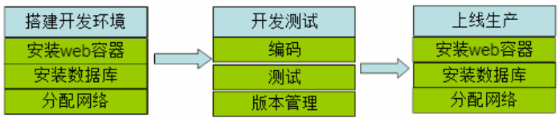
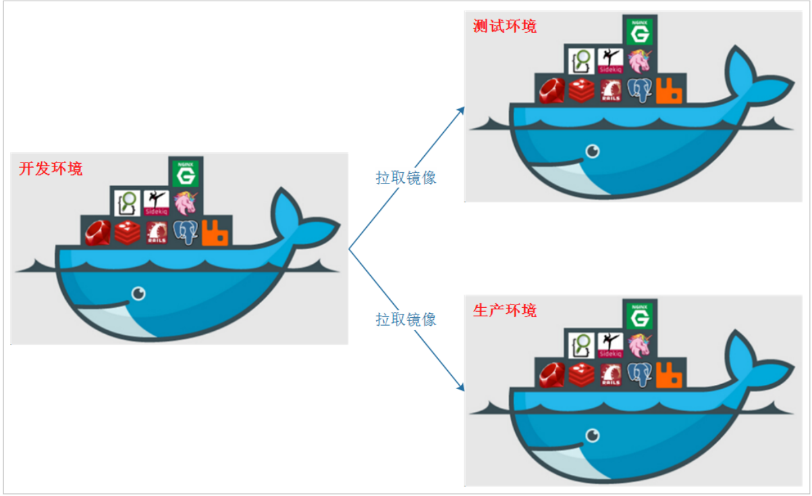
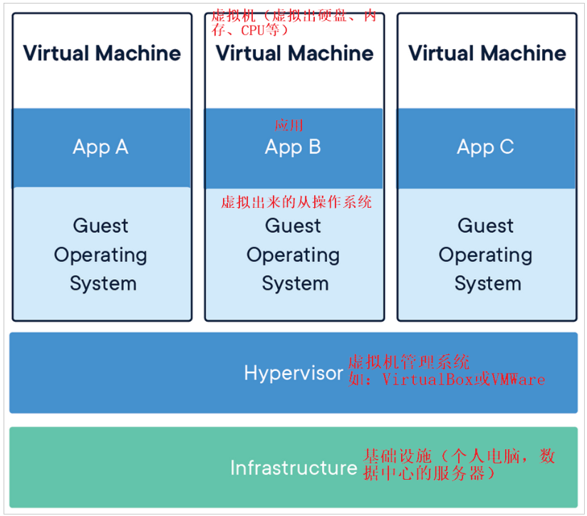
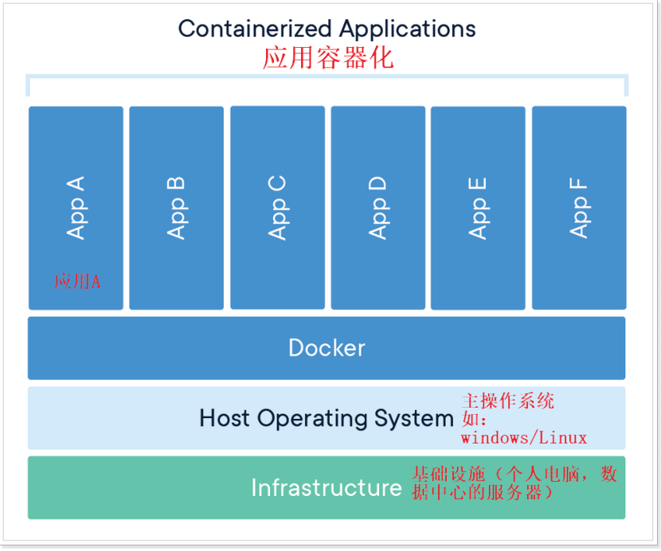
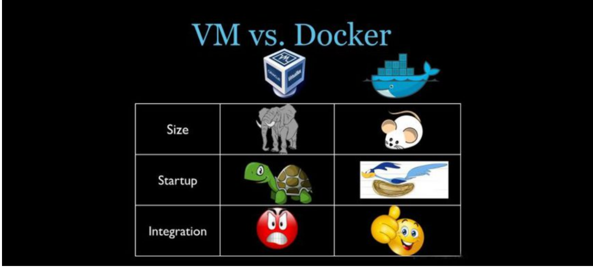
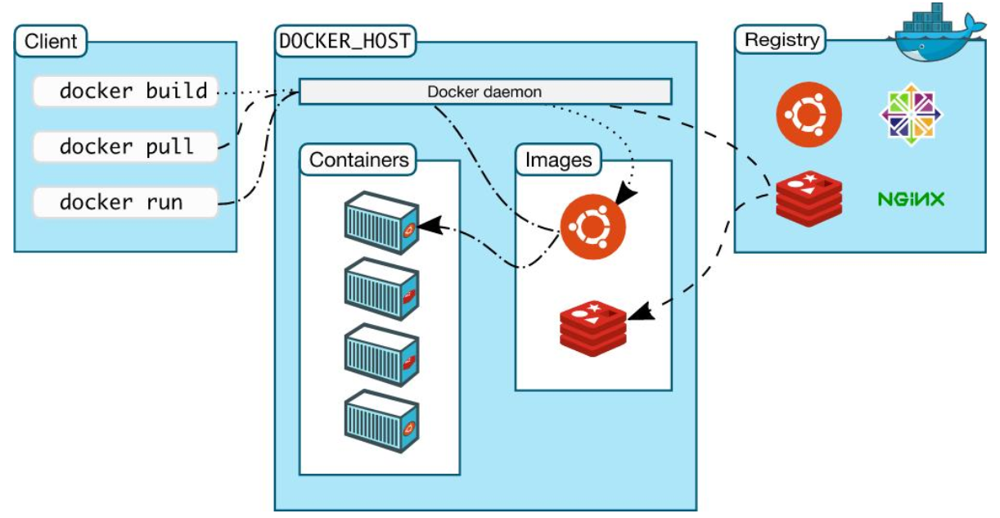
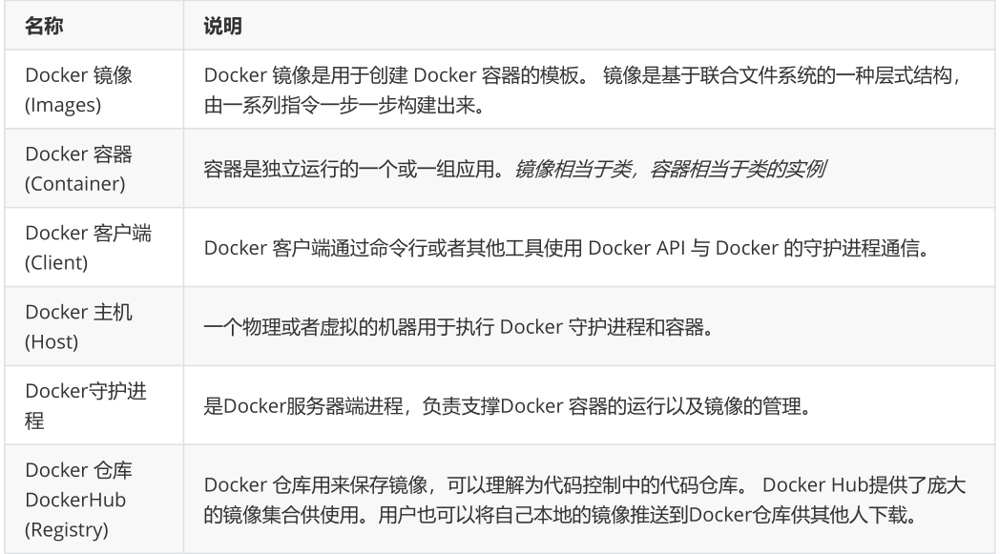

# 第一章 Docker简介

## 1.1 什么是虚拟化

虚拟化，是指通过虚拟化技术将一台计算机虚拟为多台逻辑计算机。在一台计算机上同时运行多个逻辑计算机，每个逻辑计算机可运行不同的操作系统，并且应用程序都可以在相互独立的空间内运行而互不影响，从而显著提高计算机的工作效率。

 虚拟化技术种类很多，例如：软件虚拟化、硬件虚拟化、内存虚拟化、网络虚拟化(vip)、桌面虚拟化、服务虚拟化、虚拟机等等。

**问题：** 为什么会有docker出现？

一款产品从开发到上线，从操作系统，到运行环境，再到应用配置。作为开发+运维之间的协作我们需要关心很多东西，这也是很多互联网公司都不得不面对的问题，特别是各种版本的迭代之后，不同版本环境的兼容，对运维人员都是考验 , 这个时候 Docker 横空出世，是因为它对此给出了一个标准化的解决方案。

环境配置如此麻烦，换一台机器，就要重来一次，费力费时。很多人想到，能不能从根本上解决问题，软件可以带环境安装？也就是说，安装的时候，把原始环境一模一样地复制过来。开发人员利用 Docker 可以消除协作编码时“在我的机器上可正常工作”的问题。

之前，可以发现，每发布一个程序，都要走一遍以上的流程：

## 1.2 什么是Docker

Docker 是一个开源的应用容器引擎，基于 Go 语言开发。Docker 可以让开发者打包他们的应用以及依赖包到一个轻量级、可移植的容器中，然后发布到任何流行的 Linux 机器上，也可以实现虚拟化。容器是完全使用沙箱机制，相互之间不会有任何接口（类似 iPhone 的 app）,更重要的是容器性能开销极低。

Docker的主要目标是“Build，Ship and Run Any App,Anywhere”，也就是通过对应用组件的封装、分发、部署、运行等生命周期的管理，使用户的APP（可以是一个WEB应用或数据库应用等等）及其运行环境能够做到“一次封装，到处运行”。

总之一句话：只需要一次配置好环境，换到别的机子上就可以一键部署好，大大简化了操作 。

-   为什么选择Docker?
    -   Docker的镜像提供了除内核外完整的运行时环境，确保了应用运行环境一致性，从而不会再出现“这段代码在我机器上没问题啊”这类问题；——**一致的运行环境**
    -   可以做到秒级、甚至毫秒级的启动时间。大大的节约了开发、测试、部署的时间。——**更快速的启动时间**
    -   避免公用的服务器，资源会容易受到其他用户的影响。——**隔离性**
    -   善于处理集中爆发的服务器使用压力；——**弹性伸缩，快速扩展**
    -   可以很轻易的将在一个平台上运行的应用，迁移到另一个平台上，而不用担心运行环境的变化导致应用无法正常运行的情况。——**迁移方便**
    -   使用Docker可以通过定制应用镜像来实现持续集成、持续交付、部署。——**持续交付和部署**
-   Docker应用场景

① Web 应用的自动化打包和发布

② 自动化测试和持续集成、发布

③ 在服务型环境中部署和调整数据库或其他的后台应用

使用Docker可以实现开发人员的开发环境、测试人员的测试环境、运维人员的生产环境的一致性。

Docker借鉴了标准集装箱的概念。标准集装箱将货物运往世界各地，Docker将这个模型运用到自己的设计中，唯一不同的是：集装箱运输货物，而Docker运输软件。

## 1.3 容器与虚拟机比较

下面的图片比较了 Docker 和传统虚拟化方式的不同之处，可见容器是在操作系统层面上实现虚拟化，直接复用本地主机的操作系统，而传统方式则是在硬件层面实现。

-   传统虚拟机

传统虚拟机技术基于安装在主操作系统上的虚拟机管理系统（如：VirtualBox和VMWare等），创建虚拟机（虚拟出各种硬件），在虚拟机上安装从操作系统，在从操作系统中安装部署各种应用。

-   Docker

Docker容器是在操作系统层面上实现虚拟化，直接复用本地主机的操作系统，而传统虚拟机则是在硬件层面实现虚拟化。与传统的虚拟机相比，Docker优势体现为启动速度快、占用体积小。

-   使用上的区别

简单来说： 容器和虚拟机具有相似的资源隔离和分配优势，但功能有所不同，因为容器虚拟化的是操作系统，而不是硬件，因此容器更容易移植，效率也更高。

## 1.4 Docker 组件

### 1.4.1 Docker组成部分

Docker是一个客户端-服务器（C/S）架构程序。Docker客户端只需要向Docker服务器或者守护进程发出请求，服务器或者守护进程将完成所有工作并返回结果。Docker提供了一个命令行工具Docker以及一整套RESTful API。你可以在同一台宿主机上运行Docker守护进程和客户端，也可以从本地的Docker客户端连接到运行在另一台宿主机上的远程Docker守护进程。

 

### 1.4.2 Docker镜像与容器

**镜像：** 类似虚拟机镜像 , 是一个特殊的文件系统

操作系统分为内核和用户空间。对于Linux而言，内核启动后，会挂载root文件系统为其提供用户空间支持。而Docker镜像（Image），就相当于是一个root文件系统。

Docker镜像是一个特殊的文件系统，除了提供容器运行时所需的程序、库、资源、配置等文件外，还包含了一些为运行时准备的一些配置参数（如匿名卷、环境变量、用户等）。 镜像不包含任何动态数据，其内容在构建之后也不会被改变。

**容器：** 类似linux系统环境，运行和隔离应用。是镜像运行时的实体

镜像（Image）和容器（Container）的关系，就像是面向对象程序设计中的类和实例一样，镜像是静态的定义，容器是镜像运行时的实体。容器可以被创建、启动、停止、删除、暂停等 。

**仓库：** 集中存放镜像文件的地方。

镜像构建完成后，可以很容易的在当前宿主上运行，但是， 如果需要在其它服务器上使用这个镜像，我们就需要一个集中存储、分发镜像的地方，比如后面我们要学的，Docker Registry就是这样的服务。

### 1.4.3 Registry（注册中心）

Docker用Registry来保存用户构建的镜像。Registry分为公共和私有两种。Docker公司运营公共的Registry叫做**Docker Hub**。用户可以在Docker Hub注册账号，分享并保存自己的镜像（说明：在Docker Hub下载镜像巨慢，可以自己构建私有的Registry）。

 [https://hub.docker.com/](https://hub.docker.com/ "https://hub.docker.com/")

