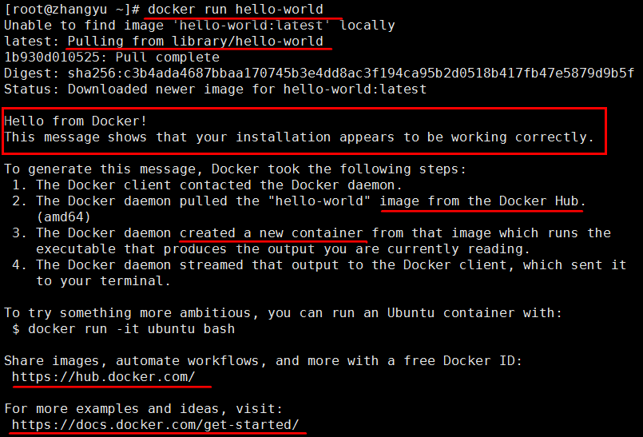
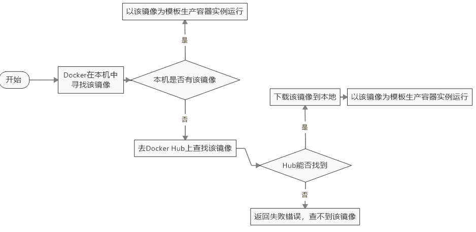
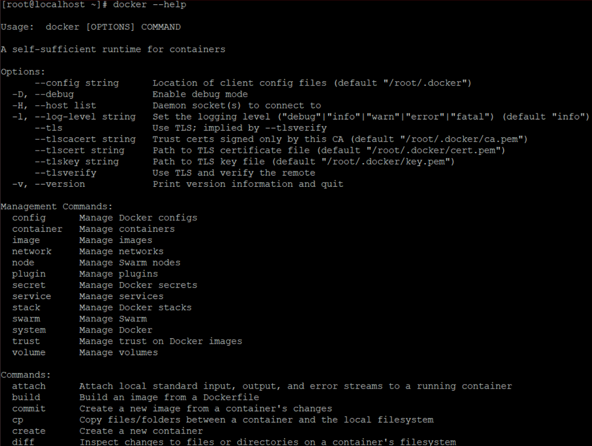
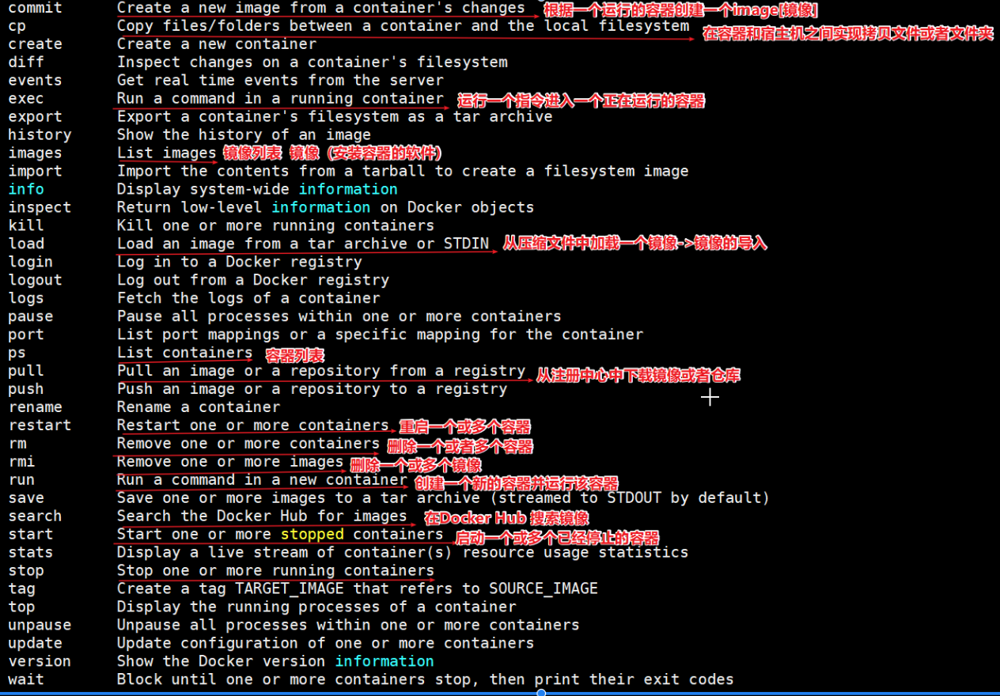

# 第二章 Docker安装与启动

## 2.1 安装Docker-CentOS7

Docker官方建议在Ubuntu中安装，因为Docker是基于Ubuntu发布的，而且一般Docker出现的问题Ubuntu是最先更新或者打补丁的。在很多版本的CentOS中是不支持更新最新的一些补丁包的。​ 由于我们学习的环境都使用的是CentOS，因此这里我们将Docker安装到CentOS上。

**注意：** 这里建议安装在CentOS7.x以上的版本，在CentOS6.x的版本中，安装前需要安装其他很多的环境，而且Docker很多补丁不支持更新。

1.  官网中文安装参考手册

[https://docs.docker.com/install/linux/docker-ce/centos/](https://docs.docker.com/install/linux/docker-ce/centos/ "https://docs.docker.com/install/linux/docker-ce/centos/")

1.  确定你是CentOS7及以上版本

cat /etc/redhat-release

1.  yum安装gcc相关
    -   CentOS7能上外网
    -   检查gcc和g++是否安装好，如果没有安装好，则需要安装。
    -   安装gcc和g++

yum -y install gcc

yum -y install gcc-c++

1.  安装需要的软件包

| yum install -y yum-utils device-mapper-persistent-data lvm2&#xA; |
| ---------------------------------------------------------------- |

1.  设置镜像仓库
    -   **大坑(千万不要试，网速慢，超时，安装不上)**

| yum-config-manager --add-repo [https://download.docker.com/linux/centos/docker-ce.repo](https://download.docker.com/linux/centos/docker-ce.repo "https://download.docker.com/linux/centos/docker-ce.repo") &#xA;报错：官网太慢，一定超时。\[Errno 14] curl#35 - TCP connection reset by peer\[Errno 12] curl#35 - Timeout |
| ------------------------------------------------------------------------------------------------------------------------------------------------------------------------------------------------------------------------------------------------------------------------------------------------------------ |

-   推荐：阿里云服务器

| yum-config-manager --add-repo [http://mirrors.aliyun.com/docker-ce/linux/centos/docker-ce.repo](http://mirrors.aliyun.com/docker-ce/linux/centos/docker-ce.repo "http://mirrors.aliyun.com/docker-ce/linux/centos/docker-ce.repo") |
| ---------------------------------------------------------------------------------------------------------------------------------------------------------------------------------------------------------------------------------- |

1.  更新yum软件包索引

| yum makecache fast&#xA; |
| ----------------------- |

1.  安装DOCKER CE（社区版）（DOCKER EE企业版收费）

| yum -y install docker-ce&#xA; |
| ----------------------------- |

1.  启动docker
    -   手动启动：systemctl start docker&#x20;
    -   自动启动：systemctl enable docker &#x20;
2.  测试
    -   检查版本：docker version
    -   下载并运行HelloWorld：docker run hello-world
        -   如果下载不下来，可以配置镜像加速器
        -   输出这段提示以后，hello world就会停止运行，容器自动终止。

-   run干了什么

 

1.  配置镜像加速CentOS7版本

mkdir -p /etc/docker

vim  /etc/docker/daemon.json&#x20;

-   **#网易云**

| {&#xA;"registry-mirrors": \["[http://hub-mirror.c.163.com](http://hub-mirror.c.163.com "http://hub-mirror.c.163.com")"]&#xA;}&#xA; |
| ---------------------------------------------------------------------------------------------------------------------------------- |

-   \*\*#阿里云(推荐) \*\*

| {&#xA;"registry-mirrors": \["[https://8y2y8njn.mirror.aliyuncs.com](https://8y2y8njn.mirror.aliyuncs.com "https://8y2y8njn.mirror.aliyuncs.com")"]&#xA;}&#xA; |
| ------------------------------------------------------------------------------------------------------------------------------------------------------------- |

-   **#ustc**

\#是老牌的linux镜像服务提供者了，还在遥远的ubuntu 5.04版本的时候就在用。ustc的docker镜像加速器速度很快。

\#ustc docker mirror的优势之一就是不需要注册，是真正的公共服务。

\#[https://lug.ustc.edu.cn/wiki/mirrors/help/docker](https://lug.ustc.edu.cn/wiki/mirrors/help/docker "https://lug.ustc.edu.cn/wiki/mirrors/help/docker")

在该文件中输入如下内容：

| {&#xA;"registry-mirrors": \["[https://docker.mirrors.ustc.edu.cn](https://docker.mirrors.ustc.edu.cn "https://docker.mirrors.ustc.edu.cn")"]&#xA;}&#xA; |
| ------------------------------------------------------------------------------------------------------------------------------------------------------- |

systemctl daemon-reload

systemctl restart docker

1.  卸载
    -   systemctl stop docker&#x20;
    -   yum -y remove docker-ce
    -   rm -rf /var/lib/docker
    -   卸载旧版本
        -   2019.11英文官网版本
            -   最新的英文版：<https://docs.docker.com/install/linux/docker-ce/centos/#uninstall-old-versions>

| yum remove docker \\&#xA;docker-client \\&#xA;docker-client-latest \\&#xA;docker-common \\&#xA;docker-latest \\&#xA;docker-latest-logrotate \\&#xA;docker-logrotate \\&#xA;docker-engine&#xA; |
| --------------------------------------------------------------------------------------------------------------------------------------------------------------------------------------------- |

## 2.2 Docker的启动与停止

### 2.2.1 命令

| 启动docker：&#xA;     | systemctl start docker&#xA;   |
| ------------------ | ----------------------------- |
| 停止docker：&#xA;     | systemctl stop docker&#xA;    |
| 重启docker：&#xA;     | systemctl restart docker&#xA; |
| 查看docker状态：&#xA;   | systemctl status docker&#xA;  |
| 开机启动：&#xA;         | systemctl enable docker&#xA;  |
| 查看docker概要信息：&#xA; | docker info&#xA;              |
| 查看docker帮助文档：&#xA; | docker --help&#xA;            |

### 2.2.2 帮助手册：docker --help

### 2.2.3 指令介绍

| cp&#xA;      | 本地文件系统(OS操作系统\|宿主机)和容器之间进行文件或者文件夹拷贝&#xA; |
| ------------ | ---------------------------------------- |
| exec&#xA;    | 登录一个容器，使用命令行操作正在运行的容器。&#xA;              |
| images&#xA;  | 镜像的集合查询。&#xA;                            |
| ps&#xA;      | 容器列表&#xA;                                |
| pull&#xA;    | 下载镜像&#xA;                                |
| restart&#xA; | 重启一个或多个容器&#xA;                           |
| rm&#xA;      | 删除一个或多个容器&#xA;                           |
| rmi&#xA;     | 删除一个或多个镜像&#xA;                           |
| run&#xA;     | 创建一个容器，并运行起来&#xA;                        |
| save&#xA;    | 导出镜像到一个文件(tar)中&#xA;                     |
| search&#xA;  | 搜索镜像（从Docker Hub）&#xA;                   |
| start&#xA;   | 启动一个或多个已经停止的容器&#xA;                      |
| stop&#xA;    | 停止一个或多个正在运行的容器&#xA;                      |

