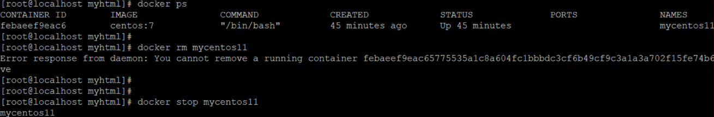

# 第三章 常用命令

镜像：Docker镜像是由文件系统叠加而成（是一种文件的存储形式）；是docker中的核心概念，可以认为镜像就是对某些运行环境或者软件打的包，用户可以从docker仓库中下载基础镜像到本地，比如，开发人员可以从docker仓库拉取（下载）一个只包含centos7系统的基础镜像，然后在这个镜像中安装jdk、mysql、Tomcat和自己开发的应用，最后将这些环境打成一个新的镜像。开发人员将这个新的镜像提交给测试人员进行测试，测试人员只需要在测试环境下运行这个镜像就可以了，这样就可以保证开发人员的环境和测试人员的环境完全一致。

## 3.1 镜像相关命令

### 3.1.1 查看镜像

查看镜像可以使用如下命令：docker images

-   REPOSITORY：镜像名称
-   TAG：镜像标签
-   IMAGE ID：镜像ID
-   CREATED：镜像的创建日期（不是获取该镜像的日期）
-   SIZE：镜像大小

这些镜像都是存储在Docker的 /var/lib/docker 目录下

### 3.1.2 搜索镜像

从网络中查找需要的镜像：docker search 镜像名称

例如 下载一个 nginx 镜像

-   NAME：仓库名称
-   DESCRIPTION：镜像描述
-   STARS：用户评价，反应一个镜像的受欢迎程度
-   OFFICIAL：是否官方
-   AUTOMATED：自动构建，表示该镜像由Docker Hub自动构建流程创建

### 3.1.3 拉取镜像

拉取镜像就是从Docker仓库下载镜像到本地，镜像名称格式为 【名称:版本号】，如果版本号不指定则是最新的版本&#x20;

命令：docker pull 镜像名称
下载一个 nginx 的镜像 , 需要注意：如果下载的时候，不指定版本，会下载最新版本

刚刚下载的镜像通过 docker images 就可以查看

### 3.1.4 删除镜像

可以按照镜像id删除镜像，命令如下：docker rmi 镜像ID

删除单个镜像(-f 强制删除)：docker rmi  -f 镜像ID

删除多个镜像：docker rmi -f   镜像名1:TAG    镜像名2:TAG

删除所有镜像：docker rmi -f \$(docker images -qa)

### 3.15 从Docker Hub拉取

Docker镜像首页，包括官方镜像和其它公开镜像。Docker Hub上最受欢迎的10大镜像（通过Docker registry API获取不了镜像被pull的个数，只能通过镜像的stars数量来衡量镜像的流行度。毫无疑问，拥有最高stars数量的库都是官方库）。

[https://hub.docker.com/search?image\_filter=official\&type=image](https://hub.docker.com/search?image_filter=official\&type=image "https://hub.docker.com/search?image_filter=official\&type=image")

国情的原因，国内下载 Docker HUB 官方的相关镜像比较慢，可以使用国内（docker.io）的一些镜像加速器，镜像保持和官方一致，关键是速度块，推荐使用。

## 3.2 容器相关命令

**容器**也是docker中的核心概念，镜像是创建容器的软件 , 容器是由镜像运行产生的运行实例。镜像和容器的关系，就如同Java语言中类和对象的关系。

如果需要通俗的描述容器的话，容器就是一个存放东西的地方，就像书包可以装各种文具、衣柜可以放各种衣服、鞋架可以放各种鞋子一样。我们现在所说的容器存放的东西可能更偏向于应用。比如网站、程序甚至是系统环境。

### 3.2.1 查看容器

| 查看正在运行的容器：&#xA;   | docker ps&#xA;                  |
| ----------------- | ------------------------------- |
| 查看所有容器：&#xA;      | docker ps -a&#xA;               |
| 查看最后一次运行的容器：&#xA; | docker ps -l&#xA;               |
| 查看停止的容器：&#xA;     | docker ps -f status=exited&#xA; |

### 3.2.2 创建与启动容器

① 什么是宿主机？

就是主机，这个概念是相对于子机而言的，比如你安装有虚拟机的话，那么相对于虚拟机而言，你正在使用的计算机就是宿主机，虚拟机是安装在主机上的，必须在主机上才能运行，主机就是一个“宿主”。

② 创建容器常用的参数说明：

创建容器命令：docker run

| -i：表示运行容器&#xA;-t：表示容器启动后会进入其命令行。加入这两个参数后，容器创建就能登录进去。即分配一个伪终端。&#xA;--name :为创建的容器命名。&#xA;-v：表示目录映射关系（前者是宿主机目录，后者是映射到宿主机上的目录），可以使用多个－v做多个目录或文件映射。注意：最好做目录映射，在宿主机上做修改，然后共享到容器上。&#xA;-d：在run后面加上-d参数,则会创建一个**守护式容器**在后台运行（这样创建容器后不会自动登录容器，如果只加-i -t两个参数，创建后就会自动进去容器）。&#xA;-p：表示端口映射，前者是宿主机端口，后者是容器内的映射端口。可以使用多个-p做多个端口映射&#xA; |
| ------------------------------------------------------------------------------------------------------------------------------------------------------------------------------------------------------------------------------------------------------------------------------------------------------------------------- |

**（1）交互式方式创建容器**

以交互式方式创建并启动容器，启动完成后，直接进入当前容器。使用exit命令退出容器。需要注意的是以此种方式启动容器，如果退出容器，则容器会进入停止状态。可以理解成交互式容器 是前台容器。

| docker run -it --name=容器名称 镜像名称:标签 /bin/bash&#xA;# 比如：**docker run -it --name=mycentos centos:7 /bin/bash**&#xA;# docker run:表示创建容器&#xA;# -it：表示运行容器并进入它的命令行&#xA;# --name=mycentos：给当前的容器命名&#xA;# centos:7：使用该镜像创建&#xA;# /bin/bash：放在镜像名后的是命令，这里我们希望有个交互式 Shell，因此用的是 /bin/bash&#xA; |
| ------------------------------------------------------------------------------------------------------------------------------------------------------------------------------------------------------------------------------------------------------------------------------------ |

创建好容器，并且已经进入到容器内部了，可以直接观察前面中括号里面的内容发现，跟创建容器之前不一样了，

并且 通过 dir 命令，会发现，其实容器内部也是一个 centos , 我们可以把每个容器都看成一个小电脑或者服务器

重新开一个新的会话，查看刚刚创建的容器是否已经有了。

查看正在运行的容器：docker ps

退出当前容器：**exit**

退出之后，容器也退出了，没有删除

ctrl + p + q: 容器不停止退出

**(2) 创建后台容器**

**docker run -id --name=mycentos2 centos:7**

查看 docker 容器已经运行

**(3) 守护式方式创建容器：**

创建一个守护式容器；如果对于一个需要长期运行的容器来说，我们可以创建一个守护式容器。

命令如下（容器名称不能重复）：守护容器可以理解成在后台运行的容器

| # 守护式容器和交互式容器的创建方式区别：&#xA;# ① -it 换成 -di&#xA;# ② 去掉后面的 /bin/bash&#xA;docker run -di --name=容器名称 镜像名称:标签&#xA;# 比如：**docker run -di --name=mycentos10 centos:7** |
| -------------------------------------------------------------------------------------------------------------------------------------------------------------- |

通过 docker ps 查看容器已经是运行状态

进入守护式容器方式：

| docker exec -it 容器名称 (或者容器ID)  /bin/bash&#xA;# 比如  **docker exec -it mycentos10 /bin/bash** |
| ------------------------------------------------------------------------------------------- |

已经进入到容器内部了，如果现在退出exit，然后查看容器docker ps是否还在后台运行

重新进入:

docker attach 容器ID

上述两个区别:

-   attach: 直接进入容器启动命令的终端，不会启动新的进程
-   exec: 是在容器中打开新的终端，并且可以启动新的进程

### 3.2.3 停止与启动容器

-   先通过 docker ps 查看正在运行的容器
-   停止容器：

| docker stop 容器名称（或者容器ID）&#xA;例如： docker stop mycentos2&#xA; |
| ----------------------------------------------------------- |

-   创建完容器之后，停止容器

-   查看容器是否已经停止
-   启动容器：

| docker start 容器名称（或者容器ID）&#xA;例如： docker start mycentos2&#xA; |
| ------------------------------------------------------------- |

-   查看容器是否已经启动

### 3.2.4 文件拷贝

我们需要在容器内安装一个软件，软件首先需要有安装包，我们就需要把安装包拷贝到容器内。我们通常的操作是先把文件上传到宿主机，然后我们在将文件从宿主机拷贝到容器内的某个目录下面进行安装。

将linux宿主机中的文件拷贝到容器内可以使用命令：

如果我们需要将文件拷贝到容器内可以使用cp命令

| docker cp 需要拷贝的文件或目录 容器名称:容器目录&#xA;例如： docker cp ./anaconda-ks.cfg mycentos2:/&#xA; |
| ----------------------------------------------------------------------------------- |

拷贝一个文件到 mycentos2 的 /urs/local/ 文件下面 ，拷贝完成之后，删除文件，然后在mycentos2拷贝过来

登录容器查看拷贝之后的结果

| docker exec -it mycentos2 /bin/bash&#xA; docker exec：表示登陆正在运行的容器&#xA; -it：进入命令行&#xA; mycentos2：进入到该容器&#xA; |
| ---------------------------------------------------------------------------------------------------------- |

 

也可以将文件从容器内拷贝出来

| docker cp 容器名称:容器目录 需要拷贝的文件或目录&#xA;例如：docker cp mycentos2:/usr/local/anaconda-ks.cfg ./&#xA; |
| -------------------------------------------------------------------------------------------- |

我们先通过 exit 退出容器，然后在把文件从容器拷贝到当前目录

### 3.2.5 目录挂载

我们可以在创建容器的时候，将宿主机的目录与容器内的目录进行映射，这样我们就可以通过修改宿主机某个目录的文件从而去影响容器。

| **概念：****①数据卷**&#xA;Docker容器产生的数据，如果不通过docker commit生成新的镜像，使得数据做为镜像的一部分保存下来，那么当容器删除后，数据自然也就没有了。为了能保存数据，在docker中我们使用卷。&#xA;卷就是目录或文件，存在于一个或多个容器中，由docker挂载到容器，但不属于联合文件系统，因此能够绕过Union File System提供一些用于持续存储或共享数据的特性：&#xA;卷的设计目的就是数据的持久化，完全独立于容器的生存周期，因此Docker不会在容器删除时删除其挂载的数据卷。&#xA;特点：&#xA;1：数据卷可在容器之间共享或重用数据2：卷中的更改可以直接生效3：数据卷中的更改不会包含在镜像的更新中4：数据卷的生命周期一直持续到没有容器使用它为止**②数据卷容器：**&#xA;命名的容器挂载数据卷，其它容器通过挂载这个(父容器)实现数据共享，挂载数据卷的容器，称之为数据卷容器。&#xA; |
| -------------------------------------------------------------------------------------------------------------------------------------------------------------------------------------------------------------------------------------------------------------------------------------------------------------------------------------------------------------------------------------------------------------------------------------------- |

创建容器 添加-v参数 后边为 宿主机目录:容器目录，例如：

| # 创建并启动容器mycentos3,并挂载linux中的/usr/local/myhtml目录到容器的/usr/local/myhtml；也就是在linux中的/usr/local/myhtml中操作相当于对容器相应目录操作&#xA;docker run -di --name=容器的名字 -v /usr/local/myhtml:/usr/local/myhtml --name=mycentos3 centos:7&#xA;比如：**docker run -di --name=mycentos3 -v /usr/local:/usr/local centos:7** |
| ----------------------------------------------------------------------------------------------------------------------------------------------------------------------------------------------------------------------------------------------------------------------------------------------- |

通过 docker ps 查看正在运行的容器，在创建容器并且进行目录挂载，然后在通过 docker ps 查看刚刚创建的容器是否已经创建

进入到 myhtml 目录 ，通过dir查看是否有文件，通过vi test2 ，创建一个文件，进入test2文件，随便输入一些数据

进入目录随便输入一些东西 ， 退出保存

登录容器，查看刚刚输入的内容

| # 进入容器&#xA;docker exec -it mycentos11 /bin/bash&#xA;# 进入容器中查看目录&#xA;cd /usr/local/myhtml&#xA;# 查看myhtml目录中，是否有对应文件test2.txt&#xA;ls&#xA;cat test2&#xA;# 退出容器&#xA;exit&#xA; |
| ------------------------------------------------------------------------------------------------------------------------------------------------------------------------- |

 

如果你共享的是多级的目录，可能会出现权限不足的提示。

这是因为CentOS7中的安全模块selinux把权限禁掉了，我们需要添加参数&#x20;

\--privileged=true 来解决挂载的目录没有权限的问题

docker run -id **--privileged=true** --name=mycentos5 -v /usr/local/myhtml:/usr/local/myhtml centos:7

### 3.2.6 查看容器日志

docker logs \[OPTIONS] 容器ID或名称

OPTIONS说明:

-   -t :是加入时间戳
-   -f :跟随最新的日志打印
-   -n :数字 显示最后多少条

### 3.2.7 查看容器内运行的进程

docker top 容器ID或名称

### 3.2.8 查看容器细节

我们可以通过以下命令查看容器运行的各种数据

| docker inspect 容器名称（容器ID） &#xA;# 在linux宿主机下查看 mycentos3 的ip&#xA; |
| ---------------------------------------------------------------- |

IP 地址

通过inspect 可以查看的信息太多，如果想单纯有针对性的查看某个信息，也可以直接执行下面的命令直接输出IP地址

| docker inspect --format='{{.NetworkSettings.IPAddress}}' 容器名称（容器ID）&#xA;# 例如：docker inspect --format='{{.NetworkSettings.IPAddress}}' mycentos11&#xA; |
| ----------------------------------------------------------------------------------------------------------------------------------------------------- |

### 3.2.9 删除容器

1.  删除指定的容器：

| docker rm 容器名称（容器ID）&#xA;例如：docker rm mycentos11&#xA; |
| ----------------------------------------------------- |

1.  删除容器的时候，如果容器在运行，会报错，必须先停止容器

| # 查看正在运行的容器&#xA;docker ps&#xA;# 删除正在运行的容器&#xA;docker rm mycentos11&#xA;# 停止容器&#xA;docker stop mycentos11&#xA; |
| ------------------------------------------------------------------------------------------------------------- |

| # 查看所有的容器，看看是否有mycentos11&#xA;docker ps -a&#xA;# 删除centos11容器&#xA;docker rm mycentos11&#xA;# 删除完成之后，在查看mycentos11容器是否还存在&#xA;docker ps -a&#xA; |
| ---------------------------------------------------------------------------------------------------------------------------------------------- |

也可以使用-f参数进行强制删除：docker rm -f 容器名称或id

## 3.3 命令总结

attach    Attach to a running container                 # 当前 shell 下 attach 连接指定运行镜像

build     Build an image from a Dockerfile              # 通过 Dockerfile 定制镜像

commit    Create a new image from a container changes   # 提交当前容器为新的镜像

cp        Copy files/folders from the containers filesystem to the host path   #从容器中拷贝指定文件或者目录到宿主机中

create    Create a new container                        # 创建一个新的容器，同 run，但不启动容器

diff      Inspect changes on a container's filesystem   # 查看 docker 容器变化

events    Get real time events from the server          # 从 docker 服务获取容器实时事件

exec      Run a command in an existing container        # 在已存在的容器上运行命令

export    Stream the contents of a container as a tar archive   # 导出容器的内容流作为一个 tar 归档文件\[对应 import ]

history   Show the history of an image                  # 展示一个镜像形成历史

images    List images                                   # 列出系统当前镜像

import    Create a new filesystem image from the contents of a tarball # 从tar包中的内容创建一个新的文件系统映像\[对应export]

info      Display system-wide information               # 显示系统相关信息

inspect   Return low-level information on a container   # 查看容器详细信息

kill      Kill a running container                      # kill 指定 docker 容器

load      Load an image from a tar archive              # 从一个 tar 包中加载一个镜像\[对应 save]

login     Register or Login to the docker registry server    # 注册或者登陆一个 docker 源服务器

logout    Log out from a Docker registry server          # 从当前 Docker registry 退出

logs      Fetch the logs of a container                 # 输出当前容器日志信息

port      Lookup the public-facing port which is NAT-ed to PRIVATE\_PORT    # 查看映射端口对应的容器内部源端口

pause     Pause all processes within a container        # 暂停容器

ps        List containers                               # 列出容器列表

pull      Pull an image or a repository from the docker registry server   # 从docker镜像源服务器拉取指定镜像或者库镜像

push      Push an image or a repository to the docker registry server    # 推送指定镜像或者库镜像至docker源服务器

restart   Restart a running container                   # 重启运行的容器

rm        Remove one or more containers                 # 移除一个或者多个容器

rmi       Remove one or more images             # 移除一个或多个镜像\[无容器使用该镜像才可删除，否则需删除相关容器才可继续或 -f 强制删除]

run       Run a command in a new container              # 创建一个新的容器并运行一个命令

save      Save an image to a tar archive                # 保存一个镜像为一个 tar 包\[对应 load]

search    Search for an image on the Docker Hub         # 在 docker hub 中搜索镜像

start     Start a stopped containers                    # 启动容器

stop      Stop a running containers                     # 停止容器

tag       Tag an image into a repository                # 给源中镜像打标签

top       Lookup the running processes of a container   # 查看容器中运行的进程信息

unpause   Unpause a paused container                    # 取消暂停容器

version   Show the docker version information           # 查看 docker 版本号

wait      Block until a container stops, then print its exit code   # 截取容器停止时的退出状态值

