# 第四章 应用部署

## 4.1 MySQL部署

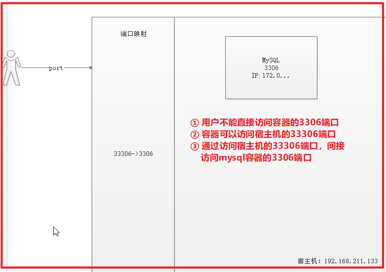

（1）拉取mysql镜像

| **docker** pull centos/mysql-57-centos7&#xA; |
| -------------------------------------------- |

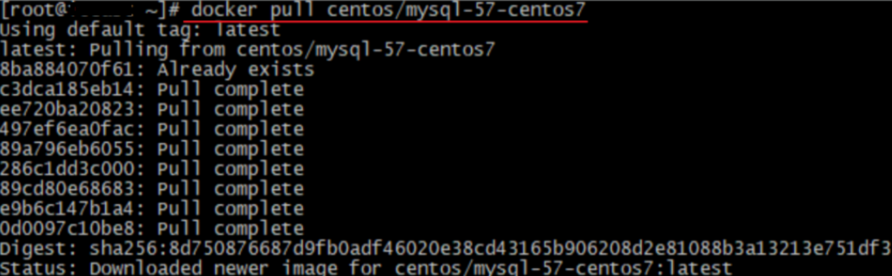

（2）创建容器

| # 创建mysql5.7容器&#xA;# docker run -di --name=容器名字 -p 宿主机端口:容器端口 -e MYSQL\_ROOT\_PASSWORD=mysql密码 容器名称&#xA;docker run -di --name=mysql5.7 -p 33306:3306 -e MYSQL\_ROOT\_PASSWORD=123456 centos/mysql-57-centos7&#xA; |
| ----------------------------------------------------------------------------------------------------------------------------------------------------------------------------------------------------------------- |

-p 代表端口映射，格式为 宿主机映射端口:容器运行端口

-e 代表添加环境变量 MYSQL\_ROOT\_PASSWORD 是root用户远程登陆密码

创建守护式容器 ，并且通过 docker ps 查看是否映射成功，

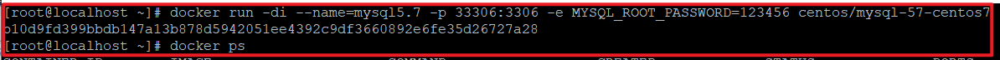

（3）远程登录mysql

连接宿主机的IP ,指定端口为33306

使用 windows上面的小海豚进行连接

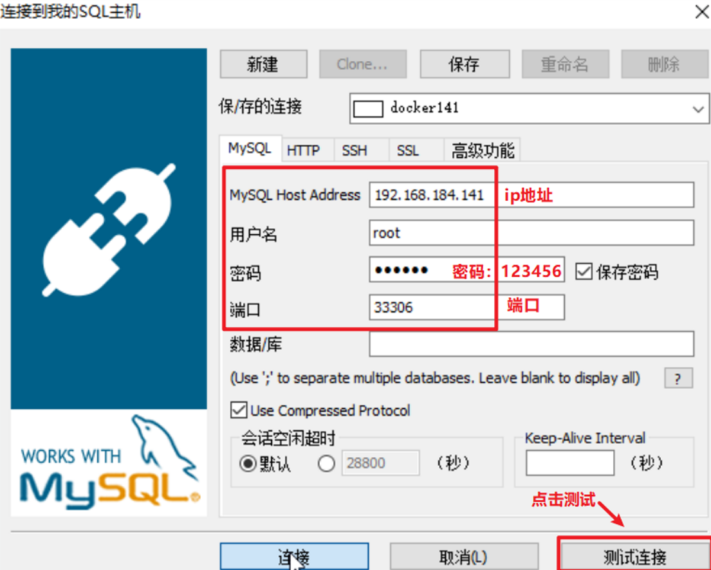

navicat 测试连接

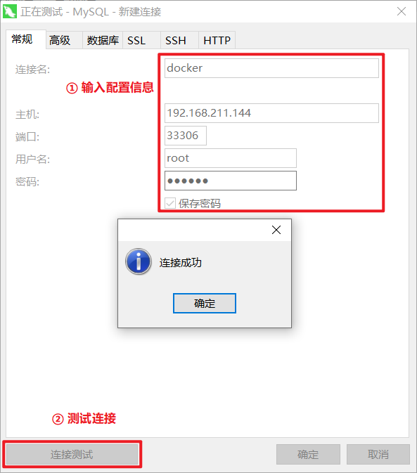

创建数据库和数据库里面的表

| **CREATE DATABASE** vue;&#xA;**USE** vue;&#xA;**CREATE TABLE USER**(&#xA;  id INT **PRIMARY KEY** AUTO\_INCREMENT,&#xA;  age INT,&#xA;  username VARCHAR(20),&#xA;  \*\*password \*\*VARCHAR(50),&#xA;  email VARCHAR(50),&#xA;  sex VARCHAR(20)&#xA;)&#xA; |
| ----------------------------------------------------------------------------------------------------------------------------------------------------------------------------------------------------------------------------------------------------------- |

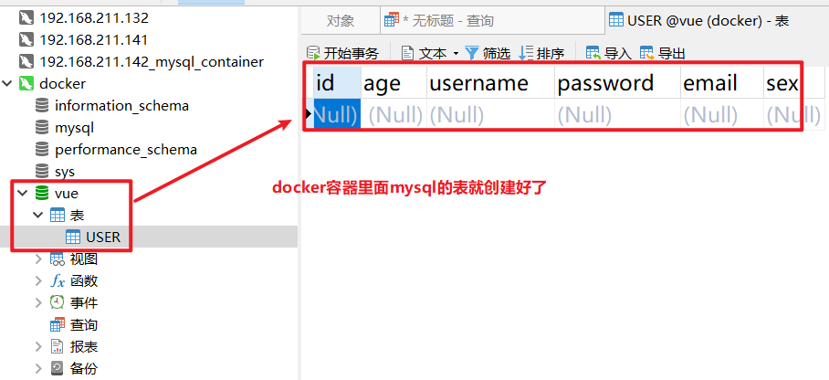

## 4.2 Tomcat部署

（1）拉取镜像

| docker pull tomcat:7-jre7&#xA; |
| ------------------------------ |

 

（2）创建容器

创建容器  -p表示地址映射 -v 表示目录挂载

| # 创建tomcat容器;并挂载了webapps目录&#xA;docker run -di --name=mytomcat -p 9000:8080 -v /usr/local/webapps\:/usr/local/tomcat/webapps tomcat:7-jre7&#xA; |
| ---------------------------------------------------------------------------------------------------------------------------------------------- |

创建完成容器之后，在通过 docker ps 查看容器是否正在运行

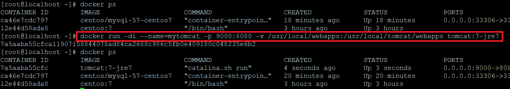

本地的war包 ，上传到docker容器里面

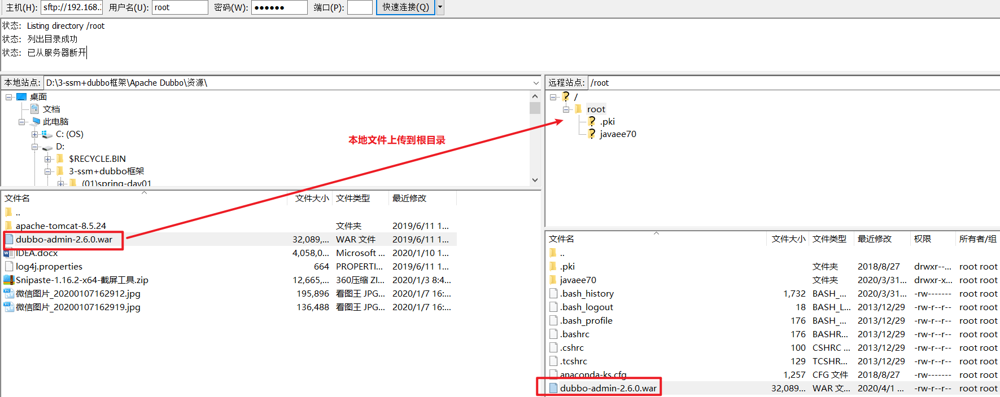

ls 查看 dubbo的war 是否已经上传到docker容器，上传成功之后，在通过mv 命令 把dubbo移动到 /usr/local/webapps 目录下面，然后请求 [http://192.168.211.144:9000/dubbo-admin-2.6.0/](http://192.168.211.144:9000/dubbo-admin-2.6.0/ "http://192.168.211.144:9000/dubbo-admin-2.6.0/")

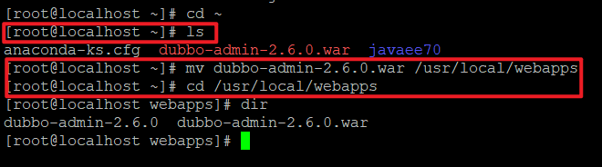

请求地址：<http://192.168.211.144:9000/dubbo-admin-2.6.0/ 说明咱的tomcat已经部署成功>

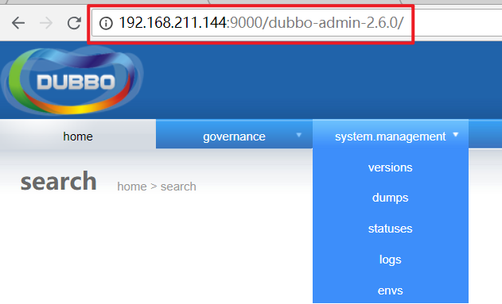

## 4.3 Nginx部署

（1）拉取镜像

| **docker** pull nginx&#xA; |
| -------------------------- |

（2）创建Nginx容器

| **docker run -di --name=mynginx -p 80:80 nginx** |
| ------------------------------------------------ |

安装完成之后，请求nginx页面

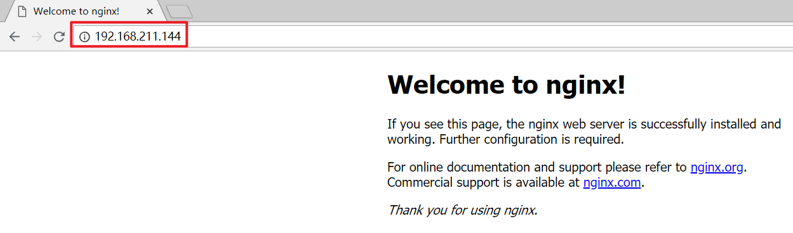

## 4.4 Redis部署

（1）拉取镜像

| **docker** pull redis&#xA; |
| -------------------------- |

（2）创建容器

| docker run -di --name=myredis -p 6379:6379 redis&#xA; |
| ----------------------------------------------------- |

创建 redis 容器

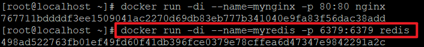

（3）通过客户端工具连接测试。或者通过java代码用Jedis客户端进行测试。

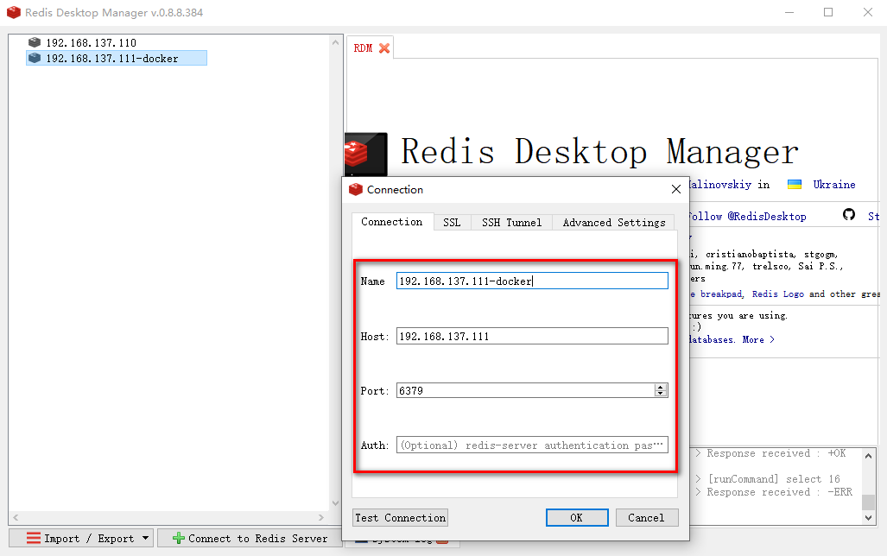

