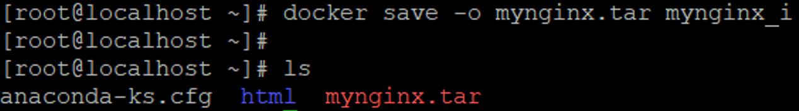
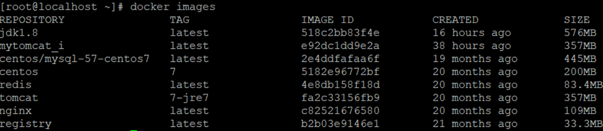

# 第五章 迁移与备份

其中涉及到的命令有：

-   docker commit 将容器保存为镜像
-   docker save 将镜像备份为tar文件
-   docker load 根据tar文件恢复为镜像

## 5.1 容器保存为镜像

我们可以通过以下命令将容器保存为镜像

| # 保存nginx容器为镜像&#xA;docker **commit **容器名称  镜像名称&#xA;例如：docker **commit** mynginx mynginx\_i&#xA; |
| ------------------------------------------------------------------------------------------------ |

使用 docker ps -a 查看所有的容器

看到有一个mynginx 容器 , 将容器保存为一个镜像：

查看镜像是否保存成功

使用刚刚保存的镜像 ，重新创建一个容器

创建完成之后 ， 直接 通过 docker ps查看正在运行的容器，可以找到刚刚创建的容器mynginx2

## 5.2 镜像备份

我们可以通过以下命令将镜像保存为tar 文件

| # 命令形式：docker save –o tar文件名 镜像名&#xA;# 保存镜像为文件 -o：表示output 输出的意思&#xA;docker  save -o mynginx.tar mynginx\_i&#xA; |
| ---------------------------------------------------------------------------------------------------------------- |

通过 save 保存成文件之后，在通过 ls 命令进行查看当前目录是否有 tar文件

## 5.3 镜像恢复与迁移

首先我们先删除掉mynginx\_i镜像 然后执行此命令进行恢复

| # 命令形式：docker load -i tar文件名&#xA;docker load -i mynginx.tar&#xA; |
| ---------------------------------------------------------------- |

-i 表示input输入的文件

执行后再次查看镜像，可以看到镜像已经恢复

我们需要直接恢复刚刚的 tar 文件 ，就需要先删除 mynginx\_i 镜像，才能恢复, 直接删除 mynginx\_i 镜像 ，发现会报错，因为当前镜像的容器正在运行，需要先停止容器，删除容器 ， 在删除镜像

删除完成之后 ， 在查看镜像是否还存在 ，发现mynginx\_i 镜像已经被删除

恢复镜像

