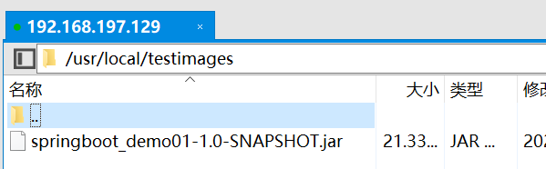
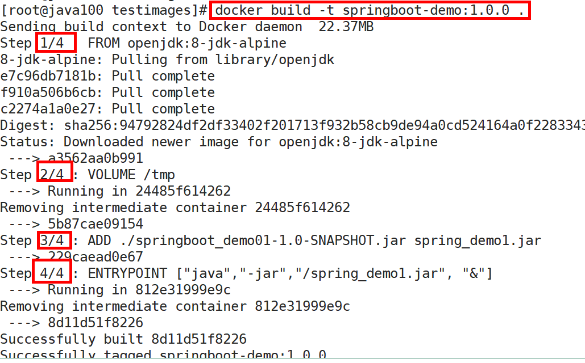
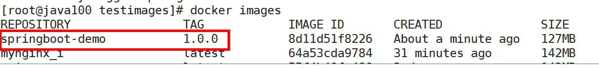
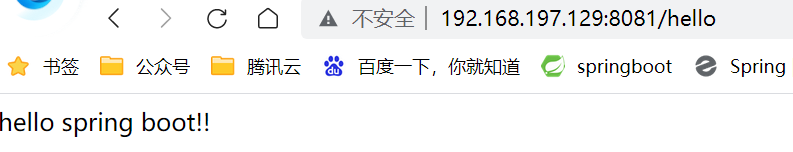

# 第六章 Dockerfile

## 6.1 什么是Dockerfile

前面的课程中已经知道了，要获得镜像，可以从Docker仓库中进行下载。那如果我们想自己开发一个镜像，那该如何做呢？答案是：Dockerfile

Dockerfile其实就是一个文本文件，由一系列命令和参数构成，Docker可以读取Dockerfile文件并根据Dockerfile文件的描述来构建镜像。

1、对于开发人员：可以为开发团队提供一个完全一致的开发环境；

2、对于测试人员：可以直接拿开发时所构建的镜像或者通过Dockerfile文件构建一个新的镜像开始工作了；

3、对于运维人员：在部署时，可以实现应用的无缝移植。

## 6.2 常用命令

| **命令**                                    | **作用**                                  |
| ----------------------------------------- | --------------------------------------- |
| FROM image\_name:tag&#xA;                 | 定义了使用哪个基础镜像启动构建流程&#xA;                  |
| MAINTAINER user\_name&#xA;                | 声明镜像的创建者&#xA;                           |
| ENV key value&#xA;                        | 设置环境变量 (可以写多条)&#xA;                     |
| RUN command&#xA;                          | 是Dockerfile的核心部分(可以写多条)&#xA;            |
| ADD source\_dir/file dest\_dir/file&#xA;  | 将宿主机的文件复制到容器内，如果是一个压缩文件，将会在复制后自动解压&#xA; |
| COPY source\_dir/file dest\_dir/file&#xA; | 和ADD相似，但是如果有压缩文件并不能解压&#xA;              |
| WORKDIR path\_dir&#xA;                    | 设置工作目录&#xA;                             |

## 6.3 使用脚本创建镜像

步骤：

（1）创建目录

| mkdir -p /usr/local/testimages&#xA; |
| ----------------------------------- |

 

（2）上传项目jar包到mkdir -p /usr/local/testimages目录

（3）创建文件Dockerfile 并vi Dockerfile

| # Dockerfile 名字不要改&#xA;vim Dockerfile&#xA; |
| ------------------------------------------ |

设置环境变量 ，设置完成之后 先按下esc , 然后在 :wq 保存退出

| FROM openjdk:8-jdk-alpine&#xA;VOLUME /tmp&#xA;ADD ./springboot\_demo01-1.0-SNAPSHOT.jar spring\_demo1.jar&#xA;ENTRYPOINT \["java","-jar","/spring\_demo1.jar", "&"]&#xA; |
| ------------------------------------------------------------------------------------------------------------------------------------------------------------------------ |

（5）执行命令构建镜像

| docker build -t springboot-demo:1.0.0 .&#xA; |
| -------------------------------------------- |

注意后边的空格和点，不要省略

（6）查看镜像是否建立完成

| **docker** images&#xA; |
| ---------------------- |

 

（7）运行容器测试

docker run -di --name=springboot01 -p 8081:8081 springboot-demo:1.0.0

&#x9;报错：解决：缺少依赖插件，安装即可。

yum install glibc.i686

