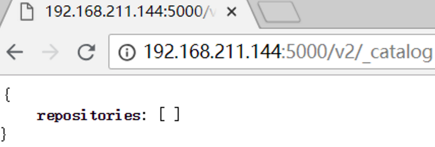
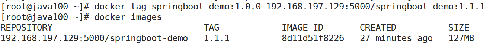
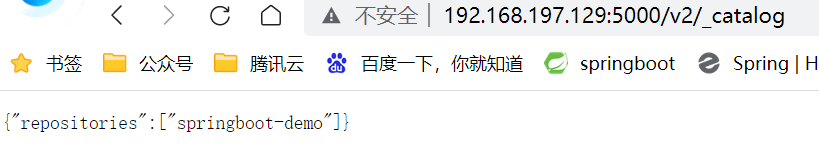

# 第七章 Docker私有仓库

Docker官方的Docker hub（<https://hub.docker.com）是一个用于管理公共镜像的仓库，我们可以从上面拉取镜像到本地，也可以把我们自己的镜像推送上去。但是，有时候我们的服务器无法访问互联网，或者你不希望将自己的镜像放到公网当中，那么我们就需要搭建自己的私有仓库来存储和管理自己的镜像。>

## 7.1 私有仓库搭建与配置

（1）拉取私有仓库镜像

| **docker** pull registry&#xA; |
| ----------------------------- |

（2）启动私有仓库容器

| docker run -di --name=registry -p 5000:5000 registry&#xA; |
| --------------------------------------------------------- |

创建私有仓库容器

通过 docker ps 查看容器是否创建成功

（3）打开浏览器 输入地址 [http://192.168.211.144:5000/v2/\_catalog](http://192.168.211.144:5000/v2/_catalog "http://192.168.211.144:5000/v2/_catalog") 看到{"repositories":\[]} 表示私有仓库搭建成功并且内容为空

（4）修改daemon.json

| **vi** /etc/docker/daemon.json&#xA; |
| ----------------------------------- |

添加以下内容，保存退出。目的是让容器信任下面的地址

| "insecure-registries":\["192.168.211.144:5000"]&#xA; |
| ---------------------------------------------------- |

此步用于让 docker信任私有仓库地址 ，然后退出保存

（5）重启docker 服务

| **systemctl** restart docker&#xA; |
| --------------------------------- |

## 7.2 镜像上传至私有仓库

（1）标记此镜像为私有仓库的镜像

| # 标记镜像为私有仓库的镜像  &#xA;docker tag springboot-demo:1.0.0 192.168.197.129:5000/springboot-demo:1.1.1&#xA; |
| ----------------------------------------------------------------------------------------------------- |

 

（2）再次启动私服容器

| # 再次启动私有仓库容器  &#xA;docker start registry&#xA; |
| --------------------------------------------- |

（3）上传标记的镜像

| # 上传标记的镜像  &#xA;docker push 192.168.197.129:5000/springboot-demo:1.1.1&#xA; |
| --------------------------------------------------------------------------- |

重新刷新，发现jdk 1.8 已经上传到私服

## 7.3 从私有仓库拉取镜像

| # 执行拉取镜像命令并查看&#xA;docker pull 192.168.197.129:5000/springboot-demo:1.1.1&#xA; |
| ----------------------------------------------------------------------------- |

