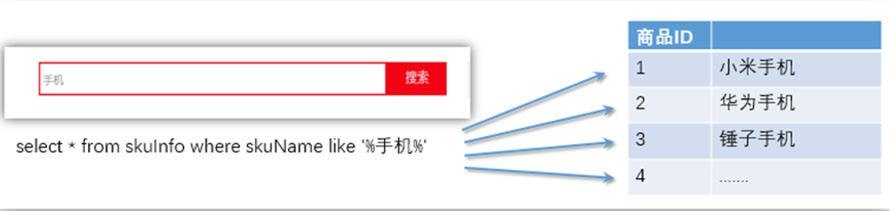
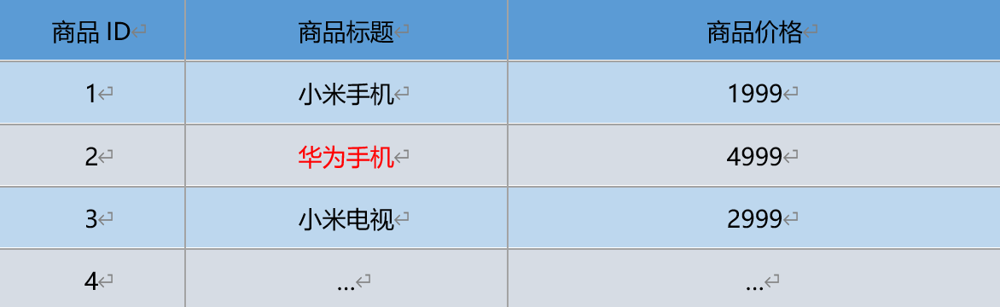

# 第一章 搜索概念

### 1.1 什么是搜索

**搜索：** 计算机根据用户输入的关键词进行匹配，从已有的数据库中摘录出相关的记录反馈给用户。

常见的全网搜索引擎，有百度、谷歌这样搜索网站。

除此，搜索技术在垂直领域也有广泛的使用，比如淘宝、京东搜索商品，万芳、知网搜索期刊，CSDN中搜索问题贴。也都是基于海量数据的搜索。

### 1.2 如何处理搜索

#### 1.2.1 用传统关系性数据库

image-20220627180315765

弊端： Stock Keeping Unit（库存量单位）

对于传统的关系型数据库对于关键词的查询，只能**逐字逐行的匹配，性能非常差**。

匹配方式不合理，比如搜索“小密手机”，如果用like进行匹配， 根本匹配不到。但是考虑使用者的用户体验的话，除了完全匹配的记录，还应该显示一部分近似匹配的记录，至少应该匹配到“手机”。

#### 1.2.2 专业全文索引引擎

全文搜索引擎目前主流的索引技术就是**倒排索引**的方式。

传统的保存数据的方式：记录→单词

而倒排索引的保存数据的方式：单词→记录

**例如：搜索“华为手机”**

数据库保存数据如下：

**（1）使用传统方式搜索时只能匹配一条id为2的数据**

image-20220627180605277

**（2）搜索引擎基于分词技术构建倒排索引**，存储数据如下：

image-20220627180708802

用户搜索时，会把搜索的**关键词也进行分词**，会把“华为手机”分词分成：华为和手机两个词。

这样的话，**先用【华为】进行匹配**，得到id为2的文档ID，**再用【手机】进行匹配**，得到id为1,2的文档ID。

那么全文索引通常，**还会根据匹配程度进行打分**，显然2号记录能匹配的次数更多。所以显示的时候以评分进行排序的话，2号记录会排到最前面。

