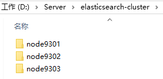
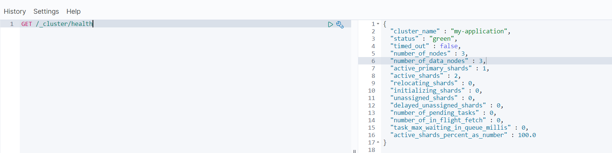
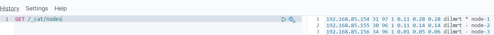
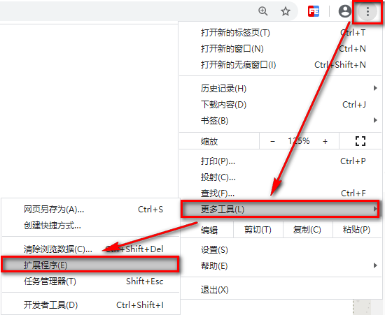
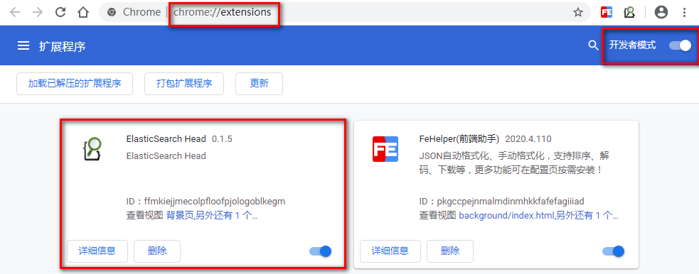
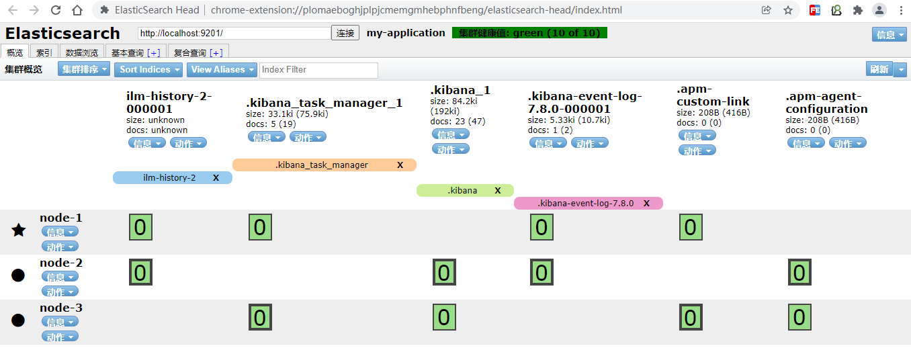
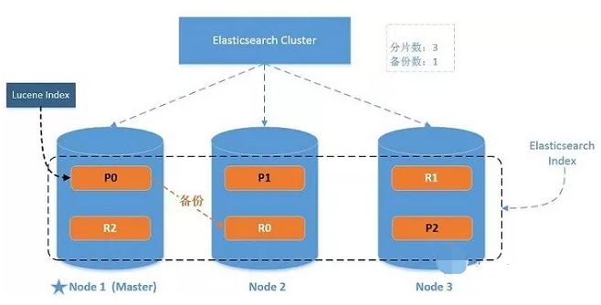
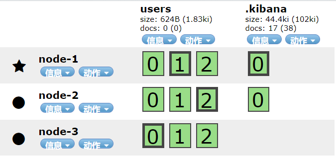
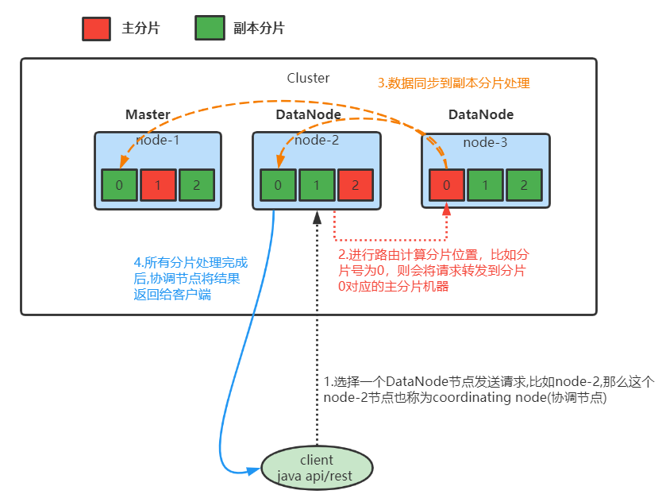
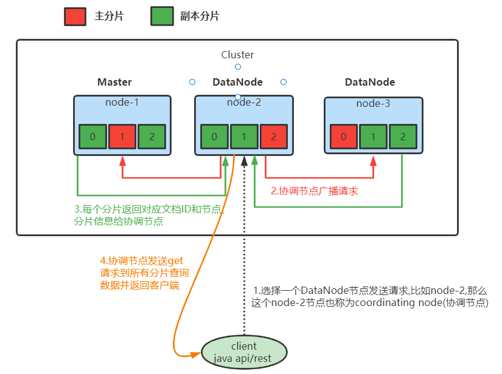

# 第十章 elasticsearch集群

单台Elasticsearch服务器提供服务，往往都有最大的负载能力，超过这个阈值，服务器性能就会大大降低甚至不可用，所以生产环境中，一般都是运行在指定服务器集群中。

除了负载能力，单点服务器也存在其他问题：

-   单台机器存储容量有限
-   单服务器容易出现单点故障，无法实现高可用
-   单服务的并发处理能力有限

配置服务器集群时，集群中节点数量没有限制，大于等于2个节点就可以看做是集群了。一般出于高性能及高可用方面来考虑集群中节点数量都是3个以上。

### 10.1 集群安装

#### 10.1.1 环境搭建

一般集群建议3台机器以上，这里我们就使用3台机器来安装集群环境。

创建elasticsearch-cluster文件夹，在内部复制三个elasticsearch服务

cluster\_nodes

**各个机器集群环境安装之前，先把之前的data数据目录删除。**

各个节点安装IK分词器。

修改elasticsearch-cluster.yml配置文件

**node-1:**

\#集群名称
cluster.name: my-application
\#默认为true。设置为false禁用磁盘分配决定器。
cluster.routing.allocation.disk.threshold\_enabled: false
\#节点名称
node.name: node-1
\#配置允许的访问网络
network.host: 0.0.0.0
\#http服务端口
http.port: 9201
\#集群间通信端口号，在同一机器下必须不一样
transport.tcp.port: 9301
\#是否允许为主节点，默认true
node.master: true
\#是否为数据节点，默认true
node.data: true
\#初始配置选举master节点
cluster.initial\_master\_nodes: \["node-1"]
\#节点发现
discovery.seed\_hosts: \["127.0.0.1:9301","127.0.0.1:9302","127.0.0.1:9303"]
\#elasticsearch-head 跨域解决
http.cors.allow-origin: " \*"
http.cors.enabled: true

**node-2:**

\#集群名称
cluster.name: my-application
\#默认为true。设置为false禁用磁盘分配决定器。
cluster.routing.allocation.disk.threshold\_enabled: false
\#节点名称
node.name: node-2
\#配置允许的访问网络
network.host: 0.0.0.0
\#http服务端口
http.port: 9202
\#集群间通信端口号，在同一机器下必须不一样
transport.tcp.port: 9302
\#是否允许为主节点，默认true
node.master: true
\#是否为数据节点，默认true
node.data: true
\#初始配置选举master节点
cluster.initial\_master\_nodes: \["node-1"]
\#节点发现
discovery.seed\_hosts: \["127.0.0.1:9301","127.0.0.1:9302","127.0.0.1:9303"]
\#elasticsearch-head 跨域解决
http.cors.allow-origin: " \*"
http.cors.enabled: true

**node-3:**

\#集群名称
cluster.name: my-application
\#默认为true。设置为false禁用磁盘分配决定器。
cluster.routing.allocation.disk.threshold\_enabled: false
\#节点名称
node.name: node-3
\#配置允许的访问网络
network.host: 0.0.0.0
\#http服务端口
http.port: 9203
\#集群间通信端口号，在同一机器下必须不一样
transport.tcp.port: 9303
\#是否允许为主节点，默认true
node.master: true
\#是否为数据节点，默认true
node.data: true
\#初始配置选举master节点
cluster.initial\_master\_nodes: \["node-1"]
\#节点发现
discovery.seed\_hosts: \["127.0.0.1:9301","127.0.0.1:9302","127.0.0.1:9303"]
\#elasticsearch-head 跨域解决
http.cors.allow-origin: " \*"
http.cors.enabled: true

依次启动node-1、node-2、node-3节点。

启动完毕后查看节点健康状态:

image-20211007183312924

image-20211007183347286

#### 10.1.2 head插件

kibana中查看集群相关的信息不是那么的直观，这里介绍一款第三方浏览器插件(elasticsearch-head)来查看和管理集群。

在Chrome浏览器地址栏中输入：[chrome://extensions/](chrome://extensions/ "chrome://extensions/")**，或按照下图打开“扩展程序”**

head\_chrome

将课件中【ElasticSearch-head-Chrome-0.1.5-Crx4Chrome.crx】文件拖到扩展程序页面上即可。

head\_chrome2

#### 10.1.3 查看集群情况

head\_chrome3

#### 10.1.4 集群测试

\# 请求方法：PUT
PUT /shopping
{
&#x20; "settings": {},
&#x20; "mappings": {
&#x20;     "properties": {
&#x20;       "title":{
&#x20;         "type": "text",
&#x20;         "analyzer": "ik\_max\_word"
&#x20;        &#x20;
&#x20;       },
&#x20;       "subtitle":{
&#x20;         "type": "text",
&#x20;         "analyzer": "ik\_max\_word"
&#x20;       },
&#x20;       "images":{
&#x20;         "type": "keyword",
&#x20;         "index": false
&#x20;       },
&#x20;       "price":{
&#x20;         "type": "float",
&#x20;         "index": true
&#x20;       }
&#x20;     }
&#x20; }
}

\# 添加文档
POST /shopping/\_doc/1
{
&#x20;   "title":"小米手机",
&#x20;   "images":"<http://www.gulixueyuan.com/xm.jpg>",
&#x20;   "price":3999.00
}

#### 10.1.5 服务器运行状态

l **Green**

所有的主分片和副本分片都已分配。你的集群是 100% 可用的。

l **yellow**

所有的主分片已经分片了，但至少还有一个副本是缺失的。不会有数据丢失，所以搜索结果依然是完整的。不过，你的高可用性在某种程度上被弱化。如果 *更多的* 分片消失，你就会丢数据了。把 yellow 想象成一个需要及时调查的警告。

l **red**

至少一个主分片（以及它的全部副本）都在缺失中。这意味着你在缺少数据：搜索只能返回部分数据，而分配到这个分片上的写入请求会返回一个异常。

### 10.2 elasticsearch中的集群核心概念

#### 10.2.1 集群Cluster

一个集群就是由一个或多个服务器节点组织在一起，共同持有整个数据，并一起提供索引和搜索功能。一个Elasticsearch集群有一个唯一的名字标识，这个名字默认就是”elasticsearch”。这个名字是重要的，因为一个节点只能通过指定某个集群的名字，来加入这个集群。

#### 10.2.2 节点Node

 集群中包含很多服务器，一个节点就是其中的一个服务器。作为集群的一部分，它存储数据，参与集群的索引和搜索功能。

 一个节点也是由一个名字来标识的，默认情况下，这个名字是一个随机的漫威漫画角色的名字，这个名字会在启动的时候赋予节点。这个名字对于管理工作来说挺重要的，因为在这个管理过程中，你会去确定网络中的哪些服务器对应于Elasticsearch集群中的哪些节点。

 一个节点可以通过配置集群名称的方式来加入一个指定的集群。默认情况下，每个节点都会被安排加入到一个叫做“**elasticsearch**”的集群中，这意味着，如果你在你的网络中启动了若干个节点，并假定它们能够相互发现彼此，它们将会自动地形成并加入到一个叫做“elasticsearch”的集群中。

 在一个集群里，只要你想，可以拥有任意多个节点。而且，如果当前你的网络中没有运行任何Elasticsearch节点，这时启动一个节点，会默认创建并加入一个叫做“elasticsearch”的集群。

#### 10.2.3 分片(Shards)

 一个索引可以存储超出单个节点硬件限制的大量数据。比如，一个具有10亿文档数据的索引占据1TB的磁盘空间，而任一节点都可能没有这样大的磁盘空间。或者单个节点处理搜索请求，响应太慢。为了解决这个问题，Elasticsearch提供了将索引划分成多份的能力，每一份就称之为分片。当你创建一个索引的时候，你可以指定你想要的分片的数量。每个分片本身也是一个功能完善并且独立的“索引”，这个“索引”可以被放置到集群中的任何节点上。

分片很重要，主要有两方面的原因：

1）允许你水平分割 / 扩展你的内容容量。

2）允许你在分片之上进行分布式的、并行的操作，进而提高性能/吞吐量。

至于一个分片怎样分布，它的文档怎样聚合和搜索请求，是完全由Elasticsearch管理的，对于作为用户的你来说，这些都是透明的，无需过分关心。

#### 10.2.4 副本(Replicas)

 在一个网络 / 云的环境里，失败随时都可能发生，在某个分片/节点不知怎么的就处于离线状态，或者由于任何原因消失了，这种情况下，有一个故障转移机制是非常有用并且是强烈推荐的。为此目的，Elasticsearch允许你创建分片的一份或多份拷贝，这些拷贝叫做复制分片(副本)。

 复制分片之所以重要，有两个主要原因：

-   在分片/节点失败的情况下，提供了高可用性。因为这个原因，注意到复制分片从不与原/主要（original/primary）分片置于同一节点上是非常重要的。
-   扩展你的搜索量/吞吐量，因为搜索可以在所有的副本上并行运行。

总之，每个索引可以被分成多个分片。一个索引也可以被复制0次（意思是没有复制）或多次。一旦复制了，每个索引就有了主分片（作为复制源的原来的分片）和复制分片（主分片的拷贝）之别。分片和复制的数量可以在索引创建的时候指定。在索引创建之后，可以改变复制分片数量，但不能改变主分片数量。默认情况下，Elasticsearch中的每个索引被分片1个主分片和1个复制，这意味着，如果你的集群中至少有两个节点，你的索引将会有1个主分片和另外1个复制分片（1个完全拷贝），这样的话每个索引总共就有2个分片，我们需要根据索引需要确定分片个数。

#### 10.2.5 分配(Allocation)

将分片分配给某个节点的过程，包括分配主分片或者副本。如果是副本，还包含从主分片复制数据的过程。这个过程是由master节点完成的。 即：Elasticsearch的分片分配和均衡机制。

#### 10.2.6 节点类型

es集群中的节点类型分为：Master、DataNode。

-   master:
-   Elasticsearch启动时，会选举出来一个Master节点。当某个节点启动后,使用Zen Discovery机制找到集群中的其他节点，并建立连接。
-   discovery.seed\_hosts: \[“host1”, “host2”, “host3”]
-   并从候选主节点中选举出一个主节点。
-   cluster.initial\_master\_nodes: \[“node-1”, “node-2”,“node-3”]
-   Master节点主要负责：
    -   管理索引（创建索引、删除索引）、分配分片
    -   维护元数据
    -   管理集群节点状态
-   不负责数据写入和查询，比较轻量级。一个ElasticSearch集群中，只有一个Master节点。在生产环境中，内存可以相对小一点，但要确保机器稳定。
-   DataNode:
-   在Elasticsearch集群中，会有N个DataNode节点。DataNode节点主要负责：
    -   数据写入、数据检索，大部分Elasticsearch的压力都在DataNode节点上，在生产环境中，内存最好配置大一些。

### 10.3 系统架构

image-20211007172319628

 一个运行中的 Elasticsearch 实例称为一个节点，而集群是由一个或者多个拥有相同 cluster.name 配置的节点组成， 它们**共同承担数据和负载的压力**。当有节点**加入**集群中或者从集群中**移除**节点时，集群将会**重新平均分布**所有的数据。

 当一个节点被选举成为主节点时， 它将负责管理集群范围内的所有变更，例如增加、删除索引，或者增加、删除节点等。 作为用户，我们可以将请求发送到集群中的任何节点 ，包括主节点。 每个节点都知道任意文档所处的位置，并且能够将我们的请求直接转发到存储我们所需文档的节点。 无论我们将请求发送到哪个节点，它都能负责从各个包含我们所需文档的节点收集回数据，并将最终结果返回給客户端。 Elasticsearch 对这一切的管理都是透明的。

### 10.4 elasticsearch分片

我们可以在建立索引的时候创建分片信息：

\#number\_of\_shards：主分片数量,默认1(6.x版本默认为5)
\#number\_of\_replicas：每个主分片对应的副本数量,默认1
PUT /users
{
&#x20; "settings": {
&#x20;   "number\_of\_shards": 3,
&#x20;   "number\_of\_replicas": 2
&#x20; }
}

image-20211007185928732

head中数据查看说明:

★ 代表当前节点为master节点

● 表示DataNode节点

**粗线框格子为主分片，细线框为副本分片，主分片与副本分片不能同时在一台机器上。**

上述例子中，创建3个主分片，每个主分片配置了2个副本分片，加起来一共9个分片。

分片序号分别为0、1、2代表不同的数据段存储。其中0号分片的主分片在node-3机器上，node-1和node-2是它的备份分片。

**注意：主分片数量一旦指定后就不允许更改，否则会影响后续的数据操作(分片位置路由是取模主分片数量)。**

虽然主分片数量不可用更改，但是副本数量可以修改:

\#修改副本数
PUT users/\_settings
{
&#x20; "number\_of\_replicas": 0
}

### 10.5 分片控制

#### 10.5.1 写流程

**新建和删除请求都是写操作， 必须在主分片上面完成之后才能被复制到相关的副本分片**

image-20211007220017456

-   第一步: 客户端选择DataNode节点发送请求，如上图架构，假设发送到node-2节点上。此时被选择的node-2节点也称为coordinating node(协调节点)
-   第二步: 协调节点根据路由规则计算分片索引位置。并将请求发送到分片索引对应的主分片机器上(这里假设分片计算后的值为0，那么请求会命中到node-3节点上)。
    -   计算分片索引位置: shard = hash(routing) % number\_of\_primary\_shards，routing可以自己设定，一般默认为文档的ID。
-   第三步: 当主分片文档写入完成后，同时将数据推送到与之对应的副本分片进行写入操作
-   第四步: 当分片完成了写入后再由协调节点将操作结果返回给客户端

#### 10.5.2 读流程

image-20211007222817128

-   第一步:客户端选择DataNode节点发送请求，如上图架构，假设发送到node-2节点上。此时被选择的node-2节点也称为coordinating node(协调节点)
-   第二步: 协调节点将从客户端获取到的请求数据转发到其它节点
-   第三步: 轮询其它节点将查询结果文档ID、节点、分片信息返回给协调节点
-   第四步: 协调节点通过文档ID、节点信息等发送get请求给其它节点进行数据获取，最后进行汇总排序将数据返回给客户端

