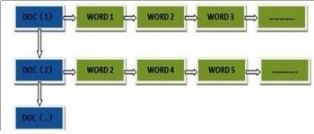
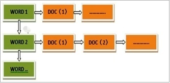
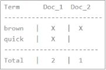
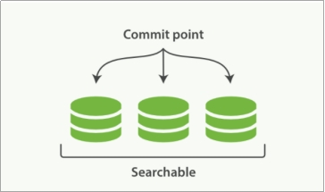
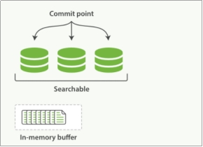
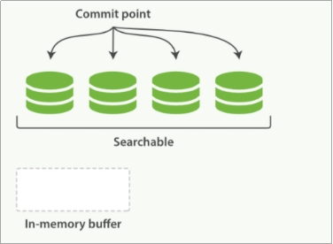
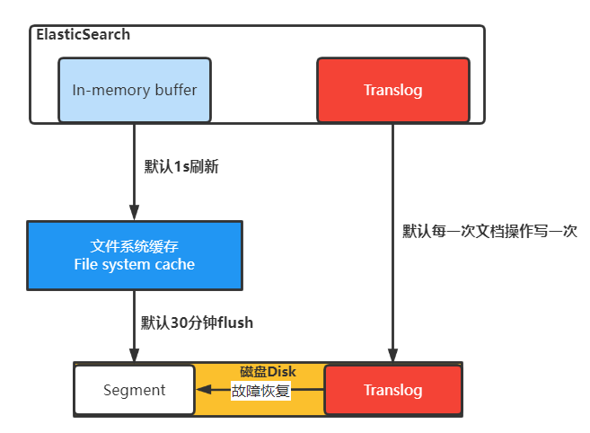
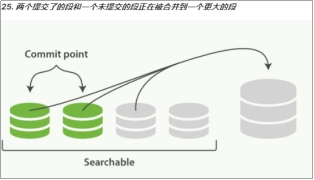
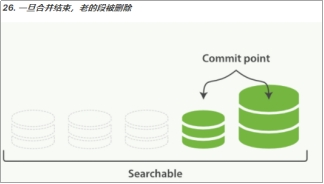

# 第十一章 分片原理

### 11.1 倒排索引

Elasticsearch 使用一种称为**倒排索引**的结构，它适用于快速的全文搜索。

见其名，知其意，有倒排索引，肯定会对应有正向索引。正向索引（forward index），反向索引（inverted index）更熟悉的名字是倒排索引。

所谓的正向索引，就是搜索引擎会将待搜索的文件都对应一个文件ID，搜索时将这个ID和搜索关键字进行对应，形成K-V对，然后对关键字进行统计计数

img

但是互联网上收录在搜索引擎中的文档的数目是个天文数字，这样的索引结构根本无法满足实时返回排名结果的要求。所以，搜索引擎会将正向索引重新构建为倒排索引，即把文件ID对应到关键词的映射转换为关键词到文件ID的映射，每个关键词都对应着一系列的文件，这些文件中都出现这个关键词。

img

一个倒排索引由文档中所有不重复词的列表构成，对于其中每个词，有一个包含它的文档列表。例如，假设我们有两个文档，每个文档的 content 域包含如下内容：

-   The quick brown fox jumped over the lazy dog
-   Quick brown foxes leap over lazy dogs in summer

为了创建倒排索引，我们首先将每个文档的 content 域拆分成单独的 词（我们称它为 **词条** 或 tokens ），创建一个包含所有不重复词条的排序列表（**倒排表**），然后列出每个词条出现在哪个文档。结果如下所示：

现在，如果我们想搜索 quick brown ，我们只需要查找包含每个词条的文档：

img

两个文档都匹配，但是第一个文档比第二个匹配度更高。如果我们使用仅计算匹配词条数量的简单相似性算法，那么我们可以说，对于我们查询的相关性来讲，第一个文档比第二个文档更佳。

### 11.2 文档搜索

早期的全文检索会为整个文档集合建立一个很大的倒排索引并将其写入到磁盘。 一旦新的索引就绪，旧的就会被其替换，这样最近的变化便可以被检索到。

倒排索引被写入磁盘后是 不可改变 的:它永远不会修改。

不变性有重要的价值：

-   不需要锁。如果你从来不更新索引，你就不需要担心多进程同时修改数据的问题。
-   一旦索引被读入内核的文件系统缓存，便会留在哪里，由于其不变性。只要文件系统缓存中还有足够的空间，那么大部分读请求会直接请求内存，而不会命中磁盘。这提供了很大的性能提升。
-   其它缓存(像filter缓存)，在索引的生命周期内始终有效。它们不需要在每次数据改变时被重建，因为数据不会变化。
-   写入单个大的倒排索引允许数据被压缩，减少磁盘 I/O 和 需要被缓存到内存的索引的使用量。

当然，一个不变的索引也有不好的地方。主要事实是它是不可变的! 你不能修改它。如果你需要让一个新的文档可被搜索，你需要重建整个索引。这要么对一个索引所能包含的数据量造成了很大的限制，要么对索引可被更新的频率造成了很大的限制。

### 11.3 动态更新索引

如何在保留不变性的前提下实现倒排索引的更新？

答案是: **用更多的索引。**通过增加新的**补充索引**来反映新近的修改，而不是直接重写整个倒排索引。每一个倒排索引都会被轮流查询到，从最早的开始查询完后再对结果进行合并。

Elasticsearch 基于 Lucene，这个java库引入了***按段搜索***的概念。 每一 段本身都是一个倒排索引。 但索引在 Lucene 中除表示所有段的集合外， 还增加了提交点的概念 — 一个列出了所有已知段的文件。

img

***按段搜索***会以如下流程执行：

1.  新文档被收集到内存索引缓存

img

1.  不时地, 缓存被 提交
2.  一个新的段—一个追加的倒排索引—被写入磁盘。
3.  一个新的包含新段名字的 提交点 被写入磁盘
4.  磁盘进行同步 — 所有在文件系统缓存中等待的写入都刷新到磁盘，以确保它们被写入物理文件
5.  新的段被开启，让它包含的文档可见以被搜索
6.  内存缓存被清空，等待接收新的文档

img

当一个查询被触发，所有已知的段按顺序被查询。词项统计会对所有段的结果进行聚合，以保证每个词和每个文档的关联都被准确计算。 这种方式可以用相对较低的成本将新文档添加到索引。

段是不可改变的，所以既不能把文档从旧的段中移除，也不能修改旧的段来进行反映文档的更新。 取而代之的是，每个提交点会包含一个 .del 文件，文件中会列出这些被删除文档的段信息。

当一个文档被 “删除” 时，它实际上只是在 .del 文件中被标记删除。一个被标记删除的文档仍然可以被查询匹配到，但它会在最终结果被返回前从结果集中移除。

文档更新也是类似的操作方式：当一个文档被更新时，旧版本文档被标记删除，文档的新版本被索引到一个新的段中。 可能两个版本的文档都会被一个查询匹配到，但被删除的那个旧版本文档在结果集返回前就已经被移除。

### 11.4 近实时搜索

image-20211008105503240

-   分段数据先写入到内存缓存中，同时文档操作也会记录translog日志
-   内存的数据对查询不可见，默认间隔1s将内存中数据写入到文件系统缓存中，这里面的数据对查询可见。
-   文件系统缓存数据间隔30分钟再将数据刷入磁盘中。
-   如果文件系统缓存数据在没有刷新到硬盘时宕机了，可以从translog中恢复数据到磁盘，数据恢复完成后translog数据也会清理。

### 11.5 段合并

 由于自动刷新流程每秒会创建一个新的段 ，这样会导致短时间内的段数量暴增。而段数目太多会带来较大的麻烦。 每一个段都会消耗文件句柄、内存和cpu运行周期。更重要的是，每个搜索请求都必须轮流检查每个段；所以段越多，搜索也就越慢。

 Elasticsearch通过在后台进行段合并来解决这个问题。小的段被合并到大的段，然后这些大的段再被合并到更大的段。

 段合并的时候会将那些旧的已删除文档从文件系统中清除。被删除的文档（或被更新文档的旧版本）不会被拷贝到新的大段中。

 启动段合并不需要你做任何事。进行索引和搜索时会自动进行。

1.  当索引的时候，刷新（refresh）操作会创建新的段并将段打开以供搜索使用。
2.  合并进程选择一小部分大小相似的段，并且在后台将它们合并到更大的段中。这并不会中断索引和搜索。

img

1.  一旦合并结束，老的段被删除

-   新的段被刷新（flush）到了磁盘。 写入一个包含新段且排除旧的和较小的段的新提交点。
-   新的段被打开用来搜索。
-   老的段被删除。

img

合并大的段需要消耗大量的I/O和CPU资源，如果任其发展会影响搜索性能。Elasticsearch在默认情况下会对合并流程进行资源限制，所以搜索仍然 有足够的资源很好地执行。

