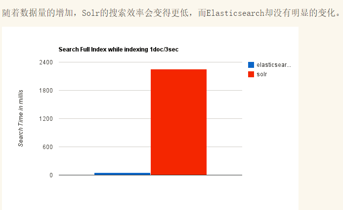

# 第二章  elasticsearch 概述

### 2.1 elasticsearch简介

官网: <https://www.elastic.co/>

Elasticsearch (简称ES)是一个分布式、RESTful 风格的搜索和数据分析引擎。

查询和分析

-   可以自定义搜索方式: 通过 Elasticsearch，您能够执行及合并多种类型的搜索（结构化数据、非结构化数据、地理位置、指标）。
-   分析大规模数据: 找到与查询最匹配的 10 个文档并不困难。但如果面对的是十亿行日志，又该如何解读呢？Elasticsearch 聚合让您能够从大处着眼，探索数据的趋势和规律。

查询速度

-   近实时搜索(数据1s之内可见)
-   通过有限状态转换器实现了用于全文检索的**倒排索引**，实现了用于存储数值数据和地理位置数据的 **BKD 树**，以及用于分析的**列存储**。
-   每个数据都被编入了索引，因此您再也不用因为某些数据没有索引而烦心。您可以用快到令人惊叹的速度使用和访问您的所有数据。

可扩展性

-   无论 Elasticsearch 是在一个节点上运行，还是在一个包含 300 个节点的集群上运行，您都能够以相同的方式与 Elasticsearch 进行通信。
-   它能够水平扩展，每秒钟可处理海量事件，同时能够自动管理索引和查询在集群中的分布方式，以实现极其流畅的操作。

内容相关度

-   基于各项元素（从词频或新近度到热门度等）对搜索结果进行排序。将这些内容与功能进行混搭，以优化向用户显示结果的方式。
-   而且，由于我们的大部分用户都是真实的人，Elasticsearch 具备齐全功能，可以处理包括各种复杂情况（例如拼写错误）在内的人为错误。

弹性设计

-   硬件故障。网络分割。Elasticsearch 为您检测这些故障并确保您的集群（和数据）的安全性和可用性。通过跨集群复制功能，辅助集群可以作为热备份随时投入使用。Elasticsearch 运行在一个分布式的环境中，从设计之初就考虑到了这一点，目的只有一个，让您永远高枕无忧

创始人:Shay Banon（谢巴农）

**搜索引擎典型应用场景:**

### 2.2 全文搜索引擎

Google，百度类的网站搜索，它们都是根据网页中的**关键字**生成索引，我们在搜索的时候输入关键字，它们会将该关键字即索引匹配到的所有网页返回；还有常见的项目中应用日志的搜索等等。对于这些非结构化的数据文本，关系型数据库搜索不是能很好的支持。

一般**传统数据库**，全文检索都实现的很鸡肋，因为一般也没人用数据库存文本字段。进行全文检索需要**扫描整个表**，如果数据量大的话即使对SQL的语法**优化**，也收效甚微。建立了索引，但是维护起来也很麻烦，对于 insert 和 update 操作都会重新构建索引。

这里说到的**全文搜索引擎**指的是目前广泛应用的主流**搜索引擎**。它的工作原理是计算机索引程序通过扫描文章中的每一个词，**对每一个词建立一个索引，指明该词在文章中出现的次数和位置**，当用户查询时，检索程序就根据事先建立的索引进行查找，并将查找的结果反馈给用户的检索方式。这个过程类似于通过字典中的检索字表查字的过程。

### 2.3 lucene介绍

 Lucene是Apache软件基金会Jakarta项目组的一个子项目，提供了一个简单却强大的应用程式接口，能够做全文索引和搜寻。在Java开发环境里Lucene是一个成熟的免费开源工具。就其本身而言，Lucene是当前以及最近几年最受欢迎的免费**Java信息检索程序库**。但**Lucene只是一个提供全文搜索功能类库的核心工具包**，而真正使用它还需要一个完善的服务框架搭建起来进行应用。

 目前市面上流行的搜索引擎软件，主流的就两款：**Elasticsearch和Solr**,这两款都是**基于Lucene搭建**的，可以独立部署启动的搜索引擎服务软件。由于内核相同，所以两者除了服务器安装、部署、管理、集群以外，对于数据的操作 修改、添加、保存、查询等等都十分类似。

### 2.4 倒排索引

**倒排索引步骤:**

-   数据根据词条进行分词，同时记录文档索引位置
-   将词条相同的数据化进行合并
-   对词条进行排序

**搜索过程:**

先将搜索词语进行分词，分词后再倒排索引列表查询文档位置(docId)。根据docId查询文档数据。

### 2.5 elasticsearch、solr对比

**ElasticSearch vs Solr 总结**

-   es基本是开箱即用，非常简单。Solr安装略微复杂。
-   Solr 利用 Zookeeper 进行分布式管理，而 Elasticsearch 自身带有分布式协调管理功能。
-   Solr 支持更多格式的数据，比如JSON、XML、CSV，而 Elasticsearch 仅支持json文件格式。
-   Solr 是传统搜索应用的有力解决方案，但 Elasticsearch 更适用于新兴的实时搜索应用。

现在很多互联网应用都是要求实时搜索的，所以我们选择了elasticsearch。

