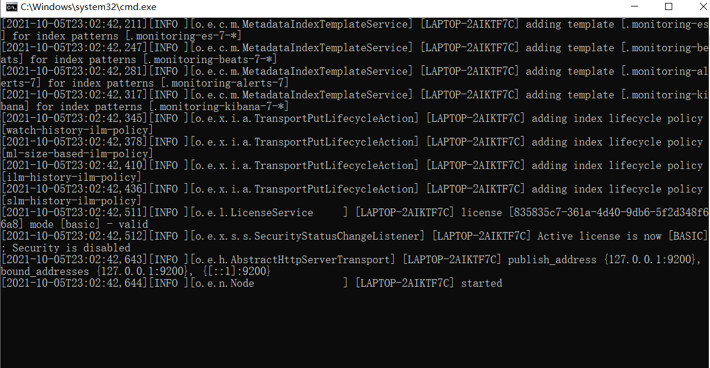
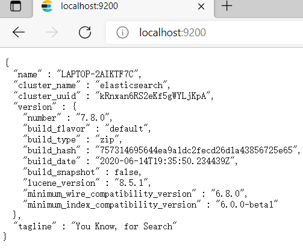
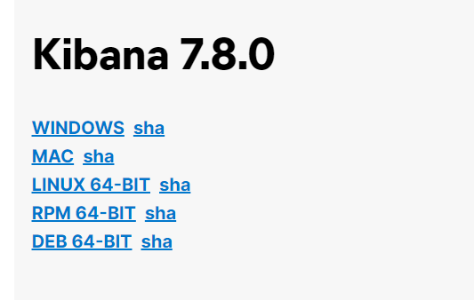

# 第三章 elasticsearch 安装

ElasticSearch分为Linux和Window版本，基于我们主要学习的是ElasticSearch的Java客户端的使用，所以我们课程中使用的是安装较为简便的Window版本，项目上线后，公司的运维人员会安装Linux版的ES供我们连接使用。

### 3.1 下载软件

<https://www.elastic.co/cn/downloads/past-releases#elasticsearch>

**选择7.8版本即可，其它elastic stack也可以在这里下载。**

下载对应操作系统平台的版本:

image-20211005224758855

### 3.2 windows环境安装

解压elasticsearch-7.8.0-windows-x86\_64.zip，目录结构:

image-20211005225915939

| 目录&#xA;      | 说明&#xA;      |
| ------------ | ------------ |
| bin&#xA;     | 可执行脚本目录&#xA; |
| config&#xA;  | 配置目录&#xA;    |
| jdk&#xA;     | 内置jdk目录&#xA; |
| lib&#xA;     | 类库&#xA;      |
| logs&#xA;    | 日志目录&#xA;    |
| modules&#xA; | 模块目录&#xA;    |
| plugins&#xA; | 插件目录&#xA;    |

解压完成后进入bin目录，双击运行elasticsearch.bat

image-20211005230342806

测试访问: http\://localhost:9200/

image-20211005230450382

**注意事项一：**

ElasticSearch是使用java开发的，且本版本的**ES**需要JDK版本要是1.8以上，所以安装ElasticSearch之前保证JDK1.8+安装完毕，并正确的配置好JDK环境变量，否则启动ElasticSearch失败。

**注意事项二**：

出现闪退，通过路径访问发现“空间不足”

**修改config/jvm.options文件**的22行23行，把2改成1，让Elasticsearch启动的时候占用1个G的内存。

-Xmx512m：设置JVM最大可用内存为512M。

-Xms512m：设置JVM初始内存为512m。此值可以设置与-Xmx相同，以避免每次垃圾回收完成后JVM重新分配内存。

### 3.3 kibana安装

elasticsearch服务是一个restful风格的http服务。我们可以采用postman作为客户端来进行操作，elastic stack官方也给我们提供了kibana来进行客户端操作，这个相比postman要友好一点，因为里面有些自动补全的代码提示

下载地址: <https://www.elastic.co/cn/downloads/past-releases/kibana-7-8-0>

image-20211006104306627

**解压文件:**

image-20220626230942906

**进入到config目录，修改kibana.yml文件：**

Kibana默认端口：5601

image-20220626231045909

Kibana连接elasticsearch服务器的地址：elasticsearch.url: \[“[http://localhost:9200](http://localhost:9200/ "http://localhost:9200")”]

image-20220626231107630

修改kibana配置支持中文：i18n.locale: “zh-CN”

image-20220626231125012

**运行访问**

执行kibana-7.8.0-windows-x86\_64.bat

image-20220626231149372

开始访问：[http://127.0.0.1:5601](http://127.0.0.1:5601/ "http://127.0.0.1:5601")

image-20211006105112523

image-20211006105138154

### 3.4 ik分词器安装

#### 3.4.1. IK分词器简介

IKAnalyzer是一个开源的，基于Java语言开发的轻量级的中文分词工具包。从2006年12月推出1.0版开始，IKAnalyzer已经推出 了3个大版本。最初，它是以开源项目Lucene为应用主体的，结合词典分词和文法分析算法的中文分词组件。新版本的IKAnalyzer3.0则发展为面向Java的公用分词组件，独立于Lucene项目，同时提供了对Lucene的默认优化实现。

IK分词器3.0的特性如下：

1）采用了特有的“正向迭代最细粒度切分算法“，具有60万字/秒的高速处理能力。

2）采用了多子处理器分析模式，支持：英文字母（IP地址、Email、URL）、数字（日期，常用中文数量词，罗马数字，科学计数法），中文词汇（姓名、地名处理）等分词处理。

3）对中英联合支持不是很好,在这方面的处理比较麻烦.需再做一次查询，同时是支持个人词条的优化的词典存储，更小的内存占用。

4）支持用户词典扩展定义。

5）针对Lucene全文检索优化的查询分析器IKQueryParser；采用歧义分析算法优化查询关键字的搜索排列组合，能极大的提高Lucene检索的命中率。

#### 3.4.2. IK分词器的安装

**1) 下载：**

GitHub仓库地址：<https://github.com/medcl/elasticsearch-analysis-ik>

下载地址: <https://github.com/medcl/elasticsearch-analysis-ik/releases/download/v7.8.0/elasticsearch-analysis-ik-7.8.0.zip>

image-20220626230550534

**2) 解压安装IK插件**

直接\*\*解压到plugins\*下，注意目录结构，解压后的zip不要放在plugins目录下

image-20220626230730286

**3) 重新启动ElasticSearch**

**4) 测试**

在kibana中测试：

测试分词器:

**l ik\_max\_word：会将文本做最细粒度的拆分**

**ik\_smart：会做最粗粒度的拆分，智能拆分**

POST \_analyze
{
&#x20; "analyzer": "ik\_smart",
&#x20; "text": "我是中国人"
}

