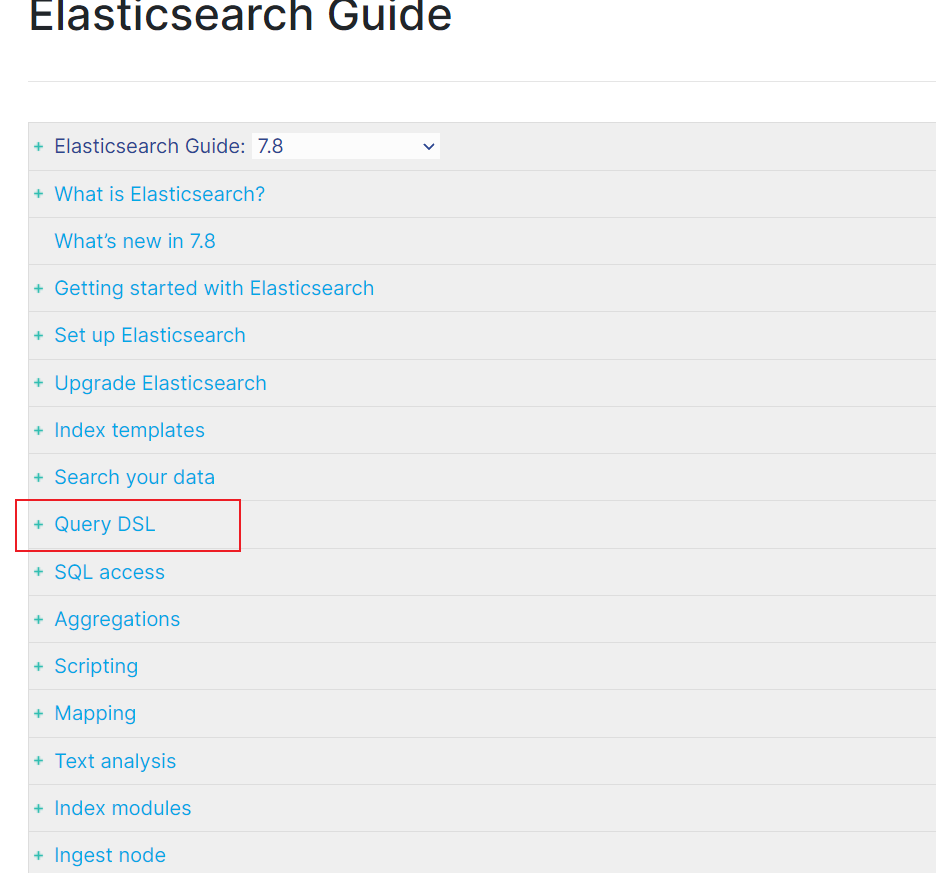
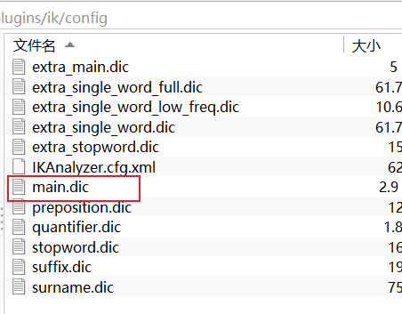
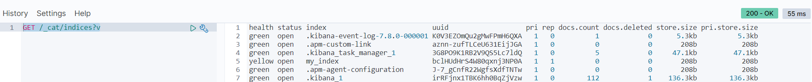

# 第五章 elasticsearch基本操作

参考文档: [https://www.elastic.co/guide/en/elasticsearch/reference/7.8/index.html](https://www.elastic.co/guide/en/elasticsearch/reference/7.8/index.html "https://www.elastic.co/guide/en/elasticsearch/reference/7.8/index.html")

官方提供的分词器有这么几种: Standard、Letter、Lowercase、Whitespace、UAX URL Email、Classic、Thai等，中文分词器可以使用第三方的比如IK分词器。前面我们已经安装过了。

IK分词器核心配置:

-   main.dic：单词词典
-   stopword.dic: 停用词，这里只记录了英文的一部分单词，比如: a、an、and、are、as、at、be、but、by等。

image-20211006120053317

IK分词器:

POST \_analyze
{
&#x20; "analyzer": "ik\_smart",
&#x20; "text": "我是中国人"
}

结果:
{
&#x20; "tokens" : \[
&#x20;   {
&#x20;     "token" : "我",
&#x20;     "start\_offset" : 0,
&#x20;     "end\_offset" : 1,
&#x20;     "type" : "CN\_CHAR",
&#x20;     "position" : 0
&#x20;   },
&#x20;   {
&#x20;     "token" : "是",
&#x20;     "start\_offset" : 1,
&#x20;     "end\_offset" : 2,
&#x20;     "type" : "CN\_CHAR",
&#x20;     "position" : 1
&#x20;   },
&#x20;   {
&#x20;     "token" : "中国人",
&#x20;     "start\_offset" : 2,
&#x20;     "end\_offset" : 5,
&#x20;     "type" : "CN\_WORD",
&#x20;     "position" : 2
&#x20;   }
&#x20; ]
}

POST \_analyze
{
&#x20; "analyzer": "ik\_max\_word",
&#x20; "text": "我是中国人"
}
结果:
{
&#x20; "tokens" : \[
&#x20;   {
&#x20;     "token" : "我",
&#x20;     "start\_offset" : 0,
&#x20;     "end\_offset" : 1,
&#x20;     "type" : "CN\_CHAR",
&#x20;     "position" : 0
&#x20;   },
&#x20;   {
&#x20;     "token" : "是",
&#x20;     "start\_offset" : 1,
&#x20;     "end\_offset" : 2,
&#x20;     "type" : "CN\_CHAR",
&#x20;     "position" : 1
&#x20;   },
&#x20;   {
&#x20;     "token" : "中国人",
&#x20;     "start\_offset" : 2,
&#x20;     "end\_offset" : 5,
&#x20;     "type" : "CN\_WORD",
&#x20;     "position" : 2
&#x20;   },
&#x20;   {
&#x20;     "token" : "中国",
&#x20;     "start\_offset" : 2,
&#x20;     "end\_offset" : 4,
&#x20;     "type" : "CN\_WORD",
&#x20;     "position" : 3
&#x20;   },
&#x20;   {
&#x20;     "token" : "国人",
&#x20;     "start\_offset" : 3,
&#x20;     "end\_offset" : 5,
&#x20;     "type" : "CN\_WORD",
&#x20;     "position" : 4
&#x20;   }
&#x20; ]
}

Standard分词器:

POST \_analyze
{
&#x20; "analyzer": "standard",
&#x20; "text": "我是中国人"
}

结果:
{
&#x20; "tokens" : \[
&#x20;   {
&#x20;     "token" : "我",
&#x20;     "start\_offset" : 0,
&#x20;     "end\_offset" : 1,
&#x20;     "type" : "\<IDEOGRAPHIC>",
&#x20;     "position" : 0
&#x20;   },
&#x20;   {
&#x20;     "token" : "是",
&#x20;     "start\_offset" : 1,
&#x20;     "end\_offset" : 2,
&#x20;     "type" : "\<IDEOGRAPHIC>",
&#x20;     "position" : 1
&#x20;   },
&#x20;   {
&#x20;     "token" : "中",
&#x20;     "start\_offset" : 2,
&#x20;     "end\_offset" : 3,
&#x20;     "type" : "\<IDEOGRAPHIC>",
&#x20;     "position" : 2
&#x20;   },
&#x20;   {
&#x20;     "token" : "国",
&#x20;     "start\_offset" : 3,
&#x20;     "end\_offset" : 4,
&#x20;     "type" : "\<IDEOGRAPHIC>",
&#x20;     "position" : 3
&#x20;   },
&#x20;   {
&#x20;     "token" : "人",
&#x20;     "start\_offset" : 4,
&#x20;     "end\_offset" : 5,
&#x20;     "type" : "\<IDEOGRAPHIC>",
&#x20;     "position" : 4
&#x20;   }
&#x20; ]
}

### 5.2 索引操作

#### 5.2.1 创建索引

语法: PUT /{索引名称}

PUT /my\_index

结果:
{
&#x20; "acknowledged" : true,
&#x20; "shards\_acknowledged" : true,
&#x20; "index" : "my\_index"
}

#### 5.2.2 查看所有索引

语法: GET /\_cat/indices?v

image-20211006140221725

#### 5.2.3 查看单个索引

语法: GET /{索引名称}

GET /my\_index
结果:
{
&#x20; "my\_index" : {
&#x20;   "aliases" : { },
&#x20;   "mappings" : { },
&#x20;   "settings" : {
&#x20;     "index" : {
&#x20;       "creation\_date" : "1633499968211",
&#x20;       "number\_of\_shards" : "1",
&#x20;       "number\_of\_replicas" : "1",
&#x20;       "uuid" : "bclHUdHrS4W80qxnj3NP0A",
&#x20;       "version" : {
&#x20;         "created" : "7080099"
&#x20;       },
&#x20;       "provided\_name" : "my\_index"
&#x20;     }
&#x20;   }
&#x20; }
}

#### 5.2.4 删除索引

语法: DELETE /{索引名称}

DELETE /my\_index
结果:
{
&#x20; "acknowledged" : true
}

### 5.3 文档操作

#### 5.3.1 创建文档

语法:

PUT /{索引名称}/{类型}/{id}

{

jsonbody

}

PUT /my\_index/\_ doc/1
{
"title": "小米手机",
"category": "小米",
"images": "<http://www.gulixueyuan.com/xm.jpg>",
&#x20; "price": 3999
}

返回结果:
{
"*index" : "my\_index",
"*type" : "* doc",
"*id" : "1",
"* version" : 1,
"result" : "created",
"*shards" : {
"total" : 2,
"successful" : 1,
"failed" : 0
},
"* seq\_no" : 0,
"* primary\_term" : 1
}

#### 5.3.2 查看文档

语法:GET /{索引名称}/{类型}/{id}

GET /my\_index/\_ doc/1
结果:
{
"\_index" : "my\_index",
"*type" : "* doc",
"*id" : "1",
"* version" : 1,
"\_seq\_no" : 0,
"\_primary\_term" : 1,
"found" : true,
"\_source" : {
"title" : "小米手机",
"category" : "小米",
"images" : "<http://www.gulixueyuan.com/xm.jpg>",
&#x20;   "price" : 3999
&#x20; }
}

#### 5.3.3 修改文档

语法:

PUT /{索引名称}/{类型}/{id}

{

jsonbody

}

PUT /my\_index/\_ doc/1
{
"title": "小米手机",
"category": "小米",
"images": "<http://www.gulixueyuan.com/xm.jpg>",
&#x20; "price": 4500
}

#### 5.3.4 修改局部属性

语法:

POST /{索引名称}/\_update/{docId} { “doc”: { “属性”: “值” } }

**注意：这种更新只能使用post方式。**

POST /my\_index/\_ update/1
{
"doc": {
"price": 4500
}
}

#### 5.3.5 删除文档

语法: DELETE /{索引名称}/{类型}/{id}

DELETE /my\_index/\_ doc/1
结果:
{
"*index" : "my\_index",
"*type" : "* doc",
"*id" : "1",
"* version" : 12,
"result" : "deleted",
"*shards" : {
"total" : 2,
"successful" : 1,
"failed" : 0
},
"* seq\_no" : 11,
"* primary\_term" : 1
}

#### 5.3.6 批量操作

{“actionName”:{“*index”:“indexName”, “* type”:“typeName”,“\_id”:“id”}}

{“field1”:“value1”, “field2”:“value2”}

actionName可以有CREATE、DELETE等。

#### 批量创建

POST *bulk
{"create":{"* index":"my\_index","\_ id":2}}
{"id":2,"title":"华为手机","category":"华为","images":"<http://www.gulixueyuan.com/xm.jpg","price":5500>}
{"create":{"\_index":"my\_index","\_id":3}}
{"id":3,"title":"VIVO手机","category":"vivo","images":"<http://www.gulixueyuan.com/xm.jpg","price":3600>}

结果:
{
"took" : 2,
"errors" : false,
"items" : \[
{
"create" : {
"*index" : "my\_index",
"*type" : "* doc",
"*id" : "2",
"* version" : 5,
"result" : "created",
"*shards" : {
"total" : 2,
"successful" : 1,
"failed" : 0
},
"* seq\_no" : 20,
"* primary\_term" : 1,
"status" : 201
}
},
{
"create" : {
"\_ index" : "my\_index",
"\_ type" : "*doc",
"* id" : "3",
"*version" : 5,
"result" : "created",
"* shards" : {
"total" : 2,
"successful" : 1,
"failed" : 0
},
"\_seq\_no" : 21,
"\_primary\_term" : 1,
"status" : 201
}
}
]
}

#### 批量删除

POST *bulk
{"delete":{"* index":"my\_index","\_ id":2}}
{"delete":{"\_index":"my\_index","\_id":3}}

结果:
{
"took" : 3,
"errors" : false,
"items" : \[
{
"delete" : {
"*index" : "my\_index",
"*type" : "* doc",
"*id" : "2",
"* version" : 6,
"result" : "deleted",
"*shards" : {
"total" : 2,
"successful" : 1,
"failed" : 0
},
"* seq\_no" : 22,
"* primary\_term" : 1,
"status" : 200
}
},
{
"delete" : {
"\_ index" : "my\_index",
"\_ type" : "*doc",
"* id" : "3",
"*version" : 6,
"result" : "deleted",
"* shards" : {
"total" : 2,
"successful" : 1,
"failed" : 0
},
"\_seq\_no" : 23,
"\_primary\_term" : 1,
"status" : 200
}
}
]
}

### 5.4 映射mapping

有了索引库，等于有了数据库中的database。

接下来就需要建索引库(index)中的映射了，类似于数据库(database)中的表结构(table)。创建数据库表需要设置字段名称，类型，长度，约束等；索引库也一样，需要知道这个类型下有哪些字段，每个字段有哪些约束信息，这就叫做**映射(mapping)**。

#### 5.4.1 查看映射

语法: GET /{索引名称}/\_mapping

GET /my\_index/\_ mapping
结果:
{
"my\_index" : {
"mappings" : {
"properties" : {
"category" : {
"type" : "text",
"fields" : {
"keyword" : {
"type" : "keyword",
"ignore\_above" : 256
}
}
},
"id" : {
"type" : "long"
},
"images" : {
"type" : "text",
"fields" : {
"keyword" : {
"type" : "keyword",
"ignore\_above" : 256
}
}
},
"price" : {
"type" : "long"
},
"title" : {
"type" : "text",
"fields" : {
"keyword" : {
"type" : "keyword",
"ignore\_above" : 256
}
}
}
}
}
}
}

#### 5.4.2 动态映射

在关系数据库中，需要事先创建数据库，然后在该数据库下创建数据表，并创建 表字段、类型、长度、主键等，最后才能基于表插入数据。而Elasticsearch中不 需要定义Mapping映射（即关系型数据库的表、字段等），在文档写入 Elasticsearch时，会根据文档字段**自动识别类型**，这种机制称之为**动态映射**。

映射规则对应:

| 数据&#xA;          | 对应的类型&#xA;   |
| ---------------- | ------------ |
| null&#xA;        | 字段不添加&#xA;   |
| true\|flase&#xA; | boolean&#xA; |
| 字符串&#xA;         | text&#xA;    |
| 数值&#xA;          | long&#xA;    |
| 小数&#xA;          | float&#xA;   |
| 日期&#xA;          | date&#xA;    |

#### 5.4.3 静态映射

静态映射是在Elasticsearch中也可以事先定义好映射，即手动映射，包含文档的各字段类型、分词器等，这称为**静态映射**。

\#删除原创建的索引
DELETE /my\_index

\#创建索引，并同时指定映射关系和分词器等。
PUT /my\_index
{
&#x20; "mappings": {
&#x20;   "properties": {
&#x20;     "title": {
&#x20;       "type": "text",
&#x20;       "index": true,
&#x20;       "store": true,
&#x20;       "analyzer": "ik\_max\_word",
&#x20;       "search\_analyzer": "ik\_smart"
&#x20;     },
&#x20;     "category": {
&#x20;       "type": "keyword",
&#x20;       "index": true,
&#x20;       "store": true
&#x20;     },
&#x20;     "images": {
&#x20;       "type": "keyword",
&#x20;       "index": true,
&#x20;       "store": true
&#x20;     },
&#x20;     "price": {
&#x20;       "type": "integer",
&#x20;       "index": true,
&#x20;       "store": true
&#x20;     }
&#x20;   }
&#x20; }
}

结果:
{
&#x20; "acknowledged" : true,
&#x20; "shards\_acknowledged" : true,
&#x20; "index" : "my\_index"
}

**type分类如下:**

-   字符串：text(支持分词)和 keyword(不支持分词)。
-   text：该类型被用来索引长文本，在创建索引前会将这些文本进行分词，转化为词的组合，建立索引；允许es来检索这些词，text类型不能用来排序和聚合。
-   keyword：该类型不能分词，可以被用来检索过滤、排序和聚合，keyword类型不可用text进行分词模糊检索。
-   数值型：long、integer、short、byte、double、float
-   日期型：date
-   布尔型：boolean

