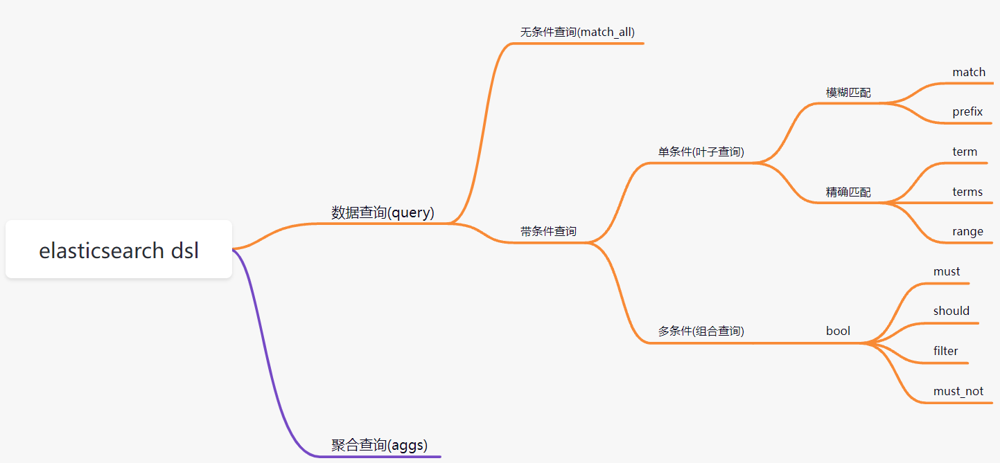

# 第六章 DSL高级查询

### 6.1 DSL概述

Query DSL概述: Domain Specific Language(领域专用语言)，Elasticsearch提供了基于JSON的DSL来定义查询。

**DSL概览:**

image-20211006153847981

准备数据:

POST *bulk
{"create":{"* index":"my\_index","\_ id":1}}
{"id":1,"title":"华为笔记本电脑","category":"华为","images":"<http://www.gulixueyuan.com/xm.jpg","price":5388>}
{"create":{"\_index":"my\_index","\_id":2}}
{"id":2,"title":"华为手机","category":"华为","images":"<http://www.gulixueyuan.com/xm.jpg","price":5500>}
{"create":{"\_index":"my\_index","\_id":3}}
{"id":3,"title":"VIVO手机","category":"vivo","images":"<http://www.gulixueyuan.com/xm.jpg","price":3600>}

### 6.2 DSL查询

#### 6.2.1 查询所有文档

match\_all:

POST /my\_index/\_ search
{
"query": {
"match\_all": {}
}
}

结果:
{
"took" : 0,
"timed\_out" : false,
"\_ shards" : {
"total" : 1,
"successful" : 1,
"skipped" : 0,
"failed" : 0
},
"hits" : {
"total" : {
"value" : 3,
"relation" : "eq"
},
"max\_score" : 1.0,
"hits" : \[
{
"\_ index" : "my\_index",
"\_ type" : "*doc",
"* id" : "1",
"*score" : 1.0,
"* source" : {
"id" : 1,
"title" : "华为笔记本电脑",
"category" : "华为",
"images" : "<http://www.gulixueyuan.com/xm.jpg>",<http://www.gulixueyuan.com/xm.jpg>",<http://www.gulixueyuan.com/xm.jpg>",
&#x20;         "price" : 3600
&#x20;       }
&#x20;     }
&#x20;   ]
&#x20; }
}

#### 6.2.2 匹配查询(match)

match:

POST /my\_index/\_ search
{
"query": {
"match": {
"title": "华为智能手机"
}
}
}

结果:
{
"took" : 3,
"timed\_out" : false,
"\_ shards" : {
"total" : 1,
"successful" : 1,
"skipped" : 0,
"failed" : 0
},
"hits" : {
"total" : {
"value" : 2,
"relation" : "eq"
},
"max\_score" : 0.5619608,
"hits" : \[
{
"\_ index" : "my\_index",
"\_ type" : "*doc",
"* id" : "2",
"*score" : 0.5619608,
"* source" : {
"id" : 2,
"title" : "华为手机",
"category" : "华为",
"images" : "<http://www.gulixueyuan.com/xm.jpg>",<http://www.gulixueyuan.com/xm.jpg>",
&#x20;         "price" : 5388
&#x20;       }
&#x20;     }
&#x20;   ]
&#x20; }
}

#### 补充条件删除

POST /my\_index/\_ delete\_by\_query
{
"query": {
"match": {
"title": "vivo"
}
}
}
结果:
{
"took" : 51,
"timed\_out" : false,
"total" : 1,
"deleted" : 1,
"batches" : 1,
"version\_conflicts" : 0,
"noops" : 0,
"retries" : {
"bulk" : 0,
"search" : 0
},
"throttled\_millis" : 0,
"requests\_per\_second" : -1.0,
"throttled\_until\_millis" : 0,
"failures" : \[ ]
}

#### 6.2.3 多字段匹配

POST /my\_index/\_ search
{
"query": {
"multi\_match": {
"query": "华为智能手机",
"fields": \["title","category"]
}
}
}

结果:
{
"took" : 3,
"timed\_out" : false,
"\_ shards" : {
"total" : 1,
"successful" : 1,
"skipped" : 0,
"failed" : 0
},
"hits" : {
"total" : {
"value" : 2,
"relation" : "eq"
},
"max\_score" : 0.5619608,
"hits" : \[
{
"\_ index" : "my\_index",
"\_ type" : "*doc",
"* id" : "2",
"*score" : 0.5619608,
"* source" : {
"id" : 2,
"title" : "华为手机",
"category" : "华为",
"images" : "<http://www.gulixueyuan.com/xm.jpg>",<http://www.gulixueyuan.com/xm.jpg>",
&#x20;         "price" : 5388
&#x20;       }
&#x20;     }
&#x20;   ]
&#x20; }
}

#### 6.2.4 前缀匹配

POST /my\_index/\_ search
{
"query": {
"prefix": {
"title": {
"value": "vivo"
}
}
}
}
结果:
{
"took" : 0,
"timed\_out" : false,
"\_ shards" : {
"total" : 1,
"successful" : 1,
"skipped" : 0,
"failed" : 0
},
"hits" : {
"total" : {
"value" : 1,
"relation" : "eq"
},
"max\_score" : 1.0,
"hits" : \[
{
"\_ index" : "my\_index",
"\_ type" : "*doc",
"* id" : "3",
"*score" : 1.0,
"* source" : {
"id" : 3,
"title" : "VIVO手机",
"category" : "vivo",
"images" : "<http://www.gulixueyuan.com/xm.jpg>",
&#x20;         "price" : 3600
&#x20;       }
&#x20;     }
&#x20;   ]
&#x20; }
}

#### 6.2.5 关键字精确查询

**term:关键字不会进行分词。**

POST /my\_index/\_ search
{
"query": {
"term": {
"title": {
"value": "华为手机"
}
}
}
}

结果:
{
"took" : 0,
"timed\_out" : false,
"\_ shards" : {
"total" : 1,
"successful" : 1,
"skipped" : 0,
"failed" : 0
},
"hits" : {
"total" : {
"value" : 0,
"relation" : "eq"
},
"max\_score" : null,
"hits" : \[ ]
}
}

#### 6.2.6 多关键字精确查询

POST /my\_index/\_ search
{
"query": {
"terms": {
"title": \[
"华为手机",
"华为"
]
}
}
}

结果:
{
"took" : 0,
"timed\_out" : false,
"\_ shards" : {
"total" : 1,
"successful" : 1,
"skipped" : 0,
"failed" : 0
},
"hits" : {
"total" : {
"value" : 2,
"relation" : "eq"
},
"max\_score" : 1.0,
"hits" : \[
{
"\_ index" : "my\_index",
"\_ type" : "*doc",
"* id" : "1",
"*score" : 1.0,
"* source" : {
"id" : 1,
"title" : "华为笔记本电脑",
"category" : "华为",
"images" : "<http://www.gulixueyuan.com/xm.jpg>",<http://www.gulixueyuan.com/xm.jpg>",
&#x20;         "price" : 5500
&#x20;       }
&#x20;     }
&#x20;   ]
&#x20; }
}

#### 6.2.7 范围查询

范围查询使用range。

-   gte: 大于等于
-   lte: 小于等于
-   gt: 大于
-   lt: 小于

POST /my\_index/\_ search
{
"query": {
"range": {
"price": {
"gte": 3000,
"lte": 5000
}
}
}
}
结果:
{
"took" : 1,
"timed\_out" : false,
"\_ shards" : {
"total" : 1,
"successful" : 1,
"skipped" : 0,
"failed" : 0
},
"hits" : {
"total" : {
"value" : 1,
"relation" : "eq"
},
"max\_score" : 1.0,
"hits" : \[
{
"\_ index" : "my\_index",
"\_ type" : "*doc",
"* id" : "3",
"*score" : 1.0,
"* source" : {
"id" : 3,
"title" : "VIVO手机",
"category" : "vivo",
"images" : "<http://www.gulixueyuan.com/xm.jpg>",
&#x20;         "price" : 3600
&#x20;       }
&#x20;     }
&#x20;   ]
&#x20; }
}

#### 6.2.8 指定返回字段

**query同级增加\_source进行过滤。**

POST /my\_index/\_ search
{
"query": {
"terms": {
"title": \[
"华为手机",
"华为"
]
}
},
"\_source": \["title","category"]
}
结果：
{
"took" : 1,
"timed\_out" : false,
"\_shards" : {
"total" : 1,
"successful" : 1,
"skipped" : 0,
"failed" : 0
},
"hits" : {
"total" : {
"value" : 2,
"relation" : "eq"
},
"max\_score" : 1.0,
"hits" : \[
{
"*index" : "my\_index",
"*type" : "* doc",
"*id" : "1",
"* score" : 1.0,
"*source" : {
"title" : "华为笔记本电脑",
"category" : "华为"
}
},
{
"* index" : "my\_index",
"* type" : "*doc",
"* id" : "2",
"*score" : 1.0,
"* source" : {
"title" : "华为手机",
"category" : "华为"
}
}
]
}
}

#### 6.2.9 组合查询

bool 各条件之间有and,or或not的关系

-   must: 各个条件都必须满足，所有条件是and的关系
-   should: 各个条件有一个满足即可，即各条件是or的关系
-   must\_not: 不满足所有条件，即各条件是not的关系
-   filter: 与must效果等同，但是它不计算得分，效率更高点。

#### must

POST /my\_index/\_ search
{
"query": {
"bool": {
"must": \[
{
"match": {
"title": "华为"
}
},
{
"range": {
"price": {
"gte": 3000,
"lte": 5000
}
}
}
]
}
}
}
结果:
{
"took" : 0,
"timed\_out" : false,
"\_ shards" : {
"total" : 1,
"successful" : 1,
"skipped" : 0,
"failed" : 0
},
"hits" : {
"total" : {
"value" : 0,
"relation" : "eq"
},
"max\_score" : null,
"hits" : \[ ]
}
}

#### should

POST /my\_index/\_ search
{
"query": {
"bool": {
"should": \[
{
"match": {
"title": "华为"
}
},
{
"range": {
"price": {
"gte": 3000,
"lte": 5000
}
}
}
]
}
}
}

结果:
{
"took" : 0,
"timed\_out" : false,
"\_ shards" : {
"total" : 1,
"successful" : 1,
"skipped" : 0,
"failed" : 0
},
"hits" : {
"total" : {
"value" : 3,
"relation" : "eq"
},
"max\_score" : 1.0,
"hits" : \[
{
"\_ index" : "my\_index",
"\_ type" : "*doc",
"* id" : "3",
"*score" : 1.0,
"* source" : {
"id" : 3,
"title" : "VIVO手机",
"category" : "vivo",
"images" : "<http://www.gulixueyuan.com/xm.jpg>",<http://www.gulixueyuan.com/xm.jpg>",<http://www.gulixueyuan.com/xm.jpg>",
&#x20;         "price" : 5388
&#x20;       }
&#x20;     }
&#x20;   ]
&#x20; }
}

如果should和must同时存在，他们之间是and关系：

POST /my\_index/\_ search
{
"query": {
"bool": {
"should": \[
{
"match": {
"title": "华为"
}
},
{
"range": {
"price": {
"gte": 3000,
"lte": 5000
}
}
}
],
"must": \[
{
"match": {
"title": "华为"
}
},
{
"range": {
"price": {
"gte": 3000,
"lte": 5000
}
}
}
]
}
}
}

结果:
{
"took" : 1,
"timed\_out" : false,
"\_ shards" : {
"total" : 1,
"successful" : 1,
"skipped" : 0,
"failed" : 0
},
"hits" : {
"total" : {
"value" : 0,
"relation" : "eq"
},
"max\_score" : null,
"hits" : \[ ]
}
}

#### must\_not

POST /my\_index/\_ search
{
"query": {
"bool": {
"must\_not": \[
{
"match": {
"title": "华为"
}
},
{
"range": {
"price": {
"gte": 4900,
"lte": 5000
}
}
}
]
}
}
}
结果:
{
"took" : 0,
"timed\_out" : false,
"\_shards" : {
"total" : 1,
"successful" : 1,
"skipped" : 0,
"failed" : 0
},
"hits" : {
"total" : {
"value" : 1,
"relation" : "eq"
},
"max\_score" : 0.0,
"hits" : \[
{
"\_index" : "my\_index",
"*type" : "* doc",
"*id" : "3",
"* score" : 0.0,
"\_source" : {
"id" : 3,
"title" : "VIVO手机",
"category" : "vivo",
"images" : "<http://www.gulixueyuan.com/xm.jpg>",
&#x20;         "price" : 3600
&#x20;       }
&#x20;     }
&#x20;   ]
&#x20; }
}

#### filter

**\_score的分值为0**​

POST /my\_index/\_ search
{
"query": {
"bool": {
"filter": \[
{
"match": {
"title": "华为"
}
}
]
}
}
}

结果:
{
"took" : 1,
"timed\_out" : false,
"\_ shards" : {
"total" : 1,
"successful" : 1,
"skipped" : 0,
"failed" : 0
},
"hits" : {
"total" : {
"value" : 2,
"relation" : "eq"
},
"max\_score" : 0.0,
"hits" : \[
{
"\_ index" : "my\_index",
"\_ type" : "*doc",
"* id" : "1",
"*score" : 0.0,
"* source" : {
"id" : 1,
"title" : "华为笔记本电脑",
"category" : "华为",
"images" : "<http://www.gulixueyuan.com/xm.jpg>",<http://www.gulixueyuan.com/xm.jpg>",
&#x20;         "price" : 5500
&#x20;       }
&#x20;     }
&#x20;   ]
&#x20; }
}

#### 6.2.10 聚合查询

聚合允许使用者对es文档进行统计分析，类似与关系型数据库中的group by，当然还有很多其他的聚合，例如取最大值、平均值等等。

#### max

POST /my\_index/\_ search
{
"query": {
"match\_all": {}
},
"size": 0,
"aggs": {
"max\_price": {
"max": {
"field": "price"
}
}
}
}

结果:
{
"took" : 1,
"timed\_out" : false,
"\_ shards" : {
"total" : 1,
"successful" : 1,
"skipped" : 0,
"failed" : 0
},
"hits" : {
"total" : {
"value" : 3,
"relation" : "eq"
},
"max\_score" : null,
"hits" : \[ ]
},
"aggregations" : {
"max\_price" : {
"value" : 5500.0
}
}
}

#### min

POST /my\_index/\_ search
{
"query": {
"match\_all": {}
},
"size": 0,
"aggs": {
"min\_price": {
"min": {
"field": "price"
}
}
}
}

结果:
{
"took" : 12,
"timed\_out" : false,
"\_ shards" : {
"total" : 1,
"successful" : 1,
"skipped" : 0,
"failed" : 0
},
"hits" : {
"total" : {
"value" : 3,
"relation" : "eq"
},
"max\_score" : null,
"hits" : \[ ]
},
"aggregations" : {
"max\_price" : {
"value" : 3600.0
}
}
}

#### avg

POST /my\_index/\_ search
{
"query": {
"match\_all": {}
},
"size": 0,
"aggs": {
"avg\_price": {
"avg": {
"field": "price"
}
}
}
}
结果:
{
"took" : 12,
"timed\_out" : false,
"\_ shards" : {
"total" : 1,
"successful" : 1,
"skipped" : 0,
"failed" : 0
},
"hits" : {
"total" : {
"value" : 3,
"relation" : "eq"
},
"max\_score" : null,
"hits" : \[ ]
},
"aggregations" : {
"avg\_price" : {
"value" : 4829.333333333333
}
}
}

#### sum

POST /my\_index/\_ search
{
"query": {
"match\_all": {}
},
"size": 0,
"aggs": {
"sum\_price": {
"sum": {
"field": "price"
}
}
}
}
结果:
{
"took" : 3,
"timed\_out" : false,
"\_ shards" : {
"total" : 1,
"successful" : 1,
"skipped" : 0,
"failed" : 0
},
"hits" : {
"total" : {
"value" : 3,
"relation" : "eq"
},
"max\_score" : null,
"hits" : \[ ]
},
"aggregations" : {
"sum\_price" : {
"value" : 14488.0
}
}
}

#### stats

POST /my\_index/\_ search
{
"query": {
"match\_all": {}
},
"size": 0,
"aggs": {
"stats\_price": {
"stats": {
"field": "price"
}
}
}
}
结果:
{
"took" : 20,
"timed\_out" : false,
"\_ shards" : {
"total" : 1,
"successful" : 1,
"skipped" : 0,
"failed" : 0
},
"hits" : {
"total" : {
"value" : 3,
"relation" : "eq"
},
"max\_score" : null,
"hits" : \[ ]
},
"aggregations" : {
"stats\_price" : {
"count" : 3,
"min" : 3600.0,
"max" : 5500.0,
"avg" : 4829.333333333333,
"sum" : 14488.0
}
}
}

#### terms

桶聚合相当于sql中的group by语句

POST /my\_index/\_ search
{
"query": {
"match\_all": {}
},
"size": 0,
"aggs": {
"groupby\_category": {
"terms": {
"field": "category",
"size": 10
}
}
}
}
结果:
{
"took" : 16,
"timed\_out" : false,
"\_ shards" : {
"total" : 1,
"successful" : 1,
"skipped" : 0,
"failed" : 0
},
"hits" : {
"total" : {
"value" : 3,
"relation" : "eq"
},
"max\_score" : null,
"hits" : \[ ]
},
"aggregations" : {
"groupby\_category" : {
"doc\_count\_error\_upper\_bound" : 0,
"sum\_other\_doc\_count" : 0,
"buckets" : \[
{
"key" : "华为",
"doc\_count" : 2
},
{
"key" : "vivo",
"doc\_count" : 1
}
]
}
}
}

还可以对桶继续下钻：

POST /my\_index/\_ search
{
"query": {
"match\_all": {}
},
"size": 0,
"aggs": {
"groupby\_category": {
"terms": {
"field": "category",
"size": 10
},
"aggs": {
"avg\_price": {
"avg": {
"field": "price"
}
}
}
}
}
}
结果:
{
"took" : 2,
"timed\_out" : false,
"\_shards" : {
"total" : 1,
"successful" : 1,
"skipped" : 0,
"failed" : 0
},
"hits" : {
"total" : {
"value" : 3,
"relation" : "eq"
},
"max\_score" : null,
"hits" : \[ ]
},
"aggregations" : {
"groupby\_category" : {
"doc\_count\_error\_upper\_bound" : 0,
"sum\_other\_doc\_count" : 0,
"buckets" : \[
{
"key" : "华为",
"doc\_count" : 2,
"avg\_price" : {
"value" : 5444.0
}
},
{
"key" : "vivo",
"doc\_count" : 1,
"avg\_price" : {
"value" : 3600.0
}
}
]
}
}
}

