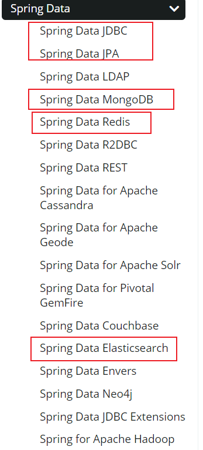
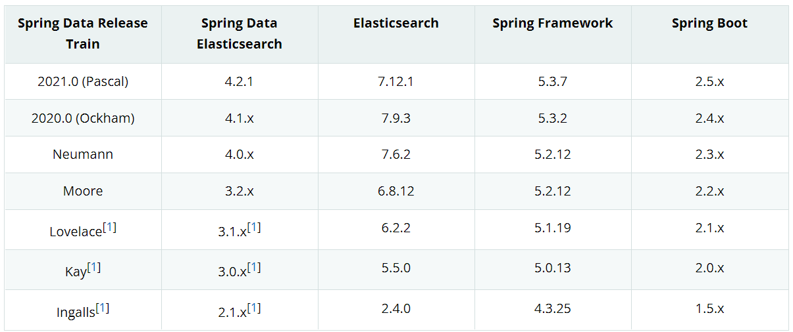
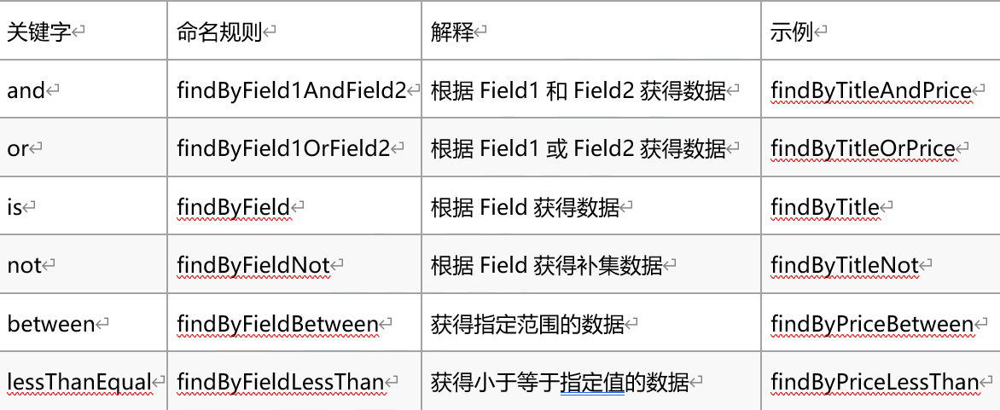

# 第九章  spring data elasticsearch

### 9.1 spring data 框架介绍

Spring Data是一个用于简化数据库、非关系型数据库、索引库访问，并支持云服务的开源框架。其主要目标是使得对数据的访问变得方便快捷，并支持map-reduce框架和云计算数据服务。 Spring Data可以极大的简化JPA（Elasticsearch…）的写法，可以在几乎不用写实现的情况下，实现对数据的访问和操作。除了CRUD外，还包括如分页、排序等一些常用的功能。

Spring Data的官网：<https://spring.io/projects/spring-data>

常用模块:

image-20211007164907793

### 9.2 spring data elasticsearch

Spring Data Elasticsearch 基于 spring data API 简化 Elasticsearch操作，将原始操作Elasticsearch的客户端API 进行封装 。Spring Data为Elasticsearch项目提供集成搜索引擎。Spring Data Elasticsearch POJO的关键功能区域为中心的模型与Elastichsearch交互文档和轻松地编写一个存储索引库数据访问层。

### 9.3 spring data elasticsearch版本

image-20211007165216044

**springboot2.3.x版本可以兼容elasticsearch7.x版本。**

### 9.4 框架集成

#### 9.4.1 依赖

创建项目 elasticsearch\_springdata\_es

编写pom.xml

\<parent>
&#x20;   \<groupId>org.springframework.boot\</groupId>
&#x20;   \<artifactId>spring-boot-starter-parent\</artifactId>
&#x20;   \<version>2.3.6.RELEASE\</version>
&#x20;   \<relativePath/>
\</parent>
\<dependencies>
&#x20;   \<dependency>
&#x20;       \<groupId>org.springframework.boot\</groupId>
&#x20;       \<artifactId>spring-boot-starter-web\</artifactId>
&#x20;   \</dependency>
&#x20;   \<dependency>
&#x20;       \<groupId>org.projectlombok\</groupId>
&#x20;       \<artifactId>lombok\</artifactId>
&#x20;       \<optional>true\</optional>
&#x20;   \</dependency>
&#x20;   \<dependency>
&#x20;       \<groupId>org.springframework.boot\</groupId>
&#x20;       \<artifactId>spring-boot-starter-test\</artifactId>
&#x20;       \<scope>test\</scope>
&#x20;   \</dependency>
&#x20;   \<dependency>
&#x20;       \<groupId>org.springframework.boot\</groupId>
&#x20;       \<artifactId>spring-boot-starter-data-elasticsearch\</artifactId>
&#x20;   \</dependency>
\</dependencies>
\<build>
&#x20;   \<plugins>
&#x20;       \<!-- java编译插件 -->
&#x20;       \<plugin>
&#x20;           \<groupId>org.apache.maven.plugins\</groupId>
&#x20;           \<artifactId>maven-compiler-plugin\</artifactId>
&#x20;           \<version>3.2\</version>
&#x20;           \<configuration>
&#x20;              \<source>1.8\</source>
&#x20;              \<target>1.8\</target>
&#x20;              \<encoding>UTF-8\</encoding>
&#x20;           \</configuration>
&#x20;       \</plugin>
&#x20;   \</plugins>
\</build>

#### 9.4.2 yml配置

application.properties

\# es服务地址
elasticsearch.host=127.0.0.1
\# es服务端口
elasticsearch.port=9200
\# 配置日志级别,开启debug日志
logging.level.com.atguigu=debug

#### 9.4.3 document映射

@Data
@Document(indexName = "product",shards = 1, replicas = 1)
public class Product implements Serializable {
&#x20;   @Id
&#x20;   private Long id;
&#x20;   @Field(type = FieldType.Text, analyzer = "ik\_max\_word")
&#x20;   private String productName;
&#x20;   @Field(type = FieldType.Integer)
&#x20;   private Integer store;
&#x20;   @Field(type = FieldType.Double, index = true, store = false)
&#x20;   private double price;
}

映射

Spring Data通过注解来声明字段的映射属性，有下面的三个注解：

@Document 作用在类，标记实体类为文档对象，一般有四个属性

indexName：对应索引库名称 shards：分片数量 replicas：副本数量

@Id 作用在成员变量，标记一个字段作为id主键

@Field 作用在成员变量，标记为文档的字段，并指定字段映射属性：

type：字段类型，取值是枚举：FieldType index：是否索引，布尔类型，默认是true store：是否存储，布尔类型，默认是false analyzer：分词器名称：ik\_max\_word

#### 9.4.4 配置类

<https://docs.spring.io/spring-data/elasticsearch/docs/3.2.3.RELEASE/reference/html/#elasticsearch.mapping.meta-model>

<https://docs.spring.io/spring-data/elasticsearch/docs/3.2.3.RELEASE/reference/html/#elasticsearch.operations.resttemplate>

· ElasticsearchRestTemplate是spring-data-elasticsearch项目中的一个类，和其他spring项目中的template类似。

· 在新版的spring-data-elasticsearch中，**ElasticsearhRestTemplate**代替了原来的**ElasticsearchTemplate**。

· 原因是ElasticsearchTemplate基于TransportClient，TransportClient即将在8.x以后的版本中移除。所以，我们推荐使用ElasticsearchRestTemplate。

· ElasticsearchRestTemplate基于RestHighLevelClient客户端的。需要自定义配置类，继承AbstractElasticsearchConfiguration，并实现elasticsearchClient()抽象方法，创建RestHighLevelClient对象。

@ConfigurationProperties(prefix = "elasticsearch")
@Configuration
public class ElasticsearchConfig extends AbstractElasticsearchConfiguration {
&#x20;   private String host ;
&#x20;   private Integer port ;
&#x20;
&#x20;   //重写父类方法
&#x20;   @Override
&#x20;   public RestHighLevelClient elasticsearchClient() {
&#x20;       RestClientBuilder builder = RestClient.builder(new HttpHost(host, port));
&#x20;       RestHighLevelClient restHighLevelClient = new RestHighLevelClient(builder);
&#x20;       return restHighLevelClient;&#x20;
&#x20;   }

&#x20;   //get/set…
}

#### 9.4.5 dao数据访问

@Repository
public interface ProductDao extends ElasticsearchRepository\<Product,Long> {
}

#### 9.4.6 springboot启动类

@SpringBootApplication
public class Application {
&#x20;   public static void main(String\[] args) {
&#x20;       SpringApplication.run(Application.class,args);
&#x20;   }
}

#### 9.4.7 接口测试

&#x20;   @Autowired
&#x20;   private ElasticsearchRestTemplate elasticsearchTemplate;

&#x20;   @Test
&#x20;   public void testCreate() {
&#x20;       // 创建索引，会根据Product类中的@Document注解信息来创建
&#x20;       //elasticsearchTemplate.createIndex(Product.class);
&#x20;       // 配置映射，会根据Product类中的id、Field等字段来自动完成映射
&#x20;       //elasticsearchTemplate.putMapping(Product.class);
&#x20;   }

&#x20;   @Autowired
&#x20;   private ProductDao productDao;

&#x20;   /\*\*
&#x20;    \* 添加文档
&#x20;    \* \*/
&#x20;   @Test
&#x20;   public void saveTest(){
&#x20;       Product product = new Product();
&#x20;       product.setId(1L);
&#x20;       product.setProductName("华为手机");
&#x20;       product.setStore(100);
&#x20;       product.setPrice(5000.00);
&#x20;       productDao.save(product);
&#x20;       System.out.println("添加成功...");
&#x20;   }

&#x20;   /\*\*
&#x20;    \* 根据ID查询文档
&#x20;    \* \*/
&#x20;   @Test
&#x20;   public void findById(){
&#x20;       Product product = productDao.findById(1L).get();
&#x20;       System.out.println(product);
&#x20;   }

&#x20;   @Test
&#x20;   public void testFind(){
&#x20;       // 查询全部，并按照价格降序排序
&#x20;       Iterable\<Product> products = this.productDao.findAll(Sort.by(Sort.Direction.DESC, "price"));
&#x20;       products.forEach(product-> System.out.println(product));
&#x20;   }

#### 9.4.8 自定义方法

Spring Data 的另一个强大功能，是根据方法名称自动实现功能。 比如：你的方法名叫做：findByTitle，那么它就知道你是根据title查询，然后自动帮你完成，无需写实现类。 当然，方法名称要符合一定的约定：

image-20220627192339460

例如，我们来按照价格区间查询，定义这样的一个方法：

List\<Product> findByPriceBetween(double price1, double price2);

然后添加一些测试数据：

@Test
public void queryByPriceBetween(){
&#x20;  List\<Product> list = this.productDao.findByPriceBetween(2000.00, 6500.00);
&#x20;  for (Product product : list) {
&#x20;      System.out.println("product = " + product);
&#x20;  }
}

虽然基本查询和自定义方法已经很强大了，但是如果是复杂查询（模糊、通配符、词条查询等）就显得力不从心了。此时，我们只能使用原生查询。

