# 第二章 Git安装

&#x9;	官网地址： [https://git-scm.com/](https://git-scm.com/ "https://git-scm.com/")或[https://github.com/git-for-windows/git/releases](https://github.com/git-for-windows/git/releases "https://github.com/git-for-windows/git/releases")&#x20;

&#x9;	查看GNU协议，可以直接点击下一步。

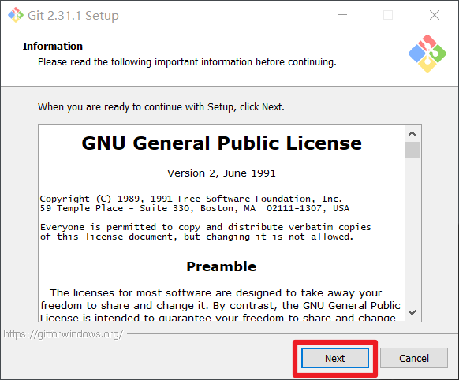

选择Git安装位置，要求是非中文并且没有空格的目录，然后下一步。

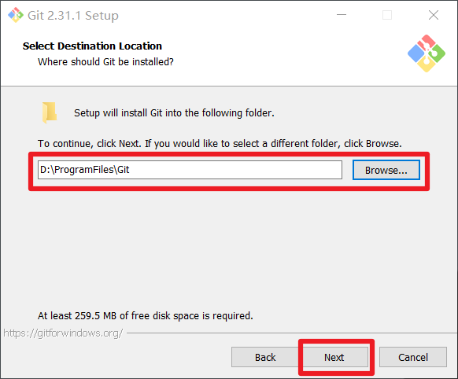

Git选项配置，推荐默认设置，然后下一步。

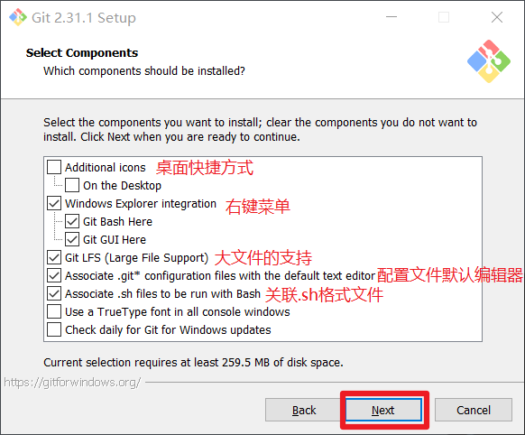

Git安装目录名，不用修改，直接点击下一步。

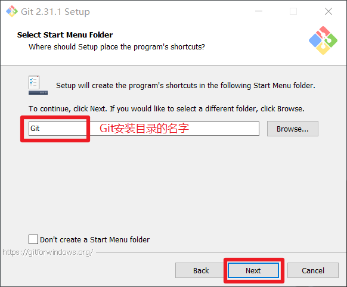

Git的默认编辑器，建议使用默认的Vim编辑器，然后点击下一步。

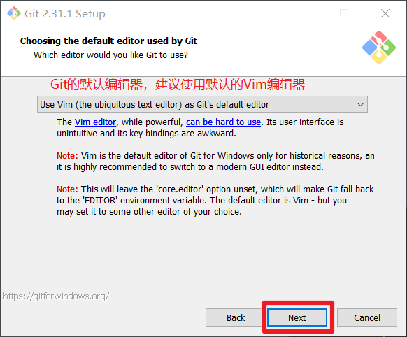

默认分支名设置，选择让Git决定，分支名默认为master，下一步。&#x20;

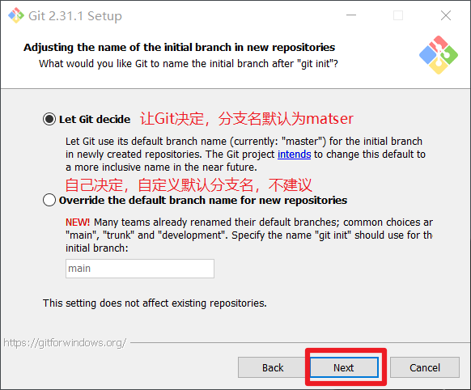

修改Git的环境变量，选第一个，不修改环境变量，只在Git Bash里使用Git。&#x20;

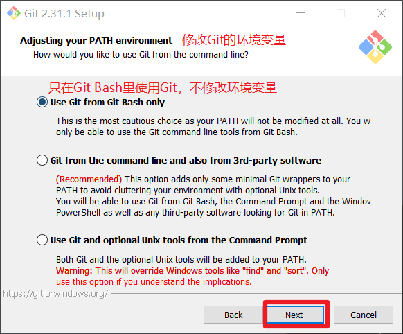

选择后台客户端连接协议，选默认值OpenSSL，然后下一步。&#x20;

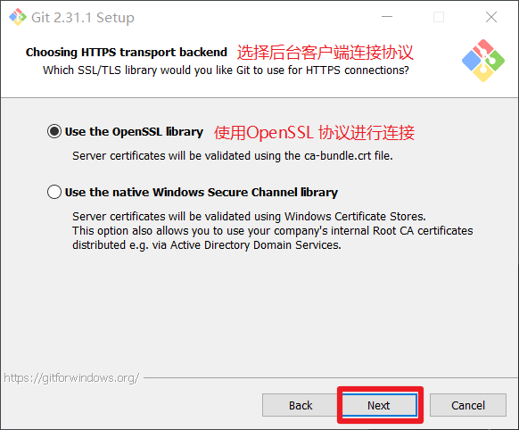

配置Git文件的行末换行符，Windows使用CRLF，Linux使用LF，选择第一个自动转换，然后继续下一步。&#x20;

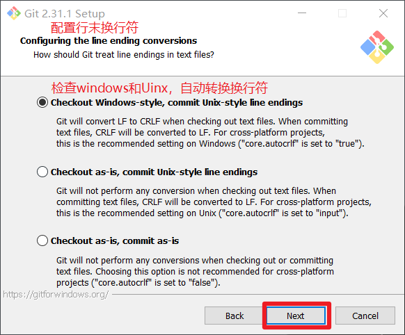

选择Git终端类型，选择默认的Git Bash终端，然后继续下一步。

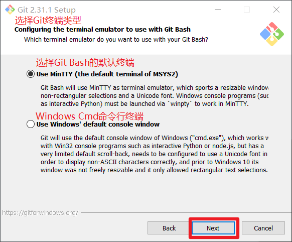

选择Git pull合并的模式，选择默认，然后下一步。

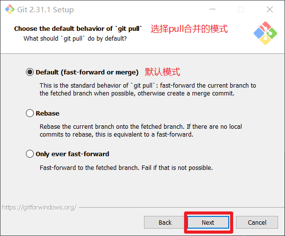

选择Git的凭据管理器，选择默认的跨平台的凭据管理器，然后下一步。

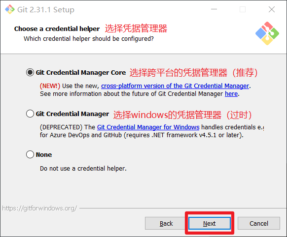

其他配置，选择默认设置，然后下一步。

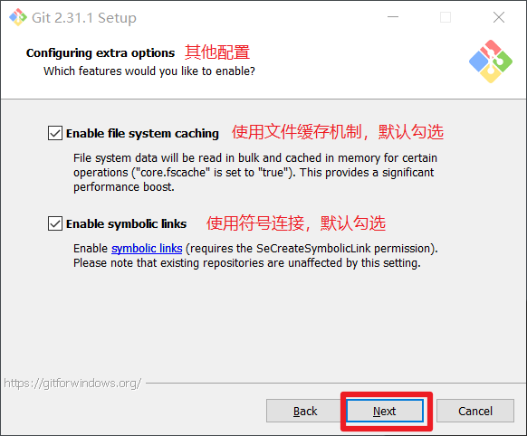

实验室功能，技术还不成熟，有已知的bug，不要勾选，然后点击右下角的Install按钮，开始安装Git。

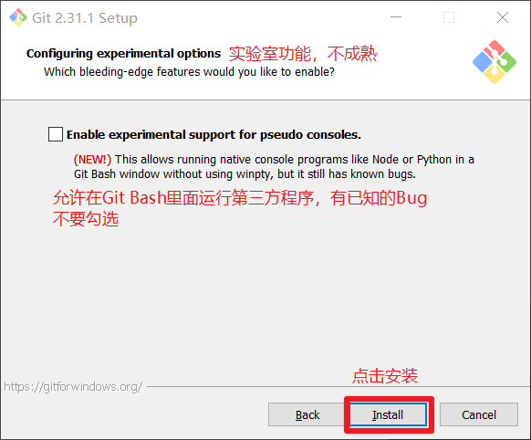

点击Finsh按钮，Git安装成功！

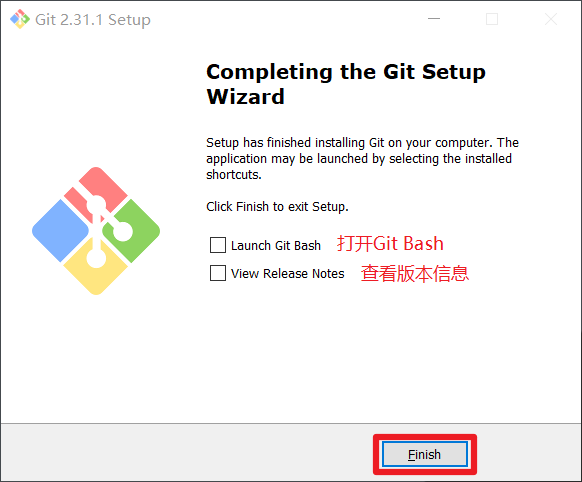

右键任意位置，在右键菜单里选择Git Bash Here即可打开Git Bash命令行终端。

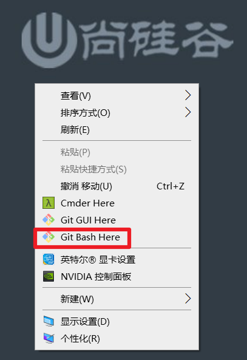

在Git Bash终端里输入git --version查看git版本，如图所示，说明Git安装成功。

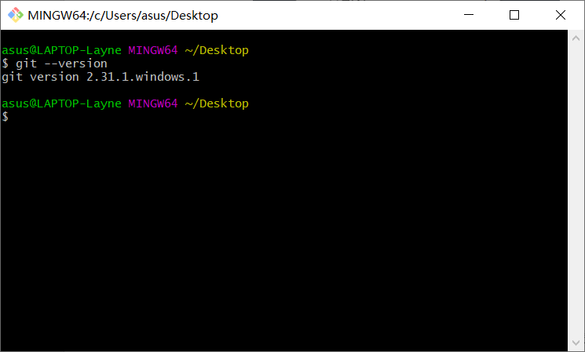
