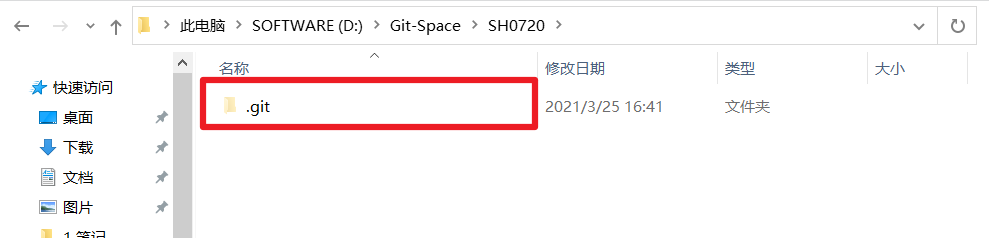

# 第三章 Git常用命令

| **命令名称**                               | **作用**       |
| -------------------------------------- | ------------ |
| git config --global user.name 用户名&#xA; | 设置用户签名&#xA;  |
| git config --global user.email 邮箱&#xA; | 设置用户邮箱&#xA;  |
| git init&#xA;                          | 初始化本地库&#xA;  |
| git status&#xA;                        | 查看本地库状态&#xA; |
| git add 文件名&#xA;                       | 添加到暂存区&#xA;  |
| git commit -m "日志信息" 文件名&#xA;          | 提交到本地库&#xA;  |
| git reflog&#xA;                        | 查看历史记录&#xA;  |
| git reset --hard 版本号&#xA;              | 版本穿梭&#xA;    |

## 3.1 设置用户签名

**1）基本语法**

git config --global user.name 用户名

git config --global user.email 邮箱

**2）案例实操**

全局范围的签名设置：

Layne\@LAPTOP-Layne MINGW64 /d/Git-Space/SH0720 (master)

\$ **git config --global user.name Layne**

Layne\@LAPTOP-Layne MINGW64 /d/Git-Space/SH0720 (master)

\$ **git config --global user.email <Layne@atguigu.com>**

Layne\@LAPTOP-Layne MINGW64 /d/Git-Space/SH0720 (master)

\$ cat \~/.gitconfig

\[user]

&#x9;name = Layne

&#x9;email = <Layne@atguigu.com>

说明：

签名的作用是区分不同操作者身份。用户的签名信息在每一个版本的提交信息中能够看到，以此确认本次提交是谁做的。Git首次安装必须设置一下用户签名，否则无法提交代码。

**※注意：** 这里设置用户签名和将来登录GitHub（或其他代码托管中心）的账号没有任何关系。

## 3.2 初始化本地库&#x20;

**1）基本语法**

**git init**

**2）案例实操**

Layne\@LAPTOP-Layne MINGW64 /d/Git-Space/SH0720

\$ **git init**

Initialized empty Git repository in D:/Git-Space/SH0720/.git/

Layne\@LAPTOP-Layne MINGW64 /d/Git-Space/SH0720 (master)

\$ ll -a

total 4

drwxr-xr-x 1 Layne 197609 0 11月 25 14:07 ./

drwxr-xr-x 1 Layne 197609 0 11月 25 14:07 ../

drwxr-xr-x 1 Layne 197609 0 11月 25 14:07 .git/   （.git 初始化的效果，生成git）

**3）结果查看**

## 3.3 查看本地库状态

**1）基本语法**

**git status**

**2）案例实操**

### 3.3.1 首次查看（工作区没有任何文件）

Layne\@LAPTOP-Layne MINGW64 /d/Git-Space/SH0720 (master)

\$ **git status**

On branch master

No commits yet

nothing to commit (create/copy files and use "git add" to track)

### 3.3.2 新增文件（hello.txt）

Layne\@LAPTOP-Layne MINGW64 /d/Git-Space/SH0720 (master)

\$ **vim hello.txt**

hello git! hello atguigu!

hello git! hello atguigu!

hello git! hello atguigu!

hello git! hello atguigu!

hello git! hello atguigu!

hello git! hello atguigu!

hello git! hello atguigu!

hello git! hello atguigu!

hello git! hello atguigu!

hello git! hello atguigu!

hello git! hello atguigu!

hello git! hello atguigu!

hello git! hello atguigu!

hello git! hello atguigu!

hello git! hello atguigu!

hello git! hello atguigu!

### 3.3.3 再次查看（检测到未追踪的文件）

Layne\@LAPTOP-Layne MINGW64 /d/Git-Space/SH0720 (master)

\$ **git status**

On branch master

No commits yet

Untracked files:

&#x20; (use "git add \<file>..." to include in what will be committed)

&#x20;       hello.txt

nothing added to commit but untracked files present (use "git add" to track)

## 3.4 添加暂存区

### 3.4.1 将工作区的文件添加到暂存区

**1）基本语法**

**git ****add**** 文件名**

**2）案例实操**

Layne\@LAPTOP-Layne MINGW64 /d/Git-Space/SH0720 (master)

\$ **git add hello.txt**

warning: LF will be replaced by CRLF in hello.txt.

The file will have its original line endings in your working directory.

### 3.4.2 查看状态（检测到暂存区有新文件）

Layne\@LAPTOP-Layne MINGW64 /d/Git-Space/SH0720 (master)

\$ **git status**

On branch master

No commits yet

Changes to be committed:

&#x20; (use "git rm --cached \<file>..." to unstage)

&#x20;       new file:   hello.txt

## 3.5 提交本地库

### 3.5.1 将暂存区的文件提交到本地库

**1）基本语法**

**git ****commit**** -m "日志信息" 文件名**

**2）案例实操**

Layne\@LAPTOP-Layne MINGW64 /d/Git-Space/SH0720 (master)

\$ **git commit -m "my first commit" hello.txt**

warning: LF will be replaced by CRLF in hello.txt.

The file will have its original line endings in your working directory.

\[master (root-commit) 86366fa] my first commit

&#x20;1 file changed, 16 insertions(+)

&#x20;create mode 100644 hello.txt

### 3.5.2 查看状态（没有文件需要提交）

Layne\@LAPTOP-Layne MINGW64 /d/Git-Space/SH0720 (master)

**\$ git status**

On branch master

nothing to commit, working tree clean

## 3.6 修改文件（hello.txt）

Layne\@LAPTOP-Layne MINGW64 /d/Git-Space/SH0720 (master)

\$ **vim hello.txt**

hello git! hello atguigu! 2222222222222

hello git! hello atguigu!

hello git! hello atguigu!

hello git! hello atguigu!

hello git! hello atguigu!

hello git! hello atguigu!

hello git! hello atguigu!

hello git! hello atguigu!

hello git! hello atguigu!

hello git! hello atguigu!

hello git! hello atguigu!

hello git! hello atguigu!

hello git! hello atguigu!

hello git! hello atguigu!

hello git! hello atguigu!

hello git! hello atguigu!

### 3.6.1 查看状态（检测到工作区有文件被修改）

Layne\@LAPTOP-Layne MINGW64 /d/Git-Space/SH0720 (master)

\$ **git status**

On branch master

Changes not staged for commit:

&#x20; (use "git add \<file>..." to update what will be committed)

&#x20; (use "git checkout -- \<file>..." to discard changes in working directory)

&#x20;       modified:   hello.txt

no changes added to commit (use "git add" and/or "git commit -a")

### 3.6.2 将修改的文件再次添加暂存区

Layne\@LAPTOP-Layne MINGW64 /d/Git-Space/SH0720 (master)

\$ **git add hello.txt**

warning: LF will be replaced by CRLF in hello.txt.

The file will have its original line endings in your working directory.

### 3.6.3 查看状态（工作区的修改添加到了暂存区）

Layne\@LAPTOP-Layne MINGW64 /d/Git-Space/SH0720 (master)

\$ **git status**

On branch master

Changes to be committed:

&#x20; (use "git reset HEAD \<file>..." to unstage)

&#x20;       modified:   hello.txt

### 3.6.4将暂存区的文件提交到本地库

Layne\@LAPTOP-Layne MINGW64 /d/Git-Space/SH0720 (master)

\$ **git commit -m "my second commit" hello.txt**

warning: LF will be replaced by CRLF in hello.txt.

The file will have its original line endings in your working directory.

\[master (root-commit) 86366fa] my secondcommit

&#x20;1 file changed, 16 insertions(+)

&#x20;create mode 100644 hello.txt

## 3.7 历史版本

### 3.7.1 查看历史版本

**1）基本语法**

**git reflog  查看版本信息**

**git log  查看版本详细信息**

**2）案例实操**

Layne\@LAPTOP-Layne MINGW64 /d/Git-Space/SH0720 (master)

\$ **git reflog**

087a1a7 (HEAD -> master) HEAD@{0}: commit: my third commit

ca8ded6 HEAD@{1}: commit: my second commit

86366fa HEAD@{2}: commit (initial): my first commit

### 3.7.2 版本穿梭

**1）基本语法**

**git reset --hard 版本号**

**2）案例实操**

\--首先查看当前的历史记录，可以看到当前是在087a1a7这个版本

Layne\@LAPTOP-Layne MINGW64 /d/Git-Space/SH0720 (master)

\$ **git reflog**

087a1a7 (HEAD -> master) HEAD@{0}: commit: my third commit

ca8ded6 HEAD@{1}: commit: my second commit

86366fa HEAD@{2}: commit (initial): my first commit

\--切换到86366fa版本，也就是我们第一次提交的版本

Layne\@LAPTOP-Layne MINGW64 /d/Git-Space/SH0720 (master)

\$ **git reset --hard 86366fa**

HEAD is now at 86366fa my first commit

\--切换完毕之后再查看历史记录，当前成功切换到了86366fa版本

Layne\@LAPTOP-Layne MINGW64 /d/Git-Space/SH0720 (master)

\$\*\* git reflog\*\*

86366fa (HEAD -> master) HEAD@{0}: reset: moving to 86366fa

087a1a7 HEAD@{1}: commit: my third commit

ca8ded6 HEAD@{2}: commit: my second commit

86366fa (HEAD -> master) HEAD@{3}: commit (initial): my first commit

\--然后查看文件hello.txt，发现文件内容已经变化

\$ cat hello.txt&#x20;

hello git! hello atguigu!

hello git! hello atguigu!

hello git! hello atguigu!

hello git! hello atguigu!

hello git! hello atguigu!

hello git! hello atguigu!

hello git! hello atguigu!

hello git! hello atguigu!

hello git! hello atguigu!

hello git! hello atguigu!

hello git! hello atguigu!

hello git! hello atguigu!

hello git! hello atguigu!

hello git! hello atguigu!

hello git! hello atguigu!

hello git! hello atguigu!

Git切换版本，底层其实是移动的HEAD指针。

